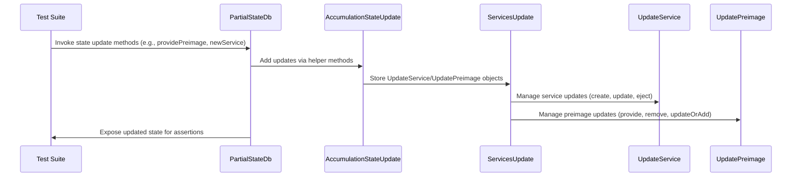

# Refactor `PartialStateDb`

## Pull Request by @tomusdrw

This PR changes the `AccumulationStateUpdate` and unifies the format of that update with `ServicesUpdate` that goes further into the DB.

Thanks to this it's now possible to re-create `PartialStateDb` between accumulate runs with some existing `ServicesUpdate` (i.e coming from previous accumulation round).

This is not an ideal solution, however it's there to attempt to pass all of the test vectors. We have better solutions planned for the (hopefully near) future but they would require a more serious refactor. Ideally we would have a `State` object that can have some "uncommited" `StateUpdate & ServicesUpdate` so that we can read from that state like from regular state. We should also improve the lookups in the services update (for instance, at least by introducing a `Map<ServiceId, *[]>` to quickly filter out by `serviceId`.


## Comment by @coderabbitai[bot]

<!-- This is an auto-generated comment: summarize by coderabbit.ai -->
<!-- This is an auto-generated comment: skip review by coderabbit.ai -->

> [!IMPORTANT]
> ## Review skipped
> 
> Auto incremental reviews are disabled on this repository.
> 
> Please check the settings in the CodeRabbit UI or the `.coderabbit.yaml` file in this repository. To trigger a single review, invoke the `@coderabbitai review` command.
> 
> You can disable this status message by setting the `reviews.review_status` to `false` in the CodeRabbit configuration file.

<!-- end of auto-generated comment: skip review by coderabbit.ai -->
<!-- walkthrough_start -->

<details>
<summary>📝 Walkthrough</summary>

<!-- This is an auto-generated comment: release notes by coderabbit.ai -->

## Summary by CodeRabbit

* **Refactor**
  * Internal state updates and related tests have been restructured for improved consistency and maintainability. State update handling now uses a unified, nested structure for service and preimage updates, with new helper methods and static factories to streamline operations.
* **New Features**
  * Added convenient getter properties for preimage update objects to enhance type safety and usability.
* **Style**
  * Updated test code to use new helper methods for constructing preimage update actions, improving clarity and consistency.

<!-- end of auto-generated comment: release notes by coderabbit.ai -->
## Walkthrough

The codebase underwent a structural refactor to unify and encapsulate service and preimage state updates under a new `services` property within state update objects. Flat arrays and ad hoc update structures were replaced by typed objects (`UpdateService`, `UpdatePreimage`) grouped under `ServicesUpdate`. Tests and methods were updated to use new factory methods and accessors, with no changes to core logic or control flow.

## Changes

| Files/Paths                                                     | Change Summary                                                                                   |
|-----------------------------------------------------------------|--------------------------------------------------------------------------------------------------|
| .../partial-state-db.ts, .../state-update.ts                    | Refactored to use `ServicesUpdate` for all service/preimage/storage updates; removed flat arrays.|
| .../partial-state-db.test.ts, .../in-memory-state.test.ts        | Updated tests to use new factory methods and nested `services` structure for assertions/inputs.  |
| .../state/state-update.ts                                       | Added getters to `UpdatePreimage`; improved type safety and documentation.                       |
| .../accumulate/accumulate.ts                                    | Simplified merging logic by using `services` property directly; removed unnecessary parameters.   |

## Sequence Diagram(s)



## Poem

> In the warren of code, we tidied each nest,  
> Grouped all our updates, put classes to the test.  
> Preimages and services, now neatly combined,  
> Factory methods and getters, so easy to find!  
> With structure and order, the state hops along—  
> This rabbit refactor is sturdy and strong! 🐇✨

</details>

<!-- walkthrough_end -->
<!-- internal state start -->


<!-- DwQgtGAEAqAWCWBnSTIEMB26CuAXA9mAOYCmGJATmriQCaQDG+Ats2bgFyQAOFk+AIwBWJBrngA3EsgEBPRvlqU0AgfFwA6NPEgQAfACgjoCEYDEZyAAUASpETZWaCrKNxU3bABsvkCiQBHbGlcABpIcVwvOkgAIhsSADM0MXw+AAMrZ3E0LwBlXGoSABEBdNj0DHoHAWZ1Gno5SGxESgiWFtoKAHdIAApbSAxHATaAFgBOACYASnD4DFwKRWwGaUZYTFJkAgjYEkh0gEEGBkdvanh8DAKigFVuWiL0yvpsDHhE+HX1ZES05jUSDddSwPYHdJ5SgSeBrRAPJ40F64Ta4FCLZRiZDMNIHJQkbheeQglHgyCIlRoVoaGD7SCAhaQIj4XL8RJ7VDYR5FFA7fCQMgqaJk/wMfyXa5sw5ZCg5fKFGilF6jXDdEhkdCnc5eCVYCjvZAtBZEewsA4kAAeSHEGBNkOhsOkCOe5OoaHCDgYYKpeyBTDqtsgiWWzHQPH8MPwLU1Z2YF3EkuW71oGjcdLQeFgaSG+BoO1RwIQwpRqEQ+C8eCuWFQGFzKCUuXmaNQCxoVRiu32Xm4PCpyFyvjOFH8iwiIUgUlSFEQNLgB0GrQoUn7/erGIo8FDiBoPdG/38YZxB/9vBI+wwiEkB38ySnvJQzEJJDYGJTtPNGBhl+uMUSeGwB6brw+BSC+uDIAsDAVkojDijaJpoIctxIvwwiiGiDBoNwQoHPg7JZl4tDGnE7z+nUuANBUkIKiQzooZg9D2kujrwtyKEUuEA74CCgbirQfwhhyyDbjyPqfCgaJqgeiH+EQFx8CJNA0kctBEQmGADrI4QogcGYotmDhENs4EChgmwYAwxFePg+AANZcgKiRfJZZAMMSoKMjp9gOnCzRsSQ4T7gKFpoI+wpNK2yy0KsxGIekACyWHAFCzFrAAkrQ4QAFQANoALp6C8276mIAEHLsgoCMKyTbm0XxeDQG6Bk06SLjC6W0OkqYGHOGxbOs2ihrsQHLFIZLmbQXixVUCgXtarnyHh9g0X5iLrCSCBYF5iCyLVzAeiQFHEdthSkEG2ZHteggtGiDGOc53yjopByAhppBgeiQb/oBjW6jO75fT45KHdoXirvQTAwV6/X9tJEigzh6Bol5wEwko9AAOLqAAEtgAiQHcNgADJcLAFHcIgHAAPRU0QoJ4xo/pUwAYhWTmyETKiIFTuCyNwJCjMOshU54PhU5MUzdfoxjgFAZD0EtemEKQ5BUA0CisOwXC8KhIhiFeMjyJDyiqOoWg6NLJhQO4EGrjgBDEGQyjq2RWt+GgvQOE4LiQE0xtUKbmjaLoYCGDLpgGNhDC2Wg2xU0IoXx6FYBZtuYCYT43OWo1GlTeI0gi9k8C5GAz1gLQAgaHmmjgRwBixA3BgWJARxpY7qtFNUjiAj7S3Q7a0hpuV44OOoBxBZkRe5MhJRlMCPpcmt9C7P4hIpHi8Cimir3wKLf2vOgiCLupyCSuki+dzPLzAfzsrfMJqzesg6TWXZXLY9aaSyOk4TpKj8DoysP4TcsdpA/0OBfBoKV2okDShgf44D0jkG6NAliiCSB6ygT5MBnEZqtQIFQUgLwNoxmkK0PkQwQgxBvpQfOhp2wZEgXQGeGg2poJpHkfmllnKaTrgYKARwgY3koK5dYuxz7+VoCw1+9luAf23F/YhIi/AEh1GsRo8gJFLxYWwuEGhTwgO2C8I0gZ0h0RIEAkghiSAvDYPpfi/QtFFAAPIUBUp1X+/gcRSEQf/JQ6QZipigAkRIIiLJiP5E4qBNENBMKkdguBCCD5ROYTE5BqC4RKIPKvNRMQWpxJ0dgmcuinT+UQMYy8pjzEZJsfSQ6WYHF9BSYgsUJBniBP4ZAEJYTfLiIKTEvxdBLHWPKcCZROT14aIgZIwpqVpD6OAYCIxQSulJB6RE6Z2iYkYPQswopWTryqMmb7TR/SiisKKRcuZiAEjeLoF1Tp3SRy9MiWcpSCjCG1Kkocte6iTmbMvjEkpxSCGgIeQYdx6gqyaQ9GaSA1kM4TmcMXKq61lGRRWH8oKJTIBpWKBQtAEh8AAJUfzTujABwUPSEsWQRxEA1Iyl1AG1d4X4DpgwA+fZaFVmQF47QWBWivXEBnIkZJEChQCr7PAZI4nLR5MVVYuAyr3lrL0cgtU3gMLDK1fZut0LhBvNEfWgYZJJBSAQz6XlkyUCJMRCk9JFAkC8LOOkQE0gmW+egWgQgboxBSEwCgRFbSipXs+ECBx3gtBiG62U4MvWMXMcMpZtS7pmP8jU8FAA5fk/dthjIPICGCuwvIsusuy8IlBlh8AmlNW04RsxMEWMsXwiRrLdAANz8AwCGuk9qFWlQPNhFEcamF1PscgT1uaOz8lyPAIgWASFeWQXKmg9hNj826uYSwgjfon3aGSJQUFnD7yWpabg7qYjZk8FVWEplIj3yMNm8gLqN5OS7aKnEREvhiPHMbA+MbwKdtrMFc9spL18GvVNDl7B1DyEPTqNWPL80HCnSmeujd+ERyjjHOOCdmBJ2YCnfAacRVZwtDnWddDC53xLmXCuVdKbodiE3bdbcVbOxiF7Hui12RTsQEPcknx2Q3nNWkfMEIZRyhnkqRgOoj77omWsQTW96SYF3vGKsUpW1AmcFQXa50FIrSYRO0Ey0SpKv8G8cVZ0lpprWhm5JibFlgr1ViJkSZ+aaqUIwmZQL9kcK4Z8WEvCjDWzpCkqRNFr7LFvrzFV3F0RQtnQALxiDCOKJxYwaeuDPcxGhnzcF5n0GYLw7rAesgPPg4oj5zvIPQTydJG39oISsmp6J/irSKHG5dOLWn72cAcGteT5CeEQJtO01TsEvEEJgiCixXm+fOcCq5MDWJrVGQsWqaAFbsiIlvD9ihPiyGIhFhl8D8DTYgy0cb7tPbYNc+BFZSbQGdbzOgAtmBQFTNGzduzRRntEIe3Nvpi33mXIMcm0Zat9h8BRJgVTHw97wUODI9+n8XCXcOIM2gAOwHvb08gPb6EiQrN6nYhphxSC4AAMIARHLgM7STVUqKWN8Zcr3OP3YWB14MLAAXRKW5c4F5jRlNEBLgL0xEcV4rjdnKgxqTReXSP6qMiwXjfsIkGQSVr/KanUqTuk5PFCU8Oozi79hNzwAQ6Kr0ohbJ/GzDssQnPrmfVO3565K2WK3PDZ1A+PWilu7eSQL3ejhdlOIaZ9I1O4K1NsgsNDYWDgQ5e4paM/hWckHhr4I39XeWCjYMvSJVPzE4+c6QZCLRSszTIOZP5nYGLCi/aE+nkB49VFPuyP7NBcelf1tcZATSgEgQATY3+PufG/3Ma49xATgSmawjfDcPJkg+AECkWy+6rUMNtYGZ6BuDhltvUFW30diKWmtMRFP2wDWBGCNuK/5fpCBTSFT5H1/n8Hz8Y/qxkP7yyt2CjTJGXW7wsSfyKiWEVWVTulz2QCmlsghG2zL1/1AXMQeSgAKDSBe2M3ewOGZ1ei+z2CTCIDBHd0F09w+RcxIVAMwM+WmzQixFv1+TtU3nQnxzQHkB3iRx5QP19lyEwCUzukoLOkrCmmS11A52QCa3mkWFFSAMQmXS7FvjHQpxSVp2HHYDN2RALBwK8iHFbxxW535HS0OEmzmViX8heAawhHD3W1K2HA4N4Kd3UlZXZRzF6CQOQGcJd1W33TILBwoKKQn3uXRC2x2zDG0zRHSG8PiWuXsL0xWSJhslkSlA/2QGZ1P3twM1MP8lxwAGkE8NBh80YU1+8LxfYkhcQgwBxiJ19o4t86RrUKBd8TR99OkoQpAqBfBoBnFihnENYwJ88GQ9QSAiBnAg0TRz02w5ReQHB1pTM4wGpd5hQcClptoJVwwUCzoNpGREJKkiBhRnoOdupnFOiBxtJGtzI81/BmtlUvJWxKBc4V0I1ddV4bj2AJDdhEJLpmgPh9xQw7peZPN0BuBgIUgwQTEJt00ptHNcjwCgd3MoxgSmj+dUlyDVtwFFMf9IxowicxB2DOC1NuCB8D5LwwojtiJR0lgN9jRN0WMW4GpnYkNi1e1RAEMT12Qz0L0FYrsb1oNFgoVB5OlqcB9IC7w+45Nn5JNi55QigZNGQ/4N9QFuY8MCMiMSNKUqZs5HjKN75qM5RS4aJy5K5wJjFJF90FgksxCIRg8XgTDjgtRFjdRct/J8tHwisStewqA7E2hqDINb0+JrgiRbFDtv0KAVl4p6ljd0gqd1D6czdisuAalMtVdcBElzdGQj15NJ4aNZTFQ54AD+QM8Nws8DhDDzstc+d/CQ9ltbCut0DIBIz7ETcGcElzs+glAH8NJ1IkyEl6AAAfIYbwLwGYXsuZFM94NMiswc4YHwKwrALMqUqePM2eM0pefdTI1EyLdEliUPaQYIv3VNYPPc4pIpEXdXAyLnc7J7DceGVdXPFs0vXHSvRAPoTYMbLgXHbGKkWAcIaIW0FELgO4AANjGFHMgCSLfjkXR1kDShoFDBnOHNK1UjoCpkU3WFPBxOfip2fIVCr33SGxyLWl7z1x4M6SAUkB5AfOV1Ulx3MT6GQXMSArhK2JIE9KQOnVkz7GlGXOkzKBvMovvKjMYiYTjM0LbP+AYpIG6HTLHJgQnMWHTPYpQqLy4uzOlOnhohk0AN130PYG8jmXa2MOLiIqKBqQsLWgbKbIaWfkyNwuoCr08TvxCF71/n3BwvAN/kGVcsOGcMQXSSm1/i5CICoCUAzV/mpIvBb0QVR24HASENBRENeKdXJVgM+kXJ4tzL4rXPJUANaEoV6GrJPIgPM2gJmiULaDSuxSMzKVTAbmY0wzACMGw2VIIzVNTlwHTk1O1IoFzkFO5jLiYQYzrnqvpNbnbg4y7m9h4z6gHn4x6nC0y21GdJojQLUonR9BEynE4qa3LAAVEhmjJMJCOwkmBx1N8COLeOkA+P12sAjCuBaCJCbFU1bH5RiEWPECfG8mwjVl0gcP0zug1wcU9CfkOACriN/hiJqXKQiqoCisoBhpR2SLRw+W/i8tGlH2QJGUQQKQkou1wUYmEJsRfXys9S8V9wPnQqmT2ONGFB1TiPDHwFixmqBIhGhrWruj2IJGPVXWpThsQBb1GV0w4PCAEFzDBGwiPmjS2ka1FPMzSBfXWvcMgHfJXWP1Ex9jSuiPdNkGK38ukr1oJsOCYG4FkGZhDD1o3Nj1CMKHCQEj5x0nyt2qmnXNuJuO6l6nSBNrNots9IfO6E2uko3Aog1F2G9uAOktmjLBdvJTdoOCaWBWr0YkioFoRrn0BJzQq3KnCz0izA3HEPUgAEVgh79EFjsnV0YbAbJcBEFs99qCFEBig3R4q8FeBJArdRi9kGagb/pepMKHrsRhKEdsBNIFBuBvh6BXp5AE927opWRhaAaZoe6Pa6R+6oxn5Wx8B2b/JLbc9whugEAvRZpOj1Z7j1wnijjN7tVt7LKDNxd97A67lMpD4yQHjerWQjjmc8Soh5Ao1n4b7nhupIV1IYUIhuhM6uUpSn8Oa8FM1pKSKyaw0pB6AYN/AnqX6dJN4voLIQG855BF82lpwCLCUDhRgNQagvZhsI7PYxSLMQ8jA0pHx3UJ1lEoI2k6s/IFMkGI1hhWhl4+Z1g0Hcr+QvJybkH1qBol7vhCIZwjBTjlAfALiUMrj1gjqppEh5AToeRR0rrWhFgJCmhISwx3ggsYgmJVs1q470QKMfB8GZoxHiJLNkxMA0RsxgxY4wJOMVoe6D4Kq+BFz5kjAt0GTd1mSRHWSj1EMSTT0LRQN1Yr08YoM71+rQtIBqdJTDglqnT1IXTb6mtaGG0VH6BedQx0g+gSkMo5LHQMpPTxFymikqm4RzFtJ+bBbPz5ZjRoBWnKB8oSsVkDy1aOVqLN6AGaA+hxA2BEBrJOAYBNwSA8hpnwLRnakSnMnHTssbhVrLCVl3EvHLghnhKqUsmNncnng65IBdBfKdbEyW51mdQcmtnLKDALmoAkEDamFGnSk1pwLjn7mqxTmkRnnLmvamafaWA+gSmuBfmVr7h/Ifm7mYWaA1rynasHLjwin90gDl036L7aGyoZhHluGIZJT1hMhoHLDkk4HugSLUGnVZA6qMMIAmrI4lTcNE5noqYFgwA2AjxZBDTzlq5hqmMxq2MnZfqpruMpQ+MBMWU/0FSuWeWv5+WlJBXTT5589bwCFOL0L0Ra1cIGC0Q84FH89Tw9H38n8OdSKSSSFSN91FJ1apxODDmu0yRQCSLFyAtRAgsRUtJ0AgZ8AtQNC7bUiLXR0Zt0ITNSR4dlcyj1dpHqhAsNHYpDh28/dynH4X6yWR9/Ep9/IZ9VJwFsx0hgi59EHfkqHbXxEnNWKFls2SBDbTKe8n8LKXE3FVIG2i3q3rENAxH63PSbiuFxApASdaRUAp10AnII2xU8WDw1i6QWUFhPATJJa+G/D99F8iQ1qgoP9JDwhnb67jpZaLxaHNM53rrLXw23Mr70Zgt1Y/GVDFB/ps1Zq81PVC1ypwnh5txXDYROIpa74B961/Hrglhywgw21O0vJP1vX+tB0ypRU3b56ZpG01heqVaEsw2DXYYDhNtbach1ZrCxxtxZGgnm4d0mSSSWS8Q2SeakMYm4nwMeBEnb0YM6FUnn2+N90uSwMeSmO+Tkm4t4NaPrXlF33LUEBCchMGWGqmXmrWWC5VSOXBrXTa5hWyPRWO51YuNnAZrpWFrlGYZrGopVg8DI6ANn4aU6U7gABmKYJOw4LlWUOBzo9XQSHqp4z9bweZAGN1+EjK1AbU9segRdWAfwUz3oN/NoGhO+aQLgdId82Aezl+MgIgFEJlOcfKyLohjPACGWlDNIAd64CYlWn8g+f81LsEbPe/YGfmKoYiSUJXVN6bdkJXc1KsaLJm2hX1pgTo2KIGFEMLpFZfRYQfLNkoxBEt3NtafNzqQJAGLLw0fKy0TYG6K8Q4RAEkL0CAooQY+fUkZXf93AZzygZEfkMgBwaSIGTCchXAkrqoaIN8YB6FWx8ITssUXeId/LzWEb27ji1SrR4Vaox1h9hxWzLt5NJlI4AqmAXo/o12UcVAP7+wbAIyEIQ9oEJXZZ5EAR4EKMTXUYB1Y8a4KQD4fS8SEKpEqh8x6pzqGkZ9i/Lsk0I/DlBtED5tcDhLVAXt3j3IRqOgSDy4wzgbeNKFMaO6WvAQ7OnD9cW8XSGaVm+wNAUJOLMHli6xcFYJ8jqJ8oqj4GSJjkkDbk/gXkpJ1jh9TpXZ+gLLw4BLm5r8n807pW3z1i+crHeTlU9lmiKmZTtaBjdIC3lSpkQ6RqFHFLlEG5mzuzjcjJ539Xt3Fqtl/DJTo0oa004VxquT6OVq1UlOqFa4Kmf1ZamgAvhFlVxjUa9Tia8V5H6aqVlR+asnIe9INgCgCvbBAFvHAO7EUMierhu5V1qZ3Ma+Y9H0vgVZ34C3edNFuX+gAcClTOC0zQXFOaItQ3YSpR+FBYbOoENex6kba7Mx56PLEZs8newf3AT0q+pXEpc8gk9V0lXJYL0zH7E7I/10xO5TYneltJgr6Qc9Or4NL6z0Jz9xELfNvnMg74bY8uhwXPupFsRD0u+HOVSiwHUAD9pm9hOSGBBJoGc5qFuckhozJBgD6u7IHFEcRwJNBv6chfYgP11TRcVenJcEs8Uta4c2k4RBYESnbwIQQevoNEP4CCCsFl44Wc/sP29KHRKAdJMjoyW14UIvIQnaQVKG47xMTeLHAUmx06TWVjcl4KfnQyQFxc26d5F6JQHAEwJIB5TR5l1i4A5QGUz9aFg81hZrQ8o+UD0NMy4DQA5mCzXMOBQSAOAGoyUdvuYJoDhAjg1OanHcHih3AiYRwaAGlGcSZoAA+gAFEbANgZxDYEKiQBAASYRY5byVFIwfM38H2CusZgwoXmEsHWCghpff5gEJICOC8oXg6QN4FwB+CIB1QoISELCERCohMQ+IUkJSFpDXeGVB0llnua1IFSCfBTonFgFVgS+wwooDMKL4h40+o1TDGHCtimRwiSsKvuSnh4zMqAnsbuDp3+T+wVAagIOBbFDgGA1hZEdQHEIASIA4h91aSnQDiEiRZQIcVYbLHJDAVVIEwAQBMAmC0BgKAADhIBAiJgAARjGAMAAArMBTQDWcGAoFAAOxAikRAABnBFAixgqgAEdMFoCJAxg7w8OFAGuG4Bbh/EB4Vnm+BqhaAcQ+WO8KAA -->

<!-- internal state end -->
<!-- tips_start -->

---


<details>
<summary>🪧 Tips</summary>

### Chat

There are 3 ways to chat with [CodeRabbit](https://coderabbit.ai?utm_source=oss&utm_medium=github&utm_campaign=FluffyLabs/typeberry&utm_content=492):

- Review comments: Directly reply to a review comment made by CodeRabbit. Example:
  - `I pushed a fix in commit <commit_id>, please review it.`
  - `Explain this complex logic.`
  - `Open a follow-up GitHub issue for this discussion.`
- Files and specific lines of code (under the "Files changed" tab): Tag `@coderabbitai` in a new review comment at the desired location with your query. Examples:
  - `@coderabbitai explain this code block.`
  -	`@coderabbitai modularize this function.`
- PR comments: Tag `@coderabbitai` in a new PR comment to ask questions about the PR branch. For the best results, please provide a very specific query, as very limited context is provided in this mode. Examples:
  - `@coderabbitai gather interesting stats about this repository and render them as a table. Additionally, render a pie chart showing the language distribution in the codebase.`
  - `@coderabbitai read src/utils.ts and explain its main purpose.`
  - `@coderabbitai read the files in the src/scheduler package and generate a class diagram using mermaid and a README in the markdown format.`
  - `@coderabbitai help me debug CodeRabbit configuration file.`

### Support

Need help? Create a ticket on our [support page](https://www.coderabbit.ai/contact-us/support) for assistance with any issues or questions.

Note: Be mindful of the bot's finite context window. It's strongly recommended to break down tasks such as reading entire modules into smaller chunks. For a focused discussion, use review comments to chat about specific files and their changes, instead of using the PR comments.

### CodeRabbit Commands (Invoked using PR comments)

- `@coderabbitai pause` to pause the reviews on a PR.
- `@coderabbitai resume` to resume the paused reviews.
- `@coderabbitai review` to trigger an incremental review. This is useful when automatic reviews are disabled for the repository.
- `@coderabbitai full review` to do a full review from scratch and review all the files again.
- `@coderabbitai summary` to regenerate the summary of the PR.
- `@coderabbitai generate sequence diagram` to generate a sequence diagram of the changes in this PR.
- `@coderabbitai resolve` resolve all the CodeRabbit review comments.
- `@coderabbitai configuration` to show the current CodeRabbit configuration for the repository.
- `@coderabbitai help` to get help.

### Other keywords and placeholders

- Add `@coderabbitai ignore` anywhere in the PR description to prevent this PR from being reviewed.
- Add `@coderabbitai summary` to generate the high-level summary at a specific location in the PR description.
- Add `@coderabbitai` anywhere in the PR title to generate the title automatically.

### Documentation and Community

- Visit our [Documentation](https://docs.coderabbit.ai) for detailed information on how to use CodeRabbit.
- Join our [Discord Community](http://discord.gg/coderabbit) to get help, request features, and share feedback.
- Follow us on [X/Twitter](https://twitter.com/coderabbitai) for updates and announcements.

</details>

<!-- tips_end -->


## Comment by @github-actions[bot]


<details>
<summary>View all</summary>

| File | Benchmark | Ops |  |
|------|-----------|-----|--|
| [bytes/hex-to.ts[0]](../blob/d1eefd902d3ad1c099ca546cd022c3b011c05d3a//_work/typeberry-runner-2/typeberry/typeberry/benchmarks/bytes/hex-to.ts) | number toString + padding | 318607.37 ±0.1% | fastest ✅ |
| [bytes/hex-to.ts[1]](../blob/d1eefd902d3ad1c099ca546cd022c3b011c05d3a//_work/typeberry-runner-2/typeberry/typeberry/benchmarks/bytes/hex-to.ts) | manual | 16439.24 ±0.22% | 94.84% slower |
| [math/switch.ts[0]](../blob/d1eefd902d3ad1c099ca546cd022c3b011c05d3a//_work/typeberry-runner-2/typeberry/typeberry/benchmarks/math/switch.ts) | switch | 253446031.25 ±7.39% | fastest ✅ |
| [math/switch.ts[1]](../blob/d1eefd902d3ad1c099ca546cd022c3b011c05d3a//_work/typeberry-runner-2/typeberry/typeberry/benchmarks/math/switch.ts) | if | 246561635.67 ±6.91% | 2.72% slower |
| [hash/index.ts[0]](../blob/d1eefd902d3ad1c099ca546cd022c3b011c05d3a//_work/typeberry-runner-2/typeberry/typeberry/benchmarks/hash/index.ts) | hash with numeric representation | 189.66 ±0.64% | 28.91% slower |
| [hash/index.ts[1]](../blob/d1eefd902d3ad1c099ca546cd022c3b011c05d3a//_work/typeberry-runner-2/typeberry/typeberry/benchmarks/hash/index.ts) | hash with string representation | 116.63 ±0.06% | 56.28% slower |
| [hash/index.ts[2]](../blob/d1eefd902d3ad1c099ca546cd022c3b011c05d3a//_work/typeberry-runner-2/typeberry/typeberry/benchmarks/hash/index.ts) | hash with symbol representation | 181.32 ±0.05% | 32.04% slower |
| [hash/index.ts[3]](../blob/d1eefd902d3ad1c099ca546cd022c3b011c05d3a//_work/typeberry-runner-2/typeberry/typeberry/benchmarks/hash/index.ts) | hash with uint8 representation | 165.26 ±0.04% | 38.06% slower |
| [hash/index.ts[4]](../blob/d1eefd902d3ad1c099ca546cd022c3b011c05d3a//_work/typeberry-runner-2/typeberry/typeberry/benchmarks/hash/index.ts) | hash with packed representation | 266.79 ±0.03% | fastest ✅ |
| [hash/index.ts[5]](../blob/d1eefd902d3ad1c099ca546cd022c3b011c05d3a//_work/typeberry-runner-2/typeberry/typeberry/benchmarks/hash/index.ts) | hash with bigint representation | 193.54 ±0.04% | 27.46% slower |
| [hash/index.ts[6]](../blob/d1eefd902d3ad1c099ca546cd022c3b011c05d3a//_work/typeberry-runner-2/typeberry/typeberry/benchmarks/hash/index.ts) | hash with uint32 representation | 205.28 ±0.08% | 23.06% slower |
| [logger/index.ts[0]](../blob/d1eefd902d3ad1c099ca546cd022c3b011c05d3a//_work/typeberry-runner-2/typeberry/typeberry/benchmarks/logger/index.ts) | console.log with string concat | 6694195.03 ±61.7% | fastest ✅ |
| [logger/index.ts[1]](../blob/d1eefd902d3ad1c099ca546cd022c3b011c05d3a//_work/typeberry-runner-2/typeberry/typeberry/benchmarks/logger/index.ts) | console.log with args | 921880.68 ±107.84% | 86.23% slower |
| [math/add_one_overflow.ts[0]](../blob/d1eefd902d3ad1c099ca546cd022c3b011c05d3a//_work/typeberry-runner-2/typeberry/typeberry/benchmarks/math/add_one_overflow.ts) | add and take modulus | 253313209.91 ±6.62% | fastest ✅ |
| [math/add_one_overflow.ts[1]](../blob/d1eefd902d3ad1c099ca546cd022c3b011c05d3a//_work/typeberry-runner-2/typeberry/typeberry/benchmarks/math/add_one_overflow.ts) | condition before calculation | 242709833.51 ±7.28% | 4.19% slower |
| [codec/decoding.ts[0]](../blob/d1eefd902d3ad1c099ca546cd022c3b011c05d3a//_work/typeberry-runner-2/typeberry/typeberry/benchmarks/codec/decoding.ts) | manual decode | 16327111.68 ±0.49% | 90.41% slower |
| [codec/decoding.ts[1]](../blob/d1eefd902d3ad1c099ca546cd022c3b011c05d3a//_work/typeberry-runner-2/typeberry/typeberry/benchmarks/codec/decoding.ts) | int32array decode | 166858201.11 ±3.07% | 1.98% slower |
| [codec/decoding.ts[2]](../blob/d1eefd902d3ad1c099ca546cd022c3b011c05d3a//_work/typeberry-runner-2/typeberry/typeberry/benchmarks/codec/decoding.ts) | dataview decode | 170233642.24 ±2.98% | fastest ✅ |
| [codec/encoding.ts[0]](../blob/d1eefd902d3ad1c099ca546cd022c3b011c05d3a//_work/typeberry-runner-2/typeberry/typeberry/benchmarks/codec/encoding.ts) | manual encode | 2556195.09 ±0.26% | 19.31% slower |
| [codec/encoding.ts[1]](../blob/d1eefd902d3ad1c099ca546cd022c3b011c05d3a//_work/typeberry-runner-2/typeberry/typeberry/benchmarks/codec/encoding.ts) | int32array encode | 3168081.66 ±0.33% | fastest ✅ |
| [codec/encoding.ts[2]](../blob/d1eefd902d3ad1c099ca546cd022c3b011c05d3a//_work/typeberry-runner-2/typeberry/typeberry/benchmarks/codec/encoding.ts) | dataview encode | 3167312.49 ±0.31% | 0.02% slower |
| [collections/map-set.ts[0]](../blob/d1eefd902d3ad1c099ca546cd022c3b011c05d3a//_work/typeberry-runner-2/typeberry/typeberry/benchmarks/collections/map-set.ts) | 2 gets + conditional set | 110942.36 ±0.06% | fastest ✅ |
| [collections/map-set.ts[1]](../blob/d1eefd902d3ad1c099ca546cd022c3b011c05d3a//_work/typeberry-runner-2/typeberry/typeberry/benchmarks/collections/map-set.ts) | 1 get 1 set | 61751.06 ±0.01% | 44.34% slower |
| [codec/bigint.decode.ts[0]](../blob/d1eefd902d3ad1c099ca546cd022c3b011c05d3a//_work/typeberry-runner-2/typeberry/typeberry/benchmarks/codec/bigint.decode.ts) | decode custom | 201485813.67 ±4.76% | fastest ✅ |
| [codec/bigint.decode.ts[1]](../blob/d1eefd902d3ad1c099ca546cd022c3b011c05d3a//_work/typeberry-runner-2/typeberry/typeberry/benchmarks/codec/bigint.decode.ts) | decode bigint | 83784004.04 ±2.53% | 58.42% slower |
| [codec/bigint.compare.ts[0]](../blob/d1eefd902d3ad1c099ca546cd022c3b011c05d3a//_work/typeberry-runner-2/typeberry/typeberry/benchmarks/codec/bigint.compare.ts) | compare custom | 264393791.66 ±5.91% | 2.98% slower |
| [codec/bigint.compare.ts[1]](../blob/d1eefd902d3ad1c099ca546cd022c3b011c05d3a//_work/typeberry-runner-2/typeberry/typeberry/benchmarks/codec/bigint.compare.ts) | compare bigint | 272514659.47 ±6.47% | fastest ✅ |
| [bytes/hex-from.ts[0]](../blob/d1eefd902d3ad1c099ca546cd022c3b011c05d3a//_work/typeberry-runner-2/typeberry/typeberry/benchmarks/bytes/hex-from.ts) | parse hex using `Number` with NaN checking | 121882.32 ±0.21% | 83.34% slower |
| [bytes/hex-from.ts[1]](../blob/d1eefd902d3ad1c099ca546cd022c3b011c05d3a//_work/typeberry-runner-2/typeberry/typeberry/benchmarks/bytes/hex-from.ts) | parse hex from char codes | 731710.51 ±0.23% | fastest ✅ |
| [bytes/hex-from.ts[2]](../blob/d1eefd902d3ad1c099ca546cd022c3b011c05d3a//_work/typeberry-runner-2/typeberry/typeberry/benchmarks/bytes/hex-from.ts) | parse hex from string nibbles | 479437.09 ±0.34% | 34.48% slower |
| [math/count-bits-u64.ts[0]](../blob/d1eefd902d3ad1c099ca546cd022c3b011c05d3a//_work/typeberry-runner-2/typeberry/typeberry/benchmarks/math/count-bits-u64.ts) | standard method | 4529140.28 ±0.3% | 95.29% slower |
| [math/count-bits-u64.ts[1]](../blob/d1eefd902d3ad1c099ca546cd022c3b011c05d3a//_work/typeberry-runner-2/typeberry/typeberry/benchmarks/math/count-bits-u64.ts) | magic | 96228356.52 ±1.33% | fastest ✅ |
| [math/count-bits-u32.ts[0]](../blob/d1eefd902d3ad1c099ca546cd022c3b011c05d3a//_work/typeberry-runner-2/typeberry/typeberry/benchmarks/math/count-bits-u32.ts) | standard method | 96363939.04 ±1.89% | 63.29% slower |
| [math/count-bits-u32.ts[1]](../blob/d1eefd902d3ad1c099ca546cd022c3b011c05d3a//_work/typeberry-runner-2/typeberry/typeberry/benchmarks/math/count-bits-u32.ts) | magic | 262526187.01 ±5.23% | fastest ✅ |
| [math/mul_overflow.ts[0]](../blob/d1eefd902d3ad1c099ca546cd022c3b011c05d3a//_work/typeberry-runner-2/typeberry/typeberry/benchmarks/math/mul_overflow.ts) | multiply and bring back to u32 | 264145574.82 ±5.99% | 0.4% slower |
| [math/mul_overflow.ts[1]](../blob/d1eefd902d3ad1c099ca546cd022c3b011c05d3a//_work/typeberry-runner-2/typeberry/typeberry/benchmarks/math/mul_overflow.ts) | multiply and take modulus | 265205338.26 ±5.69% | fastest ✅ |
| [codec/view_vs_object.ts[0]](../blob/d1eefd902d3ad1c099ca546cd022c3b011c05d3a//_work/typeberry-runner-2/typeberry/typeberry/benchmarks/codec/view_vs_object.ts) | Get the first field from Decoded | 38758.73 ±100.32% | 91.01% slower |
| [codec/view_vs_object.ts[1]](../blob/d1eefd902d3ad1c099ca546cd022c3b011c05d3a//_work/typeberry-runner-2/typeberry/typeberry/benchmarks/codec/view_vs_object.ts) | Get the first field from View | 87833.85 ±0.35% | 79.63% slower |
| [codec/view_vs_object.ts[2]](../blob/d1eefd902d3ad1c099ca546cd022c3b011c05d3a//_work/typeberry-runner-2/typeberry/typeberry/benchmarks/codec/view_vs_object.ts) | Get the first field as view from View | 98324.22 ±1.28% | 77.2% slower |
| [codec/view_vs_object.ts[3]](../blob/d1eefd902d3ad1c099ca546cd022c3b011c05d3a//_work/typeberry-runner-2/typeberry/typeberry/benchmarks/codec/view_vs_object.ts) | Get two fields from Decoded | 427499.11 ±0.08% | 0.88% slower |
| [codec/view_vs_object.ts[4]](../blob/d1eefd902d3ad1c099ca546cd022c3b011c05d3a//_work/typeberry-runner-2/typeberry/typeberry/benchmarks/codec/view_vs_object.ts) | Get two fields from View | 80837.73 ±0.21% | 81.26% slower |
| [codec/view_vs_object.ts[5]](../blob/d1eefd902d3ad1c099ca546cd022c3b011c05d3a//_work/typeberry-runner-2/typeberry/typeberry/benchmarks/codec/view_vs_object.ts) | Get two fields from materialized from View | 169840.47 ±0.19% | 60.62% slower |
| [codec/view_vs_object.ts[6]](../blob/d1eefd902d3ad1c099ca546cd022c3b011c05d3a//_work/typeberry-runner-2/typeberry/typeberry/benchmarks/codec/view_vs_object.ts) | Get two fields as views from View | 81033.55 ±0.16% | 81.21% slower |
| [codec/view_vs_object.ts[7]](../blob/d1eefd902d3ad1c099ca546cd022c3b011c05d3a//_work/typeberry-runner-2/typeberry/typeberry/benchmarks/codec/view_vs_object.ts) | Get only third field from Decoded | 431295.8 ±0.17% | fastest ✅ |
| [codec/view_vs_object.ts[8]](../blob/d1eefd902d3ad1c099ca546cd022c3b011c05d3a//_work/typeberry-runner-2/typeberry/typeberry/benchmarks/codec/view_vs_object.ts) | Get only third field from View | 101971.22 ±0.09% | 76.36% slower |
| [codec/view_vs_object.ts[9]](../blob/d1eefd902d3ad1c099ca546cd022c3b011c05d3a//_work/typeberry-runner-2/typeberry/typeberry/benchmarks/codec/view_vs_object.ts) | Get only third field as view from View | 101642.66 ±0.1% | 76.43% slower |
| [codec/view_vs_collection.ts[0]](../blob/d1eefd902d3ad1c099ca546cd022c3b011c05d3a//_work/typeberry-runner-2/typeberry/typeberry/benchmarks/codec/view_vs_collection.ts) | Get first element from Decoded | 26558.56 ±0.25% | 59.28% slower |
| [codec/view_vs_collection.ts[1]](../blob/d1eefd902d3ad1c099ca546cd022c3b011c05d3a//_work/typeberry-runner-2/typeberry/typeberry/benchmarks/codec/view_vs_collection.ts) | Get first element from View | 65217.32 ±0.32% | fastest ✅ |
| [codec/view_vs_collection.ts[2]](../blob/d1eefd902d3ad1c099ca546cd022c3b011c05d3a//_work/typeberry-runner-2/typeberry/typeberry/benchmarks/codec/view_vs_collection.ts) | Get 50th element from Decoded | 26695.03 ±0.27% | 59.07% slower |
| [codec/view_vs_collection.ts[3]](../blob/d1eefd902d3ad1c099ca546cd022c3b011c05d3a//_work/typeberry-runner-2/typeberry/typeberry/benchmarks/codec/view_vs_collection.ts) | Get 50th element from View | 37389.95 ±0.24% | 42.67% slower |
| [codec/view_vs_collection.ts[4]](../blob/d1eefd902d3ad1c099ca546cd022c3b011c05d3a//_work/typeberry-runner-2/typeberry/typeberry/benchmarks/codec/view_vs_collection.ts) | Get last element from Decoded | 26723.42 ±0.28% | 59.02% slower |
| [codec/view_vs_collection.ts[5]](../blob/d1eefd902d3ad1c099ca546cd022c3b011c05d3a//_work/typeberry-runner-2/typeberry/typeberry/benchmarks/codec/view_vs_collection.ts) | Get last element from View | 26395.22 ±0.35% | 59.53% slower |
| [collections/map_vs_sorted.ts[0]](../blob/d1eefd902d3ad1c099ca546cd022c3b011c05d3a//_work/typeberry-runner-2/typeberry/typeberry/benchmarks/collections/map_vs_sorted.ts) | Map | 309665.32 ±0.06% | fastest ✅ |
| [collections/map_vs_sorted.ts[1]](../blob/d1eefd902d3ad1c099ca546cd022c3b011c05d3a//_work/typeberry-runner-2/typeberry/typeberry/benchmarks/collections/map_vs_sorted.ts) | Map-array | 103278.54 ±0.03% | 66.65% slower |
| [collections/map_vs_sorted.ts[2]](../blob/d1eefd902d3ad1c099ca546cd022c3b011c05d3a//_work/typeberry-runner-2/typeberry/typeberry/benchmarks/collections/map_vs_sorted.ts) | Array | 33233.36 ±106.31% | 89.27% slower |
| [collections/map_vs_sorted.ts[3]](../blob/d1eefd902d3ad1c099ca546cd022c3b011c05d3a//_work/typeberry-runner-2/typeberry/typeberry/benchmarks/collections/map_vs_sorted.ts) | SortedArray | 198890.81 ±0.18% | 35.77% slower |
| [hash/blake2b.ts[0]](../blob/d1eefd902d3ad1c099ca546cd022c3b011c05d3a//_work/typeberry-runner-2/typeberry/typeberry/benchmarks/hash/blake2b.ts) | hasher with simple allocator | 0.046 ±0.95% | fastest ✅ |
| [hash/blake2b.ts[1]](../blob/d1eefd902d3ad1c099ca546cd022c3b011c05d3a//_work/typeberry-runner-2/typeberry/typeberry/benchmarks/hash/blake2b.ts) | hasher with page allocator | 0.045 ±3.21% | 2.17% slower |
| [bytes/compare.ts[0]](../blob/d1eefd902d3ad1c099ca546cd022c3b011c05d3a//_work/typeberry-runner-2/typeberry/typeberry/benchmarks/bytes/compare.ts) | Comparing Uint32 bytes | 20696.74 ±0.15% | 4.11% slower |
| [bytes/compare.ts[1]](../blob/d1eefd902d3ad1c099ca546cd022c3b011c05d3a//_work/typeberry-runner-2/typeberry/typeberry/benchmarks/bytes/compare.ts) | Comparing raw bytes | 21583.59 ±0.12% | fastest ✅ |
| [crypto/ed25519.ts[0]](../blob/d1eefd902d3ad1c099ca546cd022c3b011c05d3a//_work/typeberry-runner-2/typeberry/typeberry/benchmarks/crypto/ed25519.ts) | native crypto | 4.76 ±21.37% | 84.01% slower |
| [crypto/ed25519.ts[1]](../blob/d1eefd902d3ad1c099ca546cd022c3b011c05d3a//_work/typeberry-runner-2/typeberry/typeberry/benchmarks/crypto/ed25519.ts) | wasm lib | 10.65 ±0.03% | 64.23% slower |
| [crypto/ed25519.ts[2]](../blob/d1eefd902d3ad1c099ca546cd022c3b011c05d3a//_work/typeberry-runner-2/typeberry/typeberry/benchmarks/crypto/ed25519.ts) | wasm lib batch | 29.77 ±0.62% | fastest ✅ |
</details>


### Benchmarks summary: 63/63 OK ✅

<!-- thollander/actions-comment-pull-request "benchmarks" -->


## Comment by @coderabbitai[bot]

_⚠️ Potential issue_

**Address the TODO: Potential issue with provide/remove sequence.**

The TODO comment correctly identifies a potential issue. If both `provide` and `remove` operations occur for the same preimage within a single state update, using `findLast` will only consider the last operation. This could lead to incorrect state representation.

Consider implementing a more robust approach that tracks the full sequence of operations or validates that conflicting operations don't occur.


Would you like me to help design a solution that properly handles operation sequences?

<details>
<summary>🤖 Prompt for AI Agents</summary>

```
In packages/jam/jam-host-calls/externalities/partial-state-db.ts around lines
160 to 166, the current use of findLast to get the updated preimage only
considers the last operation, which can cause issues if both provide and remove
occur in the same state update. To fix this, refactor the code to process the
entire sequence of updates for the given serviceId and hash, applying each
operation in order to determine the final state accurately. This may involve
iterating over all relevant updates and maintaining a state flag or object that
reflects the net effect of all operations instead of just the last one.
```

</details>

<!-- fingerprinting:phantom:medusa:lion -->

<!-- This is an auto-generated comment by CodeRabbit -->
