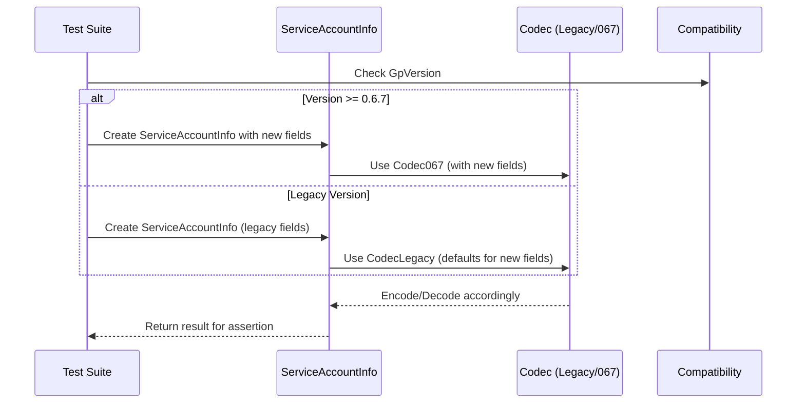

# Update Service Account to gp 0.6.7

## Pull Request by @DrEverr

Resolves: #483 


## Comment by @coderabbitai[bot]

<!-- This is an auto-generated comment: summarize by coderabbit.ai -->
<!-- This is an auto-generated comment: skip review by coderabbit.ai -->

> [!IMPORTANT]
> ## Review skipped
> 
> Auto incremental reviews are disabled on this repository.
> 
> Please check the settings in the CodeRabbit UI or the `.coderabbit.yaml` file in this repository. To trigger a single review, invoke the `@coderabbitai review` command.
> 
> You can disable this status message by setting the `reviews.review_status` to `false` in the CodeRabbit configuration file.

<!-- end of auto-generated comment: skip review by coderabbit.ai -->
<!-- walkthrough_start -->

<details>
<summary>📝 Walkthrough</summary>

<!-- This is an auto-generated comment: release notes by coderabbit.ai -->

## Summary by CodeRabbit

* **New Features**
  * Extended service account information to include additional metadata fields for storage, creation time, accumulation time, and parent service in supported protocol versions.

* **Bug Fixes**
  * Ensured backward compatibility for service account data across protocol versions.

* **Tests**
  * Updated and expanded tests to validate new fields and maintain compatibility with older protocol versions.

* **Chores**
  * Updated workflow configurations to include a new environment variable for versioning.

<!-- end of auto-generated comment: release notes by coderabbit.ai -->
## Walkthrough

The changes introduce version-aware handling of the `ServiceAccountInfo` structure, adding new fields for protocol version 0.6.7 and later. Codecs, tests, and test utilities are updated to support both legacy and extended formats. Additionally, a new environment variable `GP_VERSION` is set in several GitHub Actions workflows.

## Changes

| File(s)                                                                                  | Change Summary                                                                                                                                                                                                                          |
|------------------------------------------------------------------------------------------|-----------------------------------------------------------------------------------------------------------------------------------------------------------------------------------------------------------------------------------------|
| .github/workflows/src-build.yml<br>.github/workflows/src-test.yml<br>.github/workflows/vectors-javajam.yml | Added global environment variable `GP_VERSION` with value `0.6.7` to all jobs/steps in each workflow.                                                                                            |
| packages/core/codec/descriptors.ts                                                       | Added exported no-op descriptors `noopBig` (for `bigint`) and `noop` (for `number`), both representing zero-value codecs with zero size.                                                         |
| packages/jam/jam-host-calls/info.ts                                                      | Extended `codecServiceAccountInfoWithThresholdBalance` codec with four new fields: `gratisStorage`, `created`, `lastAccumulation`, and `parentService`. Updated imports and reference URLs.      |
| packages/jam/state/service.ts                                                            | Made `ServiceAccountInfo` version-aware: added new fields and codecs for version 0.6.7+, with backward compatibility. Updated static methods, constructor, and documentation references.          |
| packages/jam/state/service.test.ts                                                       | Updated tests to handle version-dependent structure and encoding of `ServiceAccountInfo`, including new fields and hex representations for version 0.6.7+.                                       |
| packages/jam/state-json/dump.test.ts                                                     | Added conditional assertions for expected root hash based on `GpVersion` compatibility, reflecting changes in `ServiceAccountInfo`.                                                              |
| packages/jam/state/test.utils.ts                                                         | Made test state data, root hash, and serialized account info version-aware, conditionally including new fields and values for version 0.6.7.                                                     |

## Sequence Diagram(s)



## Poem

> 🐇  
> A version hop, a field or four,  
> Service accounts now hold much more!  
> With codecs wise and tests that know,  
> Which fields to keep, which ones to show.  
> GP_VERSION set, the workflows cheer—  
> The rabbit’s code is crystal clear!  
>

</details>

<!-- walkthrough_end -->
<!-- internal state start -->


<!-- DwQgtGAEAqAWCWBnSTIEMB26CuAXA9mAOYCmGJATmriQCaQDG+Ats2bgFyQAOFk+AIwBWJBrngA3EsgEBPRvlqU0AgfFwA6NPEgQAfACgjoCEYDEZyAAUASpETZWaCrKNwSPbABsvkCiQBHbGlcSHFcLzpIACIAVW5aag8AZUoJeAYPAEEGJmwMUIJIIm5IAAYNADYNAHZoyAB3NGQHAWZ1Gno5MNgPbERKSAARCgBRKQo+Zs8fP0DgxFCMRwFBgBYATgBmFCxcXsgAMS9sADNT2QAZFUQAelxZbhJVyfl/bnxEdXwXDRgD2zoWi0fyIAbIJAODzLZgvSBrAAcWwANOgIRhaBkkl15PsPNEbNJ8F4pIguGZEVt6hh8DRdj0PEpEAwKPBuOJ8Bg/gA5fBAzEcjBoXxKXDaLzIH6MWCYUjIZweXj4dJKLokWSc+j7VD+U6UMiZP7uax2BiYSCrSDpEgNKLUSCwXC4bhk263IjqWDYAQaJjMW7HM4Xa4CO4PJ4vFy3bjeLy3TZbDRGfTGcBQMj0fCnHAEYhkZSdBSsdhcXj8YSicSki3yJhKKiqdRaHQpkxQOCoVDmtB4QikchUQt+tgFLhUBr2RzMZzybp15SNzTaXRgQyp0wGDQe/be24NH4Aa1OXnwDTuiAoDDAAmw8C8tA0smYXg4Bmi74MFkgWQAknmB9ik5OC4/DZgwMoYHKbgHPuFBHieE5MBgpzwEQ2CDvAnKQKcUp4pAADi6gABLet+YiYRgMi3vePAUPgmRgo00zYAkgHdGgwLwJB6CQOQE5kOkdEYCOoQSM48AqJEkAAAb4VYAD6ABqow2MkP4APLctJjSegyVrCsEMkVNUNTafaeEENwYCRFIvjSQJ2kHuqRoIMgAnwEJIn6aykkeKgNITkQJ4CMKXjyGgYl3r5YR8qFkBCII8oYvYNAujp2p7DBh7HqePJ8rSvR8OBsrSDFekJQIkBKChGDqBRiCoosJAuqiuGskQpAUMgtr+JA05KEmRifpYWReDQGGcsgRR4UoDBeM41D1aBkAkAAHh8FCFlKMYCF4GQrQUdXSEYvLkEm77RMmG5bp6u6wfBp7npeYA0Isj7Pq+F3Dd+f79gWUQOMB8hZtKJWINBHj3TliGcihaETVgOF8IRuAkZVOSCt1zGsYWRRcXN2BKDxfEHYJnJeWJPm7R4skKcpqkaVp9gkIUfLScZtRmYUByWdZJC2TJDmQE5sguV2nGCug3DcHtpVBYIoW4rFswVd1npcXpUMIXl/B4kVEFymVeEVVVJA1XVk2NalDX8HwuDtZ13X6n1HEkIN5gjWNBZLdNByzfNCOStma0bVtfA7XtDAHeE8DHQYp0kG+H4GBAYBGDdO4CHu2UIXcUhiD8iBgEIEVoCXzDvS+SeXV+v7/v99CA9OIEg8VkFx8aWunqTHnk+w3kSdTTu9SxiSFuxnHcWgvE2gP0W00pKlqZp2kNLpeFiScNMc6ZOsFYMbeG77kM593J4egwqIm9VXEW5RrV8E1aU9R4/Vu0N32jeNi2TUbfuiAHH+lFlohx+GHTwu19rsCOuDeOnJ35fRThubgaAGAHjQHKW4TB/BYMUKIW4TIWRsgIF1DQuAyTV0/r9fMg4AZThnMtQ+Hd9wzwnIQ1k7JC6NGdhxVUf8abzgYNpIUbBEAoMyFwaSNJ8DcAAEKoTMslKR+AZHST+LIgq6BeoshIIBfoXEiAySGNIIhnCKAaD4qvXS08vgAC8PAIAKMtexdEayvRcjTaRciFGm2ZBwkhKApqPCiEjGSagPQFEUfQdQbkMDzlRLNPBqJMCNwPGybC+RyK/ziv4XA6EsDbTorQbAmQ9JIUWJgUSBlt4YDUf8TxKjuDaXYcQqUqBwwhKlFIlYlAon2HgO0AOYU5h5IoMAwpigSmlTwuUsUTjN6GXZtpDWMSDrxNNuslJ9g0mlFOJkzGHiBi+NMSQty5xKySBIMM94oJ+40jADI72WEZaoJILAYk9YpoylCAaPBBDRB/MQDssqKFVpRBcXyBZpU177F4rFMQ2BhRVWoDY+A9j3afy9oHfhGzAGYxAetMBURtrekjtHGByZvzAiiKAzaURZmVJkl4+RRBtIgw6UYkx/ifjAHCVxXAehllYBEdIcRAi8FCPpNJcR6DMHYJILg2a/y/GtNIeQ6SKcqV8NpUOSaczQjKNUctDl0ljEqrMcAGELxBX0hFWI15MlBFCpkjKjB0hcE4MEcqk5hcyGIA1Yg1ORhXWYPLrccuYB3mLDAGaHwdwuI4T9Z9D8tdqEAULE3BhrcDYdwOAM0OKUkheSaG5VaNAMRRDxnEk4RNpL21kFkRAqQKDpEyD+WgfS60uEbdAAZJBkgnlwNpU4dFmB6WkgAAQ6ZGWQtxdr0QPNpENbt6mQFiDYS4cw9T+DiX5TKHhhz91CXhaSgjm2tpIDkPIBQfzIXwAAdU9HAUE7z7yyOFJgTI2lBFMWQKPQCRRp58UGBML4nIPEKFmqbc2ktQnSXPRkS9uR8D5FwLenCj79jPukK+2g775q7tXtMEOKSogT0xNxHC6FWHYVjveMkMkiAYSbSQt12kAAU2BKhrAAJSolPf4bEHHsBbAAEwKAwBMQs+juJdobYgXtbAB20mknxmS81FhXscN4IBwmxMSak1EGThi5M9r7cpodamtnSoVAUBDX7ICcf00hQz9BjMyXrY2+zJB22qcOR4Xhd9S3lq1H7FFKUKAlNGX0AY9A1oEy+LZWcuIDjSQTfgbSUbQixt8FWgmRNAuCiRag69oQ2BijHtPfw81cZ8kWD8N1qIdFALCH21EGnQgle0zViirW2DJOSigndoQBgtsQygJQh0UJmkFBi2uWKgFTT5DNABC18Ugx1cS8OpKoGHXEHHKAWRqX0BQlc2gS29KbfoD+09ErvNXpQzeu9mHYDYcQLh/Dn6SDOps2gt1dww0RqyzG0K8a71+ukq+SAuhGPMeSKx0gXBBEaC42sDV0OoACd0Z0JHEqUdid9JyKT7H2OrR45AAAvHoSAq1USeYU+ZwdPH0cw+kh1rTzAdOClx7NfHonCeScoLgEnZPKfU9p2EbtDOlNM5Z5job7BvM89EHzgXxPSfk6pzTunUvvPtuZ5QpBacDDLoB2gf0FSaDF0QJyAhjhuBkJCEmyhqb660MbvQluYEc2wONK9JY3ckICgoorNEo3yGXfWpWKIdFaQOmaLAC0zRiX7qLCg8Qag9oPCtJQMDXJIA/lCPmsByBpIAGEWDp/gJn9QshO34W4IpXPFFh2jrKZXxaNfs94DvDA9AyV+ilXLx3jPveHgaCQOxhvTeuoUQ0IpMo8lKjyRqMzsq4FRAHhQNmGZ6Fhs59n1hVA0kF9L5X3Un82YbeonUCtKPYh5RVXgOc/fsfQgynexFgxVVDKAdBu3KVe7ZDVDdDDLAAbl1kKjXgGBv06zBCFy+Q8B+FQi4iRTf3j3ezFnRHtkmQYgPzzzACUCeArScQECoDiUcUMQ1gshCDDyFznw/nm2/nxWPlxTWyWg20JTpUzG20gSjmgX21gQTnOmTiDRN1QVlXdTDUtwVVGwvUdzenIWTRrhGjTQbiAmbmBm9zBghjCFoPnGwi6SANK1AKIz/RxkrT5AgloCkj9Cry73kBhUT0xBf37lAw4J31S2n2b05G0jIEcEaieAYGfyxB8HkHcKwhP0X2X13lXXsjiTwVoGgBCFMIkwqScQCgk2D05FD1wymhYRcO3X7l6FWi/0gmQCIIzG/ywg3h8KwA3zQT+GSAGSigoDCjp1S391SMEBEDEEYEE0lhLXsBllv35WWxYTIM/V6AY1CQiKwCiLP1MmSQlhD18FO3o0c2kiY0WhYwa1IGkn42a06AOPU2aFwA5y5xbwG3oBs2G281Uy0T3XyztGSlvnEGFDRSMy+G4hJl6C8CeD4D2TiXxXY1M2l37UHROLBL1w7TUwaAQCklCX3j4DmJtjwmQIiSRUQGnB8EGAGFCBBnWPO0CUgEHwfFXWL02mHg8DWhC0sN2GeIZCOV+KuQBIyWBKWi2RmRH2rzH3kB7yz1jkQAg390gHPn2hiSuWzH8GnC4j/QoJKloCtjvF8F+Qo0MS2USXVJkmMMezQzvT6WaHD2/3mA+IeFRBvADwnFvw4jQHZEQL0MWGRTFBxTmLADEVEBCKjkWEiwRX8Dm09mYJ9mW3/jmnYN/k4NDi2wgTJQEKFJOngQgyYUlAwGGTQHOT6NFIMM1L5BpDK0UGf3CgwHkCu1thjN23CHkH9nDMohEMuiN2DQkP+3DXN1uBkLbLSEQ2dy+ldz+ndw0KzW0Pbl9wOH/TpH5SKSmWQDdLQCaF6msL2m4nZVS11JAINMYA0wuwcGljASf1cN3RkBZltDIFolpHomJHwKWlWCRgC2SnTPGkvKwh3j+EL35GQBJhkSKzWLo2JNBO2PEF2KoH2MOIGLoChPZ1yG6102uJdVs1wHuPJ1YLkPGxKz1OdJsXtii3QhIFRF1EiHIm4lpIzABk7NKVQtQ12CRmnElg1lRMgD0Ap3KCqFqCNBYQGCGySEg1EGgzeM5O0VAtoEkQr1mjKEqFMkMJRLqKYpMn73oBq0oFRHhIyET3xhrWmQOBJiJJtms2EtEEuBICIFQTrwkpWmcFlkksP3vkaAQHAlPJVFKmqh7DGkgAhX0i3mQGPWmI8C0tJO+MMXuRkS4oYGFO/ELXECjlICdEGGH1mmaVkBEVCOGQGHwojzwjtKVF4AkjpB/RCli34FT1FGj2ux5IcMfPz2NCxySG0nK3eWiXMLHnpJK2am5hpLLWIq1GCVkrKiVHsugycqqXcpMrwk0p/IhE8PVEeL6khAMSTL1V9ICRBng1IqQxMPXNQBIwrS1D5FUsJg8GGtnh8umEE1oE5GGQyvoOkD+CO2yKFDCJv2YFDnlF6iIs2rKh2qJhJg5RczqOQFBPpxhKhPp0UwhJU3Jy2TsM7z5NJPEEFNKlBIrweshqzzr3428Msr80gAr0on1WQF1H1DiW/22MeDtMGHXUuCer6AsK2p4HwH5TKjmOktqCqnokcHYCAT+HUgmFCg6IPR9wOmihCjQTnNoBjRKqki1O/3Brmqi16xBmQrIuAKcXS3LF6Ij1QTokYiVAICYF8DoqcLvzpPoHK1tLFADO/AWxYJDMZFW2xUjKJR4PLP4L23jM1WuqiE+s6qWrG0yAezXJwnfQGGaTNlvm4nlWZm9oC0VtCC0qTEO2OxoxNVXKexwlGDas2r8LTu1K9ovV9uTvwADu+3SkT0/NWNozOwYy2LhwR2+xAuxzAv4wgoYCgsFChIVzs2WrUU1QAFkCzTtrtNydTlrc79ScIftTcWyLcxQaAOyI6IcocYc3bG4p79obtdKGBRLxL3rv8Rry6kwMctUAZl6o5V6JV9LDKGBjLQlBaDxha08kba8i6+rvBQhXKoUPKpQd76M96F747Ld9pIqHyYrRBtIihkrKwgqk88qsIIbR9kayrv6oB4gGql7Foo4arFBHVQKQH4VMh2RB6I7h7QDU7Da+ker4AiZHLn736+BP7zsEHIBU6UFXrZl5qpQvgiAhRos3rq1dqaNjrTr5BzrNohT5797K6dj4c9iSAuBYhuMWcxGji6AuBgaLN5HWdG7m6KJlHGcVMDBocxG274LlquAAbDcxDx7pCp6FV/cUcYbhSlCXdVC3dAJM0vd/8oIDBjRkzdgcDilSkg874kVxSo5cqU929EbYGH6GbZJG86j59ojz8cVRSZDmY8lSgNY60ncBT7H/UmigivTFZXxNUKqk6R6MsVbwHQl5aPAfwhhyg4VrSeGmR+RAnvzy7Nj/ykBJGgKa7MG66O0G6ziLietfD+NDGELrKTzuSIneS4GGbj9T8Yi6lDgpRkSyqbZb9cltBgF0T2pUDfBWh8TloY7imDgGUnFpJoBRhkhoB5Ibmsgrn5IbB1J1JoBllkAAmvykqWYyp4FjUCjn8iinEP9E8fSDEKjmoqilysB4SWZCpwn7Cob5nS9FnEmP7aRY7V1RsJI9p7F6AblpA2bJZlyPBqn0Ao76QT0rmbm7noAHnRgzJJg0B5BUBPnVjhkXq+F9baSqB0Ky6Nitlp4Tx24+ASiyjDFYXU8YHZmompKFmEnYj1I9ZoCcKUBQgZTtn5SmEHxNUK9JhRVNRv8wXuJjbKtjlWQ1BuI8IyXyKlb5jqXbn7mrn3n0AJQ+Q2WciwiDb2rH7CtS6fLQTTgoSKAoS0BW6HjPKaZUXxK5jBp3AjlvHeEyqwBZyFQLRyDwJv9WDRSzXeKPjbEgFkkMzxArWDgbWKXlafSsL/AebHSRsrG/AVF38E8YLrXKAcXPitRaCUn2BWRLrGDAynkdmra2Dbbg4uDwEI4KyKVNVeR3HpkR32HOHsKg478oyHap2naY5oVnY34INmBe6sR8U02kIap6T+VKBbq62+W83cWWspbsbKk1YMoPMsm7GIc6yro1w2wDpMxswexcw+zAJD1Rw/BZyByQI5w8EGw1AlwWxVwDAf3hx1B5JyHEB5J/BrRbRaB5IKlNoVxv20xsJaBRKABGVBDYAAVlI9E1I42FI7WEo8qBIEqBUDQFI7KE44EEo5qFEwEFY5IFEwYAREqFI8qhTEQ6I+Q9wFQ/Oww/5ljmw/kgzAI6AA -->

<!-- internal state end -->
<!-- tips_start -->

---


<details>
<summary>🪧 Tips</summary>

### Chat

There are 3 ways to chat with [CodeRabbit](https://coderabbit.ai?utm_source=oss&utm_medium=github&utm_campaign=FluffyLabs/typeberry&utm_content=493):

- Review comments: Directly reply to a review comment made by CodeRabbit. Example:
  - `I pushed a fix in commit <commit_id>, please review it.`
  - `Explain this complex logic.`
  - `Open a follow-up GitHub issue for this discussion.`
- Files and specific lines of code (under the "Files changed" tab): Tag `@coderabbitai` in a new review comment at the desired location with your query. Examples:
  - `@coderabbitai explain this code block.`
- PR comments: Tag `@coderabbitai` in a new PR comment to ask questions about the PR branch. For the best results, please provide a very specific query, as very limited context is provided in this mode. Examples:
  - `@coderabbitai gather interesting stats about this repository and render them as a table. Additionally, render a pie chart showing the language distribution in the codebase.`
  - `@coderabbitai read src/utils.ts and explain its main purpose.`
  - `@coderabbitai read the files in the src/scheduler package and generate a class diagram using mermaid and a README in the markdown format.`

### Support

Need help? Create a ticket on our [support page](https://www.coderabbit.ai/contact-us/support) for assistance with any issues or questions.

### CodeRabbit Commands (Invoked using PR comments)

- `@coderabbitai pause` to pause the reviews on a PR.
- `@coderabbitai resume` to resume the paused reviews.
- `@coderabbitai review` to trigger an incremental review. This is useful when automatic reviews are disabled for the repository.
- `@coderabbitai full review` to do a full review from scratch and review all the files again.
- `@coderabbitai summary` to regenerate the summary of the PR.
- `@coderabbitai generate sequence diagram` to generate a sequence diagram of the changes in this PR.
- `@coderabbitai resolve` resolve all the CodeRabbit review comments.
- `@coderabbitai configuration` to show the current CodeRabbit configuration for the repository.
- `@coderabbitai help` to get help.

### Other keywords and placeholders

- Add `@coderabbitai ignore` anywhere in the PR description to prevent this PR from being reviewed.
- Add `@coderabbitai summary` to generate the high-level summary at a specific location in the PR description.
- Add `@coderabbitai` anywhere in the PR title to generate the title automatically.

### Documentation and Community

- Visit our [Documentation](https://docs.coderabbit.ai) for detailed information on how to use CodeRabbit.
- Join our [Discord Community](http://discord.gg/coderabbit) to get help, request features, and share feedback.
- Follow us on [X/Twitter](https://twitter.com/coderabbitai) for updates and announcements.

</details>

<!-- tips_end -->


## Comment by @github-actions[bot]


<details>
<summary>View all</summary>

| File | Benchmark | Ops |  |
|------|-----------|-----|--|
| [bytes/hex-to.ts[0]](../blob/4d375f3561d1a43c378a6c599f7b169015593dda//_work/typeberry-1/typeberry/typeberry/benchmarks/bytes/hex-to.ts) | number toString + padding | 328203.95 ±0.09% | fastest ✅ |
| [bytes/hex-to.ts[1]](../blob/4d375f3561d1a43c378a6c599f7b169015593dda//_work/typeberry-1/typeberry/typeberry/benchmarks/bytes/hex-to.ts) | manual | 16425.29 ±0.17% | 95% slower |
| [codec/bigint.compare.ts[0]](../blob/4d375f3561d1a43c378a6c599f7b169015593dda//_work/typeberry-1/typeberry/typeberry/benchmarks/codec/bigint.compare.ts) | compare custom | 278014617.95 ±4.25% | fastest ✅ |
| [codec/bigint.compare.ts[1]](../blob/4d375f3561d1a43c378a6c599f7b169015593dda//_work/typeberry-1/typeberry/typeberry/benchmarks/codec/bigint.compare.ts) | compare bigint | 273021782.93 ±4.23% | 1.8% slower |
| [codec/bigint.decode.ts[0]](../blob/4d375f3561d1a43c378a6c599f7b169015593dda//_work/typeberry-1/typeberry/typeberry/benchmarks/codec/bigint.decode.ts) | decode custom | 176746157.66 ±2.4% | fastest ✅ |
| [codec/bigint.decode.ts[1]](../blob/4d375f3561d1a43c378a6c599f7b169015593dda//_work/typeberry-1/typeberry/typeberry/benchmarks/codec/bigint.decode.ts) | decode bigint | 110139433.99 ±2.17% | 37.68% slower |
| [codec/decoding.ts[0]](../blob/4d375f3561d1a43c378a6c599f7b169015593dda//_work/typeberry-1/typeberry/typeberry/benchmarks/codec/decoding.ts) | manual decode | 23167541.6 ±0.52% | 86.28% slower |
| [codec/decoding.ts[1]](../blob/4d375f3561d1a43c378a6c599f7b169015593dda//_work/typeberry-1/typeberry/typeberry/benchmarks/codec/decoding.ts) | int32array decode | 168580546.57 ±2.73% | 0.18% slower |
| [codec/decoding.ts[2]](../blob/4d375f3561d1a43c378a6c599f7b169015593dda//_work/typeberry-1/typeberry/typeberry/benchmarks/codec/decoding.ts) | dataview decode | 168886517.25 ±2.5% | fastest ✅ |
| [codec/encoding.ts[0]](../blob/4d375f3561d1a43c378a6c599f7b169015593dda//_work/typeberry-1/typeberry/typeberry/benchmarks/codec/encoding.ts) | manual encode | 3054954.67 ±0.19% | 16.54% slower |
| [codec/encoding.ts[1]](../blob/4d375f3561d1a43c378a6c599f7b169015593dda//_work/typeberry-1/typeberry/typeberry/benchmarks/codec/encoding.ts) | int32array encode | 3660444.51 ±0.14% | fastest ✅ |
| [codec/encoding.ts[2]](../blob/4d375f3561d1a43c378a6c599f7b169015593dda//_work/typeberry-1/typeberry/typeberry/benchmarks/codec/encoding.ts) | dataview encode | 3582638.9 ±0.55% | 2.13% slower |
| [collections/map-set.ts[0]](../blob/4d375f3561d1a43c378a6c599f7b169015593dda//_work/typeberry-1/typeberry/typeberry/benchmarks/collections/map-set.ts) | 2 gets + conditional set | 119806.19 ±0.48% | fastest ✅ |
| [collections/map-set.ts[1]](../blob/4d375f3561d1a43c378a6c599f7b169015593dda//_work/typeberry-1/typeberry/typeberry/benchmarks/collections/map-set.ts) | 1 get 1 set | 62064.24 ±0.03% | 48.2% slower |
| [hash/index.ts[0]](../blob/4d375f3561d1a43c378a6c599f7b169015593dda//_work/typeberry-1/typeberry/typeberry/benchmarks/hash/index.ts) | hash with numeric representation | 191.96 ±0.32% | 27.65% slower |
| [hash/index.ts[1]](../blob/4d375f3561d1a43c378a6c599f7b169015593dda//_work/typeberry-1/typeberry/typeberry/benchmarks/hash/index.ts) | hash with string representation | 118.17 ±0.53% | 55.46% slower |
| [hash/index.ts[2]](../blob/4d375f3561d1a43c378a6c599f7b169015593dda//_work/typeberry-1/typeberry/typeberry/benchmarks/hash/index.ts) | hash with symbol representation | 185.64 ±0.03% | 30.03% slower |
| [hash/index.ts[3]](../blob/4d375f3561d1a43c378a6c599f7b169015593dda//_work/typeberry-1/typeberry/typeberry/benchmarks/hash/index.ts) | hash with uint8 representation | 165.79 ±0.05% | 37.52% slower |
| [hash/index.ts[4]](../blob/4d375f3561d1a43c378a6c599f7b169015593dda//_work/typeberry-1/typeberry/typeberry/benchmarks/hash/index.ts) | hash with packed representation | 265.33 ±0.3% | fastest ✅ |
| [hash/index.ts[5]](../blob/4d375f3561d1a43c378a6c599f7b169015593dda//_work/typeberry-1/typeberry/typeberry/benchmarks/hash/index.ts) | hash with bigint representation | 182.51 ±0.98% | 31.21% slower |
| [hash/index.ts[6]](../blob/4d375f3561d1a43c378a6c599f7b169015593dda//_work/typeberry-1/typeberry/typeberry/benchmarks/hash/index.ts) | hash with uint32 representation | 203.35 ±0.42% | 23.36% slower |
| [bytes/hex-from.ts[0]](../blob/4d375f3561d1a43c378a6c599f7b169015593dda//_work/typeberry-1/typeberry/typeberry/benchmarks/bytes/hex-from.ts) | parse hex using `Number` with NaN checking | 146025.49 ±0.14% | 83.87% slower |
| [bytes/hex-from.ts[1]](../blob/4d375f3561d1a43c378a6c599f7b169015593dda//_work/typeberry-1/typeberry/typeberry/benchmarks/bytes/hex-from.ts) | parse hex from char codes | 905425.89 ±0.08% | fastest ✅ |
| [bytes/hex-from.ts[2]](../blob/4d375f3561d1a43c378a6c599f7b169015593dda//_work/typeberry-1/typeberry/typeberry/benchmarks/bytes/hex-from.ts) | parse hex from string nibbles | 559010.79 ±0.23% | 38.26% slower |
| [logger/index.ts[0]](../blob/4d375f3561d1a43c378a6c599f7b169015593dda//_work/typeberry-1/typeberry/typeberry/benchmarks/logger/index.ts) | console.log with string concat | 7125880.32 ±58% | fastest ✅ |
| [logger/index.ts[1]](../blob/4d375f3561d1a43c378a6c599f7b169015593dda//_work/typeberry-1/typeberry/typeberry/benchmarks/logger/index.ts) | console.log with args | 1053588.44 ±85.81% | 85.21% slower |
| [math/add_one_overflow.ts[0]](../blob/4d375f3561d1a43c378a6c599f7b169015593dda//_work/typeberry-1/typeberry/typeberry/benchmarks/math/add_one_overflow.ts) | add and take modulus | 216061628.08 ±29.36% | 20.2% slower |
| [math/add_one_overflow.ts[1]](../blob/4d375f3561d1a43c378a6c599f7b169015593dda//_work/typeberry-1/typeberry/typeberry/benchmarks/math/add_one_overflow.ts) | condition before calculation | 270741152.52 ±4.27% | fastest ✅ |
| [math/count-bits-u32.ts[0]](../blob/4d375f3561d1a43c378a6c599f7b169015593dda//_work/typeberry-1/typeberry/typeberry/benchmarks/math/count-bits-u32.ts) | standard method | 104931096.51 ±1.72% | 58.86% slower |
| [math/count-bits-u32.ts[1]](../blob/4d375f3561d1a43c378a6c599f7b169015593dda//_work/typeberry-1/typeberry/typeberry/benchmarks/math/count-bits-u32.ts) | magic | 255085386.51 ±6.13% | fastest ✅ |
| [math/count-bits-u64.ts[0]](../blob/4d375f3561d1a43c378a6c599f7b169015593dda//_work/typeberry-1/typeberry/typeberry/benchmarks/math/count-bits-u64.ts) | standard method | 3969373.82 ±0.23% | 95.73% slower |
| [math/count-bits-u64.ts[1]](../blob/4d375f3561d1a43c378a6c599f7b169015593dda//_work/typeberry-1/typeberry/typeberry/benchmarks/math/count-bits-u64.ts) | magic | 93030268.23 ±1% | fastest ✅ |
| [math/mul_overflow.ts[0]](../blob/4d375f3561d1a43c378a6c599f7b169015593dda//_work/typeberry-1/typeberry/typeberry/benchmarks/math/mul_overflow.ts) | multiply and bring back to u32 | 272028620.59 ±5.28% | fastest ✅ |
| [math/mul_overflow.ts[1]](../blob/4d375f3561d1a43c378a6c599f7b169015593dda//_work/typeberry-1/typeberry/typeberry/benchmarks/math/mul_overflow.ts) | multiply and take modulus | 264581581.69 ±5.62% | 2.74% slower |
| [math/switch.ts[0]](../blob/4d375f3561d1a43c378a6c599f7b169015593dda//_work/typeberry-1/typeberry/typeberry/benchmarks/math/switch.ts) | switch | 271027592.19 ±5.37% | 1.38% slower |
| [math/switch.ts[1]](../blob/4d375f3561d1a43c378a6c599f7b169015593dda//_work/typeberry-1/typeberry/typeberry/benchmarks/math/switch.ts) | if | 274822366.44 ±4.87% | fastest ✅ |
| [codec/view_vs_object.ts[0]](../blob/4d375f3561d1a43c378a6c599f7b169015593dda//_work/typeberry-1/typeberry/typeberry/benchmarks/codec/view_vs_object.ts) | Get the first field from Decoded | 448664.46 ±0.21% | fastest ✅ |
| [codec/view_vs_object.ts[1]](../blob/4d375f3561d1a43c378a6c599f7b169015593dda//_work/typeberry-1/typeberry/typeberry/benchmarks/codec/view_vs_object.ts) | Get the first field from View | 104303.86 ±0.07% | 76.75% slower |
| [codec/view_vs_object.ts[2]](../blob/4d375f3561d1a43c378a6c599f7b169015593dda//_work/typeberry-1/typeberry/typeberry/benchmarks/codec/view_vs_object.ts) | Get the first field as view from View | 104127.36 ±0.09% | 76.79% slower |
| [codec/view_vs_object.ts[3]](../blob/4d375f3561d1a43c378a6c599f7b169015593dda//_work/typeberry-1/typeberry/typeberry/benchmarks/codec/view_vs_object.ts) | Get two fields from Decoded | 446316.82 ±0.14% | 0.52% slower |
| [codec/view_vs_object.ts[4]](../blob/4d375f3561d1a43c378a6c599f7b169015593dda//_work/typeberry-1/typeberry/typeberry/benchmarks/codec/view_vs_object.ts) | Get two fields from View | 82978.24 ±0.59% | 81.51% slower |
| [codec/view_vs_object.ts[5]](../blob/4d375f3561d1a43c378a6c599f7b169015593dda//_work/typeberry-1/typeberry/typeberry/benchmarks/codec/view_vs_object.ts) | Get two fields from materialized from View | 173707.28 ±0.15% | 61.28% slower |
| [codec/view_vs_object.ts[6]](../blob/4d375f3561d1a43c378a6c599f7b169015593dda//_work/typeberry-1/typeberry/typeberry/benchmarks/codec/view_vs_object.ts) | Get two fields as views from View | 83159.6 ±0.12% | 81.47% slower |
| [codec/view_vs_object.ts[7]](../blob/4d375f3561d1a43c378a6c599f7b169015593dda//_work/typeberry-1/typeberry/typeberry/benchmarks/codec/view_vs_object.ts) | Get only third field from Decoded | 447708.42 ±0.29% | 0.21% slower |
| [codec/view_vs_object.ts[8]](../blob/4d375f3561d1a43c378a6c599f7b169015593dda//_work/typeberry-1/typeberry/typeberry/benchmarks/codec/view_vs_object.ts) | Get only third field from View | 103767.99 ±0.21% | 76.87% slower |
| [codec/view_vs_object.ts[9]](../blob/4d375f3561d1a43c378a6c599f7b169015593dda//_work/typeberry-1/typeberry/typeberry/benchmarks/codec/view_vs_object.ts) | Get only third field as view from View | 103456.47 ±0.11% | 76.94% slower |
| [codec/view_vs_collection.ts[0]](../blob/4d375f3561d1a43c378a6c599f7b169015593dda//_work/typeberry-1/typeberry/typeberry/benchmarks/codec/view_vs_collection.ts) | Get first element from Decoded | 27450.57 ±0.13% | 59.23% slower |
| [codec/view_vs_collection.ts[1]](../blob/4d375f3561d1a43c378a6c599f7b169015593dda//_work/typeberry-1/typeberry/typeberry/benchmarks/codec/view_vs_collection.ts) | Get first element from View | 67324.41 ±0.13% | fastest ✅ |
| [codec/view_vs_collection.ts[2]](../blob/4d375f3561d1a43c378a6c599f7b169015593dda//_work/typeberry-1/typeberry/typeberry/benchmarks/codec/view_vs_collection.ts) | Get 50th element from Decoded | 27390.58 ±0.31% | 59.32% slower |
| [codec/view_vs_collection.ts[3]](../blob/4d375f3561d1a43c378a6c599f7b169015593dda//_work/typeberry-1/typeberry/typeberry/benchmarks/codec/view_vs_collection.ts) | Get 50th element from View | 37668.59 ±0.15% | 44.05% slower |
| [codec/view_vs_collection.ts[4]](../blob/4d375f3561d1a43c378a6c599f7b169015593dda//_work/typeberry-1/typeberry/typeberry/benchmarks/codec/view_vs_collection.ts) | Get last element from Decoded | 27353.9 ±0.25% | 59.37% slower |
| [codec/view_vs_collection.ts[5]](../blob/4d375f3561d1a43c378a6c599f7b169015593dda//_work/typeberry-1/typeberry/typeberry/benchmarks/codec/view_vs_collection.ts) | Get last element from View | 26599.9 ±0.31% | 60.49% slower |
| [bytes/compare.ts[0]](../blob/4d375f3561d1a43c378a6c599f7b169015593dda//_work/typeberry-1/typeberry/typeberry/benchmarks/bytes/compare.ts) | Comparing Uint32 bytes | 21129.35 ±0.2% | 4.15% slower |
| [bytes/compare.ts[1]](../blob/4d375f3561d1a43c378a6c599f7b169015593dda//_work/typeberry-1/typeberry/typeberry/benchmarks/bytes/compare.ts) | Comparing raw bytes | 22043.36 ±0.08% | fastest ✅ |
| [hash/blake2b.ts[0]](../blob/4d375f3561d1a43c378a6c599f7b169015593dda//_work/typeberry-1/typeberry/typeberry/benchmarks/hash/blake2b.ts) | hasher with simple allocator | 0.046 ±0.69% | fastest ✅ |
| [hash/blake2b.ts[1]](../blob/4d375f3561d1a43c378a6c599f7b169015593dda//_work/typeberry-1/typeberry/typeberry/benchmarks/hash/blake2b.ts) | hasher with page allocator | 0.045 ±0.93% | 2.17% slower |
| [collections/map_vs_sorted.ts[0]](../blob/4d375f3561d1a43c378a6c599f7b169015593dda//_work/typeberry-1/typeberry/typeberry/benchmarks/collections/map_vs_sorted.ts) | Map | 227615.92 ±0.17% | fastest ✅ |
| [collections/map_vs_sorted.ts[1]](../blob/4d375f3561d1a43c378a6c599f7b169015593dda//_work/typeberry-1/typeberry/typeberry/benchmarks/collections/map_vs_sorted.ts) | Map-array | 101618.69 ±0.53% | 55.36% slower |
| [collections/map_vs_sorted.ts[2]](../blob/4d375f3561d1a43c378a6c599f7b169015593dda//_work/typeberry-1/typeberry/typeberry/benchmarks/collections/map_vs_sorted.ts) | Array | 65004.62 ±0.33% | 71.44% slower |
| [collections/map_vs_sorted.ts[3]](../blob/4d375f3561d1a43c378a6c599f7b169015593dda//_work/typeberry-1/typeberry/typeberry/benchmarks/collections/map_vs_sorted.ts) | SortedArray | 200363.77 ±0.26% | 11.97% slower |
| [crypto/ed25519.ts[0]](../blob/4d375f3561d1a43c378a6c599f7b169015593dda//_work/typeberry-1/typeberry/typeberry/benchmarks/crypto/ed25519.ts) | native crypto | 5.54 ±18.18% | 80.98% slower |
| [crypto/ed25519.ts[1]](../blob/4d375f3561d1a43c378a6c599f7b169015593dda//_work/typeberry-1/typeberry/typeberry/benchmarks/crypto/ed25519.ts) | wasm lib | 10.65 ±0.02% | 63.44% slower |
| [crypto/ed25519.ts[2]](../blob/4d375f3561d1a43c378a6c599f7b169015593dda//_work/typeberry-1/typeberry/typeberry/benchmarks/crypto/ed25519.ts) | wasm lib batch | 29.13 ±1% | fastest ✅ |
</details>


### Benchmarks summary: 63/63 OK ✅

<!-- thollander/actions-comment-pull-request "benchmarks" -->


## Comment by @coderabbitai[bot]

_⚠️ Potential issue_

**Fix the encode and skip function implementations.**

The `encode` and `skip` functions have incorrect implementations that don't match the expected `Descriptor` interface:

1. `encode` functions should return `void` and perform encoding operations, not return values
2. `skip` functions should return `void` and perform skipping operations, not return values


Apply this diff to fix the implementations:

```diff
  export const noopBig = Descriptor.new<bigint>(
    "noopBig",
    exactHint(0),
-    (_e, _v) => 0n,
+    (_e, _v) => {},
    (_d) => 0n,
-    (_s) => 0n,
+    (_s) => {},
  );

  export const noop = Descriptor.new<number>(
    "noop",
    exactHint(0),
-    (_e, _v) => 0,
+    (_e, _v) => {},
    (_d) => 0,
-    (_s) => 0,
+    (_s) => {},
  );
```

<!-- suggestion_start -->

<details>
<summary>📝 Committable suggestion</summary>

> ‼️ **IMPORTANT**
> Carefully review the code before committing. Ensure that it accurately replaces the highlighted code, contains no missing lines, and has no issues with indentation. Thoroughly test & benchmark the code to ensure it meets the requirements.

```suggestion
  export const noopBig = Descriptor.new<bigint>(
    "noopBig",
    exactHint(0),
    (_e, _v) => {},
    (_d) => 0n,
    (_s) => {},
  );

  export const noop = Descriptor.new<number>(
    "noop",
    exactHint(0),
    (_e, _v) => {},
    (_d) => 0,
    (_s) => {},
  );
```

</details>

<!-- suggestion_end -->

<details>
<summary>🤖 Prompt for AI Agents</summary>

```
In packages/core/codec/descriptors.ts around lines 329 to 344, the encode and
skip functions in the noopBig and noop descriptors incorrectly return values
instead of void. Update these functions so that encode performs the encoding
operation without returning a value, and skip performs the skipping operation
without returning a value, ensuring both functions conform to the Descriptor
interface by returning void.
```

</details>

<!-- fingerprinting:phantom:poseidon:panther -->

<!-- This is an auto-generated comment by CodeRabbit -->


## Comment by @tomusdrw

Pretty sure we need compatibility for this.


## Comment by @tomusdrw

Not a fan of having this in the core library, can move move it close to where it's being used? We also don't really need two separate constants/descriptors and rather have it created dynamically:
```ts
const ignoredValueWithDefault = <T>(defaultValue: T) => Descriptor.new<T>(
   "ignoredValue",
    exactHint(0),
    // we ignore the encoded value completely,
    (_e, _v) => {},
    // while decoding we provide the default.
    (_d) => defaultValue,
    (_s) => {},
);
```


## Comment by @tomusdrw

not used
```suggestion
```


## Comment by @tomusdrw

So the stuff that we will use in the future should have the "correct" name - i.e. we just use `Codec` for the latest codec for that code.
```suggestion
  static Codec = codec.Class(ServiceAccountInfo, {
```


## Comment by @tomusdrw

This however should have the extra prefix added.
```suggestion
  static CodecPre0_6_7 = codec.Class(ServiceAccountInfo, {
```

The reason is that when we move over to `0.6.7` we can just remove old stuff without having to do meaningless renames everywhere.


## Comment by @tomusdrw

Ah, I see what you did here, that's actually pretty nice, however can't we simply do:
```ts
static Codec = Compatibility.isGreaterOrEqual(0.6.7)
   ? <inline codec defintion for 0.6.7>
   : codec.Class(ServiceAccountInfo, {...});
```

that way we don't have to name these things at all and we don't risk someone using a version-specific codec directly instead of using this one.


## Comment by @tomusdrw

No defaults here please. The data model does not have enough information about how the object is created and having optional fields is just asking for troubles (the developers can easily forget that they are needed).
These values should be specified in places where this stuff is actually `.create`d manually.


## Comment by @tomusdrw

Using different values should not be needed here. You have the same underlying `ServiceAccountInfo` and compatibility is resolved via `Codec`.


## Comment by @tomusdrw

```suggestion
export const TEST_STATE_ROOT = Compatibility.isGreaterOrEqual(GpVersion.V0_6_7)
  ? "0x88f41b385f235a9dcf6d05c7223cb0a4cd1ac2b69ea5d436cc7b0d7d7bad8a5e"
  : Compatibility.is(GpVersion.V0_6_5, GpVersion.V0_6_6)
    ? "0x8e7d1c93e8b9c88584e2212330e062826b5c925a99627b2120e33e41563f4d79"
    : "0xc460608b85a3a6b405f967fbd47b10b185516423f6a6744485b9ecd2c0c72e77";
```


## Comment by @tomusdrw

```suggestion
    Compatibility.isGreaterOrEqual(GpVersion.V0_6_7)
```


## Comment by @tomusdrw

```suggestion
const encodedTestInfo = Compatibility.isGreaterOrEqual(GpVersion.V0_6_7)
```

Everytime you use `is()` most likely you should rather use `isGreaterOrEqual`, because I doubt that in `0.7.0` we fallback to pre-0.6.7 behavior.


## Comment by @tomusdrw

just curious: where did you get these metadata values from (like `f=1024`?


## Comment by @tomusdrw

```suggestion
    Compatibility.isGreaterOrEqual(GpVersion.V0_6_7)
```


## Comment by @DrEverr

made them up, just wanted to add this line, to visually see whats changed


## Comment by @tomusdrw

fair enough. okay :)


## Comment by @DrEverr

is my `noop` not enough for this?


## Comment by @tomusdrw

For what exactly? This is a different codec definition than `ServiceAccountInfo`. You have `Compatibility` there already (with `noop`), but this one is for `info` host call and requires `Compatibility` as well.


## Comment by @DrEverr

now I get it. I just notice you are talking about info HC. :P 


## Comment by @DrEverr

yea. you are right, it needs compatibility


## Comment by @DrEverr

It is used in `create` method


## Comment by @DrEverr

but when I change back to CodecRecord it will be deleted


## Comment by @DrEverr

made it in line withour any suffixes


## Comment by @DrEverr

deleted


## Comment by @DrEverr

moved to service account


## Comment by @tomusdrw

That's incorrect. We are creating a new service here, please take a look at correct values and update the documentation link in the whole function.
https://graypaper.fluffylabs.dev/#/7e6ff6a/36cb02362303?v=0.6.7


## Comment by @tomusdrw

1. Might be good to add some non-zero values to make sure we actually test this new stuff as well.
2. I don't see any test using `Compatibility`, so I suspect something is off here. I'd expect that at least some of the tests start failing if incorrect encoding is used. If that's not the case, then can you please add a proper test that catches this behavior change?


## Comment by @tomusdrw

That's most likely incorrect? Since we are reading this account from JSON these values should probably be provided.

Since I guess we don't have the new tests for that yet (or we can see what fails if we add it here), maybe just add a TODO so that this can be reviewed in the future.


## Comment by @tomusdrw

I'd prefer non zero values here to check that we are not using defaults by mistake :)


## Comment by @tomusdrw

Worth adding non-zero values to make sure they are in the right order.


## Comment by @tomusdrw

Is it bytes or count?


## Comment by @tomusdrw

`lastAccumulated` suggests that this values should be updated during accumulation. You don't necessarily need to do it in this PR, but could you please add an issue or TODO for that?


## Comment by @tomusdrw

Feel free to also create a separate issue to update this to avoid doing too much in this PR.


## Comment by @DrEverr

fixed


## Comment by @DrEverr

bytes (octets)


## Comment by @tomusdrw

```suggestion
    if (!Compatibility.isGreaterOrEqual(GpVersion.V0_6_7)) {
       // NOTE: [MaSo] pre067 it's just else case
      regs.set(IN_OUT_REG, HostCallResult.CASH);
      return;
    }
    
    const e = assignedId.error as NewServiceError;

    if (e === NewServiceError.InsufficientFunds) {
      regs.set(IN_OUT_REG, HostCallResult.CASH);
      return;
    }

    if (e === NewServiceError.UnprivilegedService) {
      regs.set(IN_OUT_REG, HostCallResult.HUH);
      return;
    }

    assertNever(e);   
```

by reorganizing the code this way you will make it easier to remove the compatibility in the future. I.e. it will cause less changes.


## Comment by @tomusdrw

Seems to me that this method isn't really necessary. We can just use the new one and always set `gratisStorage` to zero.

(you can even have `check(gratisStorage === 0 || Compatibility.isGreaterOrEqual(GpVersion.V0.6.7), "Gratis storage cannot be non-zero before 0.6.7");`).

If you do this, it will further simplify code in:
1. `PartialState.newService` (no need for separate methods)
2. `New` host call (no need to distinguish any ifs there).

While the current approach is not wrong, I feel like it's better to make more minimal changes.


## Comment by @tomusdrw

Can you add GP reference for this condition?


## Comment by @tomusdrw

This should rather be `this.currentTimeslot` I think


## Comment by @tomusdrw

Incorrect, see: https://graypaper.fluffylabs.dev/#/7e6ff6a/36cb0236cb02?v=0.6.7

Worth adding the link here as well.


## Comment by @tomusdrw

Same errors here. I think the code really shouldn't be duplicated. I don't see a reason why we can't just assume that `gratisStorageBytes` is always `0` if we run pre-0.6.7


## Comment by @tomusdrw

@coderabbitai Please create an issue for this.


## Comment by @coderabbitai[bot]

<details>
<summary>🧩 Analysis chain</summary>

I'll create a GitHub issue to track the requirement for updating the `lastAccumulation` field during accumulation.


@tomusdrw I've created a GitHub issue to track the requirement for updating the `lastAccumulation` field during the accumulation process. The issue includes the technical context, references to the relevant files, and links back to this PR and comment thread.

---

🏁 Script executed:
```
#!/bin/bash
# Create a GitHub issue for updating lastAccumulation field during accumulation
gh issue create \
  --title "Update lastAccumulation field during accumulation process" \
  --body "## Description

The \`lastAccumulation\` field in \`ServiceAccountInfo\` should be updated during the accumulation process to reflect when a service was last accumulated.

## Context

During the update to gp 0.6.7, new fields were added to \`ServiceAccountInfo\` including \`lastAccumulation: TimeSlot\`. Currently, this field is initialized with a default value of \`tryAsTimeSlot(0)\` in tests and service creation, but it should be updated to reflect the actual last accumulation time when services are processed during accumulation.

## Related Files

- \`packages/jam/transition/accumulate/accumulate.test.ts\`
- \`packages/jam/state/service.ts\`

## Requirements

- Update the accumulation logic to set the \`lastAccumulation\` field to the current timeslot when a service is accumulated
- Ensure this is properly tested in the accumulation tests
- Consider if this affects state transitions and validation logic

## References

- PR: https://github.com/FluffyLabs/typeberry/pull/493
- Comment: https://github.com/FluffyLabs/typeberry/pull/493#discussion_r2221905456

Requested by: @tomusdrw" \
  --assignee tomusdrw
```

Length of output: 1247

---


</details>

Perfect! I've successfully created GitHub issue #509 to track the requirement for updating the `lastAccumulation` field during the accumulation process. 

The issue includes:
- A clear description of the requirement 
- Technical context about the gp 0.6.7 update and the new `ServiceAccountInfo` fields
- References to the relevant files and code locations
- Specific requirements for implementation and testing
- Links back to this PR and comment thread
- Assignment to you as requested

The issue is now available at: https://github.com/FluffyLabs/typeberry/issues/509

This will ensure the requirement to properly update the `lastAccumulation` field during accumulation is tracked and can be addressed in a future PR.

---

<details>
<summary>🧬 Code Graph Analysis Results</summary>

### Relevant snippets for understanding `packages/jam/transition/accumulate/accumulate.test.ts`

---

#### File: `packages/jam/transition/accumulate/accumulate.ts` (lines 45-63, 133-588)

```ts
export type AccumulateInput = {
  /** time slot from header */
  slot: TimeSlot;
  /** List of newly available work-reports */
  reports: WorkReport[];
  /** eta0' (after Safrole STF) - it is not eta0 from state! */
  entropy: EntropyHash;
};

export type AccumulateState = Pick<
  State,
  | "designatedValidatorData"
  | "timeslot"
  | "authQueues"
  | "getService"
  | "recentlyAccumulated"
  | "accumulationQueue"
  | "privilegedServices"
>;

export class Accumulate {
  constructor(
    public readonly chainSpec: ChainSpec,
    public readonly state: AccumulateState,
  ) {}

  private findReportCutoffIndex(gasLimit: ServiceGas, reports: WorkReport[]) {
    const reportsLength = reports.length;
    let currentGas = 0n;

    for (let i = 0; i < reportsLength; i++) {
      const report = reports[i];
      const resultsGas = report.results.map((result) => result.gas).reduce((a, b) => a + b, 0n);

      if (currentGas + resultsGas > gasLimit) {
        return i;
      }

      currentGas += resultsGas;
    }

    return reportsLength;
  }

  private async pvmAccumulateInvocation(
    slot: TimeSlot,
    serviceId: ServiceId,
    operands: Operand[],
    gas: ServiceGas,
    entropy: EntropyHash,
  ): Promise<Result<InvocationResult, PvmInvocationError>> {
    const service = this.state.getService(serviceId);
    if (service === null) {
      logger.log(`Service with id ${serviceId} not found.`);
      return Result.error(PvmInvocationError.NoService);
    }

    const codeHash = service.getInfo().codeHash;
    const code = service.getPreimage(codeHash.asOpaque());

    if (code === null) {
      logger.log(`Code with hash ${codeHash} not found for service ${serviceId}.`);
      return Result.error(PvmInvocationError.NoPreimage);
    }

    const nextServiceId = generateNextServiceId({ serviceId, entropy, timeslot: slot }, this.chainSpec);
    const partialState = new PartialStateDb(this.state, serviceId, nextServiceId);

    const externalities = {
      partialState,
      serviceExternalities: partialState,
      fetchExternalities: new AccumulateFetchExternalities(entropy, operands, this.chainSpec),
    };

    const executor = PvmExecutor.createAccumulateExecutor(serviceId, code, externalities, this.chainSpec);

    let args = BytesBlob.empty();
    if (Compatibility.is(GpVersion.V0_6_4)) {
      args = Encoder.encodeObject(ARGS_CODEC_0_6_4, { slot, serviceId, operands }, this.chainSpec);
    } else if (Compatibility.is(GpVersion.V0_6_5)) {
      args = Encoder.encodeObject(ARGS_CODEC_0_6_5, { slot, serviceId, operands }, this.chainSpec);
    } else {
      args = Encoder.encodeObject(ARGS_CODEC, { slot, serviceId, operands: tryAsU32(operands.length) });
    }

    const result = await executor.run(args, tryAsGas(gas));

    const [newState, checkpoint] = partialState.getStateUpdates();

    if (result.hasStatus()) {
      const status = result.status;
      if (status === Status.OOG || status === Status.PANIC) {
        return Result.ok({ stateUpdate: checkpoint, consumedGas: tryAsServiceGas(result.consumedGas) });
      }
    }

    if (result.hasMemorySlice() && result.memorySlice.length === HASH_SIZE) {
      const memorySlice = Bytes.fromBlob(result.memorySlice, HASH_SIZE);
      newState.yieldedRoot = memorySlice.asOpaque();
    }

    return Result.ok({ stateUpdate: newState, consumedGas: tryAsServiceGas(result.consumedGas) });
  }

  private getOperandsAndGasCost(serviceId: ServiceId, reports: WorkReport[]) {
    let gasCost =
      this.state.privilegedServices.autoAccumulateServices.find((x) => x.service === serviceId)?.gasLimit ??
      tryAsServiceGas(0n);

    const operands: Operand[] = [];

    for (const report of reports) {
      const results = report.results.filter((result) => result.serviceId === serviceId);

      for (const result of results) {
        gasCost = tryAsServiceGas(gasCost + result.gas);

        operands.push(
          Operand.new({
            gas: result.gas,
            payloadHash: result.payloadHash,
            result: result.result,
            authorizationOutput: report.authorizationOutput,
            exportsRoot: report.workPackageSpec.exportsRoot,
            hash: report.workPackageSpec.hash,
            authorizerHash: report.authorizerHash,
          }),
        );
      }
    }

    return { operands, gasCost };
  }

  private async accumulateSingleService(
    serviceId: ServiceId,
    reports: WorkReport[],
    slot: TimeSlot,
    entropy: EntropyHash,
  ) {
    const { operands, gasCost } = this.getOperandsAndGasCost(serviceId, reports);

    logger.trace(`Accumulating service ${serviceId}, items: ${operands.length} at slot: ${slot}.`);

    const result = await this.pvmAccumulateInvocation(slot, serviceId, operands, gasCost, entropy);

    if (result.isError) {
      logger.trace(`Accumulation failed for ${serviceId}.`);
      return { stateUpdate: null, consumedGas: gasCost };
    }

    logger.trace(`Accumulation successful for ${serviceId}.`);
    return result.ok;
  }

  private async accumulateSequentially(
    gasLimit: ServiceGas,
    reports: WorkReport[],
    slot: TimeSlot,
    entropy: EntropyHash,
  ): Promise<SequentialAccumulationResult> {
    const i = this.findReportCutoffIndex(gasLimit, reports);

    if (i === 0) {
      return {
        accumulatedReports: tryAsU32(0),
        gasCosts: [],
        yieldedRoots: [],
        pendingTransfers: [],
        stateUpdates: [],
      };
    }

    const reportsToAccumulateInParallel = reports.slice(0, i);
    const reportsToAccumulateSequentially = reports.slice(i);

    const { gasCosts, yieldedRoots, pendingTransfers, stateUpdates, ...rest } = await this.accumulateInParallel(
      reportsToAccumulateInParallel,
      slot,
      entropy,
    );
    assertEmpty(rest);

    const consumedGas = gasCosts.reduce((acc, [_, gas]) => acc + gas, 0n);

    const {
      accumulatedReports,
      gasCosts: seqGasCosts,
      yieldedRoots: seqYieldedRoots,
      pendingTransfers: seqPendingTransfers,
      stateUpdates: seqStateUpdates,
      ...seqRest
    } = await this.accumulateSequentially(
      tryAsServiceGas(gasLimit - consumedGas),
      reportsToAccumulateSequentially,
      slot,
      entropy,
    );
    assertEmpty(seqRest);

    return {
      accumulatedReports: tryAsU32(i + accumulatedReports),
      gasCosts: gasCosts.concat(seqGasCosts),
      yieldedRoots: yieldedRoots.concat(seqYieldedRoots),
      pendingTransfers: pendingTransfers.concat(seqPendingTransfers),
      stateUpdates: stateUpdates.concat(seqStateUpdates),
    };
  }

  private async accumulateInParallel(
    reports: WorkReport[],
    slot: TimeSlot,
    entropy: EntropyHash,
  ): Promise<ParallelAccumulationResult> {
    const autoAccumulateServiceIds = this.state.privilegedServices.autoAccumulateServices.map(({ service }) => service);
    const allServiceIds = reports
      .flatMap((report) => report.results.map((result) => result.serviceId))
      .concat(Array.from(autoAccumulateServiceIds));
    const serviceIds = uniquePreserveOrder(autoAccumulateServiceIds.concat(allServiceIds));

    const stateUpdates: [ServiceId, AccumulationStateUpdate][] = [];
    const gasCosts: [ServiceId, ServiceGas][] = [];
    const yieldedRoots: [ServiceId, OpaqueHash][] = [];
    const pendingTransfers: [ServiceId, PendingTransfer[]][] = [];

    for (const serviceId of serviceIds) {
      const { consumedGas, stateUpdate } = await this.accumulateSingleService(serviceId, reports, slot, entropy);

      gasCosts.push([serviceId, tryAsServiceGas(consumedGas)]);

      if (stateUpdate === null) {
        continue;
      }

      stateUpdates.push([serviceId, stateUpdate]);
      pendingTransfers.push([serviceId, stateUpdate.transfers]);

      if (stateUpdate.yieldedRoot !== null) {
        yieldedRoots.push([serviceId, stateUpdate.yieldedRoot]);
      }
    }

    return {
      stateUpdates,
      pendingTransfers,
      yieldedRoots,
      gasCosts,
    };
  }

  private mergeServiceStateUpdates(
    stateUpdates: [ServiceId, AccumulationStateUpdate][],
  ): Result<ServiceStateUpdate, ACCUMULATION_ERROR> {
    const { authManager, manager, validatorsManager } = this.state.privilegedServices;
    let privilegedServices: PrivilegedServices | null = null;
    const authQueues = this.state.authQueues.slice();
    let authQueuesUpdated = false;
    let designatedValidatorData: State["designatedValidatorData"] | null = null;
    const serviceUpdates: ServicesUpdate[] = [];

    for (const [serviceId, stateUpdate] of stateUpdates) {
      if (serviceId === manager && stateUpdate.privilegedServices !== null) {
        const { manager, authorizer, validators, autoAccumulate } = stateUpdate.privilegedServices;
        check(privilegedServices === null, "Only one service can update privileged services!");
        privilegedServices = PrivilegedServices.create({
          manager,
          authManager: authorizer,
          validatorsManager: validators,
          autoAccumulateServices: autoAccumulate.map(([service, gasLimit]) =>
            AutoAccumulate.create({ gasLimit, service }),
          ),
        });
      }

      if (serviceId === authManager && stateUpdate.authorizationQueues !== null) {
        for (const [coreIndex, authQueue] of stateUpdate.authorizationQueues) {
          authQueues[coreIndex] = authQueue;
          authQueuesUpdated = true;
        }
      }

      if (serviceId === validatorsManager && stateUpdate.validatorsData !== null) {
        check(designatedValidatorData === null, "Only one service can update designated validators!");
        designatedValidatorData = stateUpdate.validatorsData;
      }

      serviceUpdates.push(stateUpdate.services);
    }

    const servicesUpdate = serviceUpdates.reduce(
      (acc, update) => {
        acc.servicesRemoved.push(...update.servicesRemoved);
        acc.servicesUpdates.push(...update.servicesUpdates);
        acc.preimages.push(...update.preimages);
        acc.storage.push(...update.storage);
        return acc;
      },
      {
        servicesRemoved: [],
        servicesUpdates: [],
        preimages: [],
        storage: [],
      },
    );

    const newServiceIds = new Set<ServiceId>();
    for (const update of servicesUpdate.servicesUpdates) {
      if (update.action.kind === UpdateServiceKind.Create) {
        if (newServiceIds.has(update.serviceId)) {
          return Result.error(ACCUMULATION_ERROR, `duplicate service ${update.serviceId} has been created!`);
        }
        newServiceIds.add(update.serviceId);
      }
    }

    return Result.ok({
      ...servicesUpdate,
      ...(privilegedServices !== null ? { privilegedServices } : {}),
      ...(authQueuesUpdated ? { authQueues: asKnownSize(authQueues) } : {}),
      ...(designatedValidatorData !== null ? { designatedValidatorData } : {}),
    });
  }

  private getAccumulationStateUpdate(
    accumulated: WorkReport[],
    toAccumulateLater: NotYetAccumulatedReport[],
    slot: TimeSlot,
  ): Pick<AccumulateStateUpdate, "recentlyAccumulated" | "accumulationQueue" | "timeslot"> {
    const epochLength = this.chainSpec.epochLength;
    const phaseIndex = slot % epochLength;
    const accumulatedSet = getWorkPackageHashes(accumulated);
    const accumulatedSorted = Array.from(accumulatedSet).sort((a, b) => hashComparator(a, b).value);
    const newRecentlyAccumulated = this.state.recentlyAccumulated.slice(1).concat(HashSet.from(accumulatedSorted));

    const recentlyAccumulated = tryAsPerEpochBlock(newRecentlyAccumulated, this.chainSpec);
    const accumulationQueue = this.state.accumulationQueue.slice();
    accumulationQueue[phaseIndex] = pruneQueue(toAccumulateLater, accumulatedSet);

    for (let i = 1; i < epochLength; i++) {
      if (i < slot - this.state.timeslot) {
        accumulationQueue[(phaseIndex + epochLength - i) % epochLength] = [];
      } else {
        const queueIndex = (phaseIndex + epochLength - i) % epochLength;
        accumulationQueue[queueIndex] = pruneQueue(accumulationQueue[queueIndex], accumulatedSet);
      }
    }

    return {
      recentlyAccumulated,
      accumulationQueue: tryAsPerEpochBlock(accumulationQueue, this.chainSpec),
      timeslot: slot,
    };
  }

  private getGasLimit() {
    const calculatedGasLimit =
      GAS_TO_INVOKE_WORK_REPORT * BigInt(this.chainSpec.coresCount) +
      this.state.privilegedServices.autoAccumulateServices.reduce((acc, { gasLimit }) => acc + gasLimit, 0n);
    const gasLimit = tryAsServiceGas(
      ACCUMULATE_TOTAL_GAS > calculatedGasLimit ? ACCUMULATE_TOTAL_GAS : calculatedGasLimit,
    );

    return tryAsServiceGas(gasLimit);
  }

  async transition({ reports, slot, entropy }: AccumulateInput): Promise<Result<AccumulateResult, ACCUMULATION_ERROR>> {
    const accumulateQueue = new AccumulateQueue(this.chainSpec, this.state);
    const toAccumulateImmediately = accumulateQueue.getWorkReportsToAccumulateImmediately(reports);
    const toAccumulateLater = accumulateQueue.getWorkReportsToAccumulateLater(reports);
    const queueFromState = accumulateQueue.getQueueFromState(slot);

    const toEnqueue = pruneQueue(
      queueFromState.concat(toAccumulateLater),
      getWorkPackageHashes(toAccumulateImmediately),
    );
    const queue = accumulateQueue.enqueueReports(toEnqueue);
    const accumulatableReports = toAccumulateImmediately.concat(queue);

    const gasLimit = this.getGasLimit();

    const { accumulatedReports, yieldedRoots, gasCosts, pendingTransfers, stateUpdates, ...rest } =
      await this.accumulateSequentially(gasLimit, accumulatableReports, slot, entropy);
    assertEmpty(rest);
    const accumulated = accumulatableReports.slice(0, accumulatedReports);

    const accStateUpdate = this.getAccumulationStateUpdate(accumulated, toAccumulateLater, slot);
    const servicesStateUpdate = this.mergeServiceStateUpdates(stateUpdates);

    if (servicesStateUpdate.isError) {
      return servicesStateUpdate;
    }

    const rootHash = await getRootHash(yieldedRoots);
    return Result.ok({
      root: rootHash,
      stateUpdate: {
        ...accStateUpdate,
        ...servicesStateUpdate.ok,
      },
    });
  }
}
```

---

#### File: `packages/jam/state/in-memory-state.ts` (lines 179-558)

```ts
export class InMemoryState extends WithDebug implements State, EnumerableState {
  static partial(spec: ChainSpec, partial: Partial<InMemoryStateFields>) {
    const state = InMemoryState.empty(spec);
    Object.assign(state, partial);
    return state;
  }

  applyUpdate(update: Partial<State & ServicesUpdate>): Result<OK, UpdateError> {
    const { servicesRemoved, servicesUpdates, preimages, storage, ...rest } = update;
    Object.assign(this, rest);

    let result: Result<OK, UpdateError>;
    result = this.updateServices(servicesUpdates);
    if (result.isError) {
      return result;
    }
    result = this.updatePreimages(preimages);
    if (result.isError) {
      return result;
    }
    result = this.updateStorage(storage);
    if (result.isError) {
      return result;
    }
    this.removeServices(servicesRemoved);

    return Result.ok(OK);
  }

  private removeServices(servicesRemoved: ServiceId[] | undefined) {
    for (const serviceId of servicesRemoved ?? []) {
      check(this.services.has(serviceId), `Attempting to remove non-existing service: ${serviceId}`);
      this.services.delete(serviceId);
    }
  }

  private updateStorage(storage: UpdateStorage[] | undefined): Result<OK, UpdateError> {
    for (const { serviceId, action } of storage ?? []) {
      const { kind } = action;
      const service = this.services.get(serviceId);
      if (service === undefined) {
        return Result.error(
          UpdateError.NoService,
          `Attempting to update storage of non-existing service: ${serviceId}`,
        );
      }

      if (kind === UpdateStorageKind.Set) {
        service.data.storage.set(action.storage.key, action.storage);
      } else if (kind === UpdateStorageKind.Remove) {
        check(
          !service.data.storage.has(action.key),
          `Attempting to remove non-existing storage item at ${serviceId}: ${action.key}`,
        );
        service.data.storage.delete(action.key);
      } else {
        assertNever(kind);
      }
    }

    return Result.ok(OK);
  }

  private updatePreimages(preimages: UpdatePreimage[] | undefined): Result<OK, UpdateError> {
    for (const { serviceId, action } of preimages ?? []) {
      const service = this.services.get(serviceId);
      if (service === undefined) {
        return Result.error(
          UpdateError.NoService,
          `Attempting to update preimage of non-existing service: ${serviceId}`,
        );
      }
      const { kind } = action;
      if (kind === UpdatePreimageKind.Provide) {
        const { preimage, slot } = action;
        if (service.data.preimages.has(preimage.hash)) {
          return Result.error(UpdateError.PreimageExists, `Overwriting existing preimage at ${serviceId}: ${preimage}`);
        }
        service.data.preimages.set(preimage.hash, preimage);
        if (slot !== null) {
          const lookupHistory = service.data.lookupHistory.get(preimage.hash);
          const length = tryAsU32(preimage.blob.length);
          const lookup = new LookupHistoryItem(preimage.hash, length, tryAsLookupHistorySlots([slot]));
          if (lookupHistory === undefined) {
            service.data.lookupHistory.set(preimage.hash, [lookup]);
          } else {
            const index = lookupHistory.map((x) => x.length).indexOf(length);
            lookupHistory.splice(index, index === -1 ? 0 : 1, lookup);
          }
        }
      } else if (kind === UpdatePreimageKind.Remove) {
        const { hash, length } = action;
        service.data.preimages.delete(hash);
        const history = service.data.lookupHistory.get(hash) ?? [];
        const idx = history.map((x) => x.length).indexOf(length);
        if (idx !== -1) {
          history.splice(idx, 1);
        }
      } else if (kind === UpdatePreimageKind.UpdateOrAdd) {
        const { item } = action;
        const history = service.data.lookupHistory.get(item.hash) ?? [];
        const existingIdx = history.map((x) => x.length).indexOf(item.length);
        const removeCount = existingIdx === -1 ? 0 : 1;
        history.splice(existingIdx, removeCount, item);
        service.data.lookupHistory.set(item.hash, history);
      } else {
        assertNever(kind);
      }
    }
    return Result.ok(OK);
  }

  private updateServices(servicesUpdates?: UpdateService[]): Result<OK, UpdateError> {
    for (const { serviceId, action } of servicesUpdates ?? []) {
      const { kind, account } = action;
      if (kind === UpdateServiceKind.Create) {
        const { lookupHistory } = action;
        if (this.services.has(serviceId)) {
          return Result.error(UpdateError.DuplicateService, `${serviceId} already exists!`);
        }
        this.services.set(
          serviceId,
          new InMemoryService(serviceId, {
            info: account,
            preimages: HashDictionary.new(),
            storage: HashDictionary.new(),
            lookupHistory: HashDictionary.fromEntries(
              lookupHistory === null ? [] : [[lookupHistory.hash, [lookupHistory]]],
            ),
          }),
        );
      } else if (kind === UpdateServiceKind.Update) {
        const existingService = this.services.get(serviceId);
        if (existingService === undefined) {
          return Result.error(UpdateError.NoService, `Cannot update ${serviceId} because it does not exist.`);
        }
        existingService.data.info = account;
      } else {
        assertNever(kind);
      }
    }
    return Result.ok(OK);
  }

  // ... other state fields and methods omitted for brevity

  static empty(spec: ChainSpec) {
    return new InMemoryState({
      // initialization of all state fields with empty or default values
      accumulationQueue: tryAsPerEpochBlock(
        Array.from({ length: spec.epochLength }, () => []),
        spec,
      ),
      recentlyAccumulated: tryAsPerEpochBlock(
        Array.from({ length: spec.epochLength }, () => HashSet.new()),
        spec,
      ),
      privilegedServices: PrivilegedServices.create({
        manager: tryAsServiceId(0),
        authManager: tryAsServiceId(0),
        validatorsManager: tryAsServiceId(0),
        autoAccumulateServices: [],
      }),
      services: new Map(),
      // ... other fields
    });
  }
}
```

---

#### File: `packages/jam/transition/accumulate/index.ts`

```ts
type AccumulateInput
type AccumulateState
Accumulate
```
*(These are re-exports or type aliases related to the Accumulate class and its input/state types.)*

---

#### File: `packages/jam/state/not-yet-accumulated.ts` (lines 14-44)

```ts
export class NotYetAccumulatedReport extends WithDebug {
  static Codec = codec.Class(NotYetAccumulatedReport, {
    report: WorkReport.Codec,
    dependencies: codecKnownSizeArray(codec.bytes(HASH_SIZE).asOpaque<WorkPackageHash>(), {
      typicalLength: MAX_REPORT_DEPENDENCIES / 2,
      maxLength: MAX_REPORT_DEPENDENCIES,
      minLength: 0,
    }),
  });

  static create({ report, dependencies }: CodecRecord<NotYetAccumulatedReport>) {
    return new NotYetAccumulatedReport(report, dependencies);
  }

  private constructor(
    readonly report: WorkReport,
    readonly dependencies: KnownSizeArray<WorkPackageHash, `[0..${MAX_REPORT_DEPENDENCIES})`>,
  ) {
    super();
  }
}
```

---

#### File: `packages/jam/state/privileged-services.ts` (lines 26-52)

```ts
export class PrivilegedServices {
  static Codec = codec.Class(PrivilegedServices, {
    manager: codec.u32.asOpaque<ServiceId>(),
    authManager: codec.u32.asOpaque<ServiceId>(),
    validatorsManager: codec.u32.asOpaque<ServiceId>(),
    autoAccumulateServices: readonlyArray(codec.sequenceVarLen(AutoAccumulate.Codec)),
  });

  static create({ manager, authManager, validatorsManager, autoAccumulateServices }: CodecRecord<PrivilegedServices>) {
    return new PrivilegedServices(manager, authManager, validatorsManager, autoAccumulateServices);
  }

  private constructor(
    readonly manager: ServiceId,
    readonly authManager: ServiceId,
    readonly validatorsManager: ServiceId,
    readonly autoAccumulateServices: readonly AutoAccumulate[],
  ) {}
}
```

---

#### File: `packages/jam/transition/accumulate/accumulate.test.ts` (lines 1-150 approx.)

The test file itself contains:

- Imports of types and utilities related to `WorkReport`, `Accumulate`, `InMemoryState`, `PrivilegedServices`, `HashSet`, `Bytes`, etc.
- A test case `"should do correct state transition"` which:
  - Creates entropy and input reports.
  - Creates services and privileged services.
  - Creates an initial partial `InMemoryState` with specific `timeslot`, `services`, `privilegedServices`, `recentlyAccumulated`, and `accumulationQueue`.
  - Creates an expected state after accumulation.
  - Creates an `Accumulate` instance with the initial state.
  - Calls `accumulate.transition(input)` and asserts the output is ok.
  - Applies the state update to the state.
  - Uses `deepEqual` to compare the resulting state and root hash to expected values.
- Helper functions to create hashes, services, privileged services, work reports, and not-yet-accumulated reports.
- A large `preimageBlob` constant used in service creation.

---

#### File: `packages/jam/block/common.ts` (selected lines)

```ts
export type EntropyHash = Opaque<Blake2bHash, "EntropyHash">;

export const tryAsTimeSlot = (v: number): TimeSlot => asOpaqueType(tryAsU32(v));
export const tryAsServiceId = (v: number): ServiceId => asOpaqueType(tryAsU32(v));
export const tryAsServiceGas = (v: number | bigint): ServiceGas => asOpaqueType(tryAsU64(v));
export const tryAsCoreIndex = (v: number): CoreIndex => asOpaqueType(tryAsU16(v));

export function tryAsPerEpochBlock<T>(array: T[], spec: ChainSpec): PerEpochBlock<T> {
  check(
    array.length === spec.epochLength,
    `Invalid per-epoch-block array length. Expected ${spec.epochLength}, got: ${array.length}`,
  );
  return asKnownSize(array);
}
```

---

#### File: `packages/jam/block/work-report.ts` (selected lines)

```ts
export type WorkPackageHash = Opaque<OpaqueHash, "WorkPackageHash">;

export class WorkReport extends WithDebug {
  static Codec = codec.Class(WorkReport, {
    workPackageSpec: WorkPackageSpec.Codec,
    context: RefineContext.Codec,
    coreIndex: Compatibility.isGreaterOrEqual(GpVersion.V0_6_5)
      ? codec.varU32.convert(
          (o) => tryAsU32(o),
          (i) => {
            if (!isU16(i)) {
              throw new Error(`Core index exceeds U16: ${i}`);
            }
            return tryAsCoreIndex(i);
          },
        )
      : codec.u16.asOpaque<CoreIndex>(),
    authorizerHash: codec.bytes(HASH_SIZE).asOpaque<AuthorizerHash>(),
    authorizationOutput: codec.blob,
    segmentRootLookup: readonlyArray(codec.sequenceVarLen(WorkPackageInfo.Codec)),
    results: codec.sequenceVarLen(WorkResult.Codec).convert(
      (x) => x,
      (items) => FixedSizeArray.new(items, tryAsWorkItemsCount(items.length)),
    ),
    authorizationGasUsed: codec.varU64.asOpaque<ServiceGas>(),
  });

  static create({
    workPackageSpec,
    context,
    coreIndex,
    authorizerHash,
    authorizationOutput,
    segmentRootLookup,
    results,
    authorizationGasUsed,
  }: CodecRecord<WorkReport>) {
    return new WorkReport(
      workPackageSpec,
      context,
      coreIndex,
      authorizerHash,
      authorizationOutput,
      segmentRootLookup,
      results,
      authorizationGasUsed,
    );
  }

  private constructor(
    public readonly workPackageSpec: WorkPackageSpec,
    public readonly context: RefineContext,
    public readonly coreIndex: CoreIndex,
    public readonly authorizerHash: AuthorizerHash,
    public readonly authorizationOutput: BytesBlob,
    public readonly segmentRootLookup: readonly WorkPackageInfo[],
    public readonly results: FixedSizeArray<WorkResult, WorkItemsCount>,
    public readonly authorizationGasUsed: ServiceGas,
  ) {
    super();
  }
}
```

---

#### File: `packages/jam/block/work-result.ts` (selected lines)

```ts
export class WorkResult {
  static Codec = codec.Class(WorkResult, {
    serviceId: codec.u32.asOpaque<ServiceId>(),
    codeHash: codec.bytes(HASH_SIZE).asOpaque<CodeHash>(),
    payloadHash: codec.bytes(HASH_SIZE),
    gas: codec.u64.asOpaque<ServiceGas>(),
    result: WorkExecResult.Codec,
    load: WorkRefineLoad.Codec,
  });

  static create({ serviceId, codeHash, payloadHash, gas, result, load }: CodecRecord<WorkResult>) {
    return new WorkResult(serviceId, codeHash, payloadHash, gas, result, load);
  }

  private constructor(
    public readonly serviceId: ServiceId,
    public readonly codeHash: CodeHash,
    public readonly payloadHash: OpaqueHash,
    public readonly gas: ServiceGas,
    public readonly result: WorkExecResult,
    public readonly load: WorkRefineLoad,
  ) {}
}
```

---

#### File: `packages/jam/state/service.ts` (selected lines)

```ts
export class PreimageItem extends WithDebug {
  static Codec = codec.Class(PreimageItem, {
    hash: codec.bytes(HASH_SIZE).asOpaque<PreimageHash>(),
    blob: codec.blob,
  });

  static create({ hash, blob }: CodecRecord<PreimageItem>) {
    return new PreimageItem(hash, blob);
  }

  private constructor(
    readonly hash: PreimageHash,
    readonly blob: BytesBlob,
  ) {
    super();
  }
}

export class ServiceAccountInfo extends WithDebug {
  static Codec = Compatibility.isGreaterOrEqual(GpVersion.V0_6_7)
    ? codec.Class(ServiceAccountInfo, {
        codeHash: codec.bytes(HASH_SIZE).asOpaque<CodeHash>(),
        balance: codec.u64,
        accumulateMinGas: codec.u64.convert((x) => x, tryAsServiceGas),
        onTransferMinGas: codec.u64.convert((x) => x, tryAsServiceGas),
        storageUtilisationBytes: codec.u64,
        gratisStorageBytes: codec.u64,
        storageUtilisationCount: codec.u32,
        created: codec.u32.convert((x) => x, tryAsTimeSlot),
        lastAccumulation: codec.u32.convert((x) => x, tryAsTimeSlot),
        parentService: codec.u32.convert((x) => x, tryAsServiceId),
      })
    : codec.Class(ServiceAccountInfo, {
        codeHash: codec.bytes(HASH_SIZE).asOpaque<CodeHash>(),
        balance: codec.u64,
        accumulateMinGas: codec.u64.convert((x) => x, tryAsServiceGas),
        onTransferMinGas: codec.u64.convert((x) => x, tryAsServiceGas),
        storageUtilisationBytes: codec.u64,
        storageUtilisationCount: codec.u32,
        gratisStorageBytes: ignoreValueWithDefault(tryAsU64(0)),
        created: ignoreValueWithDefault(tryAsTimeSlot(0)),
        lastAccumulation: ignoreValueWithDefault(tryAsTimeSlot(0)),
        parentService: ignoreValueWithDefault(tryAsServiceId(0)),
      });

  static create(a: CodecRecord<ServiceAccountInfo>) {
    return new ServiceAccountInfo(
      a.codeHash,
      a.balance,
      a.accumulateMinGas,
      a.onTransferMinGas,
      a.storageUtilisationBytes,
      a.gratisStorageBytes,
      a.storageUtilisationCount,
      a.created,
      a.lastAccumulation,
      a.parentService,
    );
  }
}
```

---

#### File: `packages/core/utils/test.ts` (lines 25-165)

```ts
export function deepEqual<T>(
  actual: T | undefined,
  expected: T | undefined,
  { context = [], errorsCollector, ignore = [] }: DeepEqualOptions = {},
) {
  // Deep equality check with detailed error reporting, supports:
  // - null/undefined values
  // - BytesBlob and similar objects (compares via string)
  // - Result types (checks ok/error states and details)
  // - Arrays, Maps, and Objects (recursive deep check)
  // Throws assertion error if mismatch found.
}
```

---

#### File: `packages/core/bytes/bytes.ts` (lines 10-147, 152-218)

```ts
export class BytesBlob {
  [TEST_COMPARE_VIA_STRING] = true;

  readonly raw: Uint8Array;
  readonly length: number = 0;

  protected constructor(data: Uint8Array) {
    this.raw = data;
    this.length = data.byteLength;
  }

  toString() {
    return bytesToHexString(this.raw);
  }

  asText() {
    const decoder = new TextDecoder();
    return decoder.decode(this.raw);
  }

  isEqualTo(other: BytesBlob): boolean {
    if (this.length !== other.length) {
      return false;
    }
    return u8ArraySameLengthEqual(this.raw, other.raw);
  }

  static empty(): BytesBlob {
    return new BytesBlob(new Uint8Array());
  }

  static parseBlob(v: string): BytesBlob {
    if (!v.startsWith("0x")) {
      throw new Error(`Missing 0x prefix: ${v}.`);
    }
    return BytesBlob.parseBlobNoPrefix(v.substring(2));
  }

  static parseBlobNoPrefix(v: string): BytesBlob {
    const len = v.length;
    if (len % 2 === 1) {
      throw new Error(`Odd number of nibbles. Invalid hex string: ${v}.`);
    }
    const buffer = new ArrayBuffer(len / 2);
    const bytes = new Uint8Array(buffer);
    for (let i = 0; i < len - 1; i += 2) {
      const c = v.substring(i, i + 2);
      bytes[i / 2] = byteFromString(c);
    }
    return new BytesBlob(bytes);
  }
}

export class Bytes<T extends number> extends BytesBlob {
  readonly length: T;

  private constructor(raw: Uint8Array, len: T) {
    super(raw);
    check(raw.byteLength === len, `Given buffer has incorrect size ${raw.byteLength} vs expected ${len}`);
    this.length = len;
  }

  static parseBytes<X extends number>(v: string, len: X): Bytes<X> {
    if (v.length > 2 * len + 2) {
      throw new Error(`Input string too long. Expected ${len}, got ${v.length / 2 - 1}`);
    }
    const blob = BytesBlob.parseBlob(v);
    return new Bytes(blob.raw, len);
  }

  static zero<X extends number>(len: X): Bytes<X> {
    return new Bytes(new Uint8Array(len), len);
  }

  asOpaque<R>(): Opaque<Bytes<T>, TokenOf<R, Bytes<T>>> {
    return asOpaqueType<Bytes<T>, TokenOf<R, Bytes<T>>>(this);
  }
}
```

---

#### File: `packages/jam/transition/accumulate/accumulate.test.ts` (helper functions)

- `hashFromString<T>(blob: string): T` - parses hex string to fixed size Bytes and casts as opaque type.
- `createServices(items: [ServiceId, OpaqueHash, BytesBlob][])` - creates a Map of `InMemoryService` instances with given serviceId, codeHash, and preimage blob.
- `createPrivilegedServices()` - creates a `PrivilegedServices` instance with default zero service IDs.
- `createWorkReport(workPackageHash: WorkPackageHash, prerequisites?: WorkPackageHash[], serviceId?: ServiceId)` - creates a `WorkReport` instance with default values and given parameters.
- `createNotAccumulatedWorkReport(workPackageHash: WorkPackageHash, prerequisites?: WorkPackageHash[], dependencies?: WorkReportHash[], serviceId?: ServiceId)` - creates a `NotYetAccumulatedReport` wrapping a `WorkReport`.
- `preimageBlob` - a large `BytesBlob` constant used as preimage data in services.

---

### Summary

The test file `accumulate.test.ts` tests the `Accumulate` class's `transition` method, which performs state transitions based on a set of work reports, a timeslot, and entropy. The test sets up initial state, services, and inputs, runs the transition, applies the update, and asserts the final state and root hash.

The `Accumulate` class is complex and handles gas limits, parallel and sequential accumulation of work reports, merging service state updates, and updating the accumulation queue and recently accumulated sets.

The `InMemoryState` class provides a partial state constructor and an `applyUpdate` method that applies state updates including services, preimages, and storage.

Helper classes like `WorkReport`, `WorkResult`, `PrivilegedServices`, and `NotYetAccumulatedReport` are used to construct the inputs and expected outputs.

The test uses utility functions for deep equality checks and opaque typed bytes parsing.

This context is essential for understanding the test file and for creating an issue related to it.

</details>


<!-- This is an auto-generated reply by CodeRabbit -->


## Comment by @DrEverr

updated after pulling changes first


## Comment by @DrEverr

Thank you for spotting this 💯 


## Comment by @tomusdrw

I guess this is because when we create a new service it will have the values populated in the `preState`, but not in the `postState` (since it's filled in with defaults because of compatibility), right?

I think, instead of doing this we could add `ignore` option to `deepEqual` (conditionally, based on compatibility) to just ignore comparing these fields.


## Comment by @tomusdrw

```suggestion
    const assignedId = this.partialState.newService(codeHash.asOpaque(), codeLength, gas, allowance, gratisStorageOffset);
```
Compatibility is redundant here, since `gratisStorageOffset` is conditional already.


## Comment by @tomusdrw

Not needed. This compatibility will be handled internally, so we can just return `InsufficientFunds` always.

```suggestion
```


## Comment by @tomusdrw

That seems wrong, why do you need to cast?


## Comment by @tomusdrw

```suggestion
    const thresholdBalance = ServiceAccountInfo.calculateThresholdBalance(items.value, bytes.value, serviceInfo.gratisStorageBytes);
```

1. Compatibility not needed. The whole point of setting `gratisStorageBytes` to zero is to avoid too many conditionals.
2. I don't think we need to pass `gratisStorageBytes` externally, as the TODO suggests, since it is only set when service is created and can't be changed later. 


## Comment by @tomusdrw

That's incorrect. As you can see `privilegedServices` may be empty. That means that the `updatedState` does not contain any updated version of the `privilegedServices` and we should rather use the one we currently have in state.


## Comment by @tomusdrw

```suggestion
            thresholdBalance: ServiceAccountInfo.calculateThresholdBalance(
                  accountInfo.storageUtilisationCount,
                  accountInfo.storageUtilisationBytes,
                  accountInfo.gratisStorageBytes,
                ),
```
no need for compatibility here


## Comment by @tomusdrw

```suggestion
    return ServiceAccountInfo.calculateThresholdBalance(
          accountInfo.storageUtilisationCount,
          accountInfo.storageUtilisationBytes,
          accountInfo.gratisStorageBytes,
        ) > accountInfo.balance;
```
ditto


## Comment by @tomusdrw

That's incorrect, since it's not the place where underflow can occur. You should rather put `Math.max(bytes - gratisStorage, 0n)` when calculating how much bytes is occupied.


## Comment by @DrEverr

fixed. made new if branch for handling underflow


## Comment by @tomusdrw

```suggestion
    const thresholdForNew = ServiceAccountInfo.calculateThresholdBalance(items, bytes, gratisStorageBytes);
```
Redundant compatibility.... Again...


## Comment by @tomusdrw

```suggestion
    const gratisStorageBytes = Compatibility.isGreaterOrEqual(GpVersion.V0_6_7)
      ? tryAsU64(50) : tryAsU64(0);
```


## Comment by @tomusdrw

```suggestion
      gratisStorageBytes,
```
and again...


## Comment by @tomusdrw

```suggestion
          gratisStorageBytes,
```
and again...


## Comment by @tomusdrw

```suggestion
    const freeStorage = Compatibility.isGreaterOrEqual(GpVersion.V0_6_7)
      ?  tryAsU64(1024) : tryAsU64(0);

    // when
    const result = partialState.newService(codeHash, codeLength, accumulateMinGas, onTransferMinGas, freeStorage);
```


## Comment by @tomusdrw

Sorry, but this makes absolutely zero sense. Please take a look at the formula you cite at the top:
```
a_t = max(0, BS + BI * a_i + BL * a_o - a_f)
```

Please now think which parts of the formula are always positive and which parts can go below zero.
```
BS + BI * a_i + BL * a_o // always postive (cost of storage)
a_f // can cause the entire formula to go below zero, hence max
```

Now, you told me earlier in the review that `gratisStorage` means `octets`. This formula proves it's BS. This is such a waste of review time, since we are doing like 4th round of this.

`gratisStorage` is actually storage that is "cost-free". It's both `count` and `bytes`, because you can trade it for one or another. Please fix variable names and docs that are currently misleading!

Okay, back to these ridiculous if statements. The entire code should just look like this:

```ts
// calculate the cost of the storage. Note it's a bigint can be negative or greater than U64.
const costOfStorage = 
      BASE_SERVICE_BALANCE + 
      ELECTIVE_ITEM_BALANCE * BigInt(items) +
      ELECTIVE_BYTE_BALANCE * bytes
      - gratisStorage;

// handle gratis storage being greater than the cost
if (costOfStorage < 0n) {
  return tryAsU64(0);
}
// handle overflow
if (costOfStorage >= 2n**64n) {
  return tryAsU64(2n ** 64n - 1);
}
// just return the value.
return tryAsU64(costOfStorage);
```

Please fix this and let's not talk about that any more :)


## Comment by @tomusdrw

You should be checking both the `updatedState` and if the value is not there then fallback to the state value.


## Comment by @tomusdrw

Since this function is also pretty straight forward to test, I'd appreciate if you could add a few to make sure that we handle these conditions correctly.


## Comment by @DrEverr

Apologies for the confusion around the `gratisStorage`. I really, initially thought that it's applied only to the storage byte portion of the formula.
Even after realizing it affects the entire formula, I haven't thought about clarifying my mistake.
I'm really sorry about that, and your wasted time 😔.
Thank you for catching it.


## Comment by @tomusdrw

No worries, we're all learning here.


## Comment by @tomusdrw

Is this really necessary? I feel it's overly lenient. You can have the same pattern nested more deeply that you don't want to ignore. Couldn't we be more specific in place where we define this ignore list? I really think this should be a rarely used feature.


## Comment by @tomusdrw

nitpicking, but this if could be a bit more minimal :)

```suggestion
      const gratisStorage = Compatibility.isGreaterOrEqual(GpVersion.V0_6_7) ? 1_024n : 0n;
      assert.deepStrictEqual(accumulate.newServiceCalled, [
        [Bytes.fill(HASH_SIZE, 0x69), 4_096n, 2n ** 40n, 2n ** 50n, gratisStorage],
      ]);
```


## Comment by @tomusdrw

```suggestion
          gratisStorage,
```


## Comment by @DrEverr

Ok. But can you help me then? How I can ignore these fields correctly?
eg. context `services.[map].[0].value.data.info.balance`, `services.[map].[1].value.data.info.balance`


## Comment by @tomusdrw

Well, exactly like this :) Just pass the whole long string there. I know it doesn't look very nice, but as mentioned I really hope this is a rare occurrence and will go away with compatibility anyway.


## Comment by @DrEverr

reverted and add ignored list
