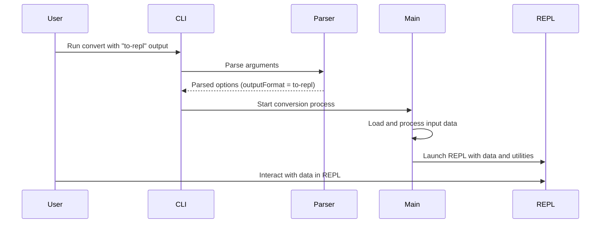

# [convert] Load state transition vectors and add REPL

## Pull Request by @tomusdrw

This PRs adds loading of state vectors (w3f/davxy format) both in JSON and bin.
The test can then be processed into `pre-state` and `post-state`. 

Additionally this PR adds super simple REPL, which in combinations allows exploring the state object:
```
 ❯❯❯ npm start -w @typeberry/convert ./test-vectors/w3f-davxy/traces/reports-l0/00000001.bin state-transition-vector as-pre-state to-repl

> @typeberry/convert@0.0.1 start
> tsx ./index.ts ./test-vectors/w3f-davxy/traces/reports-l0/00000001.bin state-transition-vector as-pre-state to-repl


Starting JavaScript REPL with converted data...
📦 Data type: state-transition-vector
💡 Your data is available in the 'data' variable
🔍 Try: data, inspect(data), toJson(data)
❓ Type .help for REPL commands or .exit to quit

state-transition-vector> data.getService(0).getInfo().codeHash.toString()
'0x0242a295a93ac7f3ba564f0be83089a647a9bd3861798cf9fbffae0daa2ce1ff'
state-transition-vector> data.getService(0).getPreimage(Bytes.parseBytes("0x0242a295a93ac7f3ba564f0be83089a647a9bd3861798cf9fbffae0daa2ce1ff", 32))
BytesBlob {
  raw: <Buffer 50 00 15 6a 61 6d 2d 62 6f 6f 74 73 74 72 61 70 2d 73 65 72 76 69 63 65 06 30 2e 31 2e 32 33 0a 41 70 61 63 68 65 2d 32 2e 30 01 25 50 61 72 69 74 79 ... 113493 more bytes>,
  length: 113543,
  [Symbol(compare via string)]: true
}
state-transition-vector> data.getService(0).getPreimage(Bytes.parseBytes("0x0242a295a93ac7f3ba564f0be83089a647a9bd3861798cf9fbffae0daa2ce1ff", 32)).toString()
'0x5000156a616d2d626f6f7473747261702d7365727669636506302e312e32330a4170616368652d322e30012550617269747920546563686e6f6c6f67696573203c61646d696e407061726974792e696f3ec83....
```


## Comment by @coderabbitai[bot]

<!-- This is an auto-generated comment: summarize by coderabbit.ai -->
<!-- This is an auto-generated comment: skip review by coderabbit.ai -->

> [!IMPORTANT]
> ## Review skipped
> 
> Auto incremental reviews are disabled on this repository.
> 
> Please check the settings in the CodeRabbit UI or the `.coderabbit.yaml` file in this repository. To trigger a single review, invoke the `@coderabbitai review` command.
> 
> You can disable this status message by setting the `reviews.review_status` to `false` in the CodeRabbit configuration file.

<!-- end of auto-generated comment: skip review by coderabbit.ai -->
<!-- walkthrough_start -->

<details>
<summary>📝 Walkthrough</summary>

<!-- This is an auto-generated comment: release notes by coderabbit.ai -->

## Summary by CodeRabbit

* **New Features**
  * Added a new "to-repl" output mode to the CLI tool, enabling users to launch an interactive JavaScript REPL session with loaded data and utilities.
  * Introduced support for a new input type, "state-transition-vector," with processing options for extracting pre- or post-state data.
* **Documentation**
  * Updated usage instructions, examples, and added a detailed section describing the new REPL mode and supported input types.
* **Bug Fixes**
  * Improved clarity in the options section and revised command syntax in documentation.
* **Tests**
  * Added tests to ensure correct parsing of the new "to-repl" output mode.
* **Chores**
  * Updated dependencies to include new required packages.

<!-- end of auto-generated comment: release notes by coderabbit.ai -->
## Walkthrough

The changes introduce a new "to-repl" output mode to the `@typeberry/convert` CLI tool, enabling an interactive JavaScript REPL with loaded data and utilities. Documentation and tests are updated to reflect this addition. New codec schemas are added for `TestState` and `StateTransition`, and a new `state-transition-vector` type is supported with processing options.

## Changes

| Files / Areas                                         | Change Summary                                                                                                 |
|-------------------------------------------------------|---------------------------------------------------------------------------------------------------------------|
| bin/convert/README.md                                 | Updated usage, options, and examples for new CLI syntax, output formats (including "to-repl"), and REPL docs. |
| bin/convert/args.ts, bin/convert/args.test.ts         | Added "to-repl" output format to CLI parser, help text, and tests.                                            |
| bin/convert/main.ts                                   | Added REPL launch logic, helper for JSON serialization, and updated control flow for new output format.       |
| bin/convert/types.ts                                  | Added support for "state-transition-vector" type with processing options and codecs.                          |
| bin/convert/package.json                              | Added `@typeberry/database` and `@typeberry/state` as dependencies.                                           |
| bin/test-runner/w3f/state-loader.ts                   | Added static `Codec` property to `TestState` for binary serialization.                                        |
| bin/test-runner/w3f/state-transition.ts               | Added static `Codec` property to `StateTransition` for structured serialization.                              |

## Sequence Diagram(s)



## Poem

> 🐇  
> A REPL appears, a magic new shell,  
> Where Typeberry data now lives as well!  
> With codecs and hashes, transitions galore—  
> You can poke, prod, and query, explore!  
> The CLI hops forward, with REPL delight,  
> Happy conversions, day or night!  
>

</details>

<!-- walkthrough_end -->
<!-- internal state start -->


<!-- DwQgtGAEAqAWCWBnSTIEMB26CuAXA9mAOYCmGJATmriQCaQDG+Ats2bgFyQAOFk+AIwBWJBrngA3EsgEBPRvlqU0AgfFwA6NPEgQAfACgjoCEYDEZyAAUASpETZWaCrKNwSPbABsvkCiQBHbGlcSHFcLzpIACIAbSYMKQpcAF1IABl8NHpEXGoPXCoMRHV4fCwpMXwKZEx6bPobAFErdOjIOUhsREowlm7aCgB3FAxCxWwGaUgAM2wMMTKMNC91eQJILyycvJpISoIa0bDYDyGAZhmAelo0CQAPeRnq5moAGntsbm5q8QwiDr4XCwSAAKQAygB5ABy6Aw9DUyxcsxeiA0MFOPU22yiB2qyAYmA6Hl4+CmiB69HgY3wkAABrwSGBcvk6XD6Az8LlmbsSGz/IyemNqEs0UYAIK0WilcorLyyD7Ajy2dBS2r2eDMbiRSA2EjZMBNCQrMBWCjU0KZfDcSAACmarQAlKMaBQZmgpidqOgfPghshupRkBsLcpFlJ5ZASPdtdUCqd7Lz+MJRJoMR4HekeBR8BJ4EpagxycHaUrsdkorc8vt4Gh0PSq2g2cbzSodXVPt9fgSWK94cgHAwQWhkHTqYhuKnbY3HWyO3SCKDEOVp9Q0LOUXxo2hmNTqQCy43ExRJrhsP50eKsNutTrumhSJAlMxyrkqDQB3lkvuThmWlmhnUYcOmpZx5BZGgwEKTASnEcowDxPgZngSIPiCShZB/HoKDzT1qWeChXjgjAPg7fxCngEg83+bMSE1B8PCPalAWBPw0BGDs3x/AiiLFAw4FQMhYEwKY2DGWYPRQ9R8mQfUSl6cdJ0Wcp2UgPt4G4bwRRU/AZkTfIwiKWCln2VN8UgQDgWYssAAFcFkScBEoFwrgSJJQm4D0AGsGPRdxrDsakGC8bAC3rD9QkQqN7h3bUPE42A/UJHpkESkYy0zRgiScrpKT6aLY38X9yyUHYDKYsYw3ECNZA0Ix9GMcAoDIehdJwAhiDIZQaHoJhWHYLheGTERw2mTomCUKhVHULQdAakwoAE5BUCJNA8EIUhyHfKI+rEzg2JGBwnGRcbFGUabNG0XQwEMRrTAMRFXPKdyrmacUABEAFkmg0ZhaA4AxoiBgwLEgcUAElOq2/IckcV5kTaodMFIRA3ATe9H0QWRhXuTdirpOyHJIJyKBctzKFwNkCHwXwhhHPwqKQKINgnUR4BmdYE2pTTQmQnVkJqXAPmeX0hiiToy3sycPmtYiVmzMlpBKf5SPhfg8B5zciI+AUvEkmiy0ZPN8G6fgKEmr1QhZZIokskFJaJvyuYwTW+ZIAByYMiZQZAMD9dqWBFQkfHkJQaDEKIZhzZgUFwWT7hoYoTNtOkNEROkPlT057gzs36Q0IRlwwOlHSdjxZdFexUxMumB1WIhYAieR/CGapSrx4LnDWVX6DLE3cFdl5qGQMWiv8ZY2HoO36wXQg2UZZDcY7aNPPhZnaSCkKlHrcgRlnsBdbZF9t+Bb09fmIdpiJUMqFGsE7jQcEGHNbhQky6eyy2Ct6EbS8nxIPIKEoirFyPwPSDguw2ypC7PAYQiYj3pg0OgpEtg0WnqSYsP4K6vnQMaFCbYPAEUYBTbQWApbTBThBJktBHDcDnGrOkVCoJGRlBgBCZkKAlzLtFWKkQR6UA8F8Ks68GYzEiGIYqu8FBODVljHGHxnyvmgnsDBSssGv1FD3FAPhujKPjH+Voakzq5V8pAAAYqBEOpFIBSOiJlT6Z12g9GUlgWuLocw0KmLQBR0hn7wERAeZ2roPTVQ8GQPMOYMB7VIngvWAgdQtlrPE6QHw8BSXsrMC+xFEBaJZPCZwjR/zSL7LQHJoxgqhR/HWRAvCDFZhSiUcodUjAg0sOKLwwTsn5UPKIPW75K5tRXr8KI1RPDxPgAwKMYxSjSHqpAaE5QPDTjJI4dg2ksBI3+NMco8pS6A2BgYCAYAjCPXJskK4zgiBogihoOOAMgbRFaWDSGm1upRCOvDeQiNhJbNRgYcUNiSDpRCFlLEbikG91LAmAAwukcG6AKBEFWeJTyNQfwRRLKZc0HNLbFVRdhBQpNUyRh+bQPhxVogdV1u0fug9CLemwRgbhEVGCnAYF5YMwlQhDFOGQhMlzkVx3KVveKswgE8GoLAVWoxNbkJiKcCsFA3jtA7H3DWsCeLekpYQXWyq8XODyv4BwHS1LUEvpysJMZUwjJTBIj+CZaV4DMUPK2AD8qQnVbgZ19LNB6m1Cg8oVz8z6P/u6bwoQBV7VqGrMsRqaZSGgZrTywJ0QLP4EqPgGK85bCIBMiyAjWXIzoM08wbSOndUrhsHpnd+k4MGTGYZrU+CaXGZM9gMy/lQDTZslG+UhlQLzi21YbbpkZKUDW9ZiAADc/AMCRjrFIllyUziIKlLbIC1kEzRiQH8A8IKHDqBIHVB59V7qnOehTC5iLrmIHucDUGEMoZvNhsdL5eke2zP4gmD9tQpSdh+MkPGC6gXqwHhql1MQqUkG1O0TdHhYXwupl4bhpwvA2hoAnH2XRuDCMhcK0KoqCx+I0TpPSZZtUH2g14GlnqtbvAsggIc+lkjqlBA/J+L835FPtYxNcJUogWlpHWRJBDuF0g9WBr1Lq2RkEcFh6Mid27T2AyMNgzASb0j9b4AAvJBnVVHoip3TPSfFJAJM829URNkcwFjESw8fdmlE8P+CYEQDA8AABeIaKPUuPFUtW5Fzx8o8EwIlE5yjShorJmOxoQpHvmbSIEpw+A5rzaMhI4xfBiP9itGYMxrW0BLU89pnTK1QsYr05wk6wEFUbYO7ArapnhEop2sGa76DRbUiQdTvQ6RacgLpnzBmqa0nE56yz1A2TMTpOexIl7Lk3rpIcyAABVHDMNMm2ZMgyA1ZnxsuttI63AAB+LgXF/iOi4OZp10njgzepE9Ob5yFu3MQCNyApKdRlikWNyTE3fVUbZMu/ZjzDlnoe2c3AVxXjUle3ex5D6XldW2i+z5NWf1oxCz8x8/h3RVCOGWCEMJQOa0+z+ODDZaHXcpptlxHR5AKdvru4qRPYTndzchQkdnUuTMEzvEDqHJxISydtxcRcjNLQ+yQNDvRsK1lWF50cAAhWQH4ldbAEFN4oeQFhX0/Oaf40beoXpY/SAAEiOWA70JlyxcFrvJ5IXS0m1KQ4aqYR5AT8zRLyJBZBoja9KOWVj+cjCO3R0Iv2LMuo0Fpqby0xgeMmMghjEyQTnwWJiOELoqqSA8AspQBdkCZQaSZRkX8lOe7LJDysfHOJUWUL4NJqwMk2ZccgFOilUy51nkuco3eVcfn76r6Q6vBC51VQmI85DS7GcyqSLUoRUAMF0SwTz67WKHj43KieJAtFV/KBhxfyAjVupUplE/oR69jExf4MA1IRqhCVFiJvHbVKb7yNwzUAGhXOEEetnq+Um8BGxUmUx83g8UMaCYdIA+0gQOesFI3CGWOYWWWwIw02NCWo1ObIfsIwn20wVkvsIGmUy6HwvAFo5OCeEw+O8g44hQp4lcTkBEHg1szOGU/43C26uQP4rOJOsCy6Ni/sJQt48gwcXgFqgKe8YufetOdmRCcuKwnm6yRWD65ataxQ3Sk+lWahyA9a3+IyzaDWw6TWHacyZiIuKkEKXAdIredmUhGAq4eQXA8wXkOBGAG402s2L0MOTKccS2J6YOxyD0EOJuUOnk7Kvkhc5Q8OxWSO0MABHyYE6O2On6/kYRPkpAheKkSgk4a8CwLWeMZYBM5CJMZMIRR8EwOoo8f+uG9OqokWB4rcEh/8ORSgeR0gVhhMjkzksgNwa4AgI4fIqkRRRMJRPRVCucAgSW6AkUQYJk0QAADBoIsQAIzRBlxYgNCsL8JFTjgUxRA7iBrFScHM7ZEtRkAMD5F2z9wMwvjUQAijIOYcz+YM73A7o/jsDmjSDKFlqlY4JVqaETpdK6F1ajJDp5rtriCfoLLkDHoHJHInLBFPZQ7kI3rRGI5Poo6fCvpJFFp/L+Q/ruJUGipSIQJ6G9zew74cjRBMLQRJzETsL46GYaEeB0jggrZWBWCQg2DQBNDvQAD60AAAmlYE0OCHOKTGgLVBiKgIut7IGKOOCLyNACwsRBoNCmdAwNZqMpMaxOcYoP5j/KIPqSrKpOoMgDwaZnwKgD0I/qNoqfkMqTBKwhoFHCwL3sXJeFKKwnKAqLHKGtSFfCZjmMWGyIIA/hZJXo0YyrevSNECOGAIyDyPkEyfOHGYgAmVyLgEmTQIZuiN6ixCCNGYqAmKohSD+DzgoEieIZyLkHyVQhoD7rILFm9jVoUfaTQI6XSUsPbjrnhDSDPMqRfDDBbogFbjbksGBLnEqBsiEZyt6NKC4okXzqybyE0Ani1myN0P5l0MUGgPll1sCIoFoshMsCHIwP4DJDPOCJQPLmvrQO2YMa6THE/mEuudMFuQbCWTmHmO3HSNCsJNSOCEpBLgmEauGj+KyTeQoV5vebyHHgzGeBQOQIVsZl/t2AitURtiGAsCKvSIOQsMOZbtbouXbpnNea2ArnQA+ePgwg+Z2cZNISzF8N/icDKSBuQs0iob8eof8RVoCQMnpP2gAaCYYeCaOi1nMpKO3Cpk1siLxbVgOgkHkhHmyRyVyTyfyUKSKWKQDJAPSHSAuKjHpQAN4GB6V6U75cDUm8jMJOn0mITRBvBmXmV6lKBcB0UqlLBqkalOXmX/wTQkDuVKmeVNLqnjq+XmWREYBcC2jOjaZ6CQAeV2VeVPnukRV6WlkxmmV+V6XRlcCxBpkJm35UKOUxDxk/DcglUpDpXmUnj2GswMBcD/mkJAWiAKJrhOEYAuF+gkT8AkbRVe5ECXY7ndVDAYBTrOV6UAC+zlM1elBlfhcJ4OGAVwEUB88wW0VwFw1wTC5elAcOIOMRGJG2CRCM76yReJ36F1dRIe+k4gkypIQuGSf5Gp72hR0AIQ1FjA8BZSSgJ5VSCg469gl8rweMiIiR8hCu6yqkBYUFUNdmbUdIH1uQX1tBIkXx0pPYQNiAIN1SSkjm+BXK9IVCfJOYQI8FdYi8dAzIa+9OewzgVAb6mwZARArEdIZu4o4IZufJ4I4MAAWk0PQlSMGBeQAYglgNaGgOhPSA+TYPgECCObAFTI7MZnSI2c2fPDmE9TQbJAsGdPUOqCJskmAJEP8KxD0OhLrjVmGe7h8PqExhlqQgDVTfQOcMsWAHIHsGrb7kLfWPEoIPSLFsECBR4Ghabr/thjUdhRUifFAQFZqUYjQu2JASyRzVzTzfzYLZWcpflKSb8KxYQSMPHf6e5qqQltFG8TRBWelgfsgbMKgfZvqchHQDOlXskZ4P4JGBaIno7jJZDYoXZsXSsIGiULHZapXQCDwbDRRQPV5S0sVqodVvJeOn0tVsCQOiJY1hCRJctlJe8rsHmo9RTPIC9eOu9p3BSHhZ9XBXdo9GtXVZtdtVcLtTiBQK9myDxhqG5tQOeIFc5QtXHM5RBHmmFaIFwPHRoJCLargKAwwMANleZSTWTftLLfLbgIrRNX5erSsDGeKBKbIPA5AI2VwDAYgMAG7XoDOkHYFZAKQ6PgIJAFNZQ7NYYPNQZYdQEQiStffRtZQFtZcM/TZbSQxT4beodeia8piadUzRjl+qHVqPnVQntHjHSPHR/autJagkGtvHSO9EaZNL7XSGuQFZwrMNHPjJ0cTN0U9GfRKuERkWDE0cAw9VrcffSLA+o/HuMJ4iMsFjLcFcldIRfb9SQP9TRHWMXTbRIjjacKDafIvjhQRqOIyHWTfbaB+QCEjdffkN5WfY6JnP7eymyOk8rJk6Puyrk6ICXFojWbgKk6yHaBk1fSjbyJU5qTPpLpsXZqSD+YGW+KeL/cbkDQKCfsKLIaMm2QE12UEz9R8H1HFHtOiluq8VwTRNYdHO6WyM4wrNrZxT8RWn8eVv5avUCYJQ2hvQYVveJZ+lAO2Yfa48kPIJYe469ccME/4w6SFcXLfQ9jwxgI/QIzSV8+/RGRvgmHKqoxqRoFEzTo7XuGsyk1QlwMjbgA+W093oU15CQ1sBUx4zUxVXU0izANkzQOi7CaDg1AYAtFMq1HpGtB1JIxtrtANAdFiWjqdJNCoGoJdHNDdFS01MUuoHyfmIgKTYzECnQPU4BpS9S8sQwAACznDysABsAA7AABzLEACc8rAgAATOcOcJq6qwa1q8sUq8scqyQOq8q8sTMOa/MTMPMcq/q/QDKwK7tEKyK2K3mBK7QHyS1NdHoEAA== -->

<!-- internal state end -->
<!-- tips_start -->

---


<details>
<summary>🪧 Tips</summary>

### Chat

There are 3 ways to chat with [CodeRabbit](https://coderabbit.ai?utm_source=oss&utm_medium=github&utm_campaign=FluffyLabs/typeberry&utm_content=495):

- Review comments: Directly reply to a review comment made by CodeRabbit. Example:
  - `I pushed a fix in commit <commit_id>, please review it.`
  - `Explain this complex logic.`
  - `Open a follow-up GitHub issue for this discussion.`
- Files and specific lines of code (under the "Files changed" tab): Tag `@coderabbitai` in a new review comment at the desired location with your query. Examples:
  - `@coderabbitai explain this code block.`
  -	`@coderabbitai modularize this function.`
- PR comments: Tag `@coderabbitai` in a new PR comment to ask questions about the PR branch. For the best results, please provide a very specific query, as very limited context is provided in this mode. Examples:
  - `@coderabbitai gather interesting stats about this repository and render them as a table. Additionally, render a pie chart showing the language distribution in the codebase.`
  - `@coderabbitai read src/utils.ts and explain its main purpose.`
  - `@coderabbitai read the files in the src/scheduler package and generate a class diagram using mermaid and a README in the markdown format.`
  - `@coderabbitai help me debug CodeRabbit configuration file.`

### Support

Need help? Create a ticket on our [support page](https://www.coderabbit.ai/contact-us/support) for assistance with any issues or questions.

Note: Be mindful of the bot's finite context window. It's strongly recommended to break down tasks such as reading entire modules into smaller chunks. For a focused discussion, use review comments to chat about specific files and their changes, instead of using the PR comments.

### CodeRabbit Commands (Invoked using PR comments)

- `@coderabbitai pause` to pause the reviews on a PR.
- `@coderabbitai resume` to resume the paused reviews.
- `@coderabbitai review` to trigger an incremental review. This is useful when automatic reviews are disabled for the repository.
- `@coderabbitai full review` to do a full review from scratch and review all the files again.
- `@coderabbitai summary` to regenerate the summary of the PR.
- `@coderabbitai generate sequence diagram` to generate a sequence diagram of the changes in this PR.
- `@coderabbitai resolve` resolve all the CodeRabbit review comments.
- `@coderabbitai configuration` to show the current CodeRabbit configuration for the repository.
- `@coderabbitai help` to get help.

### Other keywords and placeholders

- Add `@coderabbitai ignore` anywhere in the PR description to prevent this PR from being reviewed.
- Add `@coderabbitai summary` to generate the high-level summary at a specific location in the PR description.
- Add `@coderabbitai` anywhere in the PR title to generate the title automatically.

### Documentation and Community

- Visit our [Documentation](https://docs.coderabbit.ai) for detailed information on how to use CodeRabbit.
- Join our [Discord Community](http://discord.gg/coderabbit) to get help, request features, and share feedback.
- Follow us on [X/Twitter](https://twitter.com/coderabbitai) for updates and announcements.

</details>

<!-- tips_end -->


## Comment by @tomusdrw

> looks great 👍
> 
> one observation: the output from toJson and inspect is a string and is printed out as a chain of concatenated strings: 

You can still use `console.log` to print out them as-is, so `console.log(inspect(data))` works fine, I guess we could expose `fs` as well to write stuff to a filesystem? But I'd be for adding it when we figure out proper use cases :)


## Comment by @github-actions[bot]


<details>
<summary>View all</summary>

| File | Benchmark | Ops |  |
|------|-----------|-----|--|
| [bytes/hex-to.ts[0]](../blob/335050fd034c2db72364f67024ea46adf3913424//_work/typeberry-1/typeberry/typeberry/benchmarks/bytes/hex-to.ts) | number toString + padding | 320244.9 ±0.84% | fastest ✅ |
| [bytes/hex-to.ts[1]](../blob/335050fd034c2db72364f67024ea46adf3913424//_work/typeberry-1/typeberry/typeberry/benchmarks/bytes/hex-to.ts) | manual | 16115.46 ±0.52% | 94.97% slower |
| [codec/decoding.ts[0]](../blob/335050fd034c2db72364f67024ea46adf3913424//_work/typeberry-1/typeberry/typeberry/benchmarks/codec/decoding.ts) | manual decode | 23489890.72 ±0.53% | 86.06% slower |
| [codec/decoding.ts[1]](../blob/335050fd034c2db72364f67024ea46adf3913424//_work/typeberry-1/typeberry/typeberry/benchmarks/codec/decoding.ts) | int32array decode | 165751469.1 ±3.56% | 1.65% slower |
| [codec/decoding.ts[2]](../blob/335050fd034c2db72364f67024ea46adf3913424//_work/typeberry-1/typeberry/typeberry/benchmarks/codec/decoding.ts) | dataview decode | 168525261.11 ±2.69% | fastest ✅ |
| [codec/bigint.decode.ts[0]](../blob/335050fd034c2db72364f67024ea46adf3913424//_work/typeberry-1/typeberry/typeberry/benchmarks/codec/bigint.decode.ts) | decode custom | 173657433.02 ±2.98% | fastest ✅ |
| [codec/bigint.decode.ts[1]](../blob/335050fd034c2db72364f67024ea46adf3913424//_work/typeberry-1/typeberry/typeberry/benchmarks/codec/bigint.decode.ts) | decode bigint | 101893916.77 ±2.69% | 41.32% slower |
| [codec/encoding.ts[0]](../blob/335050fd034c2db72364f67024ea46adf3913424//_work/typeberry-1/typeberry/typeberry/benchmarks/codec/encoding.ts) | manual encode | 3065593.99 ±0.15% | 17.14% slower |
| [codec/encoding.ts[1]](../blob/335050fd034c2db72364f67024ea46adf3913424//_work/typeberry-1/typeberry/typeberry/benchmarks/codec/encoding.ts) | int32array encode | 3699897.82 ±0.18% | fastest ✅ |
| [codec/encoding.ts[2]](../blob/335050fd034c2db72364f67024ea46adf3913424//_work/typeberry-1/typeberry/typeberry/benchmarks/codec/encoding.ts) | dataview encode | 3691717.47 ±0.15% | 0.22% slower |
| [hash/index.ts[0]](../blob/335050fd034c2db72364f67024ea46adf3913424//_work/typeberry-1/typeberry/typeberry/benchmarks/hash/index.ts) | hash with numeric representation | 189.72 ±0.47% | 27.93% slower |
| [hash/index.ts[1]](../blob/335050fd034c2db72364f67024ea46adf3913424//_work/typeberry-1/typeberry/typeberry/benchmarks/hash/index.ts) | hash with string representation | 122.02 ±0.29% | 53.65% slower |
| [hash/index.ts[2]](../blob/335050fd034c2db72364f67024ea46adf3913424//_work/typeberry-1/typeberry/typeberry/benchmarks/hash/index.ts) | hash with symbol representation | 184.78 ±0.13% | 29.8% slower |
| [hash/index.ts[3]](../blob/335050fd034c2db72364f67024ea46adf3913424//_work/typeberry-1/typeberry/typeberry/benchmarks/hash/index.ts) | hash with uint8 representation | 164.84 ±0.04% | 37.38% slower |
| [hash/index.ts[4]](../blob/335050fd034c2db72364f67024ea46adf3913424//_work/typeberry-1/typeberry/typeberry/benchmarks/hash/index.ts) | hash with packed representation | 263.23 ±0.36% | fastest ✅ |
| [hash/index.ts[5]](../blob/335050fd034c2db72364f67024ea46adf3913424//_work/typeberry-1/typeberry/typeberry/benchmarks/hash/index.ts) | hash with bigint representation | 190.73 ±0.29% | 27.54% slower |
| [hash/index.ts[6]](../blob/335050fd034c2db72364f67024ea46adf3913424//_work/typeberry-1/typeberry/typeberry/benchmarks/hash/index.ts) | hash with uint32 representation | 200.76 ±0.18% | 23.73% slower |
| [logger/index.ts[0]](../blob/335050fd034c2db72364f67024ea46adf3913424//_work/typeberry-1/typeberry/typeberry/benchmarks/logger/index.ts) | console.log with string concat | 7767530.3 ±50.37% | fastest ✅ |
| [logger/index.ts[1]](../blob/335050fd034c2db72364f67024ea46adf3913424//_work/typeberry-1/typeberry/typeberry/benchmarks/logger/index.ts) | console.log with args | 1040936.36 ±107.17% | 86.6% slower |
| [math/add_one_overflow.ts[0]](../blob/335050fd034c2db72364f67024ea46adf3913424//_work/typeberry-1/typeberry/typeberry/benchmarks/math/add_one_overflow.ts) | add and take modulus | 243640503.57 ±7.03% | 2.75% slower |
| [math/add_one_overflow.ts[1]](../blob/335050fd034c2db72364f67024ea46adf3913424//_work/typeberry-1/typeberry/typeberry/benchmarks/math/add_one_overflow.ts) | condition before calculation | 250528595.18 ±7% | fastest ✅ |
| [bytes/hex-from.ts[0]](../blob/335050fd034c2db72364f67024ea46adf3913424//_work/typeberry-1/typeberry/typeberry/benchmarks/bytes/hex-from.ts) | parse hex using `Number` with NaN checking | 129842.61 ±0.97% | 83.47% slower |
| [bytes/hex-from.ts[1]](../blob/335050fd034c2db72364f67024ea46adf3913424//_work/typeberry-1/typeberry/typeberry/benchmarks/bytes/hex-from.ts) | parse hex from char codes | 785559.64 ±0.24% | fastest ✅ |
| [bytes/hex-from.ts[2]](../blob/335050fd034c2db72364f67024ea46adf3913424//_work/typeberry-1/typeberry/typeberry/benchmarks/bytes/hex-from.ts) | parse hex from string nibbles | 494326.21 ±1.23% | 37.07% slower |
| [collections/map-set.ts[0]](../blob/335050fd034c2db72364f67024ea46adf3913424//_work/typeberry-1/typeberry/typeberry/benchmarks/collections/map-set.ts) | 2 gets + conditional set | 121192.32 ±0.17% | fastest ✅ |
| [collections/map-set.ts[1]](../blob/335050fd034c2db72364f67024ea46adf3913424//_work/typeberry-1/typeberry/typeberry/benchmarks/collections/map-set.ts) | 1 get 1 set | 60403.82 ±0.46% | 50.16% slower |
| [codec/bigint.compare.ts[0]](../blob/335050fd034c2db72364f67024ea46adf3913424//_work/typeberry-1/typeberry/typeberry/benchmarks/codec/bigint.compare.ts) | compare custom | 235814453.92 ±6.9% | 8.87% slower |
| [codec/bigint.compare.ts[1]](../blob/335050fd034c2db72364f67024ea46adf3913424//_work/typeberry-1/typeberry/typeberry/benchmarks/codec/bigint.compare.ts) | compare bigint | 258761710.43 ±5.69% | fastest ✅ |
| [math/count-bits-u64.ts[0]](../blob/335050fd034c2db72364f67024ea46adf3913424//_work/typeberry-1/typeberry/typeberry/benchmarks/math/count-bits-u64.ts) | standard method | 3724077.8 ±0.47% | 95.86% slower |
| [math/count-bits-u64.ts[1]](../blob/335050fd034c2db72364f67024ea46adf3913424//_work/typeberry-1/typeberry/typeberry/benchmarks/math/count-bits-u64.ts) | magic | 89865882.52 ±1.79% | fastest ✅ |
| [math/count-bits-u32.ts[0]](../blob/335050fd034c2db72364f67024ea46adf3913424//_work/typeberry-1/typeberry/typeberry/benchmarks/math/count-bits-u32.ts) | standard method | 90798552.54 ±1.96% | 62.04% slower |
| [math/count-bits-u32.ts[1]](../blob/335050fd034c2db72364f67024ea46adf3913424//_work/typeberry-1/typeberry/typeberry/benchmarks/math/count-bits-u32.ts) | magic | 239178362.03 ±6.56% | fastest ✅ |
| [math/mul_overflow.ts[0]](../blob/335050fd034c2db72364f67024ea46adf3913424//_work/typeberry-1/typeberry/typeberry/benchmarks/math/mul_overflow.ts) | multiply and bring back to u32 | 247052689.28 ±7.54% | 7.05% slower |
| [math/mul_overflow.ts[1]](../blob/335050fd034c2db72364f67024ea46adf3913424//_work/typeberry-1/typeberry/typeberry/benchmarks/math/mul_overflow.ts) | multiply and take modulus | 265784973.15 ±5.86% | fastest ✅ |
| [math/switch.ts[0]](../blob/335050fd034c2db72364f67024ea46adf3913424//_work/typeberry-1/typeberry/typeberry/benchmarks/math/switch.ts) | switch | 237911677.43 ±7.84% | 7.7% slower |
| [math/switch.ts[1]](../blob/335050fd034c2db72364f67024ea46adf3913424//_work/typeberry-1/typeberry/typeberry/benchmarks/math/switch.ts) | if | 257753967.63 ±7.24% | fastest ✅ |
| [codec/view_vs_collection.ts[0]](../blob/335050fd034c2db72364f67024ea46adf3913424//_work/typeberry-1/typeberry/typeberry/benchmarks/codec/view_vs_collection.ts) | Get first element from Decoded | 27749.16 ±0.23% | 59.53% slower |
| [codec/view_vs_collection.ts[1]](../blob/335050fd034c2db72364f67024ea46adf3913424//_work/typeberry-1/typeberry/typeberry/benchmarks/codec/view_vs_collection.ts) | Get first element from View | 68562.45 ±0.19% | fastest ✅ |
| [codec/view_vs_collection.ts[2]](../blob/335050fd034c2db72364f67024ea46adf3913424//_work/typeberry-1/typeberry/typeberry/benchmarks/codec/view_vs_collection.ts) | Get 50th element from Decoded | 24282.16 ±4.06% | 64.58% slower |
| [codec/view_vs_collection.ts[3]](../blob/335050fd034c2db72364f67024ea46adf3913424//_work/typeberry-1/typeberry/typeberry/benchmarks/codec/view_vs_collection.ts) | Get 50th element from View | 38344.26 ±0.73% | 44.07% slower |
| [codec/view_vs_collection.ts[4]](../blob/335050fd034c2db72364f67024ea46adf3913424//_work/typeberry-1/typeberry/typeberry/benchmarks/codec/view_vs_collection.ts) | Get last element from Decoded | 23400.4 ±4.09% | 65.87% slower |
| [codec/view_vs_collection.ts[5]](../blob/335050fd034c2db72364f67024ea46adf3913424//_work/typeberry-1/typeberry/typeberry/benchmarks/codec/view_vs_collection.ts) | Get last element from View | 27259.16 ±0.29% | 60.24% slower |
| [codec/view_vs_object.ts[0]](../blob/335050fd034c2db72364f67024ea46adf3913424//_work/typeberry-1/typeberry/typeberry/benchmarks/codec/view_vs_object.ts) | Get the first field from Decoded | 444925.43 ±0.27% | fastest ✅ |
| [codec/view_vs_object.ts[1]](../blob/335050fd034c2db72364f67024ea46adf3913424//_work/typeberry-1/typeberry/typeberry/benchmarks/codec/view_vs_object.ts) | Get the first field from View | 97900.05 ±1.83% | 78% slower |
| [codec/view_vs_object.ts[2]](../blob/335050fd034c2db72364f67024ea46adf3913424//_work/typeberry-1/typeberry/typeberry/benchmarks/codec/view_vs_object.ts) | Get the first field as view from View | 101892.27 ±0.21% | 77.1% slower |
| [codec/view_vs_object.ts[3]](../blob/335050fd034c2db72364f67024ea46adf3913424//_work/typeberry-1/typeberry/typeberry/benchmarks/codec/view_vs_object.ts) | Get two fields from Decoded | 434416.78 ±0.76% | 2.36% slower |
| [codec/view_vs_object.ts[4]](../blob/335050fd034c2db72364f67024ea46adf3913424//_work/typeberry-1/typeberry/typeberry/benchmarks/codec/view_vs_object.ts) | Get two fields from View | 82064.06 ±0.55% | 81.56% slower |
| [codec/view_vs_object.ts[5]](../blob/335050fd034c2db72364f67024ea46adf3913424//_work/typeberry-1/typeberry/typeberry/benchmarks/codec/view_vs_object.ts) | Get two fields from materialized from View | 165796.16 ±1.12% | 62.74% slower |
| [codec/view_vs_object.ts[6]](../blob/335050fd034c2db72364f67024ea46adf3913424//_work/typeberry-1/typeberry/typeberry/benchmarks/codec/view_vs_object.ts) | Get two fields as views from View | 81933.12 ±0.76% | 81.58% slower |
| [codec/view_vs_object.ts[7]](../blob/335050fd034c2db72364f67024ea46adf3913424//_work/typeberry-1/typeberry/typeberry/benchmarks/codec/view_vs_object.ts) | Get only third field from Decoded | 428519.7 ±1.57% | 3.69% slower |
| [codec/view_vs_object.ts[8]](../blob/335050fd034c2db72364f67024ea46adf3913424//_work/typeberry-1/typeberry/typeberry/benchmarks/codec/view_vs_object.ts) | Get only third field from View | 102761.77 ±0.26% | 76.9% slower |
| [codec/view_vs_object.ts[9]](../blob/335050fd034c2db72364f67024ea46adf3913424//_work/typeberry-1/typeberry/typeberry/benchmarks/codec/view_vs_object.ts) | Get only third field as view from View | 97851.41 ±1.64% | 78.01% slower |
| [bytes/compare.ts[0]](../blob/335050fd034c2db72364f67024ea46adf3913424//_work/typeberry-1/typeberry/typeberry/benchmarks/bytes/compare.ts) | Comparing Uint32 bytes | 20783.5 ±0.42% | fastest ✅ |
| [bytes/compare.ts[1]](../blob/335050fd034c2db72364f67024ea46adf3913424//_work/typeberry-1/typeberry/typeberry/benchmarks/bytes/compare.ts) | Comparing raw bytes | 19895.85 ±2.25% | 4.27% slower |
| [hash/blake2b.ts[0]](../blob/335050fd034c2db72364f67024ea46adf3913424//_work/typeberry-1/typeberry/typeberry/benchmarks/hash/blake2b.ts) | hasher with simple allocator | 0.0454 ±0.37% | fastest ✅ |
| [hash/blake2b.ts[1]](../blob/335050fd034c2db72364f67024ea46adf3913424//_work/typeberry-1/typeberry/typeberry/benchmarks/hash/blake2b.ts) | hasher with page allocator | 0.0453 ±0.05% | 0.22% slower |
| [collections/map_vs_sorted.ts[0]](../blob/335050fd034c2db72364f67024ea46adf3913424//_work/typeberry-1/typeberry/typeberry/benchmarks/collections/map_vs_sorted.ts) | Map | 228289.86 ±0.04% | fastest ✅ |
| [collections/map_vs_sorted.ts[1]](../blob/335050fd034c2db72364f67024ea46adf3913424//_work/typeberry-1/typeberry/typeberry/benchmarks/collections/map_vs_sorted.ts) | Map-array | 103777.09 ±0.03% | 54.54% slower |
| [collections/map_vs_sorted.ts[2]](../blob/335050fd034c2db72364f67024ea46adf3913424//_work/typeberry-1/typeberry/typeberry/benchmarks/collections/map_vs_sorted.ts) | Array | 67319.31 ±1.97% | 70.51% slower |
| [collections/map_vs_sorted.ts[3]](../blob/335050fd034c2db72364f67024ea46adf3913424//_work/typeberry-1/typeberry/typeberry/benchmarks/collections/map_vs_sorted.ts) | SortedArray | 194680.57 ±0.21% | 14.72% slower |
| [crypto/ed25519.ts[0]](../blob/335050fd034c2db72364f67024ea46adf3913424//_work/typeberry-1/typeberry/typeberry/benchmarks/crypto/ed25519.ts) | native crypto | 5.66 ±17.95% | 80.97% slower |
| [crypto/ed25519.ts[1]](../blob/335050fd034c2db72364f67024ea46adf3913424//_work/typeberry-1/typeberry/typeberry/benchmarks/crypto/ed25519.ts) | wasm lib | 10.65 ±0.02% | 64.2% slower |
| [crypto/ed25519.ts[2]](../blob/335050fd034c2db72364f67024ea46adf3913424//_work/typeberry-1/typeberry/typeberry/benchmarks/crypto/ed25519.ts) | wasm lib batch | 29.75 ±0.58% | fastest ✅ |
</details>


### Benchmarks summary: 63/63 OK ✅

<!-- thollander/actions-comment-pull-request "benchmarks" -->


## Comment by @coderabbitai[bot]

_⚠️ Potential issue_

**Critical logic error: Both processing options use the same data source.**

Both `as-pre-state` and `as-post-state` options incorrectly use `test.post_state.keyvals` as the data source. The `as-pre-state` option should use `test.pre_state.keyvals` instead.


Apply this fix to correct the pre-state processing:

```diff
        if (option === "as-pre-state") {
          const dict = TruncatedHashDictionary.fromEntries(
-            test.post_state.keyvals.map((x) => [x.key.asOpaque(), x.value]),
+            test.pre_state.keyvals.map((x) => [x.key.asOpaque(), x.value]),
          );
          const entries = StateEntries.fromTruncatedDictionaryUnsafe(dict);
          const state = SerializedState.fromStateEntries(spec, entries);
          return state;
        }
```

<!-- suggestion_start -->

<details>
<summary>📝 Committable suggestion</summary>

> ‼️ **IMPORTANT**
> Carefully review the code before committing. Ensure that it accurately replaces the highlighted code, contains no missing lines, and has no issues with indentation. Thoroughly test & benchmark the code to ensure it meets the requirements.

```suggestion
        if (option === "as-pre-state") {
          const dict = TruncatedHashDictionary.fromEntries(
            test.pre_state.keyvals.map((x) => [x.key.asOpaque(), x.value]),
          );
          const entries = StateEntries.fromTruncatedDictionaryUnsafe(dict);
          const state = SerializedState.fromStateEntries(spec, entries);
          return state;
        }
```

</details>

<!-- suggestion_end -->

<details>
<summary>🤖 Prompt for AI Agents</summary>

```
In bin/convert/types.ts between lines 104 and 133, the processing logic for the
"as-pre-state" option incorrectly uses test.post_state.keyvals instead of
test.pre_state.keyvals. To fix this, update the "as-pre-state" block to use
test.pre_state.keyvals as the data source while keeping the "as-post-state"
block unchanged.
```

</details>

<!-- fingerprinting:phantom:poseidon:panther -->

<!-- This is an auto-generated comment by CodeRabbit -->


## Comment by @coderabbitai[bot]

_💡 Verification agent_

<details>
<summary>🧩 Analysis chain</summary>

**Verify safety of using `fromTruncatedDictionaryUnsafe` method.**

The code uses `StateEntries.fromTruncatedDictionaryUnsafe()` which has "Unsafe" in the name, suggesting potential risks. Please ensure this is appropriate for the use case and that the input data is properly validated.


Also applies to: 127-127

---

🏁 Script executed:

```shell
#!/bin/bash
# Description: Check the implementation and documentation of fromTruncatedDictionaryUnsafe
# to understand the safety implications and proper usage context.

# Search for the implementation and usage patterns of this method
ast-grep --pattern 'fromTruncatedDictionaryUnsafe($_) {
  $$$
}'

# Look for documentation or comments about this method
rg -A 10 -B 5 "fromTruncatedDictionaryUnsafe"
```

Length of output: 4923

---


</details>

**Ensure complete state before using `fromTruncatedDictionaryUnsafe`**  

The `fromTruncatedDictionaryUnsafe` factory skips all verification and assumes you’ve supplied every entry required to reconstruct the full state. If your `dict` is missing entries, downstream Merkle‐root calculations or lookups may silently fail or produce an incomplete state.

Please add a validation step (or switch to a checked API) to confirm that the truncated dictionary indeed contains all expected key→value pairs before calling this unsafe method.

Locations to address:  
- bin/convert/types.ts: around line 118 and line 127  
- (Also consider similar calls in bin/jam/main.ts and your test–runner code.)

Example guard you might add before use:  
```ts
if (dict.size !== spec.expectedStateSize) {
  throw new Error(
    `Incomplete state dictionary: expected ${spec.expectedStateSize} entries, got ${dict.size}`
  );
}
const entries = StateEntries.fromTruncatedDictionaryUnsafe(dict);
```

<details>
<summary>🤖 Prompt for AI Agents</summary>

```
In bin/convert/types.ts around lines 118 and 127, the code uses
fromTruncatedDictionaryUnsafe without verifying that the input dictionary
contains all required entries, risking incomplete state reconstruction. Add a
validation step before these calls to check that dict.size matches the expected
number of entries (e.g., spec.expectedStateSize). If the sizes do not match,
throw an error indicating the incomplete state. This ensures the dictionary is
complete before calling the unsafe method and prevents silent failures.
```

</details>

<!-- fingerprinting:phantom:poseidon:panther -->

<!-- This is an auto-generated reply by CodeRabbit -->


## Comment by @coderabbitai[bot]

_⚠️ Potential issue_

**Add private constructor and static create method.**

The codec definition structure is correct, but according to the coding guidelines, classes with `static Codec` field must have private constructor and static `create` method.


Apply this pattern to comply with the guidelines:

```diff
+  private constructor() {}
+
+  static create(): TestState {
+    return new TestState();
+  }
+
   static Codec = codec.object({
     state_root: codec.bytes(HASH_SIZE).asOpaque<StateRootHash>(),
     keyvals: codec.sequenceVarLen(
       codec.object({
         key: codec.bytes(31),
         value: codec.blob,
       }),
     ),
   });
```

You'll also need to update all instantiation sites to use `TestState.create()` instead of `new TestState()`.


> Committable suggestion skipped: line range outside the PR's diff.

<details>
<summary>🤖 Prompt for AI Agents</summary>

```
In bin/test-runner/w3f/state-loader.ts around lines 30 to 38, the class defining
the static Codec field lacks a private constructor and a static create method as
required by coding guidelines. Add a private constructor to prevent direct
instantiation and implement a static create method that returns a new instance
of the class. Then, update all code that instantiates this class to use the new
static create method instead of the constructor.
```

</details>

<!-- fingerprinting:phantom:poseidon:panther -->

<!-- This is an auto-generated comment by CodeRabbit -->


## Comment by @coderabbitai[bot]

_⚠️ Potential issue_

**Add private constructor and static create method.**

According to the coding guidelines, classes with `static Codec` field must have private constructor and static `create` method.


Apply this pattern to comply with the guidelines:

```diff
+  private constructor() {}
+
+  static create(): StateTransition {
+    return new StateTransition();
+  }
+
   static Codec = codec.object({
     pre_state: TestState.Codec,
     block: Block.Codec,
     post_state: TestState.Codec,
   });
```

You'll also need to update all instantiation sites to use `StateTransition.create()` instead of `new StateTransition()`.

<!-- suggestion_start -->

<details>
<summary>📝 Committable suggestion</summary>

> ‼️ **IMPORTANT**
> Carefully review the code before committing. Ensure that it accurately replaces the highlighted code, contains no missing lines, and has no issues with indentation. Thoroughly test & benchmark the code to ensure it meets the requirements.

```suggestion
  private constructor() {}

  static create(): StateTransition {
    return new StateTransition();
  }

  static Codec = codec.object({
    pre_state: TestState.Codec,
    block: Block.Codec,
    post_state: TestState.Codec,
  });
```

</details>

<!-- suggestion_end -->

<details>
<summary>🤖 Prompt for AI Agents</summary>

```
In bin/test-runner/w3f/state-transition.ts around lines 23 to 27, the
StateTransition class has a static Codec field but lacks a private constructor
and a static create method as required by coding guidelines. Add a private
constructor to prevent direct instantiation and implement a static create method
that returns a new instance of StateTransition. After this change, update all
code that creates StateTransition instances to use StateTransition.create()
instead of new StateTransition().
```

</details>

<!-- fingerprinting:phantom:poseidon:panther -->

<!-- This is an auto-generated comment by CodeRabbit -->


## Comment by @skoszuta

he's onto something. both blocks of code do the exact same thing


## Comment by @coderabbitai[bot]

@skoszuta You're absolutely right! Both code blocks are identical, which is definitely a bug. The "as-pre-state" option is incorrectly using `test.post_state.keyvals` when it should be using `test.pre_state.keyvals`.

Here's the corrected implementation:

```ts
run(spec: ChainSpec, data: unknown, option: string) {
  const test = data as StateTransition;

  if (option === "as-pre-state") {
    const dict = TruncatedHashDictionary.fromEntries(
      test.pre_state.keyvals.map((x) => [x.key.asOpaque(), x.value]),
    );
    const entries = StateEntries.fromTruncatedDictionaryUnsafe(dict);
    const state = SerializedState.fromStateEntries(spec, entries);
    return state;
  }

  if (option === "as-post-state") {
    const dict = TruncatedHashDictionary.fromEntries(
      test.post_state.keyvals.map((x) => [x.key.asOpaque(), x.value]),
    );
    const entries = StateEntries.fromTruncatedDictionaryUnsafe(dict);
    const state = SerializedState.fromStateEntries(spec, entries);
    return state;
  }
},
```

The key difference is line 4 should use `test.pre_state.keyvals` instead of `test.post_state.keyvals` for the "as-pre-state" option.


      (\   /)
     ( ._.)
    o_(")(")  *lightbulb moment*

---

<details>
<summary>✏️ Learnings added</summary>

```
Learnt from: skoszuta
PR: FluffyLabs/typeberry#495
File: bin/convert/types.ts:118-118
Timestamp: 2025-07-21T13:07:57.238Z
Learning: In state-transition-vector processing options, "as-pre-state" should use test.pre_state.keyvals while "as-post-state" should use test.post_state.keyvals. Using post_state for both options makes them functionally identical, which is a bug.
```

> Note: Learnings are effective only in the context of similar code segments. To apply general coding guidelines, please configure [review instructions](https://docs.coderabbit.ai/guides/review-instructions). You can manage existing learnings in the [app](https://app.coderabbit.ai/learnings).

</details>


---

<details>
<summary>🧠 Learnings used</summary>

```
Learnt from: tomusdrw
PR: FluffyLabs/typeberry#419
File: packages/jam/database-lmdb/states.test.ts:158-160
Timestamp: 2025-06-10T12:06:32.535Z
Learning: In test code, tomusdrw prefers pragmatic solutions over strict type safety when listing all entries would be cumbersome. Using `Object.assign({}, state)` for state updates in tests is acceptable even if it compromises type safety, prioritizing test maintainability and readability.
```

---

```
Learnt from: tomusdrw
PR: FluffyLabs/typeberry#419
File: packages/jam/state/state-inmemory.ts:141-149
Timestamp: 2025-06-10T12:20:17.513Z
Learning: In the `InMemoryService.copyFrom` function in `packages/jam/state/state-inmemory.ts`, duplicate checking for `(hash, length)` pairs in the lookup history is not necessary because the function operates under the assumption that the input `ServiceEntries` comes from an existing well-formed state, which already maintains the invariant of unique lookup history entries per hash and length combination.
```

---

```
Learnt from: tomusdrw
PR: FluffyLabs/typeberry#378
File: packages/jam/jam-host-calls/accumulate/bless.ts:58-58
Timestamp: 2025-05-15T14:31:00.392Z
Learning: When creating Uint8Array instances with dynamic sizes, we should check for potential allocation failures. JavaScript has limits on array sizes, and exceeding these limits will throw errors rather than returning controlled panics. Consider reading data in smaller chunks or implementing proper validation before allocation.
```

---

```
Learnt from: tomusdrw
PR: FluffyLabs/typeberry#378
File: packages/jam/jam-host-calls/accumulate/bless.ts:58-58
Timestamp: 2025-05-15T14:31:00.392Z
Learning: When creating Uint8Array instances with dynamic sizes, we should check for potential allocation failures. JavaScript has limits on array sizes, and exceeding these limits will throw errors rather than returning controlled panics. Consider reading data in smaller chunks or implementing proper validation before allocation.
```

---

```
Learnt from: tomusdrw
PR: FluffyLabs/typeberry#419
File: packages/jam/state-merkleization/serialize-update.ts:115-126
Timestamp: 2025-06-10T12:10:10.532Z
Learning: In packages/jam/state-merkleization/serialize-update.ts, service removal is handled separately from service updates. The UpdateServiceKind enum does not include a Remove variant. Service removals are handled via the servicesRemoved parameter in serializeUpdate() which is processed by serializeRemovedServices(), while service updates/creations are handled via servicesUpdates parameter processed by serializeServiceUpdates().
```

</details>


<!-- This is an auto-generated reply by CodeRabbit -->


## Comment by @tomusdrw

Fixed!


## Comment by @coderabbitai[bot]

> Seems like the humans are having a chat. I'll hop back into my burrow for now. If you need me again, just tag @coderabbitai in a new comment, and I'll come hopping out!

<!-- This is an auto-generated mute comment by CodeRabbit -->
