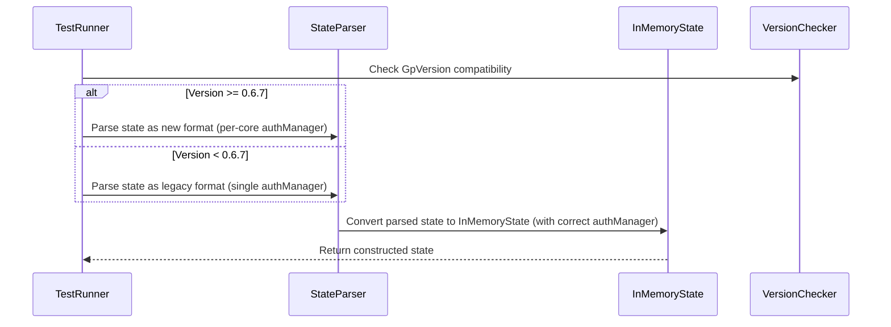
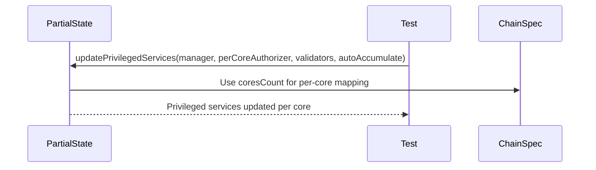

# Update Privileges (chi) to GP 0.6.7

## Pull Request by @DrEverr

resolves: #482


## Comment by @coderabbitai[bot]

<!-- This is an auto-generated comment: summarize by coderabbit.ai -->
<!-- This is an auto-generated comment: skip review by coderabbit.ai -->

> [!IMPORTANT]
> ## Review skipped
> 
> Auto incremental reviews are disabled on this repository.
> 
> Please check the settings in the CodeRabbit UI or the `.coderabbit.yaml` file in this repository. To trigger a single review, invoke the `@coderabbitai review` command.
> 
> You can disable this status message by setting the `reviews.review_status` to `false` in the CodeRabbit configuration file.

<!-- end of auto-generated comment: skip review by coderabbit.ai -->
<!-- walkthrough_start -->

<details>
<summary>📝 Walkthrough</summary>

<!-- This is an auto-generated comment: release notes by coderabbit.ai -->

## Summary by CodeRabbit

* **New Features**
  * Added backward compatibility for state and test data formats prior to version 0.6.7, allowing seamless loading and validation of older state dumps.

* **Bug Fixes**
  * Improved test and state handling logic to correctly process per-core authorization manager fields for versions >= 0.6.7.

* **Refactor**
  * Updated privileged services and related interfaces to use per-core authorization managers instead of a single service ID.
  * Enhanced test utilities and state construction to support version-dependent data structures and root hash calculations.

* **Tests**
  * Adjusted and extended tests to validate both legacy and current state formats, ensuring accurate coverage across versions.

<!-- end of auto-generated comment: release notes by coderabbit.ai -->
## Walkthrough

This set of changes migrates the representation of the `authManager` field from a single `ServiceId` to a per-core mapping (`PerCore<ServiceId>`) throughout the codebase, with full backward compatibility for pre-0.6.7 formats. This includes updates to state serialization/deserialization, test utilities, state initialization, transition logic, and associated type and codec definitions, along with extensive test and example data adjustments.

## Changes

| File(s)                                                                                       | Change Summary                                                                                                      |
|----------------------------------------------------------------------------------------------|--------------------------------------------------------------------------------------------------------------------|
| bin/test-runner/w3f/accumulate.ts                                                            | Added support for pre-0.6.7 and post-0.6.7 test state formats; conditional parsing/conversion logic for both.       |
| packages/jam/state-json/dump.ts, .../dump.pre067.example.json, .../dump.example.json          | Added pre-0.6.7 JSON dump support; updated schema for `chi.chi_a` to array; added/updated example dumps.            |
| packages/jam/state-json/dump.test.ts                                                         | Test updated to branch on version, using correct dump and parser for each.                                          |
| packages/jam/state/in-memory-state.ts, .../test.utils.ts, .../accumulate/accumulate-queue.test.ts | Changed `authManager` initialization to per-core mapping throughout helpers and tests.                              |
| packages/jam/state/privileged-services.ts                                                    | Refactored `PrivilegedServices` to use per-core `authManager` with version-aware codec and documentation updates.   |
| packages/jam/database-lmdb/states.test.ts, .../externalities/partial-state-db.test.ts         | Updated test setup: `authManager` now per-core via `tryAsPerCore`.                                                  |
| packages/jam/jam-host-calls/accumulate/bless.ts, .../bless.test.ts                           | `Bless` class and tests updated: constructor now takes `chainSpec`; `authManager` now per-core in logic and asserts.|
| packages/jam/jam-host-calls/externalities/partial-state-db.ts, .../partial-state-mock.ts, .../partial-state.ts | Updated interface and class method signatures for `updatePrivilegedServices` to accept per-core `authorizer`.        |
| packages/jam/jam-host-calls/externalities/state-update.ts                                    | Changed `AccumulationStateUpdate.privilegedServices.authorizer` to per-core type.                                   |
| packages/jam/state-merkleization/state-entries.test.ts                                       | Refined expected root hash logic to handle three-way version branching.                                             |
| packages/jam/transition/accumulate/accumulate.test.ts                                        | Refactored helper to accept `ChainSpec` and use per-core `authManager`.                                             |
| packages/jam/transition/accumulate/accumulate.ts                                             | Refined merge logic: per-core matching for updating `authQueues`.                                                   |

## Sequence Diagram(s)





## Estimated code review effort

5 (~2–3 hours)

## Poem

> In the warren of code, a change hops through,
> Each core gets its own manager—brand new!
> Backward we glance, old states in tow,
> With version checks guiding which way to go.
> A patchwork of hashes, tests, and lore—
> 🐇 Now every bunny’s auth is handled per-core!

</details>

<!-- walkthrough_end -->
<!-- internal state start -->


<!-- DwQgtGAEAqAWCWBnSTIEMB26CuAXA9mAOYCmGJATmriQCaQDG+Ats2bgFyQAOFk+AIwBWJBrngA3EsgEBPRvlqU0AgfFwA6NPEgQAfACgjoCEejqANiS4BVbrWolIABQqT4V0sgAUDBAEpIAkgAcWdIAAYNADYNAHYDADlsZgFKLgAWAE4sgxtEdMgAEQoAUSkKCiN9Y3AoMnp8ADMcAmIyZRp6JlZ2Ll5+YVFxKRl5JiUqVXUtHRqTKDhUVExWwlJyKi6FXoxOSCoAd0hEFOY0Cnk5BUmVNU1tXTBDWtMDNQwAehpEXDAKbAYTafQ4AZianzQDAYKWwFkcGlwiA4BgAROiDABiTGQACCAEl2ptHPRTqwLvJmoxYJgvGZYE4/LTpCg9hRFNgGE5TtxuPgKLhIE1+UFDvhIBVEPB8BhkFTcAygtJBb9HAcSLxpOxqNKMAAaSC0JDiDBEbBIBCmyBpXCHEhkCWUKUymQkYUUJyYehoJo0PghbgANSdusggaisTiGjxkHIxwY8MQyAABtBlQBlXCOVwkCLROLJlDINC0JT0YIezUFPZBRX4CyTE5ZmhC/nnXAGo1NJqUeBW859izyPu1py4WTcFlU3juTxOJrwEgN4sYeiwfDHZNoPCwACymDQpAohdQTFluABYjo0bgThIAA9jX2iJBUxnmyRCwm0Emi5AHzQq50JAhzqLA6CxiQm4ELi0KwvCNCZo4hZsAqii1tQCgYBUSKjpAABS6YAPKJGA3AXAU5bKk2ap9sEqzJviGC7iQzD8rISE0Ce56YFyBrYFKVrYPYJJBBOjIypKuoruWirJhesi4ogziUAAwvyn5CoCYihu6r7bgq+4YIelDJjedYNpQr5pr8nEkDmeYFowibIDSxYnPAzAeBcWFSTKkCoeu9ACHgkACSy8mXEp6aUBI8BcvitCFl66rcBY8WOCmBl7geR7JQw7K/kwHrIF2PYensQ4aPSTjJrBMLMHCjg2bgX4uQA5MghEkYaWpuGg6UAF46v5Fj4EQ8V/sJDjbMEZ5GuIMoDUOPAUbVmoAPqqlx6Crq+fK/FtH7JcgJBgVZb62cd/B8JduB2Q5+aFkok6rs+/BYAqEnMOR4hqOl47UqIADW6BENo56hEGIb+eGMTxNVBhMXhyYAhg9Xwc1yqFk02mLfqeFnn5WBNOyzBKr8NEtsEjHMax7F2SexYWIg4rnEoWELbqA0fXhxMGgUVg6VaX3oLy7IzmqRMw1ggWKOZ859jzSgav+ACO2ADeo4wMgwoM2naDqi9NonbZ6e2iw+k5XvQB0qh+f4lkIAmzeK4WE/yHpiL5MsBSQaHBT+wH+aLxOI7ipbqNzFgoD9/K4XpyYxRQcVciEP7JgaSexfFJCJZnr4KUpKkUOpHoF8m6k/Tq/3awXKXJgGwYUM6GDJR66ClsBwQ8nyAqjgU1LMogCv8BUy1YRe9ZCmNxwYBuJzCX3uECFCwOHBc3QsL98C14DoEKvwll8D89tqu67ZjNaVAYH473+cTQN6zJYWCS+Rq/H23vkS370pdLv9RrjUmlCYqRpTRVSMEYbEeILB+hGrKII4pRZKG/FsaS/AWhW3jsHPg3BsACHSgwf8ewo7SGqHiLu3QXLWXfNmD0jlCwH3AttSayZSYsHwqzNuu16DyXwBjRqCESCMz9gHZAlYSrsHepqMAEZ4gUzPi2C+1BqpQF3IoeAC5gLfl/HdUR1wSzgJfNo5cvCIKsOIXLPhME4JCMcKIvSACTQvhpkxFibFLiMzUZAOwM0dE0LqnYpqNAWrJhRJAXQkBVI0lNMBZMm0zbJT2gk/Ah0kliUnMgYIgJQz6IdgAHxgHQmgj0CzVUieozR2jSTNjYRw5gXCZSFjmjKLmS0LArR/oPBJHojrIXMak9J11V6UV5o/HoO896yB8Rorsi56C41vvjV8aNBEhJIGEpBnMo4dJWs4xRVMWRuLpp4ji10BLvTOl9W6LU7KIgEcE4RoiRT5PobmfMDz1nPOui9Bo98sBhyMKUT+7YdGKCcB6OKUF/zdnjlwAAEvAIgsA0QYgMBAMARhyJ6xMogT4Qg0DME+DNFQQcwAWGYLQAQnwzYj1PoiZEaLURYhxASIknRgJknOJcTBQ84mIBqrHZeRy2A1g3qde8gEyzbK/hYbAHNIqKWUmpDSOMyYowAALjknGkSoshaXXRxcDEy0Zkai1PowIOkBUSIHXHCegJtqaKjNnqVEHtzyXhWfKOSM44pzloMnVO0hCyCBEN7CVAVqkLK4KLLcO4jImWPDwCWlBxwGk1HFfAAkVoFEFEaL2uAVpxTQIXKKiAg250St4AATP4AuqB57HB/FKIg5BHVvzLcqkuZdNJoF5Olbu4pVgXCoPIBcnTgLMK7dFHOCVaC1vralEgolkyIGthoYq0h1KAlakETy0gDQDRlC+adcb12iHbmaMVmgYAIGQEyAVKNsqJrykKDVpa35WBOHOpw+IijbNLZOCgYAt0BX7dwe+LQCgp1zpAf9iADQeiaELFxEFPFOCIDfJqfARRbrABehgWiQE7n5PAYaKy2JKAsIjGBuI4GdAwcEFBoh4ToJdHy7BApcE8AIUQkh4hxDkIxZARI4pH1eG2Vx7YIp8GEMmtIwGqC2MIOQHaDu7MnAjgVKgMq1V0QsoxW8Y1eKCVErM8wMA65figeWvi0BmMaCfEIdIelypGUogM6yvEhINictJGcCkfKJPCdvIc046h5wijjQAISsEmQs1nBQMAnpGqjxGh2sgTAq82nd2nGRjmeX4XqRQXGvewLOJpZAxIhuma2BdDgMiwH2VUpCdQizknF1zbUW2snQJ0w5KWCgjzvaeWJpB0DdmGNkxUBUV3epaLF+LiBuKta5H14U2AT7KmRD+3AaG4wptnCQUgpJf0vwMoQBz9i0MweDYhyAsTaDpSEhgD0JYVDfqNDpJavLyIYHikevAV2nntZfHd3Oammt4W+/jILqBs2CipPySYR69qXbANdkJ70Idcih0bRUsPua8rPFmFrhphJEMyuHSOcPOmyANJbe81tth+o8Cdrl530CVDQMOT6ioW1powZGp1wFtOwA9GOHb2zkOoYgiFvrosCjzX/FYG976WAWOfN+7OsH50tOHVgUdvPJ4Q3eracU8AlCkJSzHXXwb84SgGtgaQ0Y6uiGI7bocjOXWiDaar1i7B+WnY1+TJVs69d5wXQARgiEummABtIuFbf3Vtj/4Rn5bK3zu8OngAumZIwYn+A3OD8c5BipLVjQmgwA0pP2QxxQxuA0IpKDsj4E9l7p7KBabZByLktBaNsoY+xxBzHCesYuKpzjzOcGNDwXxhTpChOCqSDKEgo8QvFg7ulLyrtBsQvMbQcU89BTpaaPITA8hpM8bk/xxT8hW3GVwFt13wLQWiQmJCkg0LjhundPsCxEaCkMytUMZmvKZoSsSlAVZmkn8F7vZqDk5i5kmB5qAXRr5h0FsFyoFrylSFvkKsmF1gls5L1kVheJyAQHwE2ugNCBqLhCOrTtHK+EyH2O7gwIWD/ESv7FZPKOJK+DVmwfVmavzrVA+KIHgJpNYj7oyBPDTD/OIANPcqLq4MdqdtniGo9j+NaPaLLNGnQLGr7irmVikBVimj/tKDmpfh5BArVNlGRhRrqIWLjn+kUAaKgJWPCAPtaNYcBqBhpNzmOnyvGmhG4I4c0j+pHvBkUCNksNvkEaeC6BQTbD4UKB4F3hBIdsbpSC0FYKaIfMmKwRgOwZuhpIgDunsEwmBHhGRhNAVvpKRmEQgoWBIM7iQDIVgIcFQLyFOtUeHiqqXGqq/ObnJEUewWZHek4PgKXiYTetkuKMmCoW4P6hzoGudoWB6AOFgNpONteDGNAEREUERDsOrn2N9plLWKgKLn+LwPgHFK3DzClB6MIuWOKI/MmEQNwJAAAHryLlJQLeb0bwL4zzEw6T6j5yhYKz7cbz68bybEKKaLir5QDqSeqUEij4GBLEErZ9YJIQFeAWYWawE2YIGQhIEkDObLaMqFii6vF5aZEwpcGoSFCFE0hCGiBcCCHFHCHv7iBgpbwcxQqLh/5woChcBAHwAgFeZGZYoGAmYElQFElJa2adL4oASUAFZkL4oKHwADQEYfhgDUqIjuZIieYYgYEcrYEBbkh4EtAEEGBhYK5GIrjCrxzBHJ49pDENJao6okB6qXCGoDLynmz0Dn5Il4QtZZhtYLbPqNHkamRO79QuaK5yTOAXCKEWDKEiSlLLHs7qHrGKLRg5hZpWFZz2FhEJmRotrIrtpa62GRHBrRHDFWj9EaHVp1oTG4i+hWSiwhZllxmDQJkrBJg1nATXBe7vT9GenlwgTVEjo87jrpG9GHxK7cENlwb/qQDeCtmp4LodmBCVjzbAR6SiwYApB6rBZlG9QLi1nXDyR9jVZsncmiClElQVGtRHpjRWhnpyRVZcnjEoBIhLhNDmQeEaheEsifra7ci/pNnTpAaUD+EaYQZQbrnrYIatgnwC4DlWTi5S6Ux5rCTRjF7TEMh8DV6TR4YyhTyN6zxl7b695Ty0CcjXgAl0Yj7T7j5ODKZT4gkz7Ly36L4InL5IkULF5b5SbQkyYL7wkCbay9RoLT7qZOCaYpm6ZaIgW8meSf6H5Ckwr/7wqQASlSnoqYrYr4nSCEkwHKmknqkUCakr6fA6l6lmyGkCBoFeYWl+ZWmLw2k5H0VCoK5hnHKV78E+p2E4XJpMk8F8B4WvhLFqF0AaE4nWJ8pxppkCi6mZkfhFACA9aoEuBCnZqIDe4NGhHxnJqRq+nejuRfq1RtlJTRhdl+iEy7HuGCioDVXoApjTkkDAANV6ANpvQpZoYKiYSizlkVV/g0FWzDCZZpAQR+FgbnC8ioUuHRESLUBkUYRG42FEDfrrX/qjzWKdSsh+j1EUXEKbEQzIA7HMi0At4YArQWr8GYCn4IJpWKjRUtVXHZmsWAkcV8VcUKUqZ8VUg36wl35L6CaiUiYsQBweRtrUCv5hR/W0BcCLF/WqErH5mR6IDeDnDGRHhcANVA7lWDkUAk27kGitHpQzT8i7ak1rDfKOBcAJ5M0aHpyIB54J557+BcASD4BW7cSkF6IZUZl2S5Ui14m4oKnmbWVwEqksyfB2UOVIlOXplZX6mOBuXUmQCABJhPFVjbmQGslQTblIUEzZNRTVwL1f1buXoDTVrPTS3FTZHolGTY8g1BsmzRzb+lzTzXzQLULUlH1roj1ZrUoTlXlbicGfioqQrSSXZirVKhqVrI5c5RYNrTQLrUiMmFpfyTcN/r/rCgAeKXQJKcwKATKeZbLZZQnUSsSfAcnarenerZndnSQGAGxHrB5eaWypgcSNsNykFvgbsavmFp5CKmbOronIGM7dQPyEUNQGgOqprnGtquJP6QahksGSBNocFXSQNKzK6f3MmL1RMWFqlU/sjR3FSJjf4tjXmUlQWXFefZHdlY4BonrPlWptoSFujXhMrv7t9ZQKdb6fvbdWjaHq+A1Qbq+HbQNZfYqKlVPWrtqCslWbQM7L8MBKAijtrvIPRHQdwIKDpsgIdhAyFEjjcqBIPNdeTndXEoPmxcPsCUxhXtxeCdPuDVJYJbJYicJuov7EFIjc/ijbSRjQlTjS/XjQTW7Q7g9egAo1WkoxICo/OgaEQL7dTZAJzT+IHfzRKCHYWIbQ/fQolWsXI8wBo1Hkerbaqh6Pbe7bQI7RKLYx7ZANo5AOzbo/o9zbzUY4LcLWHYEuLVlXZN/cDNLXHVZY3TZS3anfZW3ZZR3a5T3cDNSQXTpYKRYfpaKYARXSZYZmZXKRZfHfLfE4rbZUk2rakx/Z3X3Syl5VgabLgf5faZPXHP3DPUHiLtA8EHKjlijBfZkvOBqhvb6dvYGTtMGaPDfS/nfYtnJNI8/VY/dihCI+hG/eE1HQMnRJQE0FCE4JGgA4YU4KA7dKvZA1GvMseR+ntTrnA4Bgg4431Ug6BQ+uPXhBA+Fa0OuE0SshrCQC7uBkTVZJczA1BfWetVbtItoifMOjwIhctShVaFSLC9buIAiyNiRaXhJcEJdTdJPA3jPAvMpeBkoIjNAmw4xhxsDTxRCfxXPsS1DcJTDUI0ZVs6SDWbfU4JI0bY/SbasWbTY3o7o2gB42o1K1ozoy4waP44Y8HSE2Y6s6bedvI+K/K8oy4G8844o24+o1q4o7Kz437ZHgHYE8q6HSOAcxQEc+tu/ZlXsztCODLSanLdAVU0naqSnedSk9qQ02bFkwYCCnyTk8XcKaXYZcZVXdKaU7Ew3ZZgk7663QDOra5aLk04CYPf5r5Tyh0+PUKr88sxFeTQmbccBvvGBG/Wzuq3jaGkMN7H80Et7QhLqHZH4gMuHTcwA1C48/VbufA6WufXqx86NsgMFTNtyMkYs1MS0CEQCxVfA5IlqDWAhSBqi6tei9BrBRhVsNtWNbtXVWha4U7vKhvjS7Auw/S5wyDbxRgrwwJZDUJXJSvhQq4PgFW0Q/wQK4uw4UOVgL0pY8laGnaYEizfjJ239TE+U3E8m9U4k/6+m5ZZm39XrX296fbqo/A6O4MU4x89XQm3B4qa5UINwiSikNwBoA+ESmlBvuRzKGac0wPZaW035cFkWw6YqN1IkIaCvU2F6hI0BFhU4MDCQPIKiHfO6mlvocFDrLSCMU4LTaC1SFJwgBtGgO6t6dC/tYxRznwBEIBkbguabn2ObmKGdQZ8gAnhEAaBEHnsReKKRVZBJRS6pXFROpe1AuxTe2Pne4yzw1Cc+6y6+4I6vmJuQIjGG9pdsF/uqCXQZWKZAAADIbhEfgF10VPEpkcUfMU/QaCaiOQ0f3h0dWAaCMcYDMc5tsfD3tOcfDxGC4iQTHC8dpE675fUdFefK0c/TleVeJbaFpAOhGLASAiNjuuQHma5cyifDIOoBedmeIKlqTIehNZShSCRFZXxmkjGTcB2rTF8orfbxWD3hHKCeUEo3TpCLiD0eQS4OLKLjLijwEDcAUo/5LiQDieyDIBDOKoDTcA0gVytEUCA/wAVw2ir1ZzgzkgVz7fg9Zz+xQ+vjShZgVwmq8jI/JjwipAOAVwUDrgVxZjYAVx3xw8I+FwMho9ZyPj1wpL4O7oraIxQBbgWCA/XPrhmIW6BG86Qn/jIqwCCgU34DAQ1oACs0QYA9wj2D4gnz4p0UIsAPiyYIPYPX41FN1oow6C5fP0eNaAAHCgFixlDHOL5L9LwyGd8VvL/+Ir8r5D0zLGHCDRiJh8USucNxNlkoO5OlJTG7+SBtNE3ylKGd2GtNgaCun4LOYfAVBOAQFhv2ggMQt9z4MmKvCJ4gM/n4BXHQOL2L9HlkBDyzMmIEClML8BKhB9lmBmvKimDD+cBtINIWN4KWmxhNpb3L6aBnq+PX2gFtM3/BZAL70ji0Cn93ylKsKxKQ/IP7w39c9kcr/D+r3sJr1P4DNkcgInEQPgIoBDyWBXGKBgMDLIHT3ws0D2Bn4Xiz0j47/OUEVSJtnwB/CaN7Gb1L+oDL1bxePL8r6j1jxj+RFP6vgceAgPHrbyj6c9vQOvYPvAFD5NtcI06OFjbh5ix9SG40bokny+4Sc9sL8cvqGSR6kpleBPfALfxM5BEz0lnM8gNnYBuA38LPYno72F7K8yejsLAGHwjTVEzybANwMQlMS0AUwd8DaMwFJ4acseggiQM4X9jbJhegyQQUQELBUCXeLPSDMvzJyIIVex9DaDCEqDsBkkfCWmogA2iJg90G/GAXAPDS4RI+sAT8jHGnR4CFAu6J0JhWtBjRn4jOeKOJyRAZo+k2lLwN4JIAbRfB0gLaPGS0aawb4NAQ9OYhbRbZeI0gAANz9YT6f3CKFuhxLZE0qlndgQgOqL2DUIPAi7E7wGxrp1iyvL6Gj0GS09ucnoaAfKDtAWBNua/S/NAKsHK8GeewHEisDIEm5p06+WgkwF3SDALBWhOKFaAYghMqQRnFKEoDJxWB6A5AB7vxyzBZZ5UxiCCCUMjyNthh06eLm5GsHWgBocQrRtoUuYPY5APwNHPQEizMBEAiQkdpqCCHpDTOFA8UDQPDKk4zcVoPYZBT2gd9CEggW4esLGj4BgYwkIQTfx57yBp0KfcxCpwSHRCihduX4PyBMiF5uOisb9BBhXQtwZcGoKROu16izDOc/UIaFygdidcrUpDLbO9FQHx8MBk0FPgaEr6koj00IbNDWHWosjYRFwSwsgDNhiIChNgi7mIFfxXDdqKsNKPIAWHbA2uKiTQKw2vZ0t/OYJRSmDWC4stZMYXESpy2LwQ1QuAjbUQxXvYehYSh9RIeQ0dgtcCIxEPjqSna4SQV+5nK0DBm26DlakaoQgdkzi66U8mIpMuql3S7xtMuHreutNwNKVdKOBXBlKaXQKsdvK7HAtg1wFTFtqIekMaCWD/haQBsbXfkRSNk53M6SvcN0tz2Jh88UEVHTCu2AOFjJ/IkyGuB4Hkp+AQYxYcGJGQsTWxPcjoQBFgG8BNwZYGgcMBtGiAbQ4g/gEQrgxLBHcLAG8H7qfTQwpRukmYk9hSMW4pRLk6LcgKtF/hWglkP2AmL2UPw0F5ouyArCtCnrxxTo50PgCty2wVQkc148wnInhhxAKcP0a0T1FXF7RBY02D2DoPXRtIZEFEd6LuJWTblcYnSSWlRwABiZMJpDwleTgTP6NAIoNBNgncIykJfXqK9DWEhxFQEybePWIBgzJJi/4ZnHNXoDshDuew7qjBkwbaFj6bsAZuKFlzDBfxhaUiSzmAiUTBQ1EvSFYK7GtxPmZ1dkMxTxzXxeIloF8ESziqWpggneJwKvD1gbwKAW8auH9AbHVtD49YRsCuLbDUAR4CooEkqNBIsZVRj7dUTCX1H35DRYlcTN82CB6jNRBowTPIEC58V3OJYXvJcVKgaVouH+b0bk0S4FNy6wBONqZWDFTccu4YvLlR2zYtMh6OBDjmPUa7oi5xoqPptoSthehMsKQlGM8wgbelJmW9NvAan+E/1VoddEQnhAfBPgWyiEyCT9BgmcJuEOMPGLqBkLvi+OiAJsecGcFxo74m6UQTjCe70BTmuxRZA8xPbJhUQXAvVKiGHbdD/Ks0pwduUq5aAFy3gGaeeUoCoh60Y46JJ7GkB8g3oECBnB6mKyUFQwLbOtiKwLLZCbmtJQDCOTbQsEEAg0+AJp2ejwBC0K0ZhIjhAjdFIMVoD/m6w9JvM0RzXShq9XSjaFkwcEhqdwAwk3M6IIkliko1XbVh5xbA4+J1PO66SKA7YISRAzKhOD3qhCPnCjBYF8CQIZFWqIIOuYrAB2sDIdgcC2o9lYku0SEU1StEgS8k9UnKqhOakygkZWDGVMEG6Rjh70R8RsHKLNSChwo7kHMT1KgpeQ2M2yXsreKDx9DqG0fcCKyQ+nz9aq0FJ3qkEoBVSLUN8RAHKN0htSZQ/ZQyBbWTSJE0SKRccu9ixmQj2ucw3WUA2Nn6z3pn089qC0PKiQ+JivBQB6A6IAysRo0vomDPw6fhowREUvHwKNErVJwPLVWRcGep3ttBd4rcTBkRhxE8sJ4lNHcThYyA14yk1SVMg0njoRQ3vXsFrEGg45yRVHTfhqjSDuhlOvsCMHEANCd4lOhoDSj3lvheT+pQ0tIkuAol4i12dSfyBPwcCkMh5jckkeRg+pEt8GKkwhkPkVFMsGW3DNURxI1EyVrJHLZEpQjFnQzdSKYeGQLJ+hIzveBUXeEPNkR9zcZuYisRdJFEegfEEcGVHqN5n+R2EzvBGU1MaToSGE+YbwIRk5JPl2CRjcBXBOAB3zHAKEh+VAv7nwZTkDMD8INW2QSzzEByUWNpKsg5i25b4uUWdQWLuJ6YXiY6LMjk7HzLJQCoDvzLQWCyIFMoGBdbDgW1ZrYiCtCTKBQXcIEZBoWhWcjsj4K5ouxPCErIZC9T76A0+mWvTDxbTTZFAeadsmTBrTsim05aZoqXRri/qbEo6QBKtDkEvUoYIlvfRum417sWgBNI7LRExdC68XPSn6MMpIoUUGXWUomzDE61uBwMKwOvPxgzMu6bw13NGKZSeU4xrTOrklLtJccwslqIbFFj4AVAtEsgIeY9P5HcStCdqSbC1QgxDglxDsa4m5B0IOhD6sqW+KsNyxGITxPMCZLrEyaFULCxVUqkzk4kUSd+PEn8OBEjQzDKAXkW8tYRPbHi6cT8YGO9C0R8xfYkaLDEeVwx8ASAGsHmMEHkRi8DQLwngGkilDJl8l3w2IoqEOzSS+8okyCrWElxgAZxOyOnFwDmWhxfYqAJZY4BWXqxNYMcTZc+KPRWijlAyv8LNRtiJCnleEl5ZKihBFp5AWy4lvImiAdTM0vIg4H0oKXgRUAwKroIkJc4UA6G7RCCEc06SKTQYAKwpVcUohCSFcyGPsCFTvBkSUipK8CHCMrk1i9CHcBPlQJ8iPxn+X8EEtSwBp+cTJE+MyRxifYny4SZ8rUkXnXx+Tw2AUyNvk39FpdDgvi2uiGOy7hLPgfYbunQtkCNMYxsSnzLV0SmJjkpyY1KUFX0LTtWQUcZuR9RbYvpnFU8hsLrNrbCt7FkOTgqmgFAUy40Ei3BQiCaHOE6kViblkWSKqlkyqOUcFpVW0LmcMyO3bqnWT06nsmy64l8DuRcbeA48nZbsqJzLztU/w8a10Xg3chLUAi38uds2QzXxze0BcObGDk5kZCqQeRIgIfDWVfL1Zpy7abhjtJXltyhGV8tunZGtRu+/EpcIHg5FSCaYyeBqtmvrRCTPCxzI2TCz3YAZB+5ajuM2t3ZREMKicR1TGomJ4ttqNivgPXmnhN5jgKwKbDbH5W+djJXarhiKsQRirLJTkyVe+xEziV7Jd7BZq/jlBP9D55k5hdJQlXQ0tSIEHvJS286uKI2CXKNkl0KahTVVZTLLoSTNhOV3VdAAjOdjilxKEp1pU1UkpSlhZz6WG9Zp6tFp/0oG/iOkvJNjIOzD1zq+gCTLvErRRkwcUQgJKumlsy5BAJgDRnaUlkSqZ0xdq+krL0SmZ2HfXApQhQ1UtcfXKYuRGBbxVQQNaI9c3mcGlivG7s3gqsvWXfKFifxCuAeqTSO9UEcmpNRuyQoSRJ0e4rcnh17T6tVGg1QIOmpYIQoGAF9aMFBNbzZzFwGSmWA9g/4Kz5c1FACJjmUkSRUEGEZLJJDTSuhbQuhZNU8xZkT9kWm7AIhkOuCeEMoo1F1MbMOoAYoQhUZmIVjKKb4kiJWa8RbFepAhpiSlKDY9K3nGIc56oFDKxLGqCgxNTqxtAvBHaIMHaGxNmVhRHRSa4GTVJgnsjOkoJ8ADUDBqGB6BzFzEyGUeethsAAAlFLmpia1MT2tcuU8jCkfj/w2MWS2LVGvE3JpCaeKf5g4Q+rAsXcyAYDBHI3wkTzxAoHbR3HVJAQ6SuUvABpPDJ6R8Jakl+UROmUPZScEWtAFFqLrEJB5poS4Rlps2w7F4vIeOLvKMn7yAuQG0VRZNA1ss32sNFElVvRK9qqNCDcjaB1jokcAlTmOxdhpcL0ocSArSFj1qY0QNMOGqaTVHlw6DaXGg1HxJxEmiVs00M/dSKgjA7k6yNIHV+kB38VRTHAmGyxjhrxp60BWX+Xga8lM1vpOdmuQop5o0DYA1NWgRAERGU0u5nN86PQN4HjxItiYhpDUA0CDwa7ztoW/Xagl6q+ADdRumtCbrN1oBgWluqPNbv8BLogdQWyAHoAAC8kQZ8QiMh1SpItFwB0fhJi1hyKAg6QLd2IMlQAigc20wivxWRLb2ANG0Oa8ifr1sNm5OlKOoAfQk6xAsmKfMyRxEVg3QB205Udt9gLiUWARcRkswu3OLZVsXcFIFIQ3BTIA3i1FEGL8U06FdTmBlP9pZh4ajV8YhJURoCqpTriU7H5tRH5HFq7VKyJ4kuB0o8QOhuJBfeICX1503cHYhcF7hm2+pKduG7XQmWplv1T4jiW2c1i+b3V+2J7IrQ5tnW7l51mE+iEjrAzbrU1CGCPuHLzTaKgDWanNfxE7RTlwZPs3sk+ROC368tuoSlfZJdSzsUa99F/cmh05MyADYBzdbZtQy4HAqSRTAN1ugClB0w0ADaCwdxBMGNoG2oiERGgCO9Hpckr0JiKNxTb6i+Et6PjC4Dh7s9Om5ZcSw7UbKFifY7sQOIiBDiRx9cf5aiuonW9gZEif2FtnbSJDpDrcSFWIBWjJhBxw4sXqGluhWGhxBcUWEiuKooqqJgKsCosyMMl4yKeKjqbUSViN5loxK1w/0rJW3UKVE7YSf3iuUKgbldyyZcwUjIrpGgvG5wwJC163LeciMc1HJCYMsG2D0ADg6UHbhjoOpNAqEdUW+6vhUQEQe8BEAYARBGjTR5oy0daNtH2jHRzo20a0WVLa9QcxkONPuXRx2NQcRoFxrDiQBfNWe0w7IfeXyGDN2i+wwWA6lwjLR0ec3rIBbAyCO+uhl8NuRqN1GujRxzo/NO76NYe82hdPZnu40cYP+DDZbpAD15S9NjTgbY7L12MOaDjxx446cbwPMhO4ODXCKLFbVaTeN9gu0TJN30Ow9IcYKyKWMRjHrXOP6ofsAmIQNyBOla/9dUPMKYy71tLLHSqNBrAbHJp88DZ+qgBdttgeo8ggwesjMHWD7Bzg9wd4Owc0NpHD8N8HcyL6mdqiiCBbkyPyBxD+WRQ3yYlz2gBTQxjpD7MYLCmY4LSkGM4MbjQwVDSxq/kZSYXUn6DNYVMPSYKNFHWT6q9DRyYv0eAeTqRCTEPNWMto5tupbYNCOwHTTaj9R74y6ddNumtFwQBavbr+RAQ9gOyuciibiR8B7BOx7/juJFDabo9r4ZQ4JNVOMKCxIG48l/sLglJNIbreXZqpNNX6cS45cbEPOA4yMKNeORxYxrM1lzv2f+wrWupeZUHPZGLNdeEcnK1q1UQ+txT6KCn+jY2KGjMxeEwBSgwlWOYRGSTbY60HtG+aJdV3il5sR6tpDfV02nofhZ6EzOSJvV1QlTwlnBCyg9L225S40zZmcqwvNmV5d9Bhr4onEg4kAAAii7hdyOG5IJB4adPNdVcaCzazKnfdLGm/6yD/+6s9uQQOKMQDgQSgz3q3Wmd6zu6mIkJIyGnhdN8nL2ZmKyJgXciZANteBAUOGa8IBiy8iVEAMPl/yG6NIe+Uwk/luQa5AA3+azzAGc1pfC2NDi6Ixzq1M6AYnWvQOzZMDhGT3AgiEnb7RYdyuNA+b/AYz2AYuLjZan5HfmqzEFmsyBZUposXw4Fxsghgx2A0OGhJh9rjsTMvtnJUqr9XZOHiSUQu76sk65Jx2IIPJHMcXOpW7D6ZwpM+tk+Zl7OygTxw5xzBSUHMIgJzsYlffEpNWj1iN5qlJamPZx9SBc5JIIJbNLn5iMsv2n6OyE24QNEAPof2Jfj2iXNQloYZ4qJBkUQwsDHuO/aplHjvaR+hcPC/Avqw3NtwRAG9GOUvwsxLc3TfLbVHwuXoxmo8Qorpor23SG2WkZZKGE/PMNAMJDQUCO2ascEtx3BH6ueGSN8p3NpaBcPeGAhKAjmcIW9MXMhadVoc4UOkqvoaVIWB9TGorQ9j6HPat0yB/M/uc0isLWLFzOK3C1JAboDpsoDtewC6WzY5CCxBtTmRl3dXmEkJgiqedjALxyISYCKH+TKstWrYRCSwMRPnNuksOq5v0uuYySRospP22pV71qgXXkGWoeigCZdiPYgb5G09kaM+t0AmRaAGZR1lYhYSndNYXCQMZyscX8r+MU6mBgGE1gD27M1YDSBUlf56AzKpzt4asinrDkguTKhxgpYDQ/Q/1K9pjs4rY7n1fPEk2BvZY6WoAUE5M3+o7h/tSbnVj1Xjht2mMWCHVp/XI1gXRJwbDAJdOmdn3fAIrA58ki5ZuzjmTSK2L0SPoVWeLkuXZ6fWqsil22+zzl9y05mDvjmYl/dbywRvzZ+W5zs2ACSsjNCbwclJi4gzuGvMgtNCb9bgaQA0LQd/EKVblr23GnhqOlka42Cnbgg6CxjZ43jRsMUYoRqATYvhAJYbhmxKTG+a2ggnTuPamE2hU/IiKap5rWqzIPw5ITPXx3FtrSuUE9WHALs276HTu/jG7uZ2KGh3RQYjpaxws8IwIr4ncQuiL3dQy9lbB1OuI0xsoR9vQXhBQyHgo1R99uzaye2HM2wnGmuyjBcKO52wTY61cVBKjHS1hbOss+UfQBkNZsms7U1uiYhKB7w83fQzeVpUoma82yb8TpCkArRrii7C+wJloEsrON4GXAHfGdENmMtL21kFA9Zml4j2KWzDGNFXiFZWleJvefLbUtMtX1+OrUefNsm42D5it4llranB47+GH68MuZZg3+SPb8GxVTGyKZhSSmzwV4PUD2hUgMcO11STei4BHBo7vKcchCimD3BZgTwQwAsBOLqBAh/AjaB4roD9J+4NQAwEY4YDZBo8pYAQNHkcfR4jmoIHIDWlBAMAxeGQAQNkC8dxBHHAgGtE0H15i8sgGQOIFkBrTR4DH8j4x7gFMeGCLHtADaA0HidGPmADAbgFoPC1SorHgoGx8mBKcGAAA3gYEiSohN7KKJEKiDZp549QlTm1MpIBymhEA9TnxnngMAABfAwCU/zq2O6gAUHJ3k72AAR0ne0fQEAA -->

<!-- internal state end -->
<!-- tips_start -->

---


<details>
<summary>🪧 Tips</summary>

### Chat

There are 3 ways to chat with [CodeRabbit](https://coderabbit.ai?utm_source=oss&utm_medium=github&utm_campaign=FluffyLabs/typeberry&utm_content=499):

- Review comments: Directly reply to a review comment made by CodeRabbit. Example:
  - `I pushed a fix in commit <commit_id>, please review it.`
  - `Explain this complex logic.`
  - `Open a follow-up GitHub issue for this discussion.`
- Files and specific lines of code (under the "Files changed" tab): Tag `@coderabbitai` in a new review comment at the desired location with your query. Examples:
  - `@coderabbitai explain this code block.`
- PR comments: Tag `@coderabbitai` in a new PR comment to ask questions about the PR branch. For the best results, please provide a very specific query, as very limited context is provided in this mode. Examples:
  - `@coderabbitai gather interesting stats about this repository and render them as a table. Additionally, render a pie chart showing the language distribution in the codebase.`
  - `@coderabbitai read src/utils.ts and explain its main purpose.`
  - `@coderabbitai read the files in the src/scheduler package and generate a class diagram using mermaid and a README in the markdown format.`

### Support

Need help? Create a ticket on our [support page](https://www.coderabbit.ai/contact-us/support) for assistance with any issues or questions.

### CodeRabbit Commands (Invoked using PR comments)

- `@coderabbitai pause` to pause the reviews on a PR.
- `@coderabbitai resume` to resume the paused reviews.
- `@coderabbitai review` to trigger an incremental review. This is useful when automatic reviews are disabled for the repository.
- `@coderabbitai full review` to do a full review from scratch and review all the files again.
- `@coderabbitai summary` to regenerate the summary of the PR.
- `@coderabbitai generate sequence diagram` to generate a sequence diagram of the changes in this PR.
- `@coderabbitai resolve` resolve all the CodeRabbit review comments.
- `@coderabbitai configuration` to show the current CodeRabbit configuration for the repository.
- `@coderabbitai help` to get help.

### Other keywords and placeholders

- Add `@coderabbitai ignore` anywhere in the PR description to prevent this PR from being reviewed.
- Add `@coderabbitai summary` to generate the high-level summary at a specific location in the PR description.
- Add `@coderabbitai` anywhere in the PR title to generate the title automatically.

### Documentation and Community

- Visit our [Documentation](https://docs.coderabbit.ai) for detailed information on how to use CodeRabbit.
- Join our [Discord Community](http://discord.gg/coderabbit) to get help, request features, and share feedback.
- Follow us on [X/Twitter](https://twitter.com/coderabbitai) for updates and announcements.

</details>

<!-- tips_end -->


## Comment by @github-actions[bot]


<details>
<summary>View all</summary>

| File | Benchmark | Ops |  |
|------|-----------|-----|--|
| [bytes/hex-to.ts[0]](../blob/bd422f5249381b0ebaac4b16d1af22f27ad62166//_work/typeberry-1/typeberry/typeberry/benchmarks/bytes/hex-to.ts) | number toString + padding | 333634.18 ±0.09% | fastest ✅ |
| [bytes/hex-to.ts[1]](../blob/bd422f5249381b0ebaac4b16d1af22f27ad62166//_work/typeberry-1/typeberry/typeberry/benchmarks/bytes/hex-to.ts) | manual | 16453.57 ±0.23% | 95.07% slower |
| [codec/decoding.ts[0]](../blob/bd422f5249381b0ebaac4b16d1af22f27ad62166//_work/typeberry-1/typeberry/typeberry/benchmarks/codec/decoding.ts) | manual decode | 23154135.56 ±0.64% | 86.56% slower |
| [codec/decoding.ts[1]](../blob/bd422f5249381b0ebaac4b16d1af22f27ad62166//_work/typeberry-1/typeberry/typeberry/benchmarks/codec/decoding.ts) | int32array decode | 162663925.49 ±3.33% | 5.57% slower |
| [codec/decoding.ts[2]](../blob/bd422f5249381b0ebaac4b16d1af22f27ad62166//_work/typeberry-1/typeberry/typeberry/benchmarks/codec/decoding.ts) | dataview decode | 172250929.06 ±2.73% | fastest ✅ |
| [collections/map-set.ts[0]](../blob/bd422f5249381b0ebaac4b16d1af22f27ad62166//_work/typeberry-1/typeberry/typeberry/benchmarks/collections/map-set.ts) | 2 gets + conditional set | 121411.3 ±0.13% | fastest ✅ |
| [collections/map-set.ts[1]](../blob/bd422f5249381b0ebaac4b16d1af22f27ad62166//_work/typeberry-1/typeberry/typeberry/benchmarks/collections/map-set.ts) | 1 get 1 set | 61725.67 ±0.03% | 49.16% slower |
| [math/switch.ts[0]](../blob/bd422f5249381b0ebaac4b16d1af22f27ad62166//_work/typeberry-1/typeberry/typeberry/benchmarks/math/switch.ts) | switch | 248210334.93 ±8.53% | 3.98% slower |
| [math/switch.ts[1]](../blob/bd422f5249381b0ebaac4b16d1af22f27ad62166//_work/typeberry-1/typeberry/typeberry/benchmarks/math/switch.ts) | if | 258487348.33 ±7.06% | fastest ✅ |
| [codec/bigint.decode.ts[0]](../blob/bd422f5249381b0ebaac4b16d1af22f27ad62166//_work/typeberry-1/typeberry/typeberry/benchmarks/codec/bigint.decode.ts) | decode custom | 175058298.69 ±2.68% | fastest ✅ |
| [codec/bigint.decode.ts[1]](../blob/bd422f5249381b0ebaac4b16d1af22f27ad62166//_work/typeberry-1/typeberry/typeberry/benchmarks/codec/bigint.decode.ts) | decode bigint | 109376414.91 ±2.17% | 37.52% slower |
| [codec/encoding.ts[0]](../blob/bd422f5249381b0ebaac4b16d1af22f27ad62166//_work/typeberry-1/typeberry/typeberry/benchmarks/codec/encoding.ts) | manual encode | 3066750.81 ±0.2% | 16.86% slower |
| [codec/encoding.ts[1]](../blob/bd422f5249381b0ebaac4b16d1af22f27ad62166//_work/typeberry-1/typeberry/typeberry/benchmarks/codec/encoding.ts) | int32array encode | 3688693.13 ±0.15% | fastest ✅ |
| [codec/encoding.ts[2]](../blob/bd422f5249381b0ebaac4b16d1af22f27ad62166//_work/typeberry-1/typeberry/typeberry/benchmarks/codec/encoding.ts) | dataview encode | 3680665.54 ±0.16% | 0.22% slower |
| [bytes/hex-from.ts[0]](../blob/bd422f5249381b0ebaac4b16d1af22f27ad62166//_work/typeberry-1/typeberry/typeberry/benchmarks/bytes/hex-from.ts) | parse hex using `Number` with NaN checking | 145944.9 ±0.12% | 83.84% slower |
| [bytes/hex-from.ts[1]](../blob/bd422f5249381b0ebaac4b16d1af22f27ad62166//_work/typeberry-1/typeberry/typeberry/benchmarks/bytes/hex-from.ts) | parse hex from char codes | 903289.41 ±0.08% | fastest ✅ |
| [bytes/hex-from.ts[2]](../blob/bd422f5249381b0ebaac4b16d1af22f27ad62166//_work/typeberry-1/typeberry/typeberry/benchmarks/bytes/hex-from.ts) | parse hex from string nibbles | 563674.65 ±0.18% | 37.6% slower |
| [codec/bigint.compare.ts[0]](../blob/bd422f5249381b0ebaac4b16d1af22f27ad62166//_work/typeberry-1/typeberry/typeberry/benchmarks/codec/bigint.compare.ts) | compare custom | 256345301.51 ±7.62% | fastest ✅ |
| [codec/bigint.compare.ts[1]](../blob/bd422f5249381b0ebaac4b16d1af22f27ad62166//_work/typeberry-1/typeberry/typeberry/benchmarks/codec/bigint.compare.ts) | compare bigint | 248666429.16 ±6.4% | 3% slower |
| [hash/index.ts[0]](../blob/bd422f5249381b0ebaac4b16d1af22f27ad62166//_work/typeberry-1/typeberry/typeberry/benchmarks/hash/index.ts) | hash with numeric representation | 192.85 ±0.04% | 27.37% slower |
| [hash/index.ts[1]](../blob/bd422f5249381b0ebaac4b16d1af22f27ad62166//_work/typeberry-1/typeberry/typeberry/benchmarks/hash/index.ts) | hash with string representation | 119.41 ±0.13% | 55.03% slower |
| [hash/index.ts[2]](../blob/bd422f5249381b0ebaac4b16d1af22f27ad62166//_work/typeberry-1/typeberry/typeberry/benchmarks/hash/index.ts) | hash with symbol representation | 184.51 ±0.03% | 30.52% slower |
| [hash/index.ts[3]](../blob/bd422f5249381b0ebaac4b16d1af22f27ad62166//_work/typeberry-1/typeberry/typeberry/benchmarks/hash/index.ts) | hash with uint8 representation | 164.89 ±0.03% | 37.9% slower |
| [hash/index.ts[4]](../blob/bd422f5249381b0ebaac4b16d1af22f27ad62166//_work/typeberry-1/typeberry/typeberry/benchmarks/hash/index.ts) | hash with packed representation | 265.54 ±0.04% | fastest ✅ |
| [hash/index.ts[5]](../blob/bd422f5249381b0ebaac4b16d1af22f27ad62166//_work/typeberry-1/typeberry/typeberry/benchmarks/hash/index.ts) | hash with bigint representation | 194.24 ±0.1% | 26.85% slower |
| [hash/index.ts[6]](../blob/bd422f5249381b0ebaac4b16d1af22f27ad62166//_work/typeberry-1/typeberry/typeberry/benchmarks/hash/index.ts) | hash with uint32 representation | 205.04 ±0.03% | 22.78% slower |
| [logger/index.ts[0]](../blob/bd422f5249381b0ebaac4b16d1af22f27ad62166//_work/typeberry-1/typeberry/typeberry/benchmarks/logger/index.ts) | console.log with string concat | 8065510.23 ±40.21% | fastest ✅ |
| [logger/index.ts[1]](../blob/bd422f5249381b0ebaac4b16d1af22f27ad62166//_work/typeberry-1/typeberry/typeberry/benchmarks/logger/index.ts) | console.log with args | 71986.25 ±61.71% | 99.11% slower |
| [math/add_one_overflow.ts[0]](../blob/bd422f5249381b0ebaac4b16d1af22f27ad62166//_work/typeberry-1/typeberry/typeberry/benchmarks/math/add_one_overflow.ts) | add and take modulus | 264539158.88 ±5.29% | fastest ✅ |
| [math/add_one_overflow.ts[1]](../blob/bd422f5249381b0ebaac4b16d1af22f27ad62166//_work/typeberry-1/typeberry/typeberry/benchmarks/math/add_one_overflow.ts) | condition before calculation | 259268095.55 ±6.59% | 1.99% slower |
| [math/count-bits-u32.ts[0]](../blob/bd422f5249381b0ebaac4b16d1af22f27ad62166//_work/typeberry-1/typeberry/typeberry/benchmarks/math/count-bits-u32.ts) | standard method | 80248764.34 ±1.56% | 68.66% slower |
| [math/count-bits-u32.ts[1]](../blob/bd422f5249381b0ebaac4b16d1af22f27ad62166//_work/typeberry-1/typeberry/typeberry/benchmarks/math/count-bits-u32.ts) | magic | 256024023.39 ±5.81% | fastest ✅ |
| [math/count-bits-u64.ts[0]](../blob/bd422f5249381b0ebaac4b16d1af22f27ad62166//_work/typeberry-1/typeberry/typeberry/benchmarks/math/count-bits-u64.ts) | standard method | 4402488.18 ±0.24% | 95.23% slower |
| [math/count-bits-u64.ts[1]](../blob/bd422f5249381b0ebaac4b16d1af22f27ad62166//_work/typeberry-1/typeberry/typeberry/benchmarks/math/count-bits-u64.ts) | magic | 92232614.27 ±1.34% | fastest ✅ |
| [math/mul_overflow.ts[0]](../blob/bd422f5249381b0ebaac4b16d1af22f27ad62166//_work/typeberry-1/typeberry/typeberry/benchmarks/math/mul_overflow.ts) | multiply and bring back to u32 | 267285036.63 ±5.79% | fastest ✅ |
| [math/mul_overflow.ts[1]](../blob/bd422f5249381b0ebaac4b16d1af22f27ad62166//_work/typeberry-1/typeberry/typeberry/benchmarks/math/mul_overflow.ts) | multiply and take modulus | 204684537.89 ±15.41% | 23.42% slower |
| [bytes/compare.ts[0]](../blob/bd422f5249381b0ebaac4b16d1af22f27ad62166//_work/typeberry-1/typeberry/typeberry/benchmarks/bytes/compare.ts) | Comparing Uint32 bytes | 12027.32 ±40.51% | 36% slower |
| [bytes/compare.ts[1]](../blob/bd422f5249381b0ebaac4b16d1af22f27ad62166//_work/typeberry-1/typeberry/typeberry/benchmarks/bytes/compare.ts) | Comparing raw bytes | 18792.24 ±0.12% | fastest ✅ |
| [hash/blake2b.ts[0]](../blob/bd422f5249381b0ebaac4b16d1af22f27ad62166//_work/typeberry-1/typeberry/typeberry/benchmarks/hash/blake2b.ts) | hasher with simple allocator | 0.046 ±0.54% | fastest ✅ |
| [hash/blake2b.ts[1]](../blob/bd422f5249381b0ebaac4b16d1af22f27ad62166//_work/typeberry-1/typeberry/typeberry/benchmarks/hash/blake2b.ts) | hasher with page allocator | 0.045 ±0.82% | 2.17% slower |
| [codec/view_vs_object.ts[0]](../blob/bd422f5249381b0ebaac4b16d1af22f27ad62166//_work/typeberry-1/typeberry/typeberry/benchmarks/codec/view_vs_object.ts) | Get the first field from Decoded | 276504.19 ±3.19% | 37.22% slower |
| [codec/view_vs_object.ts[1]](../blob/bd422f5249381b0ebaac4b16d1af22f27ad62166//_work/typeberry-1/typeberry/typeberry/benchmarks/codec/view_vs_object.ts) | Get the first field from View | 92029.59 ±0.22% | 79.1% slower |
| [codec/view_vs_object.ts[2]](../blob/bd422f5249381b0ebaac4b16d1af22f27ad62166//_work/typeberry-1/typeberry/typeberry/benchmarks/codec/view_vs_object.ts) | Get the first field as view from View | 81740.2 ±3.42% | 81.44% slower |
| [codec/view_vs_object.ts[3]](../blob/bd422f5249381b0ebaac4b16d1af22f27ad62166//_work/typeberry-1/typeberry/typeberry/benchmarks/codec/view_vs_object.ts) | Get two fields from Decoded | 440418.6 ±0.26% | fastest ✅ |
| [codec/view_vs_object.ts[4]](../blob/bd422f5249381b0ebaac4b16d1af22f27ad62166//_work/typeberry-1/typeberry/typeberry/benchmarks/codec/view_vs_object.ts) | Get two fields from View | 82584.3 ±0.09% | 81.25% slower |
| [codec/view_vs_object.ts[5]](../blob/bd422f5249381b0ebaac4b16d1af22f27ad62166//_work/typeberry-1/typeberry/typeberry/benchmarks/codec/view_vs_object.ts) | Get two fields from materialized from View | 159656.01 ±1.58% | 63.75% slower |
| [codec/view_vs_object.ts[6]](../blob/bd422f5249381b0ebaac4b16d1af22f27ad62166//_work/typeberry-1/typeberry/typeberry/benchmarks/codec/view_vs_object.ts) | Get two fields as views from View | 80779.42 ±0.25% | 81.66% slower |
| [codec/view_vs_object.ts[7]](../blob/bd422f5249381b0ebaac4b16d1af22f27ad62166//_work/typeberry-1/typeberry/typeberry/benchmarks/codec/view_vs_object.ts) | Get only third field from Decoded | 435322.92 ±0.23% | 1.16% slower |
| [codec/view_vs_object.ts[8]](../blob/bd422f5249381b0ebaac4b16d1af22f27ad62166//_work/typeberry-1/typeberry/typeberry/benchmarks/codec/view_vs_object.ts) | Get only third field from View | 102368.11 ±0.56% | 76.76% slower |
| [codec/view_vs_object.ts[9]](../blob/bd422f5249381b0ebaac4b16d1af22f27ad62166//_work/typeberry-1/typeberry/typeberry/benchmarks/codec/view_vs_object.ts) | Get only third field as view from View | 100030.89 ±0.68% | 77.29% slower |
| [codec/view_vs_collection.ts[0]](../blob/bd422f5249381b0ebaac4b16d1af22f27ad62166//_work/typeberry-1/typeberry/typeberry/benchmarks/codec/view_vs_collection.ts) | Get first element from Decoded | 23755.03 ±2.23% | 57.67% slower |
| [codec/view_vs_collection.ts[1]](../blob/bd422f5249381b0ebaac4b16d1af22f27ad62166//_work/typeberry-1/typeberry/typeberry/benchmarks/codec/view_vs_collection.ts) | Get first element from View | 56124.71 ±0.56% | fastest ✅ |
| [codec/view_vs_collection.ts[2]](../blob/bd422f5249381b0ebaac4b16d1af22f27ad62166//_work/typeberry-1/typeberry/typeberry/benchmarks/codec/view_vs_collection.ts) | Get 50th element from Decoded | 26171.02 ±0.66% | 53.37% slower |
| [codec/view_vs_collection.ts[3]](../blob/bd422f5249381b0ebaac4b16d1af22f27ad62166//_work/typeberry-1/typeberry/typeberry/benchmarks/codec/view_vs_collection.ts) | Get 50th element from View | 36693.63 ±0.48% | 34.62% slower |
| [codec/view_vs_collection.ts[4]](../blob/bd422f5249381b0ebaac4b16d1af22f27ad62166//_work/typeberry-1/typeberry/typeberry/benchmarks/codec/view_vs_collection.ts) | Get last element from Decoded | 25427.24 ±0.68% | 54.7% slower |
| [codec/view_vs_collection.ts[5]](../blob/bd422f5249381b0ebaac4b16d1af22f27ad62166//_work/typeberry-1/typeberry/typeberry/benchmarks/codec/view_vs_collection.ts) | Get last element from View | 22059.34 ±0.67% | 60.7% slower |
| [collections/map_vs_sorted.ts[0]](../blob/bd422f5249381b0ebaac4b16d1af22f27ad62166//_work/typeberry-1/typeberry/typeberry/benchmarks/collections/map_vs_sorted.ts) | Map | 306445.65 ±0.06% | fastest ✅ |
| [collections/map_vs_sorted.ts[1]](../blob/bd422f5249381b0ebaac4b16d1af22f27ad62166//_work/typeberry-1/typeberry/typeberry/benchmarks/collections/map_vs_sorted.ts) | Map-array | 103502 ±0.03% | 66.23% slower |
| [collections/map_vs_sorted.ts[2]](../blob/bd422f5249381b0ebaac4b16d1af22f27ad62166//_work/typeberry-1/typeberry/typeberry/benchmarks/collections/map_vs_sorted.ts) | Array | 81025.42 ±0.3% | 73.56% slower |
| [collections/map_vs_sorted.ts[3]](../blob/bd422f5249381b0ebaac4b16d1af22f27ad62166//_work/typeberry-1/typeberry/typeberry/benchmarks/collections/map_vs_sorted.ts) | SortedArray | 195510.65 ±0.21% | 36.2% slower |
| [crypto/ed25519.ts[0]](../blob/bd422f5249381b0ebaac4b16d1af22f27ad62166//_work/typeberry-1/typeberry/typeberry/benchmarks/crypto/ed25519.ts) | native crypto | 5.34 ±18.27% | 82.1% slower |
| [crypto/ed25519.ts[1]](../blob/bd422f5249381b0ebaac4b16d1af22f27ad62166//_work/typeberry-1/typeberry/typeberry/benchmarks/crypto/ed25519.ts) | wasm lib | 10.66 ±0.02% | 64.28% slower |
| [crypto/ed25519.ts[2]](../blob/bd422f5249381b0ebaac4b16d1af22f27ad62166//_work/typeberry-1/typeberry/typeberry/benchmarks/crypto/ed25519.ts) | wasm lib batch | 29.84 ±0.54% | fastest ✅ |
</details>


### Benchmarks summary: 63/63 OK ✅

<!-- thollander/actions-comment-pull-request "benchmarks" -->


## Comment by @coderabbitai[bot]

_💡 Verification agent_

<details>
<summary>❓ Verification inconclusive</summary>

**Verify array length validation for `authManager`.**

The schema correctly expects an array for `chi_a`, but the direct assignment at line 159 bypasses `tryAsPerCore` validation. Ensure the array length matches `spec.coresCount`.


Also applies to: 159-159

---

🏁 Script executed:

```shell
#!/bin/bash
# Check if there's validation for chi_a array length in the codebase
rg -A 5 -B 5 "chi_a.*length|authManager.*length" --type ts
```

Length of output: 60

---


</details>

**Add missing array length validation for `chi_a`.**

We didn’t find any checks ensuring `chi_a`’s length matches `spec.coresCount` before assigning it to `authManager`. Please add a validation step similar to the removed `tryAsPerCore` wrapper.

• File: `packages/jam/state-json/dump.ts` around line 159  
• Example fix:
```diff
- authManager = chi.chi_a
+ if (chi.chi_a.length !== spec.coresCount) {
+   throw new Error(
+     `Invalid chi_a array: expected length ${spec.coresCount}, got ${chi.chi_a.length}`
+   );
+ }
+ authManager = chi.chi_a;
```

<details>
<summary>🤖 Prompt for AI Agents</summary>

```
In packages/jam/state-json/dump.ts around line 94, add a validation step to
check that the length of the array `chi_a` matches `spec.coresCount` before
assigning it to `authManager`. This should be similar to the previously removed
`tryAsPerCore` wrapper, ensuring the array length is correct to prevent runtime
errors.
```

</details>

<!-- fingerprinting:phantom:medusa:lion -->

<!-- This is an auto-generated comment by CodeRabbit -->


## Comment by @tomusdrw

Can you add a comment, that we are expanding single value over all cores for compatibility reasons?


## Comment by @tomusdrw

@coderabbitai please create a separate issue to update `Bless` host call to `0.6.7` and to use `Compatibility` to support older versions as well.


## Comment by @tomusdrw

Since now we have an array in `authorizer` I bet that `AccumulationStateUpdate.copyFrom` method needs a proper update, since it's just doing a shallow copy of `priviledgedServices`. We must do a deep copy now, to have a separate array.


## Comment by @tomusdrw

Please add a note that this is okay, since in the compatibility mode we are always updating all entries, so it doesn't matter which one we will take here.


## Comment by @coderabbitai[bot]

<details>
<summary>🧩 Analysis chain</summary>

I'll create a GitHub issue to track updating the `Bless` host call to properly support version 0.6.7 with backward compatibility.


@tomusdrw I've created a GitHub issue to track updating the `Bless` host call to properly support GP 0.6.7 with version compatibility. The issue includes details about the current provisional implementation, the required changes to use the `Compatibility` pattern, and references to this PR and comment.

---

🏁 Script executed:
```
#!/bin/bash
gh issue create \
  --title "Update Bless host call to support GP 0.6.7 with proper version compatibility" \
  --body "## Description

The \`Bless\` host call implementation in \`packages/jam/jam-host-calls/accumulate/bless.ts\` currently has a provisional update for GP ^0.6.7 that needs to be properly implemented with version compatibility support.

## Current State

The current implementation has a TODO comment indicating the need for proper updates:
\`\`\`typescript
// TODO: [MaSo] need to be updated properly to gp ^0.6.7
this.partialState.updatePrivilegedServices(
  manager,
  tryAsPerCore(new Array(this.chainSpec.coresCount).fill(authorization), this.chainSpec),
  validator,
  autoAccumulateEntries,
);
\`\`\`

## Required Changes

1. **Implement proper version compatibility**: Use the \`Compatibility\` pattern (similar to other parts of the codebase) to handle differences between GP versions
2. **Support older versions**: Ensure backward compatibility with versions prior to 0.6.7 where \`authManager\` was a single \`ServiceId\` rather than \`PerCore<ServiceId>\`
3. **Remove provisional implementation**: Replace the current array-filling approach with proper version-aware logic

## References

- Related PR: https://github.com/FluffyLabs/typeberry/pull/499
- Comment: https://github.com/FluffyLabs/typeberry/pull/499#discussion_r2230432711
- File: \`packages/jam/jam-host-calls/accumulate/bless.ts\`

## Acceptance Criteria

- [ ] \`Bless\` class properly handles both pre-0.6.7 and 0.6.7+ versions
- [ ] Uses \`Compatibility\` pattern for version detection
- [ ] Removes the TODO comment
- [ ] Maintains backward compatibility with existing functionality
- [ ] Includes appropriate tests for both version paths" \
  --assignee tomusdrw
```

Length of output: 1776

---


</details>

@tomusdrw Perfect! I've successfully created GitHub issue #508 to track updating the `Bless` host call to support GP 0.6.7 with proper version compatibility. 

The issue includes:
- A detailed description of the current provisional implementation
- The specific TODO comment that needs addressing
- Required changes including using the `Compatibility` pattern
- Clear acceptance criteria for proper version handling
- References to this PR and your comment

The issue has been assigned to you as requested. This will ensure the `Bless` host call gets properly updated to handle both pre-0.6.7 and 0.6.7+ versions using the established compatibility patterns seen elsewhere in the codebase.

---

<details>
<summary>🧬 Code Graph Analysis Results</summary>

### Relevant snippets for understanding `packages/jam/jam-host-calls/accumulate/bless.ts`

---

#### File: `packages/jam/pvm-host-calls/host-call-handler.ts` (lines 19-35, 11)

```ts
export interface HostCallHandler {
  /** Index of that host call (i.e. what PVM invokes via `ecalli`) */
  readonly index: HostCallIndex;

  /** The gas cost of invocation of that host call. */
  readonly gasCost: SmallGas | ((reg: IHostCallRegisters) => Gas);

  /** Currently executing service id. */
  readonly currentServiceId: ServiceId;

  /**
   * Actually execute the host call.
   *
   * NOTE the call is ALLOWED and expected to modify registers and memory.
   */
  execute(gas: GasCounter, regs: IHostCallRegisters, memory: IHostCallMemory): Promise<undefined | PvmExecution>;
}

export const tryAsHostCallIndex = (v: number): HostCallIndex => asOpaqueType(tryAsU32(v));
```

- Defines the interface `HostCallHandler` which `Bless` implements.
- `execute` method signature matches the one in `Bless`.
- `tryAsHostCallIndex` is used in `Bless` to set the `index` property.

---

#### File: `packages/jam/pvm-host-calls/host-call-registers.ts` (lines 4-7)

```ts
export interface IHostCallRegisters {
  get(registerIndex: number): U64;
  set(registerIndex: number, value: U64): void;
}
```

- Interface for accessing host call registers.
- Used in `Bless` to get and set register values.

---

#### File: `packages/jam/pvm-host-calls/host-call-memory.ts` (lines 7-11)

```ts
export interface IHostCallMemory {
  storeFrom(address: U64, bytes: Uint8Array): Result<OK, PageFault | OutOfBounds>;
  loadInto(result: Uint8Array, startAddress: U64): Result<OK, PageFault | OutOfBounds>;
  getMemory(): Memory;
}
```

- Interface for host call memory operations.
- `Bless` uses `loadInto` to read memory.

---

#### File: `packages/jam/jam-host-calls/externalities/partial-state.ts` (lines 149-245)

```ts
export interface PartialState {
  /**
   * Update privileged services and their gas.
   *
   * `m`: manager service (can change privileged services)
   * `a`: manages authorization queue
   * `v`: manages validator keys
   * `g`: collection of serviceId -> gas that auto-accumulate every block
   *
   */
  updatePrivilegedServices(m: ServiceId, a: PerCore<ServiceId>, v: ServiceId, g: [ServiceId, ServiceGas][]): void;

  // ... other methods omitted for brevity
}
```

- `Bless` calls `partialState.updatePrivilegedServices` to update privileged services.
- Parameters correspond to services and auto-accumulate gas entries.

---

#### File: `packages/jam/jam-host-calls/results.ts` (lines 8-29)

```ts
export const HostCallResult = {
  /** The return value indicating an item does not exist. */
  NONE: tryAsU64(0xffff_ffff_ffff_ffffn), // 2**64 - 1
  /** Name unknown. */
  WHAT: tryAsU64(0xffff_ffff_ffff_fffen), // 2**64 - 2
  /** The inner PVM memory index provided for reading/writing is not accessible. */
  OOB: tryAsU64(0xffff_ffff_ffff_fffdn), // 2**64 - 3
  /** Index unknown. */
  WHO: tryAsU64(0xffff_ffff_ffff_fffcn), // 2**64 - 4
  /** Storage full. */
  FULL: tryAsU64(0xffff_ffff_ffff_fffbn), // 2**64 - 5
  /** Core index unknown. */
  CORE: tryAsU64(0xffff_ffff_ffff_fffan), // 2**64 - 6
  /** Insufficient funds. */
  CASH: tryAsU64(0xffff_ffff_ffff_fff9n), // 2**64 - 7
  /** Gas limit too low. */
  LOW: tryAsU64(0xffff_ffff_ffff_fff8n), // 2**64 - 8
  /** The item is already solicited or cannot be forgotten. */
  HUH: tryAsU64(0xffff_ffff_ffff_fff7n), // 2**64 - 9
  /** The return value indicating general success. */
  OK: tryAsU64(0n),
} as const;
```

- Constants used by `Bless` to set register return values, e.g. `HostCallResult.WHO` and `HostCallResult.OK`.

---

#### File: `packages/jam/jam-host-calls/utils.ts` (lines 25-33)

```ts
export function getServiceId(serviceId: U64): ServiceId | null {
  const { lower, upper } = u64IntoParts(serviceId);

  if (upper === 0) {
    return tryAsServiceId(lower);
  }

  return null;
}
```

- Utility function used in `Bless` to convert a `U64` register value to a `ServiceId` or null if invalid.

---

#### File: `packages/core/codec/encoder.ts` (lines 14-17)

```ts
export function tryAsExactBytes(a: SizeHint): number {
  check(a.isExact, "The value is not exact size estimation!");
  return a.bytes;
}
```

- Used in `Bless` to get exact byte size for decoding.

---

#### File: `packages/core/codec/decoder.ts` (lines 13-380)

- The `Decoder` class provides methods to decode binary data from a `Uint8Array`.
- `Bless` uses `Decoder.fromBlob` and `decoder.object` to decode serviceId and gas pairs from memory.
- Methods include `resetTo`, `bytesRead`, and `object` which are used in the loop decoding entries.

---

#### File: `packages/jam/block/common.ts` (lines 31-32)

```ts
export type ServiceGas = Opaque<U64, "ServiceGas[u64]">;

export const tryAsServiceGas = (v: number | bigint): ServiceGas => asOpaqueType(tryAsU64(v));
```

- Defines `ServiceGas` type and conversion function used in `Bless`.

---

#### File: `packages/core/utils/opaque.ts` (lines 37-39)

```ts
export function asOpaqueType<T, Token extends string>(v: T): Opaque<T, Token> {
  return v as Opaque<T, Token>;
}
```

- Utility to cast values to opaque types, used throughout `Bless`.

---

#### File: `packages/jam/state/common.ts` (lines 10-16)

```ts
export function tryAsPerCore<T>(array: T[], spec: ChainSpec): PerCore<T> {
  check(
    array.length === spec.coresCount,
    `Invalid per-core array length. Expected ${spec.coresCount}, got: ${array.length}`,
  );
  return asOpaqueType(array);
}
```

- Used in `Bless` to convert an array of authorization services to a `PerCore` type.

---

#### File: `packages/jam/config/chain-spec.ts` (lines 37-88)

- Defines `ChainSpec` class with properties like `coresCount`.
- `Bless` uses `chainSpec.coresCount` to create per-core arrays.

---

These snippets provide the necessary context for understanding the `Bless` host call implementation, its interfaces, utility functions, and related types. They are relevant for creating an issue to update `Bless` to version `0.6.7` and to add compatibility support for older versions as requested.

</details>


<!-- This is an auto-generated reply by CodeRabbit -->
