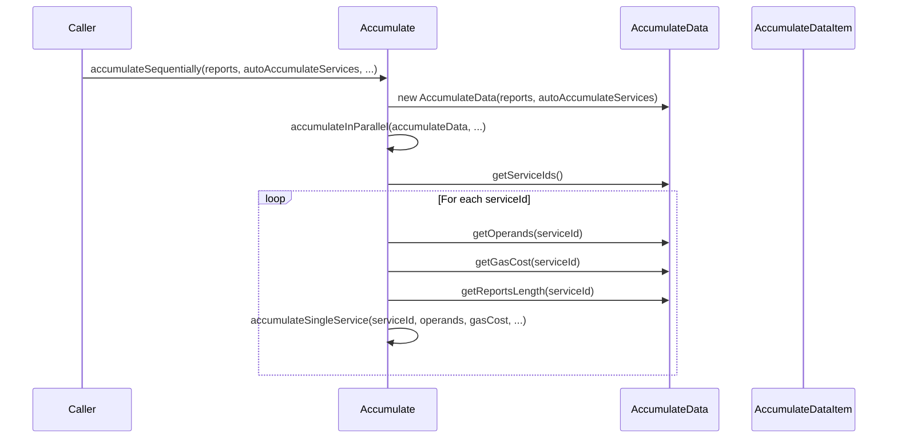

# Fix service statistics

## Pull Request by @mateuszsikora

## Changes:
- fixed calculation of service statistics
- extracted operands and stats logic to a separate class `AccumulateData` (to calculate it one time)


## Comment by @coderabbitai[bot]

<!-- This is an auto-generated comment: summarize by coderabbit.ai -->
<!-- This is an auto-generated comment: skip review by coderabbit.ai -->

> [!IMPORTANT]
> ## Review skipped
> 
> Auto incremental reviews are disabled on this repository.
> 
> Please check the settings in the CodeRabbit UI or the `.coderabbit.yaml` file in this repository. To trigger a single review, invoke the `@coderabbitai review` command.
> 
> You can disable this status message by setting the `reviews.review_status` to `false` in the CodeRabbit configuration file.

<!-- end of auto-generated comment: skip review by coderabbit.ai -->
<!-- walkthrough_start -->

<details>
<summary>📝 Walkthrough</summary>

<!-- This is an auto-generated comment: release notes by coderabbit.ai -->

## Summary by CodeRabbit

* **New Features**
  * Introduced enhanced data aggregation for work reports and auto-accumulate services, allowing for more detailed tracking of operands, gas costs, and report counts per service.

* **Refactor**
  * Centralized and streamlined accumulation logic, improving maintainability and clarity by delegating data preparation to a new aggregation component.

* **Tests**
  * Added comprehensive tests to verify correct aggregation and reporting of service data.

<!-- end of auto-generated comment: release notes by coderabbit.ai -->
## Walkthrough

A new `AccumulateData` class and supporting types are introduced to centralize and encapsulate the logic for aggregating operands, gas costs, and report counts per service from work reports and auto accumulate services. Existing accumulation logic is refactored to utilize this class, and a comprehensive test suite is added to verify its behavior.

## Changes

| File(s)                                                                                  | Change Summary                                                                                                      |
|------------------------------------------------------------------------------------------|---------------------------------------------------------------------------------------------------------------------|
| packages/jam/transition/accumulate/accumulate-data.ts                                    | New module defining `AccumulateData` and `AccumulateDataItem` classes for aggregating work report and service data. |
| packages/jam/transition/accumulate/accumulate-data.test.ts                               | New test suite covering all core methods of `AccumulateData` for correctness and edge cases.                        |
| packages/jam/transition/accumulate/accumulate.ts                                         | Refactored to use `AccumulateData` for operand and gas cost preparation; method signatures updated accordingly.      |

## Sequence Diagram(s)



## Estimated code review effort

🎯 3 (Moderate) | ⏱️ ~20 minutes

## Poem

> In fields of code, the data grows,  
> AccumulateData now bestows  
> Operands and gas, all neat,  
> Reports and tests that can’t be beat.  
> Refactored flows, a tidy sum—  
> The rabbit cheers, “More changes, yum!”  
> 🐇✨

</details>

<!-- walkthrough_end -->
<!-- internal state start -->


<!-- DwQgtGAEAqAWCWBnSTIEMB26CuAXA9mAOYCmGJATmriQCaQDG+Ats2bgFyQAOFk+AIwBWJBrngA3EsgEBPRvlqU0AgfFwA6NPEgQAfACgjoCEYDEZyAAUASpETZWaCrKNwSPbABsvkCiQBHbGlcSHFcLzpIACIAMXgAD3tKCXgGD0RcaiRxBkRoyAB3NGQHAWZ1Gno5MNgPbERKSGZqEgaAL0R4AGt8KnRkW0gMRwEmgFYABkn+LFw6yFivbAAzFdkAGRVEAHpcWW4SMYoXPxJufC6CFw0YBYZYTFJkeAwGZaVIFcTXolqPBhoLwMbzZfBYfArZIUVLpexZcSZNLITD0fwrNBiPq/f4KT41EgJXBUMQ4+YefCHKgYWgomnw7JIvKQLz4IhpFAYAjoZLcZytRheErIDBoNj0AAGAEEGCDmKCaAARahoCW3OCodGY6447TMZDcqkrPrMXGA4EK+Dg2ZeeTg9IAGhQzF4+FSGD+5MgJDWaXgZAY8lR/AoREw8HaYIhUK9TCU6oWQ0BWDGkFSJEKUWokFguFw3EQHB2O3Z82wAg0TGYOyWq3WWwEu32h2OLh23G8Xh2U0mGiM+mM4CgZHokJwBGIZGUVQUrHYXF4/GEonEUhk8jjylU6i0OgHJigGpedPHhFI5CoM6rbC5XCohXsjhapxqm6o2802l0YEMg9MBj5BhujQZ4diEMU9mpK4rQwHZMTlBUSDg2VHEQsBaBVDQaEyLDCwMaICIMCxIClABJScL1aegHCcU4xweJ5pDcBARQzMIQkfdQPGNPgvWlFD5SFJUVQlQVhTTSh4G+aQUFwZAmH8L5sDecRwSBdR/WQfwhKiblHhpLwcUKPpujOC4KDk9B6TQPB8HQATEOhWFpFuUjQled5sCUA0QmQHjcWNHx8EKHE2HmRQ8IMKAJVIXAAHkqVRRAAApGhhNISFI2gAEoJS4ABhcFvgofVamzdQzlwbAKAwA17j6fwxHQE40DtKEJQS5QaVE15MkwdJkCUChJCiFYKBYHl2SkLBjIoUz/HM3AAHItOkbw5KdFpcAeHFCUOMQoldKlxBkhwHgGSAw0QJ0+VkVk0HoR5EFgJ1/AcLxcCdGzwuGyNVIhPAO0+70EkWrT8HwYHZtMwDgNIHMSheqz6G+2BsXaJontgPsosgGKSFwGxzj6OSNjIIh5lSlIMqy3KCrqIC6vK0J/Cqmq6oBBqVwUZTQjHN71uQEL5leHlobMkmcei2KAHESkKzIqfS9JabyyAADV1Iw7Cyvc0IFMaiJ5BojnLpKBRMj88bTSBXwBY+l4sDQCWLNc0IgUQOzsMsr1EHSUVhrswo6kU767Pg1CdKcjL5PBYl4AEPAPAe2gNLU3wrot4GyAcYaPVxAgsgz82mEyTlPO8yABEh2AXfd6zbPshCo6uqW8digBlamVdpZK6ZgXzddkyrqtqnllPgIIPEMsuxzS5zIFIxUUSIIh/DDGcxom6v5jrukUcbiPBIFeeY7dhQpAoeSShk4Xa4wOzXiB66bXkBaSZf8FbVPJvI5P7vpBfXpDvWuVY1DkFoDjdw7FLaQDwPAQyGMcwkC8FSJSKkYIGjsueacydIBKE3JKAA6iZImi0eq1SyG8bi1seR1CSJkPORAnQMH8AKaUtkZTN1aBQvq1ChbqFrogfaUl/TUQAYvZeyMzax0tkA+gxJMCIB4jbOunJuSYGalQNqeNOrUloKJQQIgxCIFuFKRAaV/rIAaB4JQ5xvRBHUvsRgDNuhYNnHyUOYhsBAjOO9SyIFtCUJBvtGcEggTBFMUYOKl9bZOl9tgLi9hZCZBIFtNItsNxukoKbPaK4ohjEeKkPo/B2pcL/sJLIFD0Cr3XtkfOwY9qXBxNrZ22kqJhDsqfOE78LL7x/kfS04IcbmEsFKD605MGdNxAQoUl4pljiaRZKIJSOwCEMgwb0XINJMVxgAOTYt7L4CDk60CULQLgEpYYgWkGBCCijapp1goMnSyFuE0HQphb2uFRJMC5EEskg9/J8XKcfSpqoxIWOaATNGtJ24Ez0UlCUTp8aE2Jn0smHp5jIvhbgOWiAFa4BxcGVFXdlaZVpGqIwABRJEW0oibjOOmB8PoeKcEgAAWToPARw+FCJRX/Nc0C4FqwPOguCN5FSkIvNaJ8rIuEOB8uiERMZ5EcGXiiDRZ8OiGIel2VKYYbFoAHBIB3Vh8BuChGYIobwHgJQyo+a0n56jxq0GwANXE/F3kkGVFUyF/TnZ1FQU0d44kvVSt9WgNyaTRKGnGgNfpfQwwYAjB4cWvSAkNwnA6jIEinV3DtaCxCkbflCihSBNeJAN4yVaV8WhuBjL2HwNVAaXBnYzz5u1Ehc0yEk0McuEx0j205FKXjKUnCHI6VEt0zmGBvhEGqlGUxi9QhipURzRonJn7qPDvCCg7q2YeHmNmV0qRK5BDSKZeC0h3EzrAMI0QojNmUi6rSJ0mdS4bWkRmnmXIokGGgeGsFPqVTRuYKW8SAY0AFkQsgF9+iX6xmbVyUdGaX7Bi9IXXxH7LihH8s7LoHpIjR3SOfU98BK4EYRByMKsLpmsJIAKTRaTLXyF6lQuEd9IAY3GlEcJywXJGCA8WkSzQglZF6rUfwHgWii1eDQGqviWgFi4OCGT0HuA4hnZI9xwmdKRrA7wjjMlkpoy8KnfO8GkrSL6oiXIiBspOjU2J7gmn87aaXrp8dBAi1ToUHO+AC75ngnQ9ZaFoYogdtHbbEjHhPN1u3jXJtLbBMAfqpQ/dWI+CvA0upDGG71MFirhuW2ZJG28EkAKWjEVLlrpNN5/AvnWhkucogX54JL4+wWFFscYcwA5ti47DRLnIDdBILIApxsJFL3kXjOrJVe19NEq6BNMkvTpvRT7cOk6BRWZpP02zORkQ8CaDO24ipqo4h/fN9J4InOJX281AEbDN60J/fbL9wYcOwODD+pgvMUSh1qVWqiZizlPMyU6HL4hsMl1w1bCafWBszsB6c850zMOQw9lA+4ZbkBNMaMgarcLuSs2GiQKQ/AHtvrUf9v9s3vuWXw5dEaWAPOKi+kLFBvhzbO2J9M2KAVOwshHXPabUjj2hGes28zVdk47aqDj8a2AiBozwPE+qnwbEGhNfetAKw01UFczkyAyUJTElkOYgAqgAZgAEw4vNy4cxLWMr4olNlaZOdqoeBGGwYamz+ORP8yor3oN8kKJNcu6B8AXSRBvNR606JKABhkgRkR3xAT/VN9ENerU+RUmiJ74F3W2QckKa8egjPf5gpgtIvb9A/mMIPTBHGxFxkKaXRjhYsz+RWNHUsmcqzywbK2eETS/YSJnIZXjsdCuQN+rvoqyAuhICFQywevolzkpobvIx2gX95Ddu6It3AABtAAul9Cd3rXetrOA9Q/JEb9Ssv7lAwK+oBcvCrSZfK/V+oqIr7ZKzORZRcB34UrZRcBAG0CX4Sgf7/7SwEyn6ICYoUywAgE0wXKQAQG0xcC24O4IGf64r4qEqYE9zgEAJ4E4EALu5EEAGdxUG9xQE0HkpZRwGT5SjT6N6z56atAGY0Dgam4PyhCD50Ce5L4IFQAdzUabL84Sgsb7B9xcBNbgqGZKr9iCqYhwy3IiqQRKJPKSrAZGGIQKoaHt5qpTgarURPjOA6r6TPDMS2JSRQhahZamwOp16sjsibI1D+DWruiegLAVbhI0DQo/64owGIBSg0ikG4axqPChC8AU5WgNDfzJGeIrLU79LV7M6EZEDEbaZbyqI9auGbbLqkSUL75Q7uRciuruprYLA2LRaGoPh8HgoQZQrsb9RHp2RQYwZRxegZF9516/YEzk78ajoN4vyM6hZoiba/qWRoJnYFp4w5ody/CRAQGiT85dBECiiHooDWLcDay6TbbpCWpU6vo5Fw5lypyGzfyXghxlRYBDSSBkh1CmjyaUCig+DyDFF7w4yVGerrGBDBDbKZI7EwqKAa6cyfAPwPgMatAnjtEL4QrdHUIJamgJKNgEyoblHTIDaiyeK2woLSJDHDSpCRCkAHzZrz6DY3TCgfGoAYlwjcj2rz6VFWD8g+AoJGb76oZoAPhoY452o5pck8mRBeBQkRF7EHE+5HEuKMQKLnHnChCoklqcipIPT4lgznza61CoBGLczciCASZzDdai5Qjs6fzZEM63FM4lKMbnQrHQKHZMjHGnHDDBTlz+HsCmx06hA1Beh+7HC6kfwDCewMDwAdJca+wSLmzkbo41AakiSvTnBCjRn5wUkpHNqOwMYJ7FYFxY6+ChlND8zlGinOiLQMiCH+lPboC0BCANAzjcgeQfCFrz6aljEBFHpNEjCNCSgTxTxWBvQpAkBxQUBDQ9QuiSyQAxLKA+CwlKl6ryTsBUCILJz0j9HvQChejeEcj+QN7SLV7DHBZYDyZewLCpl+qhoWJOhdBx5SSyAfHy7vJ17E7rj4IoIg7iDZl1CbpKASZeD/qjIkQTLnnuJei96QUD6gwkwrJ8BrKj7sA7KICT7f50ZynUAKnYAnFUSXIhFMaICyBvA16IQbFEamoALkEUqUFsG0DplgxcDH6n6X4PmsjsrQCx6mqcVOjrmUiyBcDUp1GCUAASiMUOGAQMMhrQVu+FNAKhCuMEslNA8lpxuUkAgASYR4xEVhElCkWbLrGbHUXkq0VgGsGgGMVXEIbQHU7sUyKEr0XOT4ocWQxcDcVsAdx8Vj7jTcBCWQAiXEjiWSVbp4CqUkDqWtBKXvnggRVRU0CaWix3nIConVJXLaE3K7B6FiqGE5omE6Q/IYXQnUSBbymKR4WnHYFXKUnEWGXkU6QSkblSk77lEsWkKbYOWICcUeU8XeWQz8WiX+XCVDWyASXPQPnUYelcAcrQbAC4HWWFS8wxG0D4pW6Dl6BSUyUIiRUKUkAxUVIqU7UJUkCaU6U1WVb6UkVkXikYDcnNUoLJQ5qRoHXAaRpuVcV9U+UCXDWBWjXjVIzun2YzVzULVOhLVcgrVrUbVbXhXHV7WvVDIYDxV7VJVYApVz7erpVCq6H3JQR5Xz4FWtBFUGC0riD0qN6KAeD+DMrehrAkxcBiWBawAaECq/gHhbKjhQh9bqodLXjzh+BCmPi0TyCvhU3vhqCfh7g/gGAc3XjqAAD6FGiACtNN/omYtACtfUFk347NQ4kAAAHAbQAGwG2qAACMaANuAALAbbQJMAAOzjB0Dm0G0+jm2qCTDjArDW3m025oAACctAdudt1txtaAHgA4st+t8tuASttIqtKRGYdACtI4ut0dEAzQDA3ACtfyNARIWtWQOtUdEopdBgAA3ggdEL1MzXJNEFwOxVXcUDVL8PkA3RfgYAAL4GCl3wEZ1QDMDZ251xyEhx1p36BAA== -->

<!-- internal state end -->
<!-- tips_start -->

---


<details>
<summary>🪧 Tips</summary>

### Chat

There are 3 ways to chat with [CodeRabbit](https://coderabbit.ai?utm_source=oss&utm_medium=github&utm_campaign=FluffyLabs/typeberry&utm_content=500):

- Review comments: Directly reply to a review comment made by CodeRabbit. Example:
  - `I pushed a fix in commit <commit_id>, please review it.`
  - `Explain this complex logic.`
  - `Open a follow-up GitHub issue for this discussion.`
- Files and specific lines of code (under the "Files changed" tab): Tag `@coderabbitai` in a new review comment at the desired location with your query. Examples:
  - `@coderabbitai explain this code block.`
  -	`@coderabbitai modularize this function.`
- PR comments: Tag `@coderabbitai` in a new PR comment to ask questions about the PR branch. For the best results, please provide a very specific query, as very limited context is provided in this mode. Examples:
  - `@coderabbitai gather interesting stats about this repository and render them as a table. Additionally, render a pie chart showing the language distribution in the codebase.`
  - `@coderabbitai read src/utils.ts and explain its main purpose.`
  - `@coderabbitai read the files in the src/scheduler package and generate a class diagram using mermaid and a README in the markdown format.`
  - `@coderabbitai help me debug CodeRabbit configuration file.`

### Support

Need help? Create a ticket on our [support page](https://www.coderabbit.ai/contact-us/support) for assistance with any issues or questions.

Note: Be mindful of the bot's finite context window. It's strongly recommended to break down tasks such as reading entire modules into smaller chunks. For a focused discussion, use review comments to chat about specific files and their changes, instead of using the PR comments.

### CodeRabbit Commands (Invoked using PR comments)

- `@coderabbitai pause` to pause the reviews on a PR.
- `@coderabbitai resume` to resume the paused reviews.
- `@coderabbitai review` to trigger an incremental review. This is useful when automatic reviews are disabled for the repository.
- `@coderabbitai full review` to do a full review from scratch and review all the files again.
- `@coderabbitai summary` to regenerate the summary of the PR.
- `@coderabbitai generate sequence diagram` to generate a sequence diagram of the changes in this PR.
- `@coderabbitai resolve` resolve all the CodeRabbit review comments.
- `@coderabbitai configuration` to show the current CodeRabbit configuration for the repository.
- `@coderabbitai help` to get help.

### Other keywords and placeholders

- Add `@coderabbitai ignore` anywhere in the PR description to prevent this PR from being reviewed.
- Add `@coderabbitai summary` to generate the high-level summary at a specific location in the PR description.
- Add `@coderabbitai` anywhere in the PR title to generate the title automatically.

### Documentation and Community

- Visit our [Documentation](https://docs.coderabbit.ai) for detailed information on how to use CodeRabbit.
- Join our [Discord Community](http://discord.gg/coderabbit) to get help, request features, and share feedback.
- Follow us on [X/Twitter](https://twitter.com/coderabbitai) for updates and announcements.

</details>

<!-- tips_end -->


## Comment by @github-actions[bot]


<details>
<summary>View all</summary>

| File | Benchmark | Ops |  |
|------|-----------|-----|--|
| [bytes/hex-to.ts[0]](../blob/9a10e687a61970ef6bbf7a955275b77b14635709//_work/typeberry-runner-2/typeberry/typeberry/benchmarks/bytes/hex-to.ts) | number toString + padding | 318656.27 ±0.15% | fastest ✅ |
| [bytes/hex-to.ts[1]](../blob/9a10e687a61970ef6bbf7a955275b77b14635709//_work/typeberry-runner-2/typeberry/typeberry/benchmarks/bytes/hex-to.ts) | manual | 16521.53 ±0.26% | 94.82% slower |
| [math/count-bits-u64.ts[0]](../blob/9a10e687a61970ef6bbf7a955275b77b14635709//_work/typeberry-runner-2/typeberry/typeberry/benchmarks/math/count-bits-u64.ts) | standard method | 1233237.77 ±0.24% | 89.85% slower |
| [math/count-bits-u64.ts[1]](../blob/9a10e687a61970ef6bbf7a955275b77b14635709//_work/typeberry-runner-2/typeberry/typeberry/benchmarks/math/count-bits-u64.ts) | magic | 12154201.47 ±0.4% | fastest ✅ |
| [hash/index.ts[0]](../blob/9a10e687a61970ef6bbf7a955275b77b14635709//_work/typeberry-runner-2/typeberry/typeberry/benchmarks/hash/index.ts) | hash with numeric representation | 191 ±0.66% | 28.17% slower |
| [hash/index.ts[1]](../blob/9a10e687a61970ef6bbf7a955275b77b14635709//_work/typeberry-runner-2/typeberry/typeberry/benchmarks/hash/index.ts) | hash with string representation | 110.26 ±0.13% | 58.54% slower |
| [hash/index.ts[2]](../blob/9a10e687a61970ef6bbf7a955275b77b14635709//_work/typeberry-runner-2/typeberry/typeberry/benchmarks/hash/index.ts) | hash with symbol representation | 182.93 ±0.18% | 31.21% slower |
| [hash/index.ts[3]](../blob/9a10e687a61970ef6bbf7a955275b77b14635709//_work/typeberry-runner-2/typeberry/typeberry/benchmarks/hash/index.ts) | hash with uint8 representation | 164.51 ±0.06% | 38.14% slower |
| [hash/index.ts[4]](../blob/9a10e687a61970ef6bbf7a955275b77b14635709//_work/typeberry-runner-2/typeberry/typeberry/benchmarks/hash/index.ts) | hash with packed representation | 265.92 ±0.06% | fastest ✅ |
| [hash/index.ts[5]](../blob/9a10e687a61970ef6bbf7a955275b77b14635709//_work/typeberry-runner-2/typeberry/typeberry/benchmarks/hash/index.ts) | hash with bigint representation | 192.89 ±0.7% | 27.46% slower |
| [hash/index.ts[6]](../blob/9a10e687a61970ef6bbf7a955275b77b14635709//_work/typeberry-runner-2/typeberry/typeberry/benchmarks/hash/index.ts) | hash with uint32 representation | 204.77 ±0.05% | 23% slower |
| [logger/index.ts[0]](../blob/9a10e687a61970ef6bbf7a955275b77b14635709//_work/typeberry-runner-2/typeberry/typeberry/benchmarks/logger/index.ts) | console.log with string concat | 6838350.71 ±58.9% | fastest ✅ |
| [logger/index.ts[1]](../blob/9a10e687a61970ef6bbf7a955275b77b14635709//_work/typeberry-runner-2/typeberry/typeberry/benchmarks/logger/index.ts) | console.log with args | 1361283 ±83.14% | 80.09% slower |
| [math/add_one_overflow.ts[0]](../blob/9a10e687a61970ef6bbf7a955275b77b14635709//_work/typeberry-runner-2/typeberry/typeberry/benchmarks/math/add_one_overflow.ts) | add and take modulus | 1487859.98 ±47.19% | 99.42% slower |
| [math/add_one_overflow.ts[1]](../blob/9a10e687a61970ef6bbf7a955275b77b14635709//_work/typeberry-runner-2/typeberry/typeberry/benchmarks/math/add_one_overflow.ts) | condition before calculation | 257818175.65 ±8.31% | fastest ✅ |
| [collections/map-set.ts[0]](../blob/9a10e687a61970ef6bbf7a955275b77b14635709//_work/typeberry-runner-2/typeberry/typeberry/benchmarks/collections/map-set.ts) | 2 gets + conditional set | 108588.93 ±0.5% | fastest ✅ |
| [collections/map-set.ts[1]](../blob/9a10e687a61970ef6bbf7a955275b77b14635709//_work/typeberry-runner-2/typeberry/typeberry/benchmarks/collections/map-set.ts) | 1 get 1 set | 61648.29 ±0.17% | 43.23% slower |
| [codec/bigint.decode.ts[0]](../blob/9a10e687a61970ef6bbf7a955275b77b14635709//_work/typeberry-runner-2/typeberry/typeberry/benchmarks/codec/bigint.decode.ts) | decode custom | 165018388.17 ±4.09% | fastest ✅ |
| [codec/bigint.decode.ts[1]](../blob/9a10e687a61970ef6bbf7a955275b77b14635709//_work/typeberry-runner-2/typeberry/typeberry/benchmarks/codec/bigint.decode.ts) | decode bigint | 71748910.84 ±2.34% | 56.52% slower |
| [codec/decoding.ts[0]](../blob/9a10e687a61970ef6bbf7a955275b77b14635709//_work/typeberry-runner-2/typeberry/typeberry/benchmarks/codec/decoding.ts) | manual decode | 15881596.7 ±0.78% | 91.85% slower |
| [codec/decoding.ts[1]](../blob/9a10e687a61970ef6bbf7a955275b77b14635709//_work/typeberry-runner-2/typeberry/typeberry/benchmarks/codec/decoding.ts) | int32array decode | 194934587.6 ±5.83% | fastest ✅ |
| [codec/decoding.ts[2]](../blob/9a10e687a61970ef6bbf7a955275b77b14635709//_work/typeberry-runner-2/typeberry/typeberry/benchmarks/codec/decoding.ts) | dataview decode | 189984073.13 ±5.71% | 2.54% slower |
| [codec/encoding.ts[0]](../blob/9a10e687a61970ef6bbf7a955275b77b14635709//_work/typeberry-runner-2/typeberry/typeberry/benchmarks/codec/encoding.ts) | manual encode | 2351617.61 ±0.66% | 21.91% slower |
| [codec/encoding.ts[1]](../blob/9a10e687a61970ef6bbf7a955275b77b14635709//_work/typeberry-runner-2/typeberry/typeberry/benchmarks/codec/encoding.ts) | int32array encode | 2975126.36 ±0.56% | 1.21% slower |
| [codec/encoding.ts[2]](../blob/9a10e687a61970ef6bbf7a955275b77b14635709//_work/typeberry-runner-2/typeberry/typeberry/benchmarks/codec/encoding.ts) | dataview encode | 3011442.52 ±0.42% | fastest ✅ |
| [codec/bigint.compare.ts[0]](../blob/9a10e687a61970ef6bbf7a955275b77b14635709//_work/typeberry-runner-2/typeberry/typeberry/benchmarks/codec/bigint.compare.ts) | compare custom | 262771649.74 ±6.98% | fastest ✅ |
| [codec/bigint.compare.ts[1]](../blob/9a10e687a61970ef6bbf7a955275b77b14635709//_work/typeberry-runner-2/typeberry/typeberry/benchmarks/codec/bigint.compare.ts) | compare bigint | 260833176.58 ±7.55% | 0.74% slower |
| [bytes/hex-from.ts[0]](../blob/9a10e687a61970ef6bbf7a955275b77b14635709//_work/typeberry-runner-2/typeberry/typeberry/benchmarks/bytes/hex-from.ts) | parse hex using `Number` with NaN checking | 105791.13 ±0.42% | 83.6% slower |
| [bytes/hex-from.ts[1]](../blob/9a10e687a61970ef6bbf7a955275b77b14635709//_work/typeberry-runner-2/typeberry/typeberry/benchmarks/bytes/hex-from.ts) | parse hex from char codes | 644995.76 ±0.51% | fastest ✅ |
| [bytes/hex-from.ts[2]](../blob/9a10e687a61970ef6bbf7a955275b77b14635709//_work/typeberry-runner-2/typeberry/typeberry/benchmarks/bytes/hex-from.ts) | parse hex from string nibbles | 431183.49 ±0.18% | 33.15% slower |
| [math/count-bits-u32.ts[0]](../blob/9a10e687a61970ef6bbf7a955275b77b14635709//_work/typeberry-runner-2/typeberry/typeberry/benchmarks/math/count-bits-u32.ts) | standard method | 92907799.99 ±1.81% | 61.89% slower |
| [math/count-bits-u32.ts[1]](../blob/9a10e687a61970ef6bbf7a955275b77b14635709//_work/typeberry-runner-2/typeberry/typeberry/benchmarks/math/count-bits-u32.ts) | magic | 243817339.29 ±7.53% | fastest ✅ |
| [math/mul_overflow.ts[0]](../blob/9a10e687a61970ef6bbf7a955275b77b14635709//_work/typeberry-runner-2/typeberry/typeberry/benchmarks/math/mul_overflow.ts) | multiply and bring back to u32 | 252045785.18 ±8.81% | fastest ✅ |
| [math/mul_overflow.ts[1]](../blob/9a10e687a61970ef6bbf7a955275b77b14635709//_work/typeberry-runner-2/typeberry/typeberry/benchmarks/math/mul_overflow.ts) | multiply and take modulus | 250477980.46 ±7.7% | 0.62% slower |
| [math/switch.ts[0]](../blob/9a10e687a61970ef6bbf7a955275b77b14635709//_work/typeberry-runner-2/typeberry/typeberry/benchmarks/math/switch.ts) | switch | 258623081.97 ±7.09% | 4.5% slower |
| [math/switch.ts[1]](../blob/9a10e687a61970ef6bbf7a955275b77b14635709//_work/typeberry-runner-2/typeberry/typeberry/benchmarks/math/switch.ts) | if | 270803167.74 ±6.04% | fastest ✅ |
| [codec/view_vs_object.ts[0]](../blob/9a10e687a61970ef6bbf7a955275b77b14635709//_work/typeberry-runner-2/typeberry/typeberry/benchmarks/codec/view_vs_object.ts) | Get the first field from Decoded | 46957.58 ±106.79% | 89.51% slower |
| [codec/view_vs_object.ts[1]](../blob/9a10e687a61970ef6bbf7a955275b77b14635709//_work/typeberry-runner-2/typeberry/typeberry/benchmarks/codec/view_vs_object.ts) | Get the first field from View | 91801.81 ±0.18% | 79.49% slower |
| [codec/view_vs_object.ts[2]](../blob/9a10e687a61970ef6bbf7a955275b77b14635709//_work/typeberry-runner-2/typeberry/typeberry/benchmarks/codec/view_vs_object.ts) | Get the first field as view from View | 101516.73 ±0.93% | 77.32% slower |
| [codec/view_vs_object.ts[3]](../blob/9a10e687a61970ef6bbf7a955275b77b14635709//_work/typeberry-runner-2/typeberry/typeberry/benchmarks/codec/view_vs_object.ts) | Get two fields from Decoded | 445983.66 ±0.22% | 0.37% slower |
| [codec/view_vs_object.ts[4]](../blob/9a10e687a61970ef6bbf7a955275b77b14635709//_work/typeberry-runner-2/typeberry/typeberry/benchmarks/codec/view_vs_object.ts) | Get two fields from View | 82775.77 ±0.1% | 81.51% slower |
| [codec/view_vs_object.ts[5]](../blob/9a10e687a61970ef6bbf7a955275b77b14635709//_work/typeberry-runner-2/typeberry/typeberry/benchmarks/codec/view_vs_object.ts) | Get two fields from materialized from View | 173548.54 ±0.16% | 61.23% slower |
| [codec/view_vs_object.ts[6]](../blob/9a10e687a61970ef6bbf7a955275b77b14635709//_work/typeberry-runner-2/typeberry/typeberry/benchmarks/codec/view_vs_object.ts) | Get two fields as views from View | 82648.46 ±0.11% | 81.54% slower |
| [codec/view_vs_object.ts[7]](../blob/9a10e687a61970ef6bbf7a955275b77b14635709//_work/typeberry-runner-2/typeberry/typeberry/benchmarks/codec/view_vs_object.ts) | Get only third field from Decoded | 447622.89 ±0.23% | fastest ✅ |
| [codec/view_vs_object.ts[8]](../blob/9a10e687a61970ef6bbf7a955275b77b14635709//_work/typeberry-runner-2/typeberry/typeberry/benchmarks/codec/view_vs_object.ts) | Get only third field from View | 103647.76 ±0.08% | 76.84% slower |
| [codec/view_vs_object.ts[9]](../blob/9a10e687a61970ef6bbf7a955275b77b14635709//_work/typeberry-runner-2/typeberry/typeberry/benchmarks/codec/view_vs_object.ts) | Get only third field as view from View | 103418.19 ±0.09% | 76.9% slower |
| [codec/view_vs_collection.ts[0]](../blob/9a10e687a61970ef6bbf7a955275b77b14635709//_work/typeberry-runner-2/typeberry/typeberry/benchmarks/codec/view_vs_collection.ts) | Get first element from Decoded | 27677.35 ±0.25% | 58.69% slower |
| [codec/view_vs_collection.ts[1]](../blob/9a10e687a61970ef6bbf7a955275b77b14635709//_work/typeberry-runner-2/typeberry/typeberry/benchmarks/codec/view_vs_collection.ts) | Get first element from View | 66993.77 ±0.19% | fastest ✅ |
| [codec/view_vs_collection.ts[2]](../blob/9a10e687a61970ef6bbf7a955275b77b14635709//_work/typeberry-runner-2/typeberry/typeberry/benchmarks/codec/view_vs_collection.ts) | Get 50th element from Decoded | 27756.97 ±0.19% | 58.57% slower |
| [codec/view_vs_collection.ts[3]](../blob/9a10e687a61970ef6bbf7a955275b77b14635709//_work/typeberry-runner-2/typeberry/typeberry/benchmarks/codec/view_vs_collection.ts) | Get 50th element from View | 38368.87 ±0.16% | 42.73% slower |
| [codec/view_vs_collection.ts[4]](../blob/9a10e687a61970ef6bbf7a955275b77b14635709//_work/typeberry-runner-2/typeberry/typeberry/benchmarks/codec/view_vs_collection.ts) | Get last element from Decoded | 27732.51 ±0.23% | 58.6% slower |
| [codec/view_vs_collection.ts[5]](../blob/9a10e687a61970ef6bbf7a955275b77b14635709//_work/typeberry-runner-2/typeberry/typeberry/benchmarks/codec/view_vs_collection.ts) | Get last element from View | 26953.24 ±0.32% | 59.77% slower |
| [collections/map_vs_sorted.ts[0]](../blob/9a10e687a61970ef6bbf7a955275b77b14635709//_work/typeberry-runner-2/typeberry/typeberry/benchmarks/collections/map_vs_sorted.ts) | Map | 287933.67 ±0.31% | fastest ✅ |
| [collections/map_vs_sorted.ts[1]](../blob/9a10e687a61970ef6bbf7a955275b77b14635709//_work/typeberry-runner-2/typeberry/typeberry/benchmarks/collections/map_vs_sorted.ts) | Map-array | 103417.59 ±0.03% | 64.08% slower |
| [collections/map_vs_sorted.ts[2]](../blob/9a10e687a61970ef6bbf7a955275b77b14635709//_work/typeberry-runner-2/typeberry/typeberry/benchmarks/collections/map_vs_sorted.ts) | Array | 77763.8 ±1.93% | 72.99% slower |
| [collections/map_vs_sorted.ts[3]](../blob/9a10e687a61970ef6bbf7a955275b77b14635709//_work/typeberry-runner-2/typeberry/typeberry/benchmarks/collections/map_vs_sorted.ts) | SortedArray | 176358.43 ±0.13% | 38.75% slower |
| [hash/blake2b.ts[0]](../blob/9a10e687a61970ef6bbf7a955275b77b14635709//_work/typeberry-runner-2/typeberry/typeberry/benchmarks/hash/blake2b.ts) | hasher with simple allocator | 0.046 ±0.32% | fastest ✅ |
| [hash/blake2b.ts[1]](../blob/9a10e687a61970ef6bbf7a955275b77b14635709//_work/typeberry-runner-2/typeberry/typeberry/benchmarks/hash/blake2b.ts) | hasher with page allocator | 0.045 ±1.44% | 2.17% slower |
| [bytes/compare.ts[0]](../blob/9a10e687a61970ef6bbf7a955275b77b14635709//_work/typeberry-runner-2/typeberry/typeberry/benchmarks/bytes/compare.ts) | Comparing Uint32 bytes | 17225.18 ±24.22% | 17.78% slower |
| [bytes/compare.ts[1]](../blob/9a10e687a61970ef6bbf7a955275b77b14635709//_work/typeberry-runner-2/typeberry/typeberry/benchmarks/bytes/compare.ts) | Comparing raw bytes | 20949.38 ±7.38% | fastest ✅ |
| [crypto/ed25519.ts[0]](../blob/9a10e687a61970ef6bbf7a955275b77b14635709//_work/typeberry-runner-2/typeberry/typeberry/benchmarks/crypto/ed25519.ts) | native crypto | 5.14 ±19.51% | 82.76% slower |
| [crypto/ed25519.ts[1]](../blob/9a10e687a61970ef6bbf7a955275b77b14635709//_work/typeberry-runner-2/typeberry/typeberry/benchmarks/crypto/ed25519.ts) | wasm lib | 10.65 ±0.01% | 64.29% slower |
| [crypto/ed25519.ts[2]](../blob/9a10e687a61970ef6bbf7a955275b77b14635709//_work/typeberry-runner-2/typeberry/typeberry/benchmarks/crypto/ed25519.ts) | wasm lib batch | 29.82 ±0.59% | fastest ✅ |
</details>


### Benchmarks summary: 63/63 OK ✅

<!-- thollander/actions-comment-pull-request "benchmarks" -->


## Comment by @DrEverr

```suggestion
      const accumulateData = new AccumulateData(reports, []);
```


## Comment by @DrEverr

```suggestion
      const result = accumulateData.getReportsLength(serviceId);
```


## Comment by @DrEverr

ditto


## Comment by @mateuszsikora

fixed


## Comment by @mateuszsikora

fixed


## Comment by @mateuszsikora

fixed


## Comment by @tomusdrw

Doc's invalid.


## Comment by @coderabbitai[bot]

_🛠️ Refactor suggestion_

**Remove duplicate service ID addition**

These lines add auto accumulate service IDs to the set, but this is redundant since `transformAutoAccumulateServices` is called before `transformReports` in the constructor, and the service IDs are already merged in line 42.


Remove these redundant lines:
```diff
-    for (const key of this.autoAccumulateServicesByServiceId.keys()) {
-      serviceIds.add(key);
-    }
```

<!-- suggestion_start -->

<details>
<summary>📝 Committable suggestion</summary>

> ‼️ **IMPORTANT**
> Carefully review the code before committing. Ensure that it accurately replaces the highlighted code, contains no missing lines, and has no issues with indentation. Thoroughly test & benchmark the code to ensure it meets the requirements.

```suggestion

```

</details>

<!-- suggestion_end -->

<details>
<summary>🤖 Prompt for AI Agents</summary>

```
In packages/jam/transition/accumulate/accumulate-data.ts around lines 127 to
129, the code redundantly adds service IDs from
autoAccumulateServicesByServiceId to the serviceIds set, which is unnecessary
because transformAutoAccumulateServices already merges these IDs before
transformReports is called in the constructor. Remove the for-loop that adds
these keys to avoid duplicate additions.
```

</details>

<!-- fingerprinting:phantom:medusa:lion -->

<!-- This is an auto-generated comment by CodeRabbit -->


## Comment by @mateuszsikora

fixed
