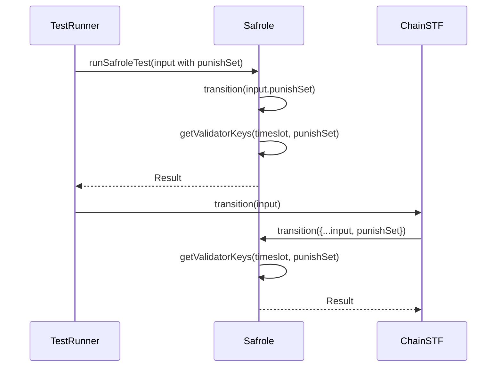

# Disputes tests and safrole fixes

## Pull Request by @mateuszsikora

## Changes:
- enabled disputes tests
- fixed incorrect punish set in safrole (the one from state is now replaced with punish set from disputes output)
- zeroized bls key if validator is an offender 
- added two disputes tests to ignore - part of fixes that are needed to make it green is in https://github.com/FluffyLabs/typeberry/pull/487 so I will continue debugging in a separate PR when #487 is merged 


## Comment by @coderabbitai[bot]

<!-- This is an auto-generated comment: summarize by coderabbit.ai -->
<!-- This is an auto-generated comment: skip review by coderabbit.ai -->

> [!IMPORTANT]
> ## Review skipped
> 
> Auto incremental reviews are disabled on this repository.
> 
> Please check the settings in the CodeRabbit UI or the `.coderabbit.yaml` file in this repository. To trigger a single review, invoke the `@coderabbitai review` command.
> 
> You can disable this status message by setting the `reviews.review_status` to `false` in the CodeRabbit configuration file.

<!-- end of auto-generated comment: skip review by coderabbit.ai -->
<!-- walkthrough_start -->

<details>
<summary>📝 Walkthrough</summary>

<!-- This is an auto-generated comment: release notes by coderabbit.ai -->

## Summary by CodeRabbit

* **New Features**
  * Improved handling of punished validators during state transitions, ensuring that validators in the punishment set are appropriately processed.
* **Bug Fixes**
  * Resolved issues with invalid or unparseable test files by updating the ignored test list.
* **Refactor**
  * Streamlined the way punishment data is passed and processed, leading to clearer and more maintainable logic for validator key management.

<!-- end of auto-generated comment: release notes by coderabbit.ai -->
## Walkthrough

The changes update how punished validators are tracked and handled across the test runner, Safrole logic, and chain transition modules. The punishment set (`punishSet`) is now passed explicitly as part of the input, removing previous abstractions and simplifying data flow. Related test runner configurations and JSON parsing logic were updated accordingly.

## Changes

| File(s)                                                         | Change Summary                                                                                                           |
|------------------------------------------------------------------|--------------------------------------------------------------------------------------------------------------------------|
| bin/test-runner/jamduna.ts                                       | Updated test vector directories; added two dispute test files to ignore list.                                             |
| bin/test-runner/w3f/safrole.ts                                   | Removed `DisputesRecords` and related parsing; simplified `TestInput.fromJson`; now passes `punishSet` directly.         |
| packages/jam/safrole/safrole.ts                                  | Added `punishSet` to `Input`; removed `disputesRecords` from state; updated `getValidatorKeys` and transition flow.      |
| packages/jam/transition/chain-stf.ts                             | Modified to pass `punishSet` from `disputesRecords` into Safrole transition input.                                       |

## Sequence Diagram(s)



## Estimated code review effort

🎯 3 (Moderate) | ⏱️ ~15 minutes

## Poem

> A bunny hopped through fields of code,  
> With punishSet in tow, a lighter load.  
> No more records, no more fuss,  
> Just keys and sets, no need to discuss.  
> Validators beware, for justice is swift—  
> The carrot of clarity, the stick of a shift! 🥕

</details>

<!-- walkthrough_end -->
<!-- internal state start -->


<!-- DwQgtGAEAqAWCWBnSTIEMB26CuAXA9mAOYCmGJATmriQCaQDG+Ats2bgFyQAOFk+AIwBWJBrngA3EsgEBPRvlqU0AgfFwA6NPEgQAfACgjoCEYDEZyAAUASpETZWaCrKNxU3bABsvkCiQBHbGlcABpIcVwvOkgAIgARJE8aZBTcZEx6RDQAMwp8aMgc+AAPaVDYyAB3NGQHAWZ1Gno5CNgSSGxESkhmahIugC9EeABrfCp0ZFtIDEcBHoBWAAYAFn4sXHbIADEvbByc2QAZFUQAelxZbhIFihc/Em58EYIXDRhthlhMUmR4DC4fK0bAMGIAtqoGYAhj7JSQMgqLwAoiQWhJPDSCIhDIYehMe6icQYVFbDqeDBIWD2Ei4TrdegQ7J5AodVr+bheNAMFFtDr4choyiSGIs5h8+y4frVdTUsk8bCUxDU7p0sUS9GIZJY/B4ZIfACCtHR4gFaB8snC8oAQscAMqQUYkeSoQaUfDwN2MnLoSASc3wWjUCYof5KQHwYoxWroLD4Q5kJQUD5wDozc2IfDoY2pKpZzXa1I4iJZhYoIgYCYxGjMZ5UCjwLyyD52lgdYplZDkMGIbIPAi9NBOiVpZDcWoZfw8Zx0+O+3gkCTwXXTOwACjMqwAHAB2ACU4UyRWwFDJfCUAmwRCIvKqjd8TAjcw6ELQNPHVBo1jsuRofE3u6hr0lCkLQKbbDMDCYJAZb+EuJBVNGdKwLguDcIgHDnOcN5bNgAgaEwzDnHsBxHKcAgXFcNx3C45yeD45wrKsGhGPoxjgFAib8D6aB4IQpDkJ+MSEWwgJcLw/DCESIoyPITBJioaiaNouhgIYJhQO4/y4jgBDEGQyjNAorDsFwVBVPYjh9A8rTycoqjqFoOhsexpgGGoGCXCEYAUIqgnnEIaDMCCGBoBo6QcAYsTRQYFiQAaACS+mCf0WRWc48hzt8vzSG42xpH4fk9I+xRECe1DLlgNTINg3BBkZA4wnCHTyrEBaYhciBSjQAD6QKYK8lWIJU6L+GIEwups2zcmC3ANSEfpEhMyDIl14QclyPIkhKC5LiuTbGaJzRgLqdKxBO5UYD25xdf0fVUBgg0CsNCKAu88XGuolXmk2Vp5vYNw8sUDCQAAUnaADyABy2JdUUjZYneWwQm1GIpDd3UkPdA1fc9lRrrEABMPXLMsiwaEImYYJUR6xAAzCTZMU1TsR7tUlAdGgxrVlm8rwBWVb0KtdIgi1vPtPAfAAv6yImvIR6Kh+3QqI26jNpAUNZvgZ6MD8JJYgOXj4DeIMho+QIFEURsWYhU59EoLFGLFlgGl4f4Vc9JYaqIXKfkN3EIiUdZGSGngCMiIPsF9uUGJr5COwAol18B9EZdmPPBFkkIcEycJAACydDwI4UUxQYEBgEYHleV1PlFRQ5xVHTOQ3bk+TROFGGl7EzvxUlAmGTEDhOA8WV638eUdNl+vIP4zD4FIEop8Hsb0F0aCkAHAAGADqEyjDYTy5wAErUsBb6vEpb4kWodYfBK0IgF9db5Ygnu2+TivKdktoDkbwFBC0Vpthb3aike+ExH4XyjF4fEz0gSglNFgCEW9QZUztJjcK+A7Rt1ZBg/oF9UAkGRI0UKzR1okHnkubaAIvoBkGB7OMPpKFzXkKqZAOQQxbyIPgRQdpaRb3CFvAQXN+G4EEZfLeeYMCjFkGIiRR55RbwpFSeRQFKyQCNvrPgVQqDcBuIyLAb5r5o2kBAigUDJIiDEB8BKj0aBc2AR0ZRLxcA9XjDkRMlAn7oHuGgF0yBRpEgOo+KQp5wSAizMY1s4TaBqNCmwegyjFSqIESgKazjfIYBwSyaI0AQjQMVGISq4FUDJKVLANRqAyRYHHL2GIJAg4R3UAdGMH5Zw+j5hgZIXslHMnbiQcKD0noYAvmwLYigKGcm5LyeUu1lxdEYD9No1Bpz1PoAKA6W80gAGEBQ0EBBoAEyQt6Gk+kgn6lor75K6nY/UYo0ECjGbSWAiggIjFrMiKM9B1RvgYF0Ag4olY9ByEUpBKy6ShMoEZI8MtAypXhsQx+kA1xNWwOibagDkTbW2S4A0iBoApxIHaI24jL66LQPo3kW9GlAgBCMBgF8kbUi3rUAA0pWKo2TPQkC3mzAcb5pkQnBtDew3xKFvkENYukzLToRGGZwigqdKqaONgAj4ezCRagFBi1Ey9c6z2IQigcc8F7VmuFiI8oKrpIMnJzLwmYhTRGaI7OKrt3a2t6dsJQsJnCMOQHORpwcYihzwhHV6kR4AxygFvG5uA7l4A0A8qmF9p6gSKJ/X0/yuosDBpDGGwK+DWuKQKR4uATyUhxQmslzL5UDUVcqz2AqeBcmFfmsV7Q+hWKJAHKizidif0eRgYAcbq16CZbKOV/VHoNv9R8SA5cNZax1kG3OIa+Bh3DVHK49h+ZkPfsgW2HR57om+SxaKPdy5uXHAwUYG9pABSCq3XJJBn0DM7pFC9vdErJUHmlEemUfRppjqmSAW8ckDNTVyXsl9/Bcgahaw9HNOh1WNVmGEEw6zSjfOQCyH4gq0h6Byfw3QnyojfKqAOKjlQxDhfVZaKLympPEWzAEA55TiFvbSHg+QewjG2rCgM9G+BOnkP4Oli5zSqpNr/UQ/8sVXKUdWi+fbZj4AsmipQGQwPUcqWkucqmt4JVYHgJExK11xNpMABOtBCaLEWAARgAJxsudOO8CzjSC4AAGpCeDBQVzsgfHjNeVkPd1B37VBjMB+gAqGCzTpMjZALiuoQwTHibxz9uMxmgs4MqR10ldRIFzAObHKChQtOgeL0h+N6rVJm7ZCBEAaFujQDQYCzGiEgc13Tai1xVAQN8KLhqqGikzUoiDeDMYqYtXuWxj1AyedpL52W/nAtPycdJgBw3eiKH/jzSAbp8j8DwBKa0mRvFkO+OEGzdnHNOcPHiSAtoHSiYDT6Oj/mxwkfYOkq+zxUvpaTD41UUzNqzO2C9x0zpDvulvLKCUBIxp0iO1maIJItgKHsZgTQnwp7LIHNw5bfm3jrcIRksD06RnPImfQaqKH6oHbqakbYuGdMpOVGo9UXT9R47Ax1xA5jLG8HwDcU88h6emqkD88bIDJvRHwTQGbNwPPdF1jlb7ouN7SjmRz2ABXKNBuaVEeQWx8hXjlPlYZuMsA5GtpfT7bxodyRYMkRhh4EzFO2q8iyHivF8Edwx5wHQ9a0GiPQEEDZtpHyG8B5r5gXZu0Mv7dj3qfZ+s9YGoOFn+AbrDdt7dUbECsQ+koegIuxc7qY5z2kXBjPMFM+HczsSxHWds/Z5zgXx1e1XbEiIFqwPKb+8o7kd6/iPqIv01kb7WSd1OYugAqqhoyIW3kjArBFqcc4ic+ZJxMMnf3fUwfA7g6I5OdOj/vRcQKk/T+vqnx3dI0CGtrnEGwRApKuCErYCS7WbMAC8eg1gn8SAJAwAh8Dgbs1mzw3wK28KbwiAVoFqc48uJACc9wEweyDsdiSORI8Q1AaAeg3ehOr+RKH+2sX+RKv+YQPAriaWniGWFAGEkA9ejeCuFmret2HeLmbmABQBVgIB3Q4B0g3guA0B+AsBe+TBSBNwKBd+6B+QFAWBgyOBEwyO+BUoRB8+UAh8o2SSAuQuPi6oveCGNwYGqBiuvKw+N6Y+D6N+M+0QDhgyT+56ZcFcRgNhV+E+lw1uSC5w2UAIYAXUOQH63c36/cBkQk/61kgG6uM8k8daC24Kq+hiEoEMGAOyPwEIR+h6MYJ6+2sW6GV0zUsY2YJo30vgFe0KVy1eem4i4Q6ooCpiguXWFiPiEI8oeWjgv2UqPazOB2fSd+QyOMSCqaP0pSyAwGZRLOzivWaS9Ub4qeHQD+LUvhKqxyeA4QzwBy4gly6AnuxIpI2wZWFAFWko0otUjOuefoJOKqRsJsMoyMFOKxu2IIHcS6/AOsceXs5s7cVs6m4QlAihkAoe2KRA4QIY2s7QfA9x22R6g4DsTs36SefsTa4sHQPqvs/qAcJh66Co4cBeEY4g0aHx3xSxu6G+5aJGOJ2efeoaBJkcRJRe7MdsXMgyRgScb+CK6ccEUaWcOcp4XAhc6IJcX6V6hgBgGkr0GyPEfEv6URh0pkfgaAFkw8MRMELuCkDkykzkakkpHEh06gPUgYiAPUvJCEdAPUt0p4qkEpUpywW4JAiwDAtAAAbFuGCA5qsAIA5gIE5nQGCCQHTIsGgKsAwDuKsLkFuK6e6QIKsDuFuIsB0C5FKSJEaSaWaYuHyZaVxGxFKcwAwNwD1ObLSlaVKDaS5FvFWQYAAN4GCQBxD0r8woTDRcAADaAAuqEPWXEDUKcSiK2ZAJ2QYAAL4GBVlbyuRQAFlFklklBuK5lqRAA -->

<!-- internal state end -->
<!-- tips_start -->

---


<details>
<summary>🪧 Tips</summary>

### Chat

There are 3 ways to chat with [CodeRabbit](https://coderabbit.ai?utm_source=oss&utm_medium=github&utm_campaign=FluffyLabs/typeberry&utm_content=504):

- Review comments: Directly reply to a review comment made by CodeRabbit. Example:
  - `I pushed a fix in commit <commit_id>, please review it.`
  - `Explain this complex logic.`
  - `Open a follow-up GitHub issue for this discussion.`
- Files and specific lines of code (under the "Files changed" tab): Tag `@coderabbitai` in a new review comment at the desired location with your query. Examples:
  - `@coderabbitai explain this code block.`
  -	`@coderabbitai modularize this function.`
- PR comments: Tag `@coderabbitai` in a new PR comment to ask questions about the PR branch. For the best results, please provide a very specific query, as very limited context is provided in this mode. Examples:
  - `@coderabbitai gather interesting stats about this repository and render them as a table. Additionally, render a pie chart showing the language distribution in the codebase.`
  - `@coderabbitai read src/utils.ts and explain its main purpose.`
  - `@coderabbitai read the files in the src/scheduler package and generate a class diagram using mermaid and a README in the markdown format.`
  - `@coderabbitai help me debug CodeRabbit configuration file.`

### Support

Need help? Create a ticket on our [support page](https://www.coderabbit.ai/contact-us/support) for assistance with any issues or questions.

Note: Be mindful of the bot's finite context window. It's strongly recommended to break down tasks such as reading entire modules into smaller chunks. For a focused discussion, use review comments to chat about specific files and their changes, instead of using the PR comments.

### CodeRabbit Commands (Invoked using PR comments)

- `@coderabbitai pause` to pause the reviews on a PR.
- `@coderabbitai resume` to resume the paused reviews.
- `@coderabbitai review` to trigger an incremental review. This is useful when automatic reviews are disabled for the repository.
- `@coderabbitai full review` to do a full review from scratch and review all the files again.
- `@coderabbitai summary` to regenerate the summary of the PR.
- `@coderabbitai generate sequence diagram` to generate a sequence diagram of the changes in this PR.
- `@coderabbitai resolve` resolve all the CodeRabbit review comments.
- `@coderabbitai configuration` to show the current CodeRabbit configuration for the repository.
- `@coderabbitai help` to get help.

### Other keywords and placeholders

- Add `@coderabbitai ignore` anywhere in the PR description to prevent this PR from being reviewed.
- Add `@coderabbitai summary` to generate the high-level summary at a specific location in the PR description.
- Add `@coderabbitai` anywhere in the PR title to generate the title automatically.

### Documentation and Community

- Visit our [Documentation](https://docs.coderabbit.ai) for detailed information on how to use CodeRabbit.
- Join our [Discord Community](http://discord.gg/coderabbit) to get help, request features, and share feedback.
- Follow us on [X/Twitter](https://twitter.com/coderabbitai) for updates and announcements.

</details>

<!-- tips_end -->


## Comment by @github-actions[bot]


<details>
<summary>View all</summary>

| File | Benchmark | Ops |  |
|------|-----------|-----|--|
| [bytes/hex-to.ts[0]](../blob/e79b645a528a4574d332a81ada1536242681aa64//_work/typeberry-1/typeberry/typeberry/benchmarks/bytes/hex-to.ts) | number toString + padding | 329980.93 ±0.1% | fastest ✅ |
| [bytes/hex-to.ts[1]](../blob/e79b645a528a4574d332a81ada1536242681aa64//_work/typeberry-1/typeberry/typeberry/benchmarks/bytes/hex-to.ts) | manual | 16352.2 ±0.21% | 95.04% slower |
| [logger/index.ts[0]](../blob/e79b645a528a4574d332a81ada1536242681aa64//_work/typeberry-1/typeberry/typeberry/benchmarks/logger/index.ts) | console.log with string concat | 6816336.89 ±64.01% | fastest ✅ |
| [logger/index.ts[1]](../blob/e79b645a528a4574d332a81ada1536242681aa64//_work/typeberry-1/typeberry/typeberry/benchmarks/logger/index.ts) | console.log with args | 1066434.31 ±93.72% | 84.35% slower |
| [math/add_one_overflow.ts[0]](../blob/e79b645a528a4574d332a81ada1536242681aa64//_work/typeberry-1/typeberry/typeberry/benchmarks/math/add_one_overflow.ts) | add and take modulus | 254202559.67 ±6.11% | 0.59% slower |
| [math/add_one_overflow.ts[1]](../blob/e79b645a528a4574d332a81ada1536242681aa64//_work/typeberry-1/typeberry/typeberry/benchmarks/math/add_one_overflow.ts) | condition before calculation | 255719167.94 ±4.68% | fastest ✅ |
| [math/count-bits-u32.ts[0]](../blob/e79b645a528a4574d332a81ada1536242681aa64//_work/typeberry-1/typeberry/typeberry/benchmarks/math/count-bits-u32.ts) | standard method | 90333425.27 ±1.81% | 61.98% slower |
| [math/count-bits-u32.ts[1]](../blob/e79b645a528a4574d332a81ada1536242681aa64//_work/typeberry-1/typeberry/typeberry/benchmarks/math/count-bits-u32.ts) | magic | 237581757.75 ±6.75% | fastest ✅ |
| [math/count-bits-u64.ts[0]](../blob/e79b645a528a4574d332a81ada1536242681aa64//_work/typeberry-1/typeberry/typeberry/benchmarks/math/count-bits-u64.ts) | standard method | 1099345.76 ±0.67% | 87.06% slower |
| [math/count-bits-u64.ts[1]](../blob/e79b645a528a4574d332a81ada1536242681aa64//_work/typeberry-1/typeberry/typeberry/benchmarks/math/count-bits-u64.ts) | magic | 8497942.94 ±0.75% | fastest ✅ |
| [math/mul_overflow.ts[0]](../blob/e79b645a528a4574d332a81ada1536242681aa64//_work/typeberry-1/typeberry/typeberry/benchmarks/math/mul_overflow.ts) | multiply and bring back to u32 | 250159379.68 ±5.03% | 7.64% slower |
| [math/mul_overflow.ts[1]](../blob/e79b645a528a4574d332a81ada1536242681aa64//_work/typeberry-1/typeberry/typeberry/benchmarks/math/mul_overflow.ts) | multiply and take modulus | 270857583.73 ±5.59% | fastest ✅ |
| [codec/decoding.ts[0]](../blob/e79b645a528a4574d332a81ada1536242681aa64//_work/typeberry-1/typeberry/typeberry/benchmarks/codec/decoding.ts) | manual decode | 16074627.19 ±0.59% | 90.37% slower |
| [codec/decoding.ts[1]](../blob/e79b645a528a4574d332a81ada1536242681aa64//_work/typeberry-1/typeberry/typeberry/benchmarks/codec/decoding.ts) | int32array decode | 163285208.71 ±3.44% | 2.16% slower |
| [codec/decoding.ts[2]](../blob/e79b645a528a4574d332a81ada1536242681aa64//_work/typeberry-1/typeberry/typeberry/benchmarks/codec/decoding.ts) | dataview decode | 166883344.6 ±3.05% | fastest ✅ |
| [codec/encoding.ts[0]](../blob/e79b645a528a4574d332a81ada1536242681aa64//_work/typeberry-1/typeberry/typeberry/benchmarks/codec/encoding.ts) | manual encode | 2299584.92 ±0.81% | 17.96% slower |
| [codec/encoding.ts[1]](../blob/e79b645a528a4574d332a81ada1536242681aa64//_work/typeberry-1/typeberry/typeberry/benchmarks/codec/encoding.ts) | int32array encode | 2802913.01 ±0.48% | fastest ✅ |
| [codec/encoding.ts[2]](../blob/e79b645a528a4574d332a81ada1536242681aa64//_work/typeberry-1/typeberry/typeberry/benchmarks/codec/encoding.ts) | dataview encode | 2799213.23 ±0.45% | 0.13% slower |
| [hash/index.ts[0]](../blob/e79b645a528a4574d332a81ada1536242681aa64//_work/typeberry-1/typeberry/typeberry/benchmarks/hash/index.ts) | hash with numeric representation | 192.5 ±0.18% | 27.69% slower |
| [hash/index.ts[1]](../blob/e79b645a528a4574d332a81ada1536242681aa64//_work/typeberry-1/typeberry/typeberry/benchmarks/hash/index.ts) | hash with string representation | 121.33 ±0.23% | 54.42% slower |
| [hash/index.ts[2]](../blob/e79b645a528a4574d332a81ada1536242681aa64//_work/typeberry-1/typeberry/typeberry/benchmarks/hash/index.ts) | hash with symbol representation | 184.33 ±0.24% | 30.76% slower |
| [hash/index.ts[3]](../blob/e79b645a528a4574d332a81ada1536242681aa64//_work/typeberry-1/typeberry/typeberry/benchmarks/hash/index.ts) | hash with uint8 representation | 163.46 ±0.34% | 38.6% slower |
| [hash/index.ts[4]](../blob/e79b645a528a4574d332a81ada1536242681aa64//_work/typeberry-1/typeberry/typeberry/benchmarks/hash/index.ts) | hash with packed representation | 266.21 ±0.24% | fastest ✅ |
| [hash/index.ts[5]](../blob/e79b645a528a4574d332a81ada1536242681aa64//_work/typeberry-1/typeberry/typeberry/benchmarks/hash/index.ts) | hash with bigint representation | 194.84 ±0.14% | 26.81% slower |
| [hash/index.ts[6]](../blob/e79b645a528a4574d332a81ada1536242681aa64//_work/typeberry-1/typeberry/typeberry/benchmarks/hash/index.ts) | hash with uint32 representation | 205.43 ±0.14% | 22.83% slower |
| [codec/bigint.compare.ts[0]](../blob/e79b645a528a4574d332a81ada1536242681aa64//_work/typeberry-1/typeberry/typeberry/benchmarks/codec/bigint.compare.ts) | compare custom | 260986876.68 ±5.96% | 4.59% slower |
| [codec/bigint.compare.ts[1]](../blob/e79b645a528a4574d332a81ada1536242681aa64//_work/typeberry-1/typeberry/typeberry/benchmarks/codec/bigint.compare.ts) | compare bigint | 273545493.17 ±5.66% | fastest ✅ |
| [collections/map-set.ts[0]](../blob/e79b645a528a4574d332a81ada1536242681aa64//_work/typeberry-1/typeberry/typeberry/benchmarks/collections/map-set.ts) | 2 gets + conditional set | 121300.12 ±0.19% | fastest ✅ |
| [collections/map-set.ts[1]](../blob/e79b645a528a4574d332a81ada1536242681aa64//_work/typeberry-1/typeberry/typeberry/benchmarks/collections/map-set.ts) | 1 get 1 set | 61726.91 ±0.01% | 49.11% slower |
| [codec/bigint.decode.ts[0]](../blob/e79b645a528a4574d332a81ada1536242681aa64//_work/typeberry-1/typeberry/typeberry/benchmarks/codec/bigint.decode.ts) | decode custom | 174183274.86 ±2.41% | fastest ✅ |
| [codec/bigint.decode.ts[1]](../blob/e79b645a528a4574d332a81ada1536242681aa64//_work/typeberry-1/typeberry/typeberry/benchmarks/codec/bigint.decode.ts) | decode bigint | 86985439.25 ±2.13% | 50.06% slower |
| [bytes/hex-from.ts[0]](../blob/e79b645a528a4574d332a81ada1536242681aa64//_work/typeberry-1/typeberry/typeberry/benchmarks/bytes/hex-from.ts) | parse hex using `Number` with NaN checking | 127944.8 ±1.13% | 80.82% slower |
| [bytes/hex-from.ts[1]](../blob/e79b645a528a4574d332a81ada1536242681aa64//_work/typeberry-1/typeberry/typeberry/benchmarks/bytes/hex-from.ts) | parse hex from char codes | 667026.48 ±1.59% | fastest ✅ |
| [bytes/hex-from.ts[2]](../blob/e79b645a528a4574d332a81ada1536242681aa64//_work/typeberry-1/typeberry/typeberry/benchmarks/bytes/hex-from.ts) | parse hex from string nibbles | 505974.44 ±0.39% | 24.14% slower |
| [math/switch.ts[0]](../blob/e79b645a528a4574d332a81ada1536242681aa64//_work/typeberry-1/typeberry/typeberry/benchmarks/math/switch.ts) | switch | 257435821.79 ±5.27% | 1.73% slower |
| [math/switch.ts[1]](../blob/e79b645a528a4574d332a81ada1536242681aa64//_work/typeberry-1/typeberry/typeberry/benchmarks/math/switch.ts) | if | 261965090.8 ±5.71% | fastest ✅ |
| [codec/view_vs_object.ts[0]](../blob/e79b645a528a4574d332a81ada1536242681aa64//_work/typeberry-1/typeberry/typeberry/benchmarks/codec/view_vs_object.ts) | Get the first field from Decoded | 49374 ±108.68% | 89.04% slower |
| [codec/view_vs_object.ts[1]](../blob/e79b645a528a4574d332a81ada1536242681aa64//_work/typeberry-1/typeberry/typeberry/benchmarks/codec/view_vs_object.ts) | Get the first field from View | 93353.22 ±0.17% | 79.27% slower |
| [codec/view_vs_object.ts[2]](../blob/e79b645a528a4574d332a81ada1536242681aa64//_work/typeberry-1/typeberry/typeberry/benchmarks/codec/view_vs_object.ts) | Get the first field as view from View | 99061.7 ±1.22% | 78% slower |
| [codec/view_vs_object.ts[3]](../blob/e79b645a528a4574d332a81ada1536242681aa64//_work/typeberry-1/typeberry/typeberry/benchmarks/codec/view_vs_object.ts) | Get two fields from Decoded | 446371.28 ±0.31% | 0.88% slower |
| [codec/view_vs_object.ts[4]](../blob/e79b645a528a4574d332a81ada1536242681aa64//_work/typeberry-1/typeberry/typeberry/benchmarks/codec/view_vs_object.ts) | Get two fields from View | 83505.82 ±0.12% | 81.46% slower |
| [codec/view_vs_object.ts[5]](../blob/e79b645a528a4574d332a81ada1536242681aa64//_work/typeberry-1/typeberry/typeberry/benchmarks/codec/view_vs_object.ts) | Get two fields from materialized from View | 174485.46 ±0.22% | 61.26% slower |
| [codec/view_vs_object.ts[6]](../blob/e79b645a528a4574d332a81ada1536242681aa64//_work/typeberry-1/typeberry/typeberry/benchmarks/codec/view_vs_object.ts) | Get two fields as views from View | 83387.3 ±0.13% | 81.48% slower |
| [codec/view_vs_object.ts[7]](../blob/e79b645a528a4574d332a81ada1536242681aa64//_work/typeberry-1/typeberry/typeberry/benchmarks/codec/view_vs_object.ts) | Get only third field from Decoded | 450344.53 ±0.28% | fastest ✅ |
| [codec/view_vs_object.ts[8]](../blob/e79b645a528a4574d332a81ada1536242681aa64//_work/typeberry-1/typeberry/typeberry/benchmarks/codec/view_vs_object.ts) | Get only third field from View | 104379.36 ±0.15% | 76.82% slower |
| [codec/view_vs_object.ts[9]](../blob/e79b645a528a4574d332a81ada1536242681aa64//_work/typeberry-1/typeberry/typeberry/benchmarks/codec/view_vs_object.ts) | Get only third field as view from View | 104114.06 ±0.11% | 76.88% slower |
| [codec/view_vs_collection.ts[0]](../blob/e79b645a528a4574d332a81ada1536242681aa64//_work/typeberry-1/typeberry/typeberry/benchmarks/codec/view_vs_collection.ts) | Get first element from Decoded | 27954.71 ±0.11% | 59.03% slower |
| [codec/view_vs_collection.ts[1]](../blob/e79b645a528a4574d332a81ada1536242681aa64//_work/typeberry-1/typeberry/typeberry/benchmarks/codec/view_vs_collection.ts) | Get first element from View | 68235.09 ±0.08% | fastest ✅ |
| [codec/view_vs_collection.ts[2]](../blob/e79b645a528a4574d332a81ada1536242681aa64//_work/typeberry-1/typeberry/typeberry/benchmarks/codec/view_vs_collection.ts) | Get 50th element from Decoded | 27953.71 ±0.27% | 59.03% slower |
| [codec/view_vs_collection.ts[3]](../blob/e79b645a528a4574d332a81ada1536242681aa64//_work/typeberry-1/typeberry/typeberry/benchmarks/codec/view_vs_collection.ts) | Get 50th element from View | 38649.9 ±0.18% | 43.36% slower |
| [codec/view_vs_collection.ts[4]](../blob/e79b645a528a4574d332a81ada1536242681aa64//_work/typeberry-1/typeberry/typeberry/benchmarks/codec/view_vs_collection.ts) | Get last element from Decoded | 27895.12 ±0.12% | 59.12% slower |
| [codec/view_vs_collection.ts[5]](../blob/e79b645a528a4574d332a81ada1536242681aa64//_work/typeberry-1/typeberry/typeberry/benchmarks/codec/view_vs_collection.ts) | Get last element from View | 27377.98 ±0.28% | 59.88% slower |
| [hash/blake2b.ts[0]](../blob/e79b645a528a4574d332a81ada1536242681aa64//_work/typeberry-1/typeberry/typeberry/benchmarks/hash/blake2b.ts) | hasher with simple allocator | 0.046 ±0.67% | fastest ✅ |
| [hash/blake2b.ts[1]](../blob/e79b645a528a4574d332a81ada1536242681aa64//_work/typeberry-1/typeberry/typeberry/benchmarks/hash/blake2b.ts) | hasher with page allocator | 0.045 ±1.9% | 2.17% slower |
| [collections/map_vs_sorted.ts[0]](../blob/e79b645a528a4574d332a81ada1536242681aa64//_work/typeberry-1/typeberry/typeberry/benchmarks/collections/map_vs_sorted.ts) | Map | 251702.45 ±0.65% | fastest ✅ |
| [collections/map_vs_sorted.ts[1]](../blob/e79b645a528a4574d332a81ada1536242681aa64//_work/typeberry-1/typeberry/typeberry/benchmarks/collections/map_vs_sorted.ts) | Map-array | 102000.57 ±0.52% | 59.48% slower |
| [collections/map_vs_sorted.ts[2]](../blob/e79b645a528a4574d332a81ada1536242681aa64//_work/typeberry-1/typeberry/typeberry/benchmarks/collections/map_vs_sorted.ts) | Array | 63716 ±2.21% | 74.69% slower |
| [collections/map_vs_sorted.ts[3]](../blob/e79b645a528a4574d332a81ada1536242681aa64//_work/typeberry-1/typeberry/typeberry/benchmarks/collections/map_vs_sorted.ts) | SortedArray | 191632.58 ±0.43% | 23.87% slower |
| [bytes/compare.ts[0]](../blob/e79b645a528a4574d332a81ada1536242681aa64//_work/typeberry-1/typeberry/typeberry/benchmarks/bytes/compare.ts) | Comparing Uint32 bytes | 20334.37 ±0.23% | 3.69% slower |
| [bytes/compare.ts[1]](../blob/e79b645a528a4574d332a81ada1536242681aa64//_work/typeberry-1/typeberry/typeberry/benchmarks/bytes/compare.ts) | Comparing raw bytes | 21113.03 ±0.15% | fastest ✅ |
| [crypto/ed25519.ts[0]](../blob/e79b645a528a4574d332a81ada1536242681aa64//_work/typeberry-1/typeberry/typeberry/benchmarks/crypto/ed25519.ts) | native crypto | 5.46 ±18.98% | 81.34% slower |
| [crypto/ed25519.ts[1]](../blob/e79b645a528a4574d332a81ada1536242681aa64//_work/typeberry-1/typeberry/typeberry/benchmarks/crypto/ed25519.ts) | wasm lib | 10.46 ±0.22% | 64.25% slower |
| [crypto/ed25519.ts[2]](../blob/e79b645a528a4574d332a81ada1536242681aa64//_work/typeberry-1/typeberry/typeberry/benchmarks/crypto/ed25519.ts) | wasm lib batch | 29.26 ±0.59% | fastest ✅ |
</details>


### Benchmarks summary: 63/63 OK ✅

<!-- thollander/actions-comment-pull-request "benchmarks" -->


## Comment by @coderabbitai[bot]

_💡 Verification agent_

<details>
<summary>🧩 Analysis chain</summary>

**Verify that transformation logic removal doesn't break type safety.**

The simplification from custom parsing with `tryAsTimeSlot` and `asKnownSize` transformations to plain JSON schema removes validation logic. Ensure that this doesn't compromise type safety or input validation.

---

🏁 Script executed:

```shell
#!/bin/bash
# Description: Check if TimeSlot validation and size checking are handled elsewhere

# Search for tryAsTimeSlot usage in the codebase
echo "=== Searching for tryAsTimeSlot usage ==="
rg "tryAsTimeSlot" -A 2 -B 2

# Search for asKnownSize usage with extrinsic/tickets
echo "=== Searching for asKnownSize usage with tickets ==="
rg "asKnownSize.*extrinsic\|asKnownSize.*ticket" -A 2 -B 2
```

Length of output: 90571

---


</details>

**Restore parsing transforms in TestInput.fromJson**  

The simplified schema in bin/test-runner/w3f/safrole.ts (lines 182–186) now reads:

```ts
static fromJson: FromJson<TestInput> = {
  slot: "number",
  entropy: fromJson.bytes32(),
  extrinsic: json.array(safroleFromJson.ticketEnvelope),
};
```

This drops two critical transformations:  
- **TimeSlot conversion** — `slot` is parsed as a raw `number` instead of an opaque `TimeSlot`.  
- **Size validation** — `extrinsic` becomes an unchecked JS array, losing any known-size enforcement.

To retain type safety and validation, re-introduce the transforms here:

• slot  
  – replace the bare `"number"` schema with a number → `TimeSlot` conversion, e.g.:  
  ```diff
- slot: "number",
+ slot: json.number().transform(tryAsTimeSlot),
  ```  

• extrinsic  
  – wrap the parsed array in `asKnownSize()` (from "@typeberry/collections") or use the JSON schema’s `.transform()` to enforce the expected length:  
  ```diff
- extrinsic: json.array(safroleFromJson.ticketEnvelope),
+ extrinsic: json
+   .array(safroleFromJson.ticketEnvelope)
+   .transform(asKnownSize),
  ```

Please update bin/test-runner/w3f/safrole.ts to restore these conversions.

<details>
<summary>🤖 Prompt for AI Agents</summary>

```
In bin/test-runner/w3f/safrole.ts around lines 182 to 186, the fromJson schema
for TestInput currently parses slot as a raw number and extrinsic as an
unchecked array, losing type safety and validation. Fix this by replacing the
slot schema from "number" to a transform that converts the parsed number into a
TimeSlot instance. For extrinsic, wrap the parsed array with asKnownSize() or
apply a transform to enforce the expected fixed size, restoring size validation
and type safety.
```

</details>

<!-- fingerprinting:phantom:poseidon:panther -->

<!-- This is an auto-generated comment by CodeRabbit -->


## Comment by @tomusdrw

Worth updating the docs as well.


## Comment by @mateuszsikora

fixed
