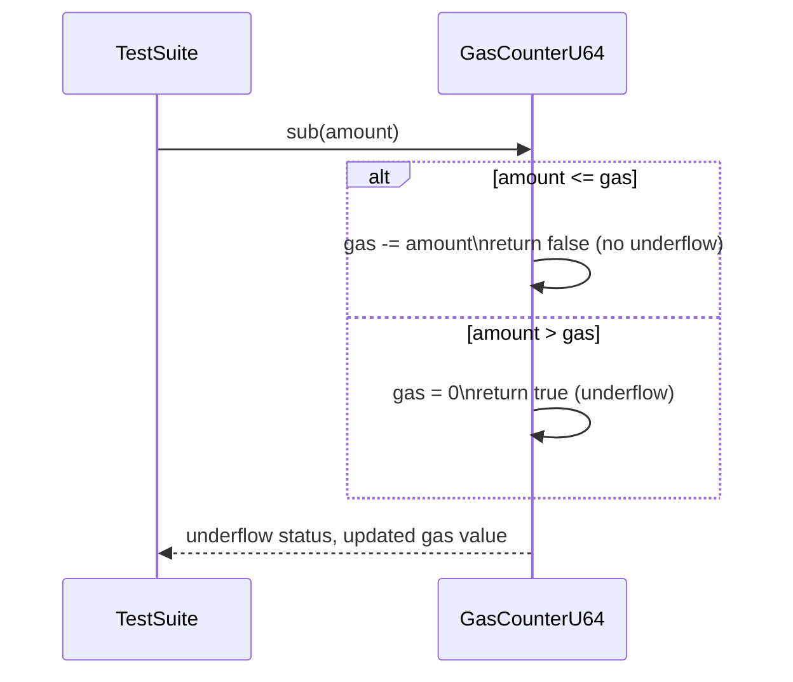

# Fix gas underflow

## Pull Request by @mateuszsikora

Gas calculation worked incorrectly. I added a test and fixed the problem


## Comment by @coderabbitai[bot]

<!-- This is an auto-generated comment: summarize by coderabbit.ai -->
<!-- This is an auto-generated comment: skip review by coderabbit.ai -->

> [!IMPORTANT]
> ## Review skipped
> 
> Auto incremental reviews are disabled on this repository.
> 
> Please check the settings in the CodeRabbit UI or the `.coderabbit.yaml` file in this repository. To trigger a single review, invoke the `@coderabbitai review` command.
> 
> You can disable this status message by setting the `reviews.review_status` to `false` in the CodeRabbit configuration file.

<!-- end of auto-generated comment: skip review by coderabbit.ai -->
<!-- walkthrough_start -->

<details>
<summary>📝 Walkthrough</summary>

<!-- This is an auto-generated comment: release notes by coderabbit.ai -->

## Summary by CodeRabbit

* **Bug Fixes**
  * Improved gas subtraction logic to accurately detect and handle underflow, preventing incorrect gas values.

* **Tests**
  * Added new tests to verify correct behavior of gas subtraction and underflow handling.

<!-- end of auto-generated comment: release notes by coderabbit.ai -->
## Walkthrough

A new test suite for the `GasCounterU64` class was added, focusing on the `sub` method's behavior regarding underflow. The `sub` method implementation was updated to correctly detect and handle underflow, ensuring the gas counter does not wrap around and is set to zero when underflow occurs.

## Changes

| File(s)                                         | Change Summary                                                                                   |
|-------------------------------------------------|--------------------------------------------------------------------------------------------------|
| packages/core/pvm-interpreter/gas.test.ts        | Added tests for `GasCounterU64.sub`, validating correct underflow handling and gas value updates. |
| packages/core/pvm-interpreter/gas.ts             | Modified `GasCounterU64.sub` to properly detect underflow and update gas counter accordingly.     |

## Sequence Diagram(s)



## Estimated code review effort

🎯 2 (Simple) | ⏱️ ~7 minutes

## Poem

> A nibble of gas, a hop and a dash,  
> Subtracting with care, no underflow crash!  
> If you leap too far, the counter goes low,  
> But now it won’t wrap, just zero to show.  
> Hooray for safe math, says this code rabbit—  
> Testing and fixing is always a habit! 🐇✨

</details>

<!-- walkthrough_end -->
<!-- internal state start -->


<!-- DwQgtGAEAqAWCWBnSTIEMB26CuAXA9mAOYCmGJATmriQCaQDG+Ats2bgFyQAOFk+AIwBWJBrngA3EsgEBPRvlqU0AgfFwA6NPEgQAfACgjoCEYDEZyAAUASpETZWaCrKNwSPbABsvkCiQBHbGlcSHFcLzpIACIAMXgAD0giNGRsDCUKADMvfAB3ABpo+2wBZnUaejlIbERKSGZqElqAL0R4AGt8KnRkW0gMRwF6gFYABhGC9Fpaf0Q65EwUeeDIPPVYFAwmCn8xZNTGNC8Gb2p4fCx4LFxYDyYlAVSSDRg7hQxcCngBPG6UJSfeBZeBRW7UMLvFLIBjHU5ec6XNaHDD4UJZdJiC4Ya5EHgUfDcSheWRTPIIBibJjeeiRND0Ag1DKUHL5SCUAkURCvaD4PzSfBeKSQpBTNBhELIxYzMF8qTfLLyW73bp7ULDWBoCQXChijKQjzpTIk3H4wSRZhbA0HGFws7iJG5IjwBhSyAghJ0HnvJSIBjfbgOq7bLzYX3oez+khkRCwNEoHy1L7nDB45XuxL8Pg0RChObeXDct4efqoLXaBECSLu/7+bUkPLoUKwXC4biIDgAek7ztupQ0TGYndioayioAMipEJ3cLIicNdrJO9xvF5O+MRhojPpjOAoGR6PgsjgCMQyMpKgpWOwuLx+MJROIpDJ5A9lKp1FodDuTFA4KgyywNA/jPcgqEvQc2E+LgqEbBwnBcSBqjfKgP00bRdDAQxd1MAxuDQBgOjQUhpx2EhlwkZgwGuGgKF4EhaJ7VINBzTRCw4Axoi4gwLEgABBABJUCLyieDGkQo9GE1VNpCMPiBgbCVcxKdQPCyf50wAAwAcVSABhfB0logBVAA2AAWTT3UxINjnUeQAM+AlaGwBgvUgATQiYT5tAwZBcDyPlWKOBZIHlYFZFNdMNS1HV+GPLSHAEKy2FuRR+CAm0FCM+prlzTA3K2dR4DsloonWW4IwkY5VkkgBGMYxiy9J1CLdwMy5UJgspUQOn8zVQiS5MsVTCNEEaHx6jQZhDM+SAAApxgASkgWh8GkAZ41hWpDWZbJckKflcGwCgcVGzSsmOOorMweh/BchgoqhQ5qU+epGXGb0PDqbyGUlcKQQ28FBtKYbxFG8UEQoUg+Gm2bQnmurlqOHa0j21lDv8Y7TtNTSvmCG79TmBjwbTZ6YXh96+TKglXj4+ZKCDCmMBBChLQENFNnTI0WQO+xcGoWp0H1dN8y8Umste2iwpqjxrnZAiqWeLcjB4yw+PFi9sX8oKfVEKHET8+L2QSbhukvf4VyrF12SBcRZIMKAADk+UpTASLCPkSFN82okt0ovBt9hiukABuDKSQjchG2CkFqwqrnJVhUK8kOeklFoFWAFFc3gRoIMUDw61BRsSDHc2uAAWToeBHE47jHdw/DCOI6ROzIiiqJoyh6MY6EWI7evojV/ihNIMCmnoMTnHkSS3ZkxA3HeTSkpShi43oeWtN0xADJyigzMsxgEXmN0ZtoYFQQZPlpNoatoRKAQwexNYNhN7hA8e0Ief2tklBoLElxXhWGLoZRAJIpjplShvVa8A1SRyGlQMQYJ3jXBXKEB+WQCSWnTKcXY7AbRTG8vKS8otpAFk9pAQ+eo7oMROuQeg5J17vXeGLCWD9U7IHICkJ8LxIAAGVriFUPssJk7QiAMMge8ei2owHoG4LwfAistg7HgfIfwgc/aZW4ecYUPVCLoCyNLYhlB2hAOLDUbgtBJ4NHXulVmylBzoKBu8RBBEgz8gcOLXoEY1DOk+EQu4hFkDAhQKEVAqIMBgB0bwmhKBjyIHwFMbAVimj9Q8A/RkwMZahg8LdI69DkCXS8HUBaqImSZAxktV4AkEqsPId4iJJAeGSBIFMdQ9gGLpKyoyGmfJ8lY0KWECgqx5rXAvrCCWP8qnelQPPUgtsHBzAUPg/Y0y+b/0fC/fJMj2DIEwdgtYVAFGmmcLNegLkPCMnSOIhhHx5RmIwCrcw6tNbgW1pQ9MSgGAGyZsbb2ZsKAWz4FbT+ttwigkXo7SALspLuyBrrb68AJGC2WZJAFvtDwgoDkHO2kK1iUA8I0JQX0GiKEvpMl+jlaIYGOJ85eq9bFpU3swD+JAoICw8ZJbe+lKYHwslZH5qRuRGBzuIfOUQ3z8nrKXcuQKq41zrlxYejdsK/ltoeY8wFTzjxEvQSCN4/BoDgo4cS8hkKF1QmodC34sIGHVZBdQAB9eAtBEBOuLg2OgTr8pAswmqvc6A0DmTQAAdhIGMcyAhTIAA4si0DquZJNDA3LmQYAIAAzHVUyoaABMdUU0RrGHVXNIxc25vMv6nCUBHW4BdW6j1JAZXeoPFW9VzAGDcCdd5GgCQ62+tCDuAwmkR0GAAN4GEgDEPKyKWyIGiFwAA2gAXQKJOmIqccapnnUu5dBgAC+w7R32sDR2rtPbvZ1tbfoIAA= -->

<!-- internal state end -->
<!-- tips_start -->

---


<details>
<summary>🪧 Tips</summary>

### Chat

There are 3 ways to chat with [CodeRabbit](https://coderabbit.ai?utm_source=oss&utm_medium=github&utm_campaign=FluffyLabs/typeberry&utm_content=505):

- Review comments: Directly reply to a review comment made by CodeRabbit. Example:
  - `I pushed a fix in commit <commit_id>, please review it.`
  - `Explain this complex logic.`
  - `Open a follow-up GitHub issue for this discussion.`
- Files and specific lines of code (under the "Files changed" tab): Tag `@coderabbitai` in a new review comment at the desired location with your query. Examples:
  - `@coderabbitai explain this code block.`
  -	`@coderabbitai modularize this function.`
- PR comments: Tag `@coderabbitai` in a new PR comment to ask questions about the PR branch. For the best results, please provide a very specific query, as very limited context is provided in this mode. Examples:
  - `@coderabbitai gather interesting stats about this repository and render them as a table. Additionally, render a pie chart showing the language distribution in the codebase.`
  - `@coderabbitai read src/utils.ts and explain its main purpose.`
  - `@coderabbitai read the files in the src/scheduler package and generate a class diagram using mermaid and a README in the markdown format.`
  - `@coderabbitai help me debug CodeRabbit configuration file.`

### Support

Need help? Create a ticket on our [support page](https://www.coderabbit.ai/contact-us/support) for assistance with any issues or questions.

Note: Be mindful of the bot's finite context window. It's strongly recommended to break down tasks such as reading entire modules into smaller chunks. For a focused discussion, use review comments to chat about specific files and their changes, instead of using the PR comments.

### CodeRabbit Commands (Invoked using PR comments)

- `@coderabbitai pause` to pause the reviews on a PR.
- `@coderabbitai resume` to resume the paused reviews.
- `@coderabbitai review` to trigger an incremental review. This is useful when automatic reviews are disabled for the repository.
- `@coderabbitai full review` to do a full review from scratch and review all the files again.
- `@coderabbitai summary` to regenerate the summary of the PR.
- `@coderabbitai generate sequence diagram` to generate a sequence diagram of the changes in this PR.
- `@coderabbitai resolve` resolve all the CodeRabbit review comments.
- `@coderabbitai configuration` to show the current CodeRabbit configuration for the repository.
- `@coderabbitai help` to get help.

### Other keywords and placeholders

- Add `@coderabbitai ignore` anywhere in the PR description to prevent this PR from being reviewed.
- Add `@coderabbitai summary` to generate the high-level summary at a specific location in the PR description.
- Add `@coderabbitai` anywhere in the PR title to generate the title automatically.

### Documentation and Community

- Visit our [Documentation](https://docs.coderabbit.ai) for detailed information on how to use CodeRabbit.
- Join our [Discord Community](http://discord.gg/coderabbit) to get help, request features, and share feedback.
- Follow us on [X/Twitter](https://twitter.com/coderabbitai) for updates and announcements.

</details>

<!-- tips_end -->


## Comment by @DrEverr

I dont believe it's correct. In my opinion we should go under 0.


## Comment by @DrEverr

@tomusdrw 


## Comment by @tomusdrw

I agree. I think we should allow the gas counter to go below zero. We just shouldn't attempt to treat it as U64 as the comment suggests.

I think it was working correctly before introducing `tryAs` since we are just casting that to the `Gas` type.

We might consider storing it as `bigint`, but the question is what to do if someone attempts to `get()` the gas:
1. Should it return `2**64 + this.gas`?
2. Should it return `0`? 
3. Or maybe it actually should panic to indicate logical error?

I think I'd vote for `3`, since after we subtract and get an underflow, we should never, ever try to read the gas value again, since it's invalid. Setting it to `0` here is kind of hiding the problem.

We might also consider adding `getRaw(): bigint` method to query the actual gas left, which might be negative. The doc should indicate the difference. I hope that having two methods will force the developer to think about that potential underflow.


## Comment by @mateuszsikora

> I dont believe it's correct.

It is more accurate than the previous one because it works :) 


> I agree. I think we should allow the gas counter to go below zero. We just shouldn't attempt to treat it as U64 as the comment suggests.
> 
> I think it was working correctly before introducing `tryAs` since we are just casting that to the `Gas` type.
> 
> We might consider storing it as `bigint`, but the question is what to do if someone attempts to `get()` the gas:
> 
> 1. Should it return `2**64 + this.gas`?
> 2. Should it return `0`?
> 3. Or maybe it actually should panic to indicate logical error?
> 
> I think I'd vote for `3`, since after we subtract and get an underflow, we should never, ever try to read the gas value again, since it's invalid. Setting it to `0` here is kind of hiding the problem.
> 
> We might also consider adding `getRaw(): bigint` method to query the actual gas left, which might be negative. The doc should indicate the difference. I hope that having two methods will force the developer to think about that potential underflow.


Let's say I want to calculate used gas after execution:
``` 
initialGas - gasCounter.get()
```
if we allow going below zero then the above formula will return incorrect result. There is another option - we can keep the underflow as a separate value but the question is whether we need it? Currently we only check if `sub(...)` returns `true` or `false` and based on that return `OOG` or proceed with the execution


## Comment by @DrEverr

what if we check if `g > gas` than we know it will underflow and return false quickly without changin gas?
and if not than we update gas and return true


## Comment by @DrEverr

```suggestion
    const gas = tryAsU64(g);
    if (gas > this.gas) {
      return true;
    }
    this.gas -= gas;
    return true;
```


## Comment by @tomusdrw

I think I'm convinced. @mateuszsikora let's set remaining gas to `0`. It will have a pretty decent behavior as you pointed out. Also all subsequent calls to `sub(non-zero)` will always return `true` (i.e. underflow) which is good too.

> what if we check if g > gas than we know it will underflow and return false quickly without changin gas?
and if not than we update gas and return true

That might cause even more issues, because you will end up with a state "before" the instruction that goes OOG is executed. So for instance next instruction (with lower gas) may still succeed. We would rather want all subsequent instructions to fail.
