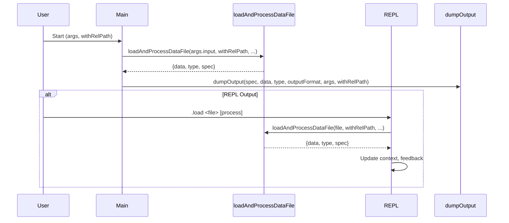

# Added .load function to repl

## Pull Request by @DrEverr

Usage: `.load <file> [process]`
Allows to change file and processing of this file in repl without exiting the console

## Comment by @coderabbitai[bot]

<!-- This is an auto-generated comment: summarize by coderabbit.ai -->
<!-- This is an auto-generated comment: skip review by coderabbit.ai -->

> [!IMPORTANT]
> ## Review skipped
> 
> Auto incremental reviews are disabled on this repository.
> 
> Please check the settings in the CodeRabbit UI or the `.coderabbit.yaml` file in this repository. To trigger a single review, invoke the `@coderabbitai review` command.
> 
> You can disable this status message by setting the `reviews.review_status` to `false` in the CodeRabbit configuration file.

<!-- end of auto-generated comment: skip review by coderabbit.ai -->
<!-- walkthrough_start -->

📝 Walkthrough

<!-- This is an auto-generated comment: release notes by coderabbit.ai -->

## Summary by CodeRabbit

* **New Features**
  * Added a new `.load` command in the REPL, allowing users to reload and reprocess input files dynamically during a session.

* **Refactor**
  * Improved internal structure for input loading and processing to streamline data handling and enhance maintainability.

<!-- end of auto-generated comment: release notes by coderabbit.ai -->
## Walkthrough

The main function in `bin/convert/main.ts` was refactored to use a new helper, `loadAndProcessDataFile`, which consolidates input loading, decoding, and spec retrieval. The REPL output mode now supports a new `.load` command, allowing users to reload and reprocess input files interactively. Function signatures were updated accordingly.

## Changes

| File(s)                        | Change Summary                                                                                       |
|---------------------------------|------------------------------------------------------------------------------------------------------|
| bin/convert/main.ts             | Refactored main function to use `loadAndProcessDataFile`; added `.load` REPL command; updated function signatures for `main` and `dumpOutput`; added helper for input processing. |

## Sequence Diagram(s)

## Estimated code review effort

🎯 2 (Simple) | ⏱️ ~8 minutes

## Poem

> A helper now loads files with care,  
> While REPL commands hop everywhere.  
> With `.load`, you can fetch anew—  
> Data and specs, all fresh for you!  
> Refactored paths, less code to roam,  
> The rabbit’s made this code its home.  
> 🐇✨

<!-- walkthrough_end -->
<!-- internal state start -->

<!-- DwQgtGAEAqAWCWBnSTIEMB26CuAXA9mAOYCmGJATmriQCaQDG+Ats2bgFyQAOFk+AIwBWJBrngA3EsgEBPRvlqU0AgfFwA6NPEgQAfACgjoCEYDEZyAAUASpETZWaCrKNwSPbABsvkCiQBHbGlcSHFcLzpIACIAQVoleg0vfDR6ADNsDDF4fCwCPxJuL2jIAHc0ZAcBZnUaejkw2A9sREpIABEKAFEpCj5Kzx9CoJDIDEcBdoBWAAYANg0YZs8Kbnw2/nSm1FsUZAL4DFwKRWwGDzRxkjLIAANk1No7yEzs8Tyw/CaPG26rAAykAAFDYSGkwL00F4wFYKEdQgD8PhuABKSBkCTwU4YNjHJZwVBvHKfMgqSLIVqUA7fFJpdD2biieDpeBRVmRdAYegoj4YaFeeRobjFIU8U4XRCII5Eew0bhfH6veCcsrqBD5FZ/QH2aTSvIElatNCkeyyY5oAAe+3uj3pwA5JD0kAA2rx8JLEABdO4AGnKzX89wdKqdL1QuBWjsVU0gdMSXPodzdEr1PptmH43D50PQFCIjnYisQTIYLPksHwt0jHmjiEr3gaHndnrohtQaVo6lyWAFVcpbQoNMYsEwpprys5mHo6mQLb1MsgtHNaFqDAF8jVkfweGudEXBRIlvUSqYGEQ+Eiho8e3XWFj/ixNyi1CVAFUbACuLBcLhuIgOAAekAoh1WwAQNCYZhAIAMS8bB0nSWQARURBANwWQmSmfpZEA7hvC8QC5kWIx9GMcAoDIHltjQPBCFIcgqHqBRWHYLheH4YRRHEKQZHkJglCoVR1C0HQyJMKBCWQDtezo4gyGUZioLxTg/DQW4HCcFxIEaATlGEzRtF0MBDHI0wDDUDBALPPpcEA5htAwDRcAAgxoncgwLEgWIAEl5MY6gok0hztPwbYGFHDBSEQNwVgco5XiyEksAqZB/HSNAxHwfx6AKJRIiIQKUAwfDQnjGV/SUASKvFD0Fyi/1p0ZURChONkJFzAornIW5mi8Jk+GJPl7njWJuThOqpQ6ag0Bg0MHmWVA+oGhRz0veBaECg4Vl4EgsR3ZAzy7HNfBSUCGCaV9ItoSIZxK3cMKZZBgWiAQUgEUpspiIQLwwaJ0SaqrFEXBwRWy0IItEABrRB/X8XBsAoDADx21MpSiTbcDQf1ZzCTCSEa7lT1HBKS1Ea9IHirAhp7cYq0YAVtqWkh+vaJqaywdcfGQO5aEcbgAHk8FKl4t1gJV/AcLwXI0WKPF5/mhb/PAXhpz5pSIfkEaDVKMUtGhuSiLqGAubMlUyYY7mcIhEBeQQRDERMlTuMWwS8KxqFgVWkr5JYfPPDaPAnbUgR3ZWIcqAmGR6yAQ5YhyiYeeNRcGTs6Eanwq0XKkh0Vfx4yd/x5ylBkybLVkoiOUrJw8YFeR7DdynVBli+Qa3C2OdFl35NdG7FhLg/+IE2ilHt20OlgE/oKlto8RBV3l0bxrRxBpqxubIheZb2gKfOniXGanewbhMekJU47PGh9YAch5zG0BeDr4XJS4TeyrsosFf0xYxfovuurwi4mo51eCQOgAhMpQ1lgYAAct8CKY4z5lEoB4ByShFQTiYEGVui4vpkGqlFOM+BzoAG5iaILnPCEKKp5CSxOOcbWQcowpFuOkL6VddzlUIU1TsxUaBUByFIWOQ9ErvAboAjCrwvp7zSIue+NdEDQK8rEaWikezDgnFVLwzhqDqK2HrdYFBmJfXwm9eAF12DdmkKRSAMEfa0w1lrRGLQT6BVoFwO4R5DGhDVlgKmwJrYAW8vmDuLlv7qjdh7SMXBgQSC4IgNqUV0QAF5nQJPhEk8MWA7iWWsnkWy9lHLOVtpAQAKAR8MoPyU6xDzGFAyllHKioqQjSeGNWgE1PRr1mvNWWUA7FiM+Gndx9xfFELSG0jpeoukbxIMCR08TEmygAD6QCyEoVk5BaDhMjJEz2MS4lygyUQFJaTFn+nSNoiQ2UuAAGkMBVgwAAYRJhgAAyqWSqohFAkGgPjLgrzj7eLoL8pk/pW4LKOaiLJ9xck2UoHZKmxSHgGD6fY9W8BNbUGcas1x9QPGjL5swQWws8DAjLlwZ5jl3miEqjNLgWQob3LKBgf0j0SD/MBeDYF+N/Rh1KjBbKDlVJK35YK6gULICACTCEZaKsCEuJeHMlpYKUvOpQwWlWN6UYEZQ81lfzIAArBkY7loL+AktwAKigQquAirwJaoVjV8xBNiCElSsMm47JZlE2AMTuB7MOTKE5AbMnFRhUcPJGACmIpcsi9y0RSImTMpRImYUcAEH8opKIyk2JqQ0o4EK8hdLfKEmoQyYlE0SXjuoAA+htRA1bHxsmQbQatCTnChDIgYStAAmWYAgADs3aAAsAAOAAnN2/t6RZj9qHbQEdsxpjzAHQARiHQwMdUwl1jpXdO0diE0DdpHcZUylblI1rrQ2vaTa6DVqoiertFFKYMG4NWy+R5cCtqxkYh9Bg7j/oMAAbwMJAGIRwNY/kQNELgLovS+hAzECoSMZRQZg16AwABfP9AHH0QGfa+99+s71E30EAA -->

<!-- internal state end -->
<!-- tips_start -->

---

🪧 Tips

### Chat

There are 3 ways to chat with [CodeRabbit](https://coderabbit.ai?utm_source=oss&utm_medium=github&utm_campaign=FluffyLabs/typeberry&utm_content=506):

- Review comments: Directly reply to a review comment made by CodeRabbit. Example:
  - `I pushed a fix in commit <commit_id>, please review it.`
  - `Explain this complex logic.`
  - `Open a follow-up GitHub issue for this discussion.`
- Files and specific lines of code (under the "Files changed" tab): Tag `@coderabbitai` in a new review comment at the desired location with your query. Examples:
  - `@coderabbitai explain this code block.`
  -	`@coderabbitai modularize this function.`
- PR comments: Tag `@coderabbitai` in a new PR comment to ask questions about the PR branch. For the best results, please provide a very specific query, as very limited context is provided in this mode. Examples:
  - `@coderabbitai gather interesting stats about this repository and render them as a table. Additionally, render a pie chart showing the language distribution in the codebase.`
  - `@coderabbitai read src/utils.ts and explain its main purpose.`
  - `@coderabbitai read the files in the src/scheduler package and generate a class diagram using mermaid and a README in the markdown format.`
  - `@coderabbitai help me debug CodeRabbit configuration file.`

### Support

Need help? Create a ticket on our [support page](https://www.coderabbit.ai/contact-us/support) for assistance with any issues or questions.

Note: Be mindful of the bot's finite context window. It's strongly recommended to break down tasks such as reading entire modules into smaller chunks. For a focused discussion, use review comments to chat about specific files and their changes, instead of using the PR comments.

### CodeRabbit Commands (Invoked using PR comments)

- `@coderabbitai pause` to pause the reviews on a PR.
- `@coderabbitai resume` to resume the paused reviews.
- `@coderabbitai review` to trigger an incremental review. This is useful when automatic reviews are disabled for the repository.
- `@coderabbitai full review` to do a full review from scratch and review all the files again.
- `@coderabbitai summary` to regenerate the summary of the PR.
- `@coderabbitai generate sequence diagram` to generate a sequence diagram of the changes in this PR.
- `@coderabbitai resolve` resolve all the CodeRabbit review comments.
- `@coderabbitai configuration` to show the current CodeRabbit configuration for the repository.
- `@coderabbitai help` to get help.

### Other keywords and placeholders

- Add `@coderabbitai ignore` anywhere in the PR description to prevent this PR from being reviewed.
- Add `@coderabbitai summary` to generate the high-level summary at a specific location in the PR description.
- Add `@coderabbitai` anywhere in the PR title to generate the title automatically.

### Documentation and Community

- Visit our [Documentation](https://docs.coderabbit.ai) for detailed information on how to use CodeRabbit.
- Join our [Discord Community](http://discord.gg/coderabbit) to get help, request features, and share feedback.
- Follow us on [X/Twitter](https://twitter.com/coderabbitai) for updates and announcements.

<!-- tips_end -->

## Comment by @DrEverr

> looks cool! I wonder if there is a good use case to allow overriding `process` though. I think I'd rather allow loading different file, but keep the same `type` and processing options for simplicity.

I have one good use case that actually made me add `process` to this command. Loading pre and post state of test vectors without leaving repl.

## Comment by @github-actions[bot]

View all

| File | Benchmark | Ops |  |
|------|-----------|-----|--|
| [bytes/hex-to.ts[0]](../blob/a9aa1330c417c60822d020da226a2f9548920a87//_work/typeberry-runner-2/typeberry/typeberry/benchmarks/bytes/hex-to.ts) | number toString + padding | 321202.23 ±0.43% | fastest ✅ |
| [bytes/hex-to.ts[1]](../blob/a9aa1330c417c60822d020da226a2f9548920a87//_work/typeberry-runner-2/typeberry/typeberry/benchmarks/bytes/hex-to.ts) | manual | 16398.66 ±0.61% | 94.89% slower |
| [bytes/hex-from.ts[0]](../blob/a9aa1330c417c60822d020da226a2f9548920a87//_work/typeberry-runner-2/typeberry/typeberry/benchmarks/bytes/hex-from.ts) | parse hex using `Number` with NaN checking | 136161.47 ±0.4% | 84.2% slower |
| [bytes/hex-from.ts[1]](../blob/a9aa1330c417c60822d020da226a2f9548920a87//_work/typeberry-runner-2/typeberry/typeberry/benchmarks/bytes/hex-from.ts) | parse hex from char codes | 861544.78 ±0.58% | fastest ✅ |
| [bytes/hex-from.ts[2]](../blob/a9aa1330c417c60822d020da226a2f9548920a87//_work/typeberry-runner-2/typeberry/typeberry/benchmarks/bytes/hex-from.ts) | parse hex from string nibbles | 535765.54 ±0.44% | 37.81% slower |
| [math/mul_overflow.ts[0]](../blob/a9aa1330c417c60822d020da226a2f9548920a87//_work/typeberry-runner-2/typeberry/typeberry/benchmarks/math/mul_overflow.ts) | multiply and bring back to u32 | 240033029.34 ±6.43% | 2.8% slower |
| [math/mul_overflow.ts[1]](../blob/a9aa1330c417c60822d020da226a2f9548920a87//_work/typeberry-runner-2/typeberry/typeberry/benchmarks/math/mul_overflow.ts) | multiply and take modulus | 246936490.69 ±6.91% | fastest ✅ |
| [math/count-bits-u64.ts[0]](../blob/a9aa1330c417c60822d020da226a2f9548920a87//_work/typeberry-runner-2/typeberry/typeberry/benchmarks/math/count-bits-u64.ts) | standard method | 8184995.32 ±0.73% | 91.1% slower |
| [math/count-bits-u64.ts[1]](../blob/a9aa1330c417c60822d020da226a2f9548920a87//_work/typeberry-runner-2/typeberry/typeberry/benchmarks/math/count-bits-u64.ts) | magic | 92004444.56 ±1.84% | fastest ✅ |
| [logger/index.ts[0]](../blob/a9aa1330c417c60822d020da226a2f9548920a87//_work/typeberry-runner-2/typeberry/typeberry/benchmarks/logger/index.ts) | console.log with string concat | 6786948 ±61.04% | fastest ✅ |
| [logger/index.ts[1]](../blob/a9aa1330c417c60822d020da226a2f9548920a87//_work/typeberry-runner-2/typeberry/typeberry/benchmarks/logger/index.ts) | console.log with args | 966731.68 ±90.34% | 85.76% slower |
| [math/add_one_overflow.ts[0]](../blob/a9aa1330c417c60822d020da226a2f9548920a87//_work/typeberry-runner-2/typeberry/typeberry/benchmarks/math/add_one_overflow.ts) | add and take modulus | 215869833.18 ±36.14% | 13.18% slower |
| [math/add_one_overflow.ts[1]](../blob/a9aa1330c417c60822d020da226a2f9548920a87//_work/typeberry-runner-2/typeberry/typeberry/benchmarks/math/add_one_overflow.ts) | condition before calculation | 248653562.54 ±6.37% | fastest ✅ |
| [math/count-bits-u32.ts[0]](../blob/a9aa1330c417c60822d020da226a2f9548920a87//_work/typeberry-runner-2/typeberry/typeberry/benchmarks/math/count-bits-u32.ts) | standard method | 83566315.36 ±1.8% | 63.26% slower |
| [math/count-bits-u32.ts[1]](../blob/a9aa1330c417c60822d020da226a2f9548920a87//_work/typeberry-runner-2/typeberry/typeberry/benchmarks/math/count-bits-u32.ts) | magic | 227437029.06 ±6.17% | fastest ✅ |
| [math/switch.ts[0]](../blob/a9aa1330c417c60822d020da226a2f9548920a87//_work/typeberry-runner-2/typeberry/typeberry/benchmarks/math/switch.ts) | switch | 261179841.52 ±5.82% | fastest ✅ |
| [math/switch.ts[1]](../blob/a9aa1330c417c60822d020da226a2f9548920a87//_work/typeberry-runner-2/typeberry/typeberry/benchmarks/math/switch.ts) | if | 252244934.2 ±8.05% | 3.42% slower |
| [codec/decoding.ts[0]](../blob/a9aa1330c417c60822d020da226a2f9548920a87//_work/typeberry-runner-2/typeberry/typeberry/benchmarks/codec/decoding.ts) | manual decode | 17065701.6 ±0.43% | 91.04% slower |
| [codec/decoding.ts[1]](../blob/a9aa1330c417c60822d020da226a2f9548920a87//_work/typeberry-runner-2/typeberry/typeberry/benchmarks/codec/decoding.ts) | int32array decode | 189814414.08 ±5.16% | 0.33% slower |
| [codec/decoding.ts[2]](../blob/a9aa1330c417c60822d020da226a2f9548920a87//_work/typeberry-runner-2/typeberry/typeberry/benchmarks/codec/decoding.ts) | dataview decode | 190449748.28 ±4.68% | fastest ✅ |
| [codec/encoding.ts[0]](../blob/a9aa1330c417c60822d020da226a2f9548920a87//_work/typeberry-runner-2/typeberry/typeberry/benchmarks/codec/encoding.ts) | manual encode | 2508334.95 ±2.28% | 22.65% slower |
| [codec/encoding.ts[1]](../blob/a9aa1330c417c60822d020da226a2f9548920a87//_work/typeberry-runner-2/typeberry/typeberry/benchmarks/codec/encoding.ts) | int32array encode | 2832034.22 ±2.91% | 12.67% slower |
| [codec/encoding.ts[2]](../blob/a9aa1330c417c60822d020da226a2f9548920a87//_work/typeberry-runner-2/typeberry/typeberry/benchmarks/codec/encoding.ts) | dataview encode | 3242849.7 ±0.31% | fastest ✅ |
| [hash/index.ts[0]](../blob/a9aa1330c417c60822d020da226a2f9548920a87//_work/typeberry-runner-2/typeberry/typeberry/benchmarks/hash/index.ts) | hash with numeric representation | 188.89 ±1.13% | 28.2% slower |
| [hash/index.ts[1]](../blob/a9aa1330c417c60822d020da226a2f9548920a87//_work/typeberry-runner-2/typeberry/typeberry/benchmarks/hash/index.ts) | hash with string representation | 117.62 ±0.21% | 55.29% slower |
| [hash/index.ts[2]](../blob/a9aa1330c417c60822d020da226a2f9548920a87//_work/typeberry-runner-2/typeberry/typeberry/benchmarks/hash/index.ts) | hash with symbol representation | 182.48 ±0.22% | 30.64% slower |
| [hash/index.ts[3]](../blob/a9aa1330c417c60822d020da226a2f9548920a87//_work/typeberry-runner-2/typeberry/typeberry/benchmarks/hash/index.ts) | hash with uint8 representation | 163.29 ±0.51% | 37.93% slower |
| [hash/index.ts[4]](../blob/a9aa1330c417c60822d020da226a2f9548920a87//_work/typeberry-runner-2/typeberry/typeberry/benchmarks/hash/index.ts) | hash with packed representation | 263.09 ±0.49% | fastest ✅ |
| [hash/index.ts[5]](../blob/a9aa1330c417c60822d020da226a2f9548920a87//_work/typeberry-runner-2/typeberry/typeberry/benchmarks/hash/index.ts) | hash with bigint representation | 192.71 ±0.25% | 26.75% slower |
| [hash/index.ts[6]](../blob/a9aa1330c417c60822d020da226a2f9548920a87//_work/typeberry-runner-2/typeberry/typeberry/benchmarks/hash/index.ts) | hash with uint32 representation | 204.47 ±0.25% | 22.28% slower |
| [codec/bigint.compare.ts[0]](../blob/a9aa1330c417c60822d020da226a2f9548920a87//_work/typeberry-runner-2/typeberry/typeberry/benchmarks/codec/bigint.compare.ts) | compare custom | 246011178.15 ±6.93% | fastest ✅ |
| [codec/bigint.compare.ts[1]](../blob/a9aa1330c417c60822d020da226a2f9548920a87//_work/typeberry-runner-2/typeberry/typeberry/benchmarks/codec/bigint.compare.ts) | compare bigint | 242304505.78 ±7.23% | 1.51% slower |
| [collections/map-set.ts[0]](../blob/a9aa1330c417c60822d020da226a2f9548920a87//_work/typeberry-runner-2/typeberry/typeberry/benchmarks/collections/map-set.ts) | 2 gets + conditional set | 111573.07 ±0.08% | fastest ✅ |
| [collections/map-set.ts[1]](../blob/a9aa1330c417c60822d020da226a2f9548920a87//_work/typeberry-runner-2/typeberry/typeberry/benchmarks/collections/map-set.ts) | 1 get 1 set | 61701.11 ±0.01% | 44.7% slower |
| [codec/bigint.decode.ts[0]](../blob/a9aa1330c417c60822d020da226a2f9548920a87//_work/typeberry-runner-2/typeberry/typeberry/benchmarks/codec/bigint.decode.ts) | decode custom | 213503569.02 ±4.47% | fastest ✅ |
| [codec/bigint.decode.ts[1]](../blob/a9aa1330c417c60822d020da226a2f9548920a87//_work/typeberry-runner-2/typeberry/typeberry/benchmarks/codec/bigint.decode.ts) | decode bigint | 71795552.89 ±3.77% | 66.37% slower |
| [codec/view_vs_object.ts[0]](../blob/a9aa1330c417c60822d020da226a2f9548920a87//_work/typeberry-runner-2/typeberry/typeberry/benchmarks/codec/view_vs_object.ts) | Get the first field from Decoded | 49231.33 ±111.38% | 88.76% slower |
| [codec/view_vs_object.ts[1]](../blob/a9aa1330c417c60822d020da226a2f9548920a87//_work/typeberry-runner-2/typeberry/typeberry/benchmarks/codec/view_vs_object.ts) | Get the first field from View | 86056.9 ±1.14% | 80.35% slower |
| [codec/view_vs_object.ts[2]](../blob/a9aa1330c417c60822d020da226a2f9548920a87//_work/typeberry-runner-2/typeberry/typeberry/benchmarks/codec/view_vs_object.ts) | Get the first field as view from View | 95444.03 ±1.5% | 78.21% slower |
| [codec/view_vs_object.ts[3]](../blob/a9aa1330c417c60822d020da226a2f9548920a87//_work/typeberry-runner-2/typeberry/typeberry/benchmarks/codec/view_vs_object.ts) | Get two fields from Decoded | 437959.12 ±0.38% | fastest ✅ |
| [codec/view_vs_object.ts[4]](../blob/a9aa1330c417c60822d020da226a2f9548920a87//_work/typeberry-runner-2/typeberry/typeberry/benchmarks/codec/view_vs_object.ts) | Get two fields from View | 77721.49 ±0.87% | 82.25% slower |
| [codec/view_vs_object.ts[5]](../blob/a9aa1330c417c60822d020da226a2f9548920a87//_work/typeberry-runner-2/typeberry/typeberry/benchmarks/codec/view_vs_object.ts) | Get two fields from materialized from View | 145188.99 ±1.42% | 66.85% slower |
| [codec/view_vs_object.ts[6]](../blob/a9aa1330c417c60822d020da226a2f9548920a87//_work/typeberry-runner-2/typeberry/typeberry/benchmarks/codec/view_vs_object.ts) | Get two fields as views from View | 76287.78 ±1.5% | 82.58% slower |
| [codec/view_vs_object.ts[7]](../blob/a9aa1330c417c60822d020da226a2f9548920a87//_work/typeberry-runner-2/typeberry/typeberry/benchmarks/codec/view_vs_object.ts) | Get only third field from Decoded | 405346.7 ±3.77% | 7.45% slower |
| [codec/view_vs_object.ts[8]](../blob/a9aa1330c417c60822d020da226a2f9548920a87//_work/typeberry-runner-2/typeberry/typeberry/benchmarks/codec/view_vs_object.ts) | Get only third field from View | 101422.62 ±0.91% | 76.84% slower |
| [codec/view_vs_object.ts[9]](../blob/a9aa1330c417c60822d020da226a2f9548920a87//_work/typeberry-runner-2/typeberry/typeberry/benchmarks/codec/view_vs_object.ts) | Get only third field as view from View | 99402.95 ±0.92% | 77.3% slower |
| [codec/view_vs_collection.ts[0]](../blob/a9aa1330c417c60822d020da226a2f9548920a87//_work/typeberry-runner-2/typeberry/typeberry/benchmarks/codec/view_vs_collection.ts) | Get first element from Decoded | 26846.85 ±0.84% | 59.85% slower |
| [codec/view_vs_collection.ts[1]](../blob/a9aa1330c417c60822d020da226a2f9548920a87//_work/typeberry-runner-2/typeberry/typeberry/benchmarks/codec/view_vs_collection.ts) | Get first element from View | 66871.9 ±0.74% | fastest ✅ |
| [codec/view_vs_collection.ts[2]](../blob/a9aa1330c417c60822d020da226a2f9548920a87//_work/typeberry-runner-2/typeberry/typeberry/benchmarks/codec/view_vs_collection.ts) | Get 50th element from Decoded | 26590.59 ±1.51% | 60.24% slower |
| [codec/view_vs_collection.ts[3]](../blob/a9aa1330c417c60822d020da226a2f9548920a87//_work/typeberry-runner-2/typeberry/typeberry/benchmarks/codec/view_vs_collection.ts) | Get 50th element from View | 38443.63 ±0.32% | 42.51% slower |
| [codec/view_vs_collection.ts[4]](../blob/a9aa1330c417c60822d020da226a2f9548920a87//_work/typeberry-runner-2/typeberry/typeberry/benchmarks/codec/view_vs_collection.ts) | Get last element from Decoded | 25542.95 ±2.42% | 61.8% slower |
| [codec/view_vs_collection.ts[5]](../blob/a9aa1330c417c60822d020da226a2f9548920a87//_work/typeberry-runner-2/typeberry/typeberry/benchmarks/codec/view_vs_collection.ts) | Get last element from View | 25596.05 ±2.06% | 61.72% slower |
| [hash/blake2b.ts[0]](../blob/a9aa1330c417c60822d020da226a2f9548920a87//_work/typeberry-runner-2/typeberry/typeberry/benchmarks/hash/blake2b.ts) | hasher with simple allocator | 0.05 ±1.43% | fastest ✅ |
| [hash/blake2b.ts[1]](../blob/a9aa1330c417c60822d020da226a2f9548920a87//_work/typeberry-runner-2/typeberry/typeberry/benchmarks/hash/blake2b.ts) | hasher with page allocator | 0.04 ±0.05% | 20% slower |
| [collections/map_vs_sorted.ts[0]](../blob/a9aa1330c417c60822d020da226a2f9548920a87//_work/typeberry-runner-2/typeberry/typeberry/benchmarks/collections/map_vs_sorted.ts) | Map | 326947.89 ±0.46% | fastest ✅ |
| [collections/map_vs_sorted.ts[1]](../blob/a9aa1330c417c60822d020da226a2f9548920a87//_work/typeberry-runner-2/typeberry/typeberry/benchmarks/collections/map_vs_sorted.ts) | Map-array | 103364.01 ±0.03% | 68.39% slower |
| [collections/map_vs_sorted.ts[2]](../blob/a9aa1330c417c60822d020da226a2f9548920a87//_work/typeberry-runner-2/typeberry/typeberry/benchmarks/collections/map_vs_sorted.ts) | Array | 66605.13 ±0.25% | 79.63% slower |
| [collections/map_vs_sorted.ts[3]](../blob/a9aa1330c417c60822d020da226a2f9548920a87//_work/typeberry-runner-2/typeberry/typeberry/benchmarks/collections/map_vs_sorted.ts) | SortedArray | 194087.93 ±0.14% | 40.64% slower |
| [bytes/compare.ts[0]](../blob/a9aa1330c417c60822d020da226a2f9548920a87//_work/typeberry-runner-2/typeberry/typeberry/benchmarks/bytes/compare.ts) | Comparing Uint32 bytes | 20405.28 ±0.11% | 3.2% slower |
| [bytes/compare.ts[1]](../blob/a9aa1330c417c60822d020da226a2f9548920a87//_work/typeberry-runner-2/typeberry/typeberry/benchmarks/bytes/compare.ts) | Comparing raw bytes | 21079.89 ±0.07% | fastest ✅ |
| [crypto/ed25519.ts[0]](../blob/a9aa1330c417c60822d020da226a2f9548920a87//_work/typeberry-runner-2/typeberry/typeberry/benchmarks/crypto/ed25519.ts) | native crypto | 5.59 ±17.17% | 81.24% slower |
| [crypto/ed25519.ts[1]](../blob/a9aa1330c417c60822d020da226a2f9548920a87//_work/typeberry-runner-2/typeberry/typeberry/benchmarks/crypto/ed25519.ts) | wasm lib | 10.63 ±0.04% | 64.32% slower |
| [crypto/ed25519.ts[2]](../blob/a9aa1330c417c60822d020da226a2f9548920a87//_work/typeberry-runner-2/typeberry/typeberry/benchmarks/crypto/ed25519.ts) | wasm lib batch | 29.79 ±0.62% | fastest ✅ |

### Benchmarks summary: 63/63 OK ✅

<!-- thollander/actions-comment-pull-request "benchmarks" -->
