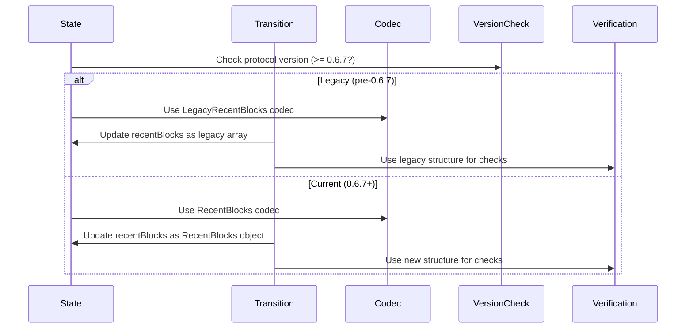

# Recent blocks state update GP 0.6.7

## Pull Request by @DrEverr

resolves: #480 


## Comment by @coderabbitai[bot]

<!-- This is an auto-generated comment: summarize by coderabbit.ai -->
<!-- This is an auto-generated comment: skip review by coderabbit.ai -->

> [!IMPORTANT]
> ## Review skipped
> 
> Auto incremental reviews are disabled on this repository.
> 
> Please check the settings in the CodeRabbit UI or the `.coderabbit.yaml` file in this repository. To trigger a single review, invoke the `@coderabbitai review` command.
> 
> You can disable this status message by setting the `reviews.review_status` to `false` in the CodeRabbit configuration file.

<!-- end of auto-generated comment: skip review by coderabbit.ai -->
<!-- walkthrough_start -->

<details>
<summary>📝 Walkthrough</summary>

<!-- This is an auto-generated comment: release notes by coderabbit.ai -->

## Summary by CodeRabbit

* **New Features**
  * Introduced version-aware handling for recent blocks, supporting both legacy and new formats depending on protocol version.
  * Added new data structures for recent block state and accumulation logs to improve blockchain state history tracking.

* **Bug Fixes**
  * Enhanced compatibility by conditionally processing recent blocks and related logic based on protocol version.

* **Tests**
  * Updated and expanded test cases to cover both legacy and new recent blocks formats, ensuring correctness across versions.

* **Documentation**
  * Improved documentation and version references for new and legacy recent blocks structures.

<!-- end of auto-generated comment: release notes by coderabbit.ai -->
## Walkthrough

This set of changes introduces a version-aware bifurcation for the handling of the `recentBlocks` state in a blockchain protocol, supporting both legacy and new data structures. It adds new types and serialization codecs, updates transition and verification logic, adapts tests, and ensures compatibility across protocol versions, primarily gated by `GpVersion.V0_6_7`.

## Changes

| Cohort / File(s)                                                                 | Change Summary |
|----------------------------------------------------------------------------------|---------------|
| **State Type & Structure Updates**<br>`packages/jam/state/state.ts`, `packages/jam/state/recent-blocks.ts`, `packages/jam/state/index.ts` | Introduces `LegacyRecentBlocks` type and new `RecentBlocks`/`RecentBlockState` classes; updates the `State` type to support both legacy and new recent blocks formats; exports new structures. |
| **Serialization & Codec Handling**<br>`packages/jam/state-merkleization/serialize.ts`, `bin/test-runner/jamduna/state-loader.ts` | Adds version-aware codecs for recent blocks, separating legacy and current serialization; updates decoding logic to select the correct codec based on version. |
| **State Management & Initialization**<br>`packages/jam/state/in-memory-state.ts`, `packages/jam/state-json/dump.ts`, `packages/jam/state/test.utils.ts` | Updates initialization, copying, and test utilities to conditionally handle legacy or new recent blocks structures based on protocol version. |
| **Transition Logic & Verification**<br>`packages/jam/transition/recent-history.ts`, `packages/jam/transition/reports/verify-contextual.ts`, `packages/jam/transition/reports/test.utils.ts` | Refactors state transition and verification logic to branch on protocol version, supporting both legacy and new recent blocks formats; updates lookup, uniqueness, and contextual checks accordingly. |
| **Testing: Versioned Recent Blocks**<br>`packages/jam/transition/recent-history.test.ts`, `packages/jam/state-merkleization/state-entries.test.ts`, `packages/jam/state-json/dump.test.ts`, `bin/test-runner/w3f/reports.ts` | Updates and splits tests to cover both legacy and new recent blocks formats, conditionally running assertions and data setup based on protocol version. |
 
## Sequence Diagram(s)



## Estimated code review effort

🎯 4 (Complex) | ⏱️ ~45 minutes

## Poem

> A rabbit hopped through versioned code,
> Where recent blocks in two forms flowed.
> With legacy arrays and new logs in tow,
> The state now adapts to versions we know.
> Tests split and codecs choose their way,
> Hooray for history—old and new—today! 🐇✨

</details>

<!-- walkthrough_end -->
<!-- internal state start -->


<!-- DwQgtGAEAqAWCWBnSTIEMB26CuAXA9mAOYCmGJATmriQCaQDG+Ats2bgFyQAOFk+AIwBWJBrngA3EsgEBPRvlqU0AgfFwA6NPEgQAfACgjoCEejqANiS4AlUe0gCL+BgGtkiXNRKRs3Wt6QAOIACpAADBoAbBoA7AYActjMApRcAKwAjABMBgCqiGmQACIUAKJSFBRG+sbgUGT0+ABmOATEZMo09Eys7Fy8/MKi4lIy8kxKVKrqWjq1JlBwqKiYbYSk5FTdCn0YnJBUAO6QiMnMaBTycgpTKmqa2rpghnWmBmoYAPQ0nmAU2AwWy+QjQzFogLQX083jAzjQUw0uEQHAMACIMQYAMRYyAAQQAkh0tt56GdWJd5C1GLBMKREGZYD4GLSMKRIMxFPBmvBpJBcEzIEpJvA2ZBnER4AxIM18HwBT4AAYMADMisgrlF9FF/MFis1GFoAFk0NxuKKiOrBCIxBpICEKCQJPB8NhEBZZAAaXVKx0MdgAIWcbkQ6p5JAs9COaGQwsUdF8iAtkEVhQo8DQFngAC8SBo/YHg+4NABheMMRV2vHNGjywUsukkb3qRN81OUDNZ3P5+z7IMudwAGRIRDQDFkpfL6tFnhICLty2QmdryCOCBZt1EKCXZqzCYIQtE8Z9KYkmewJDDcpTBb7RdDvkNlBPyrVGpIXtOR3ULOTzQoLAngw2BVA4kxbgeaDiiOY4TOWdoJPg/AKnwEpSvwfCUABfCsrQWZiqszTNCMdAaEYRg4viFi1tQLoYMgB4KoeDAWJctH4PR/CtCQAAe3Byjs17cNgTjoew6i8gyBhQIhNKNgxSFMcKrHbHRyDUrx/EUIJfDCaJ0rieIfJHJQPgXEoZEGGUnjwBcOzgYcTq8icJBEQJXBGnQ8DJOimLSe8nw/NIuD/ICwJHCqzRfI6WnIkiKK+Wi2K4oSxJdAm5IXFcXFyWy0iMsyrLsgitBLlgtmxTlTGKsOo7jnY/p3gOD64LI3A+P+gHVQAAq17WpFUsjQl4NDqpyEJWHaBJYNVAIYHYsWINAwVhoCYh0d61W8CQADKI15reuD9iG6qXFQ8ioBg+AuXxWYMJYEwxrg/KKXqtWwQ1hbNeqfU+KksqOowmb4UQKYaDyhoABQAJQ/UhLKiK4KCtFBkpSFgioABJzlMmMxrA6q8UgyIoDNgqHY494LggyAxax/oMYK23Oq6sbwH6z1umg7LUoq217d4PaNUd97qt+Aqus9UG/egiBpuIHGWZReLUV0akvSeylsQrnEaXxAkJkJIl3ZAhmSTUkCyQ2eUKZrogqexut8EmRAYNQIF8nrsWG7pxtifsEnGaZHIInmiU1O83Bjq43PSCCYLDbCQiIBxXwQsw3BIsF8WohiSXK0SmzpWS5yUjl1v0gV/LBUDhSQGiiCwK6kbivgCIytgFgWJAABSO0APIJKc+1Csk3BotukBXScTCGhJHHA/IiCamaCYCDGhtk8yLBR+IahZq1NKI+go4zlLpztfdPLSpUSYcZAkNBNwABqlB3xgGjP+EAD6UTf7E0NqbbyUCgDOAlkCKjLBnWi+91CyFOoaFMT9X4UHfmGACzATx4HgAfSSHJFCdx8JgegSgIZ8igrPWg883bd1+M9OaWwUzqAdCQcIURYg/VpM9Ze8BuCMx8HQ5GQEQKOn2JAW+dFJ5EEdN4Pg14SAAEdsCZg1pEGIsRqaoDpmOPkTE1ocSoTrFRvFRDYPvtSJigjxawHQOIt+dFiCklNjxUxOtvSuWIutKQHohRIBUCDE8giAZ2NQerNRcR0CIJUPgKQlkKIpVVqpDitslL221urL2Bsmi+30qbAORkpIyXhkVXRSFNJZIwjwP2Bl8nyC1kkziJlAbmR8DqAUqAqFEUstZcQdkEwOUdM6EgLk3LaQ8l5HyecI5gCMFHNwsdEDx2YInGgYBk6p3TpnZEudMQFzStsDKpdsrUgrvlAwcBCqNlJrgACEIGaROcdwO6LYZYxnlpI4Js1ewi2+jwAC7VtIXS3imZoncLACxoMUMeAAxDBPcU4YFWhgdait7SDJdG6D03pFSHWOu4MWMZZYu3IPQJiZ4LAXhTKkLwkAAD8tLZYAGlp4YB2jmEgkMADaABdWGkBrGS1sTLBgT0qw1mfExU5m1BSaUdHLSRqARWeA1jVGC9Vvl4ofISxUkNqVQXpUyllbLcxct5dDWWkB3rquFpqys+JaCGLoovaVAi2pKitbIT6TUTqTwqhUzqmCeq/QGlcFZl4eDR1jpo5A41uRSkdowFScbdEyr4iRUlbqco4o1aLUe6YxRMT7oPQ8aZOw5gTcQ4egQ/TJJudgFFWBeAuGkIgOJyUqI0R1ikwU9THbqW4vrbSPsqm5LNmcqABIwFDoze1dADq6BcFVXVT1ObfkBpTL1N1IahowlGqTFMcyY70iWWGtZCK05j3ioqIwPTbJOIGU5YZptRkHEHNdcO/kZkGEPQsk9u6SBgDYBQVwVhy062hB2TM7Kc7hz2UXA5JcKTHNaKcqSFzcr0mubc+tPgJEcTAGgaMgNS1QezAmz5epcW5v/Xkm51wl5PPUOIAiz1RSMSOEhKhNlkXPXAgwFEN5V0hg9VePgeHOK8BdPKJC4TYiRPoNmm194SwiPYKJkJ78IjRAiZW1itYgHQWXZuaUbpyEyngC42gYAky5nQFUNAcFhRZrxRC8N1jTjsoUPRG52h9iIG9GuHBAj6yqbEXx1s/CUxep+SGScwo7V4ink+xTX0fXlO0pPUhooEyEooQY6hKjChWDENeAU1BHK4BApxJipom2ScCOF9ehQmjArmr07e0C944LgUfNwJ9fPKrJfY++ipZN2sXI5J5OjIvMwxR4C0VhBNKd+eFrLGBqFVgdQV7ufrtLIGCUuj6Qn8XYui7a70lbxO7F3vAWBh9sG4PIYDEq+4kJnDNAJXUiqSkGblc9CxgoeSLcdBcGcj5Tm0DbcrRJfaNapJYuk5JOV0s6RHSbMdhT7VKHoCjxdVHmoeq4K5sswpgAerO/ePQ04sBuzYIgOZSoSNdnDTqPmkbj2gmWf+wDlAQMkDA3RCD6ZSN5mRNeqAeJ5048HQcFL3r3AqdAvsIn+0SeiGABT5qVP920+kAzlMTP2XU4PezuOnPT1Ab5wL1Ohvuxi+kpAI0XJwzS9inj47AniflmAK5zlaJ8chjRNy7XOpdf050QbyDzPjds/mRzhO3PLegbI+B23ouHwQ5lBg2xSY2SLdW65UU1CNZQXE2AJQ7UnxiKKyMa8jpKsUHW2KfnKElupaHGq+BlS5cxYV6F3A6omub0OICdr12YHdcPgjNwN6bJ9J6MedFT6PHuUdxM5gH6IBfp/fHrn+0efAeT47U97B0zSCzp4GDUy4OdAQ6cI5VIUMlLQ4KQRSqOrXkqNyWQyYmKaXTYcPgPgM9LSI3OgOKnwLVh6MmFBDRn4AEDQPyoSrGi7hrLhItmsCVNthppIpQhtmik5KzFiieP/mIAmABMAZAKATYtGLGCQLWMwNlvQDcNPgaKDNyCeFdrQZANInOLWJUoosorQjJtpukAANxCJ1pNj8DkCAGUHUFIHICma0DejAFMgUDfh1yYBqGUAGbwFOJoTSjTy+LcZEDYBIBMiMyOjMgbwCYcFDahL3yoC8GyICFKIqIHiyYXZJYnAUEgH4yTykHdASH2GChXaoC8Rji4A+LhLpCVLhJRAup/KEGYryDKFyH+FgERFppkG0ASE6EaFIDSFMRyjwCSg0IyjAzrx9Z+FUEBGoDKHRoYY+COhkKRZl5D7MFUDIoIBijBJBHkFAGZE2LkrwAIEKrAp0JQ4JKdrqyMQ9ppINL9qPIVJGyjr5LmyJAcRhxWRz73qL6PojIAwHCeRUKTJ+Rb6zKm6LLm7/pfCig86chXDWb7RX67IpSFy35OKZRlwnLP5VyoZYYEL+g4H3y9A3Z3byDoF/ilaUYe7qh1aUCHxtJ6jTSeRPGyCubqgI5yxTTeY4w5RUIcw+JvJlFN6gyKgFFCzt4PgQj5qgzVRMDcCyCwosBjT0FNwqFATHjGGsHIChHMj96gnlTIAuH8HyLuHCFIIvzDYfxfy/z/x2oEitApzNi8ZPQQIB74oWpMTkAnCKia4+q/T5EoSaHSEthKokwtiEpMRWBGaHbWo0k/Rup2hligT075Z56fiWKZq9o6xZpakPis5okkAYlYmTz6E7CQSPiSK8zk4e6QAAA+kAhp+KlkkujqC8Xc3peooZ3ArU6ou66EbAEsTQrQioIZYZ+06ovJ+WRi2ZpMEkIump8JjgG8LWJ4iAYIuGspvWrgXAwS4myAegAAvFpuomqYwDIr8LYgaa2WfJgCCe5nmYfE4M1PJg8iufIGOMBMwJ3AmhKBIcEvgJGM+EOZOUXuIM2SgFLGVKbBnIfK4CytZp5mdA5pZJOotHZj4JGa9qTCxNgCApAjvBPgfPAtisgrKYqKdvCRdogg6SustkaW9n4JVAqHXKhgZrtv9uWS5tWZPCDjEnQN6K0cVsxgyYKI3NyFLNGPIOukxLNqzCmMytdKyuyniPZrIMAHhd4N6BoPxdrjLAdoGZWEYLJAUa3JKNKPIlUNeNCQRMgBDgZrPDcieTKM4L4aGQNp2d2c4v6PmTKLCUQlLsKWAJ0Y4N0b+GKGuGQHUYaAEj3rao2VeV2BWogkyT/myNMR2mrEjvMT4H6RkgOt7Nkmjv7OIAUhbA6PgACofDLL+bQO7khdqTqDiRApWXKJifheuoqCxUcGxbmBxedNxUWK5t6GiJEBoEaHiAABrfw2BlAlhlAJDQDfyYwEg7TQD9w2AACaaIglSECFqZyAyZw1olUAEKxZHJigKYHlrJzAxuaVKYGVVw4ZCVJe8qrsbe8uGedZTqDZ5l984m3olpv+ZS6g6hUWrZ14Q18JZEE1I0U1pZKYW5i1rEcsy1GA6JmVa1/gTiB4l5ZatmjluaeB9ZPih1WAx1U5fByYLel1UEc5yVQZ3mi5Pg14awW5Goz5NmRCnF3Sex9kBxQyRxq+px3kG+Uyn6VxceZuCe+09xT4PEbx+cHx+y3xD+5c/x5y9YJSc6pUtiepKxGW/6bAYiFGZkBCi2aIGg0U3yZlVMycE8KJSoO+dNe+3gjNSgzNYu5mk0MANMziNAhoM21S+IIQBIVUeo/6CJpujgQKAFVCYowMwtJM9FcJwsCtzUGgycY0UtRCzgbISYICDF6KRB8gKOCY40hCralsSEElKB8aXaGsRMphrt6kfADkhh35IcFk5E7aKssxflr0AVixsOmS06lSek6OGx46kAZQMu/NC6L1jdAAVFnoBDLXLZ7WubFkrWITHmrTcfTZrVqLxFerPr0vsSAkvqTWMpau+lTZcd+tcX+gzYdF7bFtsrBmzfBhzUho/s0S/pdE+kDqXW0fyBxiHKle9YUP5ldcleGZWkjU6ZtEhDFHKg4BTL3a4A2DqDRjTAQNlJWjuckPuf6RKKuBdcPOmGIB5rZrPJ4FQGxrHS/fLuGWQCKnwuAymj4DRtSLAQti0d8pTAOM2MihSk7ewSTEyKHDhPjHBegAwLueA5InKp3MMd4fxH8DRrUQoZDOte5lBNsZvUjEoKxLINDHBfQFBFQg2r8a0DFBUhxsBhGrTcgK4B+GvPIAqOzHUY3OfpAASJzHfbYuFsErbsfkoJY/6e5jyJZi+bZnIIgW+bIGVDI/ozYnI0YtlBLZNso3KEjEPcpbWgCCVnwKgJJmeC44ggucik9syNOQmM6FBLAY9dKMqEk+yaWZZGg73g+B/dIOwEuAoF3CMLGYoyQz/e4w8qA3uXppIhKFNCASeQLZgZxVmqmeGXE/ckIyHDxLZMkNBGyAKIeGQswfIIqNVXVQ1U1S1W1R1V1b1eNoKHU6w/fBKF5l4GDkaEaDYA/J5Ifj4E7qPr5imY2Oau1GgO4JNp/fsDlh4IIZg57K0DFfWeZg47jZ44YxNktZmCnBFmY+WIZc7FHtblgJWk2s6NYznuk7NVkxyNNfQMEnE1eTrHaAGGoYmm8nyLxMbR40oAINgEQOUaDA9j1kPti7iQbcAq0hQ4BXyK0aZPE7bHi5QBUbQC4MkOwAmnkDYIOPtkZUKNQGk2Ew3uQogldDOVBF1cUP3CXlmFtTVsw2Aw0xs/gKDIU4UPsAmu5kxEEOdFHAChfKIHGiKui/Ej5UsXDgsQjtaxXajtXeFYHJjhmQmJHT0LfQ/e3uGdYqiJALoPaGbTIpyxgD4oidpJJIurQ7jPjFwNjHQ3jI3NBSmGs2q/NNIBw1wIyqICKq4EmwTNitw7gK5jYEMSrt4GW8AQW+qJDHuV4E4CQFI4JiFfG/jMUFKD41xQAOqBMhCm4Fvei9vAb9u03TSyhU4GABsPW0QZNq4VggunBgsp50RTuBuTXSjNBRGZWIvPWZN8GXgO5uuu4VJLV5NOV+trtQAhDBs4wcThv/JIlRtUr3i2DHauYPiQyuOdPvvVnNuKhpuOxvpEAeTMAUAhBzjuDAA5vMPXMFuTvTuQAbspjzvqY2OruIfIdbvhPyAlmcnwsHvXpL2Ryr23EM3/os0F2fEkg7A/HIZH0Al81sbYb3JQRC2vJZjarxnI3qhrYPOzl5UFUkBFUOZWi4WlX4V9NfPdHsjrrhC+DcAqrTP1WNXNWtXtWdXdU9UrOrCcf8mxhcti07B9NMuiIgl8uDgGYg2/IRvInAqKjhkyyoCJ1/k7kkAGXw0SqG1C23U8f8iZpCuMWpGgIhXes7XOntTuJETlPeLXAAShzkknhuf5n7huqCt8DWc+rrqEN55KiCfGrCecVwy2KAgVOX2KRpdKwzG+XVYl3MQOzJ0OvDpOs1IRWbFLCZovaJUpjcc0mQBjn5fsWcUlUDhlWQAAA6o2/F43AAJAAN6/TUjKezNqcLOae9UAC+k3IeGMQ9a9mtFH9uHXs6xK7sgMCVSVTpfyMVSJQKKYjnmameOVg3hVw3PFNA3ok3lVs3C3bqS3tVKncz6nizWnW3ioA1PXnew1SZKZ85u3pHI9NAYaE9xH2+CPGtSPUxD2ra291+u9XxtHnNfx8kVcnSrQv5kWiodC4ZoKPGExJu6j+3mP2c2PV6GsYN+1PigNIuL4Il13sV1w7ZMh3JnWt2k+8gV2iokFjhcpP8f8HCdo0Kn+spopSTcimEkpKq8p8vKbmXKVilSTMjJT57ua1oIwWzvmMBELHTvMXT+FPTxk0D4YkYECMblANb2KgHOsdgZw1EuvxbpbQxKbz9Sj06wfgdoMQjGMXvdEwH2JHE2ziXuz+zVzxYkASvYmKvjgEY10KY2vipSRQXHgdaYgHsBF9BvmxFzlQNyYevWqd537vM73LOqNLL/K0DiobvFAHvKYrAFACJkH99fM+AnggfwBwf8Fof3QOn/J+wLHZmZeFejQDgAgllvR7BkxNcNGhQlWmcRgGZ22xBf+Mu/StamAz0io0AZQnV38nVeIV/9V/c/c0A04MazuvIpKb2EY5vYIHEFF1hviaLqImGIwMLQdBSvFQ2F6SoQKXWMCsKQHI3V8+HCDctEikDeEhaChBos1iPLK8ZeECfPukAQQKZ8+UQFNqHRSLIBMBtMCvkwRNLqEzS3hLdl3GqJIwqBrYSHEYGhSihnUnZZdvuC34jwECUEVnFfxv538r+r/BTggT/Ic8syPiTBseC+R+chBgA4iMAJ8RL854Yoe+A4U0ysF+sZ8PPnLwL6ORmgZFX/JRRL4N4VEpyfdHXxWY+AhaCgyAaZkp5jUNyJvUbtlTlB2RF2epM8ln0rQlEW4ioZvqJl8HHlTymfPAZZHEqt5s614FSgBG7hmDc+gJS4HS1Up3JSI+daHEXVq52w7W5dYKqsRyQ102uddBuqF0QZeAxEl/a/q1XEFlBH+z/QsmSTO4/k/qUZL/mRU8agCxQkNcfLAJ6yS9pe78T+MYOQHP0xhdECYQqUIGHArkrOPbmR01pY9xAFgHHqGHur10T+yLNaP6Sp7BRXMMMLgCtSyreBB66PMNEFEvys9da61A8LIJoRc91sLlTzPYItSecMu7gyGO5k8FuAMGc/PBCAxVb1MDyGrc1BjQb429xOXgy4YeAgHJgwSMAsXnANGEykZecwnXgTSnpE0Z6hxZ9McXGRnFKaFxEjoz3Nw+Z6I1CbuuwDACANMqF+TQLj3eL4hqOxce/AfS5ok8eaAiLfuYUQIHZosmMYmJlQJTIA2WT4GRoglaLbtHQn/OynhAERX0uMzGOBuJjXgkBaQLMVBG2WaxQD6wqIyEsKWlIoJxhSAhwSF0+yi1im/KYOJpGIR/lRQjtRwU+l+jIBIYAI1wFiRgo8dsUvXcLuakrTksCkD8YCqL0hK68ZhHERUIAhpZUEIwxrWng2lTaIARRYoq4BKPwSdIP+JeZhu52ejfDDMsEFMM3x5RWg+APnO3t4ArF2ZzoNTNYG832qpswR6zDAHH2aZTw0he1OQfIHrxVZJRF1Z8FBDtKliYqaAJRHjXOiVJRW9acVgpncFm84GUfJhiw3TaSVvQmgyAToLCK9lwSoFOBJZHQxv5bC9o4jIxlYz7BFIV9aRK6D4RcAJYdcBhDCWiHvxkAxbMALJnDHMIR+uANhBwmDGIInxH+XSI6C/HaY5MXo5hI6AAlxjFeQkP8RBInLVxPAq4YOF1w1hf5mgOjbokmGTrLkHyS8faAFmgYpw2A1fQrCPBdGUMYCbYjcZA2kYp16IZfJiN/XvDihiYQMPhOgGegAAOWjGfljoXI64dCJcHLCRKdkrBZfW3nD0doWClQ1TU6B02fox8OIcfHgIPyYmjFpB3JUCGIHIAfUCG9EhNOw2og1Mp+CYFRkE2uKWQM+yRZCREnPInhSi5RDwsFHQmAxtoaYKQMwTwD8oqAq8KMB3xgmsJ2ExXOaF5kzIvCJwNLUSR5P4AApAgGzTvFWkQJIN5xHsVcOoV9DzkSmSYDOBgQ6aETUgJlZPppOuaz9g6PgOcBuB/pVgJJkbJHE0k6HSDFRlpbavk1OgQJAxXUjcthJ0aCgxx44GBplOezuUE+doncnKCoYehLI/cSoMDCSJJC1KqQk4MYVX6LlLCqEosS4mAj+lBhV2A8cMNahMSmIvDdznc0epOEZoCUhEKaBJjTSKAs02KehmzoWMR41I/CZIjoTJgQc2lRBsTBX7+TVgu4PMexk4zcg1BDgGjADDsj30yAZwekm2TcBEYF8kY8XhuQBhoz78H2DLH4yFoUxGR2UWGT4PKxCMTJEDDVq2lyHVdrW/lerojl1glDK6axcoS6wtjQoDhkiU7uKykGkhF0NQ2WBmM8CZUv2VQLgOWN5RvthYoo0WatXwqAAkwlmq1phZ3yOWUA1kDiyKAksiTrWO5Qw8axNAHlBdkpmx8NWtKUDuB0H7Qdc2cHfGHoGhgyz2AGsn6vb3h6UiE4X02kRvWJkTgpi9uXYniNP4EiSaRI1fKKKICwBN8FIo9OrR+B4SfZ8tP2ZRxvw0dDk3I4njbCrh5NXZWY/kInP9IpjbGyBd/n+XexoVVRUM5ls9CHI5R2J65GjIMOOloiesfTK7AKDlRNwW4j8TERaMmHxj7Jdc1pl5zWBeFuSIdaci2T865YSxI0xvq0B/ppTpA3oCnieHerPQf6AAcg/F/iOw14XhkMRIpHhvMYrEpocz5wnMdWooGwFckhjJ9zU7tHwBvOXk7yKp7gC7KvBNonghaakrAH4SYnCQDGJTIWkvPczrVypqfWOsYx9AzR0wzASLN+wZkXABme5TBMDGugZRXyso+goOKwRdCEww0/sVUw4muM7JuA98eOR0ySthklAZaYoKnmdSnKs8jKaXwVFDAbQvGBPpbwGGkKokELM2eqyIBdi8WVAMQJFhflLzQR64iEUQFXkEKJFT0Uhm4DfnFt95zsEeAAscg1Cz5J4cqU/LXGqtZFn8iAZFl/mCL/5R8jckAu2lscn0YC6BkxGT5vz3sz4VPn0JtKrMLFjkX3poCMbPQbktkSLNU3rEOYhE5AOgDlhwUN5OIdi/UkuOGBwMVKPCiiq1KcQhLpFRiqmcIv35bZ3m2FdLpD2XRjU/Rr9FDsaPF4T8FMMYxFOeOMrY4DMnLXcjy39IWdClyrGRTQCrZSxgJhcj5NzPvgtT+Z3Q/8pQx7Iy9IAU47KFHCoAlk34BmOAgQtGlsKfA3BTPAeFIrm9dST6BuSGBBYRDrw/gt8WpHmmLSu4y0pjnP2BJ8gy8hGDIRZS2nJgVaBczAN9KEXoQDw6BZ+alMrTAQlc9CEheuThnUA2YQA9gMQUjIKTHcezDcjRiekvTvKhdGrt2lLpFDGuLMx1mbQxwWxj21ojLHGSh6wUwufUnKpun6hYQd0+FZ+lAghKVKIKfcuiOgkAiKgyVJAbdF8Gx7jVIAeQAhYuPVmZiu8S1PDjNSp59KOIkMUUMJAOAizNZ00KVU7Nh6yyBVrmHldIOK40SGWplcyptJ6LJhs68lUGEQo3J/LgB2ilfhxOBUkwyeNcuaQ7lVVOJc5AquVXgAi4BVDOLSyRG0o1gaqQEV2KZfIBmXdkVwOwq2M/hTp7D/O7UDOtckoDYc+QvMrKT6AQURgxgEhdIYDDYzssPCdXR1fLMFVethV2oQqaGQ9WKxJ6d6fEcQzDkr556kc6Oajxppxzh6yyb2eBin6LJ1hOCLYTslZrsj2ahPTOU/l5HoZASzHa5aaJbkmiDVi7JQVd1s53dqoepBaOAhp4DKIWsTEmFzHZDPLFQS69zuAiRQNo8Ss4duAQwsC0UlCueUGIQ2LWhLD6Rq3ZR/InmOCexc8cGnBFPnzjp5V3QYdVBqXx8MZcA1gqiAdxDys+YpZ8BKSEJa9JhuvPnoqkN4WpEaCSzhe31GZziVlyLMmVePklihFQSkh+LVJoId8u+PfADhYp94cN/ef4sfgPiYnZoQqYYXkC7yAkyjWxnS82ZaAt5F48NUCrlfZLnAUA9wxy5JNij57/SwcUEexnQEcbTiwl1II1UvOXEkx/hpG/GLrz77UbR++0bpVUpbZZImNEYUqJZDdJyp+IWgogEfz1Bd8SwtIUUBoCQDTRbNvmbJvhwaK8r2eTIPrOQO1YgkCGiYuhn0OtXqC6k7nRoMiOBTiYuA1pAsRJIgQUdAyGgAjQTNPrYaNyRJEYD4kKCXAEYiCjpn4yNWWqPyU6R6c9loBCA3QIyn1UqBKXlLANcCaMQytjFnTX8maXzk6Ss4xh+4UcKcdADdTTgStk8TkL5PQAR9qpPoQoKcuUDnKgIYakqFFOwLZ0DwFcz7LgCrlgqxEKg1heK0KWPrwB4W7QZFtlIXZou60AiG8KBpuV6AzgfAK4D8DZ8dRUmRFTDmToMzAqSOJrqFRa60YOZoGtdR5ldgdDwcJSPyaxmLVGcE0vMPdYtG6Yeym1J6VtYLnbW3DNA9wh8C53am9iYplE5nEwtzSEpixyG66okv+yQE5525DptuIi3CkdhXMunvfATXnceijYUHSFysAQ7/SUO4ZMur2xXDPZLasVd8GR2drNhbPDHezyx2Lw1xLaPHb8mC3grBeBoo6vuIqVgVcRFakOVWucjhz565Nc4klGpor1+dCc15UnMWhfABpYAFSniyEKpz8e6cxDFlEPqoZGO8kIEtkNMp3LAY066kHtuFY0pttiay7B2GviyL0Iv6pmABAIBMBu4V2XueaNmFID4x6GRUANLLD3MeIlWTMM/CgyGIu8xcyRMYTVEWhzCwC7PmtpIC2UjVvyoUn7stUIzM9Yi8iieD93ft4VC2a4K5DlCtJZi2gyoEmrtBspGCKkYgqnpD2yBh2rgUdk2ryDrYpxhkrVAEHzIorhS5BQFXssD2Oh0yIcIQBjTyUKp2ispK3ZLu7g6qrKG/cbWPvTA4S7AZCdPTQEz3bD0+FCjJFEN1BjzIJk5VwevNSl160tkLWNT4MlG3QpQLYcqa4t0iQc+hIqCwMBA3HrooFAWBAItmCTfjK0Ryr/aYz0Qea/9FAXwZWgy1iASSsW0xhQjHBMgZG3isyc9D8YBgygZQaFD1QyIGZsJSdHmTQB4nBItpQkO5v6G9CHzgC3oOgwwaYNaKbtd2xTtwedjOApYpAJiX/SwBsAUgb8BAJIa8mf0KAI2ollLCX0jK2JeuGLgFRFbLKdtG5Uzs8xpl8jNwo2gFiVGAOMZ7oYOr8gdhpWHiCyHg/9b4A2EutmJ/icZXoK81p8doToabdyv5bUDoZyKKFdIgcxGtnw9OU1qHv9L3LHhSEfiGxiwm9lvxhQBtLHQWnTaLA9Cq5SkI0rdiZ4J++QXtLwB8gjViQoUqwfNaNMNW6EKnYdpPBNpo9alaGojJAjJgWBOMydZjN+VygOYC+tDTYmwNtT/dUm7DZYbyHIqbWqKhrkFVdrNcsVtdTHHTtTGM60l3QRdGnsmmZ6hCOerMHnolUYApVXAObjwWUTdEaA0gLgEEFuPn9K9iABuoEppEMBn4zkCQu6GAJcBzAbAHaDIcgAbd+D+0LgCEClCuAfcJE+uKQBLaUBnQ/oCeMmX9we5UT9cNAGeBwQqBxeeITahgCM6Ym0Qf8gAIoXgLwJJw6B6DxCUy6A/Vb0NQSKBGgwOBbSgLbNg75sHZTJnGJQGc2ih42fJigAKYwDmplZlG6iMAALYdt5GVwYAJPun2xxB2kARU6bnHb4A9A3oHnciDKCyUKAO3BnvDqpGC65a5uy3dbqOOZg2e5x2sBUWzoQ5vQV0AHW7D5mBq5leozCXXlDJEVaA0MP7fTohZS59j4+2/dlnv14tEAdbUUG+lu1+BgT/xqeMkAGgnVDj2yWHnfrTMmzl5kJ6E7Cd4r1xAyjJ75jrMdxsn8YHJmDnm3g68m6GopoU3Wbs1inIAEpzNlKf7iMptT+6vbHqewiGnY8xpr2aaeR0Wm0ztu3WpDCFq3KiMrScHaWqDPY5/TUALY/6R2PDLm6V+7/GqfUaz74A8+ltH8L7YDsKzAmAtsEdwAKmjztNGszmftB5mxu6J5GtSe+S0n6TtAEk+ScpMkAPzOJ1iJCQJPEpiTjsls7D18XAAOzXZxaL2blD9mVhQ503W2u7PIgLd4+4/Rnqz0WAbTmaxvCogdMg60CxCRbJqPoCBknTb2doW6bYgemlwJlb08NroD+mg5GuhfKHO101qDgdamOa8EWB5Iyy6wftafz2AHBjgXIp3fbU3DTAHgcwZ4IYB4u9BGCuAb+GMUQDfxZ6dAb+DCAyy1ADAPFzIFEEigAAWUQM0AEC0BVQsQZoNkEyAkB0gAATiiC0AogtltAJkHSACADLCIcIAZeyCuQ0AaAZoOEGlDaW5LLABS0pdKiqXDi6lxoDJZ0v1AOQDAbgN/EtOKXNLz0bS4qEysGA5ua7NEDODKKwBkQaILgCbNytEZySiAYq5AB5QGANuBgTK9ejisQAErSVlK9/Biv6AgAA=== -->

<!-- internal state end -->
<!-- tips_start -->

---


<details>
<summary>🪧 Tips</summary>

### Chat

There are 3 ways to chat with [CodeRabbit](https://coderabbit.ai?utm_source=oss&utm_medium=github&utm_campaign=FluffyLabs/typeberry&utm_content=512):

- Review comments: Directly reply to a review comment made by CodeRabbit. Example:
  - `I pushed a fix in commit <commit_id>, please review it.`
  - `Explain this complex logic.`
  - `Open a follow-up GitHub issue for this discussion.`
- Files and specific lines of code (under the "Files changed" tab): Tag `@coderabbitai` in a new review comment at the desired location with your query. Examples:
  - `@coderabbitai explain this code block.`
- PR comments: Tag `@coderabbitai` in a new PR comment to ask questions about the PR branch. For the best results, please provide a very specific query, as very limited context is provided in this mode. Examples:
  - `@coderabbitai gather interesting stats about this repository and render them as a table. Additionally, render a pie chart showing the language distribution in the codebase.`
  - `@coderabbitai read src/utils.ts and explain its main purpose.`
  - `@coderabbitai read the files in the src/scheduler package and generate a class diagram using mermaid and a README in the markdown format.`

### Support

Need help? Create a ticket on our [support page](https://www.coderabbit.ai/contact-us/support) for assistance with any issues or questions.

### CodeRabbit Commands (Invoked using PR comments)

- `@coderabbitai pause` to pause the reviews on a PR.
- `@coderabbitai resume` to resume the paused reviews.
- `@coderabbitai review` to trigger an incremental review. This is useful when automatic reviews are disabled for the repository.
- `@coderabbitai full review` to do a full review from scratch and review all the files again.
- `@coderabbitai summary` to regenerate the summary of the PR.
- `@coderabbitai generate sequence diagram` to generate a sequence diagram of the changes in this PR.
- `@coderabbitai resolve` resolve all the CodeRabbit review comments.
- `@coderabbitai configuration` to show the current CodeRabbit configuration for the repository.
- `@coderabbitai help` to get help.

### Other keywords and placeholders

- Add `@coderabbitai ignore` anywhere in the PR description to prevent this PR from being reviewed.
- Add `@coderabbitai summary` to generate the high-level summary at a specific location in the PR description.
- Add `@coderabbitai` anywhere in the PR title to generate the title automatically.

### Documentation and Community

- Visit our [Documentation](https://docs.coderabbit.ai) for detailed information on how to use CodeRabbit.
- Join our [Discord Community](http://discord.gg/coderabbit) to get help, request features, and share feedback.
- Follow us on [X/Twitter](https://twitter.com/coderabbitai) for updates and announcements.

</details>

<!-- tips_end -->


## Comment by @github-actions[bot]


<details>
<summary>View all</summary>

| File | Benchmark | Ops |  |
|------|-----------|-----|--|
| [bytes/hex-to.ts[0]](../blob/0d151a43781fc82a2d5763c65bc953580ce4c72c//_work/typeberry-1/typeberry/typeberry/benchmarks/bytes/hex-to.ts) | number toString + padding | 326070.83 ±0.41% | fastest ✅ |
| [bytes/hex-to.ts[1]](../blob/0d151a43781fc82a2d5763c65bc953580ce4c72c//_work/typeberry-1/typeberry/typeberry/benchmarks/bytes/hex-to.ts) | manual | 16386.59 ±0.25% | 94.97% slower |
| [bytes/hex-from.ts[0]](../blob/0d151a43781fc82a2d5763c65bc953580ce4c72c//_work/typeberry-1/typeberry/typeberry/benchmarks/bytes/hex-from.ts) | parse hex using `Number` with NaN checking | 142055.71 ±0.11% | 83.87% slower |
| [bytes/hex-from.ts[1]](../blob/0d151a43781fc82a2d5763c65bc953580ce4c72c//_work/typeberry-1/typeberry/typeberry/benchmarks/bytes/hex-from.ts) | parse hex from char codes | 880591.74 ±0.15% | fastest ✅ |
| [bytes/hex-from.ts[2]](../blob/0d151a43781fc82a2d5763c65bc953580ce4c72c//_work/typeberry-1/typeberry/typeberry/benchmarks/bytes/hex-from.ts) | parse hex from string nibbles | 522554.85 ±0.13% | 40.66% slower |
| [hash/index.ts[0]](../blob/0d151a43781fc82a2d5763c65bc953580ce4c72c//_work/typeberry-1/typeberry/typeberry/benchmarks/hash/index.ts) | hash with numeric representation | 190.88 ±0.19% | 27.31% slower |
| [hash/index.ts[1]](../blob/0d151a43781fc82a2d5763c65bc953580ce4c72c//_work/typeberry-1/typeberry/typeberry/benchmarks/hash/index.ts) | hash with string representation | 117.87 ±0.73% | 55.12% slower |
| [hash/index.ts[2]](../blob/0d151a43781fc82a2d5763c65bc953580ce4c72c//_work/typeberry-1/typeberry/typeberry/benchmarks/hash/index.ts) | hash with symbol representation | 185.06 ±0.09% | 29.53% slower |
| [hash/index.ts[3]](../blob/0d151a43781fc82a2d5763c65bc953580ce4c72c//_work/typeberry-1/typeberry/typeberry/benchmarks/hash/index.ts) | hash with uint8 representation | 164.86 ±0.14% | 37.22% slower |
| [hash/index.ts[4]](../blob/0d151a43781fc82a2d5763c65bc953580ce4c72c//_work/typeberry-1/typeberry/typeberry/benchmarks/hash/index.ts) | hash with packed representation | 262.61 ±0.66% | fastest ✅ |
| [hash/index.ts[5]](../blob/0d151a43781fc82a2d5763c65bc953580ce4c72c//_work/typeberry-1/typeberry/typeberry/benchmarks/hash/index.ts) | hash with bigint representation | 192.71 ±0.16% | 26.62% slower |
| [hash/index.ts[6]](../blob/0d151a43781fc82a2d5763c65bc953580ce4c72c//_work/typeberry-1/typeberry/typeberry/benchmarks/hash/index.ts) | hash with uint32 representation | 204.31 ±0.24% | 22.2% slower |
| [codec/bigint.decode.ts[0]](../blob/0d151a43781fc82a2d5763c65bc953580ce4c72c//_work/typeberry-1/typeberry/typeberry/benchmarks/codec/bigint.decode.ts) | decode custom | 172106636.92 ±2.53% | fastest ✅ |
| [codec/bigint.decode.ts[1]](../blob/0d151a43781fc82a2d5763c65bc953580ce4c72c//_work/typeberry-1/typeberry/typeberry/benchmarks/codec/bigint.decode.ts) | decode bigint | 105398904.6 ±2.76% | 38.76% slower |
| [codec/bigint.compare.ts[0]](../blob/0d151a43781fc82a2d5763c65bc953580ce4c72c//_work/typeberry-1/typeberry/typeberry/benchmarks/codec/bigint.compare.ts) | compare custom | 246973684.47 ±6.32% | 2.95% slower |
| [codec/bigint.compare.ts[1]](../blob/0d151a43781fc82a2d5763c65bc953580ce4c72c//_work/typeberry-1/typeberry/typeberry/benchmarks/codec/bigint.compare.ts) | compare bigint | 254490326.67 ±6.24% | fastest ✅ |
| [collections/map-set.ts[0]](../blob/0d151a43781fc82a2d5763c65bc953580ce4c72c//_work/typeberry-1/typeberry/typeberry/benchmarks/collections/map-set.ts) | 2 gets + conditional set | 121189.92 ±0.17% | fastest ✅ |
| [collections/map-set.ts[1]](../blob/0d151a43781fc82a2d5763c65bc953580ce4c72c//_work/typeberry-1/typeberry/typeberry/benchmarks/collections/map-set.ts) | 1 get 1 set | 62060.02 ±0.02% | 48.79% slower |
| [logger/index.ts[0]](../blob/0d151a43781fc82a2d5763c65bc953580ce4c72c//_work/typeberry-1/typeberry/typeberry/benchmarks/logger/index.ts) | console.log with string concat | 7258315.16 ±44.85% | fastest ✅ |
| [logger/index.ts[1]](../blob/0d151a43781fc82a2d5763c65bc953580ce4c72c//_work/typeberry-1/typeberry/typeberry/benchmarks/logger/index.ts) | console.log with args | 1248486.27 ±85.65% | 82.8% slower |
| [math/add_one_overflow.ts[0]](../blob/0d151a43781fc82a2d5763c65bc953580ce4c72c//_work/typeberry-1/typeberry/typeberry/benchmarks/math/add_one_overflow.ts) | add and take modulus | 178372554.78 ±41% | 22.2% slower |
| [math/add_one_overflow.ts[1]](../blob/0d151a43781fc82a2d5763c65bc953580ce4c72c//_work/typeberry-1/typeberry/typeberry/benchmarks/math/add_one_overflow.ts) | condition before calculation | 229257535.36 ±6.75% | fastest ✅ |
| [math/count-bits-u32.ts[0]](../blob/0d151a43781fc82a2d5763c65bc953580ce4c72c//_work/typeberry-1/typeberry/typeberry/benchmarks/math/count-bits-u32.ts) | standard method | 79732176.57 ±1.92% | 66.75% slower |
| [math/count-bits-u32.ts[1]](../blob/0d151a43781fc82a2d5763c65bc953580ce4c72c//_work/typeberry-1/typeberry/typeberry/benchmarks/math/count-bits-u32.ts) | magic | 239821948.71 ±5.56% | fastest ✅ |
| [math/count-bits-u64.ts[0]](../blob/0d151a43781fc82a2d5763c65bc953580ce4c72c//_work/typeberry-1/typeberry/typeberry/benchmarks/math/count-bits-u64.ts) | standard method | 2036765.63 ±4.25% | 97.52% slower |
| [math/count-bits-u64.ts[1]](../blob/0d151a43781fc82a2d5763c65bc953580ce4c72c//_work/typeberry-1/typeberry/typeberry/benchmarks/math/count-bits-u64.ts) | magic | 82280386.46 ±1.42% | fastest ✅ |
| [math/mul_overflow.ts[0]](../blob/0d151a43781fc82a2d5763c65bc953580ce4c72c//_work/typeberry-1/typeberry/typeberry/benchmarks/math/mul_overflow.ts) | multiply and bring back to u32 | 251228335.03 ±6.23% | 4.69% slower |
| [math/mul_overflow.ts[1]](../blob/0d151a43781fc82a2d5763c65bc953580ce4c72c//_work/typeberry-1/typeberry/typeberry/benchmarks/math/mul_overflow.ts) | multiply and take modulus | 263591432.12 ±5.78% | fastest ✅ |
| [math/switch.ts[0]](../blob/0d151a43781fc82a2d5763c65bc953580ce4c72c//_work/typeberry-1/typeberry/typeberry/benchmarks/math/switch.ts) | switch | 260602705.82 ±6.08% | fastest ✅ |
| [math/switch.ts[1]](../blob/0d151a43781fc82a2d5763c65bc953580ce4c72c//_work/typeberry-1/typeberry/typeberry/benchmarks/math/switch.ts) | if | 254876159.2 ±6.4% | 2.2% slower |
| [codec/encoding.ts[0]](../blob/0d151a43781fc82a2d5763c65bc953580ce4c72c//_work/typeberry-1/typeberry/typeberry/benchmarks/codec/encoding.ts) | manual encode | 2102779.02 ±0.47% | 20.7% slower |
| [codec/encoding.ts[1]](../blob/0d151a43781fc82a2d5763c65bc953580ce4c72c//_work/typeberry-1/typeberry/typeberry/benchmarks/codec/encoding.ts) | int32array encode | 2634263.01 ±0.63% | 0.66% slower |
| [codec/encoding.ts[2]](../blob/0d151a43781fc82a2d5763c65bc953580ce4c72c//_work/typeberry-1/typeberry/typeberry/benchmarks/codec/encoding.ts) | dataview encode | 2651687.15 ±0.63% | fastest ✅ |
| [codec/decoding.ts[0]](../blob/0d151a43781fc82a2d5763c65bc953580ce4c72c//_work/typeberry-1/typeberry/typeberry/benchmarks/codec/decoding.ts) | manual decode | 13751648.72 ±0.58% | 92.42% slower |
| [codec/decoding.ts[1]](../blob/0d151a43781fc82a2d5763c65bc953580ce4c72c//_work/typeberry-1/typeberry/typeberry/benchmarks/codec/decoding.ts) | int32array decode | 161372548.45 ±3.33% | 11.08% slower |
| [codec/decoding.ts[2]](../blob/0d151a43781fc82a2d5763c65bc953580ce4c72c//_work/typeberry-1/typeberry/typeberry/benchmarks/codec/decoding.ts) | dataview decode | 181474444.46 ±5.28% | fastest ✅ |
| [codec/view_vs_collection.ts[0]](../blob/0d151a43781fc82a2d5763c65bc953580ce4c72c//_work/typeberry-1/typeberry/typeberry/benchmarks/codec/view_vs_collection.ts) | Get first element from Decoded | 23060.49 ±0.46% | 57.9% slower |
| [codec/view_vs_collection.ts[1]](../blob/0d151a43781fc82a2d5763c65bc953580ce4c72c//_work/typeberry-1/typeberry/typeberry/benchmarks/codec/view_vs_collection.ts) | Get first element from View | 54778.44 ±0.71% | fastest ✅ |
| [codec/view_vs_collection.ts[2]](../blob/0d151a43781fc82a2d5763c65bc953580ce4c72c//_work/typeberry-1/typeberry/typeberry/benchmarks/codec/view_vs_collection.ts) | Get 50th element from Decoded | 21649.99 ±0.61% | 60.48% slower |
| [codec/view_vs_collection.ts[3]](../blob/0d151a43781fc82a2d5763c65bc953580ce4c72c//_work/typeberry-1/typeberry/typeberry/benchmarks/codec/view_vs_collection.ts) | Get 50th element from View | 29610.22 ±0.68% | 45.95% slower |
| [codec/view_vs_collection.ts[4]](../blob/0d151a43781fc82a2d5763c65bc953580ce4c72c//_work/typeberry-1/typeberry/typeberry/benchmarks/codec/view_vs_collection.ts) | Get last element from Decoded | 21296.79 ±0.6% | 61.12% slower |
| [codec/view_vs_collection.ts[5]](../blob/0d151a43781fc82a2d5763c65bc953580ce4c72c//_work/typeberry-1/typeberry/typeberry/benchmarks/codec/view_vs_collection.ts) | Get last element from View | 20710.97 ±0.49% | 62.19% slower |
| [codec/view_vs_object.ts[0]](../blob/0d151a43781fc82a2d5763c65bc953580ce4c72c//_work/typeberry-1/typeberry/typeberry/benchmarks/codec/view_vs_object.ts) | Get the first field from Decoded | 328530.25 ±0.58% | 15.55% slower |
| [codec/view_vs_object.ts[1]](../blob/0d151a43781fc82a2d5763c65bc953580ce4c72c//_work/typeberry-1/typeberry/typeberry/benchmarks/codec/view_vs_object.ts) | Get the first field from View | 88749.38 ±1.65% | 77.19% slower |
| [codec/view_vs_object.ts[2]](../blob/0d151a43781fc82a2d5763c65bc953580ce4c72c//_work/typeberry-1/typeberry/typeberry/benchmarks/codec/view_vs_object.ts) | Get the first field as view from View | 97337.58 ±0.34% | 74.98% slower |
| [codec/view_vs_object.ts[3]](../blob/0d151a43781fc82a2d5763c65bc953580ce4c72c//_work/typeberry-1/typeberry/typeberry/benchmarks/codec/view_vs_object.ts) | Get two fields from Decoded | 387172.67 ±0.34% | 0.47% slower |
| [codec/view_vs_object.ts[4]](../blob/0d151a43781fc82a2d5763c65bc953580ce4c72c//_work/typeberry-1/typeberry/typeberry/benchmarks/codec/view_vs_object.ts) | Get two fields from View | 77838.58 ±0.33% | 79.99% slower |
| [codec/view_vs_object.ts[5]](../blob/0d151a43781fc82a2d5763c65bc953580ce4c72c//_work/typeberry-1/typeberry/typeberry/benchmarks/codec/view_vs_object.ts) | Get two fields from materialized from View | 161762.46 ±0.44% | 58.42% slower |
| [codec/view_vs_object.ts[6]](../blob/0d151a43781fc82a2d5763c65bc953580ce4c72c//_work/typeberry-1/typeberry/typeberry/benchmarks/codec/view_vs_object.ts) | Get two fields as views from View | 77473.31 ±0.37% | 80.08% slower |
| [codec/view_vs_object.ts[7]](../blob/0d151a43781fc82a2d5763c65bc953580ce4c72c//_work/typeberry-1/typeberry/typeberry/benchmarks/codec/view_vs_object.ts) | Get only third field from Decoded | 389010.55 ±0.32% | fastest ✅ |
| [codec/view_vs_object.ts[8]](../blob/0d151a43781fc82a2d5763c65bc953580ce4c72c//_work/typeberry-1/typeberry/typeberry/benchmarks/codec/view_vs_object.ts) | Get only third field from View | 96347.84 ±0.46% | 75.23% slower |
| [codec/view_vs_object.ts[9]](../blob/0d151a43781fc82a2d5763c65bc953580ce4c72c//_work/typeberry-1/typeberry/typeberry/benchmarks/codec/view_vs_object.ts) | Get only third field as view from View | 94954.95 ±0.66% | 75.59% slower |
| [bytes/compare.ts[0]](../blob/0d151a43781fc82a2d5763c65bc953580ce4c72c//_work/typeberry-1/typeberry/typeberry/benchmarks/bytes/compare.ts) | Comparing Uint32 bytes | 21099.71 ±0.2% | 3.95% slower |
| [bytes/compare.ts[1]](../blob/0d151a43781fc82a2d5763c65bc953580ce4c72c//_work/typeberry-1/typeberry/typeberry/benchmarks/bytes/compare.ts) | Comparing raw bytes | 21967.61 ±0.1% | fastest ✅ |
| [hash/blake2b.ts[0]](../blob/0d151a43781fc82a2d5763c65bc953580ce4c72c//_work/typeberry-1/typeberry/typeberry/benchmarks/hash/blake2b.ts) | hasher with simple allocator | 0.0454 ±0.62% | fastest ✅ |
| [hash/blake2b.ts[1]](../blob/0d151a43781fc82a2d5763c65bc953580ce4c72c//_work/typeberry-1/typeberry/typeberry/benchmarks/hash/blake2b.ts) | hasher with page allocator | 0.0452 ±0.56% | 0.44% slower |
| [collections/map_vs_sorted.ts[0]](../blob/0d151a43781fc82a2d5763c65bc953580ce4c72c//_work/typeberry-1/typeberry/typeberry/benchmarks/collections/map_vs_sorted.ts) | Map | 319204.86 ±0.16% | fastest ✅ |
| [collections/map_vs_sorted.ts[1]](../blob/0d151a43781fc82a2d5763c65bc953580ce4c72c//_work/typeberry-1/typeberry/typeberry/benchmarks/collections/map_vs_sorted.ts) | Map-array | 102802.65 ±0.23% | 67.79% slower |
| [collections/map_vs_sorted.ts[2]](../blob/0d151a43781fc82a2d5763c65bc953580ce4c72c//_work/typeberry-1/typeberry/typeberry/benchmarks/collections/map_vs_sorted.ts) | Array | 50189.2 ±3.02% | 84.28% slower |
| [collections/map_vs_sorted.ts[3]](../blob/0d151a43781fc82a2d5763c65bc953580ce4c72c//_work/typeberry-1/typeberry/typeberry/benchmarks/collections/map_vs_sorted.ts) | SortedArray | 195696.46 ±0.41% | 38.69% slower |
| [crypto/ed25519.ts[0]](../blob/0d151a43781fc82a2d5763c65bc953580ce4c72c//_work/typeberry-1/typeberry/typeberry/benchmarks/crypto/ed25519.ts) | native crypto | 5.18 ±19.78% | 82.24% slower |
| [crypto/ed25519.ts[1]](../blob/0d151a43781fc82a2d5763c65bc953580ce4c72c//_work/typeberry-1/typeberry/typeberry/benchmarks/crypto/ed25519.ts) | wasm lib | 10.58 ±0.17% | 63.72% slower |
| [crypto/ed25519.ts[2]](../blob/0d151a43781fc82a2d5763c65bc953580ce4c72c//_work/typeberry-1/typeberry/typeberry/benchmarks/crypto/ed25519.ts) | wasm lib batch | 29.16 ±1.21% | fastest ✅ |
</details>


### Benchmarks summary: 63/63 OK ✅

<!-- thollander/actions-comment-pull-request "benchmarks" -->


## Comment by @coderabbitai[bot]

_⚠️ Potential issue_

**Replace `as` conversion with `tryAs` method.**

The coding guidelines specify that `as` conversions must not be used and suggest using `tryAs` conversion methods instead.


Consider using a safer approach like a type guard or conditional check instead of the `as` cast:

```diff
-      return (preState.recentBlocks as LegacyRecentBlocks).find((x) => x.headerHash.isEqualTo(hash)) !== undefined;
+      // Add proper type checking here
+      const recentBlocks = preState.recentBlocks;
+      if (Array.isArray(recentBlocks)) {
+        return recentBlocks.find((x) => x.headerHash.isEqualTo(hash)) !== undefined;
+      }
+      return false;
```

<!-- suggestion_start -->

<details>
<summary>📝 Committable suggestion</summary>

> ‼️ **IMPORTANT**
> Carefully review the code before committing. Ensure that it accurately replaces the highlighted code, contains no missing lines, and has no issues with indentation. Thoroughly test & benchmark the code to ensure it meets the requirements.

```suggestion
      // Add proper type checking here
      const recentBlocks = preState.recentBlocks;
      if (Array.isArray(recentBlocks)) {
        return recentBlocks.find((x) => x.headerHash.isEqualTo(hash)) !== undefined;
      }
      return false;
```

</details>

<!-- suggestion_end -->

<details>
<summary>🤖 Prompt for AI Agents</summary>

```
In bin/test-runner/w3f/reports.ts at line 260, replace the use of the `as` type
assertion on `preState.recentBlocks` with the safer `tryAs` method to comply
with coding guidelines. Use `tryAs` to attempt the conversion and check if it
returns a valid value before proceeding. Adjust the code to handle the case
where `tryAs` returns undefined or null, ensuring type safety without using `as`
casting.
```

</details>

<!-- fingerprinting:phantom:poseidon:panther -->

<!-- This is an auto-generated comment by CodeRabbit -->


## Comment by @coderabbitai[bot]

_🛠️ Refactor suggestion_

**Avoid `as` type assertions - use `tryAs` conversion methods instead.**

The coding guidelines specify that `as` conversions must not be used and suggest using `tryAs` conversion methods instead.


Consider creating a `tryAsLegacyRecentBlocks` function or using a safer type conversion approach:

```diff
-        recentBlocks: (beta ?? asKnownSize([])) as LegacyRecentBlocks,
+        recentBlocks: tryAsLegacyRecentBlocks(beta ?? asKnownSize([])),
```

Alternatively, if this is guaranteed to be legacy format during JSON deserialization, document why the assertion is safe with a comment.


> Committable suggestion skipped: line range outside the PR's diff.

<details>
<summary>🤖 Prompt for AI Agents</summary>

```
In packages/jam/state-json/dump.ts at line 140, replace the `as` type assertion
on `recentBlocks` with a safer conversion method like `tryAsLegacyRecentBlocks`
to avoid direct casting. Implement or use an existing `tryAs` function that
attempts the conversion and handles failures gracefully. If the assertion is
guaranteed safe due to JSON deserialization context, add a clear comment
explaining this to justify the usage.
```

</details>

<!-- fingerprinting:phantom:poseidon:panther -->

<!-- This is an auto-generated comment by CodeRabbit -->


## Comment by @coderabbitai[bot]

_🛠️ Refactor suggestion_

**Replace `as` type assertions with safer conversion methods.**

The coding guidelines prohibit `as` conversions and recommend using `tryAs` conversion methods instead.


Consider implementing type guards or safer conversion functions:

```diff
-    extract: (s) => s.recentBlocks as LegacyRecentBlocks,
+    extract: (s) => {
+      if (isLegacyRecentBlocks(s.recentBlocks)) {
+        return s.recentBlocks;
+      }
+      throw new Error("Expected LegacyRecentBlocks format");
+    },
```

```diff
-    extract: (s) => s.recentBlocks as RecentBlocks,
+    extract: (s) => {
+      if (s.recentBlocks instanceof RecentBlocks) {
+        return s.recentBlocks;
+      }
+      throw new Error("Expected RecentBlocks format");
+    },
```

You'll need to implement the `isLegacyRecentBlocks` type guard function.


Also applies to: 83-83

<details>
<summary>🤖 Prompt for AI Agents</summary>

```
In packages/jam/state-merkleization/serialize.ts at lines 76 and 83, replace the
`as` type assertions with safer conversion methods by implementing and using an
`isLegacyRecentBlocks` type guard function. Modify the extract functions to use
this type guard to verify the type before returning, ensuring type safety
without using `as` assertions.
```

</details>

<!-- fingerprinting:phantom:poseidon:panther -->

<!-- This is an auto-generated comment by CodeRabbit -->


## Comment by @coderabbitai[bot]

_⚠️ Potential issue_

**Use `tryAs` conversion methods instead of `as` conversions.**

The code uses `as` conversions which violates the coding guidelines. Consider implementing and using `tryAs` conversion methods for type-safe conversions.


```diff
-      recentBlocks: Compatibility.isGreaterOrEqual(GpVersion.V0_6_7)
-        ? (other.recentBlocks as RecentBlocks)
-        : (other.recentBlocks as LegacyRecentBlocks),
+      recentBlocks: Compatibility.isGreaterOrEqual(GpVersion.V0_6_7)
+        ? tryAsRecentBlocks(other.recentBlocks)
+        : tryAsLegacyRecentBlocks(other.recentBlocks),
```

Note: You'll need to implement `tryAsRecentBlocks` and `tryAsLegacyRecentBlocks` helper functions that perform runtime type checking and return the properly typed value or throw an error if the type doesn't match.

<!-- suggestion_start -->

<details>
<summary>📝 Committable suggestion</summary>

> ‼️ **IMPORTANT**
> Carefully review the code before committing. Ensure that it accurately replaces the highlighted code, contains no missing lines, and has no issues with indentation. Thoroughly test & benchmark the code to ensure it meets the requirements.

```suggestion
      recentBlocks: Compatibility.isGreaterOrEqual(GpVersion.V0_6_7)
        ? tryAsRecentBlocks(other.recentBlocks)
        : tryAsLegacyRecentBlocks(other.recentBlocks),
```

</details>

<!-- suggestion_end -->

<details>
<summary>🤖 Prompt for AI Agents</summary>

```
In packages/jam/state/in-memory-state.ts around lines 223 to 225, replace the
unsafe `as` type assertions with type-safe `tryAs` conversion methods. Implement
helper functions `tryAsRecentBlocks` and `tryAsLegacyRecentBlocks` that perform
runtime type checks and return the correctly typed value or throw an error if
the type is invalid. Then use these methods instead of `as` to convert
`other.recentBlocks` based on the version check.
```

</details>

<!-- fingerprinting:phantom:medusa:lion -->

<!-- This is an auto-generated comment by CodeRabbit -->


## Comment by @coderabbitai[bot]

_⚠️ Potential issue_

**Use `tryAs` conversion methods instead of `as` conversions.**

The code uses `as` conversions for type assertions which violates the coding guidelines.


Consider implementing type guard functions or `tryAs` methods:

```diff
-      const recentBlocks = (this.state.recentBlocks as LegacyRecentBlocks).slice();
+      const recentBlocks = tryAsLegacyRecentBlocks(this.state.recentBlocks).slice();
```

```diff
-    const lastState = this.state.recentBlocks as RecentBlocks;
+    const lastState = tryAsRecentBlocks(this.state.recentBlocks);
```


Also applies to: 83-83

<details>
<summary>🤖 Prompt for AI Agents</summary>

```
In packages/jam/transition/recent-history.ts at lines 50 and 83, replace the use
of `as` for type assertions with safer `tryAs` conversion methods or type guard
functions as per coding guidelines. Implement or use existing `tryAs` methods to
attempt the conversion and handle failure cases gracefully instead of direct
casting. This ensures type safety and adherence to project standards.
```

</details>

<!-- fingerprinting:phantom:medusa:lion -->

<!-- This is an auto-generated comment by CodeRabbit -->


## Comment by @coderabbitai[bot]

_⚠️ Potential issue_

**Use `tryAs` conversion methods instead of `as` conversions.**

Replace the `as` conversions with proper type-safe conversion methods.


```diff
-  const recentBlocks = Compatibility.isGreaterOrEqual(GpVersion.V0_6_7)
-    ? (state.recentBlocks as RecentBlocks).blocks
-    : (state.recentBlocks as LegacyRecentBlocks);
+  const recentBlocks = Compatibility.isGreaterOrEqual(GpVersion.V0_6_7)
+    ? tryAsRecentBlocks(state.recentBlocks).blocks
+    : tryAsLegacyRecentBlocks(state.recentBlocks);
```

<!-- suggestion_start -->

<details>
<summary>📝 Committable suggestion</summary>

> ‼️ **IMPORTANT**
> Carefully review the code before committing. Ensure that it accurately replaces the highlighted code, contains no missing lines, and has no issues with indentation. Thoroughly test & benchmark the code to ensure it meets the requirements.

```suggestion
  const recentBlocks = Compatibility.isGreaterOrEqual(GpVersion.V0_6_7)
    ? tryAsRecentBlocks(state.recentBlocks).blocks
    : tryAsLegacyRecentBlocks(state.recentBlocks);
```

</details>

<!-- suggestion_end -->

<details>
<summary>🤖 Prompt for AI Agents</summary>

```
In packages/jam/transition/reports/verify-contextual.ts around lines 90 to 92,
the code uses unsafe `as` type assertions to convert `state.recentBlocks`.
Replace these `as` conversions with the appropriate `tryAs` conversion methods
provided by the codebase to ensure type safety. This involves calling the
`tryAs` method on `state.recentBlocks` to safely attempt the conversion and
handle any failure cases properly.
```

</details>

<!-- fingerprinting:phantom:medusa:lion -->

<!-- This is an auto-generated comment by CodeRabbit -->


## Comment by @coderabbitai[bot]

_⚠️ Potential issue_

**Use `tryAs` conversion methods instead of `as` conversions.**

Replace the `as` conversions in the version-specific branches.


```diff
-    for (const recentBlock of state.recentBlocks as LegacyRecentBlocks) {
+    for (const recentBlock of tryAsLegacyRecentBlocks(state.recentBlocks)) {
```

```diff
-  const blocksState = state.recentBlocks as RecentBlocks;
+  const blocksState = tryAsRecentBlocks(state.recentBlocks);
```


Also applies to: 218-218

<details>
<summary>🤖 Prompt for AI Agents</summary>

```
In packages/jam/transition/reports/verify-contextual.ts at lines 149 and 218,
replace the use of `as` type assertions with `tryAs` conversion methods to
safely convert types in version-specific branches. Locate the `as` conversions
and refactor them to use the appropriate `tryAs` method that attempts the
conversion and handles failure gracefully, ensuring safer type handling.
```

</details>

<!-- fingerprinting:phantom:medusa:lion -->

<!-- This is an auto-generated comment by CodeRabbit -->


## Comment by @coderabbitai[bot]

_⚠️ Potential issue_

**Use `tryAs` conversion methods instead of `as` conversions.**

Maintain consistency with the recommended approach throughout the codebase.


```diff
-  const recentBlocks = Compatibility.isGreaterOrEqual(GpVersion.V0_6_7)
-    ? (state.recentBlocks as RecentBlocks).blocks
-    : (state.recentBlocks as LegacyRecentBlocks);
+  const recentBlocks = Compatibility.isGreaterOrEqual(GpVersion.V0_6_7)
+    ? tryAsRecentBlocks(state.recentBlocks).blocks
+    : tryAsLegacyRecentBlocks(state.recentBlocks);
```

<!-- suggestion_start -->

<details>
<summary>📝 Committable suggestion</summary>

> ‼️ **IMPORTANT**
> Carefully review the code before committing. Ensure that it accurately replaces the highlighted code, contains no missing lines, and has no issues with indentation. Thoroughly test & benchmark the code to ensure it meets the requirements.

```suggestion
  const recentBlocks = Compatibility.isGreaterOrEqual(GpVersion.V0_6_7)
    ? tryAsRecentBlocks(state.recentBlocks).blocks
    : tryAsLegacyRecentBlocks(state.recentBlocks);
```

</details>

<!-- suggestion_end -->

<details>
<summary>🤖 Prompt for AI Agents</summary>

```
In packages/jam/transition/reports/verify-contextual.ts around lines 355 to 357,
replace the use of TypeScript's `as` type assertions with the `tryAs` conversion
methods for casting `state.recentBlocks`. This involves using the appropriate
`tryAs` method to safely convert `state.recentBlocks` to `RecentBlocks` or
`LegacyRecentBlocks` depending on the version check, ensuring consistency with
the codebase's recommended type conversion approach.
```

</details>

<!-- fingerprinting:phantom:medusa:lion -->

<!-- This is an auto-generated comment by CodeRabbit -->


## Comment by @skoszuta

doing a negated isGreaterOrEqual lowers readability. I would suggest one of the two
- either put what's new under the if and remove the negation
- or add a method like isLowerThan


## Comment by @skoszuta

same readability comment as above


## Comment by @DrEverr

change the order of checking compatibility to remove negation


## Comment by @DrEverr

ditto


## Comment by @tomusdrw

Changing this breaks all places that rely on reading the existing JSON state dump. Can you elaborate why this is safe and not an issue?


## Comment by @tomusdrw

I don't like the `as` conversion here, since that creates a hidden assumption that `w3f` reports can only run in pre-0.7.0 version that's not easy to find.

Instead of representing `recentBlocks` as `LegacyRecentBlocks | RecentBlocks` could you maybe consider doing a tagged union potentially with some compatibility methods?
```ts
type RecentBlocksData = {
  legacy: true,
  recentBlocks: LegacyRecentBlocks
} | {
  legacy: false,
  recentBlocks: RecentBlocks,
};
class CompatibilityRecentBlocks {
  public readonly data: RecentBlocksData;
}
```

Now you could easily handle both cases of checking if a particular is in recent blocks. Such method could even be part of `CompatibilityRecentBlocks` (or at least returning some collection could be there).

wdyt?


## Comment by @tomusdrw

Let's rename to see what is influenced and if all cases are handled correctly.


## Comment by @tomusdrw

Please update the GP links, otherwise it's extremely confusing. Would be good to also add a comment to these fields that `Theta` in pre0.6.7 became `Omega` and `Theta` has post-0.6.7 value.


## Comment by @tomusdrw

Yeah, more casting that I don't really like in this file. I'd rather see a `check(Compatibility` here to make sure that we have the desired part of the tagged union and proper typing.


## Comment by @tomusdrw

Would be good to update GP as well, to not confuse the readers.


## Comment by @tomusdrw

nit: could be sorted :)


## Comment by @tomusdrw

I don't think it can be specified, since it depends on the number of services? 🤷‍♂️


## Comment by @tomusdrw

Yup, seems that it could be solved simply by having a common way to access `blocks` from both legacy/new blocks.


## Comment by @tomusdrw

ditto :)


## Comment by @skoszuta

this shouldn't be used in post 0.6.7 context. why would adding this property be required?


## Comment by @skoszuta

shouldn't qa-fix do that?


## Comment by @tomusdrw

Good question, if there is a rule for that, I'd be for enabling it. After a quick search, seems that it will only come in 2.x version though: https://github.com/biomejs/biome/discussions/467


## Comment by @DrEverr

it helps a little, but internally `RecentBlocks` and `LegacyRecentBlocks` are also different. `RecentBlock` doesn't have a field `mmr` (this is now next to block list, in `AccumulationLog`), it has now - only a single peak, and `Legacy...` is vice-versa.
I'll fiddle around with this idea to see what can reduce the amount of type assertions.


## Comment by @DrEverr

Based on you suggestion I made something similar but based on class not just a type.


## Comment by @DrEverr

done


## Comment by @DrEverr

Would you like me to delete this note?


## Comment by @DrEverr

I'm using separate state representing class `JsonStateDumpPre067`, which maps fields to new state. So reading is done by separate JsonClasses, put providing same state class a an output.


## Comment by @tomusdrw

If you find it useful, feel free to keep it, but I think it's not strictly necessary, since all `arrays` by default have unknown size, hence we have `KnownSizeArray` for things that have this extra info attached.


## Comment by @tomusdrw

can't we use the `RecentBlocksHistory` class here to avoid casting?


## Comment by @DrEverr

fixed


## Comment by @DrEverr

fixed


## Comment by @DrEverr

added


## Comment by @DrEverr

this is required in versions after 0.6.7, but is added here only to satisfy the state type fields.


## Comment by @DrEverr

updated


## Comment by @DrEverr

updated


## Comment by @DrEverr

fixed


## Comment by @tomusdrw

Understood! Seems that `fullStateDumpFromJson` is not used in any place significant. It's only purpose was to support jamduna test vectors (pre-0.6.7), so I think we should simply clean this all up.
@coderabbitain please create an issue for this.


## Comment by @coderabbitai[bot]

<details>
<summary>🧩 Analysis chain</summary>

@tomusdrw I've created an issue to track the cleanup of the deprecated `fullStateDumpFromJson` function. The issue includes the context about why it's no longer needed and references this PR and comment thread.

---

🏁 Script executed:
```
#!/bin/bash
# Create GitHub issue for cleaning up deprecated fullStateDumpFromJson function
gh issue create \
  --title "Clean up deprecated fullStateDumpFromJson function" \
  --body "## Background

The \`fullStateDumpFromJson\` function in \`packages/jam/state-json/dump.ts\` is no longer used in any significant places after the introduction of \`JsonStateDumpPre067\` class for handling pre-0.6.7 state dumps.

## Context

- The function's only purpose was to support jamduna test vectors (pre-0.6.7)
- A separate \`JsonStateDumpPre067\` class has been introduced to handle the legacy format properly
- The current \`fullStateDumpFromJson\` can now be safely removed

## Task

Clean up the codebase by removing the deprecated \`fullStateDumpFromJson\` function and any related unused code.

## References

- PR: https://github.com/FluffyLabs/typeberry/pull/512
- Comment: https://github.com/FluffyLabs/typeberry/pull/512#discussion_r2261304338
- Requested by: @tomusdrw" \
  --assignee tomusdrw
```

Length of output: 938

---


</details>

@tomusdrw Perfect! I've successfully created issue #536 to track the cleanup of the deprecated `fullStateDumpFromJson` function. The issue includes all the relevant context about why it's no longer needed after the introduction of `JsonStateDumpPre067` for handling legacy state dumps, and it's been assigned to you as requested.

The issue can be found at: https://github.com/FluffyLabs/typeberry/issues/536

---

<details>
<summary>🧬 Code Graph Analysis Results</summary>

- File: packages/jam/state-json/validator-data.ts (lines 7-15)
  - Code:
    export const validatorDataFromJson = json.object<ValidatorData>(
      {
        ed25519: fromJson.bytes32<Ed25519Key>(),
        bandersnatch: fromJson.bytes32<BandersnatchKey>(),
        bls: json.fromString((v) => Bytes.parseBytes(v, BLS_KEY_BYTES).asOpaque()),
        metadata: json.fromString((v) => Bytes.parseBytes(v, VALIDATOR_META_BYTES).asOpaque()),
      },
      ({ ed25519, bandersnatch, bls, metadata }) => ValidatorData.create({ bandersnatch, ed25519, bls, metadata }),
    );

- File: packages/jam/state-json/availability-assignment.ts (lines 9-18)
  - Code:
    export const availabilityAssignmentFromJson = json.object<JsonAvailabilityAssignment, AvailabilityAssignment>(
      {
        report: workReportFromJson,
        timeout: "number",
      },
      ({ report, timeout }) => {
        const workReportHash = blake2b.hashBytes(Encoder.encodeObject(WorkReport.Codec, report)).asOpaque();
        return AvailabilityAssignment.create({ workReport: new WithHash(workReportHash, report), timeout });
      },
    );

- File: packages/jam/state-json/not-yet-accumulated.ts (lines 5-11)
  - Code:
    export const notYetAccumulatedFromJson = json.object<NotYetAccumulatedReport>(
      {
        report: workReportFromJson,
        dependencies: json.array(fromJson.bytes32()),
      },
      ({ report, dependencies }) => NotYetAccumulatedReport.create({ report, dependencies }),
    );

- File: packages/jam/state-json/disputes.ts (lines 7-22)
  - Code:
    export const disputesRecordsFromJson: FromJson<DisputesRecords> = json.object<JsonDisputesRecords, DisputesRecords>(
      {
        good: json.array(fromJson.bytes32<WorkReportHash>()),
        bad: json.array(fromJson.bytes32<WorkReportHash>()),
        wonky: json.array(fromJson.bytes32<WorkReportHash>()),
        offenders: json.array(fromJson.bytes32<Ed25519Key>()),
      },
      ({ good, bad, wonky, offenders }) => {
        return DisputesRecords.fromSortedArrays({
          goodSet: good,
          badSet: bad,
          wonkySet: wonky,
          punishSet: offenders,
        });
      },
    );

- File: packages/jam/state-json/recent-history.ts (lines 120-122)
  - Code:
    export const recentBlocksHistoryFromJson = Compatibility.isGreaterOrEqual(GpVersion.V0_6_7)
      ? recentBlocksFromJson
      : legacyRecentBlocksFromJson;

- File: packages/jam/state-json/accumulation-output.ts (lines 5-11)
  - Code:
    export const accumulationOutput = json.object<AccumulationOutput>(
      {
        serviceId: "number",
        output: fromJson.bytes32(),
      },
      ({ serviceId, output }) => AccumulationOutput.create({ serviceId, output }),
    );

- File: packages/jam/state-json/accounts.ts (lines 117-164)
  - Code:
    export class JsonService {
      static fromJson = json.object<JsonService, InMemoryService>(
        {
          id: "number",
          data: {
            service: JsonServiceInfo.fromJson,
            preimages: json.optional(json.array(JsonPreimageItem.fromJson)),
            storage: json.optional(
              json.array(Compatibility.is(GpVersion.V0_6_4) ? gp064stateItemFromJson : JsonStorageItem.fromJson),
            ),
            lookup_meta: json.optional(json.array(lookupMetaFromJson)),
          },
        },
        ({ id, data }) => {
          const lookupHistory = HashDictionary.new<PreimageHash, LookupHistoryItem[]>();
          for (const item of data.lookup_meta ?? []) {
            const data = lookupHistory.get(item.hash) ?? [];
            data.push(item);
            lookupHistory.set(item.hash, data);
          }
          const preimages = HashDictionary.fromEntries((data.preimages ?? []).map((x) => [x.hash, x]));
          const storage = HashDictionary.fromEntries(
            (data.storage ?? []).map(({ key, value }) => {
              const keyWithServiceId = BytesBlob.blobFromParts(u32AsLeBytes(id), key.raw);
              const keyHash = Compatibility.is(GpVersion.V0_6_4)
                ? Bytes.parseBytes(key.toString(), HASH_SIZE).asOpaque<StorageKey>()
                : blake2b.hashBytes(keyWithServiceId).asOpaque<StorageKey>();
              return [keyHash, StorageItem.create({ key: keyHash, value })];
            }),
          );

          return new InMemoryService(id, {
            info: data.service,
            preimages,
            storage,
            lookupHistory,
          });
        },
      );

- File: packages/jam/state-json/statistics.ts (lines 144-171)
  - Code:
    export class JsonStatisticsData {
      vals_current!: ValidatorStatistics[];
      vals_last!: ValidatorStatistics[];
      cores!: CoreStatistics[] | null;
      services!: ServiceStatisticsEntry[] | null;

      static fromJson: FromJson<JsonStatisticsData> = {
        vals_current: json.array(JsonValidatorStatistics.fromJson),
        vals_last: json.array(JsonValidatorStatistics.fromJson),
        cores: json.nullable(json.array(JsonCoreStatistics.fromJson)),
        services: json.nullable(json.array(serviceStatisticsEntryFromJson)),
      };

      static toStatisticsData(spec: ChainSpec, statistics: JsonStatisticsData) {
        return StatisticsData.create({
          current: tryAsPerValidator(statistics.vals_current, spec),
          previous: tryAsPerValidator(statistics.vals_last, spec),
          cores:
            statistics.cores === null
              ? tryAsPerCore(
                  Array.from({ length: spec.coresCount }, () => CoreStatistics.empty()),
                  spec,
                )
              : tryAsPerCore(statistics.cores, spec),
          services: statistics.services === null ? new Map() : new Map(statistics.services.map((x) => [x.id, x.record])),
        });
      }
    }

- File: packages/core/collections/hash-set.ts (lines 20-86)
  - Code:
    export class HashSet<V extends OpaqueHash> implements ImmutableHashSet<V> {
      /** Wrap given dictionary into `HashSet` api for it's keys. */
      static viewDictionaryKeys<V extends OpaqueHash>(dict: HashDictionary<V, unknown>): HashSet<V> {
        return new HashSet(dict);
      }

      /** Create new set from given array of values. */
      static from<V extends OpaqueHash>(values: readonly V[]): HashSet<V> {
        const newSet = HashSet.new<V>();
        newSet.insertAll(values);
        return newSet;
      }

      /** Create an empty set of hashes. */
      static new<V extends OpaqueHash>(): HashSet<V> {
        return new HashSet();
      }

      private constructor(private readonly map = HashDictionary.new<V, unknown>()) {}

      get size(): number {
        return this.map.size;
      }

      has(value: V): boolean {
        return this.map.has(value);
      }

      *intersection(other: ImmutableHashSet<V>): Generator<V> {
        const iterate = this.size < other.size ? this : other;
        const second = iterate === this ? other : this;

        for (const elem of iterate) {
          if (second.has(elem)) {
            yield elem;
          }
        }
      }

      /** it allows to use HashSet in for-of loop */
      *[Symbol.iterator]() {
        for (const value of this.map) {
          yield value[0];
        }
      }

      /** Insert given hash to the set. */
      insert(value: V) {
        return this.map.set(value, true);
      }

      /** Insert multiple items to the set. */
      insertAll(values: readonly V[]) {
        for (const v of values) {
          this.map.set(v, true);
        }
      }

      /**
       * Remove value from set.
       *
       * Returns `true` if element existed in the set and was removed, `false` otherwise.
       */
      delete(value: V) {
        return this.map.delete(value);
      }
    }

- File: packages/core/bytes/bytes.ts (lines 159-225)
  - Code:
    export class Bytes<T extends number> extends BytesBlob {
      /** Length of the bytes array. */
      readonly length: T;

      private constructor(raw: Uint8Array, len: T) {
        super(raw);
        check(raw.byteLength === len, `Given buffer has incorrect size ${raw.byteLength} vs expected ${len}`);
        this.length = len;
      }

      /** Create new [`Bytes<X>`] given a backing buffer and it's length. */
      static fromBlob<X extends number>(v: Uint8Array, len: X): Bytes<X> {
        return new Bytes(v, len);
      }

      /** Create new [`Bytes<X>`] given an array of bytes and it's length. */
      static fromNumbers<X extends number>(v: number[], len: X): Bytes<X> {
        check(v.find((x) => (x & 0xff) !== x) === undefined, "Bytes.fromNumbers used with non-byte number array.");
        const x = new Uint8Array(v);
        return new Bytes(x, len);
      }

      /** Create an empty [`Bytes<X>`] of given length. */
      static zero<X extends number>(len: X): Bytes<X> {
        return new Bytes(new Uint8Array(len), len);
      }

      // TODO [ToDr] `fill` should have the argments swapped to align with the rest.
      /** Create a [`Bytes<X>`] with all bytes filled with given input number. */
      static fill<X extends number>(len: X, input: number): Bytes<X> {
        check((input & 0xff) === input, "Input has to be a byte.");
        const bytes = Bytes.zero(len);
        bytes.raw.fill(input, 0, len);
        return bytes;
      }

      /** Parse a hex-encoded fixed-length bytes without `0x` prefix. */
      static parseBytesNoPrefix<X extends number>(v: string, len: X): Bytes<X> {
        if (v.length > 2 * len) {
          throw new Error(`Input string too long. Expected ${len}, got ${v.length / 2}`);
        }

        const blob = BytesBlob.parseBlobNoPrefix(v);
        return new Bytes(blob.raw, len);
      }

      /** Parse a hex-encoded fixed-length bytes with `0x` prefix. */
      static parseBytes<X extends number>(v: string, len: X): Bytes<X> {
        if (v.length > 2 * len + 2) {
          throw new Error(`Input string too long. Expected ${len}, got ${v.length / 2 - 1}`);
        }

        const blob = BytesBlob.parseBlob(v);
        return new Bytes(blob.raw, len);
      }

      /** Compare the sequence to another one. */
      isEqualTo(other: Bytes<T>): boolean {
        check(this.length === other.length, "Comparing incorrectly typed bytes!");
        return u8ArraySameLengthEqual(this.raw, other.raw);
      }

      /** Converts current type into some opaque extension. */
      asOpaque<R>(): Opaque<Bytes<T>, TokenOf<R, Bytes<T>>> {
        return asOpaqueType<Bytes<T>, TokenOf<R, Bytes<T>>>(this);
      }
    }

- File: packages/jam/state/privileged-services.ts (lines 29-69)
  - Code:
    export class PrivilegedServices {
      static Codec = codec.Class(PrivilegedServices, {
        manager: codec.u32.asOpaque<ServiceId>(),
        authManager: Compatibility.isGreaterOrEqual(GpVersion.V0_6_7)
          ? codecPerCore(codec.u32.asOpaque<ServiceId>())
          : codecWithContext((ctx) =>
              codec.u32.asOpaque<ServiceId>().convert(
                // NOTE: [MaSo] In a compatibility mode we are always updating all entries
                // (all the entries are the same)
                // so it doesn't matter which one we take here.
                (perCore: PerCore<ServiceId>) => perCore[0],
                (serviceId: ServiceId) => {
                  const array = new Array(ctx.coresCount).fill(serviceId);
                  return tryAsPerCore(array, ctx);
                },
              ),
            ),
        validatorsManager: codec.u32.asOpaque<ServiceId>(),
        autoAccumulateServices: readonlyArray(codec.sequenceVarLen(AutoAccumulate.Codec)),
      });

      static create({ manager, authManager, validatorsManager, autoAccumulateServices }: CodecRecord<PrivilegedServices>) {
        return new PrivilegedServices(manager, authManager, validatorsManager, autoAccumulateServices);
      }

      private constructor(
        /**
         * `χ_m`: The first, χm, is the index of the manager service which is
         * the service able to effect an alteration of χ from block to block,
         * as well as bestow services with storage deposit credits.
         * https://graypaper.fluffylabs.dev/#/7e6ff6a/11a40111a801?v=0.6.7
         */
        readonly manager: ServiceId,
        /** `χ_a`: Manages authorization queue one for each core. */
        readonly authManager: PerCore<ServiceId>,
        /** `χ_v`: Managers validator keys. */
        readonly validatorsManager: ServiceId,
        /** `χ_g`: Dictionary of services that auto-accumulate every block with their gas limit. */
        readonly autoAccumulateServices: readonly AutoAccumulate[],
      ) {}
    }

- File: packages/jam/config/chain-spec.ts (lines 37-88)
  - Code:
    export class ChainSpec extends WithDebug {
      /** Number of validators. */
      readonly validatorsCount: number;
      /** 1/3 of number of validators */
      readonly thirdOfValidators: number;
      /** 2/3 of number of validators + 1 */
      readonly validatorsSuperMajority: number;
      /** Number of cores. */
      readonly coresCount: number;
      /** Duration of a timeslot in seconds. */
      readonly slotDuration: number;
      /** Length of the epoch in time slots. */
      readonly epochLength: number;
      /**
       * `R`: The rotation period of validator-core assignments, in timeslots.
       *
       * https://graypaper.fluffylabs.dev/#/5f542d7/417f00417f00
       */
      readonly rotationPeriod: number;
      /** Length of the ticket contest in time slots. */
      readonly contestLength: number;
      /** The maximum number of tickets each validator can submit. */
      readonly ticketsPerValidator: number;
      /** The maximum number of tickets that can be included in a single block. */
      readonly maxTicketsPerExtrinsic: number;
      /** Number of erasure coding pieces per segment. */
      readonly numberECPiecesPerSegment: number;

      /**
       * `D`: Period in timeslots after which an unreferenced preimage may be expunged.
       *
       * https://graypaper.fluffylabs.dev/#/9a08063/445800445800?v=0.6.6
       */
      readonly preimageExpungePeriod: number;

      constructor(data: Omit<ChainSpec, "validatorsSuperMajority" | "thirdOfValidators">) {
        super();

        this.validatorsCount = data.validatorsCount;
        this.thirdOfValidators = Math.floor(data.validatorsCount / 3);
        this.validatorsSuperMajority = Math.floor(data.validatorsCount / 3) * 2 + 1;
        this.coresCount = data.coresCount;
        this.slotDuration = data.slotDuration;
        this.epochLength = data.epochLength;
        this.rotationPeriod = data.rotationPeriod;
        this.contestLength = data.contestLength;
        this.ticketsPerValidator = data.ticketsPerValidator;
        this.maxTicketsPerExtrinsic = data.maxTicketsPerExtrinsic;
        this.numberECPiecesPerSegment = data.numberECPiecesPerSegment;
        this.preimageExpungePeriod = data.preimageExpungePeriod;
      }
    }

- File: bin/rpc/src/types.ts (lines 93-93)
  - Code:
    export const ServiceId = ZU32;

- File: bin/rpc/src/types.ts (lines 100-100)
  - Code:
    export type ServiceId = z.infer<typeof ServiceId>;

- File: packages/jam/block/work-report.ts (lines 14-14)
  - Code:
    export type AuthorizerHash = Opaque<OpaqueHash, "AuthorizerHash">;

- File: packages/jam/block/work-report.ts (lines 17-17)
  - Code:
    export type WorkPackageHash = Opaque<OpaqueHash, "WorkPackageHash">;

- File: packages/jam/state/common.ts (lines 10-16)
  - Code:
    export function tryAsPerCore<T>(array: T[], spec: ChainSpec): PerCore<T> {
      check(
        array.length === spec.coresCount,
        `Invalid per-core array length. Expected ${spec.coresCount}, got: ${array.length}`,
      );
      return asOpaqueType(array);
    }

- File: packages/core/json-parser/types.ts (lines 3-12)
  - Code:
    export type FromJson<T> = T extends (infer U)[] | readonly (infer U)[]
      ? ["array", FromJson<U> | Parser<unknown, U[]>]
      : // parse a string from JSON into expected type
          | FromJsonWithParser<string, T>
      // parse a number from JSON into expected type
      | FromJsonWithParser<number, T>
      // manually parse a nested object
      | FromJsonWithParser<unknown, T>
      | FromJsonPrimitive<T>
      | FromJsonOptional<T>;

- File: packages/jam/state/state.ts (lines 52-210)
  - Summary: This file defines the main State type, including fields such as availabilityAssignment, designatedValidatorData, nextValidatorData, currentValidatorData, previousValidatorData, disputesRecords, timeslot, entropy, authPools, authQueues, recentBlocks, statistics, accumulationQueue, recentlyAccumulated, ticketsAccumulator, sealingKeySeries, epochRoot, privilegedServices, accumulationOutputLog, and services. It provides the in-memory representation used when converting from JSON dumps.

- File: packages/jam/state/in-memory-state.ts (lines 76-175)
  - Summary: This portion includes InMemoryService and related in-memory state construction helpers (create, partial, copyFrom, etc.). It also shows state fields like availabilityAssignment, designatedValidatorData, nextValidatorData, currentValidatorData, previousValidatorData, disputesRecords, timeslot, entropy, authPools, authQueues, recentBlocks, statistics, accumulationQueue, recentlyAccumulated, ticketsAccumulator, sealingKeySeries, epochRoot, privilegedServices, accumulationOutputLog, and services.

- File: packages/core/crypto/index.ts (line 9-9)
  - Code:
    BandersnatchKey

- File: packages/core/crypto/index.ts (line 2-2)
  - Code:
    Ed25519Key

- File: packages/core/crypto/index.ts (line 20-20)
  - Code:
    BLS_KEY_BYTES

- File: packages/core/crypto/index.ts (line 18-18)
  - Code:
    BANDERSNATCH_RING_ROOT_BYTES

- File: packages/jam/safrole/index.ts (line 1-1)
  - Code:
    VALIDATOR_META_BYTES

- File: packages/jam/block/work-report.ts (line 14-14)
  - See above (AuthorizerHash)

- File: packages/jam/block/work-report.ts (line 17-17)
  - See above (WorkPackageHash)

- File: packages/jam/state-json/availability-assignment.ts (see item 2)

- File: packages/jam/state-json/not-yet-accumulated.ts (see item 3)

- File: packages/jam/state-json/disputes.ts (see item 4)

- File: packages/jam/state-json/recent-history.ts (see item 5)

- File: packages/jam/state-json/accumulation-output.ts (see item 6)

- File: packages/jam/state-json/accounts.ts (see item 7)

- File: packages/jam/state-json/statistics.ts (see item 8)

- File: packages/core/bytes/bytes.ts (see item 10)

- File: packages/core/collections/hash-set.ts (see item 9)

- File: packages/jam/state/privileged-services.ts (see item 11)

- File: bin/rpc/src/types.ts (see items 13-14)

- File: packages/jam/config/chain-spec.ts (see item 12)

- File: packages/jam/state-json/statistics.ts (see item 8)

- File: packages/jam/state-json/validator-data.ts (see item 1)

- File: packages/jam/state-json/safrole.ts (relevant to gamma_s conversion)
  - Note: Contextually relevant to gamma_s methods used in dump.ts (TicketsOrKeys.fromJson, toSafroleSealingKeys)

- File: packages/jam/safrole/safrole.ts
  - Code snippet:
    export class TicketsOrKeys {
      static fromJson: FromJson<TicketsOrKeys> = {
        keys: json.optional<BandersnatchKey[]>(json.array(fromJson.bytes32())),
        tickets: json.optional<Ticket[]>(json.array(ticketFromJson)),
      };

      keys?: BandersnatchKey[];
      tickets?: Ticket[];

      static toSafroleSealingKeys(data: TicketsOrKeys, chainSpec: ChainSpec): SafroleSealingKeys {
        if (data.keys !== undefined) {
          return SafroleSealingKeysData.keys(tryAsPerEpochBlock(data.keys, chainSpec));
        }

        if (data.tickets !== undefined) {
          return SafroleSealingKeysData.tickets(tryAsPerEpochBlock(data.tickets, chainSpec));
        }

        throw new Error("Neither tickets nor keys are defined!");
      }
    }

- File: packages/jam/state-json/safrole.ts (line 31)
  - Code:
    export const VALIDATOR_META_BYTES = 128; 

- File: packages/jam/state-json/safrole.ts (line 32)
  - Code:
    export type VALIDATOR_META_BYTES = typeof VALIDATOR_META_BYTES;

</details>


---

<details>
<summary>🧠 Learnings used</summary>

```
Learnt from: tomusdrw
PR: FluffyLabs/typeberry#419
File: packages/jam/database-lmdb/states.test.ts:158-160
Timestamp: 2025-06-10T12:06:32.535Z
Learning: In test code, tomusdrw prefers pragmatic solutions over strict type safety when listing all entries would be cumbersome. Using `Object.assign({}, state)` for state updates in tests is acceptable even if it compromises type safety, prioritizing test maintainability and readability.
```

</details>


<!-- This is an auto-generated reply by CodeRabbit -->
