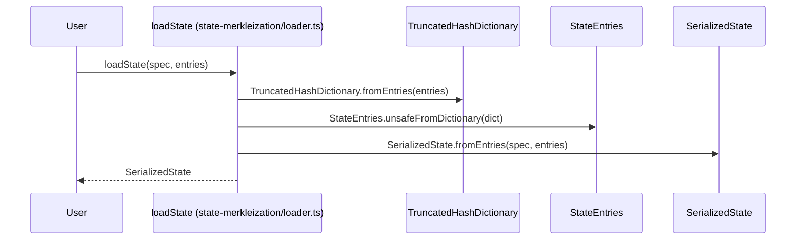

# Export & publish state merkleization utils.

## Pull Request by @tomusdrw

Also move `TruncatedHashDictionary` to `collections` to avoid circular dependency between `database` and `state-merkleization`.


## Comment by @coderabbitai[bot]

<!-- This is an auto-generated comment: summarize by coderabbit.ai -->
<!-- This is an auto-generated comment: skip review by coderabbit.ai -->

> [!IMPORTANT]
> ## Review skipped
> 
> Auto incremental reviews are disabled on this repository.
> 
> Please check the settings in the CodeRabbit UI or the `.coderabbit.yaml` file in this repository. To trigger a single review, invoke the `@coderabbitai review` command.
> 
> You can disable this status message by setting the `reviews.review_status` to `false` in the CodeRabbit configuration file.

<!-- end of auto-generated comment: skip review by coderabbit.ai -->
<!-- walkthrough_start -->

<details>
<summary>📝 Walkthrough</summary>

<!-- This is an auto-generated comment: release notes by coderabbit.ai -->

## Summary by CodeRabbit

* **New Features**
  * Added a new function for loading state from raw entries into a serialized state representation.
  * Expanded public APIs to re-export additional modules and namespaces for easier access to related functionality.

* **Bug Fixes**
  * Updated hash truncation logic across multiple modules to use a consistent hash size, improving compatibility and correctness.

* **Chores**
  * Removed unused dependencies and updated import paths for improved maintainability.
  * Added a build script and a GitHub Actions workflow for automated package publishing.

* **Refactor**
  * Streamlined state loading logic for better efficiency and clarity.
  * Consolidated and clarified exports for hash dictionary utilities.

<!-- end of auto-generated comment: release notes by coderabbit.ai -->
## Walkthrough

This set of changes refactors the handling of truncated hash keys throughout the codebase by standardizing on a new constant, `TRUNCATED_HASH_SIZE`, and the associated `TruncatedHash` type. It migrates the `TruncatedHashDictionary` utility from the database package to the collections package, updates all related imports, and streamlines state loading logic. Additional exports and build scripts are introduced, and a new GitHub Actions workflow for publishing is added.

## Changes

| Cohort / File(s)                                                                 | Change Summary |
|----------------------------------------------------------------------------------|---------------|
| **Truncated Hash Size Standardization**<br>`packages/core/hash/hash.ts`, `packages/core/collections/truncated-hash-dictionary.ts`, `packages/core/collections/truncated-hash-dictionary.test.ts`, `extensions/ipc/index.ts`, `tools/ipc2rpc/rpc.ts` | Introduces `TRUNCATED_HASH_SIZE` and `TruncatedHash` type; updates all logic, tests, and imports to use the new size/type instead of `TRUNCATED_KEY_BYTES`. |
| **TruncatedHashDictionary Relocation**<br>`packages/core/collections/index.ts`, `packages/core/collections/truncated-hash-dictionary.ts`, `packages/jam/database/index.ts`, `packages/jam/database/leaf-db.ts`, `packages/jam/node/main.ts`, `bin/convert/types.ts` | Moves `TruncatedHashDictionary` from the database package to the collections package; updates all imports and exports accordingly. |
| **State Loading Refactor**<br>`bin/test-runner/state-transition/state-loader.ts`, `bin/test-runner/w3f/state-loader.ts`, `packages/jam/state-merkleization/loader.ts`, `packages/jam/state-merkleization/index.ts`, `packages/jam/state-merkleization/state-entries.ts` | Refactors state loading to use a new `loadState` function, streamlining the process and updating imports; re-exports new loader functionality. |
| **Dependency and Build Script Updates**<br>`bin/convert/package.json`, `packages/jam/node/package.json`, `packages/jam/state-merkleization/package.json` | Removes obsolete `@typeberry/database` dependencies and adds a build script for the state-merkleization package. |
| **CI/CD Workflow Addition**<br>`.github/workflows/publish-state.yml` | Adds a new GitHub Actions workflow for publishing the trie package, triggered on main branch changes or manually. |

## Sequence Diagram(s)



## Estimated code review effort

🎯 3 (Moderate) | ⏱️ ~20 minutes

## Poem

> A hash once trimmed to thirty-two,  
> Now thirty-one will have to do!  
> Dictionaries move, imports align,  
> State loads with logic, streamlined fine.  
> CI flows with a publish cheer,  
> The codebase hops ahead this year.  
> 🐇✨

</details>

<!-- walkthrough_end -->
<!-- internal state start -->


<!-- DwQgtGAEAqAWCWBnSTIEMB26CuAXA9mAOYCmGJATmriQCaQDG+Ats2bgFyQAOFk+AIwBWJBrngA3EsgEBPRvlqU0AgfFwA6NPEgQAfACgjoCEYDEZyAAUASpETZWaCrKNwSPbABsvkCiQBHbGlcSHFcLzpIACIAUQAPbnwKUIAyTwEvJFh7XGoPNgoAa0j4AC9qeHwsPHgvRGjIAHc0ZAcBZnUaejkw2A9sREowlkHaCib0ZFtIDEcBYYBWAEYAFn4sXH7IADEvbAAzA9kAGRVEAHpcWW4SBYoXPxIkxHVk2Q0YbeZtLAZYTCkFAYCT4LxSZAkRLJcQYIjoDD0bjYTLZeBwyC1LLiaRPLz5egEXL5SCFEokcqVaqfACCtFo6iqGDQPlkABo+h4AAbQCjYDAMAkACVasAAIvAxEznLIuQpmElyBhQqhmPgpIT8JzIFymD5ROJqog5WraN4SJ84Kh/F58ILDVhUOiaIiokTeCQpMr0Ix4BQGN5nJAlLdXQL5EgHB4FrgmiQyNqubRqCpWiQ5Zh6FzEHkaGAyaUKg6TYpzYhLdsZtpmMgifAFRR1R4tgVS/i+Dm+WJsP5+AdtUwlAI05Bemh6f5EK8MSGyEpw6TMGhSGxvU0EJFF0V0fCcySCxSi0zMeJsfBcWgJNp8ZkPAdkpAoTQKMzfIMLV8PMifE8giFGJgo4eP4EjnnG9DUJAsC4Lg3CIBwFwXEQ6iwCiGhMMwFx7IcxxnAIlzXLc9wuBc35eBcKyrBoRj6MY4BQHOfY4AQxBkMo3TyqunA8HwggiFKEKjvIg7KKo6haDotEmFAVrIKggFoHghCkOQVAcRhXFcFQkwOE4jy9CJVBiZo2i6GAhh0aYBgaMhWwohcTTJEUBy2k0lzIqiiCwGAe40BosjMF4HAGNEoUGBYkA0gAkqxqkEvYjg/I8+D9v8gLSEYNKzCQkwAOLqEKKKRVKRrNE5Ln4JMzJsPQ0RWCiWReTAFDnjwaAMEUy4kI0TrKo2ZoMHQnxRaEuAtUQpAUMg1SLnMLLBkg3DUP8CL0DNyJebiRItjEPzoo0AhUAKsAcgIeAbF4EapQCcK4naAZ8Oi9i3Aw8AHOe9AMv4YjJOeyA2vFRJnXUSh8AQYKIByQhoMwbUdV1yAABS+SQHJjeeHIo/mlDkpSDoAJQckwvZyDQyBLfDpAcg+O2OcUFWTO9m7qEMXgHBWHh085rnBiQ73kMgaD2Dum5CIIMQeY13no91fSQXyGDTZs2z4mToQAKpncq2CPiCfrVFxw2hO+guLuj8S5GpJBEPIRIK80KGQAAcooFpCMgUhTceABM3saPEHOQGLAi5M8ckCvsSiMP0HU7vw507f4LxvC4mMkDBcfYNwzuuxo7sO1sszcLDgr/HHmbahgxdPMhnbssCe4+HHs5hq9uKgULXJVyX8Bcqd2Ag3HO1cgAAoRdyUCRWMHnjTJyhTnVAoM5dYN3ZXFIgFPRgPXj0BpmYchX/MspdGRS0P2zA14oQL11kAHI2sPDxoFwMjmFzTzjhZUhgcpfQa7wRiV2rv4WuY15BNEdpLSU6AGCDSnIHNeikWzKklD/EYRQEyoCGA9Egp9eDqngEoegHcnjJwII8HB/hcDliMOYSwNJr7sSZLWLUO0lAMHbD/aa/YoRJBSFEB80CGC63CH9GiOdyCQERjtNKt10D0lNuQPKBUio0hKorde3NKqQAAJo0gALInHvnUVGzQEArVoPgXEGB8ChA4e2DwfCYSCL4MIhQUd2CMmkPjaiBhYg5nrPFESTxQI5UfEcGEXADF0HgI4EKYUDAQDAEYNQGALhMBBJQXApF2qLzdogaowVQrRHCgwmKKl2JRF0kleQKVo7pUQG4bYLd5wMDqcrL8eS77RDHjcCeDxZCvxTMOIYjRPavBmtEAADBoWZyxGgtH+iQNUGp76P21K0sgbdkCNRVJ0nUaSMnVE9jk2+pA86FN/iYyInwXb8BbHwORpBWG81DG0v6/BeKPJMXg2gyA4y9h+EoPx9DIpMLUiwoB7DRBcIdDwx80IBFrTcQ1GBXicRNIMC7cgfiAniB+OpV2oSwIRPvCkLgJxKoJNKUkqyRzMmnKuP08sNDilhQitFWKVT6A1JlExZ5GUDDuBQAqGExIaBcXvg+HkCt7R0BFF5CUGiZRyiWQ0269AH4sCAnHes/COLaqftsUe49iJDOTHkUZ6Y4b5KAQsPVYrkXrJ1cPPpRFJ5DL1JEDRxpbVdTuVqOx/QnnEofLaZCIjBUAsoAUccFo6FlPBc+bh0KWmwucKm+pzjnVCLRSIjF4jsXVATf4wJhKoghJAqSvm5LuJUqaDSmi9L0RXBCGABWqkP65hIGAMamBXgOm7fkMAtp40UA0GyptnKKlsStryxK/L6nRuaR4fV4qUZcRjb2ccQhBgcTtispsmI5hDBRWQ/Eg1CQstWqKg18EdQACFZBkwzIiHUvJ+TytoIq8UkoHSquaLGp4qy6CH3fbKr9wpRRynHs0VoCjiGBy5AAZR7QAaRILIAAaiyOUnDWiIAAOTIC5Jg2UPF8C3BSLbfpGrSBao2ULSpLURFcmfWTYA0AbDqydgAYRpNAWIYoAD66HYi6JE4+3RQmUN6Fg2w74yQPCb1EG9GBkGBTQa8lyZDY7aBofyHKA4X6HTwbaPqrI70oi9H8Ksi+a7lSUBqvAEkmTOzYA0UxTun6tPdF/cqgDLg30LvwoEYI3pGWUEmZsLUqGe2xD6n9ELOoUOUFc1kModBDM0F05AKKisaDjg5OoWYOj/5iFPoKHwpH9NpZaiyco2We1qsdsPVTDAUtCx+NwW4EEHhoDqf2LkABtcjHIrz7BIAAXXntoKaHJ1zAbI1huUqBbGTAqxEW2JrfPft/a1rY+BzpRa9jNIkgEqNoD/NKigzAKzYLGiQGGWQBbahRpAfTccCHwJkPIJQkQiCVAxKV7a2x13Oq5HV9LjWssGZa/fUzTJQVJsYSm+FaaPAOMzRj7NSKOJ5tRAW1BmKJHQDo/UlbFGCHUeuMCRg+IpypYw1h3DXh8M3QYy62G7GX3SC4zx/jgnhNiYk1JmTsQ5MKY/XK7TsBdNJN2EjmaUP8DjhyyQZGL0uB8YBOiFDL0OTkcmw+jXmGcMshG9N/Gcos6WrdFqLbp9qE9gOZObwoRKfQ4a5l5r+QteiCN1hk3GgeuIw0BH/GNuG5FbWv2H4c1WQKEK12WE8IK6nbTz6BkKrHgVw++wFq0g8XluCcS6t4Ta1RMgDEhk8SSnNpSQYI5asO38i7U0AAzAcYdeZ9OUEnfBad5TuXzoSnpIb9GhUipMwKMzqv1cI/Va8BUVmPpCRA4QjEO1nTOdiW5o0Y1PNmfqT52X/nRSBelMF297Qhh/kiyc6Lx4iTxfyIlmWfqK6oZh77+HRnhpCtntaAStQgNsFpvptsAIasdQ6sEdEZ/BqoogEMF8DNf8mt/9ct6cd8nVcB8ZudEx3UBkp4e1sZihv5ix/UqY2opwHMdQOsUsdoes+tIByMwBJtgg2o/RywvhUA8F6x0R8haxvhMBsB5oc8gthJ/B0F88e1RFHhTsYtQ44IOQAdrZgd4QdovFewvsMQftpBXkcCDUohUD6sMsMCNdjNlcMBPg+NkhJxFQGQ4RLo0ZwdcCmJNN9tL9/1r9ZQOQf8fcLCWt/CNcP8i9jRwMswzdVtzNN81kK4k5L0bN5AhZpwiBmZ3Cvc1dMCbVECYZkDatsizDYc/dcsUdOUIVU0wcscM1IVSo8djDz13FC0hUoB7lo0gMgV41MdhYiBmRcAew7peF8dXEz50USc/pA4c1DVrDYCiiEdqFfg5IaFej+jBjRxzoWZgRnxXw71IguJ0F1VBVaAS8CUy8o4K9Jgq8KUa9Yl69ElkkjAnwyAYtLh4BuAGALh0QlAA4p0G8Z1R94o+VkprpGlV070N0e0pVyUP1BcBMhNRMhQaQUMhQRMUMooAAtWINVBDccYhAgt1M1T1C4AEHTKgsxRI9qOgj0UCY7RAU+d8LMbjXjeEkXcTSTaTWTfDQ/TAUIdcSUHIdVOzJsE4yAOwh4aQRwkWeuJ6YeUgXAc3NnYIKwebP1WfDRVwlTFEZwKgeQSIOEQuZwIgRwdgW9YeDjYvI1R9W0AQOUfUogQuJaKgNgZ8TojwY4ggnkOE4XUTdk8XLkoBL0lkn0kTJElEtEzE7Eh7ZAU0dTLabYV4LLJiHaUknIekyUAYM9W7eUJ0pAGaZcJY0IbMPIFIc3Q7WAY7UIFkZ8OgpsKgH8CNGBB8TJMaMEe+VycohhSojHao3mAjOozRBolxJo/NURbxLFHFUtfFIJIlC4z0GtSJG42vOJZgJtOlJvc5aQY5fwY5fUX1L410X4off4kfFjIExdEEqfLFEVQVRDJRSvfHCVFZU0mEpgtsDwaIF+I/PzOgMAVMsACQ3wy5RoXsqEJALPPZJiaY8ORMTcy4YmEgXcn1eFA8n4wfYzUxaMxFF0f5bUdxGkKwKKZM7Yb1A0KFTcjfdEThbAJwzQ7Yb879P80UACnw6oflU0c0dAW0OEV4KOYNYYUirzLEcczs5NZhUqXs7HAchFaY0Y5oiY1oyABIA1RDOgLgLkaYyAAAKgIM/KuHP1/P/MArYpcGArWywC5Dgu3MQsEpQu+KhHQqMGnIrT3nL3nMr0XPrWpQb3XKMCsoQqQrIqNH0qg26CYq8hYtzw+DVkH3ZVKQBLPI4mBMnxXWFXov/BCRhM8LlyvxMoo3VTt0Bi1EpMGi4t8Huh7EQPgWIvdJ5O9CDKFwRNFw5IlxQ3LNhODKarDNRPRKxLVX6D+GkKzwYvinI2QCNURx/DGqwtvLQCOANGEJUyyFegxHqUTjQEmFJg8B1MGwJO2BMymqwzNJVjIAdJyCdPyNdMZPp15zJg0CtJtLyxFQhxWMBW2vqC1F3X3QdwhJSA6sapF26ojL6s9KIPNRJJgxj2AI8OZIBt9LF05Ml2Mw2VNX6XBpljy3uX4r4EbJERpn/AWABFpL4HVVjOsxOMTQqPRyhUktqKzWGMaK+TGOJzESFUnNOJnMrTcrCSuM8spW8oeKsn8uU0Cv3JGrCqMtYuZFMr+I5VPLnXPInwFU52nxIrcoOHagoUWpl1CoVW8Kivw0Z1eRKubG2HfG8xMXiC5sK15P+tZPhpaoDMgUNOykmHczyHqthvttDORJ6sjLW1wKiAmtRo9UGQhp0xmpVvQHmrEEFh/Co3Es0S2EgnFtNo8HIyEjJmzOMulvkBzGSDvgrltHwCKCzhKwjhoroN8g0yNTCOS1JHTgrIgnfXRD3AFAKEbsUFI3lL7h1FJN7uzHTl7u/zULKM/DCDo1fIMvoDGpQGQEKsNRRotMQAF06rZIRtavkyAW62U2ejU3ejYz2zl1g36UDheo8ICylsA1QA9IuzxEqCkF+tCGDr0slqirMtsJYC3XQF7AXp+v8BcgNErnCXFuPETNqptuVEDlxuTPPzjlnoMio1kDoPREZHmi2sFnfSy0bDoLs1+FBhAyWPe3yP7jAJ0RNmAcmAau9qBt6uxOTzbqrIgyPovzJLg3c3AvYFPi2EbGwCIArIThIqNtErR0TsMPTX7PpsRUZsJ2WrHNJ0VxiSO15XgD6OoHWL/toHUurpEVrqS352gGwrnGQAAHklo/xf0ORsM9BEZC8/ouARpRJIhgARtDGAAfSAZe1euG5q/0yXPQKx6bPQaPQAJMJ6DcwYE9HP8uMjHERTHzHghLHIBrHbH9GH1HGjJnHXHIAPGWG9avJAngnzKGdCMdafyf19bJDinLLukXlrLRaULU7aBwrvIc6ZRHKoAlGm7Vj1Hf7uB7ctGdR5TEYDqvBzcuB3HPG+cV6vaQy/TEa5N8YuBsMcmT0lB+Y6A5QwmuRhnRnxmYBVm8mKmvIlnknVn+R1n0RNn6cCMmdsrWG/0DabrhadzbKWEQrymWnIrJCOnbjlGemBi+mBn1LSSRnvAxmsMJnVmvHZmmr5nN7TmBB8AwRntrltnQW9nIWDncnp7f1EXkXIhMBinbnSMjnL6nmnoanKYtyAq3ngqmmvm2mZbjRFHO6VG1HAWBh+mCRtH04wWfB9nJmYXvS4WN7ZMAnIAOCSBlnTnQQiEtn6C+XMXZAoWcXdbjmTpJWWRggZWuA5XaBiWjaymvClUr6b9KWXmbKwRkL3mGW36fmaEuRWX/nXgOWNHuXuh1LR7NdlXVWpnONYX17Hb/HZX8B5XIBtnvX+WIWVXsXmp1W8W9Ww2DWbmjX7n8nHmqnnnamaWRa6XFYPnGL7WgLHWnLS9ZzgJ3Lea61ok7jVyfLHiDBLXw7YAW3Yrh9IpZ04okqLyUqVbrySL+3tj+pPNtrXaGGPaizA3ETfbgb6GhhRotRO9lgOQk5JwvEMQhZUzhYkzk6VQlZow+d7AKyBEwYbptQwLAkMQuRaH/amJO8/YxT7DJTqhaKXCfRlEJ7bguLXNSXcXIbUBLnyAIJTYtqf7dSmJ7TC5qGQzb2+qsKmmoJRQ57eZEAGAWoFgQPMQhgDrsyZYyF13lRuFA1EVwKh4b1myjaLwgVFA4zaAABubUPExkUqQpSIU+Z499N8s0TcZ2tMrOFSqe9VpDzaOO6oIgXitO0jq9+EUZnyJrET/oWhOhKmsRnoqSqR2SkconeRotKAOwyBqs+kNSu22D2duhrgOYZge4OURGKVyAZd/Ai1nN+CkW1Mtt0tmSOjRrXE4zwZmDrq8zyMyAAAXi/ZIHqWnZ9vDLoeqebfc9TN+fJ2/Z88Fj8/UrJeQ7C+FbXpnZi8jK3uc+pdc53IS9FEcrLTOIrZJQ8prcgAbTXMbasuhkwktVTCGFQoctlvivlu7eqV7eVrBLSqcUfM3RfJpiUx44/K/OnsZbNY+HdkWQQ2FLWQmuHma5hmGStTTE66PIwtuRzgeRDSvLdMXCjlAvx2mjPbvFMWTxdE0Epq7OpoksUxqMkdxwZuHKZvktZqxSgBsCPTWWmPUs0p0omr0rteYqZYW4aDi5c4uBa62/a8Qvsr27Laq65rnJ5rJWrwa4baFvh8R7a+tQuEJYOAAoEHbZPM7cBJ7aVuXX7fBPPrG+9Cysy9NaeaOJVsYx1SFgBnEEfvPq5Ah9m+LbyrMu3qwHODBDwDXXcLW+2AouF7BuJPzdh5I+xo8Q8HDXwEjViLJo+hEe7Jpte77LhShSHNzVRR05aInJLQ5pcq15q+rdx4FtpSa8J829sSUAuD2hsO69Ry7Z5XH1qUG9ugHbl5UpZ9euAwN5+tA21HPsp3Z8zd8ORtdRNRV7DuJ7TDm2pZ6JDuIK9WtaCsVjz/yVpHpBY9fHfa5FaHQw2wwBQyaxxLkkDogm4ok6IW5BT9ytzvT55yz5IjV/MpzGhvqRerjjr8QAb8qib5b64vt94OQFmpjpWOqG4YTOO39G1/7BbCGCfswc+msWQFsSrIhQRD1N16bL4HVIA2xAgRQllP2swse7EukvU7po++ka+9kfGN+6MDs10enNVyljwXJ1c8egtDcp70wje9EKm5S5EUg7ZcpEq/XenqCXD7gktkC4XpESWz4jI0wiyR2BMmPAzI5kGgBZLERW5B0NkMKd5Nsk+SQVn+XSalogKwBMxd+2oIfkMjgHkkNePybATsiZqZJ3oxpD/m9S4rPghob/URh/1prvcLen3K3szV05s0S0wAx3lWirY48bikA93gT2K4I9Nun8cgoeB/i7cqectGnqgIXToCry4JDipuCpb5JLgiPEwbjCPDVALBjrETkBATCcd8SRITSsx3v6I4580oB/p8ANz700ErIUAmVkmD+AwA0FMqj/xSDjUmM47W0NVlJDvkdQL8fvBOndh5YdgPYR5GqH8DxDnQI7aqkgU3jtRK2yQy7ntX8A1F6B3oOCupW4EXAMGA9boSjGHoQZuhGNDkD8G3Db5+gfoNISsXai/Z4At4NZsMB2h1Ct4pGXof4QGGREdQGNJ4B1gF54IPgn4A/h0UUhEApUO0fCoRQSgUANapVNaorxzYb5lwRAUBBoXvozFwhbFB/gQSRaFxsh80CuM8RfDzRCkPYeBEb2e5J1TeGnb/lp2+6jlbeEiOkPiWB46hQeulAodkQHyLc4ehgtwaQRnieD0kqPX5siKiArCGh0wkHo+R0oIYMGulboRg2iC4iXBRgzCO4IoJMhvBLLKAGSPoAUjSqqIjSjSKmBPkGReAkgvkGZHZs8RxggkV/DMFDoSRnnSKH51mD5F6hgo/HNSJUq0jawRecUWjWJIyxpRRXVkfiJHSEjzByollpVxAFO9LiOg7iMuXuL6DoBso9kfKNMGzwvBhQywT12sEK06eofBnkNyyifs7+x4Uwgjl6itkBoboAEKNDQCYJTYXIXXL8GiGdZb0gEdQE404FsF7OS0bguYmAyz1nATiFCMMDfw0AyyTNdNhqxSxStBYvYW6tIGtKCA8sI0CdqnlTG995uA/TkAfzsbSBNSfwJ/OkL6CAd5u2xOLKETSa240iCIE9IgDmod1lGnwHYIITiEoBQg6HZ7FnQSLpxXcqY4on/ksIx5MApVBXtyDnGf5GCivRsKBHxJpi9cTfF6E9X2qzFtkaAOCIGCzoXDGwv2SDtkRXifRpA6BMoHHA+xtcCC2keQp8mdCfVLYx+QYryggnVI5Ca7cCURwdAQi1O8g83vUSUEE5recjREYrlKGfCpe6XOYovn9wdYdcr4zMRyGHHpMU0t4FxtEXkBqtymSTZeu2IEBBNo8ZohGGyN7y9orRQ6P0aWztGaDua4A6vC6PrZQC/KMA8SWQQ8HmCEB7sJAdTxQFBi0BIYjAS8kyjjs14aHFqNwDAL5FaoV8WgEtzS6BDTe0QCye8RoSNAcEJ+Pfg8NYE6T2Bt3V8tsH6FejNJZmBAcv3sDoc3JfgfkNrTsmcQK452IKRKKGR2ThgXMTUZzEdiAQyAoERsBgClRXgGsCwqwDSD4zoYaQuUWICJidiGJYg9gdOEAmCmWiFRPomwod014dEJBwKUtGClkFVFoRX/RQdMLkoIiFKf3Q7h0SCEjFtOZE8aURjN444oU3U7os/ynFHAHe5xSttj2uLOi62jXAweaLlEtTvRRI9SaxP9GB9aehkpdMZNVqR9IS+QaEhN2bB0Z6x5LLNlz3Sg89YYk/EHM/RRq4CjR+A7bh10h4RVoeEvOsLgT1QAydUyvFKQ0xYTMisKcfbWqCJ365CpuNVY1jlX7HhcC4Ajc/jWU3YYA6kPyEJDrz17MCbkpaVTnIMGkKCiJI02af/3HKACtQXU2Pt0QIlLTmZcIv/izXHLYEEAyABkBtIOlN5wY9QL4h8W9gUAPiFwBWQwEukJUDJtgoyfYOG5P02ohcQKa9NuCkYAAUihhMZOwbAVgPjFFDFApYuQJss2RbL4woZPMv2AHpvCNA2prxOoPyR2g+JgA/Y0ycvnfC+maoCCfPPBA/S6SOkw2qCEHMqDixwCRMjg6QNLiFhbZyST9M+pkWGxRd4WAZYOsMKLwXA4B5YYoVQMB5gZb0rdWPP4Si5wd6G6qF6jQPhndDUyeWcUg4VfbSly6A4E+IGWXr3VH4Ak0ft30TAtcRM8pR9CyEvE2oXSTdTUglGHADY9Sp1Q0lxwTIKcjSJpNcMBg9LB1c5YrJGoGTrlBd4ORw90kOy+o5htQ27UBjNHAbYcogS2LAIlToIZ19ZQzdOBrmfS1jqsXgPCQzM2RDT+ZM0+ETb3GkczyAGgrac7ydG1s68yk/QRZGki6w48zEZSOrM4jsAtIG1EPvykQagwVAagEyJJHMgGAUFGkdQCJiISIARMlxOgCJj3B/VaI5C+iJAAAAcqwb2AcAfbPYAAnIsEWDsLlgfC72LQG9gAA2CRYsD4XsKDgywAQBIoADs3sOanwuezsL2FAi4RewrMjIK2FlC3ANQv+R0Kq2DCxiFJDYXMAGA3AETC2SfCMKSyoQFhVyFcUGAAA3gYEgAxBW6qjaCA0C4BW42QXimIC0BfA7gAlkAK3AYAAC+BgVxU61YUQBSQNiuxdUBoDxAjFFi8yEAA== -->

<!-- internal state end -->
<!-- tips_start -->

---


<details>
<summary>🪧 Tips</summary>

### Chat

There are 3 ways to chat with [CodeRabbit](https://coderabbit.ai?utm_source=oss&utm_medium=github&utm_campaign=FluffyLabs/typeberry&utm_content=514):

- Review comments: Directly reply to a review comment made by CodeRabbit. Example:
  - `I pushed a fix in commit <commit_id>, please review it.`
  - `Explain this complex logic.`
  - `Open a follow-up GitHub issue for this discussion.`
- Files and specific lines of code (under the "Files changed" tab): Tag `@coderabbitai` in a new review comment at the desired location with your query. Examples:
  - `@coderabbitai explain this code block.`
- PR comments: Tag `@coderabbitai` in a new PR comment to ask questions about the PR branch. For the best results, please provide a very specific query, as very limited context is provided in this mode. Examples:
  - `@coderabbitai gather interesting stats about this repository and render them as a table. Additionally, render a pie chart showing the language distribution in the codebase.`
  - `@coderabbitai read src/utils.ts and explain its main purpose.`
  - `@coderabbitai read the files in the src/scheduler package and generate a class diagram using mermaid and a README in the markdown format.`

### Support

Need help? Create a ticket on our [support page](https://www.coderabbit.ai/contact-us/support) for assistance with any issues or questions.

### CodeRabbit Commands (Invoked using PR comments)

- `@coderabbitai pause` to pause the reviews on a PR.
- `@coderabbitai resume` to resume the paused reviews.
- `@coderabbitai review` to trigger an incremental review. This is useful when automatic reviews are disabled for the repository.
- `@coderabbitai full review` to do a full review from scratch and review all the files again.
- `@coderabbitai summary` to regenerate the summary of the PR.
- `@coderabbitai generate sequence diagram` to generate a sequence diagram of the changes in this PR.
- `@coderabbitai resolve` resolve all the CodeRabbit review comments.
- `@coderabbitai configuration` to show the current CodeRabbit configuration for the repository.
- `@coderabbitai help` to get help.

### Other keywords and placeholders

- Add `@coderabbitai ignore` anywhere in the PR description to prevent this PR from being reviewed.
- Add `@coderabbitai summary` to generate the high-level summary at a specific location in the PR description.
- Add `@coderabbitai` anywhere in the PR title to generate the title automatically.

### Documentation and Community

- Visit our [Documentation](https://docs.coderabbit.ai) for detailed information on how to use CodeRabbit.
- Join our [Discord Community](http://discord.gg/coderabbit) to get help, request features, and share feedback.
- Follow us on [X/Twitter](https://twitter.com/coderabbitai) for updates and announcements.

</details>

<!-- tips_end -->


## Comment by @github-actions[bot]


<details>
<summary>View all</summary>

| File | Benchmark | Ops |  |
|------|-----------|-----|--|
| [bytes/hex-from.ts[0]](../blob/bec3f15e400f212e7f1f8a028f286908decf0218//_work/typeberry-runner-2/typeberry/typeberry/benchmarks/bytes/hex-from.ts) | parse hex using `Number` with NaN checking | 135911.41 ±0.08% | 84.55% slower |
| [bytes/hex-from.ts[1]](../blob/bec3f15e400f212e7f1f8a028f286908decf0218//_work/typeberry-runner-2/typeberry/typeberry/benchmarks/bytes/hex-from.ts) | parse hex from char codes | 879775.97 ±0.2% | fastest ✅ |
| [bytes/hex-from.ts[2]](../blob/bec3f15e400f212e7f1f8a028f286908decf0218//_work/typeberry-runner-2/typeberry/typeberry/benchmarks/bytes/hex-from.ts) | parse hex from string nibbles | 540427.3 ±0.19% | 38.57% slower |
| [math/switch.ts[0]](../blob/bec3f15e400f212e7f1f8a028f286908decf0218//_work/typeberry-runner-2/typeberry/typeberry/benchmarks/math/switch.ts) | switch | 251059177.76 ±6.83% | 1.22% slower |
| [math/switch.ts[1]](../blob/bec3f15e400f212e7f1f8a028f286908decf0218//_work/typeberry-runner-2/typeberry/typeberry/benchmarks/math/switch.ts) | if | 254158947.89 ±7.16% | fastest ✅ |
| [codec/encoding.ts[0]](../blob/bec3f15e400f212e7f1f8a028f286908decf0218//_work/typeberry-runner-2/typeberry/typeberry/benchmarks/codec/encoding.ts) | manual encode | 3171796.82 ±0.16% | 17.55% slower |
| [codec/encoding.ts[1]](../blob/bec3f15e400f212e7f1f8a028f286908decf0218//_work/typeberry-runner-2/typeberry/typeberry/benchmarks/codec/encoding.ts) | int32array encode | 3846820.33 ±0.18% | fastest ✅ |
| [codec/encoding.ts[2]](../blob/bec3f15e400f212e7f1f8a028f286908decf0218//_work/typeberry-runner-2/typeberry/typeberry/benchmarks/codec/encoding.ts) | dataview encode | 3842194.96 ±0.17% | 0.12% slower |
| [codec/bigint.decode.ts[0]](../blob/bec3f15e400f212e7f1f8a028f286908decf0218//_work/typeberry-runner-2/typeberry/typeberry/benchmarks/codec/bigint.decode.ts) | decode custom | 207229129.76 ±5.11% | fastest ✅ |
| [codec/bigint.decode.ts[1]](../blob/bec3f15e400f212e7f1f8a028f286908decf0218//_work/typeberry-runner-2/typeberry/typeberry/benchmarks/codec/bigint.decode.ts) | decode bigint | 107797375.53 ±2.61% | 47.98% slower |
| [codec/decoding.ts[0]](../blob/bec3f15e400f212e7f1f8a028f286908decf0218//_work/typeberry-runner-2/typeberry/typeberry/benchmarks/codec/decoding.ts) | manual decode | 23906359.3 ±0.57% | 87.92% slower |
| [codec/decoding.ts[1]](../blob/bec3f15e400f212e7f1f8a028f286908decf0218//_work/typeberry-runner-2/typeberry/typeberry/benchmarks/codec/decoding.ts) | int32array decode | 197851154.12 ±4.46% | fastest ✅ |
| [codec/decoding.ts[2]](../blob/bec3f15e400f212e7f1f8a028f286908decf0218//_work/typeberry-runner-2/typeberry/typeberry/benchmarks/codec/decoding.ts) | dataview decode | 195216436.63 ±4.1% | 1.33% slower |
| [bytes/hex-to.ts[0]](../blob/bec3f15e400f212e7f1f8a028f286908decf0218//_work/typeberry-runner-2/typeberry/typeberry/benchmarks/bytes/hex-to.ts) | number toString + padding | 318898.69 ±0.89% | fastest ✅ |
| [bytes/hex-to.ts[1]](../blob/bec3f15e400f212e7f1f8a028f286908decf0218//_work/typeberry-runner-2/typeberry/typeberry/benchmarks/bytes/hex-to.ts) | manual | 16593.4 ±0.22% | 94.8% slower |
| [codec/bigint.compare.ts[0]](../blob/bec3f15e400f212e7f1f8a028f286908decf0218//_work/typeberry-runner-2/typeberry/typeberry/benchmarks/codec/bigint.compare.ts) | compare custom | 264837782.47 ±5.39% | fastest ✅ |
| [codec/bigint.compare.ts[1]](../blob/bec3f15e400f212e7f1f8a028f286908decf0218//_work/typeberry-runner-2/typeberry/typeberry/benchmarks/codec/bigint.compare.ts) | compare bigint | 252457814.71 ±6.36% | 4.67% slower |
| [collections/map-set.ts[0]](../blob/bec3f15e400f212e7f1f8a028f286908decf0218//_work/typeberry-runner-2/typeberry/typeberry/benchmarks/collections/map-set.ts) | 2 gets + conditional set | 111613.84 ±0.08% | fastest ✅ |
| [collections/map-set.ts[1]](../blob/bec3f15e400f212e7f1f8a028f286908decf0218//_work/typeberry-runner-2/typeberry/typeberry/benchmarks/collections/map-set.ts) | 1 get 1 set | 61751.62 ±0.02% | 44.67% slower |
| [hash/index.ts[0]](../blob/bec3f15e400f212e7f1f8a028f286908decf0218//_work/typeberry-runner-2/typeberry/typeberry/benchmarks/hash/index.ts) | hash with numeric representation | 186.94 ±0.65% | 28.55% slower |
| [hash/index.ts[1]](../blob/bec3f15e400f212e7f1f8a028f286908decf0218//_work/typeberry-runner-2/typeberry/typeberry/benchmarks/hash/index.ts) | hash with string representation | 115.04 ±0.11% | 56.03% slower |
| [hash/index.ts[2]](../blob/bec3f15e400f212e7f1f8a028f286908decf0218//_work/typeberry-runner-2/typeberry/typeberry/benchmarks/hash/index.ts) | hash with symbol representation | 178.92 ±0.08% | 31.61% slower |
| [hash/index.ts[3]](../blob/bec3f15e400f212e7f1f8a028f286908decf0218//_work/typeberry-runner-2/typeberry/typeberry/benchmarks/hash/index.ts) | hash with uint8 representation | 164.72 ±0.03% | 37.04% slower |
| [hash/index.ts[4]](../blob/bec3f15e400f212e7f1f8a028f286908decf0218//_work/typeberry-runner-2/typeberry/typeberry/benchmarks/hash/index.ts) | hash with packed representation | 261.62 ±0.18% | fastest ✅ |
| [hash/index.ts[5]](../blob/bec3f15e400f212e7f1f8a028f286908decf0218//_work/typeberry-runner-2/typeberry/typeberry/benchmarks/hash/index.ts) | hash with bigint representation | 184.36 ±0.05% | 29.53% slower |
| [hash/index.ts[6]](../blob/bec3f15e400f212e7f1f8a028f286908decf0218//_work/typeberry-runner-2/typeberry/typeberry/benchmarks/hash/index.ts) | hash with uint32 representation | 205.38 ±0.1% | 21.5% slower |
| [logger/index.ts[0]](../blob/bec3f15e400f212e7f1f8a028f286908decf0218//_work/typeberry-runner-2/typeberry/typeberry/benchmarks/logger/index.ts) | console.log with string concat | 6590899.16 ±67.21% | fastest ✅ |
| [logger/index.ts[1]](../blob/bec3f15e400f212e7f1f8a028f286908decf0218//_work/typeberry-runner-2/typeberry/typeberry/benchmarks/logger/index.ts) | console.log with args | 1466279.63 ±90.6% | 77.75% slower |
| [math/add_one_overflow.ts[0]](../blob/bec3f15e400f212e7f1f8a028f286908decf0218//_work/typeberry-runner-2/typeberry/typeberry/benchmarks/math/add_one_overflow.ts) | add and take modulus | 15029827.69 ±177.75% | 94.31% slower |
| [math/add_one_overflow.ts[1]](../blob/bec3f15e400f212e7f1f8a028f286908decf0218//_work/typeberry-runner-2/typeberry/typeberry/benchmarks/math/add_one_overflow.ts) | condition before calculation | 264181127.15 ±6.58% | fastest ✅ |
| [math/count-bits-u32.ts[0]](../blob/bec3f15e400f212e7f1f8a028f286908decf0218//_work/typeberry-runner-2/typeberry/typeberry/benchmarks/math/count-bits-u32.ts) | standard method | 104113848.36 ±1.99% | 58.29% slower |
| [math/count-bits-u32.ts[1]](../blob/bec3f15e400f212e7f1f8a028f286908decf0218//_work/typeberry-runner-2/typeberry/typeberry/benchmarks/math/count-bits-u32.ts) | magic | 249641761.96 ±6.05% | fastest ✅ |
| [math/count-bits-u64.ts[0]](../blob/bec3f15e400f212e7f1f8a028f286908decf0218//_work/typeberry-runner-2/typeberry/typeberry/benchmarks/math/count-bits-u64.ts) | standard method | 1128548.67 ±0.42% | 85.67% slower |
| [math/count-bits-u64.ts[1]](../blob/bec3f15e400f212e7f1f8a028f286908decf0218//_work/typeberry-runner-2/typeberry/typeberry/benchmarks/math/count-bits-u64.ts) | magic | 7876930.12 ±0.34% | fastest ✅ |
| [math/mul_overflow.ts[0]](../blob/bec3f15e400f212e7f1f8a028f286908decf0218//_work/typeberry-runner-2/typeberry/typeberry/benchmarks/math/mul_overflow.ts) | multiply and bring back to u32 | 276585291.99 ±3.95% | fastest ✅ |
| [math/mul_overflow.ts[1]](../blob/bec3f15e400f212e7f1f8a028f286908decf0218//_work/typeberry-runner-2/typeberry/typeberry/benchmarks/math/mul_overflow.ts) | multiply and take modulus | 271412236.58 ±5.77% | 1.87% slower |
| [codec/view_vs_object.ts[0]](../blob/bec3f15e400f212e7f1f8a028f286908decf0218//_work/typeberry-runner-2/typeberry/typeberry/benchmarks/codec/view_vs_object.ts) | Get the first field from Decoded | 41710.35 ±107.17% | 90.65% slower |
| [codec/view_vs_object.ts[1]](../blob/bec3f15e400f212e7f1f8a028f286908decf0218//_work/typeberry-runner-2/typeberry/typeberry/benchmarks/codec/view_vs_object.ts) | Get the first field from View | 89419.22 ±0.32% | 79.95% slower |
| [codec/view_vs_object.ts[2]](../blob/bec3f15e400f212e7f1f8a028f286908decf0218//_work/typeberry-runner-2/typeberry/typeberry/benchmarks/codec/view_vs_object.ts) | Get the first field as view from View | 97968.24 ±1.37% | 78.03% slower |
| [codec/view_vs_object.ts[3]](../blob/bec3f15e400f212e7f1f8a028f286908decf0218//_work/typeberry-runner-2/typeberry/typeberry/benchmarks/codec/view_vs_object.ts) | Get two fields from Decoded | 444376.62 ±0.16% | 0.35% slower |
| [codec/view_vs_object.ts[4]](../blob/bec3f15e400f212e7f1f8a028f286908decf0218//_work/typeberry-runner-2/typeberry/typeberry/benchmarks/codec/view_vs_object.ts) | Get two fields from View | 82276.6 ±0.13% | 81.55% slower |
| [codec/view_vs_object.ts[5]](../blob/bec3f15e400f212e7f1f8a028f286908decf0218//_work/typeberry-runner-2/typeberry/typeberry/benchmarks/codec/view_vs_object.ts) | Get two fields from materialized from View | 171262.26 ±0.15% | 61.6% slower |
| [codec/view_vs_object.ts[6]](../blob/bec3f15e400f212e7f1f8a028f286908decf0218//_work/typeberry-runner-2/typeberry/typeberry/benchmarks/codec/view_vs_object.ts) | Get two fields as views from View | 81923.29 ±0.08% | 81.63% slower |
| [codec/view_vs_object.ts[7]](../blob/bec3f15e400f212e7f1f8a028f286908decf0218//_work/typeberry-runner-2/typeberry/typeberry/benchmarks/codec/view_vs_object.ts) | Get only third field from Decoded | 445950.55 ±0.17% | fastest ✅ |
| [codec/view_vs_object.ts[8]](../blob/bec3f15e400f212e7f1f8a028f286908decf0218//_work/typeberry-runner-2/typeberry/typeberry/benchmarks/codec/view_vs_object.ts) | Get only third field from View | 102572.92 ±0.11% | 77% slower |
| [codec/view_vs_object.ts[9]](../blob/bec3f15e400f212e7f1f8a028f286908decf0218//_work/typeberry-runner-2/typeberry/typeberry/benchmarks/codec/view_vs_object.ts) | Get only third field as view from View | 102454.3 ±0.12% | 77.03% slower |
| [codec/view_vs_collection.ts[0]](../blob/bec3f15e400f212e7f1f8a028f286908decf0218//_work/typeberry-runner-2/typeberry/typeberry/benchmarks/codec/view_vs_collection.ts) | Get first element from Decoded | 27160.81 ±0.18% | 59.09% slower |
| [codec/view_vs_collection.ts[1]](../blob/bec3f15e400f212e7f1f8a028f286908decf0218//_work/typeberry-runner-2/typeberry/typeberry/benchmarks/codec/view_vs_collection.ts) | Get first element from View | 66392.76 ±0.24% | fastest ✅ |
| [codec/view_vs_collection.ts[2]](../blob/bec3f15e400f212e7f1f8a028f286908decf0218//_work/typeberry-runner-2/typeberry/typeberry/benchmarks/codec/view_vs_collection.ts) | Get 50th element from Decoded | 27234.75 ±0.25% | 58.98% slower |
| [codec/view_vs_collection.ts[3]](../blob/bec3f15e400f212e7f1f8a028f286908decf0218//_work/typeberry-runner-2/typeberry/typeberry/benchmarks/codec/view_vs_collection.ts) | Get 50th element from View | 37904.92 ±0.1% | 42.91% slower |
| [codec/view_vs_collection.ts[4]](../blob/bec3f15e400f212e7f1f8a028f286908decf0218//_work/typeberry-runner-2/typeberry/typeberry/benchmarks/codec/view_vs_collection.ts) | Get last element from Decoded | 27227.86 ±0.3% | 58.99% slower |
| [codec/view_vs_collection.ts[5]](../blob/bec3f15e400f212e7f1f8a028f286908decf0218//_work/typeberry-runner-2/typeberry/typeberry/benchmarks/codec/view_vs_collection.ts) | Get last element from View | 26691.61 ±0.32% | 59.8% slower |
| [hash/blake2b.ts[0]](../blob/bec3f15e400f212e7f1f8a028f286908decf0218//_work/typeberry-runner-2/typeberry/typeberry/benchmarks/hash/blake2b.ts) | hasher with simple allocator | 0.05 ±0.1% | fastest ✅ |
| [hash/blake2b.ts[1]](../blob/bec3f15e400f212e7f1f8a028f286908decf0218//_work/typeberry-runner-2/typeberry/typeberry/benchmarks/hash/blake2b.ts) | hasher with page allocator | 0.04 ±0.95% | 20% slower |
| [bytes/compare.ts[0]](../blob/bec3f15e400f212e7f1f8a028f286908decf0218//_work/typeberry-runner-2/typeberry/typeberry/benchmarks/bytes/compare.ts) | Comparing Uint32 bytes | 15845.53 ±29.36% | 25.29% slower |
| [bytes/compare.ts[1]](../blob/bec3f15e400f212e7f1f8a028f286908decf0218//_work/typeberry-runner-2/typeberry/typeberry/benchmarks/bytes/compare.ts) | Comparing raw bytes | 21208.61 ±8.29% | fastest ✅ |
| [collections/map_vs_sorted.ts[0]](../blob/bec3f15e400f212e7f1f8a028f286908decf0218//_work/typeberry-runner-2/typeberry/typeberry/benchmarks/collections/map_vs_sorted.ts) | Map | 308769.26 ±0.37% | fastest ✅ |
| [collections/map_vs_sorted.ts[1]](../blob/bec3f15e400f212e7f1f8a028f286908decf0218//_work/typeberry-runner-2/typeberry/typeberry/benchmarks/collections/map_vs_sorted.ts) | Map-array | 102602.07 ±0.23% | 66.77% slower |
| [collections/map_vs_sorted.ts[2]](../blob/bec3f15e400f212e7f1f8a028f286908decf0218//_work/typeberry-runner-2/typeberry/typeberry/benchmarks/collections/map_vs_sorted.ts) | Array | 78174.95 ±2.69% | 74.68% slower |
| [collections/map_vs_sorted.ts[3]](../blob/bec3f15e400f212e7f1f8a028f286908decf0218//_work/typeberry-runner-2/typeberry/typeberry/benchmarks/collections/map_vs_sorted.ts) | SortedArray | 187143.4 ±0.79% | 39.39% slower |
| [crypto/ed25519.ts[0]](../blob/bec3f15e400f212e7f1f8a028f286908decf0218//_work/typeberry-runner-2/typeberry/typeberry/benchmarks/crypto/ed25519.ts) | native crypto | 8.12 ±0.99% | 72.25% slower |
| [crypto/ed25519.ts[1]](../blob/bec3f15e400f212e7f1f8a028f286908decf0218//_work/typeberry-runner-2/typeberry/typeberry/benchmarks/crypto/ed25519.ts) | wasm lib | 9.51 ±5.3% | 67.5% slower |
| [crypto/ed25519.ts[2]](../blob/bec3f15e400f212e7f1f8a028f286908decf0218//_work/typeberry-runner-2/typeberry/typeberry/benchmarks/crypto/ed25519.ts) | wasm lib batch | 29.26 ±0.8% | fastest ✅ |
</details>


### Benchmarks summary: 63/63 OK ✅

<!-- thollander/actions-comment-pull-request "benchmarks" -->


## Comment by @coderabbitai[bot]

_🛠️ Refactor suggestion_

**Inconsistent hash size constants in StateKeyVal class.**

The `key` property is now typed as `TruncatedHash` but the JSON parsing still uses the old `TRUNCATED_KEY_BYTES` constant. For consistency with the broader migration to `TRUNCATED_HASH_SIZE`, consider updating the JSON parsing.


```diff
-import { TRUNCATED_KEY_BYTES } from "@typeberry/trie";
+import { TRUNCATED_HASH_SIZE } from "@typeberry/hash";

 export class StateKeyVal {
   static fromJson: FromJson<StateKeyVal> = {
-    key: fromJson.bytesN(TRUNCATED_KEY_BYTES),
+    key: fromJson.bytesN(TRUNCATED_HASH_SIZE),
     value: fromJson.bytesBlob,
   };
   key!: TruncatedHash;
   value!: BytesBlob;
 }
```

<!-- suggestion_start -->

<details>
<summary>📝 Committable suggestion</summary>

> ‼️ **IMPORTANT**
> Carefully review the code before committing. Ensure that it accurately replaces the highlighted code, contains no missing lines, and has no issues with indentation. Thoroughly test & benchmark the code to ensure it meets the requirements.

```suggestion
-import { TRUNCATED_KEY_BYTES } from "@typeberry/trie";
+import { TRUNCATED_HASH_SIZE } from "@typeberry/hash";

 export class StateKeyVal {
   static fromJson: FromJson<StateKeyVal> = {
-    key: fromJson.bytesN(TRUNCATED_KEY_BYTES),
+    key: fromJson.bytesN(TRUNCATED_HASH_SIZE),
     value: fromJson.bytesBlob,
   };
   key!: TruncatedHash;
   value!: BytesBlob;
 }
```

</details>

<!-- suggestion_end -->

<details>
<summary>🤖 Prompt for AI Agents</summary>

```
In bin/test-runner/state-transition/state-loader.ts around lines 10 to 16, the
JSON parsing for the key property uses the old constant TRUNCATED_KEY_BYTES,
which is inconsistent with the new TruncatedHash type that should use
TRUNCATED_HASH_SIZE. Update the fromJson.bytesN call to use TRUNCATED_HASH_SIZE
instead of TRUNCATED_KEY_BYTES to maintain consistency with the current hash
size constants.
```

</details>

<!-- fingerprinting:phantom:poseidon:panther -->

<!-- This is an auto-generated comment by CodeRabbit -->


## Comment by @mateuszsikora

are we going to change `CURRENT_VERSION` in the runtime?
```suggestion
export const CURRENT_VERSION = parseCurrentVersion(env.GP_VERSION);
```


## Comment by @mateuszsikora

I guess `process.env` is `undefined` in the browser env? wouldn't it be better to add some plugin (for example: https://www.npmjs.com/package/rollup-plugin-inject-process-env) to have `process.env` defined everywhere?


## Comment by @tomusdrw

Good idea, let's consider it for #443 


## Comment by @tomusdrw

We modify it for tests. I know it's kind of shitty, but can't think of a better idea.
