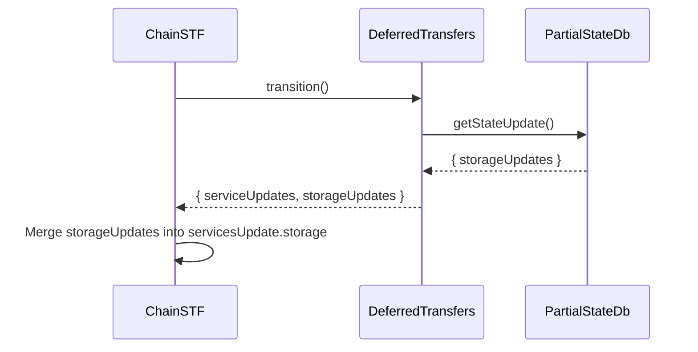

# Add possibility to update storage by OnTransfer invocation

## Pull Request by @mateuszsikora

## changes:
- added possibility to update storage by OnTransfer invocation
- removed the condition that prevented reading data written by other services.

## Comment by @coderabbitai[bot]

<!-- This is an auto-generated comment: summarize by coderabbit.ai -->
<!-- This is an auto-generated comment: skip review by coderabbit.ai -->

> [!IMPORTANT]
> ## Review skipped
> 
> Auto incremental reviews are disabled on this repository.
> 
> Please check the settings in the CodeRabbit UI or the `.coderabbit.yaml` file in this repository. To trigger a single review, invoke the `@coderabbitai review` command.
> 
> You can disable this status message by setting the `reviews.review_status` to `false` in the CodeRabbit configuration file.

<!-- end of auto-generated comment: skip review by coderabbit.ai -->
<!-- walkthrough_start -->

📝 Walkthrough

<!-- This is an auto-generated comment: release notes by coderabbit.ai -->

## Summary by CodeRabbit

* **New Features**
  * Storage updates are now tracked and returned alongside service updates during deferred transfers.
  * The transition process now includes additional storage updates from deferred transfers.

* **Refactor**
  * Simplified logic for searching and returning storage update items, ensuring consistent behavior across services.

<!-- end of auto-generated comment: release notes by coderabbit.ai -->
## Walkthrough

The changes update the handling of storage updates throughout the deferred transfers and state transition logic. Storage updates are now consistently tracked, returned, and merged during transitions, and the logic for retrieving storage updates has been simplified to always check for updates regardless of service ID.

## Changes

| Cohort / File(s)                                                                 | Change Summary                                                                                     |
|----------------------------------------------------------------------------------|----------------------------------------------------------------------------------------------------|
| **Partial State DB Logic** `packages/jam/jam-host-calls/externalities/partial-state-db.ts` | Simplified logic for retrieving storage updates by removing the service ID check.                  |
| **Deferred Transfers Transition** `packages/jam/transition/accumulate/deferred-transfers.ts` | Added collection and return of storage updates in deferred transfers; updated type signatures.      |
| **Chain State Transition** `packages/jam/transition/chain-stf.ts`             | Appended storage updates from deferred transfers to the main service update storage array.          |

## Sequence Diagram(s)

## Estimated code review effort

🎯 3 (Moderate) | ⏱️ ~15 minutes

## Poem

> In the garden of code, where updates bloom bright,  
> Storage and service now march in one light.  
> No more special cases, just logic that flows—  
> Like carrots in rows where the clever bunny goes.  
> Hop, merge, and gather, with code neat and sweet,  
> This patch is a treat for reviewers to eat! 🥕

<!-- walkthrough_end -->
<!-- internal state start -->

<!-- DwQgtGAEAqAWCWBnSTIEMB26CuAXA9mAOYCmGJATmriQCaQDG+Ats2bgFyQAOFk+AIwBWJBrngA3EsgEBPRvlqU0AgfFwA6NPEgQAfACgjoCEYDEZyAAUASpETZWaCrKNwSPbABsvkCiQBHbGlcSHFcLzpIACIAQVp6bnxERHg1L3V5AkhsblpqD0QCKlJIOUgAeQxoKgxEADNKFAwJfAZqeHwMaMgAdzRkBwFmdRp6ctxYD2xEJuYCmYAvVIBrfCp0ZFtIDEcBJoBWAEYADn4sSY8AMS9sevrZABkVRAB6XFluEn2KFz8SJKpYqyDQwKaMWCYUjIeAYXAURTYBhRWFhBBbOywhi3JSQMgqDIYIhojwqeAZD5hfA5PIFezFNClWjYCiw4mXSrVWoNJqw1rtcRdUHxWjqToYNA+WQAGhJ1js/mY+CkyDQCgwosFF0hoV4JAknRmXnkeqkcKi/jQoqJkHyuDVvVZuBoWHK+EufFmFANyMQoPcs0gStF9XgAvFqvgzCpeIwkIwyLl9UiAA80uTMugNc0aAivlR0pn8PU5UV1ozprSaEHRPGkNHeuoENrCrIiiRmP7wdt2q6PP4DSReiisEp7eT0KFYM7uIgOK9XkQm9gBBomMxXjc7g9ngI3h8vj8XK9uN4vK9jicNEZ9MZwFAyPRizgCMQyMoxgpWOwuLx+MJRHEFUynkJglALNRNG0XQwEMEwoDgVBUEwF9CFIcgqE/dc2DhLgqF6exHHmP5yjA5RVHULQdFvO9TAMbg0AYFYKzeIQ0A3NjmDAWBklwMB2h8N4SBTXMJQpeBpBPZxxElMAigKMBaFXXA5wMaJ1IMCxIFiABJN8MIKegHCcP5nwYeNoTccEmA1MUuklCFRBWf4ilZMQ2VLEhnHMyB6nWdB6XLUpcjtDx1A7GMumNPopiwAADL0fRIHTaDivEgklZA4oYFl/DhABlSgkpStL+mQRVlToUEADl8F6WUOTI9AvH6Nt7C8ihzOkXz/LVeZcHMjyyxKStQpQGho1ROKQsM/L7RoDRErDaRFoZUg0v8IhnFoSIUn4EteimD05QSorlpKoNqC65BGty9h2u9ZbQR0ks+qu5tiXCybkD87ANVldRkAkSVghQcqSFwFlyHoKM2FFApjS7VBzKhQoo24DJQ26jkvHwJcGBAvEMhGCVxBtDlEC+Bh4Ac9pAz8vhbt+e6lsTTB6D+mzNXFSVoq6piPI5GbP2Git6TpfYGY8epeY8gRGOc7IhY1ShjSG+aSGvTTLFiLxcw6LobupDklGxZwDbqfa8RTJIKE/fzTwEDICfYMVpBvSBaohVGjdLeAiFJlluufYTbftvhHed2Nwgk5Bh38S6lGvdTohvOiGKYljXk495uTsjBXkYnLmG8ApXiURpmdoMB4UwHkKD9FSODUjStN0/SPyiYziPkMyLPdgx3G9olutheFEUTWuBZtdn/khigMA859ReCqtuslLoiFSXFWdGgoYRbW0SEr/x6FrupK5uvOtR4BFfT9SB8qp+BQwE40GvBOKAFU17moKSDSgeMKMJmBhyiLPK0Sgz7G0/gAEWPpQU+NQ66XxsNIbwuBAGfFJKqHYQ5IAJTWiQH+oVEBpWcFQEEkAdJ1HgLiDkcVz5AnFGlNgkxFCyjVOQAihD/4kP3uQ34aB5BIUXjJDIiwqraXqLma2og8CC3BF0Gu3JK6QFxvjHqfAvI+V3h/DwTUMB1TnqyfU3V5LVmFt1eoCJowMKsNJGmXg5oFFgQINKsJ5IJlJNmNA3AvgahuuCFee8aA/VsaWDWNIxpK0/iE/hYTBGUNBFcWEvMZQnXiWvMh6AhEiIPtibAUDmhyn8PPaGLkMH/hEGIGq1J3RTD4BosM/BtG/H8vGHaHlkb91oFrcwOs9YfgjDGE2ogvDmy1MgEONt1jh08E7FprtxADygCKKIvCRoJOkFwbZf8RoAG0AC6aVeD4HzJSWJHhQ5zKiEAgh8CT50GQRfSgiA0EOD1h4+KGdmLQmzuxXOdd86FwYMXUuNBy4IKriolBbyNAqTiteKAABZRQL8JL0DYTxIy/tA4J2fIw6+LCSlmz2nFR5iDnmqLed8ghvys45yYSCoujgIUkChU86uTDL4IpydkMpUMApxSsLYpAJBgAfIwcASlVcXn13eegvWspZVIJpQ3AAou0igABhRQJA9B6FKo0jwFLoVqrhQ3KVXydjGKxDibqmyKzbLIVrDVRQoyGQULiAcEkCLHwZpwSAKK6DwEcC3VOBgIBgCMAy/5TLiVdFeCjWEclcD1D5c3FO2ttJ6XQp3IyRFnC9xLCjEeiArIeGZTfbFigSkciqDqyEqIyVxwGEGdFWNoGQE6ZEdACR84ORCdE/evkIljK5fKy+YRE1YH8J8zQj9n6v3SZwmRTQ0D9DFOTcEFcqW0CnfC6t4pGC8yzPQfmKwPIMzxNqxA+ij6uSRPPJeJYOTzqqUY/1IkqBiFwdw2+5zKCUglHDAhWTSFpQABR5XYlEXGb95DtrinuuV6rED7OddkuKABKJGqo8lW2HVYmEQSyDoH8Y+O5MDrlpg9TaU6j1fTbNWv/JJwicipB3YUPUVp+D5moOsOp/BjrNIJv5RBHT2aEmJGVYepA+kDO0kMzCIyrlHzNqpw2Vsbl2yiA7FcUdlmxw9l7Mt0JRnBLxdQIO0ySy6fmZHJZcI3Zx0oB4eYScI1p0MAYeCsYnyvTwGhd8mEojYR/H4TdhETLyFIvqiClFoK3n89hdQAB9OhiB0u+qHHQdL8k7YwV8/5gATAAdgAGwAAYqsABYSClcqwcBgtAjj1AYNVo4JBKsMAAJyVZOAkDrpW+tHD6ycSrtA6sJBOHV4rtEoBpdwJl2g2XcvDloOlx8C3/PMAYNwdLNkaAiQK/aIrNE4pXYMAAbwMJAGInj/bTkQNELgxzpT3ZiP0BebJXvvaOQYAAvgYK7cVFtBgO0droJ2Vs7f0EAA== -->

<!-- internal state end -->
<!-- tips_start -->

---

🪧 Tips

### Chat

There are 3 ways to chat with [CodeRabbit](https://coderabbit.ai?utm_source=oss&utm_medium=github&utm_campaign=FluffyLabs/typeberry&utm_content=518):

- Review comments: Directly reply to a review comment made by CodeRabbit. Example:
  - `I pushed a fix in commit <commit_id>, please review it.`
  - `Explain this complex logic.`
  - `Open a follow-up GitHub issue for this discussion.`
- Files and specific lines of code (under the "Files changed" tab): Tag `@coderabbitai` in a new review comment at the desired location with your query. Examples:
  - `@coderabbitai explain this code block.`
  -	`@coderabbitai modularize this function.`
- PR comments: Tag `@coderabbitai` in a new PR comment to ask questions about the PR branch. For the best results, please provide a very specific query, as very limited context is provided in this mode. Examples:
  - `@coderabbitai gather interesting stats about this repository and render them as a table. Additionally, render a pie chart showing the language distribution in the codebase.`
  - `@coderabbitai read src/utils.ts and explain its main purpose.`
  - `@coderabbitai read the files in the src/scheduler package and generate a class diagram using mermaid and a README in the markdown format.`
  - `@coderabbitai help me debug CodeRabbit configuration file.`

### Support

Need help? Create a ticket on our [support page](https://www.coderabbit.ai/contact-us/support) for assistance with any issues or questions.

Note: Be mindful of the bot's finite context window. It's strongly recommended to break down tasks such as reading entire modules into smaller chunks. For a focused discussion, use review comments to chat about specific files and their changes, instead of using the PR comments.

### CodeRabbit Commands (Invoked using PR comments)

- `@coderabbitai pause` to pause the reviews on a PR.
- `@coderabbitai resume` to resume the paused reviews.
- `@coderabbitai review` to trigger an incremental review. This is useful when automatic reviews are disabled for the repository.
- `@coderabbitai full review` to do a full review from scratch and review all the files again.
- `@coderabbitai summary` to regenerate the summary of the PR.
- `@coderabbitai generate sequence diagram` to generate a sequence diagram of the changes in this PR.
- `@coderabbitai resolve` resolve all the CodeRabbit review comments.
- `@coderabbitai configuration` to show the current CodeRabbit configuration for the repository.
- `@coderabbitai help` to get help.

### Other keywords and placeholders

- Add `@coderabbitai ignore` anywhere in the PR description to prevent this PR from being reviewed.
- Add `@coderabbitai summary` to generate the high-level summary at a specific location in the PR description.
- Add `@coderabbitai` anywhere in the PR title to generate the title automatically.

### Documentation and Community

- Visit our [Documentation](https://docs.coderabbit.ai) for detailed information on how to use CodeRabbit.
- Join our [Discord Community](http://discord.gg/coderabbit) to get help, request features, and share feedback.
- Follow us on [X/Twitter](https://twitter.com/coderabbitai) for updates and announcements.

<!-- tips_end -->

## Comment by @github-actions[bot]

View all

| File | Benchmark | Ops |  |
|------|-----------|-----|--|
| [bytes/hex-to.ts[0]](../blob/258569586f0bad493858164e06bd8a02f06aaa7e//_work/typeberry-runner-2/typeberry/typeberry/benchmarks/bytes/hex-to.ts) | number toString + padding | 312844.46 ±0.59% | fastest ✅ |
| [bytes/hex-to.ts[1]](../blob/258569586f0bad493858164e06bd8a02f06aaa7e//_work/typeberry-runner-2/typeberry/typeberry/benchmarks/bytes/hex-to.ts) | manual | 16082.49 ±0.58% | 94.86% slower |
| [math/mul_overflow.ts[0]](../blob/258569586f0bad493858164e06bd8a02f06aaa7e//_work/typeberry-runner-2/typeberry/typeberry/benchmarks/math/mul_overflow.ts) | multiply and bring back to u32 | 241999911.4 ±5.13% | 0.56% slower |
| [math/mul_overflow.ts[1]](../blob/258569586f0bad493858164e06bd8a02f06aaa7e//_work/typeberry-runner-2/typeberry/typeberry/benchmarks/math/mul_overflow.ts) | multiply and take modulus | 243374895.04 ±6.8% | fastest ✅ |
| [math/switch.ts[0]](../blob/258569586f0bad493858164e06bd8a02f06aaa7e//_work/typeberry-runner-2/typeberry/typeberry/benchmarks/math/switch.ts) | switch | 250685682.18 ±5.65% | fastest ✅ |
| [math/switch.ts[1]](../blob/258569586f0bad493858164e06bd8a02f06aaa7e//_work/typeberry-runner-2/typeberry/typeberry/benchmarks/math/switch.ts) | if | 243574311.36 ±6.22% | 2.84% slower |
| [math/count-bits-u64.ts[0]](../blob/258569586f0bad493858164e06bd8a02f06aaa7e//_work/typeberry-runner-2/typeberry/typeberry/benchmarks/math/count-bits-u64.ts) | standard method | 1305083.96 ±0.4% | 88.32% slower |
| [math/count-bits-u64.ts[1]](../blob/258569586f0bad493858164e06bd8a02f06aaa7e//_work/typeberry-runner-2/typeberry/typeberry/benchmarks/math/count-bits-u64.ts) | magic | 11174316.7 ±0.35% | fastest ✅ |
| [hash/index.ts[0]](../blob/258569586f0bad493858164e06bd8a02f06aaa7e//_work/typeberry-runner-2/typeberry/typeberry/benchmarks/hash/index.ts) | hash with numeric representation | 193.2 ±0.35% | 25.05% slower |
| [hash/index.ts[1]](../blob/258569586f0bad493858164e06bd8a02f06aaa7e//_work/typeberry-runner-2/typeberry/typeberry/benchmarks/hash/index.ts) | hash with string representation | 121.11 ±0.38% | 53.01% slower |
| [hash/index.ts[2]](../blob/258569586f0bad493858164e06bd8a02f06aaa7e//_work/typeberry-runner-2/typeberry/typeberry/benchmarks/hash/index.ts) | hash with symbol representation | 181.46 ±0.44% | 29.6% slower |
| [hash/index.ts[3]](../blob/258569586f0bad493858164e06bd8a02f06aaa7e//_work/typeberry-runner-2/typeberry/typeberry/benchmarks/hash/index.ts) | hash with uint8 representation | 164.38 ±0.15% | 36.23% slower |
| [hash/index.ts[4]](../blob/258569586f0bad493858164e06bd8a02f06aaa7e//_work/typeberry-runner-2/typeberry/typeberry/benchmarks/hash/index.ts) | hash with packed representation | 257.76 ±1.13% | fastest ✅ |
| [hash/index.ts[5]](../blob/258569586f0bad493858164e06bd8a02f06aaa7e//_work/typeberry-runner-2/typeberry/typeberry/benchmarks/hash/index.ts) | hash with bigint representation | 192.41 ±0.27% | 25.35% slower |
| [hash/index.ts[6]](../blob/258569586f0bad493858164e06bd8a02f06aaa7e//_work/typeberry-runner-2/typeberry/typeberry/benchmarks/hash/index.ts) | hash with uint32 representation | 202.13 ±0.13% | 21.58% slower |
| [logger/index.ts[0]](../blob/258569586f0bad493858164e06bd8a02f06aaa7e//_work/typeberry-runner-2/typeberry/typeberry/benchmarks/logger/index.ts) | console.log with string concat | 6808177.17 ±61.15% | fastest ✅ |
| [logger/index.ts[1]](../blob/258569586f0bad493858164e06bd8a02f06aaa7e//_work/typeberry-runner-2/typeberry/typeberry/benchmarks/logger/index.ts) | console.log with args | 1125673.2 ±74.38% | 83.47% slower |
| [math/add_one_overflow.ts[0]](../blob/258569586f0bad493858164e06bd8a02f06aaa7e//_work/typeberry-runner-2/typeberry/typeberry/benchmarks/math/add_one_overflow.ts) | add and take modulus | 5304538.03 ±88.69% | 97.89% slower |
| [math/add_one_overflow.ts[1]](../blob/258569586f0bad493858164e06bd8a02f06aaa7e//_work/typeberry-runner-2/typeberry/typeberry/benchmarks/math/add_one_overflow.ts) | condition before calculation | 251247258.19 ±5.6% | fastest ✅ |
| [math/count-bits-u32.ts[0]](../blob/258569586f0bad493858164e06bd8a02f06aaa7e//_work/typeberry-runner-2/typeberry/typeberry/benchmarks/math/count-bits-u32.ts) | standard method | 72886496.1 ±1.41% | 67.92% slower |
| [math/count-bits-u32.ts[1]](../blob/258569586f0bad493858164e06bd8a02f06aaa7e//_work/typeberry-runner-2/typeberry/typeberry/benchmarks/math/count-bits-u32.ts) | magic | 227179274.22 ±6.69% | fastest ✅ |
| [codec/bigint.decode.ts[0]](../blob/258569586f0bad493858164e06bd8a02f06aaa7e//_work/typeberry-runner-2/typeberry/typeberry/benchmarks/codec/bigint.decode.ts) | decode custom | 167507730.2 ±2.08% | fastest ✅ |
| [codec/bigint.decode.ts[1]](../blob/258569586f0bad493858164e06bd8a02f06aaa7e//_work/typeberry-runner-2/typeberry/typeberry/benchmarks/codec/bigint.decode.ts) | decode bigint | 75173490.47 ±3.58% | 55.12% slower |
| [codec/decoding.ts[0]](../blob/258569586f0bad493858164e06bd8a02f06aaa7e//_work/typeberry-runner-2/typeberry/typeberry/benchmarks/codec/decoding.ts) | manual decode | 17318617.51 ±0.38% | 91.2% slower |
| [codec/decoding.ts[1]](../blob/258569586f0bad493858164e06bd8a02f06aaa7e//_work/typeberry-runner-2/typeberry/typeberry/benchmarks/codec/decoding.ts) | int32array decode | 196789031.63 ±4.17% | fastest ✅ |
| [codec/decoding.ts[2]](../blob/258569586f0bad493858164e06bd8a02f06aaa7e//_work/typeberry-runner-2/typeberry/typeberry/benchmarks/codec/decoding.ts) | dataview decode | 183584764.9 ±4.17% | 6.71% slower |
| [codec/encoding.ts[0]](../blob/258569586f0bad493858164e06bd8a02f06aaa7e//_work/typeberry-runner-2/typeberry/typeberry/benchmarks/codec/encoding.ts) | manual encode | 2640986.85 ±0.25% | 19.12% slower |
| [codec/encoding.ts[1]](../blob/258569586f0bad493858164e06bd8a02f06aaa7e//_work/typeberry-runner-2/typeberry/typeberry/benchmarks/codec/encoding.ts) | int32array encode | 2717038.62 ±2.64% | 16.79% slower |
| [codec/encoding.ts[2]](../blob/258569586f0bad493858164e06bd8a02f06aaa7e//_work/typeberry-runner-2/typeberry/typeberry/benchmarks/codec/encoding.ts) | dataview encode | 3265216.71 ±0.31% | fastest ✅ |
| [bytes/hex-from.ts[0]](../blob/258569586f0bad493858164e06bd8a02f06aaa7e//_work/typeberry-runner-2/typeberry/typeberry/benchmarks/bytes/hex-from.ts) | parse hex using `Number` with NaN checking | 123759.58 ±0.24% | 83.46% slower |
| [bytes/hex-from.ts[1]](../blob/258569586f0bad493858164e06bd8a02f06aaa7e//_work/typeberry-runner-2/typeberry/typeberry/benchmarks/bytes/hex-from.ts) | parse hex from char codes | 748265.88 ±0.16% | fastest ✅ |
| [bytes/hex-from.ts[2]](../blob/258569586f0bad493858164e06bd8a02f06aaa7e//_work/typeberry-runner-2/typeberry/typeberry/benchmarks/bytes/hex-from.ts) | parse hex from string nibbles | 488116.14 ±0.33% | 34.77% slower |
| [codec/bigint.compare.ts[0]](../blob/258569586f0bad493858164e06bd8a02f06aaa7e//_work/typeberry-runner-2/typeberry/typeberry/benchmarks/codec/bigint.compare.ts) | compare custom | 264536509.62 ±4.43% | fastest ✅ |
| [codec/bigint.compare.ts[1]](../blob/258569586f0bad493858164e06bd8a02f06aaa7e//_work/typeberry-runner-2/typeberry/typeberry/benchmarks/codec/bigint.compare.ts) | compare bigint | 243956180.02 ±5.66% | 7.78% slower |
| [collections/map-set.ts[0]](../blob/258569586f0bad493858164e06bd8a02f06aaa7e//_work/typeberry-runner-2/typeberry/typeberry/benchmarks/collections/map-set.ts) | 2 gets + conditional set | 111420 ±0.08% | fastest ✅ |
| [collections/map-set.ts[1]](../blob/258569586f0bad493858164e06bd8a02f06aaa7e//_work/typeberry-runner-2/typeberry/typeberry/benchmarks/collections/map-set.ts) | 1 get 1 set | 61767.75 ±0.01% | 44.56% slower |
| [collections/map_vs_sorted.ts[0]](../blob/258569586f0bad493858164e06bd8a02f06aaa7e//_work/typeberry-runner-2/typeberry/typeberry/benchmarks/collections/map_vs_sorted.ts) | Map | 320611.1 ±0.18% | fastest ✅ |
| [collections/map_vs_sorted.ts[1]](../blob/258569586f0bad493858164e06bd8a02f06aaa7e//_work/typeberry-runner-2/typeberry/typeberry/benchmarks/collections/map_vs_sorted.ts) | Map-array | 102458.16 ±0.33% | 68.04% slower |
| [collections/map_vs_sorted.ts[2]](../blob/258569586f0bad493858164e06bd8a02f06aaa7e//_work/typeberry-runner-2/typeberry/typeberry/benchmarks/collections/map_vs_sorted.ts) | Array | 69132.92 ±0.37% | 78.44% slower |
| [collections/map_vs_sorted.ts[3]](../blob/258569586f0bad493858164e06bd8a02f06aaa7e//_work/typeberry-runner-2/typeberry/typeberry/benchmarks/collections/map_vs_sorted.ts) | SortedArray | 196027.06 ±0.36% | 38.86% slower |
| [bytes/compare.ts[0]](../blob/258569586f0bad493858164e06bd8a02f06aaa7e//_work/typeberry-runner-2/typeberry/typeberry/benchmarks/bytes/compare.ts) | Comparing Uint32 bytes | 19626.17 ±0.21% | fastest ✅ |
| [bytes/compare.ts[1]](../blob/258569586f0bad493858164e06bd8a02f06aaa7e//_work/typeberry-runner-2/typeberry/typeberry/benchmarks/bytes/compare.ts) | Comparing raw bytes | 19563.67 ±0.45% | 0.32% slower |
| [hash/blake2b.ts[0]](../blob/258569586f0bad493858164e06bd8a02f06aaa7e//_work/typeberry-runner-2/typeberry/typeberry/benchmarks/hash/blake2b.ts) | hasher with simple allocator | 0.045 ±1.36% | fastest ✅ |
| [hash/blake2b.ts[1]](../blob/258569586f0bad493858164e06bd8a02f06aaa7e//_work/typeberry-runner-2/typeberry/typeberry/benchmarks/hash/blake2b.ts) | hasher with page allocator | 0.044 ±1.6% | 2.22% slower |
| [codec/view_vs_collection.ts[0]](../blob/258569586f0bad493858164e06bd8a02f06aaa7e//_work/typeberry-runner-2/typeberry/typeberry/benchmarks/codec/view_vs_collection.ts) | Get first element from Decoded | 20696.76 ±8.06% | 68.2% slower |
| [codec/view_vs_collection.ts[1]](../blob/258569586f0bad493858164e06bd8a02f06aaa7e//_work/typeberry-runner-2/typeberry/typeberry/benchmarks/codec/view_vs_collection.ts) | Get first element from View | 65083.44 ±1.2% | fastest ✅ |
| [codec/view_vs_collection.ts[2]](../blob/258569586f0bad493858164e06bd8a02f06aaa7e//_work/typeberry-runner-2/typeberry/typeberry/benchmarks/codec/view_vs_collection.ts) | Get 50th element from Decoded | 27688.73 ±0.54% | 57.46% slower |
| [codec/view_vs_collection.ts[3]](../blob/258569586f0bad493858164e06bd8a02f06aaa7e//_work/typeberry-runner-2/typeberry/typeberry/benchmarks/codec/view_vs_collection.ts) | Get 50th element from View | 38645.88 ±0.33% | 40.62% slower |
| [codec/view_vs_collection.ts[4]](../blob/258569586f0bad493858164e06bd8a02f06aaa7e//_work/typeberry-runner-2/typeberry/typeberry/benchmarks/codec/view_vs_collection.ts) | Get last element from Decoded | 27507.68 ±1.51% | 57.73% slower |
| [codec/view_vs_collection.ts[5]](../blob/258569586f0bad493858164e06bd8a02f06aaa7e//_work/typeberry-runner-2/typeberry/typeberry/benchmarks/codec/view_vs_collection.ts) | Get last element from View | 26194.8 ±1.82% | 59.75% slower |
| [codec/view_vs_object.ts[0]](../blob/258569586f0bad493858164e06bd8a02f06aaa7e//_work/typeberry-runner-2/typeberry/typeberry/benchmarks/codec/view_vs_object.ts) | Get the first field from Decoded | 422952.74 ±1.79% | 2.48% slower |
| [codec/view_vs_object.ts[1]](../blob/258569586f0bad493858164e06bd8a02f06aaa7e//_work/typeberry-runner-2/typeberry/typeberry/benchmarks/codec/view_vs_object.ts) | Get the first field from View | 101756.07 ±1.05% | 76.54% slower |
| [codec/view_vs_object.ts[2]](../blob/258569586f0bad493858164e06bd8a02f06aaa7e//_work/typeberry-runner-2/typeberry/typeberry/benchmarks/codec/view_vs_object.ts) | Get the first field as view from View | 97940.34 ±1.22% | 77.42% slower |
| [codec/view_vs_object.ts[3]](../blob/258569586f0bad493858164e06bd8a02f06aaa7e//_work/typeberry-runner-2/typeberry/typeberry/benchmarks/codec/view_vs_object.ts) | Get two fields from Decoded | 433694.79 ±0.66% | fastest ✅ |
| [codec/view_vs_object.ts[4]](../blob/258569586f0bad493858164e06bd8a02f06aaa7e//_work/typeberry-runner-2/typeberry/typeberry/benchmarks/codec/view_vs_object.ts) | Get two fields from View | 76377.02 ±1.37% | 82.39% slower |
| [codec/view_vs_object.ts[5]](../blob/258569586f0bad493858164e06bd8a02f06aaa7e//_work/typeberry-runner-2/typeberry/typeberry/benchmarks/codec/view_vs_object.ts) | Get two fields from materialized from View | 160536.7 ±2.11% | 62.98% slower |
| [codec/view_vs_object.ts[6]](../blob/258569586f0bad493858164e06bd8a02f06aaa7e//_work/typeberry-runner-2/typeberry/typeberry/benchmarks/codec/view_vs_object.ts) | Get two fields as views from View | 80083.93 ±0.55% | 81.53% slower |
| [codec/view_vs_object.ts[7]](../blob/258569586f0bad493858164e06bd8a02f06aaa7e//_work/typeberry-runner-2/typeberry/typeberry/benchmarks/codec/view_vs_object.ts) | Get only third field from Decoded | 426063.47 ±1.19% | 1.76% slower |
| [codec/view_vs_object.ts[8]](../blob/258569586f0bad493858164e06bd8a02f06aaa7e//_work/typeberry-runner-2/typeberry/typeberry/benchmarks/codec/view_vs_object.ts) | Get only third field from View | 99066.94 ±0.57% | 77.16% slower |
| [codec/view_vs_object.ts[9]](../blob/258569586f0bad493858164e06bd8a02f06aaa7e//_work/typeberry-runner-2/typeberry/typeberry/benchmarks/codec/view_vs_object.ts) | Get only third field as view from View | 101129.61 ±0.51% | 76.68% slower |
| [crypto/ed25519.ts[0]](../blob/258569586f0bad493858164e06bd8a02f06aaa7e//_work/typeberry-runner-2/typeberry/typeberry/benchmarks/crypto/ed25519.ts) | native crypto | 6.25 ±11.84% | 78.92% slower |
| [crypto/ed25519.ts[1]](../blob/258569586f0bad493858164e06bd8a02f06aaa7e//_work/typeberry-runner-2/typeberry/typeberry/benchmarks/crypto/ed25519.ts) | wasm lib | 10.64 ±0.04% | 64.11% slower |
| [crypto/ed25519.ts[2]](../blob/258569586f0bad493858164e06bd8a02f06aaa7e//_work/typeberry-runner-2/typeberry/typeberry/benchmarks/crypto/ed25519.ts) | wasm lib batch | 29.65 ±0.67% | fastest ✅ |

### Benchmarks summary: 63/63 OK ✅

<!-- thollander/actions-comment-pull-request "benchmarks" -->

## Comment by @tomusdrw

I wonder if it's possible for `OnTransfer` invocations to update anything else than storage? Maybe worth adding a comment with explanation that the assumption is that deferred transfers can only modify the storage and not lookup history or preimages (or any other state entries).

## Comment by @mateuszsikora

`OnTransfer` can update storage and service info. I believe this code will be replaced with something better soon. I will add a comment for now 
