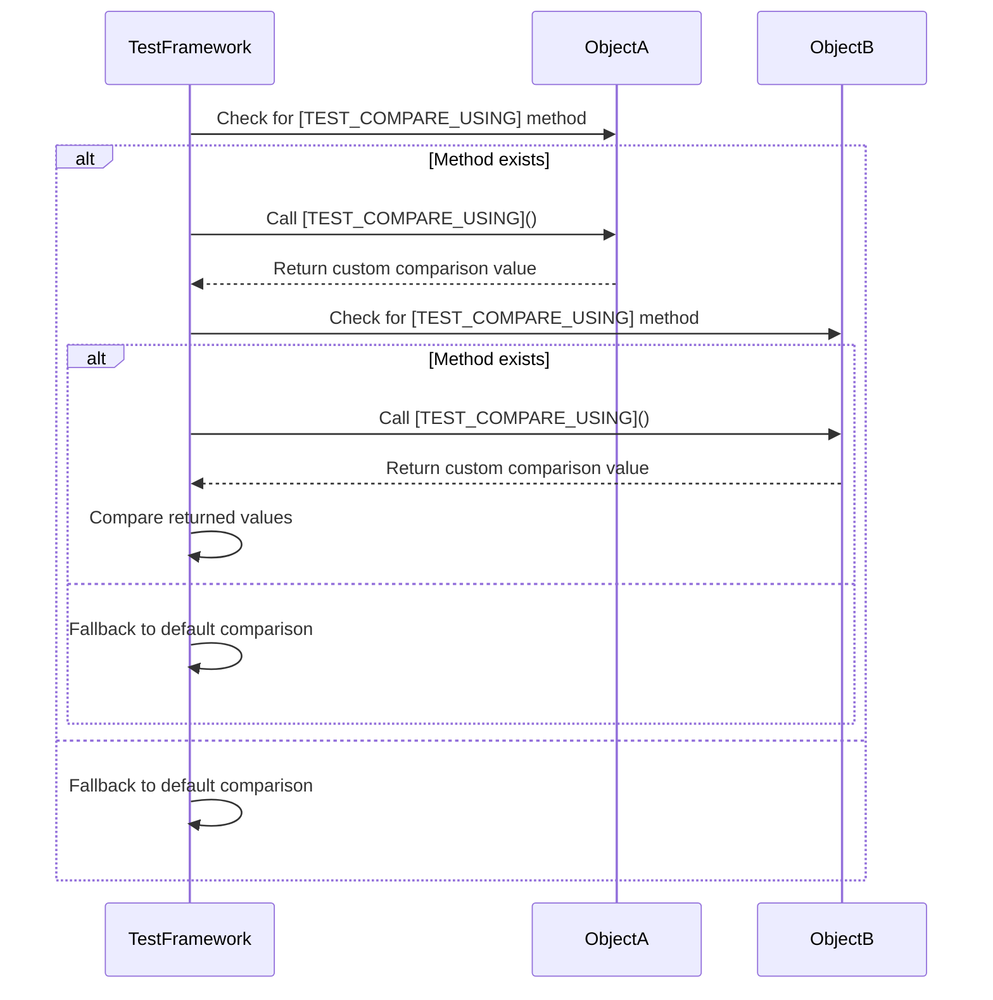

# More robust `deepEqual` comparison of some collections.

## Pull Request by @tomusdrw

This PR enhances the way how some objects can be compared using `deepEqual`. Previously it was possible to mark an object to indicate it has to be compared using it's string representation. Now, objects can return another derived type that will be used for comparison.


## Comment by @coderabbitai[bot]

<!-- This is an auto-generated comment: summarize by coderabbit.ai -->
<!-- This is an auto-generated comment: skip review by coderabbit.ai -->

> [!IMPORTANT]
> ## Review skipped
> 
> Auto incremental reviews are disabled on this repository.
> 
> Please check the settings in the CodeRabbit UI or the `.coderabbit.yaml` file in this repository. To trigger a single review, invoke the `@coderabbitai review` command.
> 
> You can disable this status message by setting the `reviews.review_status` to `false` in the CodeRabbit configuration file.

<!-- end of auto-generated comment: skip review by coderabbit.ai -->
<!-- walkthrough_start -->

<details>
<summary>📝 Walkthrough</summary>

<!-- This is an auto-generated comment: release notes by coderabbit.ai -->

## Summary by CodeRabbit

* **New Features**
  * Enhanced object comparison for various classes, allowing more flexible and accurate comparisons in testing and utilities.

* **Refactor**
  * Updated comparison mechanism from a string-based approach to a customizable function, improving how objects are compared across the app.

<!-- end of auto-generated comment: release notes by coderabbit.ai -->
## Walkthrough

The changes update the mechanism for customizing object comparison in tests by replacing a boolean property (`TEST_COMPARE_VIA_STRING`) with a function-based symbol (`TEST_COMPARE_USING`). Several classes now implement a method keyed by this symbol to provide custom comparison logic. The core test utility is refactored to support this new approach, and relevant imports and usages are updated accordingly.

## Changes

| Cohort / File(s)                                                                 | Change Summary                                                                                         |
|----------------------------------------------------------------------------------|-------------------------------------------------------------------------------------------------------|
| **Comparison Symbol & Logic Refactor**<br>`packages/core/utils/test.ts`          | Renamed comparison symbol, replaced boolean flag with function-based approach, added helper function.  |
| **BytesBlob Comparison Update**<br>`packages/core/bytes/bytes.ts`                | Updated `BytesBlob` to use new comparison method keyed by symbol, adjusted import accordingly.         |
| **TruncatedHashDictionary Custom Comparison**<br>`packages/jam/database/truncated-hash-dictionary.ts` | Added symbol-keyed method returning internal dictionary for comparison.                                |
| **SerializedState Custom Comparison**<br>`packages/jam/state-merkleization/serialized-state.ts`        | Added symbol-keyed method returning `backend` for comparison, updated import.                         |
| **StateEntries Custom Comparison**<br>`packages/jam/state-merkleization/state-entries.ts`              | Added symbol-keyed method returning entries data for comparison, updated import.                      |

## Sequence Diagram(s)



## Estimated code review effort

🎯 2 (Simple) | ⏱️ ~10 minutes

## Poem

> A symbol once was just a flag,  
> Now it’s a function—no need to brag!  
> Custom compares, so neat and keen,  
> Rabbits hop where code is clean.  
> With every tweak and tidy string,  
> Our tests now dance and softly sing.  
> 🐇✨

</details>

<!-- walkthrough_end -->
<!-- internal state start -->


<!-- DwQgtGAEAqAWCWBnSTIEMB26CuAXA9mAOYCmGJATmriQCaQDG+Ats2bgFyQAOFk+AIwBWJBrngA3EsgEBPRvlqU0AgfFwA6NPEgQAfACgjoCEYDEZyAAUASpETZWaCrKNwSPbABsvkCiQBHbGlcSHFcLzpIACIAWXx/P0FsRFCAAyUSbgBRILQvNIVmbmckfCx8ADN7Fg8mH1FxcsRoyAB3NGQHAWZ1Gno5MNgPFMowlhTaCjb0ZFtIDEcBMYBWAEYATn4sXGGYWW4SZYoXPyz8RHUE2Q0YPYZYTFIUYop8KWRdjwySLNzsfKFSrYDBieDlADkyAYaBKai86nkBCKJUSDEouG0FWEjUQtys/gk4JSXlkABp+DixND8N4Bh5mM4ANZRZHwDC0eAwmhDahDEjwPipCjsohnXjSdjUcFYRCwWleemQUb0SoJFGlRDlW4AdXUsCGqGw3Fo1BIFMEImp6ESGHwMxUkXGZ1w2AoWEw+C+fCUIqk9FwB3N7QQD3a8B8kGWysQUTVfC+GpFWqw7NSJDQ9CqkCEKVCX0F9lwIowYvjzFucFQZEeoJIbAwoW0zE++B4byJSnQkGYCQ8lUiAA94AInZh6G8BHme6Ja0hmJB45BMtxIIEAQjA4xhgwmchs/VImDmugOZSrbg8XcPPMYVho4T4CQ2lE+bBcLhuIgOAB6H9EfVsAEDQmGYH8ADEvGwSpKlkAAZFREB/QNDmOFwf24bwvB/dYNg0Ix9GMcAoDILNqjQPBCFIcgqH6IoG04dtz0aSRpCjeQmF9FQ1E0bRdDAQwTCgKtkFQTAcAIYgyGUOjQIYrgqBmBwnFOQZOOUVR1C0HRCKI0wDBKXc0FIJCmH8H85BoJDLOkDRLw4AxoicgwLEgABBABJKSaLNehlMZU4D1rEy3D2eBigSUJUjNBj2k6bcnlZNt/G4Lw0HRSA0mgbIAGVoAAfQAYQAeViKw3JsbJ8oANQ8tz8rymwPIAOQAcUKNp9Uy7K8qK0rysq/KAFUcpa9rFzeBdEzSAABFCjkodC8AjRBCkMpljJIW5CoSfxEG4cpOVLUkKWmgAhWQrLOrxBEKBg0sQZAUrS9EAz2Xh8EOCgtzSABtHqCpKsqKqq2r6sasaAF1IAAXjCChggAbg6rq0BnXZFEy/7csB/qQeG0a2shgAKABKQpdj5fxXXdT49mFUVxT2qUmgqapEzTTE60gIk0bSXYkDs/AcuLUUybSSsEGQXtOUqJ86Y8DokT2NILqum6BEKTnMHRZBnDqFhUSidkwhCfc+GWzd5d5UJ/FJbZ+VjexZGYAR8C8RAKUQTrcAeRnKkm7s3fdjMsAHYznTR4FQVZl03QwRm0YZ0tF3VUDUTKDB8KMFzLDcrwaFomVW35ZdRDSouT2zEhBwO76onVTDRy5NdG3UeWCMgQrgqiD6vp+7HeqBgbQbqhroCaomuGDyJMC1rB7s6ZBVcu6Rrtu502Ax+g/oBvrgcGkaobJrhk6IefGAe5e1bXjWL7SdbNtMvsLNX6y37s1ajGyVJwt8hQuyPmfGuGCkUuCxDoPARwjlnIGAgGAIwj8TI/jMiQH8lskJWU0PZGB0Rc7uS8tRGSUR/LOHkEFRKiBQojATkEDwiAXZu18CqVOfAGB5hYPAAAXozS0jQkyZxQDsFWK5/iAkXCCY8WAOhPTIGgNgqpA5ZRxvvEeNUx4QzahTNsyih540PoTdqksPDkCUow92TNJSNj1u2T6GJlbUApPAaoEpYyNgduJPhYgvbyjpFGDwUdJGx2pvHROPN8jBBjHGNOhtNTlCEemTM/B2Z7C8aEdQsYvCVFuG5SAwwvBfQkTHGUmUYQ+B2sUfW4Egkyg6vFdkxZFDYFes6dkEh8AskNMgaOUj7BoEqCQE6Qw3idRTuJRa6pnGlz7vYlAyA7RNiKVI4xmVRF5AKEs1mUJ7CHAYPAfIjBOj9jThw3oXCojpzidI+KxpTR0WRKMLpCxgEMNdhY8ceTBmFJ6azCkz10qM0TBKIktJkA3QAgwG2SYG5UkvOxfkhZ+bC1FqWcW/A8CYU0HcVADxEqQCIVQBE5yFYCJTPwKQJx4BdjYLihOiAFwBxYEWEsYomAYApZceJyJxLOB4lQU4PySl7W8JoHO+D86F2lCeZEiYlCL0rhgfc1Qa51zoo3ICCJIXsHbtITuO1FVc1tnIhRp4/LwCIBgagboRgml8lwNIKrIoKANTAFRw98Zg3HpPVqXAQTwDoc7N5GzABJhJlR131nWpFdXog+VUj5tV9bQyJrymH3yQdIFBL8MHIRCJ/NIcDIDVOKfEzMShaD2sFfEspXgKlGyLVI4maTE1MjtG0DApNm2towGm9KG1kGoPQeID2ObUh5u/r/RkslFAeCATMEgoDvrgMgdApyeC4H6XTUhIQ8ifx3JUEc5CCNQS+TAI8OUYBORSLIZ/Byq7xWEOkrREhjgArkOqLSkKBh3AJVLAE2gtAbGmPRvKegLJZBREGImFNFjdG41jQTMa2jS5ZSPdyOgAAJTosAAAiXJWZkLulfSWqAt4gbjrTUuDTKCWt8GkTDcpcNXpcPPaK3Nib8ylhoS9uA0ikyiQMZWdQiOQGam2L0ww+DgpbjExsbxfADntHMnsihnFPloNncwecC4yWLs6WV5dnBSsVcktctdIoNz4E3TVrdwgdwLRA7e6B/10HtYPODaj42tRJuTIRl8l7dVQ75ejOG8MygI75h+van4/m3WBPdAgD3FkkSes9sAL2hfKNey8+aDA/3EJOi506zhEmAfO+MjE4L2lwQRDdUXkGxZ/NFGgYA2AUCZJEbhRnGuUH2USugYAmtbRwXe1ynlvLEL8i+shJmP26q/fcHuTmAOnheKqkzsHVH4080CQO005pBjQrIQdK01p1YCWeBpbxaDNLYmjIDpHMZcpVjlHr+RuF0BFmaQj/mUiAqloGphsxuzpzwL3N4/d5BgeI9LEgjmQkUY5o2ajBy0gJd3KRNa4PZnZmmi9kUb3zm0E+zQFjXN0QrIe/QVAtB8DsIYklIRl6zRQsuSy+wr2+t+UxFZJTZWWJSHtjT8g8LWd/YFHwNHLIORXlE/wb0kApOQpk40+TN0ZgkZU3LOgGnxXaYVSXfT8qjNKtM6qiznhm5arbuIObUA3LOfoJTrGe93UGOPh2mASHccc/e0T7nJBgDQFMzQaXkA8e9d98TkgZ1e2kT0N9x6EXN0xZ3YNlrlB2sCi4V12M+POcDf93m7OeW/5TsASQErc6F0Vaq3e9dCCDJna3an/36e2sdez6zRrrf2AilssN5yo2H0+ToqQwK76e5UPmx4cKa3BuxSXGkJeGJmoV8oHU6Wmu1ORw9m2WfTqNuu7jYYnbTKoPyIZE0yIOTnkzCd2BiDgmAcwZd/o4/iG4p6wd3p57/vsiyflgTyvBEmA0xnh2M0TBBF9FJEZl72tj3QpBVU1XUHthrnumwCOjFGmlFhIEKnSmGExzsW+nkEZQXFFzJSION1uFl3EzGEV34DYXKBV0XDV0/x/VIHUzFVGz12Nx/w8DlQrl4OrjM3rizEsw1Rbm1Rtynzt2/zu2ARBzohmWINAJ3jc02zdyJjRXAMZg40FjgNsj3Qvlxz/wAOkCAKTybxTzAjT1a0z06y7zTwMLxGy2LwnX/nUmKyfCr3Ky4EqzaGq3XUMAMCElbjIgkiokfQ8JYHkj8DQCUim1Ug4mnSoE0l4h0gEhCOInonUHyipUQHylnToHymigjV0lCI2AACZKgABmNYWgAAdlNEqIABYBkAAOFYFYEgFohgNYSogANkqJIAaIGIAAZKixiBiGixjaBOj2iBiVhaBKj+JgjQi5Jcj8jCiK9vDijSJVisiIAewGBuB8o2UaBBxcASjMQyjMiDA0gHiDAABvAwSAGINMc1d8FoLgX6SGMkV4mIDod0UUb4yAX4gwAAX3uMeMOKgGYBOLOKYJriuP2P0CAA== -->

<!-- internal state end -->
<!-- tips_start -->

---


<details>
<summary>🪧 Tips</summary>

### Chat

There are 3 ways to chat with [CodeRabbit](https://coderabbit.ai?utm_source=oss&utm_medium=github&utm_campaign=FluffyLabs/typeberry&utm_content=519):

- Review comments: Directly reply to a review comment made by CodeRabbit. Example:
  - `I pushed a fix in commit <commit_id>, please review it.`
  - `Explain this complex logic.`
  - `Open a follow-up GitHub issue for this discussion.`
- Files and specific lines of code (under the "Files changed" tab): Tag `@coderabbitai` in a new review comment at the desired location with your query. Examples:
  - `@coderabbitai explain this code block.`
  -	`@coderabbitai modularize this function.`
- PR comments: Tag `@coderabbitai` in a new PR comment to ask questions about the PR branch. For the best results, please provide a very specific query, as very limited context is provided in this mode. Examples:
  - `@coderabbitai gather interesting stats about this repository and render them as a table. Additionally, render a pie chart showing the language distribution in the codebase.`
  - `@coderabbitai read src/utils.ts and explain its main purpose.`
  - `@coderabbitai read the files in the src/scheduler package and generate a class diagram using mermaid and a README in the markdown format.`
  - `@coderabbitai help me debug CodeRabbit configuration file.`

### Support

Need help? Create a ticket on our [support page](https://www.coderabbit.ai/contact-us/support) for assistance with any issues or questions.

Note: Be mindful of the bot's finite context window. It's strongly recommended to break down tasks such as reading entire modules into smaller chunks. For a focused discussion, use review comments to chat about specific files and their changes, instead of using the PR comments.

### CodeRabbit Commands (Invoked using PR comments)

- `@coderabbitai pause` to pause the reviews on a PR.
- `@coderabbitai resume` to resume the paused reviews.
- `@coderabbitai review` to trigger an incremental review. This is useful when automatic reviews are disabled for the repository.
- `@coderabbitai full review` to do a full review from scratch and review all the files again.
- `@coderabbitai summary` to regenerate the summary of the PR.
- `@coderabbitai generate sequence diagram` to generate a sequence diagram of the changes in this PR.
- `@coderabbitai resolve` resolve all the CodeRabbit review comments.
- `@coderabbitai configuration` to show the current CodeRabbit configuration for the repository.
- `@coderabbitai help` to get help.

### Other keywords and placeholders

- Add `@coderabbitai ignore` anywhere in the PR description to prevent this PR from being reviewed.
- Add `@coderabbitai summary` to generate the high-level summary at a specific location in the PR description.
- Add `@coderabbitai` anywhere in the PR title to generate the title automatically.

### Documentation and Community

- Visit our [Documentation](https://docs.coderabbit.ai) for detailed information on how to use CodeRabbit.
- Join our [Discord Community](http://discord.gg/coderabbit) to get help, request features, and share feedback.
- Follow us on [X/Twitter](https://twitter.com/coderabbitai) for updates and announcements.

</details>

<!-- tips_end -->


## Comment by @github-actions[bot]


<details>
<summary>View all</summary>

| File | Benchmark | Ops |  |
|------|-----------|-----|--|
| [bytes/hex-to.ts[0]](../blob/e63be9a04fd3cffc91018db24b63ce5637adfa18//_work/typeberry-1/typeberry/typeberry/benchmarks/bytes/hex-to.ts) | number toString + padding | 335207.51 ±0.1% | fastest ✅ |
| [bytes/hex-to.ts[1]](../blob/e63be9a04fd3cffc91018db24b63ce5637adfa18//_work/typeberry-1/typeberry/typeberry/benchmarks/bytes/hex-to.ts) | manual | 16617.64 ±0.15% | 95.04% slower |
| [bytes/hex-from.ts[0]](../blob/e63be9a04fd3cffc91018db24b63ce5637adfa18//_work/typeberry-1/typeberry/typeberry/benchmarks/bytes/hex-from.ts) | parse hex using `Number` with NaN checking | 147132.84 ±0.06% | 83.82% slower |
| [bytes/hex-from.ts[1]](../blob/e63be9a04fd3cffc91018db24b63ce5637adfa18//_work/typeberry-1/typeberry/typeberry/benchmarks/bytes/hex-from.ts) | parse hex from char codes | 909486.52 ±0.09% | fastest ✅ |
| [bytes/hex-from.ts[2]](../blob/e63be9a04fd3cffc91018db24b63ce5637adfa18//_work/typeberry-1/typeberry/typeberry/benchmarks/bytes/hex-from.ts) | parse hex from string nibbles | 566199.92 ±0.23% | 37.75% slower |
| [codec/bigint.compare.ts[0]](../blob/e63be9a04fd3cffc91018db24b63ce5637adfa18//_work/typeberry-1/typeberry/typeberry/benchmarks/codec/bigint.compare.ts) | compare custom | 247260446.01 ±6.67% | 7.48% slower |
| [codec/bigint.compare.ts[1]](../blob/e63be9a04fd3cffc91018db24b63ce5637adfa18//_work/typeberry-1/typeberry/typeberry/benchmarks/codec/bigint.compare.ts) | compare bigint | 267254978.28 ±5.75% | fastest ✅ |
| [codec/bigint.decode.ts[0]](../blob/e63be9a04fd3cffc91018db24b63ce5637adfa18//_work/typeberry-1/typeberry/typeberry/benchmarks/codec/bigint.decode.ts) | decode custom | 175116909.74 ±2.94% | fastest ✅ |
| [codec/bigint.decode.ts[1]](../blob/e63be9a04fd3cffc91018db24b63ce5637adfa18//_work/typeberry-1/typeberry/typeberry/benchmarks/codec/bigint.decode.ts) | decode bigint | 107410410.73 ±2.93% | 38.66% slower |
| [collections/map-set.ts[0]](../blob/e63be9a04fd3cffc91018db24b63ce5637adfa18//_work/typeberry-1/typeberry/typeberry/benchmarks/collections/map-set.ts) | 2 gets + conditional set | 121534.52 ±0.1% | fastest ✅ |
| [collections/map-set.ts[1]](../blob/e63be9a04fd3cffc91018db24b63ce5637adfa18//_work/typeberry-1/typeberry/typeberry/benchmarks/collections/map-set.ts) | 1 get 1 set | 61790.8 ±0% | 49.16% slower |
| [hash/index.ts[0]](../blob/e63be9a04fd3cffc91018db24b63ce5637adfa18//_work/typeberry-1/typeberry/typeberry/benchmarks/hash/index.ts) | hash with numeric representation | 190.59 ±0.45% | 27.86% slower |
| [hash/index.ts[1]](../blob/e63be9a04fd3cffc91018db24b63ce5637adfa18//_work/typeberry-1/typeberry/typeberry/benchmarks/hash/index.ts) | hash with string representation | 120.33 ±0.18% | 54.45% slower |
| [hash/index.ts[2]](../blob/e63be9a04fd3cffc91018db24b63ce5637adfa18//_work/typeberry-1/typeberry/typeberry/benchmarks/hash/index.ts) | hash with symbol representation | 182.14 ±0.39% | 31.06% slower |
| [hash/index.ts[3]](../blob/e63be9a04fd3cffc91018db24b63ce5637adfa18//_work/typeberry-1/typeberry/typeberry/benchmarks/hash/index.ts) | hash with uint8 representation | 165.16 ±0.16% | 37.49% slower |
| [hash/index.ts[4]](../blob/e63be9a04fd3cffc91018db24b63ce5637adfa18//_work/typeberry-1/typeberry/typeberry/benchmarks/hash/index.ts) | hash with packed representation | 264.2 ±0.03% | fastest ✅ |
| [hash/index.ts[5]](../blob/e63be9a04fd3cffc91018db24b63ce5637adfa18//_work/typeberry-1/typeberry/typeberry/benchmarks/hash/index.ts) | hash with bigint representation | 188.44 ±1.22% | 28.68% slower |
| [hash/index.ts[6]](../blob/e63be9a04fd3cffc91018db24b63ce5637adfa18//_work/typeberry-1/typeberry/typeberry/benchmarks/hash/index.ts) | hash with uint32 representation | 204.87 ±0.03% | 22.46% slower |
| [logger/index.ts[0]](../blob/e63be9a04fd3cffc91018db24b63ce5637adfa18//_work/typeberry-1/typeberry/typeberry/benchmarks/logger/index.ts) | console.log with string concat | 9343103.86 ±34.69% | fastest ✅ |
| [logger/index.ts[1]](../blob/e63be9a04fd3cffc91018db24b63ce5637adfa18//_work/typeberry-1/typeberry/typeberry/benchmarks/logger/index.ts) | console.log with args | 710876.5 ±90.26% | 92.39% slower |
| [math/add_one_overflow.ts[0]](../blob/e63be9a04fd3cffc91018db24b63ce5637adfa18//_work/typeberry-1/typeberry/typeberry/benchmarks/math/add_one_overflow.ts) | add and take modulus | 198142497.84 ±38.22% | 23.53% slower |
| [math/add_one_overflow.ts[1]](../blob/e63be9a04fd3cffc91018db24b63ce5637adfa18//_work/typeberry-1/typeberry/typeberry/benchmarks/math/add_one_overflow.ts) | condition before calculation | 259118750.4 ±6.54% | fastest ✅ |
| [math/count-bits-u32.ts[0]](../blob/e63be9a04fd3cffc91018db24b63ce5637adfa18//_work/typeberry-1/typeberry/typeberry/benchmarks/math/count-bits-u32.ts) | standard method | 84909843.13 ±1.82% | 63.75% slower |
| [math/count-bits-u32.ts[1]](../blob/e63be9a04fd3cffc91018db24b63ce5637adfa18//_work/typeberry-1/typeberry/typeberry/benchmarks/math/count-bits-u32.ts) | magic | 234255290.67 ±6.89% | fastest ✅ |
| [math/count-bits-u64.ts[0]](../blob/e63be9a04fd3cffc91018db24b63ce5637adfa18//_work/typeberry-1/typeberry/typeberry/benchmarks/math/count-bits-u64.ts) | standard method | 1249680.23 ±0.25% | 85.74% slower |
| [math/count-bits-u64.ts[1]](../blob/e63be9a04fd3cffc91018db24b63ce5637adfa18//_work/typeberry-1/typeberry/typeberry/benchmarks/math/count-bits-u64.ts) | magic | 8765503.07 ±0.36% | fastest ✅ |
| [math/mul_overflow.ts[0]](../blob/e63be9a04fd3cffc91018db24b63ce5637adfa18//_work/typeberry-1/typeberry/typeberry/benchmarks/math/mul_overflow.ts) | multiply and bring back to u32 | 253886030.4 ±5.53% | 5.29% slower |
| [math/mul_overflow.ts[1]](../blob/e63be9a04fd3cffc91018db24b63ce5637adfa18//_work/typeberry-1/typeberry/typeberry/benchmarks/math/mul_overflow.ts) | multiply and take modulus | 268079202.6 ±5.4% | fastest ✅ |
| [math/switch.ts[0]](../blob/e63be9a04fd3cffc91018db24b63ce5637adfa18//_work/typeberry-1/typeberry/typeberry/benchmarks/math/switch.ts) | switch | 270605308.3 ±7.08% | fastest ✅ |
| [math/switch.ts[1]](../blob/e63be9a04fd3cffc91018db24b63ce5637adfa18//_work/typeberry-1/typeberry/typeberry/benchmarks/math/switch.ts) | if | 268314069.89 ±5.58% | 0.85% slower |
| [codec/decoding.ts[0]](../blob/e63be9a04fd3cffc91018db24b63ce5637adfa18//_work/typeberry-1/typeberry/typeberry/benchmarks/codec/decoding.ts) | manual decode | 79287.58 ±36.78% | 99.95% slower |
| [codec/decoding.ts[1]](../blob/e63be9a04fd3cffc91018db24b63ce5637adfa18//_work/typeberry-1/typeberry/typeberry/benchmarks/codec/decoding.ts) | int32array decode | 169174308.04 ±2.59% | fastest ✅ |
| [codec/decoding.ts[2]](../blob/e63be9a04fd3cffc91018db24b63ce5637adfa18//_work/typeberry-1/typeberry/typeberry/benchmarks/codec/decoding.ts) | dataview decode | 165138880.1 ±3.67% | 2.39% slower |
| [codec/encoding.ts[0]](../blob/e63be9a04fd3cffc91018db24b63ce5637adfa18//_work/typeberry-1/typeberry/typeberry/benchmarks/codec/encoding.ts) | manual encode | 2166368.3 ±0.24% | 31.14% slower |
| [codec/encoding.ts[1]](../blob/e63be9a04fd3cffc91018db24b63ce5637adfa18//_work/typeberry-1/typeberry/typeberry/benchmarks/codec/encoding.ts) | int32array encode | 2908204.49 ±1.44% | 7.56% slower |
| [codec/encoding.ts[2]](../blob/e63be9a04fd3cffc91018db24b63ce5637adfa18//_work/typeberry-1/typeberry/typeberry/benchmarks/codec/encoding.ts) | dataview encode | 3145998.9 ±0.31% | fastest ✅ |
| [collections/map_vs_sorted.ts[0]](../blob/e63be9a04fd3cffc91018db24b63ce5637adfa18//_work/typeberry-1/typeberry/typeberry/benchmarks/collections/map_vs_sorted.ts) | Map | 228275.89 ±0.03% | fastest ✅ |
| [collections/map_vs_sorted.ts[1]](../blob/e63be9a04fd3cffc91018db24b63ce5637adfa18//_work/typeberry-1/typeberry/typeberry/benchmarks/collections/map_vs_sorted.ts) | Map-array | 103840.52 ±0.03% | 54.51% slower |
| [collections/map_vs_sorted.ts[2]](../blob/e63be9a04fd3cffc91018db24b63ce5637adfa18//_work/typeberry-1/typeberry/typeberry/benchmarks/collections/map_vs_sorted.ts) | Array | 86021.64 ±0.2% | 62.32% slower |
| [collections/map_vs_sorted.ts[3]](../blob/e63be9a04fd3cffc91018db24b63ce5637adfa18//_work/typeberry-1/typeberry/typeberry/benchmarks/collections/map_vs_sorted.ts) | SortedArray | 203878.75 ±0.27% | 10.69% slower |
| [bytes/compare.ts[0]](../blob/e63be9a04fd3cffc91018db24b63ce5637adfa18//_work/typeberry-1/typeberry/typeberry/benchmarks/bytes/compare.ts) | Comparing Uint32 bytes | 20297.41 ±0.12% | 0.95% slower |
| [bytes/compare.ts[1]](../blob/e63be9a04fd3cffc91018db24b63ce5637adfa18//_work/typeberry-1/typeberry/typeberry/benchmarks/bytes/compare.ts) | Comparing raw bytes | 20492.84 ±0.1% | fastest ✅ |
| [hash/blake2b.ts[0]](../blob/e63be9a04fd3cffc91018db24b63ce5637adfa18//_work/typeberry-1/typeberry/typeberry/benchmarks/hash/blake2b.ts) | hasher with simple allocator | 0.0462 ±0.37% | fastest ✅ |
| [hash/blake2b.ts[1]](../blob/e63be9a04fd3cffc91018db24b63ce5637adfa18//_work/typeberry-1/typeberry/typeberry/benchmarks/hash/blake2b.ts) | hasher with page allocator | 0.0461 ±0.07% | 0.22% slower |
| [codec/view_vs_collection.ts[0]](../blob/e63be9a04fd3cffc91018db24b63ce5637adfa18//_work/typeberry-1/typeberry/typeberry/benchmarks/codec/view_vs_collection.ts) | Get first element from Decoded | 21255.09 ±8.82% | 67.78% slower |
| [codec/view_vs_collection.ts[1]](../blob/e63be9a04fd3cffc91018db24b63ce5637adfa18//_work/typeberry-1/typeberry/typeberry/benchmarks/codec/view_vs_collection.ts) | Get first element from View | 65974.5 ±0.22% | fastest ✅ |
| [codec/view_vs_collection.ts[2]](../blob/e63be9a04fd3cffc91018db24b63ce5637adfa18//_work/typeberry-1/typeberry/typeberry/benchmarks/codec/view_vs_collection.ts) | Get 50th element from Decoded | 27637.62 ±0.14% | 58.11% slower |
| [codec/view_vs_collection.ts[3]](../blob/e63be9a04fd3cffc91018db24b63ce5637adfa18//_work/typeberry-1/typeberry/typeberry/benchmarks/codec/view_vs_collection.ts) | Get 50th element from View | 37590.63 ±0.16% | 43.02% slower |
| [codec/view_vs_collection.ts[4]](../blob/e63be9a04fd3cffc91018db24b63ce5637adfa18//_work/typeberry-1/typeberry/typeberry/benchmarks/codec/view_vs_collection.ts) | Get last element from Decoded | 27625.17 ±0.32% | 58.13% slower |
| [codec/view_vs_collection.ts[5]](../blob/e63be9a04fd3cffc91018db24b63ce5637adfa18//_work/typeberry-1/typeberry/typeberry/benchmarks/codec/view_vs_collection.ts) | Get last element from View | 26638.76 ±0.21% | 59.62% slower |
| [codec/view_vs_object.ts[0]](../blob/e63be9a04fd3cffc91018db24b63ce5637adfa18//_work/typeberry-1/typeberry/typeberry/benchmarks/codec/view_vs_object.ts) | Get the first field from Decoded | 446292.92 ±0.27% | fastest ✅ |
| [codec/view_vs_object.ts[1]](../blob/e63be9a04fd3cffc91018db24b63ce5637adfa18//_work/typeberry-1/typeberry/typeberry/benchmarks/codec/view_vs_object.ts) | Get the first field from View | 101896.07 ±0.18% | 77.17% slower |
| [codec/view_vs_object.ts[2]](../blob/e63be9a04fd3cffc91018db24b63ce5637adfa18//_work/typeberry-1/typeberry/typeberry/benchmarks/codec/view_vs_object.ts) | Get the first field as view from View | 101842.53 ±0.24% | 77.18% slower |
| [codec/view_vs_object.ts[3]](../blob/e63be9a04fd3cffc91018db24b63ce5637adfa18//_work/typeberry-1/typeberry/typeberry/benchmarks/codec/view_vs_object.ts) | Get two fields from Decoded | 444501.04 ±0.3% | 0.4% slower |
| [codec/view_vs_object.ts[4]](../blob/e63be9a04fd3cffc91018db24b63ce5637adfa18//_work/typeberry-1/typeberry/typeberry/benchmarks/codec/view_vs_object.ts) | Get two fields from View | 81672.31 ±0.12% | 81.7% slower |
| [codec/view_vs_object.ts[5]](../blob/e63be9a04fd3cffc91018db24b63ce5637adfa18//_work/typeberry-1/typeberry/typeberry/benchmarks/codec/view_vs_object.ts) | Get two fields from materialized from View | 169974.84 ±0.19% | 61.91% slower |
| [codec/view_vs_object.ts[6]](../blob/e63be9a04fd3cffc91018db24b63ce5637adfa18//_work/typeberry-1/typeberry/typeberry/benchmarks/codec/view_vs_object.ts) | Get two fields as views from View | 81474.63 ±0.17% | 81.74% slower |
| [codec/view_vs_object.ts[7]](../blob/e63be9a04fd3cffc91018db24b63ce5637adfa18//_work/typeberry-1/typeberry/typeberry/benchmarks/codec/view_vs_object.ts) | Get only third field from Decoded | 443409.67 ±0.08% | 0.65% slower |
| [codec/view_vs_object.ts[8]](../blob/e63be9a04fd3cffc91018db24b63ce5637adfa18//_work/typeberry-1/typeberry/typeberry/benchmarks/codec/view_vs_object.ts) | Get only third field from View | 102959.41 ±0.09% | 76.93% slower |
| [codec/view_vs_object.ts[9]](../blob/e63be9a04fd3cffc91018db24b63ce5637adfa18//_work/typeberry-1/typeberry/typeberry/benchmarks/codec/view_vs_object.ts) | Get only third field as view from View | 102549.48 ±0.13% | 77.02% slower |
| [crypto/ed25519.ts[0]](../blob/e63be9a04fd3cffc91018db24b63ce5637adfa18//_work/typeberry-1/typeberry/typeberry/benchmarks/crypto/ed25519.ts) | native crypto | 8.45 ±0.09% | 72.16% slower |
| [crypto/ed25519.ts[1]](../blob/e63be9a04fd3cffc91018db24b63ce5637adfa18//_work/typeberry-1/typeberry/typeberry/benchmarks/crypto/ed25519.ts) | wasm lib | 10.62 ±0.03% | 65.01% slower |
| [crypto/ed25519.ts[2]](../blob/e63be9a04fd3cffc91018db24b63ce5637adfa18//_work/typeberry-1/typeberry/typeberry/benchmarks/crypto/ed25519.ts) | wasm lib batch | 30.35 ±0.03% | fastest ✅ |
</details>


### Benchmarks summary: 63/63 OK ✅

<!-- thollander/actions-comment-pull-request "benchmarks" -->


## Comment by @coderabbitai[bot]

_⚠️ Potential issue_

**Pass through options in recursive deepEqual call.**

The special case handling correctly uses the new symbol and helper function, but the recursive `deepEqual` call is missing the options parameter.


```diff
-      deepEqual(callCompareFunction(actual), callCompareFunction(expected));
+      deepEqual(callCompareFunction(actual), callCompareFunction(expected), { context: ctx, errorsCollector: errors, ignore });
```

<!-- suggestion_start -->

<details>
<summary>📝 Committable suggestion</summary>

> ‼️ **IMPORTANT**
> Carefully review the code before committing. Ensure that it accurately replaces the highlighted code, contains no missing lines, and has no issues with indentation. Thoroughly test & benchmark the code to ensure it meets the requirements.

```suggestion
  // special casing for customized comparison
  if (
    (typeof actual === "object" && TEST_COMPARE_USING in actual) ||
    (typeof expected === "object" && TEST_COMPARE_USING in expected)
  ) {
    errors.tryAndCatch(() => {
      deepEqual(
        callCompareFunction(actual),
        callCompareFunction(expected),
        { context: ctx, errorsCollector: errors, ignore }
      );
    }, ctx);
    return errors.exitOrThrow();
  }
```

</details>

<!-- suggestion_end -->

<details>
<summary>🤖 Prompt for AI Agents</summary>

```
In packages/core/utils/test.ts around lines 83 to 92, the recursive call to
deepEqual inside the special case handling does not pass the options parameter.
Modify the deepEqual call to include the options argument so that the comparison
respects any provided options during recursion.
```

</details>

<!-- fingerprinting:phantom:poseidon:panther -->

<!-- This is an auto-generated comment by CodeRabbit -->
