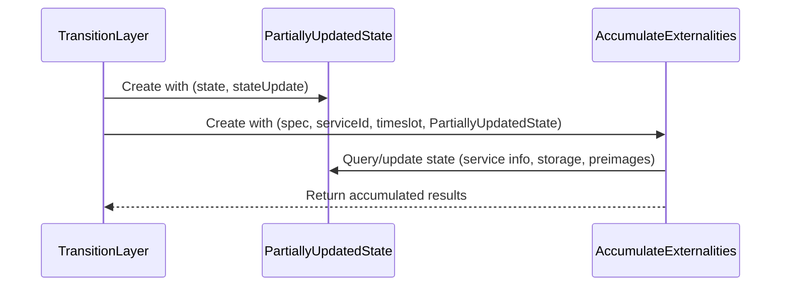

# Refactor `PartialStateDb`

## Pull Request by @tomusdrw

1. Split out operating on updated state (`PartiallyUpdatedState`).
2. Rename `PartialStateDb` to `AccumulateExternalities` since currently that's the only context they are used in.


## Comment by @coderabbitai[bot]

<!-- This is an auto-generated comment: summarize by coderabbit.ai -->
<!-- This is an auto-generated comment: skip review by coderabbit.ai -->

> [!IMPORTANT]
> ## Review skipped
> 
> Auto incremental reviews are disabled on this repository.
> 
> Please check the settings in the CodeRabbit UI or the `.coderabbit.yaml` file in this repository. To trigger a single review, invoke the `@coderabbitai review` command.
> 
> You can disable this status message by setting the `reviews.review_status` to `false` in the CodeRabbit configuration file.

<!-- end of auto-generated comment: skip review by coderabbit.ai -->
<!-- walkthrough_start -->

<details>
<summary>📝 Walkthrough</summary>

<!-- This is an auto-generated comment: release notes by coderabbit.ai -->

## Summary by CodeRabbit

* **Refactor**
  * Improved state management by introducing a new abstraction for handling state updates, resulting in more consistent and maintainable logic across the app.
  * Renamed and updated key classes and methods for clarity, with all features now operating through the new state update system.
  * Updated internal interfaces for service and transfer operations to align with the new state management approach.

* **Tests**
  * Refactored test suites to use the new state update abstraction, ensuring continued reliability of all tested features.

<!-- end of auto-generated comment: release notes by coderabbit.ai -->
## Walkthrough

The changes refactor the handling of state accumulation and externalities in the JAM host calls and transition layers. The core `PartialStateDb` class is replaced by `AccumulateExternalities`, which now operates on the new `PartiallyUpdatedState` abstraction. All state queries and updates are centralized through this abstraction, affecting instantiations and interfaces across tests and transition modules. Test code and type signatures are updated to align with these changes.

## Changes

| Cohort / File(s)                                                                                                                                           | Change Summary                                                                                                                                                                                                                                    |
|------------------------------------------------------------------------------------------------------------------------------------------------------------|--------------------------------------------------------------------------------------------------------------------------------------------------------------------------------------------------------------------------------------------------|
| **Test Refactor: Use AccumulateExternalities & PartiallyUpdatedState**<br> `packages/jam/jam-host-calls/externalities/accumulate-externalities.test.ts`    | Replaces all uses of `PartialStateDb` with `AccumulateExternalities`, updates mock state setup to use `PartiallyUpdatedState`, and adapts all tests to reference the new state and update properties. No logic or assertion changes.              |
| **AccumulateExternalities Refactor**<br> `packages/jam/jam-host-calls/externalities/accumulate-externalities.ts`                                           | Renames `PartialStateDb` to `AccumulateExternalities`. Refactors all state access and mutation to use the new `PartiallyUpdatedState` abstraction, removing manual update logic and centralizing state management. Updates method signatures.      |
| **Introduce PartiallyUpdatedState**<br> `packages/jam/jam-host-calls/externalities/state-update.ts`                                                        | Adds the `PartiallyUpdatedState` class to wrap state slices and accumulate updates with query and mutation methods. Provides unified state view and update methods for service info, storage, and preimages. Adds helper for preimage length.      |
| **Transition Layer: AccumulateExternalities Integration**<br> `packages/jam/transition/accumulate/accumulate.ts`,<br>`packages/jam/transition/accumulate/deferred-transfers.ts` | Updates transition logic to instantiate `AccumulateExternalities` with `PartiallyUpdatedState` instead of `PartialStateDb`. Adjusts construction and usage of externalities in accumulation and deferred transfer processing.                     |
| **Type Alignment for OnTransferHostCallExternalities**<br> `packages/jam/transition/accumulate/pvm-executor.ts`                                            | Updates the `OnTransferHostCallExternalities` type to replace `PartialStateDb` with a composite of account and storage interfaces, aligning with the new externalities abstraction.                                                               |

## Sequence Diagram(s)



## Estimated code review effort

🎯 4 (Complex) | ⏱️ ~40 minutes

## Poem

> In the warren where state updates grow,  
> A rabbit refactors the flow—  
> AccumulateExternalities now hops in,  
> With PartiallyUpdatedState to begin.  
> No more patchwork or manual sprawl,  
> Just one unified state for all!  
> 🐇✨

</details>

<!-- walkthrough_end -->
<!-- internal state start -->


<!-- DwQgtGAEAqAWCWBnSTIEMB26CuAXA9mAOYCmGJATmriQCaQDG+Ats2bgFyQAOFk+AIwBWJBrngA3EsgEBPRvlqU0AgfFwA6NPEgQAfACgjoCEYDEZyAAUASpETZWaCrKNwSPbABsvkCiQBHbGlcSHFcLzpIACIbEgAzNDF8PgADK2dxNC8AZVxqEgARAVToyAB3NGQHAWZ1Gno5MNgPbERKMJY22gpy9GRub19/IJDIDEcBDoBWACYABn4sXBbIADEvbHj42QAZFUQAelxZbhIpihc/Em58RHUU2Q0YVYZYTFJkeAwGTaUw8r4SDMbRYbDcWgFRBceLwCiIXAAGmaHni2B+4nwGGy6nk/i8BXoBH4Zyo4gwRCWkHBkIa9nyNEg7xkJDI9huzkJKAwxLQ4xIfSYzFu5B5jGykXo6Uy8AlsgAqhDCXkCqlnjlRFjaMiVh4SAAPJDkynSihZXIMoolJlVSBTNn+bFsIlA1IAQQYDEc3gKAFF9TQKNivOp4NJUp07SRcIHrvFImIULhkF7LuxqYg0KQFDyDUiKgg3ihkAbfm1JCQvPJyuoEMtVkkvcwfZisPh4pA85Rg6HpM93NY7NpmMhifBhRR8FIFP9fs5cegMPQUkRMPAAF7UeBYu3yRDcEMx76Upg/bvITD0R1oOoUhTCrHsUdAkG4Iu6uF+fCRZDMFIeRtsDJSsnheDxBh8a5RgRcUsCmSAJDDcoomoJkY24aFDkOIha2wAQNCFQ4Ni2HZ9gEI4TjOC4XEOCCvEOOZ5g0Ix9GMcAoDIZcOzQPBCFIchgPoIU2B5LheH4YRRHEKQZHkJglCoVR1C0HRWJMKA4FQVBMBwAhiDIZQ6WE9guCoPoHCcK4mnk5QlM0bRdDAQw2NMAxuCSABrLNpEOIQb18m8wFgO5cDABgJSOLsgxxcQfMA5sCRoMAop7WLEA0GgEQy6EDGiPKDAsSA3QASX0gSuQskErnbRh3gpaQ3FWTLQgcdRURSTsA27GKwwvT1vUS7csEqZB/ESZJ/Bda4DySADIO+BFMAYaR+A7XVIFNc0VRoYoIznRBkBrFYNo9JsWxIf1A1S3q1UgABhFJ/H3LVjyrHVVj/BgPPpAp2VwcEKltN4PiieJJ2YDNjw25rtpIAAKABKCNeX5PoWi8UlIDRDEho29yzVlHwFSVBpYcR5H3lCfx/qDC8NoyAm5UVWk6FhiMFvyM8KiobhuCh9bmp+mhnjdSCxsoMhlufFEeH8RD8DaYF8C+oWAKXJNkBpCrLQqCXqRJqJiTaDwVlQchzJ18oecxy8NY2xaaGZ1VZfwUkTn7BAUzq7M0G2KSL0gwXwvaPrJwO4FvHEA8PCURAGAoeB4IELxlY8xBkW+MtaH5kJkHiDreBIcdvKFxW3lEDzj2RQvi+zEZggRdOsZXaNjVlouQU+ZF2goRDlsYfwtyxZEJBxWkOtpPktcy5Fy6+25vmNbvKD71puCIKhY+RHiVhSDch6wUZgn1lmm94SR4EiUh6B71em9wKgMEQeJKCb2Qwy8bOKWrydEK/yka6d2kNvdWJARBiChrfeAUsPYeBTjhBgi56BVB7q2UaJAQTfGpD8b2URSw3FCPnPgaBITcDbsSda5tVZIM6ldHqK14otlxvtdKYEwi53GPgQUWJ7gInYFWEkhkPA7ndP1BKfourRUPDdbki0zwXnVptQmVYnak0tBGQQ4DkzIiOrAdAkEHZrxZv0VBQ10Ev0dAwKGqRDEaEMaokg7Mn40BIatPGMpsiww0NPVm6jngADkgTYwgVibI7CYLwOgfwPglBJx8DqrQEMd4Rr6MDHQZiRgCqWFFoGA+0t1pKDnGSMxbiDS3DNFEAueEQyIPYL2RALFICBNqiDaWZSUh0iqcnKJdSTiQEKQSYpPDdb+GBCQkgABuJYAig6KA8CksaSQCCTQyb6BExcjJzOuIhAUnZtgdK4AAWToPARwuV8oGAgGAIw7kvreSOH5ZgAVmBBRCmFCKhwUr0KOIwxKJBkqSOun2ZMHBznRCyUVUq/EhE30cFVeQNVgb1QaQYAcLD6YeItAUXagN0FOkNq6U6A0JF0OkeGGh6gUw8IftgCanC+iNgIXTJRTMDa0DZrIlxXF0AbVhjkGpjjYHclJdQhJSTKSIAQPEOkYMWD9LhFJARjKDpQz5AIKoHgbHqMjOWO8bBd60AUfQXgrtKBpSpKkHx7LtW20pfyPhUp7EG1uoczA8hs7+ETIY9AnppAhxoSCCYYSfFjIwPACCeSRkeH8DNZajQ5IRUjJLNAGFzr0H1cFQ1FqrVs27rSvRtpUikFwBqXu0CSDFQwPncmyIi3Rl2PgfAHlwQAAkjSPBrRtHxVh/C13hkjWtPjS2r0rdWgdNDLUGzyCkby5MPaoCRXXDBU4ojtCkFQXwgbsDBoNkySsmMM2KCNfKz1oRnBUHkIG8NTCeGzx4d+eAtIoYhsiYghaj7NU5r8Y1OB+AEHNz4NTBOJBEJ3igf3b4+cf4dxLg7NoICb7LJLpPelOZeE0B5AI42yBJ0s2tc7Q9WaOYkFcTVOoho7zqvaNQ22Ibz1oFkKwgcYqoY1UAfc3F9hxwHngLCKITR/B/lA5SPkXoERysIwB2qFcoYGiNFDdjnwaEeqkifX69H5CDElcA6aBI427i7WyrxzIe0wdIOTCdX6CjeINqZvtFnwo+FYTkccl9nBvXpDO7MPjj3gY8JBoEPnUPG0M3hjlhGvjOJI9yrdYSNP2B41Yu8VTJXHlWZcDqLG7y21PA/b8WMU59EE6CNDRp2DIgEHgGWiAFYUH7jVGlx0iE0fVkFs2XDGDsA3RuKIWDcPKhterO1WqCgOIjCat2oE7otHnvgReUMmB8xWrKiG/W1HWadSzJxfDSMdjW7452KmxBViFakE1f8SB2aARGSTGAOvrt471dkZb+5yb4VzFboWBsbe1WSFofAVg6XWt+R1fi2GpHfpWWgqRB0GwAGpj2oCkRAhRqBoBh19mgbo8DBQTpuVsABFYIwQMe232z2i+V9WYr3LYgG70ZM3IDu30EN5AHX20tGNl2bsnvEd25jg7NAIxHYiE8IwAB5ddEp3oeEXStRZdL1rouJEoK+v1vW0d3YG7yIlQgUNWPt/DQv0DkQfksoayJBNTihpNdEkIxQdVi74ENWWTxbNtROa3d5TzoclvILBGvfXh1ts2BkQ0MnmGyV4XJaDIwFNEIMyNNV2kVOXHwQY3Tak8nqY0u6BJw7XmdFwFlWKdrWkAEmEJ0xHnUut1MldPuTuLuZ8Z5zzXkIneU5z5gLvmHF+QUAFpL6nZVSJc+61KKC0uWVxog2Iaay9wbQUyNw9NRHxjeaMHQRs0C4HygVEZdEC6NyQLgDNzQqKM9qrB6LRFnT+bXqR9TR9QGOQamfc+gJGMJMX4tsMHGIAs2Z2uBpifg2gAG0iVxFWw/8DZkRICb0MAYDjEAAfcYIYAAXQjE+0Ny8U22dhyxmw8gXlzEQwKDHziCEzXwTlHkZAix/2jAcVoCu28m2jaE7VSGZH9HkwpGYPM3HVSBISYN7SAQcXYKHRp2WmnSoFIHlHEBDEzFbDEINjuiAkdBLQkIrSrXwHYJjVX3FwoDdFoGtS8xIFEKRjH0MKUDT101mnTQZyPR1WoxwO1Qiyk29VGGA2PR82RBIA0CIA0FrV/w0NHW0NjnJAPl32CPoFQImB8ARkiJexIFOgVh5BCMgBiKGAx1SDng8l4JIFYIAP4PrhCDyPYKIWLVKP4POw/UqKyMHloHYKtjaiUI3nGWHXLSUJZgRxDHHnhFR3yHYJyOINwE6IKGx13jxwPiJxIGCFGJoAp0Qip3ZQ0MKKyMh0/nJjH0rRFW9T40/k1jZUcM/Uv3wMUSs2FjwON2aw11ay10wB13YCMDWXEFfCiBsm2SQj2SIU4EgDbSIFgDBRYlcluS8hb0eTb2Cg70cy8Eih73r0OEMTAB8WylBTynBUKhKjKhhXsDhWcARQ7DlxRQHGzm2GFUnFoFpQYVRkYHzxwzP2UWJjC21UB1CCthTQUWiXgBwmDBQFYDwBUEiGoUQAFRoT5FDwFIAmr0Gh3Bqm9R83nRTFpJdgu1/HsKzWJA8PkE12MW9RQ3KAQEFJ9w/QTko3wGOmBwTm5LCRuKJFWDOCXGfQNlYQAGkSAtSjDQxhlM4/gT9Gk611DEiQjUguA4gQDqgNCfUmB0RQgAsDMcioZeNqsIzUArcpBtRUYsM2VkQOo3s24sELSuTvhrTLRmIoB/SpDvJgzIBQzgMZJPNpCPBR5NgVomhYR4RQh4y7xvCUQsBEgfAoZ1UVZ9dhFLSizfBbEx8OCqg8iIwycKjhDKyuBpsK4pNczJY1YrxoxazwIFylMjSFIByzS9EgtbY94rTxySzJzi0G0m1W120XAqzQygJQD1oU5bzuAmR7z8SeVFMSA71mA1Aw0uzDjfyfVY9bY+yvBBzvpiQzyxzVZkRXd5U/Y1C1NGRK4lxkA4Z0hf4P0siKCV0siHF9DLDUgEZSzIBYY0KPA6CBcKzSAIw4ZBDDhUyPBxMGzOweRPCEZYcWYZzIAmLeZOJ24+1qLEAeK6KND6LTC5CkAD5GKQ12KS42gS5D91UCQuYcjxKENJLAytCFLd0/NIyUiYytDyKLC90MYOhglWw8ZdySBdgyA3REB5QABmWYCMTMF+ARU8ddZMHlAANgABYwA1BQhIgKRzSgR3LQr1AUAOxdEsFH5SAMkBwqF0UEgX4IEpABE2AKAlMCzzzqFD9M5BN2Ad1T5t4fAuEoYPCnsQ9FBHtwpY8WS4wEw9dXhVD0x+9bLcs8whUnpQgGtVhYRBTisFpsE5d6B8EyFVz9R3IlxesHwzRpYHBeYOkURqMX5qBP90pMkIUclDISlhz+kE9ORY9k95qOlKl09qkels80pGlLC3ilSS8L8mSChgBoBaFOJkA99y1IAABeSiy0flctPQA/WsNDGlOlEPNUnKSAXQDaIIvS6tMIos1sBIkdaItAuIrG8tZI6MtIjInwUfRGss3/JDczPzYqJfSiqI5EDyN03fKmkgV02QeIyAAAIVkEyi5pTgEHSNxq8DJqRqnMQFKJprpvaOWlpsQqqFgFP3spbQVs5oEEbUiEwFFopujElqiPxtlvTOZEVusGVtVq4B5r5oFqFtiJFoMHJuRvrUbWbW4DbXYtkDhlTDUOgHHGkBTh+J9rYH5TNOXkDOloZptElSVrMxIBVslWRAiqIBWC4HlGCs5pvJdrduWVkGKhoAhhJrtodv22krhiloNorXTKZtkBZpMPZpHmyGCAtt5ukH5sEBtqGE5okDm2h3trFu7XsrhnNgcRTts3ss7u7u1t0tXmktkMvjksULLvprDozjzuhEgAAG9+B114wuEuB1bvwSMMApkmzG7IA3LZhIAABfCrZutezeldCgHe8oPejWw+4+huk/M+4Kq+0OkdLQ8uwm1IsykM6QSOYAcXZ05EaIBaEiaBMMMUbGQ1aICG3uss8Q1G7QxemWiu5Ec2EIgBz0EykI8ex9UfCwowqIdGTGGy3GM7eyxyjAZy8+uGRO5Or+oKzm8+9u0mp49ZV4oSLZOWT4zKg5X4rkgEtEoE65NyTye5VvM3J+T0jAPvKUgoFRu/azEFQEjEqFAyQSHEyyb8wkn9Xk8pIavbekzxS0HFBZFfWwioKG2/YlGgB/IFBvT7PkEkixdMP8CkyIZ4B6NMZ6B0ikDzfMg3bgCQZgeAv5StLu5qoaenA1GXTlTALIWymqEvWGGx20XQ+x6yQeNuHSJxqAi6OEp/VJs8IVH3GG6fZwIgRwJ8FpeqOmvnbldyFVO8VIU2dKQxWcxRb4QYEtTnZ1E9RVWQbeakt6xk77Y3Nk3maxHpuxQbKUQZvAJA52VADp9oZBUcVYdoU8ZBfKxpnkHS9aQueWNoARbZqIVINZ4Z0bUZ+pk51k3J5dNMhUpWEkp7YKPoc5zFahBdCfKfFCdWbXa+fpICKGKwOHQ5SM5x3Gb4eJg+Web2fmVYL5evUxyIXXA+GhdaOU3dAkWQSgNLfajE6PI64ZE6gZc6kpS6sxm6zwTPTi8IXqRpZpQkuPfZrkj/J6UpK61PaJZlmpVl+pKNMZJQVZPhrkd4oR3ZERs0LgP4iRi5K5G5WRsE/yBR+4VsdR5xkgQ4JQCxSaMAHVixdKLRyRnRrE/RyqPEtxYx1FVYbjDazJyx0vK0A/N52Nfjf3Za/yzJmJklOvCpsnD1962ZwVSAAAdVrHCc1UKASFiToGgEfmflfj2lpIAHIcMdWlGknM0UmOY0nZQMm1o7SAXdicz9RRA8B+Z02LXOMpqsZwYB4SMimMVGZPWcUS2uZiR44O3VUsASma9ym0pttOZlpPmqE+3+55nmUI2Zn1tjdvhQwcR1wohD8lcuqxRbE2EanJ9Ybjndc84Op/nu3qFxr6w2KN8BLgYA8zgrFYQEnh5ntV5IBipCgm5bYXi/azTyKXgF1cEvnHsVp1pMXxW+qAwMwogKSTTKQIPa2vRy2lgzXG2OhX1Lc7GktEO7ShGFYBgq2dZJ4qN5koadIer/lIPzV5mbZJw7cfzMVMy8NVYMkKWY9jqgR48ikk8OwU9OlbqWXel2Wx9OXcFDo9YQR/gTr7hZ8dr+WGXrrrCM9RWROVpwnUAvHmJJHLlgTNWfJwT829WqPaIomAU63lkUTtHsldHyo6R7XqoCSJOTHXWzQ3EBZThNUPXsnrRPskOh9zVfHvB5k3nKDaAAnHppARR/4PNPOzhTrYQw1bLmtUhxcMA03MAM2KAW0Qo7oJRXHvlvWvYQZ40bDcOZYztMUOUJszV5BKJUQ22snrHrQUYhRbhdWTYvP7xALrFAHkwgza1+vEAM7wQsjhuY2E4hcdLb8TLEA4gSFbpNJfxGq+M9m9R5qpI8Fx3edcxH7ZopNgcMB0OsuLEmQQpxRIIxVX4qreWEzWSoaCW732u7g2owhuvjZpqYSBR/t2o+AjKaPdudtuVzmCOrn5BPuu2toWvkYvOI8DrKWhkXzuPVhaWkfkAlOhWuk1OHrRONJuu5O+Wv8Ghi90vMun4LFcuER8ufBCv68nFAxxoSBc33Fu2avJxJtmmIXsCfOYfIxZvozEA0iAAyIqQhwX0bj80XibqbjwaX8Xnkeb6LJxJvUEwz7V9NpR/V0pszl5A0SzlIEfXhl42VwRkDYR/ZJVyAY5bOM5XT1iAwdSTi7lHePiPR031gEyPwNAcyXEqyOSOZRSMKlSRyQwJ34SdQAAfUfUQEj/leQloEj8Wnc4d6d4AA5pgGBaBXKgrc/aAgqGB5g0+GAAr4hC/aAABGCvgATjQCCor9mACtoAz9ctcrT6CoCvmGr+r/+FT/YnvDqFwGj8NTj/N4FDoEj+ErUn7+YAYG4Ej+g6H+T9CAd9SDX4MHXt7ugcUf+OTGiC4DAPQMRC38qCDGPEQH38gEP4MEvoMDX7Iad9n/n8X8n/Vn0CAA=== -->

<!-- internal state end -->
<!-- tips_start -->

---


<details>
<summary>🪧 Tips</summary>

### Chat

There are 3 ways to chat with [CodeRabbit](https://coderabbit.ai?utm_source=oss&utm_medium=github&utm_campaign=FluffyLabs/typeberry&utm_content=520):

- Review comments: Directly reply to a review comment made by CodeRabbit. Example:
  - `I pushed a fix in commit <commit_id>, please review it.`
  - `Explain this complex logic.`
  - `Open a follow-up GitHub issue for this discussion.`
- Files and specific lines of code (under the "Files changed" tab): Tag `@coderabbitai` in a new review comment at the desired location with your query. Examples:
  - `@coderabbitai explain this code block.`
  -	`@coderabbitai modularize this function.`
- PR comments: Tag `@coderabbitai` in a new PR comment to ask questions about the PR branch. For the best results, please provide a very specific query, as very limited context is provided in this mode. Examples:
  - `@coderabbitai gather interesting stats about this repository and render them as a table. Additionally, render a pie chart showing the language distribution in the codebase.`
  - `@coderabbitai read src/utils.ts and explain its main purpose.`
  - `@coderabbitai read the files in the src/scheduler package and generate a class diagram using mermaid and a README in the markdown format.`
  - `@coderabbitai help me debug CodeRabbit configuration file.`

### Support

Need help? Create a ticket on our [support page](https://www.coderabbit.ai/contact-us/support) for assistance with any issues or questions.

Note: Be mindful of the bot's finite context window. It's strongly recommended to break down tasks such as reading entire modules into smaller chunks. For a focused discussion, use review comments to chat about specific files and their changes, instead of using the PR comments.

### CodeRabbit Commands (Invoked using PR comments)

- `@coderabbitai pause` to pause the reviews on a PR.
- `@coderabbitai resume` to resume the paused reviews.
- `@coderabbitai review` to trigger an incremental review. This is useful when automatic reviews are disabled for the repository.
- `@coderabbitai full review` to do a full review from scratch and review all the files again.
- `@coderabbitai summary` to regenerate the summary of the PR.
- `@coderabbitai generate sequence diagram` to generate a sequence diagram of the changes in this PR.
- `@coderabbitai resolve` resolve all the CodeRabbit review comments.
- `@coderabbitai configuration` to show the current CodeRabbit configuration for the repository.
- `@coderabbitai help` to get help.

### Other keywords and placeholders

- Add `@coderabbitai ignore` anywhere in the PR description to prevent this PR from being reviewed.
- Add `@coderabbitai summary` to generate the high-level summary at a specific location in the PR description.
- Add `@coderabbitai` anywhere in the PR title to generate the title automatically.

### Documentation and Community

- Visit our [Documentation](https://docs.coderabbit.ai) for detailed information on how to use CodeRabbit.
- Join our [Discord Community](http://discord.gg/coderabbit) to get help, request features, and share feedback.
- Follow us on [X/Twitter](https://twitter.com/coderabbitai) for updates and announcements.

</details>

<!-- tips_end -->


## Comment by @github-actions[bot]


<details>
<summary>View all</summary>

| File | Benchmark | Ops |  |
|------|-----------|-----|--|
| [collections/map-set.ts[0]](../blob/7dda8e59133b2b727c18213b305422223480f4ae//_work/typeberry-runner-2/typeberry/typeberry/benchmarks/collections/map-set.ts) | 2 gets + conditional set | 70008.89 ±0.15% | fastest ✅ |
| [collections/map-set.ts[1]](../blob/7dda8e59133b2b727c18213b305422223480f4ae//_work/typeberry-runner-2/typeberry/typeberry/benchmarks/collections/map-set.ts) | 1 get 1 set | 42742.89 ±0.05% | 38.95% slower |
| [codec/bigint.compare.ts[0]](../blob/7dda8e59133b2b727c18213b305422223480f4ae//_work/typeberry-runner-2/typeberry/typeberry/benchmarks/codec/bigint.compare.ts) | compare custom | 262596867.14 ±7.33% | fastest ✅ |
| [codec/bigint.compare.ts[1]](../blob/7dda8e59133b2b727c18213b305422223480f4ae//_work/typeberry-runner-2/typeberry/typeberry/benchmarks/codec/bigint.compare.ts) | compare bigint | 261442117.99 ±7.53% | 0.44% slower |
| [codec/bigint.decode.ts[0]](../blob/7dda8e59133b2b727c18213b305422223480f4ae//_work/typeberry-runner-2/typeberry/typeberry/benchmarks/codec/bigint.decode.ts) | decode custom | 214288038.15 ±3.82% | fastest ✅ |
| [codec/bigint.decode.ts[1]](../blob/7dda8e59133b2b727c18213b305422223480f4ae//_work/typeberry-runner-2/typeberry/typeberry/benchmarks/codec/bigint.decode.ts) | decode bigint | 109664808.62 ±2.56% | 48.82% slower |
| [bytes/hex-from.ts[0]](../blob/7dda8e59133b2b727c18213b305422223480f4ae//_work/typeberry-runner-2/typeberry/typeberry/benchmarks/bytes/hex-from.ts) | parse hex using `Number` with NaN checking | 136319.78 ±0.19% | 84.5% slower |
| [bytes/hex-from.ts[1]](../blob/7dda8e59133b2b727c18213b305422223480f4ae//_work/typeberry-runner-2/typeberry/typeberry/benchmarks/bytes/hex-from.ts) | parse hex from char codes | 879523.57 ±0.11% | fastest ✅ |
| [bytes/hex-from.ts[2]](../blob/7dda8e59133b2b727c18213b305422223480f4ae//_work/typeberry-runner-2/typeberry/typeberry/benchmarks/bytes/hex-from.ts) | parse hex from string nibbles | 521671.13 ±0.68% | 40.69% slower |
| [bytes/hex-to.ts[0]](../blob/7dda8e59133b2b727c18213b305422223480f4ae//_work/typeberry-runner-2/typeberry/typeberry/benchmarks/bytes/hex-to.ts) | number toString + padding | 320981.89 ±0.21% | fastest ✅ |
| [bytes/hex-to.ts[1]](../blob/7dda8e59133b2b727c18213b305422223480f4ae//_work/typeberry-runner-2/typeberry/typeberry/benchmarks/bytes/hex-to.ts) | manual | 16598.79 ±0.17% | 94.83% slower |
| [codec/encoding.ts[0]](../blob/7dda8e59133b2b727c18213b305422223480f4ae//_work/typeberry-runner-2/typeberry/typeberry/benchmarks/codec/encoding.ts) | manual encode | 3168143.68 ±0.16% | 17.68% slower |
| [codec/encoding.ts[1]](../blob/7dda8e59133b2b727c18213b305422223480f4ae//_work/typeberry-runner-2/typeberry/typeberry/benchmarks/codec/encoding.ts) | int32array encode | 3728099.99 ±0.67% | 3.13% slower |
| [codec/encoding.ts[2]](../blob/7dda8e59133b2b727c18213b305422223480f4ae//_work/typeberry-runner-2/typeberry/typeberry/benchmarks/codec/encoding.ts) | dataview encode | 3848405.84 ±0.19% | fastest ✅ |
| [codec/decoding.ts[0]](../blob/7dda8e59133b2b727c18213b305422223480f4ae//_work/typeberry-runner-2/typeberry/typeberry/benchmarks/codec/decoding.ts) | manual decode | 24101144.45 ±0.46% | 87.9% slower |
| [codec/decoding.ts[1]](../blob/7dda8e59133b2b727c18213b305422223480f4ae//_work/typeberry-runner-2/typeberry/typeberry/benchmarks/codec/decoding.ts) | int32array decode | 199164691.36 ±4.93% | fastest ✅ |
| [codec/decoding.ts[2]](../blob/7dda8e59133b2b727c18213b305422223480f4ae//_work/typeberry-runner-2/typeberry/typeberry/benchmarks/codec/decoding.ts) | dataview decode | 196273527.8 ±4.31% | 1.45% slower |
| [math/count-bits-u64.ts[0]](../blob/7dda8e59133b2b727c18213b305422223480f4ae//_work/typeberry-runner-2/typeberry/typeberry/benchmarks/math/count-bits-u64.ts) | standard method | 9289330.27 ±0.23% | 90.35% slower |
| [math/count-bits-u64.ts[1]](../blob/7dda8e59133b2b727c18213b305422223480f4ae//_work/typeberry-runner-2/typeberry/typeberry/benchmarks/math/count-bits-u64.ts) | magic | 96302474.66 ±1.57% | fastest ✅ |
| [hash/index.ts[0]](../blob/7dda8e59133b2b727c18213b305422223480f4ae//_work/typeberry-runner-2/typeberry/typeberry/benchmarks/hash/index.ts) | hash with numeric representation | 185.91 ±0.69% | 26.98% slower |
| [hash/index.ts[1]](../blob/7dda8e59133b2b727c18213b305422223480f4ae//_work/typeberry-runner-2/typeberry/typeberry/benchmarks/hash/index.ts) | hash with string representation | 115.23 ±0.39% | 54.74% slower |
| [hash/index.ts[2]](../blob/7dda8e59133b2b727c18213b305422223480f4ae//_work/typeberry-runner-2/typeberry/typeberry/benchmarks/hash/index.ts) | hash with symbol representation | 180.83 ±0.2% | 28.97% slower |
| [hash/index.ts[3]](../blob/7dda8e59133b2b727c18213b305422223480f4ae//_work/typeberry-runner-2/typeberry/typeberry/benchmarks/hash/index.ts) | hash with uint8 representation | 157.2 ±0.46% | 38.25% slower |
| [hash/index.ts[4]](../blob/7dda8e59133b2b727c18213b305422223480f4ae//_work/typeberry-runner-2/typeberry/typeberry/benchmarks/hash/index.ts) | hash with packed representation | 254.59 ±0.43% | fastest ✅ |
| [hash/index.ts[5]](../blob/7dda8e59133b2b727c18213b305422223480f4ae//_work/typeberry-runner-2/typeberry/typeberry/benchmarks/hash/index.ts) | hash with bigint representation | 189.38 ±1.05% | 25.61% slower |
| [hash/index.ts[6]](../blob/7dda8e59133b2b727c18213b305422223480f4ae//_work/typeberry-runner-2/typeberry/typeberry/benchmarks/hash/index.ts) | hash with uint32 representation | 204.44 ±0.32% | 19.7% slower |
| [logger/index.ts[0]](../blob/7dda8e59133b2b727c18213b305422223480f4ae//_work/typeberry-runner-2/typeberry/typeberry/benchmarks/logger/index.ts) | console.log with string concat | 8366699.42 ±51.82% | fastest ✅ |
| [logger/index.ts[1]](../blob/7dda8e59133b2b727c18213b305422223480f4ae//_work/typeberry-runner-2/typeberry/typeberry/benchmarks/logger/index.ts) | console.log with args | 827580.15 ±102.77% | 90.11% slower |
| [math/add_one_overflow.ts[0]](../blob/7dda8e59133b2b727c18213b305422223480f4ae//_work/typeberry-runner-2/typeberry/typeberry/benchmarks/math/add_one_overflow.ts) | add and take modulus | 228506447 ±31.25% | 16.04% slower |
| [math/add_one_overflow.ts[1]](../blob/7dda8e59133b2b727c18213b305422223480f4ae//_work/typeberry-runner-2/typeberry/typeberry/benchmarks/math/add_one_overflow.ts) | condition before calculation | 272168322.66 ±6.19% | fastest ✅ |
| [math/switch.ts[0]](../blob/7dda8e59133b2b727c18213b305422223480f4ae//_work/typeberry-runner-2/typeberry/typeberry/benchmarks/math/switch.ts) | switch | 269275386.27 ±4.47% | 1.16% slower |
| [math/switch.ts[1]](../blob/7dda8e59133b2b727c18213b305422223480f4ae//_work/typeberry-runner-2/typeberry/typeberry/benchmarks/math/switch.ts) | if | 272439892.07 ±5.29% | fastest ✅ |
| [math/count-bits-u32.ts[0]](../blob/7dda8e59133b2b727c18213b305422223480f4ae//_work/typeberry-runner-2/typeberry/typeberry/benchmarks/math/count-bits-u32.ts) | standard method | 93313662.82 ±1.68% | 62.6% slower |
| [math/count-bits-u32.ts[1]](../blob/7dda8e59133b2b727c18213b305422223480f4ae//_work/typeberry-runner-2/typeberry/typeberry/benchmarks/math/count-bits-u32.ts) | magic | 249496691.89 ±5.76% | fastest ✅ |
| [math/mul_overflow.ts[0]](../blob/7dda8e59133b2b727c18213b305422223480f4ae//_work/typeberry-runner-2/typeberry/typeberry/benchmarks/math/mul_overflow.ts) | multiply and bring back to u32 | 257283569.78 ±7.47% | 1.15% slower |
| [math/mul_overflow.ts[1]](../blob/7dda8e59133b2b727c18213b305422223480f4ae//_work/typeberry-runner-2/typeberry/typeberry/benchmarks/math/mul_overflow.ts) | multiply and take modulus | 260265813.95 ±5.72% | fastest ✅ |
| [codec/view_vs_object.ts[0]](../blob/7dda8e59133b2b727c18213b305422223480f4ae//_work/typeberry-runner-2/typeberry/typeberry/benchmarks/codec/view_vs_object.ts) | Get the first field from Decoded | 471309.74 ±0.24% | 0.09% slower |
| [codec/view_vs_object.ts[1]](../blob/7dda8e59133b2b727c18213b305422223480f4ae//_work/typeberry-runner-2/typeberry/typeberry/benchmarks/codec/view_vs_object.ts) | Get the first field from View | 107546.29 ±0.11% | 77.2% slower |
| [codec/view_vs_object.ts[2]](../blob/7dda8e59133b2b727c18213b305422223480f4ae//_work/typeberry-runner-2/typeberry/typeberry/benchmarks/codec/view_vs_object.ts) | Get the first field as view from View | 107402.04 ±0.12% | 77.23% slower |
| [codec/view_vs_object.ts[3]](../blob/7dda8e59133b2b727c18213b305422223480f4ae//_work/typeberry-runner-2/typeberry/typeberry/benchmarks/codec/view_vs_object.ts) | Get two fields from Decoded | 430424.82 ±2.88% | 8.76% slower |
| [codec/view_vs_object.ts[4]](../blob/7dda8e59133b2b727c18213b305422223480f4ae//_work/typeberry-runner-2/typeberry/typeberry/benchmarks/codec/view_vs_object.ts) | Get two fields from View | 77502.69 ±2.45% | 83.57% slower |
| [codec/view_vs_object.ts[5]](../blob/7dda8e59133b2b727c18213b305422223480f4ae//_work/typeberry-runner-2/typeberry/typeberry/benchmarks/codec/view_vs_object.ts) | Get two fields from materialized from View | 178645.61 ±0.21% | 62.13% slower |
| [codec/view_vs_object.ts[6]](../blob/7dda8e59133b2b727c18213b305422223480f4ae//_work/typeberry-runner-2/typeberry/typeberry/benchmarks/codec/view_vs_object.ts) | Get two fields as views from View | 85352.14 ±0.17% | 81.91% slower |
| [codec/view_vs_object.ts[7]](../blob/7dda8e59133b2b727c18213b305422223480f4ae//_work/typeberry-runner-2/typeberry/typeberry/benchmarks/codec/view_vs_object.ts) | Get only third field from Decoded | 471748.86 ±0.24% | fastest ✅ |
| [codec/view_vs_object.ts[8]](../blob/7dda8e59133b2b727c18213b305422223480f4ae//_work/typeberry-runner-2/typeberry/typeberry/benchmarks/codec/view_vs_object.ts) | Get only third field from View | 97643.59 ±2.08% | 79.3% slower |
| [codec/view_vs_object.ts[9]](../blob/7dda8e59133b2b727c18213b305422223480f4ae//_work/typeberry-runner-2/typeberry/typeberry/benchmarks/codec/view_vs_object.ts) | Get only third field as view from View | 105942.53 ±0.93% | 77.54% slower |
| [codec/view_vs_collection.ts[0]](../blob/7dda8e59133b2b727c18213b305422223480f4ae//_work/typeberry-runner-2/typeberry/typeberry/benchmarks/codec/view_vs_collection.ts) | Get first element from Decoded | 28984.77 ±0.25% | 55.71% slower |
| [codec/view_vs_collection.ts[1]](../blob/7dda8e59133b2b727c18213b305422223480f4ae//_work/typeberry-runner-2/typeberry/typeberry/benchmarks/codec/view_vs_collection.ts) | Get first element from View | 65438.87 ±1.76% | fastest ✅ |
| [codec/view_vs_collection.ts[2]](../blob/7dda8e59133b2b727c18213b305422223480f4ae//_work/typeberry-runner-2/typeberry/typeberry/benchmarks/codec/view_vs_collection.ts) | Get 50th element from Decoded | 28608.29 ±0.46% | 56.28% slower |
| [codec/view_vs_collection.ts[3]](../blob/7dda8e59133b2b727c18213b305422223480f4ae//_work/typeberry-runner-2/typeberry/typeberry/benchmarks/codec/view_vs_collection.ts) | Get 50th element from View | 38296.15 ±0.93% | 41.48% slower |
| [codec/view_vs_collection.ts[4]](../blob/7dda8e59133b2b727c18213b305422223480f4ae//_work/typeberry-runner-2/typeberry/typeberry/benchmarks/codec/view_vs_collection.ts) | Get last element from Decoded | 28777.92 ±0.4% | 56.02% slower |
| [codec/view_vs_collection.ts[5]](../blob/7dda8e59133b2b727c18213b305422223480f4ae//_work/typeberry-runner-2/typeberry/typeberry/benchmarks/codec/view_vs_collection.ts) | Get last element from View | 27669.7 ±1.49% | 57.72% slower |
| [bytes/compare.ts[0]](../blob/7dda8e59133b2b727c18213b305422223480f4ae//_work/typeberry-runner-2/typeberry/typeberry/benchmarks/bytes/compare.ts) | Comparing Uint32 bytes | 20392.25 ±0.66% | 1.96% slower |
| [bytes/compare.ts[1]](../blob/7dda8e59133b2b727c18213b305422223480f4ae//_work/typeberry-runner-2/typeberry/typeberry/benchmarks/bytes/compare.ts) | Comparing raw bytes | 20800.14 ±1.06% | fastest ✅ |
| [hash/blake2b.ts[0]](../blob/7dda8e59133b2b727c18213b305422223480f4ae//_work/typeberry-runner-2/typeberry/typeberry/benchmarks/hash/blake2b.ts) | hasher with simple allocator | 0.05 ±0.64% | fastest ✅ |
| [hash/blake2b.ts[1]](../blob/7dda8e59133b2b727c18213b305422223480f4ae//_work/typeberry-runner-2/typeberry/typeberry/benchmarks/hash/blake2b.ts) | hasher with page allocator | 0.04 ±0.39% | 20% slower |
| [collections/map_vs_sorted.ts[0]](../blob/7dda8e59133b2b727c18213b305422223480f4ae//_work/typeberry-runner-2/typeberry/typeberry/benchmarks/collections/map_vs_sorted.ts) | Map | 311524.49 ±0.22% | fastest ✅ |
| [collections/map_vs_sorted.ts[1]](../blob/7dda8e59133b2b727c18213b305422223480f4ae//_work/typeberry-runner-2/typeberry/typeberry/benchmarks/collections/map_vs_sorted.ts) | Map-array | 103527.8 ±0.03% | 66.77% slower |
| [collections/map_vs_sorted.ts[2]](../blob/7dda8e59133b2b727c18213b305422223480f4ae//_work/typeberry-runner-2/typeberry/typeberry/benchmarks/collections/map_vs_sorted.ts) | Array | 73573.72 ±0.13% | 76.38% slower |
| [collections/map_vs_sorted.ts[3]](../blob/7dda8e59133b2b727c18213b305422223480f4ae//_work/typeberry-runner-2/typeberry/typeberry/benchmarks/collections/map_vs_sorted.ts) | SortedArray | 198415.35 ±0.18% | 36.31% slower |
| [crypto/ed25519.ts[0]](../blob/7dda8e59133b2b727c18213b305422223480f4ae//_work/typeberry-runner-2/typeberry/typeberry/benchmarks/crypto/ed25519.ts) | native crypto | 7.46 ±9.56% | 75.15% slower |
| [crypto/ed25519.ts[1]](../blob/7dda8e59133b2b727c18213b305422223480f4ae//_work/typeberry-runner-2/typeberry/typeberry/benchmarks/crypto/ed25519.ts) | wasm lib | 10.65 ±0.02% | 64.52% slower |
| [crypto/ed25519.ts[2]](../blob/7dda8e59133b2b727c18213b305422223480f4ae//_work/typeberry-runner-2/typeberry/typeberry/benchmarks/crypto/ed25519.ts) | wasm lib batch | 30.02 ±0.48% | fastest ✅ |
</details>


### Benchmarks summary: 63/63 OK ✅

<!-- thollander/actions-comment-pull-request "benchmarks" -->


## Comment by @coderabbitai[bot]

_⚠️ Potential issue_

**Use `updatedState.getServiceInfo()` to handle newly created services.**

The current implementation checks the base state directly, which won't find newly created services. The TODO comment correctly identifies this issue.


```diff
     // we need to explicitly check if service exists, since it's a different error.
-    // TODO [ToDr] what about newly created services?
-    const service = serviceId === null ? null : this.updatedState.state.getService(serviceId);
+    const service = this.getServiceInfo(serviceId);
     if (service === null || serviceId === null) {
       return Result.error(ProvidePreimageError.ServiceNotFound);
     }
```


> Committable suggestion skipped: line range outside the PR's diff.

<details>
<summary>🤖 Prompt for AI Agents</summary>

```
In packages/jam/jam-host-calls/externalities/accumulate-externalities.ts around
lines 488 to 492, the code checks for service existence using
this.updatedState.state.getService(serviceId), which misses newly created
services. Replace this call with this.updatedState.getServiceInfo(serviceId) to
correctly handle both existing and newly created services, ensuring the service
lookup is accurate before returning the error.
```

</details>

<!-- fingerprinting:phantom:medusa:lion -->

<!-- This is an auto-generated comment by CodeRabbit -->


## Comment by @coderabbitai[bot]

_⚠️ Potential issue_

**Critical: Address TODO about provide/remove sequence handling.**

The `getLookupHistory` method has a TODO indicating potential issues when both `provide` and `remove` operations exist for the same preimage within a single state update. Using `findLast` may not correctly handle the chronological order of operations.


This could lead to incorrect state representation. Consider:
1. Maintaining operation order explicitly
2. Processing operations sequentially to build the final state
3. Adding validation to prevent conflicting operations in the same update

<details>
<summary>🤖 Prompt for AI Agents</summary>

```
In packages/jam/jam-host-calls/externalities/state-update.ts between lines 191
and 236, the current use of findLast to get the updated preimage does not
correctly handle cases where both provide and remove actions occur for the same
preimage within one state update, potentially causing incorrect state
representation. To fix this, refactor the method to process all relevant
preimage updates sequentially in their original order, applying each action to
build the final state accurately. Additionally, add validation logic to detect
and handle conflicting operations within the same update to ensure consistent
and correct lookup history results.
```

</details>

<!-- fingerprinting:phantom:medusa:lion -->

<!-- This is an auto-generated comment by CodeRabbit -->
