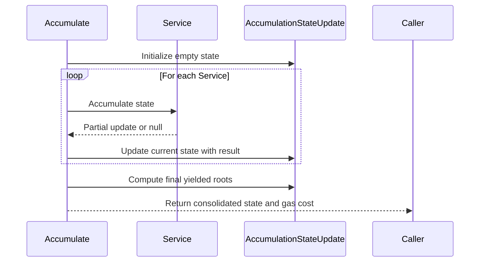
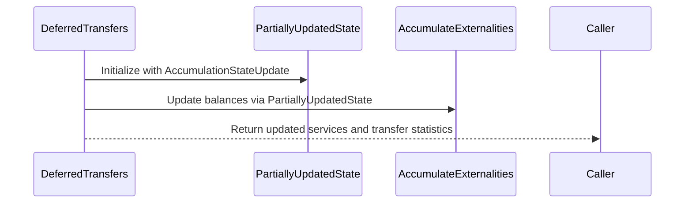

# Ordered accumulation tests

## Pull Request by @mateuszsikora

I've updated the accumulation logic to be fully sequential, and the ordered accumulation tests are now passing. In the future, we can build a dependency graph to make it parallel again.

There is still one failing test, but it seems the issue is in the reports logic (not in the accumulation itself), so I plan to address it in a separate PR.


## Comment by @coderabbitai[bot]

<!-- This is an auto-generated comment: summarize by coderabbit.ai -->
<!-- This is an auto-generated comment: skip review by coderabbit.ai -->

> [!IMPORTANT]
> ## Review skipped
> 
> Auto incremental reviews are disabled on this repository.
> 
> Please check the settings in the CodeRabbit UI or the `.coderabbit.yaml` file in this repository. To trigger a single review, invoke the `@coderabbitai review` command.
> 
> You can disable this status message by setting the `reviews.review_status` to `false` in the CodeRabbit configuration file.

<!-- end of auto-generated comment: skip review by coderabbit.ai -->
<!-- walkthrough_start -->

<details>
<summary>📝 Walkthrough</summary>

<!-- This is an auto-generated comment: release notes by coderabbit.ai -->

## Summary by CodeRabbit

* **New Features**
  * Enhanced authorization checks for privileged operations, ensuring only designated services can perform sensitive updates.

* **Refactor**
  * Simplified and unified state accumulation and deferred transfer logic, reducing complexity and improving maintainability.
  * Consolidated service and privilege updates into single state objects for streamlined processing.

* **Bug Fixes**
  * Improved handling of service creation and updates to preserve correct service history and prevent duplicate entries.

* **Chores**
  * Updated test runner configuration to reduce the number of ignored test files.

<!-- end of auto-generated comment: release notes by coderabbit.ai -->
## Walkthrough

This set of changes refactors the accumulation and deferred transfer logic in the JAM transition system. The accumulation process now maintains a single, evolving state update instead of merging arrays of partial updates. Deferred transfers and state updates are similarly consolidated, with related methods and types adjusted to handle unified state objects. Authorization checks and logging are added to externalities, and the test runner's ignore list is simplified.

## Changes

| Cohort / File(s)                                                                                   | Change Summary |
|----------------------------------------------------------------------------------------------------|---------------|
| **Test Runner Ignore List**<br>`bin/test-runner/jamduna.ts`                                        | Removes multiple JSON files from the ignored list for state transition tests, leaving only `3_000.json` explicitly ignored. No logic changes. |
| **Externalities Authorization and Logging**<br>`packages/jam/jam-host-calls/externalities/accumulate-externalities.ts` | Adds logger and authorization checks to update methods, ensuring only privileged services can perform updates. Modifies `yield` to store yielded roots in a map keyed by service ID. Minor whitespace adjustment. |
| **State Update Refactor**<br>`packages/jam/jam-host-calls/externalities/state-update.ts`           | Replaces single yielded root with a map of yielded roots per service. Updates copy logic, extends state slice, and improves service info update logic. Adds method for retrieving potentially updated privileged services. |
| **Accumulation Refactor**<br>`packages/jam/transition/accumulate/accumulate.ts`                    | Refactors accumulation to use a single evolving state update instead of merging arrays of partial updates. Removes merging logic and updates yielded root handling. Adjusts result types and simplifies control flow. |
| **Deferred Transfers Refactor**<br>`packages/jam/transition/accumulate/deferred-transfers.ts`      | Refactors to consolidate service and preimage updates into a single partially updated state. Removes separate tracking arrays and redundant merging logic. Updates types and constructor parameters accordingly. |
| **Chain STF Integration Update**<br>`packages/jam/transition/chain-stf.ts`                         | Updates integration with deferred transfers to use consolidated `servicesUpdate` objects. Removes manual merging of updates and simplifies result handling. |


## Sequence Diagram(s)





## Estimated code review effort

🎯 4 (Complex) | ⏱️ ~45 minutes

## Poem

> A bunny hops through code anew,  
> Where states combine, not split in two.  
> No merging mess, just one clear trail,  
> With roots for every service tale.  
> Transfers leap in tidy rows,  
> And privileged checks keep out the foes.  
> 🐇✨ The JAM now runs with streamlined flows!

</details>

<!-- walkthrough_end -->
<!-- internal state start -->


<!-- DwQgtGAEAqAWCWBnSTIEMB26CuAXA9mAOYCmGJATmriQCaQDG+Ats2bgFyQAOFk+AIwBWJBrngA3EsgEBPRvlqU0AgfFwA6NPEgQAfACgjoCEYDEZyAAUASpETZWaCrKNwSPbABsvkCiQBHbGlcSHFcLzpIACIAeQolf3o0BgZHb2p4fCwaRFxEaMgAdzRkBwFmdRp6OTDYD2xESkhmahJGgC9EeABrfCp0ZFtIDEcBZoBWACYATg0YepbtLAZYTFIUDFwKRWwGKPgchCG7VFxF5kV4ADN4Bkzs/mu6jxS05gzxR698Ijuw/CQcaQa7eLzyJpBdjwNBeeZwVBoWhCRq4NhbSBkBz+ZDnagvfgJShRN7pLwPHIhZAYfBFYr9HoKCj+MTg+GLNB4WD9Eb4XJ1fGHAmg3DYfwAGnQkCU3DISgwDHkRCo3FgCm8NQ8TAweQoe2qAMxGBUkR4zlhkV8pI+5K+WDQRGW8wAgrRaOossafLJJediX4SK1Dshsh5rtovIciGEQpKighVuhuLLnLjAcD/LaogQCf5uP18pAfn8GH5qPU+Hijq9UmSKUXfnd2a8uTy1sglAx4Ep6DmkbQcbjjihEA4PEK0PYSNxzTRPD4A1C8s3rHZ7lhgRJ4CQiiTQrBcLhuIgOAB6U9/c7YAQaJjMU8AMS82Gu11kABkVIhT7hZLLxsysintwYKntMcxGPoxjgFAcpPDgBDEGQygGne6KcDwfCCCIYiSNIQLyEwiQqGomjaLoYCGCYUAIsgiL2nghCkOQVCoSw6FcFQdIOE4LgEQoxGqOoWg6FB0GmAYagYD+IRgHqGAsaeQhoMwtDYMaGj5BwBjRLpBgWJAzoAJJISxbT0DxrR8fgzyrOs0huIsdkYBs/iXFIZQkFIVC+IgspdrcpYAFIAMqxAAciC8CRMg1w7MwBLwEQNJJEWSChOpiQEtE/SJHQ1qfJ6p55G0AD62yYN0doFNK8AsgQfFCn6MZ5H46ksQoGC3EQYoUvMVj+Fu+CNOCvqLElKVRJGrUkAAHtwkZdhE8iHAwz49lFMUxFMpUAAy7QA7BoQiINk0SStEO37XMJ1nRdV0AIwPcdp0YOdMQAMx7btz23W9F1fftH0vXdn3fRMIP/WD+1HX972YPQ0SA7tN2vdELrXDQlZOWsLkkJK2TgtD+2Q4UbnLMgc0LXc6hExN/QHEc+LuvV/SyPM4WAnyFYNiWhKdds+C+NcPx0oiXhY3QGhGOYljOhLKGemmBKduSrFK/BVMFlEPIgQIi1GuE26IEYnPkNLBgAKJ5PArRsUoAZbjumKvgWXDvrSOl6QYEBgEYM4MD0DrSEpKmh8wYDcnkYD3D435zVjXoeiHBVZmACeUEn4jSJpJ5e9E+lyyZzEoVElnOPINmMLjpAmwY7jV/ZdFbDsan7FKxakHwwa4Jg7fXDyzUAAbOrWNptJbs2J7CyeIEPjDkqO6AYMkboIdyFDwB09arKIPTN3U/gNNwtBtC0JDnIoJ6QEP2An20ABqM+nw1iAACLUGgQ+Srf980M6rZN7bztAARWCMEb+y96C/xfiQAakhookFILQEKlAtz7DnvMS2KQ1RsEvvQGkdJvI3GNigZ4zU0jMnYFOCg6CPBGTfksXAu8hweCpqIA0vAEGRGQTQuhfghYeAABQSGftQHkrRjRd0lJyc4SwpGUAJnwSRwc+A4n8uIKQ4IACU8wjLkJxnvEEEZEAyLCFQduxYRyYkqIeEkK8CR31gdYxAPR4DJiiLUfwooKAYCjJiZwbJDJug9NkC0PoCRD1kNuLwtB554O5PQEoyBLjuluNmQEeQGYEmiSQWJUQdh8kgO2NUE4ljcEgD0EgshPHyAoWKfwGImi0LuPQxhPcSBIngpOboLlTS8HwLKCgv4XQtEODyeM6hpABw8G5fAojfDJOlKGTYkSiibxoPEi+iSLYGXlljCkytmqq1nBrKuWthk6z4HrA20Js51ygJzRueMjmLG6MlagYp8LnPmtregutry3K2LPYo/pWhKGlrpAuPsJIByDrXcO4dI74GjrHLw8cp6Zxnvc4qvcaBgCcW0XO2koWF0MsXZCrEy6OCspXWyNcHL10WCPMehVsghTxSQAAqn/Eg881qlGQEs1JJCMkBgWikDwzVelEFNFEmJPYbD4D5PPAZQzfyQCEZgG+sQZxQgABKlFgPPHkowfDaOKOoNUk55V5MVcq/IqqdjqoiZMxMiIb4AFk0DcHnnFFgN9UEtP2EZOJhoh66rQAao1Q8VxDyYNwWQD54rzxKuIUsCTFDFFKJAQlBo3i5SjETHMCa6nDlaBUjpXSq49KLbMh1FsG5Dw5W0EKi0+VhD/B4JZGcV5itWutDwQ9ohcK3DwugQa6EFHnhOEJdpw3RFILgSdrToixqMEZasN8rDOHEOEnlsCUGcv5YvUxUp9aYEZJGcg2bkD9iiAPPgAqNkrS3UPJdK6Q1dXwFs/B6BMbNFuCvfxk58w0GBeEkYztmn8LzSQRtzK4OfpIJugev7Em3qNLjfYvZAS41oKaChpRu0VleFgOa6V/Ewdabm3l1iq5uIcUPAAwv4NosbICbrqKge4TRJTqHFeSDBBIKM2xcrR5xRQrVSnIHSFjbHNkSbPniDKTRWFQe4mgmjhwB5AjwJhaQaD8LNX6ElQ4sIGz4B6HfYp6U2ZjTIAGHxOoAkUCCbEP0FApN8ZQKEcMccgQpEZDmPMQn/E8n7CBrAQ8D3scqYcCyWn25wcGECEgj74NGGdBp8+f730XysHyaE+7eW0HgWOpBE6kvSHnks+9uHt27phN6WL1QW2bPZKgTN9BvFihc8PUdiDkHIbniCeKBJKGNNCGm4+zibi+cxLNdKiAADc/BPPefxgt3rvj1ND0G+OlB1XRv+oSiZzefwvT2E5RbJ53NmjFn+DybUgthai2ebXUF/hNiCzblLGWZL9mK2yK8jwJz1Yg81r8y5/zrmAv+Hc42kFrDOsoBq5yyCuC2vybQJVfIuCRujYgNUAAfEYYJ56ACTCG+uScd460pAb13BgDIdDZKQnwRDXE70DOlYp6b6j3eGyjA7XuW8t5zfOFwdvzKXvLL5FqKLQYunpGHFM2CW8tzkPH2wSNq23zMMrHrWSDIYANIJYl/toL0vEXy6jrgGOSvTwZ18di42uK2ga9gVrnXnrtlZvq1jpdhXwN7pa6V8rQ2qvBukEI7RXBI+HZG5AMnZqvAS4FUvIeO7hnNfBMbo9cWhRW8Djb2XSL7eO7js7zFrvVfu/V3Bn3UA/d/vecaHxs3zJY6Q9V1D+AhHUZDbQLgrPaCSlk/30f1XBfDS2P37RGf+fZ6ayVw9ovLdS4ReXu3KKHdouV1i+vIdG+a8dZqx7pZe0bRzPhuVrHOmKcY/QODiBtE6+gF29AkYc1wZH4GzlNtGjAAXmsDuB6BZ05Qug/Wq2iB50gGp2bUAPbUgFAKsHAMgLaGgIvmQ0KDJxHU3gq2G2OzgM32t23zDl30V2rxdyzgb05S9yJUdSMGtnEDtiiCIlmS8m3DpHS0fQwj93dEcHzkglhXIJDnLwqh1FCWklTjaFPDkJoGJREL2QpTMgNHLmsnpSbkcjBxuGeH8HDDEH6HU0UM9F5n+CamZUFzrEU0zxkHkDmS3HEwoSFkiFwkeARnPgoEu2jCrgSwQTUgsyHw8BmyU35DUk3nExnB8ktHQFZVtE9D0R1BoGrWeDMPEy8LYB8P8RtHEAWg8BiLD2uzPlfzGwDU6UTBCIcwEg8EISWEOF7mDClBlVNC8iFmcOjBZSF0SPZU5WN15xKgVGEXjQaXYA3wtRU2sT/ynChAg29H/SxgCSqOqwAHI70Ei+oFhUA8lbZzN+RmpeBuDhpkBGgPAa1mQ0BZAjkLFGQh4Ztjc54f5ad7U+QnioFJc5QoxoAqAdRrhKBRsmgYi2g2QjAQp/ISE0VZBtIP9mUc8LQ8kbDx47QbBpBvBcB55fxZReQGw8Y1EL4+s71Ljrj4IwjX9JQXiCkHUz1dYviXDfjEB/iKAZB9Na0+ktQWApIoh7jj1pYaJmVFCUMMB4SfA8l0Ms16iyi2TZUh1Jtxjj1FjmhKi1QQj4ieiKRJRGgQNq4958xGjjEfABAgsyECRVSdsXMh409U1OVwjMt+TCjBosgRp5BRNxBxMh5sjSBkNRdHjxTx9igExcFKBeE8j3FTRVSyjGiuYb0vDd5A4H0eQ1JqZ7g5xVSGAFMlZ+NkAnCohoRMx2ZYSh1BTUE5iw9wQ/SPjmogxospCqpPQKznAu8DQcwigGRLU5FpU60FBmAuToEZtBjUj/l0jiSQxnhX8+SFgPA79wtnhKSetqTrEMcH1xtpTTQ5yBEikhk+EaM+xyl4J1zClCwqkakagIRqtOM34JyG4gMLNDzikjVFyWAQIDRTsRMW5SEq5XCezDgy5OV1jIADyFyK0rzFhzSSRNj50cR0TeQxYFRB11M7xeySiaB/yQi70HFaymSOw6oOFQSoAuVRgmh6B9cCx0Lewu1sy8lzJDRmocz6BPT/FL90BvslBIhqgLZYhvILQaiXsdg3taQXF9dIx0lTyGithlgot6AZxRx/FH0SgEgWiuzEKfyLIbSUtWIeYqxvDfCWh0SwzCjV9fApSANrlzRRSrQIKkjJzIBHQNimB1I3TowvC01KMGBcRbj/FyYhR1IlzaALZZZDIFYId+tARjlRA1ZDkocDcDQAV9YEdgV7lkdP9sSV9YjETLLshUSHAJYyDS8KD7xayZCFCIKSBir1SlDz9fLyjmBtJIAb4h4h58gDA6qABvZquq5CsXWBa+AAbTH0lCROFx9N5QAF0eqRqVt2q6rbLmM99p8Y8ABxUoSajqgChVOgenXq/qyADnEgLnWAMaiaqangOkogH4yqLChPU686v4ygcalayAAAX3aoau1zqoIFqvqsapNlauOpmy4EGt6JF36N5QeumtKFmryHmroSWtW3auerqteuR1RPciiFHTPm6xvk9JN2q2Gu6sHxBu6q4D6r739MBopDxraEOvj0gCyvROAHJrtEppoAGuY2Yy5U9S5XfGdGgCMgilKkthsBsFiBsHgNfPsIFxKtyvhQkLDkKrtDKtsNKsFK1wtlYNtmos4Mdh4Jdn4K4H1SSlgBEJhT9gMC31loKoZKKsFNPCUCZKSDAEwoBOUNJVUNMlLgshpQrngiXLrgbjSQMPSxSFfkiTfnS0oCSBusZIBJPUFQ+PUGQEaqtrtArK8UDHmVyMwGwAs2nPEyrgjN5TIoMw1o2ClJHPjpSM6WIq2CQXVkyMa1zzX3Mg302A9Bng6CiCkzkUnFk0lvKs9GZo7W1F1H1GXIDUOMFW5LQoGJXCOKGmdKnGBLnG61ih5H+OYQQGiKK3mKJhmNVJ00BC8KOJLvwkbIDFRv9NC0lVEqhBcH8QnsboWL3ptK3BtUZpIEnhV1nnni8NSrLNkALw3xXCYsfXCKo3PKNPJGGOpAEpZlwvkDKOHhz3/sAYVI0uaC0skXcUKkyPI3mkWgE2cCoDpW3OS0LpXC1ppFxK7gUFFLEE8iXtCIamDltNinGzCN9sVLUXanvsWDmlEEYgoDWyrX9IE3NPU1M0uws3uOOwGLNFHEZkSgwGfLjTDvtroCjqwpbqxPHEpkxT7QawHWwAdn20IKjyOxj0wR2q4p8B4uyFexBHe1QG6GYGphEv4mHqFm7EyHEzJMLp+0PvsC7KKLzwQdK06v4GEA4UlF2MqA73AcYfMSCxnNIbIykv8BPtYZkQcScM8roEykwAyjowYvE0v38sByCsipzDCufUip+WiquU8DiqvwSqRw/y/xnhzSHjUYjo0YZK0YVJmJzCMZMYIO4UqwsanTXVWUi3nRzGHTYOkB+FwGmd/sXRwNgOlrLzluTqKhtrtt6doEdv6edsdQnOY2Xx6aoVoE0Zjs6hHuMNMqoDwWaB5Lix0Y+zHoSmzwwNF2wOXVgJTxiEWcQGWdIPDSucjpOeZJbuL3Nplx2cqmtpKttvDuueOYutOcwV9392gXlvrJ9subRahcxeZPniGcPtSGnFCBkcseN2htaUQDkZEdJOnFnCHWnsLq4GN2Q3GsgVpanRRvmToAZeHz5eyegWPtaFrm5d5QGhIBPr5dWRLxloRctqRYVv2eJboAxduuZNVvaZSshb6dJcQDppyttIayvvbgFcZceNldgV5ZGp/qYyySoFIHtcgB5eYdICVa7utSCfZJvk5dgVFekGZei3hcRXxeyEVuRNKoOfRadv1bOZYJtnYPoC1sdOdj4LdkgANqICNtJRNv9nELVZ/F2djbskODADyGuBdr0jdpLipU9t4hId9t0NtJaCuHSWQG5DpGHkTZJb1cQE0krYwArJ4wRNEvWR9W4F4YdOOIXr8jYz7NkfF0wkGTR1IV/qlel1513NaI5fXdgRNSibEE3ZdXmHBNEEhPCX40rrSPsCOKRH8VtYwTka8Mi3dL3drlTTZapVGgm0UDqIEukrU2XkiZwhpZasgA0Hg5DawOLulekC4EFPlZPuQEep/vUwWWCHgmHkQ6f2qQtldHdDtHvZVhCD1DEDFBSdorRIlmqpviHZNZHbHY1YJc4dfITgsUcuDZPbaFG1/rdeDl9MNF4+Du1KPYE7pY3bVTR3kFhGyGjH9ZvmTfa1cqsYbjnqdOQC1uxugVkxG3E9/tY5uehcQA5X6DE8LvniNMDgCdk6nWNw0CI5qw+PffDc11E9IEgQEH03OC62DKoxoErUoovsNhwtBKZUM0+bKCEpuDLSnIRmvT8IMTB21d7Es9WNSdYY8ZBy8ZfgXYSijMUqDa86ZY3ewg4Q+NyZcIuCzosxKfS/y7K+aldLffc+tJo8712TlkqeqhosWHBzqeeAuRirh2aai8Sp1yeU4eqZG/CtOUhx5Hb0+RxCir+X5huXiqNnwl3G+3BXHCOFQADshW9jEmoiNCHIQiYkpU1vYnYE4jQG4i9r4lqE4KoCEjIlEkogMGu7QnUFKm7EQFKmzd3FoFKhKmGQokMAB5gnQAAA4AA2B6KYe4GYa4I0j6N0KYWgB6a4KYXaCYAQBgCYV8A6A6D6GYCYNAJHh6FH3aNAA6I0uH8SKAIH3AEH2gMHiHugUqOCKCa75gBgbgUqF7BOaH3uWHsSJGtquq6IYMQ2/IaIYmka8Udq6IeSvxFyAodXgwZ6pGhHiAFoMXiX+xqXoXyiIAA=== -->

<!-- internal state end -->
<!-- tips_start -->

---


<details>
<summary>🪧 Tips</summary>

### Chat

There are 3 ways to chat with [CodeRabbit](https://coderabbit.ai?utm_source=oss&utm_medium=github&utm_campaign=FluffyLabs/typeberry&utm_content=529):

- Review comments: Directly reply to a review comment made by CodeRabbit. Example:
  - `I pushed a fix in commit <commit_id>, please review it.`
  - `Explain this complex logic.`
  - `Open a follow-up GitHub issue for this discussion.`
- Files and specific lines of code (under the "Files changed" tab): Tag `@coderabbitai` in a new review comment at the desired location with your query. Examples:
  - `@coderabbitai explain this code block.`
- PR comments: Tag `@coderabbitai` in a new PR comment to ask questions about the PR branch. For the best results, please provide a very specific query, as very limited context is provided in this mode. Examples:
  - `@coderabbitai gather interesting stats about this repository and render them as a table. Additionally, render a pie chart showing the language distribution in the codebase.`
  - `@coderabbitai read src/utils.ts and explain its main purpose.`
  - `@coderabbitai read the files in the src/scheduler package and generate a class diagram using mermaid and a README in the markdown format.`

### Support

Need help? Create a ticket on our [support page](https://www.coderabbit.ai/contact-us/support) for assistance with any issues or questions.

### CodeRabbit Commands (Invoked using PR comments)

- `@coderabbitai pause` to pause the reviews on a PR.
- `@coderabbitai resume` to resume the paused reviews.
- `@coderabbitai review` to trigger an incremental review. This is useful when automatic reviews are disabled for the repository.
- `@coderabbitai full review` to do a full review from scratch and review all the files again.
- `@coderabbitai summary` to regenerate the summary of the PR.
- `@coderabbitai generate sequence diagram` to generate a sequence diagram of the changes in this PR.
- `@coderabbitai resolve` resolve all the CodeRabbit review comments.
- `@coderabbitai configuration` to show the current CodeRabbit configuration for the repository.
- `@coderabbitai help` to get help.

### Other keywords and placeholders

- Add `@coderabbitai ignore` anywhere in the PR description to prevent this PR from being reviewed.
- Add `@coderabbitai summary` to generate the high-level summary at a specific location in the PR description.
- Add `@coderabbitai` anywhere in the PR title to generate the title automatically.

### Documentation and Community

- Visit our [Documentation](https://docs.coderabbit.ai) for detailed information on how to use CodeRabbit.
- Join our [Discord Community](http://discord.gg/coderabbit) to get help, request features, and share feedback.
- Follow us on [X/Twitter](https://twitter.com/coderabbitai) for updates and announcements.

</details>

<!-- tips_end -->


## Comment by @github-actions[bot]


<details>
<summary>View all</summary>

| File | Benchmark | Ops |  |
|------|-----------|-----|--|
| [bytes/hex-from.ts[0]](../blob/6b6abdce57e478d39481aaa3930ad6fc56f854d7//_work/typeberry-1/typeberry/typeberry/benchmarks/bytes/hex-from.ts) | parse hex using `Number` with NaN checking | 138846.39 ±0.94% | 84.53% slower |
| [bytes/hex-from.ts[1]](../blob/6b6abdce57e478d39481aaa3930ad6fc56f854d7//_work/typeberry-1/typeberry/typeberry/benchmarks/bytes/hex-from.ts) | parse hex from char codes | 897314.87 ±0.15% | fastest ✅ |
| [bytes/hex-from.ts[2]](../blob/6b6abdce57e478d39481aaa3930ad6fc56f854d7//_work/typeberry-1/typeberry/typeberry/benchmarks/bytes/hex-from.ts) | parse hex from string nibbles | 560830.39 ±0.23% | 37.5% slower |
| [bytes/hex-to.ts[0]](../blob/6b6abdce57e478d39481aaa3930ad6fc56f854d7//_work/typeberry-1/typeberry/typeberry/benchmarks/bytes/hex-to.ts) | number toString + padding | 329739.73 ±0.33% | fastest ✅ |
| [bytes/hex-to.ts[1]](../blob/6b6abdce57e478d39481aaa3930ad6fc56f854d7//_work/typeberry-1/typeberry/typeberry/benchmarks/bytes/hex-to.ts) | manual | 15917.22 ±0.62% | 95.17% slower |
| [codec/bigint.compare.ts[0]](../blob/6b6abdce57e478d39481aaa3930ad6fc56f854d7//_work/typeberry-1/typeberry/typeberry/benchmarks/codec/bigint.compare.ts) | compare custom | 260950787.52 ±6.02% | fastest ✅ |
| [codec/bigint.compare.ts[1]](../blob/6b6abdce57e478d39481aaa3930ad6fc56f854d7//_work/typeberry-1/typeberry/typeberry/benchmarks/codec/bigint.compare.ts) | compare bigint | 256415643.12 ±5.99% | 1.74% slower |
| [collections/map-set.ts[0]](../blob/6b6abdce57e478d39481aaa3930ad6fc56f854d7//_work/typeberry-1/typeberry/typeberry/benchmarks/collections/map-set.ts) | 2 gets + conditional set | 121545.97 ±0.11% | fastest ✅ |
| [collections/map-set.ts[1]](../blob/6b6abdce57e478d39481aaa3930ad6fc56f854d7//_work/typeberry-1/typeberry/typeberry/benchmarks/collections/map-set.ts) | 1 get 1 set | 60881.17 ±0.38% | 49.91% slower |
| [codec/bigint.decode.ts[0]](../blob/6b6abdce57e478d39481aaa3930ad6fc56f854d7//_work/typeberry-1/typeberry/typeberry/benchmarks/codec/bigint.decode.ts) | decode custom | 172811332.74 ±2.66% | fastest ✅ |
| [codec/bigint.decode.ts[1]](../blob/6b6abdce57e478d39481aaa3930ad6fc56f854d7//_work/typeberry-1/typeberry/typeberry/benchmarks/codec/bigint.decode.ts) | decode bigint | 107087033.35 ±2.59% | 38.03% slower |
| [math/add_one_overflow.ts[0]](../blob/6b6abdce57e478d39481aaa3930ad6fc56f854d7//_work/typeberry-1/typeberry/typeberry/benchmarks/math/add_one_overflow.ts) | add and take modulus | 250387118.37 ±7.37% | fastest ✅ |
| [math/add_one_overflow.ts[1]](../blob/6b6abdce57e478d39481aaa3930ad6fc56f854d7//_work/typeberry-1/typeberry/typeberry/benchmarks/math/add_one_overflow.ts) | condition before calculation | 246863232.26 ±6.07% | 1.41% slower |
| [math/count-bits-u32.ts[0]](../blob/6b6abdce57e478d39481aaa3930ad6fc56f854d7//_work/typeberry-1/typeberry/typeberry/benchmarks/math/count-bits-u32.ts) | standard method | 91119839.7 ±1.77% | 63.04% slower |
| [math/count-bits-u32.ts[1]](../blob/6b6abdce57e478d39481aaa3930ad6fc56f854d7//_work/typeberry-1/typeberry/typeberry/benchmarks/math/count-bits-u32.ts) | magic | 246515530.13 ±5.95% | fastest ✅ |
| [math/count-bits-u64.ts[0]](../blob/6b6abdce57e478d39481aaa3930ad6fc56f854d7//_work/typeberry-1/typeberry/typeberry/benchmarks/math/count-bits-u64.ts) | standard method | 1215179.14 ±0.41% | 90.23% slower |
| [math/count-bits-u64.ts[1]](../blob/6b6abdce57e478d39481aaa3930ad6fc56f854d7//_work/typeberry-1/typeberry/typeberry/benchmarks/math/count-bits-u64.ts) | magic | 12439832.13 ±0.5% | fastest ✅ |
| [hash/index.ts[0]](../blob/6b6abdce57e478d39481aaa3930ad6fc56f854d7//_work/typeberry-1/typeberry/typeberry/benchmarks/hash/index.ts) | hash with numeric representation | 192.6 ±0.17% | 26.02% slower |
| [hash/index.ts[1]](../blob/6b6abdce57e478d39481aaa3930ad6fc56f854d7//_work/typeberry-1/typeberry/typeberry/benchmarks/hash/index.ts) | hash with string representation | 117.45 ±0.52% | 54.88% slower |
| [hash/index.ts[2]](../blob/6b6abdce57e478d39481aaa3930ad6fc56f854d7//_work/typeberry-1/typeberry/typeberry/benchmarks/hash/index.ts) | hash with symbol representation | 178.88 ±0.54% | 31.29% slower |
| [hash/index.ts[3]](../blob/6b6abdce57e478d39481aaa3930ad6fc56f854d7//_work/typeberry-1/typeberry/typeberry/benchmarks/hash/index.ts) | hash with uint8 representation | 161.73 ±0.28% | 37.88% slower |
| [hash/index.ts[4]](../blob/6b6abdce57e478d39481aaa3930ad6fc56f854d7//_work/typeberry-1/typeberry/typeberry/benchmarks/hash/index.ts) | hash with packed representation | 260.33 ±0.28% | fastest ✅ |
| [hash/index.ts[5]](../blob/6b6abdce57e478d39481aaa3930ad6fc56f854d7//_work/typeberry-1/typeberry/typeberry/benchmarks/hash/index.ts) | hash with bigint representation | 187.02 ±0.41% | 28.16% slower |
| [hash/index.ts[6]](../blob/6b6abdce57e478d39481aaa3930ad6fc56f854d7//_work/typeberry-1/typeberry/typeberry/benchmarks/hash/index.ts) | hash with uint32 representation | 193.37 ±0.81% | 25.72% slower |
| [logger/index.ts[0]](../blob/6b6abdce57e478d39481aaa3930ad6fc56f854d7//_work/typeberry-1/typeberry/typeberry/benchmarks/logger/index.ts) | console.log with string concat | 6974850.68 ±59.8% | fastest ✅ |
| [logger/index.ts[1]](../blob/6b6abdce57e478d39481aaa3930ad6fc56f854d7//_work/typeberry-1/typeberry/typeberry/benchmarks/logger/index.ts) | console.log with args | 1012274.84 ±97.21% | 85.49% slower |
| [math/mul_overflow.ts[0]](../blob/6b6abdce57e478d39481aaa3930ad6fc56f854d7//_work/typeberry-1/typeberry/typeberry/benchmarks/math/mul_overflow.ts) | multiply and bring back to u32 | 227413942.52 ±25.63% | 13.55% slower |
| [math/mul_overflow.ts[1]](../blob/6b6abdce57e478d39481aaa3930ad6fc56f854d7//_work/typeberry-1/typeberry/typeberry/benchmarks/math/mul_overflow.ts) | multiply and take modulus | 263052655.79 ±5.48% | fastest ✅ |
| [math/switch.ts[0]](../blob/6b6abdce57e478d39481aaa3930ad6fc56f854d7//_work/typeberry-1/typeberry/typeberry/benchmarks/math/switch.ts) | switch | 262962189.63 ±6.06% | fastest ✅ |
| [math/switch.ts[1]](../blob/6b6abdce57e478d39481aaa3930ad6fc56f854d7//_work/typeberry-1/typeberry/typeberry/benchmarks/math/switch.ts) | if | 253935270.36 ±5.76% | 3.43% slower |
| [codec/decoding.ts[0]](../blob/6b6abdce57e478d39481aaa3930ad6fc56f854d7//_work/typeberry-1/typeberry/typeberry/benchmarks/codec/decoding.ts) | manual decode | 16502755.73 ±0.41% | 90.17% slower |
| [codec/decoding.ts[1]](../blob/6b6abdce57e478d39481aaa3930ad6fc56f854d7//_work/typeberry-1/typeberry/typeberry/benchmarks/codec/decoding.ts) | int32array decode | 163461031.95 ±2.79% | 2.67% slower |
| [codec/decoding.ts[2]](../blob/6b6abdce57e478d39481aaa3930ad6fc56f854d7//_work/typeberry-1/typeberry/typeberry/benchmarks/codec/decoding.ts) | dataview decode | 167952385.38 ±4.07% | fastest ✅ |
| [codec/encoding.ts[0]](../blob/6b6abdce57e478d39481aaa3930ad6fc56f854d7//_work/typeberry-1/typeberry/typeberry/benchmarks/codec/encoding.ts) | manual encode | 2436813.02 ±0.99% | 22.54% slower |
| [codec/encoding.ts[1]](../blob/6b6abdce57e478d39481aaa3930ad6fc56f854d7//_work/typeberry-1/typeberry/typeberry/benchmarks/codec/encoding.ts) | int32array encode | 3146100.78 ±0.33% | fastest ✅ |
| [codec/encoding.ts[2]](../blob/6b6abdce57e478d39481aaa3930ad6fc56f854d7//_work/typeberry-1/typeberry/typeberry/benchmarks/codec/encoding.ts) | dataview encode | 3066792.62 ±1.14% | 2.52% slower |
| [codec/view_vs_collection.ts[0]](../blob/6b6abdce57e478d39481aaa3930ad6fc56f854d7//_work/typeberry-1/typeberry/typeberry/benchmarks/codec/view_vs_collection.ts) | Get first element from Decoded | 27612.62 ±0.33% | 58.14% slower |
| [codec/view_vs_collection.ts[1]](../blob/6b6abdce57e478d39481aaa3930ad6fc56f854d7//_work/typeberry-1/typeberry/typeberry/benchmarks/codec/view_vs_collection.ts) | Get first element from View | 65958.49 ±1.39% | fastest ✅ |
| [codec/view_vs_collection.ts[2]](../blob/6b6abdce57e478d39481aaa3930ad6fc56f854d7//_work/typeberry-1/typeberry/typeberry/benchmarks/codec/view_vs_collection.ts) | Get 50th element from Decoded | 23981.91 ±2.4% | 63.64% slower |
| [codec/view_vs_collection.ts[3]](../blob/6b6abdce57e478d39481aaa3930ad6fc56f854d7//_work/typeberry-1/typeberry/typeberry/benchmarks/codec/view_vs_collection.ts) | Get 50th element from View | 31898.51 ±2.32% | 51.64% slower |
| [codec/view_vs_collection.ts[4]](../blob/6b6abdce57e478d39481aaa3930ad6fc56f854d7//_work/typeberry-1/typeberry/typeberry/benchmarks/codec/view_vs_collection.ts) | Get last element from Decoded | 25649.78 ±1.69% | 61.11% slower |
| [codec/view_vs_collection.ts[5]](../blob/6b6abdce57e478d39481aaa3930ad6fc56f854d7//_work/typeberry-1/typeberry/typeberry/benchmarks/codec/view_vs_collection.ts) | Get last element from View | 22999.27 ±2.17% | 65.13% slower |
| [codec/view_vs_object.ts[0]](../blob/6b6abdce57e478d39481aaa3930ad6fc56f854d7//_work/typeberry-1/typeberry/typeberry/benchmarks/codec/view_vs_object.ts) | Get the first field from Decoded | 393905.21 ±2.13% | 11.45% slower |
| [codec/view_vs_object.ts[1]](../blob/6b6abdce57e478d39481aaa3930ad6fc56f854d7//_work/typeberry-1/typeberry/typeberry/benchmarks/codec/view_vs_object.ts) | Get the first field from View | 102427.92 ±0.25% | 76.97% slower |
| [codec/view_vs_object.ts[2]](../blob/6b6abdce57e478d39481aaa3930ad6fc56f854d7//_work/typeberry-1/typeberry/typeberry/benchmarks/codec/view_vs_object.ts) | Get the first field as view from View | 101640.75 ±0.17% | 77.15% slower |
| [codec/view_vs_object.ts[3]](../blob/6b6abdce57e478d39481aaa3930ad6fc56f854d7//_work/typeberry-1/typeberry/typeberry/benchmarks/codec/view_vs_object.ts) | Get two fields from Decoded | 436991.91 ±0.75% | 1.77% slower |
| [codec/view_vs_object.ts[4]](../blob/6b6abdce57e478d39481aaa3930ad6fc56f854d7//_work/typeberry-1/typeberry/typeberry/benchmarks/codec/view_vs_object.ts) | Get two fields from View | 79835.04 ±0.92% | 82.05% slower |
| [codec/view_vs_object.ts[5]](../blob/6b6abdce57e478d39481aaa3930ad6fc56f854d7//_work/typeberry-1/typeberry/typeberry/benchmarks/codec/view_vs_object.ts) | Get two fields from materialized from View | 168963.11 ±0.96% | 62.02% slower |
| [codec/view_vs_object.ts[6]](../blob/6b6abdce57e478d39481aaa3930ad6fc56f854d7//_work/typeberry-1/typeberry/typeberry/benchmarks/codec/view_vs_object.ts) | Get two fields as views from View | 80813.57 ±1.14% | 81.83% slower |
| [codec/view_vs_object.ts[7]](../blob/6b6abdce57e478d39481aaa3930ad6fc56f854d7//_work/typeberry-1/typeberry/typeberry/benchmarks/codec/view_vs_object.ts) | Get only third field from Decoded | 444845.03 ±0.32% | fastest ✅ |
| [codec/view_vs_object.ts[8]](../blob/6b6abdce57e478d39481aaa3930ad6fc56f854d7//_work/typeberry-1/typeberry/typeberry/benchmarks/codec/view_vs_object.ts) | Get only third field from View | 101039.37 ±1.18% | 77.29% slower |
| [codec/view_vs_object.ts[9]](../blob/6b6abdce57e478d39481aaa3930ad6fc56f854d7//_work/typeberry-1/typeberry/typeberry/benchmarks/codec/view_vs_object.ts) | Get only third field as view from View | 97674.77 ±1.6% | 78.04% slower |
| [bytes/compare.ts[0]](../blob/6b6abdce57e478d39481aaa3930ad6fc56f854d7//_work/typeberry-1/typeberry/typeberry/benchmarks/bytes/compare.ts) | Comparing Uint32 bytes | 16574.96 ±4.21% | 24.3% slower |
| [bytes/compare.ts[1]](../blob/6b6abdce57e478d39481aaa3930ad6fc56f854d7//_work/typeberry-1/typeberry/typeberry/benchmarks/bytes/compare.ts) | Comparing raw bytes | 21895.72 ±0.2% | fastest ✅ |
| [hash/blake2b.ts[0]](../blob/6b6abdce57e478d39481aaa3930ad6fc56f854d7//_work/typeberry-1/typeberry/typeberry/benchmarks/hash/blake2b.ts) | hasher with simple allocator | 0.04534 ±0.82% | fastest ✅ |
| [hash/blake2b.ts[1]](../blob/6b6abdce57e478d39481aaa3930ad6fc56f854d7//_work/typeberry-1/typeberry/typeberry/benchmarks/hash/blake2b.ts) | hasher with page allocator | 0.04533 ±0.14% | 0.02% slower |
| [collections/map_vs_sorted.ts[0]](../blob/6b6abdce57e478d39481aaa3930ad6fc56f854d7//_work/typeberry-1/typeberry/typeberry/benchmarks/collections/map_vs_sorted.ts) | Map | 265315.45 ±0.04% | fastest ✅ |
| [collections/map_vs_sorted.ts[1]](../blob/6b6abdce57e478d39481aaa3930ad6fc56f854d7//_work/typeberry-1/typeberry/typeberry/benchmarks/collections/map_vs_sorted.ts) | Map-array | 103696.45 ±0.02% | 60.92% slower |
| [collections/map_vs_sorted.ts[2]](../blob/6b6abdce57e478d39481aaa3930ad6fc56f854d7//_work/typeberry-1/typeberry/typeberry/benchmarks/collections/map_vs_sorted.ts) | Array | 65556.77 ±1.45% | 75.29% slower |
| [collections/map_vs_sorted.ts[3]](../blob/6b6abdce57e478d39481aaa3930ad6fc56f854d7//_work/typeberry-1/typeberry/typeberry/benchmarks/collections/map_vs_sorted.ts) | SortedArray | 201915.23 ±0.27% | 23.9% slower |
| [crypto/ed25519.ts[0]](../blob/6b6abdce57e478d39481aaa3930ad6fc56f854d7//_work/typeberry-1/typeberry/typeberry/benchmarks/crypto/ed25519.ts) | native crypto | 5.35 ±19.04% | 82.03% slower |
| [crypto/ed25519.ts[1]](../blob/6b6abdce57e478d39481aaa3930ad6fc56f854d7//_work/typeberry-1/typeberry/typeberry/benchmarks/crypto/ed25519.ts) | wasm lib | 10.65 ±0.02% | 64.24% slower |
| [crypto/ed25519.ts[2]](../blob/6b6abdce57e478d39481aaa3930ad6fc56f854d7//_work/typeberry-1/typeberry/typeberry/benchmarks/crypto/ed25519.ts) | wasm lib batch | 29.78 ±0.6% | fastest ✅ |
</details>


### Benchmarks summary: 63/63 OK ✅

<!-- thollander/actions-comment-pull-request "benchmarks" -->


## Comment by @coderabbitai[bot]

_🛠️ Refactor suggestion_

**Consider returning a Result type to indicate authorization failures.**

The method now silently returns when the service is not authorized. This could lead to confusion as callers might expect the update to succeed. Consider changing the return type to `Result<OK, "unauthorized">` to make the failure explicit.

```diff
-  updateValidatorsData(validatorsData: PerValidator<ValidatorData>): void {
+  updateValidatorsData(validatorsData: PerValidator<ValidatorData>): Result<OK, "unauthorized"> {
     /** https://graypaper.fluffylabs.dev/#/9a08063/36e10136e901?v=0.6.6 */
     const validatorsManager = this.updatedState.getPotentiallyUpdatedPrivilegedServices().manager;
 
     if (validatorsManager !== this.currentServiceId) {
       logger.trace(
         `Current service id (${this.currentServiceId}) is not a validator manager and cannot update validators.`,
       );
-      return;
+      return Result.error("unauthorized");
     }
 
     this.updatedState.stateUpdate.validatorsData = validatorsData;
+    return Result.ok(OK);
   }
```


> Committable suggestion skipped: line range outside the PR's diff.

<details>
<summary>🤖 Prompt for AI Agents</summary>

```
In packages/jam/jam-host-calls/externalities/accumulate-externalities.ts around
lines 449 to 461, the updateValidatorsData method currently returns void and
silently exits when the service is unauthorized. Change the method's return type
to Result<OK, "unauthorized"> and return an explicit unauthorized error result
when the current service is not the validator manager. Return a success result
when the update completes to clearly indicate the outcome to callers.
```

</details>

<!-- fingerprinting:phantom:medusa:lion -->

<!-- This is an auto-generated comment by CodeRabbit -->


## Comment by @tomusdrw

❤️


## Comment by @tomusdrw

```suggestion
        `Current service id (${this.currentServiceId}) is not a validator manager (${validatorsManager}) and cannot update validators. Ignoring.`,
```


## Comment by @tomusdrw

```suggestion
        `Current service id (${this.currentServiceId}) is not an auth manager of core ${coreIndex} (expected: ${currentAuthManager}) and cannot update authorization queue. Ignoring`,
```


## Comment by @tomusdrw

Shouldn't that be `.validatorsManager` or sth like that?

```suggestion
    const validatorsManager = this.updatedState.getPotentiallyUpdatedPrivilegedServices().validatorsManager;
```


## Comment by @tomusdrw

```suggestion
        `Current service id (${this.currentServiceId}) is not a manager (${currentManager}) and cannot update privileged services. Ignoring.`,
```


## Comment by @tomusdrw

```suggestion
      state: stateAfterParallelAcc,
```


## Comment by @DrEverr

```suggestion
  // Returns the currently `effective` value, whether updated or not.
  getEffectivePrivilegedServices() {
```


## Comment by @mateuszsikora

changed to `getPrivilegedServices` - we are in "updated state" context so we don't need any additional word to indicate that
