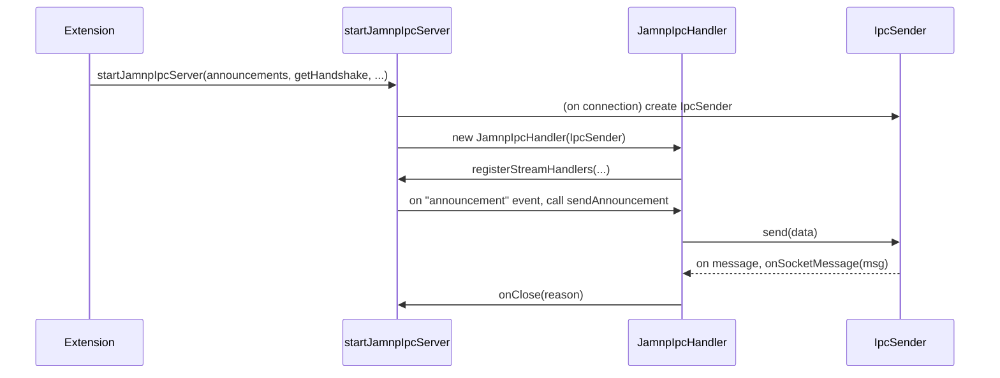

# Refactor IPC server

## Pull Request by @tomusdrw

As an intro to #528 this PR refactors the JAMNP-IPC server to extract the parts that we will actually be able to reuse for the fuzz-target protocol, which is very similar to the stuff we already have, just doesn't have multiple "virtual streams".


## Comment by @coderabbitai[bot]

<!-- This is an auto-generated comment: summarize by coderabbit.ai -->
<!-- This is an auto-generated comment: skip review by coderabbit.ai -->

> [!IMPORTANT]
> ## Review skipped
> 
> Auto incremental reviews are disabled on this repository.
> 
> Please check the settings in the CodeRabbit UI or the `.coderabbit.yaml` file in this repository. To trigger a single review, invoke the `@coderabbitai review` command.
> 
> You can disable this status message by setting the `reviews.review_status` to `false` in the CodeRabbit configuration file.

<!-- end of auto-generated comment: skip review by coderabbit.ai -->
<!-- walkthrough_start -->

<details>
<summary>📝 Walkthrough</summary>

<!-- This is an auto-generated comment: release notes by coderabbit.ai -->

## Summary by CodeRabbit

* **Refactor**
  * Updated IPC server and handler architecture for improved modularity and abstraction.
  * Introduced a new messaging protocol for IPC communication.
  * Renamed and restructured handler classes and methods for clarity.
  * Updated client and RPC interfaces to use the new handler types.

* **Chores**
  * Improved type annotations and documentation for better code maintainability.

<!-- end of auto-generated comment: release notes by coderabbit.ai -->
## Walkthrough

The changes refactor the IPC extension and server architecture. They introduce a new JAMNP-based IPC server and handler, decouple socket management from protocol logic, and update client and RPC modules to use the new abstractions. Message framing is now handled with length-prefixed protocols, and public APIs and class names are updated throughout to reflect the new design.

## Changes

| Cohort / File(s)                                                                 | Change Summary |
|----------------------------------------------------------------------------------|---------------|
| **JAMNP IPC Integration & Refactor**<br>`extensions/ipc/index.ts`, `extensions/ipc/jamnp/server.ts`, `extensions/ipc/jamnp/handler.ts` | Introduced `startJamnpIpcServer` and `JamnpIpcHandler`, replacing legacy IPC server and handler. Refactored extension startup logic to use new JAMNP abstractions and updated event handling and stream registration. |
| **Legacy IPC Server Refactor**<br>`extensions/ipc/server.ts`                     | Refactored IPC server to use interface-based handler model, introduced `IpcHandler` and `IpcSender` abstractions, and implemented length-prefixed message framing. Removed direct protocol/event dependencies. |
| **Client & RPC Consumer Updates**<br>`tools/ipc2rpc/client.ts`, `tools/ipc2rpc/rpc.ts` | Updated client and RPC logic to use `JamnpIpcHandler` and new registration methods. Adjusted imports and type signatures to match new handler/server interfaces. |

## Sequence Diagram(s)



## Estimated code review effort

🎯 4 (Complex) | ⏱️ ~40 minutes

## Poem

> A rabbit hops through code anew,  
> JAMNP streams now flowing through.  
> Handlers changed and sockets neat,  
> Length-prefixed bytes, a tidy treat.  
> Refactored paths, new names in view—  
> With every hop, the system grew!  
> 🐇✨

</details>

<!-- walkthrough_end -->
<!-- internal state start -->


<!-- DwQgtGAEAqAWCWBnSTIEMB26CuAXA9mAOYCmGJATmriQCaQDG+Ats2bgFyQAOFk+AIwBWJBrngA3EsgEBPRvlqU0AgfFwA6NPEgQAfACgjoCEYDEZyAAUASpETZWaCrKNwSPbABsvkCiQBHbGlcSHFcLzpIACIbEgAzNDF8PgBJKwBhe0opCmjIAHc0ZAcBZnUaejkw2A9sREowlnraCgL0ZFtIDEcBRoBWAGYABn4sXFqYWW4SPooXPxJufER1FNkNGEnmbSxubAplhv54mtQu1AJFxOS+CY8AKQBBAFkAOSswdKyGilzNuCofw3AgUeAYIjoeDMZBXEgAD1wVDEi3qKkiCmYy3IGFwyHiFBYNQ8CKQ4gh2T+jWh3EibFx1Hg+AwANqxwRSKSlR4zjx6H8KFxZCU9CufUg9Si8RSxMg8WwAC8FWBcM5SKFePgCEwvAAaQoIBiweywZzSezQ+BeZzqeDmgrqY33RgHfy4lBYunsRnMyACPCQWjweLxSjIcE1agoUK0fDmjBa+zYbjLCihZjecS0jzRCTwNPYNC+RBIkhoGEafKA5AFFIAa0pUmQxXQWHBSMU2DETPG+HQi2t3K6AAozP0AEwADgAlK36LwlmbYZMmEoBMUPNK+PK07U+EopF58Nx6aFwRJ8F48xTnfKlSq1SQNYTtZfWR4ugxMH6PP48yQCiiCMlFVK10FCZ1NTzEVIAAVRsAAZLhYFwXBuEQDgAHpMKIR1sAEDQmGYTCADEvGwENZAQlREEw3BplmSgXEw/YfEwoZhg0Ix9GMcAoGFE4cAIYgyGUbkiNPLheH4YRRHEJs/XkVdlFUdQtB0HiTCgasUGbLA0DwQhSHIKhxJYSS/DQdoHCcBZqmUqhVM0bRdDAQxeNMAwOTIVZmVo+BuAYTDwSUeENDxDgDGiaKDAsSAnlSESTOoKIbJ2BZ8FOI1MFIRA3EmGkUlCTLIAAAxLXlUkCgBlHJKFKuVCWYMqNEw35/iERAGqKZB/FpJIogdCYyoqtMHnLDBuCqhhaqpCgGoJIlStaoQJu4Nq6ooDROuWrYSXhVNuXlDBu19crVTTABRREfJ7bqW2YRRgztUU+3bSgMCLLwlK+/tyHaWovBmbdsBO8QztG3BxuYSbrpoDBfIwbrDWNMgv3Q7wUuXDwFzzfB6kgI9cIYVlUEB4G5VB06sAaPlk0gEgpHdU0MFoLxwUhTB6AqmgwmROsOblGVMATKmSFPPSqhCP0jwYOtEH1JgEaRLs+RZ2hEFNOsPC5yBtdkMAJCLYIeXzHhCWgsN9V1+JwS++R/FwA4EdlfwHC8YrTnPfABYpc7eWhybptm3JusdYljm4ZxyyfMN33NxmmQJoN/BRL8fCaEaLtwYPNvu3qlmtBgomqCZUH+xhfquf2xrW3O5t29ws95OHbuZBaqfBrAE3aR3nebRgjwcAUJijdOvGxweyx6bhKbBntFidihyCqeQa6htbW4Ru7NieTFTzoMB8dCaAAHkABFT8J8EPB6xZHqkWhNjePtsohe1KA8HYlEz513uXoshN8DE0EozdgkB1bswhPqdWms0Da0YP4H0GB9Qyn1obY2ONtB8GMmJBefRZDMlFJMdqjRIZz2posfqxdTxzkWCWCgqsDgcy4kYWKlgngezwX5X+kwlAMGtKZHsyASoIkOlEGU+wBDswYAzXEtppDcUgCRTuC9VhEE+kvOo3BaApVoFwUqYiioUK7vYbOW9EbDjQNweAXALE9ieDY6cDUIyGJutvPywVArBVZgicKXVICABQCRgLNSD0EWs1FOclvpmN5ILb4jZGhXHHoLdegduD2PboKGgACfDyF1n3Zegs0BT0wPTARKwDgkC4lAN4AETELzQLQEUBjjqUMhukzJGArE2Lse4xGjj4DOMFGVbyHiEZeKCiFPxeIGpo2se7RkN5JgJNIXwSG9MibwFkbjJOiAYnglWD/deXTlpGEuiWaEeiFA/z/HadoCQtycEgC8Og8BHBRRigYCAYAjBjMRv5bxq0YbrUgZQfxkVorRHYfFRKuDTKpUcOleQJU365Xyh4ARxRkC7Pxvs+Qn02D0FKtNAAElzSI81CgtjdDHV6ZV0lkopfVOhPcGYHRkeoA5npxbsBkFqY0pVqqlnLC8TAaBSBUt1iSwK5LWaUpcUKCgNxpDxyVgw1WMp1GaKqSEnKUomroAYMXbg5JOZlWqvgOWT4GpXCiWIGJSQTVmtbGVXOviqWHNVCdEg+p/AP0Fn/JVn1fAMCQaYkq34ZUzWFCyiJ/ZEBWu1poPakA2ATEUGVfwuESyUDlWzMM+dFiEqiNXbNZJKDCqQcwfNlKuqbFqrkQBvBJApTlHaLwGtCif1bAmVU3IhrGgeNVc+Vr958qFnwLFYJ6Lx3YPmDw0baoeoalixAksBzXMTda3AYB1wNHoGwddErNxUHKBSLZsjhzggEdgIMF6yBEAmGABctt4SpWFMU1mjUJWnmQRAilHNZyAQFP6/Aj9GpEjLviK01TICpCxEVERpxSoACEKKhild+oVSabWQeai/JQ20aw9rA4/a236/6IbTIJaNtaWXSvdUoKl9EZg1hbE0mC8aSn+EHJIL+nZIibFPk2nw+pnRovNPw/G2ZZQJLBduQ19rQjbuTWm8VpBaEFPFuBjwR4ChgEiIeH957Obfv9CGSggtL34bOMgR6tBvDVLYTCzhOTkGwj7M6fhgiPOgIOkVCRfApEyLkeEO0eVvmQAyNaddxa6V0O1dQXVkn9FutlcyqlgAkwgZXXDL8rqQ8olpAKtZZmBis+pK/UTKCtUsHQoZWjDbh6vfuEw1pVhyqafFwS1O7hnV067GigXAmOUGGa4/5wjJmYWBZNTCCn/GlSi68jN9BaVEoMeW3NFB6MUEQMODQh2FMYRKyKmtmWADaABdYZOXSpbZyaV8su39uHY0MdnrZ3dvXfG1gNdyBSqMvywWz1WA3HwwBdN2boLMuLai3EB+UR/sGNG3V8O6bYCKABw0Vmw5dGqi4Kh2QNBECoaPAIacXALzwFoA1aVFSGjDkp5AantPbPg7bhMgKQVofzdh7M+HOmINGLTFKVRzIDFgpIlQIgf6u7DnHuuOWXA8fUDQITjDY3IAAF49As/wDT5nquCeQHQ5Zigs5df65pwtdrk3PHc5m2tPntW4cGAueIHYZlbmJ3qY8oqXBSXwCILAT50LvmeXt1zoFzu1kQrD65uFokEXcyRc4FFWVQmKIMHvCuqzNoNIhtnIHMaG66WyYSRzxd6VGOOCU8guBawUDrIZ+ACCj2IAlYLTUr5fC6bSJkTYqRQhOqWHyb8YD3TiwqI0Lcvb8Y+oltbADrM4EIKgjTygFHRS1kLy7K4jswRgL5naP0C/dELATEoDd6CjbkSwfmGQG56C+hKbUJpjRTSazofrSy79EDxxrLl6QyDThwlJvpARKDyK2xkJIhfr0AlJKzkCUIKaVw+BK51ibAkQyhlhGgNbIFdzL6A55YMC7aKoVQ+rl5hpljchXA7CVaYrmSgzbLILxyoHsy5ouxz7RAiwL40LsD5CT54j6i5DBiyCBqmihC4HGi8Fiy0KoDfheqYDFyCQlKIAzAMDPSyL/Y/hbgeA473qQjqD8C5D9jX7B6aKpRnZ6whQSirAUhv6ZYADk2OwoTwGAosi+7ADUGOigQ+pwihGAd+NO8+ch4CQIogJA/GtAFGDM8wMolwsAhIBQLIqashXh7oHB8M1IBciO9ABQtQ4wkwqBSWE8soAkqKTBGALBXcbBmW6AE8fYD2YYYQu+DCZWK+IOJ2zIm4MosCWsX8GmvK7ousmAAqs+MocBHg+OPGT4R+d++o9QEhOMFsm+4S4uCM8cbSpihS++xR9RShlB9BXeyyjBHhckPYrC5gHCXCQiPCVw3mogvmXcyG7K4iL+wW+EoW864g2eUAKi88r+zSdABiHSJBIclAViHhfBwxEUkAl0TMuAl05QqEW+kA6o+aa+JAKulueuyYnEmJAx+o6oqG5+6ehG0gKuX+sAgeZYzG5Kms+okMAA0iQLIFwMXAAIzjgACcGgrJsg+owoApHJJA3JfJApuJMAR+FJ12xJT4ApAAapglYNgidsONSbSR/jtsULAEydnCKYwGKbyfyWyUKazIaVySaZKTrnrlaRKWycqffqqfmD9oqqMv0lNo7rznHgLu7pcl7kjooL+L7g8iGAHi8m8h8lCtxJHp6Q7t4r6RhAnnFAlElGJIirZBni1uigYE3PnnNB6NmHLgvHfMCFyCkKWk0ULtMQuiiEoDML4idBFmMPYBoVoebFqFapeJ0XWnQkIQzCiTkgrFQkXMsc1PViUo9AKPCtstkpQCqnus/oGNIBYfHOvPXKHHvhaBoslgKKlrZqPqaoLBmB7AFBiOoaIB2YrkkPLHQhPoiYOTPncH2EeS6moQXiWveXKBWQsNsQvKPM+J2MXHpOlqQZluQd6ioRTAInaO6EgRccyOuTViDoqjkiqtSuGLiJXl2FWegAIAwlyDwJQGALBeAl1umNIJ3qQL2YLPVr4V2qVMyL1smq8seqQHTthsyDFisCQLtLnvUkukNqurFuxs2MCTXidAspjLzAYYLDMXQgzssfYLhrgIsfYeapEBCM+q+vAO+m1uWN3i+N2V4Kwk3BRTyMNOqirJQnfPCkWPAAqHhZKLKBvjBEAV+V6nSaoQBhQLQMpNzHARCPHLigTOCFAnpsAnOXPs0WCBSMdnQlkWQIGq+dCWEbiGJffLpjESuZEEQEspzBnB3ierRTeF5pMG5VEHRhBYKBQcXKwnvFpU+rAC+sCHpQaoZRSD3iZZhRXsBVKFqqpfvMwV+F3FwMfEQAbhSMVblPyPoeApOZAAACx7rE56YVCRBgCfrfhNXDS6XwhCw+D4CASryygzHrkGEADqjoCEj6EwVgbV8IHcgJbYRWE60GQ+J0LA8lau5emoIFB6iksopUUuMuJZWS/5zI+oBR2yxoFmmGOKcSgCCluszIByQRPs5oEmX0GBBoZA/Y8oRVVFJVViWFQYo1Jc8gzou1xo+1s4ERxc0RpMBc1C5ooVyAymgYv1kCLC5y8RfAPNFIvoFlClqcY+C8bKRMyATEKQG6DOWNJCQ1vo54Dl9A51qaZGgCJUzo6R/BU+j5SVJkrZFlAkd8EBp1ZGxSaaSAl5PgUQA5X5uszovG1yhtjQNm86vGGwRgImygYmsokm9mgmNoTlcmmQiSFA1sBFnIKIM1HggtRA2+fVVe+0tI2yxhcdJmdF4cNNCcEB+IMovG8A6IX8xNNFAgZJCwIEiFLI1x8UtxfmDxfCTx0cLx/m7x/Anx0ic5PxEWSiTwEl85yqA0YFZBhQ6OT4mOGskUkAugZUzFqlbF1FJAw4MIRAXAsE7Yk4Tw8waAsgzOrOS2s9UATFGAPFjOSCiaGAXAAA3nEYSBQAAPx2L82QAAC+B9ButOUWA9MEOhQlK649EwM9c9GQfkNloIZUnWqlPWqlziBgx9kZq2I0woxu6upua1pO5On9NuCDc9K2U9ZU8tTOVOX9S2UAGQWe6xL1O5OqAoJUG5NUec+GIDpUbDeIeDkNNM2cm5kJeDs9utsJJ2CJ7AyJz5uo/D6JT4hJ8C2JkATOtpEo3ABJXMWJEjs9s9JJldsgFJ6pmpkApKdJeaup+pvIlpxpDpgpcitA5j4ppp+9ij0AMpwZcpkj6oSpKpapVJupWp9JJjsSaYtj1pZp1jQTljUp9p9jTpwQLpFArjs904eDbDR9TQST7DeUs9XDATOcTDc0w4kjJaXADCHM6jGj/0S9J6u2KuFFI2TDHqUpKFlKeDiTs9yTP9g9IuR0GxZUoNv63o8uN5yu8jMxGu5uUprORuIzpumuFuijh9k6foMz8BPIe21md1LV+1QEX1pmaaZdqqCeEevyBgBAl4gKDA44hwQUZFuI8eMZqZSeyU3IaU6egkgdGKRZxiPMQj3a+5VDmcfURci6jTca7WAAAqxoxPMLIJhByGAI7gtjtEA4KiXmPfGqVOCwxHMMxLC96c7giwEk7a+c0mBcusxrbktBizMFi9Czi4mZtMRo3JMOvDFnBbgM9dTC4YvM7GEAxL1cmPjgaktA9d9Q0MAMCxQHoLan2KVMK+UKKyi5lpK59Uch4LeBseJiuOGgvNrdsHs72Y0HfA5s9CCbVTQE0oJMpujRQeIAVaPTVfVs6BRUQQq7Vi4lhda8XQOmAd0IJajt1FQCmMpRRfHAxWgWUQfiQDmjkvq3tjmYK81PdpGxWjqbVgEmWkm9tk9udqmwtDKBXcNKVPiRoGPfThY8WxBfHG7J7LKFw/qDeuRIYSpTuvgTXUKY+QnUnTLXwMcZpuwH6uLLsMgFTFQ1ca5g3W3U3dMS3XcS7KIgFqLh8Z4N3bIr3X8cot00llokowK2lsy+zOwNAzuqqcA2YnFYnVI7gDI9rDiYo0W1e76mMO4Z4Xrc8lCdfUo5xE+zCaeOM1/czrK0gCQGK8DpSpK5AHdpDCywexRcezSaeyUxe/eze1bne6o0SY+2lRka+yLFwEW1++lbgL+4blwAB/KyQbtmB64icxPJMhc94tc5oH6R7lct7iGf+GGU8lwK8kGNGV8j8kYNR2c3R0FJc7czFPc+mSnkmFma81npFk3IVDRl88ViBiGSkPldUU5Wls6BCwDsOqfG8DYJkKkOfJxcSvp4Z5kNVF2ADXEOoX5HxT8wJhBtxtkFHAih8zRmi9EJ1MyGAJc2AOOBoMMJhEGCWJhA5iQBPBoE/J1NEFKwmhzBiERGoCvJ56EN575xgP54FIF8F/Fw0cyEQCqwytVAZ0ZxkBCfNPHBC4JM6KVAxw1O5zHNGxGPV5DDYIFOy6YnfAeWi+Kwl8QSCgN/2/EJEN2A4WmpWW2VebbLIjKPy9cvJvURC7vM0raMyPbBqx4Ip9W9Va671WRlENpqzfkeHFRodLRi66heztEJS5C9i4iHCzHiCi7iDsRvF8/H2OMSDC9YAoHbwpFSAjKErB2L4GN8dU5+pkRi5qmeO8IoDyudOn5nOx3ZIl8T3fIr8ZFv8RuxYXudoju6CdnJ1wwHjgIFwOfGrvug+wx7U+BbVrds3GmKT+T5T9TxuIrPu7iFwNd5Sr9mVIJ7R5c5hKJ0xwGdcspIsOxwzOGWmFwAhMdQczxAYFpNY6oYZJJ5L+ZOwFwFQNZGnnZEpMGY5GoM5BpG5Kr3xPvOoAAPo06IC293IAR0C2/kIq9q+TjDBLUADsAgwwDAtAgwAgPv44wwaAnJfvS18QwwnJPJJAPJAgS1AAbP0MMD75OEn9ycnzyfEP0CUh79bxJHbw7076Ga7wJJpNb8wAwNwLb6DxyG79nK5O5G0zfXg9EIcsHihIgNEFwPEzEEUEUhCL3/31dgYG/QYG01bxAGmrX/X8yDQIiLb5X25EAA== -->

<!-- internal state end -->
<!-- tips_start -->

---


<details>
<summary>🪧 Tips</summary>

### Chat

There are 3 ways to chat with [CodeRabbit](https://coderabbit.ai?utm_source=oss&utm_medium=github&utm_campaign=FluffyLabs/typeberry&utm_content=530):

- Review comments: Directly reply to a review comment made by CodeRabbit. Example:
  - `I pushed a fix in commit <commit_id>, please review it.`
  - `Open a follow-up GitHub issue for this discussion.`
- Files and specific lines of code (under the "Files changed" tab): Tag `@coderabbitai` in a new review comment at the desired location with your query.
- PR comments: Tag `@coderabbitai` in a new PR comment to ask questions about the PR branch. For the best results, please provide a very specific query, as very limited context is provided in this mode. Examples:
  - `@coderabbitai gather interesting stats about this repository and render them as a table. Additionally, render a pie chart showing the language distribution in the codebase.`
  - `@coderabbitai read the files in the src/scheduler package and generate a class diagram using mermaid and a README in the markdown format.`

### Support

Need help? Create a ticket on our [support page](https://www.coderabbit.ai/contact-us/support) for assistance with any issues or questions.

### CodeRabbit Commands (Invoked using PR/Issue comments)

Type `@coderabbitai help` to get the list of available commands.

### Other keywords and placeholders

- Add `@coderabbitai ignore` anywhere in the PR description to prevent this PR from being reviewed.
- Add `@coderabbitai summary` to generate the high-level summary at a specific location in the PR description.
- Add `@coderabbitai` anywhere in the PR title to generate the title automatically.

### Status, Documentation and Community

- Visit our [Status Page](https://status.coderabbit.ai) to check the current availability of CodeRabbit.
- Visit our [Documentation](https://docs.coderabbit.ai) for detailed information on how to use CodeRabbit.
- Join our [Discord Community](http://discord.gg/coderabbit) to get help, request features, and share feedback.
- Follow us on [X/Twitter](https://twitter.com/coderabbitai) for updates and announcements.

</details>

<!-- tips_end -->


## Comment by @github-actions[bot]


<details>
<summary>View all</summary>

| File | Benchmark | Ops |  |
|------|-----------|-----|--|
| [bytes/hex-to.ts[0]](../blob/fbd82b6b96bea27d11a83ea1bf37d35b11230a56//_work/typeberry-runner-2/typeberry/typeberry/benchmarks/bytes/hex-to.ts) | number toString + padding | 318940.82 ±0.34% | fastest ✅ |
| [bytes/hex-to.ts[1]](../blob/fbd82b6b96bea27d11a83ea1bf37d35b11230a56//_work/typeberry-runner-2/typeberry/typeberry/benchmarks/bytes/hex-to.ts) | manual | 15993.9 ±1.9% | 94.99% slower |
| [math/count-bits-u32.ts[0]](../blob/fbd82b6b96bea27d11a83ea1bf37d35b11230a56//_work/typeberry-runner-2/typeberry/typeberry/benchmarks/math/count-bits-u32.ts) | standard method | 79766020.84 ±1.36% | 69.05% slower |
| [math/count-bits-u32.ts[1]](../blob/fbd82b6b96bea27d11a83ea1bf37d35b11230a56//_work/typeberry-runner-2/typeberry/typeberry/benchmarks/math/count-bits-u32.ts) | magic | 257762239.35 ±5.54% | fastest ✅ |
| [math/mul_overflow.ts[0]](../blob/fbd82b6b96bea27d11a83ea1bf37d35b11230a56//_work/typeberry-runner-2/typeberry/typeberry/benchmarks/math/mul_overflow.ts) | multiply and bring back to u32 | 265036493.66 ±7.46% | 1.3% slower |
| [math/mul_overflow.ts[1]](../blob/fbd82b6b96bea27d11a83ea1bf37d35b11230a56//_work/typeberry-runner-2/typeberry/typeberry/benchmarks/math/mul_overflow.ts) | multiply and take modulus | 268534051.42 ±5.98% | fastest ✅ |
| [math/switch.ts[0]](../blob/fbd82b6b96bea27d11a83ea1bf37d35b11230a56//_work/typeberry-runner-2/typeberry/typeberry/benchmarks/math/switch.ts) | switch | 245177095.13 ±8.37% | 1.86% slower |
| [math/switch.ts[1]](../blob/fbd82b6b96bea27d11a83ea1bf37d35b11230a56//_work/typeberry-runner-2/typeberry/typeberry/benchmarks/math/switch.ts) | if | 249811912.76 ±8.09% | fastest ✅ |
| [collections/map-set.ts[0]](../blob/fbd82b6b96bea27d11a83ea1bf37d35b11230a56//_work/typeberry-runner-2/typeberry/typeberry/benchmarks/collections/map-set.ts) | 2 gets + conditional set | 109390.23 ±0.52% | fastest ✅ |
| [collections/map-set.ts[1]](../blob/fbd82b6b96bea27d11a83ea1bf37d35b11230a56//_work/typeberry-runner-2/typeberry/typeberry/benchmarks/collections/map-set.ts) | 1 get 1 set | 59381.33 ±0.51% | 45.72% slower |
| [codec/bigint.compare.ts[0]](../blob/fbd82b6b96bea27d11a83ea1bf37d35b11230a56//_work/typeberry-runner-2/typeberry/typeberry/benchmarks/codec/bigint.compare.ts) | compare custom | 263851859.03 ±6.64% | fastest ✅ |
| [codec/bigint.compare.ts[1]](../blob/fbd82b6b96bea27d11a83ea1bf37d35b11230a56//_work/typeberry-runner-2/typeberry/typeberry/benchmarks/codec/bigint.compare.ts) | compare bigint | 263683478.98 ±5.82% | 0.06% slower |
| [codec/bigint.decode.ts[0]](../blob/fbd82b6b96bea27d11a83ea1bf37d35b11230a56//_work/typeberry-runner-2/typeberry/typeberry/benchmarks/codec/bigint.decode.ts) | decode custom | 168769445.84 ±3.19% | fastest ✅ |
| [codec/bigint.decode.ts[1]](../blob/fbd82b6b96bea27d11a83ea1bf37d35b11230a56//_work/typeberry-runner-2/typeberry/typeberry/benchmarks/codec/bigint.decode.ts) | decode bigint | 100392329.16 ±2.26% | 40.52% slower |
| [codec/decoding.ts[0]](../blob/fbd82b6b96bea27d11a83ea1bf37d35b11230a56//_work/typeberry-runner-2/typeberry/typeberry/benchmarks/codec/decoding.ts) | manual decode | 23528820.86 ±0.49% | 85.73% slower |
| [codec/decoding.ts[1]](../blob/fbd82b6b96bea27d11a83ea1bf37d35b11230a56//_work/typeberry-runner-2/typeberry/typeberry/benchmarks/codec/decoding.ts) | int32array decode | 162697801.65 ±3.75% | 1.34% slower |
| [codec/decoding.ts[2]](../blob/fbd82b6b96bea27d11a83ea1bf37d35b11230a56//_work/typeberry-runner-2/typeberry/typeberry/benchmarks/codec/decoding.ts) | dataview decode | 164912929.77 ±3.06% | fastest ✅ |
| [codec/encoding.ts[0]](../blob/fbd82b6b96bea27d11a83ea1bf37d35b11230a56//_work/typeberry-runner-2/typeberry/typeberry/benchmarks/codec/encoding.ts) | manual encode | 3128077.47 ±0.39% | 18% slower |
| [codec/encoding.ts[1]](../blob/fbd82b6b96bea27d11a83ea1bf37d35b11230a56//_work/typeberry-runner-2/typeberry/typeberry/benchmarks/codec/encoding.ts) | int32array encode | 3812388.51 ±0.31% | 0.06% slower |
| [codec/encoding.ts[2]](../blob/fbd82b6b96bea27d11a83ea1bf37d35b11230a56//_work/typeberry-runner-2/typeberry/typeberry/benchmarks/codec/encoding.ts) | dataview encode | 3814599.78 ±0.21% | fastest ✅ |
| [bytes/hex-from.ts[0]](../blob/fbd82b6b96bea27d11a83ea1bf37d35b11230a56//_work/typeberry-runner-2/typeberry/typeberry/benchmarks/bytes/hex-from.ts) | parse hex using `Number` with NaN checking | 130414.94 ±0.17% | 84.88% slower |
| [bytes/hex-from.ts[1]](../blob/fbd82b6b96bea27d11a83ea1bf37d35b11230a56//_work/typeberry-runner-2/typeberry/typeberry/benchmarks/bytes/hex-from.ts) | parse hex from char codes | 862721.08 ±0.36% | fastest ✅ |
| [bytes/hex-from.ts[2]](../blob/fbd82b6b96bea27d11a83ea1bf37d35b11230a56//_work/typeberry-runner-2/typeberry/typeberry/benchmarks/bytes/hex-from.ts) | parse hex from string nibbles | 530601.16 ±0.33% | 38.5% slower |
| [hash/index.ts[0]](../blob/fbd82b6b96bea27d11a83ea1bf37d35b11230a56//_work/typeberry-runner-2/typeberry/typeberry/benchmarks/hash/index.ts) | hash with numeric representation | 188.52 ±0.67% | 27.7% slower |
| [hash/index.ts[1]](../blob/fbd82b6b96bea27d11a83ea1bf37d35b11230a56//_work/typeberry-runner-2/typeberry/typeberry/benchmarks/hash/index.ts) | hash with string representation | 105.67 ±0.49% | 59.47% slower |
| [hash/index.ts[2]](../blob/fbd82b6b96bea27d11a83ea1bf37d35b11230a56//_work/typeberry-runner-2/typeberry/typeberry/benchmarks/hash/index.ts) | hash with symbol representation | 180.86 ±0.42% | 30.64% slower |
| [hash/index.ts[3]](../blob/fbd82b6b96bea27d11a83ea1bf37d35b11230a56//_work/typeberry-runner-2/typeberry/typeberry/benchmarks/hash/index.ts) | hash with uint8 representation | 162.36 ±0.36% | 37.73% slower |
| [hash/index.ts[4]](../blob/fbd82b6b96bea27d11a83ea1bf37d35b11230a56//_work/typeberry-runner-2/typeberry/typeberry/benchmarks/hash/index.ts) | hash with packed representation | 260.75 ±0.33% | fastest ✅ |
| [hash/index.ts[5]](../blob/fbd82b6b96bea27d11a83ea1bf37d35b11230a56//_work/typeberry-runner-2/typeberry/typeberry/benchmarks/hash/index.ts) | hash with bigint representation | 191.29 ±0.25% | 26.64% slower |
| [hash/index.ts[6]](../blob/fbd82b6b96bea27d11a83ea1bf37d35b11230a56//_work/typeberry-runner-2/typeberry/typeberry/benchmarks/hash/index.ts) | hash with uint32 representation | 201.34 ±0.33% | 22.78% slower |
| [logger/index.ts[0]](../blob/fbd82b6b96bea27d11a83ea1bf37d35b11230a56//_work/typeberry-runner-2/typeberry/typeberry/benchmarks/logger/index.ts) | console.log with string concat | 7190455.77 ±51.1% | fastest ✅ |
| [logger/index.ts[1]](../blob/fbd82b6b96bea27d11a83ea1bf37d35b11230a56//_work/typeberry-runner-2/typeberry/typeberry/benchmarks/logger/index.ts) | console.log with args | 247477.34 ±111.48% | 96.56% slower |
| [math/add_one_overflow.ts[0]](../blob/fbd82b6b96bea27d11a83ea1bf37d35b11230a56//_work/typeberry-runner-2/typeberry/typeberry/benchmarks/math/add_one_overflow.ts) | add and take modulus | 231378537.13 ±31.84% | 6.14% slower |
| [math/add_one_overflow.ts[1]](../blob/fbd82b6b96bea27d11a83ea1bf37d35b11230a56//_work/typeberry-runner-2/typeberry/typeberry/benchmarks/math/add_one_overflow.ts) | condition before calculation | 246524374.98 ±8.77% | fastest ✅ |
| [math/count-bits-u64.ts[0]](../blob/fbd82b6b96bea27d11a83ea1bf37d35b11230a56//_work/typeberry-runner-2/typeberry/typeberry/benchmarks/math/count-bits-u64.ts) | standard method | 5359343.58 ±0.42% | 94.02% slower |
| [math/count-bits-u64.ts[1]](../blob/fbd82b6b96bea27d11a83ea1bf37d35b11230a56//_work/typeberry-runner-2/typeberry/typeberry/benchmarks/math/count-bits-u64.ts) | magic | 89658035.69 ±1.63% | fastest ✅ |
| [codec/view_vs_collection.ts[0]](../blob/fbd82b6b96bea27d11a83ea1bf37d35b11230a56//_work/typeberry-runner-2/typeberry/typeberry/benchmarks/codec/view_vs_collection.ts) | Get first element from Decoded | 21101.77 ±3.42% | 68.47% slower |
| [codec/view_vs_collection.ts[1]](../blob/fbd82b6b96bea27d11a83ea1bf37d35b11230a56//_work/typeberry-runner-2/typeberry/typeberry/benchmarks/codec/view_vs_collection.ts) | Get first element from View | 66929.77 ±0.2% | fastest ✅ |
| [codec/view_vs_collection.ts[2]](../blob/fbd82b6b96bea27d11a83ea1bf37d35b11230a56//_work/typeberry-runner-2/typeberry/typeberry/benchmarks/codec/view_vs_collection.ts) | Get 50th element from Decoded | 27670.39 ±0.25% | 58.66% slower |
| [codec/view_vs_collection.ts[3]](../blob/fbd82b6b96bea27d11a83ea1bf37d35b11230a56//_work/typeberry-runner-2/typeberry/typeberry/benchmarks/codec/view_vs_collection.ts) | Get 50th element from View | 38476.98 ±0.2% | 42.51% slower |
| [codec/view_vs_collection.ts[4]](../blob/fbd82b6b96bea27d11a83ea1bf37d35b11230a56//_work/typeberry-runner-2/typeberry/typeberry/benchmarks/codec/view_vs_collection.ts) | Get last element from Decoded | 27675.88 ±0.33% | 58.65% slower |
| [codec/view_vs_collection.ts[5]](../blob/fbd82b6b96bea27d11a83ea1bf37d35b11230a56//_work/typeberry-runner-2/typeberry/typeberry/benchmarks/codec/view_vs_collection.ts) | Get last element from View | 23995.32 ±3.8% | 64.15% slower |
| [codec/view_vs_object.ts[0]](../blob/fbd82b6b96bea27d11a83ea1bf37d35b11230a56//_work/typeberry-runner-2/typeberry/typeberry/benchmarks/codec/view_vs_object.ts) | Get the first field from Decoded | 343169.48 ±1.62% | 22.85% slower |
| [codec/view_vs_object.ts[1]](../blob/fbd82b6b96bea27d11a83ea1bf37d35b11230a56//_work/typeberry-runner-2/typeberry/typeberry/benchmarks/codec/view_vs_object.ts) | Get the first field from View | 97718.47 ±2.3% | 78.03% slower |
| [codec/view_vs_object.ts[2]](../blob/fbd82b6b96bea27d11a83ea1bf37d35b11230a56//_work/typeberry-runner-2/typeberry/typeberry/benchmarks/codec/view_vs_object.ts) | Get the first field as view from View | 103606.32 ±0.09% | 76.71% slower |
| [codec/view_vs_object.ts[3]](../blob/fbd82b6b96bea27d11a83ea1bf37d35b11230a56//_work/typeberry-runner-2/typeberry/typeberry/benchmarks/codec/view_vs_object.ts) | Get two fields from Decoded | 442494.27 ±0.14% | 0.52% slower |
| [codec/view_vs_object.ts[4]](../blob/fbd82b6b96bea27d11a83ea1bf37d35b11230a56//_work/typeberry-runner-2/typeberry/typeberry/benchmarks/codec/view_vs_object.ts) | Get two fields from View | 78549.14 ±2.1% | 82.34% slower |
| [codec/view_vs_object.ts[5]](../blob/fbd82b6b96bea27d11a83ea1bf37d35b11230a56//_work/typeberry-runner-2/typeberry/typeberry/benchmarks/codec/view_vs_object.ts) | Get two fields from materialized from View | 132825.71 ±1.34% | 70.14% slower |
| [codec/view_vs_object.ts[6]](../blob/fbd82b6b96bea27d11a83ea1bf37d35b11230a56//_work/typeberry-runner-2/typeberry/typeberry/benchmarks/codec/view_vs_object.ts) | Get two fields as views from View | 81957.78 ±0.59% | 81.58% slower |
| [codec/view_vs_object.ts[7]](../blob/fbd82b6b96bea27d11a83ea1bf37d35b11230a56//_work/typeberry-runner-2/typeberry/typeberry/benchmarks/codec/view_vs_object.ts) | Get only third field from Decoded | 444827.79 ±0.08% | fastest ✅ |
| [codec/view_vs_object.ts[8]](../blob/fbd82b6b96bea27d11a83ea1bf37d35b11230a56//_work/typeberry-runner-2/typeberry/typeberry/benchmarks/codec/view_vs_object.ts) | Get only third field from View | 103793.36 ±0.12% | 76.67% slower |
| [codec/view_vs_object.ts[9]](../blob/fbd82b6b96bea27d11a83ea1bf37d35b11230a56//_work/typeberry-runner-2/typeberry/typeberry/benchmarks/codec/view_vs_object.ts) | Get only third field as view from View | 93189.94 ±2.77% | 79.05% slower |
| [bytes/compare.ts[0]](../blob/fbd82b6b96bea27d11a83ea1bf37d35b11230a56//_work/typeberry-runner-2/typeberry/typeberry/benchmarks/bytes/compare.ts) | Comparing Uint32 bytes | 18289.49 ±6.4% | 5.29% slower |
| [bytes/compare.ts[1]](../blob/fbd82b6b96bea27d11a83ea1bf37d35b11230a56//_work/typeberry-runner-2/typeberry/typeberry/benchmarks/bytes/compare.ts) | Comparing raw bytes | 19311.81 ±0.68% | fastest ✅ |
| [hash/blake2b.ts[0]](../blob/fbd82b6b96bea27d11a83ea1bf37d35b11230a56//_work/typeberry-runner-2/typeberry/typeberry/benchmarks/hash/blake2b.ts) | hasher with simple allocator | 0.05 ±1.12% | fastest ✅ |
| [hash/blake2b.ts[1]](../blob/fbd82b6b96bea27d11a83ea1bf37d35b11230a56//_work/typeberry-runner-2/typeberry/typeberry/benchmarks/hash/blake2b.ts) | hasher with page allocator | 0.04 ±1.87% | 20% slower |
| [collections/map_vs_sorted.ts[0]](../blob/fbd82b6b96bea27d11a83ea1bf37d35b11230a56//_work/typeberry-runner-2/typeberry/typeberry/benchmarks/collections/map_vs_sorted.ts) | Map | 288254.99 ±0.2% | fastest ✅ |
| [collections/map_vs_sorted.ts[1]](../blob/fbd82b6b96bea27d11a83ea1bf37d35b11230a56//_work/typeberry-runner-2/typeberry/typeberry/benchmarks/collections/map_vs_sorted.ts) | Map-array | 103607.78 ±0.02% | 64.06% slower |
| [collections/map_vs_sorted.ts[2]](../blob/fbd82b6b96bea27d11a83ea1bf37d35b11230a56//_work/typeberry-runner-2/typeberry/typeberry/benchmarks/collections/map_vs_sorted.ts) | Array | 65653.59 ±0.48% | 77.22% slower |
| [collections/map_vs_sorted.ts[3]](../blob/fbd82b6b96bea27d11a83ea1bf37d35b11230a56//_work/typeberry-runner-2/typeberry/typeberry/benchmarks/collections/map_vs_sorted.ts) | SortedArray | 176618.56 ±0.13% | 38.73% slower |
| [crypto/ed25519.ts[0]](../blob/fbd82b6b96bea27d11a83ea1bf37d35b11230a56//_work/typeberry-runner-2/typeberry/typeberry/benchmarks/crypto/ed25519.ts) | native crypto | 5.74 ±15.54% | 80.74% slower |
| [crypto/ed25519.ts[1]](../blob/fbd82b6b96bea27d11a83ea1bf37d35b11230a56//_work/typeberry-runner-2/typeberry/typeberry/benchmarks/crypto/ed25519.ts) | wasm lib | 10.65 ±0.02% | 64.27% slower |
| [crypto/ed25519.ts[2]](../blob/fbd82b6b96bea27d11a83ea1bf37d35b11230a56//_work/typeberry-runner-2/typeberry/typeberry/benchmarks/crypto/ed25519.ts) | wasm lib batch | 29.81 ±0.61% | fastest ✅ |
</details>


### Benchmarks summary: 63/63 OK ✅

<!-- thollander/actions-comment-pull-request "benchmarks" -->


## Comment by @coderabbitai[bot]

_⚠️ Potential issue_

**Fix typo in event listener cleanup.**

There's a spelling error in the event name for the cleanup listener removal, which means the listener won't be properly removed.


```diff
     handler.waitForEnd().finally(() => {
-      announcements.off("annoncement", listener);
+      announcements.off("announcement", listener);
     });
```

<details>
<summary>🤖 Prompt for AI Agents</summary>

```
In extensions/ipc/jamnp/server.ts around lines 28 to 31, there is a typo in the
event name used in the announcements.off call during listener cleanup. The event
name is misspelled as "annoncement" instead of "announcement". Correct the
spelling to "announcement" to ensure the listener is properly removed.
```

</details>

<!-- fingerprinting:phantom:poseidon:tarantula -->

<!-- This is an auto-generated comment by CodeRabbit -->


## Comment by @coderabbitai[bot]

_💡 Verification agent_

<details>
<summary>🧩 Analysis chain</summary>

**Verify message size limits to prevent potential issues.**

The length-prefixed message framing looks correct, but consider adding bounds checking for message sizes to prevent potential memory issues or protocol abuse.

---

🏁 Script executed:

```shell
#!/bin/bash
# Check if there are any existing message size limits or validation in the codebase
rg -A 5 -B 5 "MAX.*SIZE|size.*limit|length.*limit" --type ts
```

Length of output: 25756

---


</details>

**Add explicit IPC message size bounds to prevent unbounded allocations.**

Currently sendWithLengthPrefix in extensions/ipc/server.ts writes any data.length it’s given. To avoid protocol abuse or OOMs, introduce a MAX_IPC_MESSAGE_SIZE constant (e.g. 4 MB) and enforce it on both send and receive:

• File: extensions/ipc/server.ts (sendWithLengthPrefix, lines 111–119)  
  – Throw if data.length > MAX_IPC_MESSAGE_SIZE  
• File: extensions/ipc/server.ts (handleFragmentation)  
  – After decoding the length prefix, reject messages larger than MAX_IPC_MESSAGE_SIZE before allocating/buffering

Suggested diff:
```diff
--- a/extensions/ipc/server.ts
+++ b/extensions/ipc/server.ts
@@ -1,6 +1,7 @@
 import { Socket } from "net"
+import { MAX_IPC_MESSAGE_SIZE } from "./constants"
 import { Encoder } from "@bufbuild/connector"

 function sendWithLengthPrefix(socket: Socket, data: Uint8Array) {
+  if (data.length > MAX_IPC_MESSAGE_SIZE) {
+    throw new Error(`IPC message too large (${data.length} bytes > ${MAX_IPC_MESSAGE_SIZE})`)
+  }
   const buffer = new Uint8Array(MSG_LEN_PREFIX_BYTES)
   const encoder = Encoder.create({ destination: buffer })
   encoder.i32(data.length)
```

And add in extensions/ipc/constants.ts:
```ts
// Maximum allowed IPC payload (e.g. 4 MiB)
export const MAX_IPC_MESSAGE_SIZE = 4 * 1024 * 1024
```

<details>
<summary>🤖 Prompt for AI Agents</summary>

```
In extensions/ipc/server.ts around lines 111 to 119, add a constant
MAX_IPC_MESSAGE_SIZE (e.g., 4 * 1024 * 1024) in extensions/ipc/constants.ts.
Modify sendWithLengthPrefix to throw an error if data.length exceeds
MAX_IPC_MESSAGE_SIZE to prevent unbounded allocations. Also, in the
handleFragmentation function, after decoding the length prefix, add a check to
reject messages larger than MAX_IPC_MESSAGE_SIZE before allocating buffers or
processing further.
```

</details>

<!-- fingerprinting:phantom:poseidon:tarantula -->

<!-- This is an auto-generated comment by CodeRabbit -->


## Comment by @coderabbitai[bot]

_⚠️ Potential issue_

**Add bounds checking to prevent potential DoS attacks.**

The `handleFragmentation` function could be vulnerable to memory exhaustion attacks. An attacker could send a large length prefix (up to 4GB) to cause excessive memory allocation, or continuously send data without completing messages to grow the buffer indefinitely.


Consider adding these safety measures:

```diff
+const MAX_MESSAGE_SIZE = 1024 * 1024; // 1MB limit
+const MAX_BUFFER_SIZE = 10 * 1024 * 1024; // 10MB buffer limit
+
 export function handleFragmentation(callback: (data: Buffer) => void): (data: Buffer) => void {
   let buffer = Buffer.alloc(0);
   let expectedLength = -1;
 
   return (data: Buffer) => {
+    // Prevent buffer from growing too large
+    if (buffer.length + data.length > MAX_BUFFER_SIZE) {
+      throw new Error(`Buffer size exceeded limit: ${MAX_BUFFER_SIZE}`);
+    }
+    
     buffer = Buffer.concat([buffer, data]);
     do {
       // we now expect a length prefix.
       if (expectedLength === -1) {
         // not enough data to parse the length, wait for more.
         if (buffer.length < MSG_LEN_PREFIX_BYTES) {
           break;
         }
 
         expectedLength = buffer.readUint32LE();
+        
+        // Validate message size
+        if (expectedLength > MAX_MESSAGE_SIZE || expectedLength < 0) {
+          throw new Error(`Invalid message length: ${expectedLength}`);
+        }
+        
         buffer = buffer.subarray(MSG_LEN_PREFIX_BYTES);
       }
```

<!-- suggestion_start -->

<details>
<summary>📝 Committable suggestion</summary>

> ‼️ **IMPORTANT**
> Carefully review the code before committing. Ensure that it accurately replaces the highlighted code, contains no missing lines, and has no issues with indentation. Thoroughly test & benchmark the code to ensure it meets the requirements.

```suggestion
const MAX_MESSAGE_SIZE = 1024 * 1024; // 1MB limit
const MAX_BUFFER_SIZE = 10 * 1024 * 1024; // 10MB buffer limit

export function handleFragmentation(callback: (data: Buffer) => void): (data: Buffer) => void {
  let buffer = Buffer.alloc(0);
  let expectedLength = -1;

  return (data: Buffer) => {
    // Prevent buffer from growing too large
    if (buffer.length + data.length > MAX_BUFFER_SIZE) {
      throw new Error(`Buffer size exceeded limit: ${MAX_BUFFER_SIZE}`);
    }

    buffer = Buffer.concat([buffer, data]);
    do {
      // we now expect a length prefix.
      if (expectedLength === -1) {
        // not enough data to parse the length, wait for more.
        if (buffer.length < MSG_LEN_PREFIX_BYTES) {
          break;
        }

        expectedLength = buffer.readUint32LE();

        // Validate message size
        if (expectedLength > MAX_MESSAGE_SIZE || expectedLength < 0) {
          throw new Error(`Invalid message length: ${expectedLength}`);
        }

        buffer = buffer.subarray(MSG_LEN_PREFIX_BYTES);
      }

      // we don't have enough data, so let's wait.
      if (buffer.length < expectedLength) {
        break;
      }

      // full chunk can be parsed now, but there might be some more.
      const chunk = buffer.subarray(0, expectedLength);
      buffer = buffer.subarray(expectedLength);
      expectedLength = -1;
      callback(chunk);
    } while (buffer.length > 0);
  };
}
```

</details>

<!-- suggestion_end -->

<details>
<summary>🤖 Prompt for AI Agents</summary>

```
In extensions/ipc/server.ts lines 127 to 157, the handleFragmentation function
lacks bounds checking on the length prefix, which can lead to memory exhaustion
if an attacker sends a large length value or incomplete data. To fix this, add a
maximum allowed length constant and check the expectedLength against this
maximum after reading the length prefix. If the length exceeds the maximum,
discard the buffer or reset state to prevent excessive memory allocation. Also,
consider adding a maximum buffer size limit and reset or reject data if the
buffer grows beyond this limit to avoid indefinite growth.
```

</details>

<!-- fingerprinting:phantom:poseidon:tarantula -->

<!-- This is an auto-generated reply by CodeRabbit -->


## Comment by @tomusdrw

Valid, but addressed in #452 so won't repeat it here.


## Comment by @coderabbitai[bot]

@tomusdrw Thank you for confirming that the security concern is valid and for clarifying that it's being addressed in PR #452. That's a sensible approach to avoid duplicating the fix across multiple PRs. I appreciate you keeping track of where these issues are being resolved!

🐰
   ✨ *curious ears perk up* ✨
  (  o.o  ) Understanding the bigger picture!
   > ^ <

---

<details>
<summary>🧠 Learnings used</summary>

```
Learnt from: tomusdrw
PR: FluffyLabs/typeberry#378
File: packages/jam/jam-host-calls/accumulate/bless.ts:58-58
Timestamp: 2025-05-15T14:31:00.392Z
Learning: When creating Uint8Array instances with dynamic sizes, we should check for potential allocation failures. JavaScript has limits on array sizes, and exceeding these limits will throw errors rather than returning controlled panics. Consider reading data in smaller chunks or implementing proper validation before allocation.
```

---

```
Learnt from: tomusdrw
PR: FluffyLabs/typeberry#378
File: packages/jam/jam-host-calls/accumulate/bless.ts:58-58
Timestamp: 2025-05-15T14:31:00.392Z
Learning: When creating Uint8Array instances with dynamic sizes, we should check for potential allocation failures. JavaScript has limits on array sizes, and exceeding these limits will throw errors rather than returning controlled panics. Consider reading data in smaller chunks or implementing proper validation before allocation.
```

---

```
Learnt from: tomusdrw
PR: FluffyLabs/typeberry#419
File: packages/jam/state/state-inmemory.ts:141-149
Timestamp: 2025-06-10T12:20:17.513Z
Learning: In the `InMemoryService.copyFrom` function in `packages/jam/state/state-inmemory.ts`, duplicate checking for `(hash, length)` pairs in the lookup history is not necessary because the function operates under the assumption that the input `ServiceEntries` comes from an existing well-formed state, which already maintains the invariant of unique lookup history entries per hash and length combination.
```

</details>


<!-- This is an auto-generated reply by CodeRabbit -->


## Comment by @DrEverr

Saw a typo, but also refactor it a little
```suggestion
/**
 * Send a message to the socket, prefixed with a 32-bit length
 * so the receiver can determine the boundaries between data items.
 */
```
