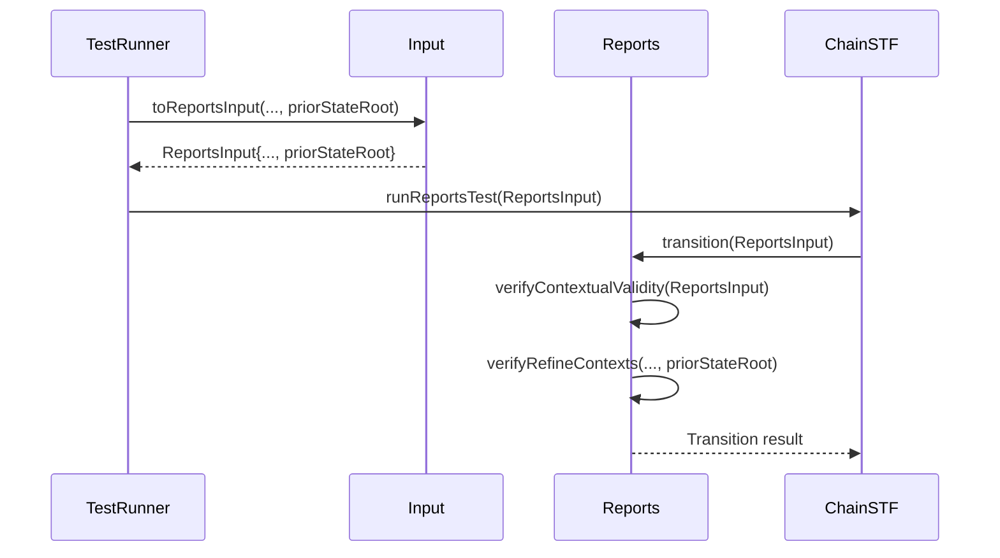

# Fix anchor state root verification when anchor state root is unknown through recentBlocks state

## Pull Request by @skoszuta

~~Since recent history is dependent on the reports transition result i couldn't use new recent history state for this fix. Hence the workaround you'll see here.~~

Updated to perform a partial update of recent history as per gp: https://graypaper.fluffylabs.dev/#/9a08063/0fe6010fe601?v=0.6.6

## Comment by @coderabbitai[bot]

<!-- This is an auto-generated comment: summarize by coderabbit.ai -->
<!-- This is an auto-generated comment: skip review by coderabbit.ai -->

> [!IMPORTANT]
> ## Review skipped
> 
> Auto incremental reviews are disabled on this repository.
> 
> Please check the settings in the CodeRabbit UI or the `.coderabbit.yaml` file in this repository. To trigger a single review, invoke the `@coderabbitai review` command.
> 
> You can disable this status message by setting the `reviews.review_status` to `false` in the CodeRabbit configuration file.

<!-- end of auto-generated comment: skip review by coderabbit.ai -->
<!-- walkthrough_start -->

📝 Walkthrough

<!-- This is an auto-generated comment: release notes by coderabbit.ai -->

## Summary by CodeRabbit

* **New Features**
  * Added support for including the prior state root in report transitions and validations, enhancing context awareness during processing.

* **Bug Fixes**
  * Improved state root validation logic to correctly handle cases where the state root is zeroed, ensuring accurate comparisons.

* **Tests**
  * Updated all relevant tests to include the prior state root in inputs, ensuring comprehensive coverage of the new logic.
  * Introduced a reusable prior state root constant for consistency in test scenarios.

<!-- end of auto-generated comment: release notes by coderabbit.ai -->
## Walkthrough

A new `priorStateRoot` property was introduced and propagated throughout the reports transition and verification logic. This property is now included in the `ReportsInput` type, passed to relevant functions, and integrated into test cases and utilities. Function signatures and method calls were updated to require and utilize this additional context.

## Changes

| Cohort / File(s)                                                                                                                                         | Change Summary                                                                                                                                                                                                                                                                                                                                                 |
|----------------------------------------------------------------------------------------------------------------------------------------------------------|---------------------------------------------------------------------------------------------------------------------------------------------------------------------------------------------------------------------------------------------------------------------------------------------------------------------------------------------------------------|
| **ReportsInput Type & Usage** `packages/jam/transition/reports/reports.ts`, `bin/test-runner/w3f/reports.ts`, `packages/jam/transition/chain-stf.ts`  | Added `priorStateRoot` property to `ReportsInput` type; updated function and method signatures to accept and forward this property; modified logic to handle the new parameter in report transitions and test runner.                                                                                                                                        |
| **Verification Logic** `packages/jam/transition/reports/verify-contextual.ts`                                                                         | Updated `verifyRefineContexts` function signature to accept `priorStateRoot`; adjusted internal logic to use this parameter when determining the expected state root for context validation; updated related method calls and error messages.                                                                           |
| **Test Utilities** `packages/jam/transition/reports/test.utils.ts`                                                                                    | Added `PRIOR_STATE_ROOT` constant for use as a reusable prior state root hash in tests.                                                                                                                                                                                                                                |
| **Test Suites** `packages/jam/transition/reports/index.test.ts`, `packages/jam/transition/reports/verify-contextual.test.ts`, `packages/jam/transition/reports/verify-credentials.test.ts` | Updated all relevant test cases to include the `priorStateRoot` property in input objects; imported and utilized the new test utility constant; ensured all test invocations and assertions use the extended input type.                                                                                              |

## Sequence Diagram(s)

## Estimated code review effort

🎯 2 (Simple) | ⏱️ ~8 minutes

## Poem

> A root from the past, now part of our lore,  
> With hashes and headers, we add one hash more.  
> Tests now remember, transitions are wise,  
> Prior state roots in every disguise.  
> 🐇 With every report, our context is true—  
> Hopping through hashes, we see something new!  
>

<!-- walkthrough_end -->
<!-- internal state start -->

<!-- DwQgtGAEAqAWCWBnSTIEMB26CuAXA9mAOYCmGJATmriQCaQDG+Ats2bgFyQAOFk+AIwBWJBrngA3EsgEBPRvlqU0AgfFwA6NPEgQAfACgjoCEYDEZyAAUASpETZWaCrKNwSPbABsvkCiQBHbGlcSHFcLzpIACIAMXgAD3QMBlh8PkRcag8KfHxQqQp4ADN4Bmp4fCwAd1gyZNT0+yyaPzzQ1GwMAGsMfGqsXFhc7CJYP1F2ACEvfAZu5Ezs6MhqtEXsAWZ1Gno5MLrIbERKe278RAAvPDR0ZFtIDEcBU4BWAGYARn5Bw9ivbDFYqyAAyKkQAHpcLJuCQXhQXBNuBd1OlZBoYIdmNosMU5sd+MUDqgHqgCOhaLR/IhkJgUDTghMvNl6OTCiVZPAMEQDh5MI0Mi0cu0UFhyidkLVKB4hnyUmlBdk2vl6Ucen0BpAJPBbrKJgxprN5oshRo3IclIgGEVuOIqpASAluMyucghtRILRGeS9UpYRglCl5Pgif4DRhQghMmifrykelcG6qBhEOpKlhqd5cAAaONoPAKhTeeh9ULHGWHcjVfXsSBRgiIpatcnwZjOkhsCNx0pJWjwMMRdGQACCtImDi8OfQq3S3Wc+C69DWyC5uFyXoN9C5caYSjC+HH+C8UjjSAcJAx7msdm0zDdB9bvHwJ71TARolw5BphIahabwpVdlSnKO0sEXU5ZROexYQYEoygUAM0yqRAzQMfRjHAKAyHoEMcAIYgyGUXYFFYdguF4fhhA/SRpEgfZd2UVR1C0HR0JMKA4FQVA6XzfDSHIKhiKYUiIy4KhqwcJxEXoxRGLUTRtF0MBDAw0wDDUDAoRCMAKC6ASIWqd5ighfxkQoRMNETDgDGiWyDAsEcAEkCIEll7EcbFEVw1JMFIRBzQ8R8E2abJO1CZcHQSGgAyiFsUgBPc9QAAwAZSFGx2gACXWWAkrCGEL0xDwm3gtghkUSAkoIGwSDMxNHIwbg8Dy3DkoaprcDyhhmW/CLmEUODYoPNAGANW1kgpPtQLQXxuGcNAytOJLeEqCg0uyDL8haoloVhSr1poTbcGyxBcsvKNHhIas5qoRa+G4ykhrjfxcGwChyHoJKarqxB2uayiRDEDEGrjJLdIwb6E0QaAQjy4oujEdNc1fGbfHJJK/s0araqhzG8oi7BuFoNzyTm79kpW9IDpII68ucIhHHYXNajKcZUEdNcRuI9ZQeRTJqdpyBilyZg4x60ISEiMKf2SsNDTmBY6YRNB5G3Zb/GppKMWHEjpYitBHvobrnA5LkeXdUJ1dWgX2jy06Fy8I30mpZEA33Hc3v8Ls6gNygAHJkEpxVWlyfJUIc4dJyI9N7zjJRjcEmOf0dOqoiaJqBC8eD2DTaQjCgABZEhyvoVMiAwag3o8Qnid2LgkpKhh90h8zfsavAAAouQ6rhMdzRAYK4ABhWAcRSmDc3YXJuFkLgW8TamAG1oin/AZ+iABdABKPLt2N78MfbzrIEAJMJKsb5ucdbzGu6P3uj/7wfIBHseJ4dCNp9nyB58QJeV4/teshN65iDjbfIXAwHHRyjvUUjAerIEPh1JKNk7JoTUnNeYaA/IQiEAtKEyZUygQhD5LkYBMjFEsogaytloj2UsMOZy/EiJREkp5YMRIfLcjzgYK8nMUxISwGVNIW5fgeAAPIYBfnveBqweY1xJg+eK2A9w8UpAImaPBp6UGhLmK2VN0q21zMLFgcZM4KzrCQX291RHoAoAzaWghAahDJicVkB5ZZXwsnwwh6Yuqo3Og9WgbpDhBxCiHEUTAIwc3dnqUyUMwgEIEc0Wqqx1BpDwOgKORRuTJGDLKPgswiBlEngiJoo8AxZ25LmJokS1xHiFrMaoqFzD0KyRUZCMSLSiGZInDpuEU4JjTnwDOWcm453ENwqAAA5A8nC/KdI8PHHp7SUz8AyPAculdqTJydIMnCwzNijPfuEeAtFqjSkgNiJQqEACimRWxuQYhMbUV0HRAgTFwEE/QUG0LQWAIwGC5zYNwcwfBmAfFVBMp4yEXIlAJEsiESh1C7IR0YYRQSLCPLOHYYwcpfkAphBCCgNswV/x6zkUTBRopurKI8ElWwjkxE2AAPopWgMOaANzmU2DEWI6AcMRaVQ0FpTIGg8DwC8ChIQiAtaQBBnqGgmRGDrA8NEe2xYeCUDxBQUWupEmgVSUMB0bZoRhJINmFYyUf54wBh+Hg6xXHuzBtCyy+rfGyOQP1PspQnoG3oLcKsmi17aPkHotaBitr2GLk6hlTLWXss5dy3l/KMQzP4Pk3FvlaI+kOIq0IhT4JNAddopO5z/CXN9s0uhI42mgVjr6bp80607NTvszwmds4Rlzv5NCkAZnkFufc7EQlZLPNOdWEg7zzJcCLn2RwPz87oJGkC6QOC8HeIEVCn6W6oZIoXailyzDS5Yq8hwvF3CrxBXMma6WxjRbRAAAK7ThJQFwEIzHzBWBFFOmAlBuOpQlCsdLIEnVyvlWE506XWqPnlZ9HrIrRT/XReQfqzbTkDU+WE5lQ2gIjcfVqBV9p4dA0lXMplqQ5xyXqUJ/5lShFaocBgntaw+yUBQVNB58h1D4PDFI01fBNALeUXwcyzkXKuReIwLSa00F6asnNizG1yeQP03Z5khntqOeM05PaoDDkNkGrDpqw2QIgcRnKsH3GHAGep1khGvrQptWrQFWDV0grBfwohcTW47tbpQ5BBg7niGHVEJ5/gXkTqnZwSAXzqgLr+QC5drnITuY3V56FIrNDislXumh1aGGHoxceqSOLRM9p1oGyJSwuz0psIyllbKOVcp5Xy/GPM/V0FzEoUoH07gTTXmgIIMoCr0FHqde1FBHV3unD2KIdQEi+1gtiXwmRsk8lwpEbkRqkqZWHClTKrLHIAC0bmys4rSNRBrVzrmwAaMc/hjgqEiJo1aZq6N1hylqGajJtVHCgtuPNKng6BQwGmGa8BLgrMNQgGxXrvCSfy7WpOCnPRKZWSpokNniLp0OZ2k5kzn7ISyF2DrtB65Y4Qkq2NDWE3NeTVwMRc0hskdgctJLwL11ushd5xMmWxXiBy4mZBeWEsGBcxz0FaX0y+d50BWQYBakc2wDNBFoqrL7voWi1yxFWHYp/GVgleb3LqA8L9hzP0NBy6HlUGgUVldeAAGrg6mrINryB5HETijSlRWBUP8YmwtYuS1cMbVttDuMEhvt0up/GprSbWuwNRsqnwsckpW5t0rmaTus4u7OxdUT8G0DcGdKcp2/DMjsC8Ch60FxaQ+EJUq8U0gyO1WZLBKjITwuVAJN3DJjiPzBI9FUKvCEshciiA3WYnVdEM3mlE6QpHkifSrDcgBM88+BRJdesltZ9aSoPF6wa/6uTe+j3VuNjXE0tf5ULQVCqiXZe7Rx9N3HM1cPrUSoTuZi3mRjtUvgtSuQvgxQjSqw4mlaUmiOsm6OCyqOCcMBqmraaymmeO3aRg/aCOQWDyI6e4Xeryk62q0WsW8WEA/yYu7ObmnO4Km6POkIcuCuGeduKu6ueWB6TCRW7kJW+u56PaV4vGiM9oaelAHINUPWJA1uUSUUMqjw/Q6Ao0tUiYE0fu6YGiN0gesmlUIeh0YeBGe0qU5mp0sqDUqYiUF0/BoEyMjGdQ8wQsTQtGocEsQQ4OpqfUA0PqZOKAO0hwzq4YuAMwCsGgfMuAkCeUgQ9uY4lwlA+Ac2n2HcSecgiqkAkRuQW8lhHgKcH4LCQo72qAJwoQ6MWhNMtsAA3C/pQNUEgOaigKEP4NiK6JVHLBGP4fMIERcMEXhhviRDdEgPaLKFgEBDpp4TuIwbgAHG9g4RWrgKkNmvniwB1FEBkWIFkUqA4S3q9O9GhnSK+k0CUDIZoITu+APFUH2NyFXmkcnmjAeEIUUMCKIePhIbbkLqzunpIa9Fns7uoK7vBh7k9C4pVL3poIUYLDzHqIGvTIzBGMDFvooWWnyLQEIMcJ7ooqfkRqHvkCRrolMLIIqovr+pVLtvtodidpZu5MXsFEMKgEJpBg6KUnwGwDSK5rYXwLcPYSKNsIgMOqkN8ZSkiRMCAXaqCfgU6JkaXNkRMZHkUE9gjhHEjh0ijksk2knIgXssgSMqgRMrppALEAjAamXBXOsdXDyXQPXHLnceQA8RzIgB3NsBgF8vgN0ITClFPlwE8MwPCLmIrlIXPJOvcSMYvBvP3EKFwFYGUN0MANTLmNEI0X4UaAsNEHoLmGNtxjOswBQKBpQMAAANKiDlDdCgYJkWJWJSIYBcCZSWJsbFkwJnzXEiE+nmkjFWk2l2kOncBOngKPDPCUAekNneliEWlRT+mBnZDBmhnhlCiRnRnNFxkFlJmUAplpk5QZnZmjRoB5k5QznlmUDFmlmbkUDFkgJFD6JonRYgbQK7xYBs6YIS4eYQqaS0EQj0GelvFeD+YkFLpXmUGS5c53kZaPn+CBjiAzQoR5q5Yoqa6FZuS66npv74o8K5pEoOAm5MmVQ/yW7CHAhDz/k5xAVu5HBGnH5KKmF0pAlh6YYhqwJ6gAm2piD2o0hPTJRW5YVdo4WXLFzCKJ715G5N4oTWBd4LiIBnGnhHzUWKG1I4hpwYAj5JSz7Jg0AL66ICVbTf5uxJQr5r6u4cbVCTwjRszCVAXImAYIIkWRp5Exrn405x7X556oAF5oBAgD6ZJowhCIC5gn4JRoblRQRy5ob+BOLpg/iuiAjASnJdjWh0DYWSrIx5AVoYDyBhUAU6iRX8B4BgAhipUUBsaMBMWAVJVciR454KDloOobIYBhRGJ4BVzxitzVKOxVWJjKWsjwVKovRvSg45J6lbK0S/YDEgTpjUnKH2i4QmYdGejRHICliZIaH35KpCbIGLHY54DCS0QCAZIczYTBIg4dQB53TIBVZIDRSDhyG5DfhJ6A5VoynQHNrylo7NrKm2aqm45jJdoanoFVCYFDqPKjp4GRaEGfLfIi7oQGDsTvw4REi8SEDsGfUiTRbiScFsLIYKBsYqDyQsRKSGDA3CTbC4DMrwBBLMrfV0DMpLDXqA3A0CAADsAAbGgAAEzFDvAAAs7wlNVNAAnAILQAzQwO8MzbQIzXCLQOTeTazXCJTSQJTe8AABwkCfDk0CBo2qRQCY3qA4140E20DMrYQK3A3MAMDcDMpPlE1ZAk3KRGBJTm0GAADeBgkAMQroGysAiY0QXAg5NtMQawGx3IiAztkA/pBgAAvgYObQFjrXrQbSMZrW7PoEAA=== -->

<!-- internal state end -->
<!-- tips_start -->

---

🪧 Tips

### Chat

There are 3 ways to chat with [CodeRabbit](https://coderabbit.ai?utm_source=oss&utm_medium=github&utm_campaign=FluffyLabs/typeberry&utm_content=531):

- Review comments: Directly reply to a review comment made by CodeRabbit. Example:
  - `I pushed a fix in commit <commit_id>, please review it.`
  - `Explain this complex logic.`
  - `Open a follow-up GitHub issue for this discussion.`
- Files and specific lines of code (under the "Files changed" tab): Tag `@coderabbitai` in a new review comment at the desired location with your query. Examples:
  - `@coderabbitai explain this code block.`
- PR comments: Tag `@coderabbitai` in a new PR comment to ask questions about the PR branch. For the best results, please provide a very specific query, as very limited context is provided in this mode. Examples:
  - `@coderabbitai gather interesting stats about this repository and render them as a table. Additionally, render a pie chart showing the language distribution in the codebase.`
  - `@coderabbitai read src/utils.ts and explain its main purpose.`
  - `@coderabbitai read the files in the src/scheduler package and generate a class diagram using mermaid and a README in the markdown format.`

### Support

Need help? Create a ticket on our [support page](https://www.coderabbit.ai/contact-us/support) for assistance with any issues or questions.

### CodeRabbit Commands (Invoked using PR comments)

- `@coderabbitai pause` to pause the reviews on a PR.
- `@coderabbitai resume` to resume the paused reviews.
- `@coderabbitai review` to trigger an incremental review. This is useful when automatic reviews are disabled for the repository.
- `@coderabbitai full review` to do a full review from scratch and review all the files again.
- `@coderabbitai summary` to regenerate the summary of the PR.
- `@coderabbitai generate sequence diagram` to generate a sequence diagram of the changes in this PR.
- `@coderabbitai resolve` resolve all the CodeRabbit review comments.
- `@coderabbitai configuration` to show the current CodeRabbit configuration for the repository.
- `@coderabbitai help` to get help.

### Other keywords and placeholders

- Add `@coderabbitai ignore` anywhere in the PR description to prevent this PR from being reviewed.
- Add `@coderabbitai summary` to generate the high-level summary at a specific location in the PR description.
- Add `@coderabbitai` anywhere in the PR title to generate the title automatically.

### Documentation and Community

- Visit our [Documentation](https://docs.coderabbit.ai) for detailed information on how to use CodeRabbit.
- Join our [Discord Community](http://discord.gg/coderabbit) to get help, request features, and share feedback.
- Follow us on [X/Twitter](https://twitter.com/coderabbitai) for updates and announcements.

<!-- tips_end -->

## Comment by @skoszuta

> I miss a bigger picture on the problem and your proposed solution, but I don't like the way it was solved. I suspect I know what this might be about, so let me write back what I gather from your description, and let me propose at the end a solution that I find better.
> 
> 1. I'm assuming there is sort of circular dependency between `recentBlocks` and `reports`?
> 2. To properly update `recentBlocks` you need some output from `reports`, however `reports` need and updated version of `recentBlocks` that already include some extra data (i.e. `postStateRoot` of current block's parent).
> 3. Your solution is to provide some extra input to the reports (`priorStateRoot`)
> 4. However then you are using this provided hash everytime there is a `zero` hash in recent blocks.
> 
> That feels pretty hacky to me and has some extra assumptions hidden (like no other block can have zero hash root, etc). Let's try to think about this from the perspective of GP then.
> 
> 1. Notice that GP uses `beta_dagger` notation for the recent blocks in reports.
> 2. So it means it's a different value than the regular "post-transtion beta", which would be `beta_prime`.
> 3. I guess that signifies the discrepancy that you are seeing.
> 
> Now regarding the solution, my goals would be:
> 
> 1. Have clear inputs/outputs of state entries that can be tracked back to GP (for instance `beta_dagger`).
> 2. Non-conditional code in reports (since there is no conditionals in the GP).
> 3. Recent blocks still being responsible for transitioning `beta`.
> 
> WDYT about:
> 
> 1. Adding `partialRecentBlocks` input to Reports and documenting that it's `beta_dagger` from GP.
> 2. Computing `beta_dagger` in `RecentBlocks` module as a separate method to `transition` so that it can be passed to Reports.
> 3. Reports logic would be as simple as it is right now, with the exception of using `beta_dagger` instead of `beta` from the state.
> 
> Now it needs a bit more digging in GP, but I assume that `beta_dagger` is either the same as `beta` with just updated `postStateRoot` of the last header OR it contains already the newly added block, but without proper `accumulationRoot` (since I guess that's the thing we need to wait for all the way to accumulation).

i considered doing what you're proposing but thought ill first try this because it's simple. obviously diverging from the gp is a major point so i agree with you. ill make it so

## Comment by @github-actions[bot]

View all

| File | Benchmark | Ops |  |
|------|-----------|-----|--|
| [bytes/hex-from.ts[0]](../blob/9566737de2047b79fd26e43d909d815711a23559//_work/typeberry-runner-2/typeberry/typeberry/benchmarks/bytes/hex-from.ts) | parse hex using `Number` with NaN checking | 134157.56 ±0.38% | 84.77% slower |
| [bytes/hex-from.ts[1]](../blob/9566737de2047b79fd26e43d909d815711a23559//_work/typeberry-runner-2/typeberry/typeberry/benchmarks/bytes/hex-from.ts) | parse hex from char codes | 880757.45 ±0.21% | fastest ✅ |
| [bytes/hex-from.ts[2]](../blob/9566737de2047b79fd26e43d909d815711a23559//_work/typeberry-runner-2/typeberry/typeberry/benchmarks/bytes/hex-from.ts) | parse hex from string nibbles | 536063.07 ±0.35% | 39.14% slower |
| [bytes/hex-to.ts[0]](../blob/9566737de2047b79fd26e43d909d815711a23559//_work/typeberry-runner-2/typeberry/typeberry/benchmarks/bytes/hex-to.ts) | number toString + padding | 318314.43 ±0.46% | fastest ✅ |
| [bytes/hex-to.ts[1]](../blob/9566737de2047b79fd26e43d909d815711a23559//_work/typeberry-runner-2/typeberry/typeberry/benchmarks/bytes/hex-to.ts) | manual | 15080.19 ±1.68% | 95.26% slower |
| [codec/bigint.compare.ts[0]](../blob/9566737de2047b79fd26e43d909d815711a23559//_work/typeberry-runner-2/typeberry/typeberry/benchmarks/codec/bigint.compare.ts) | compare custom | 253712826.85 ±7.31% | fastest ✅ |
| [codec/bigint.compare.ts[1]](../blob/9566737de2047b79fd26e43d909d815711a23559//_work/typeberry-runner-2/typeberry/typeberry/benchmarks/codec/bigint.compare.ts) | compare bigint | 244893437.24 ±7.25% | 3.48% slower |
| [codec/bigint.decode.ts[0]](../blob/9566737de2047b79fd26e43d909d815711a23559//_work/typeberry-runner-2/typeberry/typeberry/benchmarks/codec/bigint.decode.ts) | decode custom | 206735994.47 ±5.81% | fastest ✅ |
| [codec/bigint.decode.ts[1]](../blob/9566737de2047b79fd26e43d909d815711a23559//_work/typeberry-runner-2/typeberry/typeberry/benchmarks/codec/bigint.decode.ts) | decode bigint | 108777296.21 ±3.09% | 47.38% slower |
| [math/mul_overflow.ts[0]](../blob/9566737de2047b79fd26e43d909d815711a23559//_work/typeberry-runner-2/typeberry/typeberry/benchmarks/math/mul_overflow.ts) | multiply and bring back to u32 | 259139871.49 ±7.23% | 0.19% slower |
| [math/mul_overflow.ts[1]](../blob/9566737de2047b79fd26e43d909d815711a23559//_work/typeberry-runner-2/typeberry/typeberry/benchmarks/math/mul_overflow.ts) | multiply and take modulus | 259628537.15 ±6.65% | fastest ✅ |
| [math/switch.ts[0]](../blob/9566737de2047b79fd26e43d909d815711a23559//_work/typeberry-runner-2/typeberry/typeberry/benchmarks/math/switch.ts) | switch | 270233232.02 ±5.93% | fastest ✅ |
| [math/switch.ts[1]](../blob/9566737de2047b79fd26e43d909d815711a23559//_work/typeberry-runner-2/typeberry/typeberry/benchmarks/math/switch.ts) | if | 255721502.28 ±6.3% | 5.37% slower |
| [math/count-bits-u64.ts[0]](../blob/9566737de2047b79fd26e43d909d815711a23559//_work/typeberry-runner-2/typeberry/typeberry/benchmarks/math/count-bits-u64.ts) | standard method | 8707016.48 ±0.85% | 91.05% slower |
| [math/count-bits-u64.ts[1]](../blob/9566737de2047b79fd26e43d909d815711a23559//_work/typeberry-runner-2/typeberry/typeberry/benchmarks/math/count-bits-u64.ts) | magic | 97287243.27 ±1.48% | fastest ✅ |
| [hash/index.ts[0]](../blob/9566737de2047b79fd26e43d909d815711a23559//_work/typeberry-runner-2/typeberry/typeberry/benchmarks/hash/index.ts) | hash with numeric representation | 186.93 ±0.72% | 27.32% slower |
| [hash/index.ts[1]](../blob/9566737de2047b79fd26e43d909d815711a23559//_work/typeberry-runner-2/typeberry/typeberry/benchmarks/hash/index.ts) | hash with string representation | 115.36 ±0.43% | 55.15% slower |
| [hash/index.ts[2]](../blob/9566737de2047b79fd26e43d909d815711a23559//_work/typeberry-runner-2/typeberry/typeberry/benchmarks/hash/index.ts) | hash with symbol representation | 175.78 ±0.68% | 31.66% slower |
| [hash/index.ts[3]](../blob/9566737de2047b79fd26e43d909d815711a23559//_work/typeberry-runner-2/typeberry/typeberry/benchmarks/hash/index.ts) | hash with uint8 representation | 163.7 ±0.38% | 36.35% slower |
| [hash/index.ts[4]](../blob/9566737de2047b79fd26e43d909d815711a23559//_work/typeberry-runner-2/typeberry/typeberry/benchmarks/hash/index.ts) | hash with packed representation | 257.2 ±0.56% | fastest ✅ |
| [hash/index.ts[5]](../blob/9566737de2047b79fd26e43d909d815711a23559//_work/typeberry-runner-2/typeberry/typeberry/benchmarks/hash/index.ts) | hash with bigint representation | 191.66 ±0.28% | 25.48% slower |
| [hash/index.ts[6]](../blob/9566737de2047b79fd26e43d909d815711a23559//_work/typeberry-runner-2/typeberry/typeberry/benchmarks/hash/index.ts) | hash with uint32 representation | 204.4 ±0.15% | 20.53% slower |
| [logger/index.ts[0]](../blob/9566737de2047b79fd26e43d909d815711a23559//_work/typeberry-runner-2/typeberry/typeberry/benchmarks/logger/index.ts) | console.log with string concat | 7349548.72 ±59.05% | fastest ✅ |
| [logger/index.ts[1]](../blob/9566737de2047b79fd26e43d909d815711a23559//_work/typeberry-runner-2/typeberry/typeberry/benchmarks/logger/index.ts) | console.log with args | 1067072.31 ±94.27% | 85.48% slower |
| [math/add_one_overflow.ts[0]](../blob/9566737de2047b79fd26e43d909d815711a23559//_work/typeberry-runner-2/typeberry/typeberry/benchmarks/math/add_one_overflow.ts) | add and take modulus | 213010612.09 ±29.71% | 15.91% slower |
| [math/add_one_overflow.ts[1]](../blob/9566737de2047b79fd26e43d909d815711a23559//_work/typeberry-runner-2/typeberry/typeberry/benchmarks/math/add_one_overflow.ts) | condition before calculation | 253302120.17 ±7.18% | fastest ✅ |
| [math/count-bits-u32.ts[0]](../blob/9566737de2047b79fd26e43d909d815711a23559//_work/typeberry-runner-2/typeberry/typeberry/benchmarks/math/count-bits-u32.ts) | standard method | 98343302.37 ±2.75% | 59.69% slower |
| [math/count-bits-u32.ts[1]](../blob/9566737de2047b79fd26e43d909d815711a23559//_work/typeberry-runner-2/typeberry/typeberry/benchmarks/math/count-bits-u32.ts) | magic | 243945033.35 ±6.57% | fastest ✅ |
| [collections/map-set.ts[0]](../blob/9566737de2047b79fd26e43d909d815711a23559//_work/typeberry-runner-2/typeberry/typeberry/benchmarks/collections/map-set.ts) | 2 gets + conditional set | 108946.44 ±0.37% | fastest ✅ |
| [collections/map-set.ts[1]](../blob/9566737de2047b79fd26e43d909d815711a23559//_work/typeberry-runner-2/typeberry/typeberry/benchmarks/collections/map-set.ts) | 1 get 1 set | 60685.17 ±0.26% | 44.3% slower |
| [codec/decoding.ts[0]](../blob/9566737de2047b79fd26e43d909d815711a23559//_work/typeberry-runner-2/typeberry/typeberry/benchmarks/codec/decoding.ts) | manual decode | 12889953.85 ±1.64% | 93.02% slower |
| [codec/decoding.ts[1]](../blob/9566737de2047b79fd26e43d909d815711a23559//_work/typeberry-runner-2/typeberry/typeberry/benchmarks/codec/decoding.ts) | int32array decode | 184572338.11 ±5.22% | 0.08% slower |
| [codec/decoding.ts[2]](../blob/9566737de2047b79fd26e43d909d815711a23559//_work/typeberry-runner-2/typeberry/typeberry/benchmarks/codec/decoding.ts) | dataview decode | 184727018.73 ±5.94% | fastest ✅ |
| [codec/encoding.ts[0]](../blob/9566737de2047b79fd26e43d909d815711a23559//_work/typeberry-runner-2/typeberry/typeberry/benchmarks/codec/encoding.ts) | manual encode | 2618470.61 ±0.19% | 19.95% slower |
| [codec/encoding.ts[1]](../blob/9566737de2047b79fd26e43d909d815711a23559//_work/typeberry-runner-2/typeberry/typeberry/benchmarks/codec/encoding.ts) | int32array encode | 3271210.92 ±0.31% | fastest ✅ |
| [codec/encoding.ts[2]](../blob/9566737de2047b79fd26e43d909d815711a23559//_work/typeberry-runner-2/typeberry/typeberry/benchmarks/codec/encoding.ts) | dataview encode | 3249586.33 ±0.34% | 0.66% slower |
| [codec/view_vs_collection.ts[0]](../blob/9566737de2047b79fd26e43d909d815711a23559//_work/typeberry-runner-2/typeberry/typeberry/benchmarks/codec/view_vs_collection.ts) | Get first element from Decoded | 23755.76 ±3.89% | 61.59% slower |
| [codec/view_vs_collection.ts[1]](../blob/9566737de2047b79fd26e43d909d815711a23559//_work/typeberry-runner-2/typeberry/typeberry/benchmarks/codec/view_vs_collection.ts) | Get first element from View | 61844.13 ±2.96% | fastest ✅ |
| [codec/view_vs_collection.ts[2]](../blob/9566737de2047b79fd26e43d909d815711a23559//_work/typeberry-runner-2/typeberry/typeberry/benchmarks/codec/view_vs_collection.ts) | Get 50th element from Decoded | 27438.65 ±0.22% | 55.63% slower |
| [codec/view_vs_collection.ts[3]](../blob/9566737de2047b79fd26e43d909d815711a23559//_work/typeberry-runner-2/typeberry/typeberry/benchmarks/codec/view_vs_collection.ts) | Get 50th element from View | 38349.03 ±0.18% | 37.99% slower |
| [codec/view_vs_collection.ts[4]](../blob/9566737de2047b79fd26e43d909d815711a23559//_work/typeberry-runner-2/typeberry/typeberry/benchmarks/codec/view_vs_collection.ts) | Get last element from Decoded | 27407.45 ±0.35% | 55.68% slower |
| [codec/view_vs_collection.ts[5]](../blob/9566737de2047b79fd26e43d909d815711a23559//_work/typeberry-runner-2/typeberry/typeberry/benchmarks/codec/view_vs_collection.ts) | Get last element from View | 26995.35 ±0.35% | 56.35% slower |
| [codec/view_vs_object.ts[0]](../blob/9566737de2047b79fd26e43d909d815711a23559//_work/typeberry-runner-2/typeberry/typeberry/benchmarks/codec/view_vs_object.ts) | Get the first field from Decoded | 360412.39 ±3.29% | 18.4% slower |
| [codec/view_vs_object.ts[1]](../blob/9566737de2047b79fd26e43d909d815711a23559//_work/typeberry-runner-2/typeberry/typeberry/benchmarks/codec/view_vs_object.ts) | Get the first field from View | 102271.32 ±0.16% | 76.85% slower |
| [codec/view_vs_object.ts[2]](../blob/9566737de2047b79fd26e43d909d815711a23559//_work/typeberry-runner-2/typeberry/typeberry/benchmarks/codec/view_vs_object.ts) | Get the first field as view from View | 102491.46 ±0.16% | 76.8% slower |
| [codec/view_vs_object.ts[3]](../blob/9566737de2047b79fd26e43d909d815711a23559//_work/typeberry-runner-2/typeberry/typeberry/benchmarks/codec/view_vs_object.ts) | Get two fields from Decoded | 441357.11 ±0.09% | 0.08% slower |
| [codec/view_vs_object.ts[4]](../blob/9566737de2047b79fd26e43d909d815711a23559//_work/typeberry-runner-2/typeberry/typeberry/benchmarks/codec/view_vs_object.ts) | Get two fields from View | 71492.2 ±2.76% | 83.81% slower |
| [codec/view_vs_object.ts[5]](../blob/9566737de2047b79fd26e43d909d815711a23559//_work/typeberry-runner-2/typeberry/typeberry/benchmarks/codec/view_vs_object.ts) | Get two fields from materialized from View | 165088.43 ±1.99% | 62.62% slower |
| [codec/view_vs_object.ts[6]](../blob/9566737de2047b79fd26e43d909d815711a23559//_work/typeberry-runner-2/typeberry/typeberry/benchmarks/codec/view_vs_object.ts) | Get two fields as views from View | 81449.65 ±0.13% | 81.56% slower |
| [codec/view_vs_object.ts[7]](../blob/9566737de2047b79fd26e43d909d815711a23559//_work/typeberry-runner-2/typeberry/typeberry/benchmarks/codec/view_vs_object.ts) | Get only third field from Decoded | 441691.36 ±0.1% | fastest ✅ |
| [codec/view_vs_object.ts[8]](../blob/9566737de2047b79fd26e43d909d815711a23559//_work/typeberry-runner-2/typeberry/typeberry/benchmarks/codec/view_vs_object.ts) | Get only third field from View | 95948.32 ±2.46% | 78.28% slower |
| [codec/view_vs_object.ts[9]](../blob/9566737de2047b79fd26e43d909d815711a23559//_work/typeberry-runner-2/typeberry/typeberry/benchmarks/codec/view_vs_object.ts) | Get only third field as view from View | 92956.14 ±2.59% | 78.95% slower |
| [collections/map_vs_sorted.ts[0]](../blob/9566737de2047b79fd26e43d909d815711a23559//_work/typeberry-runner-2/typeberry/typeberry/benchmarks/collections/map_vs_sorted.ts) | Map | 311762.13 ±0.11% | fastest ✅ |
| [collections/map_vs_sorted.ts[1]](../blob/9566737de2047b79fd26e43d909d815711a23559//_work/typeberry-runner-2/typeberry/typeberry/benchmarks/collections/map_vs_sorted.ts) | Map-array | 103598.17 ±0.03% | 66.77% slower |
| [collections/map_vs_sorted.ts[2]](../blob/9566737de2047b79fd26e43d909d815711a23559//_work/typeberry-runner-2/typeberry/typeberry/benchmarks/collections/map_vs_sorted.ts) | Array | 65756.77 ±0.3% | 78.91% slower |
| [collections/map_vs_sorted.ts[3]](../blob/9566737de2047b79fd26e43d909d815711a23559//_work/typeberry-runner-2/typeberry/typeberry/benchmarks/collections/map_vs_sorted.ts) | SortedArray | 198117.3 ±0.2% | 36.45% slower |
| [bytes/compare.ts[0]](../blob/9566737de2047b79fd26e43d909d815711a23559//_work/typeberry-runner-2/typeberry/typeberry/benchmarks/bytes/compare.ts) | Comparing Uint32 bytes | 20725.22 ±1.91% | fastest ✅ |
| [bytes/compare.ts[1]](../blob/9566737de2047b79fd26e43d909d815711a23559//_work/typeberry-runner-2/typeberry/typeberry/benchmarks/bytes/compare.ts) | Comparing raw bytes | 572.18 ±83.74% | 97.24% slower |
| [hash/blake2b.ts[0]](../blob/9566737de2047b79fd26e43d909d815711a23559//_work/typeberry-runner-2/typeberry/typeberry/benchmarks/hash/blake2b.ts) | hasher with simple allocator | 0.045594 ±0.09% | fastest ✅ |
| [hash/blake2b.ts[1]](../blob/9566737de2047b79fd26e43d909d815711a23559//_work/typeberry-runner-2/typeberry/typeberry/benchmarks/hash/blake2b.ts) | hasher with page allocator | 0.045595 ±0.02% | fastest ✅ |
| [crypto/ed25519.ts[0]](../blob/9566737de2047b79fd26e43d909d815711a23559//_work/typeberry-runner-2/typeberry/typeberry/benchmarks/crypto/ed25519.ts) | native crypto | 5.51 ±17.88% | 81.55% slower |
| [crypto/ed25519.ts[1]](../blob/9566737de2047b79fd26e43d909d815711a23559//_work/typeberry-runner-2/typeberry/typeberry/benchmarks/crypto/ed25519.ts) | wasm lib | 10.6 ±0.09% | 64.51% slower |
| [crypto/ed25519.ts[2]](../blob/9566737de2047b79fd26e43d909d815711a23559//_work/typeberry-runner-2/typeberry/typeberry/benchmarks/crypto/ed25519.ts) | wasm lib batch | 29.87 ±0.55% | fastest ✅ |

### Benchmarks summary: 63/63 OK ✅

<!-- thollander/actions-comment-pull-request "benchmarks" -->

## Comment by @DrEverr

update docs

## Comment by @DrEverr

add reference or note

## Comment by @DrEverr

https://graypaper.fluffylabs.dev/#/1c979cb/0f4f020f6c02?v=0.7.1

## Comment by @DrEverr

https://graypaper.fluffylabs.dev/#/1c979cb/15ad0215b202?v=0.7.1

## Comment by @tomusdrw

Sorry, I don't understand neither the problem nor the fix. Why would you special case zero hash?

## Comment by @skoszuta

as we spoke in discord, anchor state root comparisons fail because they're done against recent block post state root hashes and the last recent block's post state root is unknown before the state update so it's set to zero. im assuming that when a recent block's post state root is zero it's because it's the last block (do you know any other cases?) and its post state root will be set to the prior state root of the current header so i might as well assume it's that (a kind of data-oriented solution)

anyways, this is just to explain why it's implemented like so and why i believe it's working correctly (confirmed by traces test vectors). but i agree with you that it's better to do it in line with the gray paper.

## Comment by @skoszuta

elaborate please?

## Comment by @DrEverr

If you're making changes to classes that include GP links, it's a good idea to update the links as well. This helps us track the likely current version of GP used in our implementation.

## Comment by @tomusdrw

Thanks for the explanation. I was surprised initially when reviewing this PR, but later understood why it's done this way. I guess the main reason for not doing that is to avoid this kind of confusion :)

## Comment by @skoszuta

honestly i disagree with this.
- reason one: its not necessary because the graypaper reader can switch versions without losing context
- reason two: links can be batch updated using https://github.com/FluffyLabs/graypaper-reader/tree/main/tools/links-check
- reason three: i dont want a swarm of unrelated updates in my PR

## Comment by @skoszuta

one of these references is just several lines above and the other has been added here: https://github.com/FluffyLabs/typeberry/pull/531/files#diff-d371b82ad4b671bd2e35a73d1e41e51c0a322b64767f5761c7efd57e2b8c8191R47

## Comment by @tomusdrw

1. The link is supposed to be pointing to the version that is implemented, obviously, we don't have to be extremely strict about that, but I think it's a fair point that if we know that something changed in the meantime and the link could be updated, we should do that.
2. After the first try of batch updating links: https://github.com/FluffyLabs/typeberry/pull/247 we've settled that in general it's not a good idea, because you easily end up with implementation not matching the specification that the link is pointing to. So we've settled on updating the links manually as we go.
3. I'd argue it's related.

Not trying to be super religious about making sure that all links are valid all of the time, but in case it's pointed out in the review, I feel like the fastest way forward is to update the link.
