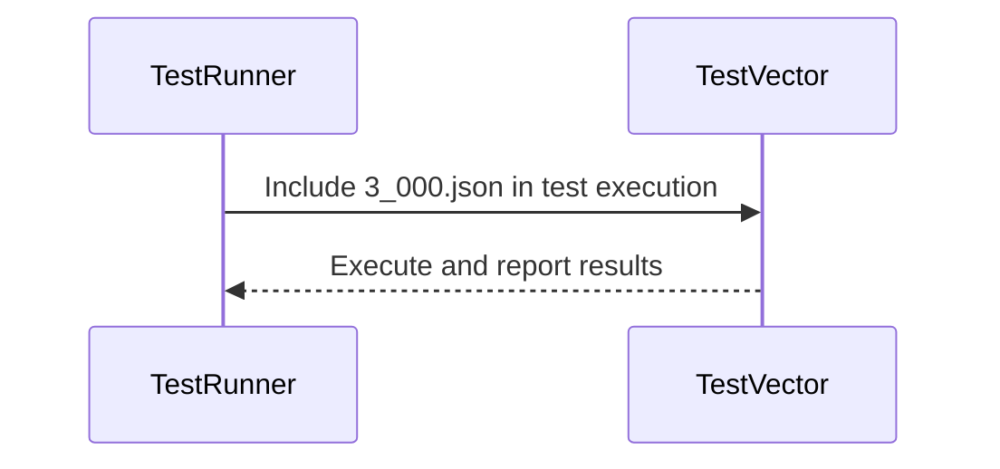
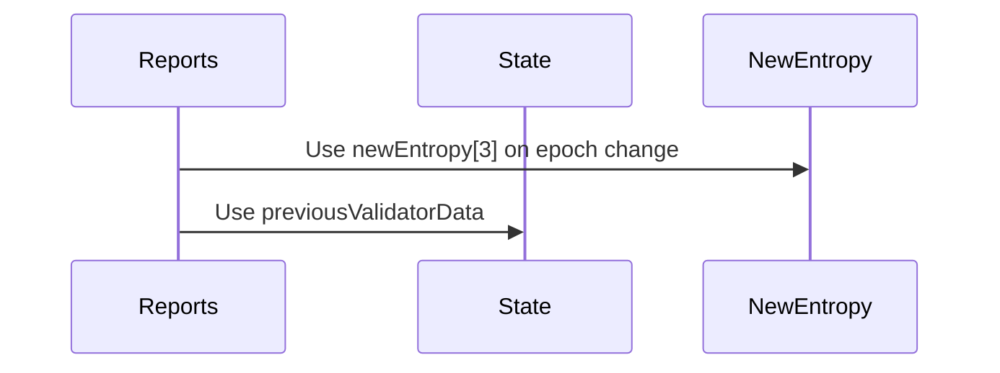

# Fix entropy in reports

## Pull Request by @mateuszsikora

 I found one more place where we should use entropy from safrole instead of entropy from state. Now all ordered accumulation tests are green

Relates https://github.com/FluffyLabs/typeberry/pull/516

## Comment by @coderabbitai[bot]

<!-- This is an auto-generated comment: summarize by coderabbit.ai -->
<!-- walkthrough_start -->

📝 Walkthrough

<!-- This is an auto-generated comment: release notes by coderabbit.ai -->

## Summary by CodeRabbit

* **Bug Fixes**
  * Updated the source of entropy used during epoch changes in guarantor assignment calculations for improved accuracy.
  * Re-enabled a previously ignored test vector, ensuring it is now included in test runs.

<!-- end of auto-generated comment: release notes by coderabbit.ai -->
## Walkthrough

The changes update the test runner configuration to include a previously ignored test vector and modify the logic in the guarantor assignment calculation to use a new entropy value during epoch transitions. No changes to exported or public declarations are present.

## Changes

| Cohort / File(s)                                           | Change Summary                                                                                                    |
|------------------------------------------------------------|------------------------------------------------------------------------------------------------------------------|
| **Test Runner Configuration** `bin/test-runner/jamduna.ts` | Removes `orderedaccumulation/state_transitions/3_000.json` from the ignored test vectors, including it in test runs. |
| **Guarantor Assignment Entropy Source** `packages/jam/transition/reports/reports.ts` | Changes entropy source in `getGuarantorAssignment` during epoch change from previous state to new entropy input.     |

## Sequence Diagram(s)

## Estimated code review effort

🎯 2 (Simple) | ⏱️ ~7 minutes

## Poem

> A test once ignored, now hops in the queue,  
> Entropy's source shifts, as logic renews.  
> With vectors included and epochs aligned,  
> The code hops ahead—no bugs left behind!  
> 🐇✨

<!-- walkthrough_end -->
<!-- internal state start -->

<!-- DwQgtGAEAqAWCWBnSTIEMB26CuAXA9mAOYCmGJATmriQCaQDG+Ats2bgFyQAOFk+AIwBWJBrngA3EsgEBPRvlqU0AgfFwA6NPEgQAfACgjoCEYDEZyAAUASpETZWaCrKNwSPbABsvkCiQBHbGlcSHFcLzpIACIAMXgAD0h2CnxueXgsf258ClxEaMgAdzRkBwFmdRp6OTDYD2xESkhmahJGgC9EeABrXLR0ZFtIDEcBZoBWAGYAJn4sXHqYWW4ScYoXPxIc7oIXDRgl1szGWExSFAwJfC8pZGyvNAZMojqGpv4AM2SMXFT0yCfVLMN72XBtYrqWA/P5peRAlj2NAIyKXeYeNC0WjqeD4DBoXxefAMai4rBFKEnRYeJhKASlEgHOCoTFCRq4Ni/H4OfzIRbUdA+fgUJT+ehPBiObykvFhELIbilMrYBgMaSIT7eLyyJlLYaofyPaphfDoHj+CS4xqeIX+IIhAA0IzGkwAjAA2J1FBAMaG8aSOFTa9BY3lNejdSqPPgpOFgQ1tehIBzSXUNbi0CHaZh803wZi8fBSUES7BUBjyXIKDDdRA0DAVr4w/7yRpoC4nbK5fKQUjkKjG2rU+yyOskZhpwFayBKcHwLzITD0bGISWIbqyklYcaA/DYDDi0LDwuWpT0ACqNgAMlxYLhcNxEBwAPTPohQ7ACDRMZjP2JebBPk+WQrxURBn1wFY1koFxn24LVn2mGYNCMfRjHAKAyHofBvjQPBCD7ZRjR/TlOHNfhhFEcQ7kgWpaWUVR1C0HQ0JMKBmWQFksDwghiDIIiohI9guCoIp7EcVpNjoxQGLUTRtF0MBDHQ0wDDUDAIJCeN937Z8hDQZhaH3NANHyDgDGiSyDAsSAAEEAEk+P7RNxKcTYcNOc5pDcJZfS8rZmCLaRQU+ecPGiXJRToUtmGlcQ8WfOs2gAfT+TBdjJcCpmSgAGPKNCERA8UKBEQWHLwkFCDz4CIDBciiGg60gKQxFyTiFiWRrQgoHTmiYDBQqIMsZQwXVUDYdK6gFRZUEQVZnlChg5Salq9khIU6sgIkMFIPgdxIBIGAAs9AWBZbQgO0Q8DJdAD3W3wd0yI7sBOqlOpCPx90QA4ADlTXwak+EC7FFpG3Mtvwd8GCdGCqzOA8Kp2p0q362FfE+IkxOcDx/SaX4UKMazLFsrwaAHTKTVBJQjucMGmwOnI8iiKt4IECqlvYHFvIMP7yCMABROt8xc+itktEgxJIIDuy4ABZOh4EcCyrIMCAwCMRUGB6dtpD0gyIKoGscQSrs8nA038lMp9leiIm7McwiByiBw3Mrb4/J27n3AUJRPM9lpFHgULguHIqyzVJth1jAEJAJYJIEaKJvTIUFtmJaEPdIZAjIoF5QSG2nfirJUaowUjGAJSUjTJA4rAtK1EG1J0o9+FtilKMI0B6FPStThJKrzpKaEATAJkGj+QBUyJQkimSAAAoAAMZu+ofGXHgBtKYAF0F4ASgOWzPjJ0FM5IZulnHlB2rHTFO+7rBe+HcgimDE94BOy/Mng0JJ4PA7IFnovZ+/NW5wk3jvfehwPBEihruPgTRIhiDzrHCqmY1poIGP4Y4NYE4NnhqQWgTohZCkaHnJeCAV7ghoBof0lo9yIAAGoEnftQXIAARagaAF5omXhXJoY1Fy0DZHWcuyJPhUT5EsBepBcAAHFsCFz2LZdcpdSLcLYIsRQo9IDw1oIjV4Hk06+jCIbDKeJkDJywLOSglQMB5xbrCAEnwqzHnrvQvwAMRoE3MMTUmREKYECpqIaMdNDEJEZsaFmn52Ywi5ogIwvNGQCyFq0YiMkxbwAlskaWeQuBXnwEUG2qElIqUwndDyPECL8SdvQISvwRJoDEi7SS8hpKihUHJZiilDBsQUKwdQyV36IGSvXCWdBkpJTyN00pkAcq0FdFMKY7pMwAHY0BoBmAAFhWZ8KYAAOVQMwSCbImHs45UwJgrNdLQAAnEs2g4wGArI8GhAwvSSIDKGSMkg4sijjKwtM3pzAGDcGSqjA6uAJngima8hecKDAAG8DCQBiJkboRA7wFC4OvLeDpkUxBKBQOxO0sWQBxQYAAvgYOFC8ZnAtBeChIkKAX6CAA=== -->

<!-- internal state end -->
<!-- tips_start -->

---

🪧 Tips

### Chat

There are 3 ways to chat with [CodeRabbit](https://coderabbit.ai?utm_source=oss&utm_medium=github&utm_campaign=FluffyLabs/typeberry&utm_content=532):

- Review comments: Directly reply to a review comment made by CodeRabbit. Example:
  - `I pushed a fix in commit <commit_id>, please review it.`
  - `Explain this complex logic.`
  - `Open a follow-up GitHub issue for this discussion.`
- Files and specific lines of code (under the "Files changed" tab): Tag `@coderabbitai` in a new review comment at the desired location with your query. Examples:
  - `@coderabbitai explain this code block.`
- PR comments: Tag `@coderabbitai` in a new PR comment to ask questions about the PR branch. For the best results, please provide a very specific query, as very limited context is provided in this mode. Examples:
  - `@coderabbitai gather interesting stats about this repository and render them as a table. Additionally, render a pie chart showing the language distribution in the codebase.`
  - `@coderabbitai read src/utils.ts and explain its main purpose.`
  - `@coderabbitai read the files in the src/scheduler package and generate a class diagram using mermaid and a README in the markdown format.`

### Support

Need help? Create a ticket on our [support page](https://www.coderabbit.ai/contact-us/support) for assistance with any issues or questions.

### CodeRabbit Commands (Invoked using PR comments)

- `@coderabbitai pause` to pause the reviews on a PR.
- `@coderabbitai resume` to resume the paused reviews.
- `@coderabbitai review` to trigger an incremental review. This is useful when automatic reviews are disabled for the repository.
- `@coderabbitai full review` to do a full review from scratch and review all the files again.
- `@coderabbitai summary` to regenerate the summary of the PR.
- `@coderabbitai generate sequence diagram` to generate a sequence diagram of the changes in this PR.
- `@coderabbitai resolve` resolve all the CodeRabbit review comments.
- `@coderabbitai configuration` to show the current CodeRabbit configuration for the repository.
- `@coderabbitai help` to get help.

### Other keywords and placeholders

- Add `@coderabbitai ignore` anywhere in the PR description to prevent this PR from being reviewed.
- Add `@coderabbitai summary` to generate the high-level summary at a specific location in the PR description.
- Add `@coderabbitai` anywhere in the PR title to generate the title automatically.

### Documentation and Community

- Visit our [Documentation](https://docs.coderabbit.ai) for detailed information on how to use CodeRabbit.
- Join our [Discord Community](http://discord.gg/coderabbit) to get help, request features, and share feedback.
- Follow us on [X/Twitter](https://twitter.com/coderabbitai) for updates and announcements.

<!-- tips_end -->

## Comment by @github-actions[bot]

View all

| File | Benchmark | Ops |  |
|------|-----------|-----|--|
| [bytes/hex-to.ts[0]](../blob/63dfee8f3ac1524e7803a1b237efdb231cd11e6c//_work/typeberry-1/typeberry/typeberry/benchmarks/bytes/hex-to.ts) | number toString + padding | 330529.64 ±0.5% | fastest ✅ |
| [bytes/hex-to.ts[1]](../blob/63dfee8f3ac1524e7803a1b237efdb231cd11e6c//_work/typeberry-1/typeberry/typeberry/benchmarks/bytes/hex-to.ts) | manual | 16372.48 ±0.53% | 95.05% slower |
| [hash/index.ts[0]](../blob/63dfee8f3ac1524e7803a1b237efdb231cd11e6c//_work/typeberry-1/typeberry/typeberry/benchmarks/hash/index.ts) | hash with numeric representation | 189.54 ±0.59% | 27.48% slower |
| [hash/index.ts[1]](../blob/63dfee8f3ac1524e7803a1b237efdb231cd11e6c//_work/typeberry-1/typeberry/typeberry/benchmarks/hash/index.ts) | hash with string representation | 121.26 ±0.69% | 53.61% slower |
| [hash/index.ts[2]](../blob/63dfee8f3ac1524e7803a1b237efdb231cd11e6c//_work/typeberry-1/typeberry/typeberry/benchmarks/hash/index.ts) | hash with symbol representation | 180.95 ±0.56% | 30.77% slower |
| [hash/index.ts[3]](../blob/63dfee8f3ac1524e7803a1b237efdb231cd11e6c//_work/typeberry-1/typeberry/typeberry/benchmarks/hash/index.ts) | hash with uint8 representation | 160.66 ±0.49% | 38.53% slower |
| [hash/index.ts[4]](../blob/63dfee8f3ac1524e7803a1b237efdb231cd11e6c//_work/typeberry-1/typeberry/typeberry/benchmarks/hash/index.ts) | hash with packed representation | 261.38 ±0.28% | fastest ✅ |
| [hash/index.ts[5]](../blob/63dfee8f3ac1524e7803a1b237efdb231cd11e6c//_work/typeberry-1/typeberry/typeberry/benchmarks/hash/index.ts) | hash with bigint representation | 190.31 ±0.37% | 27.19% slower |
| [hash/index.ts[6]](../blob/63dfee8f3ac1524e7803a1b237efdb231cd11e6c//_work/typeberry-1/typeberry/typeberry/benchmarks/hash/index.ts) | hash with uint32 representation | 200.21 ±0.36% | 23.4% slower |
| [logger/index.ts[0]](../blob/63dfee8f3ac1524e7803a1b237efdb231cd11e6c//_work/typeberry-1/typeberry/typeberry/benchmarks/logger/index.ts) | console.log with string concat | 7193754.76 ±36.97% | fastest ✅ |
| [logger/index.ts[1]](../blob/63dfee8f3ac1524e7803a1b237efdb231cd11e6c//_work/typeberry-1/typeberry/typeberry/benchmarks/logger/index.ts) | console.log with args | 1370433.83 ±86.31% | 80.95% slower |
| [math/add_one_overflow.ts[0]](../blob/63dfee8f3ac1524e7803a1b237efdb231cd11e6c//_work/typeberry-1/typeberry/typeberry/benchmarks/math/add_one_overflow.ts) | add and take modulus | 5362290.52 ±92% | 97.87% slower |
| [math/add_one_overflow.ts[1]](../blob/63dfee8f3ac1524e7803a1b237efdb231cd11e6c//_work/typeberry-1/typeberry/typeberry/benchmarks/math/add_one_overflow.ts) | condition before calculation | 252180788.19 ±5.58% | fastest ✅ |
| [math/count-bits-u32.ts[0]](../blob/63dfee8f3ac1524e7803a1b237efdb231cd11e6c//_work/typeberry-1/typeberry/typeberry/benchmarks/math/count-bits-u32.ts) | standard method | 81152188.16 ±1.53% | 68.16% slower |
| [math/count-bits-u32.ts[1]](../blob/63dfee8f3ac1524e7803a1b237efdb231cd11e6c//_work/typeberry-1/typeberry/typeberry/benchmarks/math/count-bits-u32.ts) | magic | 254893201.6 ±3.97% | fastest ✅ |
| [bytes/hex-from.ts[0]](../blob/63dfee8f3ac1524e7803a1b237efdb231cd11e6c//_work/typeberry-1/typeberry/typeberry/benchmarks/bytes/hex-from.ts) | parse hex using `Number` with NaN checking | 114180.56 ±0.5% | 84.9% slower |
| [bytes/hex-from.ts[1]](../blob/63dfee8f3ac1524e7803a1b237efdb231cd11e6c//_work/typeberry-1/typeberry/typeberry/benchmarks/bytes/hex-from.ts) | parse hex from char codes | 756025.45 ±0.19% | fastest ✅ |
| [bytes/hex-from.ts[2]](../blob/63dfee8f3ac1524e7803a1b237efdb231cd11e6c//_work/typeberry-1/typeberry/typeberry/benchmarks/bytes/hex-from.ts) | parse hex from string nibbles | 496266.91 ±0.41% | 34.36% slower |
| [codec/bigint.compare.ts[0]](../blob/63dfee8f3ac1524e7803a1b237efdb231cd11e6c//_work/typeberry-1/typeberry/typeberry/benchmarks/codec/bigint.compare.ts) | compare custom | 254676944.99 ±5.49% | 0.85% slower |
| [codec/bigint.compare.ts[1]](../blob/63dfee8f3ac1524e7803a1b237efdb231cd11e6c//_work/typeberry-1/typeberry/typeberry/benchmarks/codec/bigint.compare.ts) | compare bigint | 256868156.15 ±6.18% | fastest ✅ |
| [codec/decoding.ts[0]](../blob/63dfee8f3ac1524e7803a1b237efdb231cd11e6c//_work/typeberry-1/typeberry/typeberry/benchmarks/codec/decoding.ts) | manual decode | 16024820.05 ±1.12% | 90.67% slower |
| [codec/decoding.ts[1]](../blob/63dfee8f3ac1524e7803a1b237efdb231cd11e6c//_work/typeberry-1/typeberry/typeberry/benchmarks/codec/decoding.ts) | int32array decode | 171818255.62 ±2.83% | fastest ✅ |
| [codec/decoding.ts[2]](../blob/63dfee8f3ac1524e7803a1b237efdb231cd11e6c//_work/typeberry-1/typeberry/typeberry/benchmarks/codec/decoding.ts) | dataview decode | 163256532.97 ±2.56% | 4.98% slower |
| [codec/bigint.decode.ts[0]](../blob/63dfee8f3ac1524e7803a1b237efdb231cd11e6c//_work/typeberry-1/typeberry/typeberry/benchmarks/codec/bigint.decode.ts) | decode custom | 170736611.35 ±3.22% | fastest ✅ |
| [codec/bigint.decode.ts[1]](../blob/63dfee8f3ac1524e7803a1b237efdb231cd11e6c//_work/typeberry-1/typeberry/typeberry/benchmarks/codec/bigint.decode.ts) | decode bigint | 85226574.98 ±2.27% | 50.08% slower |
| [codec/encoding.ts[0]](../blob/63dfee8f3ac1524e7803a1b237efdb231cd11e6c//_work/typeberry-1/typeberry/typeberry/benchmarks/codec/encoding.ts) | manual encode | 2177902.01 ±2.01% | 29.33% slower |
| [codec/encoding.ts[1]](../blob/63dfee8f3ac1524e7803a1b237efdb231cd11e6c//_work/typeberry-1/typeberry/typeberry/benchmarks/codec/encoding.ts) | int32array encode | 2625029.98 ±2.63% | 14.82% slower |
| [codec/encoding.ts[2]](../blob/63dfee8f3ac1524e7803a1b237efdb231cd11e6c//_work/typeberry-1/typeberry/typeberry/benchmarks/codec/encoding.ts) | dataview encode | 3081729.89 ±0.32% | fastest ✅ |
| [collections/map-set.ts[0]](../blob/63dfee8f3ac1524e7803a1b237efdb231cd11e6c//_work/typeberry-1/typeberry/typeberry/benchmarks/collections/map-set.ts) | 2 gets + conditional set | 121295.66 ±0.15% | fastest ✅ |
| [collections/map-set.ts[1]](../blob/63dfee8f3ac1524e7803a1b237efdb231cd11e6c//_work/typeberry-1/typeberry/typeberry/benchmarks/collections/map-set.ts) | 1 get 1 set | 61453.32 ±0.27% | 49.34% slower |
| [math/count-bits-u64.ts[0]](../blob/63dfee8f3ac1524e7803a1b237efdb231cd11e6c//_work/typeberry-1/typeberry/typeberry/benchmarks/math/count-bits-u64.ts) | standard method | 1071057.63 ±1.59% | 86.34% slower |
| [math/count-bits-u64.ts[1]](../blob/63dfee8f3ac1524e7803a1b237efdb231cd11e6c//_work/typeberry-1/typeberry/typeberry/benchmarks/math/count-bits-u64.ts) | magic | 7840661.54 ±2.75% | fastest ✅ |
| [math/mul_overflow.ts[0]](../blob/63dfee8f3ac1524e7803a1b237efdb231cd11e6c//_work/typeberry-1/typeberry/typeberry/benchmarks/math/mul_overflow.ts) | multiply and bring back to u32 | 261621830.38 ±4.67% | 4.38% slower |
| [math/mul_overflow.ts[1]](../blob/63dfee8f3ac1524e7803a1b237efdb231cd11e6c//_work/typeberry-1/typeberry/typeberry/benchmarks/math/mul_overflow.ts) | multiply and take modulus | 273593712.59 ±4.79% | fastest ✅ |
| [math/switch.ts[0]](../blob/63dfee8f3ac1524e7803a1b237efdb231cd11e6c//_work/typeberry-1/typeberry/typeberry/benchmarks/math/switch.ts) | switch | 258892645.79 ±5.43% | 3.79% slower |
| [math/switch.ts[1]](../blob/63dfee8f3ac1524e7803a1b237efdb231cd11e6c//_work/typeberry-1/typeberry/typeberry/benchmarks/math/switch.ts) | if | 269082431.5 ±6.28% | fastest ✅ |
| [codec/view_vs_object.ts[0]](../blob/63dfee8f3ac1524e7803a1b237efdb231cd11e6c//_work/typeberry-1/typeberry/typeberry/benchmarks/codec/view_vs_object.ts) | Get the first field from Decoded | 54456.53 ±108.89% | 87.81% slower |
| [codec/view_vs_object.ts[1]](../blob/63dfee8f3ac1524e7803a1b237efdb231cd11e6c//_work/typeberry-1/typeberry/typeberry/benchmarks/codec/view_vs_object.ts) | Get the first field from View | 91838.96 ±0.23% | 79.45% slower |
| [codec/view_vs_object.ts[2]](../blob/63dfee8f3ac1524e7803a1b237efdb231cd11e6c//_work/typeberry-1/typeberry/typeberry/benchmarks/codec/view_vs_object.ts) | Get the first field as view from View | 67199.74 ±3.59% | 84.96% slower |
| [codec/view_vs_object.ts[3]](../blob/63dfee8f3ac1524e7803a1b237efdb231cd11e6c//_work/typeberry-1/typeberry/typeberry/benchmarks/codec/view_vs_object.ts) | Get two fields from Decoded | 446888.11 ±0.19% | fastest ✅ |
| [codec/view_vs_object.ts[4]](../blob/63dfee8f3ac1524e7803a1b237efdb231cd11e6c//_work/typeberry-1/typeberry/typeberry/benchmarks/codec/view_vs_object.ts) | Get two fields from View | 83598.11 ±0.1% | 81.29% slower |
| [codec/view_vs_object.ts[5]](../blob/63dfee8f3ac1524e7803a1b237efdb231cd11e6c//_work/typeberry-1/typeberry/typeberry/benchmarks/codec/view_vs_object.ts) | Get two fields from materialized from View | 172172.36 ±0.16% | 61.47% slower |
| [codec/view_vs_object.ts[6]](../blob/63dfee8f3ac1524e7803a1b237efdb231cd11e6c//_work/typeberry-1/typeberry/typeberry/benchmarks/codec/view_vs_object.ts) | Get two fields as views from View | 82207.86 ±0.85% | 81.6% slower |
| [codec/view_vs_object.ts[7]](../blob/63dfee8f3ac1524e7803a1b237efdb231cd11e6c//_work/typeberry-1/typeberry/typeberry/benchmarks/codec/view_vs_object.ts) | Get only third field from Decoded | 351939.33 ±2.03% | 21.25% slower |
| [codec/view_vs_object.ts[8]](../blob/63dfee8f3ac1524e7803a1b237efdb231cd11e6c//_work/typeberry-1/typeberry/typeberry/benchmarks/codec/view_vs_object.ts) | Get only third field from View | 97903.88 ±2.24% | 78.09% slower |
| [codec/view_vs_object.ts[9]](../blob/63dfee8f3ac1524e7803a1b237efdb231cd11e6c//_work/typeberry-1/typeberry/typeberry/benchmarks/codec/view_vs_object.ts) | Get only third field as view from View | 104060.3 ±0.12% | 76.71% slower |
| [codec/view_vs_collection.ts[0]](../blob/63dfee8f3ac1524e7803a1b237efdb231cd11e6c//_work/typeberry-1/typeberry/typeberry/benchmarks/codec/view_vs_collection.ts) | Get first element from Decoded | 27805.62 ±0.16% | 59.5% slower |
| [codec/view_vs_collection.ts[1]](../blob/63dfee8f3ac1524e7803a1b237efdb231cd11e6c//_work/typeberry-1/typeberry/typeberry/benchmarks/codec/view_vs_collection.ts) | Get first element from View | 68658.91 ±0.15% | fastest ✅ |
| [codec/view_vs_collection.ts[2]](../blob/63dfee8f3ac1524e7803a1b237efdb231cd11e6c//_work/typeberry-1/typeberry/typeberry/benchmarks/codec/view_vs_collection.ts) | Get 50th element from Decoded | 23976.2 ±3.32% | 65.08% slower |
| [codec/view_vs_collection.ts[3]](../blob/63dfee8f3ac1524e7803a1b237efdb231cd11e6c//_work/typeberry-1/typeberry/typeberry/benchmarks/codec/view_vs_collection.ts) | Get 50th element from View | 38745.97 ±0.21% | 43.57% slower |
| [codec/view_vs_collection.ts[4]](../blob/63dfee8f3ac1524e7803a1b237efdb231cd11e6c//_work/typeberry-1/typeberry/typeberry/benchmarks/codec/view_vs_collection.ts) | Get last element from Decoded | 27896.11 ±0.24% | 59.37% slower |
| [codec/view_vs_collection.ts[5]](../blob/63dfee8f3ac1524e7803a1b237efdb231cd11e6c//_work/typeberry-1/typeberry/typeberry/benchmarks/codec/view_vs_collection.ts) | Get last element from View | 26758.42 ±1.26% | 61.03% slower |
| [hash/blake2b.ts[0]](../blob/63dfee8f3ac1524e7803a1b237efdb231cd11e6c//_work/typeberry-1/typeberry/typeberry/benchmarks/hash/blake2b.ts) | hasher with simple allocator | 0.0452 ±1.78% | 0.44% slower |
| [hash/blake2b.ts[1]](../blob/63dfee8f3ac1524e7803a1b237efdb231cd11e6c//_work/typeberry-1/typeberry/typeberry/benchmarks/hash/blake2b.ts) | hasher with page allocator | 0.0454 ±0.81% | fastest ✅ |
| [bytes/compare.ts[0]](../blob/63dfee8f3ac1524e7803a1b237efdb231cd11e6c//_work/typeberry-1/typeberry/typeberry/benchmarks/bytes/compare.ts) | Comparing Uint32 bytes | 20307.98 ±0.16% | 2.18% slower |
| [bytes/compare.ts[1]](../blob/63dfee8f3ac1524e7803a1b237efdb231cd11e6c//_work/typeberry-1/typeberry/typeberry/benchmarks/bytes/compare.ts) | Comparing raw bytes | 20760.34 ±0.08% | fastest ✅ |
| [collections/map_vs_sorted.ts[0]](../blob/63dfee8f3ac1524e7803a1b237efdb231cd11e6c//_work/typeberry-1/typeberry/typeberry/benchmarks/collections/map_vs_sorted.ts) | Map | 306869.47 ±0.04% | fastest ✅ |
| [collections/map_vs_sorted.ts[1]](../blob/63dfee8f3ac1524e7803a1b237efdb231cd11e6c//_work/typeberry-1/typeberry/typeberry/benchmarks/collections/map_vs_sorted.ts) | Map-array | 103778.48 ±0.03% | 66.18% slower |
| [collections/map_vs_sorted.ts[2]](../blob/63dfee8f3ac1524e7803a1b237efdb231cd11e6c//_work/typeberry-1/typeberry/typeberry/benchmarks/collections/map_vs_sorted.ts) | Array | 83944.77 ±2.26% | 72.64% slower |
| [collections/map_vs_sorted.ts[3]](../blob/63dfee8f3ac1524e7803a1b237efdb231cd11e6c//_work/typeberry-1/typeberry/typeberry/benchmarks/collections/map_vs_sorted.ts) | SortedArray | 200560.06 ±0.25% | 34.64% slower |
| [crypto/ed25519.ts[0]](../blob/63dfee8f3ac1524e7803a1b237efdb231cd11e6c//_work/typeberry-1/typeberry/typeberry/benchmarks/crypto/ed25519.ts) | native crypto | 5.65 ±17.5% | 81% slower |
| [crypto/ed25519.ts[1]](../blob/63dfee8f3ac1524e7803a1b237efdb231cd11e6c//_work/typeberry-1/typeberry/typeberry/benchmarks/crypto/ed25519.ts) | wasm lib | 10.65 ±0.02% | 64.18% slower |
| [crypto/ed25519.ts[2]](../blob/63dfee8f3ac1524e7803a1b237efdb231cd11e6c//_work/typeberry-1/typeberry/typeberry/benchmarks/crypto/ed25519.ts) | wasm lib batch | 29.73 ±0.65% | fastest ✅ |

### Benchmarks summary: 63/63 OK ✅

<!-- thollander/actions-comment-pull-request "benchmarks" -->
