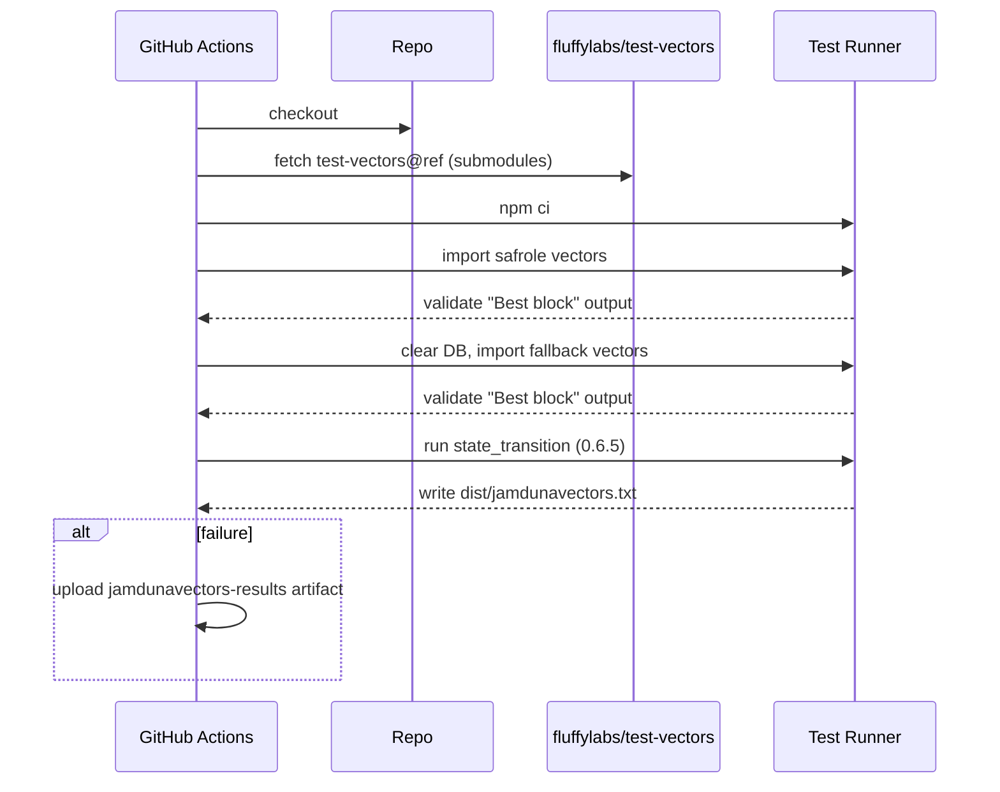
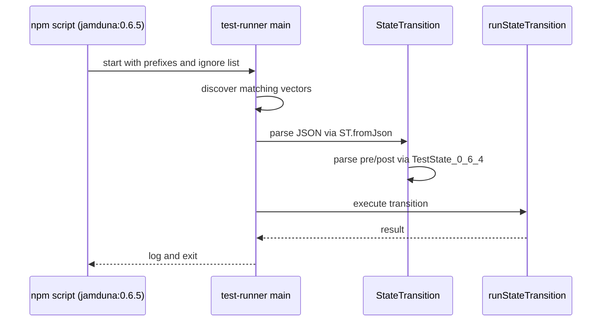

# Run jamduna tests in versions 064 and 065

## Pull Request by @mateuszsikora

This PR adds scripts and CI pipelines to run jamduna tests in two versions: `0.6.4` and `0.6.5`. Almost all `0.6.5` tests are currently ignored. It will be fixed in next PRs.

Related changes in test vectors repo: https://github.com/FluffyLabs/test-vectors/pull/4


## Comment by @coderabbitai[bot]

<!-- This is an auto-generated comment: summarize by coderabbit.ai -->
<!-- This is an auto-generated comment: skip review by coderabbit.ai -->

> [!IMPORTANT]
> ## Review skipped
> 
> Auto incremental reviews are disabled on this repository.
> 
> Please check the settings in the CodeRabbit UI or the `.coderabbit.yaml` file in this repository. To trigger a single review, invoke the `@coderabbitai review` command.
> 
> You can disable this status message by setting the `reviews.review_status` to `false` in the CodeRabbit configuration file.

<!-- end of auto-generated comment: skip review by coderabbit.ai -->
<!-- walkthrough_start -->

<details>
<summary>📝 Walkthrough</summary>

<!-- This is an auto-generated comment: release notes by coderabbit.ai -->

## Summary by CodeRabbit

* **New Features**
  * Added versioned JAMDUNA test suites with dedicated runners for 0.6.4 and 0.6.5.
  * Introduced updated state format handling aligned with 0.6.4.
  * Provided separate CLI scripts: jamduna:0.6.4 and jamduna:0.6.5.

* **Tests**
  * Added a new workflow to validate 0.6.5 vectors, including import checks and state-transition runs with artifact upload on failure.
  * Updated 0.6.4 workflow naming and test suite selection.

* **Chores**
  * Standardized workflow and environment variable names to use explicit versioning.

<!-- end of auto-generated comment: release notes by coderabbit.ai -->
## Walkthrough
Versioned Jamduna test suites introduced (0.6.4, 0.6.5). CI updated with a renamed 0.6.4 workflow and a new 0.6.5 workflow. Core enum split to versioned entries. Test-runner mappings and scripts adjusted. State models updated with a legacy 0.6.4 shape and a new structured state, reflected in transitions.

## Changes
| Cohort / File(s) | Summary |
| --- | --- |
| **GitHub Actions Workflows**<br>`.github/workflows/vectors-jamduna-064.yml`, `.github/workflows/vectors-jamduna-065.yml` | Rename 0.6.4 workflow, update TEST_VECTORS_REF and TEST_SUITE. Add new 0.6.5 workflow with matrix jobs (import, state_transition), explicit validations, and artifact handling. |
| **Core Compatibility Enum**<br>`packages/core/utils/compatibility.ts` | Replace TestSuite.JAMDUNA with versioned entries: JAMDUNA_064, JAMDUNA_065. |
| **Test Runner Mapping & Scripts**<br>`bin/test-runner/index.ts`, `bin/test-runner/package.json`, `bin/test-runner/jamduna_0_6_5.ts` | Map JAMDUNA_064 to jamdunavectors_064. Add versioned scripts jamduna:0.6.4 and jamduna:0.6.5. Introduce runner for 0.6.5 with accepted prefixes and ignore list. |
| **Jamduna State Types and Transitions**<br>`bin/test-runner/jamduna/state-loader.ts`, `bin/test-runner/jamduna/state-transition.ts`, `bin/test-runner/jamduna/state-transition-fuzzed.ts` | Add TestState_0_6_4 (array-of-tuples). Update TestState to structured key/value objects. Transition classes now use TestState_0_6_4 for pre/post state and fuzzed parsing. |

## Sequence Diagram(s)




## Estimated code review effort
🎯 3 (Moderate) | ⏱️ ~20 minutes

## Poem
> A burrow of versions, tidy and bright,  
> I nibble through vectors by moonlit night.  
> 0.6.4 hums, 0.6.5 sings,  
> States line up in orderly rings.  
> With paws on CI and whiskers in code,  
> I thump “all green!” down the review road. 🐇✨

</details>

<!-- walkthrough_end -->
<!-- internal state start -->


<!-- DwQgtGAEAqAWCWBnSTIEMB26CuAXA9mAOYCmGJATmriQCaQDG+Ats2bgFyQAOFk+AIwBWJBrngA3EsgEBPRvlqU0AgfFwA6NPEgQAfACgjoCEejqANiS4AlbFiFpmte2kg1EuZPCxSKieHwMZAAGADYAFnQMenCAVgMAOWxmAUouOIBmBIBVRHTIZmoSbEQALwCAa3wqI31jcCgyenwAMxwCYjJlGnomVnYuXn5hUXEpGXkmJSpVdS0depMoOFRUTA7CUnIqXoUBjE5IKgB3SEQUoop5OQUZlTVNbV0wQwbTAw0idVhsAQB6E41SqtCz4E6If5SMQ1RBgRzOVxgcIRDSyZgWDgGABEuIMAGJ8ZAAIIASS6O2K9AurDQ1347QYsEwpEQdUgOW4tCp7lgJEgAGFSZAgRQQWCzl8fn9AcDQeDIdCCP54U4XBg0MjImiMVxcHyRXKJZANWwTeCUBgGBZsEpkPr+X4AkFzthWq14AAPSAhDRhDQRADcMAAogBlaAAfQAaiGBdAAPI2MORmwhgBikDIEngFCCbEOkAkdPgKiskGwXJ5BHQJpIZ36zHUkGZiFgweg4ajYZypM7WYwObzGALuCLJbL/IoZCcdEgrTzzEgCPVbhrK9ckZRGkgCYdfEqJFkyGnRR8FatzIwpFoGiMRkJJIsNF2gWC7nwvP5SmtdOob+QNos09bgaj2GoeD+Cx4AYAdxHEaR2QABSgmC4PUeRK25XouAAA1NEhcMtSBcKlfUZVFcUFShMZYVVRENS1VF0QsIiFxYEiNw1dxpDHJVYSIwAkwk4tVXB4zwi1o/wfT9ANcIMKAUIEaDYPYDCKyrHCSOzDROwjGM40TZNUwzIjz1I75yIBSj5QhGiYRVLjNW3Fi2MXEiIloEISAATjiAB2AQfLCHzfP8iI0H82gBH8kIAEZItoVp/IYbkGAETIAA4IgAJkyzIvKEkjgribKwhCOIcsyVQ4gEEIcribzWjCAQwlaBgQgiTLKpIEJMtoWh/LCWgwji+TFNQ1TDnUrCqTwnS9O7XtOzMrALOlayjWo/jHNExiXIxNyONwpyipOva0C3SJ5IMENPHgIo9mmKcSBzess3dMCuAAWToeAUhxPEFI+Mjfk2sVbMVKS4ScrU4h1TFAexAkiTJCkejnGkrnkICmRZRCDGJAbkDccgzgAcXUAAJP4STEADDQh40CPoQAcAic8S+OhmT/TiQBcAl5ah3AoeAiFIaSXRsiVI1oJBuGoJlonobhsAsCxI2nABHbBeI/QptAwHcABESA9chkGzXN83YccRcnZBFoM+MkxTNN0wAGkgcmkIM5NSQTRJIAACl9XmAEpPcwehHZ7PsQ2DpyrriMOd1JQ48xcBhpHcIFzhICxWjAWB8E8OhPcSRQSA0IRkBynKNG9R6Re9IRBEQLgHtAigxyj85cGKSNcCoYJ1DfO8FJQZgu6OJlREqQC8C/Y4SFAz3WhIXBZ/tXiwB25B2KXUE3VaWQLBUSEPFwXfuaFtxEG4UR4A9WDp3aE4fldARmEUVXpE9ih7DIAwNwJcDB4Ce2tCQOk9oDRggYGgCwkBsIqDQPkT2ncwLIEQGgdi5Ze4OiwK0BBFgBBoAYJUSAyl8DkOQDmUmIC+50jHBASe08IFoG4LgbA04F64BVl4PWNBPRjg9FYRAkcYjjmgthbO+ohZQMVhg7ukBZDwHzrQGB/ISAgTGHOVmAAhXWVDyEC2guQYM2j1DIHfvqaIWYKB5j4E/KR8BsJvnnNoCwiAdwCisJgTRSDqAoPyJQjeJwSBkFYZgu8UBPADyHv40eQQuCzxofwPA6Dgj9zVsgJQD8YhkDAX/Y4gCl6XzAAAjAOxGbz3llnT2st75n2PMvC4z597uUabgf4Tk94aFwMIiRfQgiy3EEEYhmFuBgjQBouxTCn5kLHCzZcF094VOkKrARziHR9xXh4+AXjx6rGsVtM4NQt4JI8JJByUTlHFmkf+F0vc75/HyNrG2cSaBgASSPMZWBKmexsbAYCUyYLNguAwLOiBIREIOdw/kqT55K3QN3BZYgWxRzMUQceD5UbPh6AzGsOyfxn1fEEQC7RtHTznBBFWyk0JqQQmyCeFcQVgToP8OlKkkGiFJY89839ZYejoOPO64hHpzmesvN6ZxTatC+pAX6ssAa4mRsDMARg1AYH+OUypOx/g+CUJ6fp7ckYoxJOSbYGNqSXDpDjRkV5WTshsCvM+Wd6A7KKNwbgPgiBwXpPKvgOyABSxJvpGxyIkYknNXTqGsOaM4pRs7QF4mGbAcaNChvDZG4kV0oioKXoeeQPhS4zIZDAVN6aaCZrDRGqNQyl5MAcdIUCMRfVSJ1owR1c4D4rIYmgPeetenQzzTEmACBkB42vNnE4CBFaX3nAc/kqBKnItnTBYFXT0l8MXqgXgP93Uij5FgGOy1475CsGIAJWa625pRLbUshwuDDocogUdWyLaelEHgOcvcuk9NWSO7cAyxyoBOCLXANBDYT2JGrfg+5IBgm+C/EgZ53w7OwWwLgFw43QHwHYf50h8AWAmEvUR/IazaO/TQIspYl7Zltg24lSAxz4DwPwk0s4UC5MoJIHt7lPUcIfvQe5OtgwYE/GTexjiMUxCxfwPgTB07EbALZLt+NvH3nNbBl8/L7SfmJbyv8fyKVsu7jSvgXKGXTSZeyCu5AjBioejyKV04ZUfUDUcJV/1mBmvVZqnwOqd56soAB/t/xPkkDANMmYJqsSqu05a7ouxMa2vpLjbtzKoBpyHge7OpN3pWZQ7waQ7B+UVs8GGfuNAtyRjCJGKIgal4lZzGxrB1X+Rtg4SQQFfJpyQCLfc7wJMsB0ioPavuItrxgE8FNv1XCpnZyDoNhB7dIBVeKAAaSPNGBBABtAAusGFbXieDQN/cgGuQQtAOLQLIIOV3DZjbu0HbEs3fXYjDl9sdOWM7YChbWKTRXl4lfyIccrKbKsdZFB/ArZwusPy4Cd4bczbsTcECIK9kAADeA2jxcATPLd5VNUHtg7fG/RsgPD6LBAISAABfYOny0IH2DYgZJkB0yLjZ0EYAkPcAbZoHoSAABeHHjCat5nwEcDQsvPbI+fezp7aOg646LVwVnSuNByA8JkHKQcI7k419zrXOvpA08EAzsOVux2chkQE5H7hZAP3nBBfngv+S9o99t2Qu2LCHaZ0PX1h3rc1jV/j3cROdYk7bMGUTFOqfm9pwzgPvcm08NbbLa884Tculm/9rh04x1E1mW4YHuBnfLqnmBCs2DSCu74ITtAxPSfBzoU7l3TeW9tlD5+C43qa87Kk0Wjvy6T2po62O7bK92sDylz3ZAHubD4GlzH4FQczeID19bprAhpfAunKDsrJmx1wARZl9A7oxj8AwBYeQxKgnnGZA/f4wawwBzO/4dtQEF2ReDDFj3ZFSpcVfkNIZkVrPgU8A2eDPrd+EJewKdG8HFbTfFMldDAzA0ElYzBmICKldlFoSzSadCWzGDAaOgLgXxVBB2CfAeEIOrBrYiLVILTwCpewfVJyCLDraLfAGZSgE1AwSAXQSAJSblAIIgDUQveNAQwQoQ5nWCTXDnLnFgHnDAPnGgmrOg+rCIYXMXXHSLDWFfI4BQw2TfPXA3eXI8IbRXa7Z7e7R7G7cbV7d7a8T7Q3enQMaQwQ2JDrAw6XEALgJfQwtfDwmQoQ5Hfw9bDrH3P3Q7Dwieb6RQJ+NRWgCgs+aFCrAXaHc8Jg3VNg0LDgyLbg3gigfgrw4QogsQiQ+FdTadU1UI7w/8eQ3PDALgJQ5gFQtQqHYoHQ8XfQ+fY3ZQ03RPLffXQ3BXZcLXWw1XPHWQAY9ooY3XUYz2ePOYlQ7XYYi3OnenNwkImQhoyXQwiIwI1fUnXYso8IrgcPWYyPZvaPU4o3SASnanZPenWIxze6CVYZJQaVNRWVT6buH6P6FVIGCADVAwHI4LPIigMLVcTg4ob5YeAIP5VTbAMoMoEVLweLPER8NGK1FLG1WkdLB1DTZ1V1MhOcUoNAevICd3aHIFDIj3WrLQnPDiDDLgmLSgQoH+KwHcO3HkJRHuSFGoLPIgO/H7LAD3aAREpJDAdMVE9E28Ywz2HZErSMSLfWb1dtRA/jDiWk4oDQYwvWPUjQ+g1EYw0/A0YHX8dI4VCwZWacNU6HCvF3bU+gXtY0ijT8D0pkhrSOaCcQ9tekofd6dU50quLTHE1AvTQRTAozNA0zPA8zAgyCelKaeCNRLLSAUkavZRV0vCAU8XD0z2AA6HRnXtbEDQOEr5DkkomubEQMM6As3Hb0zQ30xDHg2gQAss9yCsqsqLGs6uRAes1aEiCElgkLaEgorgn5JEt8FEtEjExAcaSIxoxddRDUn1bPPMkiVUyLLgD0g05os6Xcjrfc9QkgH0s0o84iXCSU6Uv5OUhc2gIia07wNaMcq+CcmE1wPshExJZE1oeUxc5ckQlnNRO084UWKo/rbc3CE84oCIj0hsyAYSOCh0yLRC88y85C8yO8/8t8R8hUl8tIt80cwLXIqpfIi6X8mcmU+chUk1G6JzT4u4F6dzOVBVbzYEtVUEgLbVCi9g6iwo2iv5OLM1HEpLSkPYLGO1ctbUzMvC35dxCTRNfIEmSSL/IIGbB+MBZ+CXCjSvYOFs0063EtGgMtH/A0PEtCD0hvHgdC6HXuUCTwR0/U8dKvaebjDSGRD1T8AQObBknw1sxrATA0Qogc9yiXFnZojc9tJreCmjJykuXAVymjFS5edeacK0ZNLC4Kw8wYl0XfffNcu07xQUGoDPEZdtYHLA+M+yi89UpKlyxq/rWaPYIlQy4yrQ5AyM3TEzGM78OM6M3AkCfAhTFM7lRlDM9kbMzyyo6gaotq8grMrAD81gyiycoS6c+8seLwZUg0As10lk3zMopswK4oYsjsrs46yAXs8Kjsvgus3YggaQqAM6rqtsks4oBnG6u69kh62socuIqAQXaKgqrAL1Tcv1JalIlalcmgKU/C67JU+q1K/kJqlK9U9K1+SgQpfkD6q88Gy0UtFodoA8805CIg20+gWq6MmG/cg0V8+y/AB+VFbOI6g+V61GjCs8romgXYqAZyzGjrTCvmkgZ6/ALmhKkgUWzI2g00gWngZKtG2Wxk4K4G8o1MyAN/D/SG9temuGxS2c5G5o/a/kItNkMo6W3muW6tYwqW5Wvc86u25o6QukfkFSqWhy4oG2tW00/K+YoIB25q0852i8vK+226D4lzSuH496DigExVIE3zBLfzcE8iyEja78jUH0+GTE8S1GSS61V0QkibeSowEvdSqTASzkxABgEWThdAMcNar8xOVsvOmBIWJTD0IgeFEbegKjBgH9dS/QkS9xBdZkCgc2feCCDmCQUODQeGLM0DHMgRJDcWT2NDBtCcm6xsa7GuZFI2mUngG0E8ewI+v5G64SnaoIGim+w2GuVOMcJQM2fLSC68csCcrgAiW60e++7ET2eWfwTki+seFGq8WgKwSA8+jrRGpS67Zey0CQfAQ8ZANDGHWxHZCc8RZmqFbxOkIgCQc4FSHrShVBfkeWWxbEcpPebOtAAB5FDYFm/qjHa/JTfuHwdtMhLOThOcErD0L9GevgayhgPswee+yESOaFbhTAKFMRse8lf4BtYU3GtKIe5gVWfleRiR/4dAMEbPekjYbRKDAIKQFAcQmofkaCCSICe+R+PSnWwOQdMhPMdI/UEuBFYoIgGoDMncBMLACFPB9BMcJDAJHhTZWjNwdevgpDYMF0SgRxYJ9sogAJBJiCXuSxARekqVMAOKHqvFPqwlDAwa38Oqka6lZM4HKagmKAVleSvWeayQhM0apMzlIg2mk/d48VGO74tzX4jzTi5OvzXi9O/izO/VOpSoKkquR7LE5GCS9GfEku7GOSzLIwF1KZckj1MK31csDmOuhuscIM3OJ0Ocux3StCA5+AThMql1b+KQbZ/kDmdgekORUDQcFBucJyE1Rhsg+gJyDgBe/NSRAFheuIf1DMz2BRYFHwZByodtNu/2gRXuRF+rDu1pHS8YfOWQHcY5Go1kZrIggUAAGWFAuAoCISzhuqCE63ruubHCJROcoGdHIGpDpZufyafEKfJQGp5VKeGspRafAkIK1uqYUvZbHFPHwAeefQukYIzvHKhM5TISmdIEHJdCDkafhTwmxCcmxC4GxFPTjhFw5i8G9ErO+a8GxFwjDgnjDAlfQD+dlf7UBdkiiGyIVc/KVcmemfVawE1agoWunB1dBbdf1duqNc7BNblbNcgAtYukvJNWtdtZBodZmSUFhtDd5nlbGcVazp9bVceyZ0DckJDYuldd5nDcNa7EjFjijdNcQHNbodzqTZta6ecyeljr6fjv+K8yGdTpGYLekH+CbRIH+DwAOUhH6EofgDUGggrzEoSwWbxJ5BkqJPxZqbhvdyrVIcPzdTnAw12f5DYFSE5JvRzVF1ur1YweBVwFzikxPbSH8C4HPajTzUvd1YTZRGxGRVfbvTCHBbF0/f7STgrN3AQ0feZeXnQYQO7VvAjIKYJR5aJVjP5ZYcFYqfGqqZs2monhDAwBSEKFQyfeg+leWtwj/aOiXFwm3bjRHLgpVemancsfHfEC8RHZYBnbnYwkYrw4I6XEg74HTfI7/bzSInpPjxImA9XDzWtb1ho8rTo5vKHeY+nFY8nY46nn/G44Xa8GXPw8I8E8dYzbwlE/iHE4/kk9wmk83HiDk5rAU8qx3fo5U447U4nfY+ne04OR470/bZYtc1en6YTr7eVRTpBNeHeCaEkSAjQDwC2GSxjoOCOFOGWdktuGelmEeAWBeEMGWH2CbBStcTfW7fCVoFcuUXqAMHy76n8jQByh8gEAijCByloFykyha78loG6gYFqhIH8laGqlyjSAEEyjq7CDCFy6i4K/UEjGK41iC/rDoEjGaCm/y+YAYG4EjHYeMYq+YUi4MFwiO4MGx2kOxBLVFlgCta4EO3djO5ODpAwF9SHJu4OwMHp0O+O+q8aEKE2+26CCERStW/0CAA= -->

<!-- internal state end -->
<!-- tips_start -->

---


<details>
<summary>🪧 Tips</summary>

### Chat

There are 3 ways to chat with [CodeRabbit](https://coderabbit.ai?utm_source=oss&utm_medium=github&utm_campaign=FluffyLabs/typeberry&utm_content=535):

- Review comments: Directly reply to a review comment made by CodeRabbit. Example:
  - `I pushed a fix in commit <commit_id>, please review it.`
  - `Open a follow-up GitHub issue for this discussion.`
- Files and specific lines of code (under the "Files changed" tab): Tag `@coderabbitai` in a new review comment at the desired location with your query.
- PR comments: Tag `@coderabbitai` in a new PR comment to ask questions about the PR branch. For the best results, please provide a very specific query, as very limited context is provided in this mode. Examples:
  - `@coderabbitai gather interesting stats about this repository and render them as a table. Additionally, render a pie chart showing the language distribution in the codebase.`
  - `@coderabbitai read the files in the src/scheduler package and generate a class diagram using mermaid and a README in the markdown format.`

### Support

Need help? Create a ticket on our [support page](https://www.coderabbit.ai/contact-us/support) for assistance with any issues or questions.

### CodeRabbit Commands (Invoked using PR/Issue comments)

Type `@coderabbitai help` to get the list of available commands.

### Other keywords and placeholders

- Add `@coderabbitai ignore` anywhere in the PR description to prevent this PR from being reviewed.
- Add `@coderabbitai summary` to generate the high-level summary at a specific location in the PR description.
- Add `@coderabbitai` anywhere in the PR title to generate the title automatically.

### Status, Documentation and Community

- Visit our [Status Page](https://status.coderabbit.ai) to check the current availability of CodeRabbit.
- Visit our [Documentation](https://docs.coderabbit.ai) for detailed information on how to use CodeRabbit.
- Join our [Discord Community](http://discord.gg/coderabbit) to get help, request features, and share feedback.
- Follow us on [X/Twitter](https://twitter.com/coderabbitai) for updates and announcements.

</details>

<!-- tips_end -->


## Comment by @github-actions[bot]


<details>
<summary>View all</summary>

| File | Benchmark | Ops |  |
|------|-----------|-----|--|
| [bytes/hex-from.ts[0]](../blob/f47e3ed3076ecfbadafb323e6faf5a96f1dc2abb//_work/typeberry-runner-2/typeberry/typeberry/benchmarks/bytes/hex-from.ts) | parse hex using `Number` with NaN checking | 135320.79 ±0.7% | 84.08% slower |
| [bytes/hex-from.ts[1]](../blob/f47e3ed3076ecfbadafb323e6faf5a96f1dc2abb//_work/typeberry-runner-2/typeberry/typeberry/benchmarks/bytes/hex-from.ts) | parse hex from char codes | 850120.54 ±0.77% | fastest ✅ |
| [bytes/hex-from.ts[2]](../blob/f47e3ed3076ecfbadafb323e6faf5a96f1dc2abb//_work/typeberry-runner-2/typeberry/typeberry/benchmarks/bytes/hex-from.ts) | parse hex from string nibbles | 539338.96 ±0.24% | 36.56% slower |
| [math/count-bits-u64.ts[0]](../blob/f47e3ed3076ecfbadafb323e6faf5a96f1dc2abb//_work/typeberry-runner-2/typeberry/typeberry/benchmarks/math/count-bits-u64.ts) | standard method | 1313985.69 ±0.27% | 89.32% slower |
| [math/count-bits-u64.ts[1]](../blob/f47e3ed3076ecfbadafb323e6faf5a96f1dc2abb//_work/typeberry-runner-2/typeberry/typeberry/benchmarks/math/count-bits-u64.ts) | magic | 12300553.62 ±0.41% | fastest ✅ |
| [hash/index.ts[0]](../blob/f47e3ed3076ecfbadafb323e6faf5a96f1dc2abb//_work/typeberry-runner-2/typeberry/typeberry/benchmarks/hash/index.ts) | hash with numeric representation | 192.63 ±0.17% | 22.9% slower |
| [hash/index.ts[1]](../blob/f47e3ed3076ecfbadafb323e6faf5a96f1dc2abb//_work/typeberry-runner-2/typeberry/typeberry/benchmarks/hash/index.ts) | hash with string representation | 113.35 ±0.22% | 54.63% slower |
| [hash/index.ts[2]](../blob/f47e3ed3076ecfbadafb323e6faf5a96f1dc2abb//_work/typeberry-runner-2/typeberry/typeberry/benchmarks/hash/index.ts) | hash with symbol representation | 176.35 ±0.26% | 29.42% slower |
| [hash/index.ts[3]](../blob/f47e3ed3076ecfbadafb323e6faf5a96f1dc2abb//_work/typeberry-runner-2/typeberry/typeberry/benchmarks/hash/index.ts) | hash with uint8 representation | 161.77 ±0.17% | 35.26% slower |
| [hash/index.ts[4]](../blob/f47e3ed3076ecfbadafb323e6faf5a96f1dc2abb//_work/typeberry-runner-2/typeberry/typeberry/benchmarks/hash/index.ts) | hash with packed representation | 249.86 ±0.33% | fastest ✅ |
| [hash/index.ts[5]](../blob/f47e3ed3076ecfbadafb323e6faf5a96f1dc2abb//_work/typeberry-runner-2/typeberry/typeberry/benchmarks/hash/index.ts) | hash with bigint representation | 185.46 ±0.16% | 25.77% slower |
| [hash/index.ts[6]](../blob/f47e3ed3076ecfbadafb323e6faf5a96f1dc2abb//_work/typeberry-runner-2/typeberry/typeberry/benchmarks/hash/index.ts) | hash with uint32 representation | 203.82 ±0.37% | 18.43% slower |
| [logger/index.ts[0]](../blob/f47e3ed3076ecfbadafb323e6faf5a96f1dc2abb//_work/typeberry-runner-2/typeberry/typeberry/benchmarks/logger/index.ts) | console.log with string concat | 7028925.96 ±60.78% | fastest ✅ |
| [logger/index.ts[1]](../blob/f47e3ed3076ecfbadafb323e6faf5a96f1dc2abb//_work/typeberry-runner-2/typeberry/typeberry/benchmarks/logger/index.ts) | console.log with args | 1062365.85 ±93.37% | 84.89% slower |
| [math/add_one_overflow.ts[0]](../blob/f47e3ed3076ecfbadafb323e6faf5a96f1dc2abb//_work/typeberry-runner-2/typeberry/typeberry/benchmarks/math/add_one_overflow.ts) | add and take modulus | 215924517.01 ±29.02% | 15.09% slower |
| [math/add_one_overflow.ts[1]](../blob/f47e3ed3076ecfbadafb323e6faf5a96f1dc2abb//_work/typeberry-runner-2/typeberry/typeberry/benchmarks/math/add_one_overflow.ts) | condition before calculation | 254312091.61 ±7.49% | fastest ✅ |
| [codec/bigint.decode.ts[0]](../blob/f47e3ed3076ecfbadafb323e6faf5a96f1dc2abb//_work/typeberry-runner-2/typeberry/typeberry/benchmarks/codec/bigint.decode.ts) | decode custom | 184033826.9 ±5.79% | fastest ✅ |
| [codec/bigint.decode.ts[1]](../blob/f47e3ed3076ecfbadafb323e6faf5a96f1dc2abb//_work/typeberry-runner-2/typeberry/typeberry/benchmarks/codec/bigint.decode.ts) | decode bigint | 78604152.5 ±2.91% | 57.29% slower |
| [collections/map-set.ts[0]](../blob/f47e3ed3076ecfbadafb323e6faf5a96f1dc2abb//_work/typeberry-runner-2/typeberry/typeberry/benchmarks/collections/map-set.ts) | 2 gets + conditional set | 107493.08 ±0.42% | fastest ✅ |
| [collections/map-set.ts[1]](../blob/f47e3ed3076ecfbadafb323e6faf5a96f1dc2abb//_work/typeberry-runner-2/typeberry/typeberry/benchmarks/collections/map-set.ts) | 1 get 1 set | 60334.63 ±0.51% | 43.87% slower |
| [codec/bigint.compare.ts[0]](../blob/f47e3ed3076ecfbadafb323e6faf5a96f1dc2abb//_work/typeberry-runner-2/typeberry/typeberry/benchmarks/codec/bigint.compare.ts) | compare custom | 252978769.02 ±6.12% | fastest ✅ |
| [codec/bigint.compare.ts[1]](../blob/f47e3ed3076ecfbadafb323e6faf5a96f1dc2abb//_work/typeberry-runner-2/typeberry/typeberry/benchmarks/codec/bigint.compare.ts) | compare bigint | 240433993.9 ±6.65% | 4.96% slower |
| [bytes/hex-to.ts[0]](../blob/f47e3ed3076ecfbadafb323e6faf5a96f1dc2abb//_work/typeberry-runner-2/typeberry/typeberry/benchmarks/bytes/hex-to.ts) | number toString + padding | 238255.67 ±2.61% | fastest ✅ |
| [bytes/hex-to.ts[1]](../blob/f47e3ed3076ecfbadafb323e6faf5a96f1dc2abb//_work/typeberry-runner-2/typeberry/typeberry/benchmarks/bytes/hex-to.ts) | manual | 14537.64 ±0.45% | 93.9% slower |
| [math/count-bits-u32.ts[0]](../blob/f47e3ed3076ecfbadafb323e6faf5a96f1dc2abb//_work/typeberry-runner-2/typeberry/typeberry/benchmarks/math/count-bits-u32.ts) | standard method | 98938749.94 ±2.15% | 59.98% slower |
| [math/count-bits-u32.ts[1]](../blob/f47e3ed3076ecfbadafb323e6faf5a96f1dc2abb//_work/typeberry-runner-2/typeberry/typeberry/benchmarks/math/count-bits-u32.ts) | magic | 247240034.03 ±6.26% | fastest ✅ |
| [math/mul_overflow.ts[0]](../blob/f47e3ed3076ecfbadafb323e6faf5a96f1dc2abb//_work/typeberry-runner-2/typeberry/typeberry/benchmarks/math/mul_overflow.ts) | multiply and bring back to u32 | 260747657.08 ±6.39% | 1.44% slower |
| [math/mul_overflow.ts[1]](../blob/f47e3ed3076ecfbadafb323e6faf5a96f1dc2abb//_work/typeberry-runner-2/typeberry/typeberry/benchmarks/math/mul_overflow.ts) | multiply and take modulus | 264553385.46 ±6.55% | fastest ✅ |
| [math/switch.ts[0]](../blob/f47e3ed3076ecfbadafb323e6faf5a96f1dc2abb//_work/typeberry-runner-2/typeberry/typeberry/benchmarks/math/switch.ts) | switch | 260921592.63 ±5.73% | 1.48% slower |
| [math/switch.ts[1]](../blob/f47e3ed3076ecfbadafb323e6faf5a96f1dc2abb//_work/typeberry-runner-2/typeberry/typeberry/benchmarks/math/switch.ts) | if | 264835898.18 ±6.48% | fastest ✅ |
| [codec/encoding.ts[0]](../blob/f47e3ed3076ecfbadafb323e6faf5a96f1dc2abb//_work/typeberry-runner-2/typeberry/typeberry/benchmarks/codec/encoding.ts) | manual encode | 61575.77 ±56.14% | 97.83% slower |
| [codec/encoding.ts[1]](../blob/f47e3ed3076ecfbadafb323e6faf5a96f1dc2abb//_work/typeberry-runner-2/typeberry/typeberry/benchmarks/codec/encoding.ts) | int32array encode | 2343974.84 ±0.3% | 17.26% slower |
| [codec/encoding.ts[2]](../blob/f47e3ed3076ecfbadafb323e6faf5a96f1dc2abb//_work/typeberry-runner-2/typeberry/typeberry/benchmarks/codec/encoding.ts) | dataview encode | 2832813.35 ±0.81% | fastest ✅ |
| [codec/decoding.ts[0]](../blob/f47e3ed3076ecfbadafb323e6faf5a96f1dc2abb//_work/typeberry-runner-2/typeberry/typeberry/benchmarks/codec/decoding.ts) | manual decode | 13599739.08 ±0.41% | 93.3% slower |
| [codec/decoding.ts[1]](../blob/f47e3ed3076ecfbadafb323e6faf5a96f1dc2abb//_work/typeberry-runner-2/typeberry/typeberry/benchmarks/codec/decoding.ts) | int32array decode | 192244203.94 ±5.27% | 5.31% slower |
| [codec/decoding.ts[2]](../blob/f47e3ed3076ecfbadafb323e6faf5a96f1dc2abb//_work/typeberry-runner-2/typeberry/typeberry/benchmarks/codec/decoding.ts) | dataview decode | 203022905.34 ±4.3% | fastest ✅ |
| [codec/view_vs_object.ts[0]](../blob/f47e3ed3076ecfbadafb323e6faf5a96f1dc2abb//_work/typeberry-runner-2/typeberry/typeberry/benchmarks/codec/view_vs_object.ts) | Get the first field from Decoded | 457441.37 ±0.24% | fastest ✅ |
| [codec/view_vs_object.ts[1]](../blob/f47e3ed3076ecfbadafb323e6faf5a96f1dc2abb//_work/typeberry-runner-2/typeberry/typeberry/benchmarks/codec/view_vs_object.ts) | Get the first field from View | 104171.01 ±0.15% | 77.23% slower |
| [codec/view_vs_object.ts[2]](../blob/f47e3ed3076ecfbadafb323e6faf5a96f1dc2abb//_work/typeberry-runner-2/typeberry/typeberry/benchmarks/codec/view_vs_object.ts) | Get the first field as view from View | 104580.44 ±0.1% | 77.14% slower |
| [codec/view_vs_object.ts[3]](../blob/f47e3ed3076ecfbadafb323e6faf5a96f1dc2abb//_work/typeberry-runner-2/typeberry/typeberry/benchmarks/codec/view_vs_object.ts) | Get two fields from Decoded | 455901.9 ±0.18% | 0.34% slower |
| [codec/view_vs_object.ts[4]](../blob/f47e3ed3076ecfbadafb323e6faf5a96f1dc2abb//_work/typeberry-runner-2/typeberry/typeberry/benchmarks/codec/view_vs_object.ts) | Get two fields from View | 83435.41 ±0.14% | 81.76% slower |
| [codec/view_vs_object.ts[5]](../blob/f47e3ed3076ecfbadafb323e6faf5a96f1dc2abb//_work/typeberry-runner-2/typeberry/typeberry/benchmarks/codec/view_vs_object.ts) | Get two fields from materialized from View | 173879.51 ±0.22% | 61.99% slower |
| [codec/view_vs_object.ts[6]](../blob/f47e3ed3076ecfbadafb323e6faf5a96f1dc2abb//_work/typeberry-runner-2/typeberry/typeberry/benchmarks/codec/view_vs_object.ts) | Get two fields as views from View | 83140.52 ±0.21% | 81.83% slower |
| [codec/view_vs_object.ts[7]](../blob/f47e3ed3076ecfbadafb323e6faf5a96f1dc2abb//_work/typeberry-runner-2/typeberry/typeberry/benchmarks/codec/view_vs_object.ts) | Get only third field from Decoded | 457452.59 ±0.21% | fastest ✅ |
| [codec/view_vs_object.ts[8]](../blob/f47e3ed3076ecfbadafb323e6faf5a96f1dc2abb//_work/typeberry-runner-2/typeberry/typeberry/benchmarks/codec/view_vs_object.ts) | Get only third field from View | 104205.68 ±0.16% | 77.22% slower |
| [codec/view_vs_object.ts[9]](../blob/f47e3ed3076ecfbadafb323e6faf5a96f1dc2abb//_work/typeberry-runner-2/typeberry/typeberry/benchmarks/codec/view_vs_object.ts) | Get only third field as view from View | 103909.14 ±0.14% | 77.29% slower |
| [codec/view_vs_collection.ts[0]](../blob/f47e3ed3076ecfbadafb323e6faf5a96f1dc2abb//_work/typeberry-runner-2/typeberry/typeberry/benchmarks/codec/view_vs_collection.ts) | Get first element from Decoded | 27770.55 ±0.21% | 59.03% slower |
| [codec/view_vs_collection.ts[1]](../blob/f47e3ed3076ecfbadafb323e6faf5a96f1dc2abb//_work/typeberry-runner-2/typeberry/typeberry/benchmarks/codec/view_vs_collection.ts) | Get first element from View | 67780.98 ±0.16% | fastest ✅ |
| [codec/view_vs_collection.ts[2]](../blob/f47e3ed3076ecfbadafb323e6faf5a96f1dc2abb//_work/typeberry-runner-2/typeberry/typeberry/benchmarks/codec/view_vs_collection.ts) | Get 50th element from Decoded | 27844.03 ±0.27% | 58.92% slower |
| [codec/view_vs_collection.ts[3]](../blob/f47e3ed3076ecfbadafb323e6faf5a96f1dc2abb//_work/typeberry-runner-2/typeberry/typeberry/benchmarks/codec/view_vs_collection.ts) | Get 50th element from View | 38635.91 ±0.21% | 43% slower |
| [codec/view_vs_collection.ts[4]](../blob/f47e3ed3076ecfbadafb323e6faf5a96f1dc2abb//_work/typeberry-runner-2/typeberry/typeberry/benchmarks/codec/view_vs_collection.ts) | Get last element from Decoded | 27821.73 ±0.35% | 58.95% slower |
| [codec/view_vs_collection.ts[5]](../blob/f47e3ed3076ecfbadafb323e6faf5a96f1dc2abb//_work/typeberry-runner-2/typeberry/typeberry/benchmarks/codec/view_vs_collection.ts) | Get last element from View | 27080.14 ±0.3% | 60.05% slower |
| [bytes/compare.ts[0]](../blob/f47e3ed3076ecfbadafb323e6faf5a96f1dc2abb//_work/typeberry-runner-2/typeberry/typeberry/benchmarks/bytes/compare.ts) | Comparing Uint32 bytes | 18848.67 ±0.12% | 4.08% slower |
| [bytes/compare.ts[1]](../blob/f47e3ed3076ecfbadafb323e6faf5a96f1dc2abb//_work/typeberry-runner-2/typeberry/typeberry/benchmarks/bytes/compare.ts) | Comparing raw bytes | 19650.47 ±0.07% | fastest ✅ |
| [hash/blake2b.ts[0]](../blob/f47e3ed3076ecfbadafb323e6faf5a96f1dc2abb//_work/typeberry-runner-2/typeberry/typeberry/benchmarks/hash/blake2b.ts) | hasher with simple allocator | 0.046 ±0.78% | fastest ✅ |
| [hash/blake2b.ts[1]](../blob/f47e3ed3076ecfbadafb323e6faf5a96f1dc2abb//_work/typeberry-runner-2/typeberry/typeberry/benchmarks/hash/blake2b.ts) | hasher with page allocator | 0.045 ±1.04% | 2.17% slower |
| [collections/map_vs_sorted.ts[0]](../blob/f47e3ed3076ecfbadafb323e6faf5a96f1dc2abb//_work/typeberry-runner-2/typeberry/typeberry/benchmarks/collections/map_vs_sorted.ts) | Map | 320334.39 ±0.22% | fastest ✅ |
| [collections/map_vs_sorted.ts[1]](../blob/f47e3ed3076ecfbadafb323e6faf5a96f1dc2abb//_work/typeberry-runner-2/typeberry/typeberry/benchmarks/collections/map_vs_sorted.ts) | Map-array | 103586.87 ±0.02% | 67.66% slower |
| [collections/map_vs_sorted.ts[2]](../blob/f47e3ed3076ecfbadafb323e6faf5a96f1dc2abb//_work/typeberry-runner-2/typeberry/typeberry/benchmarks/collections/map_vs_sorted.ts) | Array | 68964.3 ±0.28% | 78.47% slower |
| [collections/map_vs_sorted.ts[3]](../blob/f47e3ed3076ecfbadafb323e6faf5a96f1dc2abb//_work/typeberry-runner-2/typeberry/typeberry/benchmarks/collections/map_vs_sorted.ts) | SortedArray | 198610.14 ±0.19% | 38% slower |
| [crypto/ed25519.ts[0]](../blob/f47e3ed3076ecfbadafb323e6faf5a96f1dc2abb//_work/typeberry-runner-2/typeberry/typeberry/benchmarks/crypto/ed25519.ts) | native crypto | 8.42 ±0.32% | 72.22% slower |
| [crypto/ed25519.ts[1]](../blob/f47e3ed3076ecfbadafb323e6faf5a96f1dc2abb//_work/typeberry-runner-2/typeberry/typeberry/benchmarks/crypto/ed25519.ts) | wasm lib | 10.65 ±0.02% | 64.86% slower |
| [crypto/ed25519.ts[2]](../blob/f47e3ed3076ecfbadafb323e6faf5a96f1dc2abb//_work/typeberry-runner-2/typeberry/typeberry/benchmarks/crypto/ed25519.ts) | wasm lib batch | 30.31 ±0.05% | fastest ✅ |
</details>


### Benchmarks summary: 63/63 OK ✅

<!-- thollander/actions-comment-pull-request "benchmarks" -->


## Comment by @coderabbitai[bot]

_💡 Verification agent_

<details>
<summary>🧩 Analysis chain</summary>

**Verify the test vectors reference and suite mapping alignment.**

The updated `TEST_VECTORS_REF` and `TEST_SUITE` values should align with the corresponding changes in the test runner configuration.

---

🏁 Script executed:

```shell
#!/bin/bash
# Description: Verify that the test suite mapping is consistent across workflow and runner files.

# Check if the test suite jamduna_064 is properly mapped in the test runner
rg -A 5 -B 5 "jamduna_064" bin/test-runner/

# Check if the TEST_VECTORS_REF commit exists and is valid
echo "Checking if TEST_VECTORS_REF commit exists:"
git ls-remote https://github.com/fluffylabs/test-vectors.git 9658460523bb5b0250ef6b6fc04852e08dd76d61
```

Length of output: 244

---


</details>

**Add missing suite mapping and verify TEST_VECTORS_REF commit**  
The test runner has no entry for `jamduna_064` (no matches in `bin/test-runner/`), and the specified commit isn’t found via `git ls-remote`. Both must be addressed before this workflow will pass.

- In the test-runner’s suite-mapping file under `bin/test-runner/` (e.g. a JSON/YAML/JS config), add an entry for `jamduna_064` using `GP_VERSION: 0.6.4`.  
- Confirm that commit `9658460523bb5b0250ef6b6fc04852e08dd76d61` exists in the `fluffylabs/test-vectors` repo (e.g. fetch or browse tags/branches). If it’s missing, update `TEST_VECTORS_REF` to a valid commit.  
- Rerun the RG and `git ls-remote` checks to validate your changes.

<details>
<summary>🤖 Prompt for AI Agents</summary>

```
.github/workflows/vectors-jamduna-064.yml lines 9 to 11: the workflow refers to
TEST_SUITE jamduna_064 but the test-runner has no mapping for that suite and the
TEST_VECTORS_REF commit may not exist; add a new suite entry named "jamduna_064"
in the test-runner suite-mapping file under bin/test-runner/ (match whatever
mapping format is used and set GP_VERSION to "0.6.4"), then verify the commit
9658460523bb5b0250ef6b6fc04852e08dd76d61 exists in the fluffylabs/test-vectors
repo (use git ls-remote or browse the repo); if the commit is missing, update
TEST_VECTORS_REF in this workflow to a valid commit or tag and rerun the RG and
git ls-remote checks to validate the changes.
```

</details>

<!-- fingerprinting:phantom:poseidon:tarantula -->

<!-- This is an auto-generated comment by CodeRabbit -->


## Comment by @coderabbitai[bot]

_⚠️ Potential issue_

**Incorrect output file path in workflow.**

The workflow displays results from `./dist/jamdunavectors.txt` but based on the index.ts mapping, the 0.6.5 version should generate `jamdunavectors_065.txt` (not `jamdunavectors.txt`).


Update the file path to match the expected output:

```diff
-        run: cat ./dist/jamdunavectors.txt
+        run: cat ./dist/jamdunavectors_065.txt
```

<!-- suggestion_start -->

<details>
<summary>📝 Committable suggestion</summary>

> ‼️ **IMPORTANT**
> Carefully review the code before committing. Ensure that it accurately replaces the highlighted code, contains no missing lines, and has no issues with indentation. Thoroughly test & benchmark the code to ensure it meets the requirements.

```suggestion
        run: cat ./dist/jamdunavectors_065.txt
```

</details>

<!-- suggestion_end -->

<details>
<summary>🤖 Prompt for AI Agents</summary>

```
.github/workflows/vectors-jamduna-065.yml around line 78: the workflow prints
./dist/jamdunavectors.txt but the index mapping for v0.6.5 writes
jamdunavectors_065.txt; update the run step to cat the correct file path
./dist/jamdunavectors_065.txt so the workflow shows the actual generated output
for version 0.6.5.
```

</details>

<!-- fingerprinting:phantom:poseidon:tarantula -->

<!-- This is an auto-generated comment by CodeRabbit -->


## Comment by @coderabbitai[bot]

_⚠️ Potential issue_

**Inconsistent artifact path with expected output file.**

The artifact upload path uses `./dist/jamdunavectors` but should match the actual output file `jamdunavectors_065.txt` based on the suite mapping.


Update the artifact path to match the expected output:

```diff
          path: |
-            ./dist/jamdunavectors
+            ./dist/jamdunavectors_065.txt
```

<!-- suggestion_start -->

<details>
<summary>📝 Committable suggestion</summary>

> ‼️ **IMPORTANT**
> Carefully review the code before committing. Ensure that it accurately replaces the highlighted code, contains no missing lines, and has no issues with indentation. Thoroughly test & benchmark the code to ensure it meets the requirements.

```suggestion
          path: |
-            ./dist/jamdunavectors
+            ./dist/jamdunavectors_065.txt
          name: jamdunavectors-results
```

</details>

<!-- suggestion_end -->

<details>
<summary>🤖 Prompt for AI Agents</summary>

```
.github/workflows/vectors-jamduna-065.yml around lines 83 to 85: the artifact
upload path currently points to the directory "./dist/jamdunavectors" but the
workflow should upload the specific output file "jamdunavectors_065.txt"; update
the path to the exact file (e.g., ./dist/jamdunavectors_065.txt) and keep the
artifact name "jamdunavectors-results" so the uploaded artifact matches the
expected output file.
```

</details>

<!-- fingerprinting:phantom:poseidon:tarantula -->

<!-- This is an auto-generated comment by CodeRabbit -->


## Comment by @coderabbitai[bot]

_⚠️ Potential issue_

**Missing JAMDUNA_065 mapping in the suites object.**

The PR objectives indicate testing both versions 064 and 065, and the AI summary mentions `JAMDUNA_065` enum addition. However, only `JAMDUNA_064` is mapped here while `JAMDUNA_065` is missing from the suites mapping.


Add the missing mapping for JAMDUNA_065:

```diff
const suites: { [key: string]: string } = {
  [TestSuite.W3F]: "jamtestvectors",
  [TestSuite.W3F_DAVXY]: "jamtestvectors-davxy",
  [TestSuite.JAMDUNA_064]: "jamdunavectors_064",
+ [TestSuite.JAMDUNA_065]: "jamdunavectors_065",
  [TestSuite.JAVAJAM]: "javajamvectors",
};
```

<!-- suggestion_start -->

<details>
<summary>📝 Committable suggestion</summary>

> ‼️ **IMPORTANT**
> Carefully review the code before committing. Ensure that it accurately replaces the highlighted code, contains no missing lines, and has no issues with indentation. Thoroughly test & benchmark the code to ensure it meets the requirements.

```suggestion
const suites: { [key: string]: string } = {
  [TestSuite.W3F]: "jamtestvectors",
  [TestSuite.W3F_DAVXY]: "jamtestvectors-davxy",
  [TestSuite.JAMDUNA_064]: "jamdunavectors_064",
  [TestSuite.JAMDUNA_065]: "jamdunavectors_065",
  [TestSuite.JAVAJAM]: "javajamvectors",
};
```

</details>

<!-- suggestion_end -->

<details>
<summary>🤖 Prompt for AI Agents</summary>

```
In bin/test-runner/index.ts around lines 14 to 19, the suites mapping is missing
the JAMDUNA_065 entry; add a new key-value pair [TestSuite.JAMDUNA_065]:
"jamdunavectors_065" to the suites object so both 064 and 065 are covered and
the mapping follows the existing naming pattern.
```

</details>

<!-- fingerprinting:phantom:poseidon:tarantula -->

<!-- This is an auto-generated comment by CodeRabbit -->


## Comment by @coderabbitai[bot]

_⚠️ Potential issue_

**Inconsistent TEST_SUITE environment variable values.**

The scripts use `TEST_SUITE=jamduna` but based on the compatibility enum changes and the index.ts mapping, they should use `jamduna_064` and `jamduna_065` respectively to match the enum values.


Update the TEST_SUITE values to match the enum identifiers:

```diff
-    "jamduna:0.6.4": "TEST_SUITE=jamduna tsx ./jamduna_0_6_4.ts",
-    "jamduna:0.6.5": "TEST_SUITE=jamduna tsx ./jamduna_0_6_5.ts",
+    "jamduna:0.6.4": "TEST_SUITE=jamduna_064 tsx ./jamduna_0_6_4.ts",
+    "jamduna:0.6.5": "TEST_SUITE=jamduna_065 tsx ./jamduna_0_6_5.ts",
```

<!-- suggestion_start -->

<details>
<summary>📝 Committable suggestion</summary>

> ‼️ **IMPORTANT**
> Carefully review the code before committing. Ensure that it accurately replaces the highlighted code, contains no missing lines, and has no issues with indentation. Thoroughly test & benchmark the code to ensure it meets the requirements.

```suggestion
    "jamduna:0.6.4": "TEST_SUITE=jamduna_064 tsx ./jamduna_0_6_4.ts",
    "jamduna:0.6.5": "TEST_SUITE=jamduna_065 tsx ./jamduna_0_6_5.ts",
```

</details>

<!-- suggestion_end -->

<details>
<summary>🤖 Prompt for AI Agents</summary>

```
In bin/test-runner/package.json around lines 36 to 37, the TEST_SUITE
environment variable values are inconsistent with the enum/mapping and should be
updated; change TEST_SUITE=jamduna to TEST_SUITE=jamduna_064 for the
jamduna:0.6.4 script and to TEST_SUITE=jamduna_065 for the jamduna:0.6.5 script
so the env names match the enum identifiers used elsewhere.
```

</details>

<!-- fingerprinting:phantom:poseidon:tarantula -->

<!-- This is an auto-generated comment by CodeRabbit -->
