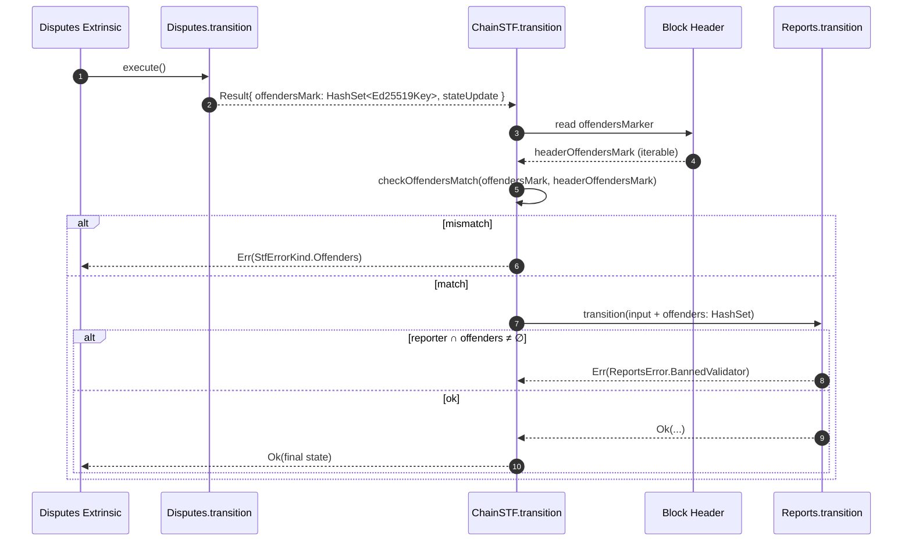
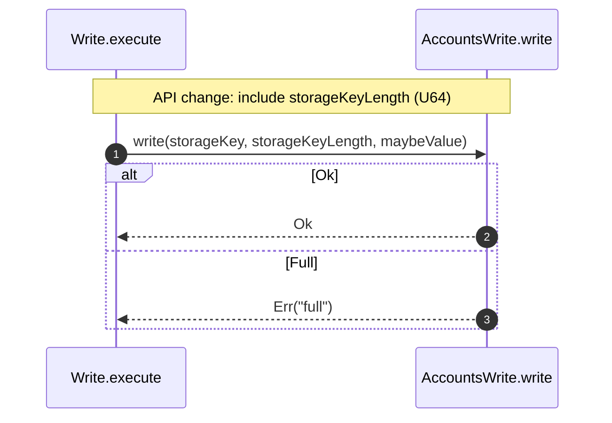
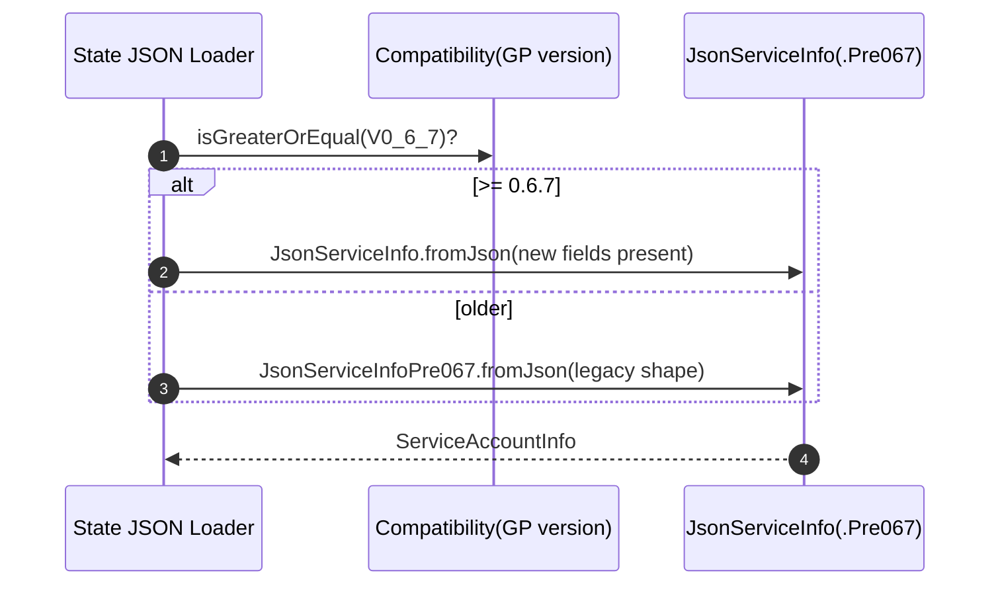

# Update to 0.6.7 & unify test-vectors ref.

## Pull Request by @tomusdrw

Contains `w3f-fluffy` with GP 0.6.7 compatibility.

Related: #478


## Comment by @coderabbitai[bot]

<!-- This is an auto-generated comment: summarize by coderabbit.ai -->
<!-- This is an auto-generated comment: skip review by coderabbit.ai -->

> [!IMPORTANT]
> ## Review skipped
> 
> Auto incremental reviews are disabled on this repository.
> 
> Please check the settings in the CodeRabbit UI or the `.coderabbit.yaml` file in this repository. To trigger a single review, invoke the `@coderabbitai review` command.
> 
> You can disable this status message by setting the `reviews.review_status` to `false` in the CodeRabbit configuration file.

<!-- end of auto-generated comment: skip review by coderabbit.ai -->
<!-- walkthrough_start -->

<details>
<summary>📝 Walkthrough</summary>

<!-- This is an auto-generated comment: release notes by coderabbit.ai -->

## Summary by CodeRabbit

- New Features
  - Version-aware storage accounting and JSON deserialization for GP 0.6.7.
  - Offender consistency verification during chain transition; reports now reject banned validators.
  - Reports inputs extended to carry offenders for validation.

- Bug Fixes
  - Deduplicated set construction to prevent duplicate entries.
  - More robust offender collection handling across transitions and tests.

- Documentation
  - Updated example JSON and recent-history field names (beefy_root, history, mmr).

- Chores
  - CI workflows updated to new test vectors; added rule enforcing consistent TEST_VECTORS_REF across files.

<!-- end of auto-generated comment: release notes by coderabbit.ai -->
## Walkthrough
Updates CI TEST_VECTORS_REF values and code review config. Extends SortedSet API. Introduces offenders HashSet across disputes→chain-stf→reports with new validation and error. Adds Reports BannedValidator handling. Adjusts safrole inputs. Expands write externality signatures to include raw key length and version-aware byte baselines. Adds versioned state JSON parsing and schema tweaks.

## Changes
| Cohort / File(s) | Summary |
| --- | --- |
| **CI config and workflows**<br>`./.coderabbit.yaml`, `.github/workflows/vectors-*.yml` | Adds review path instruction for workflows. Updates TEST_VECTORS_REF to 4757505c22ca9428a1d4897ecb7451525019996e across vectors workflows; adds GP_VERSION=0.6.7 in vectors-w3f.yml. |
| **Collections: SortedSet API**<br>`packages/core/collections/sorted-set.ts`, `packages/core/collections/sorted-set.test.ts` | fromArray now deduplicates; new fromArrayNoDuplicates added (throws on duplicates). Tests updated and expanded for both constructors. |
| **W3F test-runner**<br>`bin/test-runner/w3f/disputes.ts`, `bin/test-runner/w3f/reports.ts`, `bin/test-runner/w3f/safrole.ts` | Switch offenders array copies to Array.from. Reports input/state carry offenders HashSet; new ReportsErrorCode.BannedValidator mapping; access paths adjusted. Safrole builds punishSet with fromArrayNoDuplicates. |
| **JAM host calls: write/externalities**<br>`packages/jam/jam-host-calls/externalities/accumulate-externalities.ts`, `.../accumulate-externalities.test.ts`, `packages/jam/jam-host-calls/write.ts`, `packages/jam/jam-host-calls/test-accounts.ts` | write signature extended to include raw key length (U64). Introduces version-aware BASE_SERVICE_BYTES/BASE_STORAGE_BYTES and storage accounting updates. Tests and interfaces updated to pass length. |
| **Transition: disputes→reports→chain STF**<br>`packages/jam/transition/disputes/disputes.ts`, `.../disputes.test.ts`, `packages/jam/transition/reports/reports.ts`, `.../error.ts`, `.../index.test.ts`, `.../verify-contextual.test.ts`, `.../verify-credentials.test.ts`, `packages/jam/transition/chain-stf.ts` | Disputes now produces offenders as HashSet; uses fromArrayNoDuplicates for sets. ReportsInput gains offenders; early return with BannedValidator if reporter in offenders. Chain STF validates offenders vs header and adds Offenders error; forwards offenders to Reports. Tests updated accordingly. |
| **State JSON versioning**<br>`packages/jam/state-json/accounts.ts`, `packages/jam/state-json/dump.example.json`, `packages/jam/state-json/recent-history.ts` | Adds v0.6.7+ parsing for service info (new fields) with compatibility gating; sample JSON extended. Renames fields: accumulation_result→beefy_root; blocks→history; accumulation_log→mmr. |
| **Safrole tests and state utils**<br>`packages/jam/safrole/safrole.test.ts`, `packages/jam/state/test.utils.ts` | Initialize empty SortedSets without explicit arrays. No logic changes. |

## Sequence Diagram(s)






## Estimated code review effort
🎯 4 (Complex) | ⏱️ ~75 minutes

## Poem
> A rabbit reviewed the HashSet bloom,  
> Offenders marked, reporters doom—  
> “No cheaters in my warren, please!”  
> It thumped the ground with audit ease.  
> With keys and bytes now measured right,  
> It hops through JSON, versioned light.  
> All tests? Carrots green and bright! 🥕🐇

</details>

<!-- walkthrough_end -->
<!-- internal state start -->


<!-- DwQgtGAEAqAWCWBnSTIEMB26CuAXA9mAOYCmGJATmriQCaQDG+Ats2bgFyQAOFk+AIwBWJBrngA3EsgEBPRvlqU0AgfFwA6NPEgQAfACgjoCEYDEZyAAUASpETZWaCrI5Ho6gDYkuAVW601CSQAGSQ2BjwAGbyNIi4YFJi+BTIFCRRGpCQBgByjgKUXACsAMwA7NkGvjYAMlywuLjciBwA9G1E6rDYAhpMzG0AYp7YUTG1KohtuLLcJIUULm3c2J6ebWWVOb6IRZAEzNiItBQA7lUAyvjYFAzBAlQYDLBcuLRg2AFBYAAMAGzbAzQZykXCQR6YF5cZjaLA5S64ajHLj4ebwgw2EgSeAkM6UVqQAAUGHw5EgniQNFoAEoqpNCp5CSSycFKfE6HScgBhdJBejULgAJl+QuKfwAHGAAIxC6C/ACcHF+0o4xXKAC0jAARaQMCjwbjiMlcblkpHwDDIAAGZ1KUTAUVG41k1sgZ26kAA4lZIL8NP8NJUBtxqPA1JTZlksZ5+VwzAAWcoSjRGfTGcBQMj0fBRHAEYhkZTUhSsdhcXj8YSicRSGTyJhKKiqdRaHTpkxQOCoVCYfOEUjkKglgZsDCcSBUC4OJwuCENxTKFuabS6MCGDOmAz9RfNtSaWRoZieNwAInPBgskAAggBJQtD/n2Rywue5xiwTCkRBGa+0WjIGgkDkBcoa4LAKBWrgFDYGI8BkuEGBNgcsDBOkOJ4ogGhgbAAD6lrxDBcFksglqQDuTYqPuGiHseBz4JOJAAI7YPA6QKFaVJkAw8jvtAACilzQLhABq/HctAADyNiXLhNj8UM4TfHE6D6vgiDIFE8DeFhkCXPMDDRPADBoOssgADToMBeKQOwc5RCkPDUBBADkGidN0vRtGcKQANZOvgZzTAAVMFLnup64HBAR0GwcaGBcKeADqqFYF8gTiBgRAwIJwliRJ0myfJikSKZ2DRVgpmeJAWk6fYsA3J49CFChwSIEeJAaKekC5Ax+BRXwLxftI9EUvgXQMPwfD9ahfAxUR8VYUY5iWNeng0MO8FWqNUWQEoDCxptJH8HmJAAB7cCkJaOasAiUpN7DqLiP4GFAVjOZBhFxVt6D/nQXDWjhXBuR54FeT5FD+Z4gUhWFbpkdaFFLtRtGeNalkRMh1robiQVuuukCA85+FQQtW2IIjMCodZFx2fIloHdgSitAY2RQEDkAg10YMCN5fkBUFbShS5rO6J9sXEVaXAAD45Nk8uQClZBKRllrZQJQmieJUkyXJCmQKVowVeg6w1dpI2IA1azNcEu3tWwqYGPx8TwLCI6LoxGG0+MV1cAAsnQ8COAY56nmmW4aNzPS8xDUMw20SQEKkYBCGgpWp8wNHHmeF5XneD7FnQz6zrxeZDVl0hGNyn4V/Qu0a3l2uFXrilkDiFBkmO4KlQaKjeJBrXeuoAASvQ3pLyCxwLNUd8wkClCQCb/KoxT/Aw5TFAI0rLww9wSqUSYkNKCoCL8CZClExS/CQErr7QIqVAQkBJuqV/FAwQpCiZCrnxKaDSrQBMEoFTlFEAIcoCZijSmKGKFUCp4H/BIJZEyxw1aDyntDC4T8XiiF8jccEQFaDRCiJQdgBxpAJETikNIGRSHPE6j1PqA13T80wfYGgLR3SkMgMwRQRk6COxWjedaxZyY7WpvtQ6YZjrvnOpdCg10+C3XurZccT1K6vUgCJZw8A+7BHSnGQmDctYFV1sVeGWBEZR3Bqw+OVDk6p3TkeLOaMZ4sEJgvJeK814by3jvPeB9QHH1PufS+19b7lHvr8cobpABJhITF+G9fjv0/t/X+/9AHANAQwcBkDoGwOPggkg1ojDO3EG7IujY0LYlxrZH2Cj/aB2DqHcOYAjCR08jHWxgt7GIDAHaB0gQJBnVkC4nOYc873kHIXegM5Xylw/MNF6UB/AZSLsY/KOsir6zIh0nmfNIYC2mL0/p9owBDJGS4txc9PHLwEKvdem9t4CF3jfQJR8T5nwvlfG+d8H6jUSW/D+X80A/yFH/ABQCQFgIgVAmBV9CkKkQVkbsyBy7fndAgF45D4iJBrNQ0szB1AoDRahBgvki74Jqo5Xa1dcFUoAFLXj9ji7u+LUjsJINwAA3CbaqM1KCcs4ekWEZEIjooEctS8q0RFHW2k/XakjnDSO2rIi6V1KVKN6Cox64gNFQF6rZdVCi6ArG1cZVR4hZj2HgEQDAyJ0ikuGrQR2ZTXZPiqZ7WpGQHINMgAHIhzSLyvQjtYrphzMHHPZX0gZYyQ651WlMosw4i5zOcAsiVyzIC3iwHs6OBy449OjaczIshjyWV2m3NincyF3XwOSxZFcWZsxyprTZzdioqyfFEWez9aDXwVOqAQSKFQkBAQmNAkTwEqknbQKI5QGCBByaUCUv9Sj9oBRvJJKSQVgohZk6FOTYX5IRfApFnVRZQB9FrGSt5JK5F+koegHpwIGzKsEf0gZyipi7NTOl5LGXMtZQbaNQqOKZXKsgJ+6QSHpHoYPOIbLkgcpxEBGDXAAAkABvLDqiJAaA2U3Mx+sAC+JHLKIAYsS0kFwcHkuQFS3aIFCWtipsEECnh5BoD+vQa9Ylb33pJcBfqjFYPcSLmRXaOJEDhn7hyFogjpXCI2iqqDDFFWiCkYtE6Rr5GKJ4Oah6ai9VZsNZm0aciNW0DNXdC1Sq5VLSdi7Cp9BPU4xsj632/qmnMHjWHENbSDBqAwDMChYAYIYCHN5e0bQiGIFWHEDQuAWYtMmQXFNsyXzpp05mquNdSB12pkwbgsg0FsHAooal01xjZgJH7ZwvlMXK0VUgBL1SHDrSE5JXyKKisexwsJi4xwRrXiWGgUZPaWBEkdWsTQ+Aeu5hIUhOrDW6QxRINxnTM31oaHm7tmry3Uj1chhoRA90SBEhpJZUrJAmpoKApbKqgUFAlYNroqyRCatwfBPETAgQKCFeoEJqI4r4pVXkMxVihsyG+vQGN2Quk1r8uYdDCa6AkLgY7tVaeIq4SIQlfQIklAO58BrrQSkWUKNIhoKsoI4R2qkEsn99AGlKCLRpIpvOsrVPiOCPZnnaq9OaoM7ZozVrnppkYeQUpzmPUe3c97X1E4A1B18y0gLRhguhdxRFqLAy2jpD01hZL4ylP52mRl4u8ycv5f1dYQzkEEvPgoFENA9xdN/f+tmjACWkv4CxEbnNTuaOqXuEaQCWBFu1Y5aGKg5XBVEmHmgS2lwSC4GAPxe+xQoEKgANIkFkHoOkzPdrpFwLccg9AA9XUQEHvAVYRBiEgozZm6OTpLabJpXETVLJkD7mg0MGkB+UDAIh9v0e9rUCAuBDu2AiAQVL1ymvLCI2BUdlAavCjkC/ZoJAMnFPsrpBSEQTA8AABeXvoAUMREEP3m/ks3936SMaFc+Bl4r4BHgsYyL38QI/hht44IIe7+FA20fYggje4ITA44cIaCO+wQRIQEv+/+xeGOUeh2yAieyesAqe6emeYoOe+eheHObGPAOMNwyARA2AzggO4IM+NkCEpIGAYAJAzARo8gvAnU6BneQmIq+AUgtATOaBB2PBzg7Gz2JkSwuI9AvqZwNBLOkASeKeaeGgk2zARInB+2HeBIHOkuVgDu14Vgt4VWtkSwjk++aC50NAy2tAXAf4T6VkzGxOjknqAAQpgJXtopSBlI5AALyQCngCAeF0C4SGzwA+EUDdRPy/78RmEUBmhKCWSG6OqPRZSOE2Su7aS3DBC8JKADyG7L6IaOZdgUKMQdbgiwjcDcCWFnTWFPpcBwC2ylHbYVFoBVGCoh4MyjCt5ASVHVFpGw7uGRZ0BeHhHUA0oMQxFxEaBDGeGmRjFJy972q2ZpG8BoiCrQSYBnYqo6ZMYeZxEKBKDr4wDNERBDgRQGhpEGIljQYZDeBN7MbwH1RtE+CTgRC/5X7xCDZOSs7ICcH/6nbU6dR2RogWRkEkAAnwEaDpD3DjiuHQz0ZCH0D/FAmAm35pzaCxgRjqCyDXhD52pdyjR16aAEC/7ElInN7dEjQom37cEEi9bBCoTcaCpDRkR0a+QR6FbBC/4cRfTIbfHrEpr8BYA0k0BolimkFaT2rVRPEhg6KUZpR7B/HqS4CQmomS7XivIaROTgTIDXFFyw5PFaS3YAR2GmzHBoAYqcE4gUGcaiZ0KGSrHpD/7BRtBGnd4AR75pwPAkDKz6l1wMTDbglqm37BTEidREAaBLHQSglJGiDsDwn1oclM6lTaQqDaQ4l4kyYEnsBrZYACAzSO717QF8nxTo70ARblLBDsmOZCJrQqbaYKoSKabKraaC5WZTQi46rGYS6aIBwVazK2r2rl7sT+kAw74WqklL5b7ElEgaDzk0gWKMCxjanWjEluhEha6IbhZnGUDRZRAG7TnJZJaIB0idHPBUkR6PpPRkimRORx5p6CrWh0mpBcBKE4Fp4Z5Z6EEF56BujM4gFgGExkk+54BujgRA5dFMwjR9jPkiEEhujGlNTHH6Gi6T5IjPHzCNoFYNHUzWggUJZuj85lnnkt4wU0xmwmmEwvmEjvm4FfkEHHxEF/nHH9kNSDl2oOr6LKRe7WgTmTRTlG7/4aHpANHX5AkUYGSmifiWj6SiA0hcC4bwFcDIFAm8o0VvnYH0X4HZ5MW/m8okZLkHTJ42ifGqlAmIx6EO6AUHBzDBByKe62GkHWiCU17/5EUtlyrfGAVXkQE1gRSvq4A+T0TcBgDeBSDY4emEh8UWXEhIFHl/5AmoH0BwXaGpAbl0Wfk6U/nEHHGSTwUcoWFpHcYOFPzKJ2ZT64XBAg7PAkXPaWZKnj4YFvbT7Uw2V+VN5YHKGaBqEiVcEFWnm6GaL8QYCOBGp1G8VTEk4JHFKQAn4ETpEXBsDMCLCEyzEjHzERGQD+GBHBG0ChGbXjGRGWXDUHF9E1ETVOU5pGIUK/5YjlHoyDznVpGkWXmEwADaU1KQM1Mxe1oxERAAuipQlbESTr9cMbQP9UdSdW6i5ocdUl7HUkrm+barAH5q0prpaNrgkLrnufru1JNt4Ceabmlhbk+Gmm+GXLblmtdRFpcGgITSQGZZZKsJEN1byRLGWeZmoXpFZrgaobPKNlQLIESJ+JbGaGwa2SkBWhQmaOOOwNhOkLhFCZdPELhDRXSE/NcCarQPzWoULeNr1NqF8PdEEIgKLdgRLbHkdTLfEHLdYZoJwcraiarbgOrQNSQaintHQCbcZGbUWeCGcKlBCKxHdmkbtKzUgB+bgCzf1I9ODibBtGgovuUQPhEFHbgTVBJuOAxATVjp1JsZxPFAyWUeCO+LtGPjjqwXCHqc8LboTnnfgP3PqBtvFBWk8DJlzVVAFRBJHd1RSS0W6UCW+t4SqkNXWdzo2eps2cZQ5jppZjrZ2eVWLuoqZqyMSM/gvdSDZiotmcOdkcgLkfwrSK6rLu7HkQrkjV5irkGv5hAIFqGOSpadIG0EwOkK/U3fcYtG6VZmAHsCSRQsTejaTcmuTVlpTdhXbjmjGbQLBDBRjudJQIZI1UBMxsvTeEYTqa8LzTrXrYLfDkbb7SZHEEztDFlDJnkdccnRQmpqJl/QcMFSWZzdQlkPrfDuGWdFSGrGec9oUJ+HWAoYQj7dwKbZlNlEwwtI5LDpdA7bomZHtEQ0+JaAlnGSOZEMVfYB2f/TpunSxPZd4F3LpGw8LYQyI37SpOkCxGxCNMo/XhlNPgxNARaFgM/rA2Y8Q/A8+tpNVDPs9n2M4XNHmG46IzBexJwXsOOCXWPg4OoCQC5MgMzPqOGA8AiY1qgP6aNKeMY+NpAG0NcgbbIKYyE4gN1MzkcOtIaP3GPiZI1fiOxESkQJbk/EGdk4U/gMbe4/7UHdwm0WsbwLohKdeBRdU/wQSIwHyGI1ZNozzag2SH/R2c4MLT3Qo50ypKggMfg0s8ziZWzgk8I6Iz9E/O9dKJZEKJZKUJZAmADVkJJMwkUd8RI3FAHZPJ6K00U+YyNETpHFGZ9GzqyogJZGwBQF0OHTQ5rQxGQL6u7kxoQMEx86RBgD3LouOD3WRBttirY5oJAKDeYX9gfkJnIvdMSrDm8+04oypN01gHCx48gOdFSL3kSk0GgqePxBdDWEXIszky+lbOCNS2bZZEQP1FwMAPY3oKeJzjKg2WIk2Xzp5QLqdMavpug7qr2VAGxZViVbxfxfkwQ2S6s9IMANAHoESAwGwVwESHsJ4FEA0ZZAKhQA0XSL4XoJAJJADpQGrJZPYw0e9QDYuQPMZaudrdSLgUuUTE/d+B/e/UwOsDWOTD/TrX/SocliUk5uUnLhfTUh5vUsrj5ujRrgYI/b5M/dMG/SQB/TGxPPG9SImySSlgmjeEmo+CWBTRmtTZLrTiWK06NE+uS68ZRlvoPJixWsHQIKHZ6bMxgB08UxSFSPOKWLHvdrQKnLCeCLE8wC84FX1pLcOI5NNqwfwWgny3EFduWYxGo5/sxkG3QJnTzRBeCOyFi0nkhHVKwewQHXO4BfdlgK+9ale7rSoZotqPWoSjDlI5szkyHqSCpHeys9O2IYxLwgIT+jeDxhReg9q+VuxTqyY3q8U8ACJMa3KTu/a5AFbVLRQPh3oEzvDlwHyLQGSHaSJD6wpeM63eRX+ze72g9gs+wwzRtCPQscnZ+HQbNMEPB64724gLysSv28loO6BTHR+LgppI5Ee58740FCgHmJgFxuxA5JjCewBWnh/otTg8G2nkSPY8giwNbUnLoVAGodAD5H+2aBW9pmXjXUalw2kT29wGNGjpSzwpQCC0QNJ1AeaJaJBqNHwVILB/CwPLtECwVmUbNsh2oX+wU0JuKvXQPHw2nPBBQG6UOVxRK8pqIsdDK97bPfK7ph2TdA7iq3buqwKDxuOdThaqS1O/C5RyazZ+R6aH18R5R9R8LbRxtvRxgIx8x0ZSuTaBx2nqG4W8W5G2W9G1/XG7J3QDWyeSm7Demwjd6tm40oGmrsGvfUYEtxGxnG0BnGAA1LiiZOsNMFYZQNKavW0G7gwI4GsD8C96AfMSZkloAybsA4mulmAyXDbksu4NTJqV9+U0EKyxtG94D2cAaLvph5VnvVxe6MnuNbVgGZSdBW3iVTedKRSGQEQK+tbfHnwESL4P8AmCQUjugDVmIJUlVAiwhjQ98YPp/t4FlK+obOVMSNKJ2b8HSIUL6rbNTHWgIMgvlmgjzWj7ExbZbJZHL+C+6OjxdmLbAJZAL1T/rxCNDAIJ7dTPECkM/dr7E9vuIKbPWl93wCXtTAgPPmFdiLdiznsAomIrjmySRFxOOBr/XrtDVZLN8Z91ynJ/QWJ8C44OwAixyJtuXT5KV/WeV/KtPbK9V22Qq0LjmFqmhY11ms1zapxSOdxWsk5daHD997GDQEj69wD89BoCrzQGr9g4iFb6QEQRr6b1wK4bIHEImWb3EoTHXwj437Uc35GK3+37r9gVwN31QL3wXgb5T+BH4Iz/34IIP8P9IKP36wjJdy/dd7d/dwkI90yG0H9yj89B97vPX79zP/93P9IBoEIBTDLmm+fQd1m8jW8wnc8253Atm7iLZXcjwN3I8HdxVJgBr+z3V/vfxfqfdn+NAFgkgJb4f8QeqWMHmTWbbgNW20PTRPYWQBSBUgW0MAGgDkLsRLeq/B4Afw5qYA5Orha8JcH4i4R2BNgESLeG5AcDXCAATQ1intWB7AzgTrGvBeh+BQgwSHGREZu40En4AHPAMXD0AJQYvQ0pQBxDu45AKkZnJaBgawR7sIGCgXMxPwlggiewEwnQOt66DPmB8EwhIE/RBhT2KgUZrawGgegrBpQIUMzyZBUY2Cy+MjuIGxLWpmcXobgCJAJCHNc6XwPTCYJkwIQayyHAPLGHuCARzSDOEaOXVd40EVBDhdQWADsH2AtBxkB4MnluyWhgg3LSAKII4FcCeBfA3CIIOEFu4O42pTgu6lICnsfe2gtqOfjQSPcvuDfMRF80jJU4e++ie3kgB2KBdSeWUQ8ohwHzpAuh0gCkkSkiBHA54vQsofOBUhotICP0HCKeRSFco0hI0QoZYI56eBhhPOWHI8VKHpDlmdQzgfxG4G8DpBwgyTH1jyIDYYOIYPACNEsasR0gzUA/pPGDot0wwGjB4RQD6HIdrqewcgXeSGE/dFoTOf8MgBeFCRpIkgz4YJFGifcbgKLQ0knGfpFDGB5mfQeOA7iwMnhqDGyFOCIJD8VINPR8nwCfjcQPYu0Q3q+nfBoZqBkAClPIGGz0AyINg7oYKVUzIcO2I0XaAvyC4Dly++9diE/Cgp5EGRFwJkQXhZHSBt+CYe8h1A2hcAF+RIYUcvzJFr8wS2o2QLqMJAM8EwnrSqrUPBGj9IAssUausGSq/QhAxwGPrL3BHzs8AOxNUReWJ4FlX0Eo8oVYPMxEhsREgqQc0JkGXBvRpeQUcKIp6C8II02agcyPBH2dvchgp4cxgRJ3lPseYDaOuwhAVCV+z9bUMQlPY2j6x4wQkU/yn7VlqaA8KMXsM8aTh0xBeTMUbzkFpChOwQa0vBGOBCiC8HvLMUUIqECgqiHcN3LABlE8UyBOiCgvwCf5LBxMDGCsdTHHGbiNhbQSkIyyYHjhNIvaaCLiUQAOiiQ6grXtiLeGND8RlwCksNixFsD6hz4j4UmOEGBcARkzDYe6mqjAjrGYIlSLDhICHCEIRnBvpUjJQclkO+eLlJpFBxbQ7y08AwW7kDoIB+4DlJCHAUtFidd4xIyZk/HIGJDmC1A+DlcIpy9i+8KxQ/P2PkC8iF8VGDAE6HKjwZuxxQokREDEbp9J60rbPlVy0xiJ2yi9ersXx7JNc08WHbHpXy7TUgAYpo80XpGIl990KaAffiP1N7ujgIawTwMfywABsbQk/NESQCb5v9V6i3cAct3P4wDL+8Aznrf0wHv9pgqA9sRgOR5YDjcFMSAPEltA68zRBeC0ZMK0k2i7R+op0UiF0mH99JHooyYuR/7uo/+XqAAV5mHio0QBW4U/tMEcnMBYBD3VyduX4kXigGuAhtuDwIGQ93wuWEgah01G2UsKrsPTPqOuSQAAAArMHmCLBlgo1FavSU0RmU4eZErCAqMUnZFlJRcUMWRTbxWEqAho2nlwGV4hS9eg/WMBSiFACB3ysUnSS6L0mCADJno4yaNFNEbTahW0kgDtL2mQBcINo2oGQBinaT4piAN0UlK9El00GyqWnll1Gp7AxRWAMPuhIQgFlaAoySAFiDUYtTqkoqbaPdVmzABJIueSyFkyMmng9AWQFnna384WpsuzqISVKwq6iTiKEk/PnVyL7dlxcckpUVNNHI8Ua+F0pfldLQDbTdp2BfaW9I+mGSvRM3EyjdXiBjSBJAUk/vZMgGDAL+cAhAdjSoGkSRZO3QKYTGZmWxNpbMm6RzPV73THpz0yAA6K5mHSEpx0z6cZN25n1Kk8uTNormvq5t1coA/KdAMllOTpZrkhfpVPrbm5QGtU63PVLbaNTx2sMsUYEIUQmEHRnUnqXZX6myA2gg0xYJyXBK9C5RLgPEvrNUT940iYci0t0PFHFdK+S0KAE3yQhQYDxBhTBu+GFkXikoOvOduijQQqzsG8JdWbdM5mvTDZ70xKbzLOlPx65as9mXdKjFEEnpWYl6V6zbk8zTpLHRGetGRmoyAiIOdYJjNXFrJi51Zbup3WNhVzYmGgRBl913xlUBZexacJpILxDyjecOKgoSUC6WgJA82e7PLMiYL8FeX4JXr2gHnr8eE42QoF4RF5Pw35YJP+afPAiAtP5JAb+ReigAoTOEdLF2GkWF6Mk8WX7egAEywYIskQYgXlHbGIk1Q2EzOZBUVWyjOBiR9AIYL4FqC1ADYyAXIPen4gIc8c0BMPOXgTp2wOoLOcItVSvHUxSeYOaqGyI2hEzM+tDDTLn3Jm1cpJVMi1CX0lxl96ZVfQxMFNV6XTG5fcluQAs37YNU5o8u0ePOSnA1yiM8tGfPM8CYzuUobCuclk3k0ALEG0V3O7jFnhsz+UAqWSVKe7eQdeO3VKXDTcxWyr6fqG+qdzvp5TxZDiwYI3W8BukGa+dIHvEHdkTI8BXs1NIQKh5NojAiIiJU3QLrA8AWfKcWFCGyF5g+60dSCE9HmJn4di6zbKPNx6rgdZADFXSnnl/Kd8yOxHSyMxy4TsQCco0SpQLRYAFNalOVY1nryaVHVzeqAGLnKOpiEtjIxKH9rpyWbvhLQxS6qLdlYKJ84yqdNImRH8ZsFrU2jR5uz3oCoZB4MmLKN4CoHx9CSozCgNDG4xZBDUuM1HMZF7wHF8FtrQaOaCxzYKJC1NdSpN1iAly2ahSqEWWTIjlNxAIjJovEFIiAQ2e1IfhXPUq5kyZEFMsRV2QkWyS160uVNmlItkZtEanmXxbbLO6BL7FBUqAfARTgKlH+TABWTgI9mNsZkVubLL7OIFQBoGtIuBmQOiFzMaJ7EBlJcEEzMx3WJSnYpoLhG7DypMfWIVUSugQhCynBP4AGBcHM5nB5QAANSYUP+/si9jZF6nRRg54IIkB4DYCXBoYuALXg4GlUhzmMSFACMh1IGQAGUCpVPGKvuA5oHIVgdIACEqA1CgIahR1QhGerZRYcEddIAqq/QariQVSXCHrw16mRclgLS0PhBoDMBcIJ+LJRsNwjLV8Aqa5PBr3BGWQ12p5U9koFdyzYVOfAECIKhtX5yUOnpf1RgGdV9C3V09IHC9yLkOqnVjwkgM2o9UkAvVp7NYjiB6IUU/VCpEwrtBVXqrHsWFXrkoGjUtygisYehAmowBJrWCOa9NYmqzUbq81JDFAMmqyVAqtoytU1Z6yXyd13aUQf+gb2Txu0vJaI49Wdn6gs0xC44ZWl2u9GVEV5c8SrpDkkCmQyEjasoWYubWUUmomBKpHdMXXxrQ8aAkgH7EtBehc1wpaAB3VgwIaMASGrJVGN8DTD2o8UO0RMPoG4aMy+GraGaAEkCtNoiVSYcggmZ0Ab1QstsQ+rJAvrvsQG+4AWMLl1rO1LqvnFPlOxdqvSz7ZOrnWWVN5dovTDuP0zpyjqEIbUgxuwB2JXCcwWAH0AkK2huAW0t4PMOpsok/Q9A/hESL8Fwj/BcI5QDGFYPrUcbu1nE/AN0uYD1rL0LrTwUgCQT05gg1mrtT2s9WAgHNTmqALqFnojRrVUVYUh2rJA2bQNwa6mMxj5WCZp1rxI9WSBPXPrvaqtdQJeuvUUhb1uEe9SMJS1PrFOsedgO+r41wqecCKuVnn1EVKsGu6KyXNyFm6PpeKXmvjT5r7WAg7JJKx2UPR+Bf8yQVK8ae4pbSP4LUmPFrvUUJjas5NWAfwgNowC7ZqwYgYAG1qbV2be1XqyyDZpA12bjW85DQClM0RNaBZmrGvmtrKGga21PGyLd5o22+aYkA8MNhAOCV9b0BC2obTSu/6jb2uk0CbS1pr4zbZ49a7apAAW1LbICq23jetocjbau1u2hyPtoXJugah1arTfLCgBRqY11YpdfcBXVrqU1aa/HduqJ09islhauja3UfWnr0t6kTLYtmy0rk71zGgrauqK1sbStOw+4M5vqxVEleoMyqKh2wQkROahMHbffNwDNrEKs8dHS2kg0Lq41y62De2Iw1YbbWGAVDVsXQ2IbkNOGvDSqkI3sJJhJG9kCqgo3B85q1G2sYzlY78hGNuACyazo53jgbNzm1CiokRVgFWucsDHYTGS1s7TVIABoq7AhKmqTFosFtNaCUAZa3aDOtPEHr1mM9w9CsKANaCZ15aWdKqVLbgAT1GrQ9/UZPb7qJjfYytfQhPVFtoDh7NE7ui1HlxtKDRbcXAa6taAu33B/NCpR6vY0E18bviH49HanuCHhgMyUYJAF6Ho0UBXW/EFiKZCJARCohpgxbcZtM3ma6QAAfgi0Nq7tDkdvQhC4Ct7bN7qh7TvowAWJk+OYbTjahOXsKWAIOmDA6QvRYrPFlsvFUd0UI5S7ZxKl7aSpCVAkKVg22BmwW3lnQjw4Kz/gqRJpxKm2CSuqVTWIHXUHZ13clR9oAPcAgDIBomgtuHbVU2IXxCVfExKE96Oq4IeattH04VqMiYWvjhsQmWcMYF2UQtWBqcrR66dse8YIzty35as97O23fFGz0UkStb6rne5rXlp5RovwBLjQfQMMJGi+61guuKNi0KFqjo1wQcCoAZk0io4ICL2CalRB+ODBp+ESNYCKA6ckm1DtWtuUQtaDkzatXDjhmjNC+jEe1GwEEKnsBo0UZAM/glSjQnGHy6eI5AeUMAMFCAKFR9inx/0cEsIfHpxAQjctvhnm/lQ+ntjgre8F0P7KOIIN9DFR3GKfIxHCZKbi6UqLnMTKz6DxPde42rcLmVYNbNEvUcgFwENRb1TU6DMo8qK4qTxuER9Y0i6g8X7cMp1sv1LUECi5SH6QS7/W9pIB/6QsMJdgHdypApBRktK2JdVPwHQGfZsB5JZoixBOH4jgmTFoweV0sbV1LRUaIUAyCyAHp+AETGRHrVYgV2iZclP/gHXSbLSJh4I44ZYW+M58C+A8c4GOXZQcIJde475EeP+7e9KDTPfFCnkThTjMQC41cagjjcdMnB3gy0WOKyiN9txhMqk0eO6roudxfyjCfOMdx4TZ+pExCePWonJcWxj49TAIChVwqXvOtPRgUBucYhe+OY3OBd4kT4ehx3CKjnAxwgNiDEVgHNGBnUwbj8ZOEqk23yfh5gWQdE7tDfqOpLohEtIkQe9p/1OatwRBR/L50bKxTDwMdoKgCOjQgywRpOFxgxwinjif4X0V8V2iYmpTSZNFCLrJgIQDD+JfMtKc6nmn5jrg8k2SEGNBre0Ip4cQoPDoHjyCk4pkxyX9M8nWdfJ8aBcTVhomeKg8CU3ce9O4nf5DUC4L6ZcCbTnTjxspswBI64Z5gbMwkAdsgAkZxYiJ98DGfjnInj1qOY4mZk7GVdvAJ+HiA6oSMoLOy6QeCfQC7Nu5YgdlGQAXjJBckrBpZW4KZDaA2r3jbARzO9SRBEAuAANCesUcEUz1xJSKiow4aqM0ys00AOyjNJr64mMzWJpMu5Se0IGyVv+j7dMfHCzG6BCx77WLFcIZAUgrxCPWLCZJNh51qsxQuN0oDvk/zUAZsylpaJcB88u8NmeBZT3sIggcJicP/hsCXHcAiF33QUR1pcAkofkd6PYubU+tnN14XQ0UAgt75QLFAIC9g2Hg0XsLLaQk6hdguiATIvkJi2LHgKsWNJQQDC/1C4tQBcLKkxWIRaCUkXNzI0s82OUJiXmFSjp3AECdFmWJ7zP+/rZSufMJB8z75kpC2i/PS9ZdYsRs4Wfoz/4qLUF1dajkUo8ANsHJOwvDmABwWOL75E6UZOdYkYyLFF+1lRZ0umWOS5lpCyKZssVn7LN4Ry85YQvYE3L6wDy5Ll1A+85G5+HYoGvPMAwtLQJ//EMGB0d7nNQwD0t7VnOXFxGOXNQkZagBEhcMAFygHRaZwBmjj0gWbFThQvEnFOIlouCRhpDOboA+Acq8SCqs0XarEIX0rCdavNWaAqFuQR2U6vObJIy2qAhMx+gdKiRAONWJxj6uWWoTXASyw9MaudYCYm1va9CZGtEnML8V6QEKspClKyyqV2S9jElNKXpT2Vm/blZbT5WqKzMLU8VcgYyEZdVFyqyb2dN1X4zWe/kzNZbQ9W+rANnS4C1LM1murLaOa5AR4NLWcuK1ohCctcBUWTLgN5kwTBxs6WLL9VoM9tfquJnsoB14m+NBhClmrKxfRVs7hsUIFLQRCGErgDtIM0SE+yudriczR0h/eUsH3anvau0ACLkMIiy9ueuOaO99Oa3k40i5rCQ6q7OTnsaKviEtRlQ7IfmROuoW6zKfbTmTeOMEQ2FGJh65lfVKP7ejl9fFTm2AEf6RjPWxA0CWxoaA8A2kfyRAeWPxLMsMByBlmllFAzFlyVssu+DIOQB6x8WQEYgFuMpBPS/9Lnohn/yrTe0rTRpYNxtqQBWlT8VO4MvTt2cTCgrRQLgVjX/tFOPkDAL5FkDF2B16dbqiXWWWEldVNCeGfhb8j35XLMW7A6kBE7pA2oaeeOdlT0ryBpGtd6Or1lGX7sBGlaC6ES3BAzK4cSzXhZQCCPtZZslhbZfIHju2HbIVjaHJE0YT8AUc40R5aYRJzCbycHrTsj4abqfLaM1NY4pcGKzuGZ2jLWaeplKJu2mQvKNYnSLLImmCZtcCrVPVKPVaRFjRw8/VuPOS5ajJAHo+lOtuv6/Fwxi7qMd62F1O6W0V+jJWYLxBMgixs3PSstwtskl34DUpiLbwvkTBRkYhj9HkwDxJIGAauHCCSwd0ye217y1WGcaHtWsUdqEwWqALPY6OvlAasdkaw804sbWaO0dd2yNZmcgEkaNVYn0iOGsnUmMxoEUcaAvYl2LQtHkQCiPKAGgCpL3CusXYSCgBRgJz1M7sl8qaVPR9QGxTC7t2MvC6yUOSw/KeESAN2C8H4dnsTOzUmx7o9Pu7tEQUQHFhQFzws2NAATjAubw7G4JVEDgR1DveoIylz8vYmDp7znCKOpxEOKwwnYkQ8OVINFVx+pVc1WCfKH2PUAaCNCSBggkkIYEMH4i5BtQbw2SG8JsDSRji3GhJkgGpWpA4+RCvaIU5fotFCQEj3h9I/mxCYQ8n1haNkUJ6rBTY8BdE3jwZEcgcw81lQ8xhoqiOyCgpWYGGcdLZQQ1NSTcazf8rLO0zszuKNkRQrPHzBeStKtpOFI0CnKipmzoCPP22PdnqAPntnUq6/4WHWxMnhY9NiHLmpxTm1ccTZWKAOVFFZBUiDOhkgWArgR9MgBCdhOInSEKJwNVB0ShecqKyaBi7iJYukFg009tdvRe4BQnBxOaVSRgCWkCsYT4AMS5JykucXtjyyPU8afNPWnuEdp9JCxmS4YXdIkLTZHZJoJP7OJba+Q6AiljscAupTuSmied56suAF4ESB2cNZLIijlVytkhj83jOoBNBFCf0UusGnTTlp7rAFc2BnWFEw6rvkoclkg+PEY4rqClJivQIDuJhswJmBnmoJZ1aQAzjVhcBuXlrvlza9B2nhinUHD+eq4QBpFFHpTDHEBCVPSAVTGN452efmLJ4bT5D8gOkPahzhcTbU5fJ3YoommiQg9+pbIG9EfiXWueTqVK8B56FzhK8pqshDCKqwwZ352gWkv7hrFC3l9gwSQEabQjjn1MPVzHg+gGDRJ0CyZngoQUDFMEQDkSSA+EX7nwHS9SB6vUlwjUxqy1VamdoBhTvkA/hCUKGy3qqIxqrLlIKS5R3dA7FX+tB6w/ihYO4QmpvBxTGOKnmsKMitK4TCve4nb3FAN0K9WgpXkuFGE6qEi2YH97CYssEEEQCZdxEWX1LzF5E9PdcuLXvL61zYA6e2ulyu0dOmSFPq/8cV//foxOGynz5kHYAx21APQdk9Yswz6YOM8SyIYYlBDmqasaZXrHSHmxs4W7g5bw4/6Bkah+RDOxlDLsyzApg5pk+w5oC5AyZqib2xavIYhIyqOw0kzBUiiWQIYCkCBZ2lBz0hcLep8ayFAv2C98bLyhDzmehM0ENjgKAjz0wVMd0MThjiU9s437JPeHFkC/P8MCuihwW1M/SbLYPXz6YOqiaQDdZgcpkPYKU9mheDggoXyD+w3fA0ULDftizM8qXfZQXC7ym+wLFXckz13e51VMirq0ySoHNR1kHA4o99GfFtt1XHR7UszBX3mD9jy/S68e3QeXtqAz7bWN+3hXNI2F08N84HMEI9wmyF19kPbD+7c7RAC+heAvz3EXSrtlrT5oqFOukncdfgHsI9WvQlx0uxWn2//ger7hE764bO+0AerBFiu1XYA5QBT3LJ9bghEaaBQsAMzLANW6II+trPsQBiEBEyp4FvyQ9qjsswIhs4/eQno5wZktiaquwHXhCANhDz1uQffS8HyYRoqkMk6EZlLwIF6F6JfHoBWGbsWR/AyGIMGehuZ80rdVMfNb51utn1vYswfNbn1shzBAB2I7kjmOwDm3y5zppGTAw68iNAduxmePDH799/LXeOIyn/dZp4B9NZTJrp76OHRu89X9CAK/moB0++EQNszALAwZgBWuPpnvDUOuCB5pyfeqGtPsXcxrgfZrGTeTlmCXmJ2o65kUamCD7nGAzxfHKNbrG1I+FHJWAigly0cklVfqZu7vsvJKx6C+GZ1fAGEx/iiWdWPXAHn1HaR6XEZMDAFjh6pYBubgApr3DLT9Z+MV2fANXlJc7WTp/WP/+WUQZUsgZ+4gYTmanoD/JKyXKFP1P5HbiC1/e/0gLP8bdz9cB8/RKPYEX6OvAAS/yjyGHT+joM/mKVfoErKP7+SP6/PFRv+HdY+t/Fw7f7rc++u7J/OvrHljwP/8lmzyPrmZ/Yd0AE0e0a9tlBwx8GDH/BtIl57tMXwcgMBvjKiBg1PtXNSZAGNSweKLOtSQ0Drn4SQAQoKUAEuW7l9R8AQAYb7LMkmqRKS0GAKVg+c9aAnwwEZZKeD20nnFQTKo8tNfpzwXbkdQoQkFH8QdwUgJT7DWFDgVRdQVMKgCUug8Mgqeo2jNyxUopkHj7ZQ87mgggBcnDSioQbECPSQYJXiUZCK5XuUZbu0klH4mYe7uS6HugqMe5rUf1BAF8A/hNAHgUlhgXzXuc8PhQg0cRAf4OSjHhT6HkRuLfyf+AUpZxYBXcCqiJQ+AQtSEBTwDQAkBAnFtQwcvztQHNYDEC1DgEDAaeBDUe3PA7eKNtsdwtej/vR6H+pgcC5vu7/m0As250FEq1sntp7I/+xDsyobGUAPYQSY+qrRRaUohjzQRyfUsTjRyAfhPCns0vmOZYURQbqpRyr9C4BGg9miNKlEextdpe4u0Hsbqm4Hq3gaUihAUGaAIEIv4NKBYreBsEs9hgzGEEqMDSB4CnBwy6BuJqKI82tJhQg8MFwOqLwMfvl3hUU5dGeZS+bPsxTIc7ZsNA7QpRDsy+8MiG8qje2OJgg/KdpGPj2MEavoJ5BbSvZQz8NhOIE7mOfFIHz0irJUY7u8gdXoAhm9vH6yKoliO4u4wnlDIJUxJPMEdkPNG16v+UxglRgGawUTzDqoWjsEDU8/tpQHBv5GR7Yq1/riq3+NsnbZEqDttEEv+ZgfEHv+XHt/4MqGQfx524OQfQAg+z4Jap0Eokugx7GuqjME14sIT0GPOujjiFZUeIYXiWQPqoVZJMNTrFz0ck0KOCgcfAIAATwIABMBJJDEgZAUnBUBozLQG+itANnLPAKQGzacYowfqo+ifoj55PYFwGyGLBWQuHJ1BpQeWxveVoAiJYAgLkiHweVtICK5GGqByhfAjoB3AosqzmZzXshQRwrBA5AsfTKigqMKLxyXniHIGGWnsLSpgLaLkDiuiElwDRA6OPIDtWc0FQEXWKLGRCYsOjs1REghymLTXg6Aae4nsNlPAHg0cxKPRJwKYWLAyGUpHeS5h2wU1ASGKXngDB4z2PW4nO8jhWRHkEvuwzguiALng0YDamk57sQuKkB5kpJu+AwkqvnBD4+pvpaD0SroUWJFwFYVWEDUs4b6GEgVQT6y2s2If0H0+VQUXjdsj5E3gQhewBHyFAQVL6RYAHYaeyZemiJJDIipsNfY3BgUFwAbYVyrIBzi2kGZ4FU3tDQAR8/TBMR7OdIukZthoEkda8or4fBycEJWqpru4RnKKKfBYfqA6bufwRA7Ve0fm9DSabOFxje6qVMKHnhC/peFEeZ5gYGzBhFHeaoOR/tSEJU5gTXjuKltiEEv6gAkg6RBiIaxEWBkYTEAqC8tLUQpOyQXSGQGDIYkqZBAnqyqjeortqpYIZ5qW4hyVQRS7vBnpJ0FzB0RCiHCRsgPbRWEKTv9Q4kc7PMIEKkeLi6LmuwVhT7B5fsxSqQ7QhkI+MpRDUwf8pBPcyXQizq8aoAi5j6rfsG9qb6HKIPhoBDBl4do5MBCLEQg0sVkOgyGEUwbbhNY7EAZFGR4kaZCmR1qCHhR84ePQG2Oy0uyK8ofAaCyQq29sL4MQg6ibbgQqAJiHIUB9vcrH2k0AV7XBjoGwhUi7EAYLsq9wN0bLQRRqH5VaG7hV4Hm27oRGAharLH4cUKomCFe4qUeaDGRGUZtQ4kRIJixohYEkk7+B+UTZEViewQMHDBheN2Hvs6puW48kuRGsDgK2aGaEqBakXQRnmGkTzSngxQQsCOh+oHMAEA3UESC6qYAAxz0wZoUsG/ycQjKqHy77LqoFiNepNCq2sph2LOomYXMFEGfxDsyE8s0WJGMKngJlH0wYYhqJocJEQoilwtjiKGg+DkTL7LRkQOIAlKHLMgChR4UWKHGsNIEEHmyRIZR5Ne4QbfQY0UQSYFUhsQZg7xBBkfAKgi8dEyCSRX/tJFEOskUyFZoLISgB5B+MfaGRyz0Z/SB+YBCm6wyX0b8pl+dSkQQyxJQUsBlBjQQQBbhXURyzDMrQXMFbR+UbZHBA9kerEy+cRtCFG4mju6wxAvIHQD8xUGDQzIcMhpC4FWPYFBDMCAzOTELSQUdowhRAwWFF4ge0TTFOR6kIfRr24KsBjuRNal7TmYOkU7iJajgg7GGRfMWojxePdFwGyo6RsVHHOpRCaaOQ+CAMDSAK9gDr7GvYJ4ByECOLZBBRcRlYJ6ewfmVzwqpMrhFDRMgeIor0Y0fbhoU/7rJapRmcaTFMgxMSoxekCPkWrAEf6kk48hHEvNJ9Blsf0rNhUAIMY0OJoE5DP+7XpzFv+bETzEt0SgFnECxcnMTGwYoIp1Jj4WciQAI2YsPxAwqVVMDEyWvvnICDw8UZgwsB2CIsxcYpvhl4iE/AeoFZKnvGKY3A8+NzxfE9blspvs/9ASFP6xIZlIEqZIQEobgnYKojn6/YDx7X+ZYOOC0cgosQ4vxVSHuCtgq4B2CZgLGG7ThEiALtZewIRL9ghy6YAYAoJ0oFEAMASYAAgKgpQKUBoAioPOgJgLyBKCXwP8D4JCgtABKASg2eAqAMAioLQD/AvwPchrgyCaQmjgmWhQlUJuMCETZg8iUAA=== -->

<!-- internal state end -->
<!-- tips_start -->

---


<details>
<summary>🪧 Tips</summary>

### Chat

There are 3 ways to chat with [CodeRabbit](https://coderabbit.ai?utm_source=oss&utm_medium=github&utm_campaign=FluffyLabs/typeberry&utm_content=537):

- Review comments: Directly reply to a review comment made by CodeRabbit. Example:
  - `I pushed a fix in commit <commit_id>, please review it.`
  - `Open a follow-up GitHub issue for this discussion.`
- Files and specific lines of code (under the "Files changed" tab): Tag `@coderabbitai` in a new review comment at the desired location with your query.
- PR comments: Tag `@coderabbitai` in a new PR comment to ask questions about the PR branch. For the best results, please provide a very specific query, as very limited context is provided in this mode. Examples:
  - `@coderabbitai gather interesting stats about this repository and render them as a table. Additionally, render a pie chart showing the language distribution in the codebase.`
  - `@coderabbitai read the files in the src/scheduler package and generate a class diagram using mermaid and a README in the markdown format.`

### Support

Need help? Create a ticket on our [support page](https://www.coderabbit.ai/contact-us/support) for assistance with any issues or questions.

### CodeRabbit Commands (Invoked using PR/Issue comments)

Type `@coderabbitai help` to get the list of available commands.

### Other keywords and placeholders

- Add `@coderabbitai ignore` anywhere in the PR description to prevent this PR from being reviewed.
- Add `@coderabbitai summary` to generate the high-level summary at a specific location in the PR description.
- Add `@coderabbitai` anywhere in the PR title to generate the title automatically.

### Status, Documentation and Community

- Visit our [Status Page](https://status.coderabbit.ai) to check the current availability of CodeRabbit.
- Visit our [Documentation](https://docs.coderabbit.ai) for detailed information on how to use CodeRabbit.
- Join our [Discord Community](http://discord.gg/coderabbit) to get help, request features, and share feedback.
- Follow us on [X/Twitter](https://twitter.com/coderabbitai) for updates and announcements.

</details>

<!-- tips_end -->


## Comment by @mateuszsikora

`fromArrayUnique`? `fromArrayDeduplicated`?


## Comment by @mateuszsikora

```suggestion
    const data = array.toSorted((a, b) => comparator(a, b).value);
```


## Comment by @mateuszsikora

shouldn't you have compatibility condition here?


## Comment by @tomusdrw

updated


## Comment by @tomusdrw

good catch!


## Comment by @coderabbitai[bot]

_⚠️ Potential issue_

**Fix path glob: '.github' vs './github'**

The path should be '.github/workflows/**' (dotgithub), not './github/workflows/**'. As written, this rule won’t match the actual directory, so the check won’t run.


Apply:

```diff
-    - path: './github/workflows/**'
+    - path: '.github/workflows/**'
       instructions: |
-         When updating TEST_VECTORS_REF value in all files should be the same.
+         When updating TEST_VECTORS_REF, ensure the value is identical across all files under .github/workflows/.
```

<!-- suggestion_start -->

<details>
<summary>📝 Committable suggestion</summary>

> ‼️ **IMPORTANT**
> Carefully review the code before committing. Ensure that it accurately replaces the highlighted code, contains no missing lines, and has no issues with indentation. Thoroughly test & benchmark the code to ensure it meets the requirements.

```suggestion
    - path: '.github/workflows/**'
      instructions: |
         When updating TEST_VECTORS_REF, ensure the value is identical across all files under .github/workflows/.
```

</details>

<!-- suggestion_end -->

<details>
<summary>🤖 Prompt for AI Agents</summary>

```
In .coderabbit.yaml around lines 44 to 46 the path glob is incorrect: it uses
'./github/workflows/**' which will not match the repository directory; change
the path to '.github/workflows/**' (remove the leading ./ and use the
dot-prefixed directory name) so the rule correctly matches files under the
.github/workflows directory.
```

</details>

<!-- fingerprinting:phantom:triton:chinchilla -->

<!-- This is an auto-generated comment by CodeRabbit -->


## Comment by @coderabbitai[bot]

_💡 Verification agent_

<details>
<summary>🧩 Analysis chain</summary>

**Align GP_VERSION to 0.6.7 to match PR objective and other workflows**

Other workflows in this PR use GP_VERSION: 0.6.7. This one still sets 0.6.6; align for consistency and to avoid accidental mixed runs.


Apply:

```diff
   TEST_VECTORS_REF: 4757505c22ca9428a1d4897ecb7451525019996e
-  GP_VERSION: 0.6.6
+  GP_VERSION: 0.6.7
   TEST_SUITE: w3f-davxy
```

Verify GP_VERSION consistency and TEST_VECTORS_REF equality across workflows:

---

🏁 Script executed:

```shell
#!/bin/bash
# List GP_VERSION values
echo "GP_VERSION values:"
rg -nP '^\\s*GP_VERSION:\\s*' .github/workflows/*.yml

# Extract TEST_VECTORS_REF values and ensure uniqueness == 1
echo -e "\nTEST_VECTORS_REF values:"
rg -nP '^\\s*TEST_VECTORS_REF:\\s*' .github/workflows/*.yml

uniq_count=$(rg -nP 'TEST_VECTORS_REF:\s*([0-9a-f]{40})' -r '$1' .github/workflows/*.yml | sort | uniq | wc -l | tr -d ' ')
if [ "$uniq_count" != "1" ]; then
  echo "Mismatch: multiple TEST_VECTORS_REF values detected" >&2
  exit 1
else
  echo "OK: Single TEST_VECTORS_REF across workflows"
fi
```

Length of output: 2275

---

🏁 Script executed:

```shell
#!/bin/bash
# List all GP_VERSION occurrences across workflows
echo "GP_VERSION values in workflows:"
rg -nP '^\s*GP_VERSION:\s*' .github/workflows/*.yml

# Show unique GP_VERSION values
echo -e "\nUnique GP_VERSION values:"
rg -nP '^\s*GP_VERSION:\s*([^\s]+)' -r '$1' .github/workflows/*.yml | sort | uniq -c

# List all TEST_VECTORS_REF occurrences across workflows
echo -e "\nTEST_VECTORS_REF values in workflows:"
rg -nP '^\s*TEST_VECTORS_REF:\s*' .github/workflows/*.yml

# Show unique TEST_VECTORS_REF values
echo -e "\nUnique TEST_VECTORS_REF values:"
rg -nP '^\s*TEST_VECTORS_REF:\s*([0-9a-f]{40})' -r '$1' .github/workflows/*.yml | sort | uniq -c
```

Length of output: 4627

---


</details>

**Align GP_VERSION to 0.6.7 for the w3f-davxy workflow**

The `GP_VERSION` in `.github/workflows/vectors-w3f-davxy.yml` (line 10) is currently set to `0.6.6`, while the corresponding w3f and javajam workflows use `0.6.7`. Update it to ensure consistency:

```diff
   TEST_VECTORS_REF: 4757505c22ca9428a1d4897ecb7451525019996e
-  GP_VERSION: 0.6.6
+  GP_VERSION: 0.6.7
   TEST_SUITE: w3f-davxy
```

• Verified that `.github/workflows/vectors-w3f.yml` and `vectors-javajam.yml` both use `GP_VERSION: 0.6.7`.  
• The `TEST_VECTORS_REF` (`4757505c22ca9428a1d4897ecb7451525019996e`) is already matching across the w3f/javajam family—no change needed there.

<!-- suggestion_start -->

<details>
<summary>📝 Committable suggestion</summary>

> ‼️ **IMPORTANT**
> Carefully review the code before committing. Ensure that it accurately replaces the highlighted code, contains no missing lines, and has no issues with indentation. Thoroughly test & benchmark the code to ensure it meets the requirements.

```suggestion
  TEST_VECTORS_REF: 4757505c22ca9428a1d4897ecb7451525019996e
  GP_VERSION: 0.6.7
  TEST_SUITE: w3f-davxy
```

</details>

<!-- suggestion_end -->

<details>
<summary>🤖 Prompt for AI Agents</summary>

```
In .github/workflows/vectors-w3f-davxy.yml around lines 9 to 12 the GP_VERSION
is set to 0.6.6 but should match the other w3f/javajam workflows; update the
GP_VERSION value from 0.6.6 to 0.6.7 to ensure consistency across workflows
while leaving TEST_VECTORS_REF unchanged.
```

</details>

<!-- fingerprinting:phantom:triton:chinchilla -->

<!-- This is an auto-generated comment by CodeRabbit -->


## Comment by @coderabbitai[bot]

_⚠️ Potential issue_

**Fix doc typo and improve duplicate error message for diagnosability**

- Typo: “an are” → “and are”.
- The thrown error references the original `array`, which may be unsorted and huge. Emit a precise message with the first duplicate position (in sorted order) to aid debugging without dumping data.


```diff
   /**
    * Create SortedSet from array that is not sorted. This function sorts the array.
-   * Duplicates are detected an are not allowed.
+   * Duplicates are detected and are not allowed.
    */
   static fromArrayNoDuplicates<V>(comparator: Comparator<V>, array: readonly V[]) {
     const data = array.slice();
     data.sort((a, b) => comparator(a, b).value);
     const dataLength = data.length;
 
     for (let i = 1; i < dataLength; i++) {
       if (comparator(data[i - 1], data[i]).isEqual()) {
-        throw new Error(`Expected array without duplicates, got: ${array}`);
+        throw new Error(
+          `Expected array without duplicates: duplicate detected at sorted indices ${i - 1} and ${i}`
+        );
       }
     }
 
     return new SortedSet(data, comparator);
   }
```

<!-- suggestion_start -->

<details>
<summary>📝 Committable suggestion</summary>

> ‼️ **IMPORTANT**
> Carefully review the code before committing. Ensure that it accurately replaces the highlighted code, contains no missing lines, and has no issues with indentation. Thoroughly test & benchmark the code to ensure it meets the requirements.

```suggestion
  /**
   * Create SortedSet from array that is not sorted. This function sorts the array.
   * Duplicates are detected and are not allowed.
   */
  static fromArrayNoDuplicates<V>(comparator: Comparator<V>, array: readonly V[]) {
    const data = array.slice();
    data.sort((a, b) => comparator(a, b).value);
    const dataLength = data.length;

    for (let i = 1; i < dataLength; i++) {
      if (comparator(data[i - 1], data[i]).isEqual()) {
        throw new Error(
          `Expected array without duplicates: duplicate detected at sorted indices ${i - 1} and ${i}`
        );
      }
    }

    return new SortedSet(data, comparator);
  }
```

</details>

<!-- suggestion_end -->

<details>
<summary>🤖 Prompt for AI Agents</summary>

```
In packages/core/collections/sorted-set.ts around lines 39 to 45, fix the doc
comment typo (“an are” → “and are”) and change the thrown error when duplicates
are found so it does not reference or dump the original unsorted array; after
sorting, detect the first adjacent duplicate (where comparator returns 0) and
throw an error that includes the sorted index of the duplicate and a minimal
description (e.g., the two duplicate values or their stringified forms) rather
than the entire array — this keeps the message diagnostic (position + value)
without printing huge data.
```

</details>

<!-- fingerprinting:phantom:poseidon:chinchilla -->

<!-- This is an auto-generated comment by CodeRabbit -->


## Comment by @coderabbitai[bot]

_💡 Verification agent_

<details>
<summary>🧩 Analysis chain</summary>

**Service-account sample updated for GP 0.6.7 shape — please verify parser tolerance for extra keys on older versions**

The added fields (deposit_offset, last_accumulation_slot, creation_slot, parent_service) match the new 0.6.7+ JSON shape and the mappings in accounts.ts. One concern: if the JSON parser is strict about unknown keys, this example may fail when parsed under a pre-0.6.7 environment (where JsonServiceInfoPre067 is selected). Please confirm that json.object ignores unknown properties, or annotate this file as a 0.6.7+ example.


Run this to check how json.object handles unknown keys and to confirm any “strict” mode:


If it is strict, consider adding a short comment at the top of this example indicating it targets GP >= 0.6.7, or provide two examples (pre-0.6.7 and 0.6.7+).

---

🏁 Script executed:

```shell
#!/bin/bash
# Inspect json-parser object implementation and usage for strictness / unknown-key handling
fd -t f -a "json-parser" packages | sed -n '1,120p'
rg -nP -C3 'json\.object\s*\<' packages | sed -n '1,400p'
rg -nP -C3 'strict|unknown|allow.*unknown|additionalProperties' packages | sed -n '1,400p'
```

Length of output: 60440

---

🏁 Script executed:

```shell
#!/bin/bash
# List files in the core json-parser package to locate implementation files
fd . packages/core/json-parser -t f

# Show the beginning of the main index.ts to find where `json` is defined
sed -n '1,200p' packages/core/json-parser/index.ts

# Search within index.ts for the `object` property to inspect its implementation
rg -nP -C5 'object\s*:.*=>\s*' packages/core/json-parser/index.ts
```

Length of output: 471

---

🏁 Script executed:

```shell
#!/bin/bash
# Inspect parse.ts for json.object implementation
sed -n '1,200p' packages/core/json-parser/parse.ts

# Search for 'object<' signature in parse.ts
rg -nP 'object<|object\s*\(' -C5 packages/core/json-parser/parse.ts

# Inspect descriptors.ts for related definitions
sed -n '1,200p' packages/core/json-parser/descriptors.ts

# Search in types.ts for any mention of additionalProperties or strict behavior
rg -nP 'additionalProperties|strict|unknown' -C5 packages/core/json-parser/types.ts
```

Length of output: 9728

---


</details>

**Annotate the example as GP ≥ 0.6.7**  

The JSON parser’s `json.object` implementation is strict about matching keys: any extra or missing properties will trigger a runtime error via `diffKeys` in `parseFromJson` (it throws on unexpected keys) sedPackages/core/json-parser/parse.ts. Since `JsonServiceInfoPre067.fromJson` only declares `code_hash` and `balance`, the new fields (`deposit_offset`, `last_accumulation_slot`, `creation_slot`, `parent_service`) will cause parsing to fail under versions < 0.6.7.  

Please update `packages/jam/state-json/dump.example.json` to indicate that it targets GP 0.6.7 and above—either by adding a top-of-file comment or renaming the file—and consider supplying a separate “pre-0.6.7” example if you need to show compatibility with earlier versions.

<details>
<summary>🤖 Prompt for AI Agents</summary>

```
In packages/jam/state-json/dump.example.json around lines 521 to 525, the
example JSON contains keys (deposit_offset, last_accumulation_slot,
creation_slot, parent_service) not present in the pre-0.6.7 parser schema, so
parsing will fail for GP < 0.6.7; update the file to clearly mark it as GP ≥
0.6.7 by adding a top-of-file comment like “// GP >= 0.6.7” or by renaming the
file to include the version (e.g., dump.example.gp-0.6.7.json), and if
compatibility with earlier versions is required add a separate example file
without the new fields (e.g., dump.example.pre-0.6.7.json) so that json.object
strict parsing won’t reject the example.
```

</details>

<!-- fingerprinting:phantom:medusa:chinchilla -->

<!-- This is an auto-generated comment by CodeRabbit -->


## Comment by @coderabbitai[bot]

_💡 Verification agent_

<details>
<summary>🧩 Analysis chain</summary>

**Confirm Graypaper version consistency for new offenders doc.**

The doc link uses v=0.7.1, while the PR summary mentions GP 0.6.7 compatibility. If the canonical version for this update is 0.6.7, please align the version suffix here (and anywhere else newly added/modified) to avoid confusion. If 0.7.1 is intended, also consider normalizing other nearby links to 0.7.1 for consistency.

Run this script to audit all Graypaper links and spot mixed or unversioned references:

---

🏁 Script executed:

```shell
#!/bin/bash
set -euo pipefail
echo "Links WITH explicit version:"
rg -nP 'graypaper\.fluffylabs\.dev.*\?v=\d+\.\d+\.\d+' -S

echo
echo "Links WITHOUT explicit version:"
rg -nP 'graypaper\.fluffylabs\.dev(?!.*\?v=)' -S
```

Length of output: 50907

---


</details>

**Ensure consistent Graypaper version references in `reports.ts`**

There are mixed and missing version suffixes in `packages/jam/transition/reports/reports.ts` that conflict with the PR’s stated GP 0.6.7 compatibility:

• Lines 34 & 43: unversioned links  
• Line 50: link uses `?v=0.6.6`  
• Lines 54, 57–63 & 159: links use `?v=0.7.1`  

Please choose one canonical Graypaper version and apply it throughout this file (and any nearby updated links):

- If targeting **GP 0.6.7**, update every link to `?v=0.6.7` (including the new offenders doc).  
- If instead the intent is to reference **v 0.7.1**, change the PR summary to reflect GP 0.7.1 compatibility and normalize *all* local links (replace the lone `?v=0.6.6` and add versions to the currently unversioned URLs).  

Example diff (for GP 0.6.7):

```diff
-  * https://graypaper.fluffylabs.dev/#/1c979cb/134201134201?v=0.7.1
+  * https://graypaper.fluffylabs.dev/#/1c979cb/134201134201?v=0.6.7
```

— pinpoint all `graypaper.fluffylabs.dev` occurrences in this file (and others recently modified) and align their `?v=` suffix.

<!-- suggestion_start -->

<details>
<summary>📝 Committable suggestion</summary>

> ‼️ **IMPORTANT**
> Carefully review the code before committing. Ensure that it accurately replaces the highlighted code, contains no missing lines, and has no issues with indentation. Thoroughly test & benchmark the code to ensure it meets the requirements.

```suggestion
  /**
   * ψ′O - Ed25519 keys of validators that were proven to judge incorrectly.
   *
   * https://graypaper.fluffylabs.dev/#/1c979cb/134201134201?v=0.6.7
   */
  offenders: HashSet<Ed25519Key>;
};
```

</details>

<!-- suggestion_end -->

<details>
<summary>🤖 Prompt for AI Agents</summary>

```
In packages/jam/transition/reports/reports.ts (notably around lines 34, 43, 50,
54, 57–63 and 159) there are mixed and missing Graypaper version query suffixes;
align them to the PR's declared target (GP 0.6.7). Replace every
graypaper.fluffylabs.dev URL in this file so the query suffix is ?v=0.6.7
(convert unversioned links, change the lone ?v=0.6.6 and any ?v=0.7.1
occurrences), and scan nearby modified files for other graypaper links to make
the same change to keep all references consistent.
```

</details>

<!-- fingerprinting:phantom:medusa:chinchilla -->

<!-- This is an auto-generated comment by CodeRabbit -->


## Comment by @mateuszsikora

it would be nice to have some comment that it is safe because `headerOffendersMark` is unique
