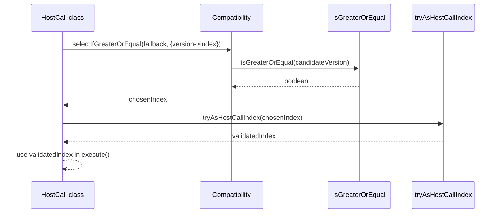

# Update host call indices to GP v0.6.7

## Pull Request by @DrEverr

partialy resovles: #539 
HC indeces with backward compatibility
also:
- added `selectIfGreaterOrEqual` to Compatibility utils
- added gp 0.7.1


## Comment by @coderabbitai[bot]

<!-- This is an auto-generated comment: summarize by coderabbit.ai -->
<!-- This is an auto-generated comment: skip review by coderabbit.ai -->

> [!IMPORTANT]
> ## Review skipped
> 
> Auto incremental reviews are disabled on this repository.
> 
> Please check the settings in the CodeRabbit UI or the `.coderabbit.yaml` file in this repository. To trigger a single review, invoke the `@coderabbitai review` command.
> 
> You can disable this status message by setting the `reviews.review_status` to `false` in the CodeRabbit configuration file.

<!-- end of auto-generated comment: skip review by coderabbit.ai -->
<!-- walkthrough_start -->

<details>
<summary>📝 Walkthrough</summary>

<!-- This is an auto-generated comment: release notes by coderabbit.ai -->

## Summary by CodeRabbit

- New Features
  - Added version-aware selection across host calls to adapt behavior/indexes for GP v0.6.7+.
  - Extended version catalog to include GP v0.7.1 for improved compatibility.
- Documentation
  - Updated references to GP v0.6.7 across modules.
  - Clarified availability notes for certain host calls on newer versions.
- Tests
  - Added unit tests validating version-based selection and fallback behavior.

<!-- end of auto-generated comment: release notes by coderabbit.ai -->
## Walkthrough
Adds GpVersion.V0_7_1 and a new Compatibility.selectIfGreaterOrEqual utility. Updates numerous JAM host-call classes to use version-aware index selection (primarily switching indices at >= V0_6_7). Adds targeted unit tests validating the new selection logic.

## Changes
| Cohort / File(s) | Summary |
| --- | --- |
| **Core compatibility updates**<br>`packages/core/utils/compatibility.ts` | Adds GpVersion.V0_7_1; introduces Compatibility.selectIfGreaterOrEqual<T>(fallback, record); updates ordered versions. |
| **Core tests**<br>`packages/core/utils/compatibility.test.ts` | Adds five tests covering selectIfGreaterOrEqual across multiple version and fallback scenarios. |
| **JAM accumulate host-calls (versioned indices)**<br>`packages/jam/jam-host-calls/accumulate/*` (`assign.ts`, `bless.ts`, `checkpoint.ts`, `designate.ts`, `eject.ts`, `forget.ts`, `new.ts`, `provide.ts`, `query.ts`, `solicit.ts`, `transfer.ts`, `upgrade.ts`, `yield.ts`) | Replace fixed indices with Compatibility.selectIfGreaterOrEqual mappings (switching at >= V0_6_7); update imports and doc links. |
| **JAM refine host-calls (versioned indices)**<br>`packages/jam/jam-host-calls/refine/*` (`export.ts`, `expunge.ts`, `historical-lookup.ts`, `invoke.ts`, `machine.ts`, `peek.ts`, `poke.ts`, `void.ts`, `zero.ts`) | Apply version-aware index selection (>= V0_6_7); add imports, update doc links; some indices disable via -1 for newer versions. |
| **JAM root host-calls (versioned indices)**<br>`packages/jam/jam-host-calls/*` (`fetch.ts`, `info.ts`, `lookup.ts`, `read.ts`, `write.ts`) | Change fixed indices to Compatibility.selectIfGreaterOrEqual (>= V0_6_7); add imports and update documentation references. |

## Sequence Diagram(s)


## Estimated code review effort
🎯 3 (Moderate) | ⏱️ ~20 minutes

## Poem
> I hop between the versions’ rows,  
> Counting indices with twitching nose.  
> A 6.7 breeze flips maps just right,  
> Old paths by day, new calls by night.  
> With charts of gray and carrots bright,  
> I version-hop in pure delight! 🥕✨

</details>

<!-- walkthrough_end -->
<!-- internal state start -->


<!-- DwQgtGAEAqAWCWBnSTIEMB26CuAXA9mAOYCmGJATmriQCaQDG+Ats2bgFyQAOFk+AIwBWJBrngA3EsgEBPRvlqU0AgfFwA6NPEgQAfACgjoCEYDEZyAAUASpETZWaCrKPR1AGxJcAqt1rUJJCw+Ii4jGgeHigYtPAM0pAEkADiVpASAAwaAGwaAOyQkAY+iJRcACIUAKJSFHzFAHKOAuWQAKwALJlFJTYAMlywuLjciBwA9BNE6rDYAhpMzBMAYh7YAGYbsv0qiBO4stwkrfWyE9zYURNdmUYV0gwU8Nzi+BhccEGXUZAUJABHbDScLYfyBZAhMIRX7wWLxRIACgw+Bo9DQyAARAAJADCMSUCUQmIAlJAAO6zSACNAMADW5Oc9CW3Go8DUHnUsg0kAAkuFIoh8OhaLRkGhIORyZANtgMGJ4O8ADSQAAGZS8Yl5GxS/0CFAA8jUgZFVSrkrhYEFcSxWeIOVzIHh4B5xbERWLUuk6ohFVhsvkNABGDRGfTGcBQMj0fAbHAEYhkZRohSsdhcXj8YSicRSGTyJhKKiqdRaHThkxQOCoVCYeOEUjkKgppZsDCcP5oaUOJwuakFxTKEuabS6MCGCOmAys+loUj7Jj/CbO10TFlsh2HDQ0MLb8YGTGHgwWSAAQV5iabgXoPeYznkscYsEw86Mp9FyA2kiCcvUSRByDJLqaCyFYaDHHw672i6jo7rggHChIkTwAENCQDazB2uyMFbhqObarqJD6ka1QmtErTPhIip8LSFChMgcRbJQ7CMNg9QsWkGSUL67xuvQGyRB4NL0vYCQYM4iqIDy1S0rA/7QtgZTIBhWGbty+B1M8ShJMKZThJaQQMGx/ztlxFA8RgKoCNgLqehKd7cDKdHMKk3AAGrcX6kB0iQsgIfYuDPBgRCICqDCCcgeFajqeo0IaxrYJEiKYkoAlXLgmIqv8i60CSKqYOiiBlBQ8FJFakAkAAHscYh0H80jpTyADKYkSaECh1HQHAGFAuLGSxbmZAA+jkI0UlS2X4BQzLvLg2gYHCRCQINI1De0HCYh4+Dkply3DaN+QbcwKG7St+RDUGG0IEQsCYpAgBJhBV1U5liW07aGvX9aZZ1DT0lKWmVQSIGgbD1TlD1PTVpWYsdtCYh96FfeEP1BuNAMGfYINBJN00Q1VUNYtdt0I317HfftQ2dGjckY8DoM4/Qj34y9kApSQaUeBlCPVJhhxg1NjOQyzbMc1zbjlXB4r/Og3DHLEdVoBscWA09SDiMFrNNSEVzMlaIl1gLlD8HGPp+sS8maEY5iWKenPJmbOkq4SHjOGyvHG5DU0plNPDzJyDAVe26jwNIYaQI0wr417dAXH78RnlYvKQM7rtvBgyDksxkDMIo8BfnQoYGNUYTwHeLaDvVVEkNK7MbF7XAALJ0PAjgHkePVTjOdJztIa5TSQy7iKuUHYZyW7wd1h6YseNsXo2yZ1be94ewwz7BaHPVnh+6CStXZkWQo6dzeTQ3najQHuZ57zUxkkTAqzAbBndBUxAw6xKMgf5wirpvX4bQVLU5NCU8/R+hDTctUGwTVeQGkaE1IavJGhDQNDYCokCEa8nbHRWg2AiQ7ylL7AQ/snRD0dGwS0ih+BYBUhuHCsguBhDZAHKKuACKxUoCRMiwBoB6ERAJKIwk6SfCyqIAWXAwIlXgJEYANhRHTWACkS+5k/Qqh4XoEknxQxFCgAAIRIJRaiXAZhSCwBKfhQlaR0nQO6ey4EnIsH3g7ZISF1jSBVH+RA4V06OPdt/D+Yk4ga3/pAREVEJQEFkT6OgiISRkgKiqOufAMZfnMuEX+WBLTUGCBiax6Air4AYFIlMLj74v3JFaaWGMjJkzSVfLAqAiDsL4D7QEiVogWmfLU5R19EQ0OgmPbkSBCLEQSkldJsSRG4DYt4zJaS74kB5NqSUwoy6rxQJ+fAcpaCTOmYBcq5jBFaN0JAUoiQJTz2eAHQ4xwYDWPoP8TkiRr59NHlyDQQymmcLaTKH26TUysmeEKDAhdrZnjts2JxwoMYpwhe7R8UcSp1R9pcIh8d2DBw3lAaoGBHDZxIMwU4HoupqkUR5bpwKUaQAALwPwKE/VUMRA64tVKSupDLv6qi7j3Bc/dB4uh5ZhWhAy9yqk3k3Ch6JRTEvVHNcQzCSCalYTFIicUvnSJ4XwwSgjhH82muI5w4hpGyJygopRFlVF6HUZ8dlWA34YmQKqF5akbVqi5fOPuS4VwCtUnQkVRhi7iDLnVQs2MSBVxrlseukBsTwBum3aeHcwBGDdb3IQIMJhpuYGAKEuAwDhSiPsWkRlmBXECBMe1sbgUT3jTPM8c8kzNkXo4O8fZHyrxfJivkWDFC4MSOksAXZnBAwVTmLyiSVY5rzYJAkVUnRlHoHIFWp4iqVuybELwFAeTvk9KXbgXsNl8CdXQu5rkyUWR5LI7gLs8G01lfHOEShKoxGDshAAXm7LAiIchkn+nJCUtBZDiWOgHfN7ThRHuFSwthKqOGjI8F+lUABvSAABtVl5KNArQOgAXS4EGdokAAC+JIeTVmQGwTAeyggPtnV46kQQcg/OaR4IsXofHeJfvhpjbG/nZDyIUF+KgNILJOeCHcqY2ylWSP8DYir2OLRPWgbe4TCC0GFCiGgpHyr/GhI+DGVVRB4CCFtGYAd/h3jhMgOU7b160BBbW22cUP3+WhaIF2sLvHwuqtHGMfAUXEPReITtKwQ4sefYazk7605Pg7bQLgqoaOVRdXaoqapl2+iIBgF1nLLHcozemzN2bQi5tA4WhgxbS00HLSuzLIrehFANCx+LiXqVJBcMu7ExXcSCUwY+r9JIADcDLihFEaNXZr8sn00sCrIDrXWeuTcRMNgwRRhsQbeVB5VIzSJtIQ5ARDy3VtFCKGhs1fpMMU3yLhyA+GlSHbVEUYjd36tqkG6KouJcg0zW0v8cNFVI0lUbs3VuU8wyd1y+6zN+Ws2TtK+W8rjhKsDyIdIKS1bQcnnPJeBeN5m3LzbWvV8m9t3IH7YO6WiWFPjp0V4VLsPBJcBp6j95k2eC/cVIpDw8hFIKxlPASqdUSlBERO0QbyzpR/lK+hW0QqNsjuisM1VcHHYOQ6I7IMVNylkB43U9Z6BwheAxMjS7KpeDSEoFRDWBHx1EQoI8vg6SpKb0wYFHteD0kKZXBiz+GSEDkZ7V4Lgu6vbi9fu/RI62+Yv3QwfRE38lNxGi8kDEBpWRAhINAI4JAyTJAcLLEPVT3iJ79JEGdlUEYVAKY4dgH6nRibqtJ9mzF5RBAxnxgokBGkvBPQ868yydwDeWfRgxU1S82fnPR2QReVYtZ0/gdYacEYRxi+vFz5UDNGTQiZ+OPsmDduiLJ7ak/p8hGlBjFrqAlBxWOuQOzVsHPguc47VzdqPPIC83uxFvnCEBaDkFxAYcVgccAcbABKRsMKtekQcUxKTORULOj64WUikWRs4+dUGwzkZerWM2c2YQ3WUQvWVUIuOewoLW027WiAnWuBC2fW0ugq/Scuiq0G22ZEIuSGqGMe52WGp812GuKoT2kAg2zumEIeEB0WYIqExK6BDimIAAAtcicJQC4Hyq6HdCiDXN5iVMpDLvQVHu6BwdfPHqKMHNfMnogKnmgOnpnjcnHsISVJAJyOQCvqQPQMkHCG/NgNpJHrICqPoZZHkuYZYVniRv6p9n3iGpXCHBGokh2E3HECDu3BAEmtOBDqmgViDEVmEFOgWvDhVi7FVqvKIHSHunCJoOjkeJjvWleCmEvK2nGKgQAc7t2jgu7nUgOoyBTpNlTj7BjLiHrEUfgCUcEMVlkR4Fpt8MAXzgqvQC1iiPYe8KQHwDzuKHzgLvQELoPn+GoTCK6G1rNhQfNvgazr+rQT6pBvLkqorrBjtqXskKvPgKEEEK0LgJnNrgABwhLz6saO5xLuhBiFCIicR/JcGFA+xSiUAkYwB+71SPLv5YAELB6aEnGy66H0C+FjHJxV6Sa14ybN4JCMqF5pimSoDiF95SEuRZC5C5COwUn8bok6bhB6blQpbICIhEAYg2hhBhS8SBS4IEAUAqgb5GZkjmbzRWbyiE4Fz36Y6P5pxr5BCiEOwf4+b8B+YTGBYhwNFQBAGooBz5xhYklogTaPrJYuypaOp9HFHtjZYpr7BQ6Fb07ZFFqI55EDwFH0iWmlGIAMqAAoBGzmGhzogFzogW+grA6qQbsTgbgHgR4AQZVIiK8W9iqFsXCC+sgYVN1KtqqKKkUOGdgfsVQYcX1itsdl4RoJtpcfFNcfBq8UhsWcduwWdu8BdqtFdnhvkEqHWURnlMWYIZme9gGqXGERXOznvLXFGrES3MwDWomsmikbaWkTDsMXDk6SWi6RMB/JWoEHuJPOUbPNjo2rjr2A+HURKZqVvJ6GTu0dRp0RrOOhjA8BluJGhA6aMZAJeteokMkvznVC1oUMcRKCyEZmsfMnOgpqWeWZ8nBiqA5NwApoUMkEGIxokmicCSEvABoAsu4qzq0EsIkIhRSFaL7kEO3oUH8rWAqFICqKiBUpSGUJAPkMEVAC7tgr2sgPCbYRPEiTofINHo2VgGSZAHIVnqcEoV6gjH4BIVRhicWjXtFlaEpkbI3hsLia3uVDSR3j4AMIpspjAAaBUAaP3kEEJngGzpIC6CQKQE+IUU7lAMvvUc/uvgLpvsZvgKZiqRVPUD7GvLQA4UQIPu8EGRjC+ZgSwl5LWExLVHflbNKU5rKQ5fKW5qnIqXGAit7KqTqYHOIP/oARMaAYSo+dQGxD+PXnFowKaQ6g+ZuTQNaXOdDtDhkSVhFDkc6WWhuZllufBNmcco1qVQlqzmQXsZQVGdQYQQxUNsWbZeNmqLmeQUNdGbGYiFxa8rhOcUwUrlWYiO2ftg2WepwZdjwTkHwXlAIeNR9oGkOT9v6aOQDjEcDlOaDjOckbOJDguQ1SMWVrkWWiQCIGINuTWhUfuX3jUceU4Z2tuoLq0eTteQgaFdfHeeVNUD9eEC+UHqzmblRJsoGfIF+KsfrjdgAEyD5bGAXFJSJLVqRlmrVbbrUsFBj41sGna7VNnAnXb42ozEZaaoB3g+RSUtZs3caAm656A0okVUUGQUC0VBB00YJNG9r0DsWf5Sa6RgiK3sZ5pF7GHiTRDb4MBcBeEnq+EhL2qUC4BjZ1D1RzRwh0CMWiYSEuHlT+bxyniJz2BsQCR4k36DlRDyCLpQGUAKYYyO0gH4qEopkRbwBRZeSIiI05jwFVTEH0Zq1sloiD4Yz0kexVLlXD5oAY18AimWZOjimxYV6YmyVeStgsQGkN7CgyZyYYwEJ/I4kmR4mIgkUnIDBi4UQ53URj6nn2GlzqDV0z6s6w3Ar35am5Uh3gGJUeZ1521GlVQMrXzMlqgx1iA1XPWpHLD2lLlNUrlI4TDfWx2dWg38QYF9UIEDWRnzWLZ01vaOwX2zpX35nDWFmEHk2+oQUwaVm0303bWM11LNk4ZcBs1HUqhvaFwDlfYKCXV/ZjmA6QATnxEJqJGzmb3znb3pEvkfUtVVaJKkCek7nTwA0XJA1461Gg1nkk5q1Q1DGZGgZl4KaLoInqxLT628VM2mLuiKRgXaHLXchf3MHfLJCq5BW72wjYUYhIoYBomQBNQ1R5zxCCTeGQArBTQENx1PpbEsLID41UzjrAkJKCRMOWLq4EbUWUCS3iX15SUEDcBgCxhgBfheDSXV7ti14OFWJKUqXsaQAkUIz9BER5gqzp2MlBBqMUAENPSGbRaH4S7uNiBcCgFTTyB6jbIeV0R8DeW+X5Tug6bpT2Cbm+X1QWZYDWYSlRWgqOb2zuwdIJWv5P5Klf7uVB2ZXe45UZW8D4AQR8xV29URMaOJYb3dwvWYOLn0N70I6rllr4MkCekMqoFn0OKqh5lzUjVxn4YkgMrJArOzUHExmLYf1nGMHU1XG03tAM0oX7UgOdBgMCGqiQOhHlywORH/bRFA5xH3UJHg7oN1U70TOOlTMH1Sh/UY57mkPVHkMg31FhzMVu4Q3kptFDr2DnFjrdHlTBUtZhPhx7zFRUQJAXokBXq0gN7lSMJyqYEACcN8AFGtackQQecYGMgt5KeuwtfjlJW1PON2rx/l4tktc6QQlL1jdtTspd7j0WFdpkml/QjstdOYGQ/jm8y+FjfAOtlDx+7o5+I9qL7wg+gpaEe+YQFAvJPsL8XdudJT80hdiz9mMVNTMyUK5UCpcKKVGhaVP+aKf+GpgBdEPT3OJVC9SWjKK9qoY25IwzeWdpWD4jq4+9a5ILJ9Alj9U2EZL9N9fWlL99j0I201/Vabazb9cZnZ4FVNFZaq8GlLtZ9ZJ2VzLZPBNZnZT2PZp1UDF1oacDN1Hzk505qDT1IzW99V2DzV0zVWXTVESgoLu5dagNkLR5K8p5Yc4N0xHF4wRzjoHDuuAlQlxwIl5wYlxOUq6IkAAAUk1JXiBiwJJsnI8M8GoBrBjFYHRBO4ZFnciO8E49ZvS9EGpjJRK36Dbb0bFirE+xpChK+/aoAJgEyArTF+C04dkdcNGBtLR8mA4QiI+NDFjsEol5yL+MOmB8PDGspbJz5bcGzUCjX4oGKjMxR+SxkA+NjGWuRFvjqA7LdbB0YtNFSAQQmHS+woqr2dudvdHa/kBr3w1AckLSnlWTBUvldrNsMpkKTsM9jTbritSK6Vv+WVPrm82p2njoBVUy0sfTXAK9oHL7jKNpfzMbALcbQLa5474He4E1kxYWizQbNqqZEdRsybM1g1+zC1mH99BAnZKbWBezBZBzNBJH+EpzP9u2mHlzfFQD3BIDh1XZ4DrbTzwaw5V1URUaMacaD1fb1n0b4zjVgLn1VW6eLgU7xD4LDaZD87BOonS7R7KAq73G7DehfF9iLkO7ChZwyhNlttfe0K4rd618nj+JTJWdZ7F7/XirlJjGziSrvUFTKsrTXT/rwZkWtej4AAisCHV4lhmccisMhysXVEGAAMzYdJ195C4ZBk2xcK6QUbV3fJecOpetkMf41dn8cavJBsmIAcm4BclHwmtiA+xGdFVUV8DidzGmb6sydro+UKYvx76u4H5vRWvfy0xYx5LgdLfasw26tYAWvUQKdgqxXKcv7uZqeezNPIpqneudr6fxx5VGymd5vGls7dMm3yDfyhvHeUCyCRujNDuxs4OjsDy1fcgn25tQA9VBsRcBdRcLV3f33K84vkhq/P2FvRfv1vcXEfe023ffeAMs0gN/38FvYhHnXPMduvPwO3WfO9s/MDsYPS92ey8H1Cj+ylhlENczsQtNotcnlteNGu7NEIsWRIvSyYus5z4L5ot8BNTz7xCliQnQ2zpbH0em9rVnPCMrJ2Ia7cafFGyO4nr433fMc66suoCoWgnVyUCc3ID/DEs3oO3s6Y3XfTGs6Pga4ivjfOsFISbsDQepBUBHDgRGwytytN7N2qVBBgkO5t2/tuOWxYrVQFQ/ldeuHyjh7rsomnq66IjG0lRm1Gz53pwQlfD1S6ZMvlSZ9B8G6uXxBYXuGBJLSg/g8nokecTERKUzFK2spSinOnrUydb1NGecVJph61abqkOeExHbkL0KbtVjOhkCplwEwRlV7UcjLPoUnQ5ldXqw7eNmWkD7Z9PSx1QOhMT1KD8ECjIGDn305zC94OSBHzoVALaBdb6nQCEvyD1zJkOBIZbgas14F9Yi+8XCtoiF4L/0OOaXBjpby7Ji4YKCmCvuOir58AWWFkPiEoO4yoUX46/R5k71y4vNrq7zRBndU95JFSBYzN6suQc5lpAolGZSpuhD4OZKiOOV2pH0obtcLykNK8sj3jjw0gg0AKgOnDcF0NKu0QRLDyCfb+lMaQZMxN+UYGzph+QYImnRyUin8BGZbc3t8n/LZxwIsFDWMhgAYYYbeDHHoIRmgpoA6QAdcqHzR6DXwdBXkNuq30zg0RfiqMVVlYxj4sU8ECtfdCEi8I+E+KZIbdvIT3YjdHYeeVWhjH7RKA5YSgIkjq0VQqICK5lP0ni0x5FQTaN/RYsDFICj9xMW/LEtFkwB3FzIS/WTAq3rp7w5okTOZr41bqcsfi9tYqqK0aQgRWQEEduv0CB72U6m+PBaBrANZeQ7QsAaCvihSbo8cm7lRQl5Tk4KZf038cTjEn8oYBAqTQ9YaOmm6f8A4L8eYV7AUwsN9gv7DOFnD9r/BKmD+KAY6xU4NN4B6nZUqzwyrICzydlPuskFSoxwkBf+eQHDx0whIMY4Q1wSgSzrCjQ0oAlWHTBICD5WmztJOA4AoDu1qMYAipsETOqDlneERCweOWsElcveUbMgTLxHYH0wQPwydh4JIZNc52LaaFou0PZKA1irREeGpFdr547CoQ6ISMUwLMMOKvDOgvwwNp9cphwlRQvuyHh6CiOS0HDoEORYsIfYvovwNaIWRwdvOiHMelWHKhpiqAk7FrOjQDJBkecx7HGoLhAqyDMgAg8IMTQii5DKapHAoUlCDCZArelQ65jdmpb8Fa4o6KQKWN9Aawgw1LcdOpXyAABqE9G2P4D8seOCMR/ucLLrXwm6ZAPEgTwxZERWMUrUECVSW7t5VuwodbmCmiCCcda3/d+Apn/7FYT0+mJykZh4CScQBopG1hUxp7VM388VG9syOSrM9EBbPHThzz9boCPOfPReiGyzqqh8xClBlIiD5G5RGUOWX5uVwcGTNquA8K0QWIWSdVXOqvMCam3EGa9b6NY8atoj14G8eBREmLnwwpqCMaau2NsR2PPRVCRxdzB3jqOgbhERyBXBBkV1gA2C0G3vGzhV3eoWi1ysgULHZltGNcqiEfR0Qu2j5QBl2u8CXBxQ9g9dUS4YjAoNxmEHsoAElMfvKUm51RF+SlOuuVDbqriW8CMBuApRVgABNSSfgKKgAByH3AgTDqcDsxNDK8hmFYFY1MChvCQYQUQpi5hBl9Sia/WN5xkpBZHT7hl3KEKC/u+NC5ioIGwwjMAXRbQd6DqTIB2WbdMnrOhwosBEgKUrjpYx443Y8gm8A0OLWCEBxWS7JYrAKXvFoRgBeKHOEoWT5OYFQ7wYUvihfHlNi6EA2ng6zlLfi4Bv4+CS0wAntM9OwEkqEKKqpFU5614TzhBIIGqhHJUxSXoO3+YxD/e4kySXVj875tCJUUrXt+iGwQxwuQUqiSbxomf18h39GQYhSYl7V62IDVKfb2y6mDvsLvA0QgyQZfMUGJoqXvtNEnKVcAq8erp4NnZyT8cUfVfGHHfIkspK5LeOMnwQLjoVgczNZIiGYE8sf0VIBMYi1obJjN0fIF/kEGAhz9/hbQgwnlJFqctzQuIhAqn2CYIU+W3HOin+Dv7IAgwrxDvnrl3ReBJMguV7o9OOZxc4ptNGsvIJS4sTAeufV2p5S2QKZ1W/M18bFlyafDnJDESbtiWX5rigghMvprcPMlr8946SOqJ43fFKdoBTIyaa6z/GadPWAcTkWHBCxTFVphpfCSaU2m4zoZsAXaT7whlw4oZMMpNufX87X11msghMtdJ2axz028cxsXRJL6tj5ZiUxWV2KDBsTfpuoswQDJ4nu8e2xo2wbVRQnDs4QdcWGXaNkmHl5JrXZGZvEf6YI64+styZgU8lvpa8izJbih0YSmQqYyeR7sUhAphJ05z0oRklFuYKyfuVQgjBzUhJc16hn5DFrG0wLW5fkuUyAOy0MHuh9GPsLQexikjhwBOdUwQHixUAuNgRwoKnifK073p2wlAdUfbIZHjSXWnmVkSz2fkez2eXI3SMtOlj3zXZtAWOBlW/lO4OJ7bfUaXO7bIMwclc5CWaL94TAto+AOkGCHrkyTvBwNBSa3KUnbxyR3XKWRu166cMluOkqMSNxJg8iHaqAhaXzH6D3FsF3ATRoPIH63xXEISIMAnVJkJ9aGz3OMdPObEvS4MIDJjElMUwCBhMApV0FLVOEbyjK+SQpH3lpl/CjYM3DcYZCvYsQBK6lQ8ct1pLE5fgZ4wkYylYVYKwQoIzUcNNrRVMHZjIhnklRdnTT2RBnbKnp0npgFIIOA/2RtLNLWL2Foc4SahOyKYL2FdWXXnhNumRSM2IUnXq53DYUTzpiSuMmIplktj4M+chedby7F29jq7EttnqO4lvNDRHvCuYJNNH2Dh2aTXBWH3tEIyKGMLF0fHz9CJ8ggWM2dOq3HSyIlMiyWWnglIUaTz+rLLHgwuvJZiDucYAZXZhawCUUhuNZ7mPIAxAYv+atZYdGBYij0uA6S+ObFJyUYckMFQ5iV2Mt7EYH+UJCSVMWQD3dx0DMrAPlJZmzieZvHEun+ym4YA+4hJUqObKLQCxFoXOfZdpmNkt4ARvstAhgQPGOw26gmXSvpUMroA5FJlA0gpjCCj5LKPkeQFVBcG9TTER7IHoJ1lDyhv2wPYUPMowqtSgg0nTJvCMWiD5sedEXHkfi1mE9QYGIEngJUKlPpR69Uj+WNK/HQKPYHi/+W028UT0Mq3PPgNKKhW9UhmQSh1PMtgnONvAj41BXUvNENL4IZIAeadIikHKi2GHELsKHiVGropi1I5RIo2p/0c5i8i5QXP7I5d/p8CipbxNjT8Tql/bWpb7wOkTAZMVtQ+u60aVY5w+TcxGX4IGHwtSciY6WPyt9E9Kn038aoCGpVm0dpQhfchStXEWzzogRQtQQ+06QotFUyAQoMhVzktkCK2uRYbrgaRNJERZEcqRLUqnmIZApjEEcWP75Qi+FWbYWcCKZKzQWVMoPHrMhvbX4raUlHNNsTLw8gXRbFPeOSL1rZqeKlCrdtpOmG0KvUcwlWiHn7Q0h50Ja/ETmLG7iYJuXyo2W4JNmQrkgHpL8Q3TqR1RWQllN4fxghLKthQYCtOnKEDRBAIRBItynSuRHromGvkafLyqPUErBVn4kESKoQFuyBRgEs8qB127fz5V60kXpBNTWK1YJdgv1aJMDXkBg1itPcGSGEFZi+0ZNXZhrwumLZrVea2QVW3yWdjPp9FFQTajCBbiPYyyuqKqBHEPNHeRc11eUrd6IKQZyCmpeDNs7+rCNA8fGHKBOHSSmljcnwc3KRlE5d+lwdeBoCTVCCj8uHf4EHnCBdq2BgrcsakJ4X3xHwjHDYnWOyER4V1TY7JTapYKMd3pzNPOfd2Iz2AnWWSCDcVLYACz7u18Gvi8v4y19GMfQ+cavM76tJ4AIoh4dKDGWG1yR6JJcf+2m5wgrEuiyfqZDNl7iBKsK5IP4wvlvKjYj8qgNEDAXidpgOSdVrviHXz4R120aDU/lg2qcWR4CmaRyMAW+tBei00+hhttRYbqoCmkgLBPglkgOUeG8OU1Vk3EaxtdWfVTHLOmRdaNfWRjqavwnq845xqrJe9xc2JcEpO1Apaxq+6ZcTqAm2BWUvy7uqy5SCx6jNuk0Eb2YQav3HySUYeAwAUSnBUprDXNKI1rS50cQoCFkyghLWBNT7BjSYrLkkQEJTgvTWs5e5+3SVn3SWXcLVlwoWliGLUhgBaAzwExNsS4A8q1tGS2QVhwtCk7DljmjOQl1bFbV7Vp24BpAEYxXKBSEVXMAqiFGothx5ak+SxiNhPK9BSFX5PCvdDGDo1cfBdapMVprtktWkhxDQuG56TT1Ki1xhcK8g6KWOK9BbhPx5UWSVuM/X4fPz4CmSYBHLcLTK2JV1TSVBKkTqvkdhI96tzSOqWgMkTSAsROIvPnyop494FUfeFhuuQn5WS8EyLRWMpUiqta4q7Wn8e4vdYIbZpkqi+eQEE2cS8unbSwcDIEk+qpNIkuHPNrhASAsF2E/cGC2U34KoWhCjTV2lj6sUfJyLadQwwh2+7fRmCIvT5H1nokMZAcFrGOrLGOxWgDHAjKgGJq2ggKL3CUPRvomRAVQtyljOoIB4N9mWfXZvpdhPSpQ0A6UAOubpM0yB9E3dE+XOLKAIxqGwwxErnl3V2EDNLlUzMupx3HpN2rLS/ltGCi+htIVUNWApjdJ0gbaBks9ePwvWSt9FpkbxivxVgEJNFJuyFWOOPEqs6pFW+3RPhBFAC3oqdMFc/xViayBpBdDlQshGkfi2t5uuDb/P/E9akNYcJqCAq+FrT3ZHUwlCmwDlmk29xeibfHqWYuQkJQk6udqte1EbC9xekVHqs24Gqn6CS+OSlK22CLOltDZHT5woDncySaSqncaokOkSdI53c1coctWdl9tZvQ7UlDKn7YdDtbStczrpodka2zbY7CUpdUwMS5d2sTdnqe1565tvBgeHeFXhW1Q1Xgg8qpsjVtKQdsasHci0py3l0W3SreewBcAelQVQQWyZ4fICcLZDr6FAmjqu4VjgKvC6zT0DWWAYQY8cZ7iTQlmT6adM86ffmpJnFDZYjQrJP8GM7eJ3iS+8qE8r1yGMytLauivjWyCS669Z+0qOOnl1UKIxu7LdTGJ3Xej9IalVogesXgU9lFUldLd8vqhXqIVOWtVcEC3G+cMCbeQ3ZAf+Fm6VYbdK3R+opUqwMRZIZ3e0aE7URNWes5vRsKbLj0pw9rGDUQY61TS2D3Wrxbpy1LMKlpmAlabzwYNKq1Q8RhAOQDCXcH0F82jw+CZL1L0ms22u6etsIJdHs2KkpQzRrJ26Hi+dO+DF0fc0Uoux8sn6c6r+l2G3VomqwVUu+YoKuDaCmTW4YuAkASAdIbw/DMB1OjFJNewYX2jjXDoHj/FcI9YBZNWIk1hLbvmroyOYF+aRQ9ZfkZAzTpKdWJ6nffulkHaGNoDZjectY09jYkwsijDMjZlFTREgWyAKONF2ctZF8i9owKzZon7t4gxutV12GNDdRKMYxUTpgtxnJ9h1/MNO303h/61dix2vIvxy267dS2xg3XkEYwh7W8R4zlkCJ5Hm67+GsyxY1LB7NSOpcIkosoAJUCk0e2TRaGSFaBT4tWxpp9Kn2dCPHoqkAoVTHudk/yutnir1uQZ8VkHHQaG0CaGysCinITDJl7V+CI3HBWTdWX0hjGBNu6+YyR2vCPv038mVQoix1KUdzXlGMOeSxnSxuZ16mONNAJTNxu4Wqg2aV20pcXMpNdtqT5c2k5Jr2nPb89TJvdD5HZPhq/DQO7k9Q2v2MMwjSScqFYGL1+iGGi6LvtekaFBBpTfNRfZUaKOZH74U8qfZnNfIRNG+B8Q+fLTb78lh6CBALXhUyDcyKpvM8IFrPxr41FkmEMWewDqi+1wUoFzAgwL24R1Zzw2ggX+Y73o6jWx8fSFjvHl1R8OqOc7CrNVF0R1ZGsdVhmfB5hQkYTUC3AiF5DpN2L0PPkrrOibOVHxloKbfYtszok7QayQUMKCroLHDZ0WMMyxwjMWyFWvGRM+mq674wX4R/H/taBXVhiqFl/X06bX9N505m80a2lHvp7Ot3jcejTt/kQ1zSpVxCGVehsCWYbNpLF8bYhOcMRLVw82x8/CZeyfFMTu2y1cReSVFApQ6V1OXtvgt4mMOdqk7VucUGMSLtNh8k1xNu1Ums93q+K/UqZNF6UIz5gHa+a5NEK+Qq7LgAni0JqmKFmkoYxusjHK6Yxny7fh+l6s6UNMQMO9EWtQCN7p0qAAKjxSQguhb515ZCw7GADMzTFuiffbnTM5TLloAxegLpvR3Sm9GD3ftMnUrG8LRFhVmQXo0JO/drsYAdmtctQD5NOYPuTAhzO30Mdj5zGVjELpPQfWBaOU8lOKAZJ8BSz0+NunBI53fggycQYGKiiLURHoQDDa+OvzPk21eQgqMQFQkPg49mt+vIfNVppX1SVQ14zku5RJWSTEAaBoIMnUx4c6M4VoOqWI2xvLXxQ61l2Cjgn0oBSocQ+/AQej1vHY9TZsVbQc9kfqU912s8yJovP1XrzOe28y4eyLzaUjdENqypoIUtzq91DNIGAD+Rs3vzKsAAFqUBhQS1iRo+nRItZnuWxbZbEFhIqwnlxO3edDf3l7WCgrM73fRlwrIAPrg+TQQLody5T3EhF7A94jr7CyawZF/FBRbWKSyBrOa5zXmtm5B2K0mWSTDLVr2h7kV4Z89hPzHWWhFrN4pvbCWSEC3NrjKMG7tYt10p51nXWXWQozurqhruuC/RMZ/j8nMC+aIyHkT9CD46jL4q/m5bqBJnROX4k1kHFBgVbRVNKgs/SqLPBQEepN4dXE1uMD3EWMx9EPXc9EW2iAPlx2a4s/Hwagrien49YD+MRXVQNtvW4qum1VyBz95ocwPF1v4A/UZEuJSnKN5BdbuDvMiakqRNiGCrK5rO2ubr6vWqhH1p1anrgUq3M9Ro9W41fNHkhngmmP7T4ea5qao1IOjpR+xkM9XchTl9dYrs3VjX+U4x1WqffqnUgpGMYLAF0wIBMBog6SGyXZN03yngMXAAAOo4OMxrOAvjkKevK5G89RyAMDb2gtkpxL8YLUfpIBYVON+5x8DxvoC3dlF6IcrJsnbBgBsHg9dXcuI+ABQsVQQRfubMK2G6e1xWq01CKUsShoAelAyrNaJT3ILKTIDFXyR7jeRfIT0fFYvhOMkqv2JeKrX3U2TwQSeEG/leqxfghmQntZ0aa8adluKZbnxlswArbO2V3gJAZBzdoz2VKrzoMicJWEDgxg4wm+hMC+Z3FcAqA3YSvYuhDTFg1AI4csOOAMAVPWw6gIaChEQBDRuJdAIaIwjsLhhunkYGUJkDpoCA6aJAdoGzQYDtAiIQYBgLd3yAJBlKSgAQPkHyBzOVnuztZ68Vu741qWEznp1ez6cDOhn+XEZ9GDHCGAKnzABgNwCGjY88Vozp4eEAmdZlRUiGYspiHaJgiQomILgChmwwGBCMBgP55OCgAvO3nHzyqLgCGgPP9AQAA= -->

<!-- internal state end -->
<!-- tips_start -->

---


<details>
<summary>🪧 Tips</summary>

### Chat

There are 3 ways to chat with [CodeRabbit](https://coderabbit.ai?utm_source=oss&utm_medium=github&utm_campaign=FluffyLabs/typeberry&utm_content=540):

- Review comments: Directly reply to a review comment made by CodeRabbit. Example:
  - `I pushed a fix in commit <commit_id>, please review it.`
  - `Open a follow-up GitHub issue for this discussion.`
- Files and specific lines of code (under the "Files changed" tab): Tag `@coderabbitai` in a new review comment at the desired location with your query.
- PR comments: Tag `@coderabbitai` in a new PR comment to ask questions about the PR branch. For the best results, please provide a very specific query, as very limited context is provided in this mode. Examples:
  - `@coderabbitai gather interesting stats about this repository and render them as a table. Additionally, render a pie chart showing the language distribution in the codebase.`
  - `@coderabbitai read the files in the src/scheduler package and generate a class diagram using mermaid and a README in the markdown format.`

### Support

Need help? Create a ticket on our [support page](https://www.coderabbit.ai/contact-us/support) for assistance with any issues or questions.

### CodeRabbit Commands (Invoked using PR/Issue comments)

Type `@coderabbitai help` to get the list of available commands.

### Other keywords and placeholders

- Add `@coderabbitai ignore` anywhere in the PR description to prevent this PR from being reviewed.
- Add `@coderabbitai summary` to generate the high-level summary at a specific location in the PR description.
- Add `@coderabbitai` anywhere in the PR title to generate the title automatically.

### Status, Documentation and Community

- Visit our [Status Page](https://status.coderabbit.ai) to check the current availability of CodeRabbit.
- Visit our [Documentation](https://docs.coderabbit.ai) for detailed information on how to use CodeRabbit.
- Join our [Discord Community](http://discord.gg/coderabbit) to get help, request features, and share feedback.
- Follow us on [X/Twitter](https://twitter.com/coderabbitai) for updates and announcements.

</details>

<!-- tips_end -->


## Comment by @DrEverr

I've already started implementing pages hc, and this is mentioned in #539, but i can make a sub issue as well.


## Comment by @github-actions[bot]


<details>
<summary>View all</summary>

| File | Benchmark | Ops |  |
|------|-----------|-----|--|
| [bytes/hex-to.ts[0]](../blob/eeea1fd6c690dec4bbd1063499ceabcb0f55964b//_work/typeberry-1/typeberry/typeberry/benchmarks/bytes/hex-to.ts) | number toString + padding | 332609.03 ±0.22% | fastest ✅ |
| [bytes/hex-to.ts[1]](../blob/eeea1fd6c690dec4bbd1063499ceabcb0f55964b//_work/typeberry-1/typeberry/typeberry/benchmarks/bytes/hex-to.ts) | manual | 16502.63 ±0.19% | 95.04% slower |
| [hash/index.ts[0]](../blob/eeea1fd6c690dec4bbd1063499ceabcb0f55964b//_work/typeberry-1/typeberry/typeberry/benchmarks/hash/index.ts) | hash with numeric representation | 192.81 ±0.09% | 27.18% slower |
| [hash/index.ts[1]](../blob/eeea1fd6c690dec4bbd1063499ceabcb0f55964b//_work/typeberry-1/typeberry/typeberry/benchmarks/hash/index.ts) | hash with string representation | 121.56 ±0.2% | 54.09% slower |
| [hash/index.ts[2]](../blob/eeea1fd6c690dec4bbd1063499ceabcb0f55964b//_work/typeberry-1/typeberry/typeberry/benchmarks/hash/index.ts) | hash with symbol representation | 184.97 ±0.04% | 30.14% slower |
| [hash/index.ts[3]](../blob/eeea1fd6c690dec4bbd1063499ceabcb0f55964b//_work/typeberry-1/typeberry/typeberry/benchmarks/hash/index.ts) | hash with uint8 representation | 165.27 ±0.04% | 37.58% slower |
| [hash/index.ts[4]](../blob/eeea1fd6c690dec4bbd1063499ceabcb0f55964b//_work/typeberry-1/typeberry/typeberry/benchmarks/hash/index.ts) | hash with packed representation | 264.78 ±0.35% | fastest ✅ |
| [hash/index.ts[5]](../blob/eeea1fd6c690dec4bbd1063499ceabcb0f55964b//_work/typeberry-1/typeberry/typeberry/benchmarks/hash/index.ts) | hash with bigint representation | 190.49 ±1.2% | 28.06% slower |
| [hash/index.ts[6]](../blob/eeea1fd6c690dec4bbd1063499ceabcb0f55964b//_work/typeberry-1/typeberry/typeberry/benchmarks/hash/index.ts) | hash with uint32 representation | 205.39 ±0.04% | 22.43% slower |
| [logger/index.ts[0]](../blob/eeea1fd6c690dec4bbd1063499ceabcb0f55964b//_work/typeberry-1/typeberry/typeberry/benchmarks/logger/index.ts) | console.log with string concat | 6663671 ±61.73% | fastest ✅ |
| [logger/index.ts[1]](../blob/eeea1fd6c690dec4bbd1063499ceabcb0f55964b//_work/typeberry-1/typeberry/typeberry/benchmarks/logger/index.ts) | console.log with args | 933556.08 ±102% | 85.99% slower |
| [math/add_one_overflow.ts[0]](../blob/eeea1fd6c690dec4bbd1063499ceabcb0f55964b//_work/typeberry-1/typeberry/typeberry/benchmarks/math/add_one_overflow.ts) | add and take modulus | 6733123.9 ±89.68% | 97.34% slower |
| [math/add_one_overflow.ts[1]](../blob/eeea1fd6c690dec4bbd1063499ceabcb0f55964b//_work/typeberry-1/typeberry/typeberry/benchmarks/math/add_one_overflow.ts) | condition before calculation | 252695658.02 ±6.67% | fastest ✅ |
| [math/count-bits-u32.ts[0]](../blob/eeea1fd6c690dec4bbd1063499ceabcb0f55964b//_work/typeberry-1/typeberry/typeberry/benchmarks/math/count-bits-u32.ts) | standard method | 96213166.46 ±1.84% | 61.78% slower |
| [math/count-bits-u32.ts[1]](../blob/eeea1fd6c690dec4bbd1063499ceabcb0f55964b//_work/typeberry-1/typeberry/typeberry/benchmarks/math/count-bits-u32.ts) | magic | 251746482.35 ±5.46% | fastest ✅ |
| [codec/encoding.ts[0]](../blob/eeea1fd6c690dec4bbd1063499ceabcb0f55964b//_work/typeberry-1/typeberry/typeberry/benchmarks/codec/encoding.ts) | manual encode | 2322953.82 ±1.61% | 24.79% slower |
| [codec/encoding.ts[1]](../blob/eeea1fd6c690dec4bbd1063499ceabcb0f55964b//_work/typeberry-1/typeberry/typeberry/benchmarks/codec/encoding.ts) | int32array encode | 3088638.49 ±0.2% | fastest ✅ |
| [codec/encoding.ts[2]](../blob/eeea1fd6c690dec4bbd1063499ceabcb0f55964b//_work/typeberry-1/typeberry/typeberry/benchmarks/codec/encoding.ts) | dataview encode | 3068047.52 ±0.2% | 0.67% slower |
| [codec/decoding.ts[0]](../blob/eeea1fd6c690dec4bbd1063499ceabcb0f55964b//_work/typeberry-1/typeberry/typeberry/benchmarks/codec/decoding.ts) | manual decode | 16233918.47 ±0.41% | 90.26% slower |
| [codec/decoding.ts[1]](../blob/eeea1fd6c690dec4bbd1063499ceabcb0f55964b//_work/typeberry-1/typeberry/typeberry/benchmarks/codec/decoding.ts) | int32array decode | 166678374.85 ±3.77% | fastest ✅ |
| [codec/decoding.ts[2]](../blob/eeea1fd6c690dec4bbd1063499ceabcb0f55964b//_work/typeberry-1/typeberry/typeberry/benchmarks/codec/decoding.ts) | dataview decode | 163722400.31 ±3.69% | 1.77% slower |
| [codec/bigint.compare.ts[0]](../blob/eeea1fd6c690dec4bbd1063499ceabcb0f55964b//_work/typeberry-1/typeberry/typeberry/benchmarks/codec/bigint.compare.ts) | compare custom | 255026821.37 ±7.01% | fastest ✅ |
| [codec/bigint.compare.ts[1]](../blob/eeea1fd6c690dec4bbd1063499ceabcb0f55964b//_work/typeberry-1/typeberry/typeberry/benchmarks/codec/bigint.compare.ts) | compare bigint | 247687957.42 ±7.31% | 2.88% slower |
| [collections/map-set.ts[0]](../blob/eeea1fd6c690dec4bbd1063499ceabcb0f55964b//_work/typeberry-1/typeberry/typeberry/benchmarks/collections/map-set.ts) | 2 gets + conditional set | 121302.31 ±0.23% | fastest ✅ |
| [collections/map-set.ts[1]](../blob/eeea1fd6c690dec4bbd1063499ceabcb0f55964b//_work/typeberry-1/typeberry/typeberry/benchmarks/collections/map-set.ts) | 1 get 1 set | 61737.55 ±0.01% | 49.1% slower |
| [codec/bigint.decode.ts[0]](../blob/eeea1fd6c690dec4bbd1063499ceabcb0f55964b//_work/typeberry-1/typeberry/typeberry/benchmarks/codec/bigint.decode.ts) | decode custom | 177780749.15 ±2.73% | fastest ✅ |
| [codec/bigint.decode.ts[1]](../blob/eeea1fd6c690dec4bbd1063499ceabcb0f55964b//_work/typeberry-1/typeberry/typeberry/benchmarks/codec/bigint.decode.ts) | decode bigint | 84108240.82 ±2.38% | 52.69% slower |
| [bytes/hex-from.ts[0]](../blob/eeea1fd6c690dec4bbd1063499ceabcb0f55964b//_work/typeberry-1/typeberry/typeberry/benchmarks/bytes/hex-from.ts) | parse hex using `Number` with NaN checking | 130273.53 ±0.32% | 82.84% slower |
| [bytes/hex-from.ts[1]](../blob/eeea1fd6c690dec4bbd1063499ceabcb0f55964b//_work/typeberry-1/typeberry/typeberry/benchmarks/bytes/hex-from.ts) | parse hex from char codes | 759387.21 ±0.12% | fastest ✅ |
| [bytes/hex-from.ts[2]](../blob/eeea1fd6c690dec4bbd1063499ceabcb0f55964b//_work/typeberry-1/typeberry/typeberry/benchmarks/bytes/hex-from.ts) | parse hex from string nibbles | 500033.93 ±0.45% | 34.15% slower |
| [math/count-bits-u64.ts[0]](../blob/eeea1fd6c690dec4bbd1063499ceabcb0f55964b//_work/typeberry-1/typeberry/typeberry/benchmarks/math/count-bits-u64.ts) | standard method | 1100264.19 ±0.27% | 87.19% slower |
| [math/count-bits-u64.ts[1]](../blob/eeea1fd6c690dec4bbd1063499ceabcb0f55964b//_work/typeberry-1/typeberry/typeberry/benchmarks/math/count-bits-u64.ts) | magic | 8590834.39 ±0.68% | fastest ✅ |
| [math/mul_overflow.ts[0]](../blob/eeea1fd6c690dec4bbd1063499ceabcb0f55964b//_work/typeberry-1/typeberry/typeberry/benchmarks/math/mul_overflow.ts) | multiply and bring back to u32 | 261939292.18 ±6.36% | 0.68% slower |
| [math/mul_overflow.ts[1]](../blob/eeea1fd6c690dec4bbd1063499ceabcb0f55964b//_work/typeberry-1/typeberry/typeberry/benchmarks/math/mul_overflow.ts) | multiply and take modulus | 263731506.27 ±5.86% | fastest ✅ |
| [math/switch.ts[0]](../blob/eeea1fd6c690dec4bbd1063499ceabcb0f55964b//_work/typeberry-1/typeberry/typeberry/benchmarks/math/switch.ts) | switch | 278083538.79 ±5.24% | fastest ✅ |
| [math/switch.ts[1]](../blob/eeea1fd6c690dec4bbd1063499ceabcb0f55964b//_work/typeberry-1/typeberry/typeberry/benchmarks/math/switch.ts) | if | 143505683.43 ±17.93% | 48.39% slower |
| [codec/view_vs_object.ts[0]](../blob/eeea1fd6c690dec4bbd1063499ceabcb0f55964b//_work/typeberry-1/typeberry/typeberry/benchmarks/codec/view_vs_object.ts) | Get the first field from Decoded | 243612.75 ±6.51% | 44.1% slower |
| [codec/view_vs_object.ts[1]](../blob/eeea1fd6c690dec4bbd1063499ceabcb0f55964b//_work/typeberry-1/typeberry/typeberry/benchmarks/codec/view_vs_object.ts) | Get the first field from View | 88929.43 ±0.99% | 79.59% slower |
| [codec/view_vs_object.ts[2]](../blob/eeea1fd6c690dec4bbd1063499ceabcb0f55964b//_work/typeberry-1/typeberry/typeberry/benchmarks/codec/view_vs_object.ts) | Get the first field as view from View | 92552.55 ±1.12% | 78.76% slower |
| [codec/view_vs_object.ts[3]](../blob/eeea1fd6c690dec4bbd1063499ceabcb0f55964b//_work/typeberry-1/typeberry/typeberry/benchmarks/codec/view_vs_object.ts) | Get two fields from Decoded | 433528.75 ±0.14% | 0.51% slower |
| [codec/view_vs_object.ts[4]](../blob/eeea1fd6c690dec4bbd1063499ceabcb0f55964b//_work/typeberry-1/typeberry/typeberry/benchmarks/codec/view_vs_object.ts) | Get two fields from View | 81767.5 ±0.14% | 81.24% slower |
| [codec/view_vs_object.ts[5]](../blob/eeea1fd6c690dec4bbd1063499ceabcb0f55964b//_work/typeberry-1/typeberry/typeberry/benchmarks/codec/view_vs_object.ts) | Get two fields from materialized from View | 170540.15 ±0.1% | 60.86% slower |
| [codec/view_vs_object.ts[6]](../blob/eeea1fd6c690dec4bbd1063499ceabcb0f55964b//_work/typeberry-1/typeberry/typeberry/benchmarks/codec/view_vs_object.ts) | Get two fields as views from View | 81639.6 ±0.13% | 81.27% slower |
| [codec/view_vs_object.ts[7]](../blob/eeea1fd6c690dec4bbd1063499ceabcb0f55964b//_work/typeberry-1/typeberry/typeberry/benchmarks/codec/view_vs_object.ts) | Get only third field from Decoded | 435766.79 ±0.23% | fastest ✅ |
| [codec/view_vs_object.ts[8]](../blob/eeea1fd6c690dec4bbd1063499ceabcb0f55964b//_work/typeberry-1/typeberry/typeberry/benchmarks/codec/view_vs_object.ts) | Get only third field from View | 101801.23 ±0.16% | 76.64% slower |
| [codec/view_vs_object.ts[9]](../blob/eeea1fd6c690dec4bbd1063499ceabcb0f55964b//_work/typeberry-1/typeberry/typeberry/benchmarks/codec/view_vs_object.ts) | Get only third field as view from View | 102096.96 ±0.15% | 76.57% slower |
| [codec/view_vs_collection.ts[0]](../blob/eeea1fd6c690dec4bbd1063499ceabcb0f55964b//_work/typeberry-1/typeberry/typeberry/benchmarks/codec/view_vs_collection.ts) | Get first element from Decoded | 27154.57 ±0.19% | 58.74% slower |
| [codec/view_vs_collection.ts[1]](../blob/eeea1fd6c690dec4bbd1063499ceabcb0f55964b//_work/typeberry-1/typeberry/typeberry/benchmarks/codec/view_vs_collection.ts) | Get first element from View | 65814.92 ±0.28% | fastest ✅ |
| [codec/view_vs_collection.ts[2]](../blob/eeea1fd6c690dec4bbd1063499ceabcb0f55964b//_work/typeberry-1/typeberry/typeberry/benchmarks/codec/view_vs_collection.ts) | Get 50th element from Decoded | 27216.07 ±0.24% | 58.65% slower |
| [codec/view_vs_collection.ts[3]](../blob/eeea1fd6c690dec4bbd1063499ceabcb0f55964b//_work/typeberry-1/typeberry/typeberry/benchmarks/codec/view_vs_collection.ts) | Get 50th element from View | 37485.69 ±0.19% | 43.04% slower |
| [codec/view_vs_collection.ts[4]](../blob/eeea1fd6c690dec4bbd1063499ceabcb0f55964b//_work/typeberry-1/typeberry/typeberry/benchmarks/codec/view_vs_collection.ts) | Get last element from Decoded | 27222.65 ±0.11% | 58.64% slower |
| [codec/view_vs_collection.ts[5]](../blob/eeea1fd6c690dec4bbd1063499ceabcb0f55964b//_work/typeberry-1/typeberry/typeberry/benchmarks/codec/view_vs_collection.ts) | Get last element from View | 26519.34 ±0.32% | 59.71% slower |
| [bytes/compare.ts[0]](../blob/eeea1fd6c690dec4bbd1063499ceabcb0f55964b//_work/typeberry-1/typeberry/typeberry/benchmarks/bytes/compare.ts) | Comparing Uint32 bytes | 19054.16 ±0.26% | 0.61% slower |
| [bytes/compare.ts[1]](../blob/eeea1fd6c690dec4bbd1063499ceabcb0f55964b//_work/typeberry-1/typeberry/typeberry/benchmarks/bytes/compare.ts) | Comparing raw bytes | 19170.55 ±0.1% | fastest ✅ |
| [hash/blake2b.ts[0]](../blob/eeea1fd6c690dec4bbd1063499ceabcb0f55964b//_work/typeberry-1/typeberry/typeberry/benchmarks/hash/blake2b.ts) | hasher with simple allocator | 0.0453 ±0.4% | fastest ✅ |
| [hash/blake2b.ts[1]](../blob/eeea1fd6c690dec4bbd1063499ceabcb0f55964b//_work/typeberry-1/typeberry/typeberry/benchmarks/hash/blake2b.ts) | hasher with page allocator | 0.0451 ±0.83% | 0.44% slower |
| [collections/map_vs_sorted.ts[0]](../blob/eeea1fd6c690dec4bbd1063499ceabcb0f55964b//_work/typeberry-1/typeberry/typeberry/benchmarks/collections/map_vs_sorted.ts) | Map | 228300.56 ±0.04% | fastest ✅ |
| [collections/map_vs_sorted.ts[1]](../blob/eeea1fd6c690dec4bbd1063499ceabcb0f55964b//_work/typeberry-1/typeberry/typeberry/benchmarks/collections/map_vs_sorted.ts) | Map-array | 103668.87 ±0.03% | 54.59% slower |
| [collections/map_vs_sorted.ts[2]](../blob/eeea1fd6c690dec4bbd1063499ceabcb0f55964b//_work/typeberry-1/typeberry/typeberry/benchmarks/collections/map_vs_sorted.ts) | Array | 17498.96 ±142.14% | 92.34% slower |
| [collections/map_vs_sorted.ts[3]](../blob/eeea1fd6c690dec4bbd1063499ceabcb0f55964b//_work/typeberry-1/typeberry/typeberry/benchmarks/collections/map_vs_sorted.ts) | SortedArray | 202523.17 ±0.33% | 11.29% slower |
| [crypto/ed25519.ts[0]](../blob/eeea1fd6c690dec4bbd1063499ceabcb0f55964b//_work/typeberry-1/typeberry/typeberry/benchmarks/crypto/ed25519.ts) | native crypto | 5.29 ±21.95% | 82.29% slower |
| [crypto/ed25519.ts[1]](../blob/eeea1fd6c690dec4bbd1063499ceabcb0f55964b//_work/typeberry-1/typeberry/typeberry/benchmarks/crypto/ed25519.ts) | wasm lib | 9.16 ±6.15% | 69.33% slower |
| [crypto/ed25519.ts[2]](../blob/eeea1fd6c690dec4bbd1063499ceabcb0f55964b//_work/typeberry-1/typeberry/typeberry/benchmarks/crypto/ed25519.ts) | wasm lib batch | 29.87 ±0.42% | fastest ✅ |
</details>


### Benchmarks summary: 63/63 OK ✅

<!-- thollander/actions-comment-pull-request "benchmarks" -->


## Comment by @tomusdrw

```suggestion
   * Allows selecting different values for different Gray Paper versions from one record.
```


## Comment by @tomusdrw

Do you mind adding `0.7.0` indices already? AFAIR we discussed that they are changing back to some weird values, and since you have the workflow ready to extract them it would be appreciated.


## Comment by @coderabbitai[bot]

_💡 Verification agent_

<details>
<summary>🧩 Analysis chain</summary>

**Avoid Array.prototype.toReversed for wider runtime compatibility (Node < 20)**

toReversed is ES2023 and may not be available in older runtimes. A simple index-based reverse loop avoids the dependency without changing behavior.


Apply this diff:

```diff
-    for (const version of ALL_VERSIONS_IN_ORDER.toReversed()) {
-      const value = record[version];
-      if (value !== undefined && Compatibility.isGreaterOrEqual(version)) {
-        return value;
-      }
-    }
+    for (let i = ALL_VERSIONS_IN_ORDER.length - 1; i >= 0; i--) {
+      const version = ALL_VERSIONS_IN_ORDER[i];
+      const value = record[version];
+      if (value !== undefined && Compatibility.isGreaterOrEqual(version)) {
+        return value;
+      }
+    }
```

Optionally verify your minimum runtime target supports toReversed:

---

🏁 Script executed:

```shell
#!/bin/bash
# Check Node engine constraints and TS libs for ES2023 support.
fd package.json | xargs -I{} jq -r '.engines?.node // empty' {}
fd tsconfig.json | xargs -I{} jq -r '.compilerOptions.lib // empty' {}
# Scan for any usage of toReversed to assess footprint.
rg --line-number 'toReversed\('
```

Length of output: 313

---


</details>

**Support `toReversed()` via TS lib or fall back to a manual loop**  

The code is running on Node >= 22, so `Array.prototype.toReversed()` is available at runtime. However, your `tsconfig.json` only includes the `"es2021"` library, so TypeScript doesn’t recognize `toReversed()`. You have two options:

- **Add the ES2023 array lib**  
  Update your `tsconfig.json` so the compiler picks up the correct typings:

  ```diff
  diff --git a/tsconfig.json b/tsconfig.json
  index 1234567..89abcde 100644
  --- a/tsconfig.json
  +++ b/tsconfig.json
  @@ -10,7 +10,8 @@
     "compilerOptions": {
       // …
       "lib": [
  -      "dom",
  -      "es2021"
  +      "dom",
  +      "es2021",
  +      "es2023.array"
       ],
       // …
     }
  ```

- **Use a standard reverse loop**  
  If you’d rather not expand your TS libs, replace the `toReversed()` call in  
  `packages/core/utils/compatibility.ts` lines 82–89 with:

  ```diff
     // before (lines 82–89)
  -  for (const version of ALL_VERSIONS_IN_ORDER.toReversed()) {
  -    const value = record[version];
  -    if (value !== undefined && Compatibility.isGreaterOrEqual(version)) {
  -      return value;
  -    }
  -  }
  +  for (let i = ALL_VERSIONS_IN_ORDER.length - 1; i >= 0; i--) {
  +    const version = ALL_VERSIONS_IN_ORDER[i];
  +    const value = record[version];
  +    if (value !== undefined && Compatibility.isGreaterOrEqual(version)) {
  +      return value;
  +    }
  +  }
     return fallback;
  ```

Choose the approach that best aligns with your project’s TypeScript-library policy.

<!-- suggestion_start -->

<details>
<summary>📝 Committable suggestion</summary>

> ‼️ **IMPORTANT**
> Carefully review the code before committing. Ensure that it accurately replaces the highlighted code, contains no missing lines, and has no issues with indentation. Thoroughly test & benchmark the code to ensure it meets the requirements.

```suggestion
    for (let i = ALL_VERSIONS_IN_ORDER.length - 1; i >= 0; i--) {
      const version = ALL_VERSIONS_IN_ORDER[i];
      const value = record[version];
      if (value !== undefined && Compatibility.isGreaterOrEqual(version)) {
        return value;
      }
    }
    return fallback;
```

</details>

<!-- suggestion_end -->

<details>
<summary>🤖 Prompt for AI Agents</summary>

```
In packages/core/utils/compatibility.ts around lines 82–89 the code uses
ALL_VERSIONS_IN_ORDER.toReversed(), which exists at runtime on Node >=22 but
TypeScript doesn’t recognize it because tsconfig.json only includes the "es2021"
lib; fix by either (A) updating tsconfig.json libs to include a newer lib that
contains Array.toReversed (for example add "ES2023" or "ES2023.array" to the
"lib" array) so the compiler knows the method, or (B) avoid changing tsconfig
and replace the toReversed() usage with a standard reverse loop over
ALL_VERSIONS_IN_ORDER (iterate from length-1 down to 0, check record[version]
and Compatibility.isGreaterOrEqual(version), return value when found, otherwise
return fallback) to preserve behavior without needing newer lib typings.
```

</details>

<!-- fingerprinting:phantom:medusa:chinchilla -->

<!-- This is an auto-generated reply by CodeRabbit -->


## Comment by @coderabbitai[bot]

_💡 Verification agent_

<details>
<summary>❓ Verification inconclusive</summary>

**Negative host-call index (-1) will fail U32 conversion at startup.**

tryAsHostCallIndex(asOpaqueType(tryAsU32(v))) cannot accept -1; this will throw during module initialization on >= V0_6_7, breaking the module import/registration. If the intent is to “disable” this host call for newer versions, gate its registration outside (where handlers are assembled), not by using an invalid index.

Minimal fix to prevent immediate runtime failure (keeps index valid) while you gate registration elsewhere:

```diff
-  index = tryAsHostCallIndex(
-    Compatibility.selectIfGreaterOrEqual(24, {
-      [GpVersion.V0_6_7]: -1,
-    }),
-  );
+  // NOTE: This host call is not available >= V0_6_7. Do NOT register it for those versions.
+  // Keeping a valid index here to avoid tryAsU32 errors at module init time.
+  index = tryAsHostCallIndex(24);
```

Follow-up: ensure the place that constructs/registers HostCallHandlers skips Void when Compatibility.isGreaterOrEqual(GpVersion.V0_6_7) is true. I can draft that change if you point me to the registry/composition point.


To ensure there are no other occurrences of negative indices that will break initialization, run:

---

🏁 Script executed:

```shell
#!/bin/bash
# Find any selectIfGreaterOrEqual mappings that assign negative values
rg -n --hidden --glob '!**/node_modules/**' $'selectIfGreaterOrEqual\\([^)]*\\{[^}]*:-\\d+' -A 2

# Also find any tryAsHostCallIndex calls with negative literals
rg -n --hidden --glob '!**/node_modules/**' $'tryAsHostCallIndex\\(\\s*-\\d+' -A 1
```

Length of output: 175

---


</details>

**Fix negative host-call index in `void.ts`**

A negative index (`-1`) will fail U32 conversion during module initialization. Replace it with a valid index here and gate its registration elsewhere.

• File: packages/jam/jam-host-calls/refine/void.ts (lines 24–27)  
• No other `selectIfGreaterOrEqual` mappings with negative values or `tryAsHostCallIndex(-…)` calls were found in the repo.

Proposed diff:
```diff
-  index = tryAsHostCallIndex(
-    Compatibility.selectIfGreaterOrEqual(24, {
-      [GpVersion.V0_6_7]: -1,
-    }),
-  );
+  // Void host-call removed in >= V0_6_7; do NOT register there.
+  // Use a valid index to avoid U32 conversion errors during init.
+  index = tryAsHostCallIndex(24);
```

Follow up by updating the HostCallHandlers registry to skip the Void host-call when `Compatibility.isGreaterOrEqual(GpVersion.V0_6_7)` is true.

<!-- suggestion_start -->

<details>
<summary>📝 Committable suggestion</summary>

> ‼️ **IMPORTANT**
> Carefully review the code before committing. Ensure that it accurately replaces the highlighted code, contains no missing lines, and has no issues with indentation. Thoroughly test & benchmark the code to ensure it meets the requirements.

```suggestion
    // Void host-call removed in >= V0_6_7; do NOT register there.
    // Use a valid index to avoid U32 conversion errors during init.
    index = tryAsHostCallIndex(24);
```

</details>

<!-- suggestion_end -->

<details>
<summary>🤖 Prompt for AI Agents</summary>

```
packages/jam/jam-host-calls/refine/void.ts around lines 24–27: the mapping
currently uses a negative host-call index (-1) which breaks U32 conversion;
replace the -1 with a valid non-negative index value (choose the correct
host-call slot used elsewhere, e.g., 0 or the next free index) and do not
register the Void host-call unconditionally—update the HostCallHandlers registry
to skip registering the Void host-call when
Compatibility.isGreaterOrEqual(GpVersion.V0_6_7) is true so the mapping and
runtime registration stay consistent.
```

</details>

<!-- fingerprinting:phantom:poseidon:chinchilla -->

<!-- This is an auto-generated reply by CodeRabbit -->


## Comment by @DrEverr

I checked again, and nothing had changed. I misread it and thought they were changing.


## Comment by @DrEverr

@coderabbitai create an issue to update project to es2023


## Comment by @DrEverr

fixed


## Comment by @coderabbitai[bot]

@DrEverr Thank you for fixing the negative host-call index issue! The change should prevent the U32 conversion error during module initialization while maintaining proper version gating for the Void host-call.

🐰✨
   ^_^
  (Thanks!)

---

<details>
<summary>🧠 Learnings used</summary>

```
Learnt from: tomusdrw
PR: FluffyLabs/typeberry#390
File: packages/jam/jam-host-calls/fetch.ts:220-226
Timestamp: 2025-05-16T16:23:08.685Z
Learning: In the typeberry codebase, host call (HC) implementations define a gas cost but don't need to explicitly consume gas in their execute() methods. Gas accounting is handled outside of the host call implementation.
```

</details>


<!-- This is an auto-generated reply by CodeRabbit -->


## Comment by @coderabbitai[bot]

<details>
<summary>🧩 Analysis chain</summary>

@DrEverr I'll create a GitHub issue to update the project to ES2023.

---

🏁 Script executed:
```
#!/bin/bash
# Create GitHub issue to update project to ES2023
gh issue create \
  --title "Update TypeScript project to ES2023" \
  --body "## Background

The project currently uses ES2021 in tsconfig.json but the codebase is starting to use ES2023 features like \`Array.prototype.toReversed()\`.

## Problem

In PR #540, the code uses \`ALL_VERSIONS_IN_ORDER.toReversed()\` in \`packages/core/utils/compatibility.ts\` but TypeScript doesn't recognize this method because the project is configured for ES2021.

## Solution

Update the project's TypeScript configuration to target ES2023:

1. Update \`tsconfig.json\` to include ES2023 libraries
2. Verify all ES2023 features work as expected
3. Update any documentation or build processes if needed

## References

- PR: https://github.com/FluffyLabs/typeberry/pull/540
- Comment: https://github.com/FluffyLabs/typeberry/pull/540#discussion_r2272439871

## Requested by

@DrEverr" \
  --assignee DrEverr
```

Length of output: 930

---


</details>

@DrEverr I've successfully created issue #542 to update the TypeScript project to ES2023. The issue includes:

- Background context about the current ES2021 configuration vs ES2023 feature usage
- The specific problem with `Array.prototype.toReversed()` in the compatibility utility
- A proposed solution with actionable steps
- References to this PR and comment for context
- Assignment to you as requested

You can view the issue here: https://github.com/FluffyLabs/typeberry/issues/542

<!-- This is an auto-generated reply by CodeRabbit -->


## Comment by @tomusdrw

I was actually thinking it's a nice feature :) If someone tries to instantiate unsupported host call (i.e. with wrong `GpVersion` env), it will throw an exception.


## Comment by @coderabbitai[bot]

> Seems like the humans are having a chat. I'll hop back into my burrow for now. If you need me again, just tag @coderabbitai in a new comment, and I'll come hopping out!

<!-- This is an auto-generated mute comment by CodeRabbit -->


## Comment by @coderabbitai[bot]

> Seems like the humans are having a chat. I'll hop back into my burrow for now. If you need me again, just tag @coderabbitai in a new comment, and I'll come hopping out!

<!-- This is an auto-generated mute comment by CodeRabbit -->


## Comment by @DrEverr

it worked :D


## Comment by @DrEverr

I can do that. I thought it was a bug, but yea... it can be a good feature :D


## Comment by @mateuszsikora

I would add fallback to the map to have something like:
```suggestion
    Compatibility.selectIfGreaterOrEqual({
      fallback: 7,
      [GpVersion.V0_6_7]: 16,
    }),
```
or
```suggestion
    Compatibility.selectIfGreaterOrEqual({
      default: 7,
      [GpVersion.V0_6_7]: 16,
    }),
```


## Comment by @mateuszsikora

`tryAsHostCallIndex` has `tryAsU32` inside so `-1` will fail


## Comment by @mateuszsikora

I can see that coderabbit reported that and you answer that you fixed it. can you elaborate on how you fixed it because I can't see any change in `tryAsHostCallIndex`


## Comment by @DrEverr

I changed it to MAX_U32, and than turned back to -1 when Tomek said it could be a feature.


## Comment by @DrEverr

added named parameters `fallback` and `versions`. `default` is reserved keyword
