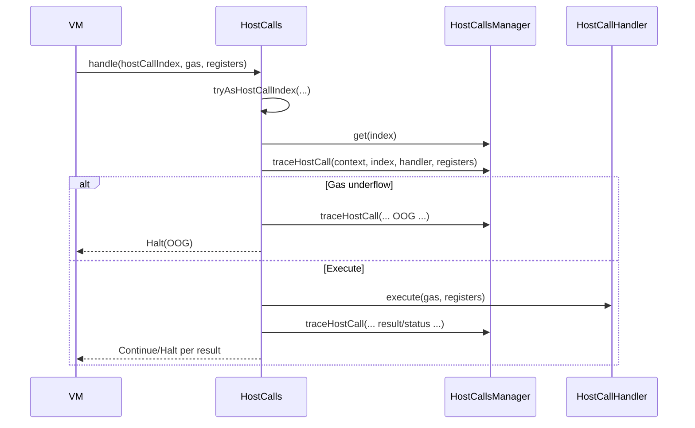

# Add better tracing for host calls.

## Pull Request by @tomusdrw

Host calls tracing will now report registers status before HC invocation and right after, so we will see what has been changed, which should help with debuggin.


## Comment by @coderabbitai[bot]

<!-- This is an auto-generated comment: summarize by coderabbit.ai -->
<!-- This is an auto-generated comment: skip review by coderabbit.ai -->

> [!IMPORTANT]
> ## Review skipped
> 
> Auto incremental reviews are disabled on this repository.
> 
> Please check the settings in the CodeRabbit UI or the `.coderabbit.yaml` file in this repository. To trigger a single review, invoke the `@coderabbitai review` command.
> 
> You can disable this status message by setting the `reviews.review_status` to `false` in the CodeRabbit configuration file.

<!-- end of auto-generated comment: skip review by coderabbit.ai -->
<!-- walkthrough_start -->

<details>
<summary>📝 Walkthrough</summary>

<!-- This is an auto-generated comment: release notes by coderabbit.ai -->

## Summary by CodeRabbit

- New Features
  - Added detailed tracing for host calls, logging invocation, results/status, and out-of-gas events.
  - Traces now include relevant register values across many host calls for clearer diagnostics.
  - Unified trace output formatting to improve readability and consistency in logs.
  - No functional changes to execution paths; existing behavior remains unchanged aside from additional trace output.

<!-- end of auto-generated comment: release notes by coderabbit.ai -->
## Walkthrough
Adds register tracing support across host-call handlers by introducing a new traceRegisters utility, a tracedRegisters field on handlers, and tracing hooks in the host-calls flow. Many handlers import from the barrel module and declare tracedRegisters. Minor refactors replace hard-coded register 7 with IN_OUT_REG in a few files.

## Changes
| Cohort / File(s) | Summary |
|---|---|
| **Accumulate host-calls: tracing fields**<br>`packages/jam/jam-host-calls/accumulate/assign.ts`, `.../bless.ts`, `.../checkpoint.ts`, `.../designate.ts`, `.../eject.ts`, `.../forget.ts`, `.../new.ts`, `.../provide.ts`, `.../query.ts`, `.../solicit.ts`, `.../transfer.ts`, `.../yield.ts` | Import traceRegisters from barrel; add public tracedRegisters with per-call register sets. No execute/control-flow changes. Checkpoint surfaces tracedRegisters from gasHostCall. |
| **Refine host-calls: tracing fields**<br>`packages/jam/jam-host-calls/refine/export.ts`, `.../expunge.ts`, `.../historical-lookup.ts`, `.../invoke.ts`, `.../machine.ts`, `.../peek.ts`, `.../poke.ts`, `.../void.ts`, `.../zero.ts` | Add tracedRegisters and traceRegisters import. machine.ts also replaces literal 7 with IN_OUT_REG. No execute/control-flow changes. |
| **Other handlers: tracing fields and minor refactors**<br>`packages/jam/jam-host-calls/fetch.ts`, `.../gas.ts`, `.../info.ts`, `.../log.ts`, `.../lookup.ts`, `.../read.ts`, `.../write.ts` | Add tracedRegisters and adjust imports (mostly to barrel). write.ts replaces hard-coded 7 with IN_OUT_REG. gas/log add tracedRegisters with comments; behavior unchanged. |
| **Core host-call framework: tracing utility and instrumentation**<br>`packages/jam/pvm-host-calls/host-call-handler.ts`, `.../host-calls-manager.ts`, `.../host-calls.ts`, `.../index.ts` | New traceRegisters utility; HostCallHandler gains tracedRegisters. HostCallsManager adds traceHostCall and Missing.tracedRegisters. host-calls.ts adds trace emissions (invoking, OOG, result/status). index.ts re-exports traceRegisters. |

## Sequence Diagram(s)


## Estimated code review effort
🎯 3 (Moderate) | ⏱️ ~20–25 minutes

## Poem
> A rabbit taps the registry keys,  
> Trace crumbs sparkle in gentle breeze.  
> No hops in logic, just brighter trails,  
> Barrels brim with tidy details.  
> With twitching nose and keen delight,  
> I log the stars through PVM night. 🌙🐇✨

</details>

<!-- walkthrough_end -->
<!-- internal state start -->


<!-- DwQgtGAEAqAWCWBnSTIEMB26CuAXA9mAOYCmGJATmriQCaQDG+Ats2bgFyQAOFk+AIwBWJBrngA3EsgEBPRvlqU0AgfFwA6NPEgQAfACgjoCEYDEZyAAUASpETZWaCrI5Ho6gDYkuAQVr0AiS4NHy4VAzwGESQAGb4fLD4iLiMaJ6eiBoGAKqIlFwEzNiItBQA7gYAco5BFFwArAAsAMy5NgAyXLAh3IgcAPQDROqw2AIaTMwDAGKe2LGxsh0qiAO4stwkdS4D3NgZA81tBnCo+xmQFCQAjtjSqdjctNTSkEkpYAzpnpDhaJFon98FcSNwEqlriMUpR7LhXsh4Kw6PBXp55EF4td0O9kqlvpcohJ8N9xPgsJh6Ei2LRUTR0ehYqEUJDgtgKBgsjBYCRGLBMKRIMw0ABrN7qHjJRDwATeYH8AT5ChSSDlBAMWCg6GhZDlSi85iKeCxeB0SByP483EpNKXC1TbjOKIxXBW3gkMBEknUeDk9AYejgz5e0m+rBQpDMxAYNB9JK4LlwXlRGgYVIpV5UrCu3lKRAMCjwbhkrCoAjoeD0JQCbBEEZAi2IJLlZ2q/mpfnIDUCs20dmtj74n5ZIz6YzgKBkej4WI4AjEMjKGj0KZsNNcXgKkRiSRve2KZSqdRaHRjkxQM6I5CYOeEUjkKjLhTI9dXNDleyOYUuc3yJhKKgj00bRdDAQxx1MAxHQYEU0FINYhDQaZEOYMBBy+YcBgBBhHAOV4sMQaUiAwDQEzcAAiSiDAsSBfAASQXB9M0/JwfxnPke0QUdIDo5hwQoVJHVdf16EQWRmAEfBMkKCISBsEhtUoK9IAwfAPyRfin1iCgWEtXl9lleAGHNZxrl+ciAAENi2HZZD2CRUPQglMnIyAAAoohhNBp1nHN7C2SITWMw0+zlITYAASgAGhEvSUD4iFIE8SMVLUlAMAYeY8z+WT5MUigRygABhTw0EIyAyH5DKSDXThaJUkgPwM5LgpquocoBOg8sjJSUGvAIzXLPzfEI+BiMYUrCJiqJ1FRZKAC8zRbYT/gYOSFJ6gq3LoqoAH0AHkcmgXabAAUQAcRigAOCKNEgKoQW7aI3nLEgAA9I1bNhXUURAAG5zRIfkJF9PgzOY8s2ENXYIxhRJKWSoFUHe1MlHocsoky7AlA6wEYiYDATSIdkfXJbIjGoyxfE8UJSc5eU/KUTLnDp5B2PezSzQSHhxhaiq01m6RuN4zT7DGmNcHZXknheZcuDorAAANoNg+CBhQ9WkLQvEMIyNZsNw0qaAIoiSITRWYr8jTEsR3lVPUjKsreRXVvW/LEEVuIdOYSBFaszZtkoXZuAc7XPmcj33PdEH8BKBltN0v3rMDihg9DpzMIzjI0IRygNCED3boMKArF5oyJrK5BTeoKWOOergkwr8rFZG03PaiX2Vbg6RNeQrWs8yLCGBw4ojZIE3xdIyOiG0em0Aapqy9aiTYRd2TaG6uGPemjBZvSeBFvRkE186zedW2vbDuOs7LsgG7FfJ06UiRZj/15a4QcairFghLgAFkUSOAMJRcio5IJdzVhrFCYdcC60HgbUe+FZTSCyGRYBVEaL0UYkuM0DhWLyHYk9eCRgFbhEUNgNayBYbMlWq2LEcUABC3hyoD1/OgAIrZ57kEXoZYyJoSCeHRuvM+vUZriH3ofVUoxcZu02ogC+B0jonQutdGKABOGKABGAADFozR0VYoWmtgJVsflXYiIKvYcSklPB3QenXeCDMrTvVEHgXknh8AjGMtzAmZDfixA8R+ZwvImxqQwADckDJPLhEcOwOmYBwZPm8rSEsyAhpWiYSgpuVd2SxE6uTcwVMaZLjDGkkEjNRClUfKU/gs4OYQi5nwZq5d2CCy4sXawOktgCXkMkugXAT5rQ3htLe7csDM2bpkwiYzO4AlVj3KB/cdYRyHiPPCxtkGESnp7QAKATpT3gtAovtzEjPPjtRR18VF33UVo3RkBNH6MVkYJ+4hhRPjfqCT+H4SA/wEv/QBzB0GgOLuAuZ3cEJIV7jAuB+th6G3whqUQIpwQpinhRDBVMGL3hwaJL8zgCGziIULDpItErhTiNzKwDlTpvVcSWWK4RZAjQABJ4iKj8BWSg3oOLNAnH2llk62Xso5ZZmdRXZyqrQbwFB86IFcuWAVAchUhxFeHYc5FshQH8GjBefwA7xU0lwCxnL3pe10oqmyQc7Iqs9GmSg7pQgDGoUpWVGqOnarNNwnmvC4imkEfwLARUeQwRRa+V2wz3ZGtOZQE1b0ADaABdTVPFsxWgJikCgFCCAUB3gcg+g0ECoOEdGyxfLLRIA0DPRArKUjsoyKRYt7tk32KJfKFxOEaBuQiklTxRkAYSmfpcCOkAq01twHW2x7a3FuSrTFKEiBu2Uj0lgR0Jj0gAGV4Q0D5Ei0NuA51sg5K2bAAYflRDoAUymtFinVPJGUuKTMqms1qRVN6nNpxNKXvzcQ4hiUly6ZQDY7C0YDPDRYyO7Fk6+2Nae+NCaZkTOQIrINu78AphmcrMFkDIXQIHrCtZY8BiIpDWhtM2znnPzeWaD5H9TTfN+XVABtIgEgLAWAIwECFk4aWWqvWqz4XGzzOLV4aKgVXqwdix8uC8VsUJVVYhJKEoCR4NQTU1w8liASDJU+JblL2wNQ0+gZa/JrTTFQcy/tLWp2tencVLkhTkLlNEkg3kX0WpTmnVVsCVkDxzgGaVrqYrpHJEQaUOMqXMBpXSsMDKXAsrZRy2Dzav7NOXnULgAARaQwnt36cfcE683q+ZQ3amB3T+zxGHPoMtTUJz3YKKvso86RcoD2KCMDUG6QeX9FfXSkgXaYpB25pKxGMQ3LXElkeoEEWosdrDBoKwmBy5+ihgkeQ1xXN5PgPMa4BjVs/g8d5Z0MUmZGiBOxAAavvWWCQMvUDQEFgMkAZY+iBKuyrcJXigmFB3E9RLaB3XOmVBQNol1RC5d92ecVEBIRIJezBN7n3pNzJUlmqSX31IEo0orLSBa/vaSXL9JXYR9NoKBxtcjPblkQ77LL1caAYc4xCvuXmYX8cQYJ7LxERPmykcJMRc1818EGbIreDWlE3wip7JdUHFbyUmxgaAAdgDJ0g7lXTegH4Udea/A8ny6PfyxIxgFYmQXsaglhrjLPoUrIQes8eJBtyaDQaxzBWLFxSdxfgl9RKCeQByM8ZixjUgY0dtjXkdW5Fmv5ZZjzNnWcRzdVqga9AuEpa/bwfA3SgNlfdgGuKp0nfZNzZV/Nqe0nq/q+cxrN9rotfuo9eTL1ynONpR2g0wQkj0A8V4/gfBfE6X8YEgGfkvWZ+z/IVAOFU7sAZKpR4+RqujA7lOmg5MaLcSsABnpwH+nHIp6M9K2TfaF9ELgRnlvmdQrw+z+3AxHdn+2e5KDURYhB15d7ffOmq+Xwl1c++EU2uL87yeutGX8PyRu/yzGgKrGZuHGl+vc1+dm+GAm48WIpAzu/QYmbu2CnuLE34BK3WwsZm5ClCWom0uMdC3MfkMwCQGB1oQ4dok+Sm4gQIkeW80ecUqWDBMKDmoUvIS6ySnCuq3B/C/queUefoNBdBwQxeFWgui+fOtWleci4ulyt8N0d0jcweKmwkTYxoCYnB88iAAUxo5cvmI2sIIUBwEeLevIkmXWNqeGfBNhg2MYhkbBVorsaQjoagyUGwWhVotBFAGBGgq+7ivaxk1wP29Mf2TeZOLIoI3kyAnYsAm6zgqQS63g0QroMUh2tAyA+2k+aYII88i0OkZoqRMUlhhRNUa2SR9AQ2BUMUw672c06Ra+6BwQW+JAL8pAj21WhYNAyA+0AA0n3pAMyjkMyvKNXn/udHYiCO9J9ECAPlJHEIEhMU0e8AjK2KgCFGYXQBEhgAyGYhEK2PkJLNwH1Lvqnk9i2NcPQE8PDkUrTOjsjpAPlrevTOzG+oZhMdwa0vjtxDMH6qninuTp1BGpTlHF+tEpgGtL6gIrQN2n6DTorMERgRfjBOCogbhsgbfoRl0ZgRbPIfvIoTVl/mtOBmoU1nXlrh0jSu+nsF+r4FYHRHwWYaGOSFwNYXKEnEqlasKjbsOJ7PpvUvkIViLuBp7JjqkG5CUGaBaK6KgCaN4EXIpqLPTrXESoUGmnrvpsHkhjNm3ngGGKSdKbpqSUumvEytWglhkLGp7GWgKVZp5iKXrGMl5D5AZiYkCIrCadFuSNLk9rafFrWollys6Z/q6XHsKTfhYbnDKgXAyS8sAdRqASQF8obr/JAExvACxlRHARbjidhtbjfnboRtwqJq7pirgcxHggQT7k3n7qSspuSkumyRySUN3DygkewTqDcYaSwR/rpLHsqrZrxpkOlN6S+uOUKU4QSYmf5nnAXMmqXD6l2a+qmNKDycflUF/HlqjtcIVmPkTm1LCBIVvCXoLpIpSQOUpLSbXtcpABovcncg8vXm1kDGgDHOZt1m2qaduj3n2gGlEpyDErVHTPYGyNcagKTp8f2KsXejEjuGTBTOJoju8XYZ8cec+r8e+gCV+kCaaH7hucVheXwKTpCUMjKUfuiQeeUNifMlfviVOSgRzuPNWbzgLhImaMDiLtCRwQALwyI0lzHqGqKvm3J6JS5AFUYriZnZkQG5n5mFnAoQDm5M54k8beaYSVn4SZ4gxKA1kYq0Tu5MRPiNn4rNmcTcQepUgsEvoPmlqf7uYTkJ7qruRepiQSTrG/naClR+HqDyD0LRKZpQUlj16kI6R9hDI4hnk+rE5hAH6DlSFWhb74DGW8iIY3l8Xl4yJCVnK/6SUvlqK3TcjwUBBUIlqUFIwQURVxL0o1axyZE3qtjLHPzIUkFD5pTczbEjbOgvHXpvE1IfFfH4V1J/FY4fo47GQkV/qdJZ6Aa9IQlUldRWnyjomZXZXMW4mLKeV8YGXGxGWVhw684eS7yl53nSKWk/4XJ0llVS4GKYwbbSieH6RfoOAUAaa8iQZpqTQjgGBpkKUKA4xgH0aQF5km6wGaXwGllW5IHsWEn4R3CUCyCmWgI4EOFWUyaEG+7CxOXkq6liXlaoDDmEVlrznWbxnIHuTBbRBhYR5xb2kRmOmwYvUQUuY+lU2CoLmTl6V8bLlSqrmFTWCsnsk8p+AiFfpiFCJQngY3EIUfFynUaA2QAACK9wLgeVVWShcUJ5BwqQau3+qhElTWu0miMU5tN8u0AATOohVZeJ8fgG8PPugDeq+isTEN9F3mzP3uSH4hsWpDFDWKkBKW8EISWF1t4QTETCTPSulbyFrejTOfCNVMNdTKNXek4ijszN8WzFNYRdzICXjqRZvrLWCbcdprReVtTurSnT+B3NpQdR6fAnCpxQMGjS4FPP2ldbeXTDXRtXnqJS5fIjbRdJbdbSVRbQ7a+RqSDbruDVmQbipX8tDdAabnDSWSxTpYde3QRvhIgFJEZMeC7mZRJh7g2XjbZc9K2SQXFW8M6ilQCFQWEFaOuifZEB2HiLaL8BaEIWwSoRwR8UabFAWC5qwTEGnjwnzOPitYVYrUnZAJ/S1BKIhoEecNvkBqgLxXrfecA8VQ9c+TdG4SoKNnVTEOxFdOQRwRmH6dA6kBPedO5AAOxO2t7e29bt49q97RGzzIBxE9i0AAyqQAXU6B2D7B0fj9WpzDa7HRCZ1YVjU4UTXo4EX/El3EVl2LWZUT7V3rVFVKQIbq2KyoOn3n5H6YYI2sW6Vs7HXjzH1oMknyVL3vwr3gEMZQEFkwFFnb0t3cb70cV37/Cchv4yrn1Y11k43Sbe6EItncSNx8l2xpRgNj2cHU3unOEdxR0xbliBlzZ+gy4s1joTqxruTwBhEaCWyEOiKIgP0UJmgpg4U6HJQpAalaoy1JWUWINk39Q6ofHQBUBhOwi5Vkn4PSJj1PlXK+B/yHRVClX7R7TQA2C+BVDrozCnQ2C7TnS+DrqPV/ynRzO7TrrQC+A2DqEcPIzuHMK0M0LnFAj0J+QmGiCHH0CsLP1A2taN6cS53cNuK8PLYB09XSMAzta/mgyxQDUKMxD8MdzPOw7oBM2cF+TK0PP4yxgqDbYhVKPZ30zjV4XqNF2aOfo+oLVkXYOrUgaGN0UdzolDOYCIDhN7VllI2C0H2oHrDDNMt5y86ABJhOM0LuteJTPc+bM/M4s8s6s+s5s9s7s/s8+Yc8c6c+c5c08sDZRm4/rp41DWpb4xpaCjY3vW3cE4Rk8EQFQCZZE+JhZTivgTZfE3Ze6tVXc5eeixSu/byAHha95LyIOH/WwsHqYrU65WOXzTTYuexbFCmLFRQsIYlRRSvC/bXXnng2XvrVM8wzFPK49b4B0B0PtAAOprNFSnRNZXPIBkDkMvTuvsSfP8AxREADFCgevlopG/3ORKGtUe2hAdVAUxYgUMCLHiOPSSPrEBJ9V8DQv+Z7FYDhFdrr6WAV3dNJsGOCV0VommPeuWskAsuI1sXsumv4Tms7tP5puSLlh3Vm2itXI5tiv5tFsltluS6pmasgHL3KVeMb0+Nb2Gu72t0Vkd136yBgmY02v1m41xNyZOtQBtmCSqZ9lD2K3k2pMjlGaf6ZPx4msVNc2ubsS82CkRsC1s7C0BYFwGLFOm0cFVUDMtNodWJ+XTkM2hZnU5R2mlORnvTJoACaVdNOKMZAu5GA0tCb5cyVvTqb/Tg0OFvHyJx+YO/d+VGbIb49N7zWzaII+AOYfA4Lf5XWvugFfWgLDAAM6aqF2aULQFHeP0BRkOOTMgPyCQcOGFCOeL96FS+dk1r6xdpLfM5Lm+lLa7V5OonsbkqW3adLpjsngie7tjQTKNxsIHyJT+ey57S0t1mbanUuj8b7GZH7q9X7erv7WlCBAHBJb+uAGoYH2NV9kHTZjrd9hNosxNTeDc+pOMFNEIFeVHg5xmVoAgpkAiLhco7l/NQTrkzmeHvkVoLzgU5capvIo3RH8XpHotGqlV9TZCj93X1J5WwON4AV221b3niUIM88fkA3M+ti3EjFc1x+ctbXvIMwwQGox+R5Jo5Ap56ePqctEnciut6bBDPXj5WbZVMl9yVt9ydtFbwGNV+UYAtCQI303k92rbzDbDi6T29bV0gAyASaJ23kzfOAwdYJD6dN6Gft7DDBBXbzARFeIj5WherBe9S/eoCXHPbXFPPuth2pQL7pcqmpo5XsjXBpgKAgsTvlC4slI50EuedEsnczVEVks6NkWV1yfUU0ubWReVy+zPeVewCxfGs34VdVcXUv6Ezv7oe6R+QTbsjZj6rsRXujIL25eKX5c6uqUw1+N/v7WBMmvDBlTVfRO1exP1fQeNeam5npMIUEdulYcJl2Z+Yi3Jli1A6s3jo/BcCidpZusK1k2KcTMrQqduTsMacjv/M0A7xcoxTcxVpFR4hgs/l/kY5Wd2f4szeItuSXFw8UGsPyhVqQASDpD3CxS28ciCOnofd0AamFIjXS/4uqOEs1IaOK9aPK8/rl0dJ6MIMa/rubWbs6+Kxp8ccZCG9lfI1VpP5hdLwVUKx5rlE0Wi7nzsOvs67vvuOfu6te8GsldGvn+HsDBX8+AIPuZQg6h8HW4fBTLBwaZkFn6lDVtn5AVjxAeCnbABhwiBAwM7u4nZns0UFaSIzupNe6jXn/z14/4WVcUE5RNq7c88fXEJKYSCgoCfgSfaVMN1sJxQBAOkX1nwEw600o2yTGKC9igZxQdC2EBILSGiDohk02hAvgfGgokhp814fEOrTUZ5MkQvINyDgOQCj1i+oPG6N2hap4Ae2lAUxJwy6oxB523aQdhMTWK9VJeLnV4vP3c5WgVBOdFfk+DX5+cVeAXZajvl36aCTGh/JAfgFC4dxrG/7P3jfiAHbJb+qQXBjIJurCQneRDYgRoSlwM8I8+qOIeE0eIosrQaXGVK43f7atIanvTerDR96ssD2bOHvCAMvqWVwBsmIgpH3XoOVCBUeUBk5Vj5xlI2AA1bin2TQlQdeBxIKIPUgAdBPEJ/X4EeXzqR0umcDQLpoLwH89lCwPLaBVV8DPhaoqofbinnQCSQVQ6gLgIABwCFMK0nJA/B5A7tRHtAwwCyABeMQHkNcBijvVESfkNgIRF7Itg7Q+kQsHajuKyBygaADGoAFwCBvOXwsETFM0AsNgGLyDoS90hIhQLhHTWD1trhYveOt8QQGFoGCf9KXgXT+YuCfixLVfr51xwb9dG55Vdn4NSrGMtqpjcYUQEmFn8IhBJGoWb0yEW8Z8VvH2FbHiGrwpmz1HLm/zy4f8CuX/Mod71/7hDyyrI/APgBFDPFrWNXeoV7jD5NDYOLBHrIgGWiIpuRvpIQQUzNJFMnsjKcMhn3ZoQ4y0xhegfN22xsCg202alP23JA1NVhiAZtqaPT5lNYMRhRgOwH/LJN3IPAnoTChh5VtNkz2fIC+nO7uszS/hDGlvwlockSaCFTAaISrqLCPi4w+UU8DkJpcl8RfN0dMw0I3J3yslTBl2HJAYin6tVNEU8ytD+tnIyaBhE306y/ANIAIOqGIwM4q1W+VgnxGO1sEIjW05wKWAyEEBKgh+0dX4G5HDG3M0R7EWbm81dalpqC2IxsT8Bn6YU3OBIpfq4OJHuDSR81LwR0lBLq81qe/d2AEObjZiFR3AULqrRRJWMAmMo5Gh4hzHcBtkAPSRAJUy7EN/8pYnRLJVf7pk3eooj3uvSK7lCpRvvV8QAI2wA4lRwfFUfa0aEE0SUMAmsflHgH1jeQ8kVzBuKYL6jg2bo3IbyEu5mRWBQY8Nlk2QIRdcOPpZ5jaOMh9DdCmoQQugOgZzDbRcnZBvhJXCA1AidsL+L90WFxD7+ywtoWLl0GATtEBiOcbOwzSxI0w0FehPWz77FiDEV0UsUuh0RdtDB6QXth9S9pmCrgJ6V5HT2WzTc/WdmPEUjkX5y9l+B47HKXXJGq8V27UDXmJPGTq1+J7kR8fRJUx/8WRyNBCVPDuh0RYh9TCSfQAIGLDtBRYmSdJXfIu9hRYE4oTmUgnf82M8NaUWyzZzqZz09+aapgXRRRNQBMTVURAPVG0RdhOhdJl0I8rYdBCuqGnKJJpGWIO4TJCEN+Mkl/iUhdeCselC26NMe+cMHCWuN5Do8WwAYNKAYLapGTzBzorAP2KnZyN4YM7RRvYLn74jZeT6eXo+KV6eC3J3g/RtSLz5Xj6KpjbqQJGZFwSCpZ6cgMVM0hX98hj/EVv+NSGKxACGrNKWDXAklCspEon/rlNgn5SVkhUp6RzBPSkBahtrPAtZTQkJNmhmRNag1Iw40T4+yBZNEyRhk5VAaWfb7om1KwdTop11PqToKy5l9W0r0Kzl2mM7WDBxoLOKF6nE5s9s0SpQwe7UVJZhGAwvdgP9LYlA1Z+WdRwbuMcn7iFeh4u7v50TE+p4Gvgi8f4KumH9cZz0O6eDMwiQyHcb6PGSl0FYUkMulMz6dl0KEiiMpa9Y3MDJyk70wZVQiGY9PHiFps0RkdIGAHfF3i4ZYAqqUjJg48QnKKYl1ukw+KBidCjUsbthzC60ZY4iAccScXkCGj6UweUcj7D6Gyp5JNzVsHALRHhVlJW6ebBhKUmRUwwXAZJF91gZicemiw5BsykjAJBXZngW8bmLGb5ikWUk5IfMSkrlUhpDxN4LmLrHcxsesUNREi2PqRBmIlJdHiX30GjBu2hk4wd1ThGbFZGOkDaVKlnYV9+sW41zmLL2lo4nJUslydoxOlyziZJOJWaTOvFIZa5KQeuQSCbn3jnxpXEKfBMdkDBnZd8t2R7MVGRxLq9/UYUkJB5qcu5z1M2elIhqZSrZP7aCaDMqF2MHZU/QARgGJBigvZlU1CfjWRnJ5bOOhKgU/xZ4YzCOtEqNgpxGlkE0xlIkmRdMkKC8U0KC/GZXF6kFiVh1A69p9Kno8Q1O9tMMTcywkUEB5nrdKAMG7b1seZbCPyIRN+DzSjBvwl0PqWxCr4YsEvOydhQfR7iiRh82aq5LaSnSd+F86hYfm17NwFY9CjWfbK1lvyvQqC9kVsHSjZD+KaSK0GP3t62LHeY9b6Uwv1qAKtozDDhb4uh4gTQaNGDxoDKgXqUbZL4zWXxm1kDBhQGoc9GgpD4+zMFfs7VGNPuav0gQDgbgKLCMQsESJrCjgqQtjZ4wEqRMyuau28nH4/4AIBAOQDuhiSyZt5CmYlOAVPUyGHhF0O6zUnlYNJzDLSc2zUTJp5I3AUqOQp2IUBaAXwA8PQDgHg5TUaoMgA0RME5U9c9DVIGWj773krQ6PMzpgHlLzpK0wQTSV+R+Z302060nYptJiDhR/acUcgeZl+A2DmZRRHtN5BaJ65siRAYSMzD4jHZv0LgPdNuQiAlhm2cSupSQDv6xDkF3oelHC1oUw4YRZUVjrQJXHpQIcPZWGdtNFm7SHJ+0g+YdI8FkidFp88uArKAznSU2MJIxUhhqXxLyAZi+BRYsQXgqElF1N6cK10zFiQFpJc3vYpRJCjQJgsiBZbO8bhLiykS8xdErflbASAIoRJShMRkpKI+2C9Jbn1KW4TrAJAOVTiNQHFEyF8bcpXwgzGkylhzC9uUAs+ldzbkFHJ7GkxU5Yi4hRcpqvNg278A4UliagMfnPbQUl0tAV2sgHdrDD5AfkTqkIIhGDsPl4vQJDXzWmryrl68xRtyD+qKhKAQ/ZBIbjPw3E/I7ofINVGjG6pc5tUQaLJHRFjQE6Siweb0rx7aIVFKjNRRLI0WEqjx36ElVADPH+pKVw9alT5MP5WBtVIoRlfFxiWyr5V5sMBcKpCWQKxV+rCJc/PukIKip4IaxVgVrIVSklGC2+gpgVjOqVJ9KHpdhLRGAipOR8OKFYHlE2SbQTYlBsxIuGWwvCDq2IH9iTmBrUOhFFqdnx4ALDTV4k8meav6mdyweKU/PH5HPVihskw7HsThQjWREo1S8kOlsUuWDUMB2IGNqQQvTYrlGMvPFfvMlnNqZZJ4wnB5PPnUtLxMJeun2ovVDr/eI6i9V+LNVeKANpVbSclJ0SmzfpQq4JZ/1KHQLJRsC/dkyulWILiQlYBVXayVVbrFqMVdDWquTaKTIKLqv0MgwuxoZ3mdmBNdKjcCQBdA/szSDt3wWhsfYwY4jhHGyDabVVZSiuTn2TbdrqOfI/9cbIGlPUzNOmltC2T+bhEGZK8+Rtcsb4k8wYNUARtDkRbIqcYqKtFp1E+Ko9kqda7DQ2vxV4aSpR89fm2qWpnT9FVKwxb2ubgqbKw1Gm/DEpE2ITf53BC0EoDyRG1b+9mwfqiE5VEDANLG8qorBHwcj+VZE0EArj1SuLZw3ij2IKqCVKUxRPG8Vf43nVRLB4MS8osAKQnrrFVN9BrlANqk6p6pj6whXH14GHtk00mx+qnlanq12pBiwcq3KB6FKO5zGx2tTPc20y+s9M1abCKkbwiWZIkquihz56NFMgjUR4cmARXNhxkB4WLQv3i24am1SWrRcfNS0PR6lE6rjUNqBm8aQZtsuBfF3KBDFzqq6i+vDOvpQcapcHNiQgIdX/ZfRS4hgaxMDEfEdIWnSAMZqCZSyOlFDdJpiuc7YL+K3E4yOSpDWmrkGh0wtqjrzHVa4pjmhrbJOiqYTdtMYGkGLwzCi90eolPvkunUydinOokbNN3FGIkBZA6RASNqhPI1VwgpoIfr8HLCKktQWQDAppLTrc0C1/ISZdMp1SsMpBTih4M5VbxGcJebfRxSEk775FWwYoOyAbvuDVEyodSuRSEhV2ChfdzbQQVnPKyUlDaNMBdADqcF50EtIOnzgRpPn/ofBFKjLbZpC4qzm4PO9QLuyfnBSF1mEFHUXqv4BSIpMgw2YkKY2PVGtNqwJVqxFWFdspEqsbSGJ8yJ9LCETdHeVLqHib5tkAqTSwT8B1TKBs4GDBDmKZ2kZ9pqMtEt3dKnCKADqSgE6l0yupksH4OMSFXlii7LNmiuIM+rybF8NAF++dFn1qCUBE03aV0F6uFB9AKotSlSLEkLBRFaxsAHSLWGULz6S05TcsJnkfr+h0AqcIES+gX1vR1ycJO1D9Ui2VQESNUdgFwBpSowzQkw5lEmX1oUKfUCEyJPIHZ1/ct4UafKLGkTTyhwcrs7dGqCMhqZysoSA4IEG+1Yxlt2YdFsMoESswEA3AJDn01wqmxpOn4HJYlDM6ZodwxkxYbLHnj7hkFgGVsBgBv2WJywUBmrTGP/1kGksmGncXvPxFuDktx01LTMFP1FMLxcpE/RlHpRTML9GgK/W/qTZ36NZ3esVFOWYG8sPYW/QLrv3wPxziDOoUg5tHIMJo/oMyVfb9V9iYGkyThkzS4fZZuH+96rRekULb3ij4dc60vRtpI7IEwAwoGMKQH71lTwO6CiTQtsWryRDQUgLMLbF4b1gYgZaSYYgBqV5G84GBftKkH0zSg+IDIZxR7smIOlPAWBlcnwDciTS8ySAd6jEDzWsEBEM8n6IYJqjqAhBMY/JM6x1S4GKKNnGRJMLci+IUY1Rfo7Gn2Ns0BjSZA9O7FRJYAGjTR7uGECWLMAJQxhczlLHlqIlqjmMLKM6C006bp8IvXAOujTVGRIVeoiRUmQMDmbYRKMBlA2KTKABMAi7Dq1xdvISkuoHqZcowTOmm8FnmnGQAjh1wNGjCFoCgiHAiweANymNAG1bg9wAk+itNS0hFgBC63tCaGNwmaTb0dE1AHniK02mqQACLuD1GDgJ0gx5Pg2kO29QZcboHSNlVmXlYn9GEshSzqZ6mqiDyDP+OMdbAtza9ZoAXUWPYZ06Vluqbwk+ssNhh94OeEELSBMKlR1stVf3dIC22H6bwuC3yKtt0hpyC48obJaLAXGzh62HcVU6NAwF2raFipzqJMKFCd5FAl6bekRo2Nd4DGrsbY7sbeh1QM0/ygU5xzehcBJhhxhgoKaTJZn+jQp6VGcbkTyxJh4GCKFwCK357kAVxzADcajhd6YjQtbI7kZuNTxACMZslV4bRmc7styAf0xMZw4xTlOOpiKIFMiXOGWz7FHI/WfyNTxodg2iCWEtnWd6MjU5weHhjE0IyR9OOzCYVnyCrovs8y7lEP0LDHdLqXKbtPuD4hmkgG7HA47BjcjpmLR70a8452xAm9g9cUF854Ej2Sk22rJ1tpJGEgTZCwWZLrBoMLQaBfzpu45SefHOxQfgMiP+mLTSVp1Gqe6mLM4FjhPZWEyGogF8YvCyQTF8o1sJiCc4jpgcJ6ACG7uIzyr2TMAUtftH2gsNFlWAGi5QDd3yD2QI4cEwy0RLyQHANMCYh0RKBuQbDi6JkLCF/NhFW+DobwMMUu2/MPiTAbEM8u4sBbOttphzrIHJDowrQEWyhADAH4EgcIRsMMAINPQ/VNiBF5tlgZphEZA6UQEflYPhXBa2Aie8WSnsLrH6iVx4jPWCO1LqWrtSxUHSyRS345cKNAMQE01TSoA6TsQfra3qnWirv2I2ioYjQ3NrATz25rHWqPQkWb1jLSEqRauUM4VrgYAcw9yc4IaB35vepMrKiPyTnmzg8XKwmCCweJGarHUNR9FMmRGhjXWkgDUwfPHGczS6ROa6vsRadHh5fXTpCwHHRq0owSL9dIHYBeXdDXnfDdouBKkr5qpV4K9LEDxywU0vqMKE2fi7tX3RcUcw0vrqtum5UfZaPF8fMMABvIa30eONFnKAI1s0d6Or7WAnRQZLAAAF9OCGqeq64b72uo/o6JggC9dKvvWoMA15Pr9a9EZmYok1l0WVeQBg27rkNuI9DYLjkRYbHGgbe71CUzrf24Ec8PzB9JoA8Ad4DdauBQNvgPwEm/cABBUBqBgIp4MCAYFpurh1Au0SsIgF2gQ06Au0dZaBBpsThPiAgVhnbQEANBWGJAK6HbTtpqIGgV0FoLQAaBqJtErDB5AIDtq63YgrDNRIsFYbNA1EV0K6A0DQDaIZbEEKAELdwAi2Ci4tkJZLanDO3abzABgNwF2hJn3b0tscAYEViR2DAr19E+REBFTZQs5ELgImgMAg2I7UdgW3LYDtB2Q7u0X2/oCAA= -->

<!-- internal state end -->
<!-- tips_start -->

---


<details>
<summary>🪧 Tips</summary>

### Chat

There are 3 ways to chat with [CodeRabbit](https://coderabbit.ai?utm_source=oss&utm_medium=github&utm_campaign=FluffyLabs/typeberry&utm_content=543):

- Review comments: Directly reply to a review comment made by CodeRabbit. Example:
  - `I pushed a fix in commit <commit_id>, please review it.`
  - `Open a follow-up GitHub issue for this discussion.`
- Files and specific lines of code (under the "Files changed" tab): Tag `@coderabbitai` in a new review comment at the desired location with your query.
- PR comments: Tag `@coderabbitai` in a new PR comment to ask questions about the PR branch. For the best results, please provide a very specific query, as very limited context is provided in this mode. Examples:
  - `@coderabbitai gather interesting stats about this repository and render them as a table. Additionally, render a pie chart showing the language distribution in the codebase.`
  - `@coderabbitai read the files in the src/scheduler package and generate a class diagram using mermaid and a README in the markdown format.`

### Support

Need help? Create a ticket on our [support page](https://www.coderabbit.ai/contact-us/support) for assistance with any issues or questions.

### CodeRabbit Commands (Invoked using PR/Issue comments)

Type `@coderabbitai help` to get the list of available commands.

### Other keywords and placeholders

- Add `@coderabbitai ignore` anywhere in the PR description to prevent this PR from being reviewed.
- Add `@coderabbitai summary` to generate the high-level summary at a specific location in the PR description.
- Add `@coderabbitai` anywhere in the PR title to generate the title automatically.

### Status, Documentation and Community

- Visit our [Status Page](https://status.coderabbit.ai) to check the current availability of CodeRabbit.
- Visit our [Documentation](https://docs.coderabbit.ai) for detailed information on how to use CodeRabbit.
- Join our [Discord Community](http://discord.gg/coderabbit) to get help, request features, and share feedback.
- Follow us on [X/Twitter](https://twitter.com/coderabbitai) for updates and announcements.

</details>

<!-- tips_end -->


## Comment by @github-actions[bot]


<details>
<summary>View all</summary>

| File | Benchmark | Ops |  |
|------|-----------|-----|--|
| [bytes/hex-from.ts[0]](../blob/fa974c245bcef9e3d8029574cfc6489c10bb48b3//_work/typeberry-1/typeberry/typeberry/benchmarks/bytes/hex-from.ts) | parse hex using `Number` with NaN checking | 144534.9 ±0.07% | 84.11% slower |
| [bytes/hex-from.ts[1]](../blob/fa974c245bcef9e3d8029574cfc6489c10bb48b3//_work/typeberry-1/typeberry/typeberry/benchmarks/bytes/hex-from.ts) | parse hex from char codes | 909656.35 ±0.16% | fastest ✅ |
| [bytes/hex-from.ts[2]](../blob/fa974c245bcef9e3d8029574cfc6489c10bb48b3//_work/typeberry-1/typeberry/typeberry/benchmarks/bytes/hex-from.ts) | parse hex from string nibbles | 562463.85 ±0.22% | 38.17% slower |
| [math/mul_overflow.ts[0]](../blob/fa974c245bcef9e3d8029574cfc6489c10bb48b3//_work/typeberry-1/typeberry/typeberry/benchmarks/math/mul_overflow.ts) | multiply and bring back to u32 | 255067423.7 ±5.3% | fastest ✅ |
| [math/mul_overflow.ts[1]](../blob/fa974c245bcef9e3d8029574cfc6489c10bb48b3//_work/typeberry-1/typeberry/typeberry/benchmarks/math/mul_overflow.ts) | multiply and take modulus | 251794969.9 ±7.02% | 1.28% slower |
| [math/switch.ts[0]](../blob/fa974c245bcef9e3d8029574cfc6489c10bb48b3//_work/typeberry-1/typeberry/typeberry/benchmarks/math/switch.ts) | switch | 261324113.27 ±5.81% | 1.9% slower |
| [math/switch.ts[1]](../blob/fa974c245bcef9e3d8029574cfc6489c10bb48b3//_work/typeberry-1/typeberry/typeberry/benchmarks/math/switch.ts) | if | 266380645.82 ±4.85% | fastest ✅ |
| [hash/index.ts[0]](../blob/fa974c245bcef9e3d8029574cfc6489c10bb48b3//_work/typeberry-1/typeberry/typeberry/benchmarks/hash/index.ts) | hash with numeric representation | 193.86 ±0.03% | 26.96% slower |
| [hash/index.ts[1]](../blob/fa974c245bcef9e3d8029574cfc6489c10bb48b3//_work/typeberry-1/typeberry/typeberry/benchmarks/hash/index.ts) | hash with string representation | 121.57 ±0.21% | 54.19% slower |
| [hash/index.ts[2]](../blob/fa974c245bcef9e3d8029574cfc6489c10bb48b3//_work/typeberry-1/typeberry/typeberry/benchmarks/hash/index.ts) | hash with symbol representation | 185.71 ±0.03% | 30.03% slower |
| [hash/index.ts[3]](../blob/fa974c245bcef9e3d8029574cfc6489c10bb48b3//_work/typeberry-1/typeberry/typeberry/benchmarks/hash/index.ts) | hash with uint8 representation | 165.46 ±0.1% | 37.66% slower |
| [hash/index.ts[4]](../blob/fa974c245bcef9e3d8029574cfc6489c10bb48b3//_work/typeberry-1/typeberry/typeberry/benchmarks/hash/index.ts) | hash with packed representation | 265.4 ±0.04% | fastest ✅ |
| [hash/index.ts[5]](../blob/fa974c245bcef9e3d8029574cfc6489c10bb48b3//_work/typeberry-1/typeberry/typeberry/benchmarks/hash/index.ts) | hash with bigint representation | 194.36 ±0.03% | 26.77% slower |
| [hash/index.ts[6]](../blob/fa974c245bcef9e3d8029574cfc6489c10bb48b3//_work/typeberry-1/typeberry/typeberry/benchmarks/hash/index.ts) | hash with uint32 representation | 204.01 ±0.09% | 23.13% slower |
| [logger/index.ts[0]](../blob/fa974c245bcef9e3d8029574cfc6489c10bb48b3//_work/typeberry-1/typeberry/typeberry/benchmarks/logger/index.ts) | console.log with string concat | 6685421.05 ±63.92% | fastest ✅ |
| [logger/index.ts[1]](../blob/fa974c245bcef9e3d8029574cfc6489c10bb48b3//_work/typeberry-1/typeberry/typeberry/benchmarks/logger/index.ts) | console.log with args | 1176113.39 ±97.24% | 82.41% slower |
| [math/add_one_overflow.ts[0]](../blob/fa974c245bcef9e3d8029574cfc6489c10bb48b3//_work/typeberry-1/typeberry/typeberry/benchmarks/math/add_one_overflow.ts) | add and take modulus | 202866872.47 ±35.22% | 20.81% slower |
| [math/add_one_overflow.ts[1]](../blob/fa974c245bcef9e3d8029574cfc6489c10bb48b3//_work/typeberry-1/typeberry/typeberry/benchmarks/math/add_one_overflow.ts) | condition before calculation | 256175276.22 ±6.33% | fastest ✅ |
| [math/count-bits-u64.ts[0]](../blob/fa974c245bcef9e3d8029574cfc6489c10bb48b3//_work/typeberry-1/typeberry/typeberry/benchmarks/math/count-bits-u64.ts) | standard method | 5077690.85 ±0.31% | 94.52% slower |
| [math/count-bits-u64.ts[1]](../blob/fa974c245bcef9e3d8029574cfc6489c10bb48b3//_work/typeberry-1/typeberry/typeberry/benchmarks/math/count-bits-u64.ts) | magic | 92714280.64 ±1.1% | fastest ✅ |
| [collections/map-set.ts[0]](../blob/fa974c245bcef9e3d8029574cfc6489c10bb48b3//_work/typeberry-1/typeberry/typeberry/benchmarks/collections/map-set.ts) | 2 gets + conditional set | 121457.62 ±0.16% | fastest ✅ |
| [collections/map-set.ts[1]](../blob/fa974c245bcef9e3d8029574cfc6489c10bb48b3//_work/typeberry-1/typeberry/typeberry/benchmarks/collections/map-set.ts) | 1 get 1 set | 61736.23 ±0.01% | 49.17% slower |
| [codec/bigint.compare.ts[0]](../blob/fa974c245bcef9e3d8029574cfc6489c10bb48b3//_work/typeberry-1/typeberry/typeberry/benchmarks/codec/bigint.compare.ts) | compare custom | 255435397.91 ±6.52% | 5.72% slower |
| [codec/bigint.compare.ts[1]](../blob/fa974c245bcef9e3d8029574cfc6489c10bb48b3//_work/typeberry-1/typeberry/typeberry/benchmarks/codec/bigint.compare.ts) | compare bigint | 270943141.53 ±5.89% | fastest ✅ |
| [codec/bigint.decode.ts[0]](../blob/fa974c245bcef9e3d8029574cfc6489c10bb48b3//_work/typeberry-1/typeberry/typeberry/benchmarks/codec/bigint.decode.ts) | decode custom | 177459269.81 ±2.36% | fastest ✅ |
| [codec/bigint.decode.ts[1]](../blob/fa974c245bcef9e3d8029574cfc6489c10bb48b3//_work/typeberry-1/typeberry/typeberry/benchmarks/codec/bigint.decode.ts) | decode bigint | 85862202.75 ±2.3% | 51.62% slower |
| [codec/decoding.ts[0]](../blob/fa974c245bcef9e3d8029574cfc6489c10bb48b3//_work/typeberry-1/typeberry/typeberry/benchmarks/codec/decoding.ts) | manual decode | 16413596.67 ±0.43% | 90.13% slower |
| [codec/decoding.ts[1]](../blob/fa974c245bcef9e3d8029574cfc6489c10bb48b3//_work/typeberry-1/typeberry/typeberry/benchmarks/codec/decoding.ts) | int32array decode | 165888186.11 ±2.9% | 0.22% slower |
| [codec/decoding.ts[2]](../blob/fa974c245bcef9e3d8029574cfc6489c10bb48b3//_work/typeberry-1/typeberry/typeberry/benchmarks/codec/decoding.ts) | dataview decode | 166251315.04 ±2.96% | fastest ✅ |
| [codec/encoding.ts[0]](../blob/fa974c245bcef9e3d8029574cfc6489c10bb48b3//_work/typeberry-1/typeberry/typeberry/benchmarks/codec/encoding.ts) | manual encode | 2531645.13 ±0.28% | 18.49% slower |
| [codec/encoding.ts[1]](../blob/fa974c245bcef9e3d8029574cfc6489c10bb48b3//_work/typeberry-1/typeberry/typeberry/benchmarks/codec/encoding.ts) | int32array encode | 3105787.86 ±0.25% | fastest ✅ |
| [codec/encoding.ts[2]](../blob/fa974c245bcef9e3d8029574cfc6489c10bb48b3//_work/typeberry-1/typeberry/typeberry/benchmarks/codec/encoding.ts) | dataview encode | 3100473.81 ±0.23% | 0.17% slower |
| [bytes/hex-to.ts[0]](../blob/fa974c245bcef9e3d8029574cfc6489c10bb48b3//_work/typeberry-1/typeberry/typeberry/benchmarks/bytes/hex-to.ts) | number toString + padding | 262335.21 ±0.27% | fastest ✅ |
| [bytes/hex-to.ts[1]](../blob/fa974c245bcef9e3d8029574cfc6489c10bb48b3//_work/typeberry-1/typeberry/typeberry/benchmarks/bytes/hex-to.ts) | manual | 14286.82 ±0.3% | 94.55% slower |
| [math/count-bits-u32.ts[0]](../blob/fa974c245bcef9e3d8029574cfc6489c10bb48b3//_work/typeberry-1/typeberry/typeberry/benchmarks/math/count-bits-u32.ts) | standard method | 104603130.09 ±2% | 57.7% slower |
| [math/count-bits-u32.ts[1]](../blob/fa974c245bcef9e3d8029574cfc6489c10bb48b3//_work/typeberry-1/typeberry/typeberry/benchmarks/math/count-bits-u32.ts) | magic | 247272206.84 ±6.09% | fastest ✅ |
| [codec/view_vs_object.ts[0]](../blob/fa974c245bcef9e3d8029574cfc6489c10bb48b3//_work/typeberry-1/typeberry/typeberry/benchmarks/codec/view_vs_object.ts) | Get the first field from Decoded | 9032.93 ±51.26% | 97.97% slower |
| [codec/view_vs_object.ts[1]](../blob/fa974c245bcef9e3d8029574cfc6489c10bb48b3//_work/typeberry-1/typeberry/typeberry/benchmarks/codec/view_vs_object.ts) | Get the first field from View | 89728.87 ±1.34% | 79.81% slower |
| [codec/view_vs_object.ts[2]](../blob/fa974c245bcef9e3d8029574cfc6489c10bb48b3//_work/typeberry-1/typeberry/typeberry/benchmarks/codec/view_vs_object.ts) | Get the first field as view from View | 93314.09 ±0.81% | 79% slower |
| [codec/view_vs_object.ts[3]](../blob/fa974c245bcef9e3d8029574cfc6489c10bb48b3//_work/typeberry-1/typeberry/typeberry/benchmarks/codec/view_vs_object.ts) | Get two fields from Decoded | 442354 ±0.24% | 0.47% slower |
| [codec/view_vs_object.ts[4]](../blob/fa974c245bcef9e3d8029574cfc6489c10bb48b3//_work/typeberry-1/typeberry/typeberry/benchmarks/codec/view_vs_object.ts) | Get two fields from View | 83076.25 ±0.08% | 81.31% slower |
| [codec/view_vs_object.ts[5]](../blob/fa974c245bcef9e3d8029574cfc6489c10bb48b3//_work/typeberry-1/typeberry/typeberry/benchmarks/codec/view_vs_object.ts) | Get two fields from materialized from View | 172953.59 ±0.17% | 61.09% slower |
| [codec/view_vs_object.ts[6]](../blob/fa974c245bcef9e3d8029574cfc6489c10bb48b3//_work/typeberry-1/typeberry/typeberry/benchmarks/codec/view_vs_object.ts) | Get two fields as views from View | 82934.79 ±0.11% | 81.34% slower |
| [codec/view_vs_object.ts[7]](../blob/fa974c245bcef9e3d8029574cfc6489c10bb48b3//_work/typeberry-1/typeberry/typeberry/benchmarks/codec/view_vs_object.ts) | Get only third field from Decoded | 444455.72 ±0.24% | fastest ✅ |
| [codec/view_vs_object.ts[8]](../blob/fa974c245bcef9e3d8029574cfc6489c10bb48b3//_work/typeberry-1/typeberry/typeberry/benchmarks/codec/view_vs_object.ts) | Get only third field from View | 103571.45 ±0.11% | 76.7% slower |
| [codec/view_vs_object.ts[9]](../blob/fa974c245bcef9e3d8029574cfc6489c10bb48b3//_work/typeberry-1/typeberry/typeberry/benchmarks/codec/view_vs_object.ts) | Get only third field as view from View | 103345.36 ±0.1% | 76.75% slower |
| [codec/view_vs_collection.ts[0]](../blob/fa974c245bcef9e3d8029574cfc6489c10bb48b3//_work/typeberry-1/typeberry/typeberry/benchmarks/codec/view_vs_collection.ts) | Get first element from Decoded | 27584.06 ±0.2% | 58.9% slower |
| [codec/view_vs_collection.ts[1]](../blob/fa974c245bcef9e3d8029574cfc6489c10bb48b3//_work/typeberry-1/typeberry/typeberry/benchmarks/codec/view_vs_collection.ts) | Get first element from View | 67107.18 ±0.14% | fastest ✅ |
| [codec/view_vs_collection.ts[2]](../blob/fa974c245bcef9e3d8029574cfc6489c10bb48b3//_work/typeberry-1/typeberry/typeberry/benchmarks/codec/view_vs_collection.ts) | Get 50th element from Decoded | 27766.36 ±0.28% | 58.62% slower |
| [codec/view_vs_collection.ts[3]](../blob/fa974c245bcef9e3d8029574cfc6489c10bb48b3//_work/typeberry-1/typeberry/typeberry/benchmarks/codec/view_vs_collection.ts) | Get 50th element from View | 37973.37 ±0.13% | 43.41% slower |
| [codec/view_vs_collection.ts[4]](../blob/fa974c245bcef9e3d8029574cfc6489c10bb48b3//_work/typeberry-1/typeberry/typeberry/benchmarks/codec/view_vs_collection.ts) | Get last element from Decoded | 27715.49 ±0.09% | 58.7% slower |
| [codec/view_vs_collection.ts[5]](../blob/fa974c245bcef9e3d8029574cfc6489c10bb48b3//_work/typeberry-1/typeberry/typeberry/benchmarks/codec/view_vs_collection.ts) | Get last element from View | 26859.64 ±0.31% | 59.98% slower |
| [hash/blake2b.ts[0]](../blob/fa974c245bcef9e3d8029574cfc6489c10bb48b3//_work/typeberry-1/typeberry/typeberry/benchmarks/hash/blake2b.ts) | hasher with simple allocator | 0.046 ±1.62% | fastest ✅ |
| [hash/blake2b.ts[1]](../blob/fa974c245bcef9e3d8029574cfc6489c10bb48b3//_work/typeberry-1/typeberry/typeberry/benchmarks/hash/blake2b.ts) | hasher with page allocator | 0.045 ±1.5% | 2.17% slower |
| [collections/map_vs_sorted.ts[0]](../blob/fa974c245bcef9e3d8029574cfc6489c10bb48b3//_work/typeberry-1/typeberry/typeberry/benchmarks/collections/map_vs_sorted.ts) | Map | 327224.97 ±0.27% | fastest ✅ |
| [collections/map_vs_sorted.ts[1]](../blob/fa974c245bcef9e3d8029574cfc6489c10bb48b3//_work/typeberry-1/typeberry/typeberry/benchmarks/collections/map_vs_sorted.ts) | Map-array | 103523.01 ±0.15% | 68.36% slower |
| [collections/map_vs_sorted.ts[2]](../blob/fa974c245bcef9e3d8029574cfc6489c10bb48b3//_work/typeberry-1/typeberry/typeberry/benchmarks/collections/map_vs_sorted.ts) | Array | 64172.37 ±2.84% | 80.39% slower |
| [collections/map_vs_sorted.ts[3]](../blob/fa974c245bcef9e3d8029574cfc6489c10bb48b3//_work/typeberry-1/typeberry/typeberry/benchmarks/collections/map_vs_sorted.ts) | SortedArray | 197110.92 ±0.4% | 39.76% slower |
| [bytes/compare.ts[0]](../blob/fa974c245bcef9e3d8029574cfc6489c10bb48b3//_work/typeberry-1/typeberry/typeberry/benchmarks/bytes/compare.ts) | Comparing Uint32 bytes | 20864.81 ±0.75% | 5.58% slower |
| [bytes/compare.ts[1]](../blob/fa974c245bcef9e3d8029574cfc6489c10bb48b3//_work/typeberry-1/typeberry/typeberry/benchmarks/bytes/compare.ts) | Comparing raw bytes | 22097.31 ±0.19% | fastest ✅ |
| [crypto/ed25519.ts[0]](../blob/fa974c245bcef9e3d8029574cfc6489c10bb48b3//_work/typeberry-1/typeberry/typeberry/benchmarks/crypto/ed25519.ts) | native crypto | 5.45 ±18.83% | 81.04% slower |
| [crypto/ed25519.ts[1]](../blob/fa974c245bcef9e3d8029574cfc6489c10bb48b3//_work/typeberry-1/typeberry/typeberry/benchmarks/crypto/ed25519.ts) | wasm lib | 10.49 ±0.45% | 63.5% slower |
| [crypto/ed25519.ts[2]](../blob/fa974c245bcef9e3d8029574cfc6489c10bb48b3//_work/typeberry-1/typeberry/typeberry/benchmarks/crypto/ed25519.ts) | wasm lib batch | 28.74 ±0.87% | fastest ✅ |
</details>


### Benchmarks summary: 63/63 OK ✅

<!-- thollander/actions-comment-pull-request "benchmarks" -->


## Comment by @coderabbitai[bot]

_🛠️ Refactor suggestion_

**Drop unused register from trace set.**

This HC uses only IN_OUT_REG_1 and IN_OUT_REG_2; register 9 is not referenced. Remove it to avoid noise.

Apply this diff:
```diff
-  tracedRegisters = traceRegisters(IN_OUT_REG_1, IN_OUT_REG_2, 9);
+  tracedRegisters = traceRegisters(IN_OUT_REG_1, IN_OUT_REG_2);
```

<!-- suggestion_start -->

<details>
<summary>📝 Committable suggestion</summary>

> ‼️ **IMPORTANT**
> Carefully review the code before committing. Ensure that it accurately replaces the highlighted code, contains no missing lines, and has no issues with indentation. Thoroughly test & benchmark the code to ensure it meets the requirements.

```suggestion
  tracedRegisters = traceRegisters(IN_OUT_REG_1, IN_OUT_REG_2);
```

</details>

<!-- suggestion_end -->

<details>
<summary>🤖 Prompt for AI Agents</summary>

```
In packages/jam/jam-host-calls/accumulate/query.ts around line 28, the
traceRegisters call includes an unused register (9) that is not referenced by
this host call; remove the third argument so only IN_OUT_REG_1 and IN_OUT_REG_2
are passed (e.g., change tracedRegisters = traceRegisters(IN_OUT_REG_1,
IN_OUT_REG_2, 9) to tracedRegisters = traceRegisters(IN_OUT_REG_1,
IN_OUT_REG_2)), keeping the variable name and surrounding context unchanged.
```

</details>

<!-- fingerprinting:phantom:poseidon:chinchilla -->

<!-- This is an auto-generated comment by CodeRabbit -->


## Comment by @coderabbitai[bot]

_💡 Verification agent_

<details>
<summary>🧩 Analysis chain</summary>

**Fix inconsistent deep imports; use the barrel to avoid brittle paths**

This file imports from internal module paths (`/host-call-handler.js`, `/host-call-registers.js`), which is inconsistent with other files in this PR and may break if internals are reorganized. The barrel (`@typeberry/pvm-host-calls`) already re-exports these.


Apply this diff to consolidate imports:
```diff
-import type { HostCallHandler } from "@typeberry/pvm-host-calls";
-import { type PvmExecution, traceRegisters, tryAsHostCallIndex } from "@typeberry/pvm-host-calls/host-call-handler.js";
-import type { IHostCallRegisters } from "@typeberry/pvm-host-calls/host-call-registers.js";
+import {
+  type HostCallHandler,
+  type IHostCallRegisters,
+  type PvmExecution,
+  traceRegisters,
+  tryAsHostCallIndex,
+} from "@typeberry/pvm-host-calls";
```

To ensure no other deep imports remain, you can run:

---

🏁 Script executed:

```shell
#!/bin/bash
set -euo pipefail

echo "Deep imports to pvm-host-calls internals (should be empty):"
rg -n '@typeberry/pvm-host-calls/(host-call-handler|host-call-registers)(\.js)?' || true
```

Length of output: 1625

---


</details>

**Replace deep imports with barrel exports in jam-host-calls**

Deep imports from `@typeberry/pvm-host-calls/host-call-handler.js` and  
`@typeberry/pvm-host-calls/host-call-registers.js` were found in multiple files.  
Consolidate them through the barrel entrypoint to prevent breakages if internals move.

Files needing updates:
- packages/jam/jam-host-calls/read.test.ts
- packages/jam/jam-host-calls/lookup.test.ts
- packages/jam/jam-host-calls/accumulate/yield.test.ts
- packages/jam/jam-host-calls/accumulate/assign.ts
- packages/jam/jam-host-calls/accumulate/query.test.ts
- packages/jam/jam-host-calls/accumulate/bless.ts
- packages/jam/jam-host-calls/log.ts
- packages/jam/jam-host-calls/gas.ts

Example fix for packages/jam/jam-host-calls/gas.ts:
```diff
--- a/packages/jam/jam-host-calls/gas.ts
+++ b/packages/jam/jam-host-calls/gas.ts
@@
-import {
-  type PvmExecution,
-  traceRegisters,
-  tryAsHostCallIndex,
-} from "@typeberry/pvm-host-calls/host-call-handler.js";
-import type { IHostCallRegisters } from "@typeberry/pvm-host-calls/host-call-registers.js";
+import {
+  type PvmExecution,
+  traceRegisters,
+  tryAsHostCallIndex,
+  type IHostCallRegisters,
+} from "@typeberry/pvm-host-calls";
```

After applying across all listed files, verify no deep imports remain:
```shell
rg -n '@typeberry/pvm-host-calls/(host-call-handler|host-call-registers)(\.js)?' || true
```

<details>
<summary>🤖 Prompt for AI Agents</summary>

```
In packages/jam/jam-host-calls/gas.ts around lines 4 to 5, the file uses deep
imports from @typeberry/pvm-host-calls/host-call-handler.js and
@typeberry/pvm-host-calls/host-call-registers.js; replace those deep imports
with the package barrel entrypoint by importing the same exported symbols from
"@typeberry/pvm-host-calls" instead, update any corresponding type-only imports
similarly, and then apply the same change to the other listed files; after
changes run the provided rg command to verify no deep imports remain.
```

</details>

<!-- fingerprinting:phantom:poseidon:chinchilla -->

<!-- This is an auto-generated comment by CodeRabbit -->


## Comment by @coderabbitai[bot]

_🛠️ Refactor suggestion_

**Trace set likely incomplete — include regs 11 and 12 used by this host call.**

This HC reads registers 11 and 12 (valueBlobOffset and lengthToWrite), but they are not part of tracedRegisters. For full pre/post visibility, include them.

Apply this diff:
```diff
-  tracedRegisters = traceRegisters(IN_OUT_REG, 8, 9, 10);
+  tracedRegisters = traceRegisters(IN_OUT_REG, 8, 9, 10, 11, 12);
```

<!-- suggestion_start -->

<details>
<summary>📝 Committable suggestion</summary>

> ‼️ **IMPORTANT**
> Carefully review the code before committing. Ensure that it accurately replaces the highlighted code, contains no missing lines, and has no issues with indentation. Thoroughly test & benchmark the code to ensure it meets the requirements.

```suggestion
  tracedRegisters = traceRegisters(IN_OUT_REG, 8, 9, 10, 11, 12);
```

</details>

<!-- suggestion_end -->

<details>
<summary>🤖 Prompt for AI Agents</summary>

```
In packages/jam/jam-host-calls/read.ts around line 28, the tracedRegisters call
currently lists IN_OUT_REG, 8, 9, 10 but omits registers 11 and 12 which this
host call reads (valueBlobOffset and lengthToWrite); update the traceRegisters
invocation to include 11 and 12 (e.g., traceRegisters(IN_OUT_REG, 8, 9, 10, 11,
12)) so those registers are captured for full pre/post visibility.
```

</details>

<!-- fingerprinting:phantom:poseidon:chinchilla -->

<!-- This is an auto-generated comment by CodeRabbit -->


## Comment by @coderabbitai[bot]

_💡 Verification agent_

<details>
<summary>🧩 Analysis chain</summary>

**New interface field: ensure all implementers define tracedRegisters; prefer readonly in classes too.**
This is a breaking addition to HostCallHandler. Make sure all implementations declare this property. Also, while the interface marks it readonly, declare it readonly on implementing classes for consistency and intent.


Run the following script to find classes implementing HostCallHandler and flag any missing tracedRegisters:

---

🏁 Script executed:

```shell
#!/bin/bash
set -euo pipefail

echo "Scanning for classes implementing HostCallHandler..."
# List all TS files
fd -e ts | while read -r file; do
  if rg -n "class\s+\w+\s+implements\s+HostCallHandler\b" "$file" > /dev/null; then
    echo "File: $file"
    # Extract class names implementing HostCallHandler
    rg -n "class\s+(\w+)\s+implements\s+HostCallHandler\b" -r '$1' "$file" | while read -r cls; do
      if rg -n "(readonly\s+)?tracedRegisters\s*=" "$file" > /dev/null; then
        echo "  $cls: tracedRegisters found"
      else
        echo "  $cls: MISSING tracedRegisters"
      fi
    done
  fi
done
```

Length of output: 87335

---


</details>

**Add `tracedRegisters` to HostCallsManager (breaking change)**  
Only one `HostCallHandler` implementer is missing the new field—please add it and mark it `readonly` for consistency.

• packages/jam/pvm-host-calls/host-calls-manager.ts  
  ```ts
  export class HostCallsManager implements HostCallHandler {
    // ▼ add below
    readonly tracedRegisters: RegisterIndex[] = [/* appropriate registers */];
    …
  }
  ```

<details>
<summary>🤖 Prompt for AI Agents</summary>

```
In packages/jam/pvm-host-calls/host-call-handler.ts around lines 35 to 37, add
the missing readonly tracedRegisters property to the HostCallsManager
implementation to match the HostCallHandler interface; declare it as readonly
tracedRegisters: RegisterIndex[] and initialize it with the same default set of
registers used by other implementations (or [] if none are appropriate) so the
class remains type-compatible and preserves the tracing contract.
```

</details>

<!-- fingerprinting:phantom:poseidon:chinchilla -->

<!-- This is an auto-generated comment by CodeRabbit -->


## Comment by @coderabbitai[bot]

_🛠️ Refactor suggestion_

**“Invoking” trace should occur only when the call will actually be invoked (after OOG check).**

Currently, “Invoking” is traced before the gas underflow check, which can log a misleading pre-invocation trace even when the HC won’t run. Move it to just before execute().

Apply this diff:
```diff
-      this.hostCalls.traceHostCall("Invoking", index, hostCall, regs);
       if (underflow) {
         this.hostCalls.traceHostCall("OOG", index, hostCall, regs);
         return ReturnValue.fromStatus(pvmInstance.getGasConsumed(), Status.OOG);
       }
+      this.hostCalls.traceHostCall("Invoking", index, hostCall, regs);
       const result = await hostCall.execute(gas, regs, memory);
       this.hostCalls.traceHostCall(result === undefined ? "Result" : `Status(${result})`, index, hostCall, regs);
```

<!-- suggestion_start -->

<details>
<summary>📝 Committable suggestion</summary>

> ‼️ **IMPORTANT**
> Carefully review the code before committing. Ensure that it accurately replaces the highlighted code, contains no missing lines, and has no issues with indentation. Thoroughly test & benchmark the code to ensure it meets the requirements.

```suggestion
      if (underflow) {
        this.hostCalls.traceHostCall("OOG", index, hostCall, regs);
        return ReturnValue.fromStatus(pvmInstance.getGasConsumed(), Status.OOG);
      }
      this.hostCalls.traceHostCall("Invoking", index, hostCall, regs);
      const result = await hostCall.execute(gas, regs, memory);
      this.hostCalls.traceHostCall(
        result === undefined ? "Result" : `Status(${result})`,
        index,
        hostCall,
        regs,
      );
```

</details>

<!-- suggestion_end -->

<details>
<summary>🤖 Prompt for AI Agents</summary>

```
In packages/jam/pvm-host-calls/host-calls.ts around lines 94 to 101, the
"Invoking" trace is emitted before checking for gas underflow which can produce
a misleading trace when the host call will not actually run; move the
this.hostCalls.traceHostCall("Invoking", index, hostCall, regs) call so it
occurs after the underflow check and immediately before awaiting
hostCall.execute(gas, regs, memory), leaving the OOG trace and early return
as-is and ensuring the subsequent trace still logs the execution result/status.
```

</details>

<!-- fingerprinting:phantom:poseidon:chinchilla -->

<!-- This is an auto-generated comment by CodeRabbit -->


## Comment by @DrEverr

to avoid `[space].`
```suggestion
    logger.trace(`[${currentServiceId}] ${context} ${name}${requested}. Registers: ${registerValues}`);
```


## Comment by @DrEverr

could be combined into one import


## Comment by @DrEverr

same


## Comment by @DrEverr

ditto


## Comment by @DrEverr

ditto


## Comment by @DrEverr

.


## Comment by @tomusdrw

Will be fixed automatically after upgrading to `biome-v2` (https://biomejs.dev/guides/upgrade-to-biome-v2/). @coderabbitai please create an issue to upgrade to biome.


## Comment by @coderabbitai[bot]

<details>
<summary>🧩 Analysis chain</summary>

@tomusdrw I've created an issue to upgrade to Biome v2 as requested. The issue includes the context about how this will automatically fix the import combining issues and references this PR discussion.

---

🏁 Script executed:
```
#!/bin/bash
# Create a GitHub issue for upgrading to Biome v2
gh issue create \
  --title "Upgrade to Biome v2" \
  --body "## Background

Currently the codebase uses an older version of Biome. Upgrading to Biome v2 will automatically fix import organization issues, such as combining multiple imports from the same module into a single import statement.

## Benefits

- Automatic import combining and organization
- Latest features and bug fixes from Biome v2
- Improved developer experience

## Reference

- Biome v2 upgrade guide: https://biomejs.dev/guides/upgrade-to-biome-v2/
- Related PR: https://github.com/FluffyLabs/typeberry/pull/543
- Discussion: https://github.com/FluffyLabs/typeberry/pull/543#discussion_r2276123951

Requested by: @tomusdrw" \
  --assignee "tomusdrw"
```

Length of output: 759

---


</details>

@tomusdrw Perfect! I've successfully created issue #547 for upgrading to Biome v2. The issue includes:

- Clear background about the current situation and benefits
- Reference to the upgrade guide
- Backlinks to this PR and comment discussion
- Assignment to you as requested

The issue is now available at: https://github.com/FluffyLabs/typeberry/issues/547

This should help track the Biome v2 upgrade work that will automatically resolve the import combining issues identified by DrEverr.

---

<details>
<summary>🧬 Code Graph Analysis Results</summary>

- File: packages/jam/jam-host-calls/host-call-registers.ts
  Line range: 4-7
  ```
  export interface IHostCallRegisters {
    get(registerIndex: number): U64;
    set(registerIndex: number, value: U64): void;
  }
  ```

- File: packages/jam/jam-host-calls/host-call-memory.ts
  Line range: 7-11
  ```
  export interface IHostCallMemory {
    storeFrom(address: U64, bytes: Uint8Array): Result<OK, PageFault | OutOfBounds>;
    loadInto(result: Uint8Array, startAddress: U64): Result<OK, PageFault | OutOfBounds>;
    getMemory(): Memory;
  }
  ```

- File: packages/jam/jam-host-calls/host-call-handler.ts
  Line range: 25-44
  ```
  export interface HostCallHandler {
    /** Index of that host call (i.e. what PVM invokes via `ecalli`) */
    readonly index: HostCallIndex;

    /** The gas cost of invocation of that host call. */
    readonly gasCost: SmallGas | ((reg: IHostCallRegisters) => Gas);

    /** Currently executing service id. */
    readonly currentServiceId: ServiceId;

    /** Input&Output registers that we should add to tracing log. */
    readonly tracedRegisters: RegisterIndex[];

    /**
     * Actually execute the host call.
     *
     * NOTE the call is ALLOWED and expected to modify registers and memory.
     */
    execute(gas: GasCounter, regs: IHostCallRegisters, memory: IHostCallMemory): Promise<undefined | PvmExecution>;
  }
  ```

- File: packages/jam/pvm-host-calls/index.ts
  Line range: 4-4
  ```
  export const tryAsHostCallIndex = (v: number): HostCallIndex => asOpaqueType(tryAsU32(v));
  ```

- File: packages/jam/pvm-host-calls/index.ts
  Line range: 20-22
  ```
  export function traceRegisters(...regs: number[]) {
    return regs.map(tryAsRegisterIndex);
  }
  ```

- File: packages/core/hash/hash.ts
  Line range: 10-10
  ```
  export const HASH_SIZE = 32;
  ```
  Line range: 11-11
  ```
  export type HASH_SIZE = typeof HASH_SIZE;
  ```

- File: packages/jam/block/gp-constants.ts
  Line range: 82-82
  ```
  export const AUTHORIZATION_QUEUE_SIZE = Q;
  ```
  Line range: 83-83
  ```
  export type AUTHORIZATION_QUEUE_SIZE = typeof AUTHORIZATION_QUEUE_SIZE;
  ```

- File: packages/jam/block/common.ts
  Line range: 37-37
  ```
  export const tryAsCoreIndex = (v: number): CoreIndex => asOpaqueType(tryAsU16(v));
  ```

- File: packages/core/collections/sized-array.ts
  Line range: 18-54
  ```
  export class FixedSizeArray<T, N extends number> extends Array<T> {
    public readonly fixedLength: N;

    private constructor(len: N);
    private constructor(...data: T[]) {
      super(...data);
      // NOTE [ToDr] we know this is going to be set corrrectly,
      // because the constructor is private (it has to be for things like `map`
      // to work correctly) and we only invoke it in the `new` static function.
      this.fixedLength = this.length as N;
    }

    static new<T, N extends number>(data: readonly T[], len: N): FixedSizeArray<T, N> {
      check(data.length === len, `Expected an array of size: ${len}, got: ${data.length}`);

      const arr = new FixedSizeArray<T, N>(len);

      for (let i = 0; i < len; i++) {
        arr[i] = data[i];
      }

      Object.seal(arr);
      return arr;
    }

    static fill<T, N extends number>(generator: (idx: number) => T, len: N): FixedSizeArray<T, N> {
      const data: T[] = [];
      for (let i = 0; i < len; i++) {
        data.push(generator(i));
      }
      return FixedSizeArray.new(data, len);
    }

    toString() {
      return inspect(Array.from(this));
    }
  }
  ```

- File: packages/jam/config/chain-spec.ts
  Line range: 37-88
  ```
  export class ChainSpec extends WithDebug {
    /** Number of validators. */
    readonly validatorsCount: number;
    /** 1/3 of number of validators */
    readonly thirdOfValidators: number;
    /** 2/3 of number of validators + 1 */
    readonly validatorsSuperMajority: number;
    /** Number of cores. */
    readonly coresCount: number;
    /** Duration of a timeslot in seconds. */
    readonly slotDuration: number;
    /** Length of the epoch in time slots. */
    readonly epochLength: number;
    /**
     * `R`: The rotation period of validator-core assignments, in timeslots.
     *
     * https://graypaper.fluffylabs.dev/#/5f542d7/417f00417f00
     */
    readonly rotationPeriod: number;
    /** Length of the ticket contest in time slots. */
    readonly contestLength: number;
    /** The maximum number of tickets each validator can submit. */
    readonly ticketsPerValidator: number;
    /** The maximum number of tickets that can be included in a single block. */
    readonly maxTicketsPerExtrinsic: number;
    /** Number of erasure coding pieces per segment. */
    readonly numberECPiecesPerSegment: number;

    /**
     * `D`: Period in timeslots after which an unreferenced preimage may be expunged.
     *
     * https://graypaper.fluffylabs.dev/#/9a08063/445800445800?v=0.6.6
     */
    readonly preimageExpungePeriod: number;

    constructor(data: Omit<ChainSpec, "validatorsSuperMajority" | "thirdOfValidators">) {
      super();

      this.validatorsCount = data.validatorsCount;
      this.thirdOfValidators = Math.floor(data.validatorsCount / 3);
      this.validatorsSuperMajority = Math.floor(data.validatorsCount / 3) * 2 + 1;
      this.coresCount = data.coresCount;
      this.slotDuration = data.slotDuration;
      this.epochLength = data.epochLength;
      this.rotationPeriod = data.rotationPeriod;
      this.contestLength = data.contestLength;
      this.ticketsPerValidator = data.ticketsPerValidator;
      this.maxTicketsPerExtrinsic = data.maxTicketsPerExtrinsic;
      this.numberECPiecesPerSegment = data.numberECPiecesPerSegment;
      this.preimageExpungePeriod = data.preimageExpungePeriod;
    }
  }
  ```

- File: packages/jam/jam-host-calls/externalities/partial-state.ts
  Line range: 156-254
  ```
  export interface PartialState {
    /**
     * Request (query) preimage status.
     *
     * States:
     * https://graypaper.fluffylabs.dev/#/579bd12/116f00116f00
     */
    checkPreimageStatus(hash: PreimageHash, length: U64): PreimageStatus | null;

    /**
     * Request (solicit) a preimage to be (re-)available.
     *
     * States:
     * https://graypaper.fluffylabs.dev/#/579bd12/116f00116f00
     */
    requestPreimage(hash: PreimageHash, length: U64): Result<OK, RequestPreimageError>;

    /**
     * Mark a preimage hash as unavailable (forget it).
     *
     * https://graypaper.fluffylabs.dev/#/579bd12/335602335602
     */
    forgetPreimage(hash: PreimageHash, length: U64): Result<OK, null>;

    /**
     * Remove the provided source account and transfer the remaining account balance to current service.
     *
     * https://graypaper.fluffylabs.dev/#/9a08063/37b60137b601?v=0.6.6
     */
    eject(from: ServiceId | null, previousCode: PreimageHash): Result<OK, EjectError>;

    /**
     * Transfer given `amount` of funds to the `destination`,
     * passing `suppliedGas` to invoke `OnTransfer` entry point
     * and given `memo`.
     */
    transfer(
      destination: ServiceId | null,
      amount: U64,
      suppliedGas: ServiceGas,
      memo: Bytes<TRANSFER_MEMO_BYTES>,
    ): Result<OK, TransferError>;

    /**
     * Create a new service with given codeHash, length, gas, allowance and gratisStorage.
     *
     * Returns a newly assigned id of that service.
     * https://graypaper.fluffylabs.dev/#/7e6ff6a/2f4c022f4c02?v=0.6.7
     *
     * An error can be returned in case the account does not
     * have the required balance
     * or tries to set gratis storage without being privileged.
     */
    newService(
      codeHash: CodeHash,
      codeLength: U64,
      gas: ServiceGas,
      allowance: ServiceGas,
      gratisStorage: U64,
    ): Result<ServiceId, NewServiceError>;

    /** Upgrade code of currently running service. */
    upgradeService(codeHash: CodeHash, gas: U64, allowance: U64): void;

    /** Designate new validators given their key and meta data. */
    updateValidatorsData(validatorsData: PerValidator<ValidatorData>): void;

    /**
     * Checkpoint this partial state.
     *
     * I.e. assign the "regular dimension" of the context to
     * the "exceptional dimension".
     * https://graypaper.fluffylabs.dev/#/579bd12/2df4012df401
     */
    checkpoint(): void;

    /** Update authorization queue for given core. */
    updateAuthorizationQueue(
      coreIndex: CoreIndex,
      authQueue: FixedSizeArray<Blake2bHash, AUTHORIZATION_QUEUE_SIZE>,
    ): void;

    /**
     * Update priviliged services and their gas.
     *
     * `m`: manager service (can change privileged services)
     * `a`: manages authorization queue
     * `v`: manages validator keys
     * `g`: collection of serviceId -> gas that auto-accumulate every block
     *
     */
    updatePrivilegedServices(m: ServiceId, a: PerCore<ServiceId>, v: ServiceId, g: [ServiceId, ServiceGas][]): void;

    /** Yield accumulation trie result hash. */
    yield(hash: OpaqueHash): void;

    /** Provide a preimage for given service. */
    providePreimage(service: ServiceId | null, preimage: BytesBlob): Result<OK, ProvidePreimageError>;
  }
  ```

- File: core/codec/decoder.ts
  Line range: 13-380
  Summary:
  - Decoder class provides: static fromBytesBlob(source: BytesBlob, offset?: number) and static fromBlob(source: Uint8Array);
  - Methods to decode sequences/objects: decodeObject, decodeSequence, object, optional, sequenceFixLen, sequenceVarLen, etc.
  - Byte/number decoding primitives: i8, u8, i16, u16, i24, u24, i32, u32, i64, u64, bool, varU32, varU64, bytes, bytesBlob, bitVecFixLen, bitVecVarLen, etc.
  - Path for decoding: using a Decode<T> scheme and a Buffer/Bytes types (Bytes, BytesBlob).
  - Finishing/validation helpers: finish, ensureHasBytes, resetTo, skip.
  - This is the decoder used by Assign to interpret the authorization queue from memory.

- File: packages/jam/jam-host-calls/results.ts
  Line range: 8-29
  ```
  export const HostCallResult = {
    /** The return value indicating an item does not exist. */
    NONE: tryAsU64(0xffff_ffff_ffff_ffffn), // 2**64 - 1
    /** Name unknown. */
    WHAT: tryAsU64(0xffff_ffff_ffff_fffen), // 2**64 - 2
    /** The inner PVM memory index provided for reading/writing is not accessible. */
    OOB: tryAsU64(0xffff_ffff_ffff_fffdn), // 2**64 - 3
    /** Index unknown. */
    WHO: tryAsU64(0xffff_ffff_ffff_fffcn), // 2**64 - 4
    /** Storage full. */
    FULL: tryAsU64(0xffff_ffff_ffff_fffbn), // 2**64 - 5
    /** Core index unknown. */
    CORE: tryAsU64(0xffff_ffff_ffff_fffan), // 2**64 - 6
    /** Insufficient funds. */
    CASH: tryAsU64(0xffff_ffff_ffff_fff9n), // 2**64 - 7
    /** Gas limit too low. */
    LOW: tryAsU64(0xffff_ffff_ffff_fff8n), // 2**64 - 8
    /** The item is already solicited or cannot be forgotten. */
    HUH: tryAsU64(0xffff_ffff_ffff_fff7n), // 2**64 - 9
    /** The return value indicating general success. */
    OK: tryAsU64(0n),
  } as const;
  ```

</details>


<!-- This is an auto-generated reply by CodeRabbit -->
