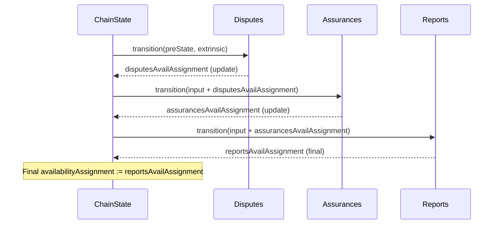

# Temporary state for availability assignments

## Pull Request by @skoszuta

- [x] refactor availability assignment state transitions to utilize temporary state
- [x] add missing test cases for availability assignments (caveat: skipped a test case for reports)
- [x] optimize state comparisons in the w3f state transition test runner


## Comment by @coderabbitai[bot]

<!-- This is an auto-generated comment: summarize by coderabbit.ai -->
<!-- This is an auto-generated comment: skip review by coderabbit.ai -->

> [!IMPORTANT]
> ## Review skipped
> 
> Auto incremental reviews are disabled on this repository.
> 
> Please check the settings in the CodeRabbit UI or the `.coderabbit.yaml` file in this repository. To trigger a single review, invoke the `@coderabbitai review` command.
> 
> You can disable this status message by setting the `reviews.review_status` to `false` in the CodeRabbit configuration file.

<!-- end of auto-generated comment: skip review by coderabbit.ai -->
<!-- walkthrough_start -->

<details>
<summary>📝 Walkthrough</summary>

<!-- This is an auto-generated comment: release notes by coderabbit.ai -->

## Summary by CodeRabbit

- New Features
  - Added an iterator to list entries from the truncated-hash dictionary.
  - Streamlined availability flow: disputes → assurances → reports, yielding clearer final assignments.

- Bug Fixes
  - Disputes now reliably clears invalid work reports from availability assignments.
  - Tightened state comparison to catch backend data discrepancies.

- Refactor
  - Reordered transition execution and removed legacy merge logic to rely on reports output.

- Tests
  - Expanded coverage for dictionary key-collision behavior and disputes/reports validation paths.

<!-- end of auto-generated comment: release notes by coderabbit.ai -->
## Walkthrough
Introduces availabilityAssignment threading between transitions: disputes -> assurances -> reports. Reorders chain-stf to execute Assurances before Reports and uses Reports’ availabilityAssignment as final. Adds TruncatedHashDictionary.entries() and tests. Adjusts test runners to pass new params. Refines state comparison in test runner. Updates reports’ post-signature checks signature.

## Changes
| Cohort / File(s) | Summary |
| --- | --- |
| **Test runner: assurances input threading**<br>`bin/test-runner/w3f/assurances.ts` | Adds disputesAvailAssignment param to Input.toAssurancesInput and passes preState.availabilityAssignment at call sites. |
| **Test runner: reports input threading**<br>`bin/test-runner/w3f/reports.ts` | Adds assurancesAvailAssignment to Input.toReportsInput; runReportsTest passes preState.availabilityAssignment. |
| **Test runner: state comparison**<br>`bin/test-runner/w3f/state-transition.ts` | Changes equality check to deep-compare Object.fromEntries of backend.entries.data maps; removes ignore of truncatedKey. |
| **Core collection: truncated hash dictionary API**<br>`packages/core/collections/truncated-hash-dictionary.ts` | Adds public entries() generator yielding [TruncatedHash, V] from truncated keys. |
| **Core collection tests**<br>`packages/core/collections/truncated-hash-dictionary.test.ts` | Adds two tests verifying entries() collapses collisions by truncated prefix and keeps latest value. |
| **Assurances transition: disputes-driven input**<br>`packages/jam/transition/assurances.ts` | Adds public AssurancesInput.disputesAvailAssignment; uses a local cloned assignment for processing and returns it in stateUpdate. Updates docs/comments. |
| **Assurances tests**<br>`packages/jam/transition/assurances.test.ts` | Refactors to explicit initialState; supplies disputesAvailAssignment across tests; maintains previous assertions. |
| **Chain STF flow reordering & simplification**<br>`packages/jam/transition/chain-stf.ts` | Executes Assurances (with disputesAvailAssignment) before Reports (with assurancesAvailAssignment). Final availabilityAssignment comes from Reports. Removes mergeAvailabilityAssignments and related type. |
| **Chain STF tests removal**<br>`packages/jam/transition/chain-stf.test.ts` | Deletes tests for mergeAvailabilityAssignments no longer used. |
| **Disputes: docs**<br>`packages/jam/transition/disputes/disputes.ts` | Updates comments/JSDoc links; no functional changes. |
| **Disputes tests**<br>`packages/jam/transition/disputes/disputes.test.ts` | Adds tests ensuring disputes clear invalid work reports from availabilityAssignment; includes hashed reports; duplicated block present. |
| **Reports transition: assurances-driven input**<br>`packages/jam/transition/reports/reports.ts` | Adds ReportsInput.assurancesAvailAssignment; transition builds assignment from it; updates ρ′ semantics; verifyPostSignatureChecks now takes assurancesAvailAssignment. |
| **Reports tests: input shape and signatures**<br>`packages/jam/transition/reports/index.test.ts`, `packages/jam/transition/reports/verify-contextual.test.ts`, `packages/jam/transition/reports/verify-credentials.test.ts`, `packages/jam/transition/reports/verify-post-signature.test.ts` | Provide assurancesAvailAssignment to inputs; update verifyPostSignatureChecks calls to accept availabilityAssignment; expectations unchanged. |

## Sequence Diagram(s)


## Estimated code review effort
🎯 4 (Complex) | ⏱️ ~45 minutes

## Poem
> I thump my paw: disputes to assure, then report!  
> Keys shrink to nibbles—entries keep it short.  
> The merge is gone, the flow’s in line,  
> Maps compared plainly, hashes trim and fine.  
> I twitch my ears at passing state—  
> Carrots for code that propagates! 🥕🐇

</details>

<!-- walkthrough_end -->
<!-- internal state start -->


<!-- DwQgtGAEAqAWCWBnSTIEMB26CuAXA9mAOYCmGJATmriQCaQDG+Ats2bgFyQAOFk+AIwBWJBrngA3EsgEBPRvlqU0AgfFwA6NPEgQAfACgjoCEYDEZyAAUASpETZWaCrKPR1AGxJdoJZt3wqF3tcahJIADNA9AltDxV4D3V5NEREeCIMNgxcZEgDAFVESi5EAGt8RAAvPDRIfIA5RwESyABWABYO+sKbABkuWFxcbkQOAHpxonVYbAENJmZxgDEPbAiI2T6VRHHcWW4SFooXce5sDw9xzo6jABFpBgp4bnF8DA4DKBsSCLQxaJoWKJBJJfboNIZLLsEJhSC4KgYdJvJHw/CQPCJeBVcI0fyBZzyRChGgaL6QACCtHozCQ6QwRHh0lwjFS0kigOB8TUYJSkMy2VykAAFO9cczWcUOXwKCQAhQhQB3VL2MovQ60ACUZKgAHlXvBaTjYTQFP5nEh3sh4FhcLBwoqAMwRE24xHI+DvJnEyAUbAYcgUMlfMCGAwmKBkej4F1oPCEUiBsL0RaCri8fjCUTiKQyeRMJRUVTqLQ6fTh8BQOCoVCYHAEYhkZQ0FMsNO+tCK+yOZiEyByBSFlRqTTaXShowV0wGNQYPbMsB+gOUcZOiLjVIOREMaQaXKfABER4MFkpAElG0mW92nMEY4xYJhSIgjFAzzkKIpsDv6HVyF3uGcNA2BoPhaCQc4aEQCkuQpfloRyEV9g1CFIAAZRJEgAG0DyBOJQWSOD0gFdgDwAXU1NFIHfSC93wIjsG3aQaLwdAMHoO1ZTQJR6HUFAcnRO1wllXBGPIegGKYxAWJZFU/xILsIngEgPHocDEEg6QYLiIioUFDQYAQZBZQAR2weBZWQITIH/dDMPhA5wmwRA0FIaUHO4G0iB1SACm4Whk1ZS57HUdkCB4T8JHgJR4XtGyFPQCgiEcdguCXSTMB3RBfGJdwMBSdjfX9DKMCynLcGWC4PBs/AAM3CKSAwsItC5Aj9l0kjEJVay7Qs+hAKoEDKComS6JKrLRsnE9LApDxQOoT1UXC6ylAYeIqBRZB7xIAAPeVr2ic4BCSBhIHYdRlJfckAFkSDtRQQsyahGKc/zk1KEl4FOghxuYjBIOFG1IK4GSABoH20DA0MOBguAAYUfG1odEcH1M06DYPg9smpoHC8JBHlCKx0iKK4X7pP+1ibUYeI0moymWWFXgSCi/BnI8IlPu++i0kYzK/oBoG8BBhnwYYRGoZh+GJeRhhNTJ3mpJk7VyR+USKCwRBH0ODE3pbEXaJ+xX+YpyCaq7ESxOQOtBBEMRYuofi1uwJQrLi2ylJUtSILwLTMeIhDODssI8dawn2uJnJyPQDx3iIdIYt2pBxAZSJlNUxAfLhtBguRJyXLc7A9boeGc48Kz0VGo2txNmT+KKjByfKvKCvodLjdK6Rysq4Ki4C69wocbhuA52LwlstHfYxnTI5ZAbgLuyhgwAUWJQ1AoLYSWeUrtfiiBUuFu8DHAMI8D1fadZ3nYlF39QNV2dcZZX2zP91P49TwpC9E2bOgb17O8LpxZPmkK+Sk1I/7yTqoNRefBNx807tPRIHVA78BdMhcIPwX442wrhMOWII4B0FNHZacViQLVOlXfAWDAi5DriBWAD0A7PVlD5OAW91biUgDQhUptWK22zObJ2axXboHiopdOv4O5ZW0sg2ekBFQzDHvYBeHkSA+XfMoqCLIlyBnBkuHhuRypCMAmkdkzMcEtXwuHWQKDBSoWsrZZwyV7HhSoYYvhuBwZkBUEkVOjiEqe1UlRCIscuw2lIZguUtDrQM2DOYGac1myLQrso1a60FpWjQWdPatC/6HTmCdM6OQLqgJundRh9BmHq1ev3EuJovpog8TJQGDMDZ4HBhpUQ0tIay28R+fA3BZBcA8TgnC7BPxDPIvo0Q7AABCscGBlEQFYZw4gc5+TqSM6JvCxkHllDuHICz8BLMQNMiENdEGyI8HY1K3Cdm5D2fjbkBDbGz3IvLe5L867Uyvto2+y4KAP3XM/GJe4XxQCsIUxp/c6jEj9GIF6us6m0G2d8hmQibTO1EdZIJUjLkyP9npO5ozMKh2sa825UcyIihVANFk95rICPtpbDWf8BzuIeZ4zU5Js6XDAHndAtAhDOVwO2AxXLjEYFqjwTc5jZSWOeW1N5RCYRuLiQQZpGLFT2iwEwJECJvwp0ZNZIWuAjCr3EL2a8m9fTbwSnvWhh86DwBPmfC+YAjB/IXLolca5xjkJoGABEmAPTvHBYeD+M1v5Ng2n/Bwt55D3mAQyMpWD4hZWUUpDAOczpmRzskB8ogyj1yXDg6A7oLpegiJ+ZgYilBymXvm6qXprLnVlA1HBZxKi4BwZmO2SolF1ihIEcI+9+z/DKFGDQEzLoaFhXuJcDBkwAGkSCyHBuFOoDbuBNuwLmr0I9Ib9uzMgQskg/41pYMogQk6ozFIRJdSAsLIC9lGAZWW8AlLLsuBulALJpVdkWOjSAuosxiA0Fe5gy8PyXSZgqzCGhb1LOnbO3cC60OIGFJqSimB6BgYHZB2tMHH3SCZj2yxyGp3sRnbB9D1A0C0dI1hnDbFWzmksrFSo6jDLCXwPgFkj4tYXMoCiO1vYbTIH9Cm0gtADLVmMn4fAuZlHM1Zs5FAmRR2vtEI+DASA614dfWgKdbtwjAYtIgL08Kvq4FHuLYtMdqpUdQ3RzOL79U0ByJnKan8kkbRSVRFaogMmbWybtfa+S+BHSKedcQZSoANHRDJsK6IIt5NoGcaFp04tEihCw3cFq17Wr/ra2UUUHUbCdZAI+rrmDv3PiGT1BhAJLNctIcYTBZSdfwJcbMKS9hLuTGAITsAwDgTEItQke5mQRoa9Nc8l5f5VJ7H2ZNennxGCpLQKyip0S2W0f2RZyzICxCSP3LyMAhstgABKpFgHcWzU2XBMeeGRyiLRHysz4Iou08Jrt/ynbITOkA5kCdgEdk5J2ngkDhJxEgY6qqQCB8gHVlBcRxSUhQH0uA9v2EfB26yLk2D/ek4FZmSkdpsa0QgCg9AhP1q/REdHiEKfwB2mLK0hr7YrSe+8PsUU6hQZI29xA4MjNCT1e8KQCplGWQuCyLdWBnBUHkILh9ovsMGWXv8CHh25W8IdpwMB7C7UODmpdzDCh/QslQAAJhFEwS4SBAtO/iKMdl8hDWlXJ7KSnKsqyY4sj6CZ8hnJhTiqmVtAP+p+/Z7S62yP124cKgz6yZ3sBjtrco+IoEwCSdE6V3r53LtA5FBnkgdvNTg2lYruKsOKBJGGmKcvOdM8B94/YUQ7x6Ch4xMUMzz7k5YsVzHhqlP3JA8dNThn6hkBdcsgEdil2K+t7WCQR0KsDC6nIJDpZKBrYQN/BEUCyik5r1TqQRXzIxfU7hd3wq0Vzo/r3yW2sR/0An+GsFrwpptG373n6ykFHloCLhOgWn8TIVUUO0QEOQtHRGplx3REWUySRAMiSx4Gy0pCsDPEehzRqWtg7RS1oAAG4x4pRnBwhzhZRR59dqQq00DfNEl5owtIln0QsgIwttpckFQotMDjpGk4tLowEMCUtUl0teDMsYsYUOCAsrQV5isN5FAt4Ktd4qsD4asXU3VjwmsjBWsyh2tdgusSAes+tJsrRBsycWwRt7txs+cc0Xs353VP4Y0rx41VtAEIZU0rooAKRxF+Cikf4NpogGEHpMNsMFE5IP9woK0rC6A7stZHtzCHDZBgBoAckvMdtQNAIzISAEjYBwYAA1PQeufQwwnrbrN3frCw73Zdaw0bOw5I6bXIAyM8W3Fg9kZTb/OKf0QsDmS7CbTQcIlPegWQSRZAQCYPbJLCWIn3W7e7IosicGNHQnOKMvVAXgL8H8fsL3EzS7XFYPFkaAGwAoBoOGCkaAZeO4AAfRuwpDQhu2uLQjPAAC1l4dioJskmVnhpgc1qoy8jN9UZdjV/0qI6hZi6j4j7tTt4A6g5lZAoIiMWBjkBBhQNB0TtRUh9Q0BcitdO9QjeIz0TkUochIFkADw2jmxogui+ArdGU4pBjnt5BhRfs9cx8UdNQDx5MjIMioxB8KQcCqIyAUo40k9ZAwBV9Jjsd+99j2T11UcZg2YWR0t6RGQIgkcUdOd/AvBBRLcdph9U4K8WNqcsI0JZBmABBesNBQpgiKAyItcmDKR/NUDUlgs1pODAtuDItoxossChCEtND7pfwj8uAAADYYrgAAcVjWoECGABmJj3yMWL0FDPrndLplDIhOTHyKSJREJDSN5PYmQGxNyKTMgGKNTOplDLKOfAqJMKqOSN2FqOGwaMZP50cMQFDKKytSUJinKx3jOnUKDlq20MawgGaxrI6yEGAkG1DQYI3GkV3G0Tm2cOjSWzjRW0TWyTELAXfARC2PZDrAixOj4htAuhzj7WZRZHHX/2p3D2tEV2Sy5wRRZHJhmSPQYH2LijU09A0xtD8XCCvMgDBGUA8AMjPPWQ8D7U80hmtnwV5CpVkkKgYEYllByEKILX7kCDuAYx8m20Tw9kkSHw0inmuUQrBOCnJjrivNvys0Ym2KgzOhmGGggthKgsQyVRsXIsBDNE0lbFlDAFvWKHxWJUQmFDPAaDPGgDPApD6GuPuOeMjIaGumXgaGgGr3YMOGX1TlbTimXPJE0WsgPC1jZmCUOAoH3kM3+znLE1ZLOn8HBEDRIAPG9C8X4jNknigjIvkVQGKEfP4nPPYuak4spVng0VtDimMsYQuH6koEsvsBYDdBssWhcu0XBlYovPsnvLYnsteBSHgqJlVTEqwgwCqhryqgohCUCB3H70ApdE8r9hniKtwDIIaqQRuR8omMiifykX+zeSsEoDhlHXEskuktkvkrQkUuUtUugA0EQBOhIGw03RtFkARl6Rhg70MsipMpirtQHX4jO2ijwIKzFxcqitMrbhIH2ptEOvoFutjL4BtCUA5xcqM3Ot2tlGuowFuv4Dp0oFSpv1Rh9i8qJU6lt2QD8qogyqCtJBCoQrCvJApCeEqCskBuUQNzCyMycuRTCEUwkwwHBgEFYh6krTEzNSEX1XSGJHYFHixREXZDau8uaup2snJgUANRfOiFQGZ1/CwGPK+lPP00gsvPA00EdNmhYMCzYPSQ9KyS9Iy1+oCMEJKXix8MgFEI21SxyW9KywENOgFNwOqReh8wMEtXXhtWULtVUMHP3mHK0Pq3dV0Ja0nXKOnKWBDSRHnPgSkhXKjUWyCMCgTQASTSAU1rVr3M/FAMzUZtBtQUQO/KwPJpvLim9pNmss9pRG5KSozsWiEVCFM2IvRiZtEqDkexIqghwU2RDjwQpXhuaujmFG4h4jURQHxA0LLvRkruLhGNqsTyYE8j/hQOqjhsKpLvL1hPcrwHnWBsarkWarmoWuw0onHTLh4EoDAGMIihOWkFVKzsHCoOoAhx/LZnmvkC4g4iMjmo4oKsIRLrIL4kAztW4mQEYusiHpiFrtHrBr3q0vAgZD2ENBICVKLVORmWYGUwPRdFCmYFvyM2zVzWxr7jhFXsGV/n4AitQHfv7tkD3vgeqicqrtNFZVRBHtvrBvYOeCkHoFfriiwcGWZNSBXUAyhmxBIG1EgDuGJMFFQLNEFEILZkKl53LsPJvvkFCRlUoJxpbHStKhEUuzqAKH6C8Lcmphb1THYGDF8OpETywdjl33pPCDavG0obIA/oJleQuTHq3QkHwCOuYFqBBPJolwQKs1z3CD4kYoiUoD+NdH6V8XkeIpTntmKHnjExaFxwRywCMYDuvBfUBNQphCcs0fARFWJEHzwZpgb0u1jmmG5lfQcYx3CHftIZVTHskxoG4myQEplueFTigVOwtF8RIGWKHSwCQevGPMwAevzDbBhGOihxFEAEHgQAQgJKIAgIl9j0Q4UYYv1GkiBVdAJzKu9kjknCH2RDR9oWbHJ+92sqIh5NmAkAIsC8U/GBDIDs6w1bR0Q/cvB7YjHz0qGzGXleRn1cLxbnTWDBIGTZCXTwseCDpfS9aH1Sk1blgiKm76lQyY6mqS7KysBQyqKGZUzhQJCB5HJKIqzJzdg3bZyc73gFyCUlzOyFElEMFIBQyO6p4u66lyVzG66S7yIuzTbFCLa+z7U1DbauAbsMhYB5snasXxgcWPbLnOsJYBVcAIgZtiRfbz4XD1zA6PCQ7lGykHhf9L1EhvBZU2tayhXSbFpRXIZxXJXlyWjqIWQYKbQ/5/Q+Jbzx02AkoSBrllVELb8mAZdLtYCfFnhKgFF7QO02rFbU7EFMnnA16KAN7tNNwS7YHCpPWHDPRUc/Wt4X5LHMghSHKenONohwpjC3ZHZFR0cQ3ZRaBwYR4NM6hl0pQyAtxLtQVDdaB9sBMzcCAO06wo3yG1oG9PdC6p4CWEEso97byibEhXzRHuLRbkBWlsV9jAHgGjM6hRs/4AB1QIMoQxDS4DbjWK8Nze6G1NwOBUv7BEfqwayNogWCxXFatapGGGcXQqe668e10gJ1ri2eLDaGxC98mJT9ntry2ecXRc6CWeXDc98p7W7MP+eXOaEHKwSOo1XOsrPwWCjEUqTWuTd5yWrJaWn5rgl0VFvg6QnLFW4Q8kDWkBVJI2rNvD/5ugXWopGpl0hQns1llQgcx1DQvoWqPl8cvQl2nVmc4V+c4BG0I1mVhbL+eV68IOtbUO8jsBDxdOy519Lo1FTvY+jTBvUeXaUQTEL0Axr5GJRThgg/cTFTu9+gBT1AR+m6/AKdY/U/cmXBm0XNEp8iqz5AuOYaB5y9bPJ9y7exi3EecIcB0ArwRAe+8G+EEzUx8CA5OzMR7PayBTqDxmOt3IYusGjvNmx+pQX+raKJmesYTvNmwTsTSj8eGVOml2BmwrjLwOcz5RH9aqUxAfWKVACvHyBTnLuUPk9Bi5ft6QHwMhOYYoXIxCDxRdZKr0Jr4Rar62QDur+xIzbKufM3BXVJbzu1F+RbjRxG0R/d+xdIbU2ZuoxaIbsdZz6qYhhqdTU+nTB138fb9tg9yIbPNL2/NqgDwlmNqpTCCLkzx+o7keM+rlHbnILOLwTAIubJJ9op/AXJ87yAe0DwJZ9U0qMTWHl90K5q62R/IUTcE5WE68MHxXbZgtOSDtWUcBqh+JcTj5qWr5wxnDz06j70xWwj4F1WsBSqdH3OqnlTsM1FyIaTDHygZ9sdt91pQKjL9sEnr93hEnsmWOwUIG4R9qxCpXmFsGr7gb9X2eTXuekuzUOF8lgV3VqbucYTjAUT3IJls2krVsNl629joOblogXlx2nj527VqcgTvV/Ftq8YNqqVzQJwv2iTmJ9wrc9bOTxG7RsRA7CUcKd1zYI3RnNXozsTTt5wWJH6vbCgEtd71769VzhGt8AZKO9kWyDZmJLgJdmYMsrH+l7X6nf8FdgvwxPZouA5vS2bckU3Q7Sm7nIUJAhRVdrbwzlk1dwxAARmWOn4eSr2p0VCoFGDHjrTssXak1VMgHr7tHyOFHhMRIGmKCP7I3RI0ExMQBLMzyXqzi4k+NH6b6/rjoNRNm8V11lQsgCcXfoHz8L4eQks/sdQGfgAAYBUscS9mwGAbq5j2cEdwGwDQiQDhQYAjvHMnMgZwxEzMcVnCHgyNRMIe/WAO3zXZcpKIdoR2FVxxT2gpQo/Epgd3YCxIsB69TeirjQBq4J6cAlZKe1lDi49GjIOym2n1IX5GQbVH4F1h2xiwEmOQM4P2RPoNNzsD1V5qEAa7g5ho2NPFD5igDLwdoOnT4tukK6Tc8WWAOynUEpZQRtBj6T2qdGHZzRi+daGXIMVdYXBeAc+cGH8HW54UzEhucgXXkLbuczoJwQEIVDhSYQ1mOSZOOFyAEIAIqtSMIF91Ex5tfBacbHLJAl7M0qeyHInKoh1QatlExQfVISS7z+VSqlwGRhNggImoyED+egK0luqUR/+E/WXMqHnyQ9i2bCXvj6DQDDwG8u2L6O4xiFD4NgSEPHKARHhfQ4cEofpqcgxYFcNgLOFkCgU2jtDxQPoGgk+i9Bt8F+mzcdDDgqFaIJQDQ97g12ypKBQItIfTGvFOijYFEq/cysgHVyED8i1OO4g8SeKvFl4tPPzJhyWiM92C7pOQqiHlqSF2efpYjgGSSzkBuy5tIvE7zY5DlnUx8B2joS95m8/eFvIPoVwxFq8xOcrSPpuWDrbkw6bgBkkzikadEMA9mXpt5nrhX44YrQugENVlDkVWS1MVEe7X95zhA+wfU1p+m/RlxhkiNfwgBXZqhAzyqcQZoAAICSIofmbpsEAAUmhE4YMBlhz6LhuwB4aKM+gdqZnGhUzQFsO07THzteiZTBJ5mbAxZsND8QlphQbQAAOwABOAQLQBn525xgLomfmgFAGOgXRzoL0WQKmZCibQ1omfgwHtEOiGAAgN0Y6AABs9o0AaAJn6Oh7RJAeMQAH4JAAAXlAEaBbRGgGfirAwJo8mi1UMQpzgGTVRxGiocGNEEoCfg+AemWgH4n4F+CK+34OgGQWsgElgK8PRpBkMkwodiCnw5gskiw6/CGOuHbWgrQKRAt/SatMjt4SFI0cpCWBccSkiY7QjHerHSrJy0gCcdFQ3HacGyNxYit3u4wJ6rtBD44i1yeI/+DJ2VZq1tskCfwknXBYLdleaqX4YdnJqsi+OvvdkeiNPHnidol43IJ0juiON/K73K+sFTSEl096lkBlOgg6HKk9o2YX5n2LaaocQENQonKEOLghBEg1UCLKeiebOt5E4UFoBCCYa1QWGOIYUCVTKo2QKqOGIcU6W+Gulvm/w35kCIBZK0iO4gLnqR3RCEdxg+HXvCrTyxPQak949cQ733pW04RO4kckiLHKHjfx2LNEUYKfhcptJL8K8f7RjJSdFWhI2PuX33KV8CKCUF8V7H65SQSe9cLVJBE3SOReq5MaltXVL710lixSfxqnE2KARz2Yme8HQOe58M7BtktOqVzXFx8si9TDnmSz9ws4aqNfDQm5Lwl1IfIUU94BEUforc4kQbQlFr1QTdQyEbMCgDVXHQ2C/6lQ8eAlBCn/stuGaWtipFhKdw+uvUTOEk08lwTVYCkVdoPmfgZo/AiTJDiUgYAyBjsaUOUENMHy9Z6AgAHAJ00/wcIPVPnqABcAiiFiJBmgAJgJ2CsBZ4AaHeCow1RJSSAo7B2kmcSAZkSQDnA/GQARmOSHcK8F9amMjyH4eQKgEGnLSS29cHIeLElCFN/Cq+XsB9NkbVdVMlkNVIA0gCAAR4F2nhRzKtIOeD2kXDTTlp9iBsU2I7Ep00ghPQKJqJM6Gj0OgeFaU93kQ/oUKueXOoDwWqxJaIBU2eh1WZrlNYc0YJCYBWt7Y0K8xw4uIQRWnDwm89AZyF+SoLr00uCgDtEBPCnJQgIpJQrFABT6yArAFGfLDUgRjFoIaqspFKgCJlgkGAT0pCkKnAh5lmuQEIaHAjfFFSVeLNDkSYjlR0yp6DMvXszVITc0Rei0FUV4w1i5pFZys4kGhC1myh1ZpyIKPg1CiEzi4HEYSfVEOayoYEoEUtpMlch7DY5Ts+gYhBfQRJhJKM8riA2WQ+RdQMuMuJugTpAsDasqP7I/WXQnAn0y3Vrk7PsmcQ2Y7vYBiTQt6RAwkLTP7LrISm/Akph5QqA2xQrcMxMNzfrOc38IXTigvYMaSbQSRsSRxPwtJMzzlqs8pxgLWLGCLVqwdUGCoFINETSxLiW6jkqmFgCPFZS5wp4qCW/HqBQAG574nIArG+7uTcYNdOli/2IRkQwEt0IMsdWkm6zqY6ZZAApyZjqTBWmkk8TpOvmIB5YBgW+adkoBfolZKsqSS9GDnLJWkwMSAJGX3SIgaA0gCwbU3SAMBCiO8SiIACTCBBc8E2B+ze0gckgOgqwxwL6gLCs1FGVwWYB8FiAQhZJi+ikKFIoMZhSwoilXIH5QcE+bgDxiWzDeYNciEIsgA8pmWzHGEVuI5bVY3eHvZEWpJ94aT/xWk08YrIjakkdookHOCBLGDzZcRhkqPgSJj7eEts8feptZOCT3yrZd001BiiAotc/44UCborKGrGLTFHgDCiXnBA/idF4CvRZApfjjBDFnmXaEEvMV71V8qAfOqY0YpQSupsE8hkZlrDdD2IPi34U4z4EJxwg5+EEhoJFDzUBM4MGWXgoRy35/wIuehjMkOS4BjkpyVZAqDYprNcMyNOmAF3EBBdXKAMkHApmU7gQ+RYmNAHMLECo00mCgd1qnFtTXDaQiAa1OLFRhgFxhpoLFuDFiDety2qHaIA+xSQNdY4tnIuBuH1mOALgPDONvAQAJIhGIIs0iTYnTkshsaGxbqrKN+Ep9lIQYdWsljDpBY4o/y07l6ByaNJpxRScueV0iHvBaCEocmlrC6HuNkACSqMHQFYkS1F5HEpnlxInFiSQRM4reSITFBQi5JiHZ3vCM0KIiDxE5MBeb30U6S4lxbc6DnFfizYw+sra8dYvxF3idyBgPwoRRsmuKZFcdGUYUuUTk0gK1MYoFIFtAShK2nRF0H4sQWbA4Y7KkpJyqiHhKDC/HKJfOQMUarxSMOJQDqvLhJLIAOuf6U3WM5+V5u33Rudcy5TQTYa2SwOOgXRCqC+AYhILBKChWnQaxqEsQJB2kAeCMOeK0FQStCws9JxwImFcrQEkkdEsh8nWhz1yx/zjaEy2ZtispW9lVFNtarMpIZW8cIlzK6JTEliWmqwAAQG+OV3MWRpeVBktwgKs8JCrZo1UGzhCsBEuhfZKC/AmgvtAhz46KwpUIWx7nRy6Y9+AoYlBcTsBxcnq62WkqwAZK3VWSz+mQy9Wd50gVOQfmyGQBVzV6A6/2fQsYXCg6lnChpfLxaKbr3526wUDMOpqVN7wp6uhagqDkjqMFV6uWTAr3rESw1l1c3EKGFA7o90uaKYcskogYSBxaHbkjWGXyQlB8HPcuW+tNW0KA5n6hhd+uQAM4WgpjTFQUqjnoB9ZcoQ2fapNlxyF4oEHFfT1HHLzCV8a4lUmv4kgtue7s6zPQrJGqdQy76rDUOq/UazL1HCv9cb0gCUK+NGGwdQVgvW/quFS6rdaU0y4m8QuFwcINWSZUQLjVrK2tfWtwACp6FGgIQMSyZhYFy5KWLfPb0LUKTtxJa+2geLDARhikbM+sAmH5W8M7kVALsNJ2CADhN4RYEcKWHHCGBnNqYdQNcWiiIBri/ZBSHQGuLkJZc5YKcFAFUAMA7coAp0X8EdACAGAAADgiB25ox0YtoEoDy2OhaAdoyrXbmpBtASAM/W0TP3tFtABAHQaMSFuMCVheGEWqLTFvZbxb705YZzcwAYDcBri8SkxQltCBJaJwBgUMvNoMAABvZhQeGVAawvIZyLgFhC/kABfObQtpS2vpRt4294DQEm2DbQwQAA== -->

<!-- internal state end -->
<!-- tips_start -->

---


<details>
<summary>🪧 Tips</summary>

### Chat

There are 3 ways to chat with [CodeRabbit](https://coderabbit.ai?utm_source=oss&utm_medium=github&utm_campaign=FluffyLabs/typeberry&utm_content=544):

- Review comments: Directly reply to a review comment made by CodeRabbit. Example:
  - `I pushed a fix in commit <commit_id>, please review it.`
  - `Open a follow-up GitHub issue for this discussion.`
- Files and specific lines of code (under the "Files changed" tab): Tag `@coderabbitai` in a new review comment at the desired location with your query.
- PR comments: Tag `@coderabbitai` in a new PR comment to ask questions about the PR branch. For the best results, please provide a very specific query, as very limited context is provided in this mode. Examples:
  - `@coderabbitai gather interesting stats about this repository and render them as a table. Additionally, render a pie chart showing the language distribution in the codebase.`
  - `@coderabbitai read the files in the src/scheduler package and generate a class diagram using mermaid and a README in the markdown format.`

### Support

Need help? Create a ticket on our [support page](https://www.coderabbit.ai/contact-us/support) for assistance with any issues or questions.

### CodeRabbit Commands (Invoked using PR/Issue comments)

Type `@coderabbitai help` to get the list of available commands.

### Other keywords and placeholders

- Add `@coderabbitai ignore` anywhere in the PR description to prevent this PR from being reviewed.
- Add `@coderabbitai summary` to generate the high-level summary at a specific location in the PR description.
- Add `@coderabbitai` anywhere in the PR title to generate the title automatically.

### Status, Documentation and Community

- Visit our [Status Page](https://status.coderabbit.ai) to check the current availability of CodeRabbit.
- Visit our [Documentation](https://docs.coderabbit.ai) for detailed information on how to use CodeRabbit.
- Join our [Discord Community](http://discord.gg/coderabbit) to get help, request features, and share feedback.
- Follow us on [X/Twitter](https://twitter.com/coderabbitai) for updates and announcements.

</details>

<!-- tips_end -->


## Comment by @github-actions[bot]


<details>
<summary>View all</summary>

| File | Benchmark | Ops |  |
|------|-----------|-----|--|
| [bytes/hex-to.ts[0]](../blob/484cf46ac88ee58424d6560f108da209d5722408//_work/typeberry-1/typeberry/typeberry/benchmarks/bytes/hex-to.ts) | number toString + padding | 330488.11 ±0.14% | fastest ✅ |
| [bytes/hex-to.ts[1]](../blob/484cf46ac88ee58424d6560f108da209d5722408//_work/typeberry-1/typeberry/typeberry/benchmarks/bytes/hex-to.ts) | manual | 16457.52 ±0.44% | 95.02% slower |
| [math/mul_overflow.ts[0]](../blob/484cf46ac88ee58424d6560f108da209d5722408//_work/typeberry-1/typeberry/typeberry/benchmarks/math/mul_overflow.ts) | multiply and bring back to u32 | 249612390.15 ±7.18% | 3.59% slower |
| [math/mul_overflow.ts[1]](../blob/484cf46ac88ee58424d6560f108da209d5722408//_work/typeberry-1/typeberry/typeberry/benchmarks/math/mul_overflow.ts) | multiply and take modulus | 258910527.8 ±6.68% | fastest ✅ |
| [math/switch.ts[0]](../blob/484cf46ac88ee58424d6560f108da209d5722408//_work/typeberry-1/typeberry/typeberry/benchmarks/math/switch.ts) | switch | 260798403.81 ±6.73% | fastest ✅ |
| [math/switch.ts[1]](../blob/484cf46ac88ee58424d6560f108da209d5722408//_work/typeberry-1/typeberry/typeberry/benchmarks/math/switch.ts) | if | 247183209.05 ±8.74% | 5.22% slower |
| [logger/index.ts[0]](../blob/484cf46ac88ee58424d6560f108da209d5722408//_work/typeberry-1/typeberry/typeberry/benchmarks/logger/index.ts) | console.log with string concat | 7941073.97 ±38.35% | fastest ✅ |
| [logger/index.ts[1]](../blob/484cf46ac88ee58424d6560f108da209d5722408//_work/typeberry-1/typeberry/typeberry/benchmarks/logger/index.ts) | console.log with args | 51583.74 ±50.78% | 99.35% slower |
| [math/add_one_overflow.ts[0]](../blob/484cf46ac88ee58424d6560f108da209d5722408//_work/typeberry-1/typeberry/typeberry/benchmarks/math/add_one_overflow.ts) | add and take modulus | 250012756.56 ±7.49% | 0.17% slower |
| [math/add_one_overflow.ts[1]](../blob/484cf46ac88ee58424d6560f108da209d5722408//_work/typeberry-1/typeberry/typeberry/benchmarks/math/add_one_overflow.ts) | condition before calculation | 250444029.53 ±7.08% | fastest ✅ |
| [math/count-bits-u32.ts[0]](../blob/484cf46ac88ee58424d6560f108da209d5722408//_work/typeberry-1/typeberry/typeberry/benchmarks/math/count-bits-u32.ts) | standard method | 87743922.36 ±2.08% | 63.77% slower |
| [math/count-bits-u32.ts[1]](../blob/484cf46ac88ee58424d6560f108da209d5722408//_work/typeberry-1/typeberry/typeberry/benchmarks/math/count-bits-u32.ts) | magic | 242159331.28 ±5.63% | fastest ✅ |
| [hash/index.ts[0]](../blob/484cf46ac88ee58424d6560f108da209d5722408//_work/typeberry-1/typeberry/typeberry/benchmarks/hash/index.ts) | hash with numeric representation | 188.65 ±0.39% | 29.23% slower |
| [hash/index.ts[1]](../blob/484cf46ac88ee58424d6560f108da209d5722408//_work/typeberry-1/typeberry/typeberry/benchmarks/hash/index.ts) | hash with string representation | 108.39 ±0.62% | 59.34% slower |
| [hash/index.ts[2]](../blob/484cf46ac88ee58424d6560f108da209d5722408//_work/typeberry-1/typeberry/typeberry/benchmarks/hash/index.ts) | hash with symbol representation | 183.49 ±0.21% | 31.17% slower |
| [hash/index.ts[3]](../blob/484cf46ac88ee58424d6560f108da209d5722408//_work/typeberry-1/typeberry/typeberry/benchmarks/hash/index.ts) | hash with uint8 representation | 164.28 ±0.2% | 38.37% slower |
| [hash/index.ts[4]](../blob/484cf46ac88ee58424d6560f108da209d5722408//_work/typeberry-1/typeberry/typeberry/benchmarks/hash/index.ts) | hash with packed representation | 266.57 ±0.23% | fastest ✅ |
| [hash/index.ts[5]](../blob/484cf46ac88ee58424d6560f108da209d5722408//_work/typeberry-1/typeberry/typeberry/benchmarks/hash/index.ts) | hash with bigint representation | 185.13 ±0.29% | 30.55% slower |
| [hash/index.ts[6]](../blob/484cf46ac88ee58424d6560f108da209d5722408//_work/typeberry-1/typeberry/typeberry/benchmarks/hash/index.ts) | hash with uint32 representation | 202.42 ±0.55% | 24.06% slower |
| [collections/map-set.ts[0]](../blob/484cf46ac88ee58424d6560f108da209d5722408//_work/typeberry-1/typeberry/typeberry/benchmarks/collections/map-set.ts) | 2 gets + conditional set | 117459.55 ±0.52% | fastest ✅ |
| [collections/map-set.ts[1]](../blob/484cf46ac88ee58424d6560f108da209d5722408//_work/typeberry-1/typeberry/typeberry/benchmarks/collections/map-set.ts) | 1 get 1 set | 62058.84 ±0.02% | 47.17% slower |
| [codec/bigint.decode.ts[0]](../blob/484cf46ac88ee58424d6560f108da209d5722408//_work/typeberry-1/typeberry/typeberry/benchmarks/codec/bigint.decode.ts) | decode custom | 172477630.63 ±2.46% | fastest ✅ |
| [codec/bigint.decode.ts[1]](../blob/484cf46ac88ee58424d6560f108da209d5722408//_work/typeberry-1/typeberry/typeberry/benchmarks/codec/bigint.decode.ts) | decode bigint | 82257718.09 ±2.31% | 52.31% slower |
| [codec/bigint.compare.ts[0]](../blob/484cf46ac88ee58424d6560f108da209d5722408//_work/typeberry-1/typeberry/typeberry/benchmarks/codec/bigint.compare.ts) | compare custom | 260272215.63 ±6.9% | fastest ✅ |
| [codec/bigint.compare.ts[1]](../blob/484cf46ac88ee58424d6560f108da209d5722408//_work/typeberry-1/typeberry/typeberry/benchmarks/codec/bigint.compare.ts) | compare bigint | 241013472.25 ±9.65% | 7.4% slower |
| [bytes/hex-from.ts[0]](../blob/484cf46ac88ee58424d6560f108da209d5722408//_work/typeberry-1/typeberry/typeberry/benchmarks/bytes/hex-from.ts) | parse hex using `Number` with NaN checking | 108463.85 ±0.76% | 85.75% slower |
| [bytes/hex-from.ts[1]](../blob/484cf46ac88ee58424d6560f108da209d5722408//_work/typeberry-1/typeberry/typeberry/benchmarks/bytes/hex-from.ts) | parse hex from char codes | 761218.22 ±1.56% | fastest ✅ |
| [bytes/hex-from.ts[2]](../blob/484cf46ac88ee58424d6560f108da209d5722408//_work/typeberry-1/typeberry/typeberry/benchmarks/bytes/hex-from.ts) | parse hex from string nibbles | 512077.61 ±0.37% | 32.73% slower |
| [math/count-bits-u64.ts[0]](../blob/484cf46ac88ee58424d6560f108da209d5722408//_work/typeberry-1/typeberry/typeberry/benchmarks/math/count-bits-u64.ts) | standard method | 1191443.67 ±0.3% | 83.53% slower |
| [math/count-bits-u64.ts[1]](../blob/484cf46ac88ee58424d6560f108da209d5722408//_work/typeberry-1/typeberry/typeberry/benchmarks/math/count-bits-u64.ts) | magic | 7233226.85 ±4.16% | fastest ✅ |
| [codec/decoding.ts[0]](../blob/484cf46ac88ee58424d6560f108da209d5722408//_work/typeberry-1/typeberry/typeberry/benchmarks/codec/decoding.ts) | manual decode | 129598 ±37.19% | 99.92% slower |
| [codec/decoding.ts[1]](../blob/484cf46ac88ee58424d6560f108da209d5722408//_work/typeberry-1/typeberry/typeberry/benchmarks/codec/decoding.ts) | int32array decode | 161977226.14 ±3.22% | fastest ✅ |
| [codec/decoding.ts[2]](../blob/484cf46ac88ee58424d6560f108da209d5722408//_work/typeberry-1/typeberry/typeberry/benchmarks/codec/decoding.ts) | dataview decode | 161269765.14 ±3.93% | 0.44% slower |
| [codec/encoding.ts[0]](../blob/484cf46ac88ee58424d6560f108da209d5722408//_work/typeberry-1/typeberry/typeberry/benchmarks/codec/encoding.ts) | manual encode | 2613261.13 ±0.21% | 15.95% slower |
| [codec/encoding.ts[1]](../blob/484cf46ac88ee58424d6560f108da209d5722408//_work/typeberry-1/typeberry/typeberry/benchmarks/codec/encoding.ts) | int32array encode | 2805900.33 ±2.79% | 9.76% slower |
| [codec/encoding.ts[2]](../blob/484cf46ac88ee58424d6560f108da209d5722408//_work/typeberry-1/typeberry/typeberry/benchmarks/codec/encoding.ts) | dataview encode | 3109303.48 ±0.57% | fastest ✅ |
| [codec/view_vs_collection.ts[0]](../blob/484cf46ac88ee58424d6560f108da209d5722408//_work/typeberry-1/typeberry/typeberry/benchmarks/codec/view_vs_collection.ts) | Get first element from Decoded | 27801.25 ±0.15% | 59.23% slower |
| [codec/view_vs_collection.ts[1]](../blob/484cf46ac88ee58424d6560f108da209d5722408//_work/typeberry-1/typeberry/typeberry/benchmarks/codec/view_vs_collection.ts) | Get first element from View | 68186.75 ±0.7% | fastest ✅ |
| [codec/view_vs_collection.ts[2]](../blob/484cf46ac88ee58424d6560f108da209d5722408//_work/typeberry-1/typeberry/typeberry/benchmarks/codec/view_vs_collection.ts) | Get 50th element from Decoded | 28007.79 ±0.6% | 58.92% slower |
| [codec/view_vs_collection.ts[3]](../blob/484cf46ac88ee58424d6560f108da209d5722408//_work/typeberry-1/typeberry/typeberry/benchmarks/codec/view_vs_collection.ts) | Get 50th element from View | 37734.08 ±1.14% | 44.66% slower |
| [codec/view_vs_collection.ts[4]](../blob/484cf46ac88ee58424d6560f108da209d5722408//_work/typeberry-1/typeberry/typeberry/benchmarks/codec/view_vs_collection.ts) | Get last element from Decoded | 28357.18 ±0.29% | 58.41% slower |
| [codec/view_vs_collection.ts[5]](../blob/484cf46ac88ee58424d6560f108da209d5722408//_work/typeberry-1/typeberry/typeberry/benchmarks/codec/view_vs_collection.ts) | Get last element from View | 26989.19 ±1.65% | 60.42% slower |
| [codec/view_vs_object.ts[0]](../blob/484cf46ac88ee58424d6560f108da209d5722408//_work/typeberry-1/typeberry/typeberry/benchmarks/codec/view_vs_object.ts) | Get the first field from Decoded | 445321.8 ±0.4% | fastest ✅ |
| [codec/view_vs_object.ts[1]](../blob/484cf46ac88ee58424d6560f108da209d5722408//_work/typeberry-1/typeberry/typeberry/benchmarks/codec/view_vs_object.ts) | Get the first field from View | 102022.37 ±1.34% | 77.09% slower |
| [codec/view_vs_object.ts[2]](../blob/484cf46ac88ee58424d6560f108da209d5722408//_work/typeberry-1/typeberry/typeberry/benchmarks/codec/view_vs_object.ts) | Get the first field as view from View | 103984.91 ±0.36% | 76.65% slower |
| [codec/view_vs_object.ts[3]](../blob/484cf46ac88ee58424d6560f108da209d5722408//_work/typeberry-1/typeberry/typeberry/benchmarks/codec/view_vs_object.ts) | Get two fields from Decoded | 432584.98 ±1.63% | 2.86% slower |
| [codec/view_vs_object.ts[4]](../blob/484cf46ac88ee58424d6560f108da209d5722408//_work/typeberry-1/typeberry/typeberry/benchmarks/codec/view_vs_object.ts) | Get two fields from View | 74881.88 ±1.95% | 83.18% slower |
| [codec/view_vs_object.ts[5]](../blob/484cf46ac88ee58424d6560f108da209d5722408//_work/typeberry-1/typeberry/typeberry/benchmarks/codec/view_vs_object.ts) | Get two fields from materialized from View | 168430.46 ±1.62% | 62.18% slower |
| [codec/view_vs_object.ts[6]](../blob/484cf46ac88ee58424d6560f108da209d5722408//_work/typeberry-1/typeberry/typeberry/benchmarks/codec/view_vs_object.ts) | Get two fields as views from View | 82816.74 ±0.3% | 81.4% slower |
| [codec/view_vs_object.ts[7]](../blob/484cf46ac88ee58424d6560f108da209d5722408//_work/typeberry-1/typeberry/typeberry/benchmarks/codec/view_vs_object.ts) | Get only third field from Decoded | 436116.74 ±1.15% | 2.07% slower |
| [codec/view_vs_object.ts[8]](../blob/484cf46ac88ee58424d6560f108da209d5722408//_work/typeberry-1/typeberry/typeberry/benchmarks/codec/view_vs_object.ts) | Get only third field from View | 102049.11 ±0.16% | 77.08% slower |
| [codec/view_vs_object.ts[9]](../blob/484cf46ac88ee58424d6560f108da209d5722408//_work/typeberry-1/typeberry/typeberry/benchmarks/codec/view_vs_object.ts) | Get only third field as view from View | 101831.51 ±0.37% | 77.13% slower |
| [collections/map_vs_sorted.ts[0]](../blob/484cf46ac88ee58424d6560f108da209d5722408//_work/typeberry-1/typeberry/typeberry/benchmarks/collections/map_vs_sorted.ts) | Map | 284151.66 ±0.26% | fastest ✅ |
| [collections/map_vs_sorted.ts[1]](../blob/484cf46ac88ee58424d6560f108da209d5722408//_work/typeberry-1/typeberry/typeberry/benchmarks/collections/map_vs_sorted.ts) | Map-array | 103337.31 ±0.17% | 63.63% slower |
| [collections/map_vs_sorted.ts[2]](../blob/484cf46ac88ee58424d6560f108da209d5722408//_work/typeberry-1/typeberry/typeberry/benchmarks/collections/map_vs_sorted.ts) | Array | 62863.63 ±1.97% | 77.88% slower |
| [collections/map_vs_sorted.ts[3]](../blob/484cf46ac88ee58424d6560f108da209d5722408//_work/typeberry-1/typeberry/typeberry/benchmarks/collections/map_vs_sorted.ts) | SortedArray | 173787.55 ±0.32% | 38.84% slower |
| [bytes/compare.ts[0]](../blob/484cf46ac88ee58424d6560f108da209d5722408//_work/typeberry-1/typeberry/typeberry/benchmarks/bytes/compare.ts) | Comparing Uint32 bytes | 20519.25 ±1.22% | 7.65% slower |
| [bytes/compare.ts[1]](../blob/484cf46ac88ee58424d6560f108da209d5722408//_work/typeberry-1/typeberry/typeberry/benchmarks/bytes/compare.ts) | Comparing raw bytes | 22219.79 ±0.45% | fastest ✅ |
| [hash/blake2b.ts[0]](../blob/484cf46ac88ee58424d6560f108da209d5722408//_work/typeberry-1/typeberry/typeberry/benchmarks/hash/blake2b.ts) | hasher with simple allocator | 0.0452 ±1.05% | 0.22% slower |
| [hash/blake2b.ts[1]](../blob/484cf46ac88ee58424d6560f108da209d5722408//_work/typeberry-1/typeberry/typeberry/benchmarks/hash/blake2b.ts) | hasher with page allocator | 0.0453 ±0.12% | fastest ✅ |
| [crypto/ed25519.ts[0]](../blob/484cf46ac88ee58424d6560f108da209d5722408//_work/typeberry-1/typeberry/typeberry/benchmarks/crypto/ed25519.ts) | native crypto | 5.65 ±18.04% | 81.12% slower |
| [crypto/ed25519.ts[1]](../blob/484cf46ac88ee58424d6560f108da209d5722408//_work/typeberry-1/typeberry/typeberry/benchmarks/crypto/ed25519.ts) | wasm lib | 10.65 ±0.03% | 64.41% slower |
| [crypto/ed25519.ts[2]](../blob/484cf46ac88ee58424d6560f108da209d5722408//_work/typeberry-1/typeberry/typeberry/benchmarks/crypto/ed25519.ts) | wasm lib batch | 29.92 ±0.43% | fastest ✅ |
</details>


### Benchmarks summary: 63/63 OK ✅

<!-- thollander/actions-comment-pull-request "benchmarks" -->


## Comment by @tomusdrw

```suggestion
      yield [Bytes.fromBlob(key.raw.subarray(0, TRUNCATED_HASH_SIZE), TRUNCATED_HASH_SIZE), value];
```

There is no need to copy the key. This will even better and is less error prone (you don't alter the returned ref, which actually we should never be doing).


## Comment by @skoszuta

youre right, and in fact this looks like a critical error. which went undetected because the test case is too simple


## Comment by @skoszuta

fixed


## Comment by @coderabbitai[bot]

_💡 Verification agent_

<details>
<summary>🧩 Analysis chain</summary>

**Add context to deepEqual for better failure diagnostics; verify key type from entries()**

Switching to compare plain objects from backend.entries.data.entries() is a solid move. Two small follow-ups:
- Add a context label to deepEqual for clearer error paths.
- Verify that TruncatedHashDictionary.entries() yields string keys (and not truncated identifiers) to avoid collisions when using Object.fromEntries.


Apply this diff to add a context:

```diff
-  deepEqual(
-    Object.fromEntries(preState.backend.entries.data.entries()),
-    Object.fromEntries(postState.backend.entries.data.entries()),
-  );
+  deepEqual(
+    Object.fromEntries(preState.backend.entries.data.entries()),
+    Object.fromEntries(postState.backend.entries.data.entries()),
+    { context: "backend.entries.data" },
+  );
```

To verify the entries() implementation and emitted key type, run:

---

🏁 Script executed:

```shell
#!/bin/bash
set -euo pipefail

# Locate the TruncatedHashDictionary implementation
file="$(fd -a truncated-hash-dictionary.ts | head -n 1 || true)"
if [[ -z "$file" ]]; then
  echo "Could not find truncated-hash-dictionary.ts"
  exit 1
fi

echo "Inspecting $file"

# Show the entries() method with surrounding code
rg -n "entries\\s*\\(" -A 30 -B 10 "$file"

# Look for what is yielded; ideally: yield [stringKey, value]
rg -n "yield \\[" -A 0 -B 2 "$file" || true
```

Length of output: 1492

---

🏁 Script executed:

```shell
#!/bin/bash
set -euo pipefail

# Locate the Bytes implementation
file=$(fd -a "bytes.ts" | head -n1 || true)
if [[ -z "$file" ]]; then
  echo "Could not find bytes.ts"
  exit 1
fi

echo "Inspecting $file"

# Show the Bytes class definition and relevant methods
rg -n "class Bytes" -A 30 -B 0 "$file"
rg -n "asOpaque" -A 10 -B 0 "$file"
rg -n "toString" -A 5 -B 0 "$file"
```

Length of output: 3848

---


</details>

**Add context label to `deepEqual` (keys are hex strings)**

We verified that `TruncatedHashDictionary.entries()` yields `Opaque<Bytes,…>` instances whose `toString()` returns a hex string, so `Object.fromEntries` will indeed use string keys. The type is safe, and collisions only occur if the truncated hex prefixes collide (which is expected behavior).

Please apply this diff to add a failure‐diagnostic context:

```diff
-  deepEqual(
-    Object.fromEntries(preState.backend.entries.data.entries()),
-    Object.fromEntries(postState.backend.entries.data.entries()),
-  );
+  deepEqual(
+    Object.fromEntries(preState.backend.entries.data.entries()),
+    Object.fromEntries(postState.backend.entries.data.entries()),
+    { context: "backend.entries.data" },
+  );
```

<!-- suggestion_start -->

<details>
<summary>📝 Committable suggestion</summary>

> ‼️ **IMPORTANT**
> Carefully review the code before committing. Ensure that it accurately replaces the highlighted code, contains no missing lines, and has no issues with indentation. Thoroughly test & benchmark the code to ensure it meets the requirements.

```suggestion
  deepEqual(
    Object.fromEntries(preState.backend.entries.data.entries()),
    Object.fromEntries(postState.backend.entries.data.entries()),
    { context: "backend.entries.data" },
  );
```

</details>

<!-- suggestion_end -->

<details>
<summary>🤖 Prompt for AI Agents</summary>

```
In bin/test-runner/w3f/state-transition.ts around lines 138 to 141, the
deepEqual assertion lacks a failure message making diffs harder to diagnose;
update the call to include a descriptive context string (e.g. "backend entries
mismatch — keys are hex/truncated strings") as the assertion message so test
failures clearly indicate that keys are hex strings and may be truncated.
```

</details>

<!-- fingerprinting:phantom:poseidon:chinchilla -->

<!-- This is an auto-generated comment by CodeRabbit -->
