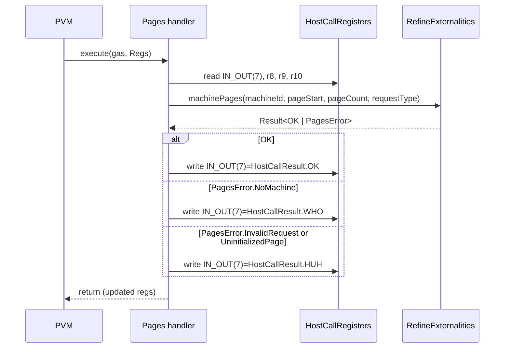

# Pages(11) from GP 0.6.7

## Pull Request by @DrEverr

resolves: #541 
added:
- pages host-call
- tests for pages host-call

## Comment by @coderabbitai[bot]

<!-- This is an auto-generated comment: summarize by coderabbit.ai -->
<!-- This is an auto-generated comment: skip review by coderabbit.ai -->

> [!IMPORTANT]
> ## Review skipped
> 
> Auto incremental reviews are disabled on this repository.
> 
> Please check the settings in the CodeRabbit UI or the `.coderabbit.yaml` file in this repository. To trigger a single review, invoke the `@coderabbitai review` command.
> 
> You can disable this status message by setting the `reviews.review_status` to `false` in the CodeRabbit configuration file.

<!-- end of auto-generated comment: skip review by coderabbit.ai -->
<!-- walkthrough_start -->

📝 Walkthrough

<!-- This is an auto-generated comment: release notes by coderabbit.ai -->

## Summary by CodeRabbit

- New Features
  - Introduced a Pages host call to manage memory page access and optional zeroing, available on versions >= 0.6.7.
  - Added a new operation to request page changes and standardized result mapping for unknown machines, invalid requests, and uninitialized pages.
  - Exposed a new error type for page operations to improve error clarity.

- Tests
  - Added comprehensive test coverage for successful and error scenarios across memory modes and edge cases.

<!-- end of auto-generated comment: release notes by coderabbit.ai -->
## Walkthrough
Adds a Pages (11) host-call implementation and tests. Introduces PagesError enum and a new RefineExternalities.machinePages API. Updates the test harness to simulate machinePages via a MultiMap. Adds a refine Pages class that maps machinePages results to HostCallResult codes, with version gating for GpVersion ≥ 0.6.7.

## Changes
| Cohort / File(s) | Summary |
| --- | --- |
| **Externalities API** `packages/jam/jam-host-calls/externalities/refine-externalities.ts` | Adds exported enum PagesError and RefineExternalities.machinePages(machineIndex, pageStart, pageCount, requestType): Promise<Result<OK, PagesError>>. |
| **Externalities Test Harness** `packages/jam/jam-host-calls/externalities/refine-externalities/refine-externalities.test.ts` | Exports PagesError type; adds machinePagesData MultiMap(arity 4) and machinePages method to TestRefineExt for deterministic test responses. |
| **Host-call Implementation** `packages/jam/jam-host-calls/refine/pages.ts` | New Pages class (HostCallHandler) reads registers, invokes refine.machinePages, and writes HostCallResult based on PagesError; index=11 for GpVersion ≥ 0.6.7; gasCost=10. |
| **Host-call Tests** `packages/jam/jam-host-calls/refine/pages.test.ts` | New tests for Pages host-call covering OK and error scenarios; uses helpers to prepare registers/memory and preload machinePagesData; gated for GpVersion ≥ 0.6.7. |

## Sequence Diagram(s)

## Estimated code review effort
🎯 3 (Moderate) | ⏱️ ~20 minutes

## Poem
> I hop through pages, one to four,  
> Set bits to read, or zero the floor.  
> If WHO or HUH, I thump and pause—  
> New enums guide my fluffy paws.  
> Version checked, gas kept light—  
> MachinePages done, results write bright. 🐇✨

<!-- walkthrough_end -->
<!-- internal state start -->

<!-- DwQgtGAEAqAWCWBnSTIEMB26CuAXA9mAOYCmGJATmriQCaQDG+Ats2bgFyQAOFk+AIwBWJBrngA3EsgEBPRvlqU0AgfFwA6NPEgQAfACgjoCEYDEZyAAUASpETZWaCrKPR1AGxJcraUogAKAEYggEpIADMKFkgAcStIAAYNADYNAHZISAMAVURKLgARCgBRKQo+bIA5RwECyABWABYGrNybABkuWFxcbkQOAHpBonVYbAENJmZBgDEPbAiI2Q6VREHcWW4SOorZQe5sDw9B5oajQukGCnhucXwMDgMoG2l8DylkJAcSSDNmoIaZ6QACCtCUtCeWSg3D80kgsHwiFwYAYaGOBmhkBoyOQEXwfFh/gRSJRaIxBgskAA8sJROJPpFosxIB54BgANZ0FCIH6IIwASV52F+/yaQUggBQCSAC5jcLxsDC4SAAA18xOCYRVJORqPRHiMUFl8pIiuVuFgvzVcOQmtC2sRuvJHnQyEQ2wY8Ai8G57OxlsgFBIEUoZAY3NiVC2aG2FG6vX6QxGUdhsY0EQWS1kHjWGiUEkGZkGQQYAE50qWGAJBgBmJqllKJABMdYbzYA/BIALzJdIaILAkoYBxB/2/R1k/WQOqwNASeAEhQYfEUZjIAhj+wer3wNH3LBszm+rAW37fEVA55gQwGExQMj0fARHAEYhkZQ0ejTM1cXj8OliJI8JyAoShUKo6haDo+i3uAUBwKgqCYC+hCkOQVCfgorDsFwVAAO72I4zDOPIIFMGBKhqJo2i6NeRiwaYBiwgwHI2oMQhoDMHHMGAE56sc6wkAAHjQFAYOi6g+usQbeuQYDCaJ4lsuI0gaDimi4AMBgAES6ZSlgggKb7odQ3IOE4Lj8M+DCzhg/iGtYExsgwoJWAKXBoOC3LqtIJQVIuaDIMhwncASmGbNsTIxKegbBuyJDySJlBKZJ8LMIoRy/Jg9DyrUvrKuyG7qba8BymFkAYPgBHsgwCxKOuWy/D5iB+dEFChECUBWE5u6QLQ1BoIMM5zgucYoEq0S0Ng4b0GgFUkAR+CxtQC5YMRNnxc1kSLjFryySQJRJWJEkqV8SqUBEaDhgANLFGb0tyIFzeQBGHAIzl9QN9gEKO2WQGwFqKPwJ4BtA0i4Ht8WHea4MIs45C8p1MCw7OYnSMgNmYP4HlefQ60IOQzWFANXAALJHOIpMxsAvhUADlCIMAYPIpD5DQwA2tp+ObTa2kALp6LdrwOB4uDANSADSt3Na1BJ6Ho42SRJABe3J4WM6A3JskBNNi+DfQSvwhQ99BBiLmnbXw3OEza40SPge6rYgSNVAt/0kIDkL/VdBMkM1ATWyQAoYEoQm3USJAAMq4M4uDh3CADC+DYEqt1BgAjiKyLQI14TXtYzJICQwDCxT4tS9YNqyxQ8v+tQrL4PgHLINg3CbmbFPjd7G02/4xMx+gIf+tEeHIA8kAp8bYjcs6iAANz8KeFDq/ksW4NgYnrgGyKG/QEjoheMAIMgzDwP5FDIMJSDiHZ3e+wAavg8C0Ftgx3/FABalD4FtsK9MlQUh7YHyMgGW59XSbkoG1bEjUka0nyBQfe70jZLHpFwYqjBkKIFKkcUyg894SX6jQd+vdgIkFnPORcZEHjeiIBvdkRASF+xtP3Oaf12T2w5AwphzVboSSIBgbh6sLSblbkQ7kb0PogjcpecwBlRYfidnrTcSharOBWg8Mez4QphW5IuSRvV2CpX5MCbq71DFCVChQZUnkIToMapXfw1cu7pSml4HgV1WL+HYpxHxPE+Kz0GApZKJ0pKDBkvFRKilQmqSEPyLqPUXLSIFIwWypAuCBy2gDREs1cbKMKhdK6vxWYHSOilU6mJdCQEjvAAR1AN7eB4TaAOPt4rB1DmTVp5ABS0HjqQaOscuA5BSE0PpJAk4p04JAYZozYqZ3BjnbYQyRmhB8IXfIJdpBl0ltLKu595bAmZsqNRvI+qiBzBhJRYjTL0ACDo6xM8cynKOSU6GXcIlyWCcdZSUk1LgzUogUIlSoCu1eokng0RYybAyV05hfcSaQHJqLeAVNuA03UfTC+TNwavJEpzTJvMBZCy2aLcuuynH7IVgEdkSs2Sq3oMI2A80CJIspjGAITRQhAqxKCng4LsmKBhT3OF0gWnCvacJTp4rekeP6THaxyzZkRwmUqRVacSDzOzo1RVqyC4sCLps82ZLHG+UpZARl05yEjR2vrEMuAbJRRZAS+FA8/oWhHsDCe5BLEm0wQJW6JAPCryDOvMSm4d5BgIQsEgRgSjIlKjc0CvwgzzjdsGFcUzSZ0HgI4HSekrxgCMMxLx0g/F+N4qSfiQagllJidJOKnza0/NUppJ4ultL6VBEZNCH4zJERIlZVJWNpAOTBBCdAzLID3MwmQRwJqWrgItfvG4mALZVHwFTYVt1g77zZLQV4mq474OmYIwR4gVZ0B8sooMvBpDsCneApgIdJKaMtu7dKlkI78GWvuZ2wJg64EmtNbkz03YGKSW5T1uLonNoGE0/wYrfYSqElKpDMqI4DIVdMkZYyVVTJmeqw9izGkzN1VYdZxdS6kp2fO6u8sF7qB5GcxA1x4B1FmsgQAOAQJzSVlBg4ZTkbmyoMRcqtoibl3SKQdbAP2yEALgEx6Q0b2HIPGkEtPUOH4+jfgfA5pgOgePS68AFhBiRnAX4L14NpQ9jkieIDNwvQ8PIJQ+16D6Z2g4wKKALZQMXMu+Aq6A2WOytwmKyS30RzAF4KQLoZMEnkMRcSpAzQaEgOuoddl4QbivvG2+vm+ARXhIufAS93ae0QHw7BShHWblsS+rAT5/SoEs+Fv6+Wp0YEcLIztIIFGXNfUVAMqiLkaJU416dejCTgqMRUwcnWWS2LoD4PZ0C/QqmLWxbi5aAn6kEk24x4SG0JS+eU35mkVTAizZ7dAuMuAqmdaKwOyHUNtPQ3CTD+GcOyvGcnVV2HZkZyzrgYjOq1n6o2VRsWNH3M13ltqP0BSKCXXDKqaDITYPw6wOtzxm3fHcQrU6XbNaYMHY+cd/bp0AUXYMHG8QxFMLkWTSQVNBF01hTJtm3N7bDSMQ294rb+OdsCUO/tA4No/nIgBW2vSVJDLGV7fQcyxFLKNcxplkxAGgMCYnZZlOjH1KRGM78Fcm5BeVtnndeKHiLS3XxAwYB3Dx4xS2kLl0w1KEUFS2O5AloPCxgnuIWDyjAr5GYMg7EsNvQiQaYAxXOCczEInH62Lpp4uHdGMiSg31TJ8KHurM2E6DeowRkFaIKd6DO9tics6NAiAYTVhrF5R3oapfMxH3EmtfjlGwQ8YgiaNwUBTsDJz5rLRYFiNwe+DNVpMfrl4QKypkhpD7JACWJB5C+9jGdWq2AlBPBhDe5wJBXhEEQCCEOWbZOIde2Mj7uHftHsBws3OXABDYGM7QZAAAJUkCd9Qn+vgZnNQ1kDkGAQXnHDDF1IA8Tpg9iAL+jmkv3i3GmREwHDCRlvVhCDCOQCA7lFluiezezlVjnv0mUIyB2I11WuBIFMiCnnRQJjgwBRwEF+wr31jmib32mhlunyAtntwqHvXAN3F+AFEKFuifXKAtnZEOAtg3AIwhUDXwE8mQDJw0Ae0QFYWAJERiinkwjwOVBYzIGcAXFz1Ng9mUy3l+AN1ji9CugtgCAjgq1igz1EicLixcHVX2g6jcADANwcHUF+E4x/2RD/wEmW38AU2EkoE9Hs2YApluHcUMPEhuCRGnHkA4Sbm4UcI0CiPtxoACCIECnVRcIZnCAQN5EoBvkYRin0INkjXeRIBKL4EyACBsBKEjhyA6GgAAH02jYhwgNVsB0RkBJN4QogYhgjcBQiPBIdUtI5wxkiFxt86pvBgRJZ+A8Bph4QLVH5n5314tiVPIwAHgR93D5BWjqRQhTDIBXgji8ItZfgzjIBWiAB1K48aHfWgbhFgkRMTfAOgMAJ4tEezP6W9cA0baTVPFwJGZxP+WAFQ8wsSbhF4r/akUfMgTcQOJjFODkSqPCDAa4r/HIL/N9DhQhOZIHGBbYJwxwvWfWDwKqMZdcRuVkZwaAgIXAPCfWfzVdQFa4vXM9ALOlCRW2DkrkyAHkpUQFS8XrF0DBXdZ+PBGKQQcE8PWo+cOaIMJo52UgXAVo9ozonovosowo9kZESASY6YyHCUg+aQW6B3W+OaKPbkQojGB/LPBApcVApUG4g0ro3okoWIcaUOVvXw2Gfw4hIMNkIrEGJqKvJ5PEZkSADQKA2JWPC03/f/ElZUcYlkDQFM/Q52OJbrWXPrUbZklRc5dRX9QdCbR8KbcxFyGbKSBydLOsg4cFYbaspRVxHcOgS8WnBNBnRQJnFnKdJYdnRFTnZgPNDtAtItHHfnPHTiAnScYXMnVM52VtWcnrbtd8evRXftFXayXjExI0CaDKbXUDAib0dxC0euWxOgraavFAOUBUIxW+S0/UL/bKLwArfWMnSAM3QnASVLAUZURLW4XBHEfYz9W2ECXgqo9ALTU5G4IgHodMpafcfUeQP47hIhNAUM34F81ALAziOAm4elNIidNHb5YxBgtArKIeHREEnUNcl0RHZHLvALKdISUQPAEgS8KAJAlwMAL9UPVdXcUvX4WgB2RwdgY8CdWSlyb8HCYFSAXY+gLsJILgP46zWTe0jAIMTyFQLwdSr+aIW4rSyAIIXS7+fSg42KI4k41wLECy/AF4h4yAbSpsOy6IByjwpy2gMAe4gI9Sqy7yyAGsX8M2SgKQWC2QdVZyjAJzdSzygIyKpoGKu9RBR4qExKoKkKh49S6kJeFeRpWSiqErAmIgcK4MUMJgqw9gvqOSs0CEnIToJjGqFY2gByJOUcd3UaLuXIgSqEKpKyk+WFZDGrLUwAvgAUKobo6kHII0wM549Id4jDeVHMpM2azPPgAADlIJ9NzOcLmsgFLGuKfy1UilOr2tEhssSHUumIRP2jUNhX9iexDmElv22uOsf0GOf22G5SqQFGfFqKQGpA5FulCpgq/OOFmPWI3AWqWpWoDKDL+iU03nUrBofVW1ARWwJA0HXU3V9hhoeO/0zIRuzI0BROpBxu0XAVQBhw0B3UIQPUpMXBZpyFPVpXgHpR8nJoCMppCKzPNg0CJK/3UtmACgwHkGqqz3y0qwQQthTmMsxnDw1NdBVtdnKAcinwvlWjADQDwiPzYqrWDMlXUvZFDiY14OURCDfW7yUT0G0vvkSG6JSG6PSFugVuXiLl0AHCxFdKTnNNQCCESGeMQGImOFiEChBqgH4KDCVEjjiuEJ6SYwTg6raKqB6MjhKBsHvgFAThKG6NEIckuG2G+qYPSIwBEEAnHi1qfWREHzEAJAcJuH3kjJoNkpSvkDJy4FotO2kCBWBATgTKi2Z0DTKxMtdSHlKisQtjNvz25A3ERzsK0KZRO3RCpOkC4Hho8B/JDj/O3QPoAP2qcKsAkGYEOn4v3FukA1kBBEQAPuQ1ujjsQDw0oAfpcGfsjhjo8A/vJVNTamJS4IpyklujPuzNuizpsBzrzoLqLpLrLsKAcmpHKCnCfUA3eEiAZOqjoJbu0HQtwBXFNooDxhjG4G4TuqO3euFS2kLOUWgfNiTWQAtRCmckY3a1sloEPEYQECoCYMtD/XolLNEnLOURii7P6zG20UsV0XrL5UbI63EFmygHHpDxuzsXoL9FvN+D51LQFxXNd3rVF2yM0nUsuDUVka4GnUYATN0bfNNHYBFqmO/N/MoAcnIyWkqPkEWy9htuEisarNsctqEkiqTjlBWjUGUlkA0CQEjBoNEmpFKEznRACAnwNp7wwA0Hds9u9vCHbGxF/pfqpo8GQztEgHQVKdfu+qEgCDADCDnm8chT8e0aW0gBDtJBCZsdGy4G6fNO0sfr/oAY/uCESFCBadMTaesX8du0YA3mTtwFTsQXTt6qxGsZG33C4CTvYFWYgKDmsrgYQe6PzsLuLtLtEOmY0c0UA2mh+g6a9n9l4EkDwWMt7pHwHpuObwgZHt6e2dWl2budbp+g7ree7s8hcst3IEHt+ZJ1OnCAAG8ABfByK7WzAJuxvivImNTZ0J/p10WQJg3iu+kgAIbo10rgD+r+igYouDAUaB7UsjCjGma+2+vImfAAHy9Rc3iloAVlRdjXjXpxnhHNijHLZywyzS+K53zRggYnvCHkazQDwFQn3MTVUr+3wkIgslInkEZ3AioiglokMDvCwlPlwG6OfkQG6JTR9DwjoG6NQOsVNeMDgkiHSAYESBIAOqaCbCbHSFoBrAiHSAaBbDoCCAOoiAEFoAEAYHFDqBLAEAjZrFLFLDmgVfNe/HUGtc/zteZwdadYfDdfNeYAYG4G6OwYUmde2rdYMBVEbYMCRcqW0nIdPVP20i4HZj5gMDRcbepzLYrarYeBoBEm6JLf0CAA -->

<!-- internal state end -->
<!-- tips_start -->

---

🪧 Tips

### Chat

There are 3 ways to chat with [CodeRabbit](https://coderabbit.ai?utm_source=oss&utm_medium=github&utm_campaign=FluffyLabs/typeberry&utm_content=545):

- Review comments: Directly reply to a review comment made by CodeRabbit. Example:
  - `I pushed a fix in commit <commit_id>, please review it.`
  - `Open a follow-up GitHub issue for this discussion.`
- Files and specific lines of code (under the "Files changed" tab): Tag `@coderabbitai` in a new review comment at the desired location with your query.
- PR comments: Tag `@coderabbitai` in a new PR comment to ask questions about the PR branch. For the best results, please provide a very specific query, as very limited context is provided in this mode. Examples:
  - `@coderabbitai gather interesting stats about this repository and render them as a table. Additionally, render a pie chart showing the language distribution in the codebase.`
  - `@coderabbitai read the files in the src/scheduler package and generate a class diagram using mermaid and a README in the markdown format.`

### Support

Need help? Create a ticket on our [support page](https://www.coderabbit.ai/contact-us/support) for assistance with any issues or questions.

### CodeRabbit Commands (Invoked using PR/Issue comments)

Type `@coderabbitai help` to get the list of available commands.

### Other keywords and placeholders

- Add `@coderabbitai ignore` anywhere in the PR description to prevent this PR from being reviewed.
- Add `@coderabbitai summary` to generate the high-level summary at a specific location in the PR description.
- Add `@coderabbitai` anywhere in the PR title to generate the title automatically.

### Status, Documentation and Community

- Visit our [Status Page](https://status.coderabbit.ai) to check the current availability of CodeRabbit.
- Visit our [Documentation](https://docs.coderabbit.ai) for detailed information on how to use CodeRabbit.
- Join our [Discord Community](http://discord.gg/coderabbit) to get help, request features, and share feedback.
- Follow us on [X/Twitter](https://twitter.com/coderabbitai) for updates and announcements.

<!-- tips_end -->

## Comment by @github-actions[bot]

View all

| File | Benchmark | Ops |  |
|------|-----------|-----|--|
| [bytes/hex-to.ts[0]](../blob/d3861943595c6dc2677022d376cc3abffed8f334//_work/typeberry-1/typeberry/typeberry/benchmarks/bytes/hex-to.ts) | number toString + padding | 326954.51 ±0.22% | fastest ✅ |
| [bytes/hex-to.ts[1]](../blob/d3861943595c6dc2677022d376cc3abffed8f334//_work/typeberry-1/typeberry/typeberry/benchmarks/bytes/hex-to.ts) | manual | 16324.61 ±0.34% | 95.01% slower |
| [logger/index.ts[0]](../blob/d3861943595c6dc2677022d376cc3abffed8f334//_work/typeberry-1/typeberry/typeberry/benchmarks/logger/index.ts) | console.log with string concat | 6971333.64 ±55.32% | fastest ✅ |
| [logger/index.ts[1]](../blob/d3861943595c6dc2677022d376cc3abffed8f334//_work/typeberry-1/typeberry/typeberry/benchmarks/logger/index.ts) | console.log with args | 1114988.12 ±96.12% | 84.01% slower |
| [math/add_one_overflow.ts[0]](../blob/d3861943595c6dc2677022d376cc3abffed8f334//_work/typeberry-1/typeberry/typeberry/benchmarks/math/add_one_overflow.ts) | add and take modulus | 194247231.56 ±36.56% | 26.99% slower |
| [math/add_one_overflow.ts[1]](../blob/d3861943595c6dc2677022d376cc3abffed8f334//_work/typeberry-1/typeberry/typeberry/benchmarks/math/add_one_overflow.ts) | condition before calculation | 266065274.73 ±5.23% | fastest ✅ |
| [math/count-bits-u32.ts[0]](../blob/d3861943595c6dc2677022d376cc3abffed8f334//_work/typeberry-1/typeberry/typeberry/benchmarks/math/count-bits-u32.ts) | standard method | 102060674.35 ±1.99% | 57.85% slower |
| [math/count-bits-u32.ts[1]](../blob/d3861943595c6dc2677022d376cc3abffed8f334//_work/typeberry-1/typeberry/typeberry/benchmarks/math/count-bits-u32.ts) | magic | 242127947.99 ±6.41% | fastest ✅ |
| [math/count-bits-u64.ts[0]](../blob/d3861943595c6dc2677022d376cc3abffed8f334//_work/typeberry-1/typeberry/typeberry/benchmarks/math/count-bits-u64.ts) | standard method | 4937051.37 ±1.05% | 94.55% slower |
| [math/count-bits-u64.ts[1]](../blob/d3861943595c6dc2677022d376cc3abffed8f334//_work/typeberry-1/typeberry/typeberry/benchmarks/math/count-bits-u64.ts) | magic | 90632678.04 ±1.33% | fastest ✅ |
| [math/mul_overflow.ts[0]](../blob/d3861943595c6dc2677022d376cc3abffed8f334//_work/typeberry-1/typeberry/typeberry/benchmarks/math/mul_overflow.ts) | multiply and bring back to u32 | 262723305.25 ±5.75% | fastest ✅ |
| [math/mul_overflow.ts[1]](../blob/d3861943595c6dc2677022d376cc3abffed8f334//_work/typeberry-1/typeberry/typeberry/benchmarks/math/mul_overflow.ts) | multiply and take modulus | 260703949.19 ±5.45% | 0.77% slower |
| [math/switch.ts[0]](../blob/d3861943595c6dc2677022d376cc3abffed8f334//_work/typeberry-1/typeberry/typeberry/benchmarks/math/switch.ts) | switch | 267399353.99 ±4.96% | fastest ✅ |
| [math/switch.ts[1]](../blob/d3861943595c6dc2677022d376cc3abffed8f334//_work/typeberry-1/typeberry/typeberry/benchmarks/math/switch.ts) | if | 261183645.56 ±5.75% | 2.32% slower |
| [collections/map-set.ts[0]](../blob/d3861943595c6dc2677022d376cc3abffed8f334//_work/typeberry-1/typeberry/typeberry/benchmarks/collections/map-set.ts) | 2 gets + conditional set | 119258.25 ±0.35% | fastest ✅ |
| [collections/map-set.ts[1]](../blob/d3861943595c6dc2677022d376cc3abffed8f334//_work/typeberry-1/typeberry/typeberry/benchmarks/collections/map-set.ts) | 1 get 1 set | 60708.39 ±0.23% | 49.1% slower |
| [codec/bigint.decode.ts[0]](../blob/d3861943595c6dc2677022d376cc3abffed8f334//_work/typeberry-1/typeberry/typeberry/benchmarks/codec/bigint.decode.ts) | decode custom | 166519250.45 ±2.56% | fastest ✅ |
| [codec/bigint.decode.ts[1]](../blob/d3861943595c6dc2677022d376cc3abffed8f334//_work/typeberry-1/typeberry/typeberry/benchmarks/codec/bigint.decode.ts) | decode bigint | 67505777.36 ±2.27% | 59.46% slower |
| [codec/encoding.ts[0]](../blob/d3861943595c6dc2677022d376cc3abffed8f334//_work/typeberry-1/typeberry/typeberry/benchmarks/codec/encoding.ts) | manual encode | 2460990.98 ±2.01% | 21.15% slower |
| [codec/encoding.ts[1]](../blob/d3861943595c6dc2677022d376cc3abffed8f334//_work/typeberry-1/typeberry/typeberry/benchmarks/codec/encoding.ts) | int32array encode | 3120984.33 ±0.31% | fastest ✅ |
| [codec/encoding.ts[2]](../blob/d3861943595c6dc2677022d376cc3abffed8f334//_work/typeberry-1/typeberry/typeberry/benchmarks/codec/encoding.ts) | dataview encode | 3102610.61 ±0.29% | 0.59% slower |
| [hash/index.ts[0]](../blob/d3861943595c6dc2677022d376cc3abffed8f334//_work/typeberry-1/typeberry/typeberry/benchmarks/hash/index.ts) | hash with numeric representation | 193.09 ±0.28% | 27.51% slower |
| [hash/index.ts[1]](../blob/d3861943595c6dc2677022d376cc3abffed8f334//_work/typeberry-1/typeberry/typeberry/benchmarks/hash/index.ts) | hash with string representation | 114.78 ±0.4% | 56.91% slower |
| [hash/index.ts[2]](../blob/d3861943595c6dc2677022d376cc3abffed8f334//_work/typeberry-1/typeberry/typeberry/benchmarks/hash/index.ts) | hash with symbol representation | 178.13 ±0.62% | 33.12% slower |
| [hash/index.ts[3]](../blob/d3861943595c6dc2677022d376cc3abffed8f334//_work/typeberry-1/typeberry/typeberry/benchmarks/hash/index.ts) | hash with uint8 representation | 163.77 ±0.41% | 38.52% slower |
| [hash/index.ts[4]](../blob/d3861943595c6dc2677022d376cc3abffed8f334//_work/typeberry-1/typeberry/typeberry/benchmarks/hash/index.ts) | hash with packed representation | 266.36 ±0.26% | fastest ✅ |
| [hash/index.ts[5]](../blob/d3861943595c6dc2677022d376cc3abffed8f334//_work/typeberry-1/typeberry/typeberry/benchmarks/hash/index.ts) | hash with bigint representation | 183.96 ±1.34% | 30.94% slower |
| [hash/index.ts[6]](../blob/d3861943595c6dc2677022d376cc3abffed8f334//_work/typeberry-1/typeberry/typeberry/benchmarks/hash/index.ts) | hash with uint32 representation | 203.63 ±0.27% | 23.55% slower |
| [bytes/hex-from.ts[0]](../blob/d3861943595c6dc2677022d376cc3abffed8f334//_work/typeberry-1/typeberry/typeberry/benchmarks/bytes/hex-from.ts) | parse hex using `Number` with NaN checking | 124087.75 ±2.01% | 79.36% slower |
| [bytes/hex-from.ts[1]](../blob/d3861943595c6dc2677022d376cc3abffed8f334//_work/typeberry-1/typeberry/typeberry/benchmarks/bytes/hex-from.ts) | parse hex from char codes | 601280.18 ±1.03% | fastest ✅ |
| [bytes/hex-from.ts[2]](../blob/d3861943595c6dc2677022d376cc3abffed8f334//_work/typeberry-1/typeberry/typeberry/benchmarks/bytes/hex-from.ts) | parse hex from string nibbles | 471432.92 ±2.09% | 21.6% slower |
| [codec/bigint.compare.ts[0]](../blob/d3861943595c6dc2677022d376cc3abffed8f334//_work/typeberry-1/typeberry/typeberry/benchmarks/codec/bigint.compare.ts) | compare custom | 259371693.64 ±7.38% | 0.37% slower |
| [codec/bigint.compare.ts[1]](../blob/d3861943595c6dc2677022d376cc3abffed8f334//_work/typeberry-1/typeberry/typeberry/benchmarks/codec/bigint.compare.ts) | compare bigint | 260338234.32 ±6.25% | fastest ✅ |
| [codec/decoding.ts[0]](../blob/d3861943595c6dc2677022d376cc3abffed8f334//_work/typeberry-1/typeberry/typeberry/benchmarks/codec/decoding.ts) | manual decode | 15563968.06 ±3.14% | 91.93% slower |
| [codec/decoding.ts[1]](../blob/d3861943595c6dc2677022d376cc3abffed8f334//_work/typeberry-1/typeberry/typeberry/benchmarks/codec/decoding.ts) | int32array decode | 188135459.31 ±4.81% | 2.47% slower |
| [codec/decoding.ts[2]](../blob/d3861943595c6dc2677022d376cc3abffed8f334//_work/typeberry-1/typeberry/typeberry/benchmarks/codec/decoding.ts) | dataview decode | 192899277.03 ±4.61% | fastest ✅ |
| [hash/blake2b.ts[0]](../blob/d3861943595c6dc2677022d376cc3abffed8f334//_work/typeberry-1/typeberry/typeberry/benchmarks/hash/blake2b.ts) | hasher with simple allocator | 0.045 ±0.69% | 0.66% slower |
| [hash/blake2b.ts[1]](../blob/d3861943595c6dc2677022d376cc3abffed8f334//_work/typeberry-1/typeberry/typeberry/benchmarks/hash/blake2b.ts) | hasher with page allocator | 0.0453 ±1.41% | fastest ✅ |
| [bytes/compare.ts[0]](../blob/d3861943595c6dc2677022d376cc3abffed8f334//_work/typeberry-1/typeberry/typeberry/benchmarks/bytes/compare.ts) | Comparing Uint32 bytes | 19180.67 ±0.09% | 1.66% slower |
| [bytes/compare.ts[1]](../blob/d3861943595c6dc2677022d376cc3abffed8f334//_work/typeberry-1/typeberry/typeberry/benchmarks/bytes/compare.ts) | Comparing raw bytes | 19504.72 ±0.2% | fastest ✅ |
| [collections/map_vs_sorted.ts[0]](../blob/d3861943595c6dc2677022d376cc3abffed8f334//_work/typeberry-1/typeberry/typeberry/benchmarks/collections/map_vs_sorted.ts) | Map | 265116.05 ±0.04% | fastest ✅ |
| [collections/map_vs_sorted.ts[1]](../blob/d3861943595c6dc2677022d376cc3abffed8f334//_work/typeberry-1/typeberry/typeberry/benchmarks/collections/map_vs_sorted.ts) | Map-array | 103718.97 ±0.03% | 60.88% slower |
| [collections/map_vs_sorted.ts[2]](../blob/d3861943595c6dc2677022d376cc3abffed8f334//_work/typeberry-1/typeberry/typeberry/benchmarks/collections/map_vs_sorted.ts) | Array | 85014.7 ±2.06% | 67.93% slower |
| [collections/map_vs_sorted.ts[3]](../blob/d3861943595c6dc2677022d376cc3abffed8f334//_work/typeberry-1/typeberry/typeberry/benchmarks/collections/map_vs_sorted.ts) | SortedArray | 202213.68 ±0.25% | 23.73% slower |
| [codec/view_vs_object.ts[0]](../blob/d3861943595c6dc2677022d376cc3abffed8f334//_work/typeberry-1/typeberry/typeberry/benchmarks/codec/view_vs_object.ts) | Get the first field from Decoded | 452352.68 ±0.27% | fastest ✅ |
| [codec/view_vs_object.ts[1]](../blob/d3861943595c6dc2677022d376cc3abffed8f334//_work/typeberry-1/typeberry/typeberry/benchmarks/codec/view_vs_object.ts) | Get the first field from View | 104115.64 ±0.21% | 76.98% slower |
| [codec/view_vs_object.ts[2]](../blob/d3861943595c6dc2677022d376cc3abffed8f334//_work/typeberry-1/typeberry/typeberry/benchmarks/codec/view_vs_object.ts) | Get the first field as view from View | 104128.39 ±0.15% | 76.98% slower |
| [codec/view_vs_object.ts[3]](../blob/d3861943595c6dc2677022d376cc3abffed8f334//_work/typeberry-1/typeberry/typeberry/benchmarks/codec/view_vs_object.ts) | Get two fields from Decoded | 448496.59 ±0.27% | 0.85% slower |
| [codec/view_vs_object.ts[4]](../blob/d3861943595c6dc2677022d376cc3abffed8f334//_work/typeberry-1/typeberry/typeberry/benchmarks/codec/view_vs_object.ts) | Get two fields from View | 82374 ±0.09% | 81.79% slower |
| [codec/view_vs_object.ts[5]](../blob/d3861943595c6dc2677022d376cc3abffed8f334//_work/typeberry-1/typeberry/typeberry/benchmarks/codec/view_vs_object.ts) | Get two fields from materialized from View | 170736.8 ±0.16% | 62.26% slower |
| [codec/view_vs_object.ts[6]](../blob/d3861943595c6dc2677022d376cc3abffed8f334//_work/typeberry-1/typeberry/typeberry/benchmarks/codec/view_vs_object.ts) | Get two fields as views from View | 82338.07 ±0.09% | 81.8% slower |
| [codec/view_vs_object.ts[7]](../blob/d3861943595c6dc2677022d376cc3abffed8f334//_work/typeberry-1/typeberry/typeberry/benchmarks/codec/view_vs_object.ts) | Get only third field from Decoded | 447837.28 ±0.27% | 1% slower |
| [codec/view_vs_object.ts[8]](../blob/d3861943595c6dc2677022d376cc3abffed8f334//_work/typeberry-1/typeberry/typeberry/benchmarks/codec/view_vs_object.ts) | Get only third field from View | 102568.06 ±0.12% | 77.33% slower |
| [codec/view_vs_object.ts[9]](../blob/d3861943595c6dc2677022d376cc3abffed8f334//_work/typeberry-1/typeberry/typeberry/benchmarks/codec/view_vs_object.ts) | Get only third field as view from View | 102388.33 ±0.17% | 77.37% slower |
| [codec/view_vs_collection.ts[0]](../blob/d3861943595c6dc2677022d376cc3abffed8f334//_work/typeberry-1/typeberry/typeberry/benchmarks/codec/view_vs_collection.ts) | Get first element from Decoded | 27876.27 ±0.19% | 58.34% slower |
| [codec/view_vs_collection.ts[1]](../blob/d3861943595c6dc2677022d376cc3abffed8f334//_work/typeberry-1/typeberry/typeberry/benchmarks/codec/view_vs_collection.ts) | Get first element from View | 66909.3 ±0.2% | fastest ✅ |
| [codec/view_vs_collection.ts[2]](../blob/d3861943595c6dc2677022d376cc3abffed8f334//_work/typeberry-1/typeberry/typeberry/benchmarks/codec/view_vs_collection.ts) | Get 50th element from Decoded | 27908.33 ±0.26% | 58.29% slower |
| [codec/view_vs_collection.ts[3]](../blob/d3861943595c6dc2677022d376cc3abffed8f334//_work/typeberry-1/typeberry/typeberry/benchmarks/codec/view_vs_collection.ts) | Get 50th element from View | 37707.33 ±0.14% | 43.64% slower |
| [codec/view_vs_collection.ts[4]](../blob/d3861943595c6dc2677022d376cc3abffed8f334//_work/typeberry-1/typeberry/typeberry/benchmarks/codec/view_vs_collection.ts) | Get last element from Decoded | 27874.42 ±0.23% | 58.34% slower |
| [codec/view_vs_collection.ts[5]](../blob/d3861943595c6dc2677022d376cc3abffed8f334//_work/typeberry-1/typeberry/typeberry/benchmarks/codec/view_vs_collection.ts) | Get last element from View | 26707.21 ±0.29% | 60.08% slower |
| [crypto/ed25519.ts[0]](../blob/d3861943595c6dc2677022d376cc3abffed8f334//_work/typeberry-1/typeberry/typeberry/benchmarks/crypto/ed25519.ts) | native crypto | 5.36 ±18.76% | 81.98% slower |
| [crypto/ed25519.ts[1]](../blob/d3861943595c6dc2677022d376cc3abffed8f334//_work/typeberry-1/typeberry/typeberry/benchmarks/crypto/ed25519.ts) | wasm lib | 10.65 ±0.02% | 64.2% slower |
| [crypto/ed25519.ts[2]](../blob/d3861943595c6dc2677022d376cc3abffed8f334//_work/typeberry-1/typeberry/typeberry/benchmarks/crypto/ed25519.ts) | wasm lib batch | 29.75 ±0.63% | fastest ✅ |

### Benchmarks summary: 63/63 OK ✅

<!-- thollander/actions-comment-pull-request "benchmarks" -->

## Comment by @tomusdrw

This should be an `enum`

## Comment by @tomusdrw

This is a link to 0.7.1, yet the description says 0.6.7. I'm assuming that there are no changes in between, can you confirm?

## Comment by @tomusdrw

I'd suggest changing the request type to an `enum` and handling the invalid value `r > 4` internally within the host call implementation. In such case this error will just turn into `InvalidPage` (similar to how we handle that in `zero` or `void`).

## Comment by @DrEverr

Notice the error for `r > 4` is still after `WHO` (`NoMachine`) error. Which means I cannot bypass this check. So it still needs to be passed to method and return an error. I can still make this two errors (InvalidRequest, UninitializedPage) merge to one, to somethink like `InvalidRequest`. Bcs returning just `InvalidPage` can be missleading. I still made an `enum` for easier programming/reading the code.

## Comment by @DrEverr

Yes, no changes. So I made the link pointed to newest.

## Comment by @DrEverr

made an enum

## Comment by @DrEverr

I left `InvalidRequest`, but renamed other error to `InvalidPage` and clarified comments for future use of this errors.

## Comment by @mateuszsikora

I think it should contain only valid values. I would add `isValidMemoryOperation` function that checks if the value is in `[0-4]` range and convert it using `tryAsMemoryOperation`. In this way  `tryAsMemoryOperation` can use `ensure` instead of casting.

## Comment by @mateuszsikora

shouldn't it be `MemoryIndex` or `PageNumber` instead of `U64`?

## Comment by @mateuszsikora

shouldn't it be limited somehow? for sure we won't have more than `2 ** 32 / PAGE_SIZE` pages

## Comment by @tomusdrw

I agree.

## Comment by @tomusdrw

In many other host calls, to simplify them we've moved all of that kind of parsing to the externalities internally, since it's easier to handle them there (utility functions available).

## Comment by @tomusdrw

ditto

## Comment by @tomusdrw

@DrEverr can you address that? The parse function should just throw if it gets an invalid value (via `check`) and BEFORE calling the `tryAs*` function you create an if statement to filter out only valid values.

## Comment by @DrEverr

but I cannot bypass the NoMachine error, thats why I made Unknown. NoMachine > Wrong Request
https://graypaper.fluffylabs.dev/#/1c979cb/348503349d03?v=0.7.1

## Comment by @DrEverr

So I cannot handle it on HC level
