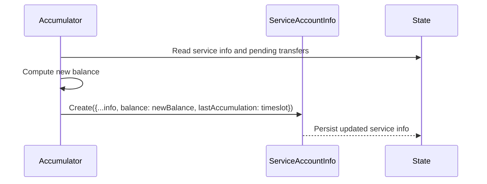

# Updating lastAccumulation

## Pull Request by @DrEverr

resolves: #509 
https://graypaper.fluffylabs.dev/#/7e6ff6a/185a03185a03?v=0.6.7


## Comment by @coderabbitai[bot]

<!-- This is an auto-generated comment: summarize by coderabbit.ai -->
<!-- This is an auto-generated comment: skip review by coderabbit.ai -->

> [!IMPORTANT]
> ## Review skipped
> 
> Auto incremental reviews are disabled on this repository.
> 
> Please check the settings in the CodeRabbit UI or the `.coderabbit.yaml` file in this repository. To trigger a single review, invoke the `@coderabbitai review` command.
> 
> You can disable this status message by setting the `reviews.review_status` to `false` in the CodeRabbit configuration file.

<!-- end of auto-generated comment: skip review by coderabbit.ai -->
<!-- walkthrough_start -->

<details>
<summary>📝 Walkthrough</summary>

<!-- This is an auto-generated comment: release notes by coderabbit.ai -->

## Summary by CodeRabbit

- New Features
  - Internally records the last accumulation time for service accounts, improving accuracy of state history and future diagnostics. No visible UI or behavioral changes.
- Documentation
  - Added a reference note to the deferred transfers logic for easier discoverability.
- Tests
  - Cleaned up an obsolete comment in accumulation tests.
- Chores
  - Enhanced service state tracking with accumulation timestamps while keeping existing workflows and APIs unchanged.

<!-- end of auto-generated comment: release notes by coderabbit.ai -->
## Walkthrough
The accumulation logic now sets lastAccumulation to the current timeslot when creating updated ServiceAccountInfo after processing transfers. Tests were minimally adjusted by removing a comment without changing behavior. No exported signatures or control flow were modified.

## Changes
| Cohort / File(s) | Summary |
|---|---|
| **Accumulation logic**<br>`packages/jam/transition/accumulate/deferred-transfers.ts` | Update ServiceAccountInfo creation to include lastAccumulation: timeslot alongside updated balance; add a documentation comment. No other logic changes. |
| **Tests**<br>`packages/jam/transition/accumulate/accumulate.test.ts` | Remove a comment line; no behavioral changes or test logic updates. |

## Sequence Diagram(s)


## Estimated code review effort
🎯 2 (Simple) | ⏱️ ~8 minutes

## Poem
> A whisk of code, a twitch of nose,  
> We stamp the time where balance grows.  
> LastAccumulation marked—so neat!  
> Footprints hop in tidy beat.  
> With carrots tall and tests at rest,  
> The ledger’s slot is now addressed. 🥕⏱️

</details>

<!-- walkthrough_end -->
<!-- internal state start -->


<!-- DwQgtGAEAqAWCWBnSTIEMB26CuAXA9mAOYCmGJATmriQCaQDG+Ats2bgFyQAOFk+AIwBWJBrngA3EsgEBPRvlqU0AgfFwA6NPEgQAfACgjoCEYDEZyAAUASpETZWaCrKNRo6gDYkuAVW601PAYRJCeaIi4AIIMDI7Y4eL4WJAGUL6IlFwAIhQAolIUfKlQAHKOAlmQAKwALABskCWQvjYAMlywuLjciBwA9P1E6rDYAhpMzP0AYp7YAGbzsm0qiP24stwklUWy/dwJnv11jc3Z0gwU8NxJGFxwqLaQFNL4nlLISA4kkGbVAAwATnQGHoL3mlDIDGkkFwsB+AHEqJs0Fs+JkxPBkuhcJAuj0+oMiMjuKjKBp5nNFrJwgJEBolBJ+mZ+gB2Ej1Rb1ND9ACMAA5qmh/gBmAVC0UAfgkAF5/hp6hpWRpzJYAPLCUTiD6QeYUFhhYIAazoKEQ30QbkgeQwDhesPhkAABuFIjE4swEkFkk7dfASJ56MFnQBlSgSeDQ934bAYXAASQw83wvtQ2AC1FNtGwVxCDp+aFi8USWKwvHw0PNsPwzxIlK1kAA7vCsGh7OHIz9GxEwhFcYWPV6aLQNE00pAAMI5l5x+y4TNcF1993F713GDwNghzz4XCpz4YdTwNCeeAAL1NBGduBcUUQHi3O9wAAp/gBKVNYGiRZCYeiZCgI2hRgXjXABuFBcU9SIUFtGg0HoSp21xK84QLMRsBPXsYIHVdblhTdpCfJsW3bQDO1/e1y0rTIRzHdIMxodAi09EtsR3YYGGrZDnVdaIWKHUtfVQx04iKdgCLYRBiObMh0DIoCflQXDWMzOjmiiWh6HwPh00CJjv1wZBnydUkGCNNBSDWIQ0CmG9MEQI9kn6FShxIFyBMSEgNEMnzECdN9uMKeAlnzSBKlgNAIx00dmhsEgIxIRseF3dhj08FBmDMoz+CwSJM1hKhbSc20QXoCQT3gfTSzCfBOMgEyzIsqz+hsqZ8pofoAMUvyAti8d4ohGdKy4J58V6AYhhGMYJhYGYqSWFY6XWTZtkoFx9kOfpakBEUysgWgkDic0avGwkprhGbJnmhZFtWFath2DaDk8I4dpFMxDsQY7HOSAB9CgACZgd5QF/jqapFXoyB4oAR2waRh3C2QuAAAQIaDaAoRsVTSMBDAMEwoDIbT5hwAhiDIZQkcmNg4y4Xh+E1TEdTkBQlCoVR1C0HR9EJ8B3AQT5f1bPBCFIcgqBplg6c4Z40GShwnBcZH2eULnNG0XR8aMfnTAMJrLOkVrbPWIrHNuDzBy8q28O83yjI4AwACJXYMCxICieNKcltT7EcZhnHkfAyYYSKQmkK14uYfApHoNtHJCbwFFYCTT3IHgXmhQ68z4ldVPw4M0MgRMAFkSBjlww3I4DLhIcDIAwGsKFjcQ2H4PgIqirEqAysPMCsgAaBQ431DLKXwZKXkD4JkGLxBbO83X3csKJPBoKXSznmti6UBhwk35JkBDyASAAD24HSkZ0ngxlPLi0vESPx1KGtz8vihh02gR7/seAiAwNQHMMIY6HXmP6EcRg8iRE3H7JgShayJWSnWZMn8uBtEni7N2eMwBGENi1NqZsHIlVtgXdySghovFoGAeytohr0kdlg52K9PbewltTU0StA4qxPv3COlpxyaVoMgPOnk1xcDbkRXc3Fi6khpPgBCJE5J1yCHmNs5BkrV0UtGVuiZkzoHmBvZi1tVGhFoYgehw8+HDDzHqA0WjOw6LjHo/AExQI0GfAAb0gBoXxwRkzDwECeTA0IuAaIAELBIwNCDQFU5g/AAL6BSvA4qMsQYzOKTK4lRHjvG+I0P4/AgSomhMbklSJ4RoneTiQjYeoiTG3AkYRaS0ikmjgeMgLOOlhFhVcmxL8zT5xZVggpTsc5MwqigImG8ihsCVnkrQCsjh2BrhTrLdAAhY4/GLucShdBoDm3oYwV0xl05Gm4kiNA8grBkgoG+SZkBX6MHDlZbiTBR5vF1DuZKN91o33DrQdORAILFxeDBE+xdzElVqvVZ8QTKnAS2RQCeyUw6iCNFYxQPxz5IBoFU556Lh5qlKH9aANgoilBDNMPIdhz6iDwDVUkcJh5/nGeIGBDBkBMFelqUsgVp7aFKrGaxdBcaqk9uvamW8ZGOj3gfNcx8ybvyvqaG+Bwf6RlPnGI8z8yg1hFdvP+ACgFgv4Eqi+KraDf1/o/f09IoEwMDtLBBLwkGn0WFfLg5dDqOCYW4HWetiagjNeTcWVMpamlpuwLgVBFYByDqreB6s1Ca15jrImaz1B/SqogAGCV/SNjoH9fKn9tYEwzbyAQ8wRTclqAIeo/IBS0F5CQQEQTAQMGqAIEUgJajzEBhyIErJ/j/AEI2wG9RGh80DZm3A2bhF5qQUWkmZaZ3MAYNwP67yaBnznSW3E06nRHoMJ4gwTRnbdgoIeEIiBnZcAANoAF0DAJIMEep0xgBaQHXZu7d5850rv0EAA=== -->

<!-- internal state end -->
<!-- tips_start -->

---


<details>
<summary>🪧 Tips</summary>

### Chat

There are 3 ways to chat with [CodeRabbit](https://coderabbit.ai?utm_source=oss&utm_medium=github&utm_campaign=FluffyLabs/typeberry&utm_content=546):

- Review comments: Directly reply to a review comment made by CodeRabbit. Example:
  - `I pushed a fix in commit <commit_id>, please review it.`
  - `Open a follow-up GitHub issue for this discussion.`
- Files and specific lines of code (under the "Files changed" tab): Tag `@coderabbitai` in a new review comment at the desired location with your query.
- PR comments: Tag `@coderabbitai` in a new PR comment to ask questions about the PR branch. For the best results, please provide a very specific query, as very limited context is provided in this mode. Examples:
  - `@coderabbitai gather interesting stats about this repository and render them as a table. Additionally, render a pie chart showing the language distribution in the codebase.`
  - `@coderabbitai read the files in the src/scheduler package and generate a class diagram using mermaid and a README in the markdown format.`

### Support

Need help? Create a ticket on our [support page](https://www.coderabbit.ai/contact-us/support) for assistance with any issues or questions.

### CodeRabbit Commands (Invoked using PR/Issue comments)

Type `@coderabbitai help` to get the list of available commands.

### Other keywords and placeholders

- Add `@coderabbitai ignore` anywhere in the PR description to prevent this PR from being reviewed.
- Add `@coderabbitai summary` to generate the high-level summary at a specific location in the PR description.
- Add `@coderabbitai` anywhere in the PR title to generate the title automatically.

### Status, Documentation and Community

- Visit our [Status Page](https://status.coderabbit.ai) to check the current availability of CodeRabbit.
- Visit our [Documentation](https://docs.coderabbit.ai) for detailed information on how to use CodeRabbit.
- Join our [Discord Community](http://discord.gg/coderabbit) to get help, request features, and share feedback.
- Follow us on [X/Twitter](https://twitter.com/coderabbitai) for updates and announcements.

</details>

<!-- tips_end -->


## Comment by @github-actions[bot]


<details>
<summary>View all</summary>

| File | Benchmark | Ops |  |
|------|-----------|-----|--|
| [collections/map-set.ts[0]](../blob/36ca765623ed354865e152295bf733d4eb37e579//_work/typeberry-runner-2/typeberry/typeberry/benchmarks/collections/map-set.ts) | 2 gets + conditional set | 69853.75 ±0.22% | fastest ✅ |
| [collections/map-set.ts[1]](../blob/36ca765623ed354865e152295bf733d4eb37e579//_work/typeberry-runner-2/typeberry/typeberry/benchmarks/collections/map-set.ts) | 1 get 1 set | 42724.29 ±0.07% | 38.84% slower |
| [math/mul_overflow.ts[0]](../blob/36ca765623ed354865e152295bf733d4eb37e579//_work/typeberry-runner-2/typeberry/typeberry/benchmarks/math/mul_overflow.ts) | multiply and bring back to u32 | 271744513.61 ±5.16% | fastest ✅ |
| [math/mul_overflow.ts[1]](../blob/36ca765623ed354865e152295bf733d4eb37e579//_work/typeberry-runner-2/typeberry/typeberry/benchmarks/math/mul_overflow.ts) | multiply and take modulus | 270030740.89 ±5.13% | 0.63% slower |
| [math/switch.ts[0]](../blob/36ca765623ed354865e152295bf733d4eb37e579//_work/typeberry-runner-2/typeberry/typeberry/benchmarks/math/switch.ts) | switch | 269357967.22 ±5.05% | fastest ✅ |
| [math/switch.ts[1]](../blob/36ca765623ed354865e152295bf733d4eb37e579//_work/typeberry-runner-2/typeberry/typeberry/benchmarks/math/switch.ts) | if | 264029527.78 ±7.22% | 1.98% slower |
| [math/count-bits-u32.ts[0]](../blob/36ca765623ed354865e152295bf733d4eb37e579//_work/typeberry-runner-2/typeberry/typeberry/benchmarks/math/count-bits-u32.ts) | standard method | 88609097.05 ±1.65% | 66.87% slower |
| [math/count-bits-u32.ts[1]](../blob/36ca765623ed354865e152295bf733d4eb37e579//_work/typeberry-runner-2/typeberry/typeberry/benchmarks/math/count-bits-u32.ts) | magic | 267452157.82 ±4.97% | fastest ✅ |
| [math/count-bits-u64.ts[0]](../blob/36ca765623ed354865e152295bf733d4eb37e579//_work/typeberry-runner-2/typeberry/typeberry/benchmarks/math/count-bits-u64.ts) | standard method | 9810518.59 ±0.58% | 89.99% slower |
| [math/count-bits-u64.ts[1]](../blob/36ca765623ed354865e152295bf733d4eb37e579//_work/typeberry-runner-2/typeberry/typeberry/benchmarks/math/count-bits-u64.ts) | magic | 97959546.7 ±1.02% | fastest ✅ |
| [hash/index.ts[0]](../blob/36ca765623ed354865e152295bf733d4eb37e579//_work/typeberry-runner-2/typeberry/typeberry/benchmarks/hash/index.ts) | hash with numeric representation | 189.45 ±0.7% | 27.21% slower |
| [hash/index.ts[1]](../blob/36ca765623ed354865e152295bf733d4eb37e579//_work/typeberry-runner-2/typeberry/typeberry/benchmarks/hash/index.ts) | hash with string representation | 111.46 ±0.18% | 57.18% slower |
| [hash/index.ts[2]](../blob/36ca765623ed354865e152295bf733d4eb37e579//_work/typeberry-runner-2/typeberry/typeberry/benchmarks/hash/index.ts) | hash with symbol representation | 179.39 ±0.23% | 31.08% slower |
| [hash/index.ts[3]](../blob/36ca765623ed354865e152295bf733d4eb37e579//_work/typeberry-runner-2/typeberry/typeberry/benchmarks/hash/index.ts) | hash with uint8 representation | 160.52 ±0.43% | 38.33% slower |
| [hash/index.ts[4]](../blob/36ca765623ed354865e152295bf733d4eb37e579//_work/typeberry-runner-2/typeberry/typeberry/benchmarks/hash/index.ts) | hash with packed representation | 260.27 ±0.44% | fastest ✅ |
| [hash/index.ts[5]](../blob/36ca765623ed354865e152295bf733d4eb37e579//_work/typeberry-runner-2/typeberry/typeberry/benchmarks/hash/index.ts) | hash with bigint representation | 184.27 ±0.48% | 29.2% slower |
| [hash/index.ts[6]](../blob/36ca765623ed354865e152295bf733d4eb37e579//_work/typeberry-runner-2/typeberry/typeberry/benchmarks/hash/index.ts) | hash with uint32 representation | 199.41 ±0.32% | 23.38% slower |
| [logger/index.ts[0]](../blob/36ca765623ed354865e152295bf733d4eb37e579//_work/typeberry-runner-2/typeberry/typeberry/benchmarks/logger/index.ts) | console.log with string concat | 6847253.64 ±56.14% | fastest ✅ |
| [logger/index.ts[1]](../blob/36ca765623ed354865e152295bf733d4eb37e579//_work/typeberry-runner-2/typeberry/typeberry/benchmarks/logger/index.ts) | console.log with args | 963691.49 ±96.38% | 85.93% slower |
| [math/add_one_overflow.ts[0]](../blob/36ca765623ed354865e152295bf733d4eb37e579//_work/typeberry-runner-2/typeberry/typeberry/benchmarks/math/add_one_overflow.ts) | add and take modulus | 190998161.01 ±41.28% | 30.09% slower |
| [math/add_one_overflow.ts[1]](../blob/36ca765623ed354865e152295bf733d4eb37e579//_work/typeberry-runner-2/typeberry/typeberry/benchmarks/math/add_one_overflow.ts) | condition before calculation | 273207613.82 ±6.45% | fastest ✅ |
| [codec/bigint.decode.ts[0]](../blob/36ca765623ed354865e152295bf733d4eb37e579//_work/typeberry-runner-2/typeberry/typeberry/benchmarks/codec/bigint.decode.ts) | decode custom | 221510716.25 ±3.9% | fastest ✅ |
| [codec/bigint.decode.ts[1]](../blob/36ca765623ed354865e152295bf733d4eb37e579//_work/typeberry-runner-2/typeberry/typeberry/benchmarks/codec/bigint.decode.ts) | decode bigint | 89055483.38 ±2.08% | 59.8% slower |
| [codec/decoding.ts[0]](../blob/36ca765623ed354865e152295bf733d4eb37e579//_work/typeberry-runner-2/typeberry/typeberry/benchmarks/codec/decoding.ts) | manual decode | 17162617.81 ±0.4% | 91.6% slower |
| [codec/decoding.ts[1]](../blob/36ca765623ed354865e152295bf733d4eb37e579//_work/typeberry-runner-2/typeberry/typeberry/benchmarks/codec/decoding.ts) | int32array decode | 204267607.39 ±3.93% | fastest ✅ |
| [codec/decoding.ts[2]](../blob/36ca765623ed354865e152295bf733d4eb37e579//_work/typeberry-runner-2/typeberry/typeberry/benchmarks/codec/decoding.ts) | dataview decode | 194343575.1 ±4.06% | 4.86% slower |
| [codec/encoding.ts[0]](../blob/36ca765623ed354865e152295bf733d4eb37e579//_work/typeberry-runner-2/typeberry/typeberry/benchmarks/codec/encoding.ts) | manual encode | 2220293.94 ±3.16% | 31.33% slower |
| [codec/encoding.ts[1]](../blob/36ca765623ed354865e152295bf733d4eb37e579//_work/typeberry-runner-2/typeberry/typeberry/benchmarks/codec/encoding.ts) | int32array encode | 3229262.02 ±0.32% | 0.12% slower |
| [codec/encoding.ts[2]](../blob/36ca765623ed354865e152295bf733d4eb37e579//_work/typeberry-runner-2/typeberry/typeberry/benchmarks/codec/encoding.ts) | dataview encode | 3233077.34 ±0.34% | fastest ✅ |
| [bytes/hex-to.ts[0]](../blob/36ca765623ed354865e152295bf733d4eb37e579//_work/typeberry-runner-2/typeberry/typeberry/benchmarks/bytes/hex-to.ts) | number toString + padding | 257501.57 ±0.29% | fastest ✅ |
| [bytes/hex-to.ts[1]](../blob/36ca765623ed354865e152295bf733d4eb37e579//_work/typeberry-runner-2/typeberry/typeberry/benchmarks/bytes/hex-to.ts) | manual | 14490.45 ±0.37% | 94.37% slower |
| [codec/bigint.compare.ts[0]](../blob/36ca765623ed354865e152295bf733d4eb37e579//_work/typeberry-runner-2/typeberry/typeberry/benchmarks/codec/bigint.compare.ts) | compare custom | 275642770.21 ±5.65% | fastest ✅ |
| [codec/bigint.compare.ts[1]](../blob/36ca765623ed354865e152295bf733d4eb37e579//_work/typeberry-runner-2/typeberry/typeberry/benchmarks/codec/bigint.compare.ts) | compare bigint | 269781148.82 ±6.22% | 2.13% slower |
| [bytes/hex-from.ts[0]](../blob/36ca765623ed354865e152295bf733d4eb37e579//_work/typeberry-runner-2/typeberry/typeberry/benchmarks/bytes/hex-from.ts) | parse hex using `Number` with NaN checking | 122045.9 ±0.26% | 83.59% slower |
| [bytes/hex-from.ts[1]](../blob/36ca765623ed354865e152295bf733d4eb37e579//_work/typeberry-runner-2/typeberry/typeberry/benchmarks/bytes/hex-from.ts) | parse hex from char codes | 743949.07 ±0.13% | fastest ✅ |
| [bytes/hex-from.ts[2]](../blob/36ca765623ed354865e152295bf733d4eb37e579//_work/typeberry-runner-2/typeberry/typeberry/benchmarks/bytes/hex-from.ts) | parse hex from string nibbles | 485541.54 ±0.35% | 34.73% slower |
| [codec/view_vs_collection.ts[0]](../blob/36ca765623ed354865e152295bf733d4eb37e579//_work/typeberry-runner-2/typeberry/typeberry/benchmarks/codec/view_vs_collection.ts) | Get first element from Decoded | 22334.87 ±3.82% | 58.85% slower |
| [codec/view_vs_collection.ts[1]](../blob/36ca765623ed354865e152295bf733d4eb37e579//_work/typeberry-runner-2/typeberry/typeberry/benchmarks/codec/view_vs_collection.ts) | Get first element from View | 54271.96 ±3.45% | fastest ✅ |
| [codec/view_vs_collection.ts[2]](../blob/36ca765623ed354865e152295bf733d4eb37e579//_work/typeberry-runner-2/typeberry/typeberry/benchmarks/codec/view_vs_collection.ts) | Get 50th element from Decoded | 27463.45 ±0.18% | 49.4% slower |
| [codec/view_vs_collection.ts[3]](../blob/36ca765623ed354865e152295bf733d4eb37e579//_work/typeberry-runner-2/typeberry/typeberry/benchmarks/codec/view_vs_collection.ts) | Get 50th element from View | 38410.76 ±0.11% | 29.23% slower |
| [codec/view_vs_collection.ts[4]](../blob/36ca765623ed354865e152295bf733d4eb37e579//_work/typeberry-runner-2/typeberry/typeberry/benchmarks/codec/view_vs_collection.ts) | Get last element from Decoded | 27414.86 ±0.29% | 49.49% slower |
| [codec/view_vs_collection.ts[5]](../blob/36ca765623ed354865e152295bf733d4eb37e579//_work/typeberry-runner-2/typeberry/typeberry/benchmarks/codec/view_vs_collection.ts) | Get last element from View | 21892.87 ±3.73% | 59.66% slower |
| [codec/view_vs_object.ts[0]](../blob/36ca765623ed354865e152295bf733d4eb37e579//_work/typeberry-runner-2/typeberry/typeberry/benchmarks/codec/view_vs_object.ts) | Get the first field from Decoded | 440072.6 ±0.4% | fastest ✅ |
| [codec/view_vs_object.ts[1]](../blob/36ca765623ed354865e152295bf733d4eb37e579//_work/typeberry-runner-2/typeberry/typeberry/benchmarks/codec/view_vs_object.ts) | Get the first field from View | 96668.01 ±1.07% | 78.03% slower |
| [codec/view_vs_object.ts[2]](../blob/36ca765623ed354865e152295bf733d4eb37e579//_work/typeberry-runner-2/typeberry/typeberry/benchmarks/codec/view_vs_object.ts) | Get the first field as view from View | 99269.42 ±1.08% | 77.44% slower |
| [codec/view_vs_object.ts[3]](../blob/36ca765623ed354865e152295bf733d4eb37e579//_work/typeberry-runner-2/typeberry/typeberry/benchmarks/codec/view_vs_object.ts) | Get two fields from Decoded | 437207.47 ±0.76% | 0.65% slower |
| [codec/view_vs_object.ts[4]](../blob/36ca765623ed354865e152295bf733d4eb37e579//_work/typeberry-runner-2/typeberry/typeberry/benchmarks/codec/view_vs_object.ts) | Get two fields from View | 78911.21 ±0.89% | 82.07% slower |
| [codec/view_vs_object.ts[5]](../blob/36ca765623ed354865e152295bf733d4eb37e579//_work/typeberry-runner-2/typeberry/typeberry/benchmarks/codec/view_vs_object.ts) | Get two fields from materialized from View | 167669.27 ±0.99% | 61.9% slower |
| [codec/view_vs_object.ts[6]](../blob/36ca765623ed354865e152295bf733d4eb37e579//_work/typeberry-runner-2/typeberry/typeberry/benchmarks/codec/view_vs_object.ts) | Get two fields as views from View | 77657.39 ±1.3% | 82.35% slower |
| [codec/view_vs_object.ts[7]](../blob/36ca765623ed354865e152295bf733d4eb37e579//_work/typeberry-runner-2/typeberry/typeberry/benchmarks/codec/view_vs_object.ts) | Get only third field from Decoded | 433651.25 ±1.19% | 1.46% slower |
| [codec/view_vs_object.ts[8]](../blob/36ca765623ed354865e152295bf733d4eb37e579//_work/typeberry-runner-2/typeberry/typeberry/benchmarks/codec/view_vs_object.ts) | Get only third field from View | 100248.31 ±0.91% | 77.22% slower |
| [codec/view_vs_object.ts[9]](../blob/36ca765623ed354865e152295bf733d4eb37e579//_work/typeberry-runner-2/typeberry/typeberry/benchmarks/codec/view_vs_object.ts) | Get only third field as view from View | 101513.91 ±0.5% | 76.93% slower |
| [bytes/compare.ts[0]](../blob/36ca765623ed354865e152295bf733d4eb37e579//_work/typeberry-runner-2/typeberry/typeberry/benchmarks/bytes/compare.ts) | Comparing Uint32 bytes | 20795.86 ±0.34% | 0.47% slower |
| [bytes/compare.ts[1]](../blob/36ca765623ed354865e152295bf733d4eb37e579//_work/typeberry-runner-2/typeberry/typeberry/benchmarks/bytes/compare.ts) | Comparing raw bytes | 20894.55 ±4.24% | fastest ✅ |
| [hash/blake2b.ts[0]](../blob/36ca765623ed354865e152295bf733d4eb37e579//_work/typeberry-runner-2/typeberry/typeberry/benchmarks/hash/blake2b.ts) | hasher with simple allocator | 0.046 ±0.9% | fastest ✅ |
| [hash/blake2b.ts[1]](../blob/36ca765623ed354865e152295bf733d4eb37e579//_work/typeberry-runner-2/typeberry/typeberry/benchmarks/hash/blake2b.ts) | hasher with page allocator | 0.045 ±0.68% | 2.17% slower |
| [collections/map_vs_sorted.ts[0]](../blob/36ca765623ed354865e152295bf733d4eb37e579//_work/typeberry-runner-2/typeberry/typeberry/benchmarks/collections/map_vs_sorted.ts) | Map | 313986.14 ±0.25% | fastest ✅ |
| [collections/map_vs_sorted.ts[1]](../blob/36ca765623ed354865e152295bf733d4eb37e579//_work/typeberry-runner-2/typeberry/typeberry/benchmarks/collections/map_vs_sorted.ts) | Map-array | 103507.02 ±0.02% | 67.03% slower |
| [collections/map_vs_sorted.ts[2]](../blob/36ca765623ed354865e152295bf733d4eb37e579//_work/typeberry-runner-2/typeberry/typeberry/benchmarks/collections/map_vs_sorted.ts) | Array | 67919.89 ±0.26% | 78.37% slower |
| [collections/map_vs_sorted.ts[3]](../blob/36ca765623ed354865e152295bf733d4eb37e579//_work/typeberry-runner-2/typeberry/typeberry/benchmarks/collections/map_vs_sorted.ts) | SortedArray | 197967.73 ±0.19% | 36.95% slower |
| [crypto/ed25519.ts[0]](../blob/36ca765623ed354865e152295bf733d4eb37e579//_work/typeberry-runner-2/typeberry/typeberry/benchmarks/crypto/ed25519.ts) | native crypto | 5.73 ±16.31% | 80.89% slower |
| [crypto/ed25519.ts[1]](../blob/36ca765623ed354865e152295bf733d4eb37e579//_work/typeberry-runner-2/typeberry/typeberry/benchmarks/crypto/ed25519.ts) | wasm lib | 10.64 ±0.02% | 64.52% slower |
| [crypto/ed25519.ts[2]](../blob/36ca765623ed354865e152295bf733d4eb37e579//_work/typeberry-runner-2/typeberry/typeberry/benchmarks/crypto/ed25519.ts) | wasm lib batch | 29.99 ±0.5% | fastest ✅ |
</details>


### Benchmarks summary: 63/63 OK ✅

<!-- thollander/actions-comment-pull-request "benchmarks" -->


## Comment by @coderabbitai[bot]

_⚠️ Potential issue_

**Set lastAccumulation only when there are incoming transfers**

As written, lastAccumulation is updated for every service in the loop, including services that only appear as sources (transfers.length === 0). Per the PR objective, lastAccumulation should reflect when a service was last accumulated; i.e., when it actually received and processed transfers. Update only when transfers.length > 0 to avoid incorrect timestamps.

Apply this diff:

```diff
-      const newInfo = ServiceAccountInfo.create({ ...info, balance: newBalance.value, lastAccumulation: timeslot });
-      partiallyUpdatedState.updateServiceInfo(serviceId, newInfo);
+      if (transfers.length > 0) {
+        const newInfo = ServiceAccountInfo.create({
+          ...info,
+          balance: newBalance.value,
+          lastAccumulation: timeslot,
+        });
+        partiallyUpdatedState.updateServiceInfo(serviceId, newInfo);
+      }
```

Follow-up:
- Please add/adjust tests to assert lastAccumulation updates only for destinations with at least one transfer in the current timeslot, and remains unchanged for services with zero incoming transfers. I can help generate those tests if useful.

<!-- suggestion_start -->

<details>
<summary>📝 Committable suggestion</summary>

> ‼️ **IMPORTANT**
> Carefully review the code before committing. Ensure that it accurately replaces the highlighted code, contains no missing lines, and has no issues with indentation. Thoroughly test & benchmark the code to ensure it meets the requirements.

```suggestion
      if (transfers.length > 0) {
        const newInfo = ServiceAccountInfo.create({
          ...info,
          balance: newBalance.value,
          lastAccumulation: timeslot,
        });
        partiallyUpdatedState.updateServiceInfo(serviceId, newInfo);
      }
```

</details>

<!-- suggestion_end -->

<!-- fingerprinting:phantom:poseidon:chinchilla -->

<!-- This is an auto-generated comment by CodeRabbit -->


## Comment by @tomusdrw

This doesn't look like the right place. This will only update services that had pending transfers, I guess we need to update each services that's accumulated (see `accumulate.ts` file).


## Comment by @DrEverr

But look at **x** in the formula `s -> (a, u) ∈ x`, these are services that goes through `ΨT` (on transfer). And in this place is the place where they are send to `on_transfer` function.

maybe @mateuszsikora can look?


## Comment by @tomusdrw

Nope, it's unrelated. You build `x` which contains results of `ΨT`, but you iterate over all services (the result of that function invocation may just do nothing, while in our code we already have only services that have "something" to transfer/receive). Note also these part of the GP is describing statistics computations, and it's not "deferred transfers" module of STF.

The prose also states that you build a new set of account infos by iterating over `K(I)` which will contain all services that were accumulated.


## Comment by @mateuszsikora

@DrEverr I think @tomusdrw is right. [The formula](https://graypaper.fluffylabs.dev/#/7e6ff6a/18fb0218fb02?v=0.6.7) says that we call  `ΨT` for all accumulated services but some part of them can have the list of transfers empty so we can skip the invocation (`R(t, s)` function in the formula selects all transfers where the destination is `s`). 


## Comment by @DrEverr

So even if the transfer is empty we should update `lastAccumulation` timeslot?


## Comment by @DrEverr

I thought its in deferred transfer "module" bcs of the sub-chapter ([12.3](https://graypaper.fluffylabs.dev/#/7e6ff6a/18df0118df01?v=0.6.7)).


## Comment by @DrEverr

`lastAccumulation` is updated if they belongs to **x** and have a key in **I**. That's how I understand it.


## Comment by @mateuszsikora

all accumulated services belongs to `x`. our `pendingTransfers` is a subset of `x` from GP


## Comment by @mateuszsikora

> `lastAccumulation` is updated if they belongs to **x** and have a key in **I**. That's how I understand it.

`I` is accumulation statistics. not only deferred transfers statistics. have a look at the `I` definition


## Comment by @DrEverr

moved


## Comment by @tomusdrw

The state update should be an output of that function as well. I don't see any tests that check that `lastAccumulation` as indeed updated, which proves that point.


## Comment by @tomusdrw

Shall we just pass a list of services instead of the entire statistics object? I don't think the values are used for anything.


## Comment by @DrEverr

I'll add tests for that, but state is indeed changed. You can also see that in failed w3f tests, that `lastAccumulation` **is not** `0` as test expected.


## Comment by @tomusdrw

Yeah, it probably works (because we are modifying `stateUpdate`) but it should not because it's used incorrectly. State update is the OUTPUT of a function not an input. I'll try to think of a way to make sure it's forbidden to use it that way :)


## Comment by @tomusdrw

```suggestion
      // NOTE we are only updating the services info, here so it's safe to ignore all other state updates.
      services: partialStateUpdate.stateUpdate.services,
```


## Comment by @tomusdrw

Did you mean:
```suggestion
```
?


## Comment by @tomusdrw

This doesn't seem necessary, since `..services` are at the bottom of `stateUpdate`
