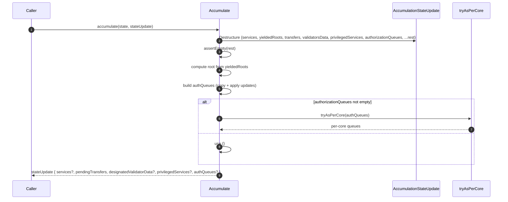
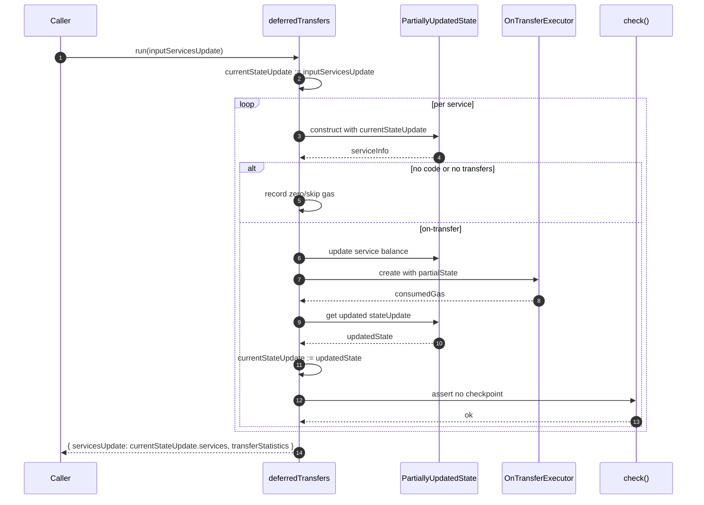
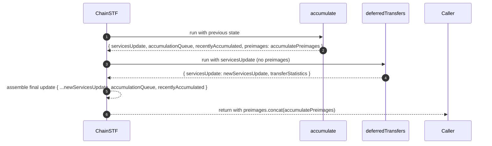

# Avoid misusing state update by copying the services state.

## Pull Request by @tomusdrw

Also found a potential bug in accumulation, where updates about `privilegedServices, authQueues and validatorData` where ignored.

- [x] Figure out the test failures

## Comment by @coderabbitai[bot]

<!-- This is an auto-generated comment: summarize by coderabbit.ai -->
<!-- This is an auto-generated comment: skip review by coderabbit.ai -->

> [!IMPORTANT]
> ## Review skipped
> 
> Auto incremental reviews are disabled on this repository.
> 
> Please check the settings in the CodeRabbit UI or the `.coderabbit.yaml` file in this repository. To trigger a single review, invoke the `@coderabbitai review` command.
> 
> You can disable this status message by setting the `reviews.review_status` to `false` in the CodeRabbit configuration file.

<!-- end of auto-generated comment: skip review by coderabbit.ai -->
<!-- walkthrough_start -->

📝 Walkthrough

<!-- This is an auto-generated comment: release notes by coderabbit.ai -->

## Summary by CodeRabbit

- New Features
  - Added per-core authorization queue handling for more precise state updates.
  - Exposed additional accumulation data in updates (accumulation queue and recently accumulated).
- Bug Fixes
  - Improved gas accounting during on-transfer execution for more accurate reporting.
  - Ensured pending transfers and yielded roots are consistently applied in accumulation.
- Refactor
  - Streamlined state update construction with safer copying and validation.
  - Simplified deferred transfers flow to carry forward the latest state across iterations.

<!-- end of auto-generated comment: release notes by coderabbit.ai -->
## Walkthrough
Refactors accumulation state handling by moving yieldedRoots into the AccumulationStateUpdate constructor, adding guarded copying, and making PartiallyUpdatedState hold a readonly stateUpdate. Updates accumulate logic to destructure state fields, compute per-core auth queues, and assert unknown fields. Refactors deferred transfers to iteratively update current state. Chain STF composes new fields.

## Changes
| Cohort / File(s) | Summary |
| --- | --- |
| **State update model refactor** `packages/jam/jam-host-calls/externalities/state-update.ts` | Moves yieldedRoots to a constructor parameter property; updates constructor and copyFrom to pass a yieldedRoots map; conditionally copies validatorsData and privilegedServices; PartiallyUpdatedState now holds a readonly stateUpdate initialized via empty/copy. |
| **Accumulate transition adjustments** `packages/jam/transition/accumulate/accumulate.ts` | Destructures stateUpdate (services, yieldedRoots, transfers, validatorsData, privilegedServices, authorizationQueues); computes root from yieldedRoots; builds per-core authQueues via tryAsPerCore; asserts no extra fields; shapes returned stateUpdate conditionally. |
| **Deferred transfers loop/state management** `packages/jam/transition/accumulate/deferred-transfers.ts` | Introduces currentStateUpdate; constructs PartiallyUpdatedState inside loop; resolves service info from partial state; executes on-transfer and accumulates gas; updates currentStateUpdate from partial state; asserts no checkpoint; returns updated services. |
| **Chain STF composition updates** `packages/jam/transition/chain-stf.ts` | Adds accumulationQueue and recentlyAccumulated to unpacking and final payload; excludes preimages from intermediate servicesUpdate; concatenates preimages with accumulatePreimages at return. |

## Sequence Diagram(s)

## Estimated code review effort
🎯 4 (Complex) | ⏱️ ~55 minutes

## Poem
> I thump my paws on fertile ground,  
> Roots now passed by constructor sound.  
> Queues per core align in rows,  
> Gas ticks tally as logic flows.  
> Updates march, immutably neat—  
> I nibble bytes; the state’s complete.  
> Carrots committed. Deploy. Repeat. 🥕

<!-- walkthrough_end -->
<!-- internal state start -->

<!-- DwQgtGAEAqAWCWBnSTIEMB26CuAXA9mAOYCmGJATmriQCaQDG+Ats2bgFyQAOFk+AIwBWJBrngA3EsgEBPRvlqU0AgfFwA6NPEgQAfACgjoCEYDEZyAAUASpETZWaCrI5Ho6gDYkuAQQn48PTMSNiI8BhE9rjUJJDY3LSxkHIK3LIRUbiwcYiUEvAM0tGxGpCQBgByjgKUXACsACwAHOUGAKo2ADJcsLi43IgcAPTDROqw2AIaTMzDAGKe2ABmy7JdKojDuLLcJLUULsPc2J6ew02tFe15FFwEzGG0FADubQDK+NgURSlUGAxYPdaGAmOkwIgYjQwAkkjRIIAkwhgzlIuD+mEBXGY2iwFXeULCXHwe1xBhsJAKJBelCGkAAFBh8ORIJ4kDRaABKNobWqeWkMplxVmQuhcioAYQoJFi9GoXAATAAGeX1MCK5pgACMAHZoPLNRxNYqOIrNQAtIwAEWkDAo8G44iZXDgcVs6Foz2keWQaB4+BoGHEaE8KWwUQi6AYDEcp2o8CZkBeOSl8USsR9Ai+aN4kng3lItHe+UK0gANDhsgBFbAkGuIcuYegSYNBaj4CiW6i+6kp+BERlS2hlF2QJSIW32x1YCIMJZj9CMHIMADWwrR6hIzEgBEgyz73ziWe3OW30jRy20SyliA0Rn0xnAUDI9HwywrhFI5Co7IUrHYXF4fhhFEcQpBkeQmCUKhVHULQdHvEwoDgVBUEwd9iDIZQf1mNhAy4Kg3gcJwXBSCDFGUGDNG0XQwEMB9TAMbg0BXNBSC2IQ0DmDjmDAWB8EhUFgz5YYSAADxoCgMBbcRpGGSFYhhNMaA0XAhgMAAiTSDAsSBfAASQwr8ZXsRxsRI19F0wNi710qMY08OMmXxWJ2iUkgNAyEhPCUWgbHwf1kGYfApHoZYKBYBdZzQRBkD3Lz6B3X0mAwSEKGwMR2x4ZxOJICSeHCvYKB2YcTxOARWQYXd4Hi0dRAc794ywF5osgKUgpCgBuY84mS1L0oIPhGTeJQ93IH0eCmCrWulWgmU8eRPO8ug/ICrgAFk0G4YAiwoAoij02hywAeSYgBHGsAAlotgPRIAAXkgcg3g27g6S5JiqDYCTyxIVYQMkLyINgKzMkgPi3myOIyqm3wrD0yAxO4fjimyVA4TQW8DCgXw7MeByp2cmhXLhHqmT6jK+HCftqAPSAiBxOgF1Rih6A+nK8rpRafJW1SuQKX1IYUFLcDSimss+3LKHy4lKB2BtPAk0HBehwohfJgb7D7KTcAPTGoDBWR5nCrchrVkX+uQQWnsjaM8bbPgXgmBcueW/zVMgbFuFIrKYtB62XrpMKWA86qlt8t3EC5HdBd682KfLCIRTQF832xDBsCEsj0lB304u89Blgk5qWZKuJEYq9R0F9/tcLRHdYVKF3w4ClBkDa4K6D1yBm1ZOF20QTsYnQDBWbtAp8zoHa9uKA3Qc8fBxkqiMDaNiLUFN5LaHURrgzccooB71sBoHrtW/sXL+AweaUDfIPmA0Q++4oE+h/X/1HtOTxb33/LcwnwtixFGQKgW00ofxzXkPAW+xsNA5nHiQAsU8SzAOQIyNE6czjfxgAgZAvBpD5GKLUYGBRMoCDwN3eAvoiAZxZozaKVMMC11atQZMx40LYABEyLeU5gwe02twTIXcnpvV3MxAa8gmLZGmtiROu4OFiB3mceQ4QQj1VDHXE88BmDcG8LXRyWAN7zzGt1FAGAThoiQUA4myR+aQAAN6QA0E4hu8IAC+KRfrtlJsLUW4hIgmOtjjW2sYCZQhINY5SNkrDOCDEoiJk8wmPXwG8Gcc5ii+mtirSqUpk4QJKETNy0tCo7GHvQQEVlijqGQLHXx7Y966HyeEwpb83hoWJDwkMbMvpSzpPJApJMAD8fhcYhMaoTJpJMuSJxoMnfgb5fQjTQKcH8WSqo1S6ZLCgWCkInhqf1TKERt4tgAF4oxwRoPpEzkg7iCfZfR4z4kaE3A6WQIioFJOzOFAoPlyyZUSmkeQFllZfKCIzFxcRbG3LtqElybkZjEkNsbXpYT4kci7r4R6VJRz4EqjhdgiYWrJx8ruP5J5LnxKKbLeQO4IhbwYMkKpE0KBIzyF3EcHcqBnARn9MQZ9fSIAQIXXcxsFyPBiOVEgCcr4RDiHnUKmUm480tvgSKZM44DTAMk8go8ZZFVkA2EeoqvEI1Ejowo6hywGzAAIaKjNgYj1ZP45YmVLmphJsgR2qMsDRKKpQuJblCxhMxuYSwvgFZYUasqkxSgooNTJnMk1SMiqM0yqs9g29pA2XFGq2plMtY0xTOC2gXAAAGULRlORRW5EtSSUkAjSeNZmrNsrdL4BGRlqy9liwYQWyVkAS2KojutTa21AEkAOsdM6l1rq3Qev7Tab0a10kJWbXN4t2ZS14LqnYHIfo8tAoDD2wUlalSlCQsI18Y31UZqsuV/bB0BRrREaOuyc37K2VEyaqs71SnnvSqczpT0UnjBe+QV7nA3q/ZVO9A7Q7cyHZAF6o7dolgnZAE6aBzokCugK2dmLnoLo5E+tum4O6ynGlFGKlK9WlOms+8KtB0p0Io2+sWGy8pbuKfqlATyNDlhLasnJs0r4LTg67R9tVRqMwjDHVjGt2NSzXF3H1sT5rxMDckLtGse060LQGwDUMW2bP7eS6tllIjFDvguRZyzIPlW/XB+kpmSb3VssE/GYyq0kyedonYb0o4qraQ6RR67W39uRbCwZwz3P3K87EIjymoPUZKUS7eTp+0qb9WpgN4ya2myydfRGyNLYnhg4JmaeTnOxBLV3cZbrkj2toI6qIOmDy0hHAbLKUj8v0OKCW+dr074h3iuJ3mNaX1xDLSMjzlbIvVdXe+hs+6T1QyS1pxqmtqa6biLS+AUoxDX1SFu75K3jx7bKXJzKKJHD4sY3afxBtMYAFFIRaOMpBOIZ7qpvF+s6oqXALp9lgBpLSWMGJMRYmxYY3Ftj/HCFOYYzEYs0ER9N0oqk3CaXUtpUNBlPxYUZkRMygK3zlIs4gGyeltHtk4LpD0jMRayF8IgKwlBs0piswAAR2HsA4RxXU7gcNwJN2ZKCgmNUs7I7Z4DHP0ZALDNYwaNma13JHdyaBFiw4GLLrhIB6UDAxpj40/28IV+OkeYlTHhCUCY+exJaNhEqeuLAmYpECH+ICMs6AAhBFBlKPYxl9ssHMXLoFZKcqmKUKJekRC0AkL4PI+1BYq6guFRFWc0p07cDRTZNX0K4gi0wPDjbkigQGB/tadWbWTGuufSq24096yQAfapcsheUrLBpOWR+9sX5oHLHAvMCDJ5jqb5LvidpZdTmrLWL3jZpqQi6r1oqqCVUcOXENLAcrkC2OX7gJ7vnXlVZoOSSEOef48yVwKxgwZowzYMck+I3pm+OfCi3KzLfgHCxmgmy5w2w5KrbKQAABC2AeYtAPoeAsAM+dY3sm8aWUkSiv45iOcPAYuTAKY4+0upy9AZufC3A9SP8ek8yUB2B+iMBlSyAzycs00umKU9iriWCP8R0kMrwSAfaYI1UJWSAFyQa4+FBY+wurIxQhU4uem7qaeW4WBk+5BNYdYBqF2GAUgK+24gWaBFAYhuQ6qtMtijOzOrOFA7O7k5eDSI4o0vCx+cQG8XCCBmcpis42AY4hBDSY4+a7IAAai2E/IPL6HSEmGQN3F4b3j4WfGgh/GcLuiYT/IPv/JYsUH4TkFgDEcPgAihkAqEe/Bgp4JEeUD/PwXIfEYgHgrMlZrJtongCmsBGIDkbkVAA3sgk5sUaFCKoLGJIXmIITqPufg0iSFvJENAHDp3s/LWtuGgMuAEaUYMTSPSNMj/hZH/u3ogEMZHF3GtBEC6toZyuZmxPUlAOSDosxIzFvPtmiGEKxIeG+H/p/omE7FbFSJemeL4gePQJ/kAfsQ5EUPQMcSBOgIcGgPIEjl6KoY0loFAQITcVInca0mCQUYgNaraqzOgcap7AIv4jJieFKHQYTnFpEhfqRiFAuHgueogNfHgnkIGKYo6qTH+IGF3EdMoUJFKhJIgaOKfI1s1gmnnhWlgK6rULMMUEFCmOXOamiPPqIRgXEGgMXH2p6rANEHaB0XwD3lOL/okgKptBCpQlXLcPvofrRojI2NiXNvCNvomIkflPgrSUYCGrpOGnGvQRNrVLGvosgBZEVsmi+HwGmtrjJBTljNYElrDPDK1tePEACEnp3NgnEOWvjD1A5FRiGZKYavQjipQiskljzsUG1DiDXjlF1GTmxL8TtoGJQCyejPYMDKiVEGKUiZgaQTISqXgeyX7iwlLNkGhO6T+EGSZBQBeEUM9q9tiNhORNNJSD9qsDTgDkDiDtjmDmAEYBDsuOcexJxLDkXggajsjiQMMCNJQIOGAIscsSpGpFjjjrpHjphN+ITqZM4CTtsZmv6VTiLlwESozJ7iuPEOIKyCUlzpmXzrIMMHgHmDeP6czrIACNuHDggaFsZs2ZEPhGQDlMgPUVYoUjSmYngHEYgBSuiXEGOJsXZlNAphQAPteMWP4m0aWbwt2WQqKbQEIGEH4uGCWZJLwmcaQLeFAOMgeVQCuH7tIJWXQFwPRooEbowN8FKIGA8oUnSIcrEjLozFZhEOYlhaisCVybGY0pGOFFRhuPaSBVAF0P5F7K6mnOcbXFiB3NUjkiqRZJlpnOpnVnXrbsZeWGEKDNGIcOwNJS5juFBADOoRCGOiCf6XEaYs6gvvgEsABiMYIDELIihcWRFVZh9KprII5Ykt+Kwu2VviKvyiQGzPCHgrMOYjejEn6nVjmH8iqoLHbl7HpfopxZANmiPLYSGEdJUAAPrQA2C+CVDvDzBPZ2BwVEAIXxX0GIDLj2hVldZyn+FYAfahGfz8B8CsGSkpiMiQVF7LHli0XTR9nHzAklUVG0ZB4sx0wtTsXeLhAiiBjXy74VkQYJRTEUCExsiFBUEG6yBNUdXdW9X9WDV2BiSiBAUJil5cC7nDGgKh5vgxmxBPbiRUXflcHiyxJ1YcJfkFx5QuKgyJUpDBgYgkD5k2XFBHQYBgADHbVSzA3RgayykBJYqpUVVhL5nB4VHID0zgQmSsCgyiGHlSyc2nUcIlZlyiQg0DSWqbS6YeVkw3a0AADi0UTVitPoUYXw2u/i8+rq4KtIaAhcUsTIPFVNJFtBdoFIxQ2tbksUIqTNwY4yDY1c9BRadWO4nlkluAPlsQChT+M8S4y4wJZADgG1Kq75y4SMz6/AdkXlQ4/pp+yyj1VZY13wE1o+FKLUbt3lOJ7kiVX+ScKcpiKlqdbk5Y9NGS/oxZdKcY/ilWo+RZtBydRx3woMht/NH6UALVIsUVu488rShqe5mUI1wlBuol6RSUft4dFJe+G2tiodXU4xBVVBok71FFhwmUCYcR+uzqlQ/oCNbItGcRwBBNAIJA9JlAywPds1BlAZ9mlU3ZWiEOtOIQGAWiCltAXUz6SNWlZlpATC8+mJydgRSwuQm4mA4gDA1SEZh0ZpQ+JinZjM1oQxg4lNHeNIcdCs24uwn2IDCVmxdhgsiAEeyKeYIYqSjhFtRdLm8+rdb1r24DXIe1psUo59IEIt9W2EEl+KrqeteULdL1waZ5YaEkLpwJgs4G+lCacDnpE0N9CMPpXBNk2995UakjxwSWYjwjSgNAHRMdBgL24gQ5b5I5X2WKv2k5kAgORAwOp5c5C5zES5UOMOixG55SEQEIuAywx5mOWkOk+khkBO9AROt5CaBZD52M9OCULwKq1sppjpGlxpcQHCi5mQL5aO0+BRp1og7A80cN7ITV5I7UN6Uob2hZVmtQoMpDxKuFpiEkbAW8yQOdFK5UOK/tju8qq1J4kNSDL1lsUFU4TVa0ZGJi5hIYvWzA5Ud5gs4KWUsg88sy6FDhNucTaTs+GTRQd1TOqTdA3tguTRpi+GqlcK/p4okDQzEQvC/9kkQEIgvK8zaSFpxTM8TI/6iFP4LUeCDztI7z2IbE8KAI1Ay6mzVgRT3z0gXI1AsDI8UqedCaEQVJCMzgwhbddOxKSzjUFB5Y+2WTGzW5UD8+T0BzvlNVpWZznSUGckiSUzTEMz+Ayc/DPjdpwjjp6jU4rpb4kjK10jU06avpCjKqWSIkpqNOhObhtMITyAmjIEkZI4qyZNxzOIKkvTG2iZtGrRgrHp6G/tmZ6Awu0oCe4ZFSb9SjddH9rFIYrq6pewGTdByB/ECBA5+j72RjwGJjE5/25j051j94BgiEsj+dkuH4l5jrNJtOBE3NxOcB5E0EagVE8EtE3rj4v4IQuAnVQQiAnVxj1ItAnV8kRUNEdEPrjQ9QdA2ojQ2oDAtQaAAAbJW4qIqFWwAJyKjaiVuNDLAMCVsCDaj1CKjLDNCaiajygADM8oDAI7g7eb9E+sLASbKbEB6bzrmbnVz4ebQAA=== -->

<!-- internal state end -->
<!-- tips_start -->

---

🪧 Tips

### Chat

There are 3 ways to chat with [CodeRabbit](https://coderabbit.ai?utm_source=oss&utm_medium=github&utm_campaign=FluffyLabs/typeberry&utm_content=548):

- Review comments: Directly reply to a review comment made by CodeRabbit. Example:
  - `I pushed a fix in commit <commit_id>, please review it.`
  - `Open a follow-up GitHub issue for this discussion.`
- Files and specific lines of code (under the "Files changed" tab): Tag `@coderabbitai` in a new review comment at the desired location with your query.
- PR comments: Tag `@coderabbitai` in a new PR comment to ask questions about the PR branch. For the best results, please provide a very specific query, as very limited context is provided in this mode. Examples:
  - `@coderabbitai gather interesting stats about this repository and render them as a table. Additionally, render a pie chart showing the language distribution in the codebase.`
  - `@coderabbitai read the files in the src/scheduler package and generate a class diagram using mermaid and a README in the markdown format.`

### Support

Need help? Create a ticket on our [support page](https://www.coderabbit.ai/contact-us/support) for assistance with any issues or questions.

### CodeRabbit Commands (Invoked using PR/Issue comments)

Type `@coderabbitai help` to get the list of available commands.

### Other keywords and placeholders

- Add `@coderabbitai ignore` anywhere in the PR description to prevent this PR from being reviewed.
- Add `@coderabbitai summary` to generate the high-level summary at a specific location in the PR description.
- Add `@coderabbitai` anywhere in the PR title to generate the title automatically.

### Status, Documentation and Community

- Visit our [Status Page](https://status.coderabbit.ai) to check the current availability of CodeRabbit.
- Visit our [Documentation](https://docs.coderabbit.ai) for detailed information on how to use CodeRabbit.
- Join our [Discord Community](http://discord.gg/coderabbit) to get help, request features, and share feedback.
- Follow us on [X/Twitter](https://twitter.com/coderabbitai) for updates and announcements.

<!-- tips_end -->

## Comment by @github-actions[bot]

View all

| File | Benchmark | Ops |  |
|------|-----------|-----|--|
| [bytes/hex-to.ts[0]](../blob/761e4a40cc086b262adc6ef7c1fc707af4ea6ca1//_work/typeberry-runner-2/typeberry/typeberry/benchmarks/bytes/hex-to.ts) | number toString + padding | 324782.26 ±0.1% | fastest ✅ |
| [bytes/hex-to.ts[1]](../blob/761e4a40cc086b262adc6ef7c1fc707af4ea6ca1//_work/typeberry-runner-2/typeberry/typeberry/benchmarks/bytes/hex-to.ts) | manual | 16352.64 ±0.33% | 94.97% slower |
| [math/count-bits-u64.ts[0]](../blob/761e4a40cc086b262adc6ef7c1fc707af4ea6ca1//_work/typeberry-runner-2/typeberry/typeberry/benchmarks/math/count-bits-u64.ts) | standard method | 1196686.04 ±0.22% | 89.99% slower |
| [math/count-bits-u64.ts[1]](../blob/761e4a40cc086b262adc6ef7c1fc707af4ea6ca1//_work/typeberry-runner-2/typeberry/typeberry/benchmarks/math/count-bits-u64.ts) | magic | 11957895.76 ±0.27% | fastest ✅ |
| [codec/encoding.ts[0]](../blob/761e4a40cc086b262adc6ef7c1fc707af4ea6ca1//_work/typeberry-runner-2/typeberry/typeberry/benchmarks/codec/encoding.ts) | manual encode | 3161365.1 ±0.15% | 17.3% slower |
| [codec/encoding.ts[1]](../blob/761e4a40cc086b262adc6ef7c1fc707af4ea6ca1//_work/typeberry-runner-2/typeberry/typeberry/benchmarks/codec/encoding.ts) | int32array encode | 3761817.93 ±0.24% | 1.59% slower |
| [codec/encoding.ts[2]](../blob/761e4a40cc086b262adc6ef7c1fc707af4ea6ca1//_work/typeberry-runner-2/typeberry/typeberry/benchmarks/codec/encoding.ts) | dataview encode | 3822636.66 ±0.23% | fastest ✅ |
| [hash/index.ts[0]](../blob/761e4a40cc086b262adc6ef7c1fc707af4ea6ca1//_work/typeberry-runner-2/typeberry/typeberry/benchmarks/hash/index.ts) | hash with numeric representation | 192.3 ±0.65% | 27.67% slower |
| [hash/index.ts[1]](../blob/761e4a40cc086b262adc6ef7c1fc707af4ea6ca1//_work/typeberry-runner-2/typeberry/typeberry/benchmarks/hash/index.ts) | hash with string representation | 120.28 ±0.28% | 54.76% slower |
| [hash/index.ts[2]](../blob/761e4a40cc086b262adc6ef7c1fc707af4ea6ca1//_work/typeberry-runner-2/typeberry/typeberry/benchmarks/hash/index.ts) | hash with symbol representation | 185.08 ±0.06% | 30.38% slower |
| [hash/index.ts[3]](../blob/761e4a40cc086b262adc6ef7c1fc707af4ea6ca1//_work/typeberry-runner-2/typeberry/typeberry/benchmarks/hash/index.ts) | hash with uint8 representation | 165.32 ±0.07% | 37.82% slower |
| [hash/index.ts[4]](../blob/761e4a40cc086b262adc6ef7c1fc707af4ea6ca1//_work/typeberry-runner-2/typeberry/typeberry/benchmarks/hash/index.ts) | hash with packed representation | 265.86 ±0.11% | fastest ✅ |
| [hash/index.ts[5]](../blob/761e4a40cc086b262adc6ef7c1fc707af4ea6ca1//_work/typeberry-runner-2/typeberry/typeberry/benchmarks/hash/index.ts) | hash with bigint representation | 194.04 ±0.06% | 27.01% slower |
| [hash/index.ts[6]](../blob/761e4a40cc086b262adc6ef7c1fc707af4ea6ca1//_work/typeberry-runner-2/typeberry/typeberry/benchmarks/hash/index.ts) | hash with uint32 representation | 205.19 ±0.15% | 22.82% slower |
| [logger/index.ts[0]](../blob/761e4a40cc086b262adc6ef7c1fc707af4ea6ca1//_work/typeberry-runner-2/typeberry/typeberry/benchmarks/logger/index.ts) | console.log with string concat | 6924011.02 ±53.05% | fastest ✅ |
| [logger/index.ts[1]](../blob/761e4a40cc086b262adc6ef7c1fc707af4ea6ca1//_work/typeberry-runner-2/typeberry/typeberry/benchmarks/logger/index.ts) | console.log with args | 1028698.66 ±92.04% | 85.14% slower |
| [math/add_one_overflow.ts[0]](../blob/761e4a40cc086b262adc6ef7c1fc707af4ea6ca1//_work/typeberry-runner-2/typeberry/typeberry/benchmarks/math/add_one_overflow.ts) | add and take modulus | 235148621.14 ±27.95% | 9.2% slower |
| [math/add_one_overflow.ts[1]](../blob/761e4a40cc086b262adc6ef7c1fc707af4ea6ca1//_work/typeberry-runner-2/typeberry/typeberry/benchmarks/math/add_one_overflow.ts) | condition before calculation | 258961272.4 ±6.31% | fastest ✅ |
| [codec/bigint.compare.ts[0]](../blob/761e4a40cc086b262adc6ef7c1fc707af4ea6ca1//_work/typeberry-runner-2/typeberry/typeberry/benchmarks/codec/bigint.compare.ts) | compare custom | 261602865.69 ±6.42% | fastest ✅ |
| [codec/bigint.compare.ts[1]](../blob/761e4a40cc086b262adc6ef7c1fc707af4ea6ca1//_work/typeberry-runner-2/typeberry/typeberry/benchmarks/codec/bigint.compare.ts) | compare bigint | 258290296.96 ±7.06% | 1.27% slower |
| [collections/map-set.ts[0]](../blob/761e4a40cc086b262adc6ef7c1fc707af4ea6ca1//_work/typeberry-runner-2/typeberry/typeberry/benchmarks/collections/map-set.ts) | 2 gets + conditional set | 111530.37 ±0.16% | fastest ✅ |
| [collections/map-set.ts[1]](../blob/761e4a40cc086b262adc6ef7c1fc707af4ea6ca1//_work/typeberry-runner-2/typeberry/typeberry/benchmarks/collections/map-set.ts) | 1 get 1 set | 61744.06 ±0.01% | 44.64% slower |
| [codec/bigint.decode.ts[0]](../blob/761e4a40cc086b262adc6ef7c1fc707af4ea6ca1//_work/typeberry-runner-2/typeberry/typeberry/benchmarks/codec/bigint.decode.ts) | decode custom | 210051193.65 ±4.67% | fastest ✅ |
| [codec/bigint.decode.ts[1]](../blob/761e4a40cc086b262adc6ef7c1fc707af4ea6ca1//_work/typeberry-runner-2/typeberry/typeberry/benchmarks/codec/bigint.decode.ts) | decode bigint | 86848326.73 ±2.46% | 58.65% slower |
| [codec/decoding.ts[0]](../blob/761e4a40cc086b262adc6ef7c1fc707af4ea6ca1//_work/typeberry-runner-2/typeberry/typeberry/benchmarks/codec/decoding.ts) | manual decode | 17043727.87 ±0.49% | 91.24% slower |
| [codec/decoding.ts[1]](../blob/761e4a40cc086b262adc6ef7c1fc707af4ea6ca1//_work/typeberry-runner-2/typeberry/typeberry/benchmarks/codec/decoding.ts) | int32array decode | 186411672.08 ±5.56% | 4.24% slower |
| [codec/decoding.ts[2]](../blob/761e4a40cc086b262adc6ef7c1fc707af4ea6ca1//_work/typeberry-runner-2/typeberry/typeberry/benchmarks/codec/decoding.ts) | dataview decode | 194659922.02 ±5.1% | fastest ✅ |
| [bytes/hex-from.ts[0]](../blob/761e4a40cc086b262adc6ef7c1fc707af4ea6ca1//_work/typeberry-runner-2/typeberry/typeberry/benchmarks/bytes/hex-from.ts) | parse hex using `Number` with NaN checking | 115596.98 ±0.26% | 83.88% slower |
| [bytes/hex-from.ts[1]](../blob/761e4a40cc086b262adc6ef7c1fc707af4ea6ca1//_work/typeberry-runner-2/typeberry/typeberry/benchmarks/bytes/hex-from.ts) | parse hex from char codes | 717233.69 ±0.6% | fastest ✅ |
| [bytes/hex-from.ts[2]](../blob/761e4a40cc086b262adc6ef7c1fc707af4ea6ca1//_work/typeberry-runner-2/typeberry/typeberry/benchmarks/bytes/hex-from.ts) | parse hex from string nibbles | 483529.39 ±0.38% | 32.58% slower |
| [math/count-bits-u32.ts[0]](../blob/761e4a40cc086b262adc6ef7c1fc707af4ea6ca1//_work/typeberry-runner-2/typeberry/typeberry/benchmarks/math/count-bits-u32.ts) | standard method | 98677018.23 ±2.05% | 60.28% slower |
| [math/count-bits-u32.ts[1]](../blob/761e4a40cc086b262adc6ef7c1fc707af4ea6ca1//_work/typeberry-runner-2/typeberry/typeberry/benchmarks/math/count-bits-u32.ts) | magic | 248425096.03 ±7.08% | fastest ✅ |
| [math/mul_overflow.ts[0]](../blob/761e4a40cc086b262adc6ef7c1fc707af4ea6ca1//_work/typeberry-runner-2/typeberry/typeberry/benchmarks/math/mul_overflow.ts) | multiply and bring back to u32 | 253405398.2 ±7.29% | 0.43% slower |
| [math/mul_overflow.ts[1]](../blob/761e4a40cc086b262adc6ef7c1fc707af4ea6ca1//_work/typeberry-runner-2/typeberry/typeberry/benchmarks/math/mul_overflow.ts) | multiply and take modulus | 254494667.61 ±6.42% | fastest ✅ |
| [math/switch.ts[0]](../blob/761e4a40cc086b262adc6ef7c1fc707af4ea6ca1//_work/typeberry-runner-2/typeberry/typeberry/benchmarks/math/switch.ts) | switch | 229446821.36 ±7.76% | 9.43% slower |
| [math/switch.ts[1]](../blob/761e4a40cc086b262adc6ef7c1fc707af4ea6ca1//_work/typeberry-runner-2/typeberry/typeberry/benchmarks/math/switch.ts) | if | 253328207.3 ±6.07% | fastest ✅ |
| [codec/view_vs_object.ts[0]](../blob/761e4a40cc086b262adc6ef7c1fc707af4ea6ca1//_work/typeberry-runner-2/typeberry/typeberry/benchmarks/codec/view_vs_object.ts) | Get the first field from Decoded | 41219.65 ±105.87% | 90.14% slower |
| [codec/view_vs_object.ts[1]](../blob/761e4a40cc086b262adc6ef7c1fc707af4ea6ca1//_work/typeberry-runner-2/typeberry/typeberry/benchmarks/codec/view_vs_object.ts) | Get the first field from View | 73444.79 ±1.2% | 82.43% slower |
| [codec/view_vs_object.ts[2]](../blob/761e4a40cc086b262adc6ef7c1fc707af4ea6ca1//_work/typeberry-runner-2/typeberry/typeberry/benchmarks/codec/view_vs_object.ts) | Get the first field as view from View | 81392.18 ±1.73% | 80.53% slower |
| [codec/view_vs_object.ts[3]](../blob/761e4a40cc086b262adc6ef7c1fc707af4ea6ca1//_work/typeberry-runner-2/typeberry/typeberry/benchmarks/codec/view_vs_object.ts) | Get two fields from Decoded | 397950.56 ±0.54% | 4.81% slower |
| [codec/view_vs_object.ts[4]](../blob/761e4a40cc086b262adc6ef7c1fc707af4ea6ca1//_work/typeberry-runner-2/typeberry/typeberry/benchmarks/codec/view_vs_object.ts) | Get two fields from View | 74521.69 ±0.66% | 82.18% slower |
| [codec/view_vs_object.ts[5]](../blob/761e4a40cc086b262adc6ef7c1fc707af4ea6ca1//_work/typeberry-runner-2/typeberry/typeberry/benchmarks/codec/view_vs_object.ts) | Get two fields from materialized from View | 151676.62 ±0.67% | 63.72% slower |
| [codec/view_vs_object.ts[6]](../blob/761e4a40cc086b262adc6ef7c1fc707af4ea6ca1//_work/typeberry-runner-2/typeberry/typeberry/benchmarks/codec/view_vs_object.ts) | Get two fields as views from View | 75209.11 ±0.48% | 82.01% slower |
| [codec/view_vs_object.ts[7]](../blob/761e4a40cc086b262adc6ef7c1fc707af4ea6ca1//_work/typeberry-runner-2/typeberry/typeberry/benchmarks/codec/view_vs_object.ts) | Get only third field from Decoded | 418075.23 ±0.38% | fastest ✅ |
| [codec/view_vs_object.ts[8]](../blob/761e4a40cc086b262adc6ef7c1fc707af4ea6ca1//_work/typeberry-runner-2/typeberry/typeberry/benchmarks/codec/view_vs_object.ts) | Get only third field from View | 93639.6 ±0.6% | 77.6% slower |
| [codec/view_vs_object.ts[9]](../blob/761e4a40cc086b262adc6ef7c1fc707af4ea6ca1//_work/typeberry-runner-2/typeberry/typeberry/benchmarks/codec/view_vs_object.ts) | Get only third field as view from View | 90620.22 ±0.67% | 78.32% slower |
| [codec/view_vs_collection.ts[0]](../blob/761e4a40cc086b262adc6ef7c1fc707af4ea6ca1//_work/typeberry-runner-2/typeberry/typeberry/benchmarks/codec/view_vs_collection.ts) | Get first element from Decoded | 26394.38 ±0.34% | 56.81% slower |
| [codec/view_vs_collection.ts[1]](../blob/761e4a40cc086b262adc6ef7c1fc707af4ea6ca1//_work/typeberry-runner-2/typeberry/typeberry/benchmarks/codec/view_vs_collection.ts) | Get first element from View | 61106.72 ±0.75% | fastest ✅ |
| [codec/view_vs_collection.ts[2]](../blob/761e4a40cc086b262adc6ef7c1fc707af4ea6ca1//_work/typeberry-runner-2/typeberry/typeberry/benchmarks/codec/view_vs_collection.ts) | Get 50th element from Decoded | 24591.11 ±0.61% | 59.76% slower |
| [codec/view_vs_collection.ts[3]](../blob/761e4a40cc086b262adc6ef7c1fc707af4ea6ca1//_work/typeberry-runner-2/typeberry/typeberry/benchmarks/codec/view_vs_collection.ts) | Get 50th element from View | 33824.08 ±0.36% | 44.65% slower |
| [codec/view_vs_collection.ts[4]](../blob/761e4a40cc086b262adc6ef7c1fc707af4ea6ca1//_work/typeberry-runner-2/typeberry/typeberry/benchmarks/codec/view_vs_collection.ts) | Get last element from Decoded | 24298.56 ±0.39% | 60.24% slower |
| [codec/view_vs_collection.ts[5]](../blob/761e4a40cc086b262adc6ef7c1fc707af4ea6ca1//_work/typeberry-runner-2/typeberry/typeberry/benchmarks/codec/view_vs_collection.ts) | Get last element from View | 23473.74 ±0.29% | 61.59% slower |
| [hash/blake2b.ts[0]](../blob/761e4a40cc086b262adc6ef7c1fc707af4ea6ca1//_work/typeberry-runner-2/typeberry/typeberry/benchmarks/hash/blake2b.ts) | hasher with simple allocator | 0.05 ±0.07% | fastest ✅ |
| [hash/blake2b.ts[1]](../blob/761e4a40cc086b262adc6ef7c1fc707af4ea6ca1//_work/typeberry-runner-2/typeberry/typeberry/benchmarks/hash/blake2b.ts) | hasher with page allocator | 0.04 ±0.44% | 20% slower |
| [collections/map_vs_sorted.ts[0]](../blob/761e4a40cc086b262adc6ef7c1fc707af4ea6ca1//_work/typeberry-runner-2/typeberry/typeberry/benchmarks/collections/map_vs_sorted.ts) | Map | 232279.14 ±0.03% | fastest ✅ |
| [collections/map_vs_sorted.ts[1]](../blob/761e4a40cc086b262adc6ef7c1fc707af4ea6ca1//_work/typeberry-runner-2/typeberry/typeberry/benchmarks/collections/map_vs_sorted.ts) | Map-array | 103330.97 ±0.03% | 55.51% slower |
| [collections/map_vs_sorted.ts[2]](../blob/761e4a40cc086b262adc6ef7c1fc707af4ea6ca1//_work/typeberry-runner-2/typeberry/typeberry/benchmarks/collections/map_vs_sorted.ts) | Array | 65422.71 ±0.84% | 71.83% slower |
| [collections/map_vs_sorted.ts[3]](../blob/761e4a40cc086b262adc6ef7c1fc707af4ea6ca1//_work/typeberry-runner-2/typeberry/typeberry/benchmarks/collections/map_vs_sorted.ts) | SortedArray | 195980.1 ±0.2% | 15.63% slower |
| [bytes/compare.ts[0]](../blob/761e4a40cc086b262adc6ef7c1fc707af4ea6ca1//_work/typeberry-runner-2/typeberry/typeberry/benchmarks/bytes/compare.ts) | Comparing Uint32 bytes | 20992.91 ±0.08% | fastest ✅ |
| [bytes/compare.ts[1]](../blob/761e4a40cc086b262adc6ef7c1fc707af4ea6ca1//_work/typeberry-runner-2/typeberry/typeberry/benchmarks/bytes/compare.ts) | Comparing raw bytes | 17566.77 ±5.21% | 16.32% slower |
| [crypto/ed25519.ts[0]](../blob/761e4a40cc086b262adc6ef7c1fc707af4ea6ca1//_work/typeberry-runner-2/typeberry/typeberry/benchmarks/crypto/ed25519.ts) | native crypto | 6.03 ±14.11% | 79.62% slower |
| [crypto/ed25519.ts[1]](../blob/761e4a40cc086b262adc6ef7c1fc707af4ea6ca1//_work/typeberry-runner-2/typeberry/typeberry/benchmarks/crypto/ed25519.ts) | wasm lib | 10.3 ±0.72% | 65.19% slower |
| [crypto/ed25519.ts[2]](../blob/761e4a40cc086b262adc6ef7c1fc707af4ea6ca1//_work/typeberry-runner-2/typeberry/typeberry/benchmarks/crypto/ed25519.ts) | wasm lib batch | 29.59 ±1.15% | fastest ✅ |

### Benchmarks summary: 63/63 OK ✅

<!-- thollander/actions-comment-pull-request "benchmarks" -->
