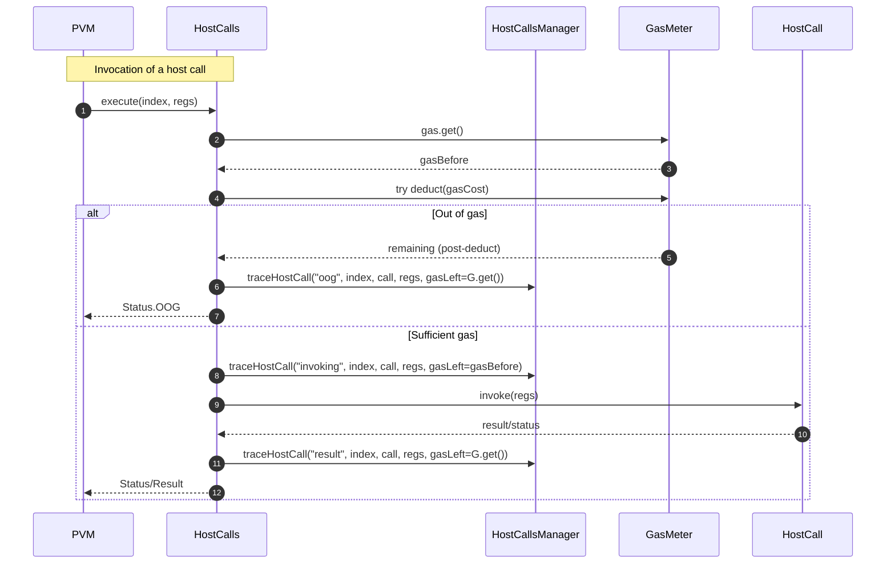

# Jamduna 065 generic tests

## Pull Request by @mateuszsikora

### Changes
- added gas to host call traces 
- changed state to match jamduna 065 test vectors 
- fixed order of operand properties to match jamduna 065 test vectors 

## Comment by @coderabbitai[bot]

<!-- This is an auto-generated comment: summarize by coderabbit.ai -->
<!-- This is an auto-generated comment: skip review by coderabbit.ai -->

> [!IMPORTANT]
> ## Review skipped
> 
> Auto incremental reviews are disabled on this repository.
> 
> Please check the settings in the CodeRabbit UI or the `.coderabbit.yaml` file in this repository. To trigger a single review, invoke the `@coderabbitai review` command.
> 
> You can disable this status message by setting the `reviews.review_status` to `false` in the CodeRabbit configuration file.

<!-- end of auto-generated comment: skip review by coderabbit.ai -->
<!-- walkthrough_start -->

📝 Walkthrough

<!-- This is an auto-generated comment: release notes by coderabbit.ai -->

## Summary by CodeRabbit

- New Features
  - Host-call logs now include remaining gas, improving traceability.
  - Suite-specific compatibility: adjusted ECALLI gas and encoding rules for JAMDUNA_065.

- Tests
  - Expanded test coverage by processing more JSON vectors.
  - More deterministic test comparisons via sorted dictionary outputs.

- Chores
  - Encoding rules updated to gate certain fields by suite/version (e.g., core index, service ID).
  - Interpreter configuration now honors instruction gas in JAMDUNA_065.
  - Internal field ordering aligned with codec mapping (no functional change).

<!-- end of auto-generated comment: release notes by coderabbit.ai -->
## Walkthrough
The changes adjust test coverage, introduce suite-gated behaviors, and refine codecs and logging. ECALLI gas and interpreter options vary for JAMDUNA_065. WorkReport and Statistics codecs gain conditional branches. Host-call tracing includes gas. A dictionary test helper now returns deterministically sorted entries. An Operand field and its codec mapping were reordered.

## Changes
| Cohort / File(s) | Summary |
|---|---|
| **Test runner ignore list** `bin/test-runner/jamduna-065.ts` | Reduced ignored JSON vectors for jamduna-065, increasing processed test vectors; no runtime logic changes. |
| **Deterministic test comparison** `packages/core/collections/truncated-hash-dictionary.ts` | [TEST_COMPARE_USING] now returns a key-sorted array of entries using Ordering instead of the raw dictionary; adds Ordering import; return type changes accordingly. |
| **ECALLI gas compatibility** `packages/core/pvm-interpreter/assemblify.ts` | ECALLI gas set to 0 for JAMDUNA_065 and 1 otherwise via Compatibility.isSuite; other instructions unchanged. |
| **WorkReport coreIndex codec gating** `packages/jam/block/work-report.ts` | coreIndex encodes as varU32 only on ≥V0_6_5 and not in JAMDUNA_065; otherwise uses u16 opaque; adds TestSuite check. |
| **Host-call gas tracing** `packages/jam/pvm-host-calls/host-calls-manager.ts`, `packages/jam/pvm-host-calls/host-calls.ts` | traceHostCall signature adds gas parameter; logs include gas. host-calls captures gasBefore and passes gas at OOG/invoking/result phases; execution flow unchanged. |
| **Interpreter gas handling per suite** `packages/jam/pvm-host-calls/interpreter-instance-manager.ts` | ignoreInstructionGas becomes conditional: false for JAMDUNA_065, true otherwise; imports Compatibility/TestSuite. |
| **Statistics ServiceId codec condition** `packages/jam/state/statistics.ts` | codecServiceId now treats W3F_DAVXY or JAMDUNA_065 as opaque U32; otherwise uses varU32 conversions; type unchanged. |
| **Operand field/codec order** `packages/jam/transition/accumulate/operand.ts` | authorizationOutput field and its Codec entry moved to follow authorizerHash; types/encodings unchanged; 0.6.4 variant unaffected. |

## Sequence Diagram(s)

## Estimated code review effort
🎯 3 (Moderate) | ⏱️ ~25 minutes

## Poem
> I nibble logs with careful cheer,  
> Counting gas that lingers near.  
> ECALLI’s light, a zero hop—  
> Suites decide when costs should stop.  
> Keys now sorted, fields aligned,  
> Reports and stats redefined—  
> Thump-thump! More tests, a happier hind. 🐇✨

<!-- walkthrough_end -->
<!-- internal state start -->

<!-- DwQgtGAEAqAWCWBnSTIEMB26CuAXA9mAOYCmGJATmriQCaQDG+Ats2bgFyQAOFk+AIwBWJBrngA3EsgEBPRvlqU0AgfFwA6NPEgQAfACgjoCEYDEZyAAUASpETZWaCrKPR1AGxJcAUmma02BhokAAMAGwArJCk5BTwDJA0iLjIABS2kGaRACwAnACUbgjI3NgeHpAUJACO2NK4kGmwuLjciBwA9J1E6rDYAhpMzJ0AYh7YAGaTsgAyKoiduLLcJAKULp1lFZ25hZCTFCyQ2IiUkMzUJKcAXojwANb4VE0CVBgMsBeIYEL+gcFiGRKAkwMlUmAItFAEmEF20GAKKGQ+FWWEw9AA7mhkAxqld6PgsAAmUJEyKQgAcYAAjHloKE8hwieEONScgAtDSQGwkCTwEgYyjIbH3IjkWhcAjMU60CgYgA09ieiBueDQioAIhQAKJSCgULkAOXwkA8KhIHmQHiQNFoGiMGukuPg3HEhP4k0YsEwpA6BigaFoSnoRGxSRNsHwKUYaAqSSoDGk/q9Pro9lwV3DcNwn0gfgCQRCUKSDUgUjEz0Qycm8AAHmnnko+PhPSjlBh6Lw2xRxNIs5cc198wCi1ES9HywQKFX/WBDAYTFAyATPWg8IRYspbQpWOwuLx+MJROIpDJ5Ewmyo1JptLo5wvwFA4KhUJgcAQgXF8Tu2BhOFU0AxexHEuFxIDkBRL1UdQtB0fQjAfUwDDUDAlgaMAKCCOJOj+AtAShDRUg4AwACIyIMCxIAAQQASU/Lc0wcJwwJbFMMF9YoSEgWh4GmKo6GwRNkFwWAuLORpWJ8ABlAB5Q1x0aSdKxQMVnjTCCRK43CR0hMdwSqLDKC5KTVgYXiEljDxZEVEIzQoUhIAwRx1mbT1N3iBhOhSK4AH1cHee43QwRAbMQBx3iEryMxoPyAvUeBCRC9AO34CgmzoNAGAYRxymoBLUO8mL/MwQL8uQGsvGQQVqn45h8CkehDmOTSVIwNT6GtFJFRIaZj0kC15BIWtuHReB2IUhQ9TQByIIYNd7nGlrMIwOIsy7ITkDqmr9KU6cuTgLjMsTV00xGkTkGqS4xpOD5vXYugbJSzSaucLi2rY30s2W8Q2FNfBekSZ5IA2IG7toa12PtBDKKojwaCoILhJNFqlAYOy8sSj1geG55tyBsoBGtRJ2HipNk2NbHuFxugtgGIn7HgMVqGwGrPlTRAoe1FJ4AHNMLy46o+QFYHplxrgAFk6HgRxSPI2cwCMEaGAeabpE6JhqnV/AKj6xKlmWubbTAb1EFgMAeLEfLnFkQi/TIkiKMsWj6IRxiQOtrG2fumcoCooM0zfHmqZ7LGZLSkFxqa5hIAAAWWVYXM2RsI6Ie0oB5bgzUTegWoAbWgbUpOgHyAGEZPFqwqJsbUfIAVSkmjDQAcQAXTSREg68X9ovyr6SFwFm0W4/vKGYMabQsip5EQan6GcKh5FYi2go99h4j7MaUhIQMsaWwDIAACWxWANQSFeXDTmBRMc4XO5IbuMawJgMD1VJuLPjQ1/5RB26zN957QPIdE9hcZnkgA8Eg8hThjSIEka+EDZAAHIcQsBGjVNgIlFCKmKsFM04hFrXzDk2GB/EHBwxQH+E0NJOihE6NSA4QMWrDDQdQZ4l9nw4jup9FqggzgUAkCoLw/EB4UCwPHLirF86F2LmXCuVca710bq3X+Uc4FcTGvDYIlRl5/xAT2AO+pAFY1zggxUAiJgkBbjwbQ05FRByOHycaSh4ZjwwEgaOkxGENA5ghR21E4ZbjKlmFGoh0aIyxkNYOeM+AE3piTXsPtICS0wfQUUwQRFcWwNwWg+IuAAAMpFF1LuXSu1c64N2bm3AoeSKGMDNGFSAeToAG3xEfU2p9LaEmtsAaA2MaAdmQDJEadQSBtNgIqAAanoGpbUgLVBEcFRpVFDGyGALnMZAB1Po7JKD4DoAAIXUD0vQkyW7TIoVvHerE8ljI6efVZmztm7IOUc6AJzIBTLyZzbmvN6D834kLICPVPE9gllLGW9sjAQAVgYJWKtfRa01twCQzAwAaMoLwEeFBOginvoTXiNsiKywdjDOi7lvxMVAovT0XsOLJhoswKJHRqL+3oMENg9Ag6gMgCXVBeU1DWmWMleg0AGhSWwOoLiqiSJxxWGsDYshOh4HgJaEi6BGgtQINwLGuLmD4pmLbS+sx/oJA+t4C5/lBKIy2SJGS5AGUcvgJmd6HhCSkD4KcPsIQaz1hDGGcx9Qsb0JBZAbUJcqKzFmDRLkNFGizJOGcZAvLGX8pVeoG2SBxWSrSKKlIWaaAaB8FRcWGpa6Gioj5KEiIAD8YRIBcGpIqS4DwSEtVDMgUIDC+AtSLSWstFbiz6QcJK4VkB6H4GehiJAJBL5SSYKsT2XDzV2qsmo0N4bI00WBn+MC11N6Ws6cFG1sA7UkAdVLTMr5epiDoAAbnQHGCdok+D7swoe4eNY3HhMuvCG6tK6D7RKOga9b9IxATkDQaA+Ahm8qUOLNA2rUDPxSG+7cIaw0RqjWWJ18ZZBUUQFJS4FQm7YihuYJ2ASEZBIIGu1GYSgmsUibPVKPA6amvid/KFkBjTkCMFzH635/mC35EC0WoKknguYMSqFSE4Wq0WLhTohN8DK06BiZ4DwMIkCibbYikLSUuwpe7FiNKl2JL9rQZAubcD5q4jRlqsqE4KqVeIS0KBGW41HRoo4gQhLoBiHlcaz8eJBVqRsjTGdcYaFg6ILtChqg0Q7ENQDXENZnqS7WA4/IPBsvwECj4igvXIAERQWuABmIk/AMCroxKJLAEzQg+XCD5aIQNyDVVHW1Ro10e3FtLeWytelSzDpoPep9lAp1nBQI0T1wlr7UnCGAa8/BhmBrOrALksNKjjb4DWC0lnaktXCxQB4kWQ780SD+66QR/12l8TDSjj8ka0dCc4J7EScb6IJDEtjxM/yk0SVJRm6SWaZOybk9MeVEgxcSNdNGIpIDHdO9pzzaQ5MIsU8p1T6mTtaZ06kIokBdCQBkjlrgaXEtKEy5cbg3ASGes7KD1d7om7cAmUKfKGgGtNZa1mM4XgxBlmcOVyrEhkDYAW/aInUBDQCnJ2pSnQ04S0/p4m5K6AgzxS6ZUYLWuxEmiGmjbASgYBiolQW3t/WB1RC4AYInROKcZa4Mms68ABXpo0EgJueJ4Zh21HUWMaRWfs+nJz7nzXIiIgAGRR8gCAF3qbBUZoI+bkgOazeSsLX1/tg3I92/t7Wi7GgSsi6GISV+aQNBV8RPL1GGgJfhC0IgIZaARnAF5QljLeh258Z+YJwrAKRMixBf+SWPEIVy2hYrTK8K1aKeRaiyMKQwBzQqIsJfuAV+WR+JcYI7rdPSYM+S7clKPasX/YkxL/lFCCT7O2+MmUSHXQ31vuMrqiC9HGhBQMPFxohBI6UG9hgucPZtfMVImAfFGLgCXJZBcP3JGHPClGNEbr/rAm2v6rGIGj1tfO/vwHgGUJoMmBZsgAAUkHKsEtfFyj2M9g4LTp5i1O1tYlQMAd2nKuwjgf9I5HljwPEH+MyoADgEPIvQW804XAVeXIXIABXAwA7aeggAuAS1I/564UFcRDQTxBaEg0C1i4CKjsokCPT0DVDCHww+LQwUbwzvagFcR0ZvbhKMafbRKsb4p/biAJJcbJIIEMxMwZInDg62j5LgGjJQEwEVA1Jw71LIA3LBHb7wZ76UA1Jo4z7yY4T+BbAorGxQGv6WidAv6r6WhgC76qwGgE5cFARHTaZvz/ya4ryVAsIsGNLtpcAAE1IIaojBjAbwyNJGE2hChcA0SQEpAhEeBCE9HThfLWDCb4CnBeEg41TLhphToiRdEkDGG9GQD9HREVAjEiGIBfK94CbbhCa8hD7ApiwSbj5SaQryzT7KzJHz7pG5Hb45GZF5EcxEr6ZOxkrAiuypLGbUpmqX47o35+btqzA9QaoJgkIhob4xhr7gTngIYiIkLtr7I9RqRNDtoaCkC4C/y8AJTdomjtq8rRjBhWr5SIjAIjRhQkIhCMGRBLHOBECODsDBIJhBGDGwHXSwHgEkJUwaI+K+xBjCg3xASuqr5C7xCCJcQolonbQmiXR4ogHXz34BpcTrAgrqIvz4AtoEJcQwl5GXwyQyRNzWJLHxrv5VR9ABYczYm/xhjoEXT3zwg0mTCdHUA0CMr4JoEmikmC5ElQGXyJYSDam8nUBfDmn/SWlLEykanoBzbSlhhXZuJf6yl2aUFamGyc7Jg8hkIQmP7jQRlEBRlfCYm2kUnxnWm1TOl/6ulKl6lQGwmVBDSiDKqEjsGpbomPFxjNnZShaTCupzJOmbx/pLr0BpCID+BiTRSzajrzKDyIAFD3rv6f6wLrDeh8hAyoBkB3TZxZjIETAm6gngnoC4hRjCRskCnrGMpEyeDyDVB1DwDVDi5+EkIDHQExGYBFGERslvlDF/xZQVHq5KE1FMGTmdEhpHmulkZ+KwwWHhJWHDzw5UaYz2FRINg/bOHbquGcbJgeGKAzHMw1RZI5L+GNKBG/mWRo4mzmooYwJ2JO6OTOSUCKgb5DFcAUUVCKhGHMocXDErGjFJSQX/hOR6qUDVK1Lw4NJREclr6xFFFhFYAVRcR5Lo5z6pEL4ZHL6vHPFaXb4FGfn76pA1KwiYobmnCrp5LkWbEeBUXYg0X+R0UUJU5cAiUuQsXWXsXWVcUrE8XWXbEmHVL7E8z94m7CbCynHiZj7SyXGT6yZJEY7qUPEvFPHooUCYrwxorBQZgfAkD6VxHFF2zkRH7fFGbMT/EX5cYWZphUH/gJ7iDu5CrALWa2YHBHDRyObyr6iKrKqWiBlYBX4YrzKUCJbeQ5VyXuoKBZWobPDeWZyZTVWqSd4oZkmEhSHxiBqLFfDA4K5TUrUYBrXx58r1VprLCe4p7ZrNWp5Z59oDZVqXw5nlD/jbVLUHpBSkFJnnmBohqwEjZ9iG6AWW455QiKi1aUDqKNDrDDB9iTCxhnApakISSegtSpXpXnAojhJpCepSRvAPBrUw2WgkAUlEW3Sph3ZmH+JwXUbIzXw2HIWLKoXMb4y/ZYUA5cY8YkBBW/KQQCzHHhViaj6SbSbXGwrxVqUjCFQkBRR5TcwMBvGFUkqfGGYn5/GLrsxcYHTc0MBSSUB8iJg0T0BKCIDOiuiblfpOrWg3CPylHxjbxvwbJlajA+QahUQTIAAaAAmixoDbdWOImbUBKrwbAiiK3oGhVktuoNuheDAveqZQlOZYvNVvIPbY7c7W7Z7Q5R/mDTnN6I0OtjGp6OQH0OcL9dmJ8NIHYjNmriXhVpAJtU0AuZAAALx6C4b4Yi7jkUkpRpDwCIjN2t0EY60JBnq0Dd0FCAZbnDTogVniRYy/VzbUCR0D7a38JD361xkrYh1cQi42SUYkJgbgKQLIDXRSQ9wy2IAajUBoAaB8K61epzEFbBidCoyFZ2hXypZLpVarpoAgYVm64gVvCYCfD3o8JTRxjiJVnDmOhG3xAm0UDADL23360t3AJLSlisQtTv6mqoA3ajnQUPaU2YwIW03vYM1fYsaxLsb/ZuHkyEgc0GD8bBWHED5hWiYj5goXFC1T4i23EJUjA4KlSEg4pZQ5R4KS3djogH4fHURfFfjK1lWq3excY8jJzVDZ2HR4CRjxCW1BQyT4F4BOH0x7Y5a1JDLtiIGcpvww7K506Qxv1Zb7YQP01I3kH7KyDJD7KuoCBebIBkD8xzzCnKZePYFcQw7w1GOcqbT1Rpg0atHbx8Df1ukaPPDwA3CUBjJNBYjCgarXzLhj12O4i21cTraOPi4k33RjlriYJaOPy6NtD6NIbl6UDbh8ghCuPuOeMaCBOjBtVpCVOaMpM1N6OaBUAYgFB5MUxnC77iCJAX5jaJ2IX0bugqM0kpQaxPlUwdgkJWM06pTEJ/5EV+EAZhAaCN45ASlOp/gjmk14PmGBKEPU3WGvZ03IiehMZkNM2YUcZkxQBWDM3hMXBRMSiNJ9PJPaP5S1MEFcBtPSAeOCAKV1II55KmPvC0DwsqWi0KapH8N65CPZTSiiOdDiMdi2w1J1QNRZhQ0dHnB5IgtaNpPHwJGZM8HHFTGICrq00BzZNqkTpShj3JjbOtH06HNAuJZrqFSmp5Iw6ksIZxZIurAot5KKg0tJPVM6NDOkuAt/y05xNUt8DKtVMpP0umyMthix2stf1cvbq0CIh10tQTm/S+OKCtrkFpB5JF6BN5J8v0N95MOhW82sNnFRUT4OyzjziLhWs6rrhK18wsDdxcAjPATyOzSFZUDQQ3hwT3jhvDBjy4A+TwCWY+QsN0A+TeQhzwSIRQChC0DhChBoBoBEi0A5BZREj5ACChAUiTAkBlYMAUh5DduTA5CTAVZlaRACAADsRILbkQY79A5bWbsb6gebBbRbtAPky4d4egQAA -->

<!-- internal state end -->
<!-- tips_start -->

---

🪧 Tips

### Chat

There are 3 ways to chat with [CodeRabbit](https://coderabbit.ai?utm_source=oss&utm_medium=github&utm_campaign=FluffyLabs/typeberry&utm_content=549):

- Review comments: Directly reply to a review comment made by CodeRabbit. Example:
  - `I pushed a fix in commit <commit_id>, please review it.`
  - `Open a follow-up GitHub issue for this discussion.`
- Files and specific lines of code (under the "Files changed" tab): Tag `@coderabbitai` in a new review comment at the desired location with your query.
- PR comments: Tag `@coderabbitai` in a new PR comment to ask questions about the PR branch. For the best results, please provide a very specific query, as very limited context is provided in this mode. Examples:
  - `@coderabbitai gather interesting stats about this repository and render them as a table. Additionally, render a pie chart showing the language distribution in the codebase.`
  - `@coderabbitai read the files in the src/scheduler package and generate a class diagram using mermaid and a README in the markdown format.`

### Support

Need help? Create a ticket on our [support page](https://www.coderabbit.ai/contact-us/support) for assistance with any issues or questions.

### CodeRabbit Commands (Invoked using PR/Issue comments)

Type `@coderabbitai help` to get the list of available commands.

### Other keywords and placeholders

- Add `@coderabbitai ignore` anywhere in the PR description to prevent this PR from being reviewed.
- Add `@coderabbitai summary` to generate the high-level summary at a specific location in the PR description.
- Add `@coderabbitai` anywhere in the PR title to generate the title automatically.

### Status, Documentation and Community

- Visit our [Status Page](https://status.coderabbit.ai) to check the current availability of CodeRabbit.
- Visit our [Documentation](https://docs.coderabbit.ai) for detailed information on how to use CodeRabbit.
- Join our [Discord Community](http://discord.gg/coderabbit) to get help, request features, and share feedback.
- Follow us on [X/Twitter](https://twitter.com/coderabbitai) for updates and announcements.

<!-- tips_end -->

## Comment by @github-actions[bot]

View all

| File | Benchmark | Ops |  |
|------|-----------|-----|--|
| [bytes/hex-to.ts[0]](../blob/d1652c632ae3a7bd63790b42c2098736e7ff5b14//_work/typeberry-runner-2/typeberry/typeberry/benchmarks/bytes/hex-to.ts) | number toString + padding | 320367.09 ±0.42% | fastest ✅ |
| [bytes/hex-to.ts[1]](../blob/d1652c632ae3a7bd63790b42c2098736e7ff5b14//_work/typeberry-runner-2/typeberry/typeberry/benchmarks/bytes/hex-to.ts) | manual | 16318.46 ±0.65% | 94.91% slower |
| [math/count-bits-u32.ts[0]](../blob/d1652c632ae3a7bd63790b42c2098736e7ff5b14//_work/typeberry-runner-2/typeberry/typeberry/benchmarks/math/count-bits-u32.ts) | standard method | 90364750.65 ±2.23% | 61.48% slower |
| [math/count-bits-u32.ts[1]](../blob/d1652c632ae3a7bd63790b42c2098736e7ff5b14//_work/typeberry-runner-2/typeberry/typeberry/benchmarks/math/count-bits-u32.ts) | magic | 234566578.09 ±6.45% | fastest ✅ |
| [math/count-bits-u64.ts[0]](../blob/d1652c632ae3a7bd63790b42c2098736e7ff5b14//_work/typeberry-runner-2/typeberry/typeberry/benchmarks/math/count-bits-u64.ts) | standard method | 1318488.25 ±0.73% | 87.96% slower |
| [math/count-bits-u64.ts[1]](../blob/d1652c632ae3a7bd63790b42c2098736e7ff5b14//_work/typeberry-runner-2/typeberry/typeberry/benchmarks/math/count-bits-u64.ts) | magic | 10948366.12 ±0.91% | fastest ✅ |
| [logger/index.ts[0]](../blob/d1652c632ae3a7bd63790b42c2098736e7ff5b14//_work/typeberry-runner-2/typeberry/typeberry/benchmarks/logger/index.ts) | console.log with string concat | 7081978.17 ±57.1% | fastest ✅ |
| [logger/index.ts[1]](../blob/d1652c632ae3a7bd63790b42c2098736e7ff5b14//_work/typeberry-runner-2/typeberry/typeberry/benchmarks/logger/index.ts) | console.log with args | 1099987.02 ±90.99% | 84.47% slower |
| [math/add_one_overflow.ts[0]](../blob/d1652c632ae3a7bd63790b42c2098736e7ff5b14//_work/typeberry-runner-2/typeberry/typeberry/benchmarks/math/add_one_overflow.ts) | add and take modulus | 179605335.18 ±39.52% | 28.16% slower |
| [math/add_one_overflow.ts[1]](../blob/d1652c632ae3a7bd63790b42c2098736e7ff5b14//_work/typeberry-runner-2/typeberry/typeberry/benchmarks/math/add_one_overflow.ts) | condition before calculation | 250003027.51 ±5.92% | fastest ✅ |
| [math/mul_overflow.ts[0]](../blob/d1652c632ae3a7bd63790b42c2098736e7ff5b14//_work/typeberry-runner-2/typeberry/typeberry/benchmarks/math/mul_overflow.ts) | multiply and bring back to u32 | 235541764.85 ±7.43% | 3.33% slower |
| [math/mul_overflow.ts[1]](../blob/d1652c632ae3a7bd63790b42c2098736e7ff5b14//_work/typeberry-runner-2/typeberry/typeberry/benchmarks/math/mul_overflow.ts) | multiply and take modulus | 243649272.43 ±7.42% | fastest ✅ |
| [math/switch.ts[0]](../blob/d1652c632ae3a7bd63790b42c2098736e7ff5b14//_work/typeberry-runner-2/typeberry/typeberry/benchmarks/math/switch.ts) | switch | 253479030.76 ±6.62% | fastest ✅ |
| [math/switch.ts[1]](../blob/d1652c632ae3a7bd63790b42c2098736e7ff5b14//_work/typeberry-runner-2/typeberry/typeberry/benchmarks/math/switch.ts) | if | 237017804.99 ±6.62% | 6.49% slower |
| [codec/bigint.compare.ts[0]](../blob/d1652c632ae3a7bd63790b42c2098736e7ff5b14//_work/typeberry-runner-2/typeberry/typeberry/benchmarks/codec/bigint.compare.ts) | compare custom | 258211411.95 ±6.17% | fastest ✅ |
| [codec/bigint.compare.ts[1]](../blob/d1652c632ae3a7bd63790b42c2098736e7ff5b14//_work/typeberry-runner-2/typeberry/typeberry/benchmarks/codec/bigint.compare.ts) | compare bigint | 243451659.12 ±6.76% | 5.72% slower |
| [codec/decoding.ts[0]](../blob/d1652c632ae3a7bd63790b42c2098736e7ff5b14//_work/typeberry-runner-2/typeberry/typeberry/benchmarks/codec/decoding.ts) | manual decode | 16723424.58 ±1.15% | 91.1% slower |
| [codec/decoding.ts[1]](../blob/d1652c632ae3a7bd63790b42c2098736e7ff5b14//_work/typeberry-runner-2/typeberry/typeberry/benchmarks/codec/decoding.ts) | int32array decode | 187969914.46 ±5.22% | fastest ✅ |
| [codec/decoding.ts[2]](../blob/d1652c632ae3a7bd63790b42c2098736e7ff5b14//_work/typeberry-runner-2/typeberry/typeberry/benchmarks/codec/decoding.ts) | dataview decode | 182868566.47 ±4.78% | 2.71% slower |
| [collections/map-set.ts[0]](../blob/d1652c632ae3a7bd63790b42c2098736e7ff5b14//_work/typeberry-runner-2/typeberry/typeberry/benchmarks/collections/map-set.ts) | 2 gets + conditional set | 111328.25 ±0.15% | fastest ✅ |
| [collections/map-set.ts[1]](../blob/d1652c632ae3a7bd63790b42c2098736e7ff5b14//_work/typeberry-runner-2/typeberry/typeberry/benchmarks/collections/map-set.ts) | 1 get 1 set | 61168.32 ±0.35% | 45.06% slower |
| [codec/bigint.decode.ts[0]](../blob/d1652c632ae3a7bd63790b42c2098736e7ff5b14//_work/typeberry-runner-2/typeberry/typeberry/benchmarks/codec/bigint.decode.ts) | decode custom | 193068203.22 ±5.03% | fastest ✅ |
| [codec/bigint.decode.ts[1]](../blob/d1652c632ae3a7bd63790b42c2098736e7ff5b14//_work/typeberry-runner-2/typeberry/typeberry/benchmarks/codec/bigint.decode.ts) | decode bigint | 85484428.57 ±2.19% | 55.72% slower |
| [codec/encoding.ts[0]](../blob/d1652c632ae3a7bd63790b42c2098736e7ff5b14//_work/typeberry-runner-2/typeberry/typeberry/benchmarks/codec/encoding.ts) | manual encode | 2598806.76 ±0.43% | 17.47% slower |
| [codec/encoding.ts[1]](../blob/d1652c632ae3a7bd63790b42c2098736e7ff5b14//_work/typeberry-runner-2/typeberry/typeberry/benchmarks/codec/encoding.ts) | int32array encode | 3149112.19 ±1.49% | fastest ✅ |
| [codec/encoding.ts[2]](../blob/d1652c632ae3a7bd63790b42c2098736e7ff5b14//_work/typeberry-runner-2/typeberry/typeberry/benchmarks/codec/encoding.ts) | dataview encode | 3108438.82 ±1.47% | 1.29% slower |
| [hash/index.ts[0]](../blob/d1652c632ae3a7bd63790b42c2098736e7ff5b14//_work/typeberry-runner-2/typeberry/typeberry/benchmarks/hash/index.ts) | hash with numeric representation | 181.54 ±1.93% | 31.29% slower |
| [hash/index.ts[1]](../blob/d1652c632ae3a7bd63790b42c2098736e7ff5b14//_work/typeberry-runner-2/typeberry/typeberry/benchmarks/hash/index.ts) | hash with string representation | 116.96 ±1.09% | 55.73% slower |
| [hash/index.ts[2]](../blob/d1652c632ae3a7bd63790b42c2098736e7ff5b14//_work/typeberry-runner-2/typeberry/typeberry/benchmarks/hash/index.ts) | hash with symbol representation | 180.17 ±0.49% | 31.81% slower |
| [hash/index.ts[3]](../blob/d1652c632ae3a7bd63790b42c2098736e7ff5b14//_work/typeberry-runner-2/typeberry/typeberry/benchmarks/hash/index.ts) | hash with uint8 representation | 164.05 ±0.38% | 37.91% slower |
| [hash/index.ts[4]](../blob/d1652c632ae3a7bd63790b42c2098736e7ff5b14//_work/typeberry-runner-2/typeberry/typeberry/benchmarks/hash/index.ts) | hash with packed representation | 264.21 ±0.49% | fastest ✅ |
| [hash/index.ts[5]](../blob/d1652c632ae3a7bd63790b42c2098736e7ff5b14//_work/typeberry-runner-2/typeberry/typeberry/benchmarks/hash/index.ts) | hash with bigint representation | 191.04 ±1.06% | 27.69% slower |
| [hash/index.ts[6]](../blob/d1652c632ae3a7bd63790b42c2098736e7ff5b14//_work/typeberry-runner-2/typeberry/typeberry/benchmarks/hash/index.ts) | hash with uint32 representation | 203.57 ±0.38% | 22.95% slower |
| [bytes/hex-from.ts[0]](../blob/d1652c632ae3a7bd63790b42c2098736e7ff5b14//_work/typeberry-runner-2/typeberry/typeberry/benchmarks/bytes/hex-from.ts) | parse hex using `Number` with NaN checking | 121879.86 ±0.59% | 81.66% slower |
| [bytes/hex-from.ts[1]](../blob/d1652c632ae3a7bd63790b42c2098736e7ff5b14//_work/typeberry-runner-2/typeberry/typeberry/benchmarks/bytes/hex-from.ts) | parse hex from char codes | 664551.38 ±2.05% | fastest ✅ |
| [bytes/hex-from.ts[2]](../blob/d1652c632ae3a7bd63790b42c2098736e7ff5b14//_work/typeberry-runner-2/typeberry/typeberry/benchmarks/bytes/hex-from.ts) | parse hex from string nibbles | 482486.41 ±0.37% | 27.4% slower |
| [codec/view_vs_object.ts[0]](../blob/d1652c632ae3a7bd63790b42c2098736e7ff5b14//_work/typeberry-runner-2/typeberry/typeberry/benchmarks/codec/view_vs_object.ts) | Get the first field from Decoded | 38184.35 ±99.26% | 91.35% slower |
| [codec/view_vs_object.ts[1]](../blob/d1652c632ae3a7bd63790b42c2098736e7ff5b14//_work/typeberry-runner-2/typeberry/typeberry/benchmarks/codec/view_vs_object.ts) | Get the first field from View | 90112.33 ±0.58% | 79.59% slower |
| [codec/view_vs_object.ts[2]](../blob/d1652c632ae3a7bd63790b42c2098736e7ff5b14//_work/typeberry-runner-2/typeberry/typeberry/benchmarks/codec/view_vs_object.ts) | Get the first field as view from View | 93008.48 ±1.56% | 78.93% slower |
| [codec/view_vs_object.ts[3]](../blob/d1652c632ae3a7bd63790b42c2098736e7ff5b14//_work/typeberry-runner-2/typeberry/typeberry/benchmarks/codec/view_vs_object.ts) | Get two fields from Decoded | 441439.31 ±1.33% | fastest ✅ |
| [codec/view_vs_object.ts[4]](../blob/d1652c632ae3a7bd63790b42c2098736e7ff5b14//_work/typeberry-runner-2/typeberry/typeberry/benchmarks/codec/view_vs_object.ts) | Get two fields from View | 82722.89 ±0.54% | 81.26% slower |
| [codec/view_vs_object.ts[5]](../blob/d1652c632ae3a7bd63790b42c2098736e7ff5b14//_work/typeberry-runner-2/typeberry/typeberry/benchmarks/codec/view_vs_object.ts) | Get two fields from materialized from View | 167127.88 ±1.42% | 62.14% slower |
| [codec/view_vs_object.ts[6]](../blob/d1652c632ae3a7bd63790b42c2098736e7ff5b14//_work/typeberry-runner-2/typeberry/typeberry/benchmarks/codec/view_vs_object.ts) | Get two fields as views from View | 81645.03 ±0.64% | 81.5% slower |
| [codec/view_vs_object.ts[7]](../blob/d1652c632ae3a7bd63790b42c2098736e7ff5b14//_work/typeberry-runner-2/typeberry/typeberry/benchmarks/codec/view_vs_object.ts) | Get only third field from Decoded | 438591.38 ±1.7% | 0.65% slower |
| [codec/view_vs_object.ts[8]](../blob/d1652c632ae3a7bd63790b42c2098736e7ff5b14//_work/typeberry-runner-2/typeberry/typeberry/benchmarks/codec/view_vs_object.ts) | Get only third field from View | 101877.99 ±0.93% | 76.92% slower |
| [codec/view_vs_object.ts[9]](../blob/d1652c632ae3a7bd63790b42c2098736e7ff5b14//_work/typeberry-runner-2/typeberry/typeberry/benchmarks/codec/view_vs_object.ts) | Get only third field as view from View | 101781.13 ±0.77% | 76.94% slower |
| [codec/view_vs_collection.ts[0]](../blob/d1652c632ae3a7bd63790b42c2098736e7ff5b14//_work/typeberry-runner-2/typeberry/typeberry/benchmarks/codec/view_vs_collection.ts) | Get first element from Decoded | 26928.62 ±1.4% | 59.3% slower |
| [codec/view_vs_collection.ts[1]](../blob/d1652c632ae3a7bd63790b42c2098736e7ff5b14//_work/typeberry-runner-2/typeberry/typeberry/benchmarks/codec/view_vs_collection.ts) | Get first element from View | 66158.19 ±1.05% | fastest ✅ |
| [codec/view_vs_collection.ts[2]](../blob/d1652c632ae3a7bd63790b42c2098736e7ff5b14//_work/typeberry-runner-2/typeberry/typeberry/benchmarks/codec/view_vs_collection.ts) | Get 50th element from Decoded | 25932.81 ±1.87% | 60.8% slower |
| [codec/view_vs_collection.ts[3]](../blob/d1652c632ae3a7bd63790b42c2098736e7ff5b14//_work/typeberry-runner-2/typeberry/typeberry/benchmarks/codec/view_vs_collection.ts) | Get 50th element from View | 33144.76 ±1.97% | 49.9% slower |
| [codec/view_vs_collection.ts[4]](../blob/d1652c632ae3a7bd63790b42c2098736e7ff5b14//_work/typeberry-runner-2/typeberry/typeberry/benchmarks/codec/view_vs_collection.ts) | Get last element from Decoded | 25089.01 ±1.61% | 62.08% slower |
| [codec/view_vs_collection.ts[5]](../blob/d1652c632ae3a7bd63790b42c2098736e7ff5b14//_work/typeberry-runner-2/typeberry/typeberry/benchmarks/codec/view_vs_collection.ts) | Get last element from View | 20881.9 ±3.33% | 68.44% slower |
| [collections/map_vs_sorted.ts[0]](../blob/d1652c632ae3a7bd63790b42c2098736e7ff5b14//_work/typeberry-runner-2/typeberry/typeberry/benchmarks/collections/map_vs_sorted.ts) | Map | 269845.84 ±0.02% | fastest ✅ |
| [collections/map_vs_sorted.ts[1]](../blob/d1652c632ae3a7bd63790b42c2098736e7ff5b14//_work/typeberry-runner-2/typeberry/typeberry/benchmarks/collections/map_vs_sorted.ts) | Map-array | 103345.3 ±0.02% | 61.7% slower |
| [collections/map_vs_sorted.ts[2]](../blob/d1652c632ae3a7bd63790b42c2098736e7ff5b14//_work/typeberry-runner-2/typeberry/typeberry/benchmarks/collections/map_vs_sorted.ts) | Array | 78000.43 ±2.57% | 71.09% slower |
| [collections/map_vs_sorted.ts[3]](../blob/d1652c632ae3a7bd63790b42c2098736e7ff5b14//_work/typeberry-runner-2/typeberry/typeberry/benchmarks/collections/map_vs_sorted.ts) | SortedArray | 194153.27 ±0.59% | 28.05% slower |
| [hash/blake2b.ts[0]](../blob/d1652c632ae3a7bd63790b42c2098736e7ff5b14//_work/typeberry-runner-2/typeberry/typeberry/benchmarks/hash/blake2b.ts) | hasher with simple allocator | 0.05 ±1.56% | fastest ✅ |
| [hash/blake2b.ts[1]](../blob/d1652c632ae3a7bd63790b42c2098736e7ff5b14//_work/typeberry-runner-2/typeberry/typeberry/benchmarks/hash/blake2b.ts) | hasher with page allocator | 0.04 ±1.63% | 20% slower |
| [bytes/compare.ts[0]](../blob/d1652c632ae3a7bd63790b42c2098736e7ff5b14//_work/typeberry-runner-2/typeberry/typeberry/benchmarks/bytes/compare.ts) | Comparing Uint32 bytes | 14041.57 ±36.87% | 35.6% slower |
| [bytes/compare.ts[1]](../blob/d1652c632ae3a7bd63790b42c2098736e7ff5b14//_work/typeberry-runner-2/typeberry/typeberry/benchmarks/bytes/compare.ts) | Comparing raw bytes | 21802.27 ±0.12% | fastest ✅ |
| [crypto/ed25519.ts[0]](../blob/d1652c632ae3a7bd63790b42c2098736e7ff5b14//_work/typeberry-runner-2/typeberry/typeberry/benchmarks/crypto/ed25519.ts) | native crypto | 5.32 ±17.7% | 82.05% slower |
| [crypto/ed25519.ts[1]](../blob/d1652c632ae3a7bd63790b42c2098736e7ff5b14//_work/typeberry-runner-2/typeberry/typeberry/benchmarks/crypto/ed25519.ts) | wasm lib | 10.62 ±0.26% | 64.17% slower |
| [crypto/ed25519.ts[2]](../blob/d1652c632ae3a7bd63790b42c2098736e7ff5b14//_work/typeberry-runner-2/typeberry/typeberry/benchmarks/crypto/ed25519.ts) | wasm lib batch | 29.64 ±0.68% | fastest ✅ |

### Benchmarks summary: 63/63 OK ✅

<!-- thollander/actions-comment-pull-request "benchmarks" -->

## Comment by @tomusdrw

The order does not match the GP link now. Should that order be special cased for jamduna?

## Comment by @DrEverr

IMO we shouldn't filter them out, if we pass register to track, we want to track it. Because in some regs - 0 can be a meaningful value.

## Comment by @DrEverr

Can you add a reference?

## Comment by @DrEverr

So we know in future if this is still relevant.

## Comment by @tomusdrw

It's reverse engineered, there is no reference.

## Comment by @tomusdrw

If they are not being displayed, they can assumed to be zero or irrelevant. Information density is lower with zeros displayed.

## Comment by @tomusdrw

Updated.
