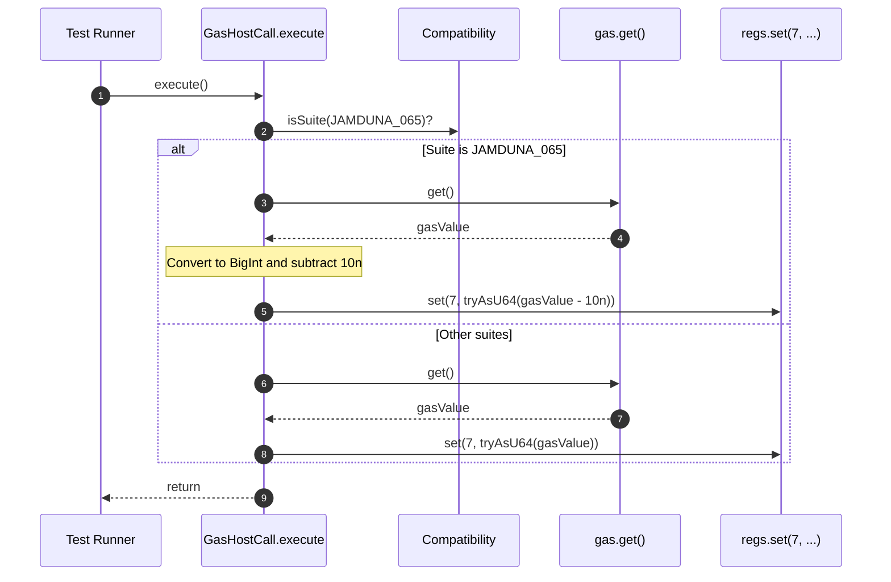

# subtract additional 10 gas in gas host call

## Pull Request by @mateuszsikora

I am sure that it is not a correct code (we subtract gas host call twice) but it makes a lot of 065 tests green...


## Comment by @coderabbitai[bot]

<!-- This is an auto-generated comment: summarize by coderabbit.ai -->
<!-- This is an auto-generated comment: skip review by coderabbit.ai -->

> [!IMPORTANT]
> ## Review skipped
> 
> Auto incremental reviews are disabled on this repository.
> 
> Please check the settings in the CodeRabbit UI or the `.coderabbit.yaml` file in this repository. To trigger a single review, invoke the `@coderabbitai review` command.
> 
> You can disable this status message by setting the `reviews.review_status` to `false` in the CodeRabbit configuration file.

<!-- end of auto-generated comment: skip review by coderabbit.ai -->
<!-- walkthrough_start -->

<details>
<summary>📝 Walkthrough</summary>

<!-- This is an auto-generated comment: release notes by coderabbit.ai -->

## Summary by CodeRabbit

* Bug Fixes
  * Corrected gas handling under a specific compatibility mode to align with expected behavior, improving correctness without impacting general execution or public APIs.

* Tests
  * Enabled multiple previously ignored state-transition vectors across relevant suites, significantly expanding coverage and confidence.
  * All other ignored entries remain unchanged; no test runner behavior changes beyond the updated filters.

<!-- end of auto-generated comment: release notes by coderabbit.ai -->
## Walkthrough
The test runner re-enables twelve previously ignored JAMDUNA_065 test vectors. The gas host call now conditionally adjusts the reported gas for the JAMDUNA_065 suite by subtracting 10n before writing to register 7. No public interfaces changed.

## Changes
| Cohort / File(s) | Summary |
|---|---|
| **Test runner ignore list updates**<br>`bin/test-runner/jamduna-065.ts` | Removed 12 entries from the ignored test vectors: assurances/state_transitions (00000026, 28, 30, 32, 39, 41) and orderedaccumulation/state_transitions (00000029, 31, 33, 35, 37, 39). Other ignores unchanged. |
| **Gas host call compatibility tweak**<br>`packages/jam/jam-host-calls/gas.ts` | Imported Compatibility and TestSuite; in GasHostCall.execute, for TestSuite.JAMDUNA_065, uses BigInt(gas.get()) - 10n; otherwise gas.get(). Writes value via regs.set(7, tryAsU64(...)). Added TODO comment. No signature changes. |

## Sequence Diagram(s)


## Estimated code review effort
🎯 3 (Moderate) | ⏱️ ~20 minutes

## Poem
> I hop through tests, twelve more to try,  
> A nibble off the gas—ten ticks go by.  
> Registers set, the suite aligned,  
> Carrots stacked, assertions fine.  
> Thump-thump! The runner hums along—  
> More cases join the midnight song.

</details>

<!-- walkthrough_end -->
<!-- internal state start -->


<!-- DwQgtGAEAqAWCWBnSTIEMB26CuAXA9mAOYCmGJATmriQCaQDG+Ats2bgFyQAOFk+AIwBWJBrngA3EsgEBPRvlqU0AgfFwA6NPEgQAfACgjoCEYDEZyAAUASpETZWaCrKPR1AGxJcHA3FTF0Wlp1eHwMNA9IAEYABkgiNGR4LETkWHxEXEZIqMgDADlHAUouAFYKyHyAVRsAGS5YXFxuRA4AenaidVhsAQ0mZnaAMQ9sADNx2TqVRHbcWW4SEooXdu5sDw92irKqg2rEUshmahJsRAAvRHgAa3wqfYBlfGwKBhJIASoMBlguZiIMBoWhCC64YhJMAZLJgBi5MAEMBCNDMWjYCJgWIANj2+WgzlI2W+mD+AO0WHyT1w1AuXHwS0pBhsJAk8BIAHdKG1IARmBdaBQOQAaSAAEQoAFEpKt9jMSh4eQAKDDhEgASn2AGEKCQzvRqFwAEyxI1lLEADjAJugsQAnBwzRw4gAtIxi6QMCjwbjicJcOCfP6YUj2Pr+NBiZCYIIhP0RKJxBJJFBYXCwT5pSAw7LwrYaGAZnDph6QVU0ZDpoOKT6oDx3EgeeQpJirUTZJXqMN+AK4ZBZnM5La8jnwD6agR4SC67gPPu82DUBeoZiKeDjMfUMJYU63aQnTDyWIaXG86Tz7hJRAaIz6YzgKBkej4cbFwikchUGj0QZsDCcHg+EEEQxEkfc5AUJQqFUdQtB0O8TCgOBUFQGM0Dwd8yGUb8FFYdguCoDkwycFwvnkJgoJUNRNG0XQwEMe9TAMNQMHmc8wAoDFP3aFE0QxNAsVxDQ+w4AwACIJIMCxIAAQQASWILCvzoYjTlIl9GEXDBSEQNwi0vXA/mnEhVykSsuQ8KRIHYb193GCgWAXWsiFVXV6ArbIpDEB5kiwFi2NhTiMG43j0UxHEymExBRXhC4UiIJyjkgLyCAoSt8C+WtfjGJR6BSM8smnDFr0gJ4lgYddNy2WRRSrSBxnwLZ8FHbTIAAKSeAB5Apo11MsMo8cJSD4eAXIeOhRIMKArzeUlpHaLIzgAfQjDAbnjHlYi27ajWxDQhEQcJRW2naLX2w6MGOk7YgAZmPA6jsga7bqNc7Huem67Tey6nuugAWaJvqm/gKCguhIwYRxNi3cIFppGgVp+dbt0266jS+h6fo+wHMauk6bpu768e2m7Itx378YAdiJimSYxi6jBk4d8CrEaxrc6z/1s5BdVOfKMWDbS6ALAoMsFnTeQyygHL4LTaHrVrSyYLnGvqwaOQAbn4DAmycgqIQ3DwaD4Tt2boTVlY3IhZvjSAORTVcQg3YWjHMSwmeNmG1slvWlAYDxnC95ANJIAAPWcKBw0sNgEesGE58RxGkW9IFFzSQ33AhrPDucVOjvo48gP2A6/FGbwMSUsngU4cIoz5dTZTlrMmOcuAAWToeBHHEySpqYy8GFuNAdJ41FR+YaFMghPNFS6JIotEiSxKk92FI/bCVIcEj5A08Xk+BmTghU6uI+yDStRYAz4DUesFnQDB6Ggc8nmwdRPnsxyAAEFiWFY1jweAiobxQDklgAA4kkAAElPLUuQNBh1EHgEgooZwBw+PQEIupAhpA0ESJUmoLjD0+KOdM6AFAP1COESIyZEAADVIjYG8AYKoIDXwX2YFfG+6hZAaCQC/N+Son5ZH4TQDQbUZJtzFNUAoMkloRU1KgfwjDRRpHoWMT4ABeSAAAhUaoDcBKhwXg9UmooBxAwFrFmGYhRIEzEkNRjDIBaKMSQAx6pgHGSINeI4BjKa1RcDJRA1RsR/UMfYhhGoFHIFVERC4x81o0BBPwV8uovEaB8UqPxvIAlBJCWE68xiTEeMPrlMh0BOpik6rhP82QUghHhOIVqaB9ZgBSg8DijZ9TkI+BQDAHjOoylyJlRcbIlZaQluEXWDU+DNMQOVSq8cPJhjflrdeVAojjHVsZPm3s6qIFRCQcubtZJG2wijH2dVi6Bw2sk7Op8858BjoXdgoR95QDTjcFytI+p73Snc3OtB1gFzHAnV514jCV3EDXFSddjKNyIiQFukd26d27kvW89FGKPgfrc9CSI1ldN/PhacaAiJbzUvICCddoLUTgnRQwiFqnqCWvAWgiAloN3ZFyWgS1FqR3pVi+q0RsRGkpgwP6lNYjjAEBaNA0RohGjQGUI00Q/p2hFQwG6cQ7RGgtH9WV9psR2mlQKgwjLfzMtZeyzlnI6BLSfPSoAA= -->

<!-- internal state end -->
<!-- tips_start -->

---


<details>
<summary>🪧 Tips</summary>

### Chat

There are 3 ways to chat with [CodeRabbit](https://coderabbit.ai?utm_source=oss&utm_medium=github&utm_campaign=FluffyLabs/typeberry&utm_content=555):

- Review comments: Directly reply to a review comment made by CodeRabbit. Example:
  - `I pushed a fix in commit <commit_id>, please review it.`
  - `Open a follow-up GitHub issue for this discussion.`
- Files and specific lines of code (under the "Files changed" tab): Tag `@coderabbitai` in a new review comment at the desired location with your query.
- PR comments: Tag `@coderabbitai` in a new PR comment to ask questions about the PR branch. For the best results, please provide a very specific query, as very limited context is provided in this mode. Examples:
  - `@coderabbitai gather interesting stats about this repository and render them as a table. Additionally, render a pie chart showing the language distribution in the codebase.`
  - `@coderabbitai read the files in the src/scheduler package and generate a class diagram using mermaid and a README in the markdown format.`

### Support

Need help? Create a ticket on our [support page](https://www.coderabbit.ai/contact-us/support) for assistance with any issues or questions.

### CodeRabbit Commands (Invoked using PR/Issue comments)

Type `@coderabbitai help` to get the list of available commands.

### Other keywords and placeholders

- Add `@coderabbitai ignore` anywhere in the PR description to prevent this PR from being reviewed.
- Add `@coderabbitai summary` to generate the high-level summary at a specific location in the PR description.
- Add `@coderabbitai` anywhere in the PR title to generate the title automatically.

### Status, Documentation and Community

- Visit our [Status Page](https://status.coderabbit.ai) to check the current availability of CodeRabbit.
- Visit our [Documentation](https://docs.coderabbit.ai) for detailed information on how to use CodeRabbit.
- Join our [Discord Community](http://discord.gg/coderabbit) to get help, request features, and share feedback.
- Follow us on [X/Twitter](https://twitter.com/coderabbitai) for updates and announcements.

</details>

<!-- tips_end -->


## Comment by @DrEverr

Maybe it's better to announce what we found to JamDuna. This looks like either hack to wrong tests, or we are missing something in the implementation. And if it is a wrong test is it worth to align with it?


## Comment by @github-actions[bot]


| File | Benchmark | Error |
|------|-----------|-------|
| [codec/encoding.ts[3]](../blob/28a1b16ff62a1b9bcc90585e4ae876c1501761bc//_work/typeberry-runner-2/typeberry/typeberry/benchmarks/codec/encoding.ts) | manual encode |  Fastest result changed to (current) "manual encode[0]" from "dataview encode[2] or int32array encode[1]" (expected) ❌ |


<details>
<summary>View all</summary>

| File | Benchmark | Ops |  |
|------|-----------|-----|--|
| [collections/map-set.ts[0]](../blob/28a1b16ff62a1b9bcc90585e4ae876c1501761bc//_work/typeberry-runner-2/typeberry/typeberry/benchmarks/collections/map-set.ts) | 2 gets + conditional set | 70067.05 ±0.15% | fastest ✅ |
| [collections/map-set.ts[1]](../blob/28a1b16ff62a1b9bcc90585e4ae876c1501761bc//_work/typeberry-runner-2/typeberry/typeberry/benchmarks/collections/map-set.ts) | 1 get 1 set | 42781.3 ±0.02% | 38.94% slower |
| [hash/index.ts[0]](../blob/28a1b16ff62a1b9bcc90585e4ae876c1501761bc//_work/typeberry-runner-2/typeberry/typeberry/benchmarks/hash/index.ts) | hash with numeric representation | 190.27 ±0.33% | 23.93% slower |
| [hash/index.ts[1]](../blob/28a1b16ff62a1b9bcc90585e4ae876c1501761bc//_work/typeberry-runner-2/typeberry/typeberry/benchmarks/hash/index.ts) | hash with string representation | 119.53 ±0.11% | 52.21% slower |
| [hash/index.ts[2]](../blob/28a1b16ff62a1b9bcc90585e4ae876c1501761bc//_work/typeberry-runner-2/typeberry/typeberry/benchmarks/hash/index.ts) | hash with symbol representation | 181.94 ±0.12% | 27.26% slower |
| [hash/index.ts[3]](../blob/28a1b16ff62a1b9bcc90585e4ae876c1501761bc//_work/typeberry-runner-2/typeberry/typeberry/benchmarks/hash/index.ts) | hash with uint8 representation | 165.05 ±0.02% | 34.02% slower |
| [hash/index.ts[4]](../blob/28a1b16ff62a1b9bcc90585e4ae876c1501761bc//_work/typeberry-runner-2/typeberry/typeberry/benchmarks/hash/index.ts) | hash with packed representation | 250.14 ±0.05% | fastest ✅ |
| [hash/index.ts[5]](../blob/28a1b16ff62a1b9bcc90585e4ae876c1501761bc//_work/typeberry-runner-2/typeberry/typeberry/benchmarks/hash/index.ts) | hash with bigint representation | 194.06 ±0.04% | 22.42% slower |
| [hash/index.ts[6]](../blob/28a1b16ff62a1b9bcc90585e4ae876c1501761bc//_work/typeberry-runner-2/typeberry/typeberry/benchmarks/hash/index.ts) | hash with uint32 representation | 204.84 ±0.08% | 18.11% slower |
| [logger/index.ts[0]](../blob/28a1b16ff62a1b9bcc90585e4ae876c1501761bc//_work/typeberry-runner-2/typeberry/typeberry/benchmarks/logger/index.ts) | console.log with string concat | 7443418.75 ±55.86% | fastest ✅ |
| [logger/index.ts[1]](../blob/28a1b16ff62a1b9bcc90585e4ae876c1501761bc//_work/typeberry-runner-2/typeberry/typeberry/benchmarks/logger/index.ts) | console.log with args | 257623.11 ±108.82% | 96.54% slower |
| [bytes/hex-from.ts[0]](../blob/28a1b16ff62a1b9bcc90585e4ae876c1501761bc//_work/typeberry-runner-2/typeberry/typeberry/benchmarks/bytes/hex-from.ts) | parse hex using `Number` with NaN checking | 121197.24 ±3.18% | 83.7% slower |
| [bytes/hex-from.ts[1]](../blob/28a1b16ff62a1b9bcc90585e4ae876c1501761bc//_work/typeberry-runner-2/typeberry/typeberry/benchmarks/bytes/hex-from.ts) | parse hex from char codes | 743716.1 ±0.17% | fastest ✅ |
| [bytes/hex-from.ts[2]](../blob/28a1b16ff62a1b9bcc90585e4ae876c1501761bc//_work/typeberry-runner-2/typeberry/typeberry/benchmarks/bytes/hex-from.ts) | parse hex from string nibbles | 486432.15 ±0.32% | 34.59% slower |
| [bytes/hex-to.ts[0]](../blob/28a1b16ff62a1b9bcc90585e4ae876c1501761bc//_work/typeberry-runner-2/typeberry/typeberry/benchmarks/bytes/hex-to.ts) | number toString + padding | 255247.15 ±0.33% | fastest ✅ |
| [bytes/hex-to.ts[1]](../blob/28a1b16ff62a1b9bcc90585e4ae876c1501761bc//_work/typeberry-runner-2/typeberry/typeberry/benchmarks/bytes/hex-to.ts) | manual | 14401.64 ±0.38% | 94.36% slower |
| [codec/bigint.compare.ts[0]](../blob/28a1b16ff62a1b9bcc90585e4ae876c1501761bc//_work/typeberry-runner-2/typeberry/typeberry/benchmarks/codec/bigint.compare.ts) | compare custom | 261522784.46 ±7.27% | 6.54% slower |
| [codec/bigint.compare.ts[1]](../blob/28a1b16ff62a1b9bcc90585e4ae876c1501761bc//_work/typeberry-runner-2/typeberry/typeberry/benchmarks/codec/bigint.compare.ts) | compare bigint | 279825220.68 ±4.79% | fastest ✅ |
| [codec/bigint.decode.ts[0]](../blob/28a1b16ff62a1b9bcc90585e4ae876c1501761bc//_work/typeberry-runner-2/typeberry/typeberry/benchmarks/codec/bigint.decode.ts) | decode custom | 216676061.99 ±4.39% | fastest ✅ |
| [codec/bigint.decode.ts[1]](../blob/28a1b16ff62a1b9bcc90585e4ae876c1501761bc//_work/typeberry-runner-2/typeberry/typeberry/benchmarks/codec/bigint.decode.ts) | decode bigint | 87406039.29 ±1.95% | 59.66% slower |
| [math/count-bits-u64.ts[0]](../blob/28a1b16ff62a1b9bcc90585e4ae876c1501761bc//_work/typeberry-runner-2/typeberry/typeberry/benchmarks/math/count-bits-u64.ts) | standard method | 1229679.4 ±0.33% | 84.5% slower |
| [math/count-bits-u64.ts[1]](../blob/28a1b16ff62a1b9bcc90585e4ae876c1501761bc//_work/typeberry-runner-2/typeberry/typeberry/benchmarks/math/count-bits-u64.ts) | magic | 7930904.33 ±0.31% | fastest ✅ |
| [math/add_one_overflow.ts[0]](../blob/28a1b16ff62a1b9bcc90585e4ae876c1501761bc//_work/typeberry-runner-2/typeberry/typeberry/benchmarks/math/add_one_overflow.ts) | add and take modulus | 271855409.51 ±5.65% | fastest ✅ |
| [math/add_one_overflow.ts[1]](../blob/28a1b16ff62a1b9bcc90585e4ae876c1501761bc//_work/typeberry-runner-2/typeberry/typeberry/benchmarks/math/add_one_overflow.ts) | condition before calculation | 258382307.37 ±7.41% | 4.96% slower |
| [math/count-bits-u32.ts[0]](../blob/28a1b16ff62a1b9bcc90585e4ae876c1501761bc//_work/typeberry-runner-2/typeberry/typeberry/benchmarks/math/count-bits-u32.ts) | standard method | 97562778.39 ±1.93% | 63.26% slower |
| [math/count-bits-u32.ts[1]](../blob/28a1b16ff62a1b9bcc90585e4ae876c1501761bc//_work/typeberry-runner-2/typeberry/typeberry/benchmarks/math/count-bits-u32.ts) | magic | 265536603.14 ±4.55% | fastest ✅ |
| [math/mul_overflow.ts[0]](../blob/28a1b16ff62a1b9bcc90585e4ae876c1501761bc//_work/typeberry-runner-2/typeberry/typeberry/benchmarks/math/mul_overflow.ts) | multiply and bring back to u32 | 278740979.35 ±4.03% | fastest ✅ |
| [math/mul_overflow.ts[1]](../blob/28a1b16ff62a1b9bcc90585e4ae876c1501761bc//_work/typeberry-runner-2/typeberry/typeberry/benchmarks/math/mul_overflow.ts) | multiply and take modulus | 271424311.24 ±5.82% | 2.62% slower |
| [math/switch.ts[0]](../blob/28a1b16ff62a1b9bcc90585e4ae876c1501761bc//_work/typeberry-runner-2/typeberry/typeberry/benchmarks/math/switch.ts) | switch | 287494990.05 ±4% | fastest ✅ |
| [math/switch.ts[1]](../blob/28a1b16ff62a1b9bcc90585e4ae876c1501761bc//_work/typeberry-runner-2/typeberry/typeberry/benchmarks/math/switch.ts) | if | 267649397.24 ±6.65% | 6.9% slower |
| [codec/decoding.ts[0]](../blob/28a1b16ff62a1b9bcc90585e4ae876c1501761bc//_work/typeberry-runner-2/typeberry/typeberry/benchmarks/codec/decoding.ts) | manual decode | 16362792.97 ±0.35% | 91.94% slower |
| [codec/decoding.ts[1]](../blob/28a1b16ff62a1b9bcc90585e4ae876c1501761bc//_work/typeberry-runner-2/typeberry/typeberry/benchmarks/codec/decoding.ts) | int32array decode | 203004071.34 ±4.39% | fastest ✅ |
| [codec/decoding.ts[2]](../blob/28a1b16ff62a1b9bcc90585e4ae876c1501761bc//_work/typeberry-runner-2/typeberry/typeberry/benchmarks/codec/decoding.ts) | dataview decode | 199577599.65 ±4.31% | 1.69% slower |
| [codec/encoding.ts[0]](../blob/28a1b16ff62a1b9bcc90585e4ae876c1501761bc//_work/typeberry-runner-2/typeberry/typeberry/benchmarks/codec/encoding.ts) | manual encode | 2563136.55 ±0.24% | fastest ✅ |
| [codec/encoding.ts[1]](../blob/28a1b16ff62a1b9bcc90585e4ae876c1501761bc//_work/typeberry-runner-2/typeberry/typeberry/benchmarks/codec/encoding.ts) | int32array encode | 459407.32 ±184.76% | 82.08% slower |
| [codec/encoding.ts[2]](../blob/28a1b16ff62a1b9bcc90585e4ae876c1501761bc//_work/typeberry-runner-2/typeberry/typeberry/benchmarks/codec/encoding.ts) | dataview encode | 1876524.79 ±3.28% | 26.79% slower |
| [codec/view_vs_collection.ts[0]](../blob/28a1b16ff62a1b9bcc90585e4ae876c1501761bc//_work/typeberry-runner-2/typeberry/typeberry/benchmarks/codec/view_vs_collection.ts) | Get first element from Decoded | 25968.62 ±1.82% | 60.84% slower |
| [codec/view_vs_collection.ts[1]](../blob/28a1b16ff62a1b9bcc90585e4ae876c1501761bc//_work/typeberry-runner-2/typeberry/typeberry/benchmarks/codec/view_vs_collection.ts) | Get first element from View | 66315.85 ±0.24% | fastest ✅ |
| [codec/view_vs_collection.ts[2]](../blob/28a1b16ff62a1b9bcc90585e4ae876c1501761bc//_work/typeberry-runner-2/typeberry/typeberry/benchmarks/codec/view_vs_collection.ts) | Get 50th element from Decoded | 27314.54 ±0.17% | 58.81% slower |
| [codec/view_vs_collection.ts[3]](../blob/28a1b16ff62a1b9bcc90585e4ae876c1501761bc//_work/typeberry-runner-2/typeberry/typeberry/benchmarks/codec/view_vs_collection.ts) | Get 50th element from View | 37913.93 ±0.17% | 42.83% slower |
| [codec/view_vs_collection.ts[4]](../blob/28a1b16ff62a1b9bcc90585e4ae876c1501761bc//_work/typeberry-runner-2/typeberry/typeberry/benchmarks/codec/view_vs_collection.ts) | Get last element from Decoded | 27403.86 ±0.31% | 58.68% slower |
| [codec/view_vs_collection.ts[5]](../blob/28a1b16ff62a1b9bcc90585e4ae876c1501761bc//_work/typeberry-runner-2/typeberry/typeberry/benchmarks/codec/view_vs_collection.ts) | Get last element from View | 26754.48 ±0.3% | 59.66% slower |
| [codec/view_vs_object.ts[0]](../blob/28a1b16ff62a1b9bcc90585e4ae876c1501761bc//_work/typeberry-runner-2/typeberry/typeberry/benchmarks/codec/view_vs_object.ts) | Get the first field from Decoded | 444723.36 ±0.09% | fastest ✅ |
| [codec/view_vs_object.ts[1]](../blob/28a1b16ff62a1b9bcc90585e4ae876c1501761bc//_work/typeberry-runner-2/typeberry/typeberry/benchmarks/codec/view_vs_object.ts) | Get the first field from View | 102766.33 ±0.17% | 76.89% slower |
| [codec/view_vs_object.ts[2]](../blob/28a1b16ff62a1b9bcc90585e4ae876c1501761bc//_work/typeberry-runner-2/typeberry/typeberry/benchmarks/codec/view_vs_object.ts) | Get the first field as view from View | 102375.33 ±0.15% | 76.98% slower |
| [codec/view_vs_object.ts[3]](../blob/28a1b16ff62a1b9bcc90585e4ae876c1501761bc//_work/typeberry-runner-2/typeberry/typeberry/benchmarks/codec/view_vs_object.ts) | Get two fields from Decoded | 443328.85 ±0.18% | 0.31% slower |
| [codec/view_vs_object.ts[4]](../blob/28a1b16ff62a1b9bcc90585e4ae876c1501761bc//_work/typeberry-runner-2/typeberry/typeberry/benchmarks/codec/view_vs_object.ts) | Get two fields from View | 81506.43 ±0.16% | 81.67% slower |
| [codec/view_vs_object.ts[5]](../blob/28a1b16ff62a1b9bcc90585e4ae876c1501761bc//_work/typeberry-runner-2/typeberry/typeberry/benchmarks/codec/view_vs_object.ts) | Get two fields from materialized from View | 170835.58 ±0.21% | 61.59% slower |
| [codec/view_vs_object.ts[6]](../blob/28a1b16ff62a1b9bcc90585e4ae876c1501761bc//_work/typeberry-runner-2/typeberry/typeberry/benchmarks/codec/view_vs_object.ts) | Get two fields as views from View | 81156.25 ±0.15% | 81.75% slower |
| [codec/view_vs_object.ts[7]](../blob/28a1b16ff62a1b9bcc90585e4ae876c1501761bc//_work/typeberry-runner-2/typeberry/typeberry/benchmarks/codec/view_vs_object.ts) | Get only third field from Decoded | 444329.82 ±0.19% | 0.09% slower |
| [codec/view_vs_object.ts[8]](../blob/28a1b16ff62a1b9bcc90585e4ae876c1501761bc//_work/typeberry-runner-2/typeberry/typeberry/benchmarks/codec/view_vs_object.ts) | Get only third field from View | 102023.17 ±0.16% | 77.06% slower |
| [codec/view_vs_object.ts[9]](../blob/28a1b16ff62a1b9bcc90585e4ae876c1501761bc//_work/typeberry-runner-2/typeberry/typeberry/benchmarks/codec/view_vs_object.ts) | Get only third field as view from View | 101893.19 ±0.13% | 77.09% slower |
| [bytes/compare.ts[0]](../blob/28a1b16ff62a1b9bcc90585e4ae876c1501761bc//_work/typeberry-runner-2/typeberry/typeberry/benchmarks/bytes/compare.ts) | Comparing Uint32 bytes | 18736.68 ±0.12% | fastest ✅ |
| [bytes/compare.ts[1]](../blob/28a1b16ff62a1b9bcc90585e4ae876c1501761bc//_work/typeberry-runner-2/typeberry/typeberry/benchmarks/bytes/compare.ts) | Comparing raw bytes | 18558.25 ±0.12% | 0.95% slower |
| [hash/blake2b.ts[0]](../blob/28a1b16ff62a1b9bcc90585e4ae876c1501761bc//_work/typeberry-runner-2/typeberry/typeberry/benchmarks/hash/blake2b.ts) | hasher with simple allocator | 0.0464 ±0.01% | fastest ✅ |
| [hash/blake2b.ts[1]](../blob/28a1b16ff62a1b9bcc90585e4ae876c1501761bc//_work/typeberry-runner-2/typeberry/typeberry/benchmarks/hash/blake2b.ts) | hasher with page allocator | 0.0456 ±0.52% | 1.72% slower |
| [collections/map_vs_sorted.ts[0]](../blob/28a1b16ff62a1b9bcc90585e4ae876c1501761bc//_work/typeberry-runner-2/typeberry/typeberry/benchmarks/collections/map_vs_sorted.ts) | Map | 310511.58 ±0.03% | fastest ✅ |
| [collections/map_vs_sorted.ts[1]](../blob/28a1b16ff62a1b9bcc90585e4ae876c1501761bc//_work/typeberry-runner-2/typeberry/typeberry/benchmarks/collections/map_vs_sorted.ts) | Map-array | 103561.79 ±0.02% | 66.65% slower |
| [collections/map_vs_sorted.ts[2]](../blob/28a1b16ff62a1b9bcc90585e4ae876c1501761bc//_work/typeberry-runner-2/typeberry/typeberry/benchmarks/collections/map_vs_sorted.ts) | Array | 65471.07 ±0.33% | 78.92% slower |
| [collections/map_vs_sorted.ts[3]](../blob/28a1b16ff62a1b9bcc90585e4ae876c1501761bc//_work/typeberry-runner-2/typeberry/typeberry/benchmarks/collections/map_vs_sorted.ts) | SortedArray | 198988.53 ±0.17% | 35.92% slower |
| [crypto/ed25519.ts[0]](../blob/28a1b16ff62a1b9bcc90585e4ae876c1501761bc//_work/typeberry-runner-2/typeberry/typeberry/benchmarks/crypto/ed25519.ts) | native crypto | 8.38 ±0.19% | 72.36% slower |
| [crypto/ed25519.ts[1]](../blob/28a1b16ff62a1b9bcc90585e4ae876c1501761bc//_work/typeberry-runner-2/typeberry/typeberry/benchmarks/crypto/ed25519.ts) | wasm lib | 10.65 ±0.02% | 64.87% slower |
| [crypto/ed25519.ts[2]](../blob/28a1b16ff62a1b9bcc90585e4ae876c1501761bc//_work/typeberry-runner-2/typeberry/typeberry/benchmarks/crypto/ed25519.ts) | wasm lib batch | 30.32 ±0.06% | fastest ✅ |
</details>


### Benchmarks summary: 63/63 OK ✅

<!-- thollander/actions-comment-pull-request "benchmarks" -->


## Comment by @mateuszsikora

> Maybe it's better to announce what we found to JamDuna. This looks like either hack to wrong tests, or we are missing something in the implementation. And if it is a wrong test is it worth to align with it?

the problem is that 065 is not an official release. The official ones are 064 and 067. I will report it if I find the same problems in 067 


## Comment by @coderabbitai[bot]

_💡 Verification agent_

<details>
<summary>🧩 Analysis chain</summary>

**Confirm who pays the host-call cost to prevent double-charging.**

The comment hints at “subtracting gas host call twice.” Make sure the interpreter isn’t already charging gasCost for invoking the host call, otherwise subtracting again here will drift accounting. If the interpreter charges, this handler should only report the post-invocation balance, not deduct again.


To aid verification, run this script to inspect where gas is consumed and how other host calls report remaining gas:

---

🏁 Script executed:

```shell
#!/bin/bash
set -euo pipefail

echo "Locate GasCounter definition and get/consume semantics:"
rg -n -C3 -g '!**/node_modules/**' -P '(\b(interface|type|class)\s+GasCounter\b)|\bget\(\)|\bconsume\b|\btryConsume\b'

echo
echo "Check how other host calls report gas back to regs[7]:"
rg -n -C2 -g '!**/node_modules/**' -P 'class\s+\w+HostCall\b.*|regs\.set\(\s*7\s*,\s*tryAsU64\('

echo
echo "Look for where gasCost is deducted during host call dispatch:"
rg -n -C3 -g '!**/node_modules/**' -P 'gasCost\s*=|\.consume\(|\.tryConsume\(|chargeHostCall|chargeGas|HostCall.*execute\('
```

Length of output: 52895

---


</details>

**Prevent double-charging gasCost in GasHostCall.execute**

Our verification shows that the host-calls manager (packages/jam/pvm-host-calls/host-calls.ts) always does  
```ts
const gasBefore = gas.get();
…  
gas.sub(hostCall.gasCost);
```
before invoking any handler.  Therefore inside GasHostCall.execute, `gas.get()` already reflects the post-invocation balance, and subtracting 10n again in the `JAMDUNA_065` branch applies the host-call cost twice.

Please update packages/jam/jam-host-calls/gas.ts (around lines 24–26) to remove the extra subtraction:

```diff
-   // TODO [MaSi]: it looks like a problem in test vectors...
-   const gasValue = Compatibility.isSuite(TestSuite.JAMDUNA_065)
-     ? BigInt(gas.get()) - 10n
-     : gas.get();
+   // Report remaining gas (already charged by the host-call manager)
+   const gasValue = gas.get();

    regs.set(7, tryAsU64(gasValue));
```

If the JAMDUNA_065 test vectors still expect an extra 10n deduction, adjust the test expectations rather than production logic.

<details>
<summary>🤖 Prompt for AI Agents</summary>

```
In packages/jam/jam-host-calls/gas.ts around lines 24 to 26 the JAMDUNA_065
branch subtracts 10n from gas.get(), causing double-charging because the
host-calls manager already deducted hostCall.gasCost before invocation; remove
the extra "- 10n" so you use gas.get() directly when computing gasValue and set
regs.set(7, tryAsU64(gas.get())); if the JAMDUNA_065 test vectors still expect
the extra deduction, update those test expectations instead of changing
production code.
```

</details>

<!-- fingerprinting:phantom:poseidon:chinchilla -->

---

_💡 Verification agent_

<details>
<summary>🧩 Analysis chain</summary>

**Avoid negative U64 and hard-coded 10n; derive from gasCost, clamp to 0, and keep types consistent.**

- BigInt(gas.get()) - 10n can go negative, causing tryAsU64 to throw (input must have eight-byte representation).
- Hardcoding 10n duplicates gasCost; derive from this.gasCost instead.
- The ternary returns bigint | number; unify to bigint to avoid implicit widening and future surprises.

Apply this diff:

```diff
-    // TODO [MaSi]: it looks like a problem in test vectors...
-    const gasValue = Compatibility.isSuite(TestSuite.JAMDUNA_065) ? BigInt(gas.get()) - 10n : gas.get();
-    regs.set(7, tryAsU64(gasValue));
+    // JAMDUNA_065 compatibility: return gas after invocation by subtracting this host call's cost.
+    const g = BigInt(gas.get());
+    const gasValue = Compatibility.isSuite(TestSuite.JAMDUNA_065)
+      ? (g >= BigInt(this.gasCost) ? g - BigInt(this.gasCost) : 0n)
+      : g;
+    regs.set(7, tryAsU64(gasValue));
```


Please confirm that clamping to 0 aligns with the intended PVM semantics for “remaining gas” (versus trapping on underflow). If trapping is intended, we can turn the guard into an explicit check with a precise error.

---

🏁 Script executed:

```shell
#!/bin/bash
set -e

echo "=== packages/jam/jam-host-calls/gas.ts (first 200 lines) ==="
sed -n '1,200p' packages/jam/jam-host-calls/gas.ts || true

echo
echo "=== All occurrences of 'gasCost' in the repo ==="
rg -n --color=never 'gasCost' -C2 .

echo
echo "=== Occurrences of 'gas.get' in gas.ts ==="
rg -n --color=never 'gas\.get' -C2 packages/jam/jam-host-calls/gas.ts || true
```

Length of output: 24193

---

🏁 Script executed:

```shell
#!/bin/bash
set -e

echo "=== Locate gas.js files ==="
fd -t f | grep -E 'packages/.*/gas\.js$' || true

echo
echo "=== Show first 200 lines of packages/core/pvm-interpreter/gas.js ==="
sed -n '1,200p' packages/core/pvm-interpreter/gas.js || true

echo
echo "=== Extract GasCounter definition and its methods ==="
rg -n --color=never 'class GasCounter' -C5 packages/core/pvm-interpreter/gas.js || true
rg -n --color=never 'get\(\)' -C3 packages/core/pvm-interpreter/gas.js || true

echo
echo "=== Locate tryAsSmallGas implementation ==="
rg -n --color=never 'tryAsSmallGas' -C5 packages/core/pvm-interpreter/gas.js || true
```

Length of output: 1132

---

🏁 Script executed:

```shell
#!/bin/bash
set -e

echo "=== List pvm-interpreter package files ==="
fd -t f packages/pvm-interpreter

echo
echo "=== Search for tryAsSmallGas definition ==="
rg -n --color=never 'tryAsSmallGas' -C5 packages/pvm-interpreter

echo
echo "=== Search for GasCounter class/interface ==="
rg -n --color=never 'GasCounter' -C5 packages/pvm-interpreter
```

Length of output: 373

---

```bash
#!/usr/bin/env bash
set -e

echo "=== Find all gas.js files ==="
find packages -type f -name 'gas.js'

echo
echo "=== Search for tryAsSmallGas globally ==="
rg -n --color=never 'tryAsSmallGas' -C5 .

echo
echo "=== Search for GasCounter globally ==="
rg -n --color=never 'GasCounter' -C5 .
```

---


</details>

**Ensure gas subtraction derives from this.gasCost, clamps to zero, and stays in BigInt**

Derive the subtraction amount from `this.gasCost` (not a hard-coded `10n`), clamp underflow to `0n`, and unify both branches to `BigInt`.

• File packages/jam/jam-host-calls/gas.ts, lines 24–26:

```diff
-    // TODO [MaSi]: it looks like a problem in test vectors...
-    const gasValue = Compatibility.isSuite(TestSuite.JAMDUNA_065) ? BigInt(gas.get()) - 10n : gas.get();
-    regs.set(7, tryAsU64(gasValue));
+    // JAMDUNA_065 compatibility: subtract this host call’s cost from remaining gas
+    const g = BigInt(gas.get());
+    const cost = BigInt(this.gasCost);
+    const gasValue = Compatibility.isSuite(TestSuite.JAMDUNA_065)
+      ? (g >= cost ? g - cost : 0n)
+      : g;
+    regs.set(7, tryAsU64(gasValue));
```

Please confirm that clamping to `0n` matches the intended PVM semantics for “remaining gas” (vs. trapping on underflow). If an explicit trap is required when the host-call cost exceeds available gas, replace the guard with a precise error.

<!-- suggestion_start -->

<details>
<summary>📝 Committable suggestion</summary>

> ‼️ **IMPORTANT**
> Carefully review the code before committing. Ensure that it accurately replaces the highlighted code, contains no missing lines, and has no issues with indentation. Thoroughly test & benchmark the code to ensure it meets the requirements.

```suggestion
    // JAMDUNA_065 compatibility: subtract this host call’s cost from remaining gas
    const g = BigInt(gas.get());
    const cost = BigInt(this.gasCost);
    const gasValue = Compatibility.isSuite(TestSuite.JAMDUNA_065)
      ? (g >= cost ? g - cost : 0n)
      : g;
    regs.set(7, tryAsU64(gasValue));
```

</details>

<!-- suggestion_end -->

<details>
<summary>🤖 Prompt for AI Agents</summary>

```
In packages/jam/jam-host-calls/gas.ts around lines 24–26, the subtraction uses a
hard-coded 10n and mixes numeric types; change it to subtract this.gasCost (as a
BigInt) from gas.get(), ensure both operands are BigInt, clamp any negative
result to 0n (i.e., remainingGas = max(0n, BigInt(gas.get()) -
BigInt(this.gasCost))) and set regs.set(7, tryAsU64(remainingGas)); if instead
the PVM should trap when host-call cost exceeds available gas, replace the clamp
with a precise error/throw rather than returning 0n.
```

</details>

<!-- fingerprinting:phantom:poseidon:chinchilla -->

<!-- This is an auto-generated comment by CodeRabbit -->


## Comment by @tomusdrw

Can you add a comment why we ignore them?


## Comment by @mateuszsikora

done
