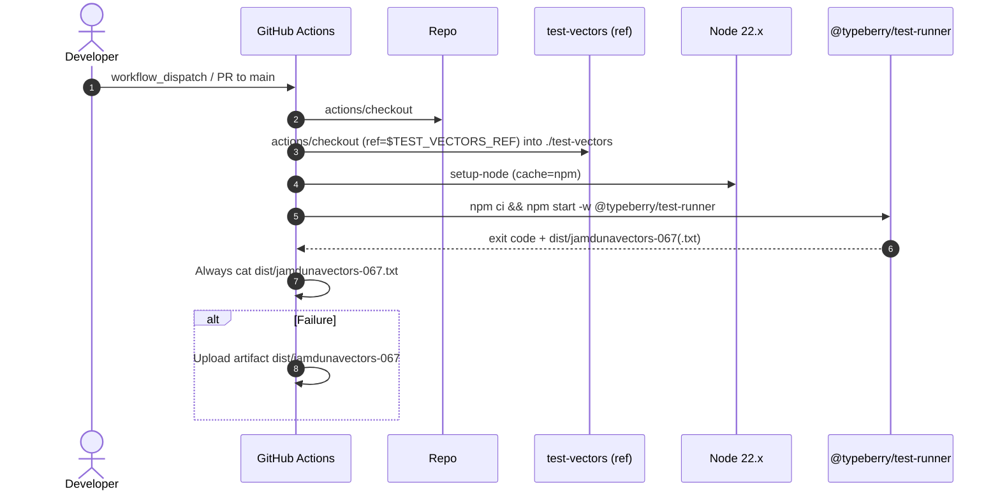
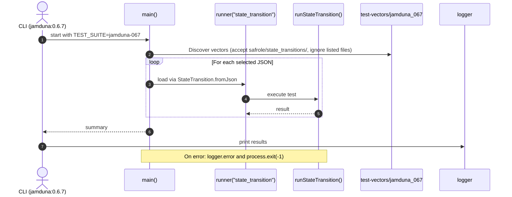
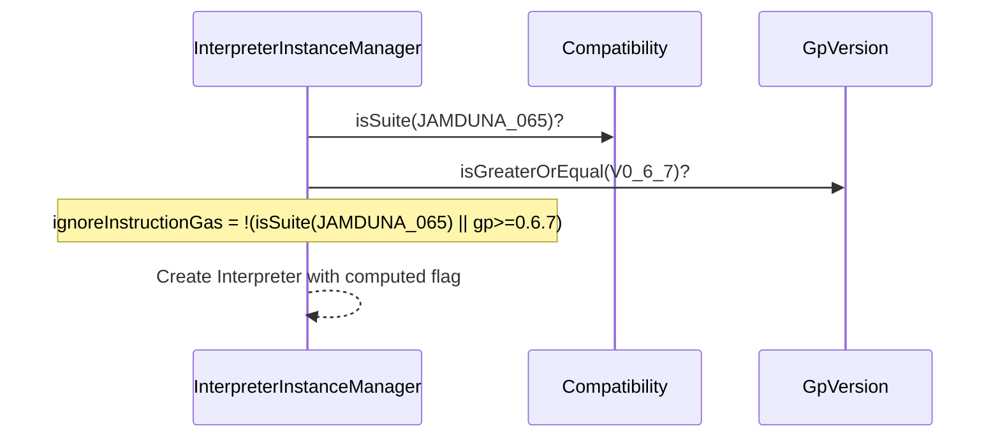

# Run jamduna 067 test vectors

## Pull Request by @mateuszsikora

### Changes:
- added script to run jamduna 067 test vectors
- added CI workflow
- marked failing tests to be ignored


## Comment by @coderabbitai[bot]

<!-- This is an auto-generated comment: summarize by coderabbit.ai -->
<!-- This is an auto-generated comment: skip review by coderabbit.ai -->

> [!IMPORTANT]
> ## Review skipped
> 
> Auto incremental reviews are disabled on this repository.
> 
> Please check the settings in the CodeRabbit UI or the `.coderabbit.yaml` file in this repository. To trigger a single review, invoke the `@coderabbitai review` command.
> 
> You can disable this status message by setting the `reviews.review_status` to `false` in the CodeRabbit configuration file.

<!-- end of auto-generated comment: skip review by coderabbit.ai -->
<!-- walkthrough_start -->

<details>
<summary>📝 Walkthrough</summary>

<!-- This is an auto-generated comment: release notes by coderabbit.ai -->

## Summary by CodeRabbit

* New Features
  * Added support for the Jamduna 0.6.7 test suite.
  * Updated gas handling to respect instruction gas for GP ≥ 0.6.7 (and Jamduna 0.6.5), improving accuracy.
  * Aligned ServiceId encoding for the new suite to match existing behavior in similar suites.

* Tests
  * Introduced a new test runner and script for Jamduna 0.6.7 vectors.
  * Ensures results are always displayed; failures upload artifacts for review.

* Chores
  * Added a GitHub Actions workflow to run Jamduna 0.6.7 vectors on PRs and manual triggers.

<!-- end of auto-generated comment: release notes by coderabbit.ai -->
## Walkthrough
Introduces a new jamduna 0.6.7 test suite across CI and runtime: adds a GitHub Actions workflow, registers the suite in enums and the test runner, adds a dedicated runner script and npm script, updates interpreter gas behavior gated by GP version and suite, and adjusts ServiceId encoding rules for the new suite.

## Changes
| Cohort / File(s) | Summary |
| --- | --- |
| **CI workflow: jamduna 0.6.7**<br>`.github/workflows/vectors-jamduna-067.yml` | New workflow “jamduna test vectors 0.6.7” triggered by PRs to main and manual dispatch; checks out repo and test-vectors at ref, sets up Node 22.x, runs test-runner, always prints results, uploads artifacts on failure. |
| **Test runner registration & script**<br>`bin/test-runner/index.ts`, `bin/test-runner/jamduna-067.ts`, `bin/test-runner/package.json` | Registers TestSuite.JAMDUNA_067 mapping to “jamdunavectors-067”; adds dedicated runner script targeting test-vectors/jamduna_067 with filters/ignores; adds npm script jamduna:0.6.7 to execute it. |
| **Compatibility enum update**<br>`packages/core/utils/compatibility.ts` | Adds enum member JAMDUNA_067 = "jamduna-067". |
| **Interpreter gas behavior**<br>`packages/jam/pvm-host-calls/interpreter-instance-manager.ts` | Updates ignoreInstructionGas initialization to depend on suite JAMDUNA_065 or GP version >= 0.6.7; imports GpVersion. |
| **ServiceId encoding condition**<br>`packages/jam/state/statistics.ts` | Extends asOpaque encoding condition to include TestSuite.JAMDUNA_067 alongside existing suites. |

## Sequence Diagram(s)






## Estimated code review effort
🎯 3 (Moderate) | ⏱️ ~20 minutes

## Poem
> A rabbit taps the drums at seven,
> New vectors hop from CI heaven.
> Gas now heeds the version bell,
> Stats encode their tales as well.
> With 0.6.7 in cozy sight,
> We run, we log, we artifact the night. 🥕✨

</details>

<!-- walkthrough_end -->
<!-- internal state start -->


<!-- DwQgtGAEAqAWCWBnSTIEMB26CuAXA9mAOYCmGJATmriQCaQDG+Ats2bgFyQAOFk+AIwBWJBrngA3EsgEBPRvlqU0AgfFwA6NPEgQAfACgjoCEYDEZyAAUASpETZWaCrKPR1AGxJcb2LELRmWj80SAAGADYAdkgaRFxIKTF8CmRIA1tIMy4AVhyIyHSAVRsAGS5YXFxuRA4AejqidVhsAQ0mZjqAMQ9sADM+2VKVRDrcWW4SAUoXOu5sDw86vIL0gEE8WBSuZmoSbEQAL0R4AGsU0PSAZXxsCgYSSAEqDAZYHcQwCj8wAKCQsCRGKAJMIYM5SAlnpg3jttFhrrhqAcuPhJvCDDYSBJ4CQAO6UWqxFgHWgUXEAGns5yOeDQlIAIhQAKJSCh8dLDaYeQkACgw+HIAEpCgYAMIUEh7ejULgAJjCspygIAHGB5dAAIzKjgagCcHFlEQAWkZ6dIGBR4NxxAKuHBHpk0LRaMhQogLVaEgRIN9/IFghhQkDYtIEkkCKlKU6XehIKKAJKQXEpU59Dz4CnoDD0XYUU7IPraDzwDBEEPxZDe6YoIj8iW0DRGfTGcBQMj0fB9HAEYhkZQ0egdNgYTg8PiCERiSTSJ7yJhKKiqdRaHTNkxQOCoVCYbuEUjkKgDhSsdhcKi4+yOXPyOQKBcqNSabS6MCGFumAwaJq4FoCOrJvM0wzUZwxST4/gDNBAWiDRZGYDwOAMAAiFCDAsSA1njXsDylS8nBcfguzeTBSEQIw1mdV1IHIC8AHF1AACVaDCpwFZAANTdML2oSAv2aVp/xTIDcRA0QI3A/0ASBWD4OowI6EgQAcAggkJyzDMSwPCDQIg0KINEAXAJIHjL1LSIUhUn4LAOOEgB9WgkG4ag3izehbErfBIF2Eso2zH0/GQAVY0QEgPD6MAtniBTfQPJNmljAA5RQSA0IRkFlWUNAAD086hLUyjRIDNPoSxnMhsQoAVhzDZx4BULxkGgJkrmgGyADUmVFaAAHkbCuGybCZLpKVoqw2qZXr4y6+LIB5MJtN0wUfPoRrmpsq4injRqZpUwNoKiQUCvtexERoGzcBeE4bX8QQeEoPoUmYWoDCgelsDQDxGFgURzjwLgS3UWqPolbgPLeb7blwSkfzIILJgYQH4EOBSwYYH6Ek7SA036QYPBGMZQzAUCLJLb0NHx+JCY0iyDhLMtocgAahtin9LwEZhFAWaRGygRKlHsEhcGwbhmdgajuGYRg0DeWnubFiX4cx/BFgzBTbwwcXjucBIwAvAABcZJmmNlZHJ3Avj8A9ZbWDxcTQWRkHsxBuFx+QJQcDxcBkOdqHEUtIEd3A6h2tAic+aTcEyzRnsgLqsELeBeglSkhfTJ1/aQQPg9Dvb0FdLAtfgQsxDkth6CzqnPjdhZPcbLqBGCigpCok5Sy8aiksp1J4ECktYi+nLzvgbKeXSrLhUwegDhnHcyvgCqMCqsBSWnLAJS7e6+DidTklSArEsRAQ2+YEsUh4ahRfsgZKDIB5CUd527cgKfkHLnew5giOElxBA2/pgui4SI5Fmz9ICv3EntRsRg0KWGtjQQ83cMDuT7o8JQDBcbwLYoRSAJBMogwoEeU+8xD7wAYNgkcANpBNkgIlbBuCUgDjmK0YspDUHoOoAg9i19PKKELjiBsRgmTxHgLsI885HgSmxHibBAx6FcAALJ0HgI4ZCqFnofjUBgU25sMAHjqCWJQ+VPaIRQkhaBGEsL7n7ApBw+F5AY2IqWShBgKIxlCDRHK3BuC0zIedeQ3p6Zb0vOoGcEomjxBcFwAA2tAUMVxsDBI0AAKTWHI+kRR4prBskCAAuroPQkAkJgLAntJCKAsAaK0dFSgejsw4I0DXGACBkA4JoNmSs/dgroy7BKJgtZEYKUCQ4YJiBKRkDqt4gJoY/I6MoESSA6YGB7BcrQ0QeBHhFNSBAz2yzvS8A5g8UBklAzZ3DpHXOyD07xH4HgeYmhqEeXwNDPg6YmgMEpEwEcFUPrCUpKfGYKRwoT2LH7BxpF0ASjKedfZdBIHmBgR7fsHC5n01Yc4dhmCMY4LwQQvgRDmE+IoWRaOiVyACKESI5GSUfRYhxBeEgMj8HyMUcokxTZ1ElkqRbapwctlPVZehTC2ErH0BsdeLBoKnEuKou46AEwSBXA9NaNS2iYruktEqniFSt4qu5UcqC4d2k8VxHPae9haa/ymVUvgG9NY0DAOdTAl0EFqUQAVYyKBmDYuQC88ylIvIYCWtMg8lJnYHEgFcE6JBoAXQBoFCe0yI17GjY62NGA3UJCUMVcgVErWujZI/Y1LMBSPHYBEoNlAeRIXiHsM6MarpIUpImmgybEGpo0H0CqzBEmIAFJSX0Tao11oQQdIyCQSwSHwKcGc/qRYXNzZSUUpREzgkcOwEZOz+6IgoBCNSiQK7px6RGeQSFtWhyDnqrJ0QkKHX7h84qRA7joqwBOMS9g4a8OngwB41prG3HuNPZAkSq1oA7UrEgdRq2nQda2q6owkK5PjXs7ESg860OdiQ9Q8yM5YMSVcKamME4zm9PAWsKRHg8lCOmP2wUACO2Ab6PFAxLRAIGvngcgyQWtKbYN1DCHx/jeoUo9qwELOZLHQNeAg5GrjMGOG8f42EDUCohMChHUdRZiwUAFiVlxVW8h6lfQwDyHkFBhQAF58k+soBoF5JnBTj18qEdoTlYDGZIOZ/JABveZ+AzLWf+RQHkAADAAJJ5kgABfILgoADcY58C31dTg9QPIwAali5ACLammn2EVQkB4nz3r9MrFMnBqyrqKz4KEBgj6jwOHrgLLBHH7VDsCqHZZsAgUzgcF+6QXsfNmW8VXD2ed6Dx0To8W8PqJn9wC8s5LvsyyFtFmI3QGpYVmNgYizB/j+6oowYgrBWL6EKUIUwkhBLxBOJ5sWrg/I0MndoIw4hLDRBsNg0mLh0ZTt8HZpfPhZS+6oAlZAwR4gKWDipRI2l0iN6jgUfZFlqiIBgCMFqgmVq5hS1OGgUgKmMDGNQgKixfZDzWKvM4OxRFOuOKJVAFxCk3FSPVsxvLhz/iBg4HNHSMQqwcu1ZjxyqNcfJVSgKG9jw1WemmQ1JqLV1qbSZGZnlwZPbZTJirj+66Wnthm48EORY6qPG1UMmg6BixoGCq6qBm2EUHaQSit7aKPuYrofgn7PBzukPYISqhCr1UJG+7QLgQXg5c/mlEILgOgvo4poL7HIv8dR78AuC5QWpfWkQFH4KrE01kvB7hVb0OpH0rh0yxHzAVGmLUajgwQucekTqEwCUdQ8AJ1GB0IB8A1DFnGPUvlROYEk5wnVinBF7E09IlQhn0pqJSLYMwI2yL+4xPiHE4JZDHBcGSak9JmTgxmYKZrqIpSH4PGlH0OBkAd9pIyZenIyzpgb0eMk1qawd+A/ryLjvZHW/iG5E3iwF3j3uoLIP3jeqgFihPO0pLo1hjAbgnEbjALEvEmbhIO9PRq6vcvwE8gNhdqfB8lCh4GAMJJ9CRFzDbgKnbk+g7ntk7vbkdm7jip7i9pdjiHTpAEyBgI4J5CQIvrMkHiHjfnvpejEIfoUnqiUlHr3EFsdvgpvhLKvrgOvjQNIVgEFl/o3s3uBm3gAZ3uwiAX3p7EFvnsIoXlDjSiXgyvDsypXqyjXkYJodIOep0NwBIMwOFPgBTBpgASTJQLwALJQGACWNWq8CQGALsIGOZP3oTqYsTkKmTiKmPlTmQbTtPs6ApLRNwK1ASM6rto8MItigpHihdroYSrLPGCOP4RKHApUaEQ8HIpgCLnwB8uEtgDvO3BeP9OIEVkjMgJUXAgEVfiEYiGEexHFCRnWCQHUedO0VdLRJbseLcozsgCADNKKEAQYQnKARoEgCoSQDyEofsUkikrfvvhEDkMKAAD5XFxibHiCGFgFIC0QSh7AUBdTMh0bvQ8hZE5Fdzi6tRhA2QRA2T7QjpWDQ63CIAeDyCYZTwdgYAwmQAgAbGepbG95PGID7GHEoEJLCF36RCXEQHIC7BTrIBECLH8hjqkb1hJiGbX6nEiGElaboBThSD8B8DfwwwjR7r/FYCoB6CH6AnAmglxYUnIBbg0mnaImwldgCCPIrYCj2QfbOCMbvTBQzRUkMm74EkXHLI8msgnCBTACQDCkgn7QbZUFwI0HL4oL0E2mu5FEdi4pe5sHXb3LkB7weQlGkJrBWCJgnC1hIhuyfYQoSr8IGBg5mGiIWGSJ0rWHl5KJ2HI4fhOGjB/BSZ7CZniBCIMCupGJV6bbD7Cp4RioT7kEcFMi4ITwDIdKoHhEfLKnOo2pXCUDYgPDxj0A3w8J+zEavC9B8xHH1knE6nnExC9zRippzIADqAAzF0DZPSGsK1AABoACayy+J5xOQxJOUZJFyluXUjkdGJarwPZZYQCosaAniSJNqP4Eoku9ZiAcWCplAxqGp9M6BFARQs5soYAAglulKGArIV+Eo/q1uUCVp22h2+R/s9pLuXYchzBPpbpHBNCSFdAz2+KgZgYgsYZk+FBkZ5K5hfMxe8ZZekACOSZhZaib464ZCHYXYaAeAe4pO5hJ4I4Z4aAF4oqlOs4d4ygS4T4q4r4Bg9FQ46gNk8ALoNkZFdANk1a8hzYYlrYkAOQDAuoOQuoUQOluoAALLqMqHpXpWgGELOTpQwHqHpSQBqDkCoNpREEpsqAwHpTkBqCBi+HRapRJbgFJTJXJbQDZO2J5UAA=== -->

<!-- internal state end -->
<!-- tips_start -->

---


<details>
<summary>🪧 Tips</summary>

### Chat

There are 3 ways to chat with [CodeRabbit](https://coderabbit.ai?utm_source=oss&utm_medium=github&utm_campaign=FluffyLabs/typeberry&utm_content=556):

- Review comments: Directly reply to a review comment made by CodeRabbit. Example:
  - `I pushed a fix in commit <commit_id>, please review it.`
  - `Open a follow-up GitHub issue for this discussion.`
- Files and specific lines of code (under the "Files changed" tab): Tag `@coderabbitai` in a new review comment at the desired location with your query.
- PR comments: Tag `@coderabbitai` in a new PR comment to ask questions about the PR branch. For the best results, please provide a very specific query, as very limited context is provided in this mode. Examples:
  - `@coderabbitai gather interesting stats about this repository and render them as a table. Additionally, render a pie chart showing the language distribution in the codebase.`
  - `@coderabbitai read the files in the src/scheduler package and generate a class diagram using mermaid and a README in the markdown format.`

### Support

Need help? Create a ticket on our [support page](https://www.coderabbit.ai/contact-us/support) for assistance with any issues or questions.

### CodeRabbit Commands (Invoked using PR/Issue comments)

Type `@coderabbitai help` to get the list of available commands.

### Other keywords and placeholders

- Add `@coderabbitai ignore` anywhere in the PR description to prevent this PR from being reviewed.
- Add `@coderabbitai summary` to generate the high-level summary at a specific location in the PR description.
- Add `@coderabbitai` anywhere in the PR title to generate the title automatically.

### Status, Documentation and Community

- Visit our [Status Page](https://status.coderabbit.ai) to check the current availability of CodeRabbit.
- Visit our [Documentation](https://docs.coderabbit.ai) for detailed information on how to use CodeRabbit.
- Join our [Discord Community](http://discord.gg/coderabbit) to get help, request features, and share feedback.
- Follow us on [X/Twitter](https://twitter.com/coderabbitai) for updates and announcements.

</details>

<!-- tips_end -->


## Comment by @coderabbitai[bot]

_⚠️ Potential issue_

**Avoid calling process.exit from within the test file; let the harness control process lifecycle.**

This file is loaded by bin/test-runner/index.ts via node:test. Exiting the process here can cut off reporters and prevent dist artifacts from finalizing. Prefer top-level await and let errors propagate to the harness, or set process.exitCode without terminating.

If you don’t adopt the refactor above, minimally change the catch block:

```diff
-  .catch((e) => {
-    logger.error(`${e}`);
-    process.exit(-1);
-  });
+  .catch((e) => {
+    logger.error(e instanceof Error ? e.stack ?? e.message : String(e));
+    process.exitCode = 1; // allow reporters to finalize
+  });
```

<details>
<summary>🤖 Prompt for AI Agents</summary>

```
In bin/test-runner/jamduna-067.ts around lines 88 to 92, the test currently
calls process.exit(-1) inside the promise catch, which prematurely terminates
the process and interferes the test harness; change the catch to either (a)
remove process.exit and rethrow the error so it propagates to the harness, or
(b) set process.exitCode = 1 and log the error without exiting, or better yet
refactor to use top-level await so failures naturally propagate—implement one of
these approaches and remove any direct process.exit calls.
```

</details>

<!-- fingerprinting:phantom:poseidon:chinchilla -->

<!-- This is an auto-generated comment by CodeRabbit -->


## Comment by @tomusdrw

```suggestion
"jamduna:0.6.4": "GP_VERSION=0.6.4 TEST_SUITE=jamduna tsx ./jamduna-064.ts",
"jamduna:0.6.5": "GP_VERSION=0.6.5 TEST_SUITE=jamduna tsx ./jamduna-065.ts",
    "jamduna:0.6.7": "GP_VERSION=0.6.7 TEST_SUITE=jamduna tsx ./jamduna-067.ts",
```


## Comment by @tomusdrw

```suggestion
JAMDUNA  = "jamduna",
```


## Comment by @tomusdrw

```suggestion
            Compatibility.isSuite(TestSuite.JAMDUNA, GpVersion.V0_6_5) || Compatibility.isGreaterOrEqual(GpVersion.V0_6_7)
```


## Comment by @tomusdrw

```suggestion
  Compatibility.isSuite(TestSuite.JAMDUNA, GpVersion.V0_6_5) ||
  Compatibility.isSuite(TestSuite.JAMDUNA, GpVersion.V0_6_7)
```


## Comment by @tomusdrw

```suggestion
        run: cat ./dist/jamdunavectors-064.txt
```


## Comment by @tomusdrw

Below you have `dist/jamdunavectors-064` and it should be `dist/jamdunavectors-064.txt`


## Comment by @tomusdrw

ditto, I'd opt for including gp version in the filename and also please fix the artifact path to have `txt`


## Comment by @tomusdrw

```suggestion
        run: cat ./dist/jamdunavectors-067.txt
      - name: Upload new results
        if: failure()
        uses: actions/upload-artifact@v4
        with:
          path: |
            ./dist/jamdunavectors-067.txt
```


## Comment by @tomusdrw

```suggestion
const shouldCountGas = Compatibility.isGreaterOrEqual(GpVersion.V0_6_7) || Compatibility.isSuite(TestSuite.JAMDUNA, GpVersion.V0_6_5);

this.instances.push(
        new Interpreter({
          useSbrkGas: false,
          ignoreInstructionGas: !shouldCountGas,
        }),
```


## Comment by @mateuszsikora

done


## Comment by @mateuszsikora

done


## Comment by @mateuszsikora

fixed
