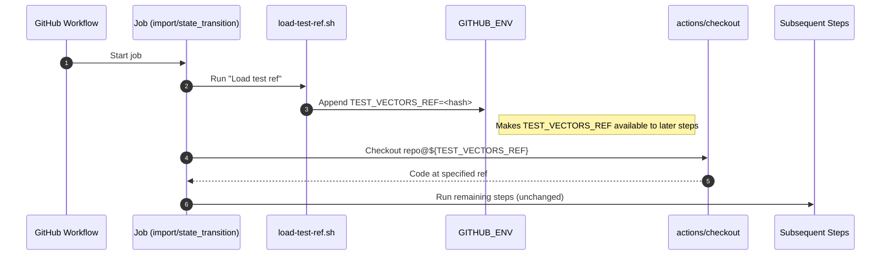

# Move test ref to bash script

## Pull Request by @mateuszsikora

### Changes:
- moved test vectors ref to bash script
- defined a random ref as default value  
- run the bash script as the first step 


## Comment by @coderabbitai[bot]

<!-- This is an auto-generated comment: summarize by coderabbit.ai -->
<!-- This is an auto-generated comment: skip review by coderabbit.ai -->

> [!IMPORTANT]
> ## Review skipped
> 
> Auto incremental reviews are disabled on this repository.
> 
> Please check the settings in the CodeRabbit UI or the `.coderabbit.yaml` file in this repository. To trigger a single review, invoke the `@coderabbitai review` command.
> 
> You can disable this status message by setting the `reviews.review_status` to `false` in the CodeRabbit configuration file.

<!-- end of auto-generated comment: skip review by coderabbit.ai -->
<!-- walkthrough_start -->

<details>
<summary>📝 Walkthrough</summary>

<!-- This is an auto-generated comment: release notes by coderabbit.ai -->

## Summary by CodeRabbit

* **Chores**
  * CI now loads the test vectors reference at runtime via a script, replacing a previously hardcoded value.
  * Workflows updated to export the reference for subsequent steps, ensuring checkout uses the dynamically loaded value.
  * Streamlines environment setup in relevant jobs without altering job sequences.

* **Notes**
  * No user-facing changes.

<!-- end of auto-generated comment: release notes by coderabbit.ai -->
## Walkthrough
Introduces a shell script to set TEST_VECTORS_REF via GITHUB_ENV and updates a GitHub Actions workflow to use this dynamically loaded ref in two jobs, replacing the previously hardcoded environment variable and adjusting checkout steps accordingly.

## Changes
| Cohort / File(s) | Summary of Changes |
| --- | --- |
| **Script: Load test ref**<br>` .github/scripts/load-test-ref.sh` | New script defines a fixed REF hash and exports it to GitHub Actions via GITHUB_ENV as TEST_VECTORS_REF. |
| **Workflow: vectors jamduna 064**<br>`.github/workflows/vectors-jamduna-064.yml` | Removed top-level TEST_VECTORS_REF env. Added "Load test ref" step in import and state_transition jobs. Checkout now uses $TEST_VECTORS_REF set by the script instead of a static env expression. |

## Sequence Diagram(s)


## Estimated code review effort
🎯 2 (Simple) | ⏱️ ~10 minutes

## Poem
> A rabbit taps the pipeline flow,  
> Pulls a hash from burrow below.  
> Exports a ref with nimble grace,  
> Checkout hops to just the place.  
> Scripts align, the vectors sing—  
> CI thumps a steady spring. 🐇✨

</details>

<!-- walkthrough_end -->
<!-- internal state start -->


<!-- DwQgtGAEAqAWCWBnSTIEMB26CuAXA9mAOYCmGJATmriQCaQDG+Ats2bgFyQAOFk+AIwBWJBrngA3EsgEBPRvlqU0AgfFwA6NPEgQAfACgjoCEejqANiS4BZfFMg1EuSBRIAzR/kgC0iWJCIDBTw3LgGAHLYzAKUXACs8QAcBgCqAEoAMlywuLjciBwA9EVE6rDYAhpMzEUAYhbY7u6ymSqIRbiy3CSxFBSyRdzYFhZFiSmpiHGQzNQk2IgAXojwANb4VAYAyvjYFAwkPlQYDLBczIhgTrhgbu5g8Bhg+ORg3BZohwbQaBSkLgEJzOF20GB2uGoiy4+B64PSJAk8BIAHdKIVIAY2rELBiDABhNzzejULgAJgADGT4mAKUkwJToGSAIwcZkANg4ABYuQAtIz6YzgKBkej4TxoPCEUjkKg0eg1NgYTg8PiCERiSTSHzyJhKKiqdRaHSCkxQOCoVCYHAEYhkZTyhSsdhcKgowLROYDHUKfUqNSabS6MCGIWmAwaMq4CoCIpBEJhDoWfBoWjXaS3e4afwcAwAIgLBgAxEXIABBACSdtlxI9rD+8nFjFgmFIiCMZdotGQaEg5Hd/hIo0CwVCLmokEj5UqcdHiaKydT6ecdw82dgGhgsCO8bHkCU7ie2vSAFE6pAUeVHNvIIeAB50SASNCNI4ATnZyS57Ip8TJAGZVHiAQqXiCkPHZAR2XcBgKS5JI/xIOkuwAdnZWh2WZdAMBJbg4W7GAT22aAAH0ADUT3xaAAHl0m2EjTzqABeAASRivEgFiAHEK2gAAJVIACESJPCIyI4kg724TYXGgIjSIoqjaPo9j3E2fd8BRDBnCJZhIC49Q+MqctNVeZBnBIAoNCMIwS3LCwaDleAzI46MjiUBhPiclym0k6SKEddThgECx4AYSB2HUZF2wMKA6ngKx0C7OguAAAynaMZ13edFzTG5V3cddUsgAAKftAm3YdstwABKa8JwPI9kHYy9o3QW94AfegW38bDcPw5BUrk4jyMomi6IYs9WMY4qCEgVLuN4gThNEsjZu8PyZOvI5n1fW91NoTTtNwXT9MM4yy1M7TAhoKyjBPZx4DmR09SONwkVRCLmhk2w6HgaJ80LWLwwymMihRTY1ncZMUQ6KQxE2K4hDQZhaGwDA0FpdkuQ0WRmAsXMCzzYtS0rasHUfRBPQbfhPDOVtpAFSAEWYexHzcm7qDCwiRsU8aVLPW8KBYbaL0h6HNIijAJHQFwOYIbhICsKQLGsqBOyUEk+0+izFYxth6DzTIU3oG5XA8PN6pcCh0eQUGsrnXAkxN5dMzXXqnh8fA2qe/zxxwzmaBIk7MFWcRXkgIRBEQNXmcsz5DlNm8zlEDY8HNzwnmGFx3GFvTFieIhRecLnwr8txEFWCOWIAbxrqWJA0YaFLG5TJvPABfDuON7G3lSena/ngFREpY5vRqUibGIAGnQUKiAwQuLyvDnyuqsBfGmehcsL2O4COcqJfdNwAEdsHgCvRdy12CpHBM5e8aThk+GgeZbyeBfPErQrWId5CRXsHM+6ygbhfV4Spao+A8JsI4HMqYCGmGfdgkB8TbgYGnFwutY5lmHN7bcfBdY9gDrEFsSJ1JuDmJ7OBKMjh+HgEoIWIsOa0FkPrbm9wlYm13jZEm9lHJcxcnNZhogvICOur5KSMlHxBUqKFMu/dxCM1ipACIrwSD3Ues9R8r1zYfXdB4NSAVfq0H+swQGxNgahjNFLMUEopTkzlNolgEDXRoAHNTb0chfTKENIGE0IYDDWMVOoEi9DEAkXesiNEtASIlwCsGKxwpIBgTJOyEglJ3AoVoGSTJzISDMjQBSf8DB/xcmSChJISR2SFL/MyCk7I3zMmZGSMkCSwxQGCbgUJ3YImIiiXQEiooElAA -->

<!-- internal state end -->
<!-- tips_start -->

---


<details>
<summary>🪧 Tips</summary>

### Chat

There are 3 ways to chat with [CodeRabbit](https://coderabbit.ai?utm_source=oss&utm_medium=github&utm_campaign=FluffyLabs/typeberry&utm_content=558):

- Review comments: Directly reply to a review comment made by CodeRabbit. Example:
  - `I pushed a fix in commit <commit_id>, please review it.`
  - `Open a follow-up GitHub issue for this discussion.`
- Files and specific lines of code (under the "Files changed" tab): Tag `@coderabbitai` in a new review comment at the desired location with your query.
- PR comments: Tag `@coderabbitai` in a new PR comment to ask questions about the PR branch. For the best results, please provide a very specific query, as very limited context is provided in this mode. Examples:
  - `@coderabbitai gather interesting stats about this repository and render them as a table. Additionally, render a pie chart showing the language distribution in the codebase.`
  - `@coderabbitai read the files in the src/scheduler package and generate a class diagram using mermaid and a README in the markdown format.`

### Support

Need help? Create a ticket on our [support page](https://www.coderabbit.ai/contact-us/support) for assistance with any issues or questions.

### CodeRabbit Commands (Invoked using PR/Issue comments)

Type `@coderabbitai help` to get the list of available commands.

### Other keywords and placeholders

- Add `@coderabbitai ignore` anywhere in the PR description to prevent this PR from being reviewed.
- Add `@coderabbitai summary` to generate the high-level summary at a specific location in the PR description.
- Add `@coderabbitai` anywhere in the PR title to generate the title automatically.

### Status, Documentation and Community

- Visit our [Status Page](https://status.coderabbit.ai) to check the current availability of CodeRabbit.
- Visit our [Documentation](https://docs.coderabbit.ai) for detailed information on how to use CodeRabbit.
- Join our [Discord Community](http://discord.gg/coderabbit) to get help, request features, and share feedback.
- Follow us on [X/Twitter](https://twitter.com/coderabbitai) for updates and announcements.

</details>

<!-- tips_end -->


## Comment by @coderabbitai[bot]

_⚠️ Potential issue_

**Bug: $TEST_VECTORS_REF won’t interpolate in action inputs**

Action inputs don’t expand shell-style variables. This will literally try to check out a ref named “$TEST_VECTORS_REF”.

Use the Actions expression context:

```diff
-          ref: $TEST_VECTORS_REF
+          ref: ${{ env.TEST_VECTORS_REF }}
```

<!-- suggestion_start -->

<details>
<summary>📝 Committable suggestion</summary>

> ‼️ **IMPORTANT**
> Carefully review the code before committing. Ensure that it accurately replaces the highlighted code, contains no missing lines, and has no issues with indentation. Thoroughly test & benchmark the code to ensure it meets the requirements.

```suggestion
          ref: ${{ env.TEST_VECTORS_REF }}
          submodules: true
```

</details>

<!-- suggestion_end -->

<details>
<summary>🤖 Prompt for AI Agents</summary>

```
In .github/workflows/vectors-jamduna-064.yml around lines 29 to 30, the checkout
step is using a literal shell-style variable ("$TEST_VECTORS_REF") which won’t
be expanded by Actions; replace it with an Actions expression such as ref: ${{
env.TEST_VECTORS_REF }} (or ${{ vars.TEST_VECTORS_REF }} / ${{
secrets.TEST_VECTORS_REF }} as appropriate) and ensure that the referenced
env/var/secret is defined earlier in the workflow so the checkout uses the
actual ref value.
```

</details>

<!-- fingerprinting:phantom:triton:chinchilla -->

<!-- This is an auto-generated comment by CodeRabbit -->


## Comment by @coderabbitai[bot]

_⚠️ Potential issue_

**Same interpolation issue here**

Mirror the fix in the second job.

```diff
-          ref: $TEST_VECTORS_REF
+          ref: ${{ env.TEST_VECTORS_REF }}
```

<!-- suggestion_start -->

<details>
<summary>📝 Committable suggestion</summary>

> ‼️ **IMPORTANT**
> Carefully review the code before committing. Ensure that it accurately replaces the highlighted code, contains no missing lines, and has no issues with indentation. Thoroughly test & benchmark the code to ensure it meets the requirements.

```suggestion
          ref: ${{ env.TEST_VECTORS_REF }}
          submodules: true
```

</details>

<!-- suggestion_end -->

<details>
<summary>🤖 Prompt for AI Agents</summary>

```
In .github/workflows/vectors-jamduna-064.yml around lines 70-71, the ref value
is using an incorrect shell-style interpolation ($TEST_VECTORS_REF); update this
line to use the exact same GitHub Actions expression syntax used in the second
job (e.g. replace with the same ${ { env.TEST_VECTORS_REF } } or ${ {
vars.TEST_VECTORS_REF } } form used there) so the variable is evaluated
correctly, keeping submodules: true unchanged.
```

</details>

<!-- fingerprinting:phantom:triton:chinchilla -->

<!-- This is an auto-generated comment by CodeRabbit -->


## Comment by @DrEverr

Is it necessary then?


## Comment by @tomusdrw

If we don't declare it there linters in editors display warning that the variable is not set, since it's only hacked-in via the script. IMHO it doesn't hurt and gives an opportunity to leave a comment that it's loaded from that file.
