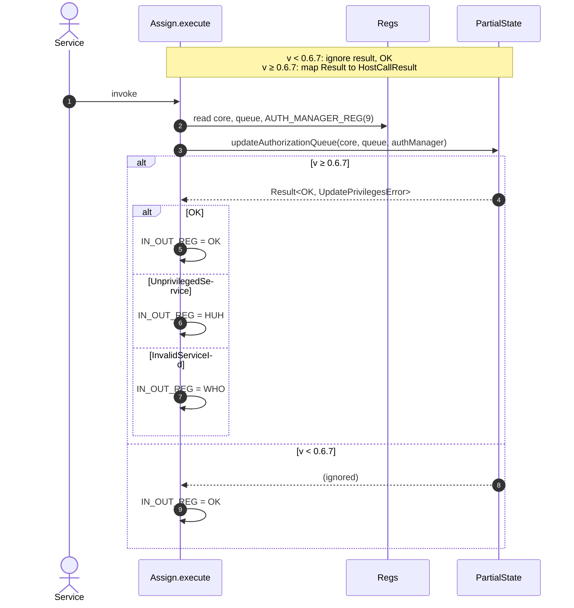
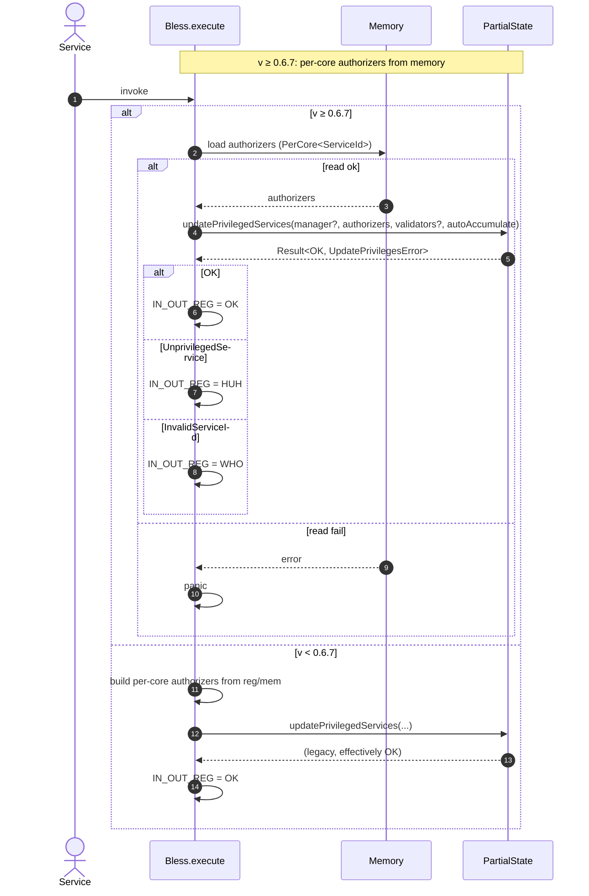
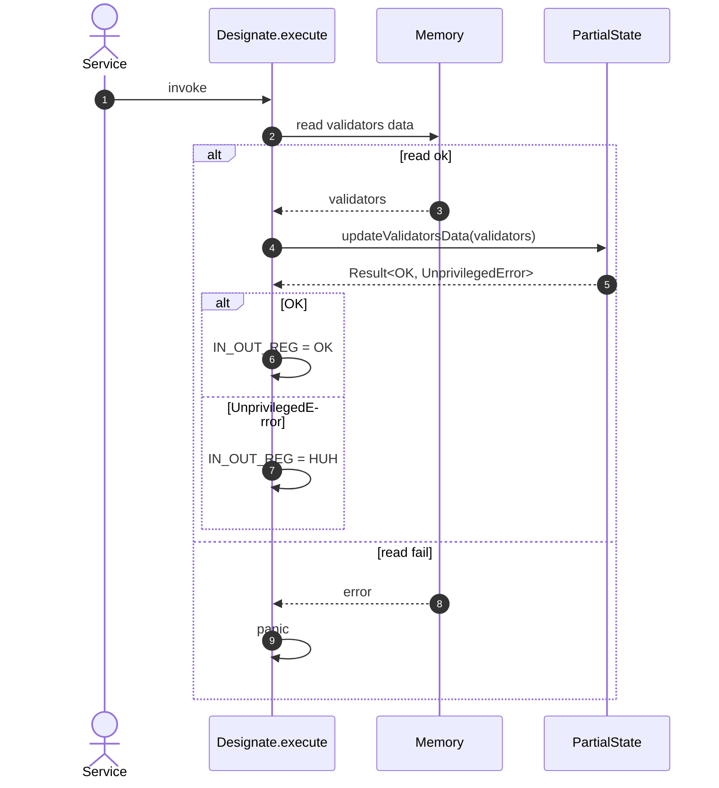

# Migrate Host Calls to 0.6.7+

## Pull Request by @DrEverr

resolves: #539, #478
updated:
 - `assign`
 - `bless`
 - `designate`
I've also noticed that `read` and `write` where already updated to 0.6.7


## Comment by @coderabbitai[bot]

<!-- This is an auto-generated comment: summarize by coderabbit.ai -->
<!-- This is an auto-generated comment: skip review by coderabbit.ai -->

> [!IMPORTANT]
> ## Review skipped
> 
> Auto incremental reviews are disabled on this repository.
> 
> Please check the settings in the CodeRabbit UI or the `.coderabbit.yaml` file in this repository. To trigger a single review, invoke the `@coderabbitai review` command.
> 
> You can disable this status message by setting the `reviews.review_status` to `false` in the CodeRabbit configuration file.

<!-- end of auto-generated comment: skip review by coderabbit.ai -->
<!-- walkthrough_start -->

<details>
<summary>📝 Walkthrough</summary>

<!-- This is an auto-generated comment: release notes by coderabbit.ai -->

## Summary by CodeRabbit

- New Features
  - For GP ≥ 0.6.7, Assign, Bless, and Designate enforce stricter privilege checks with clear outcomes: OK, HUH (unprivileged), WHO (invalid ID).
  - Bless now supports per-core authorizers loaded from memory; Designate propagates validator update failures.

- Bug Fixes
  - Return codes now correctly reflect authorization failures instead of always succeeding.

- Tests
  - Expanded coverage for privilege/authorization scenarios and result handling.

- Documentation
  - Cleaned up and clarified host-call comments.

<!-- end of auto-generated comment: release notes by coderabbit.ai -->
## Walkthrough
Adds privilege-aware result handling across accumulate host calls (Bless, Assign, Designate) and externalities. Introduces UpdatePrivilegesError and UnprivilegedError, updates PartialState method signatures to return Result types with additional parameters, implements version-gated flows (≥ v0.6.7), expands tests accordingly, and performs minor comment cleanups elsewhere.

## Changes
| Cohort / File(s) | Summary |
| --- | --- |
| **Accumulate host-call implementations**<br>`packages/jam/jam-host-calls/accumulate/assign.ts`, `packages/jam/jam-host-calls/accumulate/bless.ts`, `packages/jam/jam-host-calls/accumulate/designate.ts` | Add version-gated Result-based handling; map UpdatePrivilegesError/UnprivilegedError to HostCallResult; pass optional authManager; decode per-core authorizers from memory for Bless; propagate errors for Designate. |
| **Accumulate host-call tests**<br>`packages/jam/jam-host-calls/accumulate/assign.test.ts`, `packages/jam/jam-host-calls/accumulate/bless.test.ts`, `packages/jam/jam-host-calls/accumulate/designate.test.ts` | Add v0.6.7+ paths, new authManager/authorizers setup, memory layouts, and assertions for HUH/WHO/OK; update helpers to register auth manager and encode per-core authorizers; add negative cases (unprivileged/invalid IDs, unreadable memory). |
| **Externalities API and logic**<br>`packages/jam/jam-host-calls/externalities/partial-state.ts`, `packages/jam/jam-host-calls/externalities/accumulate-externalities.ts` | Introduce UpdatePrivilegesError enum and UnprivilegedError symbol; change signatures to return Result and accept nullable manager/validator/authManager; enforce privilege checks and return structured errors; remove logger/getManager helper. |
| **Externalities tests and mocks**<br>`packages/jam/jam-host-calls/externalities/accumulate-externalities.test.ts`, `packages/jam/jam-host-calls/externalities/partial-state-mock.ts` | Update tests to expect Result returns and error paths; add new cases for privilege failures; mock gains configurable Result fields and updated method signatures/behaviors. |
| **Read/Write comment trims**<br>`packages/jam/jam-host-calls/read.ts`, `packages/jam/jam-host-calls/write.ts` | Remove non-functional TODO/comment lines only. |
| **State JSON minor cleanup**<br>`packages/jam/state-json/accounts.ts` | Remove a TODO comment; no functional change. |

## Sequence Diagram(s)






## Estimated code review effort
🎯 4 (Complex) | ⏱️ ~60 minutes

## Poem
> Thump-thump go my paws in the repo’s snow,  
> I nibble on Results where the errors grow.  
> HUH and WHO hop by—polite little guards—  
> While OK blooms bright in privilege yards.  
> Version winds shift; I twitch my ear—  
> Per-core carrots aligned, the path is clear. 🥕

</details>

<!-- walkthrough_end -->
<!-- internal state start -->


<!-- DwQgtGAEAqAWCWBnSTIEMB26CuAXA9mAOYCmGJATmriQCaQDG+Ats2bgFyQAOFk+AIwBWJBrngA3EsgEBPRvlqU0AgfFwA6NPEgQAfACgjoCEejqANiS4AlafgtSYAeQAiz5ADN8FZpAokZNjMaFTi+FjwWAAS+Ii4AMJoFhaIBgBywQKUXACsuQCcBgCqNgAyXLC4uNyIHAD09UTqsNgCGkzM9QBiFtienrJlKoj1uLLcJNkUFLL13Ngp9flFxYg5kK4UAKJSMwYAyvjYFAwkkAJUGAywXCGIhAEPjiRgBLSEsAxg2Ny01K8AAwANgA7AZoKFSLgLlcbndtBhDrhqNg6vxJki7BJ4CQAO6UdEGYbZVJcAwJAIA+jULgAJkBdNyYEBAA4wHSAIzQTmAjicukcOl0gBaRn0xnAUDI9HwnhwBGIZGUNHonTYGE4PD4ghEYkk0gu8iYSioqnUWh0EpMUDgqFQmAVhFI5DCdAUrHYXCoeMgiGCIVmRoUppUak02l0YEMktMBm4aAYAGs0KRRkI0F0M8wwLA4rgwAxkql6omGMFFgDS4hEPAiBgNDR4o26gYAEQdgwAYi7kAAggBJJWu6l+gOheRyxiwTBp8WQAeaiiKbBnZBoPB5ijwABe1HgEXm25xVlIkEoy74TZhTD2qfO3ivsHOefiheL/ZrdawCdwsA0/a0LQ66QOQvp9sU0DRAA+gAsn26R9gA4tsNjQTY2xIf4JDNPElAADToBg9B4vATxERi4QYMkCqwLBmD3nwEjJNg5xRAQkB/uc15+iQuC/JAOJoNqJAJgEdhEIgfbEbBJDMD4sgAQYUB9kByBgSgzDcD4uBeD4kAJCwv7wGoFjqLIhFIdwABqhIHhghF2P6Fi4IRmD0MUfwAgACse8CntI2wzD4SlQNsAAeNDEcgvCiaEJASVJMlyQpnH4OgDBnNwMKOvg2X2TRG5/vR1GkHwYmZnxlAANwoPKvD4DiSj0AAFBg+AwhgiwWAAlIRXGcdIMIBLhNAUMg6jIMxfTnNQ/aQTB8GIShaEYUhoWQJ5/xNoN8TIBxRbZScs3EegNaUDCA0BPxFBYNNrH8PKaBfvWGgkOFoh4OcLXvZMYjuhx2SQNgxEkJ4UR0D1KBYO9SDiBgRB+mc1HbnEG2qcBnF4uley1hExCjteyAtREFjyI+gmAhowIaKCADUPXkpAuiQAA6s+WADeWMzsLxFA4mcKDICDvCSP5OF0IRtbMJWNCbV5NC+WLAWIEFl4aMUGCiyeEu0AclACyd9C/aIMKxPESQpE5iyaNExTREpzNQOzZCcc+tGQCEpWUEL0PTfAtBS/AMsWAC8vbSQSs62mashYu/t6wb8BnAONKnSbYiQObiTFtbLkaKz0TOOjKSgfiu26cD6xu+cGlFXRDFlZ7ogzhgSB+O5gmUPAgwKDziDacRUSI8cuCdNItWw/Ew8V+uATAwrAPpc96wUJd7vvZ9VHYc5MKoCDSjg+QtAaEYRg9v2LkqvZ+3pQNSgMKHYQ34957hdpa/uvpCwCGZDDnpqdQuI0jKUgOkCIJAjDbGniEVUIZzgBBxOXMGj4tSyVoPAYI7ZOzKTjAmZM950yZnqNmXM+Z3wpFGGWCsocaDVlrK9XSHBsFtm7L2Qcw4VTun9KwCcr8bizmkPORcuBly0FXIaeuPhdz7giJ7RuPtW60DMgjb0JA0CYwGqvQ2KB6AUwGlI7ce5t5e0YpATwy4/AjThj7Aogl4DCWhPrfmycSCpyIvQBM50JqXXSr8COfZNzSOMfZAAiqxVip8woYFbmuC4JAZw4n0hTMCPtvLWVgl3caL8WpWVstkiIGhrKAmgsCaCoIPHoAEI1EgjMF4BKCUY2RGBwkkAeu1X010TgYBAk8G2/BhCmwAgOeUfT85IGcEmQi2dLYWDzpoZwABpX2XTbp0FqnIi8PhCIhFqOHHyfkVaxwoBrLWhzdbOJ0RxGZudpA2w0HbaIlStoHOVhLVWwUTnx2SAHS5rj3HXPzLM+ZBci61RBkmDpMNPlz1mudT+9AhJnVXrgdIJA9hRMgHYFEURkAOFNGAXG9l4mJIPHwXJNk7JyOAJAYppTyl1OnqXIslD6kAkCX+YJzTWkPVIn+GuZdfT1xKmYqEwReYCDwCgesPhDRXT4t090YycqnRBkwIeVFizyHWJXG5Vs7n5yWZil5O0Pjlg1Cibe6peYcQCJ4KwmcBoaUOiofy5kuCABwCPsL0sAaXBh9WgYArAI35YYmR28ACOETuLpQeGwPuRtaLBNmnzHR+iEDICYAEDQgBcAlARjdS5cKAg3EGweoWy+BKJUYjRARYBj4uHlwYOH9K4rwumivYzzF5R3FjHT5blVXrBAnXTcIqm73XOKaA0ejLECpGogTFBbBWptcWAAOb9RGJm3nhbgXB1XxFomOn2ABeSATik4p1oC1edGhoQtQKD1HqmLvJtD/v2byA5NL4K1P49ljTw1hOjaBfAnSSBRrIpImGkUqA8FCJVMakAWrCoURQKGndJo736fvdYej9IVsgFWmeURBU+yJRERAtVhIaXw+MSY+zFbnL7ZeX2aIl6MFDl+XuFaF0GGZmfC+fYr7P3I2lAVD8n7NLxfKX6Okv7lVfcnAB4hxBCNAbJTl9AGHURuucX9qouAAAM9MkA5VuADEQeUkAM9DSABnvKhHEMkA4lqrOIY0BoctkVKDUTMip0YYlHMWDAPEAEGghCIChh0jKWVW1uzIjSCgRBxWals8h72FBrNIdOhhtE94bMGe9Vp6zUQMFFh2sJVZd0WLnD5bAWzEykzWc7gZitBmn2gOxd0ziEwSD1C06ieeAiEbWFs8Z0zXKqKWes1FyrvSDUwl1KbRDtX6uIEmU106LXPnWYapMNewCoYpPxKRqlPTaqxSSWiMmKAYQYPoO1GEDUmopviMWsQx16DKufQp/+Mm17oCAnQQzJrI6McCttt+Lb3QWJYLZ9znmxo+aAdIeYDmHFBZCzQMLiBMusfoAdDjtZe7a17a8Yz54YXtagAOLSOlPMtsgOJuDVrW6kEM/Z/bTmXPFdp/94z+P0oGebTpSAABvbrdGOeBecwCQiIOe1HM+ZAAAvpl3FNANGvyF7zy6PWxeQCl+jmXctVd9Wwva02RHrh9DxlgKcVHkHv1k8bJXtHZoWAiJJAO3EN7hThjPN3p8DDQNLaOE0CD0W4l9CgnSXBoh1lgCw8UeDEwpjTCQ4hpDXwFhZSWahIcqy/2kAu68LZmEdlYQJocLouGafHEGKcQ25z5rUjwSghZZVJqMT7bawl/TcAZxTPVFhIAACErA1lnoRIgo45CQCQt5LJtvEMaV/HVimdKyn00qaeRM8g1/mP0vik7BSelU4XEuFccSw07h9mQE0jau+7kJOgeekr/I5RAt5SghkAjAD+ZenoJUvfooO6CtuHgwN/hQL/iQP1BzJAHiNuNUK7BxGwPJEGM9OgLxBVHLL3thM0HIi1GgaZjLv9qenSAAHp0gAAsUMaIM82w1woBJyIBSgzggyYgLU7mGg5+dg2MFASYyAaBCk9Q1ieEfAOqAkR2BITEp2rYTsWKokoccSBwqE1kA4CQ2wcEhEqhNg6hmh0EfYOhahGhWh1kCBLQkAS0yEqE6EmEhEEEUEzgNgA4IofY0AA4zg6QdhSEhE1kfYZQA4rg7hzhPhp8ChS6aBpBMILUlBnIwIh2+kpWmqQYeBncxBm40RiGlBNBiRfAN+hI4RLMEU2kQ6foSY8A3ArgycKR8gnciAFR3Apm5iockkom6wDq4gUg122kCwtC5wwhQY1i5GlGKQIGeKew24GCCM8i6WlSCc1ASRYMG4LkU0Di5iaq28FUbAY0PGYUXm0UIkYkCUOESUtAsk6B8gtqCqt0FwHUdWYhuxlSw+FxCkhEUWKIFRMxBRFArg1AwknceUmqI+piZU9QCxBAOokx3uexF+oiV+kiBGJAFge2Rx8U423e40LUUMLUG+JSW+DM2EN0bcMxUBMB/+F6bitAQBK2QRyAAA2ryIRJyLkAALrGqLz7RDS3zm6dHLo37NKQChyyCjzMIKForR7vymzugk4BSJwuJxKvarg6bQyPzYBKDrj/q37jSQCMmAjMlsmVLCQQn6TrqxGAhQzEZOrHblTUD/i8YsxLpEyH58D4bqoYJUTogixg6aaUmIaPJm5RAJyzGMTgk/LbT6QtSFzOBm6dwJhtz/x4jwHJEFSzClhakv7xTAbDTqL/BF5FEqSt7OkUwpkRB8I+CmiVLiLcB/wAjCygxPi1zlyDHyDCmjyLqt4aTC5rw8n94M57Yd7zysEzydz4aEYzEtTwQAAa0E/hZQxQWhxQwI1BhEZJsqhEEBa5AQ/Usw3qW5sBBkRk+4pk5klklKp+cu3aYOHyl45+vkjUMJWBnQxkJ54wsImANwiGyJ6wlpWkVgFqAe7su+DA++AQxxiU0k5xKUQYFMC+S+L8NKm+5SFh/KA00izQPmjONRqZrZaAIpUq6RKG6ZnKTSVEYZZkEZfAh8KxukmKzgd4KQhEngmxBUvm2qCAnglcMOHcfow8VgzclxQpeFo8omwk4iyQQawlUqLUA5Was0GZOp0hJ+tuEWKFdWZGGAYAAgz0AMQ0sGf464p024NwPsPEtaZAoQB4PGbCkA587CQmkmom98ogEmnpr8f2cC38P2SmyOICUA4C5AUCMCYeoB2ESC0e9aa8ceCeSeuCYARg+CaeKO2YGeOY2eFCeemUNCheE+JerYFeNlHCNebodevCDe8oTeqmhZmMcFGl6AeIWZ45iM6a5w4+xeBG+YjAxYAE3Q+kcFegp6VMNMoIbkWpgpRYWAQMwkLZ0MSg4U/A+RK6gsActU6gwGvoHuGimpJF5mWAeB3FAlqU7Ey8beFAg58lO12pQpcMlSuewsV5bypA8phsyAK2f4c0ZkB6NZaITofYWVBeNAjBoiwCAEcAEeu8jOx4how+8yiGSy0y9shE0ZaGg6ki8KqK6KPsFMEKUKFOl41l1Ol+4icSLZWlOlNIY1289qIGYpjpYxZWhoM1FMslnePxiAhEm1mMAp28+1s6LZhED8oBIELN88n1C28oABVJ9ifeYGrE1wJA3Q8A4UZQZAA6nibaPiomxmCuFylJPGChIyh1QxuZ5i2gqQcBL4nV8ZycxM3kEgzAEUW89kGg9mCZ7WoCiygQeyA0sUYAcFB+uSi+NKQ1tMUMkqOUtAQgaIralNxK10246KNEHEoi6i685wrI/KjxPsmBJALQ2dkAkt7i+k010F8gJW70Ftk12A/kmMItF1Zm2phlaoxY91EcOtT1ktr1lhA0MlHU7A6O12ck2UsgaGeA+Af15qssJAQNCdBNihngW6PgTd2E1EbAE0mo3mNE1qmo8hLMdgNZiYcq7sHqRAOaQlpILpAqRUhA+eU9Sms9alWBHqO4Z9ocF9ncKighTl7s/Ofof0PcyczSBZih8kUgwtiCB4P10AbgzgFwHuyY2E/RAuT+jdBG7k1aQehN8JxNho1GSuTVvEXs4gDAaxwk8u15xytNUAzgWA/omUxeceQKtyu8GgRqDp1DWA3pj13ClJjDFszD9yjywDNDfs4ZS1bEtAfDOc+qLD0ZwjduXErpMKXAbaa8HalAmDBkrOho3ZlcHEFlRey6Y56Dja7DC4OuyK7amNfAB1AAAm7tMGmXgP5PrSzDTgzuQ9wzecXadCnXNIblzmHJgcJG7l+jpJo2Db9f9VPTPcAgoCkJbnIqgFFr0VPfQFae7PivpXVuHeeAMJbt0fIA9uYv5FYOk5zO7NzAEClh7nlIhlzKFe9Y9miM+MbEuHEw1cgAEKA5DBzeojiDMWtUPW+Uma7F4jhlrQ9dHHQJ3RE+7G1ZPo/CvIAJgEMU3l/WKp3TiIXgLFZZKQVx7siAlUhEuTGG7Em9I+HuzQ/8UWSgmImMcinj0z3j+Rp0ddKDL+ozWA/Vg11MtMQedll8Y0jlyd7sTOwmPS7lTuCKC1PA3l/dfmwiFjGzx004giNmReNYZeZjGM7oqjGNnaoLbEOuXgs69jPWjjcwzjqQwDBwfKJl9AATFgxuxLDOHEUQapSg9GoOXjxylS7LFjTLLLZ0WBbuXA3FDpChuj+uhkWkx5bq4wZ5+Stubka2CYUaJA0Aeuyu5is6bY5LkwlL9Q1LiAbY1UkrLM0roT4uQrLmKuursObY8O70iOPyfmqOnOGOLm2OZrFrdMYT/24usrL5CrFk8+55KrZ0zg6rrEWrkwqrKK6jfAOrB1+rDjF4VL4gqQvrzMzM/r0r4uoTtrsu3L7d4OzGKberzrXmt0brwCHrgWwW3r4WvroCL6v8yc9OzufosgzA1SI+7EYiEirULrFzommLeVFwUqeOwY6gjMZjTzpOLzvsUWHl0Os61brrvm9bAW6OTboW4WiGOdz28t9Ac+ZzFjxGE7LY7tIewcIVXLEDyCkVWo8eRAieBVcVCVqehCqVqVZCb4d1pY0T/R9QGp34oWpeTCSeVenCJVY4ZVk4FV2jflgEXN8F+MM+cCZlyMll6UQ+TDlCXArg0gEHNAKjy6PETTvFANkGwMZy3DvpCps0yBWk8MiMHEOqy6Jp40wyMIrGyAmsspusfLSKIKNG6Uckd9wkC9/kqLxGPHjO/xRJCd00atljPZbsc0A0w+mGLkvsjylS7Ugk4ZixOpWZGizUolIHoWcJQ7cSujekfAwb8rbFSrp2jk826nQnPpxyhE31IEdVJlCDiBaAA+Ps6g3k+YIIFStqIMAqPEpM8gXz8+i+dVqAA1kAIdoIoN7sPE+6oiyp+02MtKpnkJfxKI99wChExakL4H9YoWm85YNA6newADR95w+GB+2QpK+ktWIlyQY0I5NncCveALhVDlblRLjOLlzOL8U4a7so8mHbv2gCiLoCAVkCwewVcC4eYVUeeTqCXA6CmCzAsVEA8V8YP76eKVWe5CQHt9oH9X2mJA2LBVsHxVo4PCgYSHaLw2qHdgPT+OJXKihoB1A0z4GiPe+ADAv8MPSYR7fom68gHqAAVK/RDEaS4O4PUJ/XA/D2htUk4ANCRxs+cEszWLVMxdcMCddsZygkMqAouAKk119NkxuWFyqfKsSSZzNK/MZtZGV0vRV2gFwe5mhl0/NpUpcB+XVnIl9kgJQ2Y4bQr8u6gIVweVxwON4c4JBD4aJjDfNg8vbMI4o6ROsFLHxAuDr3r2tAb4R3Mkb2w8zL5JHscIgGTIRAL0L+NCL2LzwQgZgUGfgEmGAS0CJYdDdCOUSV1hOpUtr9BLr9APr50+gBYA1bIMgFxxxGw7aO7DNVSIHDNw/jMVODx8gL3up113afwFgAXybVs8RmqtoyfKAvRcoIxQDlzVBjWcnEM0rrtqmIKQdd7xRWZ4gCL9/ZbYBx+MqrVMZz/G+n2B+rxQ1zprCmn2NHQONwJpNy/NN+C45Qt9C55ct2+gi8AvOOAn92mO0WR8dFJpDs7vMN5Yf25UoDQP9K39t6Hrt6FU+xFSO5WE6Ap3c7ingIQ3dM8mYADjnhboI4LmvlYDpPX6JgBR2tbbdtIEbBDQ3unYD7sqHg7fdyyyHQRKhxET2dDQGlAmKqEIi/R3IulA9LeGUBnhmaYOI0rHTkTU08Q69A3GjkCZyw8o18cjABCXQ+dGOfLTuIu0VzMZjqCXPSo50qQCca4fgDiBCU64D87Sr1eAtolcTIBlCCPXbD7GE5pgOyXNNVmgA1ZxtWWIuXLGeE46/AGcoXAfDPDyjmCHobuJzowAuiIg4WK3Hyn5hsxExMUEUKKJom5KiZI+qLTuPixj63EJ0j/THGTgVgzwdieYTGD9FvQaAvei8QXmP0hIT9/iWQtuj6U7qWkekGuWUPKCS7ThRAXxGtN7kO6mxYSBwXvjHUurNIwAGrNwWEJkG+1sulSUogWD6Fr5iYkXAIDF3qCRdouYIFGuU2wYSJh05cNLGYm2JVQbGHuPEFQwNwBAWQYIPdC3TZQ0AMSu1SzC1DkqLg5qhEToQeS6gpAZh1Q5MHigEDaIVA/FBIQcMwFmMoub4GLnsNZRjZ2BLSaNKcNlTnCK6kAK4aNWKgoY7hwXL+sqlhKREbYlRfihpHy46UPB/wtoZNmjSbDvkFFQuiRHgLNApAWAeuCGSbj2gMACcYBqIOmbPVXECBeAlU15jaDlq6kDqNqEY7AM+wHoNQMfC6rVxRm88R0Byx8ABBM4ZI0EoYPFF0A6OQZMRqyIkYmDkAo7HpAaEo56UiwZRbGlM1Jz0i1wmwzrLdEE4Mc6RfLFLsyJSyKiWMpovUUe1OjMRUYP1f0AIHfBlEhRAxIivXHIoBxx+r+NiFSPDLtYFCRoyFniN+SUl3EKXAaMSNdhSidQTEH3r7HlEUVgGoY5AOGP1E1YiRBoOvihmTGBjUxLeTGKiL0oHw0kvA5lt6zAiS1EMcFQAKZEWXP5qCChj6MekkQ6FNIMl7El3QPcdAKx3ygzFOOVvIgM/EQDOYfAeWJMuLAFSWiYQ1o/eLaLlIckI4IEHiE32yE+98hlXFQd3F7jCQQUIfFqEsktIxRyBacGkK3gdy+guGdIsAAfio4zhP8KKE0UYLoDiDToNwsyODAoFbiRedFBihYAto39DQYFZQucDjQnQIgvbd3l1VZQrZlU74I6NuBmJ3Vpey4KHp2J8CFhnwyYGeCwO4bEUG6gpK5snB372VgWU3O+GC1m4QtH+i3WFov0UwX8qqkAEos7i4C0i9R4gwHMgwGgeVH+BmRKr+1u7QD0qQHNAUjnda7sJKCQ7HAZiCEn8gcpbChkrks5sZ+JJ/QScJMgFZgxJ93OAZJLrYo4ZJXrA9jjiDx3tYE7oPbgAMO6x4s4MVT9hd2/YQDkqUAtKgZMoTwD0BiAx7gCFQE1spJINaDu93YTV58BX3evL90qoA8UoUgfHO7DKD4AiATcGwYmmhBHpK0yJPbKMRHxvi1QuEr+lmVubdwEpDrPwPzhZa3o+IZbLMYgGxLQw8Imue3EKRh40R4xZ6PiGNExRkCESLuZjAQwInTMwAAQJBhiEEGQskUeDZjO4M4lLiROak06JIPeTHJao6wBihsRp4vwZsNxLAPMmADQBCI2wIAurhNpl98AAcGgdRA7YzFfof8fvsxkH5YdnaoCUcfuHHGQk8ssI94cg2fJZk5xBI9ADPnVy/Tqp0IOqZ3WxIaBOpYQZ8E+EdDCRtYYcTqdCB6mgJR+vovIZPxRbzxf61xHngdPhqbQFpT1Y5HoFqgpc6qWHSRAPmuwUplWxKTLtl0DIwgyAj4OJNRy5jFgIuU0LcVlMIj3FKA5vCPMSVfG+dPkmKTEcROxFtIIJ9/PGYvGQZlhRIKqLvkAj2awYqAOxbOqOhQxcAgZAAH1AjdRKklWRQrvGADEyVpTGHwBTJuzrUAEHMo+tp0qYnBqm84v0ur3diSj8xLVBNDVz2kzwuJcpSWup1mwX4E4QMvsUsIpHqRuoUs3UaHL1qr9tMqLfGcvHobZRyRGwI2SbM75s0uA+5Cksx1Th6BCI5fLKQbMjH0BjZX4s2XtItk2wrZiyS8kUN5afJ7Z7MnwHEjfH3Cv6FMOcTnL4BUzTsZ6OsugDplhsAg4GciO1E0r1z4xPoyiogAFkNyxZkAJZI/V/qQy9aiciOC0RAxVxDQv9N4cNNJz9zl6bw4zOzWwgH0GAM8C7JA3XpgAUhigNqalJngrZ1EFAa7BHKLAzBZAI5AfMuFFhhw3SQtTFPrE2lvySxR81jJDgenzjVwa4bsd0mJgni0+nuR+vMjJoTNjGxEatIRA5ZUhawd09+EgoUCX4R8nA1/McDeY+kJpdE8iUC0mk8lnKSzOiVCyhxLcfB5/NbpfzUx8RUhqcgbLpiVmGZMZK8v3uXxF5FzKAOQrGT4GACKLKKIvPQHUgkCXTaAxWLABT2QAFYRu09IKcZJxz5YdJ7kvSZ5Jn7eSjJGAqhEYsClbtfKLYazIACTCUbJuNyHC9/iLUWRf8XkUUBVFZnFRT73UV1IiZrckmQVPJkGZ5w6mERbjPEURxJGnihpFiMAxyzgRAQUEeFC4AwFclkI2AJZi4CK0A0BwZ/H2BmB4VgARw7UtEGeiwAHCC0Zwq4XcKeFvCoSBcguWggHBXCJ0zRdot0XsYV4tmCetlUBomL7FwyoSdd0sX/txJhkqZX5McV2KXFukdxWkr/QZKLMQIs4aDDyWHkclByopSUsgBlKZmlS6pbIFqUKUGliAJpfNCcIuE3CHhLwtBC6XbAelfSkUCdKKVVyC6NcyAHXO6gRL5sLctua8meaxL4lwi9+Ukt+lMwtlDGRjlDItbDzq5pcwOOip+KBLySBI8ueivL6YrDYqcfCDirHrjLaOXAekgSJ0KUkkIz0VkvSVZLkrc2gygONZgdLEZ9FYyoxcEIQF+YZlFiohFYpgEZVRgay91v5JoBOLBVIUsxR4odJGYk5utZjg1PRXxiSV/yWufnKAkUrLqhIPFbKhLmkrqSbK3NrzyUXjQAVecr8RatzbX0qVU9GlXSsBXMdGViAZlayslZgrLZ1s1VbbIoB6A4lP/e9n/0faR5n2QAt9h+xwQuSrubk0VQsq8klgpVO7Ssfu1lXyRkwOAyvOFLg5RTEO/CFDsIiJrDsjGruHrOvWm5MT/4y/T9OlJUa8TolEs5jBIMDXltIy7ggNnAmxrVxiMOawQuflxaJSAgTZX0HWpKbIlNE6UYtjQFgjw9RMtAKGvUEEDaIJ1JKNAEkgoAqNNwlmJyIPAt6ci6RndQ9eRgPI8cRe56npAeXUSfkogQCH5LfmVljh6GNYZiiPhBSgIQc9AKReP0n4EyuskSuXKTPfGdzKkNMjKPxBohvCZYlqYlHIivX/Eb16wDQA1lqgRzkNKIVDa9x/VKz3hu89VaJnNkgaVJHcy8OXOiyqy9VLwiRv3R/E6kiC8xWMqdCg1bpsAHUvAIKTkQFSz10gI9a9ww0xDIWfGvWrhpXGjhpZE2TJW4PSikbwVAa9udCs7nqd2N72LjQhrkRyJ64B6gTRevQ1rYkwmGvadtWKXRoJNLeKOnhHoCwLi+rlF+GWArJ8Uw2g3buEOPdhTqG1Y4CgAvUFgtQkly9c2e4KhjTj+KsUbQaXyeEGw6NW6ndYyNdhPBBN69UrGHDoaoKWFgmSifv2omTpaJR/aTEpN4VTqWJqHdtm+h/EWBLxzUQzLpos36bb1tgRTVEptldrg1kAU9IeKTDHjFkPUaqMKrmXJq7uNitNcsukmZqEhr8+Hq4rbbeVKt1W5SUJOKHiaGt6wJrf6pa2dqXmQBTrUbyPEnj+t5iwbX+2G2wDbFY2jNZ6yzWvAh1M2qAOVsUzzau+i27DWgFw3rbm51ssDbQHJkdam5+cfbb1sO3EZZlSak7fpJG2SqLtJkibS5im25qNlQijTKIpVL85JFXi61duNF7+KUQgS4JZCVCXeLfi/xDRR9pcgQrW1YgzuQNrB2iTrFZ20bc4vG1XbJtt2xHVAASXwqFZyS6kOjuU16ioZzAbVZemBV6q3Ixqv/ASornC6paIKzvkQFdU1z6VHqplSyr9WfbNt/OqQXbJp1JUhtEOhnVDqZ2XbG2rO6bezuAHI6EVaO5FSZgBEnD9lc1fJSCJOW0QzlFyvWFcqoA3Lx8aAUPnSAED3LHljhIuC8vaXvLPl3y/paTv+24AKdrW7bbrpEkeTxVEk6Hf5lh0BS2dOOIKr/xsn/8o1gAhybGrAGXcRV4O+nRKp8nBSYdLO71qFNwEFrPucCQgeVRAmkDy1vcsHK/IUQWo8aS9CjtRi6h+AE95oywiHLVU6JO4mYgkcqKwJTq+5JWQBpCXmkxK1JIEA4L237ZY8s0SWiINMQ4564fkmBCfWTMlmzbfB3m2KZfXnXWAzG/67Gcp12kbyyNp+8DZRuWyYEtFAcYMSzGk2kVZNtcI+SrOyiGVD0+s91WatF31zO4Ec1/Vtt+0tRU+3+2gL/qgDa1ltxGqLH2R0jxyUgsWpeTxzuAy73EcuoCYJBIO6r7V689BbHvj0IGINSBr/dovdqAsstbCqfvZrm4iZj+PCxifCwEWsTGCwQZ7akoMyj6IcIO8vXTtT1LLjdte03fXrMUrY0C0wAxW/qzF/bAQBmQiAZhn1ArT0nIBSaAkMhlDMAEdGrbZg8pUKD0Ghvlqek319sHALUNsIuH9ADA++vMN8QujbA9Qk9uklNZDur2mKG2e7OSRssxSWC0+DidcLxMMzWHQmdhpXKejdxTgkjl4fw/MtO1V701ChsI0oeMNYNKAfmgYooAAZlZ7I7OSsdVIf0+KUQfiv8QEoNwKKfehO61eErJ1x6vta+yjZkf12V6098hjPXXsg5mKAt3OkCRVJEiXYIsvUjer5sPqewyj4MCoxECqOesaji8Opdyj2Uu6ndRytxK7rq1yzSlStS5bfiqXe7gAvu/3YHsaXNLnlbSt5Z0u6VaEflfy8A+lkoPQHQVnR+g1rtWnU6jttOlPYsvO1DHQjskgo4hgRWVUpjT893ufhETFHFj8kDBCseaTrHpc3rDA6ir1pEFvjZB8Xc0egImqpdFByAzqp+Py7FdWK5XYbE9Xer1d5OpTVCqXaxLgTeuivbIfBPyq8jUJ0Y5llhPaN4TEDRE5ZJ2757I14VeyVFUcnvtS9rkrkzIbBMlhC+eawqhFJHAt7opJakgUYEB41Jge6UUHqS1hwDQAAUgcFcAw8PQfejJucDsCa59FFHV7HhTgaYAEekqBJjCFB78t3Y0DdwNmVmjVJp2SQmYvEEnFnhQ+8gF1lQH1CFIwE+HXZphX0g9dt1ZKLeihw2QYBrsZqZLFpr0UsA+96qKKDCFT7A1PQ3/Ng3vxEwH98tblXg92y8q+DStV/dKNfv0ZFaX+vgt/i/CkPHaVTqa0YOqcR1hrrJaoAvTKZjxynkpeIRU4muVOgnhz9QRAuoFe4N781/YLU7XgQ4/c9T/3A0/FIBgld55YAangmcwqmmpjlp607aZUA1IBUrMJAuT0JwqMYYbHVspjyiHY9YGD2EMyJT0wzxIzVAaMyQFjPQYt0ztJM/An6g9ZBZfAUs8uCCy0LYpOZvMzDwLPjViz7AV6pQAjxA9xu/lDsyh1EyLcezb6QLRKbz2TnpTB3Gc1qDnMLnpDxCSbeFkPBOaS0eVcvI3u3OFqdTxaxvKWo6zHnEp5PHCzU0x5thGgv53UvRCOCskC6eYRYGe3OBPZvcM6WHOxYwBtgmp9Qi0w8AwCF0MA3gV3jFw0DcUDLiZu0Jmg3BlFjOF54EiBNqjvTxAn0qMwRe2bQwn1ZkF9aJipgwWhZfAXZNwGHiZoW+mW2s5C3rOcKCtT/GFi2f4XKZBFxF9vWRe7NTq+zQg3PeGqlMR5pzL7LgExecnRhYw0oU6PbjHr8X89noTUN6DQC+hW98gOfOHjNDhhLQUYQwDaDtPqBoIAcRANBAAF0BoIIWf7BKAMDdXgQAgAAMzUFQQAwAoAIFyCMhqCtAagnNbpC0BPAUwEgNNdyCeBWQBQVkKIEBC5AGA1BQELQFyBoBqCnVsqz1dwB9XgIg1wvcNZlCdWgAA= -->

<!-- internal state end -->
<!-- tips_start -->

---


<details>
<summary>🪧 Tips</summary>

### Chat

There are 3 ways to chat with [CodeRabbit](https://coderabbit.ai?utm_source=oss&utm_medium=github&utm_campaign=FluffyLabs/typeberry&utm_content=559):

- Review comments: Directly reply to a review comment made by CodeRabbit. Example:
  - `I pushed a fix in commit <commit_id>, please review it.`
  - `Open a follow-up GitHub issue for this discussion.`
- Files and specific lines of code (under the "Files changed" tab): Tag `@coderabbitai` in a new review comment at the desired location with your query.
- PR comments: Tag `@coderabbitai` in a new PR comment to ask questions about the PR branch. For the best results, please provide a very specific query, as very limited context is provided in this mode. Examples:
  - `@coderabbitai gather interesting stats about this repository and render them as a table. Additionally, render a pie chart showing the language distribution in the codebase.`
  - `@coderabbitai read the files in the src/scheduler package and generate a class diagram using mermaid and a README in the markdown format.`

### Support

Need help? Create a ticket on our [support page](https://www.coderabbit.ai/contact-us/support) for assistance with any issues or questions.

### CodeRabbit Commands (Invoked using PR/Issue comments)

Type `@coderabbitai help` to get the list of available commands.

### Other keywords and placeholders

- Add `@coderabbitai ignore` or `@coderabbit ignore` anywhere in the PR description to prevent this PR from being reviewed.
- Add `@coderabbitai summary` to generate the high-level summary at a specific location in the PR description.
- Add `@coderabbitai` anywhere in the PR title to generate the title automatically.

### Status, Documentation and Community

- Visit our [Status Page](https://status.coderabbit.ai) to check the current availability of CodeRabbit.
- Visit our [Documentation](https://docs.coderabbit.ai) for detailed information on how to use CodeRabbit.
- Join our [Discord Community](http://discord.gg/coderabbit) to get help, request features, and share feedback.
- Follow us on [X/Twitter](https://twitter.com/coderabbitai) for updates and announcements.

</details>

<!-- tips_end -->


## Comment by @github-actions[bot]


<details>
<summary>View all</summary>

| File | Benchmark | Ops |  |
|------|-----------|-----|--|
| [codec/bigint.decode.ts[0]](../blob/5a8b6840e262ffa8481989c5ee0f2a95f590884e//_work/typeberry-runner-3/typeberry/typeberry/benchmarks/codec/bigint.decode.ts) | decode custom | 176627802.74 ±2.38% | fastest ✅ |
| [codec/bigint.decode.ts[1]](../blob/5a8b6840e262ffa8481989c5ee0f2a95f590884e//_work/typeberry-runner-3/typeberry/typeberry/benchmarks/codec/bigint.decode.ts) | decode bigint | 109718561.02 ±3.16% | 37.88% slower |
| [collections/map-set.ts[0]](../blob/5a8b6840e262ffa8481989c5ee0f2a95f590884e//_work/typeberry-runner-3/typeberry/typeberry/benchmarks/collections/map-set.ts) | 2 gets + conditional set | 72304.03 ±0.17% | fastest ✅ |
| [collections/map-set.ts[1]](../blob/5a8b6840e262ffa8481989c5ee0f2a95f590884e//_work/typeberry-runner-3/typeberry/typeberry/benchmarks/collections/map-set.ts) | 1 get 1 set | 42767.67 ±0.12% | 40.85% slower |
| [math/mul_overflow.ts[0]](../blob/5a8b6840e262ffa8481989c5ee0f2a95f590884e//_work/typeberry-runner-3/typeberry/typeberry/benchmarks/math/mul_overflow.ts) | multiply and bring back to u32 | 240847952.22 ±8.16% | 10.47% slower |
| [math/mul_overflow.ts[1]](../blob/5a8b6840e262ffa8481989c5ee0f2a95f590884e//_work/typeberry-runner-3/typeberry/typeberry/benchmarks/math/mul_overflow.ts) | multiply and take modulus | 269007085.76 ±5.5% | fastest ✅ |
| [math/count-bits-u64.ts[0]](../blob/5a8b6840e262ffa8481989c5ee0f2a95f590884e//_work/typeberry-runner-3/typeberry/typeberry/benchmarks/math/count-bits-u64.ts) | standard method | 9251248.26 ±0.3% | 90.26% slower |
| [math/count-bits-u64.ts[1]](../blob/5a8b6840e262ffa8481989c5ee0f2a95f590884e//_work/typeberry-runner-3/typeberry/typeberry/benchmarks/math/count-bits-u64.ts) | magic | 94933693.75 ±1.19% | fastest ✅ |
| [bytes/hex-from.ts[0]](../blob/5a8b6840e262ffa8481989c5ee0f2a95f590884e//_work/typeberry-runner-3/typeberry/typeberry/benchmarks/bytes/hex-from.ts) | parse hex using `Number` with NaN checking | 140768.8 ±0.05% | 84.54% slower |
| [bytes/hex-from.ts[1]](../blob/5a8b6840e262ffa8481989c5ee0f2a95f590884e//_work/typeberry-runner-3/typeberry/typeberry/benchmarks/bytes/hex-from.ts) | parse hex from char codes | 910291.09 ±0.14% | fastest ✅ |
| [bytes/hex-from.ts[2]](../blob/5a8b6840e262ffa8481989c5ee0f2a95f590884e//_work/typeberry-runner-3/typeberry/typeberry/benchmarks/bytes/hex-from.ts) | parse hex from string nibbles | 567248.4 ±0.2% | 37.68% slower |
| [bytes/hex-to.ts[0]](../blob/5a8b6840e262ffa8481989c5ee0f2a95f590884e//_work/typeberry-runner-3/typeberry/typeberry/benchmarks/bytes/hex-to.ts) | number toString + padding | 332412.58 ±0.07% | fastest ✅ |
| [bytes/hex-to.ts[1]](../blob/5a8b6840e262ffa8481989c5ee0f2a95f590884e//_work/typeberry-runner-3/typeberry/typeberry/benchmarks/bytes/hex-to.ts) | manual | 16629.47 ±0.09% | 95% slower |
| [codec/bigint.compare.ts[0]](../blob/5a8b6840e262ffa8481989c5ee0f2a95f590884e//_work/typeberry-runner-3/typeberry/typeberry/benchmarks/codec/bigint.compare.ts) | compare custom | 263898749.03 ±6.05% | fastest ✅ |
| [codec/bigint.compare.ts[1]](../blob/5a8b6840e262ffa8481989c5ee0f2a95f590884e//_work/typeberry-runner-3/typeberry/typeberry/benchmarks/codec/bigint.compare.ts) | compare bigint | 252148799.64 ±7.03% | 4.45% slower |
| [hash/index.ts[0]](../blob/5a8b6840e262ffa8481989c5ee0f2a95f590884e//_work/typeberry-runner-3/typeberry/typeberry/benchmarks/hash/index.ts) | hash with numeric representation | 193.82 ±0.16% | 27.49% slower |
| [hash/index.ts[1]](../blob/5a8b6840e262ffa8481989c5ee0f2a95f590884e//_work/typeberry-runner-3/typeberry/typeberry/benchmarks/hash/index.ts) | hash with string representation | 122.63 ±0.15% | 54.12% slower |
| [hash/index.ts[2]](../blob/5a8b6840e262ffa8481989c5ee0f2a95f590884e//_work/typeberry-runner-3/typeberry/typeberry/benchmarks/hash/index.ts) | hash with symbol representation | 185.47 ±0.02% | 30.62% slower |
| [hash/index.ts[3]](../blob/5a8b6840e262ffa8481989c5ee0f2a95f590884e//_work/typeberry-runner-3/typeberry/typeberry/benchmarks/hash/index.ts) | hash with uint8 representation | 165.3 ±0.03% | 38.16% slower |
| [hash/index.ts[4]](../blob/5a8b6840e262ffa8481989c5ee0f2a95f590884e//_work/typeberry-runner-3/typeberry/typeberry/benchmarks/hash/index.ts) | hash with packed representation | 267.31 ±0.08% | fastest ✅ |
| [hash/index.ts[5]](../blob/5a8b6840e262ffa8481989c5ee0f2a95f590884e//_work/typeberry-runner-3/typeberry/typeberry/benchmarks/hash/index.ts) | hash with bigint representation | 193.89 ±0.52% | 27.47% slower |
| [hash/index.ts[6]](../blob/5a8b6840e262ffa8481989c5ee0f2a95f590884e//_work/typeberry-runner-3/typeberry/typeberry/benchmarks/hash/index.ts) | hash with uint32 representation | 205.33 ±0.2% | 23.19% slower |
| [logger/index.ts[0]](../blob/5a8b6840e262ffa8481989c5ee0f2a95f590884e//_work/typeberry-runner-3/typeberry/typeberry/benchmarks/logger/index.ts) | console.log with string concat | 6667206.13 ±60.36% | fastest ✅ |
| [logger/index.ts[1]](../blob/5a8b6840e262ffa8481989c5ee0f2a95f590884e//_work/typeberry-runner-3/typeberry/typeberry/benchmarks/logger/index.ts) | console.log with args | 1078431.28 ±96.66% | 83.82% slower |
| [math/add_one_overflow.ts[0]](../blob/5a8b6840e262ffa8481989c5ee0f2a95f590884e//_work/typeberry-runner-3/typeberry/typeberry/benchmarks/math/add_one_overflow.ts) | add and take modulus | 176152266.68 ±40.36% | 33.96% slower |
| [math/add_one_overflow.ts[1]](../blob/5a8b6840e262ffa8481989c5ee0f2a95f590884e//_work/typeberry-runner-3/typeberry/typeberry/benchmarks/math/add_one_overflow.ts) | condition before calculation | 266754498.2 ±5.9% | fastest ✅ |
| [math/count-bits-u32.ts[0]](../blob/5a8b6840e262ffa8481989c5ee0f2a95f590884e//_work/typeberry-runner-3/typeberry/typeberry/benchmarks/math/count-bits-u32.ts) | standard method | 87397046.47 ±2% | 62.94% slower |
| [math/count-bits-u32.ts[1]](../blob/5a8b6840e262ffa8481989c5ee0f2a95f590884e//_work/typeberry-runner-3/typeberry/typeberry/benchmarks/math/count-bits-u32.ts) | magic | 235824131.58 ±7.77% | fastest ✅ |
| [math/switch.ts[0]](../blob/5a8b6840e262ffa8481989c5ee0f2a95f590884e//_work/typeberry-runner-3/typeberry/typeberry/benchmarks/math/switch.ts) | switch | 258363353.63 ±6.51% | 0.16% slower |
| [math/switch.ts[1]](../blob/5a8b6840e262ffa8481989c5ee0f2a95f590884e//_work/typeberry-runner-3/typeberry/typeberry/benchmarks/math/switch.ts) | if | 258768381.08 ±6.99% | fastest ✅ |
| [codec/encoding.ts[0]](../blob/5a8b6840e262ffa8481989c5ee0f2a95f590884e//_work/typeberry-runner-3/typeberry/typeberry/benchmarks/codec/encoding.ts) | manual encode | 2799758.78 ±0.29% | 20.1% slower |
| [codec/encoding.ts[1]](../blob/5a8b6840e262ffa8481989c5ee0f2a95f590884e//_work/typeberry-runner-3/typeberry/typeberry/benchmarks/codec/encoding.ts) | int32array encode | 3504119.74 ±0.27% | fastest ✅ |
| [codec/encoding.ts[2]](../blob/5a8b6840e262ffa8481989c5ee0f2a95f590884e//_work/typeberry-runner-3/typeberry/typeberry/benchmarks/codec/encoding.ts) | dataview encode | 3497560.75 ±0.3% | 0.19% slower |
| [codec/decoding.ts[0]](../blob/5a8b6840e262ffa8481989c5ee0f2a95f590884e//_work/typeberry-runner-3/typeberry/typeberry/benchmarks/codec/decoding.ts) | manual decode | 16864349.97 ±0.5% | 91.42% slower |
| [codec/decoding.ts[1]](../blob/5a8b6840e262ffa8481989c5ee0f2a95f590884e//_work/typeberry-runner-3/typeberry/typeberry/benchmarks/codec/decoding.ts) | int32array decode | 196586154.99 ±5.33% | fastest ✅ |
| [codec/decoding.ts[2]](../blob/5a8b6840e262ffa8481989c5ee0f2a95f590884e//_work/typeberry-runner-3/typeberry/typeberry/benchmarks/codec/decoding.ts) | dataview decode | 195298046.05 ±4.69% | 0.66% slower |
| [collections/map_vs_sorted.ts[0]](../blob/5a8b6840e262ffa8481989c5ee0f2a95f590884e//_work/typeberry-runner-3/typeberry/typeberry/benchmarks/collections/map_vs_sorted.ts) | Map | 306309.61 ±0.05% | fastest ✅ |
| [collections/map_vs_sorted.ts[1]](../blob/5a8b6840e262ffa8481989c5ee0f2a95f590884e//_work/typeberry-runner-3/typeberry/typeberry/benchmarks/collections/map_vs_sorted.ts) | Map-array | 103663.21 ±0.03% | 66.16% slower |
| [collections/map_vs_sorted.ts[2]](../blob/5a8b6840e262ffa8481989c5ee0f2a95f590884e//_work/typeberry-runner-3/typeberry/typeberry/benchmarks/collections/map_vs_sorted.ts) | Array | 82379.49 ±2.52% | 73.11% slower |
| [collections/map_vs_sorted.ts[3]](../blob/5a8b6840e262ffa8481989c5ee0f2a95f590884e//_work/typeberry-runner-3/typeberry/typeberry/benchmarks/collections/map_vs_sorted.ts) | SortedArray | 197540.37 ±0.2% | 35.51% slower |
| [hash/blake2b.ts[0]](../blob/5a8b6840e262ffa8481989c5ee0f2a95f590884e//_work/typeberry-runner-3/typeberry/typeberry/benchmarks/hash/blake2b.ts) | hasher with simple allocator | 0.04574 ±0.99% | fastest ✅ |
| [hash/blake2b.ts[1]](../blob/5a8b6840e262ffa8481989c5ee0f2a95f590884e//_work/typeberry-runner-3/typeberry/typeberry/benchmarks/hash/blake2b.ts) | hasher with page allocator | 0.04568 ±0.93% | 0.13% slower |
| [bytes/compare.ts[0]](../blob/5a8b6840e262ffa8481989c5ee0f2a95f590884e//_work/typeberry-runner-3/typeberry/typeberry/benchmarks/bytes/compare.ts) | Comparing Uint32 bytes | 16877.26 ±0.13% | 15.29% slower |
| [bytes/compare.ts[1]](../blob/5a8b6840e262ffa8481989c5ee0f2a95f590884e//_work/typeberry-runner-3/typeberry/typeberry/benchmarks/bytes/compare.ts) | Comparing raw bytes | 19922.4 ±0.07% | fastest ✅ |
| [codec/view_vs_collection.ts[0]](../blob/5a8b6840e262ffa8481989c5ee0f2a95f590884e//_work/typeberry-runner-3/typeberry/typeberry/benchmarks/codec/view_vs_collection.ts) | Get first element from Decoded | 25718.58 ±1.95% | 62.98% slower |
| [codec/view_vs_collection.ts[1]](../blob/5a8b6840e262ffa8481989c5ee0f2a95f590884e//_work/typeberry-runner-3/typeberry/typeberry/benchmarks/codec/view_vs_collection.ts) | Get first element from View | 69474.1 ±0.27% | fastest ✅ |
| [codec/view_vs_collection.ts[2]](../blob/5a8b6840e262ffa8481989c5ee0f2a95f590884e//_work/typeberry-runner-3/typeberry/typeberry/benchmarks/codec/view_vs_collection.ts) | Get 50th element from Decoded | 27732 ±0.35% | 60.08% slower |
| [codec/view_vs_collection.ts[3]](../blob/5a8b6840e262ffa8481989c5ee0f2a95f590884e//_work/typeberry-runner-3/typeberry/typeberry/benchmarks/codec/view_vs_collection.ts) | Get 50th element from View | 37779.12 ±0.15% | 45.62% slower |
| [codec/view_vs_collection.ts[4]](../blob/5a8b6840e262ffa8481989c5ee0f2a95f590884e//_work/typeberry-runner-3/typeberry/typeberry/benchmarks/codec/view_vs_collection.ts) | Get last element from Decoded | 27765.5 ±0.21% | 60.03% slower |
| [codec/view_vs_collection.ts[5]](../blob/5a8b6840e262ffa8481989c5ee0f2a95f590884e//_work/typeberry-runner-3/typeberry/typeberry/benchmarks/codec/view_vs_collection.ts) | Get last element from View | 26614.98 ±0.26% | 61.69% slower |
| [codec/view_vs_object.ts[0]](../blob/5a8b6840e262ffa8481989c5ee0f2a95f590884e//_work/typeberry-runner-3/typeberry/typeberry/benchmarks/codec/view_vs_object.ts) | Get the first field from Decoded | 443187.7 ±0.16% | fastest ✅ |
| [codec/view_vs_object.ts[1]](../blob/5a8b6840e262ffa8481989c5ee0f2a95f590884e//_work/typeberry-runner-3/typeberry/typeberry/benchmarks/codec/view_vs_object.ts) | Get the first field from View | 103244.59 ±0.11% | 76.7% slower |
| [codec/view_vs_object.ts[2]](../blob/5a8b6840e262ffa8481989c5ee0f2a95f590884e//_work/typeberry-runner-3/typeberry/typeberry/benchmarks/codec/view_vs_object.ts) | Get the first field as view from View | 103466.94 ±0.1% | 76.65% slower |
| [codec/view_vs_object.ts[3]](../blob/5a8b6840e262ffa8481989c5ee0f2a95f590884e//_work/typeberry-runner-3/typeberry/typeberry/benchmarks/codec/view_vs_object.ts) | Get two fields from Decoded | 441426.74 ±0.14% | 0.4% slower |
| [codec/view_vs_object.ts[4]](../blob/5a8b6840e262ffa8481989c5ee0f2a95f590884e//_work/typeberry-runner-3/typeberry/typeberry/benchmarks/codec/view_vs_object.ts) | Get two fields from View | 82229.26 ±0.1% | 81.45% slower |
| [codec/view_vs_object.ts[5]](../blob/5a8b6840e262ffa8481989c5ee0f2a95f590884e//_work/typeberry-runner-3/typeberry/typeberry/benchmarks/codec/view_vs_object.ts) | Get two fields from materialized from View | 169906.02 ±0.19% | 61.66% slower |
| [codec/view_vs_object.ts[6]](../blob/5a8b6840e262ffa8481989c5ee0f2a95f590884e//_work/typeberry-runner-3/typeberry/typeberry/benchmarks/codec/view_vs_object.ts) | Get two fields as views from View | 81374.16 ±0.21% | 81.64% slower |
| [codec/view_vs_object.ts[7]](../blob/5a8b6840e262ffa8481989c5ee0f2a95f590884e//_work/typeberry-runner-3/typeberry/typeberry/benchmarks/codec/view_vs_object.ts) | Get only third field from Decoded | 440523.12 ±0.18% | 0.6% slower |
| [codec/view_vs_object.ts[8]](../blob/5a8b6840e262ffa8481989c5ee0f2a95f590884e//_work/typeberry-runner-3/typeberry/typeberry/benchmarks/codec/view_vs_object.ts) | Get only third field from View | 102537.49 ±0.14% | 76.86% slower |
| [codec/view_vs_object.ts[9]](../blob/5a8b6840e262ffa8481989c5ee0f2a95f590884e//_work/typeberry-runner-3/typeberry/typeberry/benchmarks/codec/view_vs_object.ts) | Get only third field as view from View | 102034.4 ±0.17% | 76.98% slower |
| [crypto/ed25519.ts[0]](../blob/5a8b6840e262ffa8481989c5ee0f2a95f590884e//_work/typeberry-runner-3/typeberry/typeberry/benchmarks/crypto/ed25519.ts) | native crypto | 6.27 ±12.79% | 78.88% slower |
| [crypto/ed25519.ts[1]](../blob/5a8b6840e262ffa8481989c5ee0f2a95f590884e//_work/typeberry-runner-3/typeberry/typeberry/benchmarks/crypto/ed25519.ts) | wasm lib | 10.65 ±0.02% | 64.13% slower |
| [crypto/ed25519.ts[2]](../blob/5a8b6840e262ffa8481989c5ee0f2a95f590884e//_work/typeberry-runner-3/typeberry/typeberry/benchmarks/crypto/ed25519.ts) | wasm lib batch | 29.69 ±0.66% | fastest ✅ |
</details>


### Benchmarks summary: 63/63 OK ✅

<!-- thollander/actions-comment-pull-request "benchmarks" -->


## Comment by @coderabbitai[bot]

_⚠️ Potential issue_

**Fix typos in test names: “auto-accumualte” → “auto-accumulate”.**

Keeps test output tidy.


```diff
-    it("should set new privileged services and auto-accumualte services", async () => {
+    it("should set new privileged services and auto-accumulate services", async () => {
@@
-    it("should auto-accumualte services when dictionary is out of order", async () => {
+    it("should auto-accumulate services when dictionary is out of order", async () => {
@@
-    it("should auto-accumualte services when dictionary contains duplicates", async () => {
+    it("should auto-accumulate services when dictionary contains duplicates", async () => {
```


Also applies to: 143-161, 163-181, 271-287, 304-321, 322-338

<details>
<summary>🤖 Prompt for AI Agents</summary>

```
In packages/jam/jam-host-calls/accumulate/bless.test.ts around lines 92 to 109
(and also apply same fix at 143-161, 163-181, 271-287, 304-321, 322-338), the
test titles contain a typo “auto-accumualte”; update each affected it(...)
description to read “auto-accumulate” (fix spelling) so test names are correct
and consistent across all listed ranges. Ensure only the string literals for the
test descriptions are changed; do not alter test logic or assertions.
```

</details>

<!-- fingerprinting:phantom:medusa:chinchilla -->

<!-- This is an auto-generated reply by CodeRabbit -->


## Comment by @coderabbitai[bot]

_🛠️ Refactor suggestion_

_⚠️ Potential issue_

**Preserve pre-0.6.7 behavior with version gating (match Assign semantics).**

Right now errors from `updateValidatorsData` map to `HUH` on all versions. `Assign` gates this behavior to GP ≥ 0.6.7; `Designate` should do the same to avoid changing legacy behavior.


```diff
-    const result = this.partialState.updateValidatorsData(tryAsPerValidator(validatorsData, this.chainSpec));
-    if (result.isError) {
-      regs.set(IN_OUT_REG, HostCallResult.HUH);
-    } else {
-      regs.set(IN_OUT_REG, HostCallResult.OK);
-    }
+    if (Compatibility.isGreaterOrEqual(GpVersion.V0_6_7)) {
+      const result = this.partialState.updateValidatorsData(tryAsPerValidator(validatorsData, this.chainSpec));
+      if (result.isError) {
+        regs.set(IN_OUT_REG, HostCallResult.HUH);
+      } else {
+        regs.set(IN_OUT_REG, HostCallResult.OK);
+      }
+    } else {
+      // Legacy behavior: ignore privilege errors and return OK.
+      void this.partialState.updateValidatorsData(tryAsPerValidator(validatorsData, this.chainSpec));
+      regs.set(IN_OUT_REG, HostCallResult.OK);
+    }
```

<!-- suggestion_start -->

<details>
<summary>📝 Committable suggestion</summary>

> ‼️ **IMPORTANT**
> Carefully review the code before committing. Ensure that it accurately replaces the highlighted code, contains no missing lines, and has no issues with indentation. Thoroughly test & benchmark the code to ensure it meets the requirements.

```suggestion
    if (Compatibility.isGreaterOrEqual(GpVersion.V0_6_7)) {
      const result = this.partialState.updateValidatorsData(tryAsPerValidator(validatorsData, this.chainSpec));
      if (result.isError) {
        regs.set(IN_OUT_REG, HostCallResult.HUH);
      } else {
        regs.set(IN_OUT_REG, HostCallResult.OK);
      }
    } else {
      // Legacy behavior: ignore privilege errors and always return OK.
      void this.partialState.updateValidatorsData(tryAsPerValidator(validatorsData, this.chainSpec));
      regs.set(IN_OUT_REG, HostCallResult.OK);
    }
```

</details>

<!-- suggestion_end -->

<details>
<summary>🤖 Prompt for AI Agents</summary>

```
In packages/jam/jam-host-calls/accumulate/designate.ts around lines 56–61, the
code maps any error from updateValidatorsData to HostCallResult.HUH
unconditionally; change this to match Assign semantics by gating the HUH mapping
on the same version check used in Assign (i.e., only map result.isError to HUH
when the chain spec indicates GP ≥ 0.6.7), otherwise preserve legacy behavior
(return OK). Implement this by copying the exact version/feature check logic
from the Assign handler and applying it here so behavior remains unchanged for
pre-0.6.7 chains.
```

</details>

<!-- fingerprinting:phantom:medusa:chinchilla -->

<!-- This is an auto-generated reply by CodeRabbit -->


## Comment by @coderabbitai[bot]

_🛠️ Refactor suggestion_

_⚠️ Potential issue_

**Signature mismatch: updateAuthorizationQueue missing authManager parameter.**

PartialState now requires (coreIndex, authQueue, authManager: ServiceId | null). This mock won’t satisfy the interface and will desync call sites (e.g., Assign.execute).


```diff
-  updateAuthorizationQueue(
-    coreIndex: CoreIndex,
-    authQueue: FixedSizeArray<Blake2bHash, AUTHORIZATION_QUEUE_SIZE>,
-  ): Result<OK, UpdatePrivilegesError> {
-    if (this.authQueueResponse.isOk) {
-      this.authQueue.push([coreIndex, authQueue]);
-    }
-    return this.authQueueResponse;
-  }
+  updateAuthorizationQueue(
+    coreIndex: CoreIndex,
+    authQueue: FixedSizeArray<Blake2bHash, AUTHORIZATION_QUEUE_SIZE>,
+    authManager: ServiceId | null,
+  ): Result<OK, UpdatePrivilegesError> {
+    if (this.authQueueResponse.isOk) {
+      this.authQueue.push([coreIndex, authQueue, authManager]);
+    }
+    return this.authQueueResponse;
+  }
```
This also keeps the existing `authQueue` field typed via `Parameters<typeof updateAuthorizationQueue>`.

<!-- suggestion_start -->

<details>
<summary>📝 Committable suggestion</summary>

> ‼️ **IMPORTANT**
> Carefully review the code before committing. Ensure that it accurately replaces the highlighted code, contains no missing lines, and has no issues with indentation. Thoroughly test & benchmark the code to ensure it meets the requirements.

```suggestion
  updateAuthorizationQueue(
    coreIndex: CoreIndex,
    authQueue: FixedSizeArray<Blake2bHash, AUTHORIZATION_QUEUE_SIZE>,
    authManager: ServiceId | null,
  ): Result<OK, UpdatePrivilegesError> {
    if (this.authQueueResponse.isOk) {
      this.authQueue.push([coreIndex, authQueue, authManager]);
    }
    return this.authQueueResponse;
  }
```

</details>

<!-- suggestion_end -->

<details>
<summary>🤖 Prompt for AI Agents</summary>

```
In packages/jam/jam-host-calls/externalities/partial-state-mock.ts around lines
128–136, the mock method updateAuthorizationQueue has the wrong signature and
must accept the new third parameter authManager: ServiceId | null; change the
method signature to updateAuthorizationQueue(coreIndex: CoreIndex, authQueue:
FixedSizeArray<Blake2bHash, AUTHORIZATION_QUEUE_SIZE>, authManager: ServiceId |
null): Result<OK, UpdatePrivilegesError>, and when recording the call push the
full parameter tuple (coreIndex, authQueue, authManager) into this.authQueue so
it matches the real interface and the typed Parameters<typeof
updateAuthorizationQueue> used for the authQueue field; keep returning
this.authQueueResponse unchanged.
```

</details>

<!-- fingerprinting:phantom:medusa:chinchilla -->

<!-- This is an auto-generated reply by CodeRabbit -->


## Comment by @tomusdrw

Instead of having to justify the casting twice you can just move the casting close to where the condition is actually checked and assign to a variable. That will make it easier to understand and could make the comment shorter because the check is co-located.


## Comment by @tomusdrw

```suggestion
      const res = new Uint8Array(tryAsExactBytes(codec.u32.sizeHint) * this.chainSpec.coresCount);
```
would be less magical :)


## Comment by @tomusdrw

good catch


## Comment by @tomusdrw

Perfect catch.


## Comment by @tomusdrw

Pre-067 we should get OK and just ignore the changes.


## Comment by @tomusdrw

Why are the tests running only for 0.6.7? The behavior here can be the same for all versions.


## Comment by @tomusdrw

Comment should be moved inside the `if`.


## Comment by @tomusdrw

The if is incorrect. Why are we only checking the conditions in 0.6.7+ and earlier we happy update without checking anything?a


## Comment by @tomusdrw

The if is incorrect. Why are we only checking the conditions in 0.6.7+ and earlier we happy update without checking anything?a


## Comment by @tomusdrw

These if statements are really not necessary here. We can just return the `error` and ignore it in the host call (as we do currently). There is no need to change the behavior here.


## Comment by @tomusdrw

Again incorrect and unnecessary if.


## Comment by @tomusdrw

seems sensible.


## Comment by @coderabbitai[bot]

@tomusdrw Thank you for confirming! The version gating ensures backward compatibility while properly handling the new privilege error semantics introduced in GP 0.6.7.

<!-- This is an auto-generated reply by CodeRabbit -->


## Comment by @coderabbitai[bot]

@tomusdrw Thanks for confirming! The signature fix will ensure the mock properly implements the updated PartialState interface and maintains type safety with the existing `authQueue` field that uses `Parameters<typeof updateAuthorizationQueue>`.

<!-- This is an auto-generated reply by CodeRabbit -->


## Comment by @coderabbitai[bot]

@tomusdrw Thanks! Happy to help keep the test descriptions clean and consistent. ✨

🐰💭
   ^_^

<!-- This is an auto-generated reply by CodeRabbit -->


## Comment by @DrEverr

I don't understand this change request. Can you elaborate about whats wrong here?
This is `post067` case.


## Comment by @DrEverr

this checks were introduced in GP `post067`


## Comment by @tomusdrw

1. So the test case has exactly the same initial state and input values in all versions. We want to check what happens when unprivileged service tries to set new validators.
2. Now the difference between versions is:
2.1. Post 0.6.7 - the host call has the error in the register, validators are NOT updated.
2.2. Pre 0.6.7 - the host call has OK in the register, validators are NOT updated.

So there is nothing specific about that test that it needs to be gated for 0.6.7 only. It should rather assert different things pre and post 0.6.7 (actually just the register value is different, so no need for duplication).


## Comment by @mateuszsikora

fixed


## Comment by @mateuszsikora

fixed


## Comment by @coderabbitai[bot]

> Seems like the humans are having a chat. I'll hop back into my burrow for now. If you need me again, just tag @coderabbitai in a new comment, and I'll come hopping out!

<!-- This is an auto-generated mute comment by CodeRabbit -->


## Comment by @mateuszsikora

fixed


## Comment by @coderabbitai[bot]

> Seems like the humans are having a chat. I'll hop back into my burrow for now. If you need me again, just tag @coderabbitai in a new comment, and I'll come hopping out!

<!-- This is an auto-generated mute comment by CodeRabbit -->


## Comment by @mateuszsikora

fixed


## Comment by @mateuszsikora

fixed


## Comment by @coderabbitai[bot]

> Seems like the humans are having a chat. I'll hop back into my burrow for now. If you need me again, just tag @coderabbitai in a new comment, and I'll come hopping out!

<!-- This is an auto-generated mute comment by CodeRabbit -->


## Comment by @mateuszsikora

fixed


## Comment by @mateuszsikora

067 added some conditions that weren't checked in earlier versions what means that in 067 we return an error but in pre 067 we update the state so we need the condition here to keep backward compatibility 


## Comment by @mateuszsikora

because 067 added some conditions to check 


## Comment by @tomusdrw

This is still wrong. In Pre-0.6.7 we should still perform the `validatorsManager` check and we completely ignore that and always update `validatorsData`.


## Comment by @tomusdrw

Same here. We only check the `currentManager` in post-0.6.7, while the previous code was also checking it.
