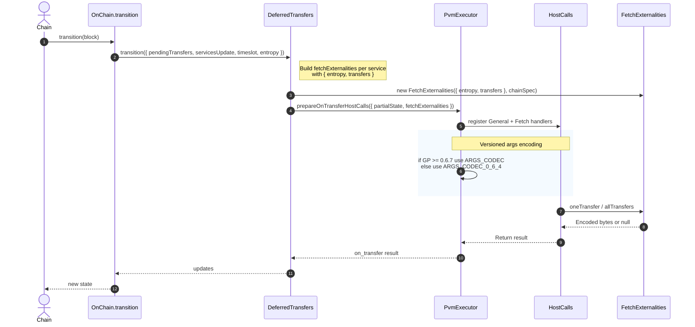
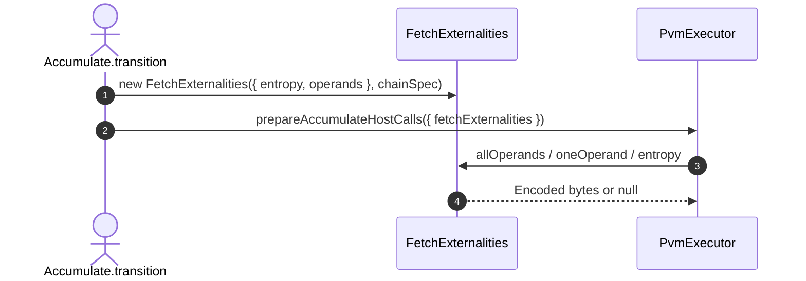

# More general fetch externalities

## Pull Request by @mateuszsikora

In version 067 fetch host call is used in `OnTransfer` invocation to fetch pending transfers so I changed `AccumulateFetchExternalities` to be more general `FetchExternalities` and connected it to deferred transfers invocation


## Comment by @coderabbitai[bot]

<!-- This is an auto-generated comment: summarize by coderabbit.ai -->
<!-- This is an auto-generated comment: skip review by coderabbit.ai -->

> [!IMPORTANT]
> ## Review skipped
> 
> Auto incremental reviews are disabled on this repository.
> 
> Please check the settings in the CodeRabbit UI or the `.coderabbit.yaml` file in this repository. To trigger a single review, invoke the `@coderabbitai review` command.
> 
> You can disable this status message by setting the `reviews.review_status` to `false` in the CodeRabbit configuration file.

<!-- end of auto-generated comment: skip review by coderabbit.ai -->
<!-- walkthrough_start -->

<details>
<summary>📝 Walkthrough</summary>

<!-- This is an auto-generated comment: release notes by coderabbit.ai -->

## Summary by CodeRabbit

- New Features
  - Added support to fetch all transfers or a single transfer during execution.
  - Introduced unified fetch data (entropy, operands, transfers) for more complete context.
  - Added entropy to deferred transfers processing.
- Refactor
  - Renamed the public fetch interface and unified its constructor to use an options object.
  - Aligned on-transfer execution to use the same fetch capabilities as accumulate.
- Tests
  - Updated and expanded tests to cover transfers, operands, and version-based argument encoding compatibility.

<!-- end of auto-generated comment: release notes by coderabbit.ai -->
## Walkthrough
Renames FetchExternalities to IFetchExternalities in host calls and propagates the change. Replaces AccumulateFetchExternalities with a new FetchExternalities class that accepts a unified fetchData object (entropy, operands, transfers). Integrates fetch externalities into accumulate and on-transfer paths, adds versioned argument encoding, updates exports, and revises tests.

## Changes
| Cohort / File(s) | Summary |
|---|---|
| **Host fetch interface rename**<br>`packages/jam/jam-host-calls/fetch.ts`, `packages/jam/jam-host-calls/fetch.test.ts` | Public interface renamed to IFetchExternalities; constructor/field types updated. Tests updated to import IFetchExternalities; mock enhanced with tracking arrays. |
| **Accumulate/on-transfer integration**<br>`packages/jam/transition/accumulate/accumulate.ts`, `packages/jam/transition/accumulate/pvm-executor.ts`, `packages/jam/transition/accumulate/deferred-transfers.ts`, `packages/jam/transition/chain-stf.ts` | Accumulate builds FetchExternalities with options. PVM executor types use IFetchExternalities; on-transfer now wires Fetch host call. DeferredTransfers adds entropy to input, constructs per-service fetchExternalities with transfers, and introduces versioned args encoding; chain STF passes entropy. |
| **Externalities module restructure**<br>`packages/jam/transition/externalities/fetch-externalities.ts`, `packages/jam/transition/externalities/index.ts`, `packages/jam/transition/accumulate/externalities/index.ts` | New FetchExternalities class implements IFetchExternalities, uses unified fetchData and adds transfers support; operands/entropy handling updated with version-aware encoding. New index re-exports fetch-externalities; old accumulate re-export removed. |
| **Tests for externalities**<br>`packages/jam/transition/externalities/fetch-externalities.test.ts` | Tests migrated from AccumulateFetchExternalities to FetchExternalities; add transfers scenarios, helper builders, and updated imports/codecs. |

## Sequence Diagram(s)




## Estimated code review effort
🎯 4 (Complex) | ⏱️ ~60 minutes

## Poem
> I twitch my ears at changing names,  
> IFetch now guides our hopping games.  
> Entropy, operands, transfers too—  
> one tidy basket we carry through.  
> Versioned paths we nibble clean,  
> new trails in jam’s bright garden green.  
> Thump-thump: tests bloom where we’ve been. 🐇✨

</details>

<!-- walkthrough_end -->
<!-- internal state start -->


<!-- DwQgtGAEAqAWCWBnSTIEMB26CuAXA9mAOYCmGJATmriQCaQDG+Ats2bgFyQAOFk+AIwBWJBrngA3EsgEBPRvlqU0AgfFwA6NPEgQAfACgjoCEejqANiS4BZfBRKRS5KhcgAzErgaxIJAB40FBhoFurw0gYActjMApRcAKwAbABMBgCqAEoAMlywuLjciBwA9KVE6rDYAhpMzKUAYhbY7u6yOSqIpbiy3CTxFBSypdzYFhalKekZiAmQzNQk2IgAXojwANb2aAYAyvjYFAyOAlQYPlzMiGDM9iTEZMoWYJ7esGABQSFh4pHQaAopFwkDOmEuC20GH2uGoKy4+H60KyJAkEQA7pQSpACMwVrQKOiADSQRDbNZ4NAkgAiFAAolIhgZOvELNiDABhBxLejULipAAMqUSYAFAA4wKlUtABQBODgAZgA7BwACxigBaRn0xnAUDI9Hw7hwBEeLh5ClY7C4vH4wlE4ikMnkTCUVFU6i0Oh1JigcFQqEwJsIzmUNHo9TYGE4kCo6NJsUWw1BLsUyg9mm0ujAhl1pgM3DQDE2aFI3SEaAaFeYYFg+EQuDADFCbNKbx8GhoDc7JQMACIBwYAMRDyAAQQAkmaw3QE6xAfIjYxYJgy9rIBluLQLbhYI4uyCCJAVo40LGyJXZ2MBGEGDi+tZII0vD46YFKD9wtIUMgMPh4xOz7vG+3yhF+iAkpg9C7vu0ggvAzDcPYuDIA47hWGIOIIL+JDxmBaCIBoMB7owFgEcgQE+HYxaQH+8YIdwVhRihkCAS+sAgR+YF/Mg8AYA2JBoIaxqURx77BNxESEQYUBjrQSj0OQ8a4FQxZ8UQHgRBYtDIPgWCidRmw4vgCbcEhFAgkJtDhHpoQeOxkCbHxOlcOi9ibBONDMAACmgsgWPgQnUtQVL8OQADy/TnLQwWwpBGCGuQ0DnIgngULFZ4ABSCT455MBQ1kYBpME8ICl5BMghaIHM0EmSV+UOIgSEJepCz4DRbC7ooiAAJQaDJxGOO42AXOItluPEK5ovY/DGiVdwdV4dY6eeix8cgJWIJeADcYUWPIJW9P0KDwYhTHsMgUFYae8k2T8OKqU5RXoEMfnIJiDgoNGFCKNgJy0P1RjDqOY4WEE1DwHpG11SRSgMGRVBjfxs1+P45nhvwfDXrefjRuB64TohyGQGE5DHluO4mSe120bhPA1DjR2nmEBEcAYkC6E+7GcRJvxSZAgBJhKxok85+PFfTTB4oETFkeD9zCQH2GhtuxGhCIgfYDRyZHVZAcMIxDenk9u4ZsxzUDw+RXPvIZ0uMSQzEUdz4li/zQuW7rBntUZDHndGyBscBLuSZEUDeQz8B3hsRAhLgRzfl8Bp0GbnNyQp9M3pHmkkNp0PW1R3sp+bkBuRQHleb5/mBTFIVcL5VCdViwBe8WADafal+XDuVwFQl9gAunorf9+zHOc3pJCRcoCUZXXZWNxQiDN+xhntxPU/RQPQ8j2P49JSlaWz5A9flU3LebGv++YKllBb8PRh0g2CEWq6jgOGidMkG0yG2HQ8CxP2QcMl8yFmLKWaQpRqyQMrLWesjZmwTG6O2WAPY2YDk1iOccU5QyI1nIgRMC4UY+FXJEAa4dM53j4kEdwRZHAhDYMuEh9B3Dy3zmJUCfNvxHkDq+YOnDeJYFASWMs0CqwwLrA2JsLYkGqxQiSdEVR0ATAWEtRQpJ4AxzhI1HgjVKBSABlrHWTt3gKH4ipP6BA+DYAphjI8SgkSJWFs7Dh4EvoCSEijEWfDwK7RKrwSQSx7ImPcFpaCD5GFFVnEWfKhUiD7SIlEEyk00DTVcBEssxkSb4EqAwQGRhMGg3BkjPOJV9ZlWKSjAI6NZwzWxlndg+MBoTmjJQGhJw9aiANkjY2PIuAAAMqnEyoa02hbDRYh0QH0wWkABloyGS0igbTHA8PYVxfhUy+IzKEeA8slZRGwMkQg1syCex9K1lDcxYgZrR1jvHHpptWJYA9sgPpok+kkj6f4iQgTuS0D0vtIJEIvEuJ4lMoWnyKABJoOeIS/z5DIK4Cs8Z6yJafKLMIiBUDqwHPgdIlW7xTkPyfosDGr9zwf3jF/dwP9IA2D/gA9B2oQHop2aInoKU7qlGibEcYSwuUMAYDysiNBUGAIwSDbBTxcH0HwfOZMS5iGRMQATb6v0TjGN4SC/mch0C3WekGBixMWEsEgBoZWidebgVKM5AIatLoJXPIxWhG0SK8FRJDFY44BVCqWMCtZriVjgIliVC1rtvxMDMRQCxkMsDUr4NyvEwqY1ETgENZx/rxbfJaHQ/8x45g4XjH6y1PFMoAG9cYqURLIEkiJp4rQAL4kl3EgOoK4+J7H6AwHqbiaAeKXGOb1ibfXpuLVJbKqruDVv4FFKCEEsItuIe2ztfViKoEVRkkN3jxZjm8hOOWJqzwqUhijJCGwkZ2UBEQWIF1Mlng2EVKw06KmCBEJhRinr6ptowB20QkE2gOlanWZSJFvIADUbCo1EHgGaDgTiSG/MgsADhhWzhNmgFNJFGogiXCVBNvLunoVzQ4NayMRrrroHk4G44wZhhjSU2GnTyl0cqXMiyNSsYRzvA0ni65yE4x3Xu6xJtk5esFUOmgRaw2IHHZWydNaZ0JTnYu79y6S4EUdWRf6KYxlbrHeW9gP05PTrrcgRtjCl2iBXf6AR8NsBKBdW/C8DCrpnnIxLCNDYo1XL4DcrRjhMrGoVnMQsuCK2GfkFdWt0U853vUo+xEz77RiG7VdVAiBDjHFnIF9Aet4D/ocNGNqtBxiOELLufqUBCbo1KIM2WZXfDkdoFwbLhqLKtQHWJ/DJBJMTP3QrJWNXdMQJtf4O1fZMmtfEM9Hr/C+uKzNYNrVw2Eq2vVkrIl4gSWzjJe/DEfhv4WS4AACQ0bAMVTKwBGG2SIqBKlr6crwyh0oSg0oOFoGAO7/E0qERQmgwcBTJXmgxrKpMi5jTkeVQNNOs46QTtkEdgivgmaZPmr9R9k37X0BPPQdQKPwlniUmFqtpiTjcE0ANakX9KBveStfb7zSxggjol9Wz9n0BYAM1WrgsPZPw8R9nbSkBMp/LE+wKJyAvBoAFAAcnQO4IIkA9hoGNY+vY0BGg9V8dhL6lbivqqJ5OnXMN9wcu6XxRnFXxy00LSOqTdshmXXklEh1Z4opgDmBQNE7TkHItcetWEFxHBru5BjBRu5ID6bh02g+WJID1vZ9BEigqhjsHMyp0QlvU2QHChgWnX3KCQcFZYxgIeY20VzVVfNgLVmju/KEPSRANhKFKm10IexYQ0EgjRyFz1N1QcsYATAJkDNkLGoWbxWe8aT0gAfU+zfCgmeSI57z/Pl6V7mK41dK1erP5zxtMsbOI8+CzLE1wG5BQcNMeQEZBsPSYABAEVnGQLfRUU5QEaDNAA4t5a/WIy96AAF5IABQNBkgNAlQSRqYxwshP89hp8ORwpqQ6QOQS5FFNtpAApcBSgPcvcSAJxeRkBvkKAMgFRUgE8Ho6csQcgyAiBdwSRn80x6A0QzxYdX4F8GClBwoktydi4P8+B8BtIC9v9f9F46MSR35KBDwTJoDYD4DEDkDp8BRp9khp9VQS4EBcoOCuEY9F5ctYNcB4kmlVU9dUNZB6Es5L1r1Cs5gMJulmCnAvAxwgRpNu1dxqBlx8B6wuESI0AzJDNIVAkODWoH8aowpIBhCb9k0BoUQnUtM3VppPUqlbxcdwoohp9oAsgxwog9hGg6Qshp8ZC4CECkCUDA1SBUDw8SpCditQgmw0w7xfDeBAofASQ+JWdWozwFJI4LRCi5CSjFDlDVDyDejijkDLdNxhMccZYpCWcWhm8OQWAyt4Ax91AIsHVP9uBQM/8jZssAABJmQYYYUoPAeANkTJY/dGEQ2/J5PcYsaSP0REMAKwKQNwMlHfCNKbbALhEyeoRnRwIgAiEkAQPAGmAIfvGaPiCQdqQ2LAZnE8Bza3avX3cWK6Koz+C4RQVqAKHJSjApbvGE+jRwMpRGZjJcWrDGWpTjCtRpKAOlLqGVDRW5T6ITXpGZSnV7OgFfb7TsU3GNDZLANFMBG7PZOfB7QdLrZ7KnFPd7OfbklCKZZnaJEgMne1XVayc9NwJoqKXoGZTnSdfkk6ARRnO0V9EEYXOCLzOON7dAF5PU2QPpHqVojQEgIiQLUePpUUpGMtHgA0dSLkrEJtBCDA/AXAEkHAyOaQCYpYLgc3PAPYPRCMxAKM6FetHqM5DmAgd0z0mNb0hxP0nQuddAxATAsMhM9VZMx8WM3AeMz3RMis+guHOPLgdk6nTkgshnPANMwGR+TbF+NMclPbKlGlE7IgM7RlYBS7AsFlYUhobMvSflTrJ7UNCZa1FbUbX7c7AHacaVOcUHIhFcJVIwFEO4fRHLOpO8ATVGS4hwT4VjEEbLVHYrR9QUjFXZWc3k+cx7PlZc/hVcpQdcyZDDRwUmRzW89GDo5Rck5AbLPpZWL8mgV4diW8pbQidWKZTKWZS4gAKjmwG3goeEQx/PAjG22gdLU2QCUCsHDHoLCGYD4ghl7xXBBBvPJLmxKhGyKxK1xJBnxIqSPFKUYxJKhhY2qUNA4woWpJ4wGjfFEo6UtiEqwGI3wH0X6VYpwuyzwvFJQ0QveGQozSkjGwNJfNZVuw/IwAXJ9RoEW30uW3/MJQMB7OflJX7N20/gOxjDpWsgZSAQgEnOu0xRFLMosvExIFGAkBrDBKL3sFFUZS3JwQtBB0IQVQPLXGiK/iLEsWgociIvFiOg6IdTKKDywDAwg0iugz4DjXQC0sCUiwwA+x0NKl3EIkgBiM02/Bm1cTD18CRSG2gpmh916olg60spICOzgQ5BbGRP5iumXx0LGobAmomCmukHil5HkmQFmsoIqtt1634pIiZiIjTjuhbCnU2vzz4AkVxWUTmDjm4HL3oguDmLrzYUgAPNoCsCsXvQ0hyoMoGpQq70ZNajOtXy6tExGulyypMWSVSW4uoyKWYz2qJMEoJJEuQnYwzhxm4yknXGgHCUa36T+pssmVRWR2GpCvmtwEWosGWuJpgo6tBUyT6R6pQqMv8rfPZXuyRmColO4HCtvPBIX3lIGlxuOishEz6UJtr2xGZqJqMuR2BrSgpqppptZunICvfM5pjW5qe15oiv8AFsJSgAACESAppIZXBRgqTLzyNEUBTvJwq3wDa3UQtJ5c85rxrpF3kaZ4q3A3qPrfxc02inqctXl2IplLrGAWw81WpZkUKNBJapNVahT1aOb+IxTFy+Vdb+aorBbJkNsnLtsXL3U3K40PL6VmBzsJyrs1b2a5zzLlN3dcB3AYr/sJVtyEqCF5VwcUrSFZInd6A7SuA7TW4BR+4UcfCgQrDsNuDSpqpD8TIWzpT/TF4eTNajZ1p4Bm8c8OQv1V606kZDrlEQy9wKrQlkBMo8yipl651wzyybFHBQa3Vn4yxAy2BiyQz6DvANBu1iMoRjwLge6AZIBEl+AYI+APifo3BCN4wZpqcZo/bWoIcXoirdc/oKMgYqNClaNhLEa5KulSTjRyT0bzzJLsaBpElyB86tsIwi6KV9tS7f4vKK7xzfLq7k7a6gqfqIFCLerOw4IW7xUsF27gdO6wd0le6WrlS2qsctpyicMSIBDeRqroUuGNo4IKjfACc6YeGUKcR+HBoMas5nlxHmFWEyaut6b+YjxLGVryDDp1HmcMc5sdGia7Ue1BJhIqqM6EKXGpa7VLcZKoJZwMcuAxboJhgxxEAazcD8Dx7TgAoaJJtdowmYBMjsjcj8ibA6QbBwpp8jaABNaAOkPYcg7yX0q+hqpxo/axS42UygJDHOHcOCe4jce+w0BTKYy4nfbLBbKLKCNxo8BbfC0oPphKO1AGmOVqUGtEm3IOXRwqy3ZpVBrTLR+MPcCwKKHRZUwEEga+zKKwIqXcVwpi0EbAU4laMplqCpra4eaO56S52JZeuoEPB+xRSsQ4aMMMjLE4EkezKbGEkkAEudK6NgO4AXHSAJ98FbRPWCBsPWEKU585+YZ2nZjKe6rx5UliOp3Qq6BwK05GM8ZBNFl9B0UxWEPiVqO0+TEzaPLa4Fh1PFo4ZGVuIlkKEkZTH9BgfuS3Y85SqJEmS9eJ72FGA8F1dw8iSQ2cDAcYM4yqxYDAeQTqZaARGmRRrxkaxq2ALXaQWFliHZjTWhegHVQnUVjwdqbHMI7Fq/GZ8cXdHlqRw1ntTAcQFG/tZR7rHa2bUGwnGxlVqO0Vy3aHaCZps1vgK1t/UkOscYegRl4IJRNwcNzfNMDaAsjRyAVgtMdgjEzg7gzKV+XJOYAARy+MD1A0BGoIwEygefzK2o0AWLhkdIoPOqUy/U5ZSwdV+J2ZiwmD2b6lHigEQCjcF2leUXRD3CwGxa+n/N3z/BBBINSCHrRgdF/BldDbCl2Z0Mym7VBqDEOEbCNCQxISndtX7cjcOGHdXbHbICbdXw4tQHndOfghs3sH0MXc7RYhHagZmgNQwCzU3uPdG1PcHfPZja8CZfXZvbSiHuze8McCqQdEPwatBureufOrrfqPIM7e0SPAnmXq3ctxsD4hmjQy4CUtPNcxYGYlnCBfBZJj4iKpyyljQxNIdEz3UfwXUDoUvHuSy1YT7Hwp0p8D0qlvGyPD7F8ak3WyBjxPhpweNzwaY2ErJLvOIapKxoke1itl8ytMcBZIeXMZQ19aFyIdMYPXdcE4+FUbtW7SFiM+yhU9M4Vgk4mWs+koc9MQbGdbVJEwyKyJyLyOnyyZybycKeKavLRsc8gH2IfEOJGGxUuqkUQWsqltGEBBdZeE85FXViob7Ob1cspXcuO1O0rtYanPYbZTruS6k3xSE6s43NirbvipEblTEYhxVWWeeuqIRcLCrg8UaJ+iLF8EqtUer20ysg6LYTRc8wsTuSukQDDx8Faj8SpOMesc9b9zOgdgaWehlr8YMbVYM+HTmaJtIitlQCpQAxePkAcFiPQb9CTyMQ88uWLyQYfLQCem+rhwR0HfINGZWiPFiwfTTXeGJe4PZYMzAlWEpaj2M2i1Wsg6xACcbLxchVRDsmZ1+WgtYVZdhGdMbNxbA+CBXeUTy3QAEDmEK0yn9w8ZRmsn0IBWyztO+9gD7agA3lnXPCPTR7cAx48ax5NRx/Qz+8QF2ljeRk/ZQGNC6FTzm5qeQkIO2LqvsSTkKyCOekyg2K2NEL0g0FAyUJULUPhOzw6YGIN5rTAYUTmGN7rVZ/HH7tMkuMqsTZbGvt+6vnOvRb6ehR2PYgyj3vnznS0LuY0hQ6IGXov1/XIKDrszoRldKAEA+ZWh8FEE2Badw4aqN86PgH0IR4oGaWnYT5GgjFuKMkylSAAD1SD22B6YPLp1Egfc/1Dr23UKfycoAUR7AASMB4BVhgnpir87gnzStqBYA840JbDEThleZSRnu7lMphn8Lxn1WQqRmOnrPyDCdQ/w/CrdonGt+GqrpdupNLc+Ms5Lz8FFlRkkHo+8unMluSITPTvdY1vjupb2WUr7+g9NuqOccFkllMkj+EyeHnp1ahzBGQdkJVmom07xxz6s7FQAChbDs9FMbvDdltSHwt5T4fAehCQD7bSceKsnZGLg2JKutCG7nSkhJXU6Q4oAmnXWAVkvC8gGWDwaAQ4AjaYViYxjQ7hJnW7ixfYW3f2DphZqoo2aFXThr1Rq6WdeG8paZGwNljGMjOvAx2E4lf6J1g0JELaAwhCRWB2uIydpAoPYAwkTGrAvQfwN9ZgoZkxgliIAJRRO9XUK3IxOuAWKRoLE1yRkn5h45NZT2fSDzM93sAyZwszPbnF90RzUtosXAJAbQGHjv8oQnLLgDvWiHLozBXgi5JaV8GC8uAokDKFEIswMBYhrbBIbxipKQCGSmiHTkVjyzdEkYrAxAR0xcJcAjasgLsEbQCgCBEh1QkzFuzqENDpATQwQJAAAA+tEGVmcjISFDVE9AELJgNojccbang9PltUyiz4dC+fAIFwAyDJBVQaZaQXMPOqZRsWyw/wKsPWFpl1wUQOmBcWQhLd8cLMc+ha02QkNvBKQigD1AjZBt+kyODIQiyAKR5ecAAfkCG85meu0YXn8Ot7RRh4viAsiCP343N+4u0etKRSFxT97oR4QfiVkgKhEdUy3CSs8h6gFCJKk2FjBwnvD9AI2rVR1gSKXCh1lBEyKZMjlBpM1TBbFWwRJUvIYVou/QWLvsgS5HIZEBKNCriJGESVCqKMTfuUzD6VMOc2bdSBGwzaxIRWqbI3n0mhFod62ogdCueQBRoRKAz+J/HjB1L2FJsAoxytQwj4DkS6w5Yriw2ZTldTKa9cyqoz/K2p6urdIRk1zwSiN9yJCSHGnDr6E5URj6TQaeBBDCDbR+9LWg6JGw9gsI7hFineUuiQU4xc2ZWM534T+NV0w+F5nXxIbn8jg//GwXB0Gr+UxuRAIgA4ABJTZioJEFMa4mGijQY03EeQEXwLzsU1ynFKwAkhMhRo8YDCbElnFgZDB4GUEUmBpCQb6sqEP0EwrQF35PscsnmbQKOSbr2B0QgIUDmBWQiw0sGClQkgpy3Go02MYlQxlxj1FkMw4anO8t5yay6lzx6lPjsmKQpWc1sSdV8iILtFVcVykYqQZlEJyBijRxKXLo5joZDlDstKcuiVxzB5h9QDqJcGgGgzCNC6VoaMKRzQDxhEqyYHVGwRUBqBMw3ocCb6EtB0VcA0+TeogGnz5c6A0+TzrLB1AGA8J8kKUAKDQCpAFQzE2UOKDFCpBZQAgAAIxih4gSoeSAKC4kCBkgyQUQLKFoAMBlQKQcUNmFzB4TIw6gIiTpFInF1MQtAafAaFklAA== -->

<!-- internal state end -->
<!-- tips_start -->

---


<details>
<summary>🪧 Tips</summary>

### Chat

There are 3 ways to chat with [CodeRabbit](https://coderabbit.ai?utm_source=oss&utm_medium=github&utm_campaign=FluffyLabs/typeberry&utm_content=562):

- Review comments: Directly reply to a review comment made by CodeRabbit. Example:
  - `I pushed a fix in commit <commit_id>, please review it.`
  - `Open a follow-up GitHub issue for this discussion.`
- Files and specific lines of code (under the "Files changed" tab): Tag `@coderabbitai` in a new review comment at the desired location with your query.
- PR comments: Tag `@coderabbitai` in a new PR comment to ask questions about the PR branch. For the best results, please provide a very specific query, as very limited context is provided in this mode. Examples:
  - `@coderabbitai gather interesting stats about this repository and render them as a table. Additionally, render a pie chart showing the language distribution in the codebase.`
  - `@coderabbitai read the files in the src/scheduler package and generate a class diagram using mermaid and a README in the markdown format.`

### Support

Need help? Create a ticket on our [support page](https://www.coderabbit.ai/contact-us/support) for assistance with any issues or questions.

### CodeRabbit Commands (Invoked using PR/Issue comments)

Type `@coderabbitai help` to get the list of available commands.

### Other keywords and placeholders

- Add `@coderabbitai ignore` anywhere in the PR description to prevent this PR from being reviewed.
- Add `@coderabbitai summary` to generate the high-level summary at a specific location in the PR description.
- Add `@coderabbitai` anywhere in the PR title to generate the title automatically.

### Status, Documentation and Community

- Visit our [Status Page](https://status.coderabbit.ai) to check the current availability of CodeRabbit.
- Visit our [Documentation](https://docs.coderabbit.ai) for detailed information on how to use CodeRabbit.
- Join our [Discord Community](http://discord.gg/coderabbit) to get help, request features, and share feedback.
- Follow us on [X/Twitter](https://twitter.com/coderabbitai) for updates and announcements.

</details>

<!-- tips_end -->


## Comment by @tomusdrw

> **Actionable comments posted: 0**
> 
> Caution
> 
> Some comments are outside the diff and can’t be posted inline due to platform limitations.
> 
> ⚠️ Outside diff range comments (1)
> > packages/jam/transition/chain-stf.ts (1)> `279-285`: **Remove extraneous top-level spread of servicesUpdate in DeferredTransfers.transition call**
> > > The `DeferredTransfers.transition` method signature only destructures the following fields (per the implementation at packages/jam/transition/accumulate/deferred-transfers.ts:62–65):
> > > • pendingTransfers
> > > • timeslot
> > > • servicesUpdate (renamed to `inputServicesUpdate`)
> > > By spreading `...servicesUpdate` at the top level, you inject all of the nested service slices as top-level arguments, which
> > > 
> > > * aren’t expected by the transition API
> > > * shadow or duplicate the intended `servicesUpdate` field
> > > * will trigger TypeScript “excess property” errors and may lead to subtle runtime bugs
> > > 
> > > Affected location
> > > • packages/jam/transition/chain-stf.ts lines 279–285
> > > Proposed fix
> > > ```diff
> > > -    const deferredTransfersResult = await this.deferredTransfers.transition({
> > > -      entropy: entropy[0],
> > > -      pendingTransfers,
> > > -      servicesUpdate: { ...servicesUpdate, preimages: accumulatePreimages },
> > > -      timeslot: timeSlot,
> > > -      ...servicesUpdate,
> > > -    });
> > > +    const deferredTransfersResult = await this.deferredTransfers.transition({
> > > +      entropy: entropy[0],
> > > +      pendingTransfers,
> > > +      servicesUpdate: { ...servicesUpdate, preimages: accumulatePreimages },
> > > +      timeslot: timeSlot,
> > > +    });
> > > ```
> 
> 🧹 Nitpick comments (9)
> 📜 Review details

^^^ This seems like an interesting find, can you check @mateuszsikora ?


## Comment by @mateuszsikora

> > **Actionable comments posted: 0**
> > Caution
> > Some comments are outside the diff and can’t be posted inline due to platform limitations.
> > ⚠️ Outside diff range comments (1)
> > > packages/jam/transition/chain-stf.ts (1)> `279-285`: **Remove extraneous top-level spread of servicesUpdate in DeferredTransfers.transition call**
> > > > The `DeferredTransfers.transition` method signature only destructures the following fields (per the implementation at packages/jam/transition/accumulate/deferred-transfers.ts:62–65):
> > > > • pendingTransfers
> > > > • timeslot
> > > > • servicesUpdate (renamed to `inputServicesUpdate`)
> > > > By spreading `...servicesUpdate` at the top level, you inject all of the nested service slices as top-level arguments, which
> > > > 
> > > > * aren’t expected by the transition API
> > > > * shadow or duplicate the intended `servicesUpdate` field
> > > > * will trigger TypeScript “excess property” errors and may lead to subtle runtime bugs
> > > > 
> > > > Affected location
> > > > • packages/jam/transition/chain-stf.ts lines 279–285
> > > > Proposed fix
> > > > ```diff
> > > > -    const deferredTransfersResult = await this.deferredTransfers.transition({
> > > > -      entropy: entropy[0],
> > > > -      pendingTransfers,
> > > > -      servicesUpdate: { ...servicesUpdate, preimages: accumulatePreimages },
> > > > -      timeslot: timeSlot,
> > > > -      ...servicesUpdate,
> > > > -    });
> > > > +    const deferredTransfersResult = await this.deferredTransfers.transition({
> > > > +      entropy: entropy[0],
> > > > +      pendingTransfers,
> > > > +      servicesUpdate: { ...servicesUpdate, preimages: accumulatePreimages },
> > > > +      timeslot: timeSlot,
> > > > +    });
> > > > ```
> > 
> > 
> > 🧹 Nitpick comments (9)
> > 📜 Review details
> 
> ^^^ This seems like an interesting find, can you check @mateuszsikora ?

yeah, we don't need it anymore. fixed


## Comment by @github-actions[bot]


<details>
<summary>View all</summary>

| File | Benchmark | Ops |  |
|------|-----------|-----|--|
| [bytes/hex-to.ts[0]](../blob/d5b82d6704b11b36c4896487a11b4af9c11667bc//_work/typeberry-runner-2/typeberry/typeberry/benchmarks/bytes/hex-to.ts) | number toString + padding | 323671.35 ±0.1% | fastest ✅ |
| [bytes/hex-to.ts[1]](../blob/d5b82d6704b11b36c4896487a11b4af9c11667bc//_work/typeberry-runner-2/typeberry/typeberry/benchmarks/bytes/hex-to.ts) | manual | 16567.31 ±0.21% | 94.88% slower |
| [math/count-bits-u64.ts[0]](../blob/d5b82d6704b11b36c4896487a11b4af9c11667bc//_work/typeberry-runner-2/typeberry/typeberry/benchmarks/math/count-bits-u64.ts) | standard method | 1046364.32 ±0.29% | 91.43% slower |
| [math/count-bits-u64.ts[1]](../blob/d5b82d6704b11b36c4896487a11b4af9c11667bc//_work/typeberry-runner-2/typeberry/typeberry/benchmarks/math/count-bits-u64.ts) | magic | 12212705.31 ±0.6% | fastest ✅ |
| [hash/index.ts[0]](../blob/d5b82d6704b11b36c4896487a11b4af9c11667bc//_work/typeberry-runner-2/typeberry/typeberry/benchmarks/hash/index.ts) | hash with numeric representation | 192.7 ±0.64% | 25.92% slower |
| [hash/index.ts[1]](../blob/d5b82d6704b11b36c4896487a11b4af9c11667bc//_work/typeberry-runner-2/typeberry/typeberry/benchmarks/hash/index.ts) | hash with string representation | 120.89 ±0.31% | 53.52% slower |
| [hash/index.ts[2]](../blob/d5b82d6704b11b36c4896487a11b4af9c11667bc//_work/typeberry-runner-2/typeberry/typeberry/benchmarks/hash/index.ts) | hash with symbol representation | 185.12 ±0.05% | 28.83% slower |
| [hash/index.ts[3]](../blob/d5b82d6704b11b36c4896487a11b4af9c11667bc//_work/typeberry-runner-2/typeberry/typeberry/benchmarks/hash/index.ts) | hash with uint8 representation | 164.84 ±0.17% | 36.63% slower |
| [hash/index.ts[4]](../blob/d5b82d6704b11b36c4896487a11b4af9c11667bc//_work/typeberry-runner-2/typeberry/typeberry/benchmarks/hash/index.ts) | hash with packed representation | 260.11 ±0.36% | fastest ✅ |
| [hash/index.ts[5]](../blob/d5b82d6704b11b36c4896487a11b4af9c11667bc//_work/typeberry-runner-2/typeberry/typeberry/benchmarks/hash/index.ts) | hash with bigint representation | 186.49 ±2.14% | 28.3% slower |
| [hash/index.ts[6]](../blob/d5b82d6704b11b36c4896487a11b4af9c11667bc//_work/typeberry-runner-2/typeberry/typeberry/benchmarks/hash/index.ts) | hash with uint32 representation | 202.26 ±0.59% | 22.24% slower |
| [logger/index.ts[0]](../blob/d5b82d6704b11b36c4896487a11b4af9c11667bc//_work/typeberry-runner-2/typeberry/typeberry/benchmarks/logger/index.ts) | console.log with string concat | 7107444.37 ±56.66% | fastest ✅ |
| [logger/index.ts[1]](../blob/d5b82d6704b11b36c4896487a11b4af9c11667bc//_work/typeberry-runner-2/typeberry/typeberry/benchmarks/logger/index.ts) | console.log with args | 1072217.62 ±91.12% | 84.91% slower |
| [math/add_one_overflow.ts[0]](../blob/d5b82d6704b11b36c4896487a11b4af9c11667bc//_work/typeberry-runner-2/typeberry/typeberry/benchmarks/math/add_one_overflow.ts) | add and take modulus | 218694843.16 ±16.53% | 13.54% slower |
| [math/add_one_overflow.ts[1]](../blob/d5b82d6704b11b36c4896487a11b4af9c11667bc//_work/typeberry-runner-2/typeberry/typeberry/benchmarks/math/add_one_overflow.ts) | condition before calculation | 252956361.55 ±6.61% | fastest ✅ |
| [codec/bigint.decode.ts[0]](../blob/d5b82d6704b11b36c4896487a11b4af9c11667bc//_work/typeberry-runner-2/typeberry/typeberry/benchmarks/codec/bigint.decode.ts) | decode custom | 167549557.87 ±2.46% | fastest ✅ |
| [codec/bigint.decode.ts[1]](../blob/d5b82d6704b11b36c4896487a11b4af9c11667bc//_work/typeberry-runner-2/typeberry/typeberry/benchmarks/codec/bigint.decode.ts) | decode bigint | 80838336.22 ±2.54% | 51.75% slower |
| [codec/decoding.ts[0]](../blob/d5b82d6704b11b36c4896487a11b4af9c11667bc//_work/typeberry-runner-2/typeberry/typeberry/benchmarks/codec/decoding.ts) | manual decode | 15590623.4 ±2.28% | 92.02% slower |
| [codec/decoding.ts[1]](../blob/d5b82d6704b11b36c4896487a11b4af9c11667bc//_work/typeberry-runner-2/typeberry/typeberry/benchmarks/codec/decoding.ts) | int32array decode | 177843933 ±5.05% | 9.02% slower |
| [codec/decoding.ts[2]](../blob/d5b82d6704b11b36c4896487a11b4af9c11667bc//_work/typeberry-runner-2/typeberry/typeberry/benchmarks/codec/decoding.ts) | dataview decode | 195479614.54 ±4.53% | fastest ✅ |
| [codec/encoding.ts[0]](../blob/d5b82d6704b11b36c4896487a11b4af9c11667bc//_work/typeberry-runner-2/typeberry/typeberry/benchmarks/codec/encoding.ts) | manual encode | 2536814.82 ±1.17% | 21.78% slower |
| [codec/encoding.ts[1]](../blob/d5b82d6704b11b36c4896487a11b4af9c11667bc//_work/typeberry-runner-2/typeberry/typeberry/benchmarks/codec/encoding.ts) | int32array encode | 3209565.92 ±0.8% | 1.04% slower |
| [codec/encoding.ts[2]](../blob/d5b82d6704b11b36c4896487a11b4af9c11667bc//_work/typeberry-runner-2/typeberry/typeberry/benchmarks/codec/encoding.ts) | dataview encode | 3243252.22 ±0.37% | fastest ✅ |
| [bytes/hex-from.ts[0]](../blob/d5b82d6704b11b36c4896487a11b4af9c11667bc//_work/typeberry-runner-2/typeberry/typeberry/benchmarks/bytes/hex-from.ts) | parse hex using `Number` with NaN checking | 119939.65 ±0.93% | 84.01% slower |
| [bytes/hex-from.ts[1]](../blob/d5b82d6704b11b36c4896487a11b4af9c11667bc//_work/typeberry-runner-2/typeberry/typeberry/benchmarks/bytes/hex-from.ts) | parse hex from char codes | 750153.94 ±0.11% | fastest ✅ |
| [bytes/hex-from.ts[2]](../blob/d5b82d6704b11b36c4896487a11b4af9c11667bc//_work/typeberry-runner-2/typeberry/typeberry/benchmarks/bytes/hex-from.ts) | parse hex from string nibbles | 475874.25 ±0.94% | 36.56% slower |
| [codec/bigint.compare.ts[0]](../blob/d5b82d6704b11b36c4896487a11b4af9c11667bc//_work/typeberry-runner-2/typeberry/typeberry/benchmarks/codec/bigint.compare.ts) | compare custom | 254906154.77 ±7.03% | 4.19% slower |
| [codec/bigint.compare.ts[1]](../blob/d5b82d6704b11b36c4896487a11b4af9c11667bc//_work/typeberry-runner-2/typeberry/typeberry/benchmarks/codec/bigint.compare.ts) | compare bigint | 266067352.13 ±5.46% | fastest ✅ |
| [collections/map-set.ts[0]](../blob/d5b82d6704b11b36c4896487a11b4af9c11667bc//_work/typeberry-runner-2/typeberry/typeberry/benchmarks/collections/map-set.ts) | 2 gets + conditional set | 111521.18 ±0.13% | fastest ✅ |
| [collections/map-set.ts[1]](../blob/d5b82d6704b11b36c4896487a11b4af9c11667bc//_work/typeberry-runner-2/typeberry/typeberry/benchmarks/collections/map-set.ts) | 1 get 1 set | 61716.02 ±0.11% | 44.66% slower |
| [math/count-bits-u32.ts[0]](../blob/d5b82d6704b11b36c4896487a11b4af9c11667bc//_work/typeberry-runner-2/typeberry/typeberry/benchmarks/math/count-bits-u32.ts) | standard method | 93604729.05 ±1.58% | 62.15% slower |
| [math/count-bits-u32.ts[1]](../blob/d5b82d6704b11b36c4896487a11b4af9c11667bc//_work/typeberry-runner-2/typeberry/typeberry/benchmarks/math/count-bits-u32.ts) | magic | 247279042.75 ±5.79% | fastest ✅ |
| [math/mul_overflow.ts[0]](../blob/d5b82d6704b11b36c4896487a11b4af9c11667bc//_work/typeberry-runner-2/typeberry/typeberry/benchmarks/math/mul_overflow.ts) | multiply and bring back to u32 | 269011982.09 ±5.17% | 0.27% slower |
| [math/mul_overflow.ts[1]](../blob/d5b82d6704b11b36c4896487a11b4af9c11667bc//_work/typeberry-runner-2/typeberry/typeberry/benchmarks/math/mul_overflow.ts) | multiply and take modulus | 269739586.32 ±5.47% | fastest ✅ |
| [math/switch.ts[0]](../blob/d5b82d6704b11b36c4896487a11b4af9c11667bc//_work/typeberry-runner-2/typeberry/typeberry/benchmarks/math/switch.ts) | switch | 244709586.11 ±7.09% | 3.66% slower |
| [math/switch.ts[1]](../blob/d5b82d6704b11b36c4896487a11b4af9c11667bc//_work/typeberry-runner-2/typeberry/typeberry/benchmarks/math/switch.ts) | if | 254012873.35 ±5.97% | fastest ✅ |
| [collections/map_vs_sorted.ts[0]](../blob/d5b82d6704b11b36c4896487a11b4af9c11667bc//_work/typeberry-runner-2/typeberry/typeberry/benchmarks/collections/map_vs_sorted.ts) | Map | 290602.86 ±0.51% | fastest ✅ |
| [collections/map_vs_sorted.ts[1]](../blob/d5b82d6704b11b36c4896487a11b4af9c11667bc//_work/typeberry-runner-2/typeberry/typeberry/benchmarks/collections/map_vs_sorted.ts) | Map-array | 103319.16 ±0.03% | 64.45% slower |
| [collections/map_vs_sorted.ts[2]](../blob/d5b82d6704b11b36c4896487a11b4af9c11667bc//_work/typeberry-runner-2/typeberry/typeberry/benchmarks/collections/map_vs_sorted.ts) | Array | 84892.08 ±2.26% | 70.79% slower |
| [collections/map_vs_sorted.ts[3]](../blob/d5b82d6704b11b36c4896487a11b4af9c11667bc//_work/typeberry-runner-2/typeberry/typeberry/benchmarks/collections/map_vs_sorted.ts) | SortedArray | 198363.41 ±0.18% | 31.74% slower |
| [hash/blake2b.ts[0]](../blob/d5b82d6704b11b36c4896487a11b4af9c11667bc//_work/typeberry-runner-2/typeberry/typeberry/benchmarks/hash/blake2b.ts) | hasher with simple allocator | 0.05 ±1% | fastest ✅ |
| [hash/blake2b.ts[1]](../blob/d5b82d6704b11b36c4896487a11b4af9c11667bc//_work/typeberry-runner-2/typeberry/typeberry/benchmarks/hash/blake2b.ts) | hasher with page allocator | 0.04 ±2.32% | 20% slower |
| [bytes/compare.ts[0]](../blob/d5b82d6704b11b36c4896487a11b4af9c11667bc//_work/typeberry-runner-2/typeberry/typeberry/benchmarks/bytes/compare.ts) | Comparing Uint32 bytes | 18855.12 ±0.54% | 2.65% slower |
| [bytes/compare.ts[1]](../blob/d5b82d6704b11b36c4896487a11b4af9c11667bc//_work/typeberry-runner-2/typeberry/typeberry/benchmarks/bytes/compare.ts) | Comparing raw bytes | 19369.09 ±1.18% | fastest ✅ |
| [codec/view_vs_collection.ts[0]](../blob/d5b82d6704b11b36c4896487a11b4af9c11667bc//_work/typeberry-runner-2/typeberry/typeberry/benchmarks/codec/view_vs_collection.ts) | Get first element from Decoded | 21271.36 ±1.42% | 61.02% slower |
| [codec/view_vs_collection.ts[1]](../blob/d5b82d6704b11b36c4896487a11b4af9c11667bc//_work/typeberry-runner-2/typeberry/typeberry/benchmarks/codec/view_vs_collection.ts) | Get first element from View | 54563.36 ±0.66% | fastest ✅ |
| [codec/view_vs_collection.ts[2]](../blob/d5b82d6704b11b36c4896487a11b4af9c11667bc//_work/typeberry-runner-2/typeberry/typeberry/benchmarks/codec/view_vs_collection.ts) | Get 50th element from Decoded | 23446.29 ±0.61% | 57.03% slower |
| [codec/view_vs_collection.ts[3]](../blob/d5b82d6704b11b36c4896487a11b4af9c11667bc//_work/typeberry-runner-2/typeberry/typeberry/benchmarks/codec/view_vs_collection.ts) | Get 50th element from View | 32416.69 ±0.39% | 40.59% slower |
| [codec/view_vs_collection.ts[4]](../blob/d5b82d6704b11b36c4896487a11b4af9c11667bc//_work/typeberry-runner-2/typeberry/typeberry/benchmarks/codec/view_vs_collection.ts) | Get last element from Decoded | 23915.28 ±1.98% | 56.17% slower |
| [codec/view_vs_collection.ts[5]](../blob/d5b82d6704b11b36c4896487a11b4af9c11667bc//_work/typeberry-runner-2/typeberry/typeberry/benchmarks/codec/view_vs_collection.ts) | Get last element from View | 26914.89 ±0.37% | 50.67% slower |
| [codec/view_vs_object.ts[0]](../blob/d5b82d6704b11b36c4896487a11b4af9c11667bc//_work/typeberry-runner-2/typeberry/typeberry/benchmarks/codec/view_vs_object.ts) | Get the first field from Decoded | 441151.29 ±0.63% | 2% slower |
| [codec/view_vs_object.ts[1]](../blob/d5b82d6704b11b36c4896487a11b4af9c11667bc//_work/typeberry-runner-2/typeberry/typeberry/benchmarks/codec/view_vs_object.ts) | Get the first field from View | 98030.29 ±1.19% | 78.22% slower |
| [codec/view_vs_object.ts[2]](../blob/d5b82d6704b11b36c4896487a11b4af9c11667bc//_work/typeberry-runner-2/typeberry/typeberry/benchmarks/codec/view_vs_object.ts) | Get the first field as view from View | 101856.32 ±0.7% | 77.37% slower |
| [codec/view_vs_object.ts[3]](../blob/d5b82d6704b11b36c4896487a11b4af9c11667bc//_work/typeberry-runner-2/typeberry/typeberry/benchmarks/codec/view_vs_object.ts) | Get two fields from Decoded | 450153.31 ±0.23% | fastest ✅ |
| [codec/view_vs_object.ts[4]](../blob/d5b82d6704b11b36c4896487a11b4af9c11667bc//_work/typeberry-runner-2/typeberry/typeberry/benchmarks/codec/view_vs_object.ts) | Get two fields from View | 80228.68 ±1.18% | 82.18% slower |
| [codec/view_vs_object.ts[5]](../blob/d5b82d6704b11b36c4896487a11b4af9c11667bc//_work/typeberry-runner-2/typeberry/typeberry/benchmarks/codec/view_vs_object.ts) | Get two fields from materialized from View | 172099.75 ±0.16% | 61.77% slower |
| [codec/view_vs_object.ts[6]](../blob/d5b82d6704b11b36c4896487a11b4af9c11667bc//_work/typeberry-runner-2/typeberry/typeberry/benchmarks/codec/view_vs_object.ts) | Get two fields as views from View | 81667.28 ±0.26% | 81.86% slower |
| [codec/view_vs_object.ts[7]](../blob/d5b82d6704b11b36c4896487a11b4af9c11667bc//_work/typeberry-runner-2/typeberry/typeberry/benchmarks/codec/view_vs_object.ts) | Get only third field from Decoded | 443024.21 ±1.52% | 1.58% slower |
| [codec/view_vs_object.ts[8]](../blob/d5b82d6704b11b36c4896487a11b4af9c11667bc//_work/typeberry-runner-2/typeberry/typeberry/benchmarks/codec/view_vs_object.ts) | Get only third field from View | 100520.34 ±1.2% | 77.67% slower |
| [codec/view_vs_object.ts[9]](../blob/d5b82d6704b11b36c4896487a11b4af9c11667bc//_work/typeberry-runner-2/typeberry/typeberry/benchmarks/codec/view_vs_object.ts) | Get only third field as view from View | 101847.28 ±0.69% | 77.37% slower |
| [crypto/ed25519.ts[0]](../blob/d5b82d6704b11b36c4896487a11b4af9c11667bc//_work/typeberry-runner-2/typeberry/typeberry/benchmarks/crypto/ed25519.ts) | native crypto | 5.77 ±16.6% | 80.64% slower |
| [crypto/ed25519.ts[1]](../blob/d5b82d6704b11b36c4896487a11b4af9c11667bc//_work/typeberry-runner-2/typeberry/typeberry/benchmarks/crypto/ed25519.ts) | wasm lib | 10.63 ±0.18% | 64.33% slower |
| [crypto/ed25519.ts[2]](../blob/d5b82d6704b11b36c4896487a11b4af9c11667bc//_work/typeberry-runner-2/typeberry/typeberry/benchmarks/crypto/ed25519.ts) | wasm lib batch | 29.8 ±0.57% | fastest ✅ |
</details>


### Benchmarks summary: 63/63 OK ✅

<!-- thollander/actions-comment-pull-request "benchmarks" -->


## Comment by @tomusdrw

Could we make this a tagged union to see exactly in which context what options are required? I.e. something like:
```ts
type FetchData = {
 context: Accumulate,
 entropy: EntropyHash,
 operands: Operand[],
} | {
 context: OnTransfer,
 entropy: EntropyHash,
 transfers: PendingTransfer[], 
}
```

Now the logic is somewhere, but we don't involve typechecker for additional correctness checks on this.


## Comment by @tomusdrw

BTW: we still have some methods methods left for `Refine` and `Authorize`, right?


## Comment by @mateuszsikora

> Could we make this a tagged union to see exactly in which context what options are required? I.e. something like:
> 
> ```ts
> type FetchData = {
>  context: Accumulate,
>  entropy: EntropyHash,
>  operands: Operand[],
> } | {
>  context: OnTransfer,
>  entropy: EntropyHash,
>  transfers: PendingTransfer[], 
> }
> ```
> 
> Now the logic is somewhere, but we don't involve typechecker for additional correctness checks on this.

fixed


## Comment by @mateuszsikora

> BTW: we still have some methods methods left for `Refine` and `Authorize`, right?

yup, but currently we don't need it
