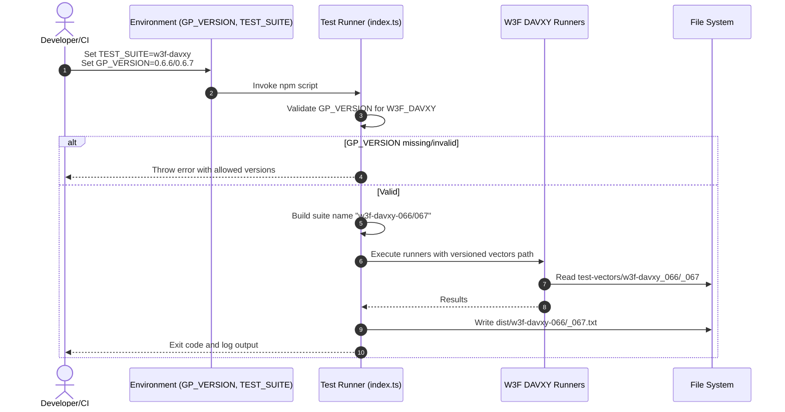
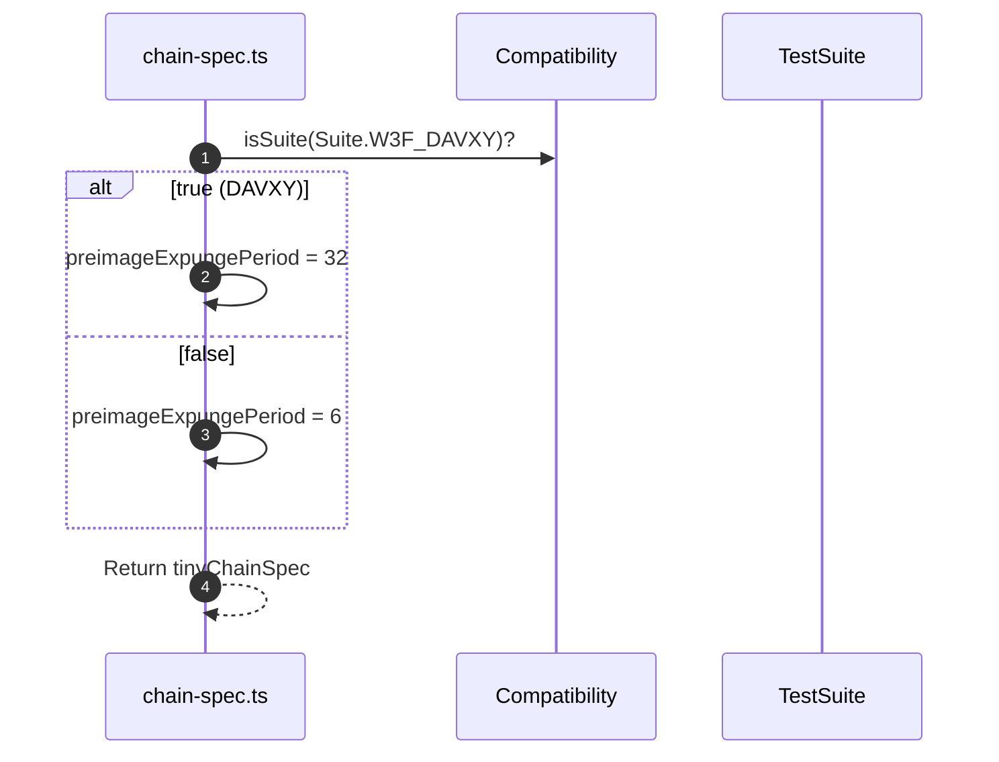

# Test runner for davxy 0.6.7

## Pull Request by @skoszuta

- test runner for davxy 0.6.7
- expunge period compatibility for all davxy tests


## Comment by @coderabbitai[bot]

<!-- This is an auto-generated comment: summarize by coderabbit.ai -->
<!-- This is an auto-generated comment: skip review by coderabbit.ai -->

> [!IMPORTANT]
> ## Review skipped
> 
> Auto incremental reviews are disabled on this repository.
> 
> Please check the settings in the CodeRabbit UI or the `.coderabbit.yaml` file in this repository. To trigger a single review, invoke the `@coderabbitai review` command.
> 
> You can disable this status message by setting the `reviews.review_status` to `false` in the CodeRabbit configuration file.

<!-- end of auto-generated comment: skip review by coderabbit.ai -->
<!-- walkthrough_start -->

<details>
<summary>📝 Walkthrough</summary>

<!-- This is an auto-generated comment: release notes by coderabbit.ai -->

## Summary by CodeRabbit

- New Features
  - Added support to run W3F DAVXY test vectors for versions 0.6.6 and 0.6.7 with version-aware selection in the test runner.
  - Adjusted chain behavior for the DAVXY suite by updating the preimage expunge period.
- Tests
  - Introduced separate runner scripts for DAVXY 0.6.6 and 0.6.7, each targeting versioned test vector sets.
- CI
  - Added a new workflow for DAVXY 0.6.7 and updated the existing workflow to target 0.6.6.
- Chores
  - Refreshed the test vectors reference used in automation.

<!-- end of auto-generated comment: release notes by coderabbit.ai -->
## Walkthrough
Introduces versioned W3F DAVXY test-vector support (0.6.6 and 0.6.7) across CI and test-runner, adds a new workflow for 0.6.7, updates artifact paths for 0.6.6, switches a load-test ref hash, and makes chain-spec preimageExpungePeriod conditional on the W3F_DAVXY suite.

## Changes
| Cohort / File(s) | Summary |
|---|---|
| **GitHub Workflows**<br>`\.github/workflows/vectors-w3f-davxy-066.yml`, `\.github/workflows/vectors-w3f-davxy-067.yml` | 066 workflow retitled and updated to use `dist/w3f-davxy-066.txt`. New 067 workflow added with `GP_VERSION=0.6.7`, pulls vectors, runs tests, prints `dist/w3f-davxy-067.txt`, and uploads on failure. |
| **Load Test Ref Script**<br>`.github/scripts/load-test-ref.sh` | Updated REF commit hash; continues exporting `TEST_VECTORS_REF`. |
| **Test Runner Core**<br>`bin/test-runner/index.ts`, `bin/test-runner/package.json` | Adds `W3F_DAVXY` branch requiring `GP_VERSION` ∈ {0.6.6, 0.6.7}; appends dotless version to suite name. Splits script into `w3f-davxy:0.6.6` and `w3f-davxy:0.6.7` with corresponding env vars. Removes unversioned `w3f-davxy` script. |
| **Test Runner Entry Points**<br>`bin/test-runner/w3f-davxy-066.ts`, `bin/test-runner/w3f-davxy-067.ts` | 066 points to `test-vectors/w3f-davxy_066`. New 067 script added for `test-vectors/w3f-davxy_067`; both keep accepted/ignored options and logging pattern. |
| **Chain Spec Config**<br>`packages/jam/config/chain-spec.ts` | Imports `Compatibility` and `TestSuite`. Sets `tinyChainSpec.preimageExpungePeriod` to 32 when suite is `W3F_DAVXY`, else 6. |

## Sequence Diagram(s)




## Estimated code review effort
🎯 3 (Moderate) | ⏱️ ~25 minutes

## Poem
> I twitch my ears at versioned skies,  
> 0.6.6 to 0.6.7 I rise—  
> hopping through vectors, neat and new,  
> logs in tow, in tidy view.  
> Chain winds shift to thirty-two—  
> whiskers nod: “DAVXY, woo!”  
> Thump! CI passes. Carrots, too.

</details>

<!-- walkthrough_end -->
<!-- internal state start -->


<!-- DwQgtGAEAqAWCWBnSTIEMB26CuAXA9mAOYCmGJATmriQCaQDG+Ats2bgFyQAOFk+AIwBWJBrngA3EsgEBPRvlqU0AgfFwA6NPEgQAfACgjoCEYDEZyAAUASpETZWaCrKPR1AGxJdo03JApsDHI+ADN8Plo0CQAPeQAGDQA2DQB2SAAKW0gzAFYkgGYASkhIAwBVGwAZLlhcXG5EDgB6ZqJ1WGwBDSZmZoAxD2xQ0NkqlURm3FluEgFKF2bubA8PZvyC0orESi5EAGt8RAAvPDQtgGV8bAoGEkgBKgwGWD39sDIVLzAo2NkweJJdKAJMIYM5SP5HpgXlxmNosGULrhqNgmvxZgiDABhCgkah0dCcSAAJnixNyAIAHGBydAAIzxDjxAocXKUgBabgQyGWqwCJAAjtg/OhaLRkOcaIh/IFgpRIOFItE4pBEil0ph6NhuFEpZBfiqpbhkARICQYssMKQeJR4IoFMxuNR4GoPOpZBoYLB7kpEAwKPBuOJ8FgMPg9bhYNRIJH7i9MNaAO7aY38LB1BpNVrtSNdHosAZDEZjCZTPxgKRiCKTXlrSmegBy+H5EngJETlGQEUgHhUJA8EtxPaQNFoGiM+mM4CgZHo+FCOAIxDIylHDrYGCJvH4wlE4ikMnkTCUVFU6i0OknJigcFQqEwi8IpBC+PovQ3RKoifsjjhLgeR6KMoZ6aNouhgIYU6mAYGg5p0AjNH6AZBpMHj4GgtBgEaYC4qEGiIK8BgAEQkQYFiQAAggAksuL5rg4Tj/vOjBRla0gTpA5Q6q+kA2AAov0kASGgQz3PAWCwR0XSIf6gbGs0aEYVh5a4fhsAKhQLDoPEDCUmgST6QZqShLkJAAJwMAwxKpPEqS5LkAAsZmUiQBQCJSdJ0mgrmUgIoRmZspqFA5GGuUkST5FEdKpGZdJWUk0UCGS3kkHSDmhGgdwOSQqSpLQZmenA9y4tK/ALrG9iyUG/JwuJyBBPGbG0AA3DG3qVch/hMJu4nCiazbmtwET+NAfEXNAAD6ABqfFYtAADyNgXBN/GCai4lEG19yrUJzjwF8JCNs24benwaHtAw/B8AsERgKxtBulaLEJtI45GGRlgUR4NBUMGGD9Vt+qiL2v12v9ZVmhaw0Et2ywCG6l3sOobaIBxTbkFwTaQ0NFCjksXQI2aPXTEDDAg86IbIB2Q4YUotAADQ1fgUgM1dkDMIo8ChG2Y5GHx0rwHCa7HsVJCtu2ZojMNXAALJ0PAjjEaRBgQGARiSbmCGJhE+yhGhiaTJWBAUIgYCJgUoQ/Mq/yAiksjMB4HBK0RH2UTRz6rgSDF/vIzGNaQqMq5x3FrtrFC6/rkAYGgbAaVpREGvI5vlSKRvVkRMbNgn1uQMnMap3u1aqskyREeOUAACJINwvbyCVKyptKJDcFH+Dfgw1DILQI7NMnVt/AC4UaLgMT+HVNAYRD3fSr3Fv93Ew+j+XweKfQ5DfrgTyIJlf09vgm1OpGkDarqBKmtPuCz5bieDykI9j/9E9zguF9X/PHr38vFG41zO9RzHotargwaqxUgvN3rkS+j9Cm4NTQVSUGTZwMCuwLkGtDOcfA4aEyRuIdiQcsZoNxnQfG8N4CXQQeTP6yAObd25gScSkAAAGGt4K9x1nrNuhtC4mzNnPG+tsND2w8MwvmAshYEhFi2Ns34SBS1xrLeWisSIuxVtBFh0kw4R04c0NOPC+78KBIIh2TtlGu2orRT29BvbOF9guf2eCKJiglFHCWABxdQAAJLolExBgypuwyO0Z1FawCdo3Rpt9HW0HqkIxHh/5sHoNnP4ucLb51KuE4u6oy5enuJojh35ZRdiwOcHYHhLawCOGuWUIRc4dEgE2JQGghDIGJMSDQMR0AYHoKvE0IpcKUDIHcRAjMXiiH2F2PAkAABSFEZZpP8Bk0ImlmAKiLKMXsAhJjYQyeJU0GgyzSgrNw5AGR1pPRKbMBgXMyH8gXJqH8AgaErGkEURm48RIDiBhiJQzwUZCX2lHbgKyrmM0KYDI0AQgg1MTHUjAQL7DIlxrob8AABaYsx5gUEWNhaplBGb3JEsmWQXdq61xNO1eu31kBLK0q/SJA9AQxM/pAKi5UKVBAVNoAcbz/Dah6YDc66AJTFJ/hlMQ8SCRCBjkacJ78cLSAbogT0fEMCtk0hgD8u0AwHWQDsIko1xrTVmgtJaK0BKZBGJay1GgbWvMgK4qwRqlpUXmg2TIao0h2oNZNC45QqKjUyPSuIRRPRImbsgcSZNsBKC4KMhghw8CM1XspQ5uFGY7G6m+b08brj+EVPMoSxz00kFwNqMAYYlC1KPnC4FmVvSMxrYweADb4XSmcLgRm08a5oDrgqql+KukKC6cjEMIl0Cir/ny9Cc4sAZXgEMXEb1zCfW+quPxmdAYUKQVQiGhC1ywwJjcnBKM0Yhm8PUgaUMiG0BIYTLdoNKa5wGaKOmbMaHXLoG9fm4hxFviAlIiWsjFREjlt3JRytVZGDUBgA5uAcJQsoM0cSSgYjDyaM7Mx7sVy/S9r+GxEN7GBygI48UP5uA4zzd2AA6gUfoE0K4USmgADQAJoARQJuTStBsBXPOS478UJnjqXzb4aUFxsDqEOjRujDHmNsYYdB2D8G5QUCQ1080aHPRURlHiUjDqnUXBdQ2UFgoJMlRQP4U08wgbc3IKzYSbpT4Rv8GgIg8JSoVQ+W3AkUgTbroANquO4FNTsYMNBTXiBNJIUXGZBZC35kM4XIvRdSAAXQHazLmu1HP4vI7OZxtBwxeEQMgXziAwY/hGPADppoHCSegPgGwHLav9j3IDJgWLpBDWHU9CFiz52HSDnxLF3Z7qPU2vm2TrH2bwBGybQGMyZYV3KA2CiPBqA/QwFwLL+mZrOtdSgeq6nbN0EZpGTSBtIAAHJdt8X226sgaqQyauEtq+GYlkC4iFLNgkk3GPTbqzQDQV3WpZfEg5+ArNzucOu1RVVIlIf2sdXtwzB2ADeZWwYAF8FTdim2xwHh1KLCXnQdQtCX/pcDR26aUWOrvLyKvxh4aF42HbTB4eQ5pRB4AJImb0WBCcNaa1gUzIlkCidwOJyTGhpP0f+2x+5hXpCtxcyMNrJ15SE8QFdodm98BxPycveL5WQyVe5h07q0pAi+NN6iZXmOQz9GWSqiQ/Ju28c2oV1MMLq0nQ2p0+gaA8tdIBoLxrHK0DIEYQAEjR2H4XWOwCx4dxgKjHRc0V3DIgLHIioBYywTciiVgqLPTYogVqIYOeQp6rHHFCG+DzCjK2bsqAT6viXWY1dD7YHNngcDbd67mJ7phpgw9iNiYnvwWeyAgAUAlbqXgOG7h8YJ4GP0mlC/FfrETxSRuJxYyLkSBxRzAMOqLVgYRTdeVNLEyvsVzh1mkhhMaRSBWG6K4cYrYhfeCbDN17HcegCqcrK0LwVfUhS6JCOSXHPgINJOOpXAbWcnE3DAMAP0fAWYKxKqY0QqdqfXTAzqFJa+HOIaXZf3U0WAtDSAKMGQEgMgJmFmAPGMRA9eDqOSKmZ9WmOgLgWApkEuJITIW7e7AAXg9SSFBSCCpj4SiQEWNBKHuR4I9XSAyEENRwbBEJLlSHEPBlgOiTQxDUgAACETpddep7gWsRoxofU/VRohDYDGC7cYxEAatL1ucgd3pO9oEd04F2p71kFd0r191R9wCiZxBcEiNIALgsD6CuCmEiJYCiIuAiJvUJpfV/U+JbCpDkljQOl9kKDjQiJGEOMmFL8VJ68b94178mlEAQxGEOJIiCDODaAuBGE4jMi4heCUgkgEjIAiIVCjN1DOiYBLCUjrD0i7DsjIBci2ibYh58jCiGFGESjU0yinQKjSAqiai6iojGjmjWiiC/gOi0hujejkc7tVCBi0ghjDVUibDxinDJi34DEmVEACiijFjxIlNcVVNVi791jH8MBaiDBv1BYd9/099pFJZgMFEwMT9TEz8oMPir8QhHjpDZj0NTFX8LEcMrE8MmI7FQE8EbxcCMAq97E2cKo+tuF9Qfsqx/wnQSsz5mwgFtt/Awxvw7dkAiJtljkUS/gJpbYM5x5dMIYuTyxwleS4hskvo4kNc+BwRHB2ATkvjhlx0iBXdEAEYSAMtAZMo7ggxiF4AiAwxcQ5wgw/EShcQgFj4hMXpwFl1KIu8/DvCfR+9u8UFsZ0E2YC9x9QjJ888z1REf1QTK1wTAND9oSFZYSINoIli4MviJSZjnjn8XZMSPZsSfxP8CMCTA4SNnEWDoAZgSB6ioDoNWDqpoxYzlNkSdDGVKDIxowYVzNzhpN5kjlaTq8QgtMx5HRhpkBzpSA5TB0rSaVgUWAOYMAqjGDlS44Vlk5mhlSqizt+dGAPlqF4Qq11IKplTGYsQqgS9wQVT7kKpdF1sj5RTDlxTYD+SgQM4RIQwiBytK0Hx0Cd1BARBxVEBLkuZZB/ddTm41xN5MplcMguSqAhlmgMpVgBBb8iJGZQKgLJht4aUvAiI5DB1DTjTfsBsTkiIPZyslV/jUKuyqDNRitAYrBlkkB7g5A94iB2hesKU+1/BTcHBLJpBhVul956LNoKoboG9ZEIh7hzRkYnofd1JJEwA6Q0xOV50bhBsIEV1PD11nT18B9H0h8AiR8wDsEJ9CSL1tKyFmhl9VK3T2ZOY6FwFgTf0FAQyxYISgNpZIBQNIzT9IMDAfj79JgpU+hupuYiBmh4xxJUDLk0NkzMMsSeJrE8Tv9wiuJT5AD2pBYKMN1I0hhK0sQWBD4XR513RGCJcpcaBMheA7LrgNTfYST5A09IwK45hsAiA7VPhSEnpCcwA0BkwhxzoyFy4sQCTADxJZAer4QLgQriqQTSA+ILQghSArBbR7QRz0AFRqsfMRJhQIZ+DTRzhM0R1o5HZIAChiQUAFwMrHRnRXR3QNAkACqSAMh8qJMgdZd8cShUBN5hRGZZSYUdhIAUgvQ7xONFAeNldsJCcvlZx2AHgSAm87QwhYZcQxqhLJqrQNoO9IFHSvDe8fDXS/CNKKMtLvSQjkY9KsZCMN1ysjSURzNsb0Fb0j1dKlVAyQThYwS7KwyoSnLj9XKIIoIZxB1mI0A8AnxsNQTWB2AuAvwMyfZ2MRZTw1BQJLxObrx1x1AJpIdEAJpQyOxaAJo20kVJwDAFbiQGAChHI0BchiQkhzJchUhyQkhyQCgjbDbiQBBUhXJ4gzIdJ8h4hQgkgGA6RchwJIIFb3wlaVa1bmaNaJpZx/agA -->

<!-- internal state end -->
<!-- tips_start -->

---


<details>
<summary>🪧 Tips</summary>

### Chat

There are 3 ways to chat with [CodeRabbit](https://coderabbit.ai?utm_source=oss&utm_medium=github&utm_campaign=FluffyLabs/typeberry&utm_content=563):

- Review comments: Directly reply to a review comment made by CodeRabbit. Example:
  - `I pushed a fix in commit <commit_id>, please review it.`
  - `Open a follow-up GitHub issue for this discussion.`
- Files and specific lines of code (under the "Files changed" tab): Tag `@coderabbitai` in a new review comment at the desired location with your query.
- PR comments: Tag `@coderabbitai` in a new PR comment to ask questions about the PR branch. For the best results, please provide a very specific query, as very limited context is provided in this mode. Examples:
  - `@coderabbitai gather interesting stats about this repository and render them as a table. Additionally, render a pie chart showing the language distribution in the codebase.`
  - `@coderabbitai read the files in the src/scheduler package and generate a class diagram using mermaid and a README in the markdown format.`

### Support

Need help? Create a ticket on our [support page](https://www.coderabbit.ai/contact-us/support) for assistance with any issues or questions.

### CodeRabbit Commands (Invoked using PR/Issue comments)

Type `@coderabbitai help` to get the list of available commands.

### Other keywords and placeholders

- Add `@coderabbitai ignore` anywhere in the PR description to prevent this PR from being reviewed.
- Add `@coderabbitai summary` to generate the high-level summary at a specific location in the PR description.
- Add `@coderabbitai` anywhere in the PR title to generate the title automatically.

### Status, Documentation and Community

- Visit our [Status Page](https://status.coderabbit.ai) to check the current availability of CodeRabbit.
- Visit our [Documentation](https://docs.coderabbit.ai) for detailed information on how to use CodeRabbit.
- Join our [Discord Community](http://discord.gg/coderabbit) to get help, request features, and share feedback.
- Follow us on [X/Twitter](https://twitter.com/coderabbitai) for updates and announcements.

</details>

<!-- tips_end -->


## Comment by @github-actions[bot]


<details>
<summary>View all</summary>

| File | Benchmark | Ops |  |
|------|-----------|-----|--|
| [bytes/hex-from.ts[0]](../blob/876b56de67301f76d123de7a44b74f476ea94acf//_work/typeberry-1/typeberry/typeberry/benchmarks/bytes/hex-from.ts) | parse hex using `Number` with NaN checking | 139384.63 ±0.35% | 84.53% slower |
| [bytes/hex-from.ts[1]](../blob/876b56de67301f76d123de7a44b74f476ea94acf//_work/typeberry-1/typeberry/typeberry/benchmarks/bytes/hex-from.ts) | parse hex from char codes | 900800.06 ±0.2% | fastest ✅ |
| [bytes/hex-from.ts[2]](../blob/876b56de67301f76d123de7a44b74f476ea94acf//_work/typeberry-1/typeberry/typeberry/benchmarks/bytes/hex-from.ts) | parse hex from string nibbles | 562780.3 ±0.39% | 37.52% slower |
| [bytes/hex-to.ts[0]](../blob/876b56de67301f76d123de7a44b74f476ea94acf//_work/typeberry-1/typeberry/typeberry/benchmarks/bytes/hex-to.ts) | number toString + padding | 327895.48 ±0.13% | fastest ✅ |
| [bytes/hex-to.ts[1]](../blob/876b56de67301f76d123de7a44b74f476ea94acf//_work/typeberry-1/typeberry/typeberry/benchmarks/bytes/hex-to.ts) | manual | 16446.03 ±0.44% | 94.98% slower |
| [math/mul_overflow.ts[0]](../blob/876b56de67301f76d123de7a44b74f476ea94acf//_work/typeberry-1/typeberry/typeberry/benchmarks/math/mul_overflow.ts) | multiply and bring back to u32 | 240282748.52 ±7.88% | 3.36% slower |
| [math/mul_overflow.ts[1]](../blob/876b56de67301f76d123de7a44b74f476ea94acf//_work/typeberry-1/typeberry/typeberry/benchmarks/math/mul_overflow.ts) | multiply and take modulus | 248647836.32 ±8.69% | fastest ✅ |
| [math/switch.ts[0]](../blob/876b56de67301f76d123de7a44b74f476ea94acf//_work/typeberry-1/typeberry/typeberry/benchmarks/math/switch.ts) | switch | 253916808.19 ±7.28% | 5.08% slower |
| [math/switch.ts[1]](../blob/876b56de67301f76d123de7a44b74f476ea94acf//_work/typeberry-1/typeberry/typeberry/benchmarks/math/switch.ts) | if | 267506190.53 ±6.6% | fastest ✅ |
| [hash/index.ts[0]](../blob/876b56de67301f76d123de7a44b74f476ea94acf//_work/typeberry-1/typeberry/typeberry/benchmarks/hash/index.ts) | hash with numeric representation | 192.12 ±0.06% | 26.24% slower |
| [hash/index.ts[1]](../blob/876b56de67301f76d123de7a44b74f476ea94acf//_work/typeberry-1/typeberry/typeberry/benchmarks/hash/index.ts) | hash with string representation | 110.16 ±0.2% | 57.71% slower |
| [hash/index.ts[2]](../blob/876b56de67301f76d123de7a44b74f476ea94acf//_work/typeberry-1/typeberry/typeberry/benchmarks/hash/index.ts) | hash with symbol representation | 181.23 ±0.44% | 30.42% slower |
| [hash/index.ts[3]](../blob/876b56de67301f76d123de7a44b74f476ea94acf//_work/typeberry-1/typeberry/typeberry/benchmarks/hash/index.ts) | hash with uint8 representation | 158.96 ±0.67% | 38.97% slower |
| [hash/index.ts[4]](../blob/876b56de67301f76d123de7a44b74f476ea94acf//_work/typeberry-1/typeberry/typeberry/benchmarks/hash/index.ts) | hash with packed representation | 260.48 ±0.27% | fastest ✅ |
| [hash/index.ts[5]](../blob/876b56de67301f76d123de7a44b74f476ea94acf//_work/typeberry-1/typeberry/typeberry/benchmarks/hash/index.ts) | hash with bigint representation | 190.87 ±0.29% | 26.72% slower |
| [hash/index.ts[6]](../blob/876b56de67301f76d123de7a44b74f476ea94acf//_work/typeberry-1/typeberry/typeberry/benchmarks/hash/index.ts) | hash with uint32 representation | 201.8 ±0.35% | 22.53% slower |
| [logger/index.ts[0]](../blob/876b56de67301f76d123de7a44b74f476ea94acf//_work/typeberry-1/typeberry/typeberry/benchmarks/logger/index.ts) | console.log with string concat | 6520084.29 ±46.73% | fastest ✅ |
| [logger/index.ts[1]](../blob/876b56de67301f76d123de7a44b74f476ea94acf//_work/typeberry-1/typeberry/typeberry/benchmarks/logger/index.ts) | console.log with args | 1011962.95 ±98.15% | 84.48% slower |
| [math/add_one_overflow.ts[0]](../blob/876b56de67301f76d123de7a44b74f476ea94acf//_work/typeberry-1/typeberry/typeberry/benchmarks/math/add_one_overflow.ts) | add and take modulus | 202120318.61 ±38.74% | 19.95% slower |
| [math/add_one_overflow.ts[1]](../blob/876b56de67301f76d123de7a44b74f476ea94acf//_work/typeberry-1/typeberry/typeberry/benchmarks/math/add_one_overflow.ts) | condition before calculation | 252477085.7 ±7.56% | fastest ✅ |
| [math/count-bits-u32.ts[0]](../blob/876b56de67301f76d123de7a44b74f476ea94acf//_work/typeberry-1/typeberry/typeberry/benchmarks/math/count-bits-u32.ts) | standard method | 84048169.87 ±1.88% | 66.21% slower |
| [math/count-bits-u32.ts[1]](../blob/876b56de67301f76d123de7a44b74f476ea94acf//_work/typeberry-1/typeberry/typeberry/benchmarks/math/count-bits-u32.ts) | magic | 248750636.87 ±6.09% | fastest ✅ |
| [math/count-bits-u64.ts[0]](../blob/876b56de67301f76d123de7a44b74f476ea94acf//_work/typeberry-1/typeberry/typeberry/benchmarks/math/count-bits-u64.ts) | standard method | 1014760.1 ±0.63% | 86.7% slower |
| [math/count-bits-u64.ts[1]](../blob/876b56de67301f76d123de7a44b74f476ea94acf//_work/typeberry-1/typeberry/typeberry/benchmarks/math/count-bits-u64.ts) | magic | 7630944.9 ±2.19% | fastest ✅ |
| [codec/bigint.compare.ts[0]](../blob/876b56de67301f76d123de7a44b74f476ea94acf//_work/typeberry-1/typeberry/typeberry/benchmarks/codec/bigint.compare.ts) | compare custom | 231859864.58 ±8.3% | 9.58% slower |
| [codec/bigint.compare.ts[1]](../blob/876b56de67301f76d123de7a44b74f476ea94acf//_work/typeberry-1/typeberry/typeberry/benchmarks/codec/bigint.compare.ts) | compare bigint | 256419474.49 ±7.11% | fastest ✅ |
| [codec/bigint.decode.ts[0]](../blob/876b56de67301f76d123de7a44b74f476ea94acf//_work/typeberry-1/typeberry/typeberry/benchmarks/codec/bigint.decode.ts) | decode custom | 165609841.4 ±3.44% | fastest ✅ |
| [codec/bigint.decode.ts[1]](../blob/876b56de67301f76d123de7a44b74f476ea94acf//_work/typeberry-1/typeberry/typeberry/benchmarks/codec/bigint.decode.ts) | decode bigint | 76059094.85 ±2.35% | 54.07% slower |
| [codec/decoding.ts[0]](../blob/876b56de67301f76d123de7a44b74f476ea94acf//_work/typeberry-1/typeberry/typeberry/benchmarks/codec/decoding.ts) | manual decode | 15718706.6 ±1.14% | 90.13% slower |
| [codec/decoding.ts[1]](../blob/876b56de67301f76d123de7a44b74f476ea94acf//_work/typeberry-1/typeberry/typeberry/benchmarks/codec/decoding.ts) | int32array decode | 156501675.09 ±3.75% | 1.78% slower |
| [codec/decoding.ts[2]](../blob/876b56de67301f76d123de7a44b74f476ea94acf//_work/typeberry-1/typeberry/typeberry/benchmarks/codec/decoding.ts) | dataview decode | 159334803.87 ±3.79% | fastest ✅ |
| [codec/encoding.ts[0]](../blob/876b56de67301f76d123de7a44b74f476ea94acf//_work/typeberry-1/typeberry/typeberry/benchmarks/codec/encoding.ts) | manual encode | 2483248.26 ±1.38% | 19.65% slower |
| [codec/encoding.ts[1]](../blob/876b56de67301f76d123de7a44b74f476ea94acf//_work/typeberry-1/typeberry/typeberry/benchmarks/codec/encoding.ts) | int32array encode | 3090429.45 ±0.3% | fastest ✅ |
| [codec/encoding.ts[2]](../blob/876b56de67301f76d123de7a44b74f476ea94acf//_work/typeberry-1/typeberry/typeberry/benchmarks/codec/encoding.ts) | dataview encode | 3029570.03 ±1.18% | 1.97% slower |
| [collections/map-set.ts[0]](../blob/876b56de67301f76d123de7a44b74f476ea94acf//_work/typeberry-1/typeberry/typeberry/benchmarks/collections/map-set.ts) | 2 gets + conditional set | 121564.42 ±0.16% | fastest ✅ |
| [collections/map-set.ts[1]](../blob/876b56de67301f76d123de7a44b74f476ea94acf//_work/typeberry-1/typeberry/typeberry/benchmarks/collections/map-set.ts) | 1 get 1 set | 61169.82 ±0.31% | 49.68% slower |
| [codec/view_vs_object.ts[0]](../blob/876b56de67301f76d123de7a44b74f476ea94acf//_work/typeberry-1/typeberry/typeberry/benchmarks/codec/view_vs_object.ts) | Get the first field from Decoded | 358287.78 ±2.21% | 15.93% slower |
| [codec/view_vs_object.ts[1]](../blob/876b56de67301f76d123de7a44b74f476ea94acf//_work/typeberry-1/typeberry/typeberry/benchmarks/codec/view_vs_object.ts) | Get the first field from View | 92338.34 ±1.01% | 78.33% slower |
| [codec/view_vs_object.ts[2]](../blob/876b56de67301f76d123de7a44b74f476ea94acf//_work/typeberry-1/typeberry/typeberry/benchmarks/codec/view_vs_object.ts) | Get the first field as view from View | 101233.8 ±0.62% | 76.25% slower |
| [codec/view_vs_object.ts[3]](../blob/876b56de67301f76d123de7a44b74f476ea94acf//_work/typeberry-1/typeberry/typeberry/benchmarks/codec/view_vs_object.ts) | Get two fields from Decoded | 369147.29 ±1.72% | 13.39% slower |
| [codec/view_vs_object.ts[4]](../blob/876b56de67301f76d123de7a44b74f476ea94acf//_work/typeberry-1/typeberry/typeberry/benchmarks/codec/view_vs_object.ts) | Get two fields from View | 79789.28 ±1.43% | 81.28% slower |
| [codec/view_vs_object.ts[5]](../blob/876b56de67301f76d123de7a44b74f476ea94acf//_work/typeberry-1/typeberry/typeberry/benchmarks/codec/view_vs_object.ts) | Get two fields from materialized from View | 169422.53 ±0.19% | 60.25% slower |
| [codec/view_vs_object.ts[6]](../blob/876b56de67301f76d123de7a44b74f476ea94acf//_work/typeberry-1/typeberry/typeberry/benchmarks/codec/view_vs_object.ts) | Get two fields as views from View | 81161.75 ±0.18% | 80.96% slower |
| [codec/view_vs_object.ts[7]](../blob/876b56de67301f76d123de7a44b74f476ea94acf//_work/typeberry-1/typeberry/typeberry/benchmarks/codec/view_vs_object.ts) | Get only third field from Decoded | 426202.69 ±1.27% | fastest ✅ |
| [codec/view_vs_object.ts[8]](../blob/876b56de67301f76d123de7a44b74f476ea94acf//_work/typeberry-1/typeberry/typeberry/benchmarks/codec/view_vs_object.ts) | Get only third field from View | 94379.7 ±1.67% | 77.86% slower |
| [codec/view_vs_object.ts[9]](../blob/876b56de67301f76d123de7a44b74f476ea94acf//_work/typeberry-1/typeberry/typeberry/benchmarks/codec/view_vs_object.ts) | Get only third field as view from View | 100145.21 ±0.2% | 76.5% slower |
| [codec/view_vs_collection.ts[0]](../blob/876b56de67301f76d123de7a44b74f476ea94acf//_work/typeberry-1/typeberry/typeberry/benchmarks/codec/view_vs_collection.ts) | Get first element from Decoded | 26812.85 ±0.8% | 59.37% slower |
| [codec/view_vs_collection.ts[1]](../blob/876b56de67301f76d123de7a44b74f476ea94acf//_work/typeberry-1/typeberry/typeberry/benchmarks/codec/view_vs_collection.ts) | Get first element from View | 65988.43 ±0.48% | fastest ✅ |
| [codec/view_vs_collection.ts[2]](../blob/876b56de67301f76d123de7a44b74f476ea94acf//_work/typeberry-1/typeberry/typeberry/benchmarks/codec/view_vs_collection.ts) | Get 50th element from Decoded | 26221.39 ±1.27% | 60.26% slower |
| [codec/view_vs_collection.ts[3]](../blob/876b56de67301f76d123de7a44b74f476ea94acf//_work/typeberry-1/typeberry/typeberry/benchmarks/codec/view_vs_collection.ts) | Get 50th element from View | 36890.41 ±0.9% | 44.1% slower |
| [codec/view_vs_collection.ts[4]](../blob/876b56de67301f76d123de7a44b74f476ea94acf//_work/typeberry-1/typeberry/typeberry/benchmarks/codec/view_vs_collection.ts) | Get last element from Decoded | 27342.01 ±0.61% | 58.57% slower |
| [codec/view_vs_collection.ts[5]](../blob/876b56de67301f76d123de7a44b74f476ea94acf//_work/typeberry-1/typeberry/typeberry/benchmarks/codec/view_vs_collection.ts) | Get last element from View | 26213.66 ±0.37% | 60.28% slower |
| [hash/blake2b.ts[0]](../blob/876b56de67301f76d123de7a44b74f476ea94acf//_work/typeberry-1/typeberry/typeberry/benchmarks/hash/blake2b.ts) | hasher with simple allocator | 0.046 ±1.13% | fastest ✅ |
| [hash/blake2b.ts[1]](../blob/876b56de67301f76d123de7a44b74f476ea94acf//_work/typeberry-1/typeberry/typeberry/benchmarks/hash/blake2b.ts) | hasher with page allocator | 0.045 ±1.6% | 2.17% slower |
| [collections/map_vs_sorted.ts[0]](../blob/876b56de67301f76d123de7a44b74f476ea94acf//_work/typeberry-1/typeberry/typeberry/benchmarks/collections/map_vs_sorted.ts) | Map | 260364.35 ±0.24% | fastest ✅ |
| [collections/map_vs_sorted.ts[1]](../blob/876b56de67301f76d123de7a44b74f476ea94acf//_work/typeberry-1/typeberry/typeberry/benchmarks/collections/map_vs_sorted.ts) | Map-array | 103242.35 ±0.15% | 60.35% slower |
| [collections/map_vs_sorted.ts[2]](../blob/876b56de67301f76d123de7a44b74f476ea94acf//_work/typeberry-1/typeberry/typeberry/benchmarks/collections/map_vs_sorted.ts) | Array | 53546.27 ±2.33% | 79.43% slower |
| [collections/map_vs_sorted.ts[3]](../blob/876b56de67301f76d123de7a44b74f476ea94acf//_work/typeberry-1/typeberry/typeberry/benchmarks/collections/map_vs_sorted.ts) | SortedArray | 170032.11 ±0.56% | 34.69% slower |
| [bytes/compare.ts[0]](../blob/876b56de67301f76d123de7a44b74f476ea94acf//_work/typeberry-1/typeberry/typeberry/benchmarks/bytes/compare.ts) | Comparing Uint32 bytes | 19519.79 ±0.5% | 3.01% slower |
| [bytes/compare.ts[1]](../blob/876b56de67301f76d123de7a44b74f476ea94acf//_work/typeberry-1/typeberry/typeberry/benchmarks/bytes/compare.ts) | Comparing raw bytes | 20125.87 ±0.1% | fastest ✅ |
| [crypto/ed25519.ts[0]](../blob/876b56de67301f76d123de7a44b74f476ea94acf//_work/typeberry-1/typeberry/typeberry/benchmarks/crypto/ed25519.ts) | native crypto | 5.15 ±19.6% | 82.53% slower |
| [crypto/ed25519.ts[1]](../blob/876b56de67301f76d123de7a44b74f476ea94acf//_work/typeberry-1/typeberry/typeberry/benchmarks/crypto/ed25519.ts) | wasm lib | 10.63 ±0.04% | 63.94% slower |
| [crypto/ed25519.ts[2]](../blob/876b56de67301f76d123de7a44b74f476ea94acf//_work/typeberry-1/typeberry/typeberry/benchmarks/crypto/ed25519.ts) | wasm lib batch | 29.48 ±0.93% | fastest ✅ |
</details>


### Benchmarks summary: 63/63 OK ✅

<!-- thollander/actions-comment-pull-request "benchmarks" -->


## Comment by @coderabbitai[bot]

_💡 Verification agent_

<details>
<summary>🧩 Analysis chain</summary>

**Verify vector directory presence and filters.**

Confirm `test-vectors/w3f-davxy_067` and accepted/ignored paths match the structure in the vectors repo (the PR description mentions pending vectors). This will otherwise fail at runtime.

---

🏁 Script executed:

```shell
#!/bin/bash
set -euo pipefail
echo "Checking presence and structure of 0.6.7 vectors..."
fd -t d w3f-davxy_067 test-vectors || true
fd -a 'genesis.json' test-vectors/w3f-davxy_067 | sed -n '1,50p' || true
rg -n 'traces/(fallback|safrole)' test-vectors/w3f-davxy_067 -S -g '!**/*.bin' -C1 || true
```

Length of output: 619

---


</details>

**Add missing test-vectors directory for w3f-davxy_067 and verify filters**

The runtime invocation in `bin/test-runner/w3f-davxy-067.ts` references `test-vectors/w3f-davxy_067`, but that directory (and its files) isn’t present in the repo. Without it, the test runner will error out.

• Create `test-vectors/w3f-davxy_067` at the repository root  
• Add `genesis.json` inside that directory  
• Populate `traces/fallback` and `traces/safrole` subfolders to match the `accepted` filters

<details>
<summary>🤖 Prompt for AI Agents</summary>

```
In bin/test-runner/w3f-davxy-067.ts around lines 4 to 7 the runner points to
test-vectors/w3f-davxy_067 which is missing; create a new directory
test-vectors/w3f-davxy_067 at the repo root, add a genesis.json file inside it,
and create the traces subfolders traces/fallback and traces/safrole populated
with the appropriate trace files (matching the expected formats used by the
runner) so that the accepted filter entries ("traces/fallback",
"traces/safrole") will match; verify file names and contents conform to other
test-vector directories in the repo and that genesis.json exists in the root of
that test-vector directory (and ensure any CI/test manifests referencing this
vector are updated if needed).
```

</details>

<!-- fingerprinting:phantom:poseidon:chinchilla -->

<!-- This is an auto-generated comment by CodeRabbit -->


## Comment by @coderabbitai[bot]

_💡 Verification agent_

<details>
<summary>🧩 Analysis chain</summary>

**Scope the DAVXY preimage expunge period to the supported GP versions (0.6.6/0.6.7).**

Right now any future DAVXY version would inherit 32 by default. Make it explicit for 0.6.6 and 0.6.7 so changes in later specs don’t silently misconfigure tests.

Apply this diff:

```diff
-  preimageExpungePeriod: Compatibility.isSuite(TestSuite.W3F_DAVXY) ? 32 : 6, // https://github.com/davxy/jam-test-vectors/tree/v0.6.6/traces#preimage-expunge-delay
+  preimageExpungePeriod:
+    (Compatibility.isSuite(TestSuite.W3F_DAVXY, GpVersion.V0_6_6) ||
+      Compatibility.isSuite(TestSuite.W3F_DAVXY, GpVersion.V0_6_7))
+      ? 32
+      : 6, // https://github.com/davxy/jam-test-vectors/tree/v0.6.6/traces#preimage-expunge-delay
```

Additionally, per coding guidelines, please ensure graypaper links point to the current version for this update. The doc comment above still references v=0.6.6. If 0.6.7 is the target, update it or drop the explicit version to track “latest”:

```ts
// https://graypaper.fluffylabs.dev/#/9a08063/445800445800?v=0.6.7
// or
// https://graypaper.fluffylabs.dev/#/9a08063/445800445800
```

To avoid regressions, confirm the test runner sets the DAVXY suite override so this branch actually triggers:

---

🏁 Script executed:

```shell
#!/bin/bash
# Expect at least one call to Compatibility.overrideSuite(TestSuite.W3F_DAVXY)
rg -n -C2 'overrideSuite\s*\(\s*TestSuite\.W3F_DAVXY' --type=ts

# Expect GP version override occurs in the DAVXY runners or common init
rg -n -C2 'Compatibility\.override\s*\(\s*GpVersion' --type=ts
```

Length of output: 130

---

🏁 Script executed:

```shell
#!/bin/bash
# Broaden the search to include JS/TS files and all overrideSuite calls
rg -n 'overrideSuite' -g '*.{ts,tsx,js,jsx}' -C2

# Look for any Compatibility.override invocations for GpVersion
rg -n 'Compatibility\.override' -g '*.{ts,tsx,js,jsx}' -C2
```

Length of output: 3786

---


</details>

**Ensure DAVXY suite and GP version overrides are wired up before scoping the preimage delay**

It looks like the `preimageExpungePeriod` branch for DAVXY will never be hit because neither the suite nor the GP-version override is configured in the tests. Before applying the scoped conditional, we need to add these overrides:

• No calls to `Compatibility.overrideSuite(TestSuite.W3F_DAVXY)` were found in the codebase—so `Compatibility.isSuite(TestSuite.W3F_DAVXY)` will always be false.  
• No invocations of `Compatibility.override(GpVersion…)` appear in any DAVXY runner or common init—so the GP version remains at its default.  

Please add in your DAVXY test-runner setup (e.g. in its initializer or test harness entry point):

```ts
// In DAVXY runner setup
Compatibility.overrideSuite(TestSuite.W3F_DAVXY);
Compatibility.override(GpVersion.V0_6_6); // or V0_6_7 as appropriate per test vector
```

Once the overrides are in place, you can safely scope the expunge period:

```diff
-  preimageExpungePeriod: Compatibility.isSuite(TestSuite.W3F_DAVXY) ? 32 : 6,
+  preimageExpungePeriod:
+    (Compatibility.isSuite(TestSuite.W3F_DAVXY, GpVersion.V0_6_6) ||
+      Compatibility.isSuite(TestSuite.W3F_DAVXY, GpVersion.V0_6_7))
+      ? 32
+      : 6,
```

And update the graypaper link above to point to v0.6.7 (or drop “?v=…” to track latest):

```ts
// https://graypaper.fluffylabs.dev/#/9a08063/445800445800?v=0.6.7
```

<details>
<summary>🤖 Prompt for AI Agents</summary>

```
In packages/jam/config/chain-spec.ts around line 101, the conditional setting of
preimageExpungePeriod for the DAVXY suite will never trigger because the test
harness never sets the suite or GP-version overrides; add calls in the DAVXY
test-runner setup (initializer or test harness entry point) to
Compatibility.overrideSuite(TestSuite.W3F_DAVXY) and to
Compatibility.override(GpVersion.V0_6_6) or V0_6_7 as appropriate so
Compatibility.isSuite(TestSuite.W3F_DAVXY) and GP-version checks evaluate true,
then you can keep the scoped conditional for preimageExpungePeriod and update
the graypaper URL comment to point to v0.6.7 (or remove the version query) as
suggested.
```

</details>

<!-- fingerprinting:phantom:poseidon:chinchilla -->

<!-- This is an auto-generated comment by CodeRabbit -->


## Comment by @tomusdrw

Do we know where does the original value `6` come from? Maybe `32` should just be the default?


## Comment by @skoszuta

perhaps it should. However, referring to the paragraph i linked in the comment:

> The final value of D for the tiny testnet remains undecided

On the other hand 32 seems to be the currently maintained standard: https://docs.jamcha.in/basics/chain-spec/tiny

For more details: https://github.com/davxy/jam-test-vectors/tree/v0.6.6/traces#preimage-expunge-delay


## Comment by @tomusdrw

Let's remove `6` then and just use `32`. I understand it's undecided, but seems that `6` has no justification. I remember that it might have been for `jamduna` vectors, but lets see if they fail, and if they do then we can special case (old) jamduna vectors instead of davxy.


## Comment by @skoszuta

there's indeed a problem in jamduna 0.6.4. i will add a compatibility flag for that case
