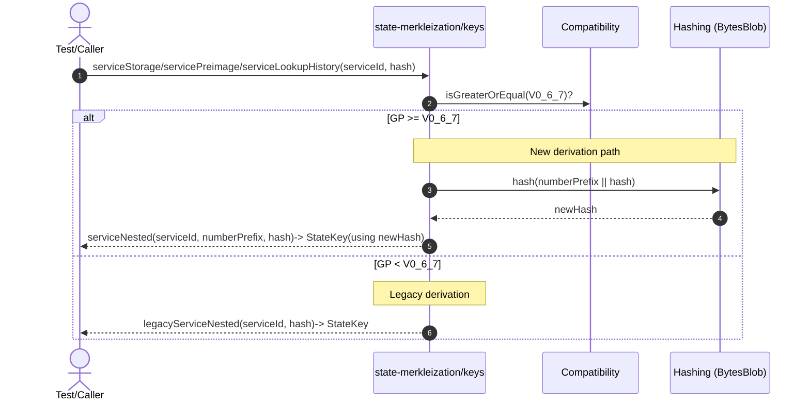
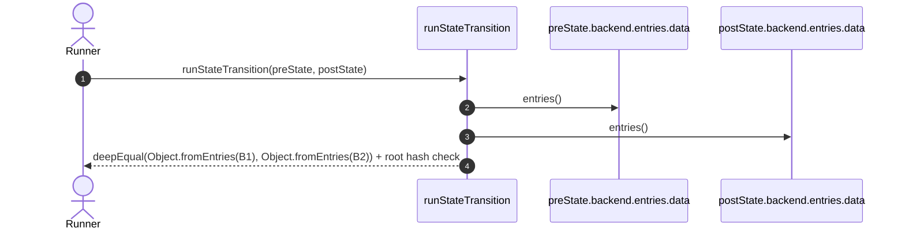

# Update serialization keys to GP 0.6.7

## Pull Request by @mateuszsikora

### Changes:
- updated serialization keys of preimages, storage and lookup history
- updated links to reader 
- updated tests


## Comment by @coderabbitai[bot]

<!-- This is an auto-generated comment: summarize by coderabbit.ai -->
<!-- This is an auto-generated comment: skip review by coderabbit.ai -->

> [!IMPORTANT]
> ## Review skipped
> 
> Auto incremental reviews are disabled on this repository.
> 
> Please check the settings in the CodeRabbit UI or the `.coderabbit.yaml` file in this repository. To trigger a single review, invoke the `@coderabbitai review` command.
> 
> You can disable this status message by setting the `reviews.review_status` to `false` in the CodeRabbit configuration file.

<!-- end of auto-generated comment: skip review by coderabbit.ai -->
<!-- walkthrough_start -->

<details>
<summary>📝 Walkthrough</summary>

<!-- This is an auto-generated comment: release notes by coderabbit.ai -->

## Summary by CodeRabbit

- New Features
  - Version-aware state key derivation for newer protocol versions, producing updated storage, preimage, and lookup-history keys and corresponding root hashes.

- Bug Fixes
  - More precise state transition validation in the test runner to prevent false mismatches.

- Tests
  - Updated expected root hashes and serialized key values to support multiple protocol versions.
  - Introduced version-gated test vectors for state entries and preimages.
  - Refreshed assertions to dynamically adapt to protocol version checks.

<!-- end of auto-generated comment: release notes by coderabbit.ai -->
## Walkthrough
Introduces version-gated state key derivation with a new serviceNested signature and a legacyServiceNested path. Updates state transition comparison to check backend data maps. Adjusts multiple tests and test utilities to expect version-dependent hashes and serialized keys, updating constants and expected roots accordingly.

## Changes
| Cohort / File(s) | Summary |
|---|---|
| **State transition comparison**<br>`bin/test-runner/state-transition/state-transition.ts` | Changes equality check to deep-compare `backend.entries.data` maps between pre/post state; root hash comparison unchanged. |
| **Key derivation logic (versioned)**<br>`packages/jam/state-merkleization/keys.ts` | Adds version-based routing: uses `legacyServiceNested` for < V0_6_7 and new `serviceNested(serviceId, numberPrefix, hash)` for ≥ V0_6_7. New path hashes `numberPrefix + hash` via `BytesBlob`. Public API updated accordingly. |
| **Version-gated test expectations (keys/serialize/state)**<br>`packages/jam/state-merkleization/keys.test.ts`, `packages/jam/state-merkleization/serialize.test.ts`, `packages/jam/state-merkleization/state-entries.test.ts`, `packages/jam/state-json/dump.test.ts` | Tests now branch on `Compatibility.isGreaterOrEqual(GpVersion.V0_6_7)` with updated expected hex keys and root values; previous expectations retained for older versions. |
| **Test utilities: versioned vectors**<br>`packages/jam/state/test.utils.ts` | Introduces version-conditional test vectors for state entries and root; switches multiple long hex literals based on GP version. No API changes. |

## Sequence Diagram(s)




## Estimated code review effort
🎯 3 (Moderate) | ⏱️ ~25 minutes

## Poem
> A nibble of keys in the clovery shade,  
> I hashed a new path where versions are made.  
> Old burrows stay cozy, new tunnels run true—  
> Roots realign in a dew-sparkled hue.  
> Thump! goes my review: neat hops, no fuss—  
> Back to the warren, shipping with us. 🐇✨

</details>

<!-- walkthrough_end -->
<!-- internal state start -->


<!-- DwQgtGAEAqAWCWBnSTIEMB26CuAXA9mAOYCmGJATmriQCaQDG+Ats2bgFyQAOFk+AIwBWJBrngA3EsgEBPRvlqU0AgfFwA6NPEgQAfACgjoCEYDEZyAAUASpETZWaCrKPR1AGxJcAqt1rUJPaU8Gge8ABe1PD4WADWJLLIBJAA4laQAAwaAGwaAOyQkAYAco4ClFwArDkALEUGPjYAMlywuLjciBwA9D1E6rDYAhpMzD0AYh7YAGYzss0qiD24stwkFRQuPdzYHh49NfXFPoiVkMyB2IgRiPBx+FQNAMr42BQMQQJUGAywXMxEGAZvAAB5gM4UULhKLiWJgBJJBrQZykXCQb6YP4A7RYYrPXDUa5cfDrPEGGwkCTwEgAd0o3UgBGY11oFFpABp7A8bng0FyACIUACiUi2DUWFQ8jIAFBhYkFePhqUpaABKBoAYQoJEC9GoXAATJlDVUwJkABxgQ35aCZTIcWoATg4VUNAC0jALpAwodw4RgOAYoH4AjR6JDoZForFIIjkPgZjwdfBLqREFzEAQqKQuZh6B58Pg4thuJAEFnHrINMHIKG9ZBwhg4sl8JAdWglBQayH/A2aFnEDXg2BDAYTFAyPREzgCMQyMpwwpWOwuLx+MJROIpDJ5Ewuyo1JptLpR+PwFA4KhUJhZ4RSOQqEuxmwMJx22hafZHJcXBi94oyiqOoWg6PoRjnqYBhqBgKzSLgYAUNgGCPj0WaBGAuA/HcAZoYSNCYdh6gxBgGi4N0BgAETUQYFiQAAggAkvOj4Ng4Th/jOfyYOmRiarAPF0EysBBOhNDLtwzhILG8BYEhGAEoE0BEQGkAzBQLDoJAtDwDqYjaSQJBliQACO2BhOoe4iQwcT8EmvAkIp4kSMg3D4FmTlBCkaAGUZkCmeZ4SrIw1m2TOuAibpGJoDZU7adQPmXF0XBKEZwpmWEMoAPKbmIGjqSwwpvlC0gyg5nkaAIMUJBgtAaOwJVDmGaD1cVNKIDKapqlyOUiHlBXMEVWHtWV7m4BVVWxbVrXDdIGjNTNjWdV1GgwCJ7ZFuiAmILAElSYgsY6pcsnIMh3EYKQtAANzCUEOpZnZt2NvgAwMCgp0YGgcxbnQw7mJY9EeDQT4ka2T1KAwHjODGGAJkmJCgm5FBLo8PDDOEb3sMR0hGFAJRtud6ZMm2dxEJ9uDvNIj0I0j4Y7Oj8CY2+2PILJGKyXBWaIchqFiSQhGYDhJF4RhWGC8RsRkYgRjClmqYNvud1UjSX4kHMjzvgAsnQ8COFRNEjmARiSTZaDpj0QhoOMfNgEIB2wbQjjcGR8FS0G1GUbRAPMQ+i5Cexv7yFxAkXTjtZwEEsQeFZgnvU9NM/bQNibfYw0XWpqMRUEABqmQAPo5Hn+QANQYj8fwoFgWdMvBXDqCFgn0ANWSgkohoAMxoIZOQAIz5D3My1LUOQCD3JBj06Xf5PkFqGrQToMFUDDt06s+1DMPc9xaMyGr3FrOgw+Q5PkDCGqv+QL3MtQd8TLczJkDA5IaAgX73aB97QVUWpPFoWjkDAfwYL/HutB8gzAEE6EgHdMg7wYAIGYT9249xyDvHuHc0BgM/gwGYnYqirUBh4fgWc+CFlelyWSkNsA6XTtXMUdxYx/FEHELkjtmBlhBF4YIXgxAkTzLVdAiBIQBnIR9Qmv0IJ0UBsDGGYNq4QyhiDWIcN/KIw1kJVGuwBAY38szcQYc8YKhlnLS4z5ALtmVnSfy6tkZcG1jpPWHtcZQRNnEM20gLZWxFgRNgFA4heGjLheMLssxu31p7SRPsFxPn9j+ZwQckxiOlrWeitBaDIE1CwSS4g1BBXkPmNI3Bs4MhIigNhGtkDNwAAKrHWJsbYeB4DSh7JASk3AoafGQAJCgtAwCK3oAnMQQkRKglTlCC6rMq6wB1F5eCyBaSDEgHQkiYBPzOCCAM/CoNIDXFkkQSAGS2HRByZZDQSBUgdmBllEUGUPAylSIU4pktc4FyLmqGsRQoCQmpJ8Akjw3FcA2XQAA0okSA8ovxKDJGk/gWAlmxBuuQL8EgwjYCCDMVGegAC8kBnmF0KKgTIoJVCr1ULUVQAgqjkvvsPQ0tQSAWiqPkJe99UkMFqJkTstRQGd3pbQOBtA3T5AEEg2o7cX45BIDkHI38EE3XwB4LsiyUVK2OrDDOfBdQUHCJQRZjzYbvN0MECg3ySBWBTGmbwKj1iDNoCC+Q4KDJQoTLCvVCLLHIumGijF2LcVFzjoS4lGxVA91UBaT+AgTQQItBy/IdKyUkFjRSqooqqi0ByJkdumQE3DzdAwBej8ZgkDdGK2oQCpUzCqHKhVOqPWovMaqipqNNXar4HC/VBgPlGpNc0IsJZuAAAkkDZlkACxGic7VgvwBCoyU5nW6ooPQjAbqkXKvVZALFOL854v9USgQtQLTEufgIZeqgqhzCPk6Oehp6WSspe3fIAraAVu/n3Q0H9VD5GfiAw0DAH5PqZZkC+JAnRVsVbWlVuJG0aucC2+di6hzh1mZOr8YxdjiUBba0F+TUNrPQEQSD6IAAGAASAA3mgAAvoRyuWZdTTiTGgQRlBxDpx8iCUE/s05EGaRHcxD1wrrQHOiBgjGqb5NIYzetuJtm/BDpdP6XsGJA0XFslIcjRAKJkdTVRyN1F8E0dorGeikkGPsPAMmRIdQXEUPAEEImAxgxpmo2g9MtGSfkdDBzw5ZbiBMUJRW5jqSWLVuimxkA7G62YGEpxRsDAuLccsS21t8L8x8X4kgAThZBPIu7GiESWJ+wjLEziCS5P6MgIxYqihsAdLgyRTjGFEQGShMi1SWTYBDkgBMDROpzS5AKFyLw+GGCyGeJQE1JR4JCVQNcOgN1QtZAKBoHuxdMzjcZiQSbtH6DzIilpRFYLyiUDNWrMEPBqC7Rm2cOqa0ghMCq4QmYhYvyIF24w5A1IfIHKyfAY5qxTmIHObqS51zAp3IeQukiGhfX5A1GzL5G3fk5hIGt41G2Tvy1zOgfhCPPg9uLKWQdlYXDNNx5tqbEZzPk0pg3UOTcNLMCZGgOIuytLbV2lHeQanmes58hgI7FATvscgDKHw7dDQajadcNnjHYCrUYuiB1qG8BibBXSftsv/zlll6z6u937NkBho9fnzBNhC7O/k6uSoVRDM1zKT7kAABCsgByO8LAIDU+TZvIERRrnat83K7ChuJau909gsb2YiLkOo2kxVZzpPS6JZuPWrrJND2v/cLeYGNFP60mv3azEhHhktklq6/AZyTMwzqqSGzFUb63PhbfDDKMnjFaBcDG2jz4beuTs64FlSSZkSB+9gGqDvKWJ03lSUJFIDkvleXWo8czskwjNckEbiTb0Fu15G3VpRN166pjaSQV85Enq8BiHwREYAuzr9UnIZcMFWet/oHIAckBdu7XZ/+d/n+3joh8gcmF3Zx43WlLDDH8zMXa0ri7UR2zDcVRxNQxwtT4QjAbxIHxz7SJ2HQ2hVzBh33ry73J22xhX4GrVbT1WQEtzbGrgOzJybyEmgNjERRrUoOaUYjKWRlOj7CXBSAcG4FpjLwzwQHTmgJlGd1d3d0934RSCczOCdxd2kDd0EGx3oBw2yUaUsm2XECCnahugrzenoisEYmQ0rkoSUGQAIM7wmwp3QELHGXgCUCeh1E+jYDQKIIYLqn+iU2kQc1vnU0hk8y2RnCc102nH0wZiZnEGM1xnCxIAikUDMwswpis3AL1C4EI3oIpxb3QLbw71yNoF71l370H1RRHzH0gE8jtWo0ACTCSATI9AzwnIogvIyogorkE3M3HUdjXwcXIonaEotAIfco8fQIaomA2gq2aQE2IITIifRIRAajNmQjeLc2JLLxVLSgdLTLWIHobLRY2sbWBI/Uafdveoqwxo7Il/fIlowo4QwY4Y2XCoqoxIajUIpcagYmMsLwKQQhZY1Y9xdYm2NLfxWELLBYqWQjaLQ2Y2aqBLDxZLDCEEjLME3YyMCyCIEgYJTQHLaLfLX2aJIrDieJWnXiAwaAJDekVIngmfEmUsQQlkIGeAY/ZMfAAgJgQhNtKDI1KMTE+gIJBiU40pWmbk77I5TQ4KfJe5IpSHSWLrTOKZQyOMBYkXPmLkByTHFHZ6AnMsCsYdbqeOMdG1csBGUZXZH3KdMuLEDnLAMUjQ3JAHIHQICgK5dKMHaUvVaHLdV5eXJMWhPVOODdbIPIfIDoyxcXMAN/IIYZJVT1KgqzDDOVYheZeQq3HUakN4TpZwHpPpWM1FZAI6XEVafGVkx2YvLAALRJBTSRZTRRNVNTdaDzOs5Rd4vTNGNzKIlmWIksxJW+VslzAwpI6ne6bzYxBWMxdMlWKxULLWHWBxA2CAWLAExLTxYErY0EmGDYsABqdqbE0JRxfEqJNiYrEkxJIwSrVODCHcuaITKWLkauDDZONkvMr1PgauGHUudQ37CU+QTEWTD/RjUk36W7NSXSB6e7HSAMVfB1WQGkBVZAQlIBKoHuJ0cBduf+AQf+BBIeMlE+ENI9Z0NAS+KoA9J0FeWeNAUVNBB9Y+NWJlbBbNBBQyF+GjGgTsR6QlVNM9WoZBduNlHuNAG0VCp0AeCVDlX9beCoEivlZ0Q0U0WgG0CNMNHINAQS4DC+I+GeDuQ0HeOlfBfYIhESPgP897KTNmauRAKY1aK8bgiA5IdaRjIREpM2AjJ6dEmEISDSZ89nBFNsNkoy56V6fgDVLYVGEOWgJsPZWkQCggGrESLwiRAGWsrTBsoIJsrTEInTFGCIjsnRaI9qbswxAwHzeWUxJwyc4LaxWc+xKLRxGEuLOEtY1clLTmTQBpJpXEg872ArQk78Ykx6M82sSrLCarWrNtSM0TegITXVMQR4bk9IPfDAXZVaAAdREiwAWrbTjiIAuR1SbRuVvhhzWzFFX2gGFGeGgDzguvojOoUFhkJDfAtK/B1BSKwAOxjML3NKTKMpTIX1BQSD8iziigcgzOl3AwQ0vHOsuuurOrzhsCyiymgC4AWw/PvPWi8vRHAyAoqQZxbhXgXloFqGksyBDXbloB7lqEoqdDAW/ntBQrAUlRwQLV1DIrQHblFWPmpswo5VAS5WHi5qqCqEyFvkQoPV7gTUMhgSdCdDpSdH/kJrPkJvHiZXbhIHZWNDQCfnJoqGPUNDQEyD3VXl1ElUlX7mFVQufh4yhquugBuuFC4GrhBAXXRBIC8FP2phikuxQh1T5jjgdTOG4SXAfx8i2sYRsiDE7QmDAvRFkkfDyr/AqDGCpkJXtFPntFXnTvZRNC1oCFoEzXyAzVoBNDFopsLSZU/XFWQqdEyGdHTR7iFr/i+nbhIqzWFpRu9JLi5FdvkJTpNEzXtAHsHvtFqBnjqAtAYHJqdD3RmAtDQRnupsEpyGpolWwSQWvRikNAZUtD3XQrDQfgNSgDGwgsrjjoal/NEBYGTtBHTqFprojUyFQvtByD4vyHQuQRUrQAPSItTXnkgWfp7kzSAUptQqwqQUXiqGrpgXprzqblRlRv8mlCCF7rJQHqzqHpgXFy5U3h/TAfvRnn1s/RloNsFtSWbpmE7lwvyATSvQUs/kJoPrWl0noFjp1TPoxAvrYAQuvsyHnntDfXtHbmjQNoEGvSXsfnHsEbFTls3ggUnkwr4oYDgTIb1p7k+CIp/RUs3tAQCAEDXXge7qQe4cLXtDmBMfvhgQQXFzqHFwpWFTfTJpmHJvTRlqdCqHHj4pHhtAwpHq5U5rqCqHbnvQYe63eD2xYY1WKnPqTq4YEaEb4tTtvq5XvjlqHnbh3kMkpQFQpTTSlRXkzrlrQDPRmGlpwTmCLv1qfQ0b0Y7tWwQZ7qMZIDMaaYsZnv3Tcc7l/npT3lEfF2jU/R4bcbzW/lNBnnviLWnnARDQnuaRiiYGQlwDzg1ItXjvahF0/3MvRtdqpEwHRC0XwBskQE92lBJje12hSHGvwyXHBojsNW6z4HgdvDCGBnJkkEMdiYEd/QfkSafQfrqFFXSaLQECydTSlWfsgZcZUqKZKa+kcY5R4dgRyHMVj1qz10eHujclqlZ3sL2Q+q4wYd438p1VmbeDfEWfNTcTNPGTM2YEaRg3kFe3UArlSqig/IhGtVs0k2RShB2YQ3JJEnkN7M53QG+n0mmqkFmpIXUGUGlFUO0jbHlAANrLUmrxKUzjWDSo0yCKUWrKSt8NUxoMbM1ebO01pjbMHKMwKtrHxnICMV83HPKosVViqq4EHSIFgGhPAkgknH4RnDQDwHvCPNMRXDfC4CoBexPK10VioGAmPDAjPAnGXBpYWccMQDzgqvpFoDznQmRlPDHATbQUorJt3ifgtDVigQLX3VnqzSqkCZyAUq7h7hgWNDPVzeMAvETfUDzhTbTcdboDzjin0CAA -->

<!-- internal state end -->
<!-- tips_start -->

---


<details>
<summary>🪧 Tips</summary>

### Chat

There are 3 ways to chat with [CodeRabbit](https://coderabbit.ai?utm_source=oss&utm_medium=github&utm_campaign=FluffyLabs/typeberry&utm_content=564):

- Review comments: Directly reply to a review comment made by CodeRabbit. Example:
  - `I pushed a fix in commit <commit_id>, please review it.`
  - `Open a follow-up GitHub issue for this discussion.`
- Files and specific lines of code (under the "Files changed" tab): Tag `@coderabbitai` in a new review comment at the desired location with your query.
- PR comments: Tag `@coderabbitai` in a new PR comment to ask questions about the PR branch. For the best results, please provide a very specific query, as very limited context is provided in this mode. Examples:
  - `@coderabbitai gather interesting stats about this repository and render them as a table. Additionally, render a pie chart showing the language distribution in the codebase.`
  - `@coderabbitai read the files in the src/scheduler package and generate a class diagram using mermaid and a README in the markdown format.`

### Support

Need help? Create a ticket on our [support page](https://www.coderabbit.ai/contact-us/support) for assistance with any issues or questions.

### CodeRabbit Commands (Invoked using PR/Issue comments)

Type `@coderabbitai help` to get the list of available commands.

### Other keywords and placeholders

- Add `@coderabbitai ignore` anywhere in the PR description to prevent this PR from being reviewed.
- Add `@coderabbitai summary` to generate the high-level summary at a specific location in the PR description.
- Add `@coderabbitai` anywhere in the PR title to generate the title automatically.

### Status, Documentation and Community

- Visit our [Status Page](https://status.coderabbit.ai) to check the current availability of CodeRabbit.
- Visit our [Documentation](https://docs.coderabbit.ai) for detailed information on how to use CodeRabbit.
- Join our [Discord Community](http://discord.gg/coderabbit) to get help, request features, and share feedback.
- Follow us on [X/Twitter](https://twitter.com/coderabbitai) for updates and announcements.

</details>

<!-- tips_end -->


## Comment by @coderabbitai[bot]

_💡 Verification agent_

<details>
<summary>🧩 Analysis chain</summary>

**Sweep repo for any hard-coded expectations that weren’t made version-aware.**

Quick check to catch stragglers in other tests comparing to fixed 0x… strings.

---

🏁 Script executed:

```shell
#!/bin/bash
# Find direct string comparisons to 32-byte hex in TS tests (likely need gating)
rg -nP --type=ts -g '*test*.ts' 'assert\.strictEqual\([^,]+,\s*`?\"0x[0-9a-f]{64}\"?\)?' -C2

# Specifically around service keys
rg -nP --type=ts -C2 'stateKeys\.service(Storage|Preimage|LookupHistory)\s*\('
rg -nP --type=ts -C2 'serialize\.service(Storage|Preimages?|LookupHistory)\s*\('
```

Length of output: 14688

---


</details>

**Add version-aware guards to hard-coded hex expectations in state-merkleization tests**

We ran a quick grep across all `.test.ts` files and found several un-gated assertions of 32-byte hex literals. Any test whose expected output may differ before/after GpVersion 0.6.7 needs to be wrapped in the same `Compatibility.isGreaterOrEqual` ternary logic used elsewhere. Specifically:

• packages/jam/state-merkleization/keys.test.ts  
  – Lines 16–18:  
   ```ts
   assert.strictEqual(`${alpha}`, "0x010000…0000");
   assert.strictEqual(`${delta}`, "0xff0000…0000");
   assert.strictEqual(`${xi}`,    "0x0f0000…0000");
   ```  
  Wrap these in a ternary on `Compatibility.isGreaterOrEqual(GpVersion.V0_6_7)` if the generated index keys changed in v0.6.7.  

  – Lines 27–30:
   ```ts
   assert.strictEqual(`${a}`, "0xffff00ff…0000");
   assert.strictEqual(`${b}`, "0xff020000…0000");
   assert.strictEqual(`${c}`, "0xff000100…0000");
   assert.strictEqual(`${d}`, "0xffff00ff…0000");
   ```  
  Same treatment for the `serviceInfo` key tests—guard both older and newer expected values.  

• packages/jam/state-merkleization/serialize.test.ts  
  Already uses version-aware ternaries around `serviceStorage`, `servicePreimages` and `serviceLookupHistory`. No action needed here.  

• packages/core/hash/index.test.ts  
  Blake2b outputs remain invariant across protocol versions, so leave the hard-coded hash assertion as-is.

**Next steps:**  
1. In `keys.test.ts`, determine whether the index and serviceInfo keys actually changed in v0.6.7.  
2. For each affected `assert.strictEqual`, replace the single string literal with:  
   ```ts
   Compatibility.isGreaterOrEqual(GpVersion.V0_6_7)
     ? "<new-hex-literal>"
     : "<old-hex-literal>"
   ```  
3. Add tests for both branches to ensure full coverage.

<details>
<summary>🤖 Prompt for AI Agents</summary>

```
In packages/jam/state-merkleization/serialize.test.ts around lines 39 to 55, the
hard-coded 32-byte hex expectations are already wrapped in
Compatibility.isGreaterOrEqual(GpVersion.V0_6_7) ternaries, so no changes are
required here; leave these assertions as-is and instead apply the version-aware
ternary pattern to the failing cases in
packages/jam/state-merkleization/keys.test.ts (replace each single expected hex
string with a Compatibility.isGreaterOrEqual(...) ? "<new-hex>" : "<old-hex>"
expression for the index and serviceInfo key asserts and add tests to cover both
branches).
```

</details>

<!-- fingerprinting:phantom:poseidon:chinchilla -->

<!-- This is an auto-generated comment by CodeRabbit -->


## Comment by @skoszuta

a negated isGreaterOrEqual sucks for readability. either create an isLessThan method or swap these blocks of code


## Comment by @mateuszsikora

done


## Comment by @tomusdrw

For full `0.6.7` compatibility, this `StateKey` must be a `BytesBlob` not a hash.

Now we are still doing hashing in write/read host calls and that's not necessary, raw key should be passed all the way down to serialization.


## Comment by @tomusdrw

```suggestion
    const inputToHash = BytesBlob.blobFromParts(u32AsLeBytes(numberPrefix), hash.raw);
```


## Comment by @tomusdrw

Since you are doing `subarray(0, 28)` above, this one here is not strictly necessary. I'd be for doing either the one above or this one not both, since I feel it's a bit confusing.

```suggestion
    key.raw.set(newHash.subarray(middle), i);
```


## Comment by @mateuszsikora

added todo
