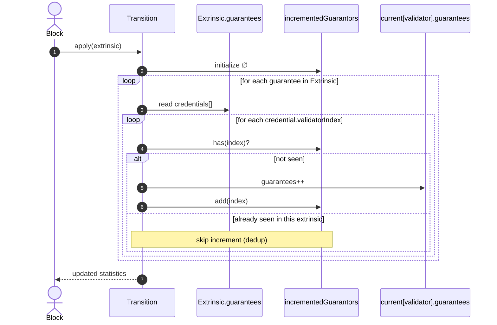

# Increment guarantee stats only once per validator

## Pull Request by @skoszuta

This fixes an issue with stat mismatches in 0.6.7 davxy traces vectors.

justification: https://graypaper.fluffylabs.dev/#/1c979cb/19a00119a801?v=0.7.1


## Comment by @coderabbitai[bot]

<!-- This is an auto-generated comment: summarize by coderabbit.ai -->
<!-- This is an auto-generated comment: skip review by coderabbit.ai -->

> [!IMPORTANT]
> ## Review skipped
> 
> Auto incremental reviews are disabled on this repository.
> 
> Please check the settings in the CodeRabbit UI or the `.coderabbit.yaml` file in this repository. To trigger a single review, invoke the `@coderabbit review` command.
> 
> You can disable this status message by setting the `reviews.review_status` to `false` in the CodeRabbit configuration file.

<!-- end of auto-generated comment: skip review by coderabbit.ai -->
<!-- walkthrough_start -->

<details>
<summary>📝 Walkthrough</summary>

<!-- This is an auto-generated comment: release notes by coderabbit.ai -->

## Summary by CodeRabbit

* **Bug Fixes**
  * Prevents double-counting of guarantees within a single transaction, ensuring each validator’s guarantee is applied at most once.
  * Corrects validator statistics to reflect accurate blocks and guarantees counts.

* **Tests**
  * Expanded test coverage to multiple validators and complex guarantee scenarios.
  * Added pre- and post-condition assertions to validate accurate statistics updates across validators.

<!-- end of auto-generated comment: release notes by coderabbit.ai -->
## Walkthrough
Implements per-extrinsic deduplication of guarantor increments in transition logic and updates corresponding tests to cover multiple validators and guarantees entries. Tests now assert single increment per validator despite multiple appearances within one extrinsic.

## Changes
| Cohort / File(s) | Summary |
| --- | --- |
| **Transition logic: guarantees dedup**<br>`packages/jam/transition/statistics.ts` | Adds Set-based dedup to ensure each validator’s guarantees increment at most once per extrinsic; refactors loop over credentials; updates inline comments and reference link. |
| **Tests for guarantees semantics**<br>`packages/jam/transition/statistics.test.ts` | Renames/extends test to cover multiple validators and guarantees entries; asserts initial zero and post-transition expected counts; verifies dedup across two core entries with overlapping validators. |

## Sequence Diagram(s)


## Estimated code review effort
🎯 3 (Moderate) | ⏱️ ~20 minutes

## Poem
> I thump my paw: “Count once, not two!”  
> In fields of blocks, the tall grass grew.  
> A Set of names, no double nibble—  
> One carrot tall, not triple dribble.  
> Validators hop in tidy queue;  
> Stats now crisp as morning dew. 🥕🐇

</details>

<!-- walkthrough_end -->
<!-- internal state start -->


<!-- DwQgtGAEAqAWCWBnSTIEMB26CuAXA9mAOYCmGJATmriQCaQDG+Ats2bgFyQAOFk+AIwBWJBrngA3EsgEBPRvlqU0AgfFwA6NPEgQAfACgjoCEYDEZyAAUASpETZWaCrKPR1AGxJcAkhgYUJGwYuJBE2M6YNCT2uNTI+Bge8okMMdyUkBJoHvC01Ph8kAYAco4ClFwArABsVZDFAKo2ADJcsLi43IgcAPS9ROqw2AIaTMy9AGIe2ABms7ItKoi9uLIZFRQuvdzYHh69tfVNiJX2ANb4iABeeGgNBgDK+NgUaZACVP6wXIjnxBEvtEwIg4rhkIAkwhgzlIoU+mAYP0gzG0WGKjzB2B6/AyaIMNhIEngJAA7pRsQAKDCJGK5UF0ACUDyWFQ8lOp5EgdJotCZxQAwoFqHR0JxIAAmAAM4qqYElAA4wOKAOzQACMao4VU1MoAWkYACLSALwbjiRJcOAxWyQWbwAAe0nQWCQDhiJKGsWoyKQKNwiKd8Cwko0NQ0ysg+Qk9vkuCoaWQUjEhUQGkgAEFIEIseI7QxqPBElyg+cUMhePgiUpaO1Ot0+gMqOs0BkKBpZjN5rIPMsNEoJL0zL01QwAJzK0cMATD0doSWSjWz+ULgD8EgAvCHlRo1UZ9MZwFAyPR8LMcARiGRlDyFKx2FxePxhKJxFIZPImEoqKp1FodPuTCgOBUFQTBz0IUhyCoG9xmCMUqBJexHBRFwPg/RRlB/TRtF0MBDAPUwDG4NAGHONBSBWIQ0AmONMEQdRCwwXpQQLUF4AYVMaFBDRwQ4AwACJBIMCwMx8S8oOFegHCcVDT0YWBMAovdIAJDBqKdTB6BIe0aAwWhkHuLjQnzU5bUKMJASiEgnQrBN6IwIhIAISAyFmQp3mrbBuHsIIonY7FwkiEJrOQWYKBYFydIoIN6IYdBAnQbhuFyEVvWYK5QlSdJMmyXJ8gINsDCgPw40UbAEyckl8HQWhaAYxIciyHI8gKPggzqiqKVylqCr8JR7XFZ16G6/LCj67SAGYmU0yLiL05BcFgGJAqBELIrjGL2Kc6qgwYGYlGRPZxGSmIRta8tMkCbhCk0IrIEabh8qdRb0iu5wRW0jIxBFFjxDYjjtpQfx9piRbAlO5rRoobEXp4aKUPkM6CsgLrIda8b7SZRBYBeDx6CFREPg8fBSOxNUABoLKC6IyYAbicpaarq801I8Jq8vOlGkbGvTtMGmbuYoDGpvsHG9noBSpCJknzmxSVKZWqzpC4NUNDu9NavLQIoBm67QTAJg9PqjADMQU4KBZ0LzJyNmwes9mepTLggwYxrFeCjSEslMy+BIEjYHptBZhoPhaJN43Kd+mJdpB5AmC2aRrqNhzZpfH6wSQcQAbcvhBYxym895gbKYFtHeqLia1agABZRR4DtZ7GfdmnI2oe5QQocrcFeUGduB7ADtwKqXJCaLldteBodCD1FoUQIMcgb2ZoCOh2HgHJkAAbUL/qC7Lnn+vFABdSPRESegZ9gOeSAXtUhsYQIlBCde2Ugbf96Fou9458v+omo+1ZGGEpYdMHgQ4FkSAtaqsMlB7UiJbfgZ5Po3RFOZXYAhchxTXuIaQykSjVWQRbOgOwRiYJHuINY9h4BEDUt3QIyAyQJURIpOggCACibE/Qik/DEQIRJSQuXmDdLg1c6DwEcAJISRVCLEVIuRaQvQqI0S+PRFmzEM7/U4j0SR/FgGiXEteH6yFnApDPMwhyuC7olXCrQcqIpPLJXYhArAOcqZAnMrtQIcEGFDCDOgKhDkvDrWiuHOKcgmZBkcvcR4JBcDAAAGofwxnoFGnigjsDoAAcUsiEFM009KQC8vlSJjBXiBBCO/H+B9tIAObmtRIyR+D+GyrnD+PBMjaQ2qEtMBJkokRFLDXghJCxYkgOQek9Bib4G8otb0aS4IijqU6VxhJKAfkfmvRqJMGBlLIGkKuKkSB9LSPQWG+A8YoHASzHg1AQ5YApK4ikhtQSQAAN4P1Xs/DekAAC+iDgmbQYBoJZiAmTvMec80I7yd7aV+f8leT9xAbzBZADQaK4U/KZJffxUzvKVkyEssYGyvmvxmvcFapzqp/FNOgDwQpaCyANi8YKw0P6pjug9J6pzGafR7LQwo6E7whGlqRLgXj8XcpiNSLi6ABAvFCNKwp9lHIAGkWzEQAOT3xgUgHZZtGLFgwOcSmV0ewMBKeoSA2L7iBFmJQPZtISyA3JU2YirZIwkxRuQRCuQjUMgOfg/gL0+CzGwP4FmjVzEUUBrDMOqiDXE0GHFNA9EDphQirDFQ+KXLM3ZUAkSoCrmMSgQzGIsCezQWLf8whN40GkK2tg4kiA8EEPtNdIhtASEYK2vRGh1Ae7IjrnmZxeaOHiC4fQHhkA+HEkQiQIRFsRFiIkYJXR0j8KARHieM8aA8AQSvNBbhLA4JirQIhaSCM0IKC/CoNQ2F/x4QMJu2C6gAD6eRECvpnaSOgr6WIW1whuw8EoGDyiqBNAQyplxoCqMqNAGo5xqlmEoNUtA0hVElGhgQUpRwABY0DihqGqNA9B9xPuAy+3A779JfuGT+2gr7jyAaAA= -->

<!-- internal state end -->
<!-- tips_start -->

---


<details>
<summary>🪧 Tips</summary>

### Chat

There are 3 ways to chat with [CodeRabbit](https://coderabbit.ai?utm_source=oss&utm_medium=github&utm_campaign=FluffyLabs/typeberry&utm_content=565):

- Review comments: Directly reply to a review comment made by CodeRabbit. Example:
  - `I pushed a fix in commit <commit_id>, please review it.`
  - `Open a follow-up GitHub issue for this discussion.`
- Files and specific lines of code (under the "Files changed" tab): Tag `@coderabbit` in a new review comment at the desired location with your query.
- PR comments: Tag `@coderabbit` in a new PR comment to ask questions about the PR branch. For the best results, please provide a very specific query, as very limited context is provided in this mode. Examples:
  - `@coderabbit gather interesting stats about this repository and render them as a table. Additionally, render a pie chart showing the language distribution in the codebase.`
  - `@coderabbit read the files in the src/scheduler package and generate a class diagram using mermaid and a README in the markdown format.`

### Support

Need help? Create a ticket on our [support page](https://www.coderabbit.ai/contact-us/support) for assistance with any issues or questions.

### CodeRabbit Commands (Invoked using PR/Issue comments)

Type `@coderabbit help` to get the list of available commands.

### Other keywords and placeholders

- Add `@coderabbit ignore` or `@coderabbitai ignore` anywhere in the PR description to prevent this PR from being reviewed.
- Add `@coderabbit summary` or `@coderabbitai summary` to generate the high-level summary at a specific location in the PR description.
- Add `@coderabbit` or `@coderabbitai` anywhere in the PR title to generate the title automatically.

### Status, Documentation and Community

- Visit our [Status Page](https://status.coderabbit.ai) to check the current availability of CodeRabbit.
- Visit our [Documentation](https://docs.coderabbit.ai) for detailed information on how to use CodeRabbit.
- Join our [Discord Community](http://discord.gg/coderabbit) to get help, request features, and share feedback.
- Follow us on [X/Twitter](https://twitter.com/coderabbitai) for updates and announcements.

</details>

<!-- tips_end -->


## Comment by @tomusdrw

Should we see some tests un-ignored after this PR?


## Comment by @skoszuta

> Should we see some tests un-ignored after this PR?

sure, i can unignore the tests that pass but it will be a very particular list of tests


## Comment by @github-actions[bot]


<details>
<summary>View all</summary>

| File | Benchmark | Ops |  |
|------|-----------|-----|--|
| [codec/bigint.decode.ts[0]](../blob/c4e3bf03a32a3c56ac1d74f796051a40075911b8//_work/typeberry-runner-4/typeberry/typeberry/benchmarks/codec/bigint.decode.ts) | decode custom | 181450233.47 ±1.82% | fastest ✅ |
| [codec/bigint.decode.ts[1]](../blob/c4e3bf03a32a3c56ac1d74f796051a40075911b8//_work/typeberry-runner-4/typeberry/typeberry/benchmarks/codec/bigint.decode.ts) | decode bigint | 107027669.77 ±2.54% | 41.02% slower |
| [codec/encoding.ts[0]](../blob/c4e3bf03a32a3c56ac1d74f796051a40075911b8//_work/typeberry-runner-4/typeberry/typeberry/benchmarks/codec/encoding.ts) | manual encode | 3420078.4 ±0.15% | 18.81% slower |
| [codec/encoding.ts[1]](../blob/c4e3bf03a32a3c56ac1d74f796051a40075911b8//_work/typeberry-runner-4/typeberry/typeberry/benchmarks/codec/encoding.ts) | int32array encode | 4199650.52 ±0.3% | 0.31% slower |
| [codec/encoding.ts[2]](../blob/c4e3bf03a32a3c56ac1d74f796051a40075911b8//_work/typeberry-runner-4/typeberry/typeberry/benchmarks/codec/encoding.ts) | dataview encode | 4212590.92 ±0.27% | fastest ✅ |
| [codec/decoding.ts[0]](../blob/c4e3bf03a32a3c56ac1d74f796051a40075911b8//_work/typeberry-runner-4/typeberry/typeberry/benchmarks/codec/decoding.ts) | manual decode | 23631591.93 ±0.5% | 86.34% slower |
| [codec/decoding.ts[1]](../blob/c4e3bf03a32a3c56ac1d74f796051a40075911b8//_work/typeberry-runner-4/typeberry/typeberry/benchmarks/codec/decoding.ts) | int32array decode | 172961905.48 ±2.4% | fastest ✅ |
| [codec/decoding.ts[2]](../blob/c4e3bf03a32a3c56ac1d74f796051a40075911b8//_work/typeberry-runner-4/typeberry/typeberry/benchmarks/codec/decoding.ts) | dataview decode | 167235752.97 ±3.35% | 3.31% slower |
| [bytes/hex-from.ts[0]](../blob/c4e3bf03a32a3c56ac1d74f796051a40075911b8//_work/typeberry-runner-4/typeberry/typeberry/benchmarks/bytes/hex-from.ts) | parse hex using `Number` with NaN checking | 141042.93 ±0.09% | 84.47% slower |
| [bytes/hex-from.ts[1]](../blob/c4e3bf03a32a3c56ac1d74f796051a40075911b8//_work/typeberry-runner-4/typeberry/typeberry/benchmarks/bytes/hex-from.ts) | parse hex from char codes | 908402.03 ±0.09% | fastest ✅ |
| [bytes/hex-from.ts[2]](../blob/c4e3bf03a32a3c56ac1d74f796051a40075911b8//_work/typeberry-runner-4/typeberry/typeberry/benchmarks/bytes/hex-from.ts) | parse hex from string nibbles | 565456.81 ±0.19% | 37.75% slower |
| [bytes/hex-to.ts[0]](../blob/c4e3bf03a32a3c56ac1d74f796051a40075911b8//_work/typeberry-runner-4/typeberry/typeberry/benchmarks/bytes/hex-to.ts) | number toString + padding | 331189.48 ±0.23% | fastest ✅ |
| [bytes/hex-to.ts[1]](../blob/c4e3bf03a32a3c56ac1d74f796051a40075911b8//_work/typeberry-runner-4/typeberry/typeberry/benchmarks/bytes/hex-to.ts) | manual | 16510.61 ±0.09% | 95.01% slower |
| [codec/bigint.compare.ts[0]](../blob/c4e3bf03a32a3c56ac1d74f796051a40075911b8//_work/typeberry-runner-4/typeberry/typeberry/benchmarks/codec/bigint.compare.ts) | compare custom | 268438674.97 ±6.4% | fastest ✅ |
| [codec/bigint.compare.ts[1]](../blob/c4e3bf03a32a3c56ac1d74f796051a40075911b8//_work/typeberry-runner-4/typeberry/typeberry/benchmarks/codec/bigint.compare.ts) | compare bigint | 265206360.54 ±5.74% | 1.2% slower |
| [hash/index.ts[0]](../blob/c4e3bf03a32a3c56ac1d74f796051a40075911b8//_work/typeberry-runner-4/typeberry/typeberry/benchmarks/hash/index.ts) | hash with numeric representation | 193.8 ±0.07% | 27.17% slower |
| [hash/index.ts[1]](../blob/c4e3bf03a32a3c56ac1d74f796051a40075911b8//_work/typeberry-runner-4/typeberry/typeberry/benchmarks/hash/index.ts) | hash with string representation | 123.53 ±0.18% | 53.58% slower |
| [hash/index.ts[2]](../blob/c4e3bf03a32a3c56ac1d74f796051a40075911b8//_work/typeberry-runner-4/typeberry/typeberry/benchmarks/hash/index.ts) | hash with symbol representation | 185.83 ±0.03% | 30.17% slower |
| [hash/index.ts[3]](../blob/c4e3bf03a32a3c56ac1d74f796051a40075911b8//_work/typeberry-runner-4/typeberry/typeberry/benchmarks/hash/index.ts) | hash with uint8 representation | 165.8 ±0.02% | 37.69% slower |
| [hash/index.ts[4]](../blob/c4e3bf03a32a3c56ac1d74f796051a40075911b8//_work/typeberry-runner-4/typeberry/typeberry/benchmarks/hash/index.ts) | hash with packed representation | 266.11 ±0.06% | fastest ✅ |
| [hash/index.ts[5]](../blob/c4e3bf03a32a3c56ac1d74f796051a40075911b8//_work/typeberry-runner-4/typeberry/typeberry/benchmarks/hash/index.ts) | hash with bigint representation | 194.15 ±0.33% | 27.04% slower |
| [hash/index.ts[6]](../blob/c4e3bf03a32a3c56ac1d74f796051a40075911b8//_work/typeberry-runner-4/typeberry/typeberry/benchmarks/hash/index.ts) | hash with uint32 representation | 205.79 ±0.05% | 22.67% slower |
| [logger/index.ts[0]](../blob/c4e3bf03a32a3c56ac1d74f796051a40075911b8//_work/typeberry-runner-4/typeberry/typeberry/benchmarks/logger/index.ts) | console.log with string concat | 8376994.16 ±52.74% | fastest ✅ |
| [logger/index.ts[1]](../blob/c4e3bf03a32a3c56ac1d74f796051a40075911b8//_work/typeberry-runner-4/typeberry/typeberry/benchmarks/logger/index.ts) | console.log with args | 767577.79 ±110.84% | 90.84% slower |
| [math/add_one_overflow.ts[0]](../blob/c4e3bf03a32a3c56ac1d74f796051a40075911b8//_work/typeberry-runner-4/typeberry/typeberry/benchmarks/math/add_one_overflow.ts) | add and take modulus | 234811775.32 ±30.8% | 10.67% slower |
| [math/add_one_overflow.ts[1]](../blob/c4e3bf03a32a3c56ac1d74f796051a40075911b8//_work/typeberry-runner-4/typeberry/typeberry/benchmarks/math/add_one_overflow.ts) | condition before calculation | 262850586.66 ±5.61% | fastest ✅ |
| [math/count-bits-u32.ts[0]](../blob/c4e3bf03a32a3c56ac1d74f796051a40075911b8//_work/typeberry-runner-4/typeberry/typeberry/benchmarks/math/count-bits-u32.ts) | standard method | 77452408.58 ±1.55% | 65.91% slower |
| [math/count-bits-u32.ts[1]](../blob/c4e3bf03a32a3c56ac1d74f796051a40075911b8//_work/typeberry-runner-4/typeberry/typeberry/benchmarks/math/count-bits-u32.ts) | magic | 227183700.27 ±7.17% | fastest ✅ |
| [math/count-bits-u64.ts[0]](../blob/c4e3bf03a32a3c56ac1d74f796051a40075911b8//_work/typeberry-runner-4/typeberry/typeberry/benchmarks/math/count-bits-u64.ts) | standard method | 1322643.3 ±0.41% | 86.1% slower |
| [math/count-bits-u64.ts[1]](../blob/c4e3bf03a32a3c56ac1d74f796051a40075911b8//_work/typeberry-runner-4/typeberry/typeberry/benchmarks/math/count-bits-u64.ts) | magic | 9513789.51 ±0.4% | fastest ✅ |
| [collections/map-set.ts[0]](../blob/c4e3bf03a32a3c56ac1d74f796051a40075911b8//_work/typeberry-runner-4/typeberry/typeberry/benchmarks/collections/map-set.ts) | 2 gets + conditional set | 121492.66 ±0.19% | fastest ✅ |
| [collections/map-set.ts[1]](../blob/c4e3bf03a32a3c56ac1d74f796051a40075911b8//_work/typeberry-runner-4/typeberry/typeberry/benchmarks/collections/map-set.ts) | 1 get 1 set | 61695.25 ±0.18% | 49.22% slower |
| [math/mul_overflow.ts[0]](../blob/c4e3bf03a32a3c56ac1d74f796051a40075911b8//_work/typeberry-runner-4/typeberry/typeberry/benchmarks/math/mul_overflow.ts) | multiply and bring back to u32 | 250630620.53 ±6.47% | 4.93% slower |
| [math/mul_overflow.ts[1]](../blob/c4e3bf03a32a3c56ac1d74f796051a40075911b8//_work/typeberry-runner-4/typeberry/typeberry/benchmarks/math/mul_overflow.ts) | multiply and take modulus | 263621027.97 ±5.8% | fastest ✅ |
| [math/switch.ts[0]](../blob/c4e3bf03a32a3c56ac1d74f796051a40075911b8//_work/typeberry-runner-4/typeberry/typeberry/benchmarks/math/switch.ts) | switch | 257674276.12 ±6.13% | 8.51% slower |
| [math/switch.ts[1]](../blob/c4e3bf03a32a3c56ac1d74f796051a40075911b8//_work/typeberry-runner-4/typeberry/typeberry/benchmarks/math/switch.ts) | if | 281651254.11 ±4.75% | fastest ✅ |
| [codec/view_vs_collection.ts[0]](../blob/c4e3bf03a32a3c56ac1d74f796051a40075911b8//_work/typeberry-runner-4/typeberry/typeberry/benchmarks/codec/view_vs_collection.ts) | Get first element from Decoded | 29046.39 ±0.23% | 59.12% slower |
| [codec/view_vs_collection.ts[1]](../blob/c4e3bf03a32a3c56ac1d74f796051a40075911b8//_work/typeberry-runner-4/typeberry/typeberry/benchmarks/codec/view_vs_collection.ts) | Get first element from View | 71047.8 ±0.25% | fastest ✅ |
| [codec/view_vs_collection.ts[2]](../blob/c4e3bf03a32a3c56ac1d74f796051a40075911b8//_work/typeberry-runner-4/typeberry/typeberry/benchmarks/codec/view_vs_collection.ts) | Get 50th element from Decoded | 29217.66 ±0.24% | 58.88% slower |
| [codec/view_vs_collection.ts[3]](../blob/c4e3bf03a32a3c56ac1d74f796051a40075911b8//_work/typeberry-runner-4/typeberry/typeberry/benchmarks/codec/view_vs_collection.ts) | Get 50th element from View | 40092.05 ±0.26% | 43.57% slower |
| [codec/view_vs_collection.ts[4]](../blob/c4e3bf03a32a3c56ac1d74f796051a40075911b8//_work/typeberry-runner-4/typeberry/typeberry/benchmarks/codec/view_vs_collection.ts) | Get last element from Decoded | 29164.93 ±0.26% | 58.95% slower |
| [codec/view_vs_collection.ts[5]](../blob/c4e3bf03a32a3c56ac1d74f796051a40075911b8//_work/typeberry-runner-4/typeberry/typeberry/benchmarks/codec/view_vs_collection.ts) | Get last element from View | 28558.64 ±0.12% | 59.8% slower |
| [codec/view_vs_object.ts[0]](../blob/c4e3bf03a32a3c56ac1d74f796051a40075911b8//_work/typeberry-runner-4/typeberry/typeberry/benchmarks/codec/view_vs_object.ts) | Get the first field from Decoded | 469497.18 ±0.26% | fastest ✅ |
| [codec/view_vs_object.ts[1]](../blob/c4e3bf03a32a3c56ac1d74f796051a40075911b8//_work/typeberry-runner-4/typeberry/typeberry/benchmarks/codec/view_vs_object.ts) | Get the first field from View | 107621.01 ±0.11% | 77.08% slower |
| [codec/view_vs_object.ts[2]](../blob/c4e3bf03a32a3c56ac1d74f796051a40075911b8//_work/typeberry-runner-4/typeberry/typeberry/benchmarks/codec/view_vs_object.ts) | Get the first field as view from View | 107472.51 ±0.12% | 77.11% slower |
| [codec/view_vs_object.ts[3]](../blob/c4e3bf03a32a3c56ac1d74f796051a40075911b8//_work/typeberry-runner-4/typeberry/typeberry/benchmarks/codec/view_vs_object.ts) | Get two fields from Decoded | 466236.97 ±0.3% | 0.69% slower |
| [codec/view_vs_object.ts[4]](../blob/c4e3bf03a32a3c56ac1d74f796051a40075911b8//_work/typeberry-runner-4/typeberry/typeberry/benchmarks/codec/view_vs_object.ts) | Get two fields from View | 85886 ±0.11% | 81.71% slower |
| [codec/view_vs_object.ts[5]](../blob/c4e3bf03a32a3c56ac1d74f796051a40075911b8//_work/typeberry-runner-4/typeberry/typeberry/benchmarks/codec/view_vs_object.ts) | Get two fields from materialized from View | 178541.73 ±0.21% | 61.97% slower |
| [codec/view_vs_object.ts[6]](../blob/c4e3bf03a32a3c56ac1d74f796051a40075911b8//_work/typeberry-runner-4/typeberry/typeberry/benchmarks/codec/view_vs_object.ts) | Get two fields as views from View | 85864.52 ±0.15% | 81.71% slower |
| [codec/view_vs_object.ts[7]](../blob/c4e3bf03a32a3c56ac1d74f796051a40075911b8//_work/typeberry-runner-4/typeberry/typeberry/benchmarks/codec/view_vs_object.ts) | Get only third field from Decoded | 468043.46 ±0.25% | 0.31% slower |
| [codec/view_vs_object.ts[8]](../blob/c4e3bf03a32a3c56ac1d74f796051a40075911b8//_work/typeberry-runner-4/typeberry/typeberry/benchmarks/codec/view_vs_object.ts) | Get only third field from View | 107249.27 ±0.17% | 77.16% slower |
| [codec/view_vs_object.ts[9]](../blob/c4e3bf03a32a3c56ac1d74f796051a40075911b8//_work/typeberry-runner-4/typeberry/typeberry/benchmarks/codec/view_vs_object.ts) | Get only third field as view from View | 107330.63 ±0.14% | 77.14% slower |
| [bytes/compare.ts[0]](../blob/c4e3bf03a32a3c56ac1d74f796051a40075911b8//_work/typeberry-runner-4/typeberry/typeberry/benchmarks/bytes/compare.ts) | Comparing Uint32 bytes | 21327.71 ±0.08% | 3.15% slower |
| [bytes/compare.ts[1]](../blob/c4e3bf03a32a3c56ac1d74f796051a40075911b8//_work/typeberry-runner-4/typeberry/typeberry/benchmarks/bytes/compare.ts) | Comparing raw bytes | 22020.44 ±0.08% | fastest ✅ |
| [hash/blake2b.ts[0]](../blob/c4e3bf03a32a3c56ac1d74f796051a40075911b8//_work/typeberry-runner-4/typeberry/typeberry/benchmarks/hash/blake2b.ts) | hasher with simple allocator | 0.0463 ±0.43% | fastest ✅ |
| [hash/blake2b.ts[1]](../blob/c4e3bf03a32a3c56ac1d74f796051a40075911b8//_work/typeberry-runner-4/typeberry/typeberry/benchmarks/hash/blake2b.ts) | hasher with page allocator | 0.0461 ±0.27% | 0.43% slower |
| [collections/map_vs_sorted.ts[0]](../blob/c4e3bf03a32a3c56ac1d74f796051a40075911b8//_work/typeberry-runner-4/typeberry/typeberry/benchmarks/collections/map_vs_sorted.ts) | Map | 307600.17 ±0.04% | fastest ✅ |
| [collections/map_vs_sorted.ts[1]](../blob/c4e3bf03a32a3c56ac1d74f796051a40075911b8//_work/typeberry-runner-4/typeberry/typeberry/benchmarks/collections/map_vs_sorted.ts) | Map-array | 103786.6 ±0.03% | 66.26% slower |
| [collections/map_vs_sorted.ts[2]](../blob/c4e3bf03a32a3c56ac1d74f796051a40075911b8//_work/typeberry-runner-4/typeberry/typeberry/benchmarks/collections/map_vs_sorted.ts) | Array | 71693.53 ±2.06% | 76.69% slower |
| [collections/map_vs_sorted.ts[3]](../blob/c4e3bf03a32a3c56ac1d74f796051a40075911b8//_work/typeberry-runner-4/typeberry/typeberry/benchmarks/collections/map_vs_sorted.ts) | SortedArray | 198113.29 ±0.21% | 35.59% slower |
| [crypto/ed25519.ts[0]](../blob/c4e3bf03a32a3c56ac1d74f796051a40075911b8//_work/typeberry-runner-4/typeberry/typeberry/benchmarks/crypto/ed25519.ts) | native crypto | 6.16 ±15.03% | 79.41% slower |
| [crypto/ed25519.ts[1]](../blob/c4e3bf03a32a3c56ac1d74f796051a40075911b8//_work/typeberry-runner-4/typeberry/typeberry/benchmarks/crypto/ed25519.ts) | wasm lib | 10.65 ±0.02% | 64.41% slower |
| [crypto/ed25519.ts[2]](../blob/c4e3bf03a32a3c56ac1d74f796051a40075911b8//_work/typeberry-runner-4/typeberry/typeberry/benchmarks/crypto/ed25519.ts) | wasm lib batch | 29.92 ±0.51% | fastest ✅ |
</details>


### Benchmarks summary: 63/63 OK ✅

<!-- thollander/actions-comment-pull-request "benchmarks" -->


## Comment by @coderabbitai[bot]

_⚠️ Potential issue_

**Dedup logic is correct; add bounds check for safety.**

Guard against out-of-bounds validator indices from guarantees to prevent runtime errors.

Apply this diff:

```diff
     for (const guarantee of extrinsic.guarantees) {
       for (const { validatorIndex } of guarantee.credentials) {
-        if (!incrementedGuarantors.has(validatorIndex)) {
-          const newGuaranteesCount = current[validatorIndex].guarantees + 1;
-          current[validatorIndex].guarantees = tryAsU32(newGuaranteesCount);
-          incrementedGuarantors.add(validatorIndex);
-        }
+        if (!incrementedGuarantors.has(validatorIndex)) {
+          check(current[validatorIndex] !== undefined, "guarantee.validatorIndex is out of bounds");
+          const newGuaranteesCount = current[validatorIndex].guarantees + 1;
+          current[validatorIndex].guarantees = tryAsU32(newGuaranteesCount);
+          incrementedGuarantors.add(validatorIndex);
+        }
       }
     }
```

<!-- suggestion_start -->

<details>
<summary>📝 Committable suggestion</summary>

> ‼️ **IMPORTANT**
> Carefully review the code before committing. Ensure that it accurately replaces the highlighted code, contains no missing lines, and has no issues with indentation. Thoroughly test & benchmark the code to ensure it meets the requirements.

```suggestion
    /**
     * https://graypaper.fluffylabs.dev/#/1c979cb/19a00119a801?v=0.7.1
     */
    const incrementedGuarantors = new Set<ValidatorIndex>();
    for (const guarantee of extrinsic.guarantees) {
      for (const { validatorIndex } of guarantee.credentials) {
        if (!incrementedGuarantors.has(validatorIndex)) {
          check(current[validatorIndex] !== undefined, "guarantee.validatorIndex is out of bounds");
          const newGuaranteesCount = current[validatorIndex].guarantees + 1;
          current[validatorIndex].guarantees = tryAsU32(newGuaranteesCount);
          incrementedGuarantors.add(validatorIndex);
        }
      }
    }
```

</details>

<!-- suggestion_end -->

<details>
<summary>🤖 Prompt for AI Agents</summary>

```
In packages/jam/transition/statistics.ts around lines 236 to 246, the loop over
guarantee.credentials may reference validatorIndex values outside the bounds of
the current array; add a bounds check before accessing current[validatorIndex] —
e.g., if validatorIndex is negative or >= current.length skip that credential
(optionally log or count and continue) so you only increment guarantees for
valid indices, then proceed with the existing dedup and increment logic.
```

</details>

<!-- fingerprinting:phantom:poseidon:chinchilla -->

<!-- This is an auto-generated comment by CodeRabbit -->
