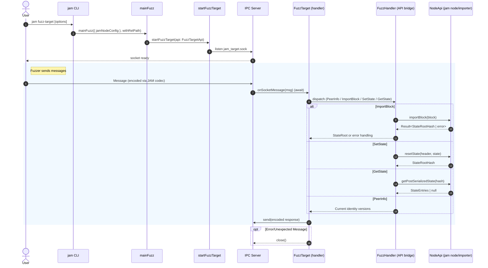

# Fuzz Target

## Pull Request by @tomusdrw

Closes #528 

Successfully running on JAM duna fuzzer.

Follow up tasks:
- [ ] E2E testing (i.e. simulated fuzzer) or running fuzzer on the CI.
- [ ] Refactor state-machine & message passing between workers. Bonus objective: avoid starting the workers at all and use `InMemoryDb` instead of LMDB for fuzzer.


## Comment by @coderabbitai[bot]

<!-- This is an auto-generated comment: summarize by coderabbit.ai -->
<!-- This is an auto-generated comment: skip review by coderabbit.ai -->

> [!IMPORTANT]
> ## Review skipped
> 
> Auto incremental reviews are disabled on this repository.
> 
> Please check the settings in the CodeRabbit UI or the `.coderabbit.yaml` file in this repository. To trigger a single review, invoke the `@coderabbitai review` command.
> 
> You can disable this status message by setting the `reviews.review_status` to `false` in the CodeRabbit configuration file.

<!-- end of auto-generated comment: skip review by coderabbit.ai -->
<!-- walkthrough_start -->

<details>
<summary>📝 Walkthrough</summary>

<!-- This is an auto-generated comment: release notes by coderabbit.ai -->

## Summary by CodeRabbit

- New Features
  - Introduced a fuzzing mode with a new CLI subcommand to run the node as a fuzz target, supporting block import, state queries, and state resets over IPC.
  - Added ability to export state entries from storage and close the LMDB root database cleanly.

- Bug Fixes
  - More robust IPC handling with backpressure, async processing, and improved error logging.

- Tests
  - Added comprehensive tests for fuzz IPC handler, message/types encoding, and state/statistics decoding.

- Chores
  - Updated package entries and dependencies across modules to support fuzzing and utilities.

<!-- end of auto-generated comment: release notes by coderabbit.ai -->
## Walkthrough
Adds a new fuzz-target CLI command and end-to-end IPC fuzzing stack: codecs, handler, server wiring, and node integration (main-fuzz). Refactors IPC server to async handlers, exposes new NodeApi, importer worker RPCs, database init utilities, truncated state-entry codec, and broad test coverage. Multiple logging and dependency updates.

## Changes
| Cohort / File(s) | Summary |
|---|---|
| **CLI: fuzz-target command**<br>`bin/jam/args.ts`, `bin/jam/index.ts` | Introduces Command.FuzzTarget, argument parsing branch, and execution path to call mainFuzz; unified error handling. |
| **RPC import path tweak**<br>`bin/rpc/index.ts` | Import source adjusted to package entry `@typeberry/node`. |
| **IPC fuzzing: types, handler, tests**<br>`extensions/ipc/fuzz/types.ts`, `extensions/ipc/fuzz/handler.ts`, `extensions/ipc/fuzz/types.test.ts`, `extensions/ipc/fuzz/handler.test.ts` | Adds JAM-codec-based fuzz IPC message schema, handler dispatching requests, and unit tests for types and handler behaviors. |
| **IPC server and entrypoints**<br>`extensions/ipc/server.ts`, `extensions/ipc/index.ts`, `extensions/ipc/jamnp/handler.ts`, `extensions/ipc/package.json` | Makes IpcHandler async with flow control; exports startFuzzTarget and Version; wires fuzz handler API; minor jamnp handler signature/log tag change; adds dependencies. |
| **Jam node: fuzz integration and API**<br>`packages/jam/node/main-fuzz.ts`, `packages/jam/node/main.ts`, `packages/jam/node/common.ts`, `packages/jam/node/index.ts`, `packages/jam/node/network.ts`, `packages/jam/node/package.json` | Adds mainFuzz with FuzzConfig and BlockImportError; refactors main to return NodeApi; extracts DB/spec helpers; barrel index; adjusts network finish; package main to index and deps. |
| **Importer worker: RPC bridging**<br>`workers/importer/state-machine.ts`, `workers/importer/importer.ts`, `workers/importer/index.ts`, `workers/importer/package.json` | Adds importerStateMachine, RPC handlers (importBlock, getStateEntries, getBestStateRootHash), renames bestBlockHash, wires importer into worker; adds dependency. |
| **Core types and utils**<br>`packages/core/concurrent/messages.ts`, `packages/core/state-machine/channel.ts`, `packages/core/state-machine/port.ts`, `packages/core/networking/bin/test.ts`, `packages/core/utils/compatibility.ts`, `packages/core/codec/descriptors.ts` | Generalize transfer lists to Transferable[]; add MessageChannelStateMachine.execute; switch to logger in test; CURRENT_VERSION defaults to DEFAULT_VERSION; wrap descriptor iteration errors with key. |
| **Database and state entries**<br>`packages/jam/database-lmdb/root.ts`, `packages/jam/database-lmdb/states.ts`, `packages/jam/database-lmdb/package.json`, `packages/jam/database/leaf-db.ts`, `packages/jam/database/leaf-db.test.ts` | Adds LmdbRoot.close; switch to logger; add logger dep; LeafDb.intoStateEntries and related test; import updates. |
| **State-merkleization and tests**<br>`packages/jam/state-merkleization/state-entries.ts`, `packages/jam/state/statistics.test.ts` | Adds truncatedEntriesCodec and adjusts test comparison; new statistics decoding tests. |
| **Verification tweak**<br>`packages/jam/transition/reports/verify-contextual.ts` | Broadens anchor validation to include headerChain membership. |

## Sequence Diagram(s)


## Estimated code review effort
🎯 5 (Critical) | ⏱️ ~120 minutes

## Poem
> I tap my paw on sockets bright,  
> JAM-notes hop across the night.  
> New fuzz burrows through the state,  
> Blocks import—determine fate.  
> Async warrens, Transferables too,  
> Hashes bloom where carrots grew.  
> Thump! The node says: “All tests through.” 🥕

</details>

<!-- walkthrough_end -->
<!-- internal state start -->


<!-- DwQgtGAEAqAWCWBnSTIEMB26CuAXA9mAOYCmGJATmriQCaQDG+Ats2bgFyQAOFk+AIwBWJBrngA3EsgEBPRvlqU0AgfFwA6NPEgQAfACgjoCEYDEZyAAUASpETZWaCrKPR1AGxJcAYtgBe/jDOpLiQkAYAco4ClFwArABsieEGAKo2ADJcsLi43IgcAPRFROqw2AIaTMxFPh7YAGaNspkqiEW4stwksRQuRdzYHh5FSSkRaYhxkATM2Ii0FADuqQDK+NgUDCSQAlQYDLBcuLRgjQH+YLghJLgAzJCASYTBFKF7B0dczNpYEWs3XALLj4Hp/AwAYQoJGodHQnEgACYAAyI+JgZEADjAiIA7NAAIwATg48QJHGRiQAWkYACLSBgUeDccT4DAcAxQCEefDTZBIBy7MzxRGYjScyBrbAMHaIRAXEbyCjYDAYeAYIj8LAAKQAggBZSC0FVoSAXQKUcVQHz4Eb4ZZgbDcWZoRAAa2QHiQNFoHPCUAAooiA7NpOINZAABTwDQkDQAGns8HmHlh9HN/koAEp+Hxlar1ZqM5QtZAIQBJcX+yA2EiNNBifB8RCAkhgH5HdW7ABkkDYcrQpB4rsQhb2d2WJDIkGWTbdlEQGkgACE2Qt+MJROIpFw0BJ8PB6C3nOHNbhYLtZxR5xRkNR0CN0Bh6AtduWMPqSMwm7JaQIUBgLYwvQ+CNJAmT6rSy5mk2ZqXJa5iWAA8puYiSNIZoUCwkBehg870AK2DSEY5ZykRkDCqKkCACgEkAAER+IE1y3GE5ZWBCkBkLQ3AHhguB0RuIhoVIhQSuWzDcF4bB8U+kBsRxXE8eqYTnveiA9GgHqzBekB6oaTBKAwVpyRJUnsA+HiQNCACO2DwNC9D9ogg4YY0sHnrsGbMW8dw8FhBBMB4xm1s+JYeQo/RbuOsB7vAmx8OqVnSDxgG7AQSU7OhjnSM5pCLkY+jGOAUBcfwYFoHghCkOQVA+gorDsFwvCCVu6EyPIBnKKo6haDohUmFAcCoKgmA4AQxBkModU1NJCJUKsDhOC4ewdYoXVqJo2i6GAhhFaYBhqBgRRCGgtQhIuuCiXR10GBYkC6uWE01Wm9iOD8y2gYwMUasREq6rQtB3pA5CrBCmTlq9AgzZg6aXN57zpSdzBLu+uBYcasroMDJCrGQjh9l+fSQIx/jQCxkAALz0V5Nw+fxAFliwPzPomJAAB40M+yDhbqbyOOwyAqnFWDpeqDANEojNOM+vNEIgwAQkzMMaCTZN04mawxQ5SEssLyC9gA3gAvnoiZOrQsLczpF4eM6NAc7M+A4d6cFMbToSJjD6AA0DIOMK6uyJdwzjTLL3NO99tBeFLzO0Crlxq+8cjDreY6IFrcKgqygGe3KlCnsDTvs2jprnZ7z5JUCFBqhG4V+9DFfLOUKCXegbz5UYt2WLqHg0LVeuO9puyGam/dssgn3szxFB1bBQwCF6DCcXx6jwL9gYYPjbDMETaAA3QXAAAaq+TVN0TTLF0Yfg948wkCH4r0u0NfiWH4dx2nUU50aJdh8StA3RdhoC9K6SA5s0xH1lvzPiiBr4YHtABcW2AlDIAkM4eAmAwgPyVjLduCscFxxPurSUGdaA62zvrSAxs9AvywG/dUH8zrtx/rAiUVhKiLzgocbOOF8BlCXuAn0R9g63hIGHOBCDI5eGQNgp+8dAiJzuNfJu54sZ+0QCoo4YAGAB20veERfJ7CkP4Lrceudpgz2QPAziHMqBtzluXeg0Iq6AXvgbeqscuCP1jvI0mLFPbty4BbG4kAja0Pvu/JGX9mG/yMAGFsyYXqdSShINeuNmhNgRJ+Wg8BHAGGunRAq+1Imf3VEoNmLCOQFK7vdR61UppwkWu9eQn0jiYDygVe6+9YaBDTk6aeYRk7JgGWOH46oSaYWwgAAS6D0PoAx4GSy9spdG0oxymn2JgI4pZvHKyIaEYKJBJINjhOFUcGpo5jIwJGDQtyczqn3DonhKjYBYyYM+VebJgF6LCDokYyASDlBLFckmkZ3FI0iGtRWGBGjwCIE1aEIiSDQthUQHw8AvCRnOjmI2iYXm1g8FYagsAcywSuZGXgRznDIrZKi9FmLsV4vKASol54cwCADiBEWOlpheDEHCBuccxJ8VWTsegpp8w101FYLCzAkC7DQUyFQ0d0qwFtPQcK0IHC9zKpxIFfBg6qK9kLWFcJKBYT4FIscydqA3E7BGU05yiDR2qNQbZ6VVJhBlSweViYeREDKLXHS5rYJe3ZqvCMLyFCSzAASYycBPKXGHKotpP0raeXsi2ex0CVJOxBUm9KsRZKCCEr8tkNx1RjghVC2lcKozhUpUi+g2pToorhVmAA3EPQuGBzhJsNa86EVzkB/NwpqK5M5m4NsRdS+g7zUXGX1OqWCwzMneyEAsXAs1B5iwlrsfNgQu1arCJ9cK7y0a2jNDyVYXt511sbc4agwskrDrAYcb6pAhWdzuj3PuT7x6D3CiPR9FDdVT0yZnA1HD4BL3YKvde1hoNL11FYCGq6Z5cH+koRyvwJkep0uh1ujRZWQBmYA+ZsgiiLMDlgEptQynsxYcZdhC8YP3VQ2A3K3g+y4aTageBqxXz0GWBeLAuzny+MUWEEawkSCJgefgfC6BkAHv8GCyA1alBtvhX5Kl0JtP0pIFi9uOKmXnhZcSrM4oDDxPED8aaa0UlpM4hkjDkBsm5OYPkm6nJikMIoNwBgRQGMVMulUm6P66mTVqo0t6zgWlgVTR0yEH64SEfsPFHYME+ChAhDFdUawehLy9qCMgtJqAqF0cR7CdEyNzPNZR6jRQrkaCEIgAS6VauzN6A1qja0BIUqQ8OBgboXLLzRrIKzkBIX8A8nwZJSXpBdv9TBxM56sKWUaNexxnF+iwStRGIdvw32La/Yhe6vcpoD3w8PUQo9/2uMnmzAZkGeBDbg+IBDM3FvhxsS92ggwhujiIBgagWxpDWds4khzktoSpJxi5tybnMj2m84U3zYAjDFzIKOcewXAtFAzEUKRloaAtkqWjmpD0noNKPHFj6iXUuICMFh32COha4GuGGM0GLdjY8AnrfHQWick4oD/MMLCfkAQvRjDCppvwjdDFmrW5A5TZeJgnFiGg2QbBG3cT8A5SAozCEoWFqv3P4BGwbrjAAJGGXgEqmS/HBiMJNrcuTt8+B3k7VEK9Gwvfddw1WAy4KENYlAMFekzLQAEsJExaruLHmg8mJKZOXDyEbiZQhWCnBQd8bku1e31Jbt04fQp8H5zkiM5ZAtl6UHwdKOiWTg/sOZYJpcK7i15DRx5D3FwwB0mT1uTApB8BTOISSgfDdpUAaJNhuf8/4C4NMLmWMc+UEX0ldS49btMikOmEj8uS9wmzwvmFTthlmT4g9wvedLERWhGILfKVpjLwMusiu1iu/TGMgAcUT62FwDjuDsgGHhHsAvANHknoHCOsAl4MJlOtbMBJQDtivoDFjNAc/jvgoNfpWhGAANIkCyAABqwC5E7ATIS2ymFircX+PIP+YkqeM86eJeXAjQU46BpoQ+ewGebokAqSpo4kAyLBiuXsWqKU6BUapo0BNg+A+AuAt+NBI6TYj+0mGAvePCYhyU2BZA7+Goxk4euA0BXAo+8ApqyACeRhrYKAsBIwcIUa4UhhmBaCDQQCFc4hbIkhzc0hrYsh8hih+cViTs3+cYEoaQ5Az2W4cIxhGUgKqSDqko1hTkY2aMcKpAt4by9Bbh9A1iHhqUiAXawBWqhckAouBM54igd40I/sdhQqUA4RU8UR9AMhchc0ogcR6yiRsIfhYQyRQ4qRAaC4mR3eXauR2h+Rxk9IehmoIaFAXADyEB9AcgZOkAsga8Hg4qWAsx9E4RboAmWAfRM+PQXARIRIAkXs1iZRCmTyes1mCaSurc0IHgLSIs6osgeWvwhWogiYQ+YANsPQGRSOPBJeiAO2AYhwa0Yuuha0KEpaPuryhxishkUYXs6kogM4omfk+AqS2GOYje0IsIRQphLQBM0+Hc52v6V2AGN2Rod2IGA8T2/2uYb2rGsGK8n2zOEo32TON8z2EGAO88nCH28gwGY8riSgNA/KBE3KqAOSzQkOCS9mAqjmcOzmdYSOWSdAnmlOGOWOHMOOguzIwulwxO9upOV0EW3cUWz0dUTS8WuqP2LOPsaiCO8krs/gY4ZR34xo0c94/OuOgEQuhOJpouTGckIqig0ocuLJnCyklA9YWWbuOUHuZpfAUabkWwymsg76WE8C64pWYpyAQJGYac1hXsPQJY6obkoeie4BUedA0BkYNuyBFAdu6cOYO01gsq8qwAhBJBZBJAAA2gALp6BHrSAAGwiRhOGtgdl6Bdk+rTDAAtHyFtmwBjkoBMG4AiFuiRg7lzkLlypLkrm4Brkbmn4b7n6Rjr557n4HnepHkkDAA3mL56DWas5YyClsbiwjga4KLkyX7O4rzV6Bae5RyWgD67A/lq43DzhAxJnT5gUO7lxyS15cQoFPjiplj5YYBfFLyJTqDKGARozSgEAUCsx8lOpDyv6gJflLwEm0BsjPE84kAbH95IRYCIDH69HJl5TyYm6iBrTpp7Dqj2nByyA8h7z8EYKQBTGQkaCGQwmoS4CRiIlrQMCJjMCIBECJhokMBZh+p8LCWHGzCAI7ZYR4AYTpSmiq51S8CW45S6jPi1jb4VwXDcLCxLj3E5LqRuoXiWpmlz5QAvnn5cCjoqbaVIWWgXm3luSYVYGr5SHWBn5xWHHGRCFp68FhVwERVEBRVi6EY7nxV5FeFGpdE0A9GklcYGGTk0DZX/J9iRWpkaCWGYFaGuWlWvI+HdGtFVUuR/61XcbhWNV5XNVgFKr1kx5lnuHjGdUYFJG8WhFQCYGwQnlcD+p3id5ZHCVoEIRQD0j1jDAIgbXxUhEdzljlQJWv6oD2Wy60D8U2Fv5rQvhUXgmdRQkQlKCwlbiqWLVInfFXVyb2BFY5ionmQCHdpum7UUBdryH+VNw0UzjOBSqPX+qfpLgBh7YZHGhMgRj2WyhUXUr+zYBEC5CGWDH3WnUVSv5nLoUN7BFZFLhsjcjd68Jyzdrf4t4ElcUYDWZ3QUmXaFmAY6Sil95gZ8kzyvZ0XjbwaclQCRAI7gZuZxkUAJm7AIW26pkMz+mGkE4i7NWXQGDVifgVFHhwqg5VzSB+jhC6CQDjWR6QENmtiRguFERcDNl7yUBrlZhcAPk9l9mkGuEjmGA2222tXO2u3cYzmwg+2Hk9knlnlG021QCFW8Eu0DlcD7m+3dnHm+GtGJ2h1QAxWL7p2uG+0pX4Cx1+1LkhVuS7Ty2K0S0IjQXID7K+SAWzTIA14MD5Xa36kC545GnBmBCmle7mlJ1cjjwkWNjNjm1g7Qi+Ca50yqVNVj1zF/n+Du6kD5W6V01cDd114YV6VeI4V4VZgT2IaslJR7xMXyD2UAkcnW3VhaWjVr2L2BBb0kD5VJ3VjQ371oXl4/223H3YWfFFYX0sacJsCm1Jgg7z1W1ANQA67cWf0r06ZpDKSYi8xUCTbZ2LlPn7iHgh3J1ags3TDqbbFGxcDuKzEAD8XAmNFqoSsdhDtAcSipSSKpJA8O6SGpXAHmeS1SupBgOtg9etJp3WF0EuYWlOkWNOMWdOS0CWX07Sv0H5NlCO3BDg6gQCYQojgZQ9ROkj4u5Orcnq/BEe5hT1VeRARQilNjuqbp7e9g09ltgsr1n1lARQcl9e8V062Jh4yphk/e9xQ+yho+HIEoxBC4wsXAFlz41wTIzo0JNjdjglDjQJU8i86g/BA5m1OGbMyY+MyxCqeTUYaI8QoNjIvIKmaAQgTYmly65F8Vhq2ypqbFzGFdcTmwCTqRyTn1hYaT0xiCEsY4tlcIaA3A3A0TqcbI8VSMMzAZxkAdGdVkPTZwfT1jgz9jY4n0po84sgYAkdw49k8JWM9wBIYAJTkABz8VGyPI/4kdBhgBWzGoQziguzl10wtkuhuwn0KzrhJzt4iYkk64B2moezWxEkXQLjsIi6i13TKoGzSTrztjOzEYQJ4+zI0cn95WISiqGCMCUYtd+AiY/+Vhce5VQNJ5Bl1B+cY43WumFiaCmhFc6oNUuTgLcZRATIXQXaYTy8Dg1R6LmoaxrF6BjRUpplPQ+TnLRE+UUAn9LoAahYYVtaFAWl3asKt4gysgNAYGnj2UZJD+s1v24UJljLNwRYsEOwM8x2BLmCyAkYcYRACYyVl5cVnZyIZLg1ug859wGs1hnZAALKDW5doB4BPCLIAn2EgPZkcBDm4IPmGILOIPWRyFABNrqIgGkJiOrtiBtHK7sPUmKRKMuHq9IImOW2TiwQIDtq6DrGgD8zgaPgGczlAAC0RImIs8LImCSztpgZ1AwO231aQP9cVhXMeDQOO+rik9s+k4WEYJCnVZBdUUTTNALABDkjcRGNHfq17BlcwbwQ8cgLOMME4iQLZPZPuk2FBSwJPmzNK4m9+t3ILWLTSaLaBoyfycydLR9mvHLdNmyCQOw3Zpw7Dtw2qa5pqTkoIz5hAJjiI/3W20GUY7PhTtUnIyWy9HaQzio2mk6ZwdjKsN6cMLozYpzCh4YxI+h2YzFAJWbtGd1vQG6SWRGIgAmz8Hc3KJbhgjDqIP3qjKKhhD22yH2xXYmJ20DV7Hu0AgCk3QKqmHnKe83FO2xjO6bpWqBl7P8SWO8i2MqDPR0NA8Hv3h+QvCXmAF4FIJZDp66LAGAE8eBwJ/vVuUVViiAkWbBDuRoOO7S1OzSsiZGN80RIcH82BFJ7S2Hq2DO5GKCE2+RB7fXt7agXnfIbF/F82wnfZ6DTyJGs3EwJFB1WONLYyxAQHF3W57wT6xS8nlSz0UuAdV2EDJ/QAj0MvPjF7KaD5YyMmKJXVELHM7ixVoPIignjJKOI+yZQ6zAuXR66SyZMIdV5KINTV9AYG5SzJ2l5oAuTidGTUJSqJqOFIGtputhGpciZkwMxqImCK6gW6MyNwKMotTIJyqWOFK12ZSM8gmONseC+riqHsfaNGzKxjZRRhEq6AqNOV153wMNzcEuKJ1gLusgkxy4D4LKgCLjZqAYiWF14wASfqwmWRbIGZl1Y+JIxR1xGOAAOrlD0gCAk1eXBrXdosLsYvXqPU+WtMOccrTC+ioszi8tMcxtWstNoASX4B7xdoivX3oHhSWuDjxX2NWU6TiWSW0BdruiPdjj6f8zCXq9S9LFvdzOMsQ3EFpIaDa/cDM+7AGekVc2sUAeljhoJIRg7mJhJcYV2fpxPuyvcsxYqeqLhRtckDLgNbRromICyBATIydxU5vugYft0lC3fuS0gRQZX3/sIbci/l7zYZHxI/hKHz6MdDUcj3GOxJchKd3jdJHwkvF+l+oc0eg9V9lg1/ewF/3xSeN/Ie63GkV+0esLV9591/3yye9+Uf9/D3+CdBD9/yT3EWYKd8Hz3wBfjvXzOsKe0D3J0JN/l+z+V/D+MxL8yT5+r+Hyp0l4b9RhK0+i7/3z7/iOD+t/H+h8PgYK19d+HyHvbnHtUw7lN+d/OgA/xL598xGA/Q/vPwlDQpjwZ/MfofGi6wgb+W/f7KAKf6QC5+r/BfjABjYw8V+AvQ+OS0wJUwverZezkAO37oDwBBjZ/lAOwEwCp6y/c/oQIC49EUBwAnfgzDAFT8IBM/LARDjb7v98BLAo+CeUpj1d86FA2/lQO4EYD+BR/HAeCU64IDPuPQSgWgLkE0Cy+dAgQRdDf54DVBi1PFmgGviDcQeuwVAfyWoG8DaBmAxQYwNP5hBRB98C7qIA0HWCtBtgnQfYOgGDQ8BnnAgUfCVZUx4epgmQZoNfjyC0ODAmzBw345OZFa0Hd2nClgA6kEOepbwUGRCwYdLStSeRjh3pzKNHSEoWsMcjFRYxRwTuTcgMl1RkC1yRQMgRbxxidAXA2bdwGwDWA8gwgSVJkAm2aZYsrOXYGoWunMbAIuKHwQsMgCKpbceqq5eztLidgcdSszPVAPsCN4450AaCDFMql2CldZ86ueSEUFL7WYoAWGOEH7GlooZSIyvI5OhUODO90oDgKZmujY7woL6AYbfpACR6TI74MQiHG1irC21PhTJP2CrTVob0pMuoJ7vFT9juU0IczY8DPDboqVJm8Ad+n4jpjQj4AVmC+kJ0jIVCkRuAFEYPAEC9VRoUNSgKPlLBIwAA+u7DuBW8S8nGTon7BJFewSY+VU4ZAE+GcxsM3afRnJHYhs02M1lGUEzEUCwh3SqrC+kSN5EGk2QWKJ7jmAEy0kvARAS2EaGvZiBmKTw2mLgBbTMAMA3AeUQPWuRoicwwXS/GYTWJBpdgXodggwFkDiwSARQEIqUXtyFhcRjBSfLNAmbEdpclAUHJZE5Fa1BsV9a4YXD0bg8uB5jDupuw1opk168VJuFqmtpF1ayE1R2lNVhBsE7gCbZABYgdrR5YW+rCGmiI0DZ5eQRhOstmPW4ttAig8KTiOTOYkVDgL0A5qCXionUjyVFALkCKgDh1cxDY+/I6msLbts49pdKNAXBKpEMIENaAPmCeR0A1ytIGDJOOWizCaAs4ygl2I8hYBhqFYocTQAHEjCj2rBNUSQA1ErFrKT3DQFf0zxs0AUWNLsVoRcRAxMwWEOEDFF95zNZip44uqFUrhbBXEDALYNCBkjUYUASgdkvIAWDrI7x1GSIKdFdHUYkepQaZjEzZDcjzhORdnGm1lp+MDhCwFyOmJgBLi0wq49ccLHiwbdtxIqADomEXEqhlxtAHcYxJrDSAjqVbXgr/0YYNNuxfCdImAgIkclB4zw2oW8NLF29ax/gB7GkyLEQE5JrLegH909H6FOk+Iu6lZBVB2Z7RQkscMWUuDrIERriMNC+J2ypi4QJLAnjCB4R89M4WAa4WAHsp7cCIME8QF0GsxIRR8cBH4iLTMLlRnSF8OmEKI4hN4VAGKWWiCyGwhT3gkYoVmrVfEVwz0KhWamOBVrBiPRyYlbBpQxK84koTYDUWqA9J2iqeZo2FjPCdBXoEEYaZ7DDAZYxtCMv2CSaMJ0hwiWJk4r0F5Pj4/pE+12J2EBhT5i00+s8TPkKXZIAdOkII/klwB+HVY74dEDQAoPQ5tZCk1YO/lQm+FYSsARsX4fRGWn/DFwa0jtJ0lwkxk2M4Ik5BiKhFPcL6m0q6YmSXqhBsRVCIBuECQkoTl8qRDUKdNDofS1oSPOaTtL+n/SiAmE2ZuyG2mQzQZodNpAViKwn0wGogWGTbQfFuguAkYCziNkzq8EcwFMectXSfIuUjqy5bbmuR4kl4+JWNPQGOXelb5BqmMi8J7XXpkDdKLzGcQxOkDABmJ7Yn0OxOkB6B8ZhMnOk+Wy7pw6Z/0u2ncCsDVjw8WYqAi80jA/jjgkAeoTl0pgiz8GZM2EALOQAAAfYGMMA8CSybaRsM6d0gulLx4R2cb6SeBRFKj0RkIliNiPPobSm6XCUyZVOJHPS7gjsm6S7OVFbTbkS4c2RKGLxyk14AvOUTQP9k8iaBrs6KLFCbAQNVSmwRAMxWcQgT/RywKgFMxLA2zhYoxBBFnOriFj9Rho40aaIDKOycwOSVQsxStFwNLaL6X4DtRQmJhGeKkHSKXNowkAYoqSFdCOlSwaonYSOZYM4FHndokWlAZ4mnCpFeMHRogZ0V4G9FQBIwqMIMd8kp5CYVoVs9jOWDdm20PeaslsnRJIA9E1ybcXYKqMIwTMK4e4CNrsPVxXDUMqCGSnXARwojsRncvAAKOezZMwgwOC2iAWdhARxUZIqQNfO7S8BEky0aWj9gVJgcEhqpJIXwzVmpD0h+0eQUjGNGj1wKYuGRphytIFDbSRQh0kzk6RrBNEF4DVDpH9T+waARAH8AzHCiVznQbpMogtIo5gAjSvJTnEaTAC4Kbe4cz2rpFOjGju6XI5BnrlwCQ9o+OZNkOnL3lJYMprcYBfA32kyL5wcixamgy4AYM+IWDfoBLzxJOxXQ2ZJeNov1x6KX6BizBtg1MV4NHywAVhqbHykqoCMfELeZZHxo5QxwR2dUO3LYBRhrEaACeYRQIHeiBaf6JPoNJFrDSv2YETgb+3eyTSEMJtYPLAxAXVFBEF/axbounz6LIAhi3AMYpwZZhwkLde+OwqkWplwksKaODwIVF2DGEeC0Mr/GeD3wClqDOxSUocUmLcGcdJcm4qqUd9D4tS0CvUoZiNLdgzSs0T4LaXcB8FDuFhH/DiHIKgmuwVBbw0yT8MtScHdHBkKQ5ZCh6wcEbP1TaxshwshSLDtFkKFKMKFqjQDudL9hKAwQMEhgI8KLjaCgy5y0bEbiuVQy6sPWfoJRjvSagvYIKijG6NtB8pQMkYZEBoCRUEhcRZwy2fn0+RZT3l9wr5VbVIzdYYVAXdsJQDdBeBICD2eKtCt6x4AMUTrJFSitBqNA+4/870GOGpVgqigxKjsAgHIDjYXAxkbks8vEm9cWQBRbtNwUFStygl3aZyGwEFXBFHMP2flggH5BAxmYZhMMFZ24asVaSHy3QvICniYAAyZzOVPAj4Dag1gSESINlnswFw94G6FsNukjDQweAqYHYLNDMXoBxRrASUfqz9gUEAO1mGJVSVcTJ8fyqfZJV8LnhpLPJU0iUPSH1WHB5ALgw+ByoGAQrN+DKjQKiq8EtLFl/yy5TzTMHl49VuKqaftTuGhRk1QQ++OmvBVwrWo48LNcipzU2D81fyhsACrjBAqS1vjHFdWrxUjtE1uKlNQgPrVcrWwJK68OSuUnCwW1jKvNQss7UXLAVxat9P2qrWfKK1slLdQatrVprCVNKtNrAijDZrc1UQ35Wcq7VFq2QfaksAOu3W/QocSpOdFwx4aI49l7mA5V5iEbHL5BzLc0jcqpzWlacr0R5a0koUwDUs/9Hus1R6WLVC4qwXucgCJmuKDwtAeckEpoBSVPorDTSppDUVZlFFeZBVqAx+hcBvKI3MosHDzhTyScn9DHoOFmiUr+MtUhRQwC7Q5Ng4r4HatxXHBI4gEESguH4rlAf4L2i0OXMyr073svA2cYyB8Qo2jsv68G3Cigz0Xt57kd4YTWlgFxLJZgGavyoTlEqKhgSI2WGlsSxr+S7e/G1ACEU2J0K+cWNVGkJLoAKaYN90HnMGOYrYy+CE8r/qcnMUeAJ5MfGopZC4qyKWqXEtgJGCZUsrRNVFOLnwDQDSbktlmi1LSyKIMseU/G89OqHlY1Sm4EYFUNIhHRZE6i5G0gFwB8nKBHw62S9FtgQSqiiiGEEyv9wO5yaMIsQQTTgXDB2QIwzjZSJpCBpRosmMGHJo1odD1bbOFcNSV7nWTxMjw/G5xglsLDBqE+sSgad2k/YMko1TJGNVn3SWAdMligbJZoryWECENRSvpaUvKVOL+CGG8JI9LmV1K16k/DtUPUA2ELT1LwQ+Fdq4zFLbtjioZWhtGVILocWyxIbsrcw25MFf6/aIWryiwroQsKwyApNFVkV9BwGu5TaViwQbGczyi2URwmxui/KbcdZt2muKUrPojQSMG6Fu4MgkmmOwcm6GHK79RwksJHAGAbCwB6QHHJne5Cdi5zJmT4Q1c5ocIJL+dzIMijcyIK9bi4S4DirtgtQPVzwWEZYGzlWD8S0yiBKfFxnvgAASA2AcyoaQAjdJAMJCjDAjWJtiluMCcCyTmDy8wX4NubKpQnKZAm+0htPITgzfI5S7BCCVlkSjbFDi/eGbK/IhgaK3G0C70mYSjnra+pm26kvEtuwRqRpe2n9gdomlxqvswHJcEKrTTiS560e0aXQEByHac9HcF9c5yh2fq3MAjX9fBwR03qkdhXV0e8nt0QTcAzWF7rkNuUkLsOZC/Hfh2Sz+D2ui2SjYPgODygSwXoLNDozviMtd5iUBtENkjE/jxw04bDpNX2mLjjVAezIN6HLA0BmALY9KHvsAgB7dhI5W3tLNwAX6Z9FAQ/S2Fi1naW5K+nSHT3PAP6D9LsRlqgAu3erCuNjZ4jtlSlFcJCGUrcvYBoWuQSMP+ygM/twDH6vwg8BA1QADz56nYcNWfXwjYxkpEN9vMQKAqJqx7TUmvbSMNCBjdZtVNnEfWlHo7oBmgW4YSqKThC9yn2uqBXtPoD1gLNAvU19knrDUp7aSaepJX9kz3jS2M2fQDmsGL0t4LtR8UIOgaQOxant3i1Wicnvhf7YAKh70MX0R3SBkd7etkJ3vYA96ySay/aYfD0MtgUDp+4ctfHSg2GeDXULwCOXWXV6UFkHNBV+ob1YLEOhhjoG3qowTg5wgzd+EPj70gbSFeO5pE8oI4GAyh7q05IPlBC0HdVc2qOBlO5T7pjsTybZL5v2n6dbQcYWYs6y9Vo1LQ5RkgFNnuL2UeWp0FxhiksjhpW4UaZJLGiYMsq0aa2oDrNn8oiirF82ctBtnOCc9lV3aY9FwZ0jJIB00qsNTyhQkJ7BDoas1gkrEO7aJD6fVJRXtlqdIZsnA8vdnvUDyAo9LeRBaBwh1vqIOH69Un4Z/UBGjAQR4w5OthDtgedXYN0d9HIBBQiFeQ6nIPriP2lINhOthGvo4w/ZJ9aUVwxQCGFZol9/PBmCrWuCwAGKo7XXiPN32wmkD9hs/U7HQPX7hyrCnSKH1oCKbfjgYzQzsFWF3hmDYgGQHDVbzPg5DcDGbUeC4i1gfmWac41qk9h2gitkKrUcwa71Rhvw1RbfTmGmAnowIJcS/W4b+bKVfsRaVyYEy/Rj7U992UDIocZgQHPCaceQ8UUShkmKTuqycLku4DBID4soriKyaymqiGwOwMVQZv32IHvQ9Dcia6YwPuHiT2G4CFwZxPunKNgZuwyfpv02nnKl7eVrgB5nzkHTMoI5GYxDO4APThJgPC2L9O4bZTyZ1M8mbxPDluRCtVYJGMRFJFPj5ATDBioDHS0TOp29mKIEsqxnIwV4DGVGAC5eJwJ7AesQMko2AJyTPx1isLOGVPloAQs5xT2VHOlhP6ppjwNAX1Dlm4wA+VAPWbAkrFTQqp/kRYsOB7Ayd8EsqWYYm7TU50A5yyC8k2C/JqaH+M49YTlOjh5NnSGwLpOTC7BYgA8uKHwBYlYnXQnu7hZIwYaFM3emoYaulAGRW9bTc9DwDcjuQtNMkYFyM9yZUohycweWzeGlCdi0bglewx9NAyGLBdrCoONgJpUQ0EWgammlVTfM0bJmU4KEllagCzg0T2TUYzjHCGTgHmLzj4O85WyZZUiAlT5kJa+eTli5OkS6c1WeOcG0BHVW6RqJBU4PpZuF1GDgC2coD0i0TwEYeaowPzYRGWth5AyfsAwxs0zXgPmpYBDVC1w1WprYykqz3SGjtwloPKdt5O7AdTh8NAnaeASRgSL307HrdwqxcBAe+xH4jmeDNencTYZtnSYUe3ImNDEImw32ZnMGGW9RhkI9yoXPfHMAvxqw79tcsQWPLX0lxt5aNC+W30QPZYBgECshWgznp+U96aHLhWHth4dZYq3stm1m5Chy0xAjX6cmozYYJs55fyuFgfLNwPy3hACsunqrSB3MxVdDNfgRyVdUWbGfUN9wYrJpk8wldXVJXb2bxmgB8ftTt6TzmVzq/BejO9W8rBnAa4VaGvFXRrt53/S2EmvVWiTc17WaOcavfqYGqalc42dHPNm5wmM9s2WE7N8RuzX6la+lcHOazhzsZypQzGqWHxpzJ5ucwubWvdrgjm1lK7tbSuqhWKayq46+sj6177j9ex4/DsCOJXUbKO9G7ytdGgX/j/e/IUCcUbxHQTiRqAMkZOSOaxrj+vg7JawAR6iy8BvM2FbQOwmiTy+Lqwhd3osmILSGoA4mc5u3WUzwVh6+meHLkWqTWUniC2CVaOWkagsdq3VBAt74pRmtwpQDr6Wf1yr41yq4Zdqt1GCM0B07Niamu6XUD5+kW5gYSq0BX9t8w4HuiBjQAkItIJCFGKARki/5N12fS7HBa378wekngNWKVajoFjXYruRKpjb6cS4ykKohTojt8A59rcAeS+anBYBADjppsCAdkDciSqr+/PkDA3Zn8w7vRAUAy1hN8GyeJRRbMLT5xyo8g7B8Yq/kN57xuRJtpVvGadOtxTQNtlsUCW4Nem27H/EHGOAl1OX9bcIPmysYuxCH1jmp+kgBlL0Z995MhuyzAx1vOWtzS8NAlyeOvQAXKegSMBnmAQxEzrN3YGKdZ+k6ULraAYayVbKvy23Td1pW4/tCszW2dYy38rFZ6C0BZZM8ZGy5HJuujKbXxmmz9vvjn3mTtAK+z1ZvuCz77luR+y82fsf2+rhDwa1/auvA9LbQD62+7Z9OVKlwx9rJafdXusDwLbJ3B38ifvv3EwxDrh5/e/vXWgrVVqh9NYcPQ3EosNsk9A9wCwPW9aNqdTyqQewXOlWV1h8GPYf4PhxJD1+2wC8vnX28/Dih3/af3UOvTj1w+ODrxvJIdldemDtqRJvPGybrx2lZG1hUSQn0agbqZXdpsxGGb4GpmwTpZtlgMgNgAMJEGgC0jiCAYGwGsHLDWqAIq8JSZStVG8a1ExspAK8iYDAIGQhkuAhykVzpRaQAYHwLqDSCZBwnkT6J7E8iBeJgnoT8p1E5idxOqYuPCEIDdwBI9nW6hDQL/isAROGnVTnMLQ1oayUinJTsp308qfWraTPGOCkE5sAhOwnEzxpzas07kB6AkYX/BDIDI5gdVyPMCD06WdVPHqM8xjpTVUVlSqy5qU5DG24Wa3RwC8OCaFFOeDxTQHe5xLsE2dI8FN97dx1FK8nYlzUnuh05GydgpObKaT33pk+kRfKMWuTrtTU/md1PDnTTixpDMgBDORnxT0p/U8meRBdK6FkcGOBOddh0wsEVts+i1RHV+QWAQp1i/GcVPlnAEICFmZwgwh4imoCELU8WcMujnn5jS8yWJdrPjI4fN87BBEzTgDnPLuJ8NHUKLFk7J2LExShDjIo2nPwhJBTzRP2go25D0q0W0QCdoMSEr3p1K5tUAGnnJL6zfYBj56XVR9YBqnk74IFPRn2L5F5EAVX0HB4nLxF4s7WBpByw0AEMLBBwNSHkMb8wos5v+5AkFiXoegJK/6dxOB0aqhVxpY3uUkzLIhnbXvYz07HrLbJSvZ0lIJKoA8b+tq1acIFeuFnOL5Z9fEzfI86ELxkI849RtuPxAHj041YcdsLSk6YA2oXJrmeVvXXEglp6q52mdOJA3T41/G8iCdo/44QAgN282l9uK3SLk10O+VetPIofEDp2QHHdxvcXgz4Z7S7GdVuqnHaTw/EMh3WPCbtjw5UUlJvrWOgUSdvA5Ks7MBaAAgQYIldaw81sdA++5UPv8f0GXlVZt5XuprUUFZAXALrORl6xVGKAdEKD+eoEgf7bsSaodbqheNPuKsL7jwG+4/eGHv32E/o8G6A+DxH1uhDiVLrFWJgbWjmRNyjAjKy5Nd+88jzWrPN/zgEfcXiyvBCW5TU3/U5PdtsSWWXo1IbmWhyU6QjrB1Y6nJLbLrVHrOVcH5RM3HJdzND4566+CwK7v3xWPQ66+NMC9mfRD4mHz+M+4Divv33n79a4R4wDmPcbNeq98kO/WwdG9Ry5vQ+8YR2NsP5n3D5Z6wjyFojOOsDbh2KFQb1G1ZobLWbnRZFX9NJTIHh8qrVLzGZ1aeeXjnkRgIIUENZvIU/sOS95SgdUU+lrjxKkAClKoCEVi0MekEKCLGJatpCW4PEbeRnfAEOhngdIDYeTcR7myO73zzJSMZcZfab21j2n2txPGzdjTD7tl8Oc1YPUVexHB48ZfF/fc9EZHRhrDzcBw94eig/nzQLEg2XXH8bjn9Bf4fscGATPtQMz9MAs8fuAuWO2Rn+9x2M2QTAT0fV0k3MBi5LsEFHIMT4DcKJ1cH+KthswR8d/RpHLwBkcsgA+XVU9NmsJKpjff0iGgEGNGC3IaBoGaADQLMpIuJg6I77uiFmDRWcTyhypQCKUdjBY0KjZzOD+T4tSRhD45usJA/3ChZGx0yaV5EEs91noydvm91z9kHjTbCt8eO4CBL1c0exPCUw01QVvqw/nuqaONrOxfHHPmH/HreyN+E9ZvtjE3v9lN/lrAcuAhx7fscZsueSRS6v1xOaZvaRy3N9n7w3cac8nem997lG558u+uivAKWsAO+5Ma7eLSdNwE/++BN4cSh6K9737C0Y7BQcTIQaU7GJLXmpREHkcUsxkuSqp6hnCe+BBhCNA/w+0iVOEtbwynIAg5d8EMFwB9kq2FbRALW2JOBquLw1ZSPgE5lzjEAsW+tnfjo73hNUXE3uL9y5mLhnGUZ8YeRJYmUT7Oa40yfFkx+yo9ZkYeaFNmFQy4oyeE1YM1PEn9I2paUMMMGeH8+gqJ4/5aH94U8ZrG1pk2VkoCOQBhbI3yeS2tA4Ajh84XaQA+FDv8zwxLO6X26j1pLn/L/QUCIINHamaNucMFysg8/ZwBwYzmDMgrxe/etFnATEBLl2BOxM5kOh7SSOllZcAGAMIc9XMNnoBrOZQDyhZIV3gLhdOPgGh9iKNP0yBM/P8C9VGeDFA5tXfFX2G9zLXe0exxvKWljV9jLkmA4bfS9x8NodG91c873Bxw891vSrGmAigd30aBPfKoG8cgvBRj8dnvIDyJ1mPGsxm96/Rv13FYtLgDUCAOHmQol+ZXv3nJ0ocgJS0/waZyi8eMLjyUlVeGjD7gspHkEUxqpH4GdB6/eal1koAsbgnJr8eyXkBqAjYg/w24MAM+hByaAjL8VwCvyr8gWQTjCAScZAADAd4OgGwxA6ciGTg9zNr27tYgS2UjodsP8D7I95Bimy1SmQFl/M1eLCDckjQR5g/keUMijhADmfyXV1dmEuxGtgeXJiVQiWcsTb8FaUfGNwh4A8VT9SKf210CVxUf2okvkffxIxUpOwilYa/WVhQ0qWPWUn8WAXmVYkx/DcVkBwiZyHYJIwCcTXkSlVe35AtyZU2x4GYLQLlwK4RYLTA9ZFEjy5NQUbQAsC4eWWLEnaWEGXAu1UqC3ESAPshzAD/GD05VuVUlVnUHsVmFBxWMMqT9govQAEwCCwmF9q4TgxIkjcJc0hDifA3ij9mwH4DsJHcWoUSktDZZEY8oyYSkuEhsSnmcDzwVADB8SACEIPlXoak1CIOA0j3SgCA61H7lBLXVCQEKqVoizw7gMX1lVAQNjAWkjAkSFrYhjCzV1F//VYHeRVPA4hm8tCVMANsmpfYOgUWBegPTchPTYw18rLMTyPtpvd6wQFVA1sGn9Y6Y4PlgzgvQKb8aEGG0W8KAgQFW9H3Uz289RA8QMkCcbfb0sd31KDmO9ibR30EDnfKJCawZobCWkCHvYL3IVmbZLHC9QQyMl9Iwgc7z6wlAVx2/Beadv0jCSgwJnUt1QMAD0ot8W0FpUxOcCEghlwK5heD6AV3xMQyAc6y9h6kUcEQA0w6wi05ixSlRnsdIQ0ULglAMHk1toyOD3ZDcAD4gRkAaUrAwATBByR2wawywP7DdEWighNSIJmjBARw1/Hrw2oT8koAwAKCSLD5jbhVNAVZC4UcwSLeKnLDUAZmXrwaPMEE2pwIBLzZDiqKEMWMsLc8HjxeqIHzC4dsHcOQA9wksBVlag+0HqDldJsH7whw+smnCoKC8BGxT2C8G68gMW0JgIHwBinkBvw7MT3kglIrALhwoWIGVwWyGCxbAqwqUR28uNMCDJFVEAgLuZqieBF7RPxBbhyYUvcKCy83xECUE5ZTHSCy9UAYjGkBYAB6h8DOCWbU8YgYB8LM0+CFII5pa0IgHBx6ADiKfDmmDXmEoOIgLmkpTQDXn/xVcJAHrEvYXOR0ZRIyaArDOI3egVlGkVsB2wTbNCP1YdvbTyggzYfW3yDxwJCJZltPQSLPlugxgG2pu0KCCXApI5SNkjrCMUMbF/GUoLEjxxEbmcDMpb5AND4qe4MsCcxOrgO5LKJSJkjy5dCN6oXwwSXZoeoTiGhZZAIqgzs0/dVUrRUQ6WXCjOIs5lGgvwFkHkAhIu5lpJDqHVGLhcaUcCXhz0X4F+4EoooCIijmAcnTB1iQGFv1SQ5i0LEdVKgEshQ+CjHqgUoTdj3JluNmXjkfpcqMTAlvAQB6IigHcg6BoCLsQNCNYWSUeCaALANhZnwSeQ9F04QZjnZitUSSDU5INQmq8MIFn0MlYIIsMdMcoeKlyieQULVHwyRV/F6MMWFdDVBxARJx4QgIAoEVD32DNzN8xvTX1YC9jCTyiZ0EZ+VTUlPbgSjCfQiUXjDT1SMG6wj4BH0oBD4c+mtBOpZ9FTVcsU+iKxcrHR0gB8CfYi7DcKEGghsCYvCitDPPSGN9VoYnAT8APKOZlTVew38I8s1oZCRxitHB8LIFM6MIIeZSHByWeDpgVlFVktHdxAYoOKZiipg7XV/FN1hY4CFFjZAD0zJFSjUaD2kqYY2CHN3Ed9wFjdHX6Wy9cAP8C4Bxonoi7R2YlsjXJ3aE2IWEwkcGMcdvQtaFjC/Q4/hpivZVNSgjMwRmJAYSYorHZDwo9WXTgzYlmQpkdYvWOPDlvU8IhUuAbUGZAPY0QCesXFUZStihAz+Api4wx0K8NuAu33QVYdUmieMzva2MTjbYnIX9D6bAPye8g/KDS0lcQl0lWAOUSKEshWo/RFzjagJrALirYe8GhAwAO/jvBHwDuP2kIApMGBDx0cMPxVlpX0N5o2sRMGWkkYbRF4jv3ceOaxfgPtECAZ4+KmWkWsQEXhCsSPbiBgnUaOAT8lIGSCjc5QooN2AbYyWEMN4Sc8wfAuPCMB8jLIeMU8CGSPMD4si7UVyEtBvNNy+jlQiy1VDRPSb3zdw5QeIPUIY/ONChQsGGPxCr6UkJ2cm6dZEfA/2Jun5sWAMiXMc7Y0eNYRqwZBMniIVb91ndbaZBKuQF4/wGwSL6PBN+AiEp0Ic8eAmx32UXPbOKASYw/BIzBAvAMNkCQvBI1e9y4zGA0ZVgOKXbpvFRo00JIwhuOjDXRBhMuAwyY/UnRiiU0CkkVcC6IhoiREkXSglgdCFq8mjSFElhk4Ar3QhDglJhYteCaYLuBKCdl2kl+VADi141/e/FoBsyU6DYxoQF2Op1qIm+UcwkqP2AsiWZLawYMLKUmgZlauEgC7QrkCtDMl3ScPEC0bCW0HQiVQU/wjwRIN5Exj0SI+JwJUUfiKvQ9wJsG5Emuc3C4T95RlhJhtMbKKTALkDNHFYNMU6HUSaUGFDhRw41tGnjJPOsGa5K4yb3xgdyamSYYHCGAJm4wsIDiUBl2R8wLAIwRFRWidyWsFLQ4QSMFRVuRGaUMQsk6WkLk5mVTClxzo501NBck3iMKiniAWNKJWKAEnkxnoh4M9ADJF+xCiVieGUJj4kkjCwTqMTH1TB9wZplRJ9RIGAzAXQUKXkT9RFES6C74ujmhBdgUXFEhqwdGSAI2IrGCKoo0HznHYGdTqF+x7mEvGaFlgHbGGpJUQsDKT7xKrhLxxyd8RXBeJLcm10NAMpJ6SVQFGjMISiajEpkRsFpLSShkkgBGSCIRxNf9KXHVH4xjZTkLORpQAmgVANo15GF185aUixgSZXuAAkZZOWUWigo7jBmDxIqYPVxTQMoCkAsAFWWZJN4R8EJTrEKCVQAEUjSWrBjxIahsjMAJUHxSxmNaB2TGQICiIxLgEJMpp2qe5IaSykiSJ4x1QKCw0AcwKNEAMIVLYAewn6W2ld8+YkgA2TUABwGaB4ANmHsJm4fgQNgMwU1PNlC6DKOkAkAMgUepdEzS0X1iggJn5EhIxBkjSKwzAjs1egqVgSSNzDSPj9e/VNPIA0AucEeppTQeHlSPAIBgkT9xFxlvY8QhHCglQEVVKIArUiiLLkW4GQG5xxIvSJVluRe4keSGRMIBSdDDbUB5p1cT6RCULiQGR2lEwZd25cp3dXHBkkeHbC+cJsDHhYAseBlkVVSA0imhkTVW8NlAuglJzepISbxnSYwoQaWn1pQouzQDi7DFOZES0Fgz8YLwU5hOS8KaShxhIg6xisC006NOQiIaMgV851KM8OSi+g39MQA2qFrhF0c0pMP5ExU3vz7SdIWZKwAZg15yyISRZDKxJtJZOAUTfZXNFDANWfrgYNE0QIB0leaAQyG8lQoaRVDmAv6IPttfP+IbpcYL4ThiN6PJMShZlYbC9C84+hPnjGEw2mrA3LS2iAIPZHJMuA8klWJKTmAMpO0wqk5gG0wu0MOSYy6MjrmYBcZKmSxTnNDjIKk6EkRL4yxEgTNtohM8HBEzahW+HvTSUzTKYZ3EXFPkJeklGiphvWCzLdBhkpogkECQUJAONG6JkmQzvgXjFIztM6OF0y541MP4zmcQTMl9TMtdDQdMM1TEjAMwWTLYzeIsngsxzwTGQkAtYogCHNCHc+nITbfV0K/VM4tIVO9gslrELj/fR7zkDS4sE1Zs6wDr0/Du0KCSRgbUkWB+VWw2SEjFIwMpMTlMzECDAgASJHDNVUguCA4t9RJ0C5UKgU4CaDJtACFwhFzCdFVEZgtDW6ynueci9hV9CMQ4wUeGrxZCSAPWRTwluEvA7Dw+FsHFlGI6yO7xLJbQGJEmwdFDVB04dKhxDMYFbJ0AoeQ+w9kg4IRKawysrsSjQovX5Ntpds6fxVk/Y5Lhy5xzXOlcCm/SAENkK04hhToUUkbCxksqZzJhSY4+OnJkFhWHONl4cu/ROzfEy+Xs4NAyGzOzccubwhyCGDDVxzhNG0AoA7s9J2JzQdKnIlByUCFRSzWKAWJVEEENXS1dSwAiI+NUwtXX9Nes3VAejIVdLVDQZqFxDW1/4LxQSdwtMbOdBkkRbPPCjwks2Up+WGEAoBGKUqzdF3fTeCcCVMAFynkXsjQBpzbsytHTgW/fKW2RPrG8VmN6CeeR+YwuGQW8FPYPADVRbwBAG4BuHMI2vA9HUCLi1KyLcjChXQLSA607gJahksijdLDuSpRH5l3FoFCyjqgIaO+QoBawPeErs7cqChypAQ5VBK5MkfMKRMZoIWBuI5mZezEsSwJSyEs//YtkcjkAWiN2TXotGM7wcKNMKKwvPDb10RnHQiSJoh0Y3K91VVPsAASpQvBwNtzFAMRHjv3YfJ9JLBDGORk8pF2JIBfwg8LKxQInbAB8iaO+XjTIAYeKhjv3O2xGgQXJKERDttbUSHT9dT6GZkJAHVJ49A4OUIGijs0ILJxEwHxgwp8xe1NbFAEMAGl8V/IEjopzgBsEalQeWXMt8yOGWxX86pAZCLIcYEsFjtnzMtUHUzEzZL3Bb8uO180nWE+WrYuLD/NBpqiRFBSMlieQH/19g+tgi8r6F7MpCIRZhVHxXEbHGrhvkWEKjysMLFW+R4EMnF3AYAQO2Dt67NQm3ZNRcxhjzoDdOE2ANiccGylwKECDwAOdYjKbCFUGSlNyZLKxzuBXdG+PidcAXUA9zPw73J2T1AaaIzz9wwH2eiFaYtOvAhjPYD/kcAqgDwDP5Ysw4xMQrLEyZ9SBgtviNDDr1uIJQDYBCVKUQeQWBmKI42loF9J1nnzuwvKQZj18+Kl/D8CMpDwLtlL8AHyigkkJHyUpF9Lzs8DfCiCJVgXNKIKPEbCTaxmSJ4jHyzUSNhxh/KakNMsP46jK/jaMtUN/j2AkP1X5KCxljv4L6QzCagvs22J+yL6YzIXpNfTg0oKVY+mSBze/ZWXs5Qcr2nBySc3UKgDsckYFNlQ6dGWRyLxHcjRyKcnWVZD5hX3lmKTZVGXCBQgfHLOzGc+a1Jzdii7PIZ0ckZSpzTi83LpzLc2ACOLtZNxVRkjYU6UVYPmcgz8yOM1GMRFJfVot5x2ihOMbjOi0hMMyuQDzU2kYs74oOJfgEgNRQ5M7THZzCUYlHSzMs7LPfsLip8hezccmVEg505KLJf9IS2mOhLbUsOPEV5M5LPhJUs1WRdpUSiGxyzSheIv3wIhfkiN8l4Ub0Hyki2fJ9oL6WsG/B98fErCAAAKn2klpRhCniKk11hOkeSxktX5NpczKiKykLaXfBPwcU3kBHMsaLw93MxMHDTbaXkuNyBSnAizQQi05KXgqYbGO4w8Y4Hijj9KCG3cQQ5TzOrA9S/kr6LMM8Iq7zyGOQpZjuMNmPryOY5/OkBa2HmIDhPUzWP6sX7aWL3hZYiQQljdgKWLl5ZY+WLkJ9c0JAkFjYSAGRidgst3mI5Q9KGhAtsKKH7yXCDD3ex4E6UuJ96Aa/LQKEClfwcJZQ6Av8SB86Wh7yxJSMGNK8KXQpeifwiIvbDiwvsMDz+fffPyLlkEPJ3y5sbwFTT0sdxDbLPY9QoeCV82Hwwo3SkQNjKRSvfMpjv3OiFeK3vVfiYLiy1kn8KYxP3gZgXsi+koL/spKAD1fmVHLSRPec2PThz5fbMkFNi87I/zc4FOAL8NszhASktgCEXAwkTZOGJCjc2fIscKE9OMKy4dD0JzjAS4RNCNTCt0CYSi4yrNYTgw36CdLUjOIpcQZjOTksVNXUjSRoJtdyH/84KweDNx0nJcDwo49UdFJ4ZlO4utyufCnidgi0lswMLK7G4sbJz4O4roB8fXW0vEfQfFy80GcrnN4QfoNMmuzYebtA4r7s2hQEhxIttNcRrEY5hdoMNaJQ20GA76Jozfo2ooYz6iy+k4QmHLMvDIuMuB3JjbYpirnAWES11IrfeTDN7kWLOPxngTCls3JDbKkCGUpdMXwozklQc8PQqt8I6l1QzK68BYqzc67Npz2KqyukqDXHJlVEN9MYkwqAuWaFZh6TbcFYoOoD9DUVIQzCstYY/DDRAr8s3wyJsaEkrI6KYwgjyBVf3RCsDDh9YP3cxjsXeN4hfkEeQBLuMoEpKqv3IFXogrkASD5K4QbhTogfsjrCdg6IZuIGxOPIYlaitUTMOzhjhEVDvp6qwnyk9PlM418gdTLT1A80PeQGg96sTlSbcEPeiCQ8GYYLNKqeaAwgx18/GfLj1V+Qsp8qiRewFOrIwOiCJFdquiEuhH2ZaWGrPgkjEOq2q46ooz34uJU/imAzSp/jtKwGMrUaMsBGYcmq4ypPjqbb6rmZaIPqt+ABIe+nzhUqjSyg9+qrpSGqQElhCWkE1M31rUvq6z3araINatHVRDUeFX5Nq0FQGAdqxD1bUCQPGrBrqil9H1KjKpHRhqrPbtRs8aIVmqZKqPAShoyoPR6qg8Xq3fOCwcay6Dxq8stOIKyCqux0gqow9YI2xXRDlHLxEAC2i0R/NWoBERToO72IUKqlhKDCXvBDDZtMYWe2qt4TaTD0tETOyu7Rta6i01ZWo7hR0t7DYW1Mdi3RKEct+8CithQqKxMBcoX8F1juAdLGWxmCp7Yk2bNQEV2rCtaWL2CJQqALSkrEQ6qixVz0UiOqjB/NIRwVt8zO23vze3YYQANmHIA3LtCwXUQvxoDG2xajmrcuRaNgJaENyiYWXOz4MnWWa1hEnYeAt490i0jzt0tgT6P+qqiwGvFp9tdUJ183rRh0l8IagysQEU6522JyY6kBzAc1cQ+EDqd8MmKiRla0oyKA1a+vA1q/KMAG1rP3ROv0Fr4X7WUNkzeepodarOzyasT7Seuctz6uetjoF6hwyXqZEBOr1r16z+E3qvAbephgFwTWoc5D63WqTrlHe+EfqrbF/Wfqr6jw1yrZa/Kr4DaEoRN+CZ1QFDnU2QDxPbiEM8rNA0jaqqqg0Q/QsQsSwgK7mGY2xViSjALmK5grZypfkXSh7gREBWgycKU2sJxUoZCezWRBHAQV1KE4AGC2JXv3HYj0wxBvs0gSIAhBdQAN1pBaRfAgDAAATVpFlwWRoDc1gdXHChbmfHgs5/wesIKCu2IqJJdlMSPiMgQuX5kLdyA65CHZtcZSnUwDmNVkMgNAEpmb8RGsRokaAwKRpkb5GxRuUbaWSOlsbRAexoeZmGQ/MhCr2I0y3JdeYDK9gnG8RskbpGuRoUalGgMDWBjINIF2CxLA4JyNDG+KiiaXGtxribPGxJuMg03ZAGUbwnCECQh9QKwF1AQnWkTSAYnSIF/wBytx2qJk4JUgVljItQvFTnA9c1TBEoR9KfwIab6jEB5g5gGn9AK2MAQz28cZqb9YtdnRw0+s+upRpNUPP138Vgz+37qttQesjUVM3N3E941ZTJSVa3I+E2kM7AzW386APWRv5X4JWvkc/gtBvkliVKYKsMo0JfL4BD4CxuMawuUxrIBofOxr6aVKdxBsbDG+xor9IwbJpib3G+Jq8bEwHxqBbNGwJvPdNlG4ziKwK+WtvdhGa5sJI1OBJGHZvfBCoqzKqwDxKFQwgAKzROMjFpoAtrNlRxaojBMM5ZDwTUVl5PoJPCpbEAEwWtTmW7FtZaKsIDLsbk/FNmYsukkgAABybmG5xOslBF65YgYLFwAHU7whwJZPBizIyOWTYIPAZWncyRM5mR+ENQWvP50rtZIuyBoBQWsMClAdGDQD0haQURt1AyWLZ08piCZEFpFEgWkVxA6jbnA8yVeZADWBoACRvLBPW8sAhA1gDzMHA25FSDeJrSlkXd4uYwQA0BceAUK9g38sXBV5BmhQhgBucRhvdbJQL1ugAfWrNv9bGGlLRZUAXfoEPBjI7Rn1Z0oc1stbb9TjNWcrKGAIvBH2QezfUnBD1szbs2v1oDb/I1tt9bc25i3FRqXEv2BIBAfvB8YMpZAAGymwNgAQIKiP+TG0vlZwTb89YIX3S8IWXI1EMlKOEiTtG8WTUjzz48O01dBTdZsE9Nm9PW2bR6xjK4CkWgm3t93Qtzyd9oaz+FvMsVbbyORMkDoFj9xS+2CBBgEPFtwaHlQloIaZLOwLdBqpLZE9y6W4JGfREoWP1rBGOaFE/ak3dYU9o1neYjCBVRfTkCYMiJ/3fQyXOV0JScmG6nG49GfVBJM4iiPz/4QSLUT38WkBKFXahIgmPIqisSirgJqK/DqezoyP2AftLIBWOTKkAd8AJiJBR/HYBpojQB/ESAz9o0AgOp0CcojgJsBzB9ZQ2To6cKe8UQA+OnCjE6FdSTu4BpOz3JWiUnQlMjAQAXjowACYr1QGJhJZnyxpb9bYnmMvYEykCVV2uVUsFw8IgFmgeiFHHsDuAd8BcJDwVsSWMQlT9rzqt8Av2g66k8gDg7i4fZP4Rjnd9A0sDU0ZgjA1UZDXaI+IaaMeofAkhpIxBOlLv0SE6zspSarTYywiBVKqjI2NqioGpHq6i0Gv6M+fJ4Ul9yuyQ0q6g1C9sO9KE692oSFa29qMBq8svhDyKAYLF66f22IxLjQvGrLe8rYL5P3lIxc8vShf+SsiwBuu/rpew+utPMlwtCEiyPD6QiMD18L6fYuNbMcq3NjoZg73VQju03qm0bGANpxMiog5CJdUcqTiMXBdulsB9j7ivEkxIMC5OtwBZZU7O24Zm/lO3IwwHcjXJico7p0hEI67rMjZUmfzIAUJHfLB7AeonIJ8/ug0OVk7y1WWe7Y6dglwACxWVSFSTE87qlTpwAqOiiXI+/ByY9RfNOhyIaM5FbARWncz1wJMHUKhz1AuOqlzKIgUSgDYICtJQByoIdvYBDkU/Lh7eCIHtlbVER7vI6RsYXrbN3dASyd0hfEix35nmd43FTnEIxO+QVkAkXY7jZBZrZ9uerkKlE2NEhvWZYaObARogabjVgz9uUw3eczqyeCgDZwpkoSSHXLiGMgatTqK47GQp3XldMVZKtYVKATVk+gI9QoluCoDSSU54zXR22/NOdMYJ7loeydvKJg8Q9uEMAarZq0q2AqrpO0WrHJRXsDKwXpLxJe8Rw75Zu4gIW608xbogxvtA8jF74eg7rNDfyIvszq5wBcDL7JaZboG7LoDMoz7a1MXsOKH+apXr6fra8Cb7S+lbvb7NQrJRcFhi6ZqEjTY0+X9iNZAvrr7euhvsH7bwZvr7g1+80lyzU4y9qO8HjQqsgqS+3rolrykQbt8dkKk2sA53wGQsp0l+6vNnLm87MPzaZNHdLQgypevoPTpOAMTmywtU9kb6xcaUyL6UfJbq9VbUHnRv6lu7T2rzpnGTAO5MAKOT3lJ7bgsa9IJeQk6IvlbYGGBnARAsWqbCQUCwMBjXAyi7aPCMk2wJjHki3y2Oig078s0U9DlzOyilR4R7OzC0T7t7CmqHr97XYxOMquyFD5UmYybvsK6umcEoBLfC6p35mu5QpRaEQIrOzjD+pbq5rb1dkHu9Dav9vkDqq15QRxdPQ1Rmr6ICdQcanq/avShZB8vvkG11OZl09neClEILujEsGpqYVXzX0GGa/H3wGSPdpnQJTosD3Q8LfegzOxiuyotK72BlgPoy0+vZqA5yAOBp37Wu69v37OugwCMGW+zBoUcwhnBqG6qskbsCcOE6Mn2BDwQNE1BxIxIc8gV0JfoLIxaG1ABhOG5jJ8yoSyvIoBEbXa2tyRMGDA5Tr2I8KXzhMP/pecsAIvpYqTE/Hnpz04PNJPFFA16BeEX/SRiKBmy53nIA6AHqtggUGslTubnkOcEm0nWM7PL8X8ofz5lBg9OGWCaJFwE95dQNYBtxaRGJypAAwRMB0MA4+aI2HWJR8vIbzggRvUohfbVHv0G/dEsKi/Yevs0HZLaA0ZZ3Eevr2leqt6oG61pbkXnN1QboY1EZVGwHYgqwiSj2E10TlIBIAchHMOykcgZE7k8ZBZrHAzsmHKNlHwHDOp4HUZHkRy+CGyGjNrUs9H2sduwamn90R9lJzBe5bEemKm/HQLOb+Gk0NxGue5ODJGwwUsgp7E8sNFZ4h4O+AcI+Gi5vUo/ug4v277igZAZHzwpkbmFTyBYW5HurQC27QwenWPZT4qO11Z8HXQeCIitRv8Us7NJXrohG25MiWmSjbfVjTyWKMQrBpkDXrqAHy+1zmAG3/eXMdoW4U8SNVQoC9gQt8qFqWIaxLE+Un7dxY7L27FRgOK9hwq08TBENDLKXPKKUK0dqNB4EnG0hWaaEYhAuxbbLHBZeDAsHgVi5zAPi6RknoLh4M6HI9Q+G0xK4s5K4yI1HTunL1lTRtCN3UlXWTpFXBVEGQsyKeAeMgna/sQBQ/CAqebQjAIaMXLPDMKnUYdcnWLntggDRlWQf56wDFAuMKubkUgY2MSMR9tDo4SjTzahqmzNB6szcU/wuGyLxrqpzX4G6HRYNwqfwK8tPLzz+45eA2ZCAUqFjzJ2KdRLgRsQyWvRxuzYG8TwoO/tTQMrX6oE8k+49vENU+gGJCHHYzQgQFNpTDO3HWweczqH5ve+DiH1+xBySHWEMftO1U1AAcdG08l0fL6kJ2Gy6HgIWQGL4UJrxjQm4wPb1vrx+7UJJGKUEGzisTzDEYvEgdQZQxL1ii+SkEtivEZNk36++DBGMAFirIm/+nrrkHKJx0JomsJhARDGAOBibcxQbLGw8BEwEHP6UjFYHQ4mDQ1kc2H2R3cXnJti00IX7l6wSeEnuBcib66JJ6ifHrpJ7/m77pR+SYRBFJ3400npRwyYW9wHEyZImRJlfrEnjByyYwnt+lrskGUhLOPh1doAaHvHdUCqHGhfHXgriY8/VhNYtISFQA2heobaEMAIpmaHUBaRQ8EQBaRHZToBaRG6sKgDACKcxB7gRoFxBGgJIAYAiQC5gBh7gRICJBMQNAHuAGAVQHiB6wMkAEBaAIkGDZUQTEB6wBANEHSm9oKACyncAHKcBh8pngMKnSofQCAA=== -->

<!-- internal state end -->
<!-- tips_start -->

---


<details>
<summary>🪧 Tips</summary>

### Chat

There are 3 ways to chat with [CodeRabbit](https://coderabbit.ai?utm_source=oss&utm_medium=github&utm_campaign=FluffyLabs/typeberry&utm_content=566):

- Review comments: Directly reply to a review comment made by CodeRabbit. Example:
  - `I pushed a fix in commit <commit_id>, please review it.`
  - `Open a follow-up GitHub issue for this discussion.`
- Files and specific lines of code (under the "Files changed" tab): Tag `@coderabbitai` in a new review comment at the desired location with your query.
- PR comments: Tag `@coderabbitai` in a new PR comment to ask questions about the PR branch. For the best results, please provide a very specific query, as very limited context is provided in this mode. Examples:
  - `@coderabbitai gather interesting stats about this repository and render them as a table. Additionally, render a pie chart showing the language distribution in the codebase.`
  - `@coderabbitai read the files in the src/scheduler package and generate a class diagram using mermaid and a README in the markdown format.`

### Support

Need help? Create a ticket on our [support page](https://www.coderabbit.ai/contact-us/support) for assistance with any issues or questions.

### CodeRabbit Commands (Invoked using PR/Issue comments)

Type `@coderabbitai help` to get the list of available commands.

### Other keywords and placeholders

- Add `@coderabbitai ignore` or `@coderabbit ignore` anywhere in the PR description to prevent this PR from being reviewed.
- Add `@coderabbitai summary` to generate the high-level summary at a specific location in the PR description.
- Add `@coderabbitai` anywhere in the PR title to generate the title automatically.

### Status, Documentation and Community

- Visit our [Status Page](https://status.coderabbit.ai) to check the current availability of CodeRabbit.
- Visit our [Documentation](https://docs.coderabbit.ai) for detailed information on how to use CodeRabbit.
- Join our [Discord Community](http://discord.gg/coderabbit) to get help, request features, and share feedback.
- Follow us on [X/Twitter](https://twitter.com/coderabbitai) for updates and announcements.

</details>

<!-- tips_end -->


## Comment by @github-actions[bot]


<details>
<summary>View all</summary>

| File | Benchmark | Ops |  |
|------|-----------|-----|--|
| [codec/encoding.ts[0]](../blob/da38c40422ea435af445a8b2fcadfa11712a2c75//_work/typeberry-runner-5/typeberry/typeberry/benchmarks/codec/encoding.ts) | manual encode | 3414394.58 ±0.12% | 18.95% slower |
| [codec/encoding.ts[1]](../blob/da38c40422ea435af445a8b2fcadfa11712a2c75//_work/typeberry-runner-5/typeberry/typeberry/benchmarks/codec/encoding.ts) | int32array encode | 4183119.08 ±0.28% | 0.7% slower |
| [codec/encoding.ts[2]](../blob/da38c40422ea435af445a8b2fcadfa11712a2c75//_work/typeberry-runner-5/typeberry/typeberry/benchmarks/codec/encoding.ts) | dataview encode | 4212566.57 ±0.35% | fastest ✅ |
| [codec/decoding.ts[0]](../blob/da38c40422ea435af445a8b2fcadfa11712a2c75//_work/typeberry-runner-5/typeberry/typeberry/benchmarks/codec/decoding.ts) | manual decode | 23650433.31 ±0.48% | 86.18% slower |
| [codec/decoding.ts[1]](../blob/da38c40422ea435af445a8b2fcadfa11712a2c75//_work/typeberry-runner-5/typeberry/typeberry/benchmarks/codec/decoding.ts) | int32array decode | 171083191.22 ±3.17% | fastest ✅ |
| [codec/decoding.ts[2]](../blob/da38c40422ea435af445a8b2fcadfa11712a2c75//_work/typeberry-runner-5/typeberry/typeberry/benchmarks/codec/decoding.ts) | dataview decode | 168848807.92 ±2.84% | 1.31% slower |
| [collections/map-set.ts[0]](../blob/da38c40422ea435af445a8b2fcadfa11712a2c75//_work/typeberry-runner-5/typeberry/typeberry/benchmarks/collections/map-set.ts) | 2 gets + conditional set | 121512.9 ±0.15% | fastest ✅ |
| [collections/map-set.ts[1]](../blob/da38c40422ea435af445a8b2fcadfa11712a2c75//_work/typeberry-runner-5/typeberry/typeberry/benchmarks/collections/map-set.ts) | 1 get 1 set | 61783.2 ±0.03% | 49.16% slower |
| [math/mul_overflow.ts[0]](../blob/da38c40422ea435af445a8b2fcadfa11712a2c75//_work/typeberry-runner-5/typeberry/typeberry/benchmarks/math/mul_overflow.ts) | multiply and bring back to u32 | 267080581.88 ±5.88% | fastest ✅ |
| [math/mul_overflow.ts[1]](../blob/da38c40422ea435af445a8b2fcadfa11712a2c75//_work/typeberry-runner-5/typeberry/typeberry/benchmarks/math/mul_overflow.ts) | multiply and take modulus | 261966103.95 ±4.53% | 1.91% slower |
| [hash/index.ts[0]](../blob/da38c40422ea435af445a8b2fcadfa11712a2c75//_work/typeberry-runner-5/typeberry/typeberry/benchmarks/hash/index.ts) | hash with numeric representation | 193.33 ±0.14% | 27.4% slower |
| [hash/index.ts[1]](../blob/da38c40422ea435af445a8b2fcadfa11712a2c75//_work/typeberry-runner-5/typeberry/typeberry/benchmarks/hash/index.ts) | hash with string representation | 112.48 ±0.06% | 57.76% slower |
| [hash/index.ts[2]](../blob/da38c40422ea435af445a8b2fcadfa11712a2c75//_work/typeberry-runner-5/typeberry/typeberry/benchmarks/hash/index.ts) | hash with symbol representation | 182.21 ±0.23% | 31.58% slower |
| [hash/index.ts[3]](../blob/da38c40422ea435af445a8b2fcadfa11712a2c75//_work/typeberry-runner-5/typeberry/typeberry/benchmarks/hash/index.ts) | hash with uint8 representation | 165.77 ±0.04% | 37.75% slower |
| [hash/index.ts[4]](../blob/da38c40422ea435af445a8b2fcadfa11712a2c75//_work/typeberry-runner-5/typeberry/typeberry/benchmarks/hash/index.ts) | hash with packed representation | 266.3 ±0.03% | fastest ✅ |
| [hash/index.ts[5]](../blob/da38c40422ea435af445a8b2fcadfa11712a2c75//_work/typeberry-runner-5/typeberry/typeberry/benchmarks/hash/index.ts) | hash with bigint representation | 194.92 ±0.23% | 26.8% slower |
| [hash/index.ts[6]](../blob/da38c40422ea435af445a8b2fcadfa11712a2c75//_work/typeberry-runner-5/typeberry/typeberry/benchmarks/hash/index.ts) | hash with uint32 representation | 205.17 ±0.09% | 22.96% slower |
| [logger/index.ts[0]](../blob/da38c40422ea435af445a8b2fcadfa11712a2c75//_work/typeberry-runner-5/typeberry/typeberry/benchmarks/logger/index.ts) | console.log with string concat | 8016116.52 ±50.68% | fastest ✅ |
| [logger/index.ts[1]](../blob/da38c40422ea435af445a8b2fcadfa11712a2c75//_work/typeberry-runner-5/typeberry/typeberry/benchmarks/logger/index.ts) | console.log with args | 685238.96 ±113.98% | 91.45% slower |
| [math/add_one_overflow.ts[0]](../blob/da38c40422ea435af445a8b2fcadfa11712a2c75//_work/typeberry-runner-5/typeberry/typeberry/benchmarks/math/add_one_overflow.ts) | add and take modulus | 219008689.79 ±36.03% | 17.65% slower |
| [math/add_one_overflow.ts[1]](../blob/da38c40422ea435af445a8b2fcadfa11712a2c75//_work/typeberry-runner-5/typeberry/typeberry/benchmarks/math/add_one_overflow.ts) | condition before calculation | 265953169.7 ±6.15% | fastest ✅ |
| [math/count-bits-u32.ts[0]](../blob/da38c40422ea435af445a8b2fcadfa11712a2c75//_work/typeberry-runner-5/typeberry/typeberry/benchmarks/math/count-bits-u32.ts) | standard method | 92780107.14 ±1.62% | 65.21% slower |
| [math/count-bits-u32.ts[1]](../blob/da38c40422ea435af445a8b2fcadfa11712a2c75//_work/typeberry-runner-5/typeberry/typeberry/benchmarks/math/count-bits-u32.ts) | magic | 266692728.69 ±3.96% | fastest ✅ |
| [math/count-bits-u64.ts[0]](../blob/da38c40422ea435af445a8b2fcadfa11712a2c75//_work/typeberry-runner-5/typeberry/typeberry/benchmarks/math/count-bits-u64.ts) | standard method | 5314898.89 ±0.23% | 94.31% slower |
| [math/count-bits-u64.ts[1]](../blob/da38c40422ea435af445a8b2fcadfa11712a2c75//_work/typeberry-runner-5/typeberry/typeberry/benchmarks/math/count-bits-u64.ts) | magic | 93408605.44 ±1.05% | fastest ✅ |
| [bytes/hex-from.ts[0]](../blob/da38c40422ea435af445a8b2fcadfa11712a2c75//_work/typeberry-runner-5/typeberry/typeberry/benchmarks/bytes/hex-from.ts) | parse hex using `Number` with NaN checking | 130978.34 ±0.23% | 83.72% slower |
| [bytes/hex-from.ts[1]](../blob/da38c40422ea435af445a8b2fcadfa11712a2c75//_work/typeberry-runner-5/typeberry/typeberry/benchmarks/bytes/hex-from.ts) | parse hex from char codes | 804517.13 ±0.21% | fastest ✅ |
| [bytes/hex-from.ts[2]](../blob/da38c40422ea435af445a8b2fcadfa11712a2c75//_work/typeberry-runner-5/typeberry/typeberry/benchmarks/bytes/hex-from.ts) | parse hex from string nibbles | 519257.39 ±0.34% | 35.46% slower |
| [bytes/hex-to.ts[0]](../blob/da38c40422ea435af445a8b2fcadfa11712a2c75//_work/typeberry-runner-5/typeberry/typeberry/benchmarks/bytes/hex-to.ts) | number toString + padding | 279887.21 ±0.18% | fastest ✅ |
| [bytes/hex-to.ts[1]](../blob/da38c40422ea435af445a8b2fcadfa11712a2c75//_work/typeberry-runner-5/typeberry/typeberry/benchmarks/bytes/hex-to.ts) | manual | 14908.22 ±0.29% | 94.67% slower |
| [codec/bigint.compare.ts[0]](../blob/da38c40422ea435af445a8b2fcadfa11712a2c75//_work/typeberry-runner-5/typeberry/typeberry/benchmarks/codec/bigint.compare.ts) | compare custom | 272318645.22 ±4.36% | fastest ✅ |
| [codec/bigint.compare.ts[1]](../blob/da38c40422ea435af445a8b2fcadfa11712a2c75//_work/typeberry-runner-5/typeberry/typeberry/benchmarks/codec/bigint.compare.ts) | compare bigint | 268030789.67 ±4.82% | 1.57% slower |
| [codec/bigint.decode.ts[0]](../blob/da38c40422ea435af445a8b2fcadfa11712a2c75//_work/typeberry-runner-5/typeberry/typeberry/benchmarks/codec/bigint.decode.ts) | decode custom | 217434100.83 ±4.02% | fastest ✅ |
| [codec/bigint.decode.ts[1]](../blob/da38c40422ea435af445a8b2fcadfa11712a2c75//_work/typeberry-runner-5/typeberry/typeberry/benchmarks/codec/bigint.decode.ts) | decode bigint | 92530189.19 ±1.49% | 57.44% slower |
| [math/switch.ts[0]](../blob/da38c40422ea435af445a8b2fcadfa11712a2c75//_work/typeberry-runner-5/typeberry/typeberry/benchmarks/math/switch.ts) | switch | 271003467.36 ±4.36% | fastest ✅ |
| [math/switch.ts[1]](../blob/da38c40422ea435af445a8b2fcadfa11712a2c75//_work/typeberry-runner-5/typeberry/typeberry/benchmarks/math/switch.ts) | if | 250471604.01 ±7.15% | 7.58% slower |
| [codec/view_vs_collection.ts[0]](../blob/da38c40422ea435af445a8b2fcadfa11712a2c75//_work/typeberry-runner-5/typeberry/typeberry/benchmarks/codec/view_vs_collection.ts) | Get first element from Decoded | 29015.42 ±0.26% | 59.13% slower |
| [codec/view_vs_collection.ts[1]](../blob/da38c40422ea435af445a8b2fcadfa11712a2c75//_work/typeberry-runner-5/typeberry/typeberry/benchmarks/codec/view_vs_collection.ts) | Get first element from View | 70989.42 ±0.18% | fastest ✅ |
| [codec/view_vs_collection.ts[2]](../blob/da38c40422ea435af445a8b2fcadfa11712a2c75//_work/typeberry-runner-5/typeberry/typeberry/benchmarks/codec/view_vs_collection.ts) | Get 50th element from Decoded | 28555.57 ±0.87% | 59.77% slower |
| [codec/view_vs_collection.ts[3]](../blob/da38c40422ea435af445a8b2fcadfa11712a2c75//_work/typeberry-runner-5/typeberry/typeberry/benchmarks/codec/view_vs_collection.ts) | Get 50th element from View | 40015.5 ±0.24% | 43.63% slower |
| [codec/view_vs_collection.ts[4]](../blob/da38c40422ea435af445a8b2fcadfa11712a2c75//_work/typeberry-runner-5/typeberry/typeberry/benchmarks/codec/view_vs_collection.ts) | Get last element from Decoded | 28988.56 ±0.21% | 59.16% slower |
| [codec/view_vs_collection.ts[5]](../blob/da38c40422ea435af445a8b2fcadfa11712a2c75//_work/typeberry-runner-5/typeberry/typeberry/benchmarks/codec/view_vs_collection.ts) | Get last element from View | 28442.91 ±0.13% | 59.93% slower |
| [codec/view_vs_object.ts[0]](../blob/da38c40422ea435af445a8b2fcadfa11712a2c75//_work/typeberry-runner-5/typeberry/typeberry/benchmarks/codec/view_vs_object.ts) | Get the first field from Decoded | 465067.97 ±0.21% | fastest ✅ |
| [codec/view_vs_object.ts[1]](../blob/da38c40422ea435af445a8b2fcadfa11712a2c75//_work/typeberry-runner-5/typeberry/typeberry/benchmarks/codec/view_vs_object.ts) | Get the first field from View | 108276.12 ±0.16% | 76.72% slower |
| [codec/view_vs_object.ts[2]](../blob/da38c40422ea435af445a8b2fcadfa11712a2c75//_work/typeberry-runner-5/typeberry/typeberry/benchmarks/codec/view_vs_object.ts) | Get the first field as view from View | 108212.31 ±0.16% | 76.73% slower |
| [codec/view_vs_object.ts[3]](../blob/da38c40422ea435af445a8b2fcadfa11712a2c75//_work/typeberry-runner-5/typeberry/typeberry/benchmarks/codec/view_vs_object.ts) | Get two fields from Decoded | 461700.75 ±0.27% | 0.72% slower |
| [codec/view_vs_object.ts[4]](../blob/da38c40422ea435af445a8b2fcadfa11712a2c75//_work/typeberry-runner-5/typeberry/typeberry/benchmarks/codec/view_vs_object.ts) | Get two fields from View | 86471.92 ±0.16% | 81.41% slower |
| [codec/view_vs_object.ts[5]](../blob/da38c40422ea435af445a8b2fcadfa11712a2c75//_work/typeberry-runner-5/typeberry/typeberry/benchmarks/codec/view_vs_object.ts) | Get two fields from materialized from View | 179299.14 ±0.22% | 61.45% slower |
| [codec/view_vs_object.ts[6]](../blob/da38c40422ea435af445a8b2fcadfa11712a2c75//_work/typeberry-runner-5/typeberry/typeberry/benchmarks/codec/view_vs_object.ts) | Get two fields as views from View | 86254.53 ±0.17% | 81.45% slower |
| [codec/view_vs_object.ts[7]](../blob/da38c40422ea435af445a8b2fcadfa11712a2c75//_work/typeberry-runner-5/typeberry/typeberry/benchmarks/codec/view_vs_object.ts) | Get only third field from Decoded | 463603.39 ±0.25% | 0.31% slower |
| [codec/view_vs_object.ts[8]](../blob/da38c40422ea435af445a8b2fcadfa11712a2c75//_work/typeberry-runner-5/typeberry/typeberry/benchmarks/codec/view_vs_object.ts) | Get only third field from View | 107421.73 ±0.19% | 76.9% slower |
| [codec/view_vs_object.ts[9]](../blob/da38c40422ea435af445a8b2fcadfa11712a2c75//_work/typeberry-runner-5/typeberry/typeberry/benchmarks/codec/view_vs_object.ts) | Get only third field as view from View | 107513.13 ±0.14% | 76.88% slower |
| [bytes/compare.ts[0]](../blob/da38c40422ea435af445a8b2fcadfa11712a2c75//_work/typeberry-runner-5/typeberry/typeberry/benchmarks/bytes/compare.ts) | Comparing Uint32 bytes | 19969.42 ±0.2% | 3.47% slower |
| [bytes/compare.ts[1]](../blob/da38c40422ea435af445a8b2fcadfa11712a2c75//_work/typeberry-runner-5/typeberry/typeberry/benchmarks/bytes/compare.ts) | Comparing raw bytes | 20688.09 ±0.08% | fastest ✅ |
| [hash/blake2b.ts[0]](../blob/da38c40422ea435af445a8b2fcadfa11712a2c75//_work/typeberry-runner-5/typeberry/typeberry/benchmarks/hash/blake2b.ts) | hasher with simple allocator | 0.0461 ±0.59% | fastest ✅ |
| [hash/blake2b.ts[1]](../blob/da38c40422ea435af445a8b2fcadfa11712a2c75//_work/typeberry-runner-5/typeberry/typeberry/benchmarks/hash/blake2b.ts) | hasher with page allocator | 0.046 ±0.2% | 0.22% slower |
| [collections/map_vs_sorted.ts[0]](../blob/da38c40422ea435af445a8b2fcadfa11712a2c75//_work/typeberry-runner-5/typeberry/typeberry/benchmarks/collections/map_vs_sorted.ts) | Map | 306647.28 ±0.04% | fastest ✅ |
| [collections/map_vs_sorted.ts[1]](../blob/da38c40422ea435af445a8b2fcadfa11712a2c75//_work/typeberry-runner-5/typeberry/typeberry/benchmarks/collections/map_vs_sorted.ts) | Map-array | 103748.25 ±0.03% | 66.17% slower |
| [collections/map_vs_sorted.ts[2]](../blob/da38c40422ea435af445a8b2fcadfa11712a2c75//_work/typeberry-runner-5/typeberry/typeberry/benchmarks/collections/map_vs_sorted.ts) | Array | 72974.92 ±1.57% | 76.2% slower |
| [collections/map_vs_sorted.ts[3]](../blob/da38c40422ea435af445a8b2fcadfa11712a2c75//_work/typeberry-runner-5/typeberry/typeberry/benchmarks/collections/map_vs_sorted.ts) | SortedArray | 199074.13 ±0.25% | 35.08% slower |
| [crypto/ed25519.ts[0]](../blob/da38c40422ea435af445a8b2fcadfa11712a2c75//_work/typeberry-runner-5/typeberry/typeberry/benchmarks/crypto/ed25519.ts) | native crypto | 6.2 ±14.87% | 79.24% slower |
| [crypto/ed25519.ts[1]](../blob/da38c40422ea435af445a8b2fcadfa11712a2c75//_work/typeberry-runner-5/typeberry/typeberry/benchmarks/crypto/ed25519.ts) | wasm lib | 10.65 ±0.02% | 64.35% slower |
| [crypto/ed25519.ts[2]](../blob/da38c40422ea435af445a8b2fcadfa11712a2c75//_work/typeberry-runner-5/typeberry/typeberry/benchmarks/crypto/ed25519.ts) | wasm lib batch | 29.87 ±0.5% | fastest ✅ |
</details>


### Benchmarks summary: 63/63 OK ✅

<!-- thollander/actions-comment-pull-request "benchmarks" -->


## Comment by @coderabbitai[bot]

_💡 Verification agent_

<details>
<summary>🧩 Analysis chain</summary>

**TransferListItem → Transferable generalization: LGTM; verify Node typings across supported versions**

Type-level change looks correct and aligns with worker_threads.postMessage expectations. Please verify compatibility with your supported @types/node/Node versions.


Run:


Also applies to: 10-11

---

🏁 Script executed:

```shell
#!/bin/bash
# 1) Ensure no remaining TransferListItem in core (should be zero)
rg -nP --type ts '\bTransferListItem\b' packages/core || true

# 2) Quick sanity: postMessage transfer args usage sites
rg -nP --type ts -C2 '\bpostMessage\s*\(' packages/core

# 3) Show installed Node types
node -v
npm ls @types/node 2>/dev/null || true
```

Length of output: 4558

---


</details>

**Ensure TypeScript Recognizes `Transferable` Across Your Node Versions**

LGTM: swapping `TransferListItem` for the built-in `Transferable` type correctly matches `worker_threads.postMessage` expectations.

Action Items:
- Add `@types/node` as a devDependency (e.g. `npm install -D @types/node`) so TypeScript can resolve `import type { Transferable } from "node:worker_threads"`.
- Verify in CI and downstream projects that the minimum Node version supports the `Transferable` type (introduced in Node.js ≥ 16.17.0; you’re running v24.3.0 locally).
- (Optional) Update your package.json “engines.node” field to document the minimum supported Node version.

<details>
<summary>🤖 Prompt for AI Agents</summary>

```
packages/core/concurrent/messages.ts around line 1: TypeScript may not resolve
the imported Transferable type from "node:worker_threads" in some environments;
add @types/node as a devDependency (e.g. npm install -D @types/node) so the type
is available during compilation, ensure CI and downstream builds use a Node
version that includes Transferable (Node ≥ 16.17.0 or document minimum supported
version), and optionally update package.json "engines.node" to reflect that
minimum Node version.
```

</details>

<!-- fingerprinting:phantom:poseidon:chinchilla -->

<!-- This is an auto-generated comment by CodeRabbit -->


## Comment by @coderabbitai[bot]

_🛠️ Refactor suggestion_

**Interface updated to accept transferList; implementation below must forward it**

Class methods currently drop the optional transfer list; forward it to the port to enable zero-copy messaging end-to-end.


```diff
-  sendSignal(name: string, data: unknown) {
-    this.port.sendSignal(this.currentState().stateName, name, data);
-  }
+  sendSignal(name: string, data: unknown, transferList?: Transferable[]) {
+    this.port.sendSignal(this.currentState().stateName, name, data, transferList);
+  }

-  async sendRequest<TRes>(name: string, data: unknown): Promise<TRes> {
-    return this.port.sendRequest(this.currentState().stateName, name, data);
-  }
+  async sendRequest<TRes>(name: string, data: unknown, transferList?: Transferable[]): Promise<TRes> {
+    return this.port.sendRequest(this.currentState().stateName, name, data, transferList);
+  }
```

<!-- suggestion_start -->

<details>
<summary>📝 Committable suggestion</summary>

> ‼️ **IMPORTANT**
> Carefully review the code before committing. Ensure that it accurately replaces the highlighted code, contains no missing lines, and has no issues with indentation. Thoroughly test & benchmark the code to ensure it meets the requirements.

```suggestion
  sendSignal(name: string, data: unknown, transferList?: Transferable[]) {
    this.port.sendSignal(this.currentState().stateName, name, data, transferList);
  }

  async sendRequest<TRes>(name: string, data: unknown, transferList?: Transferable[]): Promise<TRes> {
    return this.port.sendRequest(this.currentState().stateName, name, data, transferList);
  }
```

</details>

<!-- suggestion_end -->

<details>
<summary>🤖 Prompt for AI Agents</summary>

```
In packages/core/state-machine/channel.ts around lines 22 to 28, the interface
signatures were extended to accept an optional transferList but the class
implementations still drop that argument; update the corresponding class methods
(sendSignal and sendRequest) to accept the transferList parameter and pass it
through to the underlying port.postMessage or port.request call so the
Transferable[] is forwarded for zero-copy messaging. Ensure the method
signatures match the interface, propagate the transferList in all call sites,
and keep behavior unchanged when transferList is undefined.
```

</details>

<!-- fingerprinting:phantom:poseidon:chinchilla -->

<!-- This is an auto-generated comment by CodeRabbit -->


## Comment by @coderabbitai[bot]

_🛠️ Refactor suggestion_

**Good defaulting; remove `as` cast for TEST_SUITE to follow guidelines.**
Replace the cast with a parser/type-guard.

```diff
-export let CURRENT_VERSION = parseCurrentVersion(env.GP_VERSION) ?? DEFAULT_VERSION;
-export let CURRENT_SUITE = (env.TEST_SUITE as TestSuite) ?? DEFAULT_SUITE;
+export let CURRENT_VERSION = parseCurrentVersion(env.GP_VERSION) ?? DEFAULT_VERSION;
+export let CURRENT_SUITE = parseCurrentSuite(env.TEST_SUITE) ?? DEFAULT_SUITE;
```

Add this helper (outside the selected range):

```ts
function parseCurrentSuite(env?: string): TestSuite | undefined {
  if (env === undefined) return undefined;
  const val = env as unknown;
  return Object.values(TestSuite).includes(val as TestSuite) ? (val as TestSuite) : undefined;
}
```

If you prefer zero casts, use a type-guard:

```ts
function isTestSuite(x: unknown): x is TestSuite {
  return typeof x === "string" && (Object.values(TestSuite) as string[]).includes(x);
}
function parseCurrentSuite(env?: string): TestSuite | undefined {
  return isTestSuite(env) ? env : undefined;
}
```

<details>
<summary>🤖 Prompt for AI Agents</summary>

```
In packages/core/utils/compatibility.ts around lines 30 to 33, CURRENT_SUITE is
being set with an unsafe cast (env.TEST_SUITE as TestSuite); replace that with a
parser/type-guard and add a parseCurrentSuite helper outside the shown range.
Implement parseCurrentSuite to accept an optional string and return TestSuite |
undefined by checking whether the value is one of Object.values(TestSuite)
(either using the provided simple cast-based approach or, preferably, a
zero-cast type-guard isTestSuite that verifies the input is a string and
included in (Object.values(TestSuite) as string[])); then set CURRENT_SUITE =
parseCurrentSuite(env.TEST_SUITE) ?? DEFAULT_SUITE. Ensure no remaining "as
TestSuite" casts remain.
```

</details>

<!-- fingerprinting:phantom:medusa:chinchilla -->

<!-- This is an auto-generated comment by CodeRabbit -->


## Comment by @coderabbitai[bot]

_⚠️ Potential issue_

**Bug: `await (await this).waitForFinish()` is incorrect and unnecessary**

`this` is not a promise. This double-await is a logic bug and can confuse typings. Call the method directly.


```diff
     async close() {
       importerReady.transition<Finished>((importer, port) => {
         return importer.finish(port);
       });
-      return await (await this).waitForFinish();
+      return await this.waitForFinish();
     },
```

<!-- suggestion_start -->

<details>
<summary>📝 Committable suggestion</summary>

> ‼️ **IMPORTANT**
> Carefully review the code before committing. Ensure that it accurately replaces the highlighted code, contains no missing lines, and has no issues with indentation. Thoroughly test & benchmark the code to ensure it meets the requirements.

```suggestion
    async close() {
      importerReady.transition<Finished>((importer, port) => {
        return importer.finish(port);
      });
      return await this.waitForFinish();
    },
```

</details>

<!-- suggestion_end -->

<details>
<summary>🤖 Prompt for AI Agents</summary>

```
In packages/jam/node/main.ts around lines 96 to 101, the close() method
incorrectly uses await (await this).waitForFinish(): double-awaiting this (which
is not a Promise) is a logic/typing bug; remove the extra await and call the
instance method directly by returning await this.waitForFinish() (or simply
return this.waitForFinish() if you don't need to await here) after performing
the importerReady.transition.
```

</details>

<!-- fingerprinting:phantom:medusa:chinchilla -->

<!-- This is an auto-generated comment by CodeRabbit -->


## Comment by @mateuszsikora

wouldn't be better to create just a tuple of n values? I guess in case of a tuple types can be tricky or impossible to write, right?


## Comment by @mateuszsikora

ok I realised that currently we use class/objects as tuples so we don't need any extra type. so the question is why do we need `pair`? Just for convenience?


## Comment by @mateuszsikora

why aren't `State` and `StateRoot` message types handled by `default`?


## Comment by @mateuszsikora

const? why `1_000_000_000` ?


## Comment by @mateuszsikora

```suggestion
    for (const [key, lookup] of this.lookup.entries()) {
      switch(lookup.kind) {
        case LookupKind.EmbeddedValue: 
          entries.push([key.asOpaque(), lookup.value]);
          break;
        case LookupKind.EmbeddedValue:
          entries.push([key.asOpaque(), BytesBlob.blobFrom(this.db.get(lookup.key))]);
          break;
        default:
          assertNever(lookup);
      }
    
    return StateEntries.fromEntriesUnsafe(entries);
  }
```


## Comment by @mateuszsikora

```suggestion
  // DB seems already initialized, just go with what we have.
  const isDbInitialized =  state !== null && !state.isEqualTo(Bytes.zero(HASH_SIZE)) && !header.isEqualTo(Bytes.zero(HASH_SIZE));
  
  if (isDbInitialized) {
    await rootDb.db.close();
    return;
  }
```


## Comment by @tomusdrw

IMHO switch is more confusing here. I honestly don't know if we are `break`ing from `switch` or the entire `for` loop. 


## Comment by @tomusdrw

I wanted to have compilation error when new `MessageType` is added, so that it has to be handled explicitly. However `assertNever` was missing in `default`. Fixed now. Note I'm catching the exception, because we don't want to crash here.


## Comment by @tomusdrw

Yeah, `tuple` will be complex to write (if not impossible) and for larger tuples we rather create explicit objects and name the fields.

I feel that `pair` and maybe `triple` is the largest unnamed tuples we would ever want. I've added `pair` now to encode `SerializedState` when sending between worker threads, because I can easily get `Entries` iterator from the `Dictionary` (so that's `Iterable<[Key, Value]>`) and just pass it directly to the encoder/decoder instead of artificially converting to some sort of `{key: Key, value: Value }` object.


## Comment by @tomusdrw

Arbitrarily large value, since we are starting with `Date.now` it should not conflict with some other instance of fuzzer started quickly after. I've moved to a const and added a comment now.


## Comment by @mateuszsikora

ok it makes sense 
