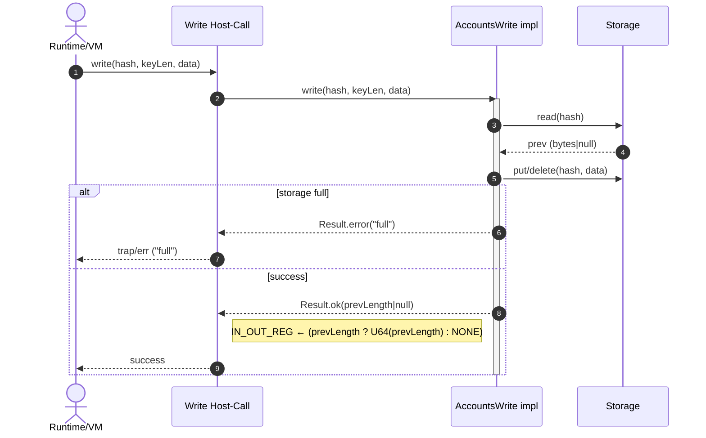

# Un-ignore davxy-0.6.6 & fix `write` host call.

## Pull Request by @tomusdrw

During debugging of 0.6.6 `traces` I've noticed that our `write` host call implementation is incorrect. It should be simply returning previous value length instead of the "snapshot length" that we had implemented.


## Comment by @coderabbitai[bot]

<!-- This is an auto-generated comment: summarize by coderabbit.ai -->
<!-- This is an auto-generated comment: skip review by coderabbit.ai -->

> [!IMPORTANT]
> ## Review skipped
> 
> Auto incremental reviews are disabled on this repository.
> 
> Please check the settings in the CodeRabbit UI or the `.coderabbit.yaml` file in this repository. To trigger a single review, invoke the `@coderabbit review` command.
> 
> You can disable this status message by setting the `reviews.review_status` to `false` in the CodeRabbit configuration file.

<!-- end of auto-generated comment: skip review by coderabbit.ai -->
<!-- walkthrough_start -->

<details>
<summary>📝 Walkthrough</summary>

<!-- This is an auto-generated comment: release notes by coderabbit.ai -->

## Summary by CodeRabbit

- New Features
  - Write operations now return the previous value length (or null) on success.
  - Gas accounting enabled for an additional test environment/version.
  - Success logs now include consumed gas.

- Tests
  - Updated tests to use the storage API for setup and cleanup.
  - Removed snapshot-length tests.

- Chores
  - Expanded accepted trace inputs and ignore lists for test runs.

- Style
  - Minor formatting cleanup with no functional impact.

<!-- end of auto-generated comment: release notes by coderabbit.ai -->
## Walkthrough
The write API across jam host-calls was changed to return the previous value length (number|null) instead of OK. Corresponding snapshot-length helpers were removed. Tests were updated accordingly. Gas-counting conditions expanded for W3F_DAVXY 0.6.6. Test runner accepted/ignored trace sets updated. Minor logging and whitespace changes added.

## Changes
| Cohort / File(s) | Summary |
| --- | --- |
| **Accounts write API and implementation**<br>`packages/jam/jam-host-calls/externalities/accumulate-externalities.ts`, `packages/jam/jam-host-calls/write.ts`, `packages/jam/jam-host-calls/test-accounts.ts` | Change write return type from `Result<OK,"full">` to `Result<number \| null,"full">`; remove snapshot-length read methods; compute and return previous value length within write; adjust interface and host-call to set IN_OUT_REG from result.ok; drop `OK` imports; remove `snapshotData` from TestAccounts and add `AccountsInfo` implementation. |
| **Tests updated for new write semantics**<br>`packages/jam/jam-host-calls/write.test.ts`, `packages/jam/jam-host-calls/externalities/accumulate-externalities.test.ts` | Replace uses of `snapshotData` with `storage`; remove tests for `readSnapshotLength`; adjust expectations for storage state and memory payload in fullness scenario. |
| **Interpreter gas toggling**<br>`packages/jam/pvm-host-calls/interpreter-instance-manager.ts` | Extend `shouldCountGas` to include `W3F_DAVXY` with `GpVersion.V0_6_6`. |
| **Test runner configuration**<br>`bin/test-runner/w3f-davxy-066.ts` | Expand accepted trace vectors to include `traces/reports-l0` and `traces/reports-l1`; enlarge ignored file list with specific report files; add explanatory comments. |
| **Logging tweak in accumulation**<br>`packages/jam/transition/accumulate/accumulate.ts` | Success log now includes consumed gas value. |
| **Whitespace only**<br>`bin/test-runner/w3f/state-transition.ts` | Inserted a blank line; no functional change. |

## Sequence Diagram(s)


## Estimated code review effort
🎯 3 (Moderate) | ⏱️ ~25 minutes

## Poem
> A nibble, a byte, a hop through the night—  
> I wrote, then I measured the length just right.  
> Gas now counts where DAVXY sings,  
> Logs tell how much the burner brings.  
> Tests burrowed paths both old and new—  
> Thump goes my review, and onward we chew! 🐇💾

</details>

<!-- walkthrough_end -->
<!-- internal state start -->


<!-- DwQgtGAEAqAWCWBnSTIEMB26CuAXA9mAOYCmGJATmriQCaQDG+Ats2bgFyQAOFk+AIwBWJBrngA3EsgEBPRvlqU0AgfFwA6NPEgQAfACgjoCEejqANiS4BVDGHhEM+CiUi00EgB6ywABg0ANiDIADN4L0gAdwp1N3hmbis2DFxqeHwMDQMAOWxmAUouAFZAgE4DGwAlABkuWFxcbkQOAHpWonVYbAENJmZWgDELbFDQ2RqVRFbcWW4SQooKWVbubAsLVtKKm0QiyAJmbERaCiiDAGV8bAoGNwEqDAZYLlxaMA9vXz9AwINoNAUUi4SAPTDPLjMbQYS5pXDHLj4eYwqokCTwEhRSgtSAGSaFCw4gwAYVc1Do6E4kAATH5qcV/AAOMDUxnQPxlDilLmBABaRn0xnAUDI9HwoRwBGIZGUNHo/RSVN4/GEonEUhk8iYSioqnUWh0gpMUDgqFQmElhFI5CocoUrHYXCoUUgiHyUOWoK1imUes02l0YEMQtMBjUGBm0lwYAo2AwNtaUQAzKEPp4fP5fhpcC0DAAiAsGADERcgAEEAJLSm3k+hu1iA+TixiwTCkRACyAAUS8NAwSnoaAYd24dtwVDukCkYhcyAIKCeIyUBwn0larm4LhzYAsfnQ/ZXQ7XG63iB3AEYF+haLR1BksPPx0fpog0KEKPgrPv6E+7tNQmgGwCEOADW2RQD23CYAOBywPETguBSFhICC74sJAADaebWtISAaEIiCZHmAC6Bz4OgkAWICpCuiQIK4K2IKAYRkAkF4DBLtIkAYPklDXMgiDzAw8DhAwYTwFYyBxjqh5/uuJCbhQ267t+snHgpp4XgANFeaA3nemRkZAOGIHhBGZOB5Y3hS8AYMh5CsV4SSYNQLjeg6qTIM44gYEQsHUJAzD4IgIInkpZ67q0FiXgBEnuNgbjzkQaDILeYyUGQf4ANywW4yEhRS4SSZAG6uHsqSwcFbggc4UT2FBiCmb5lI0IkOZGY4ziuJZcBuK4UK2bZfkWPgnRic2DGJVGJVxjaC4SPgDDpIZAAUk0RktuDPAAlCgUlPK2vl0DlmQWPIk3oMOClyq0nWIfKmThEQNzLRgyBYq4gWKCJGK0NkRjFqWZYWDQtr3nO5EXUoHGAq9yDNmxil2i4PA9MhYnsHe0idjk5GI1udCrGj8BiWWAAKFaup11A3G4zxttI/1diFCS1goy6uOimKsWMW5cAAsnQ8D5PmhYGBAYBGOGkYhTGs2UImKatCF5JgE+b0GVkOYcKLeaA+WVY4baFL1h6TYSvTR0duLkAVm9lB2mgoJURgIGUbZbhvqD9prD5fkXbwJBgCrNAlfg+Agq2iCwJAK1MG9oXhyCAC8PCuBccIkBowEMCBooaMCVRJwAEilsArdtWW7dBoIkKEiG5e4JAKV2ACO2CAT7gJIBZkC42EcZiPeneW+2OWFK26IuDp8fjp+YQjVEOk15QH58IdtD2X5g+HaQf0A/rwOg3DRlQ6IVFg5k8MSvjSkUijawCOjrGpFj1tQP3o9cfOt83Y/z+Y1mFTJwNMypMxZlCO02o+pogxC6Ou9clJcBqPgc4BY9bi1DFBXOaB2ytCEGgAYBDmBgFgMFaMS0NjTDYqDDAgE36tCHAwfI6xVY0MoHQ5C4hGY0BCtmXM6DD6GxlMbOs7pGz8AtrvbGNtURBSkD+OCBxppujiGEFGZJaAXDoc0MhuAahkCIAxSA0lKDlmHCwqiNALiUHRHcHstD6HcOQLZS6zCjhWKDuwignC37ZijPwjQMAlFKCsHaJ+i03az2hBSXAURIZRhxJooajdEA6OjhHSihjjFoWYK6AgVAaI1ykLEcYKSrC+WMfHUyBUnjyC9mYp2MQ4hBP7rwRQ2Ah6GWgfwPg/8SblgpsAuh8IyrRAyi2BmtATp2XOtNJgJTcFuCiClEqdBOl0H+iWXEh8QaynBqfEJ59YbiCvpIxySN759OJhjV+zicaZDcCtZwFyCa0CJk/AZpkQGjK4l/Wg21wHiEgRSHpnM4E80QVSQWt4RaCMwZLAw2CQJLOmMQ/BhDSHkLAJQwkrRvG+OcYwixHi2G9g4U4jEiB+E60Edsys1ZZQm3EZ6ZsX937BLcP00mQzmxlhJawmgDiKVcKpRoZpod2UoHaq4UZD45huFyZAVEboQbAAAPIAGkdJ5lCOsCweY9BGRVesXAwAeIFDMQAH24vqnVeqNiGtUrVNZcq5xKMDlPY4+SXBLKyZUmOK0UY8Q2CgCUk1PorK8uRXgGQ+ASEAglauoRvbYG4B4P2PrClZ05YFOiZC6ziFDWmjNXEQq+tIK0PAEkkCvSpswCSgIzo6QEHgaVAlOl/mQFBWQI09J7TWc5O49AohdEbrGlGFSjGwH+iaJRtlHEWEgHBCw8w+CaO0WgXREcDEBpWnnWQu1UD9XwAooJvV/XToHS6nUkgKS3lcGIM6YQPx5IDq4MAEq3AJpGMsroriv2qVlTccgg5u2AhBBNJRX6ADkHarqNR4GgXt+A9KztzbPD8S7QiL3UXwQD/VoQ4n6L7OmNxXAVR/QlHSShQYNocnpd5J6pDL1oEIY4IJy3ZpMUW2tpysA1zkLwnSa6akgnZTpdarqQPjvBfxS9xig18BDRYQF3Ylgow3lvPDWa/XVvynW2KIwxmEdssgdETsTUgw0KvFwK1dX6rzDpDQLnAUH3pXsy+b1DluGhhfE+CMnJvN6ajT5tzxD3JtoLBiihhmgLcCW2sXAAAGX790kFkFwDOFaSCaoyzpZ0eXZAACFZC8NsIEAALDR6gaAuCld4cVkaAhIA2pU9tLgVmzVavtY5vQyWrww0Q8l/l7jBUkGFT4yl0gBuuOS8i1FGKiGYrIbLXF1DyVTdFWuJhliyWLr8TmAbgAkwkgKl2INB0uZcgNl7NRWCtoCiEVhr0gKvVfcLV+rZXpBNcEK121GwOvKukKa81+RFj/ZU71x1/XOzRYLWs+RdAUsbvSXo3d06rtZYKUsorQOLUQ7a/q2bWAhvIBGwKzxk3CVUpJ2dhbeD0XEKxWtwCeKCXTemLt0lNAwAc+29So7RhmbArZmC2B3MEF80gMXRwsBdYCiwaBRbTOVvYvWzLaMTDrieRpQr+lwiax2lNhItl0iOXQCjKNnX7UXUJCSCQRUyBrdxhzHbeuul9L8aMi7zyKD8AgTTTpX3OZUR6WXgeEPiAADqF2SA6W+b45q3K3HSAhrRCgdj4gYA9xZ8xTBXeIHd/gSycjT2xI9Tc10aOI4ABFatpyRA7WQOkSDIXo+kZqXG/XNjXcHWxJM3BpK3RkkEGa0CWUA+TSm/ynR0Rk7MeYJj03kmQEqrrGrtWQAczD41IO1UE+tQDiw0ODV6HPUotgMX6AuqWqOWm7quVye9VxikVG8rZMDZ63ahREEJZX5mt3kUgeMBj4t2pzAAPwaBTrGIQEQHH4LgFT9rNhao9TQZx4oCJDJDsB1ouqaKP5pywLybv6xzf5pxxpGRHBwgpJAHx4vwqDaYXTkAuigFYDv6l6O7l6KJcpV6o4j7o6f4rRRwvCQBNZoB5zUgCClzRz47g5H4qZ5rX46RRAIDPCEFeqIDPpKDIgwSGTD7bq4D15pCWQViJBbjXjsYFQ/jkSnBIiQBapXgAQLR8DNjHApJdboAjTkD/S9R7CTJWxfRpTnSV5haug3AASTiAgkBOxxxUSIb27YGeSqTT7SY+IHAKqIDVwgGcFSDV78ERw7if5rKeL0AjRjTKEIBfiBx7CZ4pKaJRThyB7cC1yTwUE1w1FZ4OA57kRMJp7/RGAebHz8bp5nwwxebXyvJ3xijXKhGAJUqdjEhxECTUy/LL6lq0Apa/yMBLEwBW7Dg24uJYGO7sDO77GF7+5NHB5nGeRh60BXEF6eSx5xD3EHHF507zbK6M6EJLYs4UJs7TC8Ja7XE5j8LJY2xkxV7tJrpALMbI7068HRG0CnTyD6Gj5GF1aQD8ymrwD8xbrAAYQ2K1F3AVh3GiFUQSFSFlzEQ6QvaIC/YtZE4bD9ZXgfE4JfHLYkKrZ/FUKa5gDa6F6gnglV5X4I6J7xZrFJZnZpbCH1bkkkCSHSGwA6QAD6hWGWu6b2NWaQX2jWzWkO+qQOG+PW2+DqZ+J2UpceQhZcsp4h8plJ0cKpapEwZAmpH22poh32dJepjJqmnW++Zqh+fAPpp+hq7xDOa4qunJ6u/xvJ/JuuQuUAEJoRIpsWsJGxZ2fBBhGODEVp0cNpFJipshlqQZx+YZnxEZ3xzOXJOKMZgJfJwJguiAYJBgIurMUCPoayXM8CvMSCMucuCuCKRg4ZaKlZaurOPJX6/ifC2s+uQMhuTKYiDYrKUiDMHKqIQ6FIbOJiewExcZIJqJei6JGgewuAK0LmGgu0o6xie51KtBx5dEZ5rml0H4iGF0b4oQaosSiSy8yETgKSgcfOXgKEKS4+tE8IzRV5McF0tBgyFYHBG53BiOp6nczYoFSqB5deDekFSFP6U48ATsMFriF0gJ/k4mVggIqUDezyBpJhD4SitBYAppyiIUOkiWY4l+nBnoPafa1hFEXhpAfAIUsQzU9mK6I00QLgFgtAIAtsHaa6lEmQfkJS8gylU4lAsgGgeYWRha90jcn49AoFpifAN5x5OONEv+DcF0X6OUDEqAUqAc2KbEog1aehZlWc4+x58AAAXp7I1A7PeC+uhHuPOOeJZOqoshsJJoktxKgvwGuuSPwAJg2aZTljpgBWxMBc1KBTXMxsxBHvQGwEFMsK0LPOwNubEuRKZDzoqvquQPEcgOwv2JufsRQLeL5GdP0bskMQco+EcmMQFjfEFlMSFinnMTIh/I8rHC8vZXjENX/FXmKb8pkUCm2aCh2eCpLj2dCkLHCmLBLEOeWSORyb8TWROXHnrnSnOYyqImEUuebP4e2J2Emc/AupQBEXTNIlwFHk8TQOKhgXgfPmAcDqqgGXISWVDiaX1ogTQMgRKEaVvjvmfgntTIwYxHpfFd7rIBiFJQQZ6hkN6iQTAYGsGgaYlWEQhtSkKaESka4LQJ0vxlwBepmaPtmTHCmWKFgN9RgVGjhcdOofjcgFuu0kODHM2Mks1O+kQd6kTbRFBMbM+qgG3gkLZLWJZD9W4FpmYhPJ4BQWxXCReurcutGaGi6scFxGVKahoAHoFW+ugXEBXIwFufOJuGsJ4o3BWDkMqeqjYNAMqVUF2AAOKxw5Dqo5BdhhrH46QRxwRnBICJRKIkHxwlJjjkQ2BVbbQFYKRUTCQS0erP7IDM0CEBpIYMQmFmFKTKwrG0wWEcZO6M1KIOGL7xDRoKVHR9IQbnJWXnXtQp6LXV0rT0JOAUjYUXQb6Bn6mRWQ276sHpHzBuZQC16LS8SpCvQlUsBO6eGdT61KK2YUDyRyq0RQivwMAuJ0VuBc1qKvUUDvX2iKgSkp1rI4ZqipEYApKS0aFTiJof7F0qFkAxUghkDXBEAxzAQux3CdWDH7JnK9W+bHLjHnK/xXKhYAJ3LzFRb5qxZ92fR63pnnb20ylkm2kKllwJ5uVFas2unj46k/benH6Gn+mb4hl6BZTvEX00Dml4OXYENiEFkkO6akDkOf6UOfYem6l/Y+n0Mg1g7FkT0n5T1n4sMsnDlLY/HVka6TkJmYkYN1hV2fRpko6ImbpZmCHcNynEMyFcDj0+mKNKoU4PE5jq1llskVnHVqMxkaNNnC4QJi7rUS7dlQoCw7XMADn7VIqHUqPcASBRnjl4pX2BygxdEqxPBBxH1LIUAXWFgG7XVswm7LkPUyJljWSDjcTczxy3je7zgZLrC0DEg24B2rKuJ2ygzxOUB2xJN3C4l0ICUKAJyxgzgUBcC2QcTYDLjR5JiDDKm15lgABqAAGgAJrRBjoB3cDTPYj3gaDTN+DKmBA7MX6K1OTQTIDJTID2MpIrR3SuBtPjj033j1PICpwASEgkC7TzjMQ9HcBJDyCIKkXMWcbYBxCtAlKmSZA6SuKMaaw+aOSZV+RlOazIArRbM7PKkADsIWAAUmWPzLXjYDkGWEs8Yki7s8UGpv3NHWYmUQMg/FXikeyjZUol/Ilc+u+WqO9HBFgCcwoK7ikorXQk/IVMGpiM+gshlPQGQOiB+BgHff0OGHDBA0DJ5ifDA03P1cMQg3NUg6Nag+NX3I8l46Lu2RzH45CtLjCsLME/CqE8o+iurKZPxsSmNp4g63tr9TOZdQbNk8biyvdeyp2OqrMo3GUXmo1D3gJuTV2g6m4i6wFTzWgNgEQIqJspAGTPnc2mTW6BTY3D0mUXvNvqNtG3oZ2mnpGz8wACQADeHRg+JJAAvppbqy6OoApUQMgHmPmzzgFRmxG+sDphW1W8SbQHW5ALU29LxOmRWxbdZgHn0FfGO/czW3mEEsDEuuS3wNrVPOuo7kRqkoQtYI3LvSXTHKgDvFMvlY3Hqk8N7izKGqwQXf6VbW7IWxTa0pVbo1xCjJhp+IxbhuyvK+WIq2q8q35icgcoFpctMcgwMmNRyp/ObkZIg+8r3W+6lHRJ+fvC2d44azAl2Sa72SgmgntUGCGCKAeM2HG1KEbD4x5FSM6LdWbF6OzL6GoP6IaER8aLfeoMqfALQIgKqX43QMqSrEpIGMGOx9ZCi1VnXEmD8B+dSIELQGUMUMUJVtSOeMp+UNSKEH4LQIEGgOeCQIyIEBJ+eNSCJ8Rxx7gFxzx3x12QJ6KCJ0AA= -->

<!-- internal state end -->
<!-- tips_start -->

---


<details>
<summary>🪧 Tips</summary>

### Chat

There are 3 ways to chat with [CodeRabbit](https://coderabbit.ai?utm_source=oss&utm_medium=github&utm_campaign=FluffyLabs/typeberry&utm_content=569):

- Review comments: Directly reply to a review comment made by CodeRabbit. Example:
  - `I pushed a fix in commit <commit_id>, please review it.`
  - `Open a follow-up GitHub issue for this discussion.`
- Files and specific lines of code (under the "Files changed" tab): Tag `@coderabbit` in a new review comment at the desired location with your query.
- PR comments: Tag `@coderabbit` in a new PR comment to ask questions about the PR branch. For the best results, please provide a very specific query, as very limited context is provided in this mode. Examples:
  - `@coderabbit gather interesting stats about this repository and render them as a table. Additionally, render a pie chart showing the language distribution in the codebase.`
  - `@coderabbit read the files in the src/scheduler package and generate a class diagram using mermaid and a README in the markdown format.`

### Support

Need help? Create a ticket on our [support page](https://www.coderabbit.ai/contact-us/support) for assistance with any issues or questions.

### CodeRabbit Commands (Invoked using PR/Issue comments)

Type `@coderabbit help` to get the list of available commands.

### Other keywords and placeholders

- Add `@coderabbit ignore` or `@coderabbitai ignore` anywhere in the PR description to prevent this PR from being reviewed.
- Add `@coderabbit summary` or `@coderabbitai summary` to generate the high-level summary at a specific location in the PR description.
- Add `@coderabbit` or `@coderabbitai` anywhere in the PR title to generate the title automatically.

### Status, Documentation and Community

- Visit our [Status Page](https://status.coderabbit.ai) to check the current availability of CodeRabbit.
- Visit our [Documentation](https://docs.coderabbit.ai) for detailed information on how to use CodeRabbit.
- Join our [Discord Community](http://discord.gg/coderabbit) to get help, request features, and share feedback.
- Follow us on [X/Twitter](https://twitter.com/coderabbitai) for updates and announcements.

</details>

<!-- tips_end -->


## Comment by @github-actions[bot]


<details>
<summary>View all</summary>

| File | Benchmark | Ops |  |
|------|-----------|-----|--|
| [bytes/hex-to.ts[0]](../blob/1db722d272df69cf43d2a98c006888afbb63485d//_work/typeberry-1/typeberry/typeberry/benchmarks/bytes/hex-to.ts) | number toString + padding | 327337.82 ±0.17% | fastest ✅ |
| [bytes/hex-to.ts[1]](../blob/1db722d272df69cf43d2a98c006888afbb63485d//_work/typeberry-1/typeberry/typeberry/benchmarks/bytes/hex-to.ts) | manual | 16542.82 ±0.34% | 94.95% slower |
| [collections/map-set.ts[0]](../blob/1db722d272df69cf43d2a98c006888afbb63485d//_work/typeberry-1/typeberry/typeberry/benchmarks/collections/map-set.ts) | 2 gets + conditional set | 71868.53 ±0.27% | fastest ✅ |
| [collections/map-set.ts[1]](../blob/1db722d272df69cf43d2a98c006888afbb63485d//_work/typeberry-1/typeberry/typeberry/benchmarks/collections/map-set.ts) | 1 get 1 set | 42525.55 ±0.28% | 40.83% slower |
| [codec/bigint.decode.ts[0]](../blob/1db722d272df69cf43d2a98c006888afbb63485d//_work/typeberry-1/typeberry/typeberry/benchmarks/codec/bigint.decode.ts) | decode custom | 176896475.81 ±2.88% | fastest ✅ |
| [codec/bigint.decode.ts[1]](../blob/1db722d272df69cf43d2a98c006888afbb63485d//_work/typeberry-1/typeberry/typeberry/benchmarks/codec/bigint.decode.ts) | decode bigint | 111632264.73 ±2.16% | 36.89% slower |
| [codec/encoding.ts[0]](../blob/1db722d272df69cf43d2a98c006888afbb63485d//_work/typeberry-1/typeberry/typeberry/benchmarks/codec/encoding.ts) | manual encode | 3044540.28 ±0.37% | 16.99% slower |
| [codec/encoding.ts[1]](../blob/1db722d272df69cf43d2a98c006888afbb63485d//_work/typeberry-1/typeberry/typeberry/benchmarks/codec/encoding.ts) | int32array encode | 3667771.58 ±0.13% | fastest ✅ |
| [codec/encoding.ts[2]](../blob/1db722d272df69cf43d2a98c006888afbb63485d//_work/typeberry-1/typeberry/typeberry/benchmarks/codec/encoding.ts) | dataview encode | 3611889.62 ±0.44% | 1.52% slower |
| [math/count-bits-u32.ts[0]](../blob/1db722d272df69cf43d2a98c006888afbb63485d//_work/typeberry-1/typeberry/typeberry/benchmarks/math/count-bits-u32.ts) | standard method | 85621038.45 ±1.57% | 63.72% slower |
| [math/count-bits-u32.ts[1]](../blob/1db722d272df69cf43d2a98c006888afbb63485d//_work/typeberry-1/typeberry/typeberry/benchmarks/math/count-bits-u32.ts) | magic | 236023644.83 ±6.52% | fastest ✅ |
| [math/count-bits-u64.ts[0]](../blob/1db722d272df69cf43d2a98c006888afbb63485d//_work/typeberry-1/typeberry/typeberry/benchmarks/math/count-bits-u64.ts) | standard method | 10424998.41 ±0.32% | 88.93% slower |
| [math/count-bits-u64.ts[1]](../blob/1db722d272df69cf43d2a98c006888afbb63485d//_work/typeberry-1/typeberry/typeberry/benchmarks/math/count-bits-u64.ts) | magic | 94198199.27 ±1.46% | fastest ✅ |
| [math/mul_overflow.ts[0]](../blob/1db722d272df69cf43d2a98c006888afbb63485d//_work/typeberry-1/typeberry/typeberry/benchmarks/math/mul_overflow.ts) | multiply and bring back to u32 | 272581839.21 ±5.36% | fastest ✅ |
| [math/mul_overflow.ts[1]](../blob/1db722d272df69cf43d2a98c006888afbb63485d//_work/typeberry-1/typeberry/typeberry/benchmarks/math/mul_overflow.ts) | multiply and take modulus | 257884677.95 ±5.76% | 5.39% slower |
| [math/switch.ts[0]](../blob/1db722d272df69cf43d2a98c006888afbb63485d//_work/typeberry-1/typeberry/typeberry/benchmarks/math/switch.ts) | switch | 244751902.15 ±6.48% | 0.38% slower |
| [math/switch.ts[1]](../blob/1db722d272df69cf43d2a98c006888afbb63485d//_work/typeberry-1/typeberry/typeberry/benchmarks/math/switch.ts) | if | 245674543.38 ±6.53% | fastest ✅ |
| [math/add_one_overflow.ts[0]](../blob/1db722d272df69cf43d2a98c006888afbb63485d//_work/typeberry-1/typeberry/typeberry/benchmarks/math/add_one_overflow.ts) | add and take modulus | 262909018.68 ±5.29% | fastest ✅ |
| [math/add_one_overflow.ts[1]](../blob/1db722d272df69cf43d2a98c006888afbb63485d//_work/typeberry-1/typeberry/typeberry/benchmarks/math/add_one_overflow.ts) | condition before calculation | 242551220.59 ±6.53% | 7.74% slower |
| [codec/bigint.compare.ts[0]](../blob/1db722d272df69cf43d2a98c006888afbb63485d//_work/typeberry-1/typeberry/typeberry/benchmarks/codec/bigint.compare.ts) | compare custom | 242301645.51 ±6.68% | 1.07% slower |
| [codec/bigint.compare.ts[1]](../blob/1db722d272df69cf43d2a98c006888afbb63485d//_work/typeberry-1/typeberry/typeberry/benchmarks/codec/bigint.compare.ts) | compare bigint | 244910328.73 ±7.06% | fastest ✅ |
| [codec/decoding.ts[0]](../blob/1db722d272df69cf43d2a98c006888afbb63485d//_work/typeberry-1/typeberry/typeberry/benchmarks/codec/decoding.ts) | manual decode | 22681382.78 ±0.58% | 86.01% slower |
| [codec/decoding.ts[1]](../blob/1db722d272df69cf43d2a98c006888afbb63485d//_work/typeberry-1/typeberry/typeberry/benchmarks/codec/decoding.ts) | int32array decode | 162120493.12 ±3.19% | fastest ✅ |
| [codec/decoding.ts[2]](../blob/1db722d272df69cf43d2a98c006888afbb63485d//_work/typeberry-1/typeberry/typeberry/benchmarks/codec/decoding.ts) | dataview decode | 158975679.11 ±3.66% | 1.94% slower |
| [bytes/hex-from.ts[0]](../blob/1db722d272df69cf43d2a98c006888afbb63485d//_work/typeberry-1/typeberry/typeberry/benchmarks/bytes/hex-from.ts) | parse hex using `Number` with NaN checking | 140176.87 ±0.64% | 84.49% slower |
| [bytes/hex-from.ts[1]](../blob/1db722d272df69cf43d2a98c006888afbb63485d//_work/typeberry-1/typeberry/typeberry/benchmarks/bytes/hex-from.ts) | parse hex from char codes | 903960.75 ±0.08% | fastest ✅ |
| [bytes/hex-from.ts[2]](../blob/1db722d272df69cf43d2a98c006888afbb63485d//_work/typeberry-1/typeberry/typeberry/benchmarks/bytes/hex-from.ts) | parse hex from string nibbles | 562617.82 ±0.23% | 37.76% slower |
| [hash/index.ts[0]](../blob/1db722d272df69cf43d2a98c006888afbb63485d//_work/typeberry-1/typeberry/typeberry/benchmarks/hash/index.ts) | hash with numeric representation | 193.39 ±0.05% | 27.05% slower |
| [hash/index.ts[1]](../blob/1db722d272df69cf43d2a98c006888afbb63485d//_work/typeberry-1/typeberry/typeberry/benchmarks/hash/index.ts) | hash with string representation | 121.61 ±0.15% | 54.13% slower |
| [hash/index.ts[2]](../blob/1db722d272df69cf43d2a98c006888afbb63485d//_work/typeberry-1/typeberry/typeberry/benchmarks/hash/index.ts) | hash with symbol representation | 180.81 ±0.5% | 31.79% slower |
| [hash/index.ts[3]](../blob/1db722d272df69cf43d2a98c006888afbb63485d//_work/typeberry-1/typeberry/typeberry/benchmarks/hash/index.ts) | hash with uint8 representation | 161.32 ±0.62% | 39.15% slower |
| [hash/index.ts[4]](../blob/1db722d272df69cf43d2a98c006888afbb63485d//_work/typeberry-1/typeberry/typeberry/benchmarks/hash/index.ts) | hash with packed representation | 265.09 ±0.45% | fastest ✅ |
| [hash/index.ts[5]](../blob/1db722d272df69cf43d2a98c006888afbb63485d//_work/typeberry-1/typeberry/typeberry/benchmarks/hash/index.ts) | hash with bigint representation | 195.12 ±0.42% | 26.39% slower |
| [hash/index.ts[6]](../blob/1db722d272df69cf43d2a98c006888afbb63485d//_work/typeberry-1/typeberry/typeberry/benchmarks/hash/index.ts) | hash with uint32 representation | 205.1 ±0.21% | 22.63% slower |
| [logger/index.ts[0]](../blob/1db722d272df69cf43d2a98c006888afbb63485d//_work/typeberry-1/typeberry/typeberry/benchmarks/logger/index.ts) | console.log with string concat | 7011176.8 ±57.93% | fastest ✅ |
| [logger/index.ts[1]](../blob/1db722d272df69cf43d2a98c006888afbb63485d//_work/typeberry-1/typeberry/typeberry/benchmarks/logger/index.ts) | console.log with args | 1034903.65 ±84.48% | 85.24% slower |
| [codec/view_vs_object.ts[0]](../blob/1db722d272df69cf43d2a98c006888afbb63485d//_work/typeberry-1/typeberry/typeberry/benchmarks/codec/view_vs_object.ts) | Get the first field from Decoded | 376639.6 ±1.8% | 14.78% slower |
| [codec/view_vs_object.ts[1]](../blob/1db722d272df69cf43d2a98c006888afbb63485d//_work/typeberry-1/typeberry/typeberry/benchmarks/codec/view_vs_object.ts) | Get the first field from View | 85416.57 ±1.91% | 80.67% slower |
| [codec/view_vs_object.ts[2]](../blob/1db722d272df69cf43d2a98c006888afbb63485d//_work/typeberry-1/typeberry/typeberry/benchmarks/codec/view_vs_object.ts) | Get the first field as view from View | 104124.52 ±0.4% | 76.44% slower |
| [codec/view_vs_object.ts[3]](../blob/1db722d272df69cf43d2a98c006888afbb63485d//_work/typeberry-1/typeberry/typeberry/benchmarks/codec/view_vs_object.ts) | Get two fields from Decoded | 441935.81 ±0.25% | fastest ✅ |
| [codec/view_vs_object.ts[4]](../blob/1db722d272df69cf43d2a98c006888afbb63485d//_work/typeberry-1/typeberry/typeberry/benchmarks/codec/view_vs_object.ts) | Get two fields from View | 79748.86 ±1.63% | 81.95% slower |
| [codec/view_vs_object.ts[5]](../blob/1db722d272df69cf43d2a98c006888afbb63485d//_work/typeberry-1/typeberry/typeberry/benchmarks/codec/view_vs_object.ts) | Get two fields from materialized from View | 158430.28 ±2.53% | 64.15% slower |
| [codec/view_vs_object.ts[6]](../blob/1db722d272df69cf43d2a98c006888afbb63485d//_work/typeberry-1/typeberry/typeberry/benchmarks/codec/view_vs_object.ts) | Get two fields as views from View | 66780.29 ±1.23% | 84.89% slower |
| [codec/view_vs_object.ts[7]](../blob/1db722d272df69cf43d2a98c006888afbb63485d//_work/typeberry-1/typeberry/typeberry/benchmarks/codec/view_vs_object.ts) | Get only third field from Decoded | 349636.67 ±1.76% | 20.89% slower |
| [codec/view_vs_object.ts[8]](../blob/1db722d272df69cf43d2a98c006888afbb63485d//_work/typeberry-1/typeberry/typeberry/benchmarks/codec/view_vs_object.ts) | Get only third field from View | 98402.2 ±2.44% | 77.73% slower |
| [codec/view_vs_object.ts[9]](../blob/1db722d272df69cf43d2a98c006888afbb63485d//_work/typeberry-1/typeberry/typeberry/benchmarks/codec/view_vs_object.ts) | Get only third field as view from View | 103944.29 ±0.35% | 76.48% slower |
| [codec/view_vs_collection.ts[0]](../blob/1db722d272df69cf43d2a98c006888afbb63485d//_work/typeberry-1/typeberry/typeberry/benchmarks/codec/view_vs_collection.ts) | Get first element from Decoded | 27490.72 ±0.35% | 57.45% slower |
| [codec/view_vs_collection.ts[1]](../blob/1db722d272df69cf43d2a98c006888afbb63485d//_work/typeberry-1/typeberry/typeberry/benchmarks/codec/view_vs_collection.ts) | Get first element from View | 64607.31 ±2.17% | fastest ✅ |
| [codec/view_vs_collection.ts[2]](../blob/1db722d272df69cf43d2a98c006888afbb63485d//_work/typeberry-1/typeberry/typeberry/benchmarks/codec/view_vs_collection.ts) | Get 50th element from Decoded | 20674.5 ±2.07% | 68% slower |
| [codec/view_vs_collection.ts[3]](../blob/1db722d272df69cf43d2a98c006888afbb63485d//_work/typeberry-1/typeberry/typeberry/benchmarks/codec/view_vs_collection.ts) | Get 50th element from View | 29797.81 ±3.36% | 53.88% slower |
| [codec/view_vs_collection.ts[4]](../blob/1db722d272df69cf43d2a98c006888afbb63485d//_work/typeberry-1/typeberry/typeberry/benchmarks/codec/view_vs_collection.ts) | Get last element from Decoded | 27528.67 ±0.37% | 57.39% slower |
| [codec/view_vs_collection.ts[5]](../blob/1db722d272df69cf43d2a98c006888afbb63485d//_work/typeberry-1/typeberry/typeberry/benchmarks/codec/view_vs_collection.ts) | Get last element from View | 26582.96 ±0.34% | 58.85% slower |
| [bytes/compare.ts[0]](../blob/1db722d272df69cf43d2a98c006888afbb63485d//_work/typeberry-1/typeberry/typeberry/benchmarks/bytes/compare.ts) | Comparing Uint32 bytes | 21157.35 ±0.22% | fastest ✅ |
| [bytes/compare.ts[1]](../blob/1db722d272df69cf43d2a98c006888afbb63485d//_work/typeberry-1/typeberry/typeberry/benchmarks/bytes/compare.ts) | Comparing raw bytes | 19718.42 ±3.26% | 6.8% slower |
| [hash/blake2b.ts[0]](../blob/1db722d272df69cf43d2a98c006888afbb63485d//_work/typeberry-1/typeberry/typeberry/benchmarks/hash/blake2b.ts) | hasher with simple allocator | 0.0454 ±1.57% | fastest ✅ |
| [hash/blake2b.ts[1]](../blob/1db722d272df69cf43d2a98c006888afbb63485d//_work/typeberry-1/typeberry/typeberry/benchmarks/hash/blake2b.ts) | hasher with page allocator | 0.0453 ±1.76% | 0.22% slower |
| [collections/map_vs_sorted.ts[0]](../blob/1db722d272df69cf43d2a98c006888afbb63485d//_work/typeberry-1/typeberry/typeberry/benchmarks/collections/map_vs_sorted.ts) | Map | 327036.29 ±0.11% | fastest ✅ |
| [collections/map_vs_sorted.ts[1]](../blob/1db722d272df69cf43d2a98c006888afbb63485d//_work/typeberry-1/typeberry/typeberry/benchmarks/collections/map_vs_sorted.ts) | Map-array | 102802.86 ±0.34% | 68.57% slower |
| [collections/map_vs_sorted.ts[2]](../blob/1db722d272df69cf43d2a98c006888afbb63485d//_work/typeberry-1/typeberry/typeberry/benchmarks/collections/map_vs_sorted.ts) | Array | 49569.61 ±6.02% | 84.84% slower |
| [collections/map_vs_sorted.ts[3]](../blob/1db722d272df69cf43d2a98c006888afbb63485d//_work/typeberry-1/typeberry/typeberry/benchmarks/collections/map_vs_sorted.ts) | SortedArray | 193859.8 ±0.61% | 40.72% slower |
| [crypto/ed25519.ts[0]](../blob/1db722d272df69cf43d2a98c006888afbb63485d//_work/typeberry-1/typeberry/typeberry/benchmarks/crypto/ed25519.ts) | native crypto | 5.02 ±20.77% | 83.22% slower |
| [crypto/ed25519.ts[1]](../blob/1db722d272df69cf43d2a98c006888afbb63485d//_work/typeberry-1/typeberry/typeberry/benchmarks/crypto/ed25519.ts) | wasm lib | 10.65 ±0.05% | 64.39% slower |
| [crypto/ed25519.ts[2]](../blob/1db722d272df69cf43d2a98c006888afbb63485d//_work/typeberry-1/typeberry/typeberry/benchmarks/crypto/ed25519.ts) | wasm lib batch | 29.91 ±0.44% | fastest ✅ |
</details>


### Benchmarks summary: 63/63 OK ✅

<!-- thollander/actions-comment-pull-request "benchmarks" -->


## Comment by @coderabbitai[bot]

_⚠️ Potential issue_

**Test no longer verifies deletion of an existing value**

You pre-delete the key before executing the write-with-zero-length, so the test does not exercise the “remove existing entry” path. Remove the pre-deletion.  

Apply:

```diff
-  accounts.storage.set(BytesBlob.blobFromString("hello world!"), serviceId, hash);
-  accounts.storage.set(null, serviceId, hash);
+  accounts.storage.set(BytesBlob.blobFromString("hello world!"), serviceId, hash);
```

<!-- suggestion_start -->

<details>
<summary>📝 Committable suggestion</summary>

> ‼️ **IMPORTANT**
> Carefully review the code before committing. Ensure that it accurately replaces the highlighted code, contains no missing lines, and has no issues with indentation. Thoroughly test & benchmark the code to ensure it meets the requirements.

```suggestion
     // … existing setup …
-    accounts.storage.set(BytesBlob.blobFromString("hello world!"), serviceId, hash);
    // Only seed the entry; let the write-with-zero-length call exercise removal
    accounts.storage.set(BytesBlob.blobFromString("hello world!"), serviceId, hash);
     // … continue with invoking the write-with-zero-length and assertions …
```

</details>

<!-- suggestion_end -->

<details>
<summary>🤖 Prompt for AI Agents</summary>

```
In packages/jam/jam-host-calls/write.test.ts around lines 131 to 132, the test
pre-deletes the key with accounts.storage.set(null, serviceId, hash) which
prevents exercising the “remove existing entry” path; remove that pre-deletion
call so the test leaves an existing value in storage and then runs the
write-with-zero-length to verify the delete behavior.
```

</details>

<!-- fingerprinting:phantom:medusa:chinchilla -->

<!-- This is an auto-generated comment by CodeRabbit -->


## Comment by @coderabbitai[bot]

_💡 Verification agent_

<details>
<summary>🧩 Analysis chain</summary>

**Gas counting enabled for W3F_DAVXY v0.6.6 — looks correct; verify suite/version overrides are applied in runner.**

Ensure the test runner sets Compatibility.overrideSuite(TestSuite.W3F_DAVXY) and Compatibility.override(GpVersion.V0_6_6); otherwise this branch won’t trigger.

---

🏁 Script executed:

```shell
#!/bin/bash
# Verify suite/version overrides for W3F_DAVXY 0.6.6 are set by any test runner.
rg -nP 'Compatibility\\.(overrideSuite|override)\\(' -C2 bin/test-runner | sed -n '1,200p'
# Check any references of W3F_DAVXY suite and 0.6.6 version in runner files.
rg -nP 'W3F_DAVXY|V0_6_6' -C2 bin/test-runner
```

Length of output: 1181

---

🏁 Script executed:

```shell
#!/bin/bash
# Search for Compatibility.overrideSuite calls in test-runner
rg -n "Compatibility\\.overrideSuite" -C3 bin/test-runner
# Search for generic Compatibility.override calls in test-runner
rg -n "Compatibility\\.override\\(" -C3 bin/test-runner
```

Length of output: 114

---


</details>

**Add Compatibility overrides for W3F_DAVXY v0.6.6 in test‐runner**  
bin/test-runner/index.ts does not call Compatibility.overrideSuite(TestSuite.W3F_DAVXY) or Compatibility.override(GpVersion.V0_6_6); add these before the W3F_DAVXY branch to ensure the gas-counting code path is activated.

<details>
<summary>🤖 Prompt for AI Agents</summary>

```
In packages/jam/pvm-host-calls/interpreter-instance-manager.ts around lines 12
to 15, the W3F_DAVXY v0.6.6 compatibility overrides are missing which prevents
the gas-counting code path from being activated; add calls to
Compatibility.overrideSuite(TestSuite.W3F_DAVXY) and
Compatibility.override(GpVersion.V0_6_6) immediately before the branch that
checks Compatibility.isSuite(TestSuite.W3F_DAVXY, GpVersion.V0_6_6) so the
interpreter picks up the override at runtime.
```

</details>

<!-- fingerprinting:phantom:medusa:chinchilla -->

<!-- This is an auto-generated comment by CodeRabbit -->
