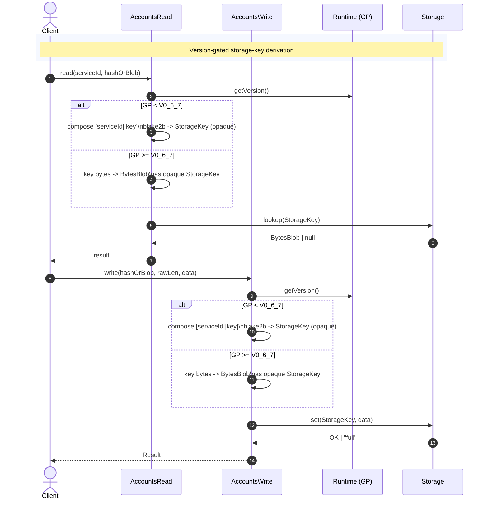
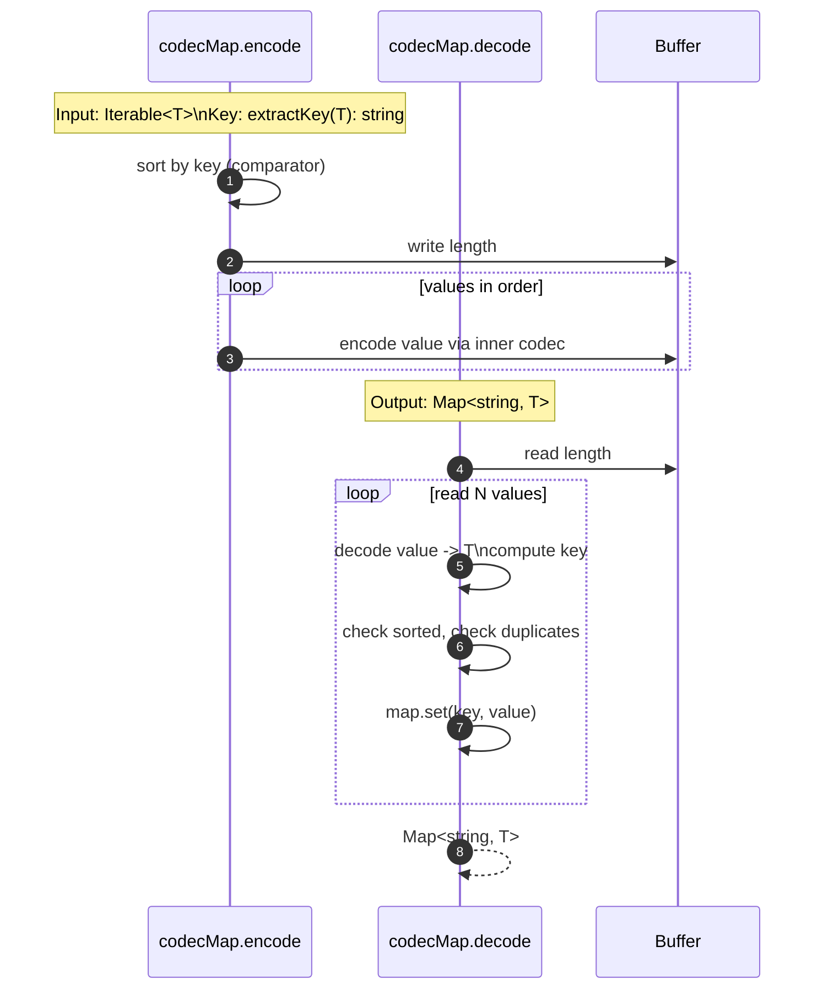

# Adjust read and write host calls to new keys

## Pull Request by @mateuszsikora

GP 0.6.7 changes storage keys from blake2b hashes to bytes blobs. This PR updates our implementation accordingly.

TODO:
- [x] fix write host call tests (waiting for changes https://github.com/FluffyLabs/typeberry/pull/569)


## Comment by @coderabbitai[bot]

<!-- This is an auto-generated comment: summarize by coderabbit.ai -->
<!-- This is an auto-generated comment: skip review by coderabbit.ai -->

> [!IMPORTANT]
> ## Review skipped
> 
> Auto incremental reviews are disabled on this repository.
> 
> Please check the settings in the CodeRabbit UI or the `.coderabbit.yaml` file in this repository. To trigger a single review, invoke the `@coderabbitai review` command.
> 
> You can disable this status message by setting the `reviews.review_status` to `false` in the CodeRabbit configuration file.

<!-- end of auto-generated comment: skip review by coderabbit.ai -->
<!-- walkthrough_start -->

<details>
<summary>📝 Walkthrough</summary>

<!-- This is an auto-generated comment: release notes by coderabbit.ai -->

## Summary by CodeRabbit

- New Features
  - Added a Map codec for dictionary-like storage.
  - Read/write calls now accept either a precomputed hash or raw key bytes, with version-aware key derivation for improved compatibility.

- Breaking Changes
  - StorageKey now uses a blob-based opaque type; storage shifts to a string-keyed Map.
  - Updated public method signatures across read/write, service key helpers, and test utilities to use the new StorageKey and broadened parameter types.

- Chores
  - Added a new ordering utility dependency.

<!-- end of auto-generated comment: release notes by coderabbit.ai -->
## Walkthrough
Introduces a Map-based codec and replaces HashDictionary usage with Map<string, StorageItem> across state components. Adds version-gated storage-key derivation in host read/write paths and broadens APIs to accept blob-based storage keys. Updates tests, codecs, and types to use opaque blob-based StorageKey and string-keyed maps.

## Changes
| Cohort / File(s) | Summary |
|---|---|
| **Map codec introduction**<br>`packages/jam/block/codec.ts`, `packages/jam/block/codec.test.ts`, `packages/jam/block/package.json` | Adds `codecMap` for Map-based encoding/decoding with sorted keys; implements tests for ordering and duplicates; imports Ordering; adds dependency `@typeberry/ordering`. |
| **Host calls: versioned key derivation**<br>`packages/jam/jam-host-calls/read.ts`, `packages/jam/jam-host-calls/write.ts`, `packages/jam/jam-host-calls/read.test.ts`, `packages/jam/jam-host-calls/externalities/accumulate-externalities.test.ts`, `packages/jam/jam-host-calls/test-accounts.ts` | Read/Write accept `Blake2bHash | BytesBlob`; version-gated key composition (legacy hash vs raw blob); tests updated for version-aware hashing and opaque key types; storage map types switched to `StorageKey`. |
| **State model: Map-backed storage**<br>`packages/jam/state/in-memory-state.ts`, `packages/jam/state/in-memory-state.test.ts`, `packages/jam/state/test.utils.ts` | Migrates per-service storage to `Map<string, StorageItem>`; accesses via `key.toString()`; serialization updated to emit opaque blobs; tests adjusted to Map usage and opaque keys. |
| **State codecs and keys**<br>`packages/jam/state/service.ts`, `packages/jam/state-merkleization/in-memory-state-codec.ts`, `packages/jam/state-merkleization/keys.ts` | `StorageKey` redefined as opaque `BytesBlob`; `StorageItem.Codec.key` uses blob with `asOpaqueType`; service codec switches to `codecMap(..., x.key.toString())`; `serviceStorage` and `serviceNested` signatures broadened to new types. |

## Sequence Diagram(s)




## Estimated code review effort
🎯 4 (Complex) | ⏱️ ~60 minutes

## Poem
> I nibble bytes and map the keys,  
> From hashes past to blobbed new seas.  
> I sort the carrots, none duplicate,  
> And version-hop at runtime’s gate.  
> With stringy paths and opaque light,  
> This rabbit’s storage now feels right. 🥕🗺️

</details>

<!-- walkthrough_end -->
<!-- internal state start -->


<!-- DwQgtGAEAqAWCWBnSTIEMB26CuAXA9mAOYCmGJATmriQCaQDG+Ats2bgFyQAOFk+AIwBWJBrngA3EsgEBPRvlqU0AgfFwA6NPEgQAfACgjoCEYDEZyAAUASpETZWaCrKPR1AGxJcAgrSHYiLiQFCRo9Jj0AO4U6iSQsPhBjGgeHsgEkORRkADWJLLIkAYAco4ClFwArADsAAyQgCgEkACqNgAyXLC4uNyIHAD0A0TqsNgCGkzMAwBiHtgAZguy7SqIA7iy3CQVFC4D3NhpA7UNxT54iRRczNQkgQBeiPC5+FSQxQDK+NgUDPECKgYBiwG6IMALeAADzAMTiYEiYFC4UggCTCGDOUjBQGYEE3bRYL64aiBLj4bZYZoAYWRNAinEgACY6oyqmA6gAOMCMjnQACMdQ4ABYAGwcRkAZgAWkYACLSBixbjifAYDgGKAAcSskDqGhFGhqjFgmFIyCCbzQpDyBWQCwoLEgAg8aHyjIECTQiFg0kgmTkNBkHkEiA0MAQyFskGw3FodwyPpQzG4XjYGGJKqwmUC8Vwiey9gIVGt+XkCzet2C5b4yIiGGisRoCSSwQYqXSGg1MAA8rLu1xIVDIHCm4lkm20n7pLhkAAKCm0eAYIjG02+pfWOxVEUATi6PT6g2Go3GkxYs3mSxWaw2Wx2lH2h2O253AEpOxqwIYDCYoGR6PgCw4AQxBkModIKKw7BcLw/DCKI4hSDI8hMEoVCqOoWg6PoP7gFAcCoKgmDAYQpDkFQEFTGmDJUDkDhOC4TooYoygYZo2i6F+Ri4aYBjcGgDC5Fa0gDEIaDTM6+CCQMqGiBogaaDO6oAESqQYFiQD4ACSoHkXc9D0bcjGAauy7SEYUB+EoERZCQOQALJoNwYACF6dCQAAUj49l+neChKAwU7JA4cQoFg/GCcJ6xiRJwbSbJDDydO8mhpAWnBEuuAOrQ2D/MgaCQI53ADIuYjwKqzjyGQqFLiuCzBjkgS1egtk5AlRXRuIHjqPIkQtZ8RbCelJDMJAzAsR4nZQAAohgJrAu58DJm8M5+vg9gxtwK2tYVTlBUpYUMPMSiQAAQrIgancGAgADSQFSLEMDYohvLQd3dvxACO2AkHdXofWg30kNAd5/fWfr5nZ/miB1JBQltFCaF2WnptluXuQVRUuW59DVYozX8Xm6ofFA8qQuQkADZapAANIFOg+VYOSgM/cOVDcNsfDOD84PnZd12diTkBk0u8RU8WJDDaNUSjC1QTUPAgUPQFEPUJAeNKMgpYMy1kkekwGBSIj7mZMRzNA752zoODEipKzXq6wLBhCzSYRNqVmaVcroiQBI8AFe1TmzuLQ00MwGjewwd2zlCr6QAAvHokBQhopbyfgA2xMus6vndADeluK6k7RkEQROQAKkAAL7vs7uj3bS8TOFQsiR77/vQ4liAkEDC0AGrOCXGDB4NpBSxHj21/h075bQ1mQNWu3cE6JAmn7bzE/X3o/B49AVJBhPwM68Qy3mLXdUEXAOtg9ZgFl8DLxrtUlS9i7LivuBRCQZDoHsaCt49a29APblQwF7R6d0yAOCziuC+wQe7YFSD1IB6tgQsQMvfZcyBKwgkFlvRIRx6B5gdDkYiD43goCAq9SgKBkBLiYHsBCXAAr43fgVEBFVGKn1gNGDAiAVruVLAmEh+V7DbAYPASEgUMD4FwGAfhxtcZ7AoWwRAiBhJ4KgNvQhEMSHW3VsovgkiIaUCbqESAOUUxF0DMw1+zV2GK09lw2WljuptibEI3R+AoiiMQOIyRisLExjcXcMAcRRrkL4Ko9RpApqQGmlCJA4h34AAkvSwFlI40BlV9rIFCLcDcN8QRrloAAbh2h1BS2D4CGIMQ6Pg3dbjpkVnOahMCUGuOsdIOOi88zxALBwsBjEEo8GoLAD8GkfAeBoBRUBGR1p9IsaIF0szVTIBMnDBGEEKGHGdIE9g6h4DmS7FYcYbj1bw22uEayXBA7LwWEUzMYVRmRTNKJcSAxJLxUehoIQc5nhEDAbgX48QlwLAfO5e0jpAjCVuY9IqwBoB6FnOEyOXBI6Ir0HdUsMw1SQFnAyaAcdE6FhgXdckmZEAAH4uAF02NwIuHgh5l1gDSrI5QaE13RY9YACKghkpgHoPQr4jDTSCEtfS0MQgkD9lDEgSwVpcHsnQeAjgDCqWUhZXiEUhJvJip8uKuQZI/KUuqtSkydJkXAu5QyOSTLFLMogCyaVlqI3QP4QIuBqIDgdKNJqbCeAgstqC11VYKEPWTM4agFDMhLS2c1AQsieH0viBG/iFEKF9UWd2CgaFmq23mL9VBKhurvxhdaEyOa83Lg0CXNRAxNSNwoAMaa31UjPMWQWW4y8EofigCUKGuzzk+CsFpd1NzO4IqRbOAtP1IFQiygJXAdNZDkuVHMuOoRgUUAwM1eUiBFQPyLLypywB+W1TukivQYY4DxBGXmpCpLmqeKhaNWdvo/YFThousQK67oKNWuE5CEMkjxE8TOjuizeD4D9vPChSgFhoCOK2Fg6bo0UFzmzOICZ4heGXHmMGuM0Ga3VgJHh77nkAfcm0vt8TiPPxYW/FcjTMDiAYP0OuM16PvwAzhsKhxgjvuA4sqYaGiz4tct3ACWBv1UF/QUOOfURy+hEzzMNaRvHuTkOgScGt3JCc0cLOx79azICE3dUTeBfSeO4Rcn9y6CgWZ9IJO08HgldJtIUQjqDqx5VVsETxzh4jnrEB4eQMiMBgACsiZ4bCGAMKY2tExB8o1FnKVu34fCWp8swUQS9ScTLa0yO+2jH1KVcBzMgSOaTvSZLKpw2QZW5mYoXjGrYjLmVnz6qJoLd0ENIemc1U2T7lxgG1l4RJTAiDswQIFHrGajFARkcEaDsG6C0eeturMfk+r8tytu7wRmD1KmPTlgVV7hyy0WQCoFQa+oVDXuVKJE0MYLBmcluGSTmomm9FFrJDXRk9EoFgAQeA/SYhIMklcmM9qli0/Ic9WDaPtCkgrVUcKTrXNe+9hKNWMn/aGfIDcOqorvNilJI1vaZwfnMJYKZMy0dZcyIsgKKzGfrKApsgRAE+BDv2c08QxyoDKrzIocddAuAAAMuduoNuOeFe146QExTOu2h392HuVG8TF877Mrq4KrjwXAiUJyTojvLkA6XtYnJ1nhSvoAAE1R1Uh8O0AA+rKLSVJoBaW7CUHwNgHdu/aNNEompoApIs6hoLCd8VoDugIYlScC5y4CwUHwsfZNLpXbONAr5ymp886dTPC65MOdkLORP5TjGzlLBn4ARe44FwyzuyAVbKC1VrdIRA5Sq6UPxXXyASdSynSb9Krbbfc0d5rY2t2lBe/j8y5P6tRANCtsQR4Xvd0q7coCnjurTjGvrrWS1pXecq43VfFwDXJ3tdnYvYKpOJKC4aFf9XSXzzJck71R8r5lOTWICS6iriqVjuSyTSqyo5DyrVgMgpLwBECwBmqaqfhgBGDf4iT6p/4HACS6okC/L8JqhIHqR06WpgQUQ2qOBGTyD2rzRmhGBWSiIDIkALjVTyDKQAACKauw+wbStUykl2Z8RszwqokAykeoeofI/BzOiYSgLBwIRy5oCEoC/AQE6B0Uv+hq2BryeBfyqoYYJQ604BDqZod0MigaeygUI6Y6xh0g3mZhx2R67qAQQQ1EoY3ExBmk0y4EcySWLOyyqWPhGylyii/AvOZy/O4gguTqXYBh9g8Bt25iNh8yFyWy1GYRFhqCkRChH4Yq4goB9A4BoQkB6sCqiMSqKqaqGqWqqBfEOBpO+qMUYAY4ciE46QAw36wOSCURAwAkDAjgRwoSHRO6XR2RCkKUKk5qJBuk1qBklBdqQESRzqz0iGYgbwGQ04hcWCSWOY/AX0rMP2Po+U5oo88QgyOSQiYYz0KYAkvoIctM9MtmAMQMeOHafkW0zwlKd09Cx0zUDywITyN2JIoQjMwCBOOSS4hySCDw7OcSDBLUKaSYWyrWfATxP0Lxr6kAnBd43BsgAwBxKC+SMGKmiYMuwQJkdxJAK6C8vqmJXBD4uJ8sNAf03UgKQ2Gx5aJ8V2kMOQRWd4sJk4UkfRjCC0HOkA++YJLgGg2QwAFJf6lMJxUsyKim4MUGUabA72FoEsbK4p9WhOMpJxcpFJipv88QMYcYEEmQOph+UpdkwAqJJAeOd0RpYcSpKCmpwk2p6SB+2SLgdpexDp6STpCpLp0qfiShUgYWcSNgN8eRuG+AIwgU+SBIyARStBdABeaZ+U5iIWuAYWrx2wAwgJB20YMSeB7hkyXhqyTOCyMh/hVZoppJaR5h5yByURzqCSqRtABw4RgUrZ8ghJUgtAXAsp9MjZe88g40OUXgtJ2J9JhZGYZZM0wRdI3ZGRfZ4uQ5be/pLxCJca3OceoiKaPSNJWJ2wOJeJ6ScSpyGRRZQaZp+kXA7p1oaG6pNCu5WAvR/RLoNAYAQxYC3UURSUQQKUpkpA9AGJVpPpsg+p1MlJjm8psFxplpXpEp0F9pjpCFEsipV5PZcRgKQJppsYD5OmHgJZvoJkkFDWNpUQMFEshpwZI0rpNhRC60lFhO1FfpLMAZ3oQZiFLpOc6AioSQfGVSORIBkqhRMqRyUBpRDIyqi4lRakKBaBdRP+0wjRzRYArR6wtYQFikHGVRFq0x5BsxDE1BCxmZzqKMWUig6MZmlAwhkWaAUQMeBxvxMaiYKSLYVI7Y0qKIol4Y8QPoHgnMPAoQ6acF4W3ii+O6oi+JJkCJI5vU4M6gdCyYqY7AjOoFvokm1GWA2ovsDloCcSWkoaKZRFdIw5Bp9Mu5aVnZ+KKaYAqoYWx5jop594ewDJC53maaCsagAFq6kAmo3AfcRVqof0iA9pIMVsMee5IRKKH5c8hyIhmQ3YNMKCz0Dg0yU8kAMwFCBVQhgRu8b580kAfcdQbuIobuNQd0vAzBQWVJqeFA+2fG3cFAfs/wWktAAA1NrAGLYZ6N6L6LZs6K6CQO6N5i3llviQ7GbP6cGu3AVFoJNf6TnHEntXwNkDQgdWNXwrdeFQ9fTFDcgAXKWHdPiX3lED6OYviagNBjlP8OOQzFNXeLXgUHzN0nErevwEbL5dAQhLQi1KEDIhQLcN1NCU8iZIkDkIsviZCCQLvILfTejHWPQOFcCewO5CPLBSusqTZIdaqMQIglPgUSxIDrAHdOFS6BIu/IskUqqIuJ7KRaDW6B6PiYTDwovFjXwAbXwlzYmH8bqXhQkfECZHdRFY9ZmUlqEPVALZ2lDFDcGrSp5lwBzYgFdIIOUgcVVTrfTFXDTh4fTt4Wsr4bWUdAESXUEfVTsrha2Qoc6gYeQMAXkRJWbUUdJSUTAVwHAQgUQcpbUdoeoepeJE0S2Fpe2DpWELQOMUQUZVaiZRtGZSodldEVANecOqOtlb4PFmpogM9OEBoLWFkNFb0cwatAVO7WqZDjQglX5FdGDe6C8QAD5nQXTSAZ0ehLhBBT3L3NXyD32u0YXtjeJDaJhPlgY1XrT7yrbwDzwkCjA0Kw1hUvTJhWb0DxVcx5LOWeZMSBgbYxlLQhpbKzzOGVWv38yCCC0yI5BzUQRIMUa0P4qMMFxp0f3VzUmOgcF0mdWfJv2IDKRxxf00AogmQFSNV/2IkrSW3ypeBlTvypUhAENsAlnCQdqJhxoZXpiM60ajUUCOU2onFjb0wPpZWZRoyM1cD73T1wyiBWbH05A4jAiHH8D5U6i+3Dg+hYBPX7agPBYnE4N9Tjalx5iGYY38DHU+241zgN7nWXXXVX51xCxUl4YsqHTHS3HTQ2B9xe7TRu5aSyhu6nQO7QDTSfA8DzDHG50rDBOwBUgujJjraJP1yfCUAfWSz0CoAjg0BYCZQ1nxCQh6PBBCi4PkVASLKljlJsDjSMSoDBjhAGPOBQ7oBvYnXBatOKztM8ArTKGziAQLDdzBBK6fCZPZNUi5P5OFPFOlO1wfBCwUk4OoCWZ0NBgP0TAHFp2zhvVtNfVJVxyzjxVjMknNLmLazfHYCJZfMbNfU3P1xhPe2FV6M+Gzh6BK6xNXU1AJO3P1zJM1MXJHTgvElrPvVQv0CziVaFhVO251PiTbDSYtV4J3PrOfUdPIDLZYZA49Pph9OeYMv1zKrTNE7IBzPzwYnXbEhuoJWJjay7NLAHOx51Awt3P+Ogt8a0ROjXSMCNzgU0mQvMtJX4qsMCx6wzC+qfNMvtO/ObpjInXEQX2XnOqPVrJZQ+MiF9R7NyvBgJkblcDWXmOCIFC25unmtfXdiyuQ5JbdyyPBCqaMJiA4OiZJDLUfkqmJgMKhBxsOCuR/xlgqIjRvDyDCsJo4wuMIuOW0YUlGMoS0jKE2HG5gPVXyAIlJECHka42bxQDdi7xcAFQAPg0CAvHK2M1MSA0IC20B1HCkW6sWsNuGYDpRDdvkPv0auDvuSLjpu5llg0njP0z/VuFdiyhSSOCZWZgDDuPm7lXmkS5ilT00JUTsDRgVUmzrQx1Ru+x6g1AaB8i0YzCPLZKkXprIJ3VfNXvTS1LzS0ClrQ4pvxDpriDtq1gDDKYLwNTSoFIYB3S2ZQaxBUEryPaWikXNsGzkxPs4Pz2M53TuNEAKzLjeZQa4UHFgAvnX18ApoF0VkM6Uql2nF1ns7L1jmhHNkRGHJC6FSQ6JAGTxEEUPuXubmS61hmvEvMvDnBv0Av0YATvk3pKp0uiAPpJX6Lvp0atqcTulIf4biZSUArHxCS4+A70xl71T1mdYBf6qUYEfIaVj3aUDC6Uzgf7ohydT0KffObktOKebPGdpCafejaevPP0Gcf36eGuUMReb5AEGC5ESqURt1SVyqyXd3wGIFVH91qFk5k6j1BDj1pDrAKQIh2fpihimqGVTFkcQS2rGQWVrir2BUUsSxjSw41V+QuXIDMUcOjQADaoXwXd0vbj96SAAuklhNyp7xXRQUHN3dPeUs3bfWJQGFs+jVcEqaVJsO2K7BYVMhvAEVP7fEEfeqeJ8HVJ0N9J5KqbPFmff1A22FN/SI0BD2zp32+iRQgo5fVQK+RQNd+y/EHd2LreeYk95tyR6fcqB91U198IwBL92dP97N96MiSgKtCD+JMxxD829BvxFR02PHTkPq++dITB7hVYSo9aIvOA4JXlHu7Tp4Rxz4XT0suXfWXx8uU2Xzr2QLvXScrhWT5QJsA98WQj7J+A054wC6GopAJLtANOLZ0wPZx/iN6+nXF/rhbWBI+A0qhdwikt2F19dN9j/2/N9N3w2wyl3oB/gQAbyL35bQCbycWb4Nhb5NySyt8JCuut/F0Z+ymkC77RuvYEtDxJ/hXL4+7J/J1O19cp1b6pxHx4FF6CFj7F3p6nY7+H+p2kH52rynyp+n8F5AClznznat7IIl0X8l1n5LtH7hXH7L3eUn1Lspv81p3n7pzxZAG7rRCukPFwC0CKEKH1tQGgIXxQx6Cl/p5tchnaTTHdMpA8mkMpC72iGr339nZhcH/BaP85eP2QJP9P7P8SAv0uy3yXx4Cv9IGv2tZv9vx4Lv2383Zl2Adl8UdAUVSicFKzAPuhABqIlcGiI9TSl52Uwz0mumkUgnpFa5zF2uK9Z1DH0sKb0ki7bTSHVxnAAB1RsHgSQ7UM2eZ9URAM2SBMd3seYNWG2BBzxB4GfSPgDNzt648KESXD0POHbo/BEAeZCRmwLxzvhuuidBEkmS/qQBV+0ydfu/wna79DMWvXekQLiCH0p6nwMBH0ESC4BA2ZApHufQXg1JqBV9WgSaFbDER94zA6moPwB7pIBOXA/FHdXXiBABBGAPMkIL060ZSqKYEaMexrZR0NwKgmgBoBsZ9EmwM6XGsQElTawTGmYTFrCwoREBl4vtZAMNV0Zls0W11FBN7U3hJN6YKTLrODHdbhsY84QUhiRx2Le9KWNTalg03HKBh8U9hFTsg0HCKt643NVnn9T4YmlIAwrVdjUgQh5lem9gFTvq0zbNx/4hYRZvYjJJhtggeoJplok+500/WEQRmLsS4rH97im7R0Isj6H1DpA9fE/vICVz/R/S01EgLOC4EaBjWprVPrQEtahMKE+ACJqWyRYVBqw8QTIRi1yHYt8huLMFiRmOZZMcmeTApkUxKZlMUwgQHrscKpb1NaWvLKAAH2ZYjMsyJ8RsN0zCi88KgIwDALunfiSsIG8gUHEsEoBIjuunQndt0Jjz7DlmpgoltXzuqDh8UxQw5pTBOagiLmEI65hSPAZUkVhtlIdtpjcpjt+mE7EYRn31azgqaisHhICMJaSjq+WaKVtSMDCYY+kWAGIE5FpY6w4amwpKkcO2Gx4zhXFC4ZXlt4aB3mfDILiS0eGcZuuvRNTBoCQ6tF7G4OfIJUwb4NU7wawrYZFT1qwjthtuDDrLFuCyAKgA8QtCkE6q+NfYauATo/3xSpkSkIwppGxiOKwN+mNJGIR3lthxDaMVkJNu2loYcYhYVkdyDTz8iMM+opooGBcKZ65h1oDgDmNtHNisxtY4HSDrRllBz96oJ9D1C4XYBlj2hqokkYsHBQNJ4ADwItIW0JFzDEAtHRMMCQu620/IJkfkcY2YL/gS2iyX2hhwQDTlFkwJWYcliQ79icgEgpnGAyJ74oKMc4i3FtG6ZwdSKMwFoO0HaB1I3g3mRAJoO3jBAChPCLdLEBlSpBa4BgFGPYCuC4A7oLOSREBDMZCjfQBUX2lEIgi5jYg+Y5Qh7RQSbJIgfGKgXIkxBHt0wCNTIC2KRJWDEGyDJ5u5AwYhBsGXQwMBh3ZgMoxRhg/8gE2QD6tekiYD3lYQmR05KyvHXnqzgrpZYq6+5GumuTF4icRc93WHoRRk699iB/faLjYJx4W0gxkVW3Ffxn4WI5+d/Qzg/wnbP8tquAWQaIQ/679TOzyCzhQCs5q8lB9nIISQCV4udB6pXDzhV1gHECUoZfSXIfwH4eDceL9Lgf+gba6TWg1/AybfzD4mS0gZk1/hvysnyC9ApnZ1PJJh6SdE+yk8vuoL/HaDbcak3PiFNgD6d1OzAXYDXyz62TzO6YSzjcScn4DEArk9yZAPc7QDPOE9RDn5N8778Au4QDQU5H/HFSj+ZUmqVwIqkco+AKXDKUV3AEqVPJ+qRkiQDABsAKAuQLwNOMZwDAlw60vNi4HkQLktKABCYpqjnpkFJUbXcyugK7Bwk7kkjN1LtlPgghFRrPJ+PIyzCJgURJAAgaMEjgTwVY5pAqBiTta48zijEYbN2lDFnxTuvXIrECEQDVg2A2rR0CnCKzrQMZBQdOJnFqho1nUBEYblHWlr+ipYmRECeiMlH+xxadAF+G9RpnTj3I3CDcHRwyK/T/peYNuL2nLJCTueJdUSTx046SSQi0klsrJK66YDMiyCRSc9zIYcyAZPyNuAtReS4Eh685UJBtK2nwMJaoCPaZFimb5tjpoSKnIgDjjNAWcc/DQKz3lqK09eNJXHChV1KVRtaWFMOEDNEDRxY4puZOKnAUxJY7krs0OCNA9lRx8U3sklNjNkC4zcsOccCRl3yJSp26uXLusANVSgCFp2qVzurNWkHTNp203WaqAGAXFGukxRAcZWumoDbpixe6XPErGfddyoaCNptCuQ7QaBb5PyCz3NYUk4kVINMvQA96KTHy3c/xmQOJCeiU6/oqkgtW+4Y95SdwXWm6S6ikVia88mgCujiSnQHQ8zcgAPNwpDylRGzAdN/XoB6C3uyoZAEf3Qp2CwpzfbgUIx/omQJG1870DtWsqdFSKnrQJFePygsld5LbC5F9nfge0e8ePEuFRwYDyAcaiLNZAnlXhoB14fAcll4AgWyBfpx855ivE+GwyeETQ9MYEhsIrxngJGO2kn2DRuEoAz0caIORajQBew3YSCNRHQCJowcA0BeQN22B/RBxW3PiQz03rQJHJTo3NLVEjK8yuexdassljEkC8RZ2ydIuLKyJySxO2UhPt3zynS5lyC8X9iISnYUlbRSnSmMt0nlsL15CmKquwtkDtTs5pXXOVrILm7SS5gBAaaSS0X/FlCuik4vovaZV9A+xihtvpxMWRUgCwuZRfHxDpyyr2GipEoHQBLmsMFdALxWn0MUZ9TCM0qwDHWhCT8JQjIOvluS4rCDzFpiyxZ/g6nTBbFlAbWTtJPaOKApLimJe4riXTgEl9wnxcy1SVVTKA6S+VJktaDZLclL8nhLfMX4BKFyK6NLgnNbonRk5MlVOfJXTlgCs5y0j5KtP1kHSBWxs4IWMVLkXTmuV0lAUvRoKddCZM8d0V6HojxAUY/LfNoEutn+MiIS8NHo/Mx5sVKoTmU0M1AhIviqlOzF5ZKWyACUvwFSIOK+EDEIckOLGZpOxnxRYgAFBUc3Dg0/Q8sCAeM7OCCpKqowkJGQX0RsIthCIF2VYq2KgBzDgUPKfjM7mTU1Zz56AiKusT9HNFp0NAkINILOD5B3QUkPgT4CkjdyfAtIUoaaCCpQSYBlskqB2ElVhJ1yOmTc0RijTNGdyTy3DfYHgHgDpAA5qoI2IJjVx0IuWOK1mAiQuK1z54jDckg3LlWOgNAhZc1vgSSxkAS0uYO8FpWcz5B6AHJZevDNUZpwuwm2ECQWlG7aT3R5LNOMitjlxwqaP8U+mojjFFRpGsdORiuBExpk1GppHbhQD248Z/GIM0lPthBQQ8FIESvJDIzjqHE70AQrAN3F5r/travoNmlWzdigIIpZ3YMPgFyAxhFxKCT5TTIZhvVKU4EznkXQF6Cz+evHWRcL1roSz2yQvcCtosWoTpaVwMasVgEnJHB4g7Vc8kqpVUopQ0i0LMBsVhoyr6xd4HalLIRJY4Qun3fjhiUXXTlzVU7K1Ruvqqsyd1h5O8EaIDFiUW6WXKZTlxmVAC5lilZAotIHpqybFC5VZYbKOmrT4BZc7SBXP2U4dDljqTKfAXILIBOY8ic1n6rBliknZh+WiscKD5jwQyw2e/DRzJkuk/oZI2Nc2Doh3KvRdAP6G9zUR0ag2sQKEo00sgMaUNYyPNbgKxD3MyBja3IOVURpIqM4waxNUvEMxYhZo98X0A+l9CbjCgvqxZM6RDnawhM+KHwNm0ZWms8wSADQCDNuWwUNAQmOORoG7QxwfZUctFQ6KYDcBZAJrR0GQMVBz5RExGi3CpuYBJxdsRYdcGHGQC2ZA1ommBATKFgEDPGCgOzc1A+mowFCFHTVT0M1LuR/UzGE4tbMhzVqY5wWzDK/g0AwsoAvTX6YgF7HEh8Uq06mVCUZxxwyBI0BRgprtA0kPN8YwtHOCs2PKfuDy/VULAR73NyW8K8DEumKrgM/Z0coNVlp6QUIWmuAAYFQqJK7EJFbhULeFuc3UdocO0S5YdLQXmt61vXdtaxqOL6IRoyoeQFdy7CBLM1YgINDgIdHraBWZ2vqKEG/J/8ToIC90eSGtQAK3N+GyWCGUXioap22k6RtcRtpxq+JvAmEb8t6gcxt5uCB0VMgI5m0XtdAjKA1LLwALWes4WzYNQR7zotkccNeACG/hYB5eSWLsX43aSBZwYjW/iLIGFb5Qd6wi5cKIuREd4KtJ7EZFdqFhTtpNlMwGXVtQQ1Qy0ZC7MN3H0TtiAQGrdWtID8EiEaVe6ulaDGlRA64xTg8qDCLXYC1d2s4dlZyu5W8r+V/O1hKvgdGzqGxqAMgbQxI4UTtoum5AJ9JXA2E4k3YctaRX5piAYIuFDNZOQVp484V5rQAJgEXo1Rt6EkSrRMNpYU9gmMhmNt1ocK3LJW3cgwyAFabaQFtHrDNRGeW0TKCQ09QkcDY6qzzMkXPYoJMgR9JdBvinn0x1NGJRLR0z81hhQujMwuVgGq3EZ5NyrW0DrDF3qsQwgk4oIXWEmccB1bOYWZzgnUCcPeddETjMCOSK1ZZ8vH1hgCuUuBfp+mq2az3tmOgIduG7YV9qQrrRPtpGxis8lKUayaAoGjbRsrwLU4f+icySgALy5ikCuCyiAdYpWkgab12ywukgJmKL04NHXBDZ6rzaPps025OwTWJSoYqGayEuXXOqthdj3KfALvdqI5gOVe5UdNmecnAaVtFdGtLRk8kw2Dg6A8iJmTqqCp2DhsesbGMdy72lhcBBK/pNFXJYODMOiYF0BUFIrKQqRsgfgg/Pa0DKAFnB0ZQUGUhxIWgj7PjI1pGS8TiRhghWmjNGigzoQRBwCSOwN2JYKD10Kg+5Dt24CHNo0Wg53BuE2jtdXKnlXyvfCzrt9kVV0pkAMO9o9YZ4Q2NL1nAook8KAaOPgDcMm7WanhnamIcvZ8ZGGcrWNMCHSbM1zhO2cGAOVzCJh+DKaZkvEWagsH+kUMSg7lQiBQ78AZGCHmwe93SHSDCNZthiUEMWKpC60QQ+SuENsc+Z82rjnz2H2BFR91deRUJzbKnaTVVsOfT3zV4uLEqn3JXPaU4rPFAyohVaSui/7OLNFfR1HgMf9LABwpox9vdwb34bgPJQGt/XcAtVhd/JzqDzaHOG1d9zE8+uuJBMlwebJcAeqYWxnuiAJVjJ+lZR/sAKbw9DUuOwz8k10mHdd5h5GoMaSpKkgCHwaAPgFeMFAMcckBw3nucOuGfZ8ADw14ZgPmjfD4y8Sh+pu5frO6P6iohnKUoAb7jIGsYmuoa4GUoN3+hejdOXo1zOZo7faIEoX3JYbt1y9DV3LC66hYJ9bM7rbOiAOwN9o0CHdRQEqZACwRUHOMyRmRxib4aEVNSuAzV7YLtRx47izzuXfSYOoQCVG8gE0xgEgSSfNiaTQD6F1oSaGhA9gQVPZ20FCA2DZQ8AQgUOzbGPCGFaaNNuI7HWo0PvEkNkx9Ys1o+L37SqgSAN+yZWifv2zKsTCy78L+FQRzykMIEFrn/ygjpgr42Dck9plkjoQ1A7EbCFxHDNUR1AbuWBogFH5fq6AbueWG6hwg8Q/waABYLQA5ASghQDAOoCQCqC0AagCwTkHyCFACA2wlZiUAIAlA7gdgjIHcAwAEBVmFgfIOgAVDLNZmWAzAHM3mYLOQEizO4/QEAA=== -->

<!-- internal state end -->
<!-- tips_start -->

---


<details>
<summary>🪧 Tips</summary>

### Chat

There are 3 ways to chat with [CodeRabbit](https://coderabbit.ai?utm_source=oss&utm_medium=github&utm_campaign=FluffyLabs/typeberry&utm_content=570):

- Review comments: Directly reply to a review comment made by CodeRabbit. Example:
  - `I pushed a fix in commit <commit_id>, please review it.`
  - `Open a follow-up GitHub issue for this discussion.`
- Files and specific lines of code (under the "Files changed" tab): Tag `@coderabbitai` in a new review comment at the desired location with your query.
- PR comments: Tag `@coderabbitai` in a new PR comment to ask questions about the PR branch. For the best results, please provide a very specific query, as very limited context is provided in this mode. Examples:
  - `@coderabbitai gather interesting stats about this repository and render them as a table. Additionally, render a pie chart showing the language distribution in the codebase.`
  - `@coderabbitai read the files in the src/scheduler package and generate a class diagram using mermaid and a README in the markdown format.`

### Support

Need help? Create a ticket on our [support page](https://www.coderabbit.ai/contact-us/support) for assistance with any issues or questions.

### CodeRabbit Commands (Invoked using PR/Issue comments)

Type `@coderabbitai help` to get the list of available commands.

### Other keywords and placeholders

- Add `@coderabbitai ignore` or `@coderabbit ignore` anywhere in the PR description to prevent this PR from being reviewed.
- Add `@coderabbitai summary` to generate the high-level summary at a specific location in the PR description.
- Add `@coderabbitai` anywhere in the PR title to generate the title automatically.

### Status, Documentation and Community

- Visit our [Status Page](https://status.coderabbit.ai) to check the current availability of CodeRabbit.
- Visit our [Documentation](https://docs.coderabbit.ai) for detailed information on how to use CodeRabbit.
- Join our [Discord Community](http://discord.gg/coderabbit) to get help, request features, and share feedback.
- Follow us on [X/Twitter](https://twitter.com/coderabbitai) for updates and announcements.

</details>

<!-- tips_end -->


## Comment by @github-actions[bot]


<details>
<summary>View all</summary>

| File | Benchmark | Ops |  |
|------|-----------|-----|--|
| [collections/map-set.ts[0]](../blob/8d00a629bc5b6e7dacfd89d17d59bd00948d86e4//_work/typeberry-runner-5/typeberry/typeberry/benchmarks/collections/map-set.ts) | 2 gets + conditional set | 62414.52 ±0.9% | fastest ✅ |
| [collections/map-set.ts[1]](../blob/8d00a629bc5b6e7dacfd89d17d59bd00948d86e4//_work/typeberry-runner-5/typeberry/typeberry/benchmarks/collections/map-set.ts) | 1 get 1 set | 35756.39 ±1.04% | 42.71% slower |
| [codec/decoding.ts[0]](../blob/8d00a629bc5b6e7dacfd89d17d59bd00948d86e4//_work/typeberry-runner-5/typeberry/typeberry/benchmarks/codec/decoding.ts) | manual decode | 18949802.95 ±1.79% | 87.06% slower |
| [codec/decoding.ts[1]](../blob/8d00a629bc5b6e7dacfd89d17d59bd00948d86e4//_work/typeberry-runner-5/typeberry/typeberry/benchmarks/codec/decoding.ts) | int32array decode | 144820153.71 ±3.54% | 1.14% slower |
| [codec/decoding.ts[2]](../blob/8d00a629bc5b6e7dacfd89d17d59bd00948d86e4//_work/typeberry-runner-5/typeberry/typeberry/benchmarks/codec/decoding.ts) | dataview decode | 146489780.1 ±2.97% | fastest ✅ |
| [codec/encoding.ts[0]](../blob/8d00a629bc5b6e7dacfd89d17d59bd00948d86e4//_work/typeberry-runner-5/typeberry/typeberry/benchmarks/codec/encoding.ts) | manual encode | 3053276.72 ±0.98% | 19.92% slower |
| [codec/encoding.ts[1]](../blob/8d00a629bc5b6e7dacfd89d17d59bd00948d86e4//_work/typeberry-runner-5/typeberry/typeberry/benchmarks/codec/encoding.ts) | int32array encode | 3802247.19 ±0.92% | 0.28% slower |
| [codec/encoding.ts[2]](../blob/8d00a629bc5b6e7dacfd89d17d59bd00948d86e4//_work/typeberry-runner-5/typeberry/typeberry/benchmarks/codec/encoding.ts) | dataview encode | 3812760.75 ±0.88% | fastest ✅ |
| [math/mul_overflow.ts[0]](../blob/8d00a629bc5b6e7dacfd89d17d59bd00948d86e4//_work/typeberry-runner-5/typeberry/typeberry/benchmarks/math/mul_overflow.ts) | multiply and bring back to u32 | 221319590.82 ±7.59% | fastest ✅ |
| [math/mul_overflow.ts[1]](../blob/8d00a629bc5b6e7dacfd89d17d59bd00948d86e4//_work/typeberry-runner-5/typeberry/typeberry/benchmarks/math/mul_overflow.ts) | multiply and take modulus | 217794354.56 ±9.06% | 1.59% slower |
| [math/switch.ts[0]](../blob/8d00a629bc5b6e7dacfd89d17d59bd00948d86e4//_work/typeberry-runner-5/typeberry/typeberry/benchmarks/math/switch.ts) | switch | 210182521.97 ±7.65% | 4.16% slower |
| [math/switch.ts[1]](../blob/8d00a629bc5b6e7dacfd89d17d59bd00948d86e4//_work/typeberry-runner-5/typeberry/typeberry/benchmarks/math/switch.ts) | if | 219298214.79 ±7.07% | fastest ✅ |
| [bytes/hex-from.ts[0]](../blob/8d00a629bc5b6e7dacfd89d17d59bd00948d86e4//_work/typeberry-runner-5/typeberry/typeberry/benchmarks/bytes/hex-from.ts) | parse hex using `Number` with NaN checking | 125031.63 ±1.43% | 84.71% slower |
| [bytes/hex-from.ts[1]](../blob/8d00a629bc5b6e7dacfd89d17d59bd00948d86e4//_work/typeberry-runner-5/typeberry/typeberry/benchmarks/bytes/hex-from.ts) | parse hex from char codes | 817696.35 ±0.47% | fastest ✅ |
| [bytes/hex-from.ts[2]](../blob/8d00a629bc5b6e7dacfd89d17d59bd00948d86e4//_work/typeberry-runner-5/typeberry/typeberry/benchmarks/bytes/hex-from.ts) | parse hex from string nibbles | 514166.4 ±0.99% | 37.12% slower |
| [bytes/hex-to.ts[0]](../blob/8d00a629bc5b6e7dacfd89d17d59bd00948d86e4//_work/typeberry-runner-5/typeberry/typeberry/benchmarks/bytes/hex-to.ts) | number toString + padding | 278085.92 ±2.11% | fastest ✅ |
| [bytes/hex-to.ts[1]](../blob/8d00a629bc5b6e7dacfd89d17d59bd00948d86e4//_work/typeberry-runner-5/typeberry/typeberry/benchmarks/bytes/hex-to.ts) | manual | 13925.73 ±1.54% | 94.99% slower |
| [codec/bigint.compare.ts[0]](../blob/8d00a629bc5b6e7dacfd89d17d59bd00948d86e4//_work/typeberry-runner-5/typeberry/typeberry/benchmarks/codec/bigint.compare.ts) | compare custom | 231735515.64 ±6.16% | fastest ✅ |
| [codec/bigint.compare.ts[1]](../blob/8d00a629bc5b6e7dacfd89d17d59bd00948d86e4//_work/typeberry-runner-5/typeberry/typeberry/benchmarks/codec/bigint.compare.ts) | compare bigint | 226061995.17 ±7.3% | 2.45% slower |
| [codec/bigint.decode.ts[0]](../blob/8d00a629bc5b6e7dacfd89d17d59bd00948d86e4//_work/typeberry-runner-5/typeberry/typeberry/benchmarks/codec/bigint.decode.ts) | decode custom | 146848032.04 ±2.86% | fastest ✅ |
| [codec/bigint.decode.ts[1]](../blob/8d00a629bc5b6e7dacfd89d17d59bd00948d86e4//_work/typeberry-runner-5/typeberry/typeberry/benchmarks/codec/bigint.decode.ts) | decode bigint | 89079650.6 ±2.75% | 39.34% slower |
| [hash/index.ts[0]](../blob/8d00a629bc5b6e7dacfd89d17d59bd00948d86e4//_work/typeberry-runner-5/typeberry/typeberry/benchmarks/hash/index.ts) | hash with numeric representation | 159.43 ±1% | 28.74% slower |
| [hash/index.ts[1]](../blob/8d00a629bc5b6e7dacfd89d17d59bd00948d86e4//_work/typeberry-runner-5/typeberry/typeberry/benchmarks/hash/index.ts) | hash with string representation | 98.58 ±1.08% | 55.94% slower |
| [hash/index.ts[2]](../blob/8d00a629bc5b6e7dacfd89d17d59bd00948d86e4//_work/typeberry-runner-5/typeberry/typeberry/benchmarks/hash/index.ts) | hash with symbol representation | 157.39 ±0.46% | 29.65% slower |
| [hash/index.ts[3]](../blob/8d00a629bc5b6e7dacfd89d17d59bd00948d86e4//_work/typeberry-runner-5/typeberry/typeberry/benchmarks/hash/index.ts) | hash with uint8 representation | 140.59 ±0.83% | 37.16% slower |
| [hash/index.ts[4]](../blob/8d00a629bc5b6e7dacfd89d17d59bd00948d86e4//_work/typeberry-runner-5/typeberry/typeberry/benchmarks/hash/index.ts) | hash with packed representation | 223.74 ±1.04% | fastest ✅ |
| [hash/index.ts[5]](../blob/8d00a629bc5b6e7dacfd89d17d59bd00948d86e4//_work/typeberry-runner-5/typeberry/typeberry/benchmarks/hash/index.ts) | hash with bigint representation | 168.99 ±0.97% | 24.47% slower |
| [hash/index.ts[6]](../blob/8d00a629bc5b6e7dacfd89d17d59bd00948d86e4//_work/typeberry-runner-5/typeberry/typeberry/benchmarks/hash/index.ts) | hash with uint32 representation | 176.71 ±1.25% | 21.02% slower |
| [logger/index.ts[0]](../blob/8d00a629bc5b6e7dacfd89d17d59bd00948d86e4//_work/typeberry-runner-5/typeberry/typeberry/benchmarks/logger/index.ts) | console.log with string concat | 7700964.77 ±38.26% | fastest ✅ |
| [logger/index.ts[1]](../blob/8d00a629bc5b6e7dacfd89d17d59bd00948d86e4//_work/typeberry-runner-5/typeberry/typeberry/benchmarks/logger/index.ts) | console.log with args | 61642.74 ±58.98% | 99.2% slower |
| [math/add_one_overflow.ts[0]](../blob/8d00a629bc5b6e7dacfd89d17d59bd00948d86e4//_work/typeberry-runner-5/typeberry/typeberry/benchmarks/math/add_one_overflow.ts) | add and take modulus | 251706275.85 ±6.38% | fastest ✅ |
| [math/add_one_overflow.ts[1]](../blob/8d00a629bc5b6e7dacfd89d17d59bd00948d86e4//_work/typeberry-runner-5/typeberry/typeberry/benchmarks/math/add_one_overflow.ts) | condition before calculation | 246844599.36 ±6.31% | 1.93% slower |
| [math/count-bits-u32.ts[0]](../blob/8d00a629bc5b6e7dacfd89d17d59bd00948d86e4//_work/typeberry-runner-5/typeberry/typeberry/benchmarks/math/count-bits-u32.ts) | standard method | 79042428.22 ±1.63% | 69.22% slower |
| [math/count-bits-u32.ts[1]](../blob/8d00a629bc5b6e7dacfd89d17d59bd00948d86e4//_work/typeberry-runner-5/typeberry/typeberry/benchmarks/math/count-bits-u32.ts) | magic | 256795057.89 ±4.44% | fastest ✅ |
| [math/count-bits-u64.ts[0]](../blob/8d00a629bc5b6e7dacfd89d17d59bd00948d86e4//_work/typeberry-runner-5/typeberry/typeberry/benchmarks/math/count-bits-u64.ts) | standard method | 5185703.4 ±0.23% | 94.22% slower |
| [math/count-bits-u64.ts[1]](../blob/8d00a629bc5b6e7dacfd89d17d59bd00948d86e4//_work/typeberry-runner-5/typeberry/typeberry/benchmarks/math/count-bits-u64.ts) | magic | 89771431.84 ±1.65% | fastest ✅ |
| [codec/view_vs_collection.ts[0]](../blob/8d00a629bc5b6e7dacfd89d17d59bd00948d86e4//_work/typeberry-runner-5/typeberry/typeberry/benchmarks/codec/view_vs_collection.ts) | Get first element from Decoded | 25419.61 ±3.32% | 51.33% slower |
| [codec/view_vs_collection.ts[1]](../blob/8d00a629bc5b6e7dacfd89d17d59bd00948d86e4//_work/typeberry-runner-5/typeberry/typeberry/benchmarks/codec/view_vs_collection.ts) | Get first element from View | 52223.26 ±2.69% | fastest ✅ |
| [codec/view_vs_collection.ts[2]](../blob/8d00a629bc5b6e7dacfd89d17d59bd00948d86e4//_work/typeberry-runner-5/typeberry/typeberry/benchmarks/codec/view_vs_collection.ts) | Get 50th element from Decoded | 27961.24 ±0.26% | 46.46% slower |
| [codec/view_vs_collection.ts[3]](../blob/8d00a629bc5b6e7dacfd89d17d59bd00948d86e4//_work/typeberry-runner-5/typeberry/typeberry/benchmarks/codec/view_vs_collection.ts) | Get 50th element from View | 38500 ±0.13% | 26.28% slower |
| [codec/view_vs_collection.ts[4]](../blob/8d00a629bc5b6e7dacfd89d17d59bd00948d86e4//_work/typeberry-runner-5/typeberry/typeberry/benchmarks/codec/view_vs_collection.ts) | Get last element from Decoded | 27962.58 ±0.18% | 46.46% slower |
| [codec/view_vs_collection.ts[5]](../blob/8d00a629bc5b6e7dacfd89d17d59bd00948d86e4//_work/typeberry-runner-5/typeberry/typeberry/benchmarks/codec/view_vs_collection.ts) | Get last element from View | 23818.6 ±3.79% | 54.39% slower |
| [codec/view_vs_object.ts[0]](../blob/8d00a629bc5b6e7dacfd89d17d59bd00948d86e4//_work/typeberry-runner-5/typeberry/typeberry/benchmarks/codec/view_vs_object.ts) | Get the first field from Decoded | 402932.71 ±3.18% | 9.44% slower |
| [codec/view_vs_object.ts[1]](../blob/8d00a629bc5b6e7dacfd89d17d59bd00948d86e4//_work/typeberry-runner-5/typeberry/typeberry/benchmarks/codec/view_vs_object.ts) | Get the first field from View | 97123.26 ±1.95% | 78.17% slower |
| [codec/view_vs_object.ts[2]](../blob/8d00a629bc5b6e7dacfd89d17d59bd00948d86e4//_work/typeberry-runner-5/typeberry/typeberry/benchmarks/codec/view_vs_object.ts) | Get the first field as view from View | 88937.12 ±0.89% | 80.01% slower |
| [codec/view_vs_object.ts[3]](../blob/8d00a629bc5b6e7dacfd89d17d59bd00948d86e4//_work/typeberry-runner-5/typeberry/typeberry/benchmarks/codec/view_vs_object.ts) | Get two fields from Decoded | 444944.4 ±1.3% | fastest ✅ |
| [codec/view_vs_object.ts[4]](../blob/8d00a629bc5b6e7dacfd89d17d59bd00948d86e4//_work/typeberry-runner-5/typeberry/typeberry/benchmarks/codec/view_vs_object.ts) | Get two fields from View | 74124.24 ±1.96% | 83.34% slower |
| [codec/view_vs_object.ts[5]](../blob/8d00a629bc5b6e7dacfd89d17d59bd00948d86e4//_work/typeberry-runner-5/typeberry/typeberry/benchmarks/codec/view_vs_object.ts) | Get two fields from materialized from View | 173439.57 ±0.2% | 61.02% slower |
| [codec/view_vs_object.ts[6]](../blob/8d00a629bc5b6e7dacfd89d17d59bd00948d86e4//_work/typeberry-runner-5/typeberry/typeberry/benchmarks/codec/view_vs_object.ts) | Get two fields as views from View | 83040.58 ±0.17% | 81.34% slower |
| [codec/view_vs_object.ts[7]](../blob/8d00a629bc5b6e7dacfd89d17d59bd00948d86e4//_work/typeberry-runner-5/typeberry/typeberry/benchmarks/codec/view_vs_object.ts) | Get only third field from Decoded | 444499.27 ±1.01% | 0.1% slower |
| [codec/view_vs_object.ts[8]](../blob/8d00a629bc5b6e7dacfd89d17d59bd00948d86e4//_work/typeberry-runner-5/typeberry/typeberry/benchmarks/codec/view_vs_object.ts) | Get only third field from View | 103792.46 ±0.3% | 76.67% slower |
| [codec/view_vs_object.ts[9]](../blob/8d00a629bc5b6e7dacfd89d17d59bd00948d86e4//_work/typeberry-runner-5/typeberry/typeberry/benchmarks/codec/view_vs_object.ts) | Get only third field as view from View | 104661.22 ±0.14% | 76.48% slower |
| [bytes/compare.ts[0]](../blob/8d00a629bc5b6e7dacfd89d17d59bd00948d86e4//_work/typeberry-runner-5/typeberry/typeberry/benchmarks/bytes/compare.ts) | Comparing Uint32 bytes | 20964.93 ±0.19% | 4.05% slower |
| [bytes/compare.ts[1]](../blob/8d00a629bc5b6e7dacfd89d17d59bd00948d86e4//_work/typeberry-runner-5/typeberry/typeberry/benchmarks/bytes/compare.ts) | Comparing raw bytes | 21849.6 ±0.26% | fastest ✅ |
| [hash/blake2b.ts[0]](../blob/8d00a629bc5b6e7dacfd89d17d59bd00948d86e4//_work/typeberry-runner-5/typeberry/typeberry/benchmarks/hash/blake2b.ts) | hasher with simple allocator | 0.044 ±3.23% | fastest ✅ |
| [hash/blake2b.ts[1]](../blob/8d00a629bc5b6e7dacfd89d17d59bd00948d86e4//_work/typeberry-runner-5/typeberry/typeberry/benchmarks/hash/blake2b.ts) | hasher with page allocator | 0.04 ±7.23% | 9.09% slower |
| [collections/map_vs_sorted.ts[0]](../blob/8d00a629bc5b6e7dacfd89d17d59bd00948d86e4//_work/typeberry-runner-5/typeberry/typeberry/benchmarks/collections/map_vs_sorted.ts) | Map | 187728.91 ±1.02% | fastest ✅ |
| [collections/map_vs_sorted.ts[1]](../blob/8d00a629bc5b6e7dacfd89d17d59bd00948d86e4//_work/typeberry-runner-5/typeberry/typeberry/benchmarks/collections/map_vs_sorted.ts) | Map-array | 87823.42 ±1.03% | 53.22% slower |
| [collections/map_vs_sorted.ts[2]](../blob/8d00a629bc5b6e7dacfd89d17d59bd00948d86e4//_work/typeberry-runner-5/typeberry/typeberry/benchmarks/collections/map_vs_sorted.ts) | Array | 50165.69 ±4.33% | 73.28% slower |
| [collections/map_vs_sorted.ts[3]](../blob/8d00a629bc5b6e7dacfd89d17d59bd00948d86e4//_work/typeberry-runner-5/typeberry/typeberry/benchmarks/collections/map_vs_sorted.ts) | SortedArray | 170529.4 ±1.25% | 9.16% slower |
| [crypto/ed25519.ts[0]](../blob/8d00a629bc5b6e7dacfd89d17d59bd00948d86e4//_work/typeberry-runner-5/typeberry/typeberry/benchmarks/crypto/ed25519.ts) | native crypto | 3.93 ±20.69% | 84.2% slower |
| [crypto/ed25519.ts[1]](../blob/8d00a629bc5b6e7dacfd89d17d59bd00948d86e4//_work/typeberry-runner-5/typeberry/typeberry/benchmarks/crypto/ed25519.ts) | wasm lib | 9.72 ±0.87% | 60.93% slower |
| [crypto/ed25519.ts[2]](../blob/8d00a629bc5b6e7dacfd89d17d59bd00948d86e4//_work/typeberry-runner-5/typeberry/typeberry/benchmarks/crypto/ed25519.ts) | wasm lib batch | 24.88 ±2.33% | fastest ✅ |
</details>


### Benchmarks summary: 63/63 OK ✅

<!-- thollander/actions-comment-pull-request "benchmarks" -->


## Comment by @coderabbitai[bot]

_💡 Verification agent_

<details>
<summary>🧩 Analysis chain</summary>

**Type mismatch: HashDictionary key type vs StorageItem.key brand.**

`StorageItem.key` is `StorageKey` (blob brand), but the dictionary uses `OpaqueHash`. Either:
- migrate storage to `Map<string, StorageItem>` (preferred, aligns with state changes), or
- keep `HashDictionary<OpaqueHash, StorageItem>` but brand the `StorageItem.key` from the hash via `asOpaqueType<BytesBlob,"storage key">`.

Below comments include minimal local fixes for call sites.


Would you like me to push a commit converting these tests to Map-based storage to match in-memory-state?

---

🏁 Script executed:

```shell
#!/bin/bash

# Locate StorageItem definition and its key property
rg -nP 'interface StorageItem\b' -g '*.ts' -C3
rg -nP 'StorageItem.*key' -g '*.ts' -C3

# Locate StorageKey type alias
rg -nP 'type StorageKey\b' -g '*.ts' -C3

# Locate OpaqueHash type alias
rg -nP 'type OpaqueHash\b' -g '*.ts' -C3

# Locate HashDictionary generic type definition
rg -nP 'type HashDictionary\b' -g '*.ts' -C3
```

Length of output: 34463

---


</details>

**Fix StorageKey/HashDictionary mismatch**  
In `packages/jam/jam-host-calls/externalities/accumulate-externalities.test.ts` (around lines 1638–1641), you’re declaring  
```ts
storage?: HashDictionary<OpaqueHash, StorageItem>;
```  
but `StorageItem.key` is typed `StorageKey = Opaque<BytesBlob,"storage key">`. To resolve:  
- Change that line to  
  ```ts
  storage?: HashDictionary<StorageKey, StorageItem>;
  ```  
- Instantiate with `HashDictionary.new<StorageKey, StorageItem>()`  
- When creating items, cast your raw hash to `StorageKey`, e.g.  
  ```ts
  const key: StorageKey = asOpaqueType<BytesBlob,"storage key">(Bytes.fill(HASH_SIZE,1));
  ```  
This preserves the `HashDictionary` approach while aligning the key brand.

<details>
<summary>🤖 Prompt for AI Agents</summary>

```
In packages/jam/jam-host-calls/externalities/accumulate-externalities.test.ts
around lines 1638–1641, the storage HashDictionary is typed with OpaqueHash but
StorageItem.key is a StorageKey (opaque branded BytesBlob); change the
declaration to use HashDictionary<StorageKey, StorageItem>, create the
dictionary via HashDictionary.new parameterized with <StorageKey, StorageItem>,
and when constructing test items cast raw byte arrays to StorageKey using the
asOpaqueType helper for BytesBlob with the "storage key" brand so keys and the
dictionary type align.
```

</details>

<!-- fingerprinting:phantom:poseidon:chinchilla -->

<!-- This is an auto-generated comment by CodeRabbit -->


## Comment by @coderabbitai[bot]

_⚠️ Potential issue_

**Use BytesBlob + asOpaqueType for legacy key to satisfy StorageKey.**

Avoid returning an opaque of Bytes for pre-0.6.7; return an opaque BytesBlob instead.

Apply:

```diff
 function prepareKey(serviceId: ServiceId, key: string): { key: BytesBlob; hash: StorageKey } {
   const keyBytes = BytesBlob.blobFromString(key);
   if (Compatibility.isLessThan(GpVersion.V0_6_7)) {
     const serviceIdAndKey = new Uint8Array(SERVICE_ID_BYTES + keyBytes.length);
     writeServiceIdAsLeBytes(serviceId, serviceIdAndKey);
     serviceIdAndKey.set(keyBytes.raw, SERVICE_ID_BYTES);
-    return { key: keyBytes, hash: blake2b.hashBytes(serviceIdAndKey).asOpaque() };
+    const hashed = blake2b.hashBytes(serviceIdAndKey);
+    return { key: keyBytes, hash: asOpaqueType(BytesBlob.blobFrom(hashed.raw)) };
   }
 
   return { key: keyBytes, hash: asOpaqueType(keyBytes) };
 }
```

<!-- suggestion_start -->

<details>
<summary>📝 Committable suggestion</summary>

> ‼️ **IMPORTANT**
> Carefully review the code before committing. Ensure that it accurately replaces the highlighted code, contains no missing lines, and has no issues with indentation. Thoroughly test & benchmark the code to ensure it meets the requirements.

```suggestion
function prepareKey(serviceId: ServiceId, key: string): { key: BytesBlob; hash: StorageKey } {
  const keyBytes = BytesBlob.blobFromString(key);
  if (Compatibility.isLessThan(GpVersion.V0_6_7)) {
    const serviceIdAndKey = new Uint8Array(SERVICE_ID_BYTES + keyBytes.length);
    writeServiceIdAsLeBytes(serviceId, serviceIdAndKey);
    serviceIdAndKey.set(keyBytes.raw, SERVICE_ID_BYTES);

    const hashed = blake2b.hashBytes(serviceIdAndKey);
    return { key: keyBytes, hash: asOpaqueType(BytesBlob.blobFrom(hashed.raw)) };
  }

  return { key: keyBytes, hash: asOpaqueType(keyBytes) };
}
```

</details>

<!-- suggestion_end -->

<details>
<summary>🤖 Prompt for AI Agents</summary>

```
In packages/jam/jam-host-calls/read.test.ts around lines 30 to 40, the legacy
branch currently returns blake2b.hashBytes(...).asOpaque() which produces an
opaque of raw Bytes rather than an opaque BytesBlob required by StorageKey;
change the code to convert the hash result into a BytesBlob first (e.g. create a
BytesBlob from the hash bytes) and then wrap that BytesBlob with asOpaqueType
(or asOpaque) so the function returns { key: BytesBlob; hash: StorageKey } with
an opaque BytesBlob for the pre-0.6.7 branch.
```

</details>

<!-- fingerprinting:phantom:medusa:chinchilla -->

<!-- This is an auto-generated comment by CodeRabbit -->


## Comment by @coderabbitai[bot]

_⚠️ Potential issue_

**Fix blobFromParts usage: pass Uint8Array, not Bytes.**

`BytesBlob.blobFromParts` expects `Uint8Array | Uint8Array[]`. Passing `u32AsLeBytes(numberPrefix)` (a `Bytes`) will misbehave at runtime. Use `.raw`.

Apply:

```diff
-    const inputToHash = BytesBlob.blobFromParts(u32AsLeBytes(numberPrefix), hash.raw);
+    const inputToHash = BytesBlob.blobFromParts(u32AsLeBytes(numberPrefix).raw, hash.raw);
```

<!-- suggestion_start -->

<details>
<summary>📝 Committable suggestion</summary>

> ‼️ **IMPORTANT**
> Carefully review the code before committing. Ensure that it accurately replaces the highlighted code, contains no missing lines, and has no issues with indentation. Thoroughly test & benchmark the code to ensure it meets the requirements.

```suggestion
export function serviceNested(serviceId: ServiceId, numberPrefix: U32, hash: OpaqueHash | BytesBlob): StateKey {
    const inputToHash = BytesBlob.blobFromParts(u32AsLeBytes(numberPrefix).raw, hash.raw);
    const newHash = blake2b.hashBytes(inputToHash).raw.subarray(0, 28);
    const key = Bytes.zero(HASH_SIZE);
    // …
}
```

</details>

<!-- suggestion_end -->

<details>
<summary>🤖 Prompt for AI Agents</summary>

```
In packages/jam/state-merkleization/keys.ts around lines 110 to 113,
BytesBlob.blobFromParts is being called with a Bytes value
(u32AsLeBytes(numberPrefix)) which expects a Uint8Array or array of Uint8Array;
change the call to pass raw Uint8Array(s) (e.g., use
u32AsLeBytes(numberPrefix).raw and keep hash.raw) so blobFromParts receives
Uint8Array inputs and avoids runtime errors.
```

</details>

<!-- fingerprinting:phantom:poseidon:chinchilla -->

<!-- This is an auto-generated comment by CodeRabbit -->


## Comment by @tomusdrw

```suggestion
/** Codec for a map with string keys. */
```

Can you actually move this type to `in-memory-state-codec`? I don't think it should be widely used apart of that context.


## Comment by @tomusdrw

```suggestion
  read(serviceId: ServiceId | null, rawKey: BytesBlob): BytesBlob | null;
```


## Comment by @tomusdrw

Actually the whole thing with appending `serviceId` is completely unnecessary here.

Just pass `serviceId` and `rawKey` all the way down and you can simply have compatibility only when we are accessing the serialized state.
Pre-0.6.7 you would join `serviceId` and `key`, hash it and then use `legacyServiceNested`, but for `0.6.7` and beyond we would just use the raw key.


## Comment by @tomusdrw

```suggestion
  write(key: BytesBlob, storageKeyLength: U64, data: BytesBlob | null): Result<OK, "full">;
```


## Comment by @tomusdrw

Note: `storageKeyLength` becomes obsolete for post-0.6.7. Would be good to leave a comment here to remove it in the future.


## Comment by @tomusdrw

This should go away after #569 


## Comment by @tomusdrw

Similarly as in `read`, we can just pass the raw key all the way and do the concatenation+hashing mambo-jumbo at the bottom.


## Comment by @tomusdrw

Should be `rawKey` both as value (part of `StorageItem.key`) and key of the `Map`.


## Comment by @tomusdrw

```suggestion
  export function serviceNested(serviceId: ServiceId, numberPrefix: U32, data: BytesBlob): StateKey {
```


## Comment by @mateuszsikora

done


## Comment by @mateuszsikora

~it won't work because during accumulate we have reads and writes on partial state level so in state updates we need to keep legacy keys~

done


## Comment by @mateuszsikora

removed


## Comment by @mateuszsikora

~we can't as described in the previous conversation~

done


## Comment by @mateuszsikora

fixed


## Comment by @mateuszsikora

fixed


## Comment by @tomusdrw

This should not be necessary. We should assume `InMemoryState` has raw keys directly.
