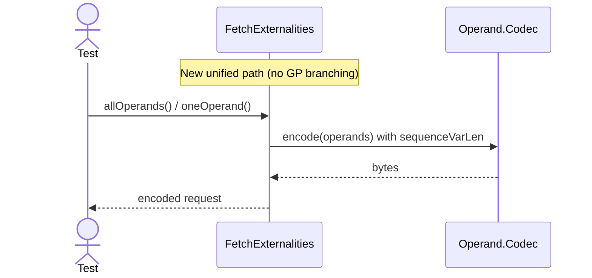
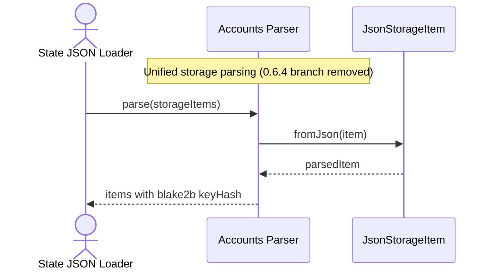

# Remove 0.6.4

## Pull Request by @tomusdrw

Should go after #571 

Also waiting for #570 to support migrating E2E tests to latest 0.6.7 version.

Tests migrated to 0.6.6, because 0.6.7 do not import correctly yet.

## Comment by @coderabbitai[bot]

<!-- This is an auto-generated comment: summarize by coderabbit.ai -->
<!-- This is an auto-generated comment: skip review by coderabbit.ai -->

> [!IMPORTANT]
> ## Review skipped
> 
> Auto incremental reviews are disabled on this repository.
> 
> Please check the settings in the CodeRabbit UI or the `.coderabbit.yaml` file in this repository. To trigger a single review, invoke the `@coderabbitai review` command.
> 
> You can disable this status message by setting the `reviews.review_status` to `false` in the CodeRabbit configuration file.

<!-- end of auto-generated comment: skip review by coderabbit.ai -->
<!-- walkthrough_start -->

📝 Walkthrough

<!-- This is an auto-generated comment: release notes by coderabbit.ai -->

## Summary by CodeRabbit

- Refactor
  - Dropped support for GrayPaper 0.6.4 across the app.
  - Standardized operand encoding and storage handling (no version branching).
  - Fixed tiny chain-spec preimage expunge period to 32.

- Tests
  - Updated compatibility baseline to 0.6.6.
  - Removed jamduna 0.6.4 test runner and related vector tests.

- Chores
  - Removed CI steps and workflows targeting 0.6.4.

<!-- end of auto-generated comment: release notes by coderabbit.ai -->
## Walkthrough
Removed GP 0.6.4 support across CI, enums, tests, and JAM code paths. Deleted jamduna 0.6.4 workflow and test runner. Consolidated version-dependent logic to single paths (operand encoding, storage parsing). Updated compatibility tests and enum to drop 0.6.4. Fixed tinyChainSpec preimageExpungePeriod to 32.

## Changes
| Cohort / File(s) | Summary |
|---|---|
| **CI workflows: remove 0.6.4** ` .github/workflows/src-test.yml`, `.github/workflows/vectors-jamduna-064.yml` | Dropped GP_VERSION=0.6.4 test step; removed jamduna 0.6.4 vectors workflow (import/state\_transition jobs). |
| **Test runner updates** `bin/test-runner/index.ts`, `bin/test-runner/jamduna-064.ts` | Disallowed JAMDUNA GP 0.6.4 in validation; deleted jamduna-064 runner script. |
| **Core compatibility** `packages/core/utils/compatibility.ts`, `packages/core/utils/compatibility.test.ts` | Removed GpVersion.V0\_6\_4 and from ordered list; adjusted tests to new baselines and expectations. |
| **JAM chain spec** `packages/jam/config/chain-spec.ts` | Set tinyChainSpec preimageExpungePeriod to 32; removed unused imports and version-based logic. |
| **JAM state JSON parsing** `packages/jam/state-json/accounts.ts` | Removed 0.6.4-specific storage parsing and hashing; always use JsonStorageItem.fromJson and blake2b hashing. |
| **JAM accumulate encoding** `packages/jam/transition/accumulate/accumulate.ts`, `packages/jam/transition/accumulate/operand.ts` | Removed 0.6.4 encoding branch and codec; use Operand.Codec for 0.6.5 or generic path; operand 0.6.4 class rewrite with no API change. |
| **JAM externalities** `packages/jam/transition/externalities/fetch-externalities.ts`, `packages/jam/transition/externalities/fetch-externalities.test.ts` | Simplified to single operand encoding path using Operand.Codec; removed version checks and legacy imports; updated tests accordingly. |

## Sequence Diagram(s)

## Estimated code review effort
🎯 3 (Moderate) | ⏱️ ~25 minutes

## Poem
> I nibble through the branches, version twigs no more,  
> 0.6.4 hops off the CI forest floor.  
> One path, clean tracks, through operand snow,  
> Preimages set, the tiny winds blow.  
> With lighter paws I bound and test—  
> Thump-thump, progress, onward quest! 🥕🐇

<!-- walkthrough_end -->
<!-- internal state start -->

<!-- DwQgtGAEAqAWCWBnSTIEMB26CuAXA9mAOYCmGJATmriQCaQDG+Ats2bgFyQAOFk+AIwBWJBrngA3EsgEBPRvlqU0AgfFwA6NPEgQAfACgjoCEYDEZyAAUASpETZWaCrKPR1AGxJcARDZLM+FKQAAwaAGwaACw+RgAi0gwU8Nzi+Bi+AMqw+Nge9ET46ABmNHxmAKwA7ACMsQb6xuBQZPT4xTgExGTKNPRMrOxcvPzCouJSMvJMSlSq6lo6jSZQcKiomJ2EpORUfQqDGJyQVADu9o7MzvJyCrMqapraumCGTaYGGkTqsNgCAPSnfAUADWxQ8+FOiH+iAoDDANEQmlkzA8HAMPkxBgskAAggBJbq7ah0C5OFz8DoMWCYUiIIz+QJSei4WAkSAAYXx9ho3EgrOoJ2wGGQiNwyFOP0gAHErAB9ABqAFEbJl8QB5AByAF4wpEogAaexFVnsoGg8GQyAYIoQjCkPgkAAeojw0hl8uVqo1mtCEWi1u4zH50k0eI8Hn4pr4ssVKrVWpDSJ5JG4yAAFHqNBUjVnwrn/VUC1UNCFixoagBKE4BbRYYXU2mktB2oiQSWs/lsi4UCi5DC0eD2+wkXDYPlI1OIDRGcyWXEeMrUeDpUUm7tKBgeZzL1eUyDO7jA/bAnh/DzwBgHo7qeDSIxQTVFQ/Huj/bjny+QTfbvYrkXtpQ7KBIOxR3rQM4GEqSLwFc+wzOyFAkBId7nCQxTFMeXAALJ0PAjgYliDQfF8Px/ICwJghCUL/FIYjAogYBCGgzC0MKaBgCE4RRBoKJooRsQ4gSRK9KSDjkvI7SMDS9r3gYcCIQEQSkmBXiQOmpGsuR5pUZC0J0QQFCMcxrHsZx3G8ai1ZKGB5D0GgMrqAAEn8eJiP+EqUZa5yYXwYpDm2JlsRgDlipABkMeFlCIP+fr6hokD4rgCgYGBRDYEhLJApAQiCBmsFHhQyWYPQSIknKuBUCKt7pNWBBClg6Qjh4xRgDkk70BQwq7BKUpPkoGhCMgABMw0aE6RrYDFw5kChfYYGwRzhc48AqF4yDQEqmTQHGHLQOqqpyjYSoAGJGrGXoJr6mb+lElZGiVMBbTtmQAKr4pt6lBexlYJQ+iXMIVyW5QI6KQLonJsgwILILkyUIUaEJoLQordmFSHFA9A7SaIMP8HgXbst9IVJslEVGTWR4xYZ8jpuC2AYbI24CNCYpgOTiDVh2sAXAIIF5NIM7g1AmSjsg46QP1JCDSNY1Oug2NdQBGBBow8BCxDjLKaj7K0NQKhoIguvwEh9EuEappYAVx7IMTaBylxUT2GgxR9mpAgQtDyAoQ5KvBmVRUvCggPHpAGjh5AAA+IbsogLtu9LuBOpoBjC5ACotvAeuIsHQMXAwDDSFMkBEEh3DcAFkC+eg9jcKI8BgVegA4BAAQqGkAe/g0OALgEPLJMOQ7O67+BeBoSe4AA3PwWDMEgcHUkavBDuKCsHr2p6Pc66i9Z2NoYGAABelBFGVY7TqnmtKZMhPfvrAiG+yaBEHWFtslbIdFbbLHBfbjtVy2Hh77Qw7p7PGPtAz+1wM4ZKEBc6h3DglaONB2TFAAUAkEY9k4aygBnC82d3Smn/hGdBcDA63FLqmCuw5q6YHwNGSArd26dx7n3AKU8mqz0QPPWAi9+4r02JQPsfBN5Om3tadIh9j6QRFlAmgFUqrU1iiDMGEMORQzxnDO4JBEb4GRjrUmNZMYK36Oo2GBNCF2yimbHePMHB80UALc+adRYrwllLGWkBRrjSNErZAfs1ZY3oM6V0Od/EBxgecAAArgWQdcBCCNkP8NmStdjYMgHEJA3BtyyGQEhBwi5i4MGoOIYcg4kT/DtuZHi491ItlOGgHJv0L5QHxB0Cxgh/7wA8IgSaWTdEo2/EgXAFTv5mUdpg4qyAHJ2w5mAPJeR+FFQbmgMQkF1RSCoBGV+ZovLUX4HCNkSI9iklaAiQgrQrGGVIWTTO2dYqPVPiQBECiapYH8tQ08lisyGhQBgLc2BBwzQwHNdIi1kpGzHNwHxqZ8DU2BNMdRcMekgK7iCa5yL5mLiiskRuu4MCBPQEs1BYhIAyVoBee0CUkq5Kvi2b8JAvA51NEbTk3JJxpmMegRAiAu6rX2BIW5eLIAQm+AwSCc5wxLjSABeqhCfw7mlbDDoL4iqklPB+D2X52C3jko+Z8TogZvg1ReK88q/x7hAg3cCkFoLiDgqSBCNYUIkDQhhLCkAnLwCILAASD4PhqAwEk0MczuqUH+EOJQTox6IHRJiQS85CQ7FEqVS41x9yNlkvSBokATqnkIQAKVxNhOIr1NS4guOobRN8AGQlJBdeMPploeGwO6U4QFrTOD7G2+gw9gwAG0FQhDlOEOUPzB3DrlDmdOQ6R1VAALr8iKAOmdk6jTjtnXOhKaxkBXBBO6ddo7fkCrwZAYUswm1ZzxUaIpU1K4CPXnwbmN9xz4PoBeZMUk0ACq6WtdkGyYqri3d2PJyUpKEO8upY9l7pVGkEaeNg3Kn4oOBHBEpRACVoHLq0SuhD/2xQcBheA8tZXdgcJWjtbBwqrWxQBjAAB1H4cM4h0M5jWK4Q5xZ/JkqQCC6TcQKgABoAE1OV0LZHwEVX5nDsnYhhcYdAEpPjPJqq8uIrDcgzXScV2J5yLl6B5RdN8zV4qVQeA1r42h8GNVqm84hdWS3SOydMNozOGtoO+T8V5tUxPsF6kKY4kLSSbJzIwtrYIkn6IoRSzrXW+WOLhQcBE41+rAEYANQakQhowLsEZpkQpVOjbGrEQlE09GOSmiS6buNyQSIy0k6XkmhooLln+BXxQPRgLEkgmQkgpGSmFGkFByDcqrp80ZJNHnPMwIopqYppyJWStbVVkXWBNTwF0nVGYRUOiNOx/FDVdjVgebIp5lVpuvMgPzda6lMgnegC8mDkBbsknu+d6VJ1sAHyPrQe6KU0oZWbAd6KhKqDyCfbgbK7BkjSAJUOCQ+A930D2+2KUbMOYtfYg7binLEB1wYFa5sBdUz7Een54EpIwrcGoLAebSUgtDkB5bQzIqaz5P4djByRTcDUmZ/gNscGKYiPUCjzsjqwA1CA4pJkdKGWwSHCSVGqB0ZNc5WIzFuAwDbbvdjLeGuyUUrbN5bTQk9PmpleuXWohfwmf3Cqk8VnPPXnEHZrNeryChZgvayLSgnWoQPG6oqOE8JJaIhAVLBgqfQyQ9CJgSF/jre6f8AYVPxBqAvDEseoZCu+pKyJcrZIrgUikpp+z0BQzIEHtKUHVhMOUAOCn+Aaf1Bg/bS+iLhmMZeBJb7F1HcH4UvZNKbgCpoqxXTAe8I1YOM0GRvuA9U6n2x7yUeAcldDzjCFcjIQU1cBgqmUkWFO6FkpDUmFIpRtz7ZuyLkfIONgGbGBOeqSeG9zpiQFXkgJIKDqgoEqAAjtgC2JWColAEQMPqPk1CXj2n2MGPPoZhPmku/khF/j/v/oAR4OmEPiPkZP+BoAendB3KICwO6EgZ/mUKgQAS2JgeATgekHgSuhUE0mnKQSgb/pQRgVgRARgPQROpPnfmikhEyM2IrKmNuIXPQE+iweQWwegdQdgbRjwbOtWNqEQkbNIk9jkHkCYrjKvI/nXs/lwflIgAADJFxwCYDAHNIlw0G0ZBayTQEsDToToVDwErqRBWFazMhcpGxLJNRICmHcrmEYByFcGKHDrKH8hdTSxWEtz9h6wUiGw+HSqnrcCvpVwwFOEjpOz1RwFv4mFmEyQhG0HcHz4RGoLdIkBNJX6aG35IQBZYDUTtzHotpdiCioAUJf77IHjsGMAZRIRLTNHeBWFgHyGxRQHpGOFwE5FuFpL+Cx70B7oIpNgOGwEMGuG8GjZ+Tdg+DUQ+BNotrqHX5aE1j1H0qoILIoAdAuYv5WzIAdFlBdEkDsEgHWGjGQHVYrGZGHrTHOGzFEEUALEkA5IpGvpcBwGvBfHhDqTUS/YHpVC6B6BOFVAOzqSzw/aHE1GdSjgZRYA2RoAXENw1jzEoDIABCpCyAvEjFcF2E8YTGrETrZFFDz5rIbIALbI0nuhISewkg3z3xGwD40axSDxzacpb4770p1wDjsCuYb6KqcrZwOQrLzEBQeDyD1SZxEBYBPoT5co3zkDnB8my7kDG66ZSoGYkaW5bgKoGZSR25qoO4qZO6bb/RKZ2nubWZea2byAxSanUAA4cnIBKA0BiCkjCkICBkNzFA2qe7t6OpIQxb+5xZB6JbMC+rETh6R4gjR5J7k7x7iCJ7J7LhN4Z7ihFbxp4ilbEj7DiSF6SRUjVau6QCeEU7dhkCOCXYBDxJ8D4GQAqE+DfJ7G9o3xukyg2GxRtnMCwYXizz+aVzfK6kORQb0A3EzhQDNn0CcHFFhFOxDmEK4jGHGFxjehaiZByj4iahygHRxAqgg4NLQpsT47DiEJ6GZQjigYdAODlwWaCmAbZq4hTIpRGwAFkCFwFj6gkniLCrpAOhEl84YDwDfYdzyBU5GQkAch9HsBvGNR8A3H8GIBTwC4dmIbfDDiSgRiGJd79bdht59BGiIA5Cqp2Q/kNFDIJTXknS4ivTGE7SXSNqCF1jIBwkmmSr6Z7gWn0pWlm6mYjnqqO7eZ3iNlKgYDtlsDMBdlsbKS0BcAAAGm5ChPZfZA52ldJkA2ldu147Zel/4xlg82lmZ2ZseJAeZXSMeLADexZsg0a2lHudqsZUWvuve6ESZkACW+EqZyW6ZRg9ldIuWOZqUXqSeNIQ4YAuOog2eyWueSa+eNZaaxeDZ/065p6ylRs9AHp6KJlPg0SXWXZLgzl3Sex6YHIblRZG2MS50Y56QRoZeSImQ2AlalY7CGAqpkADGrICQAg2AbY/FHGq5iUbyQ4sgaidYmQeO0KWSKyLZ7IvAyEK4U034sgIUs8V4214WpASoBqwopAVglAK4/QLYDAeQQq6YSgkpSgS0s27cZGNAnKNxXMUoDkYELoy5LYLRUkAAzGNDAN2EOAKQMGCq5tuEODhsBnii2GaIbJTGIfVvIA5EbChTybDSwPDRSiCDhhbjwEhKdU8oeJdU8koNkpERtefKsN2CdVcGdRdbJNdckIoL8vyAtUtUOCtaIBBTaOcHUg0sgBDVPIQttShLkMgEwKvtKnSs/GhkhZAIWsWqWuWl9Y/NjFZXQT2agLLjORFrNUpiXmuFXHkB4ILRgMLQwFPGImzUhudR+FzTdbzdNQBDUAAJxyjDQhBhDZrqj0JgQMoDLHZdRiD+k+1FVQGQQWCWCzgm5mliXk3GZym2nmbLZdFlXyX2ZPju5QQxnwT+Xxl+5BXuqhUh71Bh5RUrJZkxUmQwgnZMQ8qBpKn9jijpXFYJp57t45VF71nBYFVXykiDq3TWGOwpV45WpXhIjAhIakolQG6coxJ1wZhD6Oz5qd23bL2kBJQBBGhgGOyPLH3MAnQwF721Qb3dhK2Dgq2RhL1UCkA8DODTRtgp48wCjwztTsjxIQ4kBkAz3cQX00BX032d2cq30O2GRIaX0aC9pwOzWZAFQXgR2lQIPv2IDUi1iGYS3AlTTshwMH1v0kBIMoMwPVyv0r2VrMDM1NmiEbXLlcFgCP2vJ0p0Pv2LGr30WVxPq40qmPzlx9grKwBcDJ5uiQCLFOSGw8y3A0gCPDiLGjWwCiwUAoSFz4j0C3rDgexoB7rDQCDqQuYCBVQ85NSyjMVNJrkT30BLbvmQAtyyA5yPROS4iZBORyhqgABaSoU8dRdYaqQ18grjiILcEIpjU0SGs1/gbOlcStlUI8Vc1EXApt8u/K1J+DXsmxPIh9luPhq0F4B8m+2MZUA4zgZSYkOD7IfDyjCAlKs4OmIlUlhmcqVu1pe4Odbm+dcltmClLpjmPl4W5dPuldgVAe8Wwe4VoeHw0V0gsVZ21U0q/wSpjgj1NA6zBcmz24NAfd5ZwkWVQ9qaI9AZ49QhKaX5gc1chtJRK6TsYZj8uzzAWz45fyiglcP9LxtWo4pIuINg0op5HI6o15HIDsDJ997InDz9HcljPM1cPZIFXzzTacr0qR7ehCKLgK391Ohm6Qw1+u7IcBh4Jqng8g4CgLwLcooL4LkLI6FQaSuaOFhhUY4mrRWA8+Ro5RkYJC6pJcZWX41LILYLSoHI14Mwlc+jbYz5dcVUAyXg9orIs1+IH88MXgmAEsj0CEV4sT79VtLx/g614h1y+46o8rJUDLh6T6FrygA4aSIrtLYrELaxYtkrUWsMlrA44sX9kAdrCrGgTVm46k0+n+bQHQAbVrjzQbUWDAdjDmymJqeI6mAZ9KwZ+w6YI5Pp/mAONKyODYHxVRydkARgC46d5uRmXT7TvT35sljphdjZltDZhmbpHmDbXpEl1uiq0Zvl4z0WVd0zyZYVaZDdEeTd2ZrdKzM2XdrzWzTl+A3rEEpZOeA9Jz1ZZzdZFz8krN1APO9N/zUyIhYAyMAystjuVpI2UbA41rTskhb14gRSkYEd+QR7SOo4OQKMsGcm7kUgw18rvkM5bYvshAi7NYpwyQ2zGMKG1AkuSbwrqbj0m9scfmfpeSbGdYCdHxcHDg68Z6lc17/Q24I2pOK8NxYAL1rQ0pwbItkmV48dy8KyKcqdppollbnTklNutbed9bybjbwzrmFm7bybObaHMLDZvbYzDqFdO1UzwVxhkIo7CzE7LdLESSD2/4/wzoZQIU6eCl/wxQo41IYA2nlAunm2meSIhzrTxzZWpzlWeVY92ahV5HFjmA1IlcdHfNIptwB76thChZqerVCKuMb7pKQywIl4dKurH9KrT289uKEYsgFs5ekFrYde1I+AsKgDo4baoDhHt7sbIbj0hHRXIthpbQWA9zMtbIONHg9SwJOLZoUopXNHYqf5tA2+HU5V9Une4wN8ghQQdKUkXgz8DAyFcludpZnIzVQX6eONBtHVWAQ5VVcSCSdVyKJXS7t7Jl4cOzD1bz+zC7S7MscHIp7rTj08w1pX2aGLaREOJo7c5+7o6Y9FN+WJpxAC/AS7+F9gmJJxOJ087Ii79rP2hmJD/rJ3bXCd6QT9/4ACnlLT2aarecg3zIOlTVgMLV832lRoulS3xlQ52lq3JANViSCeiANlWAdlKnSzU7Gn6QWnycZnmcLuBnRnsAJnzPQ2rPCllnmg4o3lLS6rGl6PplhHuP4v23jzhPGR2le3Gzh3JI/wIPgbQ0VPpliz0I9Pb2mnpnPPenSzhn3OnP+v5nLu/PXlZjVohL8g2lEvEFTjdAlY2aSlUrw4+r4nyxXA3VK87rRDvr7I9vUPcbhPp4OLAU0KTI3zPNfAsL8PkYXnf9zU8m9AQDeX1PBXMbbXxlj0wfoPZXDAxlFX08zFozXuWiAVsWNdszSnGZtP2van07ryTPOnvPRvHPXPbfhv04K7GVa7dnG7Dno9ma/06DgMmDCl33oPHruLfNJ0HP513fm2GtaPlcNjrnD8afCLAUCUsRnYAChHiA6YR22MjmhHJ/4i4t9Xktp6LKrXcbIuv9pGTxLafyJAGcFAphWATXFAU5cus5YcEvFPDx90gdKJPjSHBQMpU+kPUHoV2h7VwR456DfoYVmp3cFc5VbugCRVIUlRe7oTHu5WC6cp7m6KAlLQD7Acos+ULJxlPAu7qtYYYTWAQq124aB9uezZXqrxKindnOE9b2OwzVonJPmc/H+qjEFBy1dqiAYapRylKVcPQzFPCtCkSYDwsAwje0GpAj5AD8WiAn7sJXLZsdraHHbtjaWVRTd7S8HT0s7iGbZpi6JAcvn5Qmaydq+geEKrXwiqNADAKwa8BGy2CD1y6hwY4GcALxppbgCEOYI8EWAvBDAnguGuoDlBZxEAcoSZt2jlDhJIh7wKAH7WGgVAKgAgP2n7QAAcNQYoGDSiB+0qgWQ8IBUAYACBwgxQ4aFUAEAhBqgtAQzlUCiDDR0IVQWgE7HcHRCiasQ+IYkMcF0A5QFyfQEAA -->

<!-- internal state end -->
<!-- tips_start -->

---

🪧 Tips

### Chat

There are 3 ways to chat with [CodeRabbit](https://coderabbit.ai?utm_source=oss&utm_medium=github&utm_campaign=FluffyLabs/typeberry&utm_content=572):

- Review comments: Directly reply to a review comment made by CodeRabbit. Example:
  - `I pushed a fix in commit <commit_id>, please review it.`
  - `Open a follow-up GitHub issue for this discussion.`
- Files and specific lines of code (under the "Files changed" tab): Tag `@coderabbitai` in a new review comment at the desired location with your query.
- PR comments: Tag `@coderabbitai` in a new PR comment to ask questions about the PR branch. For the best results, please provide a very specific query, as very limited context is provided in this mode. Examples:
  - `@coderabbitai gather interesting stats about this repository and render them as a table. Additionally, render a pie chart showing the language distribution in the codebase.`
  - `@coderabbitai read the files in the src/scheduler package and generate a class diagram using mermaid and a README in the markdown format.`

### Support

Need help? Create a ticket on our [support page](https://www.coderabbit.ai/contact-us/support) for assistance with any issues or questions.

### CodeRabbit Commands (Invoked using PR/Issue comments)

Type `@coderabbitai help` to get the list of available commands.

### Other keywords and placeholders

- Add `@coderabbitai ignore` or `@coderabbit ignore` anywhere in the PR description to prevent this PR from being reviewed.
- Add `@coderabbitai summary` to generate the high-level summary at a specific location in the PR description.
- Add `@coderabbitai` anywhere in the PR title to generate the title automatically.

### Status, Documentation and Community

- Visit our [Status Page](https://status.coderabbit.ai) to check the current availability of CodeRabbit.
- Visit our [Documentation](https://docs.coderabbit.ai) for detailed information on how to use CodeRabbit.
- Join our [Discord Community](http://discord.gg/coderabbit) to get help, request features, and share feedback.
- Follow us on [X/Twitter](https://twitter.com/coderabbitai) for updates and announcements.

<!-- tips_end -->

## Comment by @github-actions[bot]

View all

| File | Benchmark | Ops |  |
|------|-----------|-----|--|
| [codec/bigint.compare.ts[0]](../blob/fbf61f774fdb1a64c5628967a00b423f357f76c9//_work/typeberry-runner-3/typeberry/typeberry/benchmarks/codec/bigint.compare.ts) | compare custom | 221167643.16 ±7.61% | fastest ✅ |
| [codec/bigint.compare.ts[1]](../blob/fbf61f774fdb1a64c5628967a00b423f357f76c9//_work/typeberry-runner-3/typeberry/typeberry/benchmarks/codec/bigint.compare.ts) | compare bigint | 212240582.31 ±5.38% | 4.04% slower |
| [codec/bigint.decode.ts[0]](../blob/fbf61f774fdb1a64c5628967a00b423f357f76c9//_work/typeberry-runner-3/typeberry/typeberry/benchmarks/codec/bigint.decode.ts) | decode custom | 130362393.28 ±4.49% | fastest ✅ |
| [codec/bigint.decode.ts[1]](../blob/fbf61f774fdb1a64c5628967a00b423f357f76c9//_work/typeberry-runner-3/typeberry/typeberry/benchmarks/codec/bigint.decode.ts) | decode bigint | 93585569.62 ±2.2% | 28.21% slower |
| [collections/map-set.ts[0]](../blob/fbf61f774fdb1a64c5628967a00b423f357f76c9//_work/typeberry-runner-3/typeberry/typeberry/benchmarks/collections/map-set.ts) | 2 gets + conditional set | 104483.28 ±0.87% | fastest ✅ |
| [collections/map-set.ts[1]](../blob/fbf61f774fdb1a64c5628967a00b423f357f76c9//_work/typeberry-runner-3/typeberry/typeberry/benchmarks/collections/map-set.ts) | 1 get 1 set | 51213.86 ±0.95% | 50.98% slower |
| [bytes/hex-from.ts[0]](../blob/fbf61f774fdb1a64c5628967a00b423f357f76c9//_work/typeberry-runner-3/typeberry/typeberry/benchmarks/bytes/hex-from.ts) | parse hex using `Number` with NaN checking | 122084.24 ±0.76% | 84.58% slower |
| [bytes/hex-from.ts[1]](../blob/fbf61f774fdb1a64c5628967a00b423f357f76c9//_work/typeberry-runner-3/typeberry/typeberry/benchmarks/bytes/hex-from.ts) | parse hex from char codes | 791588.86 ±0.81% | fastest ✅ |
| [bytes/hex-from.ts[2]](../blob/fbf61f774fdb1a64c5628967a00b423f357f76c9//_work/typeberry-runner-3/typeberry/typeberry/benchmarks/bytes/hex-from.ts) | parse hex from string nibbles | 498402.69 ±1.02% | 37.04% slower |
| [bytes/hex-to.ts[0]](../blob/fbf61f774fdb1a64c5628967a00b423f357f76c9//_work/typeberry-runner-3/typeberry/typeberry/benchmarks/bytes/hex-to.ts) | number toString + padding | 288818.34 ±1.18% | fastest ✅ |
| [bytes/hex-to.ts[1]](../blob/fbf61f774fdb1a64c5628967a00b423f357f76c9//_work/typeberry-runner-3/typeberry/typeberry/benchmarks/bytes/hex-to.ts) | manual | 14386.63 ±1.33% | 95.02% slower |
| [hash/index.ts[0]](../blob/fbf61f774fdb1a64c5628967a00b423f357f76c9//_work/typeberry-runner-3/typeberry/typeberry/benchmarks/hash/index.ts) | hash with numeric representation | 166.51 ±1.88% | 31.07% slower |
| [hash/index.ts[1]](../blob/fbf61f774fdb1a64c5628967a00b423f357f76c9//_work/typeberry-runner-3/typeberry/typeberry/benchmarks/hash/index.ts) | hash with string representation | 108.94 ±1.07% | 54.9% slower |
| [hash/index.ts[2]](../blob/fbf61f774fdb1a64c5628967a00b423f357f76c9//_work/typeberry-runner-3/typeberry/typeberry/benchmarks/hash/index.ts) | hash with symbol representation | 159.25 ±1.74% | 34.07% slower |
| [hash/index.ts[3]](../blob/fbf61f774fdb1a64c5628967a00b423f357f76c9//_work/typeberry-runner-3/typeberry/typeberry/benchmarks/hash/index.ts) | hash with uint8 representation | 150.87 ±0.83% | 37.54% slower |
| [hash/index.ts[4]](../blob/fbf61f774fdb1a64c5628967a00b423f357f76c9//_work/typeberry-runner-3/typeberry/typeberry/benchmarks/hash/index.ts) | hash with packed representation | 241.56 ±0.56% | fastest ✅ |
| [hash/index.ts[5]](../blob/fbf61f774fdb1a64c5628967a00b423f357f76c9//_work/typeberry-runner-3/typeberry/typeberry/benchmarks/hash/index.ts) | hash with bigint representation | 159.57 ±1.34% | 33.94% slower |
| [hash/index.ts[6]](../blob/fbf61f774fdb1a64c5628967a00b423f357f76c9//_work/typeberry-runner-3/typeberry/typeberry/benchmarks/hash/index.ts) | hash with uint32 representation | 178.94 ±0.95% | 25.92% slower |
| [logger/index.ts[0]](../blob/fbf61f774fdb1a64c5628967a00b423f357f76c9//_work/typeberry-runner-3/typeberry/typeberry/benchmarks/logger/index.ts) | console.log with string concat | 5568774.22 ±65.16% | fastest ✅ |
| [logger/index.ts[1]](../blob/fbf61f774fdb1a64c5628967a00b423f357f76c9//_work/typeberry-runner-3/typeberry/typeberry/benchmarks/logger/index.ts) | console.log with args | 1398222.18 ±86.13% | 74.89% slower |
| [math/add_one_overflow.ts[0]](../blob/fbf61f774fdb1a64c5628967a00b423f357f76c9//_work/typeberry-runner-3/typeberry/typeberry/benchmarks/math/add_one_overflow.ts) | add and take modulus | 205376379.83 ±7.76% | fastest ✅ |
| [math/add_one_overflow.ts[1]](../blob/fbf61f774fdb1a64c5628967a00b423f357f76c9//_work/typeberry-runner-3/typeberry/typeberry/benchmarks/math/add_one_overflow.ts) | condition before calculation | 201327137.98 ±8.21% | 1.97% slower |
| [math/count-bits-u32.ts[0]](../blob/fbf61f774fdb1a64c5628967a00b423f357f76c9//_work/typeberry-runner-3/typeberry/typeberry/benchmarks/math/count-bits-u32.ts) | standard method | 71739518.54 ±1.69% | 64.22% slower |
| [math/count-bits-u32.ts[1]](../blob/fbf61f774fdb1a64c5628967a00b423f357f76c9//_work/typeberry-runner-3/typeberry/typeberry/benchmarks/math/count-bits-u32.ts) | magic | 200496375.74 ±7.42% | fastest ✅ |
| [math/count-bits-u64.ts[0]](../blob/fbf61f774fdb1a64c5628967a00b423f357f76c9//_work/typeberry-runner-3/typeberry/typeberry/benchmarks/math/count-bits-u64.ts) | standard method | 1159131.6 ±2.08% | 79.38% slower |
| [math/count-bits-u64.ts[1]](../blob/fbf61f774fdb1a64c5628967a00b423f357f76c9//_work/typeberry-runner-3/typeberry/typeberry/benchmarks/math/count-bits-u64.ts) | magic | 5622175.75 ±1.97% | fastest ✅ |
| [math/mul_overflow.ts[0]](../blob/fbf61f774fdb1a64c5628967a00b423f357f76c9//_work/typeberry-runner-3/typeberry/typeberry/benchmarks/math/mul_overflow.ts) | multiply and bring back to u32 | 204236669.52 ±7.26% | 2.27% slower |
| [math/mul_overflow.ts[1]](../blob/fbf61f774fdb1a64c5628967a00b423f357f76c9//_work/typeberry-runner-3/typeberry/typeberry/benchmarks/math/mul_overflow.ts) | multiply and take modulus | 208975734.66 ±8.55% | fastest ✅ |
| [math/switch.ts[0]](../blob/fbf61f774fdb1a64c5628967a00b423f357f76c9//_work/typeberry-runner-3/typeberry/typeberry/benchmarks/math/switch.ts) | switch | 229170561.68 ±5.91% | fastest ✅ |
| [math/switch.ts[1]](../blob/fbf61f774fdb1a64c5628967a00b423f357f76c9//_work/typeberry-runner-3/typeberry/typeberry/benchmarks/math/switch.ts) | if | 220384521.25 ±6.92% | 3.83% slower |
| [codec/decoding.ts[0]](../blob/fbf61f774fdb1a64c5628967a00b423f357f76c9//_work/typeberry-runner-3/typeberry/typeberry/benchmarks/codec/decoding.ts) | manual decode | 11635501.78 ±3.31% | 92.23% slower |
| [codec/decoding.ts[1]](../blob/fbf61f774fdb1a64c5628967a00b423f357f76c9//_work/typeberry-runner-3/typeberry/typeberry/benchmarks/codec/decoding.ts) | int32array decode | 143959294.03 ±4.24% | 3.85% slower |
| [codec/decoding.ts[2]](../blob/fbf61f774fdb1a64c5628967a00b423f357f76c9//_work/typeberry-runner-3/typeberry/typeberry/benchmarks/codec/decoding.ts) | dataview decode | 149721701.32 ±3.92% | fastest ✅ |
| [codec/encoding.ts[0]](../blob/fbf61f774fdb1a64c5628967a00b423f357f76c9//_work/typeberry-runner-3/typeberry/typeberry/benchmarks/codec/encoding.ts) | manual encode | 2053655.05 ±2.04% | 40.19% slower |
| [codec/encoding.ts[1]](../blob/fbf61f774fdb1a64c5628967a00b423f357f76c9//_work/typeberry-runner-3/typeberry/typeberry/benchmarks/codec/encoding.ts) | int32array encode | 3211361.79 ±2.87% | 6.48% slower |
| [codec/encoding.ts[2]](../blob/fbf61f774fdb1a64c5628967a00b423f357f76c9//_work/typeberry-runner-3/typeberry/typeberry/benchmarks/codec/encoding.ts) | dataview encode | 3433723.82 ±1.46% | fastest ✅ |
| [codec/view_vs_collection.ts[0]](../blob/fbf61f774fdb1a64c5628967a00b423f357f76c9//_work/typeberry-runner-3/typeberry/typeberry/benchmarks/codec/view_vs_collection.ts) | Get first element from Decoded | 28026.25 ±0.82% | 56.32% slower |
| [codec/view_vs_collection.ts[1]](../blob/fbf61f774fdb1a64c5628967a00b423f357f76c9//_work/typeberry-runner-3/typeberry/typeberry/benchmarks/codec/view_vs_collection.ts) | Get first element from View | 64161.85 ±2.38% | fastest ✅ |
| [codec/view_vs_collection.ts[2]](../blob/fbf61f774fdb1a64c5628967a00b423f357f76c9//_work/typeberry-runner-3/typeberry/typeberry/benchmarks/codec/view_vs_collection.ts) | Get 50th element from Decoded | 21663.55 ±2.27% | 66.24% slower |
| [codec/view_vs_collection.ts[3]](../blob/fbf61f774fdb1a64c5628967a00b423f357f76c9//_work/typeberry-runner-3/typeberry/typeberry/benchmarks/codec/view_vs_collection.ts) | Get 50th element from View | 29960.6 ±2.02% | 53.3% slower |
| [codec/view_vs_collection.ts[4]](../blob/fbf61f774fdb1a64c5628967a00b423f357f76c9//_work/typeberry-runner-3/typeberry/typeberry/benchmarks/codec/view_vs_collection.ts) | Get last element from Decoded | 21226.27 ±2.54% | 66.92% slower |
| [codec/view_vs_collection.ts[5]](../blob/fbf61f774fdb1a64c5628967a00b423f357f76c9//_work/typeberry-runner-3/typeberry/typeberry/benchmarks/codec/view_vs_collection.ts) | Get last element from View | 20727.76 ±3.58% | 67.69% slower |
| [codec/view_vs_object.ts[0]](../blob/fbf61f774fdb1a64c5628967a00b423f357f76c9//_work/typeberry-runner-3/typeberry/typeberry/benchmarks/codec/view_vs_object.ts) | Get the first field from Decoded | 421648.3 ±1.1% | fastest ✅ |
| [codec/view_vs_object.ts[1]](../blob/fbf61f774fdb1a64c5628967a00b423f357f76c9//_work/typeberry-runner-3/typeberry/typeberry/benchmarks/codec/view_vs_object.ts) | Get the first field from View | 96377.19 ±0.86% | 77.14% slower |
| [codec/view_vs_object.ts[2]](../blob/fbf61f774fdb1a64c5628967a00b423f357f76c9//_work/typeberry-runner-3/typeberry/typeberry/benchmarks/codec/view_vs_object.ts) | Get the first field as view from View | 94084.58 ±1.83% | 77.69% slower |
| [codec/view_vs_object.ts[3]](../blob/fbf61f774fdb1a64c5628967a00b423f357f76c9//_work/typeberry-runner-3/typeberry/typeberry/benchmarks/codec/view_vs_object.ts) | Get two fields from Decoded | 348647.83 ±2.37% | 17.31% slower |
| [codec/view_vs_object.ts[4]](../blob/fbf61f774fdb1a64c5628967a00b423f357f76c9//_work/typeberry-runner-3/typeberry/typeberry/benchmarks/codec/view_vs_object.ts) | Get two fields from View | 60122.31 ±1.61% | 85.74% slower |
| [codec/view_vs_object.ts[5]](../blob/fbf61f774fdb1a64c5628967a00b423f357f76c9//_work/typeberry-runner-3/typeberry/typeberry/benchmarks/codec/view_vs_object.ts) | Get two fields from materialized from View | 152371.88 ±3.42% | 63.86% slower |
| [codec/view_vs_object.ts[6]](../blob/fbf61f774fdb1a64c5628967a00b423f357f76c9//_work/typeberry-runner-3/typeberry/typeberry/benchmarks/codec/view_vs_object.ts) | Get two fields as views from View | 74896.87 ±1.6% | 82.24% slower |
| [codec/view_vs_object.ts[7]](../blob/fbf61f774fdb1a64c5628967a00b423f357f76c9//_work/typeberry-runner-3/typeberry/typeberry/benchmarks/codec/view_vs_object.ts) | Get only third field from Decoded | 396828.26 ±2.39% | 5.89% slower |
| [codec/view_vs_object.ts[8]](../blob/fbf61f774fdb1a64c5628967a00b423f357f76c9//_work/typeberry-runner-3/typeberry/typeberry/benchmarks/codec/view_vs_object.ts) | Get only third field from View | 98254.36 ±1.2% | 76.7% slower |
| [codec/view_vs_object.ts[9]](../blob/fbf61f774fdb1a64c5628967a00b423f357f76c9//_work/typeberry-runner-3/typeberry/typeberry/benchmarks/codec/view_vs_object.ts) | Get only third field as view from View | 84558.09 ±1.96% | 79.95% slower |
| [bytes/compare.ts[0]](../blob/fbf61f774fdb1a64c5628967a00b423f357f76c9//_work/typeberry-runner-3/typeberry/typeberry/benchmarks/bytes/compare.ts) | Comparing Uint32 bytes | 15311.39 ±3.22% | 4.75% slower |
| [bytes/compare.ts[1]](../blob/fbf61f774fdb1a64c5628967a00b423f357f76c9//_work/typeberry-runner-3/typeberry/typeberry/benchmarks/bytes/compare.ts) | Comparing raw bytes | 16074.61 ±3.7% | fastest ✅ |
| [hash/blake2b.ts[0]](../blob/fbf61f774fdb1a64c5628967a00b423f357f76c9//_work/typeberry-runner-3/typeberry/typeberry/benchmarks/hash/blake2b.ts) | hasher with simple allocator | 0.0451 ±0.88% | 0.66% slower |
| [hash/blake2b.ts[1]](../blob/fbf61f774fdb1a64c5628967a00b423f357f76c9//_work/typeberry-runner-3/typeberry/typeberry/benchmarks/hash/blake2b.ts) | hasher with page allocator | 0.0454 ±0.07% | fastest ✅ |
| [collections/map_vs_sorted.ts[0]](../blob/fbf61f774fdb1a64c5628967a00b423f357f76c9//_work/typeberry-runner-3/typeberry/typeberry/benchmarks/collections/map_vs_sorted.ts) | Map | 307285.38 ±0.05% | fastest ✅ |
| [collections/map_vs_sorted.ts[1]](../blob/fbf61f774fdb1a64c5628967a00b423f357f76c9//_work/typeberry-runner-3/typeberry/typeberry/benchmarks/collections/map_vs_sorted.ts) | Map-array | 103742.8 ±0.03% | 66.24% slower |
| [collections/map_vs_sorted.ts[2]](../blob/fbf61f774fdb1a64c5628967a00b423f357f76c9//_work/typeberry-runner-3/typeberry/typeberry/benchmarks/collections/map_vs_sorted.ts) | Array | 78509.45 ±0.29% | 74.45% slower |
| [collections/map_vs_sorted.ts[3]](../blob/fbf61f774fdb1a64c5628967a00b423f357f76c9//_work/typeberry-runner-3/typeberry/typeberry/benchmarks/collections/map_vs_sorted.ts) | SortedArray | 197711.85 ±0.36% | 35.66% slower |
| [crypto/ed25519.ts[0]](../blob/fbf61f774fdb1a64c5628967a00b423f357f76c9//_work/typeberry-runner-3/typeberry/typeberry/benchmarks/crypto/ed25519.ts) | native crypto | 5.97 ±17.96% | 80.01% slower |
| [crypto/ed25519.ts[1]](../blob/fbf61f774fdb1a64c5628967a00b423f357f76c9//_work/typeberry-runner-3/typeberry/typeberry/benchmarks/crypto/ed25519.ts) | wasm lib | 10.64 ±0.02% | 64.37% slower |
| [crypto/ed25519.ts[2]](../blob/fbf61f774fdb1a64c5628967a00b423f357f76c9//_work/typeberry-runner-3/typeberry/typeberry/benchmarks/crypto/ed25519.ts) | wasm lib batch | 29.86 ±0.5% | fastest ✅ |

### Benchmarks summary: 63/63 OK ✅

<!-- thollander/actions-comment-pull-request "benchmarks" -->

## Comment by @skoszuta

also remove the test-runner command from test-runner/package.json please

## Comment by @mateuszsikora

shouldn't it be a noop?

## Comment by @tomusdrw

`insert` is a no-op. The fact that `comparator(a, b) === Equal` does not imply that `a === b`. `replace` will put the new ref in place of the previous one, while `insert` will ignore the update.

This is useful for `state`, since we have a sorted set of `key-value` items and and we sort only by `key`. However when the value changes we want to replace the entire item.
