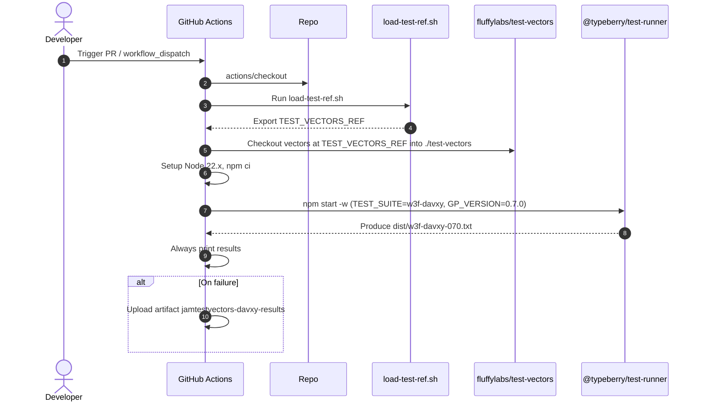
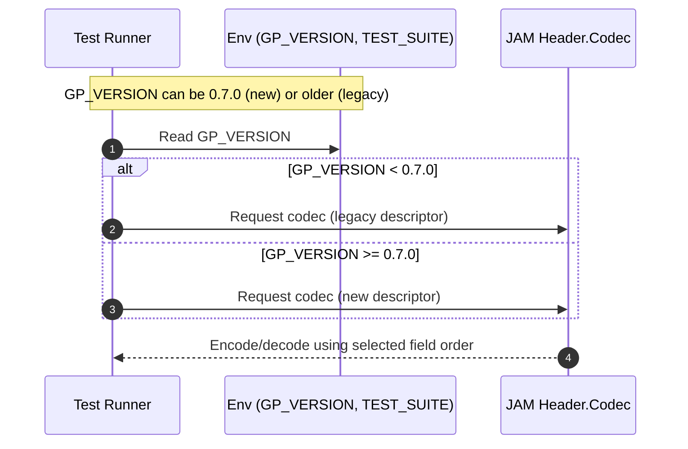

# 0.7.0 header encoding order and davxy test runner

## Pull Request by @skoszuta

- updated header encoding order
- added test runner for davxy 0.7.0
- skipped preimage and storage tests because of encoding issues which shall be resolved in another PR


## Comment by @coderabbitai[bot]

<!-- This is an auto-generated comment: summarize by coderabbit.ai -->
<!-- This is an auto-generated comment: skip review by coderabbit.ai -->

> [!IMPORTANT]
> ## Review skipped
> 
> Auto incremental reviews are disabled on this repository.
> 
> Please check the settings in the CodeRabbit UI or the `.coderabbit.yaml` file in this repository. To trigger a single review, invoke the `@coderabbitai review` command.
> 
> You can disable this status message by setting the `reviews.review_status` to `false` in the CodeRabbit configuration file.

<!-- end of auto-generated comment: skip review by coderabbit.ai -->
<!-- walkthrough_start -->

<details>
<summary>📝 Walkthrough</summary>

<!-- This is an auto-generated comment: release notes by coderabbit.ai -->

## Summary by CodeRabbit

* **New Features**
  * Added support for protocol version 0.7.0, including version-aware JAM block header encoding with automatic selection and backward compatibility for pre-0.7.0 headers.
* **Tests**
  * Introduced a dedicated test runner and CI workflow to execute W3F DAVXY test vectors for 0.7.0, with result output and artifact upload on failures.
* **Chores**
  * Updated internal reference for test vectors to the latest revision.

<!-- end of auto-generated comment: release notes by coderabbit.ai -->
## Walkthrough
Adds W3F DAVXY 0.7.0 test support across CI and test-runner, updates the test vectors ref, and introduces version-aware JAM block header encoding that selects legacy vs new field order based on GP version.

## Changes
| Cohort / File(s) | Summary |
|---|---|
| **CI: Vectors workflow and ref**<br>` .github/scripts/load-test-ref.sh`, `.github/workflows/vectors-w3f-davxy-070.yml` | Updates TEST_VECTORS_REF to a new commit. Adds a new GitHub Actions workflow to run W3F DAVXY 0.7.0 vectors on self-hosted Node.js 22, fetch vectors, run test-runner, print results, and upload artifact on failure. |
| **Test runner: DAVXY 0.7.0 support**<br>`bin/test-runner/index.ts`, `bin/test-runner/package.json`, `bin/test-runner/w3f-davxy-070.ts` | Extends accepted GP versions to include V0_7_0. Adds npm script `w3f-davxy:0.7.0`. Introduces an entrypoint to run `w3f-davxy_070` with predefined accept/ignore filters and logging/exit behavior. |
| **JAM header: version-aware codec**<br>`packages/jam/block/header.ts` | Implements GP-version-gated codec selection between a legacy descriptor (<0.7.0) and the new descriptor (>=0.7.0). Reorders `Header` fields to align with the new encoding order; preserves legacy order via separate descriptor. |

## Sequence Diagram(s)




## Estimated code review effort
🎯 4 (Complex) | ⏱️ ~60 minutes

## Poem
> I nudge the gears from six to seven-oh,  
> With vectors fetched where moonwinds blow.  
> A header learns the paths of old,  
> And new—both codecs neatly told.  
> I thump my paws: the tests now run—  
> Carrots cached, results hard-won. 🥕✨

</details>

<!-- walkthrough_end -->
<!-- internal state start -->


<!-- DwQgtGAEAqAWCWBnSTIEMB26CuAXA9mAOYCmGJATmriQCaQDG+Ats2bgFyQAOFk+AIwBWJBrngA3EsgEBPRvlqU0AgfFwA6NPEgQAfACgjoCEYDEZyAAUASpETZWaCrKPR1AGxJdaaCQA95AAYNAHYNIMgaRFxICmwMcj5IAwA5RwFKLgBWUIBmSBSAVRsAGS5YXFxuRA4AejqidVhsAQ0mZjqAMQ9sADM+2VKVRDrcWW4STIoXOu5sDw863ILixCz7AGt8RAAvPDRCgwBlfGwKBhJIASoMBlguRE2wXwDZMCDQoLBo3DB4xKUI7QZykWI3TD3LjMbRYFLHXDUbC1fiTOEGGwkCTwEgAd0oKIAFBh8ORIB4kDRaABKI7DTIeIkkskUmJ0WkpADCFBI1Do6E4kAATEEhdkPgAOMBCgCc0AAjAAWDhBeUcPKhABaRgAItIGBR4NxxKSOAYoNhuL4qZBYLylHwyExaPAMER+BQHUcoGhaEp6L84gkkpA+vg+K9ApAQuFIikoE8jZN6LwSPAYaR0Bh6DFw2hM78ZKI0Mirvg+pAnYpXe6kA5pJBcQh7vZYGhFtcrjzEPgPFJ6K6s/hcHa+LYjPpjOAoGR6OWcARiGRlDaOmwMILePxhKJxFIZPJncpVOotDpJyYoHBUKhMAvCKQknz6Gv2FwqLj7I4YS5rofFMeaiaNouhgIYU6mAYGhNCOrR1IgBpGrgowePgvo/NIfw8n0GiIA8BgAEREQYFiQAAggAkkuT42g4Ti/vO9yYKQiATjAdqQDYACiXSQBI7bYFcg7Qc0cEIYaxooWhtAYTE/wkDheGMG2boNn0FAsJAABseSKr6JB5FpWnZFpvjyqEMrygwQpaeZAiimgJAkEqfRoJciokKEoS0DKUT4KGMpoEEtDZH0QqeaEAjyvKEqKgwQR5CQipBLFEoMGgfTZFl0V5K58pZSQGjsVc4lIfY4gdiQ/jcOGyEwFxxzQAA+gAalxnLQAA8jYxxNdxvHIjWUQcYSlrWuynE8XxAkkAA3JAJL8COQKoU0DAegoG4aR4oaoZ+TGqYgGhGOYlhkR4NBUCaGDIAQw1XEoDAeM41DwKSyDzlVNUUDa4Y8K0FLrew6g4qx5qQKkpIkEYXExOmz4KEocRYjin4KWGP1cAAsnQ8COIRxHmpBImwQIdS4uGmx9HtoxSGI4aIGAuK5S8fiBB8XwaLIzAeGaREESRZ1UY+K78nRP7yIxKksUYZF+sghzkJ+ADi6gABKtORYhvTdjaU9T+CftQkAky0ZMUxQVM03UdMEBQjPM30rNvBzITcztGBoGw9AEZG8iO1EmF8buDPRmEEQEUVcBXBbVuG1EhpEKQ9v8FgscG7iTUuog3DUC2mApgsHhNTyACOgkxH5kAwq6AA0Wb0EofSug2ZDYhpGDrrE/GGioXgotADXNW1HXdb1/WQISqH6fQcjoPYiHGtS9fK1YrVcT1FGdak9gkLEd0xhE9cF/VjVNccRQUYPu/7/5jvO4ERUUbEAIfVghzrB4TuwDsNoAiGuJmjz0hkoDQQhkBCiFBofw1dqCGn8FHDiQhBC7UNmaKAnI7QMG2Hge6yMaqIHUOGWQx0oA2ASOSaSsksIKVwrAKuqZc48jwYGbClAnSFXBpg0QOD94cUDLbUO6lNLU36IMZ6AhRi/DAIIlOro7oaDGJhGRIcU7G2WvYSYDB4DN35NhRsQCHACGYIoBY0hSGQGOHvS0EMAJgIgVAmBgCRwLW4MwRgbk7QWIojdREHYlBoiUHcUGfF4CKzcYweAFiETOD4VcVhwYgSxxzm5K4AABcYkxpizGkf/IEg03SuPcTEWJuhcQWPOriNAshkDZ24M9eQ3YFh1TnulKoQ1s64HJizP2rsNC4H8JocGnUsCuXgL0Hk9dLTT0bpSbpTtemfBCAM2IaAFbvx+jotysRPbe0gEIL2vxZGM16U0i6R0TqC3IhdFcOtbr+Q0Y9Z6V07n8ArF9Wq/I/rzAEIDSsG4QbSDYpDcgMM4YwlXABZG2I8SVgGLVbGuN8b8wnJBNQGAlFyTyRQOorolAIOQnzYipFKLUVFjmb8zhJYVgOjLcGOoyItQABoAE0vzqCuCSI2DBLiSSzOgP0INSTtkgKvdem9t5cBakEJqoQmohGKpAP2LUCSvOcFQf2azKyDNnPyYR7iADa0qmpaRNfXY1prQgAF0q5GplaarS5r7WyqdbK+VVqirnR2sOUc00KTWh1p2Ns2I/o8hrrrDRiAvbeBQBWKQ9sdZdA0swLiGAJAoGQCSWIg4NGslwMfLAlANJ8FQCODSuIsB5qGhovw2gJFeGDgm9680dF+vgLQeuGj42ENJBm8qElkxvKVcOdZ9A0DcECfyO6kbsAcugPgch78iwY0KrYpavrVrwHWn9JgW1eyoP2tLcxlySU3Jee9KujzRDPNehez61VPlzj4D8v5wNxBAvBpDZSzEGx3Q+T9OgcwAZbqVdel610LkGFhuICF/IjzQtRnCjGgocYumRYTCAYAjDosxVhRJOLc7YPzIVcBpoCYCxJcLZcV0xaUoYjSo9YMoBy1oArBasLAylWNP83Av47o4dyfhuYblNjEfsaSRBnLYVcdiJsEg8hUD3z9iqcOkQT7qGQGuE+6w6pirahK1IABeQ+QR66DzPhfK+XFDNKbZrIAt9BX5REQDA3tijbMuyWf0o67FUDMHgDMUOVVKRDQ81GGTyAMY8ENH9Vejae03WOidU9l1b0RoeRxJ54HXn3u+r9Z9wGgYAvfUxyxi9Vl+joFwAABmF2QKnYzVZQFgarAnlHYuE0R0g4mMBNYSF6arEWmvOPofxXoVxqsET0xvY4W8jMmdPs1Szg8bM9Ls85mB7m1uec5shAi1WkvQfhpCpGPIYVo3hZjSAqG8bMHI6irDBg2tYqE3VvphL7uUbJTRil9FqXfsOrLeW88laBxe4CPgMnriulw/8V7232ZebqlFqqog8DVo4gAdTyLxARqjIC+zs/Kr4kdFXNwbemPLyBVrJwbrAwc+qTZ1DXBJ8BdPsWReTUzx2dQOf2M7XaLA6VFjIHDQYkcXANEc+3CIMQ9dOSlAougCgRBkCEl4PgS4iAjqggkLhQGJBCRCmpMvFhQdZE8GoPQgi0jjnzIfrIYnQQCIOf5fgY0OWdxiE0aIHRsghpuV5VSLgBqbdUC1wRG16miAkh5AGcPDZXRPWwC6QpItCFHVI+/bMu940it46kjxNAiDhhCYSXMVBMwn1TPDFitIRvz1fBuBaw4hpVlT7WbXFcn6rKqJ4hsH9sA8ukMgFStAvB8DuqtPBZzu5hMoUnSgGhp8n0OGMiZVwx8T6rtPjRRa/rYkODTpf+++An2C3E6LmuR/i/ofBsA8pEGoEwn3JAdo2P+i3Qjdgv4aryKrgCPPDnL7s3OtNjrjubvjg3qmE3C3GOsPsaJCFcNHrHlcOTpdJBqdNcqlhBpeplmBuerrLlo+htC+iBm+qDMClDJPItP+lSEBr8iBlloQaLtWLojSIduCgjPBmdohujAitdkindiikTI9oRqJixHUAcp0L8prpsHUHaPpBQN5kShRkLN9gjOLFSkOrSh+sxsDt2jrGAGgFUswooV6O3kNFFgAFJkRYzXCoTYI+Y+K8amJa7zxeBEBuTyBKAyZ/S+GITorugaKpgfCqahg4geBPpejabOL3C/ocRqz2hL6cgATrR3Sfy7idi4D4hkB4KeHeGgZ+F8CEhRaGEXrABhyxi0h/QaKg4BESR2yTxRZKxAjlE3S0iH7zypHMC5ziBqAUjjB1DKzcAqpNpC5YKbAWIABChoboyAg4PRfR8AAx6g8gJ8IxYxCWVcDgE6tUeC7RYAAgaycGaRu8Xg2sEm4MmI4YDot0HE5hQIuiURoGT02WF6d0EKLYdRsKlhhStxGw5YfQuq9sWMzgcmJarB/YVcYYiw8cP+7usgpw5wlwx8FIMeoWQCIRv8YRsYRR5W4YFi0c5IJAXhDA8gfx7oAJJRoRJmtISevQvhluPIG4SRShasaysA9cvAb0FAMSNANg+Aw49cVUvGrohCDAHJeEna6YJAxwqEuAPi+KIpNU9wYJlslAMp2Ce8iA6pEJ9cQJIJup4Jmp1wBcBInsuA9w0xjhmwZEeAP8FASpVUIpe63ASJZwFwJAru6w7YSW14yAqY6wFA+4Zp2CphL4LAyxqx4wt+/AURQIjxKcTY4yyBtA7u4ghSissKDRSEf0LReIiZyR9sSWWB50OBry06+BbxLBQ6dBXyBWjBRW4gJWbExw8AMeSIzCY0z4jwiI4g60qRj0zWjAz02ukAbJXo6uImxGow0hdQsh2CChxZ3mtIXKkApYbGhxXhNouZxo4YZohQUA0xCk4YMaJSA5kAQ5ogkAhmiMogGgnIY5iAhIk5ppAA3ibBoEVAAL7UgGBHnkR9CXR9mvSDlnF3lHgMCPnPmvnFny5RmvQxkkJIClAj5wCYCEibGqoSbGpypBC0gAD8JJZJsgeoxRkAXAn535v5/5UAeoNZaWyM1JVW/0TZbywJ2YBIepQIGukwP08gJi0JI2g4bx45b5fAjOmQK6ZpXF9slp1ptp9pI44Yzp/gdQCJ7pyJXpVcGUl0PGGkWlnplwul6JacWJHE9R+ojRf01JnBMG3BUKvBvxl2goasHZsA92RM4El4/yc4FYJYi4IsP2CgrAb4cQJhX4f2f495VAJ4wE54YEBgvla46gTU7aiAJcKMhZtATUJSP0oEPl04kASowUsUQoQUDAFkWkMoMoQoAgtVtV+UIooQWkAgioDViooQCkEotAekEohVEEUAqVuA6VrGWV52dATUs4hVQAA=== -->

<!-- internal state end -->
<!-- tips_start -->

---


<details>
<summary>🪧 Tips</summary>

### Chat

There are 3 ways to chat with [CodeRabbit](https://coderabbit.ai?utm_source=oss&utm_medium=github&utm_campaign=FluffyLabs/typeberry&utm_content=573):

- Review comments: Directly reply to a review comment made by CodeRabbit. Example:
  - `I pushed a fix in commit <commit_id>, please review it.`
  - `Open a follow-up GitHub issue for this discussion.`
- Files and specific lines of code (under the "Files changed" tab): Tag `@coderabbitai` in a new review comment at the desired location with your query.
- PR comments: Tag `@coderabbitai` in a new PR comment to ask questions about the PR branch. For the best results, please provide a very specific query, as very limited context is provided in this mode. Examples:
  - `@coderabbitai gather interesting stats about this repository and render them as a table. Additionally, render a pie chart showing the language distribution in the codebase.`
  - `@coderabbitai read the files in the src/scheduler package and generate a class diagram using mermaid and a README in the markdown format.`

### Support

Need help? Create a ticket on our [support page](https://www.coderabbit.ai/contact-us/support) for assistance with any issues or questions.

### CodeRabbit Commands (Invoked using PR/Issue comments)

Type `@coderabbitai help` to get the list of available commands.

### Other keywords and placeholders

- Add `@coderabbitai ignore` or `@coderabbit ignore` anywhere in the PR description to prevent this PR from being reviewed.
- Add `@coderabbitai summary` to generate the high-level summary at a specific location in the PR description.
- Add `@coderabbitai` anywhere in the PR title to generate the title automatically.

### Status, Documentation and Community

- Visit our [Status Page](https://status.coderabbit.ai) to check the current availability of CodeRabbit.
- Visit our [Documentation](https://docs.coderabbit.ai) for detailed information on how to use CodeRabbit.
- Join our [Discord Community](http://discord.gg/coderabbit) to get help, request features, and share feedback.
- Follow us on [X/Twitter](https://twitter.com/coderabbitai) for updates and announcements.

</details>

<!-- tips_end -->


## Comment by @tomusdrw

@skoszuta can you take a look at the failure? I guess it's caused by the rename from `0.7.0` to `0.7.0-preview`. I guess the workflow can simply run the correct file and we can retire `index.ts` completely?


## Comment by @skoszuta

> @skoszuta can you take a look at the failure? I guess it's caused by the rename from `0.7.0` to `0.7.0-preview`. I guess the workflow can simply run the correct file and we can retire `index.ts` completely?

sure! it's been looked at


## Comment by @skoszuta

> @skoszuta can you take a look at the failure? I guess it's caused by the rename from `0.7.0` to `0.7.0-preview`. I guess the workflow can simply run the correct file and we can retire `index.ts` completely?

as to whether we can retire index.ts im not so sure. it's the one that generates a .txt report. its surely possible to get rid of it but id say its a waste of time while we have other pressing matters


## Comment by @tomusdrw

> > @skoszuta can you take a look at the failure? I guess it's caused by the rename from `0.7.0` to `0.7.0-preview`. I guess the workflow can simply run the correct file and we can retire `index.ts` completely?
> 
> as to whether we can retire index.ts im not so sure. it's the one that generates a .txt report. its surely possible to get rid of it but id say its a waste of time while we have other pressing matters

Ah, right! I forgot about the report. Let's keep it then.


## Comment by @github-actions[bot]


<details>
<summary>View all</summary>

| File | Benchmark | Ops |  |
|------|-----------|-----|--|
| [bytes/hex-from.ts[0]](../blob/5417ef4966d118fed10daa632c07d63b2511b6fb//_work/typeberry-runner-3/typeberry/typeberry/benchmarks/bytes/hex-from.ts) | parse hex using `Number` with NaN checking | 130077.97 ±0.33% | 85.02% slower |
| [bytes/hex-from.ts[1]](../blob/5417ef4966d118fed10daa632c07d63b2511b6fb//_work/typeberry-runner-3/typeberry/typeberry/benchmarks/bytes/hex-from.ts) | parse hex from char codes | 868344.69 ±0.35% | fastest ✅ |
| [bytes/hex-from.ts[2]](../blob/5417ef4966d118fed10daa632c07d63b2511b6fb//_work/typeberry-runner-3/typeberry/typeberry/benchmarks/bytes/hex-from.ts) | parse hex from string nibbles | 545156.13 ±0.29% | 37.22% slower |
| [logger/index.ts[0]](../blob/5417ef4966d118fed10daa632c07d63b2511b6fb//_work/typeberry-runner-3/typeberry/typeberry/benchmarks/logger/index.ts) | console.log with string concat | 7791514.6 ±42.12% | fastest ✅ |
| [logger/index.ts[1]](../blob/5417ef4966d118fed10daa632c07d63b2511b6fb//_work/typeberry-runner-3/typeberry/typeberry/benchmarks/logger/index.ts) | console.log with args | 790037.45 ±105.17% | 89.86% slower |
| [math/add_one_overflow.ts[0]](../blob/5417ef4966d118fed10daa632c07d63b2511b6fb//_work/typeberry-runner-3/typeberry/typeberry/benchmarks/math/add_one_overflow.ts) | add and take modulus | 255750508.7 ±6.33% | fastest ✅ |
| [math/add_one_overflow.ts[1]](../blob/5417ef4966d118fed10daa632c07d63b2511b6fb//_work/typeberry-runner-3/typeberry/typeberry/benchmarks/math/add_one_overflow.ts) | condition before calculation | 252613514.38 ±7.21% | 1.23% slower |
| [math/count-bits-u32.ts[0]](../blob/5417ef4966d118fed10daa632c07d63b2511b6fb//_work/typeberry-runner-3/typeberry/typeberry/benchmarks/math/count-bits-u32.ts) | standard method | 92406337.59 ±1.76% | 63.94% slower |
| [math/count-bits-u32.ts[1]](../blob/5417ef4966d118fed10daa632c07d63b2511b6fb//_work/typeberry-runner-3/typeberry/typeberry/benchmarks/math/count-bits-u32.ts) | magic | 256277279.34 ±6.14% | fastest ✅ |
| [math/count-bits-u64.ts[0]](../blob/5417ef4966d118fed10daa632c07d63b2511b6fb//_work/typeberry-runner-3/typeberry/typeberry/benchmarks/math/count-bits-u64.ts) | standard method | 3118767.52 ±5.05% | 96.21% slower |
| [math/count-bits-u64.ts[1]](../blob/5417ef4966d118fed10daa632c07d63b2511b6fb//_work/typeberry-runner-3/typeberry/typeberry/benchmarks/math/count-bits-u64.ts) | magic | 82181823.55 ±2.15% | fastest ✅ |
| [math/mul_overflow.ts[0]](../blob/5417ef4966d118fed10daa632c07d63b2511b6fb//_work/typeberry-runner-3/typeberry/typeberry/benchmarks/math/mul_overflow.ts) | multiply and bring back to u32 | 266049228.78 ±6.83% | 2.54% slower |
| [math/mul_overflow.ts[1]](../blob/5417ef4966d118fed10daa632c07d63b2511b6fb//_work/typeberry-runner-3/typeberry/typeberry/benchmarks/math/mul_overflow.ts) | multiply and take modulus | 272992308.61 ±7.8% | fastest ✅ |
| [math/switch.ts[0]](../blob/5417ef4966d118fed10daa632c07d63b2511b6fb//_work/typeberry-runner-3/typeberry/typeberry/benchmarks/math/switch.ts) | switch | 269116506.53 ±5.82% | 0.8% slower |
| [math/switch.ts[1]](../blob/5417ef4966d118fed10daa632c07d63b2511b6fb//_work/typeberry-runner-3/typeberry/typeberry/benchmarks/math/switch.ts) | if | 271293369.64 ±4.14% | fastest ✅ |
| [hash/index.ts[0]](../blob/5417ef4966d118fed10daa632c07d63b2511b6fb//_work/typeberry-runner-3/typeberry/typeberry/benchmarks/hash/index.ts) | hash with numeric representation | 187.45 ±0.65% | 28.9% slower |
| [hash/index.ts[1]](../blob/5417ef4966d118fed10daa632c07d63b2511b6fb//_work/typeberry-runner-3/typeberry/typeberry/benchmarks/hash/index.ts) | hash with string representation | 110.87 ±0.28% | 57.95% slower |
| [hash/index.ts[2]](../blob/5417ef4966d118fed10daa632c07d63b2511b6fb//_work/typeberry-runner-3/typeberry/typeberry/benchmarks/hash/index.ts) | hash with symbol representation | 184.08 ±0.26% | 30.18% slower |
| [hash/index.ts[3]](../blob/5417ef4966d118fed10daa632c07d63b2511b6fb//_work/typeberry-runner-3/typeberry/typeberry/benchmarks/hash/index.ts) | hash with uint8 representation | 164.39 ±0.2% | 37.65% slower |
| [hash/index.ts[4]](../blob/5417ef4966d118fed10daa632c07d63b2511b6fb//_work/typeberry-runner-3/typeberry/typeberry/benchmarks/hash/index.ts) | hash with packed representation | 263.65 ±0.76% | fastest ✅ |
| [hash/index.ts[5]](../blob/5417ef4966d118fed10daa632c07d63b2511b6fb//_work/typeberry-runner-3/typeberry/typeberry/benchmarks/hash/index.ts) | hash with bigint representation | 185.83 ±0.16% | 29.52% slower |
| [hash/index.ts[6]](../blob/5417ef4966d118fed10daa632c07d63b2511b6fb//_work/typeberry-runner-3/typeberry/typeberry/benchmarks/hash/index.ts) | hash with uint32 representation | 196.42 ±0.24% | 25.5% slower |
| [collections/map-set.ts[0]](../blob/5417ef4966d118fed10daa632c07d63b2511b6fb//_work/typeberry-runner-3/typeberry/typeberry/benchmarks/collections/map-set.ts) | 2 gets + conditional set | 121676.42 ±0.08% | fastest ✅ |
| [collections/map-set.ts[1]](../blob/5417ef4966d118fed10daa632c07d63b2511b6fb//_work/typeberry-runner-3/typeberry/typeberry/benchmarks/collections/map-set.ts) | 1 get 1 set | 61791.19 ±0.02% | 49.22% slower |
| [bytes/hex-to.ts[0]](../blob/5417ef4966d118fed10daa632c07d63b2511b6fb//_work/typeberry-runner-3/typeberry/typeberry/benchmarks/bytes/hex-to.ts) | number toString + padding | 271366.11 ±0.09% | fastest ✅ |
| [bytes/hex-to.ts[1]](../blob/5417ef4966d118fed10daa632c07d63b2511b6fb//_work/typeberry-runner-3/typeberry/typeberry/benchmarks/bytes/hex-to.ts) | manual | 14626.5 ±0.26% | 94.61% slower |
| [codec/bigint.compare.ts[0]](../blob/5417ef4966d118fed10daa632c07d63b2511b6fb//_work/typeberry-runner-3/typeberry/typeberry/benchmarks/codec/bigint.compare.ts) | compare custom | 284144428.13 ±3.52% | fastest ✅ |
| [codec/bigint.compare.ts[1]](../blob/5417ef4966d118fed10daa632c07d63b2511b6fb//_work/typeberry-runner-3/typeberry/typeberry/benchmarks/codec/bigint.compare.ts) | compare bigint | 258547855.65 ±7.16% | 9.01% slower |
| [codec/bigint.decode.ts[0]](../blob/5417ef4966d118fed10daa632c07d63b2511b6fb//_work/typeberry-runner-3/typeberry/typeberry/benchmarks/codec/bigint.decode.ts) | decode custom | 210071765.59 ±5.38% | fastest ✅ |
| [codec/bigint.decode.ts[1]](../blob/5417ef4966d118fed10daa632c07d63b2511b6fb//_work/typeberry-runner-3/typeberry/typeberry/benchmarks/codec/bigint.decode.ts) | decode bigint | 82243155.63 ±1.93% | 60.85% slower |
| [codec/decoding.ts[0]](../blob/5417ef4966d118fed10daa632c07d63b2511b6fb//_work/typeberry-runner-3/typeberry/typeberry/benchmarks/codec/decoding.ts) | manual decode | 114918.73 ±39.71% | 99.94% slower |
| [codec/decoding.ts[1]](../blob/5417ef4966d118fed10daa632c07d63b2511b6fb//_work/typeberry-runner-3/typeberry/typeberry/benchmarks/codec/decoding.ts) | int32array decode | 194295221.42 ±5.01% | fastest ✅ |
| [codec/decoding.ts[2]](../blob/5417ef4966d118fed10daa632c07d63b2511b6fb//_work/typeberry-runner-3/typeberry/typeberry/benchmarks/codec/decoding.ts) | dataview decode | 181366062.8 ±5.25% | 6.65% slower |
| [codec/encoding.ts[0]](../blob/5417ef4966d118fed10daa632c07d63b2511b6fb//_work/typeberry-runner-3/typeberry/typeberry/benchmarks/codec/encoding.ts) | manual encode | 2469879.79 ±0.24% | 30.79% slower |
| [codec/encoding.ts[1]](../blob/5417ef4966d118fed10daa632c07d63b2511b6fb//_work/typeberry-runner-3/typeberry/typeberry/benchmarks/codec/encoding.ts) | int32array encode | 3280554.39 ±1.26% | 8.08% slower |
| [codec/encoding.ts[2]](../blob/5417ef4966d118fed10daa632c07d63b2511b6fb//_work/typeberry-runner-3/typeberry/typeberry/benchmarks/codec/encoding.ts) | dataview encode | 3568919.24 ±0.23% | fastest ✅ |
| [codec/view_vs_object.ts[0]](../blob/5417ef4966d118fed10daa632c07d63b2511b6fb//_work/typeberry-runner-3/typeberry/typeberry/benchmarks/codec/view_vs_object.ts) | Get the first field from Decoded | 459394.83 ±0.24% | fastest ✅ |
| [codec/view_vs_object.ts[1]](../blob/5417ef4966d118fed10daa632c07d63b2511b6fb//_work/typeberry-runner-3/typeberry/typeberry/benchmarks/codec/view_vs_object.ts) | Get the first field from View | 106204.52 ±0.06% | 76.88% slower |
| [codec/view_vs_object.ts[2]](../blob/5417ef4966d118fed10daa632c07d63b2511b6fb//_work/typeberry-runner-3/typeberry/typeberry/benchmarks/codec/view_vs_object.ts) | Get the first field as view from View | 106372.57 ±0.07% | 76.85% slower |
| [codec/view_vs_object.ts[3]](../blob/5417ef4966d118fed10daa632c07d63b2511b6fb//_work/typeberry-runner-3/typeberry/typeberry/benchmarks/codec/view_vs_object.ts) | Get two fields from Decoded | 454292.75 ±0.26% | 1.11% slower |
| [codec/view_vs_object.ts[4]](../blob/5417ef4966d118fed10daa632c07d63b2511b6fb//_work/typeberry-runner-3/typeberry/typeberry/benchmarks/codec/view_vs_object.ts) | Get two fields from View | 85006.5 ±0.17% | 81.5% slower |
| [codec/view_vs_object.ts[5]](../blob/5417ef4966d118fed10daa632c07d63b2511b6fb//_work/typeberry-runner-3/typeberry/typeberry/benchmarks/codec/view_vs_object.ts) | Get two fields from materialized from View | 176240.71 ±0.2% | 61.64% slower |
| [codec/view_vs_object.ts[6]](../blob/5417ef4966d118fed10daa632c07d63b2511b6fb//_work/typeberry-runner-3/typeberry/typeberry/benchmarks/codec/view_vs_object.ts) | Get two fields as views from View | 84891.42 ±0.07% | 81.52% slower |
| [codec/view_vs_object.ts[7]](../blob/5417ef4966d118fed10daa632c07d63b2511b6fb//_work/typeberry-runner-3/typeberry/typeberry/benchmarks/codec/view_vs_object.ts) | Get only third field from Decoded | 455110.46 ±0.25% | 0.93% slower |
| [codec/view_vs_object.ts[8]](../blob/5417ef4966d118fed10daa632c07d63b2511b6fb//_work/typeberry-runner-3/typeberry/typeberry/benchmarks/codec/view_vs_object.ts) | Get only third field from View | 104519.33 ±0.14% | 77.25% slower |
| [codec/view_vs_object.ts[9]](../blob/5417ef4966d118fed10daa632c07d63b2511b6fb//_work/typeberry-runner-3/typeberry/typeberry/benchmarks/codec/view_vs_object.ts) | Get only third field as view from View | 105497.55 ±0.16% | 77.04% slower |
| [codec/view_vs_collection.ts[0]](../blob/5417ef4966d118fed10daa632c07d63b2511b6fb//_work/typeberry-runner-3/typeberry/typeberry/benchmarks/codec/view_vs_collection.ts) | Get first element from Decoded | 28448.16 ±0.25% | 58.3% slower |
| [codec/view_vs_collection.ts[1]](../blob/5417ef4966d118fed10daa632c07d63b2511b6fb//_work/typeberry-runner-3/typeberry/typeberry/benchmarks/codec/view_vs_collection.ts) | Get first element from View | 68222.3 ±0.09% | fastest ✅ |
| [codec/view_vs_collection.ts[2]](../blob/5417ef4966d118fed10daa632c07d63b2511b6fb//_work/typeberry-runner-3/typeberry/typeberry/benchmarks/codec/view_vs_collection.ts) | Get 50th element from Decoded | 28486.72 ±0.22% | 58.24% slower |
| [codec/view_vs_collection.ts[3]](../blob/5417ef4966d118fed10daa632c07d63b2511b6fb//_work/typeberry-runner-3/typeberry/typeberry/benchmarks/codec/view_vs_collection.ts) | Get 50th element from View | 38727.78 ±0.23% | 43.23% slower |
| [codec/view_vs_collection.ts[4]](../blob/5417ef4966d118fed10daa632c07d63b2511b6fb//_work/typeberry-runner-3/typeberry/typeberry/benchmarks/codec/view_vs_collection.ts) | Get last element from Decoded | 28487.78 ±0.14% | 58.24% slower |
| [codec/view_vs_collection.ts[5]](../blob/5417ef4966d118fed10daa632c07d63b2511b6fb//_work/typeberry-runner-3/typeberry/typeberry/benchmarks/codec/view_vs_collection.ts) | Get last element from View | 27498.53 ±0.21% | 59.69% slower |
| [hash/blake2b.ts[0]](../blob/5417ef4966d118fed10daa632c07d63b2511b6fb//_work/typeberry-runner-3/typeberry/typeberry/benchmarks/hash/blake2b.ts) | hasher with simple allocator | 0.0462 ±0.31% | fastest ✅ |
| [hash/blake2b.ts[1]](../blob/5417ef4966d118fed10daa632c07d63b2511b6fb//_work/typeberry-runner-3/typeberry/typeberry/benchmarks/hash/blake2b.ts) | hasher with page allocator | 0.0461 ±0.05% | 0.22% slower |
| [bytes/compare.ts[0]](../blob/5417ef4966d118fed10daa632c07d63b2511b6fb//_work/typeberry-runner-3/typeberry/typeberry/benchmarks/bytes/compare.ts) | Comparing Uint32 bytes | 20848.67 ±0.17% | 3.82% slower |
| [bytes/compare.ts[1]](../blob/5417ef4966d118fed10daa632c07d63b2511b6fb//_work/typeberry-runner-3/typeberry/typeberry/benchmarks/bytes/compare.ts) | Comparing raw bytes | 21677.3 ±0.24% | fastest ✅ |
| [collections/map_vs_sorted.ts[0]](../blob/5417ef4966d118fed10daa632c07d63b2511b6fb//_work/typeberry-runner-3/typeberry/typeberry/benchmarks/collections/map_vs_sorted.ts) | Map | 228073.51 ±0.04% | fastest ✅ |
| [collections/map_vs_sorted.ts[1]](../blob/5417ef4966d118fed10daa632c07d63b2511b6fb//_work/typeberry-runner-3/typeberry/typeberry/benchmarks/collections/map_vs_sorted.ts) | Map-array | 103637.53 ±0.03% | 54.56% slower |
| [collections/map_vs_sorted.ts[2]](../blob/5417ef4966d118fed10daa632c07d63b2511b6fb//_work/typeberry-runner-3/typeberry/typeberry/benchmarks/collections/map_vs_sorted.ts) | Array | 82825.22 ±1.92% | 63.68% slower |
| [collections/map_vs_sorted.ts[3]](../blob/5417ef4966d118fed10daa632c07d63b2511b6fb//_work/typeberry-runner-3/typeberry/typeberry/benchmarks/collections/map_vs_sorted.ts) | SortedArray | 179892.59 ±0.13% | 21.13% slower |
| [crypto/ed25519.ts[0]](../blob/5417ef4966d118fed10daa632c07d63b2511b6fb//_work/typeberry-runner-3/typeberry/typeberry/benchmarks/crypto/ed25519.ts) | native crypto | 6.44 ±12.56% | 78.35% slower |
| [crypto/ed25519.ts[1]](../blob/5417ef4966d118fed10daa632c07d63b2511b6fb//_work/typeberry-runner-3/typeberry/typeberry/benchmarks/crypto/ed25519.ts) | wasm lib | 10.64 ±0.08% | 64.24% slower |
| [crypto/ed25519.ts[2]](../blob/5417ef4966d118fed10daa632c07d63b2511b6fb//_work/typeberry-runner-3/typeberry/typeberry/benchmarks/crypto/ed25519.ts) | wasm lib batch | 29.75 ±0.56% | fastest ✅ |
</details>


### Benchmarks summary: 63/63 OK ✅

<!-- thollander/actions-comment-pull-request "benchmarks" -->


## Comment by @coderabbitai[bot]

_💡 Verification agent_

<details>
<summary>🧩 Analysis chain</summary>

**Ref bump OK; add shell safety and make REF readonly**

Safer CI by enabling strict shell options and preventing accidental REF reassignment.

Apply within this hunk:
```diff
-REF=f9a0d5f2e77b1184c03e40848caf555113fa155e
+readonly REF=f9a0d5f2e77b1184c03e40848caf555113fa155e
```

Also add after the shebang (outside this hunk):

---

🏁 Script executed:

```shell
set -Eeuo pipefail
```

Length of output: 20

---

🏁 Script executed:

```shell
#!/bin/bash
# Verify the referenced commit exists in FluffyLabs/test-vectors
set -euo pipefail
REF="f9a0d5f2e77b1184c03e40848caf555113fa155e"
git ls-remote --exit-code https://github.com/FluffyLabs/test-vectors "$REF" >/dev/null
echo "OK: test-vectors ref exists: $REF"
```

Length of output: 178

---

🏁 Script executed:

```shell
#!/bin/bash
# Re-verify the referenced commit exists in FluffyLabs/test-vectors
set -euo pipefail
REF="f9a0d5f2e77b1184c03e40848caf555113fa155e"
if git ls-remote --exit-code https://github.com/FluffyLabs/test-vectors "$REF" >/dev/null; then
  echo "OK: test-vectors ref exists: $REF"
else
  echo "NOT FOUND: test-vectors ref does not exist: $REF"
fi
```

Length of output: 357

---


</details>

**Invalid REF; update to a valid commit**  
The hash `f9a0d5f2e77b1184c03e40848caf555113fa155e` does not exist in the FluffyLabs/test-vectors repo. Please correct the `REF` value before adding shell safety flags.

<details>
<summary>🤖 Prompt for AI Agents</summary>

```
.github/scripts/load-test-ref.sh around line 2: the REF value is an invalid
commit SHA; replace it with a valid commit SHA, tag, or branch name from the
FluffyLabs/test-vectors repository (obtainable via git ls-remote
https://github.com/FluffyLabs/test-vectors.git or by browsing the repo's
commits/tags), verify the value exists (e.g., git ls-remote or curl the raw file
URL using the REF), update the REF variable to that verified value, and then
re-run the script to confirm it fetches successfully before adding any shell
safety flags.
```

</details>

<!-- fingerprinting:phantom:medusa:chinchilla -->

<!-- This is an auto-generated comment by CodeRabbit -->


## Comment by @coderabbitai[bot]

_💡 Verification agent_

<details>
<summary>🧩 Analysis chain</summary>

**Update Graypaper doc links to v=0.7.0 in this file**

Per guidelines, please bump any graypaper.fluffylabs.dev links here to the current version (0.7.0) where applicable.

---

🏁 Script executed:

```shell
#!/bin/bash
# Find outdated GP links within this file
rg -n 'graypaper\.fluffylabs\.dev.*v=0\.6\.' packages/jam/block/header.ts || true
```

Length of output: 215

---


</details>

**Bump Graypaper links to v=0.7.0**  
packages/jam/block/header.ts:  
- Line 25: change `https://graypaper.fluffylabs.dev/#/68eaa1f/0e34030e3603?v=0.6.4` → `?v=0.7.0`  
- Line 80: change `https://graypaper.fluffylabs.dev/#/68eaa1f/370202370302?v=0.6.4` → `?v=0.7.0`

<details>
<summary>🤖 Prompt for AI Agents</summary>

```
In packages/jam/block/header.ts around lines 112 to 128, update the Graypaper
version query parameter referenced elsewhere in this file: change the two URLs
at line 25 and line 80 from ?v=0.6.4 to ?v=0.7.0 so both links point to the
v=0.7.0 Graypaper; edit the string literals accordingly and run a quick search
to ensure no other references to ?v=0.6.4 remain.
```

</details>

<!-- fingerprinting:phantom:medusa:chinchilla -->

<!-- This is an auto-generated comment by CodeRabbit -->
