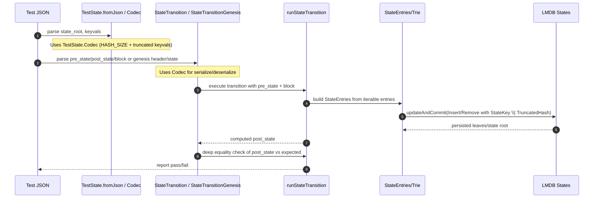

# Clean up state entries.

## Pull Request by @tomusdrw

Clean up state entries management by:
1. Removing generic `FullEntries` vs `TruncatedEntries` - this is not really needed for anything. We now use `Truncated` consistently.
2. Hiding non-truncated keys from `TruncatedHashDictionary`.
3. Removing duplicated `StateTransition` stuff from `test-runner/w3f` directory.


## Comment by @coderabbitai[bot]

<!-- This is an auto-generated comment: summarize by coderabbit.ai -->
<!-- This is an auto-generated comment: skip review by coderabbit.ai -->

> [!IMPORTANT]
> ## Review skipped
> 
> Auto incremental reviews are disabled on this repository.
> 
> Please check the settings in the CodeRabbit UI or the `.coderabbit.yaml` file in this repository. To trigger a single review, invoke the `@coderabbitai review` command.
> 
> You can disable this status message by setting the `reviews.review_status` to `false` in the CodeRabbit configuration file.

<!-- end of auto-generated comment: skip review by coderabbit.ai -->
<!-- walkthrough_start -->

<details>
<summary>📝 Walkthrough</summary>

<!-- This is an auto-generated comment: release notes by coderabbit.ai -->

## Summary by CodeRabbit

- New Features
  - Added codecs for TestState and StateTransition; introduced StateTransitionGenesis.
  - StateEntries is now directly iterable and supports truncated-hash keys across serialization and storage.

- Changes
  - state-dump: removed “as-truncated-entries”; “as-entries” now returns a plain object.
  - State equality checks now compare full pre/post-state objects.

- Refactor
  - Unified state entry model; iterator yields truncated keys.
  - Redirected test-runner imports to versioned jamduna-064 modules.
  - Removed legacy w3f state loader and state-transition modules.

- Tests
  - Updated to use truncated-hash keys and new iterable shapes.

<!-- end of auto-generated comment: release notes by coderabbit.ai -->
## Walkthrough
The changes unify state entry representation around truncated hashes, update serialization/codec support for test states and state transitions (including a new genesis type), remove W3F-specific state/transition modules, adjust runners to new paths, and update DB/state loaders and tests to iterate over direct entry iterables and truncated keys.

## Changes
| Cohort / File(s) | Summary |
|---|---|
| **State entries refactor**<br>`packages/jam/state-merkleization/state-entries.ts`, `packages/jam/state-merkleization/loader.ts`, `packages/jam/node/main.ts`, `packages/jam/state-merkleization/state-entries.test.ts`, `packages/jam/database-lmdb/states.ts` | Consolidates to a single truncated-hash dictionary model; removes Full/Truncated entries types; adds `StateEntries.fromEntriesUnsafe` and iterable support; updates loader/genesis construction to use iterable entries; DB updates accept `StateKey | TruncatedHash` and iterate serialized state directly. |
| **Convert tool updates**<br>`bin/convert/types.ts` | Drops `TruncatedHashDictionary` usage; narrows state-dump options; `as-entries` now returns plain object via `Object.fromEntries(StateEntries.serializeInMemory(...))`; replaces prior truncated-paths with direct `StateEntries.fromEntriesUnsafe`. |
| **Test runner core (state/transition)**<br>`bin/test-runner/state-transition/state-loader.ts`, `bin/test-runner/state-transition/state-transition.ts` | Adds codecs for `TestState` and `StateTransition`; introduces `StateTransitionGenesis` with codec/fromJson; updates equality checks to deep-compare whole state objects; imports adjusted accordingly. |
| **W3F removal/migration**<br>`bin/test-runner/w3f/state-loader.ts` (deleted), `bin/test-runner/w3f/state-transition.ts` (deleted), `bin/test-runner/w3f/runners.ts` | Removes W3F-specific state and transition modules; runners now import shared `state-transition` implementation; no behavioral changes in runner wiring. |
| **Jamduna redirect**<br>`bin/test-runner/jamduna-064.ts` | Redirects imports to versioned `./jamduna-064/*` modules; API usage unchanged. |
| **Core collections: truncated hash dict**<br>`packages/core/collections/truncated-hash-dictionary.ts`, `packages/core/collections/truncated-hash-dictionary.test.ts` | Iterator now yields `[TruncatedHash, V]` by delegating to `entries()`; tests updated to use `TruncatedHash` types; no runtime logic changes in tests. |

## Sequence Diagram(s)


## Estimated code review effort
🎯 4 (Complex) | ⏱️ ~60 minutes

## Poem
> I nibble keys, now neatly trimmed,  
> A garden of hashes, succinctly brimmed.  
> The codec sings a tighter tune,  
> Genesis wakes, a brand-new moon.  
> Runners hop to fresher trails—  
> Iterables breeze, no bulky bales.  
> Thump-thump: concise prevails. 🥕🐇

</details>

<!-- walkthrough_end -->
<!-- internal state start -->


<!-- DwQgtGAEAqAWCWBnSTIEMB26CuAXA9mAOYCmGJATmriQCaQDG+Ats2bgFyQAOFk+AIwBWJBrngA3EsgEBPRvlqU0AgfFwA6NPEgQAfACgjoCEYDEZyAAUASpETZWaCrI5Ho6gDYkuAYW+YkNjc9rjUJJDsFPDSGpCQBgByjgKUXACsAOwALPEGAKo2ADJcsLi43IgcAPTVROqw2AIaTMzVAGKe2ABm3bJFKojVuLLcJKkULtXc2J6e1Vm5CfmIaZAEzNiItBQA7nkAyvjYFAwRAlQYDLBcuLRgFCTM+FJg3bOeYFExyAnQzqRcJALphrlxmNosAkDmFcFsuPgxlCDDYSBIYrtKFV7ABrfCIABeeDQABpIBCaFsCYh4HiqHkBqlPNiABQYfDkACUeV8j3C9GoXAATAAGIXpMAigAcYCFAE5oABGbIcIWZDgikUALSMABFpAxotxxBy3FBUc8pJBSORogxIAADdofACiGFw0WkDsgEmQDugFGwV35bo9PwdAG4gqtHQGgwx+d6mBgaYgaO7PLI4gkoAAJeBKSDsjBgD3x/mQHEkWTIboUFixwPBmi0XNoRCwXXwMTwDnOWQO7MGc1PF4RWjBTzdisOmHhAOYGkmjBJxQROsN3CwCIOmhph5B23VXYAZm63to8EeYnwLg0Rn0xnAUDI9Hw3RwBGIZGULYUrHYLheH4YRRHEKQZHkJglCoVR1C0HRHxMKA4FQVBAjQPBCBtX86H/Nh3S4Kh9gcJwXGBKC11gtRNG0XQwEMJ9TAMNQMGqZMpAoXBhlGWJcCqAwACJhIMCxIAAQQASW/W0K1IiFyPfRhYEwUhEAfSALTHeh4GYbhbyBJS42bOg2w7Lsez7cjMHoR5uE8NAznoLY0FISBdgaSBL2vIEonkFSMFoKcMCIH14DQSA5xoUNPUQe8R12W8qx0vSDOQAh7GOU4IjTcJS0uJdeywEYxlretmHWaRcAPDAj1ymh8sXdQivQQLKv3Js6thEhGpTZqOWqeqes8fA0BgjR+LJR5LXgEL3LPMBEDGBh4G6bsUFSri4uHUI8onPSeHrM5EGQRFl2QDBnHrTFaCI0cpAFRB8vLFsvndWKoyrY10Ce+t8GqlSO1ax63rDWIdqGsB9u4Lh21B2Ki3wfZHjhCgU3QHgHNmkCRDEMKIoAeVAsQNA3ZgYp+FkopICnYlWaI0CnAkSEkjAAFlRxcFkltEMkhs5blZrTEgxv4D8UZODBZtCrcImIyANG+aRIDWkhPFoeLNPuvDZZ+56TPuJXkG4ahYBV8rdoa6HDvwY6aRCzWhvacqAGlqwkRnTuNXT4AJagiuxOyHLOGAmwTFszM7btl37Unytp5AbPNlhjPDugLJjlx8hTNBugiDyt0i7qE7jlgE+zxBc5Ibnuo0KtZA95kNAhbgWQ0duBc13VJ2nP8ndd93Pa8kg1ql86gm4WgKwyrYIl18h9jJ8uc7z9BuF4UbrnvIxRMscTPBoKhx4y3WlAYByj4DsXIgAD30ri8NvHgmine12Ga6QNMSDkSDib/lNUsrDKJA74GToNMF+613hXGXPYeARBLqo2Vk/Eq45RAX39hyRAUZriAMTo8FA7pKCXU8JAEa9R7RJ2TGtIgJxMFYEbtgZWLJf5EA0GSZM6Z+LXwOPkKwVgCY2GgC6XUAB9aAABNKwLoDiRHej8Tk28XRpl0hWaCcs0QYkiL0AyXAOaXkcEJESw5mKsWGFVGqR4hBoGYBOS6koABs2QJoCWEoJXeElpI4SPnheS/Zr64JCp/HacAIgckzAAoJ+CIi6XvkCE2hdghTz3FwamC4+rLmdASZmAo2ppIKv1LAzgIjsn2LEsB9AyYK2qNY2xQY0COOyINbqvVCocjeNgbJdANBCETm1DQNSbF2IaSKJxzS8oeiasuHpyAhY0FFkpAZtThnjIapMjJRUOldI1r04G1Tln1NWT1dZbSMAzM1qEyAjw0zX11mtbwVyniQmQPGAKpB6Ask6lidAkw0CUSIe6RAZIITY1mhIW29D7AkDhNwMkjkzjGnAfA9kjx6BTjTIgRRISEDIFRVeMC6VtwbTiXhWJ3gCKwivifIlnEaQ/3oAc+xozcjPAnN4ZAuwEAPN4NISg6I5q60rmwW+h8SESSsJJewJxuiOQiFTbq6TTml2YAAKUQByKaQZ8lTKKmSbVGyORZJycqtVGqrlaoVQUzJnSclYp3mJfeh96HpXwOsIlZ8MHjyUiAklb4+AzAEK/OR4hxDBKgP/QJal1iup9RUiBgb1rvxGMPc+zhnVKJURSPC6jHnohIPsEe3RdGQH0fAQxbiHymNmuYjqh5KBHNaYUhtI0xqUBcW4CtDqvE/h8fQPxikPyRrDRJWgtBkDqIYGAAQ7ZfGUHCkzSFDh14GRVk/aAVVqYUUIR6RQ2AVpzQigvS261fBrntByN1ER11pk3amk6cRULjrPdGZWuZxIHFzKIg4kktQulXXwQV3VRF/SBKrdWkAWTtlavwE2ABHJhRdwg2HwP9SO3Ik4RQ9gzQNw0yBEELqseDZAQ5Fr4PXRuQL3LbgISLa4KAaAVXQlgQQuMgQFzNhFeuEHoA2HyIkXw4lhFiLfR+r9P6/1yD3OhtqmHGYIZZIGwQiicyQFZjuicx1iUrqUhOvZPqbLIEBmbcpW1o2EPPtgQsInP3ft/egEaIUaSFh43xgTQnRHWbE3ZpOqd+SRziDtIoIsIK3yQOIOa17cDUxNeqopeTupu1kAANUZqEQMYgTjK1mmEMQUZwnyDGmOy9RZ82QFPWff9MAN21x3h4x1v4qWutPugtNXqPyxofn65+Ca37ug/upHaUV1obzGFxAro66BcAdPVE9z6AC8Cgz4aBY2BFkABvS2JBgMoc4It0QGhJPSBZJ52zLpFHtgJnBphwBqbIdQ+2WAegWScjJORz2XAJ0aEI0wq4JAUsUCCxgFkn2VtiHW5WasH2z0HdkHuFkLn+OCZER599NnxMvZ9HJnwe2GAHZGgIMkABfDHGPicRm9NjO9fpIvUwp1gB0Zi9zVS+RQBtJym2QxbeNfiDojDKPEFm+gObHh5oLToriei6BluYEY9xJiwBGEZxYlnbOrVFVVzqjk7bZd1e7bJPujgFLyB0284dklNrcKSdPV1S64lQoZgu2BSltytr4MktAsMJv0FzCLGCWmuJkhdzBZ2LBTUYDhW1XTVTda6dZbMX+O1EilY63+JNrhEM0EVYUgA4j+VMjAHInXQF79ynkIoh9VbF8kaB17SzddQF9hnfeUAr2HyrQfKB7Jp7XMmbfSObajBhsrz6Zv2iUKPQplX6bzt9nXjvfAk5DTiFYSB9owNFfnxBn3rvpN9u6tx6r4R0MEI9cUjWg3LWa6wGQAKTlPdKAFN1oNo/h8VYvfq05Znp+M19iQaoShv8mYIgeVREhoyRFMGAcQI96B9I0xQD98tg69u9wgNBytRA9kAAhEaSA1A6HHaGwIMAXCIVoE2aIKvIdW6QhYWBZQdFgUguvXWbLYhVLadSA18YNBGFuSjGPNcRGfYUbUjZgROYeEgEIEgeDH/ZNa4UQHEfgYqIld+AhHlTdJOWAqLffUHfiTWAmTiRmUhQtMCLgNTesDTZWHCVMRaZaVadaQA32RdYIO3JOH1V+dQTbRtWBWwv2ZcaA+wAuaQ5AIaSICQqcZNdsemWBDKCKd4OYHGMCMAbwKQUhEg5wJALXWrB1A+BrLBMzZrVNS+bI71UBTrfgf1VfYNfrDSfwMI4vB/KbD/HPPPJAOnR0JXWtWqetSGdnZcDXA1M5HnHaFfHrY9e0NgZgCYGoybR0eo5cXPcgVMGLU0SAVvWLG7S/Xo2Y6QJAPQb0djavWvEKNweIKAB0efUoZvCgZYjkXnI4x0IaLgZAmgBYlcAYsol/UY8YwrSY2cNY05DY+YtA+0BbEHYmXAcHU4yAbfcaAEvmbqe4w/R4gEyAYnXnKAQYoNdfROL3KbefEALgSEygcnPZabbqXEqrG9bqcnF4oYt4p4D4rEqYn4wpXAirIE6HTQ8HEAu4sk9QlA6E4EbAnELgLA22HEZk3mHgfEXAeA8IOE8k3k59ZEvnTNNRXgkXLRQtYtUtctYxCABXFiatJnSxetU8boaoFnOKfiDtESLtGSXCPtQ3fxE3PBDSVEbA8IQlGJC3HhRk2BJOJsaYlqKpCKN00hOPB5FkQSAZTotXLXXpQSbkSIyABAIgajeItENWckXdcMyMqMlpLo9XaMq/GZeMh9Ila5QyD8O5eAB5FyNyaaZ5YrIVOVAMrXXvKvP0i1ecGMopAhFRGI2eSpFBIlQSSZY6QSc1doigZTf+aBSyMVchdaJ+SgesPgAKIKOvIdbae1PeTI/I9GalNBPI51a+FPR+UooYpNH4L+H+JUgXFUwsNU5PcXXbLUmXCteXRXA05XOtVnE05tUabnVxa0vePXO0qVMiY3QdU3AbfUbwP8MM84L8too8P8znACttLQmAIlHldEY4Y2Mo8SCVW+X1DGB44gwvPpR/LnTdWciI11a8LBMsPGCKJnEtSgHEB5QIoMsrFSWaA4ZaPZYMsLa+euMARhCII2B9eEmJK4LoB/DGF/Nsi9FkFubgOvIabbf6PZN7ZkZOCqFVA4AmRIXfBSyle0RElhK4RQdSoDEDH6aDRENAIjDPEgO7XASObSweXSqDWTbDbwNMkKAjcQn7EOJSDbeuIU2HaQYAE8RUPQMkcSyKvcYUgQJEjHeyLYKgsIX7FWGIdWAI2ynbVJbqNyjypOHS7ERLFLTwGKWQAAbQAF04gqrGZar3IoNx9Zo8IoNwrIdIAMCorEAYq4qoxEr+rBqUqkTSyIhqLupuZlo/BeKMB+LxSKquAWqar3p6qGruRaKWolBvAiBrcyEAKDg50f8clqZ5rVqvK4oW4WRwd64Eqsc0rIA5s9BIA6qnrMcugSAdrlNLkELh4kR5KL0sNexMroBeIJhyI8Bqz+tKtDtKMjNpYyQDKjKeBnB7YiAfDIY2AKAOKSA7Dpl0idynVj4mt3UWs9zTp2sii/wn4A0g1Lzh0tIHpiKKkU1PUioPsKLuTN1sZWjmcfzjwzx/zXcXEDAbirA1S8KIkmabCzLyRaSsRDj4hdBhi9Kw8uBLiMBgAyKPqFsNsNKQMuAlKzkkaTwhRntXtbquBektcro/kWR65qrardbuRCcpb1aoAX9ETWSlt2TjbCr/ooclskbjtUcvMzstBEBLsnLrtbsdtI4nsMc1qccvtgriM/tnBAdgc2SQTHq+rPsI7YqMcxqS78c0rPbORvbUSyiMS1abiTadtSSk77sOxvabiKrSSNrarGq66tYHI/wmC0ZUtUF1rqw3atq3rIBer08Bq9xhq9BRqsckrpBJqvb8DtZ6BTz6BT89yzb4xYFZrwhrqGBFrIQVqGBbaG53tIA+6trGrBYsAhajTfyxa0KJb+JB6DhkVqBMsuBT6aBz7L6+Llpb6KNJ7ktWqn6dqIMJY0YPTHkHAD5r5qLzqgDaArqeYb6Ic76m57qi7ZBnrfrXr3rPrvrxL/ra6DB+dVE/xhdNEnzSNdt8wUydcPz9S2JDSVdUK8zuztdO0QLbTe1wKjcAloKXSd7itFCIgga36+HP6BGizML95SEcKIbEAIk9741ma+tQ0OUGhsYtxUB7l85KANFLRJiWyMA/ikA9UfTdU9l/SnGtdIB/5CtCkOVLHt0TC91ulSaJJdzjyDyubWsr5CiSLGayiWaBsRxrHd76bs0+bbH7GyoGxFGRb+GJlBH+IoxNG8Lwm9zzM5LJtB7FLyptaliqmVi0nGjEBDa56kzzizjXddaYSZT+ae9amL1CcIwKmlb/aM6g6WnXc8TzixS8GuSyKpm0qBmbicSJnXcFmNahpSSyKBnt7EmObiiqcXKs9YEqksnJzRbTTCzeiXECnZbMqD7IVZoLNajBn/Y19emMAda3nViuyr8mmNtOTYTumUDzayQ1DpSaBZSeTHjgX+SRSuAICcRdaWRwtZBfAlrr7PbVnfahn5sRnC6/nHgwXsdZm+T4WhSBSpmQXJTCWIXotESydB7/nwgNnpLMWJS4D1maWKTB74XSThTICtmEntJdm/w9qL1XHvneikWqpT0AVdtbGyQmcrBTYuA0xogQpdqLYTmULlHcnVHsE4EEEAHHg1aXx6afpZArgVZj6WpxXM9uypW0wZWuFiqJXTkFWqolWtwVWwx1XbyGHs1VTmGxdWG8T4FYBOHdSjATZIDXJpB2Jbw/8mA5gwIA5hgw5+QwAjMoZo4ipY4mchHgLPFRG5IHSB1Ik1J3AiUmdaw1102I4HsM5c3yJMQCErc/wZ4YxdZfN62gZUEsrfdr546iN/NIorC1oEw5gSHisFb7Q+2TMRWLYAABVBGG2QaoIzctvCKpIdphDyjKbt0yB7Hw3WEM/Bp9ZNuc9YXidql5SeCsbdq7EgSORqszA91sB7Rq6aicogk6ihPZVi7oEaZGJ5bGV5QBWgPLDACJPtzAdkSlbIpOednxghMaIQLYdt11H/BBUvQuXWRyOEVLLjOya5dgSFAcrdMsA2JMh7cGbc4J8mxrYrO5trYVs8p/RNAxq8nac3O3GkQ1pBCeZJSY3WVi0pf3bhXca9t9yOb0KpB0Zd6G5ctdozZoh0aNnEWNoYJgR4eNi986NNl6OgTNh7bNucvNqqFxb0T5UQ4OBg7Cm5v0Ptndp9h7B0LFeuoY5jlqPjxBTLQT/kW4IlU9rjJN7wS9kxqtqqTdypC2B0ZMG5eubEZz59hq2exq70DKOLxis9+4utw9jsF9hbdLwhR0dTzT+NnT0LlNrBAzg2YzjsUzzOLMfNnnDNO8xhwN0XbRENtigxN8nU5iMrtSCrxN/APT1NyjtOe4LNy8Mzu8S0nXG07xEtiCyR507FNBGVWYIEdQX8J+IyPL998yHNqyeQMT2QPKorSbisRLrdA6kgI68LGWSm8isIwATAJTpdhr95EjtuRluCAKAyQ5kB2lJ7vHuGCXughApKBMw69ZvcAPv6M9uKBSzUBNzitBB6YPYcMkeSm+2qk6rI4AB1BoLUSgfAOgDA9QfW+KyAJLVLjKOq6To9unpqrCiSn7xAZ7ZWrcRQR5EFdGMDoJXJHSZB9VE4UKyswMQufvXbvc7ecwMmrI/cyHrzgoum6J88/RkNLjqADmXnvtf+gTttr4uqg4WQMYsbjQOX6gW8Bq57Zo/Z/0Q7yORt07/WkVV8ZAZLlnpLbYkrtTxyDT4b7T0b8bmr6716Gbk7y6ebxAb0MTxB/colJsq9sYeyh0I2B3iDeARWdhR0DYo+W8YAJnl333hqhK/AAsMkIMHEUpDAbY7kOQYeQ6/2AVV1XcHFRWTnh3oHlMeZN8cWaFSWOvTvpADQeHs3i3gQK3m3gH+3zkHYhAOjC7tWeSh0Qv23igEv4n0n8nyn6n6AWn+nyv6vqHuvpGBvwcP1wXPbXNdU58yXPriNwboP8r2pf/agFQGdeI2xAQI5C0kBXcRLce0K3CRk6SiQaRxIo6AIg4RXT95meQMW7tjECJGwt087JAmXyBhJwPISgKWAKiJRcY+25HFAQgTvZ7g9KLlRLGZmpjUCAAPqHEM5HdYAX7IWJQHiSmwUAt7ITvQAyjxcmKQIE3usEnDKxvIYECJFUk8J0AVCfSXHioG8BcBxIvyLMGTG5iYNf82DbqGSBZA3xuQFDM3sXC2r5ByBJAcSHOQ0CsxwiZIG+HVRFAV9IANgxUA1R2pTQbOjkOzsAQc4vpr4UgzQSgUkru5t4UAYwUJ2Qa8BJA4QfzjQHEiBRT0rAVwj5yNZzx6KI8MLkCF1j6Zoe9AIgbxC4Du4jCTqHDCX2pi1UQh4QMwd4SoHVhIADAxAbADJCL0N6+OBqnoC/YjREQ1HQKMFFCiWD2B1QNmlY2eQ19sa+DWOs525794Z+hcLjDiFmhjov25ZW5ESl2DRA1khAXUBgRVhAcIMJBOGnNECIBAIIZIFYc1H2HdRKKP1JhJRicKTAn4a5bodyHrJCwoeFBIIapnei7pNMh6UrPO0qx1C9MKYTLMgF6FcRMaBGOAaZlu5bgG8EIeQKkEiANBO80RUhLQOqFPwWKh3ajh2C/aY8+U8g84CQBUi4U+AqAEBOmHkoZR7hEQE3rvU54oA8B4gVWPQGb6R88IRmZWOxmOBAhGYh8OvGSOYKkJUgRI3sHwFSCyAOQ2Q6oYISlTLouICvOrCEwppMdqax5KJpzRiYXlOOw6b+OQBv73kNEXXDUhLghJhsX+epIbnGw/7sglA1QAXgW2AEiN/uviUtpBU3bxMtY9kWVI/lwCJRFoNAEIOYVQCBF+B6WWBLsQihiC8YCSG4IdE0Ry04R2AastyMYEGxXeMffxOiAih1C3esfFQfHDpFJxZYWAEoZz2VRvscx/YCuFXCjBidIxuACJIaBFg0AXKCcaMHXhLFgw4oS8TnlWLzgshAhWfTuNsyFYRQZ2pYa9r8IwxYBR6bAS8JEPh5Nt5AxAyuKQDyH1h14eEbMemPIhVIkOLjGRn21RHyBo8KfFpPjUJrE0Wo87C5GWSi5KRdYgYgqpEI8hqtQoTwlMMcM8hDRWx5HDKDBEkARBHx1MM6g7g0F7IgJJVZOg9nxibYS4gIUqg9mezyiMiDHbImEzV7ow1RxRDUdrwqI7R9esAPnokON4mDKCHY2KGWMO4Vis4K8auENAzjchAASYQtjSx3Yzsb2OrhGxuQKlLMhEAU5jBV2Dac8d4EvEcgAaRKWaDMCBAUFKBW4ubrIC+Y0BEsDQiavjg+qRFpxhQh5N6jpH9iv+3fTsc9jtT0Nb+TDQ0Y/167S4zRUbN/sNw/5412KIkrwuri5wYUgBuuYtgblW4QCK2gWdCnwDE4hi903CciT8C8j4oxAEgi2IwQwBSSOCYU5vhO26EsTOxyqZeJXD7FcTXBM0AgTJUPizjwozYuSU11CCiEIMiHbhGEVtiFSt25UcsduNkAcTowsbcSaSKnDMBZo7pYrMVMXHic9k6PXWDO3FSSpoxL6Xga6kEBhBSB4QEuOzytYwJvO4gGIkn2QAgSZ8l1HpiwFClHZcGnTaKJzztSK96OyvF1MqKPIsc96JRdjr1h17DoCJREo3n5xpF1FDBqUsmPVPkkcSa44QBiapwtFDB7JZ4xyUTWckDRIYklXpN6GYnfEZprE/MexNomWVOxi/APv9MGRtAHJBNJyfQgbQQz4+eojrg+SDbddNSUubUnLkjYGA0ZgMvKMJJBk4zwZpYlru5JAH65nR3kqCutygA8dOaCONzMjhOziZKB/E8YEp3XbQSIuc8KLuY01iohPRTkOQU7k4j251p3SAIV/xw5mw6xislqGOD4C+C++s3NvqFFHEEUiKHYGvMQVNxmYIQVYRsuoJyQoNtu4UnyBEht448lIX1asKQyYSpcTYV4baMENIn4N/w9BKvB2wiAYimBWImMfh2wCMxqBqAQKXQTPxmZGhcUUgqsHTksI74YEOgIli+xNBVW0sFkCKDJBOIMcfMpHMJijqnYX61BQfpjQoAjC7kHwYinnNoDUDdigs39Kj3HTQVisuwP5Gex+QRBG4BYCsK5GeTpDIuNyJfBtxQYVlisAHbYe+MowCA8AxWUSu0JxDBAwRZsRPmrDCkXoo5VHDdkPkvC9BLG7oOQTjwtljBkJSvGmjkSprnTImGvdUVrw463T3ROokgATIDZEzzJPXV8tZKpm2TLRNiIScDNElsRGZqUhbsIyLZOj7SHMt0ZW2ALUA6MQcWVMgwnCpZkRtXKbhwXkDEdeU7oSFOGLgQhQHkrI+4AuNO5ToZ09AVlBmSTgXB0KKYaoKh3Q5hCzZkqeFLeEvA0KswGkNEutFQS4od6OtV0AWLahvtWxLCdqZ1IoGty5gUAX0OsEO7wx5Al4FRAtLEmaxtp46PmqwrRiwKuA7Ia0D2m7CUZR6YqNMLeFjb2AEA3QbhNxRIL4hdu8U5WKq2Cl+dEy2NB5D1Pd5HiVJyVNSUYodmQpRpz0lWRdRZjsxOYZ3JGI8lRjoxjFCgfvqGLwh1iopDYU+VN0a69Trk23KMGTGomNTaJfBdAAwARSVSUxU3NMfJPKV1SqJDUpqdNBHFtQcFCs3YmxNihNToRQIDedWSKxZisBUceSZQMCCSQtJYSD8PXGqDiVMaAczWGpgFGhAnFbkDDHUukDcCAuh0CIc2KCk3gApqSsIFWGEIhLcxg+GIvCn2W3ghgmwWEE8u8GmM4oaAtkK6gn4ayRs7A2QCZUeARIL0DC3MTz0IlFYWQgIQaNCn/xqxoUJAEynP11nKzT4DUzWIRUlQOAKAMqEOJuS4BM8ZE0AURL4AJhswrA4kGwC6FET5Bv0iQbPKl0PnpK8FDU2InjHUCrBPAH4JFl3y4n9saC9GY2F4PdzuQqAG4igDWNKxT9Lenga3uTTt7c8yA+I5ANrJRUXo9ZPiwOaHBiBZK/Fl7P0tCk9CNxi8aHYWJQUBABhdVc/ZBGir5V0jgegqj5QZIonu4owgIF2tWG5CzxCU4/SSh6vrichB868TMGUObE+q3Ufq0sasG4j3dmxjqxuYiAaxzQT5JWc1V5A1n6qkEmsGVrSkDLWsL0xEp6cHJZD2LGYnIKHBgE4i4BWYHMZ4C4DST4BKlNSlaY0r8wNs2ViHMeKrOQCZi21PbKZU1zSk99n628VmC4uLSoCCxBCZOX1GFgZhSFohEjkQkegKVpYwSyZZUpBb8KDWvna5I8kA5gRI1LyKWOO3oQ+E9C26TZUmufljQa86Q11GCv7BMLVgAoPZfeiCb1Zn56ElURdOSZdYhpcTDSFDXT5dKHoU2FPGnwiDOg5grYo2lazmC3BAwJAKMPkIhIdr5JikkgMpPGoRLBAK9JEiiRgDXswNXxSDX2wUV0j4NyIs2p7BQ0ZqwguXJgc0qa5YacN6clKgRsJxEaqiReItQQgoIQazW+zYxfrVbH8jAoyAGDZtU7E1D+1dAODQrHbj+9oZkGkTa9NihEb7phvfjn50E23ElaUg2tcktAY8Ur6EDTbEYSSX1rZA1MCtSlNijABpNCcFTQZpebxKgCxmmzaZtRbmbxSXJLzbeFs3dRF++E6FJCt3VJDouU2SpiwEqVfS0NzmznnVUEju5BIO1F1vtM7FObZFnY1zcSXc0VKOliMtDTcv7BsbvZuGpofhvs3GKtN4Wh6bpoE2m5KCBW8QK8xTjtLPpJWr/kxoNgJwUtaWjLQ5p+D61DuLmqGY8nll4Q5A3tNrVAnhmDLEZRsAocoCKEGDwg9A+TcwPCXVaBALQ2rRpvDA7QZWWap+Pxqtngcps4Qj2CcsYqhjbwLIIaXyFoD5YtV9xBONyDWzcbIA0Mm7ZENOUA8nt0QW7RojGhvaVt22ljYuIq1TsONakr7dxrC0G9ItAnfTQ6CJUHASVZKilVSppV0rJIDKhft6CT6XCSkqSiNWP0+Wc86cDc6+FTpdU/BflYQIjUnn2BsAUdnxVrTKpn5yq5+iqlGReid51azMNq/gMrIZ1Gx6tKOi7dFp1knyZM762ZPTktWehs+YnMXZqsl006BVjc7XalPdzS6Itsu9HQGr6pHj7N8OwQHJowAfAE+qSsHl1My7Or/V0KT1YCtp0D96dLu0sYELN0e7kdxux6c1qu2Oga89kRqSYLbgdxvQlOn3alJjXR6NAKMpOPrtdUIqQG7cZPZ7pB4fg09TOwIYnqz0ozqgjoePa6v0lxrq4xe1naVhnbTAQdkQrFcPCmmeAgIy6yXo6AGU/AOJ3oB5d7DmgOg5la27wMUISzVDahky3bYgBSotCrOgGmevpGyy0MTJ+o+/iw2LTsNw275R8AYGQhyJG5mEL8CgvwiAQrkaAEiC6K3TqJqI8EOiEhGfD4R1AoiAsIgGAxBs6A0pUEbvv30ig5QCYRUCeGyC0AHEDiadGgDGgCAHE6QQA7QHSDdBgDUoaUNkDlAiw5QioIUN0FoB/6HE9ERiPvtaAdSpSr+9/aLk/3sF9AQAA== -->

<!-- internal state end -->
<!-- tips_start -->

---


<details>
<summary>🪧 Tips</summary>

### Chat

There are 3 ways to chat with [CodeRabbit](https://coderabbit.ai?utm_source=oss&utm_medium=github&utm_campaign=FluffyLabs/typeberry&utm_content=574):

- Review comments: Directly reply to a review comment made by CodeRabbit. Example:
  - `I pushed a fix in commit <commit_id>, please review it.`
  - `Open a follow-up GitHub issue for this discussion.`
- Files and specific lines of code (under the "Files changed" tab): Tag `@coderabbitai` in a new review comment at the desired location with your query.
- PR comments: Tag `@coderabbitai` in a new PR comment to ask questions about the PR branch. For the best results, please provide a very specific query, as very limited context is provided in this mode. Examples:
  - `@coderabbitai gather interesting stats about this repository and render them as a table. Additionally, render a pie chart showing the language distribution in the codebase.`
  - `@coderabbitai read the files in the src/scheduler package and generate a class diagram using mermaid and a README in the markdown format.`

### Support

Need help? Create a ticket on our [support page](https://www.coderabbit.ai/contact-us/support) for assistance with any issues or questions.

### CodeRabbit Commands (Invoked using PR/Issue comments)

Type `@coderabbitai help` to get the list of available commands.

### Other keywords and placeholders

- Add `@coderabbitai ignore` or `@coderabbit ignore` anywhere in the PR description to prevent this PR from being reviewed.
- Add `@coderabbitai summary` to generate the high-level summary at a specific location in the PR description.
- Add `@coderabbitai` anywhere in the PR title to generate the title automatically.

### Status, Documentation and Community

- Visit our [Status Page](https://status.coderabbit.ai) to check the current availability of CodeRabbit.
- Visit our [Documentation](https://docs.coderabbit.ai) for detailed information on how to use CodeRabbit.
- Join our [Discord Community](http://discord.gg/coderabbit) to get help, request features, and share feedback.
- Follow us on [X/Twitter](https://twitter.com/coderabbitai) for updates and announcements.

</details>

<!-- tips_end -->


## Comment by @github-actions[bot]


<details>
<summary>View all</summary>

| File | Benchmark | Ops |  |
|------|-----------|-----|--|
| [bytes/hex-to.ts[0]](../blob/261c70e7a1c25c4f7da80f398f8fcea1619cbce8//_work/typeberry-runner-2/typeberry/typeberry/benchmarks/bytes/hex-to.ts) | number toString + padding | 281316.79 ±1.69% | fastest ✅ |
| [bytes/hex-to.ts[1]](../blob/261c70e7a1c25c4f7da80f398f8fcea1619cbce8//_work/typeberry-runner-2/typeberry/typeberry/benchmarks/bytes/hex-to.ts) | manual | 14910.15 ±1.14% | 94.7% slower |
| [logger/index.ts[0]](../blob/261c70e7a1c25c4f7da80f398f8fcea1619cbce8//_work/typeberry-runner-2/typeberry/typeberry/benchmarks/logger/index.ts) | console.log with string concat | 6571442.83 ±57.97% | fastest ✅ |
| [logger/index.ts[1]](../blob/261c70e7a1c25c4f7da80f398f8fcea1619cbce8//_work/typeberry-runner-2/typeberry/typeberry/benchmarks/logger/index.ts) | console.log with args | 1771396.39 ±87.67% | 73.04% slower |
| [hash/index.ts[0]](../blob/261c70e7a1c25c4f7da80f398f8fcea1619cbce8//_work/typeberry-runner-2/typeberry/typeberry/benchmarks/hash/index.ts) | hash with numeric representation | 179.19 ±1.87% | 30.58% slower |
| [hash/index.ts[1]](../blob/261c70e7a1c25c4f7da80f398f8fcea1619cbce8//_work/typeberry-runner-2/typeberry/typeberry/benchmarks/hash/index.ts) | hash with string representation | 117.11 ±0.44% | 54.63% slower |
| [hash/index.ts[2]](../blob/261c70e7a1c25c4f7da80f398f8fcea1619cbce8//_work/typeberry-runner-2/typeberry/typeberry/benchmarks/hash/index.ts) | hash with symbol representation | 175.58 ±1.61% | 31.98% slower |
| [hash/index.ts[3]](../blob/261c70e7a1c25c4f7da80f398f8fcea1619cbce8//_work/typeberry-runner-2/typeberry/typeberry/benchmarks/hash/index.ts) | hash with uint8 representation | 160.57 ±0.33% | 37.79% slower |
| [hash/index.ts[4]](../blob/261c70e7a1c25c4f7da80f398f8fcea1619cbce8//_work/typeberry-runner-2/typeberry/typeberry/benchmarks/hash/index.ts) | hash with packed representation | 258.12 ±0.61% | fastest ✅ |
| [hash/index.ts[5]](../blob/261c70e7a1c25c4f7da80f398f8fcea1619cbce8//_work/typeberry-runner-2/typeberry/typeberry/benchmarks/hash/index.ts) | hash with bigint representation | 188.51 ±0.4% | 26.97% slower |
| [hash/index.ts[6]](../blob/261c70e7a1c25c4f7da80f398f8fcea1619cbce8//_work/typeberry-runner-2/typeberry/typeberry/benchmarks/hash/index.ts) | hash with uint32 representation | 193.95 ±1.69% | 24.86% slower |
| [codec/encoding.ts[0]](../blob/261c70e7a1c25c4f7da80f398f8fcea1619cbce8//_work/typeberry-runner-2/typeberry/typeberry/benchmarks/codec/encoding.ts) | manual encode | 2441108.35 ±1.67% | 20.02% slower |
| [codec/encoding.ts[1]](../blob/261c70e7a1c25c4f7da80f398f8fcea1619cbce8//_work/typeberry-runner-2/typeberry/typeberry/benchmarks/codec/encoding.ts) | int32array encode | 3052232.8 ±1.55% | fastest ✅ |
| [codec/encoding.ts[2]](../blob/261c70e7a1c25c4f7da80f398f8fcea1619cbce8//_work/typeberry-runner-2/typeberry/typeberry/benchmarks/codec/encoding.ts) | dataview encode | 2761949.89 ±1.9% | 9.51% slower |
| [math/add_one_overflow.ts[0]](../blob/261c70e7a1c25c4f7da80f398f8fcea1619cbce8//_work/typeberry-runner-2/typeberry/typeberry/benchmarks/math/add_one_overflow.ts) | add and take modulus | 268501398.66 ±4.91% | fastest ✅ |
| [math/add_one_overflow.ts[1]](../blob/261c70e7a1c25c4f7da80f398f8fcea1619cbce8//_work/typeberry-runner-2/typeberry/typeberry/benchmarks/math/add_one_overflow.ts) | condition before calculation | 256996820.73 ±6.78% | 4.28% slower |
| [math/count-bits-u32.ts[0]](../blob/261c70e7a1c25c4f7da80f398f8fcea1619cbce8//_work/typeberry-runner-2/typeberry/typeberry/benchmarks/math/count-bits-u32.ts) | standard method | 92043172.15 ±1.67% | 60.63% slower |
| [math/count-bits-u32.ts[1]](../blob/261c70e7a1c25c4f7da80f398f8fcea1619cbce8//_work/typeberry-runner-2/typeberry/typeberry/benchmarks/math/count-bits-u32.ts) | magic | 233776028 ±6.51% | fastest ✅ |
| [bytes/hex-from.ts[0]](../blob/261c70e7a1c25c4f7da80f398f8fcea1619cbce8//_work/typeberry-runner-2/typeberry/typeberry/benchmarks/bytes/hex-from.ts) | parse hex using `Number` with NaN checking | 97718.73 ±1.13% | 82.65% slower |
| [bytes/hex-from.ts[1]](../blob/261c70e7a1c25c4f7da80f398f8fcea1619cbce8//_work/typeberry-runner-2/typeberry/typeberry/benchmarks/bytes/hex-from.ts) | parse hex from char codes | 563279.12 ±1% | fastest ✅ |
| [bytes/hex-from.ts[2]](../blob/261c70e7a1c25c4f7da80f398f8fcea1619cbce8//_work/typeberry-runner-2/typeberry/typeberry/benchmarks/bytes/hex-from.ts) | parse hex from string nibbles | 382370.02 ±0.97% | 32.12% slower |
| [codec/bigint.compare.ts[0]](../blob/261c70e7a1c25c4f7da80f398f8fcea1619cbce8//_work/typeberry-runner-2/typeberry/typeberry/benchmarks/codec/bigint.compare.ts) | compare custom | 222418285.14 ±7.1% | fastest ✅ |
| [codec/bigint.compare.ts[1]](../blob/261c70e7a1c25c4f7da80f398f8fcea1619cbce8//_work/typeberry-runner-2/typeberry/typeberry/benchmarks/codec/bigint.compare.ts) | compare bigint | 192965143.27 ±7.19% | 13.24% slower |
| [codec/decoding.ts[0]](../blob/261c70e7a1c25c4f7da80f398f8fcea1619cbce8//_work/typeberry-runner-2/typeberry/typeberry/benchmarks/codec/decoding.ts) | manual decode | 13061787.4 ±2.63% | 92.18% slower |
| [codec/decoding.ts[1]](../blob/261c70e7a1c25c4f7da80f398f8fcea1619cbce8//_work/typeberry-runner-2/typeberry/typeberry/benchmarks/codec/decoding.ts) | int32array decode | 167088260.2 ±5.33% | fastest ✅ |
| [codec/decoding.ts[2]](../blob/261c70e7a1c25c4f7da80f398f8fcea1619cbce8//_work/typeberry-runner-2/typeberry/typeberry/benchmarks/codec/decoding.ts) | dataview decode | 162953853.02 ±4.21% | 2.47% slower |
| [collections/map-set.ts[0]](../blob/261c70e7a1c25c4f7da80f398f8fcea1619cbce8//_work/typeberry-runner-2/typeberry/typeberry/benchmarks/collections/map-set.ts) | 2 gets + conditional set | 96612.38 ±0.68% | fastest ✅ |
| [collections/map-set.ts[1]](../blob/261c70e7a1c25c4f7da80f398f8fcea1619cbce8//_work/typeberry-runner-2/typeberry/typeberry/benchmarks/collections/map-set.ts) | 1 get 1 set | 54970.04 ±0.54% | 43.1% slower |
| [codec/bigint.decode.ts[0]](../blob/261c70e7a1c25c4f7da80f398f8fcea1619cbce8//_work/typeberry-runner-2/typeberry/typeberry/benchmarks/codec/bigint.decode.ts) | decode custom | 184202193.26 ±4.07% | fastest ✅ |
| [codec/bigint.decode.ts[1]](../blob/261c70e7a1c25c4f7da80f398f8fcea1619cbce8//_work/typeberry-runner-2/typeberry/typeberry/benchmarks/codec/bigint.decode.ts) | decode bigint | 58599499.05 ±2.22% | 68.19% slower |
| [math/count-bits-u64.ts[0]](../blob/261c70e7a1c25c4f7da80f398f8fcea1619cbce8//_work/typeberry-runner-2/typeberry/typeberry/benchmarks/math/count-bits-u64.ts) | standard method | 2338931.29 ±3.02% | 97.16% slower |
| [math/count-bits-u64.ts[1]](../blob/261c70e7a1c25c4f7da80f398f8fcea1619cbce8//_work/typeberry-runner-2/typeberry/typeberry/benchmarks/math/count-bits-u64.ts) | magic | 82232547.6 ±2.17% | fastest ✅ |
| [math/mul_overflow.ts[0]](../blob/261c70e7a1c25c4f7da80f398f8fcea1619cbce8//_work/typeberry-runner-2/typeberry/typeberry/benchmarks/math/mul_overflow.ts) | multiply and bring back to u32 | 238293081.88 ±3.47% | fastest ✅ |
| [math/mul_overflow.ts[1]](../blob/261c70e7a1c25c4f7da80f398f8fcea1619cbce8//_work/typeberry-runner-2/typeberry/typeberry/benchmarks/math/mul_overflow.ts) | multiply and take modulus | 228008626.11 ±8.26% | 4.32% slower |
| [math/switch.ts[0]](../blob/261c70e7a1c25c4f7da80f398f8fcea1619cbce8//_work/typeberry-runner-2/typeberry/typeberry/benchmarks/math/switch.ts) | switch | 241407937.55 ±5.78% | fastest ✅ |
| [math/switch.ts[1]](../blob/261c70e7a1c25c4f7da80f398f8fcea1619cbce8//_work/typeberry-runner-2/typeberry/typeberry/benchmarks/math/switch.ts) | if | 191164533.86 ±15.08% | 20.81% slower |
| [codec/view_vs_object.ts[0]](../blob/261c70e7a1c25c4f7da80f398f8fcea1619cbce8//_work/typeberry-runner-2/typeberry/typeberry/benchmarks/codec/view_vs_object.ts) | Get the first field from Decoded | 343816.32 ±5.01% | 18.79% slower |
| [codec/view_vs_object.ts[1]](../blob/261c70e7a1c25c4f7da80f398f8fcea1619cbce8//_work/typeberry-runner-2/typeberry/typeberry/benchmarks/codec/view_vs_object.ts) | Get the first field from View | 81921.63 ±1.69% | 80.65% slower |
| [codec/view_vs_object.ts[2]](../blob/261c70e7a1c25c4f7da80f398f8fcea1619cbce8//_work/typeberry-runner-2/typeberry/typeberry/benchmarks/codec/view_vs_object.ts) | Get the first field as view from View | 93345.31 ±1.95% | 77.95% slower |
| [codec/view_vs_object.ts[3]](../blob/261c70e7a1c25c4f7da80f398f8fcea1619cbce8//_work/typeberry-runner-2/typeberry/typeberry/benchmarks/codec/view_vs_object.ts) | Get two fields from Decoded | 423354.42 ±1.5% | fastest ✅ |
| [codec/view_vs_object.ts[4]](../blob/261c70e7a1c25c4f7da80f398f8fcea1619cbce8//_work/typeberry-runner-2/typeberry/typeberry/benchmarks/codec/view_vs_object.ts) | Get two fields from View | 76662.53 ±1.13% | 81.89% slower |
| [codec/view_vs_object.ts[5]](../blob/261c70e7a1c25c4f7da80f398f8fcea1619cbce8//_work/typeberry-runner-2/typeberry/typeberry/benchmarks/codec/view_vs_object.ts) | Get two fields from materialized from View | 155738.16 ±3.11% | 63.21% slower |
| [codec/view_vs_object.ts[6]](../blob/261c70e7a1c25c4f7da80f398f8fcea1619cbce8//_work/typeberry-runner-2/typeberry/typeberry/benchmarks/codec/view_vs_object.ts) | Get two fields as views from View | 80089.28 ±0.38% | 81.08% slower |
| [codec/view_vs_object.ts[7]](../blob/261c70e7a1c25c4f7da80f398f8fcea1619cbce8//_work/typeberry-runner-2/typeberry/typeberry/benchmarks/codec/view_vs_object.ts) | Get only third field from Decoded | 416375.5 ±2.29% | 1.65% slower |
| [codec/view_vs_object.ts[8]](../blob/261c70e7a1c25c4f7da80f398f8fcea1619cbce8//_work/typeberry-runner-2/typeberry/typeberry/benchmarks/codec/view_vs_object.ts) | Get only third field from View | 98646.8 ±1.27% | 76.7% slower |
| [codec/view_vs_object.ts[9]](../blob/261c70e7a1c25c4f7da80f398f8fcea1619cbce8//_work/typeberry-runner-2/typeberry/typeberry/benchmarks/codec/view_vs_object.ts) | Get only third field as view from View | 96829.65 ±1.64% | 77.13% slower |
| [codec/view_vs_collection.ts[0]](../blob/261c70e7a1c25c4f7da80f398f8fcea1619cbce8//_work/typeberry-runner-2/typeberry/typeberry/benchmarks/codec/view_vs_collection.ts) | Get first element from Decoded | 26453.76 ±1.46% | 56.71% slower |
| [codec/view_vs_collection.ts[1]](../blob/261c70e7a1c25c4f7da80f398f8fcea1619cbce8//_work/typeberry-runner-2/typeberry/typeberry/benchmarks/codec/view_vs_collection.ts) | Get first element from View | 61105.99 ±1.7% | fastest ✅ |
| [codec/view_vs_collection.ts[2]](../blob/261c70e7a1c25c4f7da80f398f8fcea1619cbce8//_work/typeberry-runner-2/typeberry/typeberry/benchmarks/codec/view_vs_collection.ts) | Get 50th element from Decoded | 26211.46 ±1.43% | 57.1% slower |
| [codec/view_vs_collection.ts[3]](../blob/261c70e7a1c25c4f7da80f398f8fcea1619cbce8//_work/typeberry-runner-2/typeberry/typeberry/benchmarks/codec/view_vs_collection.ts) | Get 50th element from View | 34015.26 ±2.43% | 44.33% slower |
| [codec/view_vs_collection.ts[4]](../blob/261c70e7a1c25c4f7da80f398f8fcea1619cbce8//_work/typeberry-runner-2/typeberry/typeberry/benchmarks/codec/view_vs_collection.ts) | Get last element from Decoded | 21920.57 ±3.32% | 64.13% slower |
| [codec/view_vs_collection.ts[5]](../blob/261c70e7a1c25c4f7da80f398f8fcea1619cbce8//_work/typeberry-runner-2/typeberry/typeberry/benchmarks/codec/view_vs_collection.ts) | Get last element from View | 23537.67 ±1.77% | 61.48% slower |
| [collections/map_vs_sorted.ts[0]](../blob/261c70e7a1c25c4f7da80f398f8fcea1619cbce8//_work/typeberry-runner-2/typeberry/typeberry/benchmarks/collections/map_vs_sorted.ts) | Map | 326890.07 ±0.4% | fastest ✅ |
| [collections/map_vs_sorted.ts[1]](../blob/261c70e7a1c25c4f7da80f398f8fcea1619cbce8//_work/typeberry-runner-2/typeberry/typeberry/benchmarks/collections/map_vs_sorted.ts) | Map-array | 101069.8 ±0.44% | 69.08% slower |
| [collections/map_vs_sorted.ts[2]](../blob/261c70e7a1c25c4f7da80f398f8fcea1619cbce8//_work/typeberry-runner-2/typeberry/typeberry/benchmarks/collections/map_vs_sorted.ts) | Array | 75941.64 ±5.38% | 76.77% slower |
| [collections/map_vs_sorted.ts[3]](../blob/261c70e7a1c25c4f7da80f398f8fcea1619cbce8//_work/typeberry-runner-2/typeberry/typeberry/benchmarks/collections/map_vs_sorted.ts) | SortedArray | 193049.57 ±0.39% | 40.94% slower |
| [hash/blake2b.ts[0]](../blob/261c70e7a1c25c4f7da80f398f8fcea1619cbce8//_work/typeberry-runner-2/typeberry/typeberry/benchmarks/hash/blake2b.ts) | hasher with simple allocator | 0.042 ±6.92% | 2.33% slower |
| [hash/blake2b.ts[1]](../blob/261c70e7a1c25c4f7da80f398f8fcea1619cbce8//_work/typeberry-runner-2/typeberry/typeberry/benchmarks/hash/blake2b.ts) | hasher with page allocator | 0.043 ±9.92% | fastest ✅ |
| [bytes/compare.ts[0]](../blob/261c70e7a1c25c4f7da80f398f8fcea1619cbce8//_work/typeberry-runner-2/typeberry/typeberry/benchmarks/bytes/compare.ts) | Comparing Uint32 bytes | 8995.43 ±31.8% | 39.04% slower |
| [bytes/compare.ts[1]](../blob/261c70e7a1c25c4f7da80f398f8fcea1619cbce8//_work/typeberry-runner-2/typeberry/typeberry/benchmarks/bytes/compare.ts) | Comparing raw bytes | 14755.31 ±0.23% | fastest ✅ |
| [crypto/ed25519.ts[0]](../blob/261c70e7a1c25c4f7da80f398f8fcea1619cbce8//_work/typeberry-runner-2/typeberry/typeberry/benchmarks/crypto/ed25519.ts) | native crypto | 5.62 ±17.79% | 81.11% slower |
| [crypto/ed25519.ts[1]](../blob/261c70e7a1c25c4f7da80f398f8fcea1619cbce8//_work/typeberry-runner-2/typeberry/typeberry/benchmarks/crypto/ed25519.ts) | wasm lib | 10.61 ±0.15% | 64.34% slower |
| [crypto/ed25519.ts[2]](../blob/261c70e7a1c25c4f7da80f398f8fcea1619cbce8//_work/typeberry-runner-2/typeberry/typeberry/benchmarks/crypto/ed25519.ts) | wasm lib batch | 29.75 ±0.67% | fastest ✅ |
</details>


### Benchmarks summary: 63/63 OK ✅

<!-- thollander/actions-comment-pull-request "benchmarks" -->


## Comment by @coderabbitai[bot]

_🛠️ Refactor suggestion_

**Ensure deterministic, JSON-friendly “as-entries” output; avoid implicit object key coercion**

Object.fromEntries over [Bytes, BytesBlob] relies on implicit toString and may yield surprising keys/values. Emit hex strings explicitly.


```diff
-          return Object.fromEntries(StateEntries.serializeInMemory(spec, state));
+          return Object.fromEntries(
+            Array.from(StateEntries.serializeInMemory(spec, state), ([k, v]) => [k.toString(), v.toString()]),
+          );
```

<!-- suggestion_start -->

<details>
<summary>📝 Committable suggestion</summary>

> ‼️ **IMPORTANT**
> Carefully review the code before committing. Ensure that it accurately replaces the highlighted code, contains no missing lines, and has no issues with indentation. Thoroughly test & benchmark the code to ensure it meets the requirements.

```suggestion
      options: ["as-root-hash", "as-entries"],
      run(spec: ChainSpec, data: unknown, option: string) {
        const state = data as InMemoryState;
        if (option === "as-entries") {
          return Object.fromEntries(
            Array.from(StateEntries.serializeInMemory(spec, state), ([k, v]) => [k.toString(), v.toString()]),
          );
        }
```

</details>

<!-- suggestion_end -->

<details>
<summary>🤖 Prompt for AI Agents</summary>

```
In bin/convert/types.ts around lines 94–99, the "as-entries" branch uses
Object.fromEntries(StateEntries.serializeInMemory(spec, state)) which relies on
implicit toString of Bytes/BytesBlob and can produce non-JSON-friendly or
non-deterministic keys/values; instead, map the serialized entries to plain hex
strings (convert both key and value to deterministic hex/string representations)
before calling Object.fromEntries, and sort entries by the hex key to ensure
deterministic output suitable for JSON.
```

</details>

<!-- fingerprinting:phantom:medusa:chinchilla -->

<!-- This is an auto-generated comment by CodeRabbit -->


## Comment by @coderabbitai[bot]

_🛠️ Refactor suggestion_

**Don’t upcast truncated keys; pass them directly**

`fromEntriesUnsafe` accepts `TruncatedHash`; `asOpaque()` here is unnecessary and may hurt type clarity.


```diff
-  const entries = StateEntries.fromEntriesUnsafe(state.keyvals.map((x) => [x.key.asOpaque(), x.value]));
+  const entries = StateEntries.fromEntriesUnsafe(state.keyvals.map((x) => [x.key, x.value]));
```

<!-- suggestion_start -->

<details>
<summary>📝 Committable suggestion</summary>

> ‼️ **IMPORTANT**
> Carefully review the code before committing. Ensure that it accurately replaces the highlighted code, contains no missing lines, and has no issues with indentation. Thoroughly test & benchmark the code to ensure it meets the requirements.

```suggestion
const stateFromKeyvals = (spec: ChainSpec, state: TestState) => {
  const entries = StateEntries.fromEntriesUnsafe(
    state.keyvals.map((x) => [x.key, x.value])
  );
  return SerializedState.fromStateEntries(spec, entries);
};
```

</details>

<!-- suggestion_end -->

<details>
<summary>🤖 Prompt for AI Agents</summary>

```
In bin/convert/types.ts around lines 150 to 153, the call is upcasting truncated
keys with asOpaque() unnecessarily; fromEntriesUnsafe expects TruncatedHash so
remove the asOpaque() call and pass the truncated key directly (e.g. map to
[x.key, x.value]) so the entries use the correct TruncatedHash type; keep the
rest of the flow unchanged so StateEntries.fromEntriesUnsafe(...) and
SerializedState.fromStateEntries(...) receive the proper types.
```

</details>

<!-- fingerprinting:phantom:medusa:chinchilla -->

<!-- This is an auto-generated comment by CodeRabbit -->


## Comment by @coderabbitai[bot]

_🛠️ Refactor suggestion_

**Enforce Codec-class pattern (private ctor + create) or switch to a plain type**

Guideline: classes with a static Codec must have a private constructor and a static create. Either:
- Convert TestState to codec.Class with a private constructor, or
- Make TestState a type and export a standalone Codec constant.


```diff
 export class TestState {
@@
-  static Codec = codec.object({
-    state_root: codec.bytes(HASH_SIZE).asOpaque<StateRootHash>(),
-    keyvals: codec.sequenceVarLen(
-      codec.object({
-        key: codec.bytes(TRUNCATED_HASH_SIZE),
-        value: codec.blob,
-      }),
-    ),
-  });
+  static create(data: { state_root: StateRootHash; keyvals: { key: TruncatedHash; value: BytesBlob }[] }) {
+    const s = new TestState();
+    s.state_root = data.state_root;
+    s.keyvals = data.keyvals;
+    return s;
+  }
+  private constructor() {}
+  static Codec = codec.Class(TestState, {
+    state_root: codec.bytes(HASH_SIZE).asOpaque<StateRootHash>(),
+    keyvals: codec.sequenceVarLen(
+      codec.object({
+        key: codec.bytes(TRUNCATED_HASH_SIZE),
+        value: codec.blob,
+      }),
+    ),
+  });
```

<!-- suggestion_start -->

<details>
<summary>📝 Committable suggestion</summary>

> ‼️ **IMPORTANT**
> Carefully review the code before committing. Ensure that it accurately replaces the highlighted code, contains no missing lines, and has no issues with indentation. Thoroughly test & benchmark the code to ensure it meets the requirements.

```suggestion
export class TestState {
  /** 
   * Factory method to construct a TestState from decoded data. 
   */
  static create(data: { state_root: StateRootHash; keyvals: { key: TruncatedHash; value: BytesBlob }[] }) {
    const s = new TestState();
    s.state_root = data.state_root;
    s.keyvals = data.keyvals;
    return s;
  }

  // Prevent external instantiation; enforce use of `create` only.
  private constructor() {}

  static Codec = codec.Class(TestState, {
    state_root: codec.bytes(HASH_SIZE).asOpaque<StateRootHash>(),
    keyvals: codec.sequenceVarLen(
      codec.object({
        key: codec.bytes(TRUNCATED_HASH_SIZE),
        value: codec.blob,
      }),
    ),
  });
}
```

</details>

<!-- suggestion_end -->

<details>
<summary>🤖 Prompt for AI Agents</summary>

```
In bin/test-runner/state-transition/state-loader.ts around lines 25-33, the
class violates the Codec-class pattern: either make the class follow the pattern
(private constructor + static create) or convert it to a plain type and export a
standalone Codec; fix by choosing one approach — preferred: keep TestState as a
class, add a private constructor, implement a static create(payload) that
returns a new TestState instance, and change the codec declaration to
codec.Class(...) wired to that private ctor/create pattern; OR alternatively
convert TestState to a TypeScript type/interface and export const Codec =
codec.object({...}) as the standalone codec; pick one approach and update
imports/usage accordingly.
```

</details>

<!-- fingerprinting:phantom:medusa:chinchilla -->

<!-- This is an auto-generated comment by CodeRabbit -->


## Comment by @coderabbitai[bot]

_🛠️ Refactor suggestion_

**Apply Codec-class pattern to StateTransitionGenesis**

Private ctor + static create required by guidelines. Also prefer codec.Class for consistency.


```diff
 export class StateTransitionGenesis {
@@
-  static Codec = codec.object({
-    header: Header.Codec,
-    state: TestState.Codec,
-  });
+  static create(data: { header: Header; state: TestState }) {
+    const s = new StateTransitionGenesis();
+    s.header = data.header;
+    s.state = data.state;
+    return s;
+  }
+  private constructor() {}
+  static Codec = codec.Class(StateTransitionGenesis, {
+    header: Header.Codec,
+    state: TestState.Codec,
+  });
```

<!-- suggestion_start -->

<details>
<summary>📝 Committable suggestion</summary>

> ‼️ **IMPORTANT**
> Carefully review the code before committing. Ensure that it accurately replaces the highlighted code, contains no missing lines, and has no issues with indentation. Thoroughly test & benchmark the code to ensure it meets the requirements.

```suggestion
export class StateTransitionGenesis {
  static create(data: { header: Header; state: TestState }) {
    const s = new StateTransitionGenesis();
    s.header = data.header;
    s.state = data.state;
    return s;
  }

  private constructor() {}

  static Codec = codec.Class(StateTransitionGenesis, {
    header: Header.Codec,
    state: TestState.Codec,
  });

  header!: Header;
  state!: TestState;
}
```

</details>

<!-- suggestion_end -->

<details>
<summary>🤖 Prompt for AI Agents</summary>

```
In bin/test-runner/state-transition/state-transition.ts around lines 24 to 31,
the StateTransitionGenesis type should follow the Codec-class pattern: replace
the plain codec.object Codec with codec.Class, add a private constructor and a
static create(...) factory that returns an instance, and update the Codec to use
codec.Class(StateTransitionGenesis, { header: Header.Codec, state:
TestState.Codec }) so encoding/decoding maps to the class; ensure the class
properties header and state remain typed and initialized by the constructor and
that static create constructs and returns the instance.
```

</details>

<!-- fingerprinting:phantom:medusa:chinchilla -->

<!-- This is an auto-generated comment by CodeRabbit -->


## Comment by @coderabbitai[bot]

_⚠️ Potential issue_

**Assert deep equality result**

If `deepEqual` returns boolean (instead of throwing), the current call is a no-op on mismatch. Make the check fail loudly.


```diff
-  deepEqual(preState, postState);
+  assert.ok(deepEqual(preState, postState), "Post-state does not match expected state");
```

<!-- suggestion_start -->

<details>
<summary>📝 Committable suggestion</summary>

> ‼️ **IMPORTANT**
> Carefully review the code before committing. Ensure that it accurately replaces the highlighted code, contains no missing lines, and has no issues with indentation. Thoroughly test & benchmark the code to ensure it meets the requirements.

```suggestion
  assert.ok(deepEqual(preState, postState), "Post-state does not match expected state");
  assert.deepStrictEqual(root.toString(), postStateRoot.toString());
}
```

</details>

<!-- suggestion_end -->

<details>
<summary>🤖 Prompt for AI Agents</summary>

```
In bin/test-runner/state-transition/state-transition.ts around lines 129 to 131,
the call to deepEqual(preState, postState) may return a boolean and thus be a
no-op on mismatch; replace it with a failing assertion so mismatches throw.
Either wrap the boolean result with assert.ok(deepEqual(preState, postState),
'preState and postState differ') or replace the call with
assert.deepStrictEqual(preState, postState) so the test fails loudly and reports
the difference; update imports if needed.
```

</details>

<!-- fingerprinting:phantom:medusa:chinchilla -->

<!-- This is an auto-generated comment by CodeRabbit -->


## Comment by @coderabbitai[bot]

_🛠️ Refactor suggestion_

**Avoid materializing all inserts; use a lazy iterable to cut peak memory.**

Array.from(...) duplicates all entries (potentially O(1M)). Stream them with a generator.

Apply:

```diff
-      Array.from(serializedState, (x) => [StateEntryUpdateAction.Insert, x[0], x[1]]),
+      (function* (): Generator<[StateEntryUpdateAction, StateKey | TruncatedHash, BytesBlob]> {
+        for (const [k, v] of serializedState) {
+          yield [StateEntryUpdateAction.Insert, k, v];
+        }
+      })(),
```

<!-- suggestion_start -->

<details>
<summary>📝 Committable suggestion</summary>

> ‼️ **IMPORTANT**
> Carefully review the code before committing. Ensure that it accurately replaces the highlighted code, contains no missing lines, and has no issues with indentation. Thoroughly test & benchmark the code to ensure it meets the requirements.

```suggestion
      (function* (): Generator<[StateEntryUpdateAction, StateKey | TruncatedHash, BytesBlob]> {
        for (const [k, v] of serializedState) {
          yield [StateEntryUpdateAction.Insert, k, v];
        }
      })(),
```

</details>

<!-- suggestion_end -->

<details>
<summary>🤖 Prompt for AI Agents</summary>

```
In packages/jam/database-lmdb/states.ts around lines 88-89, the code
materializes all inserts via Array.from(...) causing high peak memory for large
serializedState; change it to pass a lazy iterable/generator that yields
[StateEntryUpdateAction.Insert, key, value] tuples on the fly (e.g., implement a
generator function that iterates serializedState and yields each tuple) and use
that generator directly instead of Array.from so entries are streamed rather
than duplicated in memory.
```

</details>

<!-- fingerprinting:phantom:medusa:chinchilla -->

<!-- This is an auto-generated comment by CodeRabbit -->


## Comment by @skoszuta

i suppose we can unignore genesis.json in davxy state runners then


## Comment by @tomusdrw

Actually it's separate. This is just for loading other blocks (to populate `InMemoryBlocks`).


## Comment by @mateuszsikora

```suggestion
            { timeslot, serviceId, transfers },
```
