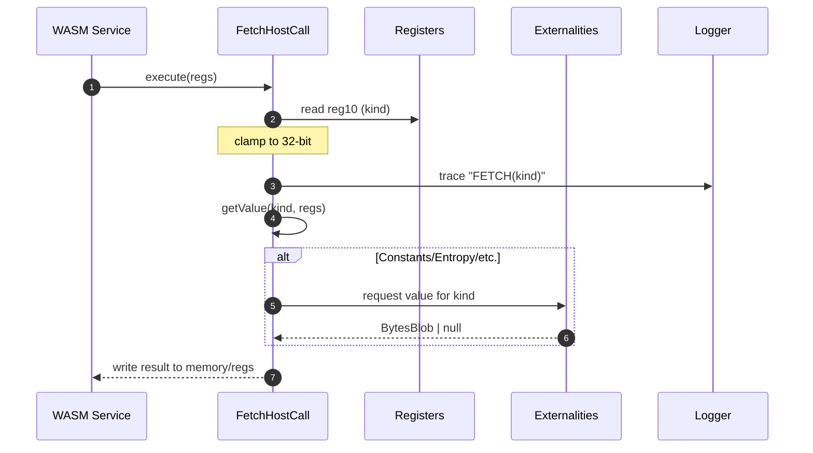

# Additional logging for externalities.

## Pull Request by @tomusdrw

NOTE I've changed the current host call logging to be a bit "lower-level" by moving the target to `pvm`.

It's possible to do `JAM_LOG=trace,pvm=log` to remove unwanted `trace`-level logging.


## Comment by @coderabbitai[bot]

<!-- This is an auto-generated comment: summarize by coderabbit.ai -->
<!-- This is an auto-generated comment: skip review by coderabbit.ai -->

> [!IMPORTANT]
> ## Review skipped
> 
> Auto incremental reviews are disabled on this repository.
> 
> Please check the settings in the CodeRabbit UI or the `.coderabbit.yaml` file in this repository. To trigger a single review, invoke the `@coderabbitai review` command.
> 
> You can disable this status message by setting the `reviews.review_status` to `false` in the CodeRabbit configuration file.

<!-- end of auto-generated comment: skip review by coderabbit.ai -->
<!-- walkthrough_start -->

<details>
<summary>📝 Walkthrough</summary>

<!-- This is an auto-generated comment: release notes by coderabbit.ai -->

## Summary by CodeRabbit

* New Features
  * Added unified trace logging across JAM host calls and refine operations for improved observability.

* Bug Fixes
  * Correctly stringify Symbol errors to avoid invalid coercion.

* Refactor
  * Centralized logging via a shared logger and streamlined module exports/imports with no behavior changes.

* Breaking Changes
  * Removed deprecated genesis helpers for loading state/blocks.
  * Removed the DisputesResult type.

* Chores
  * Added dependency on @typeberry/jam-host-calls.

<!-- end of auto-generated comment: release notes by coderabbit.ai -->
## Walkthrough
Runtime tracing was added across many JAM host calls using a centralized logger. Fetch refactored to read kind upfront and accept it in getValue. Several import paths were consolidated toward jam-host-calls exports. Two deprecated modules were removed. A CLI self-invocation block moved to the top. Error-stringifying now handles Symbols.

## Changes
| Cohort / File(s) | Summary |
| --- | --- |
| **CLI entry invocation relocation**<br>`bin/tci/index.ts` | Moved self-invocation guard to the top; main/createJamConfig signatures unchanged; flow preserved. |
| **Error stringify: Symbol support**<br>`packages/core/utils/result.ts` | `maybeTaggedErrorToString` now handles `symbol` via `toString()`. |
| **Centralized logger for host calls**<br>`packages/jam/jam-host-calls/logger.ts`, `packages/jam/jam-host-calls/log.ts` | New shared `logger` module; `log.ts` switches from per-file Logger to shared logger and adjusts message prefix. |
| **Host-call tracing (accumulate)**<br>`packages/jam/jam-host-calls/accumulate/assign.ts`, `.../bless.ts`, `.../checkpoint.ts`, `.../designate.ts`, `.../eject.ts`, `.../forget.ts`, `.../new.ts`, `.../provide.ts`, `.../query.ts`, `.../solicit.ts`, `.../transfer.ts`, `.../upgrade.ts`, `.../yield.ts` | Added trace logs; some add `resultToString` import; no control-flow changes. |
| **Host-call tracing (core ops)**<br>`packages/jam/jam-host-calls/info.ts`, `.../lookup.ts`, `.../read.ts`, `.../write.ts`, `.../gas.ts` | Added trace logs using shared logger; behavior unchanged. |
| **Fetch refactor + tracing**<br>`packages/jam/jam-host-calls/fetch.ts` | Reads kind from reg 10, clamps to 32-bit; logs `FETCH(kind)`; `getValue` now `getValue(kind, regs)`; dispatch unchanged otherwise. |
| **Public re-exports expansion**<br>`packages/jam/jam-host-calls/index.ts` | Re-exports added for `externalities/partial-state.js`, `pending-transfer.js`, `refine-externalities.js`, `state-update.js`. |
| **Host-call tracing (refine)**<br>`packages/jam/jam-host-calls/refine/export.ts`, `.../expunge.ts`, `.../historical-lookup.ts`, `.../invoke.ts`, `.../machine.ts`, `.../pages.ts`, `.../peek.ts`, `.../poke.ts`, `.../void.ts`, `.../zero.ts` | Added trace logs; some import `resultToString`; `machine.ts` now uses `BytesBlob` for code buffer plumbing. |
| **Externalities test import path fixups**<br>`packages/jam/jam-host-calls/externalities/test-accounts.ts`, `packages/jam/jam-host-calls/info.test.ts`, `.../lookup.test.ts`, `.../read.test.ts`, `.../write.test.ts` | Updated imports to `../*.js` or `./externalities/test-accounts.js`; no logic changes. |
| **Deprecated modules removed**<br>`packages/jam/node/deprecated-genesis.ts`, `packages/jam/transition/disputes/disputes-result.ts` | Removed deprecated genesis loaders and `DisputesResult` type alias module. |
| **Transition: consolidate imports to jam-host-calls**<br>`packages/jam/transition/externalities/accumulate-externalities.ts`, `.../accumulate-externalities.test.ts` | Replace many local imports with `@typeberry/jam-host-calls` sources; logger category changed to "externalities". |
| **Transition: relative path updates**<br>`packages/jam/transition/accumulate/accumulate.ts`, `.../deferred-transfers.ts` | Switch `AccumulateExternalities` imports to relative `../externalities/...`. |
| **Transition pkg dependency**<br>`packages/jam/transition/package.json` | Added dependency on `@typeberry/jam-host-calls@0.0.1`. |

## Sequence Diagram(s)


## Estimated code review effort
🎯 3 (Moderate) | ⏱️ ~25 minutes

## Poem
> I twitch my ears at logs that sing,  
> A trace for every tiny thing.  
> Fetch now asks what kind you are,  
> While Symbols get their proper star.  
> Old scrolls removed, new paths aligned—  
> Hippity hop, the code refined! 🐇✨

</details>

<!-- walkthrough_end -->
<!-- internal state start -->


<!-- DwQgtGAEAqAWCWBnSTIEMB26CuAXA9mAOYCmGJATmriQCaQDG+Ats2bgFyQAOFk+AIwBWJBrngA3EsgEBPRvlqU0AgfFwA6NPEgQAfACgjoCEejqANiS4BBWrXXx8GNBcgX8RIvAxFIAM3w+EgAPGgoXC0dpDQMAOWxmAUouAFYAdlSDAFUAJQAZLlhcXG5EDgB6Cu9cWGwBDSZmCoAxC2x/f1l8lUQK3FluEmSKClkK7mwLCwqMrOzEFMgCZmxEWgoAdwMAZXxsCgYSSAEqDAZYLlxaMFDcMA8vHwNoNApSXBOzi65mbQxdrhqGsuPghgDciQJPASJtKOVIIgANb4RAALzwaAANJA/jQ1mjEPAUVQDD1khYEQYAMIUEjUOjoTiQABMAAYWakwGyABxgADMbOgbNSHAALKKxekAFpGfTGcBQMj0fD+HAEYhkZQ0ehNNgYZm8fjCUTiKQyeRMJRUVTqLQ6eUmKBwVCoTDqwikchUHUKVjsLhUTaIxJ/MYnS2KZS2zTaXRgQwK0wGNQYfoMeAVHxKEIaXDlAwAImLBgAxKXIDYAJKa70M+iIUNveSqxiwTCkRByyCQjwMevLWDHZiKKbHdhjMDcfA+T6LCz+MA+CT4fviZwnPtIgIUFiD44CfAlPet1PpzPZ0J55AEffLMEaGBDyBEbBvXXOBzrrCYejL1fUE4WB0n8Ph3ogaBsFw8BqgAFPAzDThQmhsECGgHG4AC82E8NQsDQPgLTwFYeT5LBvCrtIiBaO8EgANoAIwALoAJQaLAdL+CxkAAN64v85G7kciDUW8RASBoiBREcsEsixLEANyQAAvo+cDjiESE6hM9TSZWAAKVaQLBoE/hgup0gyABSkHUs4/jwEQ3FEkQLi4Ac0joHSkDYOc7a+HQOK/nedKIJ8ra1Bpoh4EBAQeMG5FvIsNjvMgCaMJZNA2cwdkYA5fjpRgUYaKZ3GoLw0iUFItBqc+h7HswKAYCua6xQIW6QJsaDICB+DVUF5noPe3APFCJBuP+rUbkVwYVUcSg3s+pkBL5YixUoDAWG8gHOLERhlhWNgWOEO0YDe+B3htW0+kByCtqEWmMkEPC6fADCQOw0RdgYUBxBdFwdp5t4uW5Hl3WqD1BNpkztW9H0Gl9e0AKJhQhA5WscdLQrCH2dFDXAALJ0PAiRFiWP3JtwaAMEiaCdhUTB0hUMWUhUoVTJo+YcGThYHZWNZetqjKNqwzb8GqAMBd9UB2LQyBoJA5DBqcmAXE1/GyMkrxeHQSOjEEBE7LgFA+H4t7+bQViQDsshJPgbgSK42DSNBcEDEM92jJA2GYZAhaILbh4WIW3F8XS7kRB9ox5vgRsm74sGKSptXlVj7DIMurjwA2xumwolAZhurY23bDtO550IKzQiFbTQ7jqMolLoINsgwhYctDWF8d+HSFWLAap3GSQGhEBoOKFiXQewRoM8sSHj5HW4R5Dnwjxw2BfyayQ2ukLQeu7hQhu574zf0HSteMpQB8BEEeLiCfIH/Mgq3+bve1GOWlbHdqt33pdojXVOuDD6mkoZPT4DDPSn1xDSG7H9cgxkiogMerQHSsN3o2EMoiRyoNQq4kUDBGEtA2JGBRuIPEjIMaQCxjCYMJA8bIUJsTUmxZeYUzAEYKmNM6bSAqEISCfDIJgFgKie4/Zph9GpgwRIUwGQVG6iDa83NWF82rLWIWDYmzhlbJLTsRhZby2ob5chxxjbU2OI8G+fBIqVh2DsKsABxOIuFagRhQIhKGecFaPFIHwYKJBmDqHvn4KuVAjjoH8OEHy3BaCARPjYtAeAREmzRIPAAjs7Z2j4dhDAzA5cRFhZA4keItY4jMSBVnMqEU+AR4AhDoDseAaISA2CSQARUyccSu7hPC+LzGEkgOJNjqBEXgdA39u4KANLuNw/h4r8GCPrPgFsogn2SLIT8d4lbYKULcTopp36qImUAv+NirrbW/MAyGyFwEvXQfDcQMDpaQHgccQAKASK3+q/IGF1rnQ1ehgrBINgShUfNSb58tvJRECb6W87pZyUEiO4rSNTvG9LzkSXZ9D/AHNIajChH4lDUKhLQ3GgRGGQCJg4Fh5MIAcIMFw2m9N+HNBZcI0RYACmSIYNI1YF8KjtSokonmqiBZah9MLLRLYJYQu7LLRkCEUWth8ZQHce4Z4VBVRQDQQhqI/UgJU42o55pDT7K4dUySmmqrkH6SYwTlhjBsIgfSlA7J0lgtslKVBZCwVqEgRo7YfA5NEI0II0g7LGLYg5aYsFEm1CCE006LEcR+uogDINuSSFQEhNwLaJqbE+FWYyY2sgnUuooG6sprgJpnWzscbAMSGT6RNtCKwu8dhVTep5YZriElJITc0vgjsTYqCsLEGW9hGRop1tqsx4SCl/0sTYgAQlYESTUWqnS4KuqiJlMA8IoEFftKTKA4kdlEWJBBD0ehsDymRF8kbTJhIgLNkAWirW/Oa5I7ZoTPUfj4UpiJILHG6nWtVjUEmTvoD402SkbHbKoVTVxRIa7yDCmGwDTQ7VTuPVavgyRyXHCpiJPO6hxnOFHvtI5J1LmnOfOcm6zgrmgJuSqCBAKHlfTgV8wG51kFgNQZAuG0D5AMaAcjfF6MozEuxnQhhzIqUk2YCK9hnDqZMt4SywRzB2VhU5dW7lvLZE0AZkOGm05ZzCpUZ/NRgsJWaNFtomVvHuyGt3LQbAwkjEIzYD0p4J9yVtlEEiCzBoPpSANBadA9gvFYEVVDcWfnfHgcgBqrVOr5aDVCeYvzjBq1JcoP08xsFCzUgABJI2pAAaX0gAeSrHEaAicQ4RKiTYqmyF4DmrCgyFAyALjBdC76ADYHwWDZnAaDQoRoo0EfH9NsvG/5MGmfbOK+BgzPSE4CoywKI4xCozZ45tHbxnIARc3+90WO+k2xx6Bz7uMII9TxqWf8/l0DQXpTBRkxOXJIQYMhaNfRUJoTjbF+NKXMOUyo1TDL1M8L6FptlIi9NcvkXevlciFo4IZFZksNmxV1l9CLMM0qFtSzlfYHqxiEKmLCXnG18XOsn2ncl/xML7UK2gLkGw1Ika5bQJE1VDbL15xsee7O1AgjIEvQrMCNiAAi0hsd12R58Ap46DUrY815hW2zGfMn17xArfBlIpcLGl3phXdWFiUmBRl8PtPad02IgzaOjP8qx65HH+YNcGKGtsyxPXq4BmN0VmSAADeXSN7FOJsNAJGsEAAkPFxeXql/L6gaBlIsXD2Vf0DgGSFNa6q1NGgOviFcEbHHwuGQADUs5p4oIgDPQJp6zyGSMsCivdvD2m9I2bB3DpHd/id+jZ3GNnUS29tjdyoEIyeQ9kgeLyFSaJSDuT5KFOQ5U3StT3DmUCKRxy1HUj71yJICIMQuPeb4/UfZkMjnSe6Ngfqv3AHjaJHYIPBnWvPN53ZsdEfJMsFCzoVtbLkoQgUrINzJALoAah4shMSo2IAbHMfH4P4LuI1AAALuzDBXzjAsx6qwFQBVgIGfBaopYW4zoZaxDEGViC58BYYxTxLPgX6mhIEczFKeBDRzrDhUQ8JcBIxWSVZNaLAUDQhHBVi0A4gVS/prB2RKBlbdSwDcTABQDAAAGfDdSIhoF6Aa7qS5arjSJN7uJsAF40BF4C5RLLZhQcHHTeyDj+rl5dYWBV6zZsFiCwRiESEVLSE8A0L7CIAKEkBKGIAqFKTBQEZhp3ihBID2qaGQArKmwa7zbP58bLZGqzLxQ4hXzPRJG+A4g3b3KoQiINjK5gxKTfpoC/p8D/qT42IQS+agZEoYF7jwY4wUDU6+a8GHKHY0Yj4XSnabTnZMZT5Xa3JbacYL76qpEQqvbjGCa3bz5oblGgrL6A6ULSbr5krg6KY0psK76w776aaH5CKq76YSJu5n4mbkofDX6ip34DjE5iw6Kyqv5QZ2G4BAGi6DHPiTEsxfTIoJbBSzjuaeZTqKw4wUH66PiQCv4MG2rMFmzPi3EkC4DNokBoykCfFBQfHZbhJLrtifDkp4iAYJE9qwCfHfHM6DQlJ3hgg/wbjaEtC1a5AOJIxNbthhHFJkBEC1CqFQCaGwkzHPadhLbREZEzJrYba1FokHBYDnrOyIBKT+AfpARfokA/pOCymmSAaNEgaYrHCtEQbPjbJKACDYBmwDK9FD79GjGj7HA/YXYQwLELKz7Cbz73YinkDrEEoKBr4kqg7yZMLUpQ60qUxw4H6spnHH6u6n4Y4mZKz3G352ZPFSqJZpEU4dydE+a045YwYBbPQ2JxBIwADqiRsZ0wXAVhqqTBHOJGrkdAUhXBRAgGPgdquEVAqE8IxkGMoRsAOIGM+QvJtQOIRA3UQU0w62qsgyL4N0iARsQQPC3EwUNiJJ1AvoCR3Smh1JlGJBZBPU0gHMu5KWOBgweBowBB4gTcwMDaKK65JQecEUz4CiOCjIQp+qpBWkyAFBxpqWGgmqlu2quqf8QwFAJJd4PR+qBhliqAASQSjIUR3kNisRqMzODZ5AtAUhiRv4qyfgsESFpiz4MExkr5jZWFNUSAtWSI3EKsfkyaiIF0ZGfeeAnkdI45FAlsVEiWjYPK3Fz0/g2g7Q3kwUtA+AnkRUWhEyUymR0pGu+Q3BbAIkPCVieIXAJZpZSePEfZyhykOIyeQ5I5sAelkAye45iAJlye1a055wJAllPERA85i5VApA2ekAahplPEO5qB3csaGFTZxCykg+X8dp9Rvxjp4+Jyl2KCbpkxd2L++5KKaAUGXA4e3lccps4eKW4eZ5QwIwYwzM15iAWVYE4e9uUZTu5xJ+6OxmJAFQSZ+Y4en5ZB0WSgtAqVWqWVf54eVBfSuqJVWAZVkZJx0ZOmVVcZNV/KDVxVvpq+mMgZG+ux2+0Ohx5VI1lVlZrM8ZtVEwu40ISgyZh0BOGiD+JOGZbxE6Hc7+nR+oQI34VikAzafUdaZedIWJ1gQJyEh5yBXxPlecf5uVF5BVhBNSv5mB/5gF1BuqvuCJdZouz4CRrYFE+1JAGJ71XhnakhfhFU71DFdJ+JH1+kuQtWteVYUeGN4hXazZ/hmJfwpAAp7lmhegPkRID8R5KBGVCcmhr6sxi2t4kpq2cy62ORSyOF5keFhR7G9yX2SkzgReBZISg0+ukKIGUGNpIVjJYV/8wxE+zGMVRRc+jyXpv0opPy2CXue2etAmH2HpRt+2/2kmQOWxC1OxFKexYZBxEZxxCOpxY1m1hm1xdVGSlAsgh1/MjxRO6ZrxLm7xbVn14UaoYN6qAF6W0NsdEJvBuWI2RKHSIdU29S/eIGsNLAdq8NRGb1dNxwQeIIoevBsE4ebS2QSMuQAAmlpVycZfpTxFYL4LUG5R5cnpocpLnkpC6D+Z4G2RgB2R3Tyb3QOTUjYnWe+ezZoCKWTmKfzc4LJULTKVHNfPkUQJUZqdUdqcSrqeBMBugIaSlvBY+czg6vmZ4HtJ/Ivh/LaZrXxkMYArRtFQJrFUsXbc8q8rNU7QGbJq7cyApdsCtV7Rpj7aNc7hcVtZNXIogPbG9HaFzCKimeKmmY/udTHZUl3J/gPPdclXHbeHsNJOoNBAeQ9elWgaisbgNPQATfzsXYhEiXeDjZXZ8dkhAfktWkUlSX9SfK6GQYyADbgflVecRJltBkBZQSnUBRliw6atwUWn1h9OzsLCIsMifDsLVvkFWNSFWJycobPXySoZ1CMiFCvTod3IQoyNuSvbuXNhdKqecJ+m4FUTUevWbQLVketm6fsLgE0PbW/RrbrXRhFTrVFS6frVLYbVxt6e8p8ubbgp5L/axjbe9PFcgHCN5COA4A5HQBJivqA/NeA2Dm7cteGfSmtfAxtSjhNe7nImYmdDirOgWNZkdRHZKvg9HeTrHVTrmQ/QSeioWdYs+B04gF0/wGBadAvBw6XfEmcHM5QJCD9Sms+FQjNH5oYpnUpRBNiT4JtNgA4CfAtPfKdEFCOMYoURgNAOs10w4hObiAEvgGowrF3P/iQH3F/vdc+XmZ05s/Yy4z9W40+KgHSBkvAHgvrn85C6I+geDYDTI4VXIzUoi/fQHoo8U2OO4/4+kVvVKTvW6bkcsrhfTkrgtHeOQ4yI8OrUdKFZ/WPnEz/Qk3/QbbbSkybcS/MSgrk5AE6UxuUxsYSlU6SjU1vqGTvrAw7ojjGS05cdtfyg2o5clcPFg70+HamZHYM85sM4lX/brlCUBdWfYPHUbhQabn+ebso1DYgDbjwHmlOgiTYvpG8BXq4XdccDCenWfF0RYpM0QNWR6wgNRM4ZXn6+hNwJq0oB2pTTJDpWEVoIgLVlTMHYnGOe89ZV1LZYpDiABpQOQSo3XeHtkPpA4tzuTQZVGP2fZeZfZfmzOdniPX/HSIzPQDYhq1QEShuQEtwJ8BSf6SERYy+Hm1llOQW0cES2keKStkE7vZS2LZbLBneJ42tBuKjNMIiGiYBg1gAPq1bZDQBHu5BIwOJ/y1ZVbMvD72nhUiuRWcv8asb/33L5PcYCvAyrFZNcs5NxWen20A5+nA4u0yshlKbysNPDVNNH4qvINtMmatzjQ1Q6t459P6sDNnVDN6Kfm/5eY5kmLjP/VFnPioftwuKUk2rkNeLG7Wts5BL0eZ2WI1l8CUeXMhI4VpsvKm0ktLvSlunhzymQCKnSBwbPhy0tgCDeGjrjj7JiBaPuh0feO10DJ5bTD6GmnmszrWtugfHkBvD8CRR8DK1qM2KWKaN0kt1VhIz5Dy6wQd3cRrAsdDsXwONeKfCsdjQWD3ussxPPscvOlvvXZJO8vTH8sLu3jT7Cu7ZgzqxDXe2O4Icu6qsoModtzoczUO0VObFgPSvBkQ5yswOwfJdKt+2Id9B3CIpZxPL9DSD3BSL7CRZh22a4MGu4dGv4fOjnlgDSfx3ICBa3pMDGKICVKBA4gjctf5gKX4BIgNpTc8ozeICQjJVqPTdjelkmx1yFNlLfI9tMUtV/kao+CBCqMQ0eDzcNoXcaqWQ1S6pqMaqbA7fDwgWhS5JmjjTCPv70gqhqgAVnf4C3eAXXfcAg/3cXfBQAUvcNw0FPjHDQCNebeRaMBbTrqitmR/g1wBLsAKoGiUCCVEcBL/A+R+SAw1TBUssf2BeY9W3vs8t5PAdAPOBL65cStjsyaFeb5Qf7FygKsVWpdIN9A4phOwBtfHX37PFObEtZmMjZD8gsjLDnnWtSPnkYsYCJAjDyPRZCBrDDYtVRC2G3hnPtBEoK8sga5fl/1J2NSOt9U68MusPjMht+By7PgtBolqwsX3VIbi8EcgIzazn7P3dDde+UlIjZgpbsWQAMRsiDlbSIR8aK8nDqCIBqNcovhon17tAkCwSR/mQ4jsUvpNRhR/eJYfA5/OywTF9sSQAKWtl3gtAcnlb5/ZgrmDQicRDOPlwa6QhE9XqMi8CSC9ZDgWBgVZ+4BV+mKDFoBIggZYAPTUOfAF/0AdbAZRJt/mRcAW8d9nyfPVRNThBIp3BhJAtqg2Kr/R8kCtm1SOlIBIZqxrzvSBae9i9VZR91FDdqnOBCMX2+bLxKAwyRYNp3mqmR/q4fSAFfwPpfBVYQ4ZALBFyg9ZIsOIR9Eam4DCNWk8aE9IfAGQ5EwmGgFct5BfgU9Dk1GGng6SC7f0Qu0+D9sk0i4Q540ZRC2h5GiSXo6AXAYfo7DriV9y4NfG/giCrBlZRE1IatJCG8Bl8m8LEbdLIBoCIBV0ggSAAAB9FYUwNwOlC4G9ZeBufLfu1UgAW8i+AgrgEIJEFiCb+cReENIMgDLpZB0gBQQIGUGqC92YEYYuujf5qw7ccHFLsqzS6sxReFwa8CA3y5SsgyPPYrtB1K5744G3gyrr4L6DmUJe/TBzF11l7NUkqKVBjid0hoO99CGnNjhkPSwVsHENgHYO5SgBmVuo0/YemVFrREo3miAYQWFFEFacfeRdKJOZWn6adpEtcWKLBHMqIk7qsUEgQFGIQa59IHGL7JAAqAZMQUnkYYW/Cp4PstaX9EYpPmyZhd3STPQBq/XZ5gdna1TIrlAxg5RDFWvtRBqjkvC5gMON+LDh1xw4vFuuL+FoPsD4DbI4qV2AppQFVoUMLojTGIecNdyXDrwhg24FdjzgEs10KWFCmEFq5RAnkIYAQA4C7ZXpoCnZH1mACDxvd0+PAZUKbDACzMumF3TiD4BICgjj+dXZ9FD0GiYiwANeWbNDUgBIwQgcRPOH8gQGaFqIj3HyEVQyzcQ6iZPZ/DVD44/sjuuaXHqQ1ijP9/OFAp9nTzGKJNNhUxY2oyKuytUOBkAcPH8kgAAAqM3ABRq4RAKRvCaNhYAxGxtrcA1DUX8Iq4AjLiQIxqvqiZHpC2qqVLUbqPtb6iYRhouEc+gmC4jfA+Il5lbmdaWiku0Qm0eNTtFVIrhM1KAE6OBIZDNRqo90eDXNwVADRkQL6GzHoQkiyRsIxGBaMS7WizhkY1mPaNjEqjnR6opMSihTF7g0xGYo0X0BpF0isRhYUMcWIQali+g5YpqrsLmpc9QhS1ErvUxOGC8fBwvLMHlGB5yDOYPTTDnqzuHJCHhqQqAOCkBjGCWqfvB6kjzCgo98w+CQ/lkNnFgBmuY3DLH/E9HkifRvCE8WeNa4gVPB5XEsf7SnHndZx14ednMVvC7jcA+45+Cc1nJfZJaywRrsglNBAJZaGAIvA0ReHhIIRRGPCJ1G0KtjKe+0PojKO1rUDRi6wiYgAz5Z8cfS/YypoOMWq1MRxntMruGJfFVc3xM4+cTcMXGE57hMvTMoG2tZ8RbWeo7IcGMLDYtCOGdPIdwXd7HAJuF0UsdR34aiBICQjIKAiTIBWgy6TUQILhFkAeB1uKAT4PszpINYWSFNHwlIQZoKSowWFacSzTziFC8BJwehNEVh72pbwbAEcGMCJaADV4ngOGGkWlHRNKBco3CTPiA7bDUmiCfjn/Hi54I/JwrOnn9lA4DjtikHcIXzxhydjmmcQyGokOw7LjWJF1HsP8zdY9s/iARNYDiIoBgBo0xwBvsljWAqVR2CsBCaNCkBuAtUgYA/gqhaqtgKpqqNXnlXwI8S/Eg0SzgBDcAdTtUeuZqABG/BKR9mytTIeDXt7BiakawTyGRiRGmhCk8lUNvwDwAdlBRVwGZhp2OYqV9mFUByPUkAyWJR2E8ZuqTV5x+xrJhGGIsyLQp+AMi7AYtj+Biz3UTe5wM3kpOMJ0gDQSbAyX4SsANSU0YkNEmowOmkBfce7VyX5jhhf8BRB3LgKf2pjn93AvnfoODPzAVAoZ0gHEI5KCDyB1JXHHEBtAIQFEF6KJH/hgEACYBIeQjgKly4XketC4EU46gxhEwrBIjPmHqikE2yWLpMV8l8Awp3aL4UfzBLzQvJJyHyS+xoGulGeSohKsKOi4XRRZ9Pf5PcjlGlVkpQvVHEy0arGQG+jQ3AM0LcCuDkAospGRT2imO1ghpEiBrzw9r88qJpwrsa+MKEMSHiGU06iuLYl+4zWwYBCYOGoDPsHI5AHXmyM7imwrY0JM6ECFsoPUWUFZWwlyjv61IrY004aaeWkY9SKCwUBgJlCBjPgKCo7YaRoCVjwQyCJUNEmgA0BlSXAbAceKri5QhwciYIsRloUMQ2EE5Wk4DAo2oLCjVO6pRqe5PejPRV2MA10AJPoDrJNkPgRwFnFSToyBp1BRYQF1lnBccJAHDYQFIInyo9BNYhLD3ONwdivBEYj2eW2Ko2NXEC8n1nhg1HlzK5MJVCHXIbnAZm5oiVuTnmMi4FlJV8SRuDVyBlYdgtsvLpKwdnxT3axwo4tRPdm0SruC3cHh+OuHeylxvsrKTHWdDI9luY3a1tuJ2ncS7xuCh8c6z/gNivRmY+rsQtG6kLzcwouGVQmei+NT6aRSaRdGf4i1961LSmc9ECZCdimMky5NLOOyyi5Z280LnhM/bM8dhMUkiXFKK7QLIhsCt2SlMnGIKbuqCnBsxMylP5spB8/3DjH1y0MUUnExRna1TFzTgKzrW3FgAGlg9rw+CDzGOnYmByXeWdWoeVPwAOLWhxeRgiXS4YVRSCAhdTsVnDz5Bast7KtlpW8JU1aA9lIJZXUbYM1k8iSnhNULgy/IYUd4DRdwCagdlgoH5KLt+I8Y0yZhltQwYzLE7lxsRfC0loLXmRzz+pL5D6SPNyzX1sUuKcgd5LEVby1hO8qRfQOVG80XsMXBYsKxExUDVheqYifbIUVhClFo4lReONiGTjIeKCr2dopOrS89FMddcSMLvCG40GBwcJK2F/H/jKCDXPTPeJ9wgVbwV4/MdQsa6niSFtyjOFgF1kTjUc6yxrp+IR4wAcFtCg8QHFLjYsDxVU7EvyN5m0B2FJnFePDPHnWIwJ5LQRYI2EXrzMJKw6Jn5LoERdhlrPIIRAvmXDiIhSyz5asu+V/d0p6CnZQQ2NaVhKc3mEjtdRIaDCNwgWGxGt3oCq5NOPjeQKCWNT0c8WenQ3FkNTqRz2cLHISSEgRLhwTYJKFgl0l77/KrOJIvrFwEslhLL2NgRzsnliVY17K6GFyiQCqwkBZA/dcoSnnLgZKDUnwMShJSPDjJrC9S5dlwryI8KiAIErvkzNz7KlNJ/AaCfIHIaWy60eyHFEpwVrpzLERhA4PLBWZcNxONSQigMLzjidhyc9ERQMSwnTL5R3LcLlsIInzZBZHGOUYKPFZ7CCuQ48iaSsoljj1qes13MSPIDpirs1KnRRgt2X0qDFhuVsAw0mRdSgasjJuMFFt6XcVGadGWPJI7ncdFgRAW6riTjpsNHgGq8tgMnrpIwAAGnVlyBNY9VN/W6has8p9rTYGNOdewHjGsYWIGSnEK5zZrItOaZsDxrfFDnQiUURSlWSUpkpkt5kz0TEWuzwpKRUK9qbcYFlnW3UL1HMqituAkDIBV2PM8niMMzWPts12KgZf5PwkMDXkX4vmmrL/Yaz3se8p5OWtikQdFFdTWtcsvrVfLG1OY5tQ9F8jQytFtw9tbSrw7KzreX1EBDQCqSHcmo5zAMvesYYDqMWINYKMKuSwncrFNBeElEjAoklwR1MBAOQCdEMbZybi1jsJNg06M9Bm6/SNkDiDsk90FwEkZUhzAM1j1CcejQFC2YcxX0BhJerPOPp+N4NhCkilZtIA2bjoGgKDYYNv6LBcAsEY9qe3PaXsHE7cyYNZpXoaB5uSccaIsGJR+a0SgWuICezPYXsr2OIE2WbM82aBSyZWWrH9kibU8elKG+JpIvQ3SLApJtIiXIrmWkaFl5Gl2XWvg7UbLiTauqpGyvRvRXADwbxUgrbXbKo6jw55G/njk3VAWQEExVDHHp6dJNvUi8SOono8ENOo7MrFWB2DQBWSJjGwPkCPYRKol+kfSXEpxDOcyh1S3PqYWJiF4g18a+1Imr/Kl52t7EOIgmnERzd+tH6nDcSiqXic7o/iwTuS2aJGlwaDRUNZ0ojWhskNyw9lthP6XlbcVBazDQStmVEr6tJKxKatXPk0TUp7WqcSuHn4DapeQ21cQyrjrK1mpgm/tamPRY9TCCfExbbNssVSbrcvuPEkyppx+Zw2USP4MZvICVJ8ds5Nju4tHYNZa8t7BPDzqU0VJoxubIIqIl80WCpBVMqumgScY5xest6nuK4xRZeE/WdmkudwRjUmFk10IlkSfEl25jJKpUlrvQFXYDYaYsKrdmp2fyLtt6P6xZNwvFpeJr6D258IaTDXsFI1GKkrVirK20DFZX7VJoSs57Erq1GOgXlRopU0bw5dVC3eQEJ14MUhbEy6q1O/IU7jyKLHOer1p1FVQaijObeKr765TzEECi0vsipZe7fAXAKhKgH2aFz6QvobQgrBsFyD7BYnLrNYNsHyCPADQdqIIBaCYEPUOMbILOB5Beo0APqQynPWpCJ8hgxCGoWX2SqJYFYuaUnjPoNBz7RgC+jXNkEbS+hCZ4YEmb8E+bOSSZhqC6Ps0Wn9ZioQYUvjQC306Jio+qU/ewPoBp7pdZGSaFulwgiRPIVCWCD3rsEj7uIK0sQEXl+4f61QkB4fYIA0Bj6BAE+lgLBAxivoDFc6U2Cusb4Eweca2ksrBGAAYw9AOIYABOEGATZcAegbiKOwaKq7Sm+/H6uZLvUF6H1UOtlrE1h34aKtQy5WSMo3q/JxlhG0TOIrOjEb5FaOuPc7KSlY74FOO2jXVSpidgM9nXP2W8T9zmlLSSWMjtM2OD6QbA7JUoTyvVy2rBuIjB9WXpnRqNb6hzaVYiD0ZKT/9pm0IDIR4RV5kI3h0gBGgNDfNPOvgNXbhE7A5b+9CsCzX4GTUwCbEH5Ajkam1xsVtddh0VWi1zmXlMWw62koowyPJ15tE6+vktrYZ4yHqph8wzfMpLtk8AOvFg44zYN8M16qsr9Q0uCYTzRaMAppaww+JB70J79EPTDpzU4qI9MitesWq1nSHkAqKohNHvA4HCGtFEprZRpa1J62tahv0SQCRBaGWJnanrqTtGYkd8DUzO8PpCRhIwqsKctXPlgZxkEkW3BxhiAWYb8SxCHOUJfOnyzsc7w/+l1NscwONQrDBhDTY3wLRT0xk6/bsiYSM1S7PDIQMmY1x8CnRfDuAHEMcsOAkAUTljfksrpCPeAmjQwbY5EYhaPHu42G0Zf9BdVCdOjnu9dr4Ek4aQzdfgP3kN2ejUUcQf0AmIppJE4g9gJy1GjwhaCJJjoajbvDc2/BetSAQpjmGfVJ6zg0Zj4cYdLSwTBQndsUdWSzOtkHKgdUIlpWTroYM7vAJ8DpezN4O09pjuahnvmqVks9HsSCVo5Mb0hRT5j+w7nujsUOY7nxKhtZZsenAE6mNTEwbYaxJ1+5BAcnNQHCPkCBY/TxwBktExtQK1uG83eahwZqnuLl1filNSfBjM5bi2ZbRvrVP4LYkwi62BTbzul05g0TcEzE0CD8PPs0KyJ2s6iYxlz0LOfu1g0Qk+JRHbDaBciMmZy2vo3MxqTyG4qUDgglA5wKM89AVpTbONMRovd1OyOia8jjOwo5XsdGPT7U/CwHYNEnkerZTYEaFVBJgkG7/MsRpzafTgoYB/IUs4PTLN6UCHLTu8jDfipFHlbIp0x2Q3VsWPumYF5K20azFx0rhs4ux3RXSoOOjbiGt1QeByufBi6ya1x3lW4gFXa4HjHNJ4yueSzK11poJqTngHCaJZ/9teGcLQElNzDWa3HEE5dvMLfdMzggIEAvJPjAXaAOWrgPBcc4eGZd4Rms9638MkBAjuAczWkd7PMWBzoA3LE/o+ML92DpJk9aJZXrcRN6zUUtnYw4Nwo8TKREKUpbd3C0967qxvZ6opabm84G0JAG1G+DwCGTSBBOg9KD4fMmBB5yfNCrNObzHzox605Hv5ZWyHTEhl8yBztmo6fzChv88obUWUqU9FQQdPROUQLj2uLG4ndntJ3vlg2pHU4zYmlDN1asiFhdHca0hoXfqdh4TSXqxaGnOps05ndiMihYBEzNiUJgRYQhmEusFhG7c6s4b2oorrFyABleJowmTNXFjQzxbrMDWBLQlynSeo6sKWU4M2wPoXRkA2TkKrBYy2Iwzbbh7dOx/5UBrzjbn5ksEW9hUDy21YKgZWbIGVnkSgHkIcQMaBQD5Ek8AMWp3eFfTAy+7W9unFyw+ZGNoaEdNp1zC1Sd6pUYjXVcGjlSyPA0iqA1W8GGNUUNqNjEVqK9eCaomtECf1jUZ1Wyq9Vgx4Ni6JDZWUAW+guOuGw6JR0x75DsrGtSsf/PdiKgdk7Vr8oDNxWgzWet4gTD6jFpnw5y15RnGO6zSrlTXDmxePuUtrrxWYmhStwvFPi4FYV13NTbzC03qIDC0zsaHDNWxWjnCto66opZdGPVb10ra+3D0eXxj1WtnrVsCtungryiim6+Olt03JemenQ1gqSvY8lUidC1hxIY4WL6xFVm3K4vTPcFvjcNRVZ1Fe6fFCDfSCtqWVyBmME8eqq9DwlNXmqu6Rq2O2avTVWN7Km8ZIFUJSVeUV6Nq3fSahN2sFNbBlzcKuB2N3nRFOt+WQqMI2vmfLQrSQ+UrBhfmTbVayButhCten6qUYCoGOa7b1h1ERIaiNbaSEdrwLL+Awr3dED93BYg9xxWVOQmHkRw/UD6NCiRP2TNg4hmKmPzAoFgoAJMhxFqEHteFckXAdcRmlEDeHagXAX5r4CsGVIiYTk2QG4VnKbAEAase7kNCsiGNnE89v8g4GRCIhZAfkXcEVDWBF5uk/gaiPdyIhWAbY5wbw03gVQjtbGX92rHEDLxJQ1Ng0ZbFIHfZkZNdnZRYACashoMsAo7VUtMGfvy5Eg3AYh6Q+PuiBX0+9w+0gAUE0wGHDAU+4GgwDBoGAl9y4HiasFsOkQQyN+5SQ/sKxUHP94iMDr3D/3twAcYB84ECKFIEHiwP8Mg9cRSOMHiDjPs4FwfDZPgBDjrEQ8wIkONwo7MfTTDofOAOHf2WWI4F/7TBhG+Wc+AOGmmwRIHNSYdE4CKm4EJgmDvgACSeRMHxZvUQ/q4AozVH9w8WyYl9hmVFalhfBqZahvh1jGqtlYv+mqY3DhPqxzDiOUgA4dcP/gvD/h9fbQJ32MAD9omc/bPmd2ioSgHu/8z7s6gB7/qB0XGNdLZPgILUw+fk6VwoH2HiAE+5ADPs8PckZTwR9ui3B1OJbDTuqpPbXB0A2nQ9nLsbeJtBXSb8e12RVVmaOO0warORIc9mzD2fZrG4bd2H2WkBbAGXEgEyKFvwjDc241CSlhU6yd7YrFJxWOGo7GRCwNO7I9DdZiNibxAdBMqSOBcFjnWili6NEfGiAQpAPzkrBqghf1djn4LyhU2Iyzzx5b8K1W7gVqX/adLwYN4MOAIRsGrLIKoOCzRUqIyGiH8gNSef9YtV0TEzKaFgE8nl2s1oe3WwrP1sZP5s3lz9Y6bxX+XwFGz021s49MJ6mmez78FcTBdNOumdIG4ASPhCgXR7bG55DmjymHKtxSE4brc/uePLn0upxCccXGRdZkAfzkG+MEBfVcMXIL+V7VTzHejIXfE9S2ajcBuOvuPzh1oLeNe8I0XLrqhZSJZ04vay0mBdnt34gHV/llL1bBCukvs7fMLCv9LdbsV+7gMx5+QMHNCgfO5XBCiFNre5dV281iozy4RKNsBXxXrdp2R3YluyugIPdh/qxT6D/3sMiAMAEKVOc0qErbxCezBDVC5PAMn0byC9NR5I1Qrjb5wM2+GetvZ3Hbrt1FvzA5FV7bkJSZMT/lZxtC8uFt3IMiMgkDxCiVcE1dz3TapJeSbrc452bl0SUKj+QLQNwJGAtRf83d3O/3f2NfYOW4AEjFoCchUgDEAAJxx26ITEHEG+47f7wggwRPQApCMCrliKdDQLL+//dAe47OIXMzUgg+tuoPFaaTCS+fZWAOZwohDNJgM5tUprnxd5XYyXvmpgWkAbDx+44NxOsEvu0OQhOLfDHUnet8twbcyfvs/5uTw+Yx+kA5bZnqi6d2mHbfzvpPcgpdz9XhvGRZCvjqSFIZ1pTpkAR8xAq+73eifP3OUn6j+7/epAAPwHs1aB/A+6fEAuHmD7nmbs1uyJkr+txJ/Wb7P/Xrr1F7c+DeYuNlMVxifTaJ3BnErSA9Br/s7holEs00v8nynEBiiek4iL55CPUsUXlbE4JecLGrNcB/nBVO1+nKd7WsrH24OkKCO/KMjL8uAXDziGeHvA0SaNSupV5eSwhAZXaBr1606xCMf99YZ+ziBdTmRTYzzTABs2vR1efDd1NYB/0L6PU9qdaEb6QAa+Qhg6YUWb3c6WQ4gucNgOIDsGb65Aj2BMJGATFqxHtl0LdePDsDW9BiKADX4KNTea9Y0nUw5ZAylly/6pIQS91m7e7kKc2nbgdhuLd98L3eSAj3ubYQWk3ZpenNh1sEjHK8NfqvHwZbw18uubA/vrXiuqN+BCIAJvfhJ6ijXh+recpi39Eqj7m94/1vm37b7t/2+Hfjvp3874N66a4fLlJos0TjmKOveWbjt6bYll69ccBvoLPgFkPHN4jVX1impG159aFJOvOoZ+5cpbFn6sRGuWrLg/yzg7mQs4jOccH2Ysvi5lUXj4AxATnMiQDUqM5keL0AvWtlIJSIEgwBow3At4JBKm6oDmy5iIk0CbYWf7WSNkStZl9WeJacf+DH1tJ3y8LVaXcNLA8KWhomXM97PCxiV3W/NtTvXPcrlF76KDfJ+YgPb+K0F+ynavzEhia6MWYi/KpBpyvIYDYdHZHBpk6Xjn5xqKtm/1jTcWNJ3zheR0BACEl9JR9N4XNPIYvlwt18eresXCEvuX7QD7//ixJFQd7Q2gqBcr9rr3Hr/6KIC8+hvPXonzxfcjYjlvbhcb9mDW/c4yfzdCnwd6O8nfo8qA6H3j9h+1fV/CPpr5jRW8HwV/z1JQLj4f/4+lShP2mjwga9L/6feP4YohGyAAANjFACIAwURAPAfMAIhN/Mb2xEbvO/ykIAfZAw24MuICGftJfYeBe8WpcegS8ovcGiZ9MRC7ll92BC7kF8AxYXypF8pENhwDpxUHiQVsxZKipsg7Nv0ME87MukahR2XAL3BsvW13N8EBQ93eVAgWgKn97uRgIbhqOdv31QrnbXwY4lnIgCJkzcVPwdcvod1wuhCwNP2dZxLLbFKlqYLa3R5kAEbkDojXDzxNdEZWgRBIceW6j1JL6SYgRRwKXP2Mge/GNgZAluIFUQBtuBuBcCVuLlU8CxuMSR8DIsSf24AGKC0k+A0+TYXxEVeMc2VAFJE132YE0I016xfdY4DtdEvf1njly+IvwS82/P3xScw9Xl118CJJU2kgIg0vyOUffQhUcDfWXrCmkJGegFr8cvXgLf0Mg52wS98A80T1QoAIoLegSgplxRQtffxj0FKgof1/1pfGoJip6gngPr93lTfX+54vbrD9ZaROX1B9HqAFB6DrWfoMIUx/acX8DZuPrUW5KwDm28CDg1wPcC64MYKycTfRcwaCpgioB4ggeC7lyUiRKlS5FpbXVFNwEDWYM9dUgjoJWD0ENYLKD+TAYK4Buffrwu9PkYMH1xAFLgJtdJbCRCaDEDOYLcBSAogEDE6fYMU5k/gv+QBCMTIEKm9P/UgC38N/Vf0JDMfXfw28tvA/z28j/an2jxwQhc0HVYQhvw+DEsL4Oeg4ZNv1fQughgH+DvfQEMIUofU0Bh8ggOH2v88fRH2R88fbHxm9RQ1/wW93/F/yCBafPnwZ99mCYMZCfgrkJ5C+g8oORk0eSCG4AgAkAPwAwAqSCPBEAKAOJCYAoZFe4/vBAMQAHvIfTpC1Q5706DVgrEN5CcQzYJQDnANALl8nQy4IZCXQkoz05ZA+QMIUT5Cgl9gn5WECrktIGuTQh35JuT9h1AlrFgguoK10UCHnZ9HngXTStUc84/MlQT9BvNzzWoMsZwD880FTP0Zt7bAxSiCqkScz9huA9UMLAuAQsDZANAdsIYgVA3CE7tJPAJ2OIywrADrCJzDMAk50mRhU/VhwmIKyZrTL7ByDfJT63Sdg/dPVzCQhfMJKNoGcMkTAnQeGFmC40T0HQU9QEPFf1aVG1AxgbQNQFjAHQBMAMAdwvUHUAj2bOEQAj2dfDoAj2HrEQJ5QW8MVBIARXjQB+QQAP5ABAMUH5BAPMUFoABANkH5BaAMUF5ARQHkBIBwI1IEACGAfkDQA2QNAEA8eQdIB5AGAAQBZB6AL8LvCWAGFEfC5YF8IWo3w5UHjA9AIAA=== -->

<!-- internal state end -->
<!-- tips_start -->

---


<details>
<summary>🪧 Tips</summary>

### Chat

There are 3 ways to chat with [CodeRabbit](https://coderabbit.ai?utm_source=oss&utm_medium=github&utm_campaign=FluffyLabs/typeberry&utm_content=575):

- Review comments: Directly reply to a review comment made by CodeRabbit. Example:
  - `I pushed a fix in commit <commit_id>, please review it.`
  - `Open a follow-up GitHub issue for this discussion.`
- Files and specific lines of code (under the "Files changed" tab): Tag `@coderabbitai` in a new review comment at the desired location with your query.
- PR comments: Tag `@coderabbitai` in a new PR comment to ask questions about the PR branch. For the best results, please provide a very specific query, as very limited context is provided in this mode. Examples:
  - `@coderabbitai gather interesting stats about this repository and render them as a table. Additionally, render a pie chart showing the language distribution in the codebase.`
  - `@coderabbitai read the files in the src/scheduler package and generate a class diagram using mermaid and a README in the markdown format.`

### Support

Need help? Create a ticket on our [support page](https://www.coderabbit.ai/contact-us/support) for assistance with any issues or questions.

### CodeRabbit Commands (Invoked using PR/Issue comments)

Type `@coderabbitai help` to get the list of available commands.

### Other keywords and placeholders

- Add `@coderabbitai ignore` or `@coderabbit ignore` anywhere in the PR description to prevent this PR from being reviewed.
- Add `@coderabbitai summary` to generate the high-level summary at a specific location in the PR description.
- Add `@coderabbitai` anywhere in the PR title to generate the title automatically.

### Status, Documentation and Community

- Visit our [Status Page](https://status.coderabbit.ai) to check the current availability of CodeRabbit.
- Visit our [Documentation](https://docs.coderabbit.ai) for detailed information on how to use CodeRabbit.
- Join our [Discord Community](http://discord.gg/coderabbit) to get help, request features, and share feedback.
- Follow us on [X/Twitter](https://twitter.com/coderabbitai) for updates and announcements.

</details>

<!-- tips_end -->


## Comment by @github-actions[bot]


<details>
<summary>View all</summary>

| File | Benchmark | Ops |  |
|------|-----------|-----|--|
| [math/count-bits-u64.ts[0]](../blob/e7f33064cdffc0a221817a70d893a9ae1ee36cc5//_work/typeberry-runner-3/typeberry/typeberry/benchmarks/math/count-bits-u64.ts) | standard method | 1515660.43 ±0.25% | 86.48% slower |
| [math/count-bits-u64.ts[1]](../blob/e7f33064cdffc0a221817a70d893a9ae1ee36cc5//_work/typeberry-runner-3/typeberry/typeberry/benchmarks/math/count-bits-u64.ts) | magic | 11213682.36 ±0.15% | fastest ✅ |
| [codec/bigint.decode.ts[0]](../blob/e7f33064cdffc0a221817a70d893a9ae1ee36cc5//_work/typeberry-runner-3/typeberry/typeberry/benchmarks/codec/bigint.decode.ts) | decode custom | 170713197.98 ±3.19% | fastest ✅ |
| [codec/bigint.decode.ts[1]](../blob/e7f33064cdffc0a221817a70d893a9ae1ee36cc5//_work/typeberry-runner-3/typeberry/typeberry/benchmarks/codec/bigint.decode.ts) | decode bigint | 98764066.66 ±2.57% | 42.15% slower |
| [codec/bigint.compare.ts[0]](../blob/e7f33064cdffc0a221817a70d893a9ae1ee36cc5//_work/typeberry-runner-3/typeberry/typeberry/benchmarks/codec/bigint.compare.ts) | compare custom | 263023971.68 ±6.41% | 4.28% slower |
| [codec/bigint.compare.ts[1]](../blob/e7f33064cdffc0a221817a70d893a9ae1ee36cc5//_work/typeberry-runner-3/typeberry/typeberry/benchmarks/codec/bigint.compare.ts) | compare bigint | 274782977.15 ±6.33% | fastest ✅ |
| [collections/map-set.ts[0]](../blob/e7f33064cdffc0a221817a70d893a9ae1ee36cc5//_work/typeberry-runner-3/typeberry/typeberry/benchmarks/collections/map-set.ts) | 2 gets + conditional set | 119293.55 ±0.14% | fastest ✅ |
| [collections/map-set.ts[1]](../blob/e7f33064cdffc0a221817a70d893a9ae1ee36cc5//_work/typeberry-runner-3/typeberry/typeberry/benchmarks/collections/map-set.ts) | 1 get 1 set | 61779.53 ±0.03% | 48.21% slower |
| [hash/index.ts[0]](../blob/e7f33064cdffc0a221817a70d893a9ae1ee36cc5//_work/typeberry-runner-3/typeberry/typeberry/benchmarks/hash/index.ts) | hash with numeric representation | 191.55 ±0.34% | 28.33% slower |
| [hash/index.ts[1]](../blob/e7f33064cdffc0a221817a70d893a9ae1ee36cc5//_work/typeberry-runner-3/typeberry/typeberry/benchmarks/hash/index.ts) | hash with string representation | 111.12 ±0.14% | 58.42% slower |
| [hash/index.ts[2]](../blob/e7f33064cdffc0a221817a70d893a9ae1ee36cc5//_work/typeberry-runner-3/typeberry/typeberry/benchmarks/hash/index.ts) | hash with symbol representation | 182.92 ±0.38% | 31.56% slower |
| [hash/index.ts[3]](../blob/e7f33064cdffc0a221817a70d893a9ae1ee36cc5//_work/typeberry-runner-3/typeberry/typeberry/benchmarks/hash/index.ts) | hash with uint8 representation | 164.11 ±0.27% | 38.6% slower |
| [hash/index.ts[4]](../blob/e7f33064cdffc0a221817a70d893a9ae1ee36cc5//_work/typeberry-runner-3/typeberry/typeberry/benchmarks/hash/index.ts) | hash with packed representation | 267.27 ±0.03% | fastest ✅ |
| [hash/index.ts[5]](../blob/e7f33064cdffc0a221817a70d893a9ae1ee36cc5//_work/typeberry-runner-3/typeberry/typeberry/benchmarks/hash/index.ts) | hash with bigint representation | 194.78 ±0.1% | 27.12% slower |
| [hash/index.ts[6]](../blob/e7f33064cdffc0a221817a70d893a9ae1ee36cc5//_work/typeberry-runner-3/typeberry/typeberry/benchmarks/hash/index.ts) | hash with uint32 representation | 204.62 ±0.42% | 23.44% slower |
| [logger/index.ts[0]](../blob/e7f33064cdffc0a221817a70d893a9ae1ee36cc5//_work/typeberry-runner-3/typeberry/typeberry/benchmarks/logger/index.ts) | console.log with string concat | 6721454.59 ±60.25% | fastest ✅ |
| [logger/index.ts[1]](../blob/e7f33064cdffc0a221817a70d893a9ae1ee36cc5//_work/typeberry-runner-3/typeberry/typeberry/benchmarks/logger/index.ts) | console.log with args | 926445.27 ±96.64% | 86.22% slower |
| [math/add_one_overflow.ts[0]](../blob/e7f33064cdffc0a221817a70d893a9ae1ee36cc5//_work/typeberry-runner-3/typeberry/typeberry/benchmarks/math/add_one_overflow.ts) | add and take modulus | 207247467.86 ±36.6% | 21.88% slower |
| [math/add_one_overflow.ts[1]](../blob/e7f33064cdffc0a221817a70d893a9ae1ee36cc5//_work/typeberry-runner-3/typeberry/typeberry/benchmarks/math/add_one_overflow.ts) | condition before calculation | 265300065.65 ±6.13% | fastest ✅ |
| [bytes/hex-from.ts[0]](../blob/e7f33064cdffc0a221817a70d893a9ae1ee36cc5//_work/typeberry-runner-3/typeberry/typeberry/benchmarks/bytes/hex-from.ts) | parse hex using `Number` with NaN checking | 122505.22 ±0.26% | 83.99% slower |
| [bytes/hex-from.ts[1]](../blob/e7f33064cdffc0a221817a70d893a9ae1ee36cc5//_work/typeberry-runner-3/typeberry/typeberry/benchmarks/bytes/hex-from.ts) | parse hex from char codes | 765126.17 ±0.32% | fastest ✅ |
| [bytes/hex-from.ts[2]](../blob/e7f33064cdffc0a221817a70d893a9ae1ee36cc5//_work/typeberry-runner-3/typeberry/typeberry/benchmarks/bytes/hex-from.ts) | parse hex from string nibbles | 506285.79 ±0.36% | 33.83% slower |
| [bytes/hex-to.ts[0]](../blob/e7f33064cdffc0a221817a70d893a9ae1ee36cc5//_work/typeberry-runner-3/typeberry/typeberry/benchmarks/bytes/hex-to.ts) | number toString + padding | 260545.74 ±0.26% | fastest ✅ |
| [bytes/hex-to.ts[1]](../blob/e7f33064cdffc0a221817a70d893a9ae1ee36cc5//_work/typeberry-runner-3/typeberry/typeberry/benchmarks/bytes/hex-to.ts) | manual | 14415.91 ±0.35% | 94.47% slower |
| [math/count-bits-u32.ts[0]](../blob/e7f33064cdffc0a221817a70d893a9ae1ee36cc5//_work/typeberry-runner-3/typeberry/typeberry/benchmarks/math/count-bits-u32.ts) | standard method | 91758384.22 ±2% | 64.21% slower |
| [math/count-bits-u32.ts[1]](../blob/e7f33064cdffc0a221817a70d893a9ae1ee36cc5//_work/typeberry-runner-3/typeberry/typeberry/benchmarks/math/count-bits-u32.ts) | magic | 256392884.55 ±4.29% | fastest ✅ |
| [math/mul_overflow.ts[0]](../blob/e7f33064cdffc0a221817a70d893a9ae1ee36cc5//_work/typeberry-runner-3/typeberry/typeberry/benchmarks/math/mul_overflow.ts) | multiply and bring back to u32 | 255619679.1 ±7.75% | 3.69% slower |
| [math/mul_overflow.ts[1]](../blob/e7f33064cdffc0a221817a70d893a9ae1ee36cc5//_work/typeberry-runner-3/typeberry/typeberry/benchmarks/math/mul_overflow.ts) | multiply and take modulus | 265418681.24 ±6.2% | fastest ✅ |
| [math/switch.ts[0]](../blob/e7f33064cdffc0a221817a70d893a9ae1ee36cc5//_work/typeberry-runner-3/typeberry/typeberry/benchmarks/math/switch.ts) | switch | 262217774.04 ±6.5% | fastest ✅ |
| [math/switch.ts[1]](../blob/e7f33064cdffc0a221817a70d893a9ae1ee36cc5//_work/typeberry-runner-3/typeberry/typeberry/benchmarks/math/switch.ts) | if | 257449481.49 ±7% | 1.82% slower |
| [codec/decoding.ts[0]](../blob/e7f33064cdffc0a221817a70d893a9ae1ee36cc5//_work/typeberry-runner-3/typeberry/typeberry/benchmarks/codec/decoding.ts) | manual decode | 82077.48 ±35.98% | 99.95% slower |
| [codec/decoding.ts[1]](../blob/e7f33064cdffc0a221817a70d893a9ae1ee36cc5//_work/typeberry-runner-3/typeberry/typeberry/benchmarks/codec/decoding.ts) | int32array decode | 160873943.59 ±3.51% | 1.79% slower |
| [codec/decoding.ts[2]](../blob/e7f33064cdffc0a221817a70d893a9ae1ee36cc5//_work/typeberry-runner-3/typeberry/typeberry/benchmarks/codec/decoding.ts) | dataview decode | 163803873.82 ±3.36% | fastest ✅ |
| [codec/encoding.ts[0]](../blob/e7f33064cdffc0a221817a70d893a9ae1ee36cc5//_work/typeberry-runner-3/typeberry/typeberry/benchmarks/codec/encoding.ts) | manual encode | 2335117.96 ±0.31% | 32.12% slower |
| [codec/encoding.ts[1]](../blob/e7f33064cdffc0a221817a70d893a9ae1ee36cc5//_work/typeberry-runner-3/typeberry/typeberry/benchmarks/codec/encoding.ts) | int32array encode | 3163826.26 ±1.64% | 8.02% slower |
| [codec/encoding.ts[2]](../blob/e7f33064cdffc0a221817a70d893a9ae1ee36cc5//_work/typeberry-runner-3/typeberry/typeberry/benchmarks/codec/encoding.ts) | dataview encode | 3439845.57 ±0.34% | fastest ✅ |
| [bytes/compare.ts[0]](../blob/e7f33064cdffc0a221817a70d893a9ae1ee36cc5//_work/typeberry-runner-3/typeberry/typeberry/benchmarks/bytes/compare.ts) | Comparing Uint32 bytes | 19689.06 ±0.81% | 0.42% slower |
| [bytes/compare.ts[1]](../blob/e7f33064cdffc0a221817a70d893a9ae1ee36cc5//_work/typeberry-runner-3/typeberry/typeberry/benchmarks/bytes/compare.ts) | Comparing raw bytes | 19772.76 ±0.36% | fastest ✅ |
| [hash/blake2b.ts[0]](../blob/e7f33064cdffc0a221817a70d893a9ae1ee36cc5//_work/typeberry-runner-3/typeberry/typeberry/benchmarks/hash/blake2b.ts) | hasher with simple allocator | 0.0462 ±0.36% | fastest ✅ |
| [hash/blake2b.ts[1]](../blob/e7f33064cdffc0a221817a70d893a9ae1ee36cc5//_work/typeberry-runner-3/typeberry/typeberry/benchmarks/hash/blake2b.ts) | hasher with page allocator | 0.0461 ±0.06% | 0.22% slower |
| [codec/view_vs_collection.ts[0]](../blob/e7f33064cdffc0a221817a70d893a9ae1ee36cc5//_work/typeberry-runner-3/typeberry/typeberry/benchmarks/codec/view_vs_collection.ts) | Get first element from Decoded | 21463.31 ±7.43% | 68.45% slower |
| [codec/view_vs_collection.ts[1]](../blob/e7f33064cdffc0a221817a70d893a9ae1ee36cc5//_work/typeberry-runner-3/typeberry/typeberry/benchmarks/codec/view_vs_collection.ts) | Get first element from View | 68040.11 ±0.14% | fastest ✅ |
| [codec/view_vs_collection.ts[2]](../blob/e7f33064cdffc0a221817a70d893a9ae1ee36cc5//_work/typeberry-runner-3/typeberry/typeberry/benchmarks/codec/view_vs_collection.ts) | Get 50th element from Decoded | 27436.63 ±0.32% | 59.68% slower |
| [codec/view_vs_collection.ts[3]](../blob/e7f33064cdffc0a221817a70d893a9ae1ee36cc5//_work/typeberry-runner-3/typeberry/typeberry/benchmarks/codec/view_vs_collection.ts) | Get 50th element from View | 37623.33 ±0.22% | 44.7% slower |
| [codec/view_vs_collection.ts[4]](../blob/e7f33064cdffc0a221817a70d893a9ae1ee36cc5//_work/typeberry-runner-3/typeberry/typeberry/benchmarks/codec/view_vs_collection.ts) | Get last element from Decoded | 27389.26 ±0.25% | 59.75% slower |
| [codec/view_vs_collection.ts[5]](../blob/e7f33064cdffc0a221817a70d893a9ae1ee36cc5//_work/typeberry-runner-3/typeberry/typeberry/benchmarks/codec/view_vs_collection.ts) | Get last element from View | 26682.54 ±0.23% | 60.78% slower |
| [codec/view_vs_object.ts[0]](../blob/e7f33064cdffc0a221817a70d893a9ae1ee36cc5//_work/typeberry-runner-3/typeberry/typeberry/benchmarks/codec/view_vs_object.ts) | Get the first field from Decoded | 435527.8 ±0.17% | fastest ✅ |
| [codec/view_vs_object.ts[1]](../blob/e7f33064cdffc0a221817a70d893a9ae1ee36cc5//_work/typeberry-runner-3/typeberry/typeberry/benchmarks/codec/view_vs_object.ts) | Get the first field from View | 102808.24 ±0.15% | 76.39% slower |
| [codec/view_vs_object.ts[2]](../blob/e7f33064cdffc0a221817a70d893a9ae1ee36cc5//_work/typeberry-runner-3/typeberry/typeberry/benchmarks/codec/view_vs_object.ts) | Get the first field as view from View | 102581.34 ±0.17% | 76.45% slower |
| [codec/view_vs_object.ts[3]](../blob/e7f33064cdffc0a221817a70d893a9ae1ee36cc5//_work/typeberry-runner-3/typeberry/typeberry/benchmarks/codec/view_vs_object.ts) | Get two fields from Decoded | 432281.32 ±0.13% | 0.75% slower |
| [codec/view_vs_object.ts[4]](../blob/e7f33064cdffc0a221817a70d893a9ae1ee36cc5//_work/typeberry-runner-3/typeberry/typeberry/benchmarks/codec/view_vs_object.ts) | Get two fields from View | 81753.23 ±0.16% | 81.23% slower |
| [codec/view_vs_object.ts[5]](../blob/e7f33064cdffc0a221817a70d893a9ae1ee36cc5//_work/typeberry-runner-3/typeberry/typeberry/benchmarks/codec/view_vs_object.ts) | Get two fields from materialized from View | 171147.84 ±0.19% | 60.7% slower |
| [codec/view_vs_object.ts[6]](../blob/e7f33064cdffc0a221817a70d893a9ae1ee36cc5//_work/typeberry-runner-3/typeberry/typeberry/benchmarks/codec/view_vs_object.ts) | Get two fields as views from View | 81597.22 ±0.13% | 81.26% slower |
| [codec/view_vs_object.ts[7]](../blob/e7f33064cdffc0a221817a70d893a9ae1ee36cc5//_work/typeberry-runner-3/typeberry/typeberry/benchmarks/codec/view_vs_object.ts) | Get only third field from Decoded | 433642.33 ±0.13% | 0.43% slower |
| [codec/view_vs_object.ts[8]](../blob/e7f33064cdffc0a221817a70d893a9ae1ee36cc5//_work/typeberry-runner-3/typeberry/typeberry/benchmarks/codec/view_vs_object.ts) | Get only third field from View | 102156.48 ±0.08% | 76.54% slower |
| [codec/view_vs_object.ts[9]](../blob/e7f33064cdffc0a221817a70d893a9ae1ee36cc5//_work/typeberry-runner-3/typeberry/typeberry/benchmarks/codec/view_vs_object.ts) | Get only third field as view from View | 101983.26 ±0.15% | 76.58% slower |
| [collections/map_vs_sorted.ts[0]](../blob/e7f33064cdffc0a221817a70d893a9ae1ee36cc5//_work/typeberry-runner-3/typeberry/typeberry/benchmarks/collections/map_vs_sorted.ts) | Map | 276485.31 ±0.15% | fastest ✅ |
| [collections/map_vs_sorted.ts[1]](../blob/e7f33064cdffc0a221817a70d893a9ae1ee36cc5//_work/typeberry-runner-3/typeberry/typeberry/benchmarks/collections/map_vs_sorted.ts) | Map-array | 103674.09 ±0.02% | 62.5% slower |
| [collections/map_vs_sorted.ts[2]](../blob/e7f33064cdffc0a221817a70d893a9ae1ee36cc5//_work/typeberry-runner-3/typeberry/typeberry/benchmarks/collections/map_vs_sorted.ts) | Array | 80458.12 ±0.24% | 70.9% slower |
| [collections/map_vs_sorted.ts[3]](../blob/e7f33064cdffc0a221817a70d893a9ae1ee36cc5//_work/typeberry-runner-3/typeberry/typeberry/benchmarks/collections/map_vs_sorted.ts) | SortedArray | 174195.06 ±0.09% | 37% slower |
| [crypto/ed25519.ts[0]](../blob/e7f33064cdffc0a221817a70d893a9ae1ee36cc5//_work/typeberry-runner-3/typeberry/typeberry/benchmarks/crypto/ed25519.ts) | native crypto | 7.52 ±9.12% | 74.64% slower |
| [crypto/ed25519.ts[1]](../blob/e7f33064cdffc0a221817a70d893a9ae1ee36cc5//_work/typeberry-runner-3/typeberry/typeberry/benchmarks/crypto/ed25519.ts) | wasm lib | 10.02 ±2.51% | 66.21% slower |
| [crypto/ed25519.ts[2]](../blob/e7f33064cdffc0a221817a70d893a9ae1ee36cc5//_work/typeberry-runner-3/typeberry/typeberry/benchmarks/crypto/ed25519.ts) | wasm lib batch | 29.65 ±0.64% | fastest ✅ |
</details>


### Benchmarks summary: 63/63 OK ✅

<!-- thollander/actions-comment-pull-request "benchmarks" -->


## Comment by @coderabbitai[bot]

_⚠️ Potential issue_

**Avoid logging full validator payloads; log counts or digests.**
`validatorsData` can contain sensitive keys and be large. Emit minimal metadata for traceability.

Apply this diff:

```diff
-    logger.trace(`DESIGNATE(${validatorsData})`);
+    logger.trace(`DESIGNATE validators=${validatorsData.length}`);
```

<!-- suggestion_start -->

<details>
<summary>📝 Committable suggestion</summary>

> ‼️ **IMPORTANT**
> Carefully review the code before committing. Ensure that it accurately replaces the highlighted code, contains no missing lines, and has no issues with indentation. Thoroughly test & benchmark the code to ensure it meets the requirements.

```suggestion
    logger.trace(`DESIGNATE validators=${validatorsData.length}`);
```

</details>

<!-- suggestion_end -->

<details>
<summary>🤖 Prompt for AI Agents</summary>

```
In packages/jam/jam-host-calls/accumulate/designate.ts around line 62, the
current trace log prints the entire validatorsData object which may include
sensitive keys and large payloads; replace it with a minimal, non-sensitive
summary such as the validators count and a short digest (e.g., first 8 chars of
a hash or JSON.stringify length) and avoid logging full objects — compute and
log something like `validators=${validatorsData.length}` and
`digest=<short-hash>` or `sampleIds=<firstN-ids>` instead to preserve
traceability while preventing sensitive/large data exposure.
```

</details>

<!-- fingerprinting:phantom:poseidon:chinchilla -->

<!-- This is an auto-generated comment by CodeRabbit -->


## Comment by @coderabbitai[bot]

_🛠️ Refactor suggestion_

**Avoid heavy/stringified payloads in hot-path trace.**

resultToString may include large error details; previousCodeHash renders full hex. Consider truncating or logging structured meta (e.g., lengths/previews) to keep logs cheap.

Example:
```diff
-logger.trace(`EJECT(${serviceId}, ${previousCodeHash}) <- ${resultToString(result)}`);
+logger.trace(
+  `EJECT(${serviceId}) <- ${result.isOk ? 'OK' : 'ERR'} ` +
+  `{preimage.len=${previousCodeHash.length}, res=${result.isOk ? 'ok' : result.details}}`,
+);
```

<!-- suggestion_start -->

<details>
<summary>📝 Committable suggestion</summary>

> ‼️ **IMPORTANT**
> Carefully review the code before committing. Ensure that it accurately replaces the highlighted code, contains no missing lines, and has no issues with indentation. Thoroughly test & benchmark the code to ensure it meets the requirements.

```suggestion
// Before:
//   logger.trace(`EJECT(${serviceId}, ${previousCodeHash}) <- ${resultToString(result)}`);

// After:
logger.trace(
  `EJECT(${serviceId}) <- ${result.isOk ? 'OK' : 'ERR'} ` +
  `{preimage.len=${previousCodeHash.length}, res=${result.isOk ? 'ok' : result.details}}`,
);
```

</details>

<!-- suggestion_end -->

<details>
<summary>🤖 Prompt for AI Agents</summary>

```
packages/jam/jam-host-calls/accumulate/eject.ts around line 62: the current
trace log emits potentially huge payloads by stringifying result and the full
previousCodeHash hex; change the trace to log lightweight metadata instead —
e.g., log result type/status and a short preview (first N chars) plus full
length, and log previousCodeHash as a short prefix (first 8–12 chars) or its
hash/length rather than the full hex. Ensure the logger call builds a compact,
structured message (status/preview/length) to replace resultToString(previous)
and previousCodeHash so hot-path tracing stays cheap.
```

</details>

<!-- fingerprinting:phantom:poseidon:chinchilla -->

<!-- This is an auto-generated comment by CodeRabbit -->


## Comment by @coderabbitai[bot]

_🛠️ Refactor suggestion_

**Don’t log full blobs; prefer summaries.**

codeHash renders full hex and resultToString may be verbose. Emit concise fields (lengths/previews) to keep traces lightweight.

```diff
-logger.trace(
-  `NEW(${codeHash}, ${codeLength}, ${gas}, ${allowance}, ${gratisStorage}) <- ${resultToString(assignedId)}`,
-);
+logger.trace(
+  `NEW(codeHash.len=${codeHash.length}, codeLength=${codeLength}, gas=${gas}, ` +
+  `allowance=${allowance}, gratis=${gratisStorage}) <- ${assignedId.isOk ? 'OK' : 'ERR:' + assignedId.details}`,
+);
```

<!-- suggestion_start -->

<details>
<summary>📝 Committable suggestion</summary>

> ‼️ **IMPORTANT**
> Carefully review the code before committing. Ensure that it accurately replaces the highlighted code, contains no missing lines, and has no issues with indentation. Thoroughly test & benchmark the code to ensure it meets the requirements.

```suggestion
    logger.trace(
      `NEW(codeHash.len=${codeHash.length}, codeLength=${codeLength}, gas=${gas}, ` +
      `allowance=${allowance}, gratis=${gratisStorage}) <- ${assignedId.isOk ? 'OK' : 'ERR:' + assignedId.details}`,
    );
```

</details>

<!-- suggestion_end -->

<details>
<summary>🤖 Prompt for AI Agents</summary>

```
In packages/jam/jam-host-calls/accumulate/new.ts around lines 62 to 64, the
logger.trace call currently emits full binary/hex blobs (codeHash and
resultToString output) which makes traces heavy; instead log concise summaries:
keep numeric fields (codeLength, gas, allowance, gratisStorage) as-is, truncate
codeHash to a short preview (e.g., first/last 8 chars or first 16 chars) and
replace resultToString(assignedId) with a brief summary (type/name and length or
a truncated id preview); update the trace message to include these shortened
previews so logs remain informative but lightweight.
```

</details>

<!-- fingerprinting:phantom:poseidon:chinchilla -->

<!-- This is an auto-generated comment by CodeRabbit -->


## Comment by @coderabbitai[bot]

_🛠️ Refactor suggestion_

**Sanitize/compact log: avoid newlines and raw preimage data.**
`resultToString` can introduce newlines; logging `preimage` dumps bytes. Use single-line, metadata-only output.

Apply this diff:

```diff
-    logger.trace(`PROVIDE(${serviceId}, ${preimage}) <- ${resultToString(result)}`);
+    logger.trace(
+      `PROVIDE service=${serviceId} len=${preimage.raw.length} -> ${result.isOk ? "OK" : `ERR:${result.details}`}`
+    );
```

I can push a small follow-up PR to standardize this pattern across all instrumented HCs.

<!-- suggestion_start -->

<details>
<summary>📝 Committable suggestion</summary>

> ‼️ **IMPORTANT**
> Carefully review the code before committing. Ensure that it accurately replaces the highlighted code, contains no missing lines, and has no issues with indentation. Thoroughly test & benchmark the code to ensure it meets the requirements.

```suggestion
    // …
    // Before:
    //   logger.trace(`PROVIDE(${serviceId}, ${preimage}) <- ${resultToString(result)}`);

    // After:
    logger.trace(
      `PROVIDE service=${serviceId} len=${preimage.raw.length} -> ${
        result.isOk ? "OK" : `ERR:${result.details}`
      }`
    );
    // …
```

</details>

<!-- suggestion_end -->

<details>
<summary>🤖 Prompt for AI Agents</summary>

```
In packages/jam/jam-host-calls/accumulate/provide.ts around line 62, the current
logger.trace emits raw preimage bytes and a resultToString that can contain
newlines; change the log to a single-line, metadata-only message: replace raw
preimage with metadata (e.g., length and a short truncated hex/base64 prefix)
and sanitize the result by collapsing newlines/extra whitespace into a single
space (or escaping newlines) so the entire message remains one line and contains
no raw binary payload.
```

</details>

<!-- fingerprinting:phantom:poseidon:chinchilla -->

<!-- This is an auto-generated comment by CodeRabbit -->


## Comment by @coderabbitai[bot]

_🛠️ Refactor suggestion_

**Make log single-line and metadata-only.**
Avoid multi-line messages and large payloads; emit hash and requested length plus concise outcome.

Apply this diff:

```diff
-    logger.trace(`SOLICIT(${hash}, ${length}) <- ${resultToString(result)}`);
+    logger.trace(
+      `SOLICIT hash=${hash} len=${length} -> ${result.isOk ? "OK" : `ERR:${result.details}`}`
+    );
```


> Committable suggestion skipped: line range outside the PR's diff.

<details>
<summary>🤖 Prompt for AI Agents</summary>

```
In packages/jam/jam-host-calls/accumulate/solicit.ts around line 53, the current
logger.trace call interpolates resultToString(result) producing multi-line and
potentially large payloads; replace that string-interpolated message with a
single-line, metadata-only log that emits only the hash, requested length, and a
concise outcome indicator (e.g., success/failure or status code) instead of the
full result. Ensure the new call logs structured metadata (hash and length plus
a short outcome field) and does not include the full result payload or
multi-line text.
```

</details>

<!-- fingerprinting:phantom:poseidon:chinchilla -->

<!-- This is an auto-generated comment by CodeRabbit -->


## Comment by @coderabbitai[bot]

_🛠️ Refactor suggestion_

**Avoid logging full memo; log length or a short preview.**

Memo can carry user data. Redact or truncate to prevent leakage and reduce log size.

Apply this diff:

```diff
-    logger.trace(`TRANSFER(${destination}, ${amount}, ${onTransferGas}, ${memo}) <- ${resultToString(transferResult)}`);
+    logger.trace(
+      `TRANSFER(${destination}, ${amount}, ${onTransferGas}, memoLen=${memo.raw.length}) <- ${resultToString(transferResult)}`
+    );
+    // If you need content, log a short preview only (e.g., first 8 bytes) guarded by a feature flag.
```

<!-- suggestion_start -->

<details>
<summary>📝 Committable suggestion</summary>

> ‼️ **IMPORTANT**
> Carefully review the code before committing. Ensure that it accurately replaces the highlighted code, contains no missing lines, and has no issues with indentation. Thoroughly test & benchmark the code to ensure it meets the requirements.

```suggestion
    logger.trace(
      `TRANSFER(${destination}, ${amount}, ${onTransferGas}, memoLen=${memo.raw.length}) <- ${resultToString(transferResult)}`
    );
    // If you need content, log a short preview only (e.g., first 8 bytes) guarded by a feature flag.
```

</details>

<!-- suggestion_end -->

<details>
<summary>🤖 Prompt for AI Agents</summary>

```
In packages/jam/jam-host-calls/accumulate/transfer.ts around line 70, the
current log prints the full memo which may contain sensitive user data; change
the log to avoid including the full memo by either redacting it (e.g., replace
with "<redacted>"), or include only a short preview plus the full memo length
(e.g., first N characters followed by "..." and "len=NN"), and update the
logger.trace call to use that sanitized memo value instead of the raw memo
variable so logs contain no full user data and remain size-safe.
```

</details>

<!-- fingerprinting:phantom:poseidon:chinchilla -->

<!-- This is an auto-generated comment by CodeRabbit -->


## Comment by @coderabbitai[bot]

_🛠️ Refactor suggestion_

**Avoid logging entire fetched payloads.**

value can be large (e.g., workPackage). Logging full hex will bloat logs and impact perf.

```diff
-logger.trace(`FETCH(${kind}) <- ${value}`);
+logger.trace(
+  `FETCH(${kind}) <- ${value ? `bytes:${value.length}` : 'null'}`,
+);
```
Optionally include a short preview (first 16–32 bytes) if helpful.

<!-- suggestion_start -->

<details>
<summary>📝 Committable suggestion</summary>

> ‼️ **IMPORTANT**
> Carefully review the code before committing. Ensure that it accurately replaces the highlighted code, contains no missing lines, and has no issues with indentation. Thoroughly test & benchmark the code to ensure it meets the requirements.

```suggestion
    // Before:
   logger.trace(
     `FETCH(${kind}) <- ${value ? `bytes:${value.length}` : 'null'}`,
   );
    // o
```

</details>

<!-- suggestion_end -->

<details>
<summary>🤖 Prompt for AI Agents</summary>

```
In packages/jam/jam-host-calls/fetch.ts around lines 241 to 242, the current
logger.trace call prints the entire fetched payload (value), which can be very
large; change it to avoid logging the full payload and instead log a short
preview and its length — e.g., compute a preview of the first 16–32 bytes (hex
or base64) and log that along with value.length and the kind, e.g.
"FETCH({kind}) <- preview=<preview> len=<length>"; ensure no full value is
included in logs.
```

</details>

<!-- fingerprinting:phantom:poseidon:chinchilla -->

<!-- This is an auto-generated comment by CodeRabbit -->


## Comment by @coderabbitai[bot]

_⚠️ Potential issue_

**Do not log raw preimages; log metadata (len/hash) only.**
Logging full preimage content risks leaking sensitive data and can explode log volume. Prefer single-line, parseable, metadata-only logs.

Apply this diff:

```diff
-    logger.trace(`LOOKUP(${serviceId}, ${preImageHash}) <- ${preImage}`);
+    logger.trace(
+      `LOOKUP service=${serviceId} hash=${preImageHash} len=${preImage === null ? 0 : preImage.raw.length}`
+    );
```

<details>
<summary>🤖 Prompt for AI Agents</summary>

```
In packages/jam/jam-host-calls/lookup.ts around line 66, the current trace log
emits the raw preImage which may leak sensitive data and blow up log volume;
replace that log with a single-line, parseable metadata-only entry that logs
preImage length and a deterministic hash (e.g., SHA-256 hex) of the preImage
along with serviceId and preImageHash, ensuring you compute the hash from the
raw bytes (handle Buffer/string consistently) and do not include the full
preImage content in any logs.
```

</details>

<!-- fingerprinting:phantom:poseidon:chinchilla -->

<!-- This is an auto-generated comment by CodeRabbit -->


## Comment by @coderabbitai[bot]

_⚠️ Potential issue_

**Redact value from logs; log length/metadata instead.**

Logging the full value risks leaking sensitive data and can blow up log volume. Prefer logging only length (and maybe a short hash) and consider a lazy formatter if supported.

Apply this diff:

```diff
-    logger.trace(`READ(${serviceId}, ${storageKey}) <- ${value}`);
+    logger.trace(`READ(${serviceId}, ${storageKey}) <- len=${value === null ? 0 : value.raw.length}`);
+    // If logger supports lazy formatting, consider:
+    // logger.trace(() => `READ(${serviceId}, ${storageKey}) <- len=${value === null ? 0 : value.raw.length}`);
```

<!-- suggestion_start -->

<details>
<summary>📝 Committable suggestion</summary>

> ‼️ **IMPORTANT**
> Carefully review the code before committing. Ensure that it accurately replaces the highlighted code, contains no missing lines, and has no issues with indentation. Thoroughly test & benchmark the code to ensure it meets the requirements.

```suggestion
    // Before:
-   logger.trace(`READ(${serviceId}, ${storageKey}) <- ${value}`);
    // After:
    logger.trace(`READ(${serviceId}, ${storageKey}) <- len=${value === null ? 0 : value.raw.length}`);
    // If logger supports lazy formatting, consider:
    // logger.trace(() => `READ(${serviceId}, ${storageKey}) <- len=${value === null ? 0 : value.raw.length}`);
```

</details>

<!-- suggestion_end -->

<details>
<summary>🤖 Prompt for AI Agents</summary>

```
In packages/jam/jam-host-calls/read.ts around lines 80-81, the logger.trace call
currently prints the full value which can leak sensitive data and expand logs;
change it to redact the value and instead log safe metadata (e.g., value length
and a short deterministic fingerprint like a 7-8 char hex hash or base64 of a
SHA-256), computing the fingerprint lazily and guarding for null/undefined so
you never log the raw value; implement the hash using the existing crypto
utilities (or Node's crypto) and replace the template to something like:
logger.trace(`READ(${serviceId}, ${storageKey}) <- len=${len},
hash=${shortHash}`) ensuring you do not include the original value anywhere in
logs.
```

</details>

<!-- fingerprinting:phantom:poseidon:chinchilla -->

<!-- This is an auto-generated comment by CodeRabbit -->


## Comment by @coderabbitai[bot]

_⚠️ Potential issue_

**Do not log raw segment bytes.**
Logging the entire segment can expose data/code and blow up logs.

Replace with a minimal, safe trace:

```diff
-    logger.trace(`EXPORT(${segment}) <- ${resultToString(segmentExported)}`);
+    logger.trace(`EXPORT(len=${segmentLength}) <- ${resultToString(segmentExported)}`);
```

<!-- suggestion_start -->

<details>
<summary>📝 Committable suggestion</summary>

> ‼️ **IMPORTANT**
> Carefully review the code before committing. Ensure that it accurately replaces the highlighted code, contains no missing lines, and has no issues with indentation. Thoroughly test & benchmark the code to ensure it meets the requirements.

```suggestion
    logger.trace(`EXPORT(len=${segmentLength}) <- ${resultToString(segmentExported)}`);
```

</details>

<!-- suggestion_end -->

<details>
<summary>🤖 Prompt for AI Agents</summary>

```
In packages/jam/jam-host-calls/refine/export.ts around lines 61-62, the current
trace logs raw segment bytes which can leak sensitive data and bloat logs;
update the logger.trace call to avoid printing the entire segment and instead
log minimal, safe metadata (e.g., segment id/index, size/length, and an optional
short checksum or boolean exported flag) so the code emits only non-sensitive
diagnostic info.
```

</details>

<!-- fingerprinting:phantom:poseidon:chinchilla -->

<!-- This is an auto-generated comment by CodeRabbit -->


## Comment by @coderabbitai[bot]

_🛠️ Refactor suggestion_

**Avoid Number(bigint) casts; use clampU64ToU32 (repo rule).**

Replace all `tryAsU32(Number(length))` with `clampU64ToU32(length)` and add the import. This adheres to “no Number(bigint) without justification” and avoids silent truncation.

Apply this pattern (and repeat similarly across the file):

```diff
@@
-import {
+import {
   EjectError,
   ForgetPreimageError,
   NewServiceError,
   PartiallyUpdatedState,
   PendingTransfer,
   PreimageStatusKind,
   ProvidePreimageError,
   RequestPreimageError,
   TRANSFER_MEMO_BYTES,
   TransferError,
   writeServiceIdAsLeBytes,
+  clampU64ToU32,
 } from "@typeberry/jam-host-calls";
```

```diff
-        lookupHistory: new LookupHistoryItem(preimageHash, tryAsU32(Number(length)), tryAsLookupHistorySlots([])),
+        lookupHistory: new LookupHistoryItem(preimageHash, clampU64ToU32(length), tryAsLookupHistorySlots([])),
```


Also applies to: 101-104, 270-276, 309-312, 353-360, 355-366, 387-391, 424-435

<!-- fingerprinting:phantom:poseidon:chinchilla -->

<!-- This is an auto-generated comment by CodeRabbit -->


## Comment by @mateuszsikora

do you really want to print `1023` validator keys in full chain spec?


## Comment by @tomusdrw

Toned down :)
