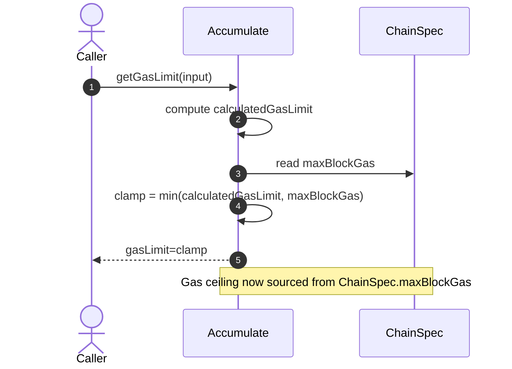
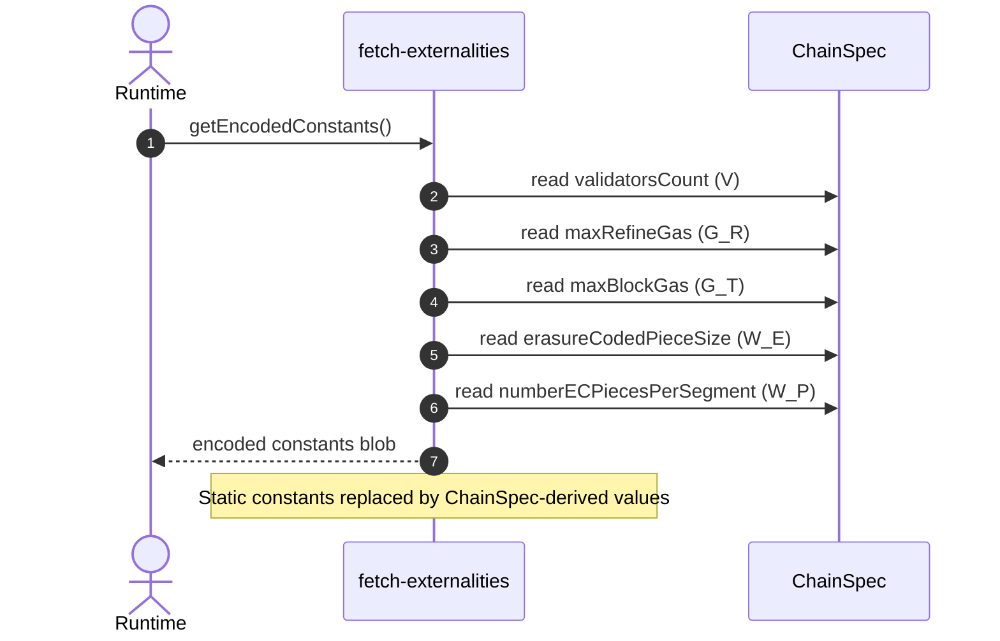
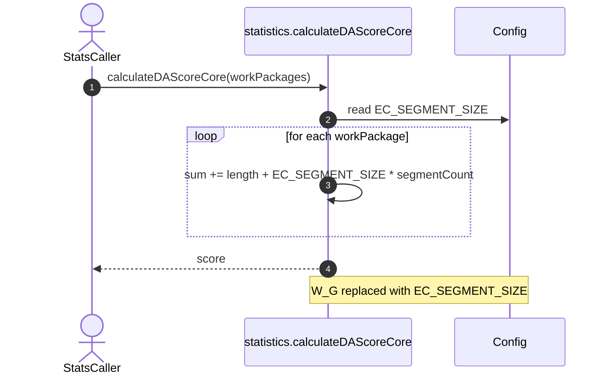

# Move values to chain spec.

## Pull Request by @tomusdrw

Source: https://github.com/davxy/jam-conformance/discussions/42
And: https://github.com/JamBrains/jam-docs/pull/59


## Comment by @coderabbitai[bot]

<!-- This is an auto-generated comment: summarize by coderabbit.ai -->
<!-- This is an auto-generated comment: skip review by coderabbit.ai -->

> [!IMPORTANT]
> ## Review skipped
> 
> Auto incremental reviews are disabled on this repository.
> 
> Please check the settings in the CodeRabbit UI or the `.coderabbit.yaml` file in this repository. To trigger a single review, invoke the `@coderabbitai review` command.
> 
> You can disable this status message by setting the `reviews.review_status` to `false` in the CodeRabbit configuration file.

<!-- end of auto-generated comment: skip review by coderabbit.ai -->
<!-- walkthrough_start -->

<details>
<summary>📝 Walkthrough</summary>

<!-- This is an auto-generated comment: release notes by coderabbit.ai -->

## Summary by CodeRabbit

- New Features
  - Gas limits and erasure-coded segment sizing are now configurable via network settings.
  - Added new chain parameters (e.g., max block gas, max refine gas, preimage expunge period); erasure-coded piece size is computed from segment size.
- Refactor
  - Replaced hardcoded constants with values derived from the active network configuration for greater consistency across environments.
  - Standardized numeric handling in configuration for improved validation and reliability.
- Tests
  - Updated tests to use the new segment size source and revised formulas accordingly.
- Chores
  - Added a new numbers utility dependency.

<!-- end of auto-generated comment: release notes by coderabbit.ai -->
## Walkthrough
This change replaces several hard-coded gas/erasure-code constants with values sourced from ChainSpec, introduces typed numeric wrappers, adds EC_SEGMENT_SIZE and derived erasureCodedPieceSize, updates encoding and accumulation logic to use ChainSpec fields, removes unused constants, adjusts tests and statistics to reference EC_SEGMENT_SIZE, and adds a numbers dependency.

## Changes
| Cohort / File(s) | Summary |
| --- | --- |
| **Remove static GP constants**<br>`packages/jam/block/gp-constants.ts` | Deleted exported constants: `G_R`, `W_E`, `W_P`, `W_G`. Other constants remain unchanged. |
| **Config: typed numbers and EC sizing**<br>`packages/jam/config/chain-spec.ts` | Added `EC_SEGMENT_SIZE = 4104`. Migrated many ChainSpec fields to `U8/U16/U32/U64`. Added `preimageExpungePeriod`, `erasureCodedPieceSize` (derived), `maxBlockGas`, `maxRefineGas`. Updated constructor signature and computations. |
| **Config dependency**<br>`packages/jam/config/package.json` | Added dependency `@typeberry/numbers@0.0.1`. |
| **Accumulate gas clamp uses ChainSpec**<br>`packages/jam/transition/accumulate/accumulate.ts` | Removed `ACCUMULATE_TOTAL_GAS`. `getGasLimit` now clamps to `chainSpec.maxBlockGas`. Updated doc references. |
| **Externalities encoding uses ChainSpec**<br>`packages/jam/transition/externalities/fetch-externalities.ts` | Replaced imports of `G_R`, `ACCUMULATE_TOTAL_GAS`, `W_E`, `W_P`. Now encode from `chainSpec.maxRefineGas`, `chainSpec.maxBlockGas`, `chainSpec.erasureCodedPieceSize`, `chainSpec.numberECPiecesPerSegment`, and `validatorsCount`. |
| **Statistics use EC_SEGMENT_SIZE**<br>`packages/jam/transition/statistics.ts`, `packages/jam/transition/statistics.test.ts` | Replaced `W_G` with `EC_SEGMENT_SIZE` in DAS calculations and tests. Updated imports to bring in `EC_SEGMENT_SIZE` from config. |

## Sequence Diagram(s)






## Estimated code review effort
🎯 4 (Complex) | ⏱️ ~60 minutes

## Poem
> I nibble on bytes in clovered light,  
> New numbers hop with typed delight.  
> Gas caps shift, the segments sing,  
> EC beats in a tidy ring.  
> Constants burrowed, specs now guide—  
> I thump approval, whiskers wide. 🐇✨

</details>

<!-- walkthrough_end -->
<!-- internal state start -->


<!-- DwQgtGAEAqAWCWBnSTIEMB26CuAXA9mAOYCmGJATmriQCaQDG+Ats2bgFyQAOFk+AIwBWJBrngA3EsgEBPRvlqU0AgfFwA6NPEgQAfACgjoCEYDEZyAAUASpETZWaCrI5Go0dQBsSXALL4UpASaF7Y0pAEjLDaWIjcohqQkAZQAHKOApRcAKwA7ABsyamQAKo2ADJcsLi43IgcAPSNROqw2AIaTMyNAGJhAGYDshUqiI24sglZFC6N3NheXo35RSlQpYjZkSzYiLQUAO7FUADK+NgUDCSQAlQYDLBcuLRg2Ny01CRg8aJgIWEIusYM5SLhbvdHlxmLETpBTrhqHsuPgElhgTYSBJ4CRDpQGpAABQYfDkSBeJA0WgASjhoyyXgJxNJNwpiCptOBAGEKCQvvRqFwAEwABiFOTAIoAHGAAMwARmgIoKHBFOQ48ryAC1igYACLSBgUeDccSktxQTEDShka7IXCHfD2C5XaRuZJQGp1BrNVq4dqdbqNT4SAAeskaQjQzDATAwA3wFBhDxIwaQDD2iHgpPGABYhQYPZAvfUmi02h0uixGgApaMAISo8Aw4yjMdo+AY4wWSxWAE53GBDAYTFAyPR8AMcARiGRlFSFKx2FxePxhKJxFIZPImEoqKp1FodPoR+APAhkKhMNPCKRyFQF902BhOJAqMcHE4XLcd4plAfNG0XQhyMU9TAMbg0AYABrNBSFbaNGgELxO2glpuFjHNERfRANFwBoDAAImIgwLEgABBABJWd735exHBhb9J2iTB4KMTFmECOhIATS5IBIUNuETR8sMwfCeIoFgeCg2D4MjRDkNQ9DMJbbD8LwgkAHEAH07EJIg0GQBM+H9G4rWbVl8FaBhqQAGkgAB1bSAFEiWUBxeUwpR6G4HFrnseAAC8SDsxztKsNyqA875d243zRAiBI+C2Ihn1wULMHoJzNKJLNgv4Kc0HsEhUvYezeCxbM9i8eQlAGCyBWQJyIoAKjC5zqSSNInXIY443ZMTkDxXl0FobykjgG5eRhZtmyIBRVMGtyNCIDR7J0yj7M2sL63spyuT27S/EOmxDugeySFwBgNFpZwbmwB4YgwUhaA0UDSMscivBoB9sxbHZIlgG4lAYLxnGoP7kGYgShIoBdEx4DoKQYfiX3UHFEHcSBnME4TuP6tS3xITipFoLgAAMdJscmUCwcnIJguDpHknpFJg5SCcGjSacJCrsQuRAasgcmYeEhb2UgKnIAAXkgHJtJFRWFaVxWRQAbnJ6kShx2GRMWl8iZJugKac5yaebYWGdk5m2yQlD2aIDDOZw7miT5qrBfkEXcbh8XwVNmXIAKKVcw1rWoB1vH6Gd8Fpq4snhea826atpmENZ+20MdlSBpd/CefdgWhe93W/bCiLZYKMPtZ9vXc9j4n45N7TNOTy2ZLTlm7aU7OY9w/O3d5fnqq90XfYJsKctl5rIDa03q4MZz2XgGERKUInsVxfihmE/w6HgRwiJI1JwNTuTbbjeqiEaR5Yh+BJrvwtxiMIj6KOou9524z9GPkZjb+etILGlEXySVoNgO06BIC9X4rXfGokDbOS5NpU4zlNJ+GcmkaAKDKJalcrLXM8oRS5nQBgegewIjqABnuSQNx3KXBIFyP8tArB+RIKcIKJB7LXFAaEIKc1iqlQNnlARKFrJvUtCQbgYNIFbCkFQLw0DHCUHgCjXgqJKDiEoVgLkMRmynAfpAQ4bR7C4Eks9GqYBJgJHoBgZRxoUaHCoNwJKBJSjygKPZUosohReKlF4gouY3pFgBPAT4BAKCICYQ9XA9l/TwAoLQAA8gMAAanw8JiZED2VCZkyJpx3iUD8GgIQiZ1CyG4YmaQ0SXz2UFvgXAepLgQ1JBdISjwKhkCIP6eyklERmgwFYFRihKkvmkLgTpz0emRFUdBS6iAhkUHSRSPJ9kYShk8DBeZiycZmObFmBg9k7HMBmEg1hCUFmUFOCVNK9lMqQBoaTHiOIvC0GQCSY4FCygeK8T4vx9kEalECegZAaAXGSV4PAL4EiKJjXeVvBYyFVE8AhZojGANdGxAMaIFcvIV5Mx1g9Ugizsz0EJN4oUoV6G8iYd5c51wOH5XJT40K6z6yZ00oZIkQLcysrQKGcy5BOXIHJYEzqJRyJwv4lFBhtK6D0vYZwkFUDugLAXPVEgrzaaAxuATCgECIlcGpYw5hCrGU3FlkglBaCMFYJwXgyAjQlEnMoGcthlyKDXKEeCQk1juLYiKmY2Q5FEAUvFRsD4XxkB6oNQjLMRAMBIhGlEFgVDjVypYWw81EkpLNjVQ86gaAuBJOYOoYAmL9EP3soRXJ1AskFKSsU0pxpJiEUgAAH0gIReJiSUnLLCXWyJbbO2EXTaarNnDCJ6DuRSBNAjjH+h1YuNV3ENWvJhZiR0FBoKgpbbANg4gUbGWCBkwdgNeSIFgPgV59onRfL9bYzI+JghQsiC4EN7iii+oQL2tJp6ImgrISelZg7EANqKSUspkxw1lEjTQe0zZZAVowNilG9yBiLC8Mh1DtM1W3ukogZAAJwjID2AIh9RjnGuKJEGj9HiJjvtDT4hjwbQ1ShYx+sVvSSADB8GIcjQNoEIqRsi6xc1cIStoEIPY4leRgwXB2DMaUWkYBviwNK+HeS8Y3EJ44a63mDxIPi0ghLAEkpGW+BpKnzO0AuldG6b1QJkS+j9FT+HTIPNEGDX6OYCqwN1txBGiLkao3EFozGknvJcCtag9BmDsGnFwa5GOhZdD+bFhPGLNr4v2vwZAQhxC1ZY1KHBuKImUag0MsgbDhi2AuuSvABNSa3SpagLWgDNTXzHJmLoPQ3yCitcBgk5Jf6QMAa4N1ygvX+uDfa/WwpFAm1QdcM6nrQ4ZtFiYBezrE2n18HW5+wb9TGnNIGbt+r03DtFikZ2WAkzulPFW1Ng7PjBt9Os8MhOk39t9au2liqxmSCmeJZ9ibuI4lTBuBSwbcZ4MTK6f6c7a3fuvaLIeuZ+FFn9ryUj57v2pSDfWZsjHHrdnGhbKo3HP2ygE6LN9t1FzFlerSlTy7qO0tjrpRO4KYPDgQ4SGUdnUA2UcsMrz/nUPAmE/5YKkgwrxeREh2UKXJQSvhPgapfVYg42NcTbgBhPEEY1ZxYN3oklmBcBjdrighJwlFsgCWstxvDldrm/khbS2W2yGHV2ntI3seganVrIs0B8CW6wlriJtvC3FtLbgcteiUNVtd/++bjbINe5992n9/vU9Do7V2zn8ruckCD1jSVUXPPGieaqvAKntXO79pHxMg2i+ZoStm2WtGmNCkJFluLdrEsOqdXbjQ9OuQKo9cz9g1IislG6jQLgk1EZIoYI0MeC52DowiOIDASHE84fQ5hxv01YRco39xRv+zsJ2nsgIPAOqEm4Yfx8yAFD7SQ8fWwBxlGwXUcJAGm+qxp+o0MxmKgDHwgmkYiYh5u8OrvQCDN5m5o5kvOIKvPAuvEPDiMcDxsZK+AABKNawBHyvwnxgBGBnw2yISXyNbzAdykAaBCCIDmgkFvxUQ0Rfz0A/zOB/xTgAJsSRbcRFQwJKBohKAPDyCEQAACfqMwcw32iAbaC6sAwQ+If0XaIoGgmh8obaUQHmoh44to6KWw/GpIfmlB6cam8YtBlBjBzBGAXUToDSQMfA/BO+ToHm9UPgjm5gn03084kMAM+hXm4MAyUMU4F+E4fAwWyKW+4WWMBoYhto8gaAY0xswsMhkOchEYChbc9M9BVBPQNB18thTBpINMD0e4wsBhZCRh0gPM8iWYZhmh2h4qi8y86B0cf4G82B28eBe8tAB8zArBZBFBBRlhZimAWYAyjQUESmiwXwsxDA8x8mJAGkz8JEzmH8c4D438DEPBfmbhEWkiRs9AHmkRfsYkFEXIXIpQfgpQFQ5E0Azk2k0ASS0A5EFQLc5EpwpC9A6goKyxLAkEe+AiimyiL4KmE0gmBkyAFIcejAYMzAvkz05IVkyKFsYIwqFQK8VChwXKbhZxd6WwLElaiQIuqEwqRI1+fIE4U4HmccTy5ENxdxDxTxLxbxHxXxmkPxtIUQSgP0paZIHm6yK8jg6ASw+AeI9AsJSQaudEnhD0phGAAA5MgDWKcHqJ2ADFpjaCmJABSTBFSYSNlLSA+C4YDNeMybcfcY8c8a8e8Z8d8acNCbqsCc4EgGYa/pVsidGqEBmKsbQNibieCHoReF0Afg/BoIadBFSeaVNv6NeB5oXHsM8qGNxAQIiF4I4fwKZHwBhg8AMqECxIAu5oJnMY4AsQMjxChIcI5ikGwf4T5v9GGcDCEc2eEelnDIFtEeVqFtvscZAEwvrA3KcRTBvmXNaayXaRyY6dyT8YHLKNpDkCrKuSKBgDTAMObu3IzOfIhJMRTjMRWcwFWamMeaedzEYKgfimvFNJVFvLgbvJAH4PvIfC/IOOQRBOMV3AedMX9OvqGD9ImhSOFo0NaFdLAGAAJEBXwuFusawVsRwbsVwfsUxHwU9AIZItIlBN/P0qolYfXJALCX8dKoZAwl5DcJBFQAes+soQ8rIImqWijMRhEMwZcNcPQFuVJLfGSQwO6GllLK/raMwsqjxUnuSTLjxhZMaTSakX5h5tevQFLDHOKkWDpNANAlKajLFI1KSeJddDGTJapLSX5lObaeyQ6Vyc6apWlmZWyfaZyU6Tyb8SvKXIyXQGrJLLpCgMiWLO5Zxdub3AgvhJ5QHPcjPK5cJMgP5TmswERU7MFRJkWKkppTgQ8CJYMbyGIELASZGYkG7lEhcAbMyEAXRkUHGI0X9DZVAAHEJeld5KJXlddG3makqoSLJXSe1JcS+NVeXKldpSJblVilGePpPkzjcuwNScZXJcxDPCpY5hHPVaIuiSjHAQqU6FpnxqGeWQIFxPxVAGCM5PVXQMOfXKRlsNGk1dGZJfVEKlyselLPcmJahtdaGOypSfdQjOpcEmlodcdbQKdWpOdREM9VGQVZ1obnwClSVTDMjFQh4mAGoOCAwIZOlD9QdZdEdTpYDUtO/npS9S1SXpDV1U9VdaNe6uNd6sTc1DCkkvIqEIorDpJIorxlpafvskuogNGCQJ5R5m4fYAgAMOJH3LFaYhDCjJFXDJpjEivLqk1WAI8v6qECRnckMBuAIpQJJNEQ0lvsWXJutcBuEG+KxBEISGsatPZKkp1JAN1LmRaVkDEPzK4RhREIIFsBQKTD4Y2a5mEUEYJogaEYEdDHAlESviFnERjFjLbUcQDPGnrgwp2ZEfMH2RHdokNsgIMUMCgR0XRLFD0Q+TvHDFwIQUQMQe+aMV+buYUQxlMejKSI0ANOIMvF2HhOMvBe+YhZ/MhfRF+LwSWZhTAIJnDtqhYT+fcH+fXY3ZSKov3G3eJGtfBkuusgWoiOgCEPAGDGoCBfIIgFtjcMZCeWDADF8v3raglklrTOyCZcxMmVgUXPIBQllC3HckBqkdJuyJeL5VLegECYknNDVEkKhvAPVCjUsBUpPCgNFY3E8lxXFR5kFSOZ/brC/fQKfTlkPq5KgJLeqtuXzaSFfAaYoIsDcPco/dqp4YmIfWgNCagDHcmeVo0Ng9/LICctelAxSNxO8GYXIEusPfcpAS2YJqAwGfXnRcIVvClGlD8EqjHF7c5k2W5n7W2ZVh2X5hcUFinWjPESUJRF/eCHHc1m/qVgnKPbbL+XXaplPc3bPeyBpINvWDxlUlwNg5AAAN6QDbTnSTyHTHRhSnRhQAAakAAAvqLdIbIZrRGGzFnAlYg3YYREVkWORELdsD5aXO454z4ydIdEE6E7A12pkdMJE93A7LE2dfE3PlALo6XAY/riNKkZXqY/uePRYw3XhdY63bY/hPY447yM43o24zMnvo3nk9ueE1kcU8UQk4Nskz9FwGk2LO42g4PklnEohiM2E4UyQNkVYVfNMyUFYAwxcYgCw7tYog0+kZxOAj4AUxE7MBGFMzM2kfQBvtFsgrFmfblkSDAjEaDPIBcTHG/lsP8VgHDogFrAc32eRFYJREC0zP3ekU0z0OYzMVY4ejY5oN0yHuMiCu7dWQvautuUgBSiad5QANQQNtSEikt+CzxBw5C0hOpip8lOjEs+Kkt2AUvLPn0OpUs0t0sFAMuOpBy8q0hkaokea9RCwXHcu5bZ1oG53dFYEF39HPmvnDHl0QCflIs12Hn/losz3t2bGfTbG0QLjcFoUIuDmYjYUcVLrZSI2GQZmUBxUWzCOnl6g/F71MIjR0WysYOOvAuRAus0OXUm32hCPAl4B7GuuguCaeu/F732B724qVT3092QBkuyxbrQRWAFH3aLoUvZR0s5t5tV3T4vieWv6fiZvZuJi5v5sI4qFcvvPZYrO8tGL1tlvWwVuaCq7GMLNS1cAxXFvYOeWElDlNWDvgj5OBqQ5gCkhCwuNRBFSlrpn/EDN3BzQCIWz+tJYTZaUuPuN+qTvDWiD2R7sOqjNSTjNFP3O7ONYJPKqohCRBtRApmezTuK4C7uMbP5O3vbOTP4OPueX3IjstxfsUjkCgfPPYytsD48vOQwq23OFTZiLIoaOr4UQwtWtyN+E+2BGtmeYqOKPB0Bah2/P9naPpAshXk523n504GF2vgvmDFvnHwnhgRjhAbMRoB4C3g7GKtLgvjDtoAfioXyA8OxT7hI1HjASGCjiLhx7aRhKIDaTKvSnaQDS+yceKe5iCsFADCygFAijGd9i0BCi5hoB5C0B9gkB8iygMDygMD5gDBoAiiqAGe0BGcDBFC6dnhKfqAqdvLqf3mafjjydAA=== -->

<!-- internal state end -->
<!-- tips_start -->

---


<details>
<summary>🪧 Tips</summary>

### Chat

There are 3 ways to chat with [CodeRabbit](https://coderabbit.ai?utm_source=oss&utm_medium=github&utm_campaign=FluffyLabs/typeberry&utm_content=576):

- Review comments: Directly reply to a review comment made by CodeRabbit. Example:
  - `I pushed a fix in commit <commit_id>, please review it.`
  - `Open a follow-up GitHub issue for this discussion.`
- Files and specific lines of code (under the "Files changed" tab): Tag `@coderabbitai` in a new review comment at the desired location with your query.
- PR comments: Tag `@coderabbitai` in a new PR comment to ask questions about the PR branch. For the best results, please provide a very specific query, as very limited context is provided in this mode. Examples:
  - `@coderabbitai gather interesting stats about this repository and render them as a table. Additionally, render a pie chart showing the language distribution in the codebase.`
  - `@coderabbitai read the files in the src/scheduler package and generate a class diagram using mermaid and a README in the markdown format.`

### Support

Need help? Create a ticket on our [support page](https://www.coderabbit.ai/contact-us/support) for assistance with any issues or questions.

### CodeRabbit Commands (Invoked using PR/Issue comments)

Type `@coderabbitai help` to get the list of available commands.

### Other keywords and placeholders

- Add `@coderabbitai ignore` or `@coderabbit ignore` anywhere in the PR description to prevent this PR from being reviewed.
- Add `@coderabbitai summary` to generate the high-level summary at a specific location in the PR description.
- Add `@coderabbitai` anywhere in the PR title to generate the title automatically.

### Status, Documentation and Community

- Visit our [Status Page](https://status.coderabbit.ai) to check the current availability of CodeRabbit.
- Visit our [Documentation](https://docs.coderabbit.ai) for detailed information on how to use CodeRabbit.
- Join our [Discord Community](http://discord.gg/coderabbit) to get help, request features, and share feedback.
- Follow us on [X/Twitter](https://twitter.com/coderabbitai) for updates and announcements.

</details>

<!-- tips_end -->


## Comment by @github-actions[bot]


<details>
<summary>View all</summary>

| File | Benchmark | Ops |  |
|------|-----------|-----|--|
| [codec/decoding.ts[0]](../blob/0526bb89de6a7a278e6d7de942681481b6555aed//_work/typeberry-runner-5/typeberry/typeberry/benchmarks/codec/decoding.ts) | manual decode | 22093459.1 ±0.65% | 85.94% slower |
| [codec/decoding.ts[1]](../blob/0526bb89de6a7a278e6d7de942681481b6555aed//_work/typeberry-runner-5/typeberry/typeberry/benchmarks/codec/decoding.ts) | int32array decode | 157120342.73 ±3.52% | fastest ✅ |
| [codec/decoding.ts[2]](../blob/0526bb89de6a7a278e6d7de942681481b6555aed//_work/typeberry-runner-5/typeberry/typeberry/benchmarks/codec/decoding.ts) | dataview decode | 156277902.64 ±3.37% | 0.54% slower |
| [codec/encoding.ts[0]](../blob/0526bb89de6a7a278e6d7de942681481b6555aed//_work/typeberry-runner-5/typeberry/typeberry/benchmarks/codec/encoding.ts) | manual encode | 3254748.61 ±0.34% | 18.39% slower |
| [codec/encoding.ts[1]](../blob/0526bb89de6a7a278e6d7de942681481b6555aed//_work/typeberry-runner-5/typeberry/typeberry/benchmarks/codec/encoding.ts) | int32array encode | 3987976.76 ±0.48% | fastest ✅ |
| [codec/encoding.ts[2]](../blob/0526bb89de6a7a278e6d7de942681481b6555aed//_work/typeberry-runner-5/typeberry/typeberry/benchmarks/codec/encoding.ts) | dataview encode | 3933223.37 ±0.75% | 1.37% slower |
| [bytes/hex-from.ts[0]](../blob/0526bb89de6a7a278e6d7de942681481b6555aed//_work/typeberry-runner-5/typeberry/typeberry/benchmarks/bytes/hex-from.ts) | parse hex using `Number` with NaN checking | 116794.45 ±1.35% | 85.53% slower |
| [bytes/hex-from.ts[1]](../blob/0526bb89de6a7a278e6d7de942681481b6555aed//_work/typeberry-runner-5/typeberry/typeberry/benchmarks/bytes/hex-from.ts) | parse hex from char codes | 807017.68 ±0.94% | fastest ✅ |
| [bytes/hex-from.ts[2]](../blob/0526bb89de6a7a278e6d7de942681481b6555aed//_work/typeberry-runner-5/typeberry/typeberry/benchmarks/bytes/hex-from.ts) | parse hex from string nibbles | 539222.89 ±0.34% | 33.18% slower |
| [bytes/hex-to.ts[0]](../blob/0526bb89de6a7a278e6d7de942681481b6555aed//_work/typeberry-runner-5/typeberry/typeberry/benchmarks/bytes/hex-to.ts) | number toString + padding | 292009.66 ±1.93% | fastest ✅ |
| [bytes/hex-to.ts[1]](../blob/0526bb89de6a7a278e6d7de942681481b6555aed//_work/typeberry-runner-5/typeberry/typeberry/benchmarks/bytes/hex-to.ts) | manual | 15566.77 ±1.05% | 94.67% slower |
| [codec/bigint.compare.ts[0]](../blob/0526bb89de6a7a278e6d7de942681481b6555aed//_work/typeberry-runner-5/typeberry/typeberry/benchmarks/codec/bigint.compare.ts) | compare custom | 240330670.37 ±5.96% | fastest ✅ |
| [codec/bigint.compare.ts[1]](../blob/0526bb89de6a7a278e6d7de942681481b6555aed//_work/typeberry-runner-5/typeberry/typeberry/benchmarks/codec/bigint.compare.ts) | compare bigint | 237647095.75 ±7.55% | 1.12% slower |
| [codec/bigint.decode.ts[0]](../blob/0526bb89de6a7a278e6d7de942681481b6555aed//_work/typeberry-runner-5/typeberry/typeberry/benchmarks/codec/bigint.decode.ts) | decode custom | 145072112.82 ±7.18% | fastest ✅ |
| [codec/bigint.decode.ts[1]](../blob/0526bb89de6a7a278e6d7de942681481b6555aed//_work/typeberry-runner-5/typeberry/typeberry/benchmarks/codec/bigint.decode.ts) | decode bigint | 100025114.66 ±2.72% | 31.05% slower |
| [collections/map-set.ts[0]](../blob/0526bb89de6a7a278e6d7de942681481b6555aed//_work/typeberry-runner-5/typeberry/typeberry/benchmarks/collections/map-set.ts) | 2 gets + conditional set | 116500.08 ±0.94% | fastest ✅ |
| [collections/map-set.ts[1]](../blob/0526bb89de6a7a278e6d7de942681481b6555aed//_work/typeberry-runner-5/typeberry/typeberry/benchmarks/collections/map-set.ts) | 1 get 1 set | 60272.11 ±0.14% | 48.26% slower |
| [hash/index.ts[0]](../blob/0526bb89de6a7a278e6d7de942681481b6555aed//_work/typeberry-runner-5/typeberry/typeberry/benchmarks/hash/index.ts) | hash with numeric representation | 190.34 ±0.39% | 24.28% slower |
| [hash/index.ts[1]](../blob/0526bb89de6a7a278e6d7de942681481b6555aed//_work/typeberry-runner-5/typeberry/typeberry/benchmarks/hash/index.ts) | hash with string representation | 111.28 ±0.44% | 55.73% slower |
| [hash/index.ts[2]](../blob/0526bb89de6a7a278e6d7de942681481b6555aed//_work/typeberry-runner-5/typeberry/typeberry/benchmarks/hash/index.ts) | hash with symbol representation | 176.54 ±0.5% | 29.77% slower |
| [hash/index.ts[3]](../blob/0526bb89de6a7a278e6d7de942681481b6555aed//_work/typeberry-runner-5/typeberry/typeberry/benchmarks/hash/index.ts) | hash with uint8 representation | 161.5 ±0.29% | 35.76% slower |
| [hash/index.ts[4]](../blob/0526bb89de6a7a278e6d7de942681481b6555aed//_work/typeberry-runner-5/typeberry/typeberry/benchmarks/hash/index.ts) | hash with packed representation | 251.39 ±0.76% | fastest ✅ |
| [hash/index.ts[5]](../blob/0526bb89de6a7a278e6d7de942681481b6555aed//_work/typeberry-runner-5/typeberry/typeberry/benchmarks/hash/index.ts) | hash with bigint representation | 180.63 ±0.67% | 28.15% slower |
| [hash/index.ts[6]](../blob/0526bb89de6a7a278e6d7de942681481b6555aed//_work/typeberry-runner-5/typeberry/typeberry/benchmarks/hash/index.ts) | hash with uint32 representation | 192.66 ±0.63% | 23.36% slower |
| [logger/index.ts[0]](../blob/0526bb89de6a7a278e6d7de942681481b6555aed//_work/typeberry-runner-5/typeberry/typeberry/benchmarks/logger/index.ts) | console.log with string concat | 6719595.34 ±35.02% | fastest ✅ |
| [logger/index.ts[1]](../blob/0526bb89de6a7a278e6d7de942681481b6555aed//_work/typeberry-runner-5/typeberry/typeberry/benchmarks/logger/index.ts) | console.log with args | 1504674.9 ±86.1% | 77.61% slower |
| [math/add_one_overflow.ts[0]](../blob/0526bb89de6a7a278e6d7de942681481b6555aed//_work/typeberry-runner-5/typeberry/typeberry/benchmarks/math/add_one_overflow.ts) | add and take modulus | 218509069.79 ±6.39% | 5.59% slower |
| [math/add_one_overflow.ts[1]](../blob/0526bb89de6a7a278e6d7de942681481b6555aed//_work/typeberry-runner-5/typeberry/typeberry/benchmarks/math/add_one_overflow.ts) | condition before calculation | 231438356.6 ±6% | fastest ✅ |
| [math/count-bits-u32.ts[0]](../blob/0526bb89de6a7a278e6d7de942681481b6555aed//_work/typeberry-runner-5/typeberry/typeberry/benchmarks/math/count-bits-u32.ts) | standard method | 83510864.25 ±1.59% | 61.88% slower |
| [math/count-bits-u32.ts[1]](../blob/0526bb89de6a7a278e6d7de942681481b6555aed//_work/typeberry-runner-5/typeberry/typeberry/benchmarks/math/count-bits-u32.ts) | magic | 219088677.7 ±5.59% | fastest ✅ |
| [math/count-bits-u64.ts[0]](../blob/0526bb89de6a7a278e6d7de942681481b6555aed//_work/typeberry-runner-5/typeberry/typeberry/benchmarks/math/count-bits-u64.ts) | standard method | 2682247.43 ±4.34% | 95.8% slower |
| [math/count-bits-u64.ts[1]](../blob/0526bb89de6a7a278e6d7de942681481b6555aed//_work/typeberry-runner-5/typeberry/typeberry/benchmarks/math/count-bits-u64.ts) | magic | 63916804.67 ±2.88% | fastest ✅ |
| [math/mul_overflow.ts[0]](../blob/0526bb89de6a7a278e6d7de942681481b6555aed//_work/typeberry-runner-5/typeberry/typeberry/benchmarks/math/mul_overflow.ts) | multiply and bring back to u32 | 242804356.06 ±5.68% | fastest ✅ |
| [math/mul_overflow.ts[1]](../blob/0526bb89de6a7a278e6d7de942681481b6555aed//_work/typeberry-runner-5/typeberry/typeberry/benchmarks/math/mul_overflow.ts) | multiply and take modulus | 239800142.44 ±5.85% | 1.24% slower |
| [math/switch.ts[0]](../blob/0526bb89de6a7a278e6d7de942681481b6555aed//_work/typeberry-runner-5/typeberry/typeberry/benchmarks/math/switch.ts) | switch | 224072382.64 ±7.15% | 0.37% slower |
| [math/switch.ts[1]](../blob/0526bb89de6a7a278e6d7de942681481b6555aed//_work/typeberry-runner-5/typeberry/typeberry/benchmarks/math/switch.ts) | if | 224898971.71 ±6.08% | fastest ✅ |
| [codec/view_vs_collection.ts[0]](../blob/0526bb89de6a7a278e6d7de942681481b6555aed//_work/typeberry-runner-5/typeberry/typeberry/benchmarks/codec/view_vs_collection.ts) | Get first element from Decoded | 19311.82 ±2.47% | 64.4% slower |
| [codec/view_vs_collection.ts[1]](../blob/0526bb89de6a7a278e6d7de942681481b6555aed//_work/typeberry-runner-5/typeberry/typeberry/benchmarks/codec/view_vs_collection.ts) | Get first element from View | 54250.39 ±0.49% | fastest ✅ |
| [codec/view_vs_collection.ts[2]](../blob/0526bb89de6a7a278e6d7de942681481b6555aed//_work/typeberry-runner-5/typeberry/typeberry/benchmarks/codec/view_vs_collection.ts) | Get 50th element from Decoded | 19874 ±2.52% | 63.37% slower |
| [codec/view_vs_collection.ts[3]](../blob/0526bb89de6a7a278e6d7de942681481b6555aed//_work/typeberry-runner-5/typeberry/typeberry/benchmarks/codec/view_vs_collection.ts) | Get 50th element from View | 26803.94 ±1.36% | 50.59% slower |
| [codec/view_vs_collection.ts[4]](../blob/0526bb89de6a7a278e6d7de942681481b6555aed//_work/typeberry-runner-5/typeberry/typeberry/benchmarks/codec/view_vs_collection.ts) | Get last element from Decoded | 23769.6 ±4.03% | 56.19% slower |
| [codec/view_vs_collection.ts[5]](../blob/0526bb89de6a7a278e6d7de942681481b6555aed//_work/typeberry-runner-5/typeberry/typeberry/benchmarks/codec/view_vs_collection.ts) | Get last element from View | 24740.51 ±3.35% | 54.4% slower |
| [codec/view_vs_object.ts[0]](../blob/0526bb89de6a7a278e6d7de942681481b6555aed//_work/typeberry-runner-5/typeberry/typeberry/benchmarks/codec/view_vs_object.ts) | Get the first field from Decoded | 343975.65 ±1.32% | 5.98% slower |
| [codec/view_vs_object.ts[1]](../blob/0526bb89de6a7a278e6d7de942681481b6555aed//_work/typeberry-runner-5/typeberry/typeberry/benchmarks/codec/view_vs_object.ts) | Get the first field from View | 87480.18 ±1.44% | 76.09% slower |
| [codec/view_vs_object.ts[2]](../blob/0526bb89de6a7a278e6d7de942681481b6555aed//_work/typeberry-runner-5/typeberry/typeberry/benchmarks/codec/view_vs_object.ts) | Get the first field as view from View | 79821.78 ±1.51% | 78.18% slower |
| [codec/view_vs_object.ts[3]](../blob/0526bb89de6a7a278e6d7de942681481b6555aed//_work/typeberry-runner-5/typeberry/typeberry/benchmarks/codec/view_vs_object.ts) | Get two fields from Decoded | 365859.38 ±3.66% | fastest ✅ |
| [codec/view_vs_object.ts[4]](../blob/0526bb89de6a7a278e6d7de942681481b6555aed//_work/typeberry-runner-5/typeberry/typeberry/benchmarks/codec/view_vs_object.ts) | Get two fields from View | 81942.82 ±0.25% | 77.6% slower |
| [codec/view_vs_object.ts[5]](../blob/0526bb89de6a7a278e6d7de942681481b6555aed//_work/typeberry-runner-5/typeberry/typeberry/benchmarks/codec/view_vs_object.ts) | Get two fields from materialized from View | 167860.78 ±0.97% | 54.12% slower |
| [codec/view_vs_object.ts[6]](../blob/0526bb89de6a7a278e6d7de942681481b6555aed//_work/typeberry-runner-5/typeberry/typeberry/benchmarks/codec/view_vs_object.ts) | Get two fields as views from View | 66333.76 ±1.36% | 81.87% slower |
| [codec/view_vs_object.ts[7]](../blob/0526bb89de6a7a278e6d7de942681481b6555aed//_work/typeberry-runner-5/typeberry/typeberry/benchmarks/codec/view_vs_object.ts) | Get only third field from Decoded | 319215.65 ±2.09% | 12.75% slower |
| [codec/view_vs_object.ts[8]](../blob/0526bb89de6a7a278e6d7de942681481b6555aed//_work/typeberry-runner-5/typeberry/typeberry/benchmarks/codec/view_vs_object.ts) | Get only third field from View | 85714.96 ±1.35% | 76.57% slower |
| [codec/view_vs_object.ts[9]](../blob/0526bb89de6a7a278e6d7de942681481b6555aed//_work/typeberry-runner-5/typeberry/typeberry/benchmarks/codec/view_vs_object.ts) | Get only third field as view from View | 81648.14 ±1.77% | 77.68% slower |
| [bytes/compare.ts[0]](../blob/0526bb89de6a7a278e6d7de942681481b6555aed//_work/typeberry-runner-5/typeberry/typeberry/benchmarks/bytes/compare.ts) | Comparing Uint32 bytes | 21057.19 ±0.11% | 4.83% slower |
| [bytes/compare.ts[1]](../blob/0526bb89de6a7a278e6d7de942681481b6555aed//_work/typeberry-runner-5/typeberry/typeberry/benchmarks/bytes/compare.ts) | Comparing raw bytes | 22124.93 ±0.09% | fastest ✅ |
| [hash/blake2b.ts[0]](../blob/0526bb89de6a7a278e6d7de942681481b6555aed//_work/typeberry-runner-5/typeberry/typeberry/benchmarks/hash/blake2b.ts) | hasher with simple allocator | 0.0453 ±0.29% | 0.22% slower |
| [hash/blake2b.ts[1]](../blob/0526bb89de6a7a278e6d7de942681481b6555aed//_work/typeberry-runner-5/typeberry/typeberry/benchmarks/hash/blake2b.ts) | hasher with page allocator | 0.0454 ±0.07% | fastest ✅ |
| [collections/map_vs_sorted.ts[0]](../blob/0526bb89de6a7a278e6d7de942681481b6555aed//_work/typeberry-runner-5/typeberry/typeberry/benchmarks/collections/map_vs_sorted.ts) | Map | 311907.19 ±0.05% | fastest ✅ |
| [collections/map_vs_sorted.ts[1]](../blob/0526bb89de6a7a278e6d7de942681481b6555aed//_work/typeberry-runner-5/typeberry/typeberry/benchmarks/collections/map_vs_sorted.ts) | Map-array | 103685.58 ±0.02% | 66.76% slower |
| [collections/map_vs_sorted.ts[2]](../blob/0526bb89de6a7a278e6d7de942681481b6555aed//_work/typeberry-runner-5/typeberry/typeberry/benchmarks/collections/map_vs_sorted.ts) | Array | 73377.58 ±0.16% | 76.47% slower |
| [collections/map_vs_sorted.ts[3]](../blob/0526bb89de6a7a278e6d7de942681481b6555aed//_work/typeberry-runner-5/typeberry/typeberry/benchmarks/collections/map_vs_sorted.ts) | SortedArray | 198739.51 ±0.24% | 36.28% slower |
| [crypto/ed25519.ts[0]](../blob/0526bb89de6a7a278e6d7de942681481b6555aed//_work/typeberry-runner-5/typeberry/typeberry/benchmarks/crypto/ed25519.ts) | native crypto | 6.03 ±16.05% | 79.76% slower |
| [crypto/ed25519.ts[1]](../blob/0526bb89de6a7a278e6d7de942681481b6555aed//_work/typeberry-runner-5/typeberry/typeberry/benchmarks/crypto/ed25519.ts) | wasm lib | 10.64 ±0.02% | 64.28% slower |
| [crypto/ed25519.ts[2]](../blob/0526bb89de6a7a278e6d7de942681481b6555aed//_work/typeberry-runner-5/typeberry/typeberry/benchmarks/crypto/ed25519.ts) | wasm lib batch | 29.79 ±0.57% | fastest ✅ |
</details>


### Benchmarks summary: 63/63 OK ✅

<!-- thollander/actions-comment-pull-request "benchmarks" -->


## Comment by @coderabbitai[bot]

_⚠️ Potential issue_

**Fix super-majority calculation (off for n mod 3 ≠ 0).**

`floor(n/3)*2+1` underestimates for many n (e.g., n=5,8). Use `floor(2n/3)+1`.

Apply:

```diff
-    this.validatorsSuperMajority = tryAsU16(Math.floor(data.validatorsCount / 3) * 2 + 1);
+    this.validatorsSuperMajority = tryAsU16(Math.floor((data.validatorsCount * 2) / 3) + 1);
```

<!-- suggestion_start -->

<details>
<summary>📝 Committable suggestion</summary>

> ‼️ **IMPORTANT**
> Carefully review the code before committing. Ensure that it accurately replaces the highlighted code, contains no missing lines, and has no issues with indentation. Thoroughly test & benchmark the code to ensure it meets the requirements.

```suggestion
    this.validatorsSuperMajority = tryAsU16(Math.floor((data.validatorsCount * 2) / 3) + 1);
    this.coresCount = data.coresCount;
```

</details>

<!-- suggestion_end -->

<details>
<summary>🤖 Prompt for AI Agents</summary>

```
In packages/jam/config/chain-spec.ts around lines 86 to 87, the super-majority
calculation uses Math.floor(data.validatorsCount / 3) * 2 + 1 which
underestimates for many n; replace that expression with Math.floor((2 *
data.validatorsCount) / 3) + 1 so the value equals floor(2n/3)+1, and assign the
result to this.validatorsSuperMajority (leave this.coresCount = data.coresCount
as-is).
```

</details>

<!-- fingerprinting:phantom:medusa:chinchilla -->

<!-- This is an auto-generated comment by CodeRabbit -->


## Comment by @coderabbitai[bot]

_💡 Verification agent_

<details>
<summary>🧩 Analysis chain</summary>

**Verify versioning and workspace sync for @typeberry/numbers.**

Ensure 0.0.1 exists in your registry and that all packages in the monorepo depend on a consistent version to avoid hoisting quirks.

Run:

---

🏁 Script executed:

```shell
#!/bin/bash
set -euo pipefail
rg -n --pretty '"@typeberry/numbers":' -g '!*node_modules*'
rg -n --pretty '@typeberry/numbers' packages -g '!*node_modules*'
```

Length of output: 18391

---


</details>

**Align @typeberry/numbers version spec and verify registry availability**  
- Confirm `0.0.1` is published to your npm registry.  
- In bin/rpc/package.json (line 28), change `^0.0.1` → `"0.0.1"` to match all other packages and avoid hoisting quirks.

<details>
<summary>🤖 Prompt for AI Agents</summary>

```
In packages/jam/config/package.json around line 10, the dependency
"@typeberry/numbers" is pinned to "0.0.1" but elsewhere (bin/rpc/package.json
line 28) it uses a caret range; confirm that version 0.0.1 is published and
available in your npm registry, then open bin/rpc/package.json and change the
dependency spec from ^0.0.1 to "0.0.1" so it matches other packages and avoids
hoisting/version mismatches.
```

</details>

<!-- fingerprinting:phantom:medusa:chinchilla -->

<!-- This is an auto-generated comment by CodeRabbit -->


## Comment by @coderabbitai[bot]

_💡 Verification agent_

<details>
<summary>🧩 Analysis chain</summary>

**Encode V as u16 explicitly; guard against range drift.**

Other fields use tryAsU16/tryAsU32; V should too unless ChainSpec.validatorsCount is already U16. Encoding with codec.u16 will fail if > 65535.


If validatorsCount is a plain number, apply:

```diff
-    V: chainSpec.validatorsCount,
+    V: tryAsU16(chainSpec.validatorsCount),
```

And consider asserting in ChainSpec construction that validatorsCount fits U16.


Also applies to: 106-106, 110-113

---

🏁 Script executed:

```shell
#!/bin/bash
set -e

# Locate the fetch-externalities.ts file
FILE=$(fd fetch-externalities.ts . | head -n1)
echo "File: $FILE"

# Show context around G_T
echo "--- Context around G_T ---"
rg -n -C3 'G_T' "$FILE" || true

# Show context around H
echo "--- Context around H ---"
rg -n -C3 'H:' "$FILE" || true

# Show context around V
echo "--- Context around V ---"
rg -n -C5 'V:' "$FILE" || true
```

Length of output: 2158

---


</details>

**Encode validatorsCount as u16 using tryAsU16**  
In packages/jam/transition/externalities/fetch-externalities.ts (line 106), replace  
```diff
-    V: chainSpec.validatorsCount,
+    V: tryAsU16(chainSpec.validatorsCount),
```  
And add an assertion in ChainSpec construction that validatorsCount ≤ 0xFFFF.

<!-- suggestion_start -->

<details>
<summary>📝 Committable suggestion</summary>

> ‼️ **IMPORTANT**
> Carefully review the code before committing. Ensure that it accurately replaces the highlighted code, contains no missing lines, and has no issues with indentation. Thoroughly test & benchmark the code to ensure it meets the requirements.

```suggestion
    G_T: tryAsU64(chainSpec.maxBlockGas),
    H: tryAsU16(MAX_RECENT_HISTORY),
    V: tryAsU16(chainSpec.validatorsCount),
```

</details>

<!-- suggestion_end -->

<details>
<summary>🤖 Prompt for AI Agents</summary>

```
In packages/jam/transition/externalities/fetch-externalities.ts around lines
93–106, the validatorsCount is being encoded with the wrong width; replace its
encoding with tryAsU16(validatorsCount) (e.g., G_T:
tryAsU64(chainSpec.maxBlockGas), H: tryAsU16(MAX_RECENT_HISTORY), and the
validatorsCount entry should call tryAsU16). Also add an assertion in the
ChainSpec constructor that validatorsCount <= 0xFFFF (throw or assert early with
a clear message) so construction fails if validatorsCount cannot fit in u16.
```

</details>

<!-- fingerprinting:phantom:medusa:chinchilla -->

<!-- This is an auto-generated comment by CodeRabbit -->
