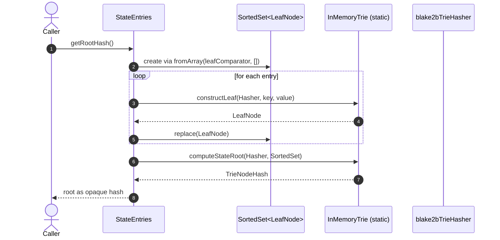
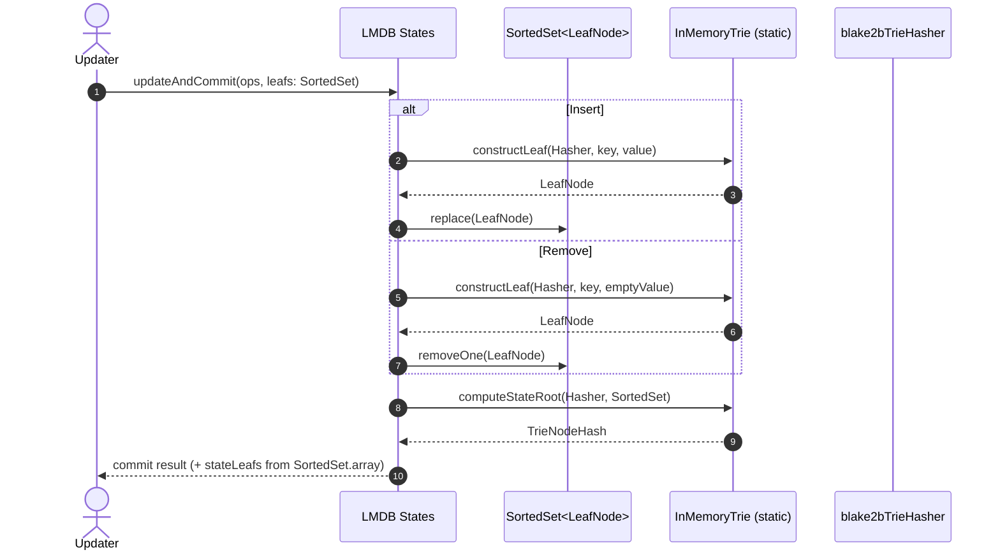

# Avoid constructing the entire trie

## Pull Request by @tomusdrw

Resolves #432 
Closes #38 (irrelevant)

This PR introduces way more performant method of computing the state root. Previously we were constructing the entire trie (and storing it in memory), now we do two loops over all leaf nodes to compute the state root value.

I saw around 20x improvement when running tests. Curious to test block import in actual lmdb.


## Comment by @coderabbitai[bot]

<!-- This is an auto-generated comment: summarize by coderabbit.ai -->
<!-- This is an auto-generated comment: skip review by coderabbit.ai -->

> [!IMPORTANT]
> ## Review skipped
> 
> Auto incremental reviews are disabled on this repository.
> 
> Please check the settings in the CodeRabbit UI or the `.coderabbit.yaml` file in this repository. To trigger a single review, invoke the `@coderabbitai review` command.
> 
> You can disable this status message by setting the `reviews.review_status` to `false` in the CodeRabbit configuration file.

<!-- end of auto-generated comment: skip review by coderabbit.ai -->

<!-- walkthrough_start -->

<details>
<summary>📝 Walkthrough</summary>

<!-- This is an auto-generated comment: release notes by coderabbit.ai -->

## Summary by CodeRabbit

- Refactor
  - Reworked state root computation to use a leaf-based approach, improving determinism, scalability, and memory usage. Removed in-memory trie caching for a simpler, faster path.
- Bug Fixes
  - Resolved inconsistencies in root-hash calculation by validating results across multiple computation paths.
- Tests
  - Added extensive tests for state-root parity and shared-prefix logic, plus new fixtures and a reusable test runner.
- Chores
  - Updated internal data structures and dependencies to align with the new computation flow without changing public behavior.

<!-- end of auto-generated comment: release notes by coderabbit.ai -->
## Walkthrough
Refactors state-root computation to operate on SortedSet-based leaf collections instead of constructing in-memory tries. Introduces leaf construction helpers, a leaf comparator, and shared-prefix logic. Updates databases and tests to use SortedSet<LeafNode>, adds SortedSet.replace, and modifies APIs accordingly, including computeStateRoot signature and new constructLeaf utility.

## Changes
| Cohort / File(s) | Summary of changes |
|---|---|
| **Trie core API and utilities**<br>`packages/core/trie/trie.ts` | Refactors computeStateRoot to consume `SortedSet<LeafNode>`; adds `constructLeaf`, `leafComparator`, and `findSharedPrefix`; internal zero-hash handling unified. Public API surface expanded and signatures updated. |
| **Collections enhancement**<br>`packages/core/collections/sorted-set.ts` | Adds `replace(v)` to insert-or-replace an element at its sorted position. |
| **Core tests expansion**<br>`packages/core/trie/trie.test.ts` | Adds tests validating root via leaf-based state computation, shared-prefix behavior, and utilities; introduces `testVector10` runner; imports new exports. |
| **CLI test runner adjustment**<br>`bin/test-runner/w3f/trie.ts` | Verifies trie root against expected output and against leaf-based quick state root using `SortedSet.fromArray` and `leafComparator`. |
| **State entries merkleization**<br>`packages/jam/state-merkleization/state-entries.ts` | Removes trie caching and `getTrie()`; computes root by building `SortedSet<LeafNode>` via `constructLeaf` and calling new `computeStateRoot`. |
| **Leaf database structure**<br>`packages/jam/database/leaf-db.ts` | Changes leaves storage from array to `SortedSet<LeafNode>`; updates constructor and iteration to use `SortedSet` and `leafComparator`. |
| **LMDB state updates**<br>`packages/jam/database-lmdb/states.ts` | Replaces in-memory trie mutations with `SortedSet<LeafNode>` operations; updates insert/remove flows to use `constructLeaf`, `replace`, and `removeOne`; adjusts commit path to emit leaf blobs from the set. |

## Sequence Diagram(s)




## Estimated code review effort
🎯 4 (Complex) | ⏱️ ~60–90 minutes

## Poem
> I gathered leaves in sorted grace,  
> Not twigs of tries in tangled space—  
> A whisker-twitch, a hash in flight,  
> Roots bloom from prefixes of light.  
> Hop, replace, and onward glide,  
> State stands tall, no nodes inside.  
> Carrots counted, hashes tied. 🥕

</details>

<!-- walkthrough_end -->


<!-- finishing_touch_checkbox_start -->

<details>
<summary>✨ Finishing touches</summary>

<details>
<summary>🧪 Generate unit tests</summary>

- [ ] <!-- {"checkboxId": "f47ac10b-58cc-4372-a567-0e02b2c3d479", "radioGroupId": "utg-output-choice-group-unknown_comment_id"} -->   Create PR with unit tests
- [ ] <!-- {"checkboxId": "07f1e7d6-8a8e-4e23-9900-8731c2c87f58", "radioGroupId": "utg-output-choice-group-unknown_comment_id"} -->   Post copyable unit tests in a comment
- [ ] <!-- {"checkboxId": "6ba7b810-9dad-11d1-80b4-00c04fd430c8", "radioGroupId": "utg-output-choice-group-unknown_comment_id"} -->   Commit unit tests in branch `td-quic-state-root`

</details>

</details>

<!-- finishing_touch_checkbox_end -->

<!-- tips_start -->

---


<sub>Comment `@coderabbitai help` to get the list of available commands and usage tips.</sub>

<!-- tips_end -->

<!-- internal state start -->


<!-- DwQgtGAEAqAWCWBnSTIEMB26CuAXA9mAOYCmGJATmriQCaQDG+Ats2bgFyQAOFk+AIwBWJBrngA3EsgEBPRvlqU0AgfFwA6NPEgQAfACgjoCEYDEZyAAUASpETZWaCrKPR1AGxJcAghPzw9EwYiLgU2GLwGESQuLAkkOzwFAlh8AmQBgByjgKUXACsAOwAHJCZAKo2ADJcsLi43IgcAPQtROqw2AIaTMwtAGIe2ABmI7LVKogtuLLcJHkULi3c2B4eLcVllYj5sSzYiLQUAO7lBgDK+NgUDAkCVBgMsFy4tGAAjtjwDGCh1CQwBR8PhcJBAEmEMGcpDBD0wzy4zG0WEyF1w1EOXHw8xRBhsJAk6ROlGa9gA1vhEAAvPBoAA0kCRNEOVMQ8ApVHOkzyHlJAAoMPhyABKc4AYRSAPo1C4ACYAAyygpgeUlMAAZgAjNBZeqOJrZRwCvKAFpGAAi0gYFHg3HEQo4Big+MQ+A8UmQSAcCTMABZ1bL0Bggh5KdJIGZ1WU+UiKGS6CgliQvBJMLhhRonZB8dwPGg7sheAT4NdkGhuLx8PnYLFYNQFCEwhEaNLg/YCCl6HEEkkUrEbQkooySMx8C5ICdOuhh3FFLX631VjRkN32wDIMDQZA5DxKCMx8wojFcCd8Dw0Ihdsh8FI+Gh1pAvGgRpBBUpEJmoABRDzwQ8YAFkFCMcjxQDAaAoNhaHgdc32kABufgMA8eQnxGMA4LAAQLwTRdaXtLBUEOBMCH4AR0SHVd/hoDcQU0LMfDwWAxw3EhuDHXBkAAPwVAB13cKH3SD4UHZhKykNhwLA2JpE4oN6EFZcwJoKTSOXWFQwYMkUDEjjpOqABZc0ACFMwMCxIAAeWEURxA9SARmBZhHyieN6C9bBpCMABJS9PIjf1A0AFAJID8AIgiFUJwkiaJa1SAcs3xWgIgSTtsGDNN+3SBsoubEsMFeeIssHZAGBuFJwJQnKmzEBNmDWcRc1SP9w1nbAiBrYJcsiIUUGvZD5HIOgSLPQQKKwKj0Rozd6KgMLAnbEDYqiCCoJgmi4SeGs4OQE54iwRTX1EaREGcWRPys+YqBo6CUjEKretXJh1ls/L+BfNDX0UcMhLA3YKAI6YUlHVNeXkhQxLwVIipmyA60QGteqUJE20nNqwSutlQlAlbKDW2Dvo/Hy/J9KNIBC6AB18fwFpSMAGHvMq83EWLV3hms9rIR8SGfL6lEZG8fqc7mRjBUibQ62FHmeLMrBSKQpPS8gC1O8c6fZ0D8BfNBud5znCLBEHwzyE8SC5rxRZaCX6m3aX4iJqA5ekSgpH4Pg7rHLsipAjoAI8bd1BaOQaLiesTgvR9KTBfXp0+8OgI7BN0qUO9bfhWAGVdOK3fgX370gUH/IZrA8lY4DOwnTprjBdWLwQaILoMqI/3gKkEgwXJKHeuG6/4K7qHymR5BScvQMclhForth0Voagdeu+I+FDrAPchlmiDM/RjHAKAyHoLWcAIYgyGUFsIckzgeD4QQREieydyYFOVDUTRtF0MBDBMKA4FQVBMEPwgpByDXVwiwC+XAqBnAcE4ccD9vpUFUOoLQOgt7b1MAYNQGAZiySBErSgLQTjqhGDMAcGhOKOgAERUPMpYHw3lj7AKlPYRwsZ5AH2eJgUgiAjBzVoLQZA5AzhKBxEoJ46QyxtnUmAbg1Aay3ngCMH4A9eq/TSAkaiCRCQ6yfB6R05QoDeV0gDZAVwAZ0AuCQME49nIAAFZjzEWMsZ6XgeohHBmhMULAZHXRYtYyAdi5gLEoMsNRmZ9GQAqFeSA3kMAGRHGOWQlN0i9EijVXA1QeYjD5AIPM8ZZQCCSSQAAEnXSgDJ4yyAZIXEgopSICG+B4egn0UhFl2OBZRbi/FRCXGE3QkBjINP4bHJAYID46PDJgCKa8JmQC+D8bSGjaJbjRjWGJcTRwuEKSk6ZaIAQ2Dotk3JJB8mFJKQjMpkBTEtgsZoaxPglhoFkHyDxXjnDUDHAycZiBhQZgMOEnMeYCzZyLISUs9gjxeHQJeSgBFK5xFiKeRg8QtL8k1KKWG7NEhfHvOoeQhxQKhJhPs0EZzYB8lFBIFcslzRzw0NXJckA+Sey7ogcOFY6DCgZJMxlspRRzK0rsmgxKwQkGxb+WY6AiDIlCDJUINL0R0rwD0v5fSvwAA8ZHBipTKpgt40CkH2AXHFs8Q5FUWbDLRsdMlYRwhFRs0VYVDjQHw9Qb01JFVurZJZYJ2ZmXMLQjwEEOkrjPKuJQDA8zXUHt3EgGqOIJhYqsHJPxEjgVdV5BifCExJt/AwSAhx9UkBaH+diANu4vLEm8jsDlhYBIccE2QJDsp8hLXpQUZwogRuwO+XWIxPGVp8RQX5vClD0BzSm4Re8yAMDxadA1B8rnmMsTWiedaglLEbc416kVGWtrLc60dw7ongWBMlO4CkSBnHHXmnwVhvL5rnYOCaslSRrPiZs0hXU0kZOfIctAeSCkDlJRcipVT7yeVqWea0PMaLNLYiPdgwazJfmxkyUB/N5ZEkSGMDiXA4nQUcAYKhFCeHoJkVpQt0wmApBaFu1x0xXRmPeLsTQ5CiPUIsnQhhp8EzQNYd3Dh0QM0+D4WWI6V7ui5pnMxegLTAUkD5BILgAA1SDlz420BucAZTegNAwCKtPGTD7jZRDOhY5wzxFNqc0uuHW7E2QET095bWWBY0jNAsmEc7AsXYHzqRCQfUHLXDbC2xAX4xWcpQDXeJ9lNSJC8BfdAYsir7mTmBJQarEKgkXpOXYUXWJG2QPKeLXnwIfmiclrmiBcw/HDEOAL9ZVw2bPlEDLDISBjFelIKqcn8wEqKm57GsVPOJZjq07zLEoj/XXgXJL2dqN3TBIxs+9nXW9Rjodcb4E/U0NCoG0+0b3UJHDZG4NMa41MbdjwSTKakjiAzVAOJs5pRZtoFwAABte1iuZ8wKaU5AVT73pIRovMgd7i7NOWO03oIHQ5Pv5jJJR2jY4i10cBi0ZbdA/iWLIYgd7RgUPiDQxFDDxZL3YaEpffD8BCPEdI2AIw5HEdcORzRtRTaSBkNkrjyhHHaH0KATx+gfGzoCbrEJ7hWYYlhEUClMTgjZVLe+CHM88jxjerAJixZXURnTvkCbYkXN/5vo2Ykgc4NJoAiBHRCGS4Ol6bgAkRcXg1XnnhfU+AjSxNqJXc5dSynbJjk1PKMAv54yQBNfSRg5ZcA3FakVH3M0GTdiwF+h1yAvkFxgse9ZCStlp+bD+lz9ARhmyGd2ZyfJMf0BWdOBXi4q1jjUybvPn6vFQ0FSQYVXLoUAw82K3FhrVyJ7ok5sE94s6g5hSuIqeEz6wyZM8ePPYNW2QTPEV3fj/eB4oMHzeoVRPMIrHpPAnv00SLHTdvNsbS1yWIvQHc6lSQVu8e8u8bZFHBguHWTsTtFGu+cHbnwA7SMTPi3wT3N1HGSi8HawAmTVimW01g+h5nsm5SLH/ywnUCRVEDJCJkzSGR1gV3UjdxrF+h1jZDEkhUjxYwZEPCWCWmPFny8RdxIO3DwDhRrDiBSASH/wTAqWmGqUQDA1/BNX63UTQDYA10xTYEEyQGYH3xEwIIjzoCUTPmIN+gRkAPeHQPgFdxfmjw8CZg6W3EsUNwmnCCeCYXZmkAZHxVimgBsAqCyDFB8GgC/HNAAH0ikfALgikPCLhvITQvxwZvE2RYoN92wbRohPRwJRoZEvgEhrChCC5KAFFZBQJdg9V/ZY0JCmpzxkg8DnQ2J5MJEwJfxyAuxZIUixBfEWJoAqipAai+Bg8OC68JCSJZIA8miWiv1MpuV548E+ARh0pXENx0p6jQguiOwGRcxDh81uATVl8YAGid9IAWjiDSIoh/Bw84hUALDgF99pdT05dFcpig9isW0MAlwWh6U8BRR6xFFIUBBQQCBnJ+i4ZkwroxiMAJjcAziKBFMd81NQZAh1wMVSkh42DPdoJYodYfdwDNEd9ABMAhiIZW5QbyiJiH1WlUq2qI7BRP4CVTwAUMP2VhOlFz3TklUSqNP3FXEUZQhxuQZG8N8P8MCK/AZAcKcJcLcM8JZL8ICKCIZEsniM8lJXuLbGImQBbw/WSQLzECLyCz4E+mg2MO5WMlkGXGMlDAEBaA1KUlpPPyVKNWGASFCKPH3wuF/EliqgRgUTkmIO6ljz7FIhTGUANQVxmk117hBNEN6hkXhW5U0IrkNPu12irnYME19hiGo3imylDA6AYB2wgAZ12x8H2yjR3SO2UJB0zLcQPhvw0yuy+zu3ER4UgHVVv3QFey4E/00x/zoD/10L5DQC4BFLQASNJQZAEDbNFOKTrmFC4A7mYEWGkigLWDNIRyR1jI5w5w0CEG4W/Au3HxrN7X7Vfw7BbK4CLyyG+m7O3MyV3KUEHNfE7j4CHHHMhSZ2nJR1nNCQXIJ1QyYUflSjJzOA60py4CKVzlgHYxIydDIynJZxnPZ1CTYzp04wFxPhAWFxYVF3YXFy4XLLnxIE72FXBSIAAmdISH6IrGBGrCRU4ToFrOFnzDuDtFAnnh5loCFCqh3O+gAG0ABdQ1HWRkqHeipQPQcGFIZ0jASimAAcI8/shGB3IqEtBLRDWFdtW3KGGfdRKaVKG3HcRA2KL5BkOfDIhs7QlIf/ZQu0WAZI7lFPHuO0hA7oMIM2GQF4lgMAbAbgBkXrBgMQq+YsMFcsSsAi0OMEJQLwKVNQs8axH9D0C6LIcnL7W9byLgGUs3OU1JB1IvPkawigcpEgSpE0zyWgx5PIZTcDES2ANTVUmiHWTihIWvHWapUymsEgToFleymrBNPgFCkvYWVcapUK8nQsy7UM2QLgF/RvAEtVBkWQWpOsMEDE1qRFUqyE7sZISAfg2AlQcomIf4HJdRDiMeFidisEAtUgDq985cpOcQcVXqhyVrb/LQpstVFs7s0UPkWYmIiCP2AOdJEEMkeytTJQVaKIaGduM87uRfeuGIF+aYHQ13LwaId3Uws2CaRFJsSws+fgxCe/bceQVcevdvGgNCm3e8IgECOIeQrMJuQUPgPIOsUFKgf2Z1IQQ4XAC+UkDEpAHdbEqbXEtuYEb0hGewJIcgf2GS4iacYMhMdmqDVJTKPkEW0UVm6i7uVeJcUCfU6QDQEWvkfktkoI4URCXYssa0txWvdG8nEW7mtNXmh9QtaSMINAW8U6f2BMn4C6KwK/UKO9ZhQSX7RIDVSZBMWvBXLqs+eIDwTGcGHWDZFfGrZysENCemeKvKf02RcOdK+8IUIgNkfmKikYfMROWTG3OfYwkYUMM4by1iX8cMXqavXWVAtsF+aRXS3QoMe8WQLGMyCyf1PbINQGIfD1UQU7Dugsw6/ePgEstNMM8sp7IzNkTCjEPseyxYt7SAd7GK/PTG1CxS4VJK0pCgLgU5Dez5FA6QLgba4AUqvQE8wpYS0lWHLAeHCjYC280C0hTiIHe6zDUsKqd7L5CBai2i+QUq5i97I9MeucA9Yi+e6iFNeU9JTJde85TewS9IYDFK+atK6Kq4vAAAaTSuEM8i4EVsQG1MECytkByrytJQAH4VMSGByDznxhLL757rzb62cBw5zH6Hana/bqzR0Pt+rB0gda8J6sK4956+Q1VqGRhhLhqxHhLRQABebi4cxYOh6+5naQVnIte+5JVh2Wdh5czhkB97Osi63/Wu661swSkYqUTvDB9Kns8xhG8xRS6xk8hRygJRhh1RkC5hsCvHZDJ8s+F81iQkTqnDAGL8n8v8+nRnIC1RoQCQloSPbCXYUPZgWgXUjRD8cCvnUKKCxhM+EXccBCoiyXAxE9WXIFNijTG5G1XYdyDAMANgU3b7BDdpWFDQxSiumw77QFFykFEsOYxegcemdgG0PNDy/C54PTRQkxSp5dblHht/M2g1UiJEFaZEcGeqdpr5C6KZyAUq8GXK000lWIQJHSW/RAZGqJeZ6tDQjatSve8M3YiacSuphphJSI5sOPC6KbGFTvL6Dtfi8QHFNuUokcO0eQbaxlNCb5P6GgZ1ATSUGbf+UFiVAZ9ILlNsGRaFGfVAFUt0FxWFUiGegEHwYMftQ8WaeYxYkl2gMlrAgRqep3RCoWCeMitiRFrAVF1IM8Vlii2E9TJjLTY+yFzJb5LWs1UQIUMdN5aeLuexRlop9ABgajGEogFCC6SyDlkIGFXe3mIqt6VldQJfZALfUhFjPkDQC15vWJd9WKznCBxKi1jQUUfcdYYAhMHcKFjQJyhTNCTWlAF8A2k4KqCBhMT6eGL6RIEcugUdDKkgBkdQZASqzFPYiVigUddVrAfEI2LlXtQLENmvKcJFsSCVSq7lYGQWFqieVcCFy1T18tqQDVn1zJKWxsGWg+UJethTR1o9X5z6HJQQSAQXPMv54zDPEVrQB5c6JEbgPkER2R7itVDQOCL1tAE4Ft0INtgNqga2glc3HaGY445y1mM1RSovY11qoqbai6IlmiAMmsIcG9kgalm5X5wUSOITd2CV+1Zsb3AcRCLAmSzFqJDRDQbCLSPeDQTPT1e6NGs8R96l2lsEaWuF9hBF0CTljQIK+581y1i6R3a7ZNG9F2hwN2u4AraVByEYgie8KqKido3dLVgGX54GCjr7fWs1ej+l7Cv13GCgZ6qMrlyl4l0lsBdQAkrjoR1AVcFZrASKsAXj566m2mi+dVrIjwZPIqO2vNGSlIEu/qacCFsZTJPmH6SbF5m1tcGiR95IheWV8XRkfCSiwiczxpn3aD3AFCLlTrGKGIZif56bIGGLCfdAPsDyku1segPz7OT/fOPtnUwLSsM9OgHbTjDMs7bMk7KtaNPu2/RqgjqTUsh7SAXc8gR8onZ876QJrDD83DSAanWnahAC1M9x6YWJ/oBJnCFoKO1JnnCJyC7jGC5hGBNhF8AT4p3Z+5pp52Fpt6ATytt4ngPMJ1SdxlSUGigaCbmhxipitTCpgVjiw876bi36Ivc0AQLz0vHz6qB1fKTODsQtdF9ydut6ZlCgC6GJV1IF4wu9oTgKxgBFnC1zYt8FmZsES1K9u5Sd55TJdcgahkZiiUrsM8diVYZmBITPWvb5stBmdYGIjdlDl8VYUSrMaoN6+y672OrAJTjdpHqLHjfgW8DpxN7PLZ5wKgKd8sGFzdpnjQadrlXW0Cdj9ucnCFp0z57Rwj52+9MbsRs7kdwsy5ybiOQ+oV7lBNinpoxV8iuSPb65A7rbrijcWROz/+U3yd2whYgeWEh8BT/OXaiZJVz2CFc6KXUA5AR92nztYYfmCFuZmH15QdQ1BwY/MtQNpn95sQcXowNMtLjujL7urLndHLosxNdh4ess2WYEK6CVD37h+5uhkHS8ee07gQNx6J1ruJjr3YLr61Hrx+33eetb7+zb8R7boHUicHUHo+w7ri97C6Txb9zXiT6ey3lsD7EvoHCBxNaVyxLud+/Phv97Jvjb3+pi9vs8Tv/b3Abvg3kgGHXx8r/xyrzDYJz8urlQhr/8lMqJm+mJuJjRepygMkLwVuDpDHRSsAYZ8RXriC/nAbphfJiN0IoS5yyWbQWGBEf6udzcDMZ4E51kzJgmEkVLgL5Vn5ew4yJAMUNWB4LpBGkFuIqF9hhCFJyU0mRQI90Wjsp4BLGRFtHiXxIRfuStfTGaRtAsQxmVYZ4FCUDQtBS8uAJfNKGKgN8v+pnd2DbkxS51YU6JLAU9375MspCvcMQflC4BEo6IpKYgTJQ9xe4DOoPbuHs0zwIlGA5UbzIIMhIQNQIGPKcBh3tZQMck/6Y5IBngY70kG50C8O2QSLkosGNSPAVzBQryVLOSlLcJagsHL1saoIP9ABm3owMdWHoDMM4L7JuD4sLcLCi5SGgl4WBNA+IF2FIRS5SmSXXtNUw6LPB+KCRcGMH1vw4w3eXAYBu5Dd7GlSqOrPtAHzfxkDtqZAgWhXlYrQoRykKTPEOCUEko645KRuFEEmygFqyNNUIPTSD71U205OVgdWC/J1xzQPwajuOBkpkVXk/Fd1iDy36nMOIWtQZrpyYRytkAsaFSDG02JPBveCQPZn72fCw9B0yZc/s9gKwVsPshAgcOShQa55ZSJAAvnmCL7g5FKX4E9OIjL638K+/QB/mwDjAv8qQb/B/kYNxz44jA72FEWVz/AVdScQTd8iE0vjfkOoETACoYAMBfxU0+8bWHgEATQUKurAdgBAlXZDd+McCJ+IglfgoIP4xIneOfHUAeFAgiADwif2JC0APC/wMtKghJHqgAAbEUF9AjAGA6oAAJy+gCgmoTUM+AEDyh5Q8o1JuqCKASi0A6oBgBKKVaahJRvoBgLQAKC0BdROsMUZyL6DkseR/CfkW+ToAeE9478PQEAA= -->

<!-- internal state end -->


## Comment by @github-actions[bot]


<details>
<summary>View all</summary>

| File | Benchmark | Ops |  |
|------|-----------|-----|--|
| [bytes/hex-from.ts[0]](../blob/015d731a4c06606772b874096c430c13d020c90c//_work/typeberry-runner-5/typeberry/typeberry/benchmarks/bytes/hex-from.ts) | parse hex using `Number` with NaN checking | 125661.65 ±0.36% | 85.2% slower |
| [bytes/hex-from.ts[1]](../blob/015d731a4c06606772b874096c430c13d020c90c//_work/typeberry-runner-5/typeberry/typeberry/benchmarks/bytes/hex-from.ts) | parse hex from char codes | 849042.99 ±0.45% | fastest ✅ |
| [bytes/hex-from.ts[2]](../blob/015d731a4c06606772b874096c430c13d020c90c//_work/typeberry-runner-5/typeberry/typeberry/benchmarks/bytes/hex-from.ts) | parse hex from string nibbles | 526439.39 ±0.6% | 38% slower |
| [math/switch.ts[0]](../blob/015d731a4c06606772b874096c430c13d020c90c//_work/typeberry-runner-5/typeberry/typeberry/benchmarks/math/switch.ts) | switch | 249982841.56 ±5.09% | fastest ✅ |
| [math/switch.ts[1]](../blob/015d731a4c06606772b874096c430c13d020c90c//_work/typeberry-runner-5/typeberry/typeberry/benchmarks/math/switch.ts) | if | 249627947.07 ±5.73% | 0.14% slower |
| [math/count-bits-u64.ts[0]](../blob/015d731a4c06606772b874096c430c13d020c90c//_work/typeberry-runner-5/typeberry/typeberry/benchmarks/math/count-bits-u64.ts) | standard method | 7424221.6 ±2.74% | 91.27% slower |
| [math/count-bits-u64.ts[1]](../blob/015d731a4c06606772b874096c430c13d020c90c//_work/typeberry-runner-5/typeberry/typeberry/benchmarks/math/count-bits-u64.ts) | magic | 85020887.9 ±1.94% | fastest ✅ |
| [math/add_one_overflow.ts[0]](../blob/015d731a4c06606772b874096c430c13d020c90c//_work/typeberry-runner-5/typeberry/typeberry/benchmarks/math/add_one_overflow.ts) | add and take modulus | 235359520.3 ±7.43% | 3.44% slower |
| [math/add_one_overflow.ts[1]](../blob/015d731a4c06606772b874096c430c13d020c90c//_work/typeberry-runner-5/typeberry/typeberry/benchmarks/math/add_one_overflow.ts) | condition before calculation | 243740657.6 ±6.09% | fastest ✅ |
| [math/count-bits-u32.ts[0]](../blob/015d731a4c06606772b874096c430c13d020c90c//_work/typeberry-runner-5/typeberry/typeberry/benchmarks/math/count-bits-u32.ts) | standard method | 97663950.23 ±2.52% | 61.94% slower |
| [math/count-bits-u32.ts[1]](../blob/015d731a4c06606772b874096c430c13d020c90c//_work/typeberry-runner-5/typeberry/typeberry/benchmarks/math/count-bits-u32.ts) | magic | 256575685.97 ±4.41% | fastest ✅ |
| [hash/index.ts[0]](../blob/015d731a4c06606772b874096c430c13d020c90c//_work/typeberry-runner-5/typeberry/typeberry/benchmarks/hash/index.ts) | hash with numeric representation | 183.58 ±0.51% | 28.47% slower |
| [hash/index.ts[1]](../blob/015d731a4c06606772b874096c430c13d020c90c//_work/typeberry-runner-5/typeberry/typeberry/benchmarks/hash/index.ts) | hash with string representation | 101.65 ±1.06% | 60.39% slower |
| [hash/index.ts[2]](../blob/015d731a4c06606772b874096c430c13d020c90c//_work/typeberry-runner-5/typeberry/typeberry/benchmarks/hash/index.ts) | hash with symbol representation | 169.61 ±1.97% | 33.91% slower |
| [hash/index.ts[3]](../blob/015d731a4c06606772b874096c430c13d020c90c//_work/typeberry-runner-5/typeberry/typeberry/benchmarks/hash/index.ts) | hash with uint8 representation | 156.23 ±1.1% | 39.12% slower |
| [hash/index.ts[4]](../blob/015d731a4c06606772b874096c430c13d020c90c//_work/typeberry-runner-5/typeberry/typeberry/benchmarks/hash/index.ts) | hash with packed representation | 256.64 ±0.38% | fastest ✅ |
| [hash/index.ts[5]](../blob/015d731a4c06606772b874096c430c13d020c90c//_work/typeberry-runner-5/typeberry/typeberry/benchmarks/hash/index.ts) | hash with bigint representation | 188.22 ±0.57% | 26.66% slower |
| [hash/index.ts[6]](../blob/015d731a4c06606772b874096c430c13d020c90c//_work/typeberry-runner-5/typeberry/typeberry/benchmarks/hash/index.ts) | hash with uint32 representation | 198.84 ±0.34% | 22.52% slower |
| [collections/map-set.ts[0]](../blob/015d731a4c06606772b874096c430c13d020c90c//_work/typeberry-runner-5/typeberry/typeberry/benchmarks/collections/map-set.ts) | 2 gets + conditional set | 118739.68 ±0.25% | fastest ✅ |
| [collections/map-set.ts[1]](../blob/015d731a4c06606772b874096c430c13d020c90c//_work/typeberry-runner-5/typeberry/typeberry/benchmarks/collections/map-set.ts) | 1 get 1 set | 60348.83 ±0.21% | 49.18% slower |
| [bytes/hex-to.ts[0]](../blob/015d731a4c06606772b874096c430c13d020c90c//_work/typeberry-runner-5/typeberry/typeberry/benchmarks/bytes/hex-to.ts) | number toString + padding | 316382.6 ±0.41% | fastest ✅ |
| [bytes/hex-to.ts[1]](../blob/015d731a4c06606772b874096c430c13d020c90c//_work/typeberry-runner-5/typeberry/typeberry/benchmarks/bytes/hex-to.ts) | manual | 16383.89 ±0.33% | 94.82% slower |
| [codec/bigint.compare.ts[0]](../blob/015d731a4c06606772b874096c430c13d020c90c//_work/typeberry-runner-5/typeberry/typeberry/benchmarks/codec/bigint.compare.ts) | compare custom | 261302385.19 ±6.22% | fastest ✅ |
| [codec/bigint.compare.ts[1]](../blob/015d731a4c06606772b874096c430c13d020c90c//_work/typeberry-runner-5/typeberry/typeberry/benchmarks/codec/bigint.compare.ts) | compare bigint | 250136249.14 ±6.98% | 4.27% slower |
| [codec/bigint.decode.ts[0]](../blob/015d731a4c06606772b874096c430c13d020c90c//_work/typeberry-runner-5/typeberry/typeberry/benchmarks/codec/bigint.decode.ts) | decode custom | 161672441.7 ±3.34% | fastest ✅ |
| [codec/bigint.decode.ts[1]](../blob/015d731a4c06606772b874096c430c13d020c90c//_work/typeberry-runner-5/typeberry/typeberry/benchmarks/codec/bigint.decode.ts) | decode bigint | 94755445.16 ±2.41% | 41.39% slower |
| [math/mul_overflow.ts[0]](../blob/015d731a4c06606772b874096c430c13d020c90c//_work/typeberry-runner-5/typeberry/typeberry/benchmarks/math/mul_overflow.ts) | multiply and bring back to u32 | 236950220.2 ±7.13% | 1.86% slower |
| [math/mul_overflow.ts[1]](../blob/015d731a4c06606772b874096c430c13d020c90c//_work/typeberry-runner-5/typeberry/typeberry/benchmarks/math/mul_overflow.ts) | multiply and take modulus | 241439425.23 ±5.88% | fastest ✅ |
| [logger/index.ts[0]](../blob/015d731a4c06606772b874096c430c13d020c90c//_work/typeberry-runner-5/typeberry/typeberry/benchmarks/logger/index.ts) | console.log with string concat | 6605623.8 ±55.63% | fastest ✅ |
| [logger/index.ts[1]](../blob/015d731a4c06606772b874096c430c13d020c90c//_work/typeberry-runner-5/typeberry/typeberry/benchmarks/logger/index.ts) | console.log with args | 1035161.96 ±94.62% | 84.33% slower |
| [codec/decoding.ts[0]](../blob/015d731a4c06606772b874096c430c13d020c90c//_work/typeberry-runner-5/typeberry/typeberry/benchmarks/codec/decoding.ts) | manual decode | 11517583.43 ±21.18% | 92.83% slower |
| [codec/decoding.ts[1]](../blob/015d731a4c06606772b874096c430c13d020c90c//_work/typeberry-runner-5/typeberry/typeberry/benchmarks/codec/decoding.ts) | int32array decode | 158287344.01 ±3.63% | 1.47% slower |
| [codec/decoding.ts[2]](../blob/015d731a4c06606772b874096c430c13d020c90c//_work/typeberry-runner-5/typeberry/typeberry/benchmarks/codec/decoding.ts) | dataview decode | 160642815.12 ±3.27% | fastest ✅ |
| [codec/encoding.ts[0]](../blob/015d731a4c06606772b874096c430c13d020c90c//_work/typeberry-runner-5/typeberry/typeberry/benchmarks/codec/encoding.ts) | manual encode | 2267697.55 ±1.46% | 26.4% slower |
| [codec/encoding.ts[1]](../blob/015d731a4c06606772b874096c430c13d020c90c//_work/typeberry-runner-5/typeberry/typeberry/benchmarks/codec/encoding.ts) | int32array encode | 3035828.69 ±1.83% | 1.48% slower |
| [codec/encoding.ts[2]](../blob/015d731a4c06606772b874096c430c13d020c90c//_work/typeberry-runner-5/typeberry/typeberry/benchmarks/codec/encoding.ts) | dataview encode | 3081290.69 ±2.27% | fastest ✅ |
| [codec/view_vs_object.ts[0]](../blob/015d731a4c06606772b874096c430c13d020c90c//_work/typeberry-runner-5/typeberry/typeberry/benchmarks/codec/view_vs_object.ts) | Get the first field from Decoded | 341634.59 ±1.63% | fastest ✅ |
| [codec/view_vs_object.ts[1]](../blob/015d731a4c06606772b874096c430c13d020c90c//_work/typeberry-runner-5/typeberry/typeberry/benchmarks/codec/view_vs_object.ts) | Get the first field from View | 80943.09 ±0.7% | 76.31% slower |
| [codec/view_vs_object.ts[2]](../blob/015d731a4c06606772b874096c430c13d020c90c//_work/typeberry-runner-5/typeberry/typeberry/benchmarks/codec/view_vs_object.ts) | Get the first field as view from View | 80463.11 ±1.29% | 76.45% slower |
| [codec/view_vs_object.ts[3]](../blob/015d731a4c06606772b874096c430c13d020c90c//_work/typeberry-runner-5/typeberry/typeberry/benchmarks/codec/view_vs_object.ts) | Get two fields from Decoded | 309869.14 ±2.12% | 9.3% slower |
| [codec/view_vs_object.ts[4]](../blob/015d731a4c06606772b874096c430c13d020c90c//_work/typeberry-runner-5/typeberry/typeberry/benchmarks/codec/view_vs_object.ts) | Get two fields from View | 60015.38 ±1.25% | 82.43% slower |
| [codec/view_vs_object.ts[5]](../blob/015d731a4c06606772b874096c430c13d020c90c//_work/typeberry-runner-5/typeberry/typeberry/benchmarks/codec/view_vs_object.ts) | Get two fields from materialized from View | 131137.08 ±1.42% | 61.61% slower |
| [codec/view_vs_object.ts[6]](../blob/015d731a4c06606772b874096c430c13d020c90c//_work/typeberry-runner-5/typeberry/typeberry/benchmarks/codec/view_vs_object.ts) | Get two fields as views from View | 64229.35 ±1.15% | 81.2% slower |
| [codec/view_vs_object.ts[7]](../blob/015d731a4c06606772b874096c430c13d020c90c//_work/typeberry-runner-5/typeberry/typeberry/benchmarks/codec/view_vs_object.ts) | Get only third field from Decoded | 305037.94 ±1.1% | 10.71% slower |
| [codec/view_vs_object.ts[8]](../blob/015d731a4c06606772b874096c430c13d020c90c//_work/typeberry-runner-5/typeberry/typeberry/benchmarks/codec/view_vs_object.ts) | Get only third field from View | 77582.76 ±0.61% | 77.29% slower |
| [codec/view_vs_object.ts[9]](../blob/015d731a4c06606772b874096c430c13d020c90c//_work/typeberry-runner-5/typeberry/typeberry/benchmarks/codec/view_vs_object.ts) | Get only third field as view from View | 75599.05 ±1.11% | 77.87% slower |
| [codec/view_vs_collection.ts[0]](../blob/015d731a4c06606772b874096c430c13d020c90c//_work/typeberry-runner-5/typeberry/typeberry/benchmarks/codec/view_vs_collection.ts) | Get first element from Decoded | 18652.95 ±1.11% | 60.78% slower |
| [codec/view_vs_collection.ts[1]](../blob/015d731a4c06606772b874096c430c13d020c90c//_work/typeberry-runner-5/typeberry/typeberry/benchmarks/codec/view_vs_collection.ts) | Get first element from View | 47563.09 ±1.62% | fastest ✅ |
| [codec/view_vs_collection.ts[2]](../blob/015d731a4c06606772b874096c430c13d020c90c//_work/typeberry-runner-5/typeberry/typeberry/benchmarks/codec/view_vs_collection.ts) | Get 50th element from Decoded | 17995.94 ±1.58% | 62.16% slower |
| [codec/view_vs_collection.ts[3]](../blob/015d731a4c06606772b874096c430c13d020c90c//_work/typeberry-runner-5/typeberry/typeberry/benchmarks/codec/view_vs_collection.ts) | Get 50th element from View | 26242.87 ±1.31% | 44.83% slower |
| [codec/view_vs_collection.ts[4]](../blob/015d731a4c06606772b874096c430c13d020c90c//_work/typeberry-runner-5/typeberry/typeberry/benchmarks/codec/view_vs_collection.ts) | Get last element from Decoded | 18850.24 ±1.42% | 60.37% slower |
| [codec/view_vs_collection.ts[5]](../blob/015d731a4c06606772b874096c430c13d020c90c//_work/typeberry-runner-5/typeberry/typeberry/benchmarks/codec/view_vs_collection.ts) | Get last element from View | 18427.92 ±1.36% | 61.26% slower |
| [bytes/compare.ts[0]](../blob/015d731a4c06606772b874096c430c13d020c90c//_work/typeberry-runner-5/typeberry/typeberry/benchmarks/bytes/compare.ts) | Comparing Uint32 bytes | 16470.12 ±3.44% | 13.47% slower |
| [bytes/compare.ts[1]](../blob/015d731a4c06606772b874096c430c13d020c90c//_work/typeberry-runner-5/typeberry/typeberry/benchmarks/bytes/compare.ts) | Comparing raw bytes | 19034.55 ±1.82% | fastest ✅ |
| [hash/blake2b.ts[0]](../blob/015d731a4c06606772b874096c430c13d020c90c//_work/typeberry-runner-5/typeberry/typeberry/benchmarks/hash/blake2b.ts) | hasher with simple allocator | 0.043 ±3.51% | 2.27% slower |
| [hash/blake2b.ts[1]](../blob/015d731a4c06606772b874096c430c13d020c90c//_work/typeberry-runner-5/typeberry/typeberry/benchmarks/hash/blake2b.ts) | hasher with page allocator | 0.044 ±3.32% | fastest ✅ |
| [collections/map_vs_sorted.ts[0]](../blob/015d731a4c06606772b874096c430c13d020c90c//_work/typeberry-runner-5/typeberry/typeberry/benchmarks/collections/map_vs_sorted.ts) | Map | 265510.18 ±0.4% | fastest ✅ |
| [collections/map_vs_sorted.ts[1]](../blob/015d731a4c06606772b874096c430c13d020c90c//_work/typeberry-runner-5/typeberry/typeberry/benchmarks/collections/map_vs_sorted.ts) | Map-array | 101806.17 ±0.15% | 61.66% slower |
| [collections/map_vs_sorted.ts[2]](../blob/015d731a4c06606772b874096c430c13d020c90c//_work/typeberry-runner-5/typeberry/typeberry/benchmarks/collections/map_vs_sorted.ts) | Array | 49918.46 ±3.36% | 81.2% slower |
| [collections/map_vs_sorted.ts[3]](../blob/015d731a4c06606772b874096c430c13d020c90c//_work/typeberry-runner-5/typeberry/typeberry/benchmarks/collections/map_vs_sorted.ts) | SortedArray | 160985.56 ±0.56% | 39.37% slower |
| [crypto/ed25519.ts[0]](../blob/015d731a4c06606772b874096c430c13d020c90c//_work/typeberry-runner-5/typeberry/typeberry/benchmarks/crypto/ed25519.ts) | native crypto | 7.7 ±1.11% | 73.82% slower |
| [crypto/ed25519.ts[1]](../blob/015d731a4c06606772b874096c430c13d020c90c//_work/typeberry-runner-5/typeberry/typeberry/benchmarks/crypto/ed25519.ts) | wasm lib | 10.45 ±0.64% | 64.47% slower |
| [crypto/ed25519.ts[2]](../blob/015d731a4c06606772b874096c430c13d020c90c//_work/typeberry-runner-5/typeberry/typeberry/benchmarks/crypto/ed25519.ts) | wasm lib batch | 29.41 ±0.92% | fastest ✅ |
</details>


### Benchmarks summary: 63/63 OK ✅

<!-- thollander/actions-comment-pull-request "benchmarks" -->


## Comment by @coderabbitai[bot]

_💡 Verification agent_

_🛠️ Refactor suggestion_

<details>
<summary>🧩 Analysis chain</summary>

**Use TRUNCATED_KEY_BITS to parse truncated keys in prefix test.**

Tie the test to trie key size rather than hash module size to avoid drift.


```diff
-import { HASH_SIZE, type OpaqueHash, TRUNCATED_HASH_SIZE } from "@typeberry/hash";
+import { HASH_SIZE, type OpaqueHash } from "@typeberry/hash";
@@
-import { type InputKey, LeafNode, parseInputKey } from "./nodes.js";
+import { type InputKey, LeafNode, parseInputKey, TRUNCATED_KEY_BITS } from "./nodes.js";
@@
-      const a = Bytes.parseBytes(left, TRUNCATED_HASH_SIZE).asOpaque();
-      const b = Bytes.parseBytes(right, TRUNCATED_HASH_SIZE).asOpaque();
+      const a = Bytes.parseBytes(left, TRUNCATED_KEY_BITS >>> 3).asOpaque();
+      const b = Bytes.parseBytes(right, TRUNCATED_KEY_BITS >>> 3).asOpaque();
```

---

🏁 Script executed:

```shell
#!/bin/bash
# Search for hash truncation size constant in external hash module import
rg -n 'TRUNCATED_HASH_SIZE' -C2 .

# Search for key truncation bits in trie nodes implementation
rg -n 'TRUNCATED_KEY_BITS' -C2 .
```

Length of output: 14923

---

🏁 Script executed:

```shell
#!/bin/bash
# Print imports at top of trie.test.ts
sed -n '1,20p' packages/core/trie/trie.test.ts

echo "==="

# Print lines around test snippet (lines 57-97)
sed -n '50,110p' packages/core/trie/trie.test.ts
```

Length of output: 3113

---

🏁 Script executed:

```shell
#!/bin/bash
# Print first 40 lines of trie.ts to inspect imports and findSharedPrefix implementation
sed -n '1,40p' packages/core/trie/trie.ts
```

Length of output: 1278

---

🏁 Script executed:

```shell
#!/bin/bash
sed -n '1,200p' packages/core/trie/nodes.ts
```

Length of output: 6655

---


</details>

**Use TRUNCATED_KEY_BITS for byte length in shared-prefix test**

Tie the test’s byte length to the trie’s key-size constant rather than the hash module’s TRUNCATED_HASH_SIZE to prevent drift.


```diff
-import { HASH_SIZE, type OpaqueHash, TRUNCATED_HASH_SIZE } from "@typeberry/hash";
+import { HASH_SIZE, type OpaqueHash } from "@typeberry/hash";
@@
-import { type InputKey, LeafNode, parseInputKey } from "./nodes.js";
+import { type InputKey, LeafNode, parseInputKey, TRUNCATED_KEY_BITS } from "./nodes.js";
@@
-      const a = Bytes.parseBytes(left, TRUNCATED_HASH_SIZE).asOpaque();
-      const b = Bytes.parseBytes(right, TRUNCATED_HASH_SIZE).asOpaque();
+      const a = Bytes.parseBytes(left, TRUNCATED_KEY_BITS >>> 3).asOpaque();
+      const b = Bytes.parseBytes(right, TRUNCATED_KEY_BITS >>> 3).asOpaque();
```

<!-- suggestion_start -->

<details>
<summary>📝 Committable suggestion</summary>

> ‼️ **IMPORTANT**
> Carefully review the code before committing. Ensure that it accurately replaces the highlighted code, contains no missing lines, and has no issues with indentation. Thoroughly test & benchmark the code to ensure it meets the requirements.

```suggestion
import { HASH_SIZE, type OpaqueHash } from "@typeberry/hash";
import { type InputKey, LeafNode, parseInputKey, TRUNCATED_KEY_BITS } from "./nodes.js";

it("should find shared prefix bits number", () => {
  const examples: [string, string, number][] = [
    [
      "0x03345958f90731bce89d07c2722dc693425a541b5230f99a6867882993576a",
      "0x3e7d409b9037b1fd870120de92ebb7285219ce4526c54701b888c5a13995f7",
      2,
    ],
    [
      "0x3e7d409b9037b1fd870120de92ebb7285219ce4526c54701b888c5a13995f7",
      "0x5dffe0e2c9f089d30e50b04ee562445cf2c0e7e7d677580ef0ccf2c6fa3522",
      1,
    ],
    [
      "0x5dffe0e2c9f089d30e50b04ee562445cf2c0e7e7d677580ef0ccf2c6fa3522",
      "0x6bf8460545baf5b0af874ebbbd56ae09ee73cd24926b4549238b797b447e05",
      2,
    ],
    [
      "0x6bf8460545baf5b0af874ebbbd56ae09ee73cd24926b4549238b797b447e05",
      "0x7723a8383e43a1713eb920bae44880b2ae9225ea2d38c031cf3b22434b4507",
      3,
    ],
    [
      "0x7723a8383e43a1713eb920bae44880b2ae9225ea2d38c031cf3b22434b4507",
      "0xc2d3bda8f77cc483d2f4368cf998203097230fd353d2223e5a333eb58f76a4",
      0,
    ],
    [
      "0xc2d3bda8f77cc483d2f4368cf998203097230fd353d2223e5a333eb58f76a4",
      "0xc7a04effd2c0cede0279747f58bd210d0cc9d65c2eba265c6b4dfbc058a704",
      5,
    ],
  ];

  for (const [left, right, len] of examples) {
    const a = Bytes.parseBytes(left, TRUNCATED_KEY_BITS >>> 3).asOpaque();
    const b = Bytes.parseBytes(right, TRUNCATED_KEY_BITS >>> 3).asOpaque();
    const actual = findSharedPrefix(a, b);
    assert.strictEqual(
      actual,
      len,
      `Expected shared prefix of ${len}, got: ${actual}. Values:\n${a}\n${b}.`
    );
  }
});
```

</details>

<!-- suggestion_end -->

<details>
<summary>🤖 Prompt for AI Agents</summary>

```
In packages/core/trie/trie.test.ts around lines 57-97, the test currently uses
TRUNCATED_HASH_SIZE when calling Bytes.parseBytes; change it to derive the byte
length from the trie key-size constant TRUNCATED_KEY_BITS (e.g. bytes =
TRUNCATED_KEY_BITS / 8) and pass that into Bytes.parseBytes, importing
TRUNCATED_KEY_BITS from the trie module so the test ties to the trie key size
rather than the hash module.
```

</details>

<!-- fingerprinting:phantom:medusa:chinchilla -->

<!-- This is an auto-generated comment by CodeRabbit -->


## Comment by @coderabbitai[bot]

_🛠️ Refactor suggestion_

_⚠️ Potential issue_

**Bug: zero-sibling push condition is inverted, breaks 2-leaf roots.**

When iterating leaves in reverse order, zeros must be pushed for right turns (bit=1), not left (bit=0). As-written, a simple 2-leaf trie returns a branch(left, zero) instead of combining left and right. Flip the condition in the “push missing right-hand zero nodes” loop.


Apply:

```diff
@@
-      for (let i = startDepth; i <= currentDepth; i++) {
-        if (getBit(key, i) === false) {
-          stack.push(zero);
-        }
-      }
+      for (let i = startDepth; i <= currentDepth; i++) {
+        if (getBit(key, i) === true) {
+          // Reverse-order scan: right subtrees (bit=1) are seen before their left siblings.
+          // The left sibling is not on the stack yet, so add a zero placeholder.
+          stack.push(zero);
+        }
+      }
```

Follow-up: please add a 2-leaf test (one left, one right) to prevent regressions. I can draft it.

<!-- suggestion_start -->

<details>
<summary>📝 Committable suggestion</summary>

> ‼️ **IMPORTANT**
> Carefully review the code before committing. Ensure that it accurately replaces the highlighted code, contains no missing lines, and has no issues with indentation. Thoroughly test & benchmark the code to ensure it meets the requirements.

```suggestion
      // first push all missing right-hand zero nodes.
      // Handle the case if all nodes are on the left side and we need one more top-level
      // extra.
      const startDepth = isLastNode ? prevDepth : prevDepth + 1;
      for (let i = startDepth; i <= currentDepth; i++) {
        if (getBit(key, i) === true) {
          // Reverse-order scan: right subtrees (bit=1) are seen before their left siblings.
          // The left sibling is not on the stack yet, so add a zero placeholder.
          stack.push(zero);
        }
      }
```

</details>

<!-- suggestion_end -->

<details>
<summary>🤖 Prompt for AI Agents</summary>

```
In packages/core/trie/trie.ts around lines 31-101, the loop that “pushes all
missing right-hand zero nodes” uses the wrong bit check and pushes zeros for
left turns (getBit === false) instead of right turns; change that condition to
push zeros when getBit(key, i) === true so zeros are added for right branches,
and update any inline comment to reflect that; then add a unit test for a 2-leaf
trie (one left, one right) asserting the correct combined root to prevent
regressions.
```

</details>

<!-- fingerprinting:phantom:medusa:chinchilla -->

<!-- This is an auto-generated comment by CodeRabbit -->


## Comment by @coderabbitai[bot]

_🛠️ Refactor suggestion_

**Reject duplicate leaf keys when parsing the blob**

Using insert silently ignores duplicates (same key, different payload), which could mask DB corruption. Prefer strict duplicate detection.

Apply this diff to validate uniqueness:

```diff
-    const leaves = SortedSet.fromArray(leafComparator, []);
+    const tmpLeaves: LeafNode[] = [];
     for (const nodeData of blob.chunks(TRIE_NODE_BYTES)) {
       const node = new TrieNode(nodeData.raw);
       if (node.getNodeType() === NodeType.Branch) {
         return Result.error(LeafDbError.InvalidLeafData, `Branch node detected: ${nodeData}`);
       }
-      leaves.insert(node.asLeafNode());
+      tmpLeaves.push(node.asLeafNode());
     }
 
-    return Result.ok(new LeafDb(leaves, db));
+    const leaves = SortedSet.fromArrayUnique(leafComparator, tmpLeaves);
+    return Result.ok(new LeafDb(leaves, db));
```


> Committable suggestion skipped: line range outside the PR's diff.

<!-- fingerprinting:phantom:medusa:chinchilla -->

<!-- This is an auto-generated comment by CodeRabbit -->


## Comment by @coderabbitai[bot]

_💡 Verification agent_

<details>
<summary>🧩 Analysis chain</summary>

**Verify graypaper link version**

Links point to v=0.6.4. Please confirm this is the intended/current version for this update, and bump if needed.


Also applies to: 104-104

---

🏁 Script executed:

```shell
#!/bin/bash
# List graypaper references to verify version is current
rg -n "graypaper\.fluffylabs\.dev" packages/jam/state-merkleization/state-entries.ts -n
```

Length of output: 240

---


</details>

**Bump Graypaper version to v0.7.1** Update both URLs to use `v=0.7.1` (latest release as of Jul 26, 2025) in the query string at lines 93 and 104. ([github.com](https://github.com/FluffyLabs/graypaper-archive))

<details>
<summary>🤖 Prompt for AI Agents</summary>

```
packages/jam/state-merkleization/state-entries.ts around lines 93 and 104: the
Graypaper reference URLs include an outdated query version v=0.6.4; update both
URLs' query string to v=0.7.1 to reflect the latest release (as of Jul 26,
2025), ensuring both occurrences on lines 93 and 104 are changed consistently.
```

</details>

<!-- fingerprinting:phantom:medusa:chinchilla -->

<!-- This is an auto-generated comment by CodeRabbit -->
