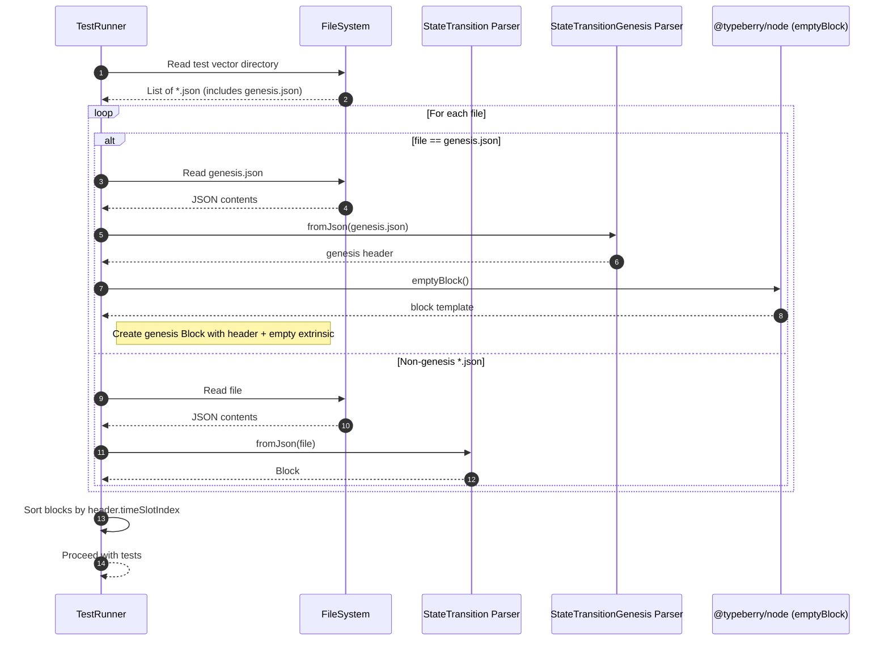
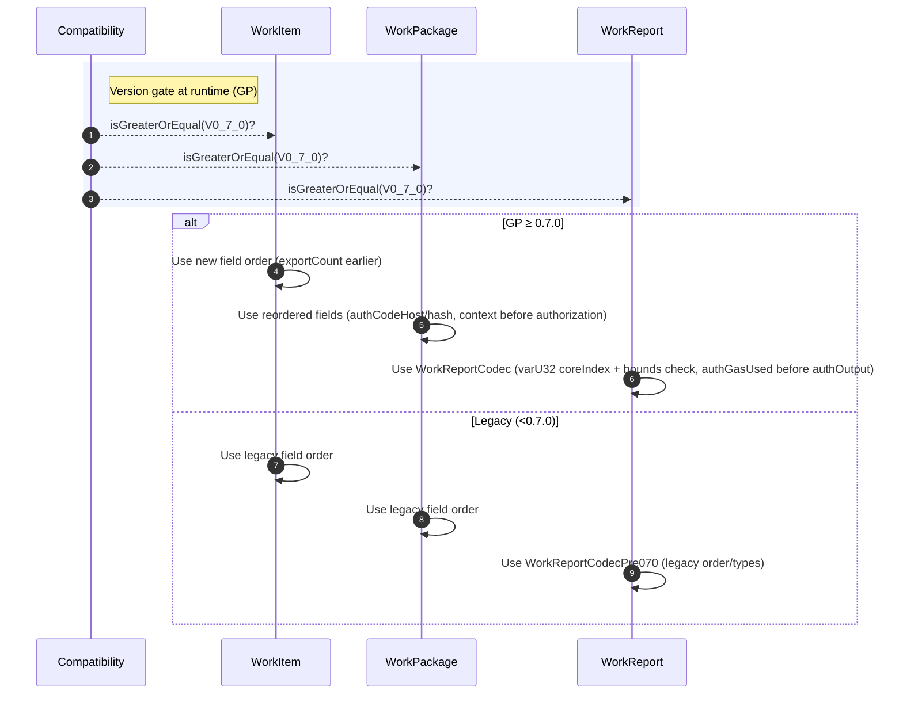

# Moved var-length items to the end of encoding

## Pull Request by @skoszuta

- [x] update block encoding order
- [x] load genesis block in w3f state transition test vectors
- [x] enable all 0.7.0 davxy traces test vectors
- [x] update unit tests


## Comment by @coderabbitai[bot]

<!-- This is an auto-generated comment: summarize by coderabbit.ai -->
<!-- This is an auto-generated comment: skip review by coderabbit.ai -->

> [!IMPORTANT]
> ## Review skipped
> 
> Auto incremental reviews are disabled on this repository.
> 
> Please check the settings in the CodeRabbit UI or the `.coderabbit.yaml` file in this repository. To trigger a single review, invoke the `@coderabbitai review` command.
> 
> You can disable this status message by setting the `reviews.review_status` to `false` in the CodeRabbit configuration file.

<!-- end of auto-generated comment: skip review by coderabbit.ai -->
<!-- walkthrough_start -->

<details>
<summary>📝 Walkthrough</summary>

<!-- This is an auto-generated comment: release notes by coderabbit.ai -->

## Summary by CodeRabbit

- New Features
  - Added support for loading genesis.json as a real genesis block in the test runner.
  - Introduced version-aware encoding/decoding to support GP v0.7.0 for work items, work packages, and work reports.
  - Enabled additional test vectors (storage and preimage traces) in the preview runner.

- Tests
  - Updated expectations and state roots for GP v0.7.0; retained compatibility with 0.6.x via legacy fixtures.
  - Refreshed test data and hashes across transition, merkleization, and credential verification suites.

- Chores
  - Added dependency on @typeberry/node.

<!-- end of auto-generated comment: release notes by coderabbit.ai -->
## Walkthrough
Adds @typeberry/node dependency and exports emptyBlock. Test runner now loads genesis.json as a real block. Introduces version-gated codecs for WorkItem, WorkPackage, and WorkReport, with updated test vectors and expectations for GP ≥ 0.7.0. Updates multiple tests and fixtures, including new legacy work-report data.

## Changes
| Cohort / File(s) | Summary |
| --- | --- |
| **Test runner integration**<br>`bin/test-runner/package.json`, `bin/test-runner/state-transition/state-transition.ts`, `bin/test-runner/w3f-davxy-070-preview.ts` | Added dependency `@typeberry/node`. Load `genesis.json` via real genesis block using `emptyBlock().extrinsic`; include it in sorting. Test runner no longer ignores storage/preimage traces; only `genesis.json` is ignored. |
| **Node API exposure**<br>`packages/jam/node/main.ts` | `emptyBlock` is now exported; implementation unchanged. |
| **Block test data**<br>`packages/jam/block/test-block.ts`, `packages/jam/block/test-work-report.ts`, `packages/jam/block/test-work-report-0-6-5.ts`, `packages/jam/block/test-helpers.ts` | Replaced test block hex. Extended work-report hex; added legacy `test-work-report-0-6-5`. Helpers choose report hex by version (≥0.7.0 vs 0.6.5). |
| **Versioned codecs (block)**<br>`packages/jam/block/work-item.ts`, `packages/jam/block/work-package.ts`, `packages/jam/block/work-report.ts` | Introduced GP version-gated `Codec` definitions. Field order and some types differ for ≥0.7.0 vs legacy. WorkReport now selects between two codecs at runtime; coreIndex guarded via varU32 with bounds check in ≥0.7.0 path. |
| **Tests updated for GP ≥ 0.7.0**<br>`packages/jam/jamnp-s/protocol/ce-133-work-package-submission.test.ts`, `packages/jam/state-merkleization/state-entries.test.ts`, `packages/jam/state/test.utils.ts`, `packages/jam/transition/block-verifier.test.ts`, `packages/jam/transition/hasher.test.ts`, `packages/jam/transition/reports/verify-credentials.test.ts` | Switched gates to V0_7_0 and updated expected roots/hashes/blobs accordingly. `TEST_STATE_ROOT` now runtime-assigned with three-branch selection; several test vectors updated to ≥0.7.0. |

## Sequence Diagram(s)




## Estimated code review effort
🎯 4 (Complex) | ⏱️ ~60 minutes

## Poem
> A rabbit taps keys with a gentle thrum,  
> Genesis wakes—here the blocks now come.  
> Codecs choose paths by the versioned moon,  
> Hashes and roots hum a newer tune.  
> With empty paws but a busy mind,  
> I nibble tests—no bug left behind. 🐇✨

</details>

<!-- walkthrough_end -->
<!-- internal state start -->


<!-- DwQgtGAEAqAWCWBnSTIEMB26CuAXA9mAOYCmGJATmriQCaQDG+Ats2bgFyQAOFk+AIwBWJBrngA3EsgEBPRvlqU0AgfFwA6NPEgQAfACgjoCEYDEZyAAUASpETZWaCrI5Ho6gDYkuAWXxS9BLOYN4YRLiwKDTMyASQkSSQZPT4AGbJGEy08OGQkAYAco4ClFwArADsAJz5BgCqNgAyXLC4uNyIHAD03UTqsNgCGkzM3QBinthpabJNKojduLLcJKUULt3c2J6e3VW1BfWIZfYA1viIAF54aHUAyvjYFAxJAlRZsFyIZ2AADJU/mAyNlckQ6tBnKRcJB3pgGF9IMxtFgCvdcNRsF1+KtUQYbCQJPASAB3SjYgAUGHw5EgniQNFoAEo6vNSp5KdTafTEIyWQUAMIUEjUOjoTiQABMf0l5X+1X+kugfwAHBxygAWDgAZmqAC0jAARaQMCjwbjiGmQbqMWCiM48mHqEixFBZKZKei5BJ26w2NxQbDcWii2GefAMM6ZUF5fAUJQUAxQcNoeikciIVACcORt2QEnajK80O4D6Zy1YGi8yBSMRxxBJzIqbzoXaQP4aSoaP6QEMSAAe8lLaFecWkMNrBAoDcDwdD2Aw6gS44bSbAhgMJigKX4GTQeEI6eUjIUrHYXF4/GEonEUhk8myylU6i0On0m/AUDgqFQmBwBGIMhjzFUY2AwCUqBJexHGRFxYQfRQnzUTRtF0dcjA/UwDDUDAlnHMAKAXcgKC2EczjQUgNCERAaTcAAiBiDAsSAAEEAElAOI0V6AcJw4PSW1MFIVcWNoWhkDucgoKUXElCyeR2DgtI40gAABZZVnWTZqSUfMBhrcl4CtAA9DsOwARgSfBYVyPDeQIojKFIyMKJIKiaIwDRIEKaz8ESPgESE6QrxOChAg0DCmMsFjPBoKgKziazEl7URPGcagjIwZABJIftuDjE8VO2bN4AYTJxHEaQjCgY1ZJBeRU09LgAAN1JWNZKG0xDmrzZqcLs3AHIwYjnPIyjqJpHqFwTSBmpklIQWJRAepJfTgimJJmtM7sNHM5qjAAUV5eBkRPR9IGFIlSWSGYCr8Oh4EcAwGLo6qsP6qtBsI4anOLGgwGHLL1Ey7o/pIAGy2BmkNFwLpnsY5j2M44CeJg5x5AEwLwiqxtRPE6DuHyigYWUvgUxyPIj0zRB3KtNAJIukVPEgKmsxzM4vLY8CKEUbBRxQZgiZhHLBeWAAhdnIDSHnmDUjSOo2WRuh0tzWNoIQsVhul8FTCWIzORK3QYD0klZmmJqwCleEJIysU8eQfnNVZmXQDB6HiOFPn4LAzdprAJGy/zIAtqX4G8GnIHGFTfYtgAaaIeGcE5kCxMFIHRUVoEhisAHEgOpjRpZYAApDzXfoU0RSrdAWfz1A9dzVbIh9JJuCTsU7VTShy9d5JRYU/tS1yTMyopF0LVkBuzgpJkNFyoegYYWfI5Urlkep4Oy7SMPpHjpcmHA3JsGC+I2+nJIm6iDOaCzzBy0ywuZdLum3Z4LEogPmhwI0bN9a8qfkDCmRN6GixMxRyEgJ3BMMMTokHuOGXAXMlD9i8nAJIwpqwCWSmDCGd8oaVnHBdRyZN8D9DKkAlEKdPhBVoBFDCiNYrHkyobZKShjbpQSruZIeUCpiiKkMekZV2DAxxlAHytIqTWVykLOgWwBGlVYlYNiKV2HxWYfmSgSRmCKHgNvOgs9DrHVOiBRCjMrpQRILdYm90chPRem9MARgPr4W+iNAsaQwB9kHP8QEYBrbmJhnDexiMOJHnimKXisEMYZCxsJIwApYA0JbigIg1JhTu0IZOesUsZY12YDscQwJubyEdJACkMcy7cCmMgXkcZXI92tidepw5RwskwPQP80i0oYGoHGBCZ5wJWRrpmcILZFKuFrhmJAftUEIEAaIGk28iDPBPr6T6RCfp8HiNSbW2M+DwFSXGJI2Cpz1PaTwYUTTSAJCoKOeOli0g3kkCQe2TYSp5ESLLb06zvoRx8vwIO+ALTqO+b6YBWAGBoDbGSYUSIdF6NoZFBhcUMo0hYb6NhaU1Foq4dI3hqQ+DFUEeVERq4xE0hIIY8QxiK6mMusSCxViJS+AenYxia5HEGDbi5YS3QhBoDGL/SMA0wBCo5rDeiCNoqhKAuE1GfFomCWxmSyAXNE48ukHygV3QxUirFYE+OrDLH7litwoW+Z6ZwpyAinJLBvZJHDHkO0/Z7AL3BPETAfk7QUAANzJPlozcFDNeRmnCF5GKzMvXd0/uwQNlDIALliXQeONFvavOSnisBQQoXHxQBJGYN46CzKSFJV1obwSoDSImisULXl3GFFUkcLpY1YN9P422Y5qxit7NQNA8dL7JKTdrSF9IrhiniMlekKLmbrWPnQowMUUWcInRi1KHD1E5R4Vm/ghL5FCMPpVFV/yk2G0zKkzEGDcVbsZHIkq+6KpLWLWmjGAhQrBGzFo+FpVUVYFQMlWdSRW1JCUGkE1g1M0nhDWnb03Kxqav5YK9mer2YGsgNSJ0WsA0qUxeu6GVKmlnTpTba6Dy7qQBZbY5g8NXocqMLB1yiwEM6qQ59MAdpPCrGnIEyVr0QnIzldBBVXCT3VTVvjO43giAjiHIQkMGIBbmtJvmOMUYG0FWQBST6AB1FTBIhaGl7QAfT+IZgAbIZ8obTX5Bjk6s4544dMUDOHpgqAAJXKPb5MnG8GITKQzSgGWnJlMAaASTOFVlYelTxEDpoc7pkgQt3MuqhWF2Q8zcDPHIBk3kjnnMJYKgZjEfrqRQSXMKDLFAsrLhy/F/Tvb8x2iwAKFgbdxBqCnbIDQSAc7ClFBQAA8hQA6ABHbAUKKQ524AANUMtDKbJnKjGZZH+wiJB45RooKtE4CdyuZc7bgXLLniaFbQMZszFmvKfSnkl7WZC43DwTdQ7GiL6HRUYdiqrK7gNro+9lDIEG+G7rvSSw9on/lnp6RVpIJ6hkA9oLe4lwjD10KOtS7iChdL0pI0ymxj0qP2No1ysiDGtWIf1iKkkKmCL5eJv8MApmwDlG49RqKrEZVcUg2jfiMTEnKoXWJBmpboDtXuKac0MJtG0B2Ekag6q4OMe1bq1jlOnPU6FnThnTPMOJJhBB4NYIWwgbAzWHNPga6OvBM6opj4eJurpM6Kgngn2S+lwocC8adknSFogeOVasgJXW3wb61KHWkNKn69QNT8Atm2BQfK22/3WV4AEeAulkrOrLWnS1yUXfeEAJgEyAjcFLNQVKWKksRJG+SuHdVlo9gifXDk3G083DLdSmjExM04Dron8fsuptQdg0BoOiPcUhd/0nRIf3Y/gz9n3P2fk+kVvaXeor7KisU/r+yX7d/DgdI6WmDkj170BiToFwIvpqINcIDVBvI3pt4x+J7ypjSv8Iq9+Gp2nQJNeBIMPkKAU2pu2+jIXAk6NIluHmt+4IPefe1QA+c+pm2oDAfw2o2olQ5kAg1QIYtA1QaQ5kDApmfwGolQ2oogKBkopmDA1QgI1QKoGoJA1QVBfwyBAg5QdA1QfwawaApmqYaAxBGBfBtAKopm5QKoJA5QDA5Q5kcBGoaAaQKoKBjBSglB1QpmKo2opmpm1QaAtBMoMo+BnBuBDA2oAgIY9B1QogVBwhIGGokocBKojBlQGoaQnBDBAgaQlQJAKo5Q2o5kIoJApmlQkoaANQ1Q5QmBaA0o1Q5kPhtA5kDh5kpm5kfwtA5BVQkoogIo5QlBDA5k5kOBAgKBM+yB2RGokhJAKRFR1QthohWBaQGo2oDRqY0h2RIYmhNQQRGonBwRkoaQkotApm8heRpmrBRBlQlQahtBgxWhgRIhKotAaQpmFBoGuoDA7hAghB5kGoox0hpmtAkoJhDAkoDAaQ7hIR5kIR5Q0RkK4xMRxB/R+xAgGoDh2odhyh2o5QtA2xqgKoDAxBDAtADAaxAguRko3hJAzx7hWBAgqYGh5QchGo2x0oPhDRDBWBIodhKoaQvhahGoHBFR3heJlQaQaxlBpQJhko0oJAvRaArxGo2R2JzBMRgIGo5kGRYkExQJmBJhDBsozhliRB8+QplJ4hJAiREhDAKophohpmXRNRxJEhAxaQ8Jvh5k4xrBVBUhawAIlBlQuRfwapzhHBM+pmJAApc+8RyR8+KoapKoKg9R9RVxXhdAVxGBYpHhixdhiRKoko5k2oaA8JRxfBKoepYJyBliFxChSRuhqhDAlQchOh1QmBnhQRJJoGliSRSRqoSgtBFxVxgJqByR1JOhypJAJBAJiJtAgIGRkKI4AJwhqhlQChQpLZs+BBxBrRexNQ/RQRIhJBlQ2RcZXRrZC++GNKGO6CxGjKpMzKrK+O7KEAnK9Gz+iuLGb+VOn+mgEqLOfGYS6OkS6MwmvOcSBgaCKUoGxeV+MGT+8Gq55OyuG5NOW5yAYWyAkuuixI9ARcssdwiAsAvCfAGebcsg5MQyEm4B3cFK8E6AhMY+eQjU+CUKkCHmcmdwl8oKSQiAAqmFduU6ygTu3kvkQcj48cn8PMzMaQ4YJIgeyQGwKkvOtA9IeQMOMKle3MvMrwtAfqyUQ6qAseLy8gGFwBESduAG86rOi6TCOKa+OGv2V6MiBKb8e+B6B+jYxoF5l+x+AGSqpAtALUV+F+MIdEwA0etAhmzqhmUBegdEPU3ozUy5t5ZOwqD5qum5gSPUgASYSzQGXGrF7GVSTmW5SWVurWW2VYD2U3kK5OVnAU6PlCzuVGD9aeB6WQAwH97z6IHIGoHoGYHYG4H4GEHEGkFZUUFUE0F0EMFMEsFsE4GcEwk8FmE5WCHCGiHiGSHSGNFyEKGrHKFUFqEaFaE6EKHSi+nhlGEmFmEMGWFTE2F2HagOFDkuFmlJkeFeE+F+FoABFBEhHVBhERFRExHahxEJFZmpGvHpGZEBk5F5EFFFHMF/ClHlGVF/DVGygOELENFNFxFhF7HcGBHUGShdHFm9H9GDE2mJGjHEETEOHCGLGNlzELFLGDG0mMHrGbHbHlAGmqH7GHHHGnGgboGXHXEhHoGahBFiSShPEvFvEBEfFfGqACC/H/GAnAmgngmQlpDQmwkiEIlIkPWNGkG7VKCRG0HYnel4mcGqiajUEkkbFrEkAUlUk0l0kMkD65FVBEFsl0BVk5HcmlDVB8mPIuHDkjkilsHilAlSm0AylymygKkAmDEql5HqkSFhF+GFGcl6nJGGmc2z6mnmmz6WlCk2lNn2nOH0kWFiHW3RGlDmQelLHRFqG+n+mBnBHPGhm/GcF4FoBRnSEKGxnxmga7XJllm9EnGbWLGJHJHzEME2kBlYHGG+HdEllsHllfEahVkyiiBoB1lCEzFNkjmtntkDl7FdkG1VkUFVBoGDlOGD0z40aFCkhcBpVwEZVIEoFoEYFYGpj5UEFjHFXkEqHlXmFVV/CsHsF1XcG8H8Ewkd0tViESFSEyFdWKEAkBF9XqGaHaG6EjUGEMEkkTV8FTVAkzWWK2H2GOHOGuErWeHeG+H+GBHBGhHhHaEHWxHxGJ3JFnV201lZHXX5FJl3UlGylPVKAvU1HvX1EC3NE/VtH/WdHN0g1Kng0jGY1Q2TGw390I2enI2rFo0GkY1Y17EHEgl41nGE0DnE23Fk0PGU3PFwE02IGfHfGM1/F6ks2qBs1sEc1c20Bwm80CDIkC1onC2Yli24n4lS1Emy1kkK2GNK0rGA2q1Mka2snsk61clwH62G0Ckm2tlm1ikiGW3SnCG21VDKkO3Km0nO2VAalu3ame36k+3Gl/D+0uFClB3Wm2lh2OmR0ukx3unEkJ3enJ0Bkjhp0hlHGZ0Rk52pN50vW6kJnF3UGl1pkV2ZnV05l135mN1FnBG4Gt1IHt2d01k91Al92NnNlz1z7D2dlVnj29lT0j1DmD00ao4EYmKY5Tk3Qzm45so0aLl0aRWk7Mbk7v5gDOjMDM7BLSr8b7lc6Koia4wC5obXRe7qaQDNaCwZTtbqANSvyTYzZBZWjflyztRaRKx4BhynpBjmpSDAtZawgkCJJEhxgRRQC5ZsQxCuoZRlTNZsJIujDBTwuZg0jEBjbxhn4oAZBfOtbwC/PLBdaIA9ZVyUCDYjZjaeATbTazaeTzaGaLZ/Asg8WIRlQHxLLPA/oJrJz2qhwvIEoJh+obZbaV4wgV4MzWqPLCiDJxjQKNhRx8D8uCsADUySIIiE8ObCFrcryV2UlL+y2Ib6pUa2E5rm9MsA8cwo285AOc9MTQJ06g8cdZjgOwoovriA/rzAgbwBzWC4uA8cwF5Me8gsBU9wJARAYEsM9yg8oaI86LK8hKwoYARrxmZrWQFr3QVrnoNr+Mur3cFCw83wlARIrwpFiEbrf5CbaAIFOstAnrliuQJA4bkb0bwb+SaUNAw7Ab8bCmqb6bmbPu3CC8I82bQssb38uMbYG2FyQKlAh6PcbAkQigW+mL2LDbWAiax5RaS+rE72m+QyRqqi97m6ClNeRKCi++oi6cGI4gZUslUrNm3ELUf0Ci+LogYVjAaUiAyAzUp7LoEHEVGqUVpzwq5zlz7laG+AUE6rNcJLwWyyzg1bIGuQ+CbovIIoqQe49gBuOFuLE5DAEU/+kASVKVzUIHeLorkAAAvPRxoAKFB4gBSHB8wPHAAN72DNvOtttKAdseuJw9upj9vetDt+vTtBtAkhsTsqcRtqezvExpsZvsCLvzy5ulSrsFTrswgAC+TI+0THi9JIwHP7oHnHPHtLPzYcfzTLLLfW7Lo242gLvLGgJbQrkAAA/Lx/x/TIJ8J2JxJ2FFJ66+60p4O1O1GzO2O6G5O6p+l+Z8TJZ12wp323p7gAZwu9m8uwojZ5AFwI+Ax1F9B0Jypliy6HF06620l52/J0m4zMp2l6Oxp+O2Gzl9G+8/p/O0ZxV6ZwwHl7gJZ5ADZ/tAYOs+OedFjtOWRq5gcrACzoTg5ch7qucw5dc1Kmznc5zkJpjFeyqlzKWBxcS7yyFmFrCuaxTOCEprllYDeXx5xxAlJuIB8r6A18gOKwcpKxWHpM3HcHh1aAiPaF5Aa4FqS1VnoDxyF4ar6K92KHoslTujNKgEmvQBSPuJEGB65pcBl3gLAGT8l27jQIPEG1T3GPAFcD+l21QIe2aKzxWHvDEIgEyH6kpqZd3DD1lBj63FFliHj93MT0z1z2z/+NT+2xT4z6T+27T2fNhUPNz5lG2+BPPLzy6Pz/dllLMr+C87gJTrCB8HDxJNZjK+521p58sD3IFwi0Mt5jeMkmgITDzLwPAKGGlLIE8JoM8/jI7/S87/8/QG78jyVzC4TKXqL54glgtIMuGGQvm/1vC7Wkiyi0ZHwFgi4CxIgMJ4gPN+csKFp7SllBiOBPMkGsklhWwEqxgOmm2nup85x/+xDx9ypl9xqi3nIY8mINe69reyvtJUlKuk+5wi+/im+535+yqlYEvweg7AcpDisgmnOCAbNOx132whB+wtB7NJ9zeT1BSHZftyc4d1Tsd7DM1CyIT7aj+dR6Mi64mjSDkDWszHV3xwJzdwSsPsYFJHvh3Ryg9lkH2LyH/l0DMdceVsIthIA7BdghWTnOjmBzKg8d/+wPJrk5gH5wY4uJPf8vLx56K8yeKvcgery66a9OeLPBXjGgZ7RAjeC3WzrALETXQKQyAzsN2GNZMh0Bv7Q/qIG45d9vmTvDrN516xxQ/OnLblkC2R7BcFsS2cLpFwE54CzgBA1yEQKp4UDeQqvJXjJ1p6MDKeR7Ugbr0Tgc8SA2vBXpc2QDVdauorAAdF3UGaDSA2g0wfQLIHEDdBJggwSQFk7s8teZgmkHr3p4ztbBrApbitwgFEZzEOzTbtt126HMicSHW/khnOZuVtyNzM7nuQu5RIjyQUFVASFAx1hpwkAQ7E+WjA6JwglbBZG9zcBMc9MaUfmMlGZ79AekzMXIGABP41JnOHHAlhSBwFqCp8TIFkAOnrRxtYEYAT3qP1pQEsfeyeEcLAE5jsUpcLQq3nV2xAVC12nHCkEphzhWBIAgAUyJ2wPA0Lucm2EWdRWkWCooCDKRC9kq3cA4QYiY6XDiYP3AlqgBKw1x5YtuOjsnk4wu8KQB/TAaAXagCQ3hc3UVlZi9ASRoOm/MULLmDywJYcAwbuJCMwE14MR1w4UACB7AwkTgqQLAAcLAFWg5BQXELi8LgFnkmAwoJBB5hx5ehKwbaM0PkLq6Jxm4XwrDueUHYdIQejg4IBQHqCvERgNIeFjCHGEbIQ8toe0D6FlyPtrW2lbeFrG9B3BmsdIt2B5k0ywAeYJIZALokgB6BIA9QRIsvDPLC9CU1AKIGcASwwg7gB8H/plChRcBBRwoyUDWBTiJEUoskNOFaFF7cVfQpaVrFEBSzdsU4MrV0a8Uh4hiWYFLRFEx3GDEhcedbctHmGSj+82RnHYMTpWkBcBiBzPHXjSHDbHAxQ3w62JxWCj5jghGAfrHgG2Awgr+WAbEWwiZD9pvUIoOIL6EkzSYORUQdQUdihFsIbheIlkOVnjTJRSYbAQvvazTiy8PBhYmsXWLwBItSYMuOXp4MyjFjCRVIr8B32BwsQlE0ECgCUMnKN9kokIyDtF3jgCBlxkeIQX+x+xSsuRUEUXrIloCyAekUbchFaO7iRA/wv5Gjji0EG5AmK0ORwTe0kpyUZKj4ufv9mvSA4lKiOFSl+2vgKJGR1Hc9FDh362ZWOII0Vsf0AGwdasBUBDjfxfzpC4qBUDDl5W/KwC2OfQ+8SIKGHODIRcXKfJENgEEA6JeEthGCNWAQjiJ+XUVj6iiFGIYhWzOIaRmsSQAtuRAHbgTmSFkTtUCGDANwGmFbAeYBAJgHsFeBgA/S2oMAEdxvLTChgUbeEdDE+gndeMtzXIREgeYFC+cp5NZIQm+E4dk+oWcLLdgUTxAHAhMWLNWFQqcw7RLzCYYfDYAyjcwFICPgy06zdYpBbLIbP5y5ax8H4lI4VtZBmEwhSglvM0pWCt7aZ++N5brr22xBKZReyAVHqcNQG89pWlY15lBAzxQElW/kFVgnBw7pizQRUbtuTDN4g8r2jMUbPAEvRjcAe4IaKVH1d48t3eoLNqJpE6iQtxAHIJ9BgmFgZBko6ySityPPZUJCee8d0NgDe4qJqh7qX0Of0H4DoeK/5E4FgETa9se4qcD5OOAOg5th4pUE7GXi2SY8Xpi8LyP8m3alB8+dSP/tdwfbOTqwGfBRCpE6j0V2kTFcEJ5NyB3c1hY/cwMvikqfZp+32Wfhujgmvtd8SEh9F+3ESUpluYkwjBJIZTxDpJFGPHEkKwhKSxgKsboOCiskSV2cKMQTPkKu6FD3AvoP3L5itDjxxYksa8qkKYxMyWZKo5AN8MbwQJYk0GLWD3z8ygtJIZLRvPzIh4eosAjeClE+i9zeBM2UrbaSgDki/soUrfdvkkCvxEhMwMUnMYu2H5PJAen6KXPnmQDvsyoB45RA4GPFNpoxIfVsHFDTjIjwpAMtAKi2nF09yKUsKiuJWRToz0UWMjfLBOEqKUPZIOVSlAHGDVo/MEOC9EkEA579moQsyeOzBnikTjm4sxCMzJRDUTvKx+DWX5hLlTxy5vUBmcrGrmSzloY5cSZOUkk45yMc5OmUuUrnaocEU4h0CQA3E0hQYP7cGIpEfSWSshp3JGLZPlRcyecPMxsGeWkSFp6APMPyJAndanh6xT45kfZmrCvkzU7SbHrkjuCW9CAnsBEMuEqyHkPUPoYUODCfkfxv+iFZmH+JJhDTqwcPSMMgCUzo8W4WAfluZkqBBtX43rWtPIEMqGwLRpI03jADmQn5xM9Ui6PgEPmJI/yH0yACFzKS95lShYJsl8R4IHFcCIRdwj6W8IKEByFxOMuUDSCAkBiDTaklcUYIV1sSIoF6ptUIJE02SYwhADHgwSSdnZ3CBkMHLwVaxwFJmGBaQv7CSkn6pxDQqSROKylESAgL2oY1UB4kdCJxUQtyVoJp1fCkoSoAMU8IeEJCjyJwosTNJ6KYR/AR4XwHKkqKAm6xA4kgTxJCFUCchZIvGS8JwF/S9jJMq8CeLQl8iFBIgioEMZilpQIJeau7TQBmiuxEYJCoKID4fp7Zr/N3NWHiDeAYQHqIEiwElyhgHRf89APCNSSZtlphCIDNVhhAQzR4YMbCaKBTSUAA+o6BXucmi57tMoo4l0PGkvY0I6EUAXwLkBUhkVo8YATaVBF4oEJeQeY0/B0m1l5RBES4SIJ/MMnds0FEUqMMPBoCphr8LIm2NFgSCU59lMmV+S4CDb0hUk4+KHjgpIWi97ArwHpJ1LjloyoJmM9fLhiqzz8d8QOAmaSjBzWQYc8QOHAjg/br9AVcla/qPLGDjzKAk86ebhBwQLzpAMMccAlVJlo5yZfcymVJNnKUZh5RzMWWPLnkDQNAULJacvOsk5DZU9zS7pvMckAFeWLMDKHkD/K6IJUMAA6PcGgCGYWIU2diE0BYhiw2ITQNiNAAACaYq+4PcDYg5xCgvgA6IUGgCYdsODvFrB5wkFxTWWA2RKbIJSlzYlBoXE5RRy4QWq+WSiizI8qDnSLMpiI4IGHBUATTUKsIemHwn9jcqKQplD0TgqyRlDNW3cOsrqwNyyADEjYVfsDiVmw9ruXAaAMKtFUiqWIaawzDYH6z9YdVBPMUXu1vl2p7RaKOvk6EXDiAoULPREU6BTbEwEgKI9+SHJdaN4clzYJIGPGPwlKhVIqwzJmuzW5r813wN1GMP0h3Bx2hSb+W6GBg1qFx3ouCuCD9GBqUB3YeOB2FMydgaKFojJagGkTtJOxYE9ihRSoo9wQM5IXBYfMyl+Z4grayZTAFkz1ZCQ0eKFrRAwVJA01/awdQdHQAbBu2BePuKUHWWHKCO8YZACizeC5TOlJ4UFtAoFZDISF3oKdeaDGTcwlopFfcCMhOlJBt404cDAbNjQZ4CANoqrMT1fhV90ch7XghiHSn2Am4z87KWSDIBoLphqwBgB+TKhhqI4NIkGQCIoglgdRTwOSRJxz7MwcVDsp5YuEenVhuN0Y5JFJBF7crdl0gf8rjwGXlLvmGAWQHIr8jdACFUQADDTFEz9ZX0zbTtZ5ntEpqP1IUczXkoPjFh6+tU+gOhXPl9qM10ALNb+ok1lJJ0FHNOI1LdRgKVIUauNoZnDD4AzgQYboKFvAiGZGkyIUgN0CsEMc2ksKQueOmshesfMpS30GuqBAEixQ3G/to2g415B/eKkTdRoH7Cio/VPEF5E8hxSgpLgrcK0cZsbAHQC0Ygb2C0s+XD9TKYIVNb6FGA4QpWAkd8Z+IURfqPNXmnNXmp1XnIMt9ATjEUlLDyAPlYG/GGwDvi9aOluQvzOchwQHyYQGCV9RD08nfD3Jz3GXCdsmHhT4o3qOUVgHY6ILfVNor8ipFQXlTflE/BOaDKTlAqt8OssFfCsJkqpACZoCzXnKwlLaWo02gdZ5qHXzaK51K1FbSsskMqaYj/OoPkBY5cAr8DmmEPDp/Vzb81Ig8aUauZbxTTVHLALlNIUHwbKgTIWARFxgKSkNifhTwhUU5rVEGClBL4m8XoJqkfCEJPQtwX6JulRGaAM+niTEJCKtqGBXUH0QECvR8gXACnV5yQDkiEWig87OUHjj2rdd5mUzMzvyCs7e8YhaxfgTgJeFMCkpRhfQUpJslUCktJYj6VYZUFZQiZJYrE19JUlUCEJGIogXqLzNVdNXVKr3j+KEFCCUpbwrSW4JPEHqnNQIqcS+KxNkiAgeIuUCkKykDiixbgk4URLeFMCogfYsgTjIZFxidEH1EYHyAOd8dPaqwe5oR2zbh10AUdeWhr35AuYc6vpRD20SBAhkrahodSzKQa7GWxq3zmarp3yDUpVq0YZAFE6wD8gxOxHQdFJ06qeOMBdhXooqL6T6CNBSIpETLITF5CIhVkknSQIFVfqgIeEvmQ+JoFKafxU4gGQ8Jg0VQ1e2AVZ2SAchK8GQKKQavEGa7BOhuxnQvqX35AV96alvUjrJ1b7I9UpJImWTNJ/Aed5hfneAy+JikBypBLotKHF1xFSgUumXbQQQYK6BASuymp/vyDf6Xk22CA5AdX2t75tIgmApbriJUFSCUpRgiqAd3Uk/dLuiom7ooJxMvdu1H3YYzZKcEA9rJbIoWA7o1BqDC3HucSrMSkqB5NM/Zg4ipXy4TmgMe+DPLFRgB4WH5SgHit5CszdyrKvIYeW5mcrH11YXeWIHvZLawKUm+TZJGugbbRQXABtM0LFDj7YpVOk1TIJn0UjHVlmeTYEckEhHp9yU+nXPoFbKChKXMdaKnmemVcyon0eOIXLTjrTVsoqG3lECcOQY7c8QXvCgXGK5ECqFxNApwR8LHExSmeu0iIWCKl7Uiwi/0v6TtrW0jqI4LEmIXwIUH+iIoWgj3AnFQoTghR+EFEHKP9hmCQi1gqcTBJvVLFqSrYrIT2LMNxDHhS0lWQGIqBvappAgl4WrqN1eiCjfNmqmwTYVetD+F1hONyBIUSjHcCjt3AM1EL/0Na2gKKkljZjXJMrC3VIbjrjF89dRkgvEQ1CUFNqxxckicShPHEk9IoKJcYUkJQnGixJIBoiV6JfFQMH2vgJVIgUXTMev+7oX6pN5pwyFMoWgtoV+JUleDhBCwv6VEA1AYSpNaItQRBKW7WCXxUglYs5q/FoiFxVQhzoBJrEVQ+bY9CDPiDnQ2lNeWFenK9mIA/UMOTyaD0RYTpCEJRqVlAWQD/dwE62oLhBLvbLoAVSa4FbjIX74zQdEKxsFKcKGw54J8OdOeacLxWC95KOMmZsxJXY5dmg8ilQpPpkoqlg2cEGAZrMNLygkK89mQJgPLc57ZomWfVaH1NEKXj9AEzq9LKgfGr5L/UFg9PBCgGIjQyQs0kY7AYLUA6SAdhmAaylQogHxwtUDATDjovp7Gk8EqJUjrTCEwYh9TvLyh7yj5hCwnZgBJgdnfQgAHAIMzi8OUZWuNgHST4pUG0VrHORgbhzZpRAIAFwCC1CnF36ZbeuOWhTV4e5X6mR9UANiBkA+WEmrVXACvO2H7AAMgmfxNAH4TYUzARwJhTmtLowYkksSkKREtsUYKfEZggRM+iMX9JYHtiexA2tnqkIMB2Bqqc89yuADEKrztU28xiT6L1EVjVBLYpoSJLMnaAqjDumUS8LWLWTM+eQl4WeKSkCCein0rQV8JiQ/SKxUTGeQq18Bv5wUViieYLaHLLzeurgL3nQu9FbCPpbC1CdlLUF8LhFr4q8BDLzNCiqBsQnQV+K/ERiTZTEgxbiKFhaScFg6L/oEv9g9i8RMUgPl8XqFvCfxBgtDUSWpheDM+VopzUsRYklinxSkuMwDJ1Mc6w/JYigXMgsWwZuuPs84c4RKYM030keAOaiDntoxQlZvhfJnY3jctJaRwD0qERBXnOOKb4TWtSTybkorhj5Spr/LBrzktIjBPlDdgBbj5Rmn7ZBPvbQTsZOKEFYVBB33pbTnKaIaofW5UzyVtMwMyPNR0hm8EFYboJuUWAmHZg3Qys4fEmPmHnyPGNmedzsnsqEzjYa4wFdSpFWdg+8qwZlgwlb9L0ZUnpdvEhQ88R8YV1s2KDYDQd6kv8AQBJxy1+Zvh+p7KE1kAOR9KdPnaQXEe10M759ZHU5ZR0gAlnzMTOGzQ/OQouo8KjucMdj1HOtbz49AW60fKkBIsWNrhqNfGBjVEKBAXqa3jMdzHJI+LgrXsbVMFzXRe87E263Avdi+gkL2YnDncAjXasYQFNofGGEECNLMEa09a3KeNnjLnsNVk06vjNMwScZqcxfspTB2Qr8lMKp0xLeJSunPTRK702od9NkZND85A5uhEwjbhX4AkEnoeGsMmIBkEEULJzMPJyzEIVAZ8ChDfDoQtwp4dLoZlTyIBDM63OgMFWcAwh3wOtyAHHWP2kEdC0hHOhnsaIbFJDR+x5JjRGIEWoTMoUwmhA3AO3QI6gZ2+JDdtTkPbO4fQEAA=== -->

<!-- internal state end -->
<!-- tips_start -->

---


<details>
<summary>🪧 Tips</summary>

### Chat

There are 3 ways to chat with [CodeRabbit](https://coderabbit.ai?utm_source=oss&utm_medium=github&utm_campaign=FluffyLabs/typeberry&utm_content=579):

- Review comments: Directly reply to a review comment made by CodeRabbit. Example:
  - `I pushed a fix in commit <commit_id>, please review it.`
  - `Open a follow-up GitHub issue for this discussion.`
- Files and specific lines of code (under the "Files changed" tab): Tag `@coderabbitai` in a new review comment at the desired location with your query.
- PR comments: Tag `@coderabbitai` in a new PR comment to ask questions about the PR branch. For the best results, please provide a very specific query, as very limited context is provided in this mode. Examples:
  - `@coderabbitai gather interesting stats about this repository and render them as a table. Additionally, render a pie chart showing the language distribution in the codebase.`
  - `@coderabbitai read the files in the src/scheduler package and generate a class diagram using mermaid and a README in the markdown format.`

### Support

Need help? Create a ticket on our [support page](https://www.coderabbit.ai/contact-us/support) for assistance with any issues or questions.

### CodeRabbit Commands (Invoked using PR/Issue comments)

Type `@coderabbitai help` to get the list of available commands.

### Other keywords and placeholders

- Add `@coderabbitai ignore` or `@coderabbit ignore` anywhere in the PR description to prevent this PR from being reviewed.
- Add `@coderabbitai summary` to generate the high-level summary at a specific location in the PR description.
- Add `@coderabbitai` anywhere in the PR title to generate the title automatically.

### Status, Documentation and Community

- Visit our [Status Page](https://status.coderabbit.ai) to check the current availability of CodeRabbit.
- Visit our [Documentation](https://docs.coderabbit.ai) for detailed information on how to use CodeRabbit.
- Join our [Discord Community](http://discord.gg/coderabbit) to get help, request features, and share feedback.
- Follow us on [X/Twitter](https://twitter.com/coderabbitai) for updates and announcements.

</details>

<!-- tips_end -->


## Comment by @github-actions[bot]


<details>
<summary>View all</summary>

| File | Benchmark | Ops |  |
|------|-----------|-----|--|
| [collections/map-set.ts[0]](../blob/8340085eafaa99a9ccd168eb6706657187ef3e0c//_work/typeberry-runner-5/typeberry/typeberry/benchmarks/collections/map-set.ts) | 2 gets + conditional set | 59099.49 ±0.98% | fastest ✅ |
| [collections/map-set.ts[1]](../blob/8340085eafaa99a9ccd168eb6706657187ef3e0c//_work/typeberry-runner-5/typeberry/typeberry/benchmarks/collections/map-set.ts) | 1 get 1 set | 35023.69 ±1.31% | 40.74% slower |
| [codec/decoding.ts[0]](../blob/8340085eafaa99a9ccd168eb6706657187ef3e0c//_work/typeberry-runner-5/typeberry/typeberry/benchmarks/codec/decoding.ts) | manual decode | 14097619.22 ±7.87% | 91.38% slower |
| [codec/decoding.ts[1]](../blob/8340085eafaa99a9ccd168eb6706657187ef3e0c//_work/typeberry-runner-5/typeberry/typeberry/benchmarks/codec/decoding.ts) | int32array decode | 163317332.1 ±4.73% | 0.17% slower |
| [codec/decoding.ts[2]](../blob/8340085eafaa99a9ccd168eb6706657187ef3e0c//_work/typeberry-runner-5/typeberry/typeberry/benchmarks/codec/decoding.ts) | dataview decode | 163599101.92 ±4.69% | fastest ✅ |
| [codec/encoding.ts[0]](../blob/8340085eafaa99a9ccd168eb6706657187ef3e0c//_work/typeberry-runner-5/typeberry/typeberry/benchmarks/codec/encoding.ts) | manual encode | 2853103.77 ±1.23% | 28.31% slower |
| [codec/encoding.ts[1]](../blob/8340085eafaa99a9ccd168eb6706657187ef3e0c//_work/typeberry-runner-5/typeberry/typeberry/benchmarks/codec/encoding.ts) | int32array encode | 3979642.75 ±1.49% | fastest ✅ |
| [codec/encoding.ts[2]](../blob/8340085eafaa99a9ccd168eb6706657187ef3e0c//_work/typeberry-runner-5/typeberry/typeberry/benchmarks/codec/encoding.ts) | dataview encode | 3934146.03 ±0.75% | 1.14% slower |
| [hash/index.ts[0]](../blob/8340085eafaa99a9ccd168eb6706657187ef3e0c//_work/typeberry-runner-5/typeberry/typeberry/benchmarks/hash/index.ts) | hash with numeric representation | 181.87 ±0.84% | 28.92% slower |
| [hash/index.ts[1]](../blob/8340085eafaa99a9ccd168eb6706657187ef3e0c//_work/typeberry-runner-5/typeberry/typeberry/benchmarks/hash/index.ts) | hash with string representation | 105.19 ±1.68% | 58.89% slower |
| [hash/index.ts[2]](../blob/8340085eafaa99a9ccd168eb6706657187ef3e0c//_work/typeberry-runner-5/typeberry/typeberry/benchmarks/hash/index.ts) | hash with symbol representation | 154.53 ±2.6% | 39.6% slower |
| [hash/index.ts[3]](../blob/8340085eafaa99a9ccd168eb6706657187ef3e0c//_work/typeberry-runner-5/typeberry/typeberry/benchmarks/hash/index.ts) | hash with uint8 representation | 160.25 ±0.48% | 37.37% slower |
| [hash/index.ts[4]](../blob/8340085eafaa99a9ccd168eb6706657187ef3e0c//_work/typeberry-runner-5/typeberry/typeberry/benchmarks/hash/index.ts) | hash with packed representation | 255.85 ±0.41% | fastest ✅ |
| [hash/index.ts[5]](../blob/8340085eafaa99a9ccd168eb6706657187ef3e0c//_work/typeberry-runner-5/typeberry/typeberry/benchmarks/hash/index.ts) | hash with bigint representation | 189.22 ±0.39% | 26.04% slower |
| [hash/index.ts[6]](../blob/8340085eafaa99a9ccd168eb6706657187ef3e0c//_work/typeberry-runner-5/typeberry/typeberry/benchmarks/hash/index.ts) | hash with uint32 representation | 198.36 ±0.5% | 22.47% slower |
| [logger/index.ts[0]](../blob/8340085eafaa99a9ccd168eb6706657187ef3e0c//_work/typeberry-runner-5/typeberry/typeberry/benchmarks/logger/index.ts) | console.log with string concat | 7956968.34 ±49.2% | fastest ✅ |
| [logger/index.ts[1]](../blob/8340085eafaa99a9ccd168eb6706657187ef3e0c//_work/typeberry-runner-5/typeberry/typeberry/benchmarks/logger/index.ts) | console.log with args | 908777.88 ±109.26% | 88.58% slower |
| [math/add_one_overflow.ts[0]](../blob/8340085eafaa99a9ccd168eb6706657187ef3e0c//_work/typeberry-runner-5/typeberry/typeberry/benchmarks/math/add_one_overflow.ts) | add and take modulus | 248224883.86 ±6.66% | 0.49% slower |
| [math/add_one_overflow.ts[1]](../blob/8340085eafaa99a9ccd168eb6706657187ef3e0c//_work/typeberry-runner-5/typeberry/typeberry/benchmarks/math/add_one_overflow.ts) | condition before calculation | 249456930.89 ±7.83% | fastest ✅ |
| [math/count-bits-u32.ts[0]](../blob/8340085eafaa99a9ccd168eb6706657187ef3e0c//_work/typeberry-runner-5/typeberry/typeberry/benchmarks/math/count-bits-u32.ts) | standard method | 88933275.55 ±2.06% | 59.3% slower |
| [math/count-bits-u32.ts[1]](../blob/8340085eafaa99a9ccd168eb6706657187ef3e0c//_work/typeberry-runner-5/typeberry/typeberry/benchmarks/math/count-bits-u32.ts) | magic | 218515177.55 ±6.42% | fastest ✅ |
| [math/count-bits-u64.ts[0]](../blob/8340085eafaa99a9ccd168eb6706657187ef3e0c//_work/typeberry-runner-5/typeberry/typeberry/benchmarks/math/count-bits-u64.ts) | standard method | 807995.9 ±1.02% | 85.84% slower |
| [math/count-bits-u64.ts[1]](../blob/8340085eafaa99a9ccd168eb6706657187ef3e0c//_work/typeberry-runner-5/typeberry/typeberry/benchmarks/math/count-bits-u64.ts) | magic | 5706999.02 ±1.19% | fastest ✅ |
| [math/mul_overflow.ts[0]](../blob/8340085eafaa99a9ccd168eb6706657187ef3e0c//_work/typeberry-runner-5/typeberry/typeberry/benchmarks/math/mul_overflow.ts) | multiply and bring back to u32 | 210112954.82 ±7.19% | fastest ✅ |
| [math/mul_overflow.ts[1]](../blob/8340085eafaa99a9ccd168eb6706657187ef3e0c//_work/typeberry-runner-5/typeberry/typeberry/benchmarks/math/mul_overflow.ts) | multiply and take modulus | 190022243.3 ±10.94% | 9.56% slower |
| [math/switch.ts[0]](../blob/8340085eafaa99a9ccd168eb6706657187ef3e0c//_work/typeberry-runner-5/typeberry/typeberry/benchmarks/math/switch.ts) | switch | 208572312.79 ±6.24% | fastest ✅ |
| [math/switch.ts[1]](../blob/8340085eafaa99a9ccd168eb6706657187ef3e0c//_work/typeberry-runner-5/typeberry/typeberry/benchmarks/math/switch.ts) | if | 205576290.61 ±10.16% | 1.44% slower |
| [bytes/hex-from.ts[0]](../blob/8340085eafaa99a9ccd168eb6706657187ef3e0c//_work/typeberry-runner-5/typeberry/typeberry/benchmarks/bytes/hex-from.ts) | parse hex using `Number` with NaN checking | 89235.72 ±2.92% | 84.23% slower |
| [bytes/hex-from.ts[1]](../blob/8340085eafaa99a9ccd168eb6706657187ef3e0c//_work/typeberry-runner-5/typeberry/typeberry/benchmarks/bytes/hex-from.ts) | parse hex from char codes | 565917.27 ±1.23% | fastest ✅ |
| [bytes/hex-from.ts[2]](../blob/8340085eafaa99a9ccd168eb6706657187ef3e0c//_work/typeberry-runner-5/typeberry/typeberry/benchmarks/bytes/hex-from.ts) | parse hex from string nibbles | 420053.72 ±0.54% | 25.77% slower |
| [bytes/hex-to.ts[0]](../blob/8340085eafaa99a9ccd168eb6706657187ef3e0c//_work/typeberry-runner-5/typeberry/typeberry/benchmarks/bytes/hex-to.ts) | number toString + padding | 206516.84 ±3.11% | fastest ✅ |
| [bytes/hex-to.ts[1]](../blob/8340085eafaa99a9ccd168eb6706657187ef3e0c//_work/typeberry-runner-5/typeberry/typeberry/benchmarks/bytes/hex-to.ts) | manual | 13096.44 ±1.23% | 93.66% slower |
| [codec/bigint.compare.ts[0]](../blob/8340085eafaa99a9ccd168eb6706657187ef3e0c//_work/typeberry-runner-5/typeberry/typeberry/benchmarks/codec/bigint.compare.ts) | compare custom | 228236823.29 ±6.26% | fastest ✅ |
| [codec/bigint.compare.ts[1]](../blob/8340085eafaa99a9ccd168eb6706657187ef3e0c//_work/typeberry-runner-5/typeberry/typeberry/benchmarks/codec/bigint.compare.ts) | compare bigint | 223543310.71 ±8.24% | 2.06% slower |
| [codec/bigint.decode.ts[0]](../blob/8340085eafaa99a9ccd168eb6706657187ef3e0c//_work/typeberry-runner-5/typeberry/typeberry/benchmarks/codec/bigint.decode.ts) | decode custom | 180196472.41 ±5.33% | fastest ✅ |
| [codec/bigint.decode.ts[1]](../blob/8340085eafaa99a9ccd168eb6706657187ef3e0c//_work/typeberry-runner-5/typeberry/typeberry/benchmarks/codec/bigint.decode.ts) | decode bigint | 62753314.12 ±2.8% | 65.18% slower |
| [codec/view_vs_collection.ts[0]](../blob/8340085eafaa99a9ccd168eb6706657187ef3e0c//_work/typeberry-runner-5/typeberry/typeberry/benchmarks/codec/view_vs_collection.ts) | Get first element from Decoded | 20001.78 ±3.65% | 67.68% slower |
| [codec/view_vs_collection.ts[1]](../blob/8340085eafaa99a9ccd168eb6706657187ef3e0c//_work/typeberry-runner-5/typeberry/typeberry/benchmarks/codec/view_vs_collection.ts) | Get first element from View | 61893.38 ±1.29% | fastest ✅ |
| [codec/view_vs_collection.ts[2]](../blob/8340085eafaa99a9ccd168eb6706657187ef3e0c//_work/typeberry-runner-5/typeberry/typeberry/benchmarks/codec/view_vs_collection.ts) | Get 50th element from Decoded | 23531.38 ±2.06% | 61.98% slower |
| [codec/view_vs_collection.ts[3]](../blob/8340085eafaa99a9ccd168eb6706657187ef3e0c//_work/typeberry-runner-5/typeberry/typeberry/benchmarks/codec/view_vs_collection.ts) | Get 50th element from View | 34944.61 ±1.72% | 43.54% slower |
| [codec/view_vs_collection.ts[4]](../blob/8340085eafaa99a9ccd168eb6706657187ef3e0c//_work/typeberry-runner-5/typeberry/typeberry/benchmarks/codec/view_vs_collection.ts) | Get last element from Decoded | 22390.86 ±2.52% | 63.82% slower |
| [codec/view_vs_collection.ts[5]](../blob/8340085eafaa99a9ccd168eb6706657187ef3e0c//_work/typeberry-runner-5/typeberry/typeberry/benchmarks/codec/view_vs_collection.ts) | Get last element from View | 19256.65 ±2.88% | 68.89% slower |
| [codec/view_vs_object.ts[0]](../blob/8340085eafaa99a9ccd168eb6706657187ef3e0c//_work/typeberry-runner-5/typeberry/typeberry/benchmarks/codec/view_vs_object.ts) | Get the first field from Decoded | 328647.52 ±3.4% | 15.72% slower |
| [codec/view_vs_object.ts[1]](../blob/8340085eafaa99a9ccd168eb6706657187ef3e0c//_work/typeberry-runner-5/typeberry/typeberry/benchmarks/codec/view_vs_object.ts) | Get the first field from View | 71408.64 ±3.75% | 81.69% slower |
| [codec/view_vs_object.ts[2]](../blob/8340085eafaa99a9ccd168eb6706657187ef3e0c//_work/typeberry-runner-5/typeberry/typeberry/benchmarks/codec/view_vs_object.ts) | Get the first field as view from View | 90968.53 ±1.69% | 76.67% slower |
| [codec/view_vs_object.ts[3]](../blob/8340085eafaa99a9ccd168eb6706657187ef3e0c//_work/typeberry-runner-5/typeberry/typeberry/benchmarks/codec/view_vs_object.ts) | Get two fields from Decoded | 389946.99 ±2.86% | fastest ✅ |
| [codec/view_vs_object.ts[4]](../blob/8340085eafaa99a9ccd168eb6706657187ef3e0c//_work/typeberry-runner-5/typeberry/typeberry/benchmarks/codec/view_vs_object.ts) | Get two fields from View | 80020.34 ±0.99% | 79.48% slower |
| [codec/view_vs_object.ts[5]](../blob/8340085eafaa99a9ccd168eb6706657187ef3e0c//_work/typeberry-runner-5/typeberry/typeberry/benchmarks/codec/view_vs_object.ts) | Get two fields from materialized from View | 146216.79 ±1.6% | 62.5% slower |
| [codec/view_vs_object.ts[6]](../blob/8340085eafaa99a9ccd168eb6706657187ef3e0c//_work/typeberry-runner-5/typeberry/typeberry/benchmarks/codec/view_vs_object.ts) | Get two fields as views from View | 63401.62 ±3.57% | 83.74% slower |
| [codec/view_vs_object.ts[7]](../blob/8340085eafaa99a9ccd168eb6706657187ef3e0c//_work/typeberry-runner-5/typeberry/typeberry/benchmarks/codec/view_vs_object.ts) | Get only third field from Decoded | 308804.83 ±3.13% | 20.81% slower |
| [codec/view_vs_object.ts[8]](../blob/8340085eafaa99a9ccd168eb6706657187ef3e0c//_work/typeberry-runner-5/typeberry/typeberry/benchmarks/codec/view_vs_object.ts) | Get only third field from View | 88348.02 ±3.57% | 77.34% slower |
| [codec/view_vs_object.ts[9]](../blob/8340085eafaa99a9ccd168eb6706657187ef3e0c//_work/typeberry-runner-5/typeberry/typeberry/benchmarks/codec/view_vs_object.ts) | Get only third field as view from View | 96052.02 ±1.23% | 75.37% slower |
| [bytes/compare.ts[0]](../blob/8340085eafaa99a9ccd168eb6706657187ef3e0c//_work/typeberry-runner-5/typeberry/typeberry/benchmarks/bytes/compare.ts) | Comparing Uint32 bytes | 19338.61 ±0.71% | 0.76% slower |
| [bytes/compare.ts[1]](../blob/8340085eafaa99a9ccd168eb6706657187ef3e0c//_work/typeberry-runner-5/typeberry/typeberry/benchmarks/bytes/compare.ts) | Comparing raw bytes | 19487.62 ±0.78% | fastest ✅ |
| [hash/blake2b.ts[0]](../blob/8340085eafaa99a9ccd168eb6706657187ef3e0c//_work/typeberry-runner-5/typeberry/typeberry/benchmarks/hash/blake2b.ts) | hasher with simple allocator | 0.04 ±1.08% | 20% slower |
| [hash/blake2b.ts[1]](../blob/8340085eafaa99a9ccd168eb6706657187ef3e0c//_work/typeberry-runner-5/typeberry/typeberry/benchmarks/hash/blake2b.ts) | hasher with page allocator | 0.05 ±0.51% | fastest ✅ |
| [collections/map_vs_sorted.ts[0]](../blob/8340085eafaa99a9ccd168eb6706657187ef3e0c//_work/typeberry-runner-5/typeberry/typeberry/benchmarks/collections/map_vs_sorted.ts) | Map | 306538.15 ±0.06% | fastest ✅ |
| [collections/map_vs_sorted.ts[1]](../blob/8340085eafaa99a9ccd168eb6706657187ef3e0c//_work/typeberry-runner-5/typeberry/typeberry/benchmarks/collections/map_vs_sorted.ts) | Map-array | 103603.46 ±0.03% | 66.2% slower |
| [collections/map_vs_sorted.ts[2]](../blob/8340085eafaa99a9ccd168eb6706657187ef3e0c//_work/typeberry-runner-5/typeberry/typeberry/benchmarks/collections/map_vs_sorted.ts) | Array | 73198.37 ±0.2% | 76.12% slower |
| [collections/map_vs_sorted.ts[3]](../blob/8340085eafaa99a9ccd168eb6706657187ef3e0c//_work/typeberry-runner-5/typeberry/typeberry/benchmarks/collections/map_vs_sorted.ts) | SortedArray | 200013.78 ±0.27% | 34.75% slower |
| [crypto/ed25519.ts[0]](../blob/8340085eafaa99a9ccd168eb6706657187ef3e0c//_work/typeberry-runner-5/typeberry/typeberry/benchmarks/crypto/ed25519.ts) | native crypto | 8.42 ±0.1% | 72.3% slower |
| [crypto/ed25519.ts[1]](../blob/8340085eafaa99a9ccd168eb6706657187ef3e0c//_work/typeberry-runner-5/typeberry/typeberry/benchmarks/crypto/ed25519.ts) | wasm lib | 10.65 ±0.02% | 64.97% slower |
| [crypto/ed25519.ts[2]](../blob/8340085eafaa99a9ccd168eb6706657187ef3e0c//_work/typeberry-runner-5/typeberry/typeberry/benchmarks/crypto/ed25519.ts) | wasm lib batch | 30.4 ±0.04% | fastest ✅ |
</details>


### Benchmarks summary: 63/63 OK ✅

<!-- thollander/actions-comment-pull-request "benchmarks" -->


## Comment by @coderabbitai[bot]

_💡 Verification agent_

<details>
<summary>🧩 Analysis chain</summary>

**Static assignment hinges on import-time GP version**

WorkReport.Codec is fixed at module eval. Confirm the test runner sets Compatibility.override(...) before any module that imports work-report.ts.


If sequencing isn’t guaranteed, we can guard with a tiny factory and assign once during app bootstrap.

---

🏁 Script executed:

```shell
#!/bin/bash
# Trace test entrypoints to ensure overrides precede imports of jam/block/*
rg -nP -C3 '(import .*from\s+"@typeberry/utils"|Compatibility\.override)' bin test packages | sed -n '1,200p'
```

Length of output: 15394

---

🏁 Script executed:

```shell
#!/bin/bash
# Search for any use of Compatibility.override in the repository
rg -n "Compatibility.override" -n .
```

Length of output: 809

---


</details>

**Add Compatibility.override before static WorkReport.Codec initialization or refactor to lazy factory**  
Tests currently never invoke Compatibility.override before importing packages/jam/block/work-report.ts, so the ternary assignment at line 182 uses the default GP version. Either call Compatibility.override(...) in your test setup before importing this module or change WorkReport.Codec to be initialized via a factory at bootstrap instead of at import time.

<details>
<summary>🤖 Prompt for AI Agents</summary>

```
In packages/jam/block/work-report.ts around line 182, the static assignment of
WorkReport.Codec happens at import time using Compatibility.isGreaterOrEqual, so
tests that call Compatibility.override(...) later still see the default version;
fix by either (A) calling Compatibility.override(...) in test setup before
importing this module, or (B) refactoring WorkReport.Codec to be lazily
initialized (e.g., replace the static import-time assignment with a getter or an
initFactory function that determines and returns the correct codec at bootstrap
time), ensuring all code uses the factory/getter so the codec reflects any
overridden Compatibility version.
```

</details>

<!-- fingerprinting:phantom:medusa:chinchilla -->

<!-- This is an auto-generated comment by CodeRabbit -->


## Comment by @mateuszsikora

```suggestion
    "@typeberry/node": "0.0.1",
```
