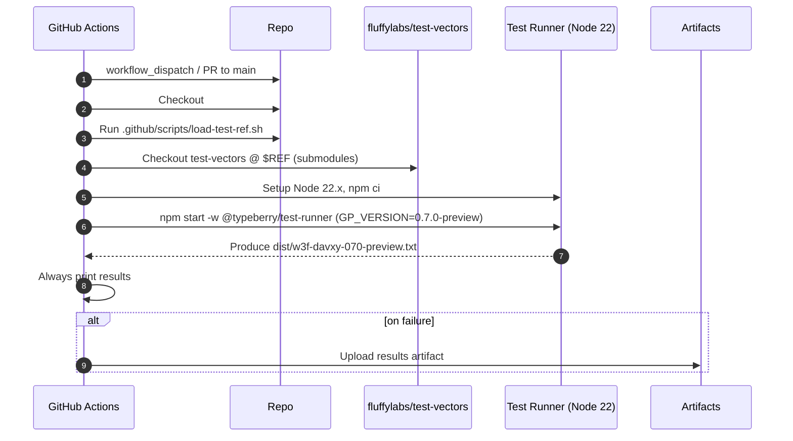
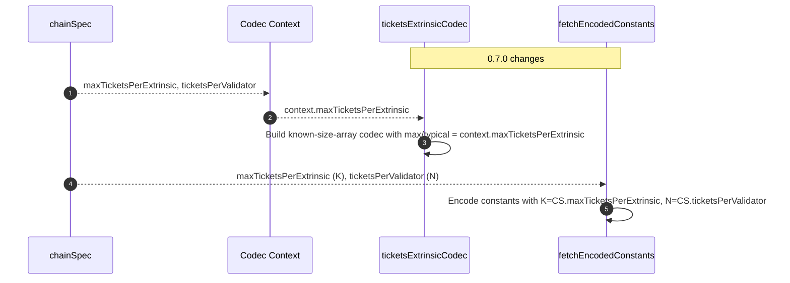

# jam-conformance 0.7.0 test vector runner

## Pull Request by @skoszuta

Currently 22 passing, 10 failing


## Comment by @coderabbitai[bot]

<!-- This is an auto-generated comment: summarize by coderabbit.ai -->
<!-- walkthrough_start -->

<details>
<summary>📝 Walkthrough</summary>

<!-- This is an auto-generated comment: release notes by coderabbit.ai -->

## Summary by CodeRabbit

- New Features
  - Ticket limits are now chain-configurable, deriving from chain settings (max tickets per extrinsic and tickets per validator).
  - Added compatibility for JAM 0.7.0 by adjusting statistics encoding/decoding order based on version.
- Tests
  - Introduced a conformance test runner and CI workflow for JAM 0.7.0 vectors, including automatic result artifacts.
  - Added an npm script to run the 0.7.0 conformance suite locally.
- Chores
  - Updated test vectors reference used in load testing.

<!-- end of auto-generated comment: release notes by coderabbit.ai -->
## Walkthrough
Introduces a 0.7.0 preview JAM conformance workflow and test runner, updates a CI script ref, makes ticket limits context- and chainSpec-driven, removes K/N from gp-constants, version-gates statistics codec field order for 0.7.0+, and sources encoded K/N from chainSpec during externalities fetching.

## Changes
| Cohort / File(s) | Summary |
|---|---|
| **CI: load-test ref update**<br>`.github/scripts/load-test-ref.sh` | Updates REF SHA; continues exporting TEST_VECTORS_REF to GITHUB_ENV. |
| **CI: JAM conformance 0.7.0 workflow**<br>`.github/workflows/vectors-jam-conformance-070.yml` | Adds workflow to run JAM conformance vectors (0.7.0-preview) on self-hosted runner, sets env, checks out vectors, installs Node 22.x deps, runs test-runner, prints and uploads results on failure. |
| **Test runner: 0.7.0 preview wiring**<br>`bin/test-runner/jam-conformance-070-preview.ts`, `bin/test-runner/package.json` | Adds TS entry invoking main with w3f runners and fuzz-reports/0.7.0, with accepted/ignored traces; adds npm script `jam-conformance:0.7.0` with GP_VERSION=0.7.0-preview and TEST_SUITE=w3f-davxy. |
| **Tickets: context-driven limits**<br>`packages/jam/block/tickets.ts` | Replaces fixed MAX_NUMBER_OF_TICKETS=16 with codecWithContext using context.maxTicketsPerExtrinsic for max/typical length; updates TicketsExtrinsicBounds to reference chainSpec.maxTicketsPerExtrinsic; removes MAX_NUMBER_OF_TICKETS export and type. |
| **Constants cleanup**<br>`packages/jam/block/gp-constants.ts` | Removes exports K and N; drops MAX_NUMBER_OF_TICKETS import. |
| **Externalities: encode K/N from chainSpec**<br>`packages/jam/transition/externalities/fetch-externalities.ts` | Stops importing K/N; encodes K from chainSpec.maxTicketsPerExtrinsic and N from chainSpec.ticketsPerValidator; rest unchanged. |
| **Versioned statistics codecs**<br>`packages/jam/state/statistics.ts` | Gates CoreStatistics and ServiceStatistics Codec field order on GpVersion.V0_7_0; for 0.7.0+ moves extrinsicCount before extrinsicSize; older versions keep prior order. |

## Sequence Diagram(s)




## Estimated code review effort
🎯 3 (Moderate) | ⏱️ ~25 minutes

## Poem
> I thump my paws at version cheer,  
> New trails of JAM now crystal-clear.  
> Tickets flex with chain’s decree,  
> Stats reshuffle, 0.7.0 key.  
> CI hums, the vectors run—  
> Carrots cached, results begun.  
> Hop, hop—another merge well done! 🥕✨

</details>

<!-- walkthrough_end -->
<!-- internal state start -->


<!-- DwQgtGAEAqAWCWBnSTIEMB26CuAXA9mAOYCmGJATmriQCaQDG+Ats2bgFyQAOFk+AIwBWJBrngA3EsgEBPRvlqU0AgfFwA6NPEgQAfACgjoCEYDEZyAAUASpETZWaCrKPR1AGxJchaZmCYMADN8CmZMBhJIAAYNAHYNaMgaRFxIKTFQyApsDHI+SAMAOUcBSi4AVgAOACZIQoBVGwAZLlhcXG5EDgB6HqJ1WGwBDSZmHoAxD2wgoNlmlUQe3FluEjKKFx7ubA8PHuq6xsRy+wBrfEQALzw0eoMAZXxsCkjIASoMBlguRDOA/DBULhL4kMDROJJQrQZykNIfCI/SDheBYQoPXDUbDdfhrNEGGwkCTwEgAd0oOIAFBhAVEPEgaLQAJT3BZlDxUmnkSD01J0FmFADCFBI1Do6E4kBq0RqFXBAE5wQAWaAARhqHAAzBrovKAFpGAAi0gYFHg3HEgK4cCitnQtFoyDuKTSGQIfByeUokBCfF8/kCvpBb1iCVikEFLxFGDSLvsmNw2OyJG4oUZKCwuFgUSUiFN5stGC4qvlPDQiEQqKIABpIHEfdp6RgiBpzJZBSw2DHkA4nC4jFA/pcbpjICQAB5+VHiu5BRtV5JUN7UH3YK5XMAi1MUXBLUOJZZL6Q9VVxCoANgqcRq6pqPWiD+iqqquo0QkQgI0MGz8iUNDC070FmUShEoFA9Kk1AMvADDIGQTC0Au5B0Mg2DcLQUHNpAlIikElDwQu7SdN0fQDFmwyjCwPQYRI46yD0/pgC6YBuqESxIA4x7ypqTK1gIeDoEE/7JLAK7fJgpAifhyYolgFSQLkE5rGI4pyCkgnCUoCFVq2BhQAQzDYrQFCkugfziqS2bAXwwHZLk+SQKS5bvCQC4TqIeAWYMY4YMSFCAl2rrOPAKheMg0AAKIPNAAD6DwNAAkpFAC8pKakEYA0XR6AYPQADiVgxQAahFNgPAlADyRTJfusQDucw63Mm27pnGTC5LujCic2C60C8C6olIqTwEQUFWhK/DcqmqJpM+ZYVguPSQFUDbwE2NY8mKfAlvNlZYUt9ZzmtC5oEJ3pBPA44LrSyTSJo34kPIvKtdmq3rbdqQ+mt0iOdmWArs+PRVBwBj1Ppd0saI7pLGlGVZbIAJAmEEQkD0QRrhuW5pnu8QHrgR5LKeF4VEqVTyqq573o+D61G+H4YKDugfbgkOZBQMPpZlaC0QjgbAijaMY5uKbY/euPRIeaCRITZ6XqTcTypT1OPkqdOAoz4OpKz0M9LDXM84jQYC+j67Cy1ONhpL0snrLJNVHE55xFTysVGrDNg8z2tsbrnPw4b/OgoLptYzuFt4wTNvE/LjvO9T55uxrnusezPtw9zdH+8jgcm5jIuh2Llv41Lx5E3L9tKqqscPhU8oJx7zHJxzacG3zWeREHufmwX4fFzLUf29ESvK/Kqvvur9cQ43qf6xnrfBqjOdm6LtVWyXtuk+eMfKw+o/04nDdQ97et+3PxtCyHu7dxLRfW6XdvVJqVc0wnemQAAgmdfA3Rd461gfbNNxnrzQERts7nzzpfFeN81793JkPamtMx5YDKAwPwUQiAijIHxM0PUsIEExByZI+BIA7W4OWPaRBIAHTejpeqQ5rhNQvjOewyl4AXQYMiJA4RcDfAzFJZmq5g4QLDtfCOd95aKyftEXe40lJQ3FCcCgxI3gJUNMgX0jARRinoIo5RP1aDEJpGkbh3wvw2nkPAJQMY2EknoGQhgZw0CkCWP6SWGBKyFh6FLBgjhdhii8QwHxhkPBijAHgNaiANCdVIPkMURQJy4AeJQPRCVaCUhZM5XgihsAMAXLZUk/ksKqJyvQdqHh6BGMgH+SgzBpy/RINZfh/l8BpFQdiKIqBURME2FDDMOw0hZC6aEEUYgUDMG4F4QKY0MC6UHBcBho4jHiizCuXc/oxzjjWGaeCzCskCEmY5bytlEBoIEcnEpyY8LRkiPQTAKAKzYCiGMQKE0iJdF6P0QYFExjUXTvRRip9A4cUeUsTUFQzDAtEJ2dgYBtQVyVKTTUm93gCRWbGRA/oADkyAL6bQceKP8jZZlgEMAYEwUAyD0HwEEHABBiBkGUOmZ57AuC8H4MIKGkgfpyAUGBFQahNDaF0CSsl4AoBwE6U6f6eBCAxMZeKZlMYuBUFMr2cILh3jyAQsoVQ6gtA6H0EYUVpgDAaDIkMAQEF8wWiWB4fAaBaBMQhrhDQiAfgGAAEReoMBYd+CV6WxPTGq5w8hqVdQktIIwDR0LaP4TYCKEwzKViIBgF5qJIBmq+ZavMZobU9DtQ6p1WsXVup9P5ZgPpojpSqCQVUmp5SnVVCQGoaBNRoGlKKEgJAgjngEDUOc8oGBxDJmgUmQQ5oEGWnEEgSpaDRDwheOICL21xFXQIKobbogkHlBUBg5MXyqhLEqAQkQGBBDMa9HNBZ4xrQ8Bs82MAoqxRKoKaAFUyoxXjRMZKAASL9RDIB5SSgACQaAAIRihFIoRUNLelsuQkaqb2AAG5IA0n4I0u1AwGC1koP5Pg3VaDrVrFkQI+N8B3qCHa0y4lmzSF0m2d+Hh/zTOQJO2yWkQlUELMgMNSk0ziiyDsfZMEfLiHEJG1+RRiG0ecQB/jO46DbGGPSDh7B1C/lEFx1jukIrDW4QqxQUQRTEjJGOWYaYuAAFk6DwEcJ671ekTWZvIpa0koQzhUfwKSJYjcwAApAQHSI4JIQaFkMwDwIMvUep9ZYN+/q5XcYUY4dVoaaWyck2/B0To0NmbyuoYDwx35iHgICZA7mKCeeoxNFzFrdYea8z5nofmAtI3niF2I4W70YDQfQD18NIDrMBW8RuMRxYeovVECrVXvOLhGqQdmk1HINeozFRCiAyE8NgBcnYewYoigAI4gtjMQ2StZMD0CUBdcgcFfLwEKS8iQwVQrSGtE+4qEVX3voeJ+hN2FZgA8B0D4HIPQdA94oBwqJUyqVSKNhWqYBeBEhJKSCHF3H3RTiolSK2Fj5/KZF+BKaRPQ5YoV4Qbgglt3BOB4DKsBLjpk9A5Uk3k7jSaUHTKUNQNDjmRNQM045JsU4EPGFM3R6qCmzA454sZXpYw8aEWQrYoA2FyBm81wwrW5svgWx1zES3bcnbr/hcZcL4VBMriMUuLgCQAFJvys2cw+i2gjlp9NMWYsgQkCCWP/aGGZJ0aGWJPZ3TpZdRA26IGx4p/0s6zPYYYzBslhR8i92glukmJm4JAdnJBOc1G57z9HZAXtoe4BW1B3xaFQASu4ghd6lB4isbkn6xI7gYHL4weAGfMQ7hN3dOyXo+Bx+2x3itkE+9gFMgAARWGsDYWx9f2UoJbt+HgnKyGQOtiZaB5AigcMxmQ8heAzQXEH9buBp5+whNERHJmUdRPHJoV+FUsBHWmCKWsaFje2X37sTqF05O5+DIV+fyHWd+yOZIj+aQzkdyzg4gc4oyPWbA9ArWoCwWfsf+h+ukvqa+LGPGAGHGWmzgrG/ANKCm6YQmKmom6mEmiA9U0m96AmVKfAwmqmVSxB3GpW7ijk0kSeiEF0dArY0WA4JqagGAwexay+4EaBQWYIN+EBpmpIUS4uIhuBCWDKSWOiKWIaZB4adG9BBgWWjo6AuWpk0AqwJADw1qaQV6Fo7wqIkhLMTOlADEfgmc7WChSOShKhIkK4LO++phshbcUQi8pu0hhOaQ8A4y2MPI+ARAC2FyskZaLAGaPQzyn474FyLhLubuQesMPQORkS74f8f0GYEg+AZwP0yRI+IMr8RRr8WS0skSsIEgrqqmJAlINQTIr8fu3swR88HcS8+ctURgFUFo3BvGHKYgIMUA3iKYjIXAAA2h6tAogB6gALqvyIahB0DLGMyrFiJniQjyg1C1CVzKyqgXhuwerVgHFrGRyQjng1CnFOzbzkw3F3H1CHG9yRxlwKzwLUwyIYC3H3FHH9wOxvHbyuxIKgnfEPHiL2xbzbzxywlfGQA/G3zrzlwXEuy1xolgm/GIlPFPwjyfGElYn9ybxQnKzAlwkYkInYkPxSJVDknwnglPFIoVxVzPixAElbEGCv4J6BLSCIC1hYZsZy7SD/7pAhRxEJEr5YY4RMioaAhjibChDinxGSlRB4ZZBt7ykLYaB6l8DF5XSdQj68pRBgCqgMaxZMb4GTGEGvScYkEEF8abLMH8CsHUFqbWJ0EMG0hGB6biAGalJGbJhKHma+iSg2aIT2YiFOZgBGDiFOGbjSHbBSyOKkBuxRberqEBryraF9hpb6HOL1TGHMLkCmRj72A2GDbuHDbeC1R8KplL5D6ZkOJOJ55IIKS5Teh2G7hC6DmD7IADEozgHeEP4WneQFQfYw5VQ1TiyKEo4XKRSY7xRJQRSpS+x/LJCIC/wZiKLpinTCS2QTjQRYR448wcAtnsAuBfiMEtLZh8DoxfCFhoB3oZaRJGr2l4GMpOnsYumcGkEektSCY+kiZ+niYkiGFQDWHa72hKC0BcAAAG45oIt54sqFfCqFbZzqGZ9i2ZPZ9MOFuQYEkAqFg5iAqFtYlpT20wUQqFc50O5Ui5COU5Zm65sUm5KU152Uu4vOQeGFwWXh9+UBu4qFum+msa2qkZq53aMZ1mtmCZjmEAyZBgRF3ZLifgPQ+y+ADi/Q3AiMkE3YKheZMWBZiWsawaGqYa359UhISeUgQEr00RLUehVmb8AAGjFEUA0FZmBqVDFBVBMDFNAAlIKAANIRTQAPApEVriD4pDnviW5OX4AuVMGKbhl16YCdRRUXJw6UhTnPCIAeCyBcAFXJSQBeW+X+WBXBWhXhWRUxVxWobo5w7VXdGW6MHVljIPpZAUHii0GwVIV0CoYiiyQLiBCmWdSUgJS1h5QxQLWQAVS4Y8IaAsi5AZbp6/m4HMYAVlbOk5ggXunkGenZXek8C+libqCwWOUkDOXDUXVMplaYhKqQAFWu6pFaXOJuHjD6WGVEDGUzXvVDlzUlXYjlVoUUEKB16fWQDVW1V+UBVBU2AhVhURXRWxUPDIaoUE6vzpWZVDU5WzVcBw7fUVq/XHiuKA1nBGUmVg2RIQ336lXQ2UWw2g056I1Sh40E0GAhnRGyURniWmSKWWY1UqXMAOYxZJlGDU06UA12qGVJVVHg2qH5lxYaGBrJYll6EOWvy17kZ9TSxw00BP5gBoBOQijJAwRq08jRHqBH6ORUDcDcB5KvRnA0ikgYBgCVhXBgjOBUBapGYcKWnaoMAADqgwHYMYCSAGYEXKfO44zQZARA8elNZtCSGg4Q447gyViAVglAEUT+OClYDAQukN6il04o9ItSaQlIyN9VaNGNzV2NcVPNFMLIqAk1GVQhr8NoMAdtDSiAJd+MqI5dYGzwuUyAoNeV9yCkMa6Ymdzoj1O+NAYAAg5Yqk099A2IC4TdqNjVmNLVONAG1OCYomAgu996++JwtyyAHqDw8AAdyxsQowokqIDwykOdaAedw9u4RdFAY9ZdMETIE2A9r0JN11UFt1KwttBdIDE9MEHYWkZZP0K9X044hmWkUV3tGAz9Adb8mwu+5RBl0y59WdFtJe+yODog0dWYsd5taQiB7o8gaKCkJws9gIzDv9/9BdQDSD7iomGiudqdzY8e6Oc+MEn54j6dsAlug9h9DV6NTVWNrV8V0Dc9MYFyTtSaBlIUrUlh6A9IsBNtvdLlluCUMRfeDqyFXAEdDDsATD8dmdQeEdnOk6DgbtaY/CfVZGCSm9294ZaDoNOQJWn4kDUQbBomc+UQ+dato9pdyDHCZGqIIKAGZQWVjItY3tVSZoUgyC7Dr0aEGE6YCTI9Qjk9u9MgN9lIlkME22uEXgYgOpVSsgyBomud0Rjg/NjG/5XBR1QFJ1DA2mZ12TEFMD7BI1kmUAJd4FOiiGWINtpT2iaFqtlTyTwjDAqDogOFO1CVjMqFEdeD3mBDL9JAxDwdlIz9KadAFTmguzOGkAAA3pwhgHI1mFwNELWGI2nV8zVT5SjSo63eozjX/KsDIx4J80iMoy3Wo6fR3QAL61gPNJPj3bNT3kWIBMioWMwEBHOOMx08MJKUiUgBNP4sjJR6CvPJiJgUBYAnP4OEOXMkOyA3OIb3MAMaBPO1hvO1IfP/NIg/PJ0wsOMktP58NouCNbPl0Qvu2oLQtCvitx2Su53SvF2yuiYotD2INasMBYsz0qmQBIu4v1TzNekWOfkw0vVw2fRwvH1t0aOd3nh43msvXihWuRYc22txOAt1VH2qMn3t3xXVVxNhoOtBtOs41uuG1x0MufnoOCR4QlZYQxMMBgCIF5KWFoVotVMwSGuOhkVL3iiYM0DjIhIb1b333vA3371YSRuguIvxWToX04KULX3kUYkstv0aAf3aAEM/3qsAOF2asYvl3gMXqoCnQpudS2R+tkJUBsDCSoXhs0p5v6uFs0V8LnketATGOoUbvjswRSXBkyWvVKDyVmbi07hcDAYjSwAy2iEaUK3/UQQJioyQTiDDSwTmVPtWWaE2U6F2XpbdTlkGAdgigYhQQ/uRJPMXJJJKIwRWGX2wc8uh0Zh3WfkXOLbOBRB5NSDszcHECxpql5TcBFQUjcEaBFTRAxRxAxThgTBZC0f0eMcXIqB92lG6lfBGb0CCHlLekUVupsK7hcCQcocwdJXIA76m0JKgM7PT3wjdq7EbLHsMAsvYRlNoBvxPZrQqDHQrDND2q0C1ipi7bBQrC1juXYy4b6sdgdR2fqcst2fmx8TkVeAueQCjSIAND33GsUYUWEeVhHVI66K6n6uadlC+gRfqcOc6OUjae6eNgGf0hGcmdmf4AWdmhWf9W2fZNilqcKdefycpPxe4Due5SecXO1g+d+f8hfiId6LQffvSf2AIBCRwT2dKcuQxdFcpOacaKscMfRAADU2EWSxIyF5XZn/kU3dAXnuE04gUM3lyy37AeU5Y9XpneXocTnCnq3pX2zJXL1hX3ivilbJAq353wSYom3vn99JGGA0AnwiAVyiAq3gIL3mAb3FI9323AX5S3owXTpVRKYBXvXqnR35dmnZpcXPXxVc3lidAq3k3yPtAi33a63MYq3S35AgU/3j3u3u4rn+X0PMEJ38Pjn6AgSF3Yo13tPt3NAhPdAT3337i73n3z3r373LPzIX4poooNA6SFyz53oWGomk1A7fZO1QuGWybUMvGGA5V/C6bEYGHqIWH9IAd7MgAmATxjhP0tRDVuCZYAg+AjnYHXts+TaTNjURQqIRYSgTehSz+QVjpBUdlZ2n7WOlDPEJEGjNulOlgVelUGwMzNwWQAtciMkiCerOLGUVfuiZPM4XpqB/u+oUSfR+wep9YCoWvuuJfufuofScqE4WFAewVTlJoVJ8cLwfVUeOCghIViUhZ8l8wSFdvNJd6fe6GfzAmfitaQaBPYUANDaiZfZcaaD+iBFTOANAUzWc2NidWkMCz+j8L8FfT+r9z8b/k8acXNb/D9z/j/9fbPldb9r/z/niVdEZWEH8r9H+j8n91f30X/OD3e1imt433AezxKkg1+X06+GHaqh2HGRQQ1AaXJXEgDyhaJ/wFUYBkdk/KUhyOlHIjp+GG6Mcei9QeoAAH4H+TfchK312LZ9pOfLRmNgOwHd8UuEAjTMZwdSH8R+Y/GoOiQoH1BzOfiHLhVRX6X8F+5A1gTZ1Dhv91+1/PgRQL37n9uBO/EQawOwF78e2D/RgeP1EGyDTuQgq/iwNYH8Qqud/V+goOP7MDlB9QF/nsUkEUAP+yg01nwMP4ECW+bfKTh3zIEyD6gVA/TjQPS70C9BT/AwU4J4BZcOBU/UweoMMHE8cQEdHgdIKcEUFQhodcIRoLEGRd7+HjRQd4MiHdcOoag3gT4K0G395BSQ/QXEOwHGCUKpg8wTIK/54tX40fDhAJz3oltihVFQAery0i59GAzfZAKhSa7IcSBHfFofnyzLaU32Rfd9vYN/aSUf+TMKvvUNr5NDRAPNRvm0JubJIuh7fWCHyx4BI9puSnDIdf3WEZV0euQ0Oo/yYG1g8ej1dgBILyFeCThWPfHhty26v8Sh5YRfubG2Gk9BBgQ3fgkN0GXDjhp/cuhcJiFSDzsjPPxDQABFD9khwIoJKCJIB88hBH/SaOz1+7sxwRogI4Sfy+488/u9wkwWEPf5PCTWKpcvonD/4ACoIQAtBiAJYCbZ4AbgqAYgBgFC9KA8AiKIgI8DICKOnvGZBgOiBYDsBeA+YYQM6GRBuhqw15sELR6bD0hHwiITIMlELdEhhwyEcENOErcthng44SqJuFnCYwcIx4WKWCECDl+eI4QQUPqDiD1RJooIT4LkGKiIR+Q4IVENeHBCbuMI1ERXWVE+DXRl3PUSaNKFODMRP3TnpaKVEOifBgYjntiIe64jARZgp4RYL5H1BrBCw4UZJ1a4ODxRPg+UbQHdGxCJRGwhUd8NDFXCtR12HUbgHdHoiUhMg1UXcOjHFC/R8YnwUaOiFaQ8xNo1QTKLNF/CKedotEZ6NSFU8PqVozIU4O9H08Qx9oksV6JBE+icRDY2Mf6JkERjkRH3Scf2LDEBjueQYqMdt3hFNjWB5Qs9qGWFqXtRa0ZCWnGTszS1Ey6leWv0L+quIi4wjTxAkkoA9Y0usFNGA0m+BgA3xCbT8fRjE7/stahZLQgnj1r2UwOszSAETQUSNCCqHVEIQlX4TA1GaeVZAEaIdqpBLccICKLx02G5VuwaGWbPBCMzIACq9bShOJC/pDs/6GrYBvqyPI0AHUehC+uSIRraNn8UAPCQRJR5vUMJJEsWnxOQBw4qJ4aWiWiI2aANKAs/ekGU0GR15RQVKGlOxKSrc0uJPVYhGLz4BcTeMfACXhwk2ywAnQNtHaqhkQm5RuaNQzCZmFeh6SV+MkaXvxDSCJ0pAUke7OkE/IZNM6NEwdmiKib8BCOn5O9GRMd6UJGsFySvAgCwhlBRIxILIFL3TTbVoJu1e0v0yt6kFhmHBQPoMx4Ih9LqYfaZv6XuoC1z2dDK9mLQsy3tJa8ZG8WpRFTGoKUVksNGgBlRgTharAFlNkCtoQTUsmqK0lQF1SCoDUIqclAoFYDqAYoliRAPtkgLkhaAMUCfGkENRNTIAFQOdNIn7TahpQ6UJUBUBJgVASAFQVUBhEPQCBbwqoAQAihIBIkt0pYVaeNOeRTSZpc0pQnQBiiUphUegIAA -->

<!-- internal state end -->
<!-- tips_start -->

---


<sub>Comment `@coderabbitai help` to get the list of available commands and usage tips.</sub>

<!-- tips_end -->


## Comment by @skoszuta

I attempted debugging the issue in fuzz-reports/0.7.0/traces/1756572122/00001809.json.
I figured out that we need to update the order or statistics encoding like in this issue: https://github.com/davxy/jam-test-vectors/issues/93
Unfortunately though that still doesn't fix the problem and there are still 5 bytes left after decoding.


## Comment by @tomusdrw

Are you running with `TEST_SUITE=w3f-davxy GP_VERSION=0.7.0`?


## Comment by @skoszuta

we are currently at 18 passing and 8 failing.

the failing tests:

test-vectors/w3f-davxy-conformance/fuzz-reports/0.7.0/traces/1756548916/00000082.json
test-vectors/w3f-davxy-conformance/fuzz-reports/0.7.0/traces/1756548796/00000004.json
test-vectors/w3f-davxy-conformance/fuzz-reports/0.7.0/traces/1756548767/00000005.json
test-vectors/w3f-davxy-conformance/fuzz-reports/0.7.0/traces/1756548767/00000006.json
test-vectors/w3f-davxy-conformance/fuzz-reports/0.7.0/traces/1756548741/00000059.json
test-vectors/w3f-davxy-conformance/fuzz-reports/0.7.0/traces/1756548706/00000094.json
test-vectors/w3f-davxy-conformance/fuzz-reports/0.7.0/traces/1756548667/00000004.json
test-vectors/w3f-davxy-conformance/fuzz-reports/0.7.0/traces/1756548583/00000008.json


## Comment by @skoszuta

test-vectors/w3f-davxy-conformance/fuzz-reports/0.7.0/traces/1756548916/00000082.json is green now
19 passing, 7 failing


## Comment by @skoszuta

`in fuzz-reports/0.7.0/traces/1756548796/00000004.json` we do not match the expected service ids for created services. `generateNextServiceId()` at packages/jam/transition/accumulate/accumulate-utils.ts is where the wrong id is generated. whether it's from bad input or wrong implementation i wasn't able to figure out.

i saw tsjam had a problem with this test vector as well, but they didn't go into any detail at all (https://github.com/davxy/jam-conformance/issues/35#issuecomment-3241448366)


## Comment by @github-actions[bot]


<details>
<summary>View all</summary>

| File | Benchmark | Ops |  |
|------|-----------|-----|--|
| [bytes/hex-from.ts[0]](../blob/38167dee81f52d028274e3812ff3d469158f4b64//_work/typeberry-runner-5/typeberry/typeberry/benchmarks/bytes/hex-from.ts) | parse hex using `Number` with NaN checking | 110655.4 ±0.73% | 84.85% slower |
| [bytes/hex-from.ts[1]](../blob/38167dee81f52d028274e3812ff3d469158f4b64//_work/typeberry-runner-5/typeberry/typeberry/benchmarks/bytes/hex-from.ts) | parse hex from char codes | 730206.72 ±1.21% | fastest ✅ |
| [bytes/hex-from.ts[2]](../blob/38167dee81f52d028274e3812ff3d469158f4b64//_work/typeberry-runner-5/typeberry/typeberry/benchmarks/bytes/hex-from.ts) | parse hex from string nibbles | 474125.22 ±1.9% | 35.07% slower |
| [math/count-bits-u32.ts[0]](../blob/38167dee81f52d028274e3812ff3d469158f4b64//_work/typeberry-runner-5/typeberry/typeberry/benchmarks/math/count-bits-u32.ts) | standard method | 62458453.59 ±8.15% | 69.42% slower |
| [math/count-bits-u32.ts[1]](../blob/38167dee81f52d028274e3812ff3d469158f4b64//_work/typeberry-runner-5/typeberry/typeberry/benchmarks/math/count-bits-u32.ts) | magic | 204235675.06 ±6.23% | fastest ✅ |
| [math/count-bits-u64.ts[0]](../blob/38167dee81f52d028274e3812ff3d469158f4b64//_work/typeberry-runner-5/typeberry/typeberry/benchmarks/math/count-bits-u64.ts) | standard method | 1036420.73 ±0.64% | 88.94% slower |
| [math/count-bits-u64.ts[1]](../blob/38167dee81f52d028274e3812ff3d469158f4b64//_work/typeberry-runner-5/typeberry/typeberry/benchmarks/math/count-bits-u64.ts) | magic | 9373640.3 ±0.47% | fastest ✅ |
| [hash/index.ts[0]](../blob/38167dee81f52d028274e3812ff3d469158f4b64//_work/typeberry-runner-5/typeberry/typeberry/benchmarks/hash/index.ts) | hash with numeric representation | 164.99 ±0.45% | 31.62% slower |
| [hash/index.ts[1]](../blob/38167dee81f52d028274e3812ff3d469158f4b64//_work/typeberry-runner-5/typeberry/typeberry/benchmarks/hash/index.ts) | hash with string representation | 94.3 ±0.83% | 60.92% slower |
| [hash/index.ts[2]](../blob/38167dee81f52d028274e3812ff3d469158f4b64//_work/typeberry-runner-5/typeberry/typeberry/benchmarks/hash/index.ts) | hash with symbol representation | 151.56 ±1.13% | 37.19% slower |
| [hash/index.ts[3]](../blob/38167dee81f52d028274e3812ff3d469158f4b64//_work/typeberry-runner-5/typeberry/typeberry/benchmarks/hash/index.ts) | hash with uint8 representation | 138.33 ±2.02% | 42.67% slower |
| [hash/index.ts[4]](../blob/38167dee81f52d028274e3812ff3d469158f4b64//_work/typeberry-runner-5/typeberry/typeberry/benchmarks/hash/index.ts) | hash with packed representation | 241.28 ±0.62% | fastest ✅ |
| [hash/index.ts[5]](../blob/38167dee81f52d028274e3812ff3d469158f4b64//_work/typeberry-runner-5/typeberry/typeberry/benchmarks/hash/index.ts) | hash with bigint representation | 186.38 ±0.99% | 22.75% slower |
| [hash/index.ts[6]](../blob/38167dee81f52d028274e3812ff3d469158f4b64//_work/typeberry-runner-5/typeberry/typeberry/benchmarks/hash/index.ts) | hash with uint32 representation | 201.73 ±0.35% | 16.39% slower |
| [math/add_one_overflow.ts[0]](../blob/38167dee81f52d028274e3812ff3d469158f4b64//_work/typeberry-runner-5/typeberry/typeberry/benchmarks/math/add_one_overflow.ts) | add and take modulus | 247686740 ±6.68% | 2.84% slower |
| [math/add_one_overflow.ts[1]](../blob/38167dee81f52d028274e3812ff3d469158f4b64//_work/typeberry-runner-5/typeberry/typeberry/benchmarks/math/add_one_overflow.ts) | condition before calculation | 254913873.27 ±6.51% | fastest ✅ |
| [bytes/hex-to.ts[0]](../blob/38167dee81f52d028274e3812ff3d469158f4b64//_work/typeberry-runner-5/typeberry/typeberry/benchmarks/bytes/hex-to.ts) | number toString + padding | 313955.76 ±0.46% | fastest ✅ |
| [bytes/hex-to.ts[1]](../blob/38167dee81f52d028274e3812ff3d469158f4b64//_work/typeberry-runner-5/typeberry/typeberry/benchmarks/bytes/hex-to.ts) | manual | 14733.5 ±4.41% | 95.31% slower |
| [codec/bigint.compare.ts[0]](../blob/38167dee81f52d028274e3812ff3d469158f4b64//_work/typeberry-runner-5/typeberry/typeberry/benchmarks/codec/bigint.compare.ts) | compare custom | 264614776.38 ±5.78% | fastest ✅ |
| [codec/bigint.compare.ts[1]](../blob/38167dee81f52d028274e3812ff3d469158f4b64//_work/typeberry-runner-5/typeberry/typeberry/benchmarks/codec/bigint.compare.ts) | compare bigint | 260522684.18 ±5.22% | 1.55% slower |
| [codec/bigint.decode.ts[0]](../blob/38167dee81f52d028274e3812ff3d469158f4b64//_work/typeberry-runner-5/typeberry/typeberry/benchmarks/codec/bigint.decode.ts) | decode custom | 167630653.1 ±3.07% | fastest ✅ |
| [codec/bigint.decode.ts[1]](../blob/38167dee81f52d028274e3812ff3d469158f4b64//_work/typeberry-runner-5/typeberry/typeberry/benchmarks/codec/bigint.decode.ts) | decode bigint | 95717169.06 ±2.78% | 42.9% slower |
| [collections/map-set.ts[0]](../blob/38167dee81f52d028274e3812ff3d469158f4b64//_work/typeberry-runner-5/typeberry/typeberry/benchmarks/collections/map-set.ts) | 2 gets + conditional set | 117868.29 ±0.48% | fastest ✅ |
| [collections/map-set.ts[1]](../blob/38167dee81f52d028274e3812ff3d469158f4b64//_work/typeberry-runner-5/typeberry/typeberry/benchmarks/collections/map-set.ts) | 1 get 1 set | 60005.26 ±0.32% | 49.09% slower |
| [logger/index.ts[0]](../blob/38167dee81f52d028274e3812ff3d469158f4b64//_work/typeberry-runner-5/typeberry/typeberry/benchmarks/logger/index.ts) | console.log with string concat | 7817805.42 ±40.16% | fastest ✅ |
| [logger/index.ts[1]](../blob/38167dee81f52d028274e3812ff3d469158f4b64//_work/typeberry-runner-5/typeberry/typeberry/benchmarks/logger/index.ts) | console.log with args | 843480.39 ±84.77% | 89.21% slower |
| [math/mul_overflow.ts[0]](../blob/38167dee81f52d028274e3812ff3d469158f4b64//_work/typeberry-runner-5/typeberry/typeberry/benchmarks/math/mul_overflow.ts) | multiply and bring back to u32 | 199958899.26 ±28.41% | 18.35% slower |
| [math/mul_overflow.ts[1]](../blob/38167dee81f52d028274e3812ff3d469158f4b64//_work/typeberry-runner-5/typeberry/typeberry/benchmarks/math/mul_overflow.ts) | multiply and take modulus | 244904819.89 ±6.86% | fastest ✅ |
| [math/switch.ts[0]](../blob/38167dee81f52d028274e3812ff3d469158f4b64//_work/typeberry-runner-5/typeberry/typeberry/benchmarks/math/switch.ts) | switch | 255517933.33 ±6.02% | fastest ✅ |
| [math/switch.ts[1]](../blob/38167dee81f52d028274e3812ff3d469158f4b64//_work/typeberry-runner-5/typeberry/typeberry/benchmarks/math/switch.ts) | if | 242916355.9 ±6.9% | 4.93% slower |
| [codec/decoding.ts[0]](../blob/38167dee81f52d028274e3812ff3d469158f4b64//_work/typeberry-runner-5/typeberry/typeberry/benchmarks/codec/decoding.ts) | manual decode | 9943930.14 ±1.88% | 92.91% slower |
| [codec/decoding.ts[1]](../blob/38167dee81f52d028274e3812ff3d469158f4b64//_work/typeberry-runner-5/typeberry/typeberry/benchmarks/codec/decoding.ts) | int32array decode | 140211588.39 ±3.99% | fastest ✅ |
| [codec/decoding.ts[2]](../blob/38167dee81f52d028274e3812ff3d469158f4b64//_work/typeberry-runner-5/typeberry/typeberry/benchmarks/codec/decoding.ts) | dataview decode | 130163979.77 ±3.76% | 7.17% slower |
| [codec/encoding.ts[0]](../blob/38167dee81f52d028274e3812ff3d469158f4b64//_work/typeberry-runner-5/typeberry/typeberry/benchmarks/codec/encoding.ts) | manual encode | 1873493.86 ±0.94% | 25.19% slower |
| [codec/encoding.ts[1]](../blob/38167dee81f52d028274e3812ff3d469158f4b64//_work/typeberry-runner-5/typeberry/typeberry/benchmarks/codec/encoding.ts) | int32array encode | 2504351.47 ±1.15% | fastest ✅ |
| [codec/encoding.ts[2]](../blob/38167dee81f52d028274e3812ff3d469158f4b64//_work/typeberry-runner-5/typeberry/typeberry/benchmarks/codec/encoding.ts) | dataview encode | 2478552.6 ±1.16% | 1.03% slower |
| [codec/view_vs_collection.ts[0]](../blob/38167dee81f52d028274e3812ff3d469158f4b64//_work/typeberry-runner-5/typeberry/typeberry/benchmarks/codec/view_vs_collection.ts) | Get first element from Decoded | 18245.52 ±1.51% | 58.35% slower |
| [codec/view_vs_collection.ts[1]](../blob/38167dee81f52d028274e3812ff3d469158f4b64//_work/typeberry-runner-5/typeberry/typeberry/benchmarks/codec/view_vs_collection.ts) | Get first element from View | 43809.55 ±1.52% | fastest ✅ |
| [codec/view_vs_collection.ts[2]](../blob/38167dee81f52d028274e3812ff3d469158f4b64//_work/typeberry-runner-5/typeberry/typeberry/benchmarks/codec/view_vs_collection.ts) | Get 50th element from Decoded | 16972.39 ±2.49% | 61.26% slower |
| [codec/view_vs_collection.ts[3]](../blob/38167dee81f52d028274e3812ff3d469158f4b64//_work/typeberry-runner-5/typeberry/typeberry/benchmarks/codec/view_vs_collection.ts) | Get 50th element from View | 23988 ±2.49% | 45.24% slower |
| [codec/view_vs_collection.ts[4]](../blob/38167dee81f52d028274e3812ff3d469158f4b64//_work/typeberry-runner-5/typeberry/typeberry/benchmarks/codec/view_vs_collection.ts) | Get last element from Decoded | 19089.46 ±2.53% | 56.43% slower |
| [codec/view_vs_collection.ts[5]](../blob/38167dee81f52d028274e3812ff3d469158f4b64//_work/typeberry-runner-5/typeberry/typeberry/benchmarks/codec/view_vs_collection.ts) | Get last element from View | 18920.26 ±2.7% | 56.81% slower |
| [codec/view_vs_object.ts[0]](../blob/38167dee81f52d028274e3812ff3d469158f4b64//_work/typeberry-runner-5/typeberry/typeberry/benchmarks/codec/view_vs_object.ts) | Get the first field from Decoded | 378129.02 ±3.13% | 1.63% slower |
| [codec/view_vs_object.ts[1]](../blob/38167dee81f52d028274e3812ff3d469158f4b64//_work/typeberry-runner-5/typeberry/typeberry/benchmarks/codec/view_vs_object.ts) | Get the first field from View | 88962.86 ±2.27% | 76.86% slower |
| [codec/view_vs_object.ts[2]](../blob/38167dee81f52d028274e3812ff3d469158f4b64//_work/typeberry-runner-5/typeberry/typeberry/benchmarks/codec/view_vs_object.ts) | Get the first field as view from View | 74923.78 ±2.89% | 80.51% slower |
| [codec/view_vs_object.ts[3]](../blob/38167dee81f52d028274e3812ff3d469158f4b64//_work/typeberry-runner-5/typeberry/typeberry/benchmarks/codec/view_vs_object.ts) | Get two fields from Decoded | 310844.73 ±2.02% | 19.14% slower |
| [codec/view_vs_object.ts[4]](../blob/38167dee81f52d028274e3812ff3d469158f4b64//_work/typeberry-runner-5/typeberry/typeberry/benchmarks/codec/view_vs_object.ts) | Get two fields from View | 57129.39 ±1.52% | 85.14% slower |
| [codec/view_vs_object.ts[5]](../blob/38167dee81f52d028274e3812ff3d469158f4b64//_work/typeberry-runner-5/typeberry/typeberry/benchmarks/codec/view_vs_object.ts) | Get two fields from materialized from View | 121595.53 ±1.52% | 68.37% slower |
| [codec/view_vs_object.ts[6]](../blob/38167dee81f52d028274e3812ff3d469158f4b64//_work/typeberry-runner-5/typeberry/typeberry/benchmarks/codec/view_vs_object.ts) | Get two fields as views from View | 70635.17 ±2.75% | 81.62% slower |
| [codec/view_vs_object.ts[7]](../blob/38167dee81f52d028274e3812ff3d469158f4b64//_work/typeberry-runner-5/typeberry/typeberry/benchmarks/codec/view_vs_object.ts) | Get only third field from Decoded | 384406.63 ±1.51% | fastest ✅ |
| [codec/view_vs_object.ts[8]](../blob/38167dee81f52d028274e3812ff3d469158f4b64//_work/typeberry-runner-5/typeberry/typeberry/benchmarks/codec/view_vs_object.ts) | Get only third field from View | 78914.81 ±2.4% | 79.47% slower |
| [codec/view_vs_object.ts[9]](../blob/38167dee81f52d028274e3812ff3d469158f4b64//_work/typeberry-runner-5/typeberry/typeberry/benchmarks/codec/view_vs_object.ts) | Get only third field as view from View | 72897.56 ±0.97% | 81.04% slower |
| [bytes/compare.ts[0]](../blob/38167dee81f52d028274e3812ff3d469158f4b64//_work/typeberry-runner-5/typeberry/typeberry/benchmarks/bytes/compare.ts) | Comparing Uint32 bytes | 16703.83 ±3.37% | fastest ✅ |
| [bytes/compare.ts[1]](../blob/38167dee81f52d028274e3812ff3d469158f4b64//_work/typeberry-runner-5/typeberry/typeberry/benchmarks/bytes/compare.ts) | Comparing raw bytes | 15676.54 ±3.37% | 6.15% slower |
| [hash/blake2b.ts[0]](../blob/38167dee81f52d028274e3812ff3d469158f4b64//_work/typeberry-runner-5/typeberry/typeberry/benchmarks/hash/blake2b.ts) | hasher with simple allocator | 0.04 ±4.33% | 20% slower |
| [hash/blake2b.ts[1]](../blob/38167dee81f52d028274e3812ff3d469158f4b64//_work/typeberry-runner-5/typeberry/typeberry/benchmarks/hash/blake2b.ts) | hasher with page allocator | 0.05 ±3.09% | fastest ✅ |
| [collections/map_vs_sorted.ts[0]](../blob/38167dee81f52d028274e3812ff3d469158f4b64//_work/typeberry-runner-5/typeberry/typeberry/benchmarks/collections/map_vs_sorted.ts) | Map | 228387.14 ±0.04% | fastest ✅ |
| [collections/map_vs_sorted.ts[1]](../blob/38167dee81f52d028274e3812ff3d469158f4b64//_work/typeberry-runner-5/typeberry/typeberry/benchmarks/collections/map_vs_sorted.ts) | Map-array | 103742.91 ±0.03% | 54.58% slower |
| [collections/map_vs_sorted.ts[2]](../blob/38167dee81f52d028274e3812ff3d469158f4b64//_work/typeberry-runner-5/typeberry/typeberry/benchmarks/collections/map_vs_sorted.ts) | Array | 70709.65 ±0.23% | 69.04% slower |
| [collections/map_vs_sorted.ts[3]](../blob/38167dee81f52d028274e3812ff3d469158f4b64//_work/typeberry-runner-5/typeberry/typeberry/benchmarks/collections/map_vs_sorted.ts) | SortedArray | 176228.67 ±0.12% | 22.84% slower |
| [crypto/ed25519.ts[0]](../blob/38167dee81f52d028274e3812ff3d469158f4b64//_work/typeberry-runner-5/typeberry/typeberry/benchmarks/crypto/ed25519.ts) | native crypto | 5.85 ±16.78% | 80.38% slower |
| [crypto/ed25519.ts[1]](../blob/38167dee81f52d028274e3812ff3d469158f4b64//_work/typeberry-runner-5/typeberry/typeberry/benchmarks/crypto/ed25519.ts) | wasm lib | 10.65 ±0.02% | 64.29% slower |
| [crypto/ed25519.ts[2]](../blob/38167dee81f52d028274e3812ff3d469158f4b64//_work/typeberry-runner-5/typeberry/typeberry/benchmarks/crypto/ed25519.ts) | wasm lib batch | 29.82 ±0.56% | fastest ✅ |
</details>


### Benchmarks summary: 63/63 OK ✅

<!-- thollander/actions-comment-pull-request "benchmarks" -->


## Comment by @tomusdrw

should be `w3f-davxy`


## Comment by @tomusdrw

```suggestion
    const isInChain = recentBlocks.has(context.lookupAnchor) || headerChain.isInChain(context.lookupAnchor);
    if (!isInChain) {
```

try this


## Comment by @skoszuta

ah, nice. that does improve the picture. now were at 14 passing and 12 failing


## Comment by @skoszuta

merged in from main!
