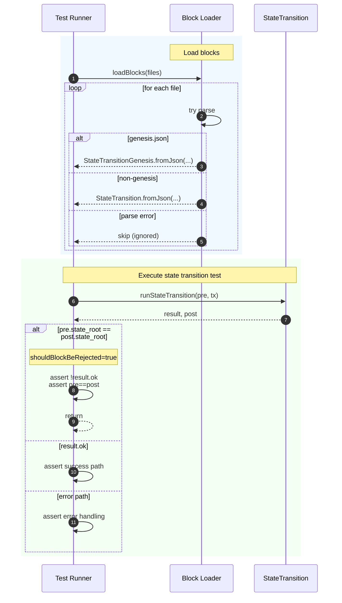

# Fix Work Exec Result Kind

## Pull Request by @tomusdrw

And some extra fixes for running conformance failed cases.


## Comment by @coderabbitai[bot]

<!-- This is an auto-generated comment: summarize by coderabbit.ai -->
<!-- This is an auto-generated comment: skip review by coderabbit.ai -->

> [!IMPORTANT]
> ## Review skipped
> 
> Auto incremental reviews are disabled on this repository.
> 
> Please check the settings in the CodeRabbit UI or the `.coderabbit.yaml` file in this repository. To trigger a single review, invoke the `@coderabbitai review` command.
> 
> You can disable this status message by setting the `reviews.review_status` to `false` in the CodeRabbit configuration file.

<!-- end of auto-generated comment: skip review by coderabbit.ai -->
<!-- walkthrough_start -->

<details>
<summary>📝 Walkthrough</summary>

<!-- This is an auto-generated comment: release notes by coderabbit.ai -->

## Summary by CodeRabbit

* **New Features**
  * Added new execution result statuses for invalid exports and oversized digests, improving diagnostics and compatibility with newer protocol versions.

* **Bug Fixes**
  * Block loading is now resilient: invalid or unreadable block files are skipped without failing the process; genesis blocks continue to load reliably.

* **Tests**
  * Updated state-transition tests to detect and assert rejected blocks with no state changes.
  * Switched state entries comparison to plain objects for clearer, more stable diffs in test outputs.

<!-- end of auto-generated comment: release notes by coderabbit.ai -->
## Walkthrough
Adds per-file try-catch to block loading, adjusts state-transition tests to detect and assert rejected blocks based on unchanged state roots, and updates WorkExecResultKind enum with version-gated variants and shifted discriminants. Also changes StateEntries test-comparison method to return a plain object from entries.

## Changes
| Cohort / File(s) | Summary of changes |
| --- | --- |
| **Test runner: state-transition flow**<br>`bin/test-runner/state-transition/state-transition.ts` | Wraps per-file parsing in try-catch to skip bad blocks; maintains special handling for genesis. Introduces shouldBlockBeRejected when pre and post state roots match; asserts non-ok result and no state change, short-circuiting before other error-path logic. |
| **Work results enum version-gating**<br>`packages/jam/block/work-result.ts` | Adds enum members `incorrectNumberOfExports` and `digestTooBig` gated by `GpVersion.V0_6_7`. Shifts discriminants for `badCode` and `codeOversize` for newer versions. Imports `Compatibility` and `GpVersion`. No other runtime logic changed. |
| **State entries test comparator**<br>`packages/jam/state-merkleization/state-entries.ts` | `[TEST_COMPARE_USING]` now returns `Object.fromEntries(this.entries)` instead of the dictionary, altering the comparison representation to a plain object. |

## Sequence Diagram(s)


## Estimated code review effort
🎯 3 (Moderate) | ⏱️ ~25 minutes

## Poem
> I nibbled through the code so neat,  
> Skipped bad blocks with dancer’s feet.  
> New enums hop by version signs,  
> Roots unchanged? Rejection lines.  
> Entries flattened, crisp and clear—  
> Thump! The tests all draw in near.  
> Another carrot-coded cheer! 🥕🐇

</details>

<!-- walkthrough_end -->
<!-- internal state start -->


<!-- DwQgtGAEAqAWCWBnSTIEMB26CuAXA9mAOYCmGJATmriQCaQDG+Ats2bgFyQAOFk+AIwBWJBrngA3EsgEBPRvlqU0AgfFwA6NPEgQAfACgjoCEYDEZyAAUASpETZWaCrI5Ho6gDYkuAMXgAHpAA6vgUANaQAKIBopA20tieuJAA0vAY9JAGAHKOApRcAKwAHADMkNkAqjYAMlywuLjciBwA9G1E6rDYAhpMzG2+ntgAZqOytSqIbbiy3CQFFC5t3EmebaUV1YiFkATM2Ii0FADulQYAyvjYFAwkkAJUGAywXLi0YKdh4WAksQwLtBnKQUk9MK8uMxtFhspdcNQjlx8AtYQYEhJ4CRTpRWpAABQYfDkSCeJA0WgASguUwKnjxhOJDzJiAp1OyAGEKCRqHR0JxIAAmAAMgqKYGFAE4JQAWaAARjKHDKSpFAC0jAARaQMCjwbjiYlcABEAEFMvYWA9/rgqJBRoFpPawpAKNgMBgMkQFBhRmFoS8HqNtN56Aw0LtEBpjUZ9MZwFAyPR8KMcARiGRlBSFKx2FxePxhKJxFIZPImEoqKp1FodHGTFA4KhUJg04RSOQqNmBmwMAKqOcHE4XI9y4plNXNNpdGBDPHTAY1BhZtJcGA3R7KG1WbywLbMIh1PBiduETQ989D4aMBpcK0DMbHwYLJBTQBJDOd3n0IfQkcpxhYEwUhEFjeJBCOMFPHwBhfmgtBaC9Lh4NoAAhaDYOQIlzlOKgWh4SgwAdbweGcQ8MG9DJ0H2FwwHDXBXg0SAAHFM0PGQMPCZB8Q7aQkA0IREGJakmD7DJsAeAhHgebgyL5U5ukgeFeWgS8j2JVjyHYjRRgoFgACkhKwTB6F49jHk45BnAeXUeWzBTcFgfZYAeMzUBchDKHQC1WxIZgDXkAROMgG09QwQ8GAAbkgIkME/PiOJgrj0G5UiKF2egHKc5SaFUg91JvXSDKM7z6Eckh4AoMAgqSqzUrQbhUSUWgmLfVNZPSr1qOIoMQ0QAAaZyHhq2CUGQeAiCJbl6AyVkeWTVNHL0hSKI0AwoBykgL3y699lXe1oPOBChEg3t+3dTa8vCgqUD7PTaGwe5kEQWAbk8NDONQkgEhEMQ6EGgY1mzCMeG5AB9HcaA0SGSDBvT8BSEgAEdsDQekeHwVkIbPEhoZxuH8AR1rFrdEhBvKvbWXQRBdgoO8hponbjywbkHGSMaYoR/hwkGqQ9QdJ0iXsHHAOAh4YIYW5poJXgSE2kKUbR5BuEx3B5ZM11CZSbloVmyB3VeMWqUGjXuVwW5wpC5xPFkJim2QV5REiVAFgoP0KDYegCndySXJCgJyS6yg9Kq2THNJfAugYQbZdpzEKIZsIJoyNH7Eep7leoJz3c5uLuV+7N92u68oyMcxLFNZIs2Z5ApIppQGE8ZxqBr/hU3+FW6b5F01iC+BAXYI9pDAnImSMKJWXgaFu3HV0SExbEQvGMIBQAWToeBHAfJ91oXWTYLQEC2iENBBhG8I2m+CJ10SZJb3vR8Yxfd94q7Plf2ceQAMNijh/W6IAg0EyHyCmvcyQDwwI4EIPwYiiASGzXA6QLRyHQLQRCCdcDfBiovCQzh4CYDvFwDITBljFjyMwJYAB5UYMRO70w1ohECuBoCE1QhNQaPJXiQCIN+Uc1E+aHmJIBJ2BJiQ21BtIdgkBTguSwMxbgAA1XEzMNAKOFGDAAbGDAA7PwPg5AcQUEpHbFylVIC4JGE6ay1NDyTT5CDMobQZRz0QAsMQkgSDiPxC6MA8p+BYHwO9LyAia7GOyFABIV9wh8n+IHBOiFEC6ininPs5i0YSTxAIBCHJZ4awrCQShISABeDxrHYXMco4kYAlBNXYExXwLoDHBMqZbcq8hoTcH2PgSARRSqQA0S4txJZPGyGijnQJlYKmdWJLXFy8gzYwkTnqLoGBU4VA1jKJi/84APAMWkvUBDxovBGEoSAtAYKOHYC3IRPZ2BWQtIDFuagyRzBvk3YGHoEbXPClsxsfsp50PsCQFIpwQbYG4LQXhUknhdSojk/yTz4AvPkBreRSjplYCkg4RqK8GYhKqTw7MCSknMBSXeX5kBR6i1/rXbpG5xBsAjlHfgeBDynIpmQKBFiJJnJIA6T0Jc+nlTMUcQ+DwqJkArF6NoDdFBdWgsy/EFNWYpAAhTUIERYEMHgUkFIQFMhkgTjrGEz1bSPXNlQTw4iKaIFPiQYxZdnwVyrl2Vudc/YNybq6mZbd/Z0O7nwMB/cQpiXEH/KAURIHMEgGwChXkELNS4AAA2IWEbkYhyFUJoQEOhiAk23UgEmjV4QtU6uSEg2g+aqJJv3uEMVMwT5n04pfH4N8EH33zVlNJljC3wrDvAZ56hbZIGYtyXkFBKEUCiIrTw+I0UtNUeorR2jqQAH5IAVC4L4pN/9I1QNjUsVBibC2MNXCw/AbCiBVqwEWmBAIy2IIyJWgtNa0AHyPo2to58W3X1Zrqjt0jFLcoeEmvtiLkUaBHWOmgE6p0zrnYohdajNE6LXZAZxW75Q7ojVGmNflD3Af1hC78yasm0ByUoa9hbi2ltvo+zIVHX3vukMfU+X7m1RLbf+u8+airRqTWUfNUlQMsH7YOuYkHECjrspQSd07UazvnRixdKGV2QHXb0rggnd24YPcE9JDxwWQopMm/JhTlElMYzR+9dGK2MdrfW1jTako/t+H+u+PH7R6X4zKIT3SRMIvEOJ4dUnoOybgwphD6LBE3mQ8utDAyuC+fHpPaefJ8lzwXucPl7sBQAAkJqwG3jGXeYAjAOY/WxmGYA2ARG8PAIp3zTy7nYHqaQ983CPyda+D8vE34/kcH+L+qYf4gXcH7aAURLjQDBhyShq8rCmhsFEMGVRLhvhyMxPDjlFD+KUjjSNtosRYXwOcM2FsrI8CblRQQBdGBha9vIShRYxA6W84dtriAlUICjK1471JZo0AQr687FBPQYImxueidA8sRlgJqfu15P5nMqsWG2JjUCjadBTQQcc+Sg8xfMIM3mGaIXccSZHcwFhdOogkEhtBgCsjCkQQaqFZA0EQOhQQegZbXYCS9kFikmddWibIRAlIOHjGLB48RaMYNdWVSQWOVzdpHD5DnR5eoSoyKRQ8aJSuFd+wcMsG4mR5WR2DRkBEr3KXdIRi5PgolbSBIOqdvRIUTd8H1bQQ13osd1XFXdRQj06BrTLs/F13zaWk9EF6qPvqO4rwDTwXo4CQ3iDDaBf+68dv0CMyRwtABtSb03ZvzcW8t1b63NsAF18SUio43CMyAk2bQ+8d+zb662VcGNV2r4R6uNevM188f32uecACgEc8LWE+p1j+gfHC2qQNt+WHL0Efk9WS4YAm1UgkFkKz9n0gucCD0H5wtdOwgM+FxRQ/HOT9n4JJiNAhbnsFzeywdv0gk0OoMBPBlvCGW3IWWS8uWXA68iEW8XWu8c4DYIaC0bYr8gBLAZ0XAA4acw4gUY4lYKgagU4dYs4BgcBPY6gYM8AtAiAcM88WIOItA2MzgKQcYRBCY9oDA4wAg8oaAb6ZQMoMowoZQaARQtAowtADAgo2iAgJQ8oDAJQ2igoko8oUh8ogofKDA8ouiTBxBKBpB5BlBwBNBdAYMSYM4egQAA== -->

<!-- internal state end -->
<!-- tips_start -->

---


<details>
<summary>🪧 Tips</summary>

### Chat

There are 3 ways to chat with [CodeRabbit](https://coderabbit.ai?utm_source=oss&utm_medium=github&utm_campaign=FluffyLabs/typeberry&utm_content=583):

- Review comments: Directly reply to a review comment made by CodeRabbit. Example:
  - `I pushed a fix in commit <commit_id>, please review it.`
  - `Open a follow-up GitHub issue for this discussion.`
- Files and specific lines of code (under the "Files changed" tab): Tag `@coderabbitai` in a new review comment at the desired location with your query.
- PR comments: Tag `@coderabbitai` in a new PR comment to ask questions about the PR branch. For the best results, please provide a very specific query, as very limited context is provided in this mode. Examples:
  - `@coderabbitai gather interesting stats about this repository and render them as a table. Additionally, render a pie chart showing the language distribution in the codebase.`
  - `@coderabbitai read the files in the src/scheduler package and generate a class diagram using mermaid and a README in the markdown format.`

### Support

Need help? Create a ticket on our [support page](https://www.coderabbit.ai/contact-us/support) for assistance with any issues or questions.

### CodeRabbit Commands (Invoked using PR/Issue comments)

Type `@coderabbitai help` to get the list of available commands.

### Other keywords and placeholders

- Add `@coderabbitai ignore` or `@coderabbit ignore` anywhere in the PR description to prevent this PR from being reviewed.
- Add `@coderabbitai summary` to generate the high-level summary at a specific location in the PR description.
- Add `@coderabbitai` anywhere in the PR title to generate the title automatically.

### Status, Documentation and Community

- Visit our [Status Page](https://status.coderabbit.ai) to check the current availability of CodeRabbit.
- Visit our [Documentation](https://docs.coderabbit.ai) for detailed information on how to use CodeRabbit.
- Join our [Discord Community](http://discord.gg/coderabbit) to get help, request features, and share feedback.
- Follow us on [X/Twitter](https://twitter.com/coderabbitai) for updates and announcements.

</details>

<!-- tips_end -->


## Comment by @github-actions[bot]


<details>
<summary>View all</summary>

| File | Benchmark | Ops |  |
|------|-----------|-----|--|
| [collections/map-set.ts[0]](../blob/09c3c1f1db98fb80dd02e11483b58b5b4f7384e8//_work/typeberry-runner-4/typeberry/typeberry/benchmarks/collections/map-set.ts) | 2 gets + conditional set | 70325.25 ±0.23% | fastest ✅ |
| [collections/map-set.ts[1]](../blob/09c3c1f1db98fb80dd02e11483b58b5b4f7384e8//_work/typeberry-runner-4/typeberry/typeberry/benchmarks/collections/map-set.ts) | 1 get 1 set | 41509.2 ±0.28% | 40.98% slower |
| [codec/decoding.ts[0]](../blob/09c3c1f1db98fb80dd02e11483b58b5b4f7384e8//_work/typeberry-runner-4/typeberry/typeberry/benchmarks/codec/decoding.ts) | manual decode | 22517878.81 ±0.8% | 88.01% slower |
| [codec/decoding.ts[1]](../blob/09c3c1f1db98fb80dd02e11483b58b5b4f7384e8//_work/typeberry-runner-4/typeberry/typeberry/benchmarks/codec/decoding.ts) | int32array decode | 187747344.82 ±4.88% | fastest ✅ |
| [codec/decoding.ts[2]](../blob/09c3c1f1db98fb80dd02e11483b58b5b4f7384e8//_work/typeberry-runner-4/typeberry/typeberry/benchmarks/codec/decoding.ts) | dataview decode | 180709184.84 ±4.47% | 3.75% slower |
| [codec/encoding.ts[0]](../blob/09c3c1f1db98fb80dd02e11483b58b5b4f7384e8//_work/typeberry-runner-4/typeberry/typeberry/benchmarks/codec/encoding.ts) | manual encode | 2846722.28 ±1.7% | 21.24% slower |
| [codec/encoding.ts[1]](../blob/09c3c1f1db98fb80dd02e11483b58b5b4f7384e8//_work/typeberry-runner-4/typeberry/typeberry/benchmarks/codec/encoding.ts) | int32array encode | 3302342.27 ±1.37% | 8.64% slower |
| [codec/encoding.ts[2]](../blob/09c3c1f1db98fb80dd02e11483b58b5b4f7384e8//_work/typeberry-runner-4/typeberry/typeberry/benchmarks/codec/encoding.ts) | dataview encode | 3614625.7 ±1.47% | fastest ✅ |
| [bytes/hex-from.ts[0]](../blob/09c3c1f1db98fb80dd02e11483b58b5b4f7384e8//_work/typeberry-runner-4/typeberry/typeberry/benchmarks/bytes/hex-from.ts) | parse hex using `Number` with NaN checking | 125748.75 ±1.05% | 83.72% slower |
| [bytes/hex-from.ts[1]](../blob/09c3c1f1db98fb80dd02e11483b58b5b4f7384e8//_work/typeberry-runner-4/typeberry/typeberry/benchmarks/bytes/hex-from.ts) | parse hex from char codes | 772625.12 ±1.16% | fastest ✅ |
| [bytes/hex-from.ts[2]](../blob/09c3c1f1db98fb80dd02e11483b58b5b4f7384e8//_work/typeberry-runner-4/typeberry/typeberry/benchmarks/bytes/hex-from.ts) | parse hex from string nibbles | 461494.93 ±1.16% | 40.27% slower |
| [bytes/hex-to.ts[0]](../blob/09c3c1f1db98fb80dd02e11483b58b5b4f7384e8//_work/typeberry-runner-4/typeberry/typeberry/benchmarks/bytes/hex-to.ts) | number toString + padding | 260525.23 ±1.02% | fastest ✅ |
| [bytes/hex-to.ts[1]](../blob/09c3c1f1db98fb80dd02e11483b58b5b4f7384e8//_work/typeberry-runner-4/typeberry/typeberry/benchmarks/bytes/hex-to.ts) | manual | 12877.99 ±1.74% | 95.06% slower |
| [codec/bigint.compare.ts[0]](../blob/09c3c1f1db98fb80dd02e11483b58b5b4f7384e8//_work/typeberry-runner-4/typeberry/typeberry/benchmarks/codec/bigint.compare.ts) | compare custom | 199582550.66 ±7.49% | 3.15% slower |
| [codec/bigint.compare.ts[1]](../blob/09c3c1f1db98fb80dd02e11483b58b5b4f7384e8//_work/typeberry-runner-4/typeberry/typeberry/benchmarks/codec/bigint.compare.ts) | compare bigint | 206067489.92 ±6.97% | fastest ✅ |
| [codec/bigint.decode.ts[0]](../blob/09c3c1f1db98fb80dd02e11483b58b5b4f7384e8//_work/typeberry-runner-4/typeberry/typeberry/benchmarks/codec/bigint.decode.ts) | decode custom | 169560222.47 ±4.62% | fastest ✅ |
| [codec/bigint.decode.ts[1]](../blob/09c3c1f1db98fb80dd02e11483b58b5b4f7384e8//_work/typeberry-runner-4/typeberry/typeberry/benchmarks/codec/bigint.decode.ts) | decode bigint | 66556332 ±8.95% | 60.75% slower |
| [hash/index.ts[0]](../blob/09c3c1f1db98fb80dd02e11483b58b5b4f7384e8//_work/typeberry-runner-4/typeberry/typeberry/benchmarks/hash/index.ts) | hash with numeric representation | 158.7 ±1.04% | 20.8% slower |
| [hash/index.ts[1]](../blob/09c3c1f1db98fb80dd02e11483b58b5b4f7384e8//_work/typeberry-runner-4/typeberry/typeberry/benchmarks/hash/index.ts) | hash with string representation | 101.13 ±1.09% | 49.53% slower |
| [hash/index.ts[2]](../blob/09c3c1f1db98fb80dd02e11483b58b5b4f7384e8//_work/typeberry-runner-4/typeberry/typeberry/benchmarks/hash/index.ts) | hash with symbol representation | 145.63 ±0.86% | 27.32% slower |
| [hash/index.ts[3]](../blob/09c3c1f1db98fb80dd02e11483b58b5b4f7384e8//_work/typeberry-runner-4/typeberry/typeberry/benchmarks/hash/index.ts) | hash with uint8 representation | 130.82 ±0.96% | 34.71% slower |
| [hash/index.ts[4]](../blob/09c3c1f1db98fb80dd02e11483b58b5b4f7384e8//_work/typeberry-runner-4/typeberry/typeberry/benchmarks/hash/index.ts) | hash with packed representation | 200.38 ±1.02% | fastest ✅ |
| [hash/index.ts[5]](../blob/09c3c1f1db98fb80dd02e11483b58b5b4f7384e8//_work/typeberry-runner-4/typeberry/typeberry/benchmarks/hash/index.ts) | hash with bigint representation | 135.52 ±0.86% | 32.37% slower |
| [hash/index.ts[6]](../blob/09c3c1f1db98fb80dd02e11483b58b5b4f7384e8//_work/typeberry-runner-4/typeberry/typeberry/benchmarks/hash/index.ts) | hash with uint32 representation | 168.16 ±0.31% | 16.08% slower |
| [logger/index.ts[0]](../blob/09c3c1f1db98fb80dd02e11483b58b5b4f7384e8//_work/typeberry-runner-4/typeberry/typeberry/benchmarks/logger/index.ts) | console.log with string concat | 6283974.45 ±55.23% | fastest ✅ |
| [logger/index.ts[1]](../blob/09c3c1f1db98fb80dd02e11483b58b5b4f7384e8//_work/typeberry-runner-4/typeberry/typeberry/benchmarks/logger/index.ts) | console.log with args | 1419061 ±102.12% | 77.42% slower |
| [math/add_one_overflow.ts[0]](../blob/09c3c1f1db98fb80dd02e11483b58b5b4f7384e8//_work/typeberry-runner-4/typeberry/typeberry/benchmarks/math/add_one_overflow.ts) | add and take modulus | 221907494.74 ±5.85% | 13.41% slower |
| [math/add_one_overflow.ts[1]](../blob/09c3c1f1db98fb80dd02e11483b58b5b4f7384e8//_work/typeberry-runner-4/typeberry/typeberry/benchmarks/math/add_one_overflow.ts) | condition before calculation | 256266294.6 ±6.14% | fastest ✅ |
| [math/count-bits-u32.ts[0]](../blob/09c3c1f1db98fb80dd02e11483b58b5b4f7384e8//_work/typeberry-runner-4/typeberry/typeberry/benchmarks/math/count-bits-u32.ts) | standard method | 74335548.64 ±2.37% | 67.68% slower |
| [math/count-bits-u32.ts[1]](../blob/09c3c1f1db98fb80dd02e11483b58b5b4f7384e8//_work/typeberry-runner-4/typeberry/typeberry/benchmarks/math/count-bits-u32.ts) | magic | 230016472.14 ±5.86% | fastest ✅ |
| [math/count-bits-u64.ts[0]](../blob/09c3c1f1db98fb80dd02e11483b58b5b4f7384e8//_work/typeberry-runner-4/typeberry/typeberry/benchmarks/math/count-bits-u64.ts) | standard method | 944588.88 ±2.92% | 85.59% slower |
| [math/count-bits-u64.ts[1]](../blob/09c3c1f1db98fb80dd02e11483b58b5b4f7384e8//_work/typeberry-runner-4/typeberry/typeberry/benchmarks/math/count-bits-u64.ts) | magic | 6556786.75 ±6.16% | fastest ✅ |
| [math/mul_overflow.ts[0]](../blob/09c3c1f1db98fb80dd02e11483b58b5b4f7384e8//_work/typeberry-runner-4/typeberry/typeberry/benchmarks/math/mul_overflow.ts) | multiply and bring back to u32 | 258815563.13 ±5.04% | fastest ✅ |
| [math/mul_overflow.ts[1]](../blob/09c3c1f1db98fb80dd02e11483b58b5b4f7384e8//_work/typeberry-runner-4/typeberry/typeberry/benchmarks/math/mul_overflow.ts) | multiply and take modulus | 244884640.76 ±6.59% | 5.38% slower |
| [math/switch.ts[0]](../blob/09c3c1f1db98fb80dd02e11483b58b5b4f7384e8//_work/typeberry-runner-4/typeberry/typeberry/benchmarks/math/switch.ts) | switch | 235915372.03 ±8.25% | fastest ✅ |
| [math/switch.ts[1]](../blob/09c3c1f1db98fb80dd02e11483b58b5b4f7384e8//_work/typeberry-runner-4/typeberry/typeberry/benchmarks/math/switch.ts) | if | 221369686.09 ±8.37% | 6.17% slower |
| [codec/view_vs_collection.ts[0]](../blob/09c3c1f1db98fb80dd02e11483b58b5b4f7384e8//_work/typeberry-runner-4/typeberry/typeberry/benchmarks/codec/view_vs_collection.ts) | Get first element from Decoded | 23658.09 ±4.04% | 63.32% slower |
| [codec/view_vs_collection.ts[1]](../blob/09c3c1f1db98fb80dd02e11483b58b5b4f7384e8//_work/typeberry-runner-4/typeberry/typeberry/benchmarks/codec/view_vs_collection.ts) | Get first element from View | 64491.84 ±1.67% | fastest ✅ |
| [codec/view_vs_collection.ts[2]](../blob/09c3c1f1db98fb80dd02e11483b58b5b4f7384e8//_work/typeberry-runner-4/typeberry/typeberry/benchmarks/codec/view_vs_collection.ts) | Get 50th element from Decoded | 21537.37 ±3.12% | 66.6% slower |
| [codec/view_vs_collection.ts[3]](../blob/09c3c1f1db98fb80dd02e11483b58b5b4f7384e8//_work/typeberry-runner-4/typeberry/typeberry/benchmarks/codec/view_vs_collection.ts) | Get 50th element from View | 29275.66 ±2.11% | 54.61% slower |
| [codec/view_vs_collection.ts[4]](../blob/09c3c1f1db98fb80dd02e11483b58b5b4f7384e8//_work/typeberry-runner-4/typeberry/typeberry/benchmarks/codec/view_vs_collection.ts) | Get last element from Decoded | 20091.39 ±2.2% | 68.85% slower |
| [codec/view_vs_collection.ts[5]](../blob/09c3c1f1db98fb80dd02e11483b58b5b4f7384e8//_work/typeberry-runner-4/typeberry/typeberry/benchmarks/codec/view_vs_collection.ts) | Get last element from View | 17058.84 ±1.82% | 73.55% slower |
| [codec/view_vs_object.ts[0]](../blob/09c3c1f1db98fb80dd02e11483b58b5b4f7384e8//_work/typeberry-runner-4/typeberry/typeberry/benchmarks/codec/view_vs_object.ts) | Get the first field from Decoded | 304276.14 ±2.8% | 25.43% slower |
| [codec/view_vs_object.ts[1]](../blob/09c3c1f1db98fb80dd02e11483b58b5b4f7384e8//_work/typeberry-runner-4/typeberry/typeberry/benchmarks/codec/view_vs_object.ts) | Get the first field from View | 82388.92 ±2.11% | 79.81% slower |
| [codec/view_vs_object.ts[2]](../blob/09c3c1f1db98fb80dd02e11483b58b5b4f7384e8//_work/typeberry-runner-4/typeberry/typeberry/benchmarks/codec/view_vs_object.ts) | Get the first field as view from View | 95705.3 ±1.29% | 76.55% slower |
| [codec/view_vs_object.ts[3]](../blob/09c3c1f1db98fb80dd02e11483b58b5b4f7384e8//_work/typeberry-runner-4/typeberry/typeberry/benchmarks/codec/view_vs_object.ts) | Get two fields from Decoded | 408059.98 ±1.04% | fastest ✅ |
| [codec/view_vs_object.ts[4]](../blob/09c3c1f1db98fb80dd02e11483b58b5b4f7384e8//_work/typeberry-runner-4/typeberry/typeberry/benchmarks/codec/view_vs_object.ts) | Get two fields from View | 60228.33 ±2.64% | 85.24% slower |
| [codec/view_vs_object.ts[5]](../blob/09c3c1f1db98fb80dd02e11483b58b5b4f7384e8//_work/typeberry-runner-4/typeberry/typeberry/benchmarks/codec/view_vs_object.ts) | Get two fields from materialized from View | 107850.64 ±4.47% | 73.57% slower |
| [codec/view_vs_object.ts[6]](../blob/09c3c1f1db98fb80dd02e11483b58b5b4f7384e8//_work/typeberry-runner-4/typeberry/typeberry/benchmarks/codec/view_vs_object.ts) | Get two fields as views from View | 54250.76 ±1.92% | 86.71% slower |
| [codec/view_vs_object.ts[7]](../blob/09c3c1f1db98fb80dd02e11483b58b5b4f7384e8//_work/typeberry-runner-4/typeberry/typeberry/benchmarks/codec/view_vs_object.ts) | Get only third field from Decoded | 286085.7 ±1.71% | 29.89% slower |
| [codec/view_vs_object.ts[8]](../blob/09c3c1f1db98fb80dd02e11483b58b5b4f7384e8//_work/typeberry-runner-4/typeberry/typeberry/benchmarks/codec/view_vs_object.ts) | Get only third field from View | 67961.8 ±1.3% | 83.35% slower |
| [codec/view_vs_object.ts[9]](../blob/09c3c1f1db98fb80dd02e11483b58b5b4f7384e8//_work/typeberry-runner-4/typeberry/typeberry/benchmarks/codec/view_vs_object.ts) | Get only third field as view from View | 74677.53 ±0.86% | 81.7% slower |
| [bytes/compare.ts[0]](../blob/09c3c1f1db98fb80dd02e11483b58b5b4f7384e8//_work/typeberry-runner-4/typeberry/typeberry/benchmarks/bytes/compare.ts) | Comparing Uint32 bytes | 16000.51 ±4.21% | fastest ✅ |
| [bytes/compare.ts[1]](../blob/09c3c1f1db98fb80dd02e11483b58b5b4f7384e8//_work/typeberry-runner-4/typeberry/typeberry/benchmarks/bytes/compare.ts) | Comparing raw bytes | 12677.7 ±4.44% | 20.77% slower |
| [hash/blake2b.ts[0]](../blob/09c3c1f1db98fb80dd02e11483b58b5b4f7384e8//_work/typeberry-runner-4/typeberry/typeberry/benchmarks/hash/blake2b.ts) | hasher with simple allocator | 0.0409 ±5.94% | 0.49% slower |
| [hash/blake2b.ts[1]](../blob/09c3c1f1db98fb80dd02e11483b58b5b4f7384e8//_work/typeberry-runner-4/typeberry/typeberry/benchmarks/hash/blake2b.ts) | hasher with page allocator | 0.0411 ±6.25% | fastest ✅ |
| [collections/map_vs_sorted.ts[0]](../blob/09c3c1f1db98fb80dd02e11483b58b5b4f7384e8//_work/typeberry-runner-4/typeberry/typeberry/benchmarks/collections/map_vs_sorted.ts) | Map | 205333.78 ±1.82% | fastest ✅ |
| [collections/map_vs_sorted.ts[1]](../blob/09c3c1f1db98fb80dd02e11483b58b5b4f7384e8//_work/typeberry-runner-4/typeberry/typeberry/benchmarks/collections/map_vs_sorted.ts) | Map-array | 100239.2 ±0.33% | 51.18% slower |
| [collections/map_vs_sorted.ts[2]](../blob/09c3c1f1db98fb80dd02e11483b58b5b4f7384e8//_work/typeberry-runner-4/typeberry/typeberry/benchmarks/collections/map_vs_sorted.ts) | Array | 60052.29 ±2.25% | 70.75% slower |
| [collections/map_vs_sorted.ts[3]](../blob/09c3c1f1db98fb80dd02e11483b58b5b4f7384e8//_work/typeberry-runner-4/typeberry/typeberry/benchmarks/collections/map_vs_sorted.ts) | SortedArray | 190401.02 ±0.61% | 7.27% slower |
| [crypto/ed25519.ts[0]](../blob/09c3c1f1db98fb80dd02e11483b58b5b4f7384e8//_work/typeberry-runner-4/typeberry/typeberry/benchmarks/crypto/ed25519.ts) | native crypto | 5.42 ±16.77% | 79.59% slower |
| [crypto/ed25519.ts[1]](../blob/09c3c1f1db98fb80dd02e11483b58b5b4f7384e8//_work/typeberry-runner-4/typeberry/typeberry/benchmarks/crypto/ed25519.ts) | wasm lib | 9.01 ±3.29% | 66.08% slower |
| [crypto/ed25519.ts[2]](../blob/09c3c1f1db98fb80dd02e11483b58b5b4f7384e8//_work/typeberry-runner-4/typeberry/typeberry/benchmarks/crypto/ed25519.ts) | wasm lib batch | 26.56 ±2.77% | fastest ✅ |
</details>


### Benchmarks summary: 63/63 OK ✅

<!-- thollander/actions-comment-pull-request "benchmarks" -->


## Comment by @coderabbitai[bot]

_⚠️ Potential issue_

**The try/catch does not cover JSON.parse; malformed JSON still aborts loadBlocks.**

JSON.parse is outside the try, so a single bad file explodes the whole run rather than being ignored as intended. Move JSON.parse inside the try and optionally log which file was skipped.


Apply this diff:

```diff
-    const parsed = JSON.parse(data);
-    try {
+    try {
+      const parsed = JSON.parse(data);
       if (file.endsWith("genesis.json")) {
         const content = parseFromJson(parsed, StateTransitionGenesis.fromJson);
         const genesisBlock = Block.create({ header: content.header, extrinsic: emptyBlock().extrinsic });
         blocks.push(genesisBlock);
       } else {
         const content = parseFromJson(parsed, StateTransition.fromJson);
         blocks.push(content.block);
       }
-    } catch {
-      // some blocks might be invalid, but that's fine. We just ignore them.
+    } catch (e) {
+      // some blocks might be invalid, but that's fine. We just ignore them.
+      // Optional: uncomment for easier debugging in conformance runs.
+      // console.warn(`[loadBlocks] Skipping ${file}:`, e);
     }
```

<!-- suggestion_start -->

<details>
<summary>📝 Committable suggestion</summary>

> ‼️ **IMPORTANT**
> Carefully review the code before committing. Ensure that it accurately replaces the highlighted code, contains no missing lines, and has no issues with indentation. Thoroughly test & benchmark the code to ensure it meets the requirements.

```suggestion
    try {
      const parsed = JSON.parse(data);
      if (file.endsWith("genesis.json")) {
        const content = parseFromJson(parsed, StateTransitionGenesis.fromJson);
        const genesisBlock = Block.create({
          header: content.header,
          extrinsic: emptyBlock().extrinsic
        });
        blocks.push(genesisBlock);
      } else {
        const content = parseFromJson(parsed, StateTransition.fromJson);
        blocks.push(content.block);
      }
    } catch (e) {
      // some blocks might be invalid, but that's fine. We just ignore them.
      // Optional: uncomment for easier debugging in conformance runs.
      // console.warn(`[loadBlocks] Skipping ${file}:`, e);
    }
```

</details>

<!-- suggestion_end -->

<details>
<summary>🤖 Prompt for AI Agents</summary>

```
In bin/test-runner/state-transition/state-transition.ts around lines 69 to 80,
the current code calls JSON.parse outside the try block so a malformed JSON file
will throw and abort loadBlocks; move the JSON.parse call inside the try so
parseFromJson and subsequent logic are protected, and in the catch log or note
which filename was skipped (or at least include the file variable in the catch)
and continue so a single bad file does not stop processing.
```

</details>

<!-- fingerprinting:phantom:medusa:chinchilla -->

<!-- This is an auto-generated comment by CodeRabbit -->
