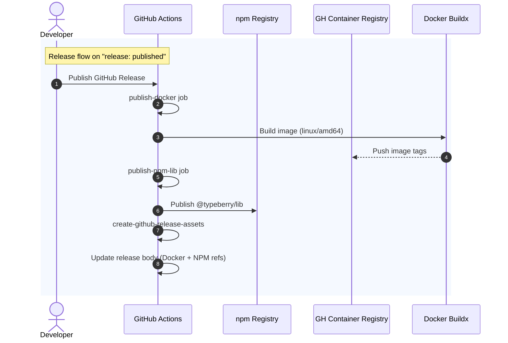
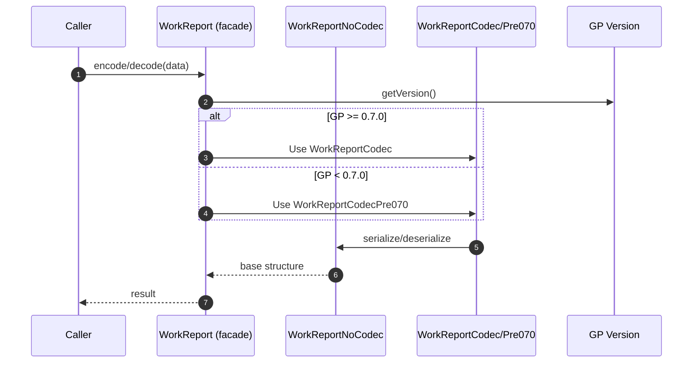

# Build & release

## Pull Request by @tomusdrw

1. [x] Docker build & publish to github registry
2. [x] Cleanup libraries stuff - one big library that will follow the same release pattern. Additionally hash-tagged versions will be released.
3. [x] Remove binary-builder (it doesn't work anyway, looking into `@vercel/ncc` as an alternative).  


## Comment by @coderabbitai[bot]

<!-- This is an auto-generated comment: summarize by coderabbit.ai -->
<!-- This is an auto-generated comment: skip review by coderabbit.ai -->

> [!IMPORTANT]
> ## Review skipped
> 
> Auto incremental reviews are disabled on this repository.
> 
> Please check the settings in the CodeRabbit UI or the `.coderabbit.yaml` file in this repository. To trigger a single review, invoke the `@coderabbitai review` command.
> 
> You can disable this status message by setting the `reviews.review_status` to `false` in the CodeRabbit configuration file.

<!-- end of auto-generated comment: skip review by coderabbit.ai -->
<!-- walkthrough_start -->

<details>
<summary>📝 Walkthrough</summary>

<!-- This is an auto-generated comment: release notes by coderabbit.ai -->

## Summary by CodeRabbit

- New Features
  - Added Docker support with a lightweight runtime and startup script for running the app in containers.

- Documentation
  - Updated README with Docker build/run instructions and refreshed implementation status.

- Chores
  - Introduced automated workflows for Docker builds, release preparation, and publishing (images and npm package) with caching and basic image testing.
  - Replaced legacy publish jobs with a unified release pipeline and updated the library publish workflow.
  - Simplified build configuration and workspace structure; added .dockerignore and minor lint ignore updates.

<!-- end of auto-generated comment: release notes by coderabbit.ai -->
## Walkthrough
Introduces Docker support and related CI workflows, adds a new @typeberry/lib workspace and barrel, removes the legacy typeberry-builder, adjusts monorepo scripts/workspaces, modifies release/publish pipelines, refactors WorkReport codec structure, trims public re-exports in several packages, tweaks erasure-coding checks, and performs minor worker and config updates.

## Changes
| Cohort / File(s) | Summary |
| --- | --- |
| **Docker assets**<br>`Dockerfile`, `.dockerignore`, `docker-start.sh`, `README.md` | Added multi-stage Dockerfile and start script; new `.dockerignore`; README gains Docker run instructions. |
| **CI: Docker build and release**<br>`.github/workflows/docker-build.yml`, `.github/workflows/release.yml` | New workflows to build/test Docker on PRs and to publish Docker/NPM on release, with metadata/tagging and release notes augmentation. |
| **CI: Release preparation**<br>`.github/workflows/prepare-release.yml` | New workflow to calculate/set versions across workspaces, update internal deps, open PR, and draft release with notes. |
| **CI: Publish workflow updates**<br>`.github/workflows/publish-typeberry-lib.yml` | Renamed job and steps; build now targets `@typeberry/lib`; publish path/tag updated. |
| **CI: Removed publish workflows**<br>`.github/workflows/publish-block.yml`, `.github/workflows/publish-codec.yml`, `.github/workflows/publish-pvm.yml`, `.github/workflows/publish-state.yml` | Deleted multiple package-specific publish pipelines. |
| **CI: Source build tweak**<br>`.github/workflows/src-build.yml` | Simplified build to `npm run build -w @typeberry/lib`. |
| **New library workspace**<br>`bin/lib/index.ts`, `bin/lib/package.json` | Added `@typeberry/lib` with a barrel re-exporting many `@typeberry/*` namespaces and its package manifest. |
| **Monorepo config**<br>`package.json`, `eslint.config.mjs` | Added `bin/lib` workspace; removed `tools/typeberry-builder`; dropped `build-binary` and `start:prod` scripts; expanded ESLint ignores. |
| **Remove legacy builder**<br>`tools/typeberry-builder/*` (entry.ts, index.ts, package.json, tsconfig*.json, webpack.config.ts) | Deleted custom builder CLI, webpack-based build script, configs, and manifest. |
| **Builder tool dep bump**<br>`tools/builder/package.json` | Updated `rollup-plugin-dts` from `^6.1.1` to `^6.2.3`. |
| **API surface trims (re-exports)**<br>`packages/core/codec/index.ts`, `packages/core/trie/index.ts`, `packages/jam/block/index.ts`, `packages/jam/state-merkleization/index.ts` | Removed various re-exports (notably `@typeberry/bytes`, others) reducing public barrels. |
| **Package build script removals**<br>`packages/core/codec/package.json`, `packages/core/trie/package.json`, `packages/core/pvm-interpreter/package.json`, `packages/jam/block/package.json`, `packages/jam/jam-host-calls/package.json`, `packages/jam/state-merkleization/package.json` | Deleted `build` scripts; other scripts unchanged. |
| **PVM adapter version**<br>`packages/core/pvm-debugger-adapter/package.json` | Version set to `0.0.1` (from `0.1.0`). |
| **WorkReport refactor**<br>`packages/jam/block/work-report.ts` | Introduced `WorkReportNoCodec`; `WorkReport` now extends it and hosts runtime codec selector; codecs target the no-codec base. |
| **Erasure coding checks**<br>`packages/core/erasure-coding/erasure-coding.ts` | Commented out two invariant checks; no other logic changes. |
| **State-merkleization types**<br>`packages/jam/state-merkleization/state-entries.ts` | Switched `BytesBlob` to type-only import from `@typeberry/bytes`. |
| **Workers cleanup**<br>`workers/block-generator/index.ts`, `workers/importer/index.ts` | Inlined bootstrap URL construction; behavior unchanged. |

## Sequence Diagram(s)




## Estimated code review effort
🎯 4 (Complex) | ⏱️ ~60 minutes

## Poem
> I built a burrow in Docker’s light,  
> Packed my carrots slim and tight.  
> Hopped through releases, tags in tow,  
> Trimmed the hedges where re-exports grow.  
> With codecs picked by version moon,  
> I thump—“ship it!”—coming soon. 🥕🚀

</details>

<!-- walkthrough_end -->
<!-- internal state start -->


<!-- DwQgtGAEAqAWCWBnSTIEMB26CuAXA9mAOYCmGJATmriQCaQDG+Ats2bgFyQAOFk+AIwBWJBrngA3EsgEBPRvlqU0AgfFwA6NPEgQAfACgjoCEYDEZyAAUASpETZWaCrKPR1AGxJcAQtnge9ABkkBQkXmiIJJCQBgByjgKUXACsABwALJCAKASQsLi43IgcAPQlROqw2AIaTMwlAGIe2ABmLbIAMiqIJbiy3CRJFC4l3NgeHiXpWbEAqlEUXATM2Ii0FADuMQYAyvjYFAzRAlQYDLBLtGC0+AwA1pSQgEmEMM6kuJAnmOdczNpYsR2uGoqy4+AGAIMAGEwtQ6OhOJAAEwABiRKTAKIAnJiMtAkUiOASOBk0gAtIwAEWkDAo8G44nwWAAFC00GJkEyPLIAJQcAxQACCtFoyEptwefAE/kC6Aw9DGAg8SFgkAIkAA4uoABLVSA2EgVRC4FyQZnnUQPeiRBTMbheGi0HkaAWQKERDDIbDcSDKr506QoDDqtD2eAYIheX1vR5+qim3CwaiQDYBDyQFr4Cb4LaJ6KINBsULhEiRaLcag0CgYADceUi+TQRFI9CkFEQ8CZyFTE0+0TCESi9HNsEt8JtdXtJEdztdBuY+CkMnDzlkYGlASUfGZGHwjvQyF3GDAG3wFDu4aIPLraDwsDPKGQ4aX4iI1EvkAAAm2jpMzgwDzldAPCrDB3ykM0LXucdkEnB06FnAUwEMAwTCgMh6HwFocAIYgyGUfc6jYYMuF4fhhFEcQl0+eQmC3FQ1E0bRdGQ1DwCgOBUFQTAcMIUhyCoQiWGIxEqC2BwnFNOQFHo1R1C0HR9CMNjTAMDQbmgukiF3MJ+QAIgMgwLEgQUAEk8IEuF6Akv5TSwxgkwjaQ3FHHgKEXeAlHoWh4DaIMTUUbAjmQUNyC2AADdSJUoeBtLPEhwozAJokTZNEAGBhfPgQMKwKShPTVfBIBIAAPBhmiURhKGBcMkq8EL5UgHywjEM9suQFp3OYPsP3DcrsC8oM1Vc8VNJQP5SE+GV6CYYNSs0GBXJaZKFDbEKU08/tMEm+yiKZJr4BaggAwa+hlqjPoBmQVKPmcFL+ngBg0AmeRYp0+FatDOJFBIDQhEQdcywVdyRDEAAaewgtVG1wt3JQAH0F1ocZpHCiGN1lfZCjwRAIa1XAwAHKy6ukCHTMpABRMB0tELKAPO0mmtuRx2HfJkIZoY0PwZ3HiowCRDqZESSd5jx8CIXmoVMkooUpBQMGWogDjZrAeYhpQpDF7hhbVuV6BoO0z1XEWNEW8sDm4fAon4bDE1QSKNMlN74sShnH0K/gGXgZh4AALxSkbor4b2m2Oaa3NuaQZHkUr+p8iNIGwDByGCgtTR5vWDqOtrGbCZHMoTvN+DbZ70w7f2beG6JRslcbQ8z73eA8wvXIxhVKEzCg/jOX7lKMyxBRAgjOwK9Ui6UcrnBVzlsNKy2KH3B9FWVAD2HUdqXMoaI7sgXcHO2wMx9ciePCnxkCvsuez0Xvhl8evnxHEQNart5AfLaCGbXUfgMG5fz3PzoGUKJAIpRU0s7MIrsVqpkTLvIqjd2QfH2kXOi+YTRBVwAcaID4WhJzECPZ66hZAugMBTLmfwhKVTCALEBxU2jXy4B0HMBgDJ6SMBAMARgNAVETNUEop5zwtDFhsHojtKDrmmhoWQzAPD6UMsZMyFkCLwhssbXajlSCICMMKUU6Bd60PxrqAQJl8FdhTGeO4QicwIkgNwyofCBGWOEaIoOEjNxSJkbvQs8I9I10eH4dxelICmQ+CaWKpB2w/x4KsUcp1om9jCAAR2wNIXA10ipFz+LVL4ZxoaNSUMtcgnJyCQCEIIM0YiKBuMCDyYayYKBJ2KYnaUwZsBgFPpzBaQISBFCDHHbwDlLQfixlXGS0RmSIJHj0KCdwsbfgyDyCGUQCgfm9JAPxfAAmBBKhUoOJRlnemqbQEqYBJlMm/AAZkWVNTcH5QwbLrpNGBqpKklDbmAMYiBYCnNMRgb8KRE4dgTrNGgJUPgaAhp8i4GZnpRA5k2NU/RBiUBcBwDpqTP6NSehaT259kDmnZKOMAnUWBLCRQAXiIEmCG2KiUEDJQMSl1KkYkHJX8Eq1zMBnRXC9NUqSPxFxDpNaSDTk4fkqaEJOLEu6IoGEMVF6LjQsVHB4bgJDzADyHoJKZHtx6iFPtqsxl8SrzxvtEpU9815Py0a6b6JSdxFSvgvOgoxqgryavqs+OqkZZQQkYMh4gKHwlQcWGhWwSD0IXlwAAsnQeAjgWGGSQpwtSPCqgCH4RYqxIjRhhArGEQmJYyweNkYmthCjzL8WUdZRwtl5DqIPjanR60wqah1HqQUvzuxZuEWaOxvCM2OOzT0XgPS7qFsHL9aRHhalgTYPQPSVg807wNJOoJN1eJBuQBhMAuEMLFknW5MdhqMCm2gFpCJ8IBahiHcI+GPl0rUHOBtWB4YxhpK4GtEeZpjR0gjLUrlB7SxRHhpdcZuVzgQx9jpKDaAykUBpasZYdYCm3hAjwJ9sBnRm1KYIfkrooSjnuJyPAYylnTi9D6b6Sg/rIAJBoEqENwzGlLm/HpGEyCZUZoB2aissHIHxigJQwYiEuigNSKs0HD6uQHMB6IX6mT8hiFAUy2FZNllA0i92DAkMsAhqsaT5Z3IC0Ggp09BhlOQAAPJ5k2EgEg6sYrUSLmZl9qoMDa0gK55kEHYAlGg2efzcGzzXLzFgah1VkAVnuKHWjTJRjsjuKHdpEo4tYHOI2zOBnroyekOMcQCczNicgLMbgtA4Q5f7PgPcGGYukDS15ygHZkEZOPtOSgUnWxNZHsV0r5XObAXTI4x9RxatJfq/9faGcj7RFba5wDYQNh0gG0oCEwmuP4sAxraka3OPtVqRuljC83NfjA/K2QJRdWuTm91pkxWDRVsEoZ30EoSZmg891ZjwJewQGi+NkgKX7hgC5LyYrMJSwDdDOp62OTn1zvhNDkgJQJDADM3oGlwl1C80A1C6QdYr5REq58U4cPvFg9hJD6wdhr08Ha1UkgEhMDTIpwDsYExC3JNSSdx+UY9Krrk151Ht2MB6D0hDU+SQPDIER5nW8ywrLFY1PhJ70ui3W13ANkl3Ui6nyVYJ4ERAzQPnDOvZ6tofYfF8nA8g1y+oVTuZAQAOAQAHUky4EAJgEyBCMH1oIAXAJ7CUW/YB0MjuGjjHTN7pyYsiCMMFDsaA8NoCCg1BoVPKO0e+8xdZY6z2NfPywIYvUWN32IHJxDoBTUqAtA+IX4x/OyyAo/IgLChR3JFBKGc48VKJ0C+eWqBF6fhfo6Aw3+HWfPiKHkFr0Zj3iYy7z4gOswIKDvCJzL2HsASEAGkSDyCSEmAWZ4nxnAqgMnTxoWBeeQFEZgbZAZDka+2b9T0PA6Y6SPCGw3osA9TJVRAshcl3IMA/YVZK4/t64zM4lwxQIzdPwzsUULsPVdszh2pP48AWBiYMso9xZIBZ9z4IZbBGAKcP9ZdK80Bq8R9rY74npz4MxhF1V+4TItVp4rtogT4vUjVZ4TVr54Ql43VLURNrV2FIA7USB/VyFMCfpQ1spw1I1ERtRYpYAy12FVJ+101M1BFnFXULUvl1wxZ7gS05Fy0B5K1ldiZVE7JsIsDNEqQSx9wi5a8TE8VzFNDrE3Y1CHEe0cwR1+DdClRUtp0vF51IBF1fDVQAApQUaNN0eKSAaNH6DwPSM9XLBcKQegW9axUdQ/VYP+MJZsLeTCLADIjYe9JAXzTOfaXHdJSALJIo0cdLDRQMW4HTYYeEJOLcQqLMHoNuSgEoAAKj6MhUS1Dh6CEELDeX0LuH6MGP4D4CLmKLeyx3CBaFNhCT6VP2tFw2MTvl0NQQAg3VOCiWqCTkwXaQqw+D72o1+n+mRCRAY0hQ7jPGgxj0GXuCxghiuNowD0wR9D7w+0YEJW3kajCCNBNFkAhn+MynRnDhp3+NFRuVlBPFOyRXOwmIlHHx2IQATmnwfVwDRPuA9n+L+M80xJYnZFTnNRXn0yBUNyLjiCsGjUTysy3wpjiAD1pGnAYIUWYOcJmw9UnhPRnmKm4OdUwlvn4NXkEI3ltUdRFMdG0PdXYMFJqMUF9VoBIQDRDkoX7AZxkLoU7kRCYQ2GUOTS4TTU8NcJzUxLAD2MMOUIrSUSexrUknrSsMaJtWpHgn1lckcM7WcIWOTA8MHS8KtLCJtJ+gYBLWSJ1NSPhAWIKXDHHDdFMh4HpHCETKCJ8SsDCMgEiOiKhAjPXTdzVAvQKKiWKNKMfVwGfRxxiUPiKlqIzAfBpkymWgAlylgFL2CQ+FKlEDwCTLKWMT0mtL2KCX2mONaTOM6ROy+h+i+Pox2QoTpEY1pwoE7meK4BmXeO+MOThmiGJO6lpSBPoBBKQDBIhM8yhN3k83hLbl0C2DgJRIQJKD2IxLCIFVcnAMmhxLPJfIjK83gFChJJzIgHJKjkpPvlWA/DiCs0pnhkFFmGgG1CZJZLZOnyiA5LSQ0HpMZOgGZNZK5M1SrBYL5KVJYONVNV4PFItUlMfmlKgFEPEMDUkKoV1NoQjQNJjTjQTVYRUJTSDI0KcW8IVJVA+QkGYDtN4odLwJUVrTUTdMbSMHnEXHhAcPbWMT9J1QDPBXNODMtJ8J0O+W4HEpLUzIXWzMMusAADVo0kicMlAvSXChLcxSy85yyQzKzyjayvl6yaj/gmy+AWy6YMNEx8UCAui3lppeiBihi6tpA/ywhRhxKwA+jpjx95iQzFi0lljsM1iQV/gBzylrTjLtdizDjxyWlTjFULjKg9FPibiFy/KwkVyBg1ynjLxNyiNZk8ByMfiwA9yTtITASLzDz4BoTNxK4rAbKAKgLupbzw4kTHy5VnySqwBoDKBR0qw3zDKPyw4AgPgvzogfzjQkrtcip/ioKE4YK4KEKkKULWSMwup2SwgsKcL7q4hCKmDiLeTWs2DPVlSKKeCxSILaL15nIZTyBTZvphTKLaARKAIyL/St4VT35sp1SmKtTg0pDqE9SOKGFIAjSTSOEzT7E9LnKDLlRdCWMaBJL5ETDHTzC5LLD94nIPS7DVKfT1KnCtLMrAzdLBLh0RKqbgQabAj4dzKczz1soxtYsgk4AYyVL0jMqsjOwcj5A8jL1CinLs1PLMNM4qiPZGyNh6iWbNF+AGAWi3Laogq2yQrOyzRwqpdIrNxoqZjDrRjxjqakcYqZbNESgxj6gwlva3bhi/aA79kRaAc2BzwvAQDz40rfb4qmBEq5BOYE7AMMrLSsqogPAWhcqPgEzyBNjByILdCg66kPhyqsAJyqrziTt6q6M7iWrHiu4OrXjurcBerdypCDyATzhLwRrGAxqET45aTXIlrkVhgLsvawBo67hY7fZQCv92QHN9b3yW49r0NDrHrL9cSI64RZ7KB56SA47v11QiTaqeIwLEBkAvBNYwCJTG8E4eIcLCoHhzNlJuTvqdVSL/ryKuDYbZiQaH4wabUGKmQxDSEJDtTpD2K5CuKfIeKk1ibU1SaBatDrT4Cp72l4Aahp0jDGDFEZLnS61K5rDwaoBndMr4dE4ytiZp9QjLLoAnyp710ipGHKbVRmHlqp6CbcH4x5BDqkjXRwjylNoRNlpHhyGzonrMGWGXB+rPN1RrS/RS9XQtl6BukfQwhxad7uo9INGYB5HZA2GQjDHuHJ7TQ4xVwglAMsdzdANvR+t4Rp84SpV3k1AwIExzqbz3GFqHysGRg/QzQ24idrHTRl7RsvtSxMJbZW4VwXBZwoALLOHIAtGuBHFLxrhDpKIzx5AnH6GnqNASg97An1aipinSnjGcGBA6xSSiJHG6H9xXHgLLKIADdoxpzQKLbwLqDCTWnUnumKS+nmQOmbbHpQCwhYynRPrB5v6zFf6BT/6YagagG+mrV6LIAqGs7EaR4uB3D+biiKbRKymamS0LNdBMzTa6AuAUmVQjGeHTQXg7mvkHnLH5AOh+HjZDrhDRHjFdnFM3NaoBKjmhbvlTm/RznLMS7PJrnaBSIwzTn/iXgVHcGwG0maAfQAWMAMnKgX5PywzVGtiLmoBzHjH7BMWlMYhLmaHpHfBw4LHztnhIAyXHn5BwnXBqXLn4S6Xry5q/HNx1wEn5AXg3GsA7zFqymSg/QSXrAczt7jQekqXLNMmIxsns5TReXKnfyynmXtWTqIXcGLnLMeXGj4W+XS7VR2mEVqqySemb7gHRWBn7mhnemJSMag0Zpsa2LZDOK4juLmAibVDDmQyehEdabjCTJTDLJ9wLDXTrmm0RQW0DEubNKzFtLbEQ39KShw2xbvF6B69rYN0NamsokZdqDQDAMzwLRf0KthowhohBzihhDrTKlOrLQSMPhUFxdxZj91QNRtQoQbAIZ5oqAORH9mtVZZHQ7rjm8MBqTAxXk2BgR+s0AflaD1RJx+zHkUomx8Ub82w9HRl5tGoeJwRz4zdbWOnjayAok9U2R8tidvgsNx9QnXUfLb7wxsASoO9mBaAAA2LIB5IVXy3AU8YsUEk6H9UQF60vSkKzKEFkmweGWYHYCmGwOIKIimEoVPU2QDKlWkDQTsEoHMASHD1PbDeYQMWlO5RqTEw+Pd6VlQcINjOkNIo95dtAVd02DR7sS+sMCMKMe0agdcs0ZUDAb939gDhZEhKAa0j7Gp9t4jfgUjbt74yjEQuchqpuway84ayVAqSE4e0J0ZCe1E4Jw67azhxdnV6p4J8+zzS6w3a6imeCxC5CvC1Cs0N6zz1kxCKADkg+3SnvMsU5G+ijLgUVEKavR4VtoONewyxR5gGpmlLqztsjdT2hzTmjf6CGKLi1q8xp5x1XQ9BfGa+wFvJudvTvYgb5RHb8AARmjMoOOEn3WIGmkCpfE3i9MgmkDAwtoL71DAacamUfD1GWA766frHp1MPQNxdEs1fqsBnev0D32iG4cdG/gU9G+3TDM+fOCeTCLhl3m9lcFG4DWyJ1KjPI/HX0nxIXlu1t7VHcQTiSq6bDrdc3DHXNALHgRUm5GKWW9FNWQBWBAngELUg8EfXqIHHzQAu4whK4FzK6G/C8rojS3h7jUc/qIuHgWd+v5INWWadTNXWalIoc0/IA9ZYp1LDX1PxoUKpSDf4qzfJv2UOCOQjcIejerUhhdLIfdM3hHopZ6W7GRo7DtGVEkZkcv1DDA8IBG+shIE5x7g9lDBpKjEiYB0QCYAGHoDblNh2AyjplLnBNGRVv2FW5V9G3slFWAITjFeF8zGzA2HhGkkd48eFZTBtCmcVszjzVPiOHSP441+iEV64A9/8eRLZeldwea7CCVXskzucuLFqK9FyR93StbnDl3FzBjDSVM6leCa1+FP6g7E1mIT7i/rx9HgJ+xaFJJ6ouAY2Yp+hsb7hr6fr5RrVI1OgaxtYrp7xqjX9cQcDd4tNIMA2QZgIekrMNjaZvjfIfRebT0TB/EGpgN2riDjdk7jqq05Cgu+m7gSUCJCRFOVVQzN34ED3FVDvIWxOO9l7lJfDhY1IC4GWW7XPHFRydam8cgA7wu4Y5uA7UROn0QayAY1+9IITiDEohZxcmUHZkJ41ir/ZeY80MgJO15i8ZYovMR2rzEcRNZOUwJRpAV3gD3YH+RYV/gMmyzH9vABIc/sAPIBACQBRcDGB8AAE+hp8LAl/pvyYGLtXER2TQK83VDsD96C8DQF8lgwPAnwPZEqH2WBBKhV6gGD/pAFZLQAbAAATSsBWZTIcQaAB7BEECDxBm+Kvrj2VKLMiezhQGqKTWaP0W+6LNvnKRdSd8/6zhH1NL177MUYGONOBn61jSj9meSlCmIKEpDRoKYGgP9jP3prEM+epDBtKzWEJ9ZiYNgIISEIphcBeuU4ESKAWpqrA4EWwWyHcGQDx4GgEMHwJMWCSGwF44+OINOFVaG4v4kvEgCJCcHOBxAZuZkDkM/ZFI4WR7PBF1VUpFQZkLQheIBRnTFYdESZVtHziTj29DcfeDZEEgG7folANUcTobnvC5giod/IgVgCLjw9fitVDZExhPwDQOqsrCVBK1CTksFulzCVPCV1bMhUM+WHkOcPi73DyWEALAYbhEFfCegpzDWA1ggB7l+q3iGomuAGrmhdM3UN4IgBeGWY7hUqMANEDzLwwOgVmDUOShNAr1NQVgeGFZXQ47BTIVmOIOShRAaAAA7BoBRCyp3mZoMgBIC8zOBYRrwsaPCTAAMiAAJD5g2BOgSm1AFQGWFKD7C+R8ghvA8IkBZgWYKpE4i8I4iBwxoSw/aGV2LauR8qiZPgNQNDDQYQ46YQeAwOiCfMJOOyEDpnE7gbBnAuiUuOgBXwsxgw1Rf4oYJEY7BiR+oKwFCEBT1wpm/wNjDrzpBJBaAdYPeEvyuxpQ1u4rXfEyG9LbwRQ8IB5CCnYCEVTBJFOvi4J1RWDSetg8njamhpL8PBmNL1gP1xrwMCazCcfig08ax8M04YJQCVA0Afp7SUQufrJX55xCbCBgUyMGAARBQK8raAQM4AHBvYKxfoEoNWNKh1ics9SAHCT1B75YoB0Qfbrw3dqJx5QjwPMIdH4AbAsA8OEbIGCc4rNjsfRQCMAHhx6Aj2ekYAEjBRii5mu247/LBBZzWhdInwSYujEmLwxJs87GiJzAxwTwMcEwMMZgKZCKwaULgBkPgHVj8i+xcKYqFQAcBhB4YdEAevWAkGlJCw8Me8MaAQmsYIYH4+GPmgWA9t8iCGGoswGIkSdmAQwXmGeC3BISSqkKcSuhKti4AsJEwXmCVXhjrUKAm1SgPROYB4T3IRAKgMwCWRVA2gawpZJHQklwh3xc7KSTQERhH0F6KsDmKcA7D4ESy2UcfHgACBdkOx/SdaHhXg7m52A6Aa/qRnIDy8v+z9U9sZLmhXARkJPAKvLEVjwwIRGufcTOGSKoA3YCwaiDaHV4i174fY1oumCbCCTDQ1AB8H8SKiipA00QaPPfAfAooHwjkWgGsITazMeSP9FMUs0sEANVmfBGiiAyEKugKYjg7yKmP2hccvIXAcKI5MPE2h/C9wRKLVHChDjcGI4lcbWLSSuwnql43nAuJGBNS7gbCKAGVMAbYt0AMY81nVLlKQAGpMgN8R+JalYA2p4YSsZ1JrHjjepl+fqdED0iDSLsw0sAB+NGkqDyphPDglgGqk3NIAs001PNMAip1UYQ0NaRgA2mjjupiAHad1D2khFDpbyWQJzDOnjTVmk0m6TNPqmAQ9iK0u6e1KrFdTtpHHQKANKlajlSpF08GdNNqlQyJwWYLwF2lhlvSPpiMnqcjORiozjGf5f8V2hBmYzKp107GXdNxmwQgJsUImfDM2ljiyZ0+P6QdLRlsyiAdMiaQzKmk1TmZc0haUQX6AEAOZ604cZ9KRm8yUZ+0gGbSBln4BhZYM0WRDJxmSzAIq7KCQlFemczFZPMvqSrP+lStDZZYLWdYKxniz7p18R6TaGUBwSSACE1UhGDlnvSFZpM76eTJRhWyqZbsrBOGVHp2z9wDs26U7IPGAQkwXyH2STK2nmzdpls/mVTITmwBI58IaOZDP1k2gA6jEzCS/ilxJy/ZKcgOcrIpmqypWAdMABhIJilzEAOciqblKDxMzY5HwKWbhPwmUBy5HUs2VXItk1zg5MfD8R8iZGUBW5l0k9GLJjksyXsREgeQjMrk/SUaQcjOTH2jwRIZ5ecvWQ9KlmsAKAK8rmV9PXl8yAZx8veTrM7mLzyJlE0+UPIvnpyAZD8prDfPblVS75BczkBQBoneyTZ8swef7Jfmjyt57zEjv/JigRhP5FgjuY7MXklUn5oCwOZTJj6rUlA0oIiacnKwMhp5GMkWV/MZmILf5PABiY3JYllygFvskBWvLQW1yqZq1RuTaVYxwKrp88/OYfMAjsTOJ3Ek+TQuTnczh5ac8BQDNWp8KXqBCsafTOIWcKD5zsqWexKbiCTCwKC+hdXM3niLkqKioSewrnm6yJZ3Cm0F8laBCJLw6i4RWAq0VStTFYky8PosrY/zjF1+SOpYvPkMKx5kCr2o4toKGKu5Ls1xdJOWmCKK5VizxRAtRIz1TphC7WXIv8WLyvaCkmOifUXrnx3FSskeTYqpkz056Sk8+L4oQULyyFWIz0OvCZAZLU5v01+VK1KVqSR4hS7+aQpcUaTjZrU02ags0XoLIFQdRpSQuKUtLtJ1C9pcAtXnhKuljCmPkMpbnU8vBPrensPz8Hxox+yDVSJzMOppZIhUbBmvPxbEKV4hBgFfsAi2Db1u4vkLnMmHWUzsGsu/AGZC3WQRpEyUWGdjUWnBcd+R72bxFwEiUHdcGYuCdnsxCJkiyRDXf5UoF9H0hz43yxlggT4b+gTGsGcMN8qHn/KwM3yvaf8rlz3hFgIRJoGYo+bdB/lK8dAQMj0jRorAHQMAHcRRB6RsM1IAUhXgNSTRlklcVbBxhQJNEsAjOOkJb2j6QLDxS45kAuGNB/wGBRdD2HpGBUaBQVQDPSAAD0pVoK3Kp2MCjBQ1Q4HCFQyGKB8pjQn+BAM+ny7QAdgAADXvyqVUkIUWkFbBCi9gwBnSccSLFfbTQ9Vj0F5CWDfADY+SAMnonwBL5DcsA9IwWBgGFjcrAKCg6wIKEQ7J5XOmHUIRwDuVx8cMZyloFzmoEUwdgG8qMDfkwDiAGA2PDVF9Rr7VE9UxChvhdMKnuo7BwhHMe6Q9hd90xTgzMXRWkB5jPWYyWBr63xqE0yxqkSpBv1aFGCtlRDJsSQ3koJttESbPRK2i0GEjjV9gFVGXFpCQqmYmkftWIKEHFlfJQCdaEtn2GriioAg0ZPsJXgqxmumqj4JqPnWDBtoZoMwCADeTrSvktuE4eCuJzZQrCwkdgNjkai9kdMA2B0cvguIIAowZoi0XcgSSiAT67HN4LaIL405f1FrQ9RABCIcjPwdlTiNuk9D8ZRkAG1oRHApIB8V6ROHyr2DsYYBRwy2a/G9FhSZT5mtfUZPWvynWCK1AhZtfYNlKw14axU+QF3zcFo1W1NPDtQssRBLKkGbCCftIHE6aAvh4Q/6EOp55OkYhY6pfv6hNRcpkA6aw0ZbjihhAQqoEaOGLO/4nVDxn0EUOUt2EE9ruXMBOHvQGKZxcBztQIL0W4B3AiA4402IPHTA38pGgs5WOpLtynCE4DSeqPrSnl8Bz2UyPLk0O9HLjpGtGotawVnnE9y11FStVmOrUcagaXGq1DxoZli9dNcW2Zf31p5FjfBAbAIQYA2Ufj5NOy5sbEP2VtihQ00qdbQhL7sBTQekeGaY2O7VYDq1yj8U5R3FqMoAyldjsnx3EPwOtDm05j6qCScCZMvWxOg1i17Db9QTQv3kXE63TQhWXjExvYCXUMgj2PWmrFVrnb7a6QWq+7OtrG2uQ9IAgjgE3FoCLCDtHwebVVhO39azt567HtDVwRnAL26YENEvzrDBid4ya1JH+QVixQ/N36EHPFrME5T4FnBDyU3zJ5sbhC2zQod/iS20ECmjoLgBDLhmjLEo6ocKCtqJmnaKlroTHRNsml47bpvvdjuFGm3VMfV68snRYiG0U7PtVOqADsBe047v09O81ozvhBtTttnjVcOzu+3c64qaWRKD5hxq8rGczQAZLDF8biso+AMmbVFRPmyi0mAuunU0wZ3Xaxd92x7dLpe0BzWplOjAArot65CVdKSWqQNSqYx8ymsm76S8KgaeDitQmofiJvK09qU07tBKkjj2JnzxxNW6IXGwF6KU5wpuqMXykqHGwC0jkpPuPSlbPTQels6fKHuTrh6IyketJMcLji7V0AFtFgBWAwCyAPwhkqzLZIWiPdHJ4naIIvOz1njvVQM6QEElQBEAIGSyAnh3tvHYjUAe8MWE5D4Bp6Lp82riIjOsy2YPJ+KCeD9GImcZV9jmc9Ufghgq7PIykgCiAlqRejaofQn3F5NVyAIicfTQUFYBTJwS2Qo2EVNdvL3D7vEE26faanh3JiGNeWyuO3xsFFSq1sS47KLq4WKKnp3ejqE9R+VT1AZwM2XSgLD1/kJ4xe76UVoLElafB+NUTSsvE0oN898UZA6IASxy7qtDY7ZTHoX5x6Dlo2jmpvWsgC689K3JAxHtt1nqrd7JWgrnx/h/w1Ro8DFKn2bgzcj02RGQOHEV4ph9VqoZ8PgCtCjIS+PqpyWrIjJQ0io3mvgJI0CDH5RkbsV3gVrNZf6fqP+0tX/pS3N90trofnRdvR7TNapbcBAyMRYNF7bdiUdoo8HCgy6zQ5o7VeFC22bg9I3yyPhNUlZUzFDyGiAIGqALCwrAkarfNGvhixq0hyhieHpHCiIRNSbakNN4M7WLKg9qykPcwYL0lBQ5BaRCRGGKOwSw5ZRtzfWKkqNiY2dW5TYL1dCUgkAKgLwPrHA6xTH+QYUNTmvboGbME1YcvTMgBKsT/Igwz9XaK67t1mQcQeGFCG1CzA4gW+HYEySTwdBIA5KbYyIQWNLGVjax5IQAEVZgpkZIXLAADUuxxY8sdWPwxzjyxykIKDiBQh1BtSbw43t4J4AbhAXLqsyFv0UwoQrnQkWSAphbGdj8xm4wcfuMUwTjZximHLEPFaCdBCeDoKyQ1BIV3jeM1gOwC+OaBXQGGwQ85hkzkD5MMUNsr92LKQn9jdxvChseKjJJYU1xmk4cdhOnHzjPAZoMgGpO3HWTlIR488deP2biyAJoE/DBBNgnle2AJkzyehPHH2TCJtUI/2QDIndBqI9E0hWKzQ11DS8x6BjhVXphs0EMFjQBBv0pku+ehsPma3xzDAHwiYdyKmGxJPU8w1sGZE+EPBFQJ9ESDSURLoCGHspxhpHRfCY0ZjADFh8Bgmw9gdhtIIIBPqYc41o7QGr0gg4lRKMA5qjFRyIFUa9k1HvpAmuZYP2LE4GKtKZpHJgsGDYAcF7y/BRQBIP/ZNl5B4dQ0dHXM0VNBgKzL/HVqfkXlnHVdnCyWCuRXMmh+gLVFLOnVrgFZqs3gqrB1nYsA2j48LqPYgqqRHsRVR5t7A6nhz+KMfB6nPUkFaijmZAhtiWRW60CiYM8OLkegkqOYSKI/dFpP0Z8nI6pTThmDwQA6gG3RosLmJMGFqEdgZq6WWsAYmnipmzJdOCGqj5NjdM0szLDLdjhQxz5Z7BRElwXw8ZzLhnodPnCjLmUQJOoqFhapHSrwo6B9tdkeE2MJSx+RowAheSqSK6cs5ibHO2j0jqlNrZ5oyNsT3m9H6d5c9Ue2ovJdaLaFnnaehwzcWBdDuxAH/G8MR8NdwvEIzHzCNQAIj/MINdEdiPxHEj8aqVohcrPIXqzW1GI1Go1CucrMiFB7SZRwzTkeLx+gqH9t+Sm9RkBYNgEvlcgg4AKHYcNeQ3dhFwsRAQD8A0yJNm4E+s4p05fj1QOhYdcTeg+duXUdCACwIfBABHCLOi2SXHIQEhhEiIRhCVh5daAbsPTQHDftIoxIrmhcSpFtZ9C8yCzCthnozuu6UEcRIBNQjuuliCxEiNCwTJBluI0ZYSNYdNLTC5Klgp0viI9LPEzq/EZMvQAzLzANI8RayPzKA9CDZZSWcKOEGg6qBpi82ZYuL82La26ZsWCRFykuAj3VvUYvAMMMu9wMmsLDLHNrWh53vNjF6VNg2YKNS+1Pv5VP1PnB9nFoqWachhrlsR/+6SK/CDA1j3YecbsfrxjjKhoM74DevtfT3YQLrLal862mnGcLAxgw2tZuyZABRDTvaJKbab4CpS1h/p/Hv+YBohnUdTa0BsIVBn2zRZuV063HPOtZ7IDekK68mZWuJVbroC2a960LNlb/Bweqi1zaRxrXbdG13nrHtbHg1aDSe0S9YaO2Z6qZ5dNg2k2N4UmXoHMVyK3uEJ+HAgARkIvVfoByXIFCl1q8paiMdW1L3VjS9roDDiaPjDldrDL1Kr7TvtiwsMc5ZjL/Am8HBh1PIL/h6ROktKioovq3NvWHzcWxaKgHTIw3PVBLIqQofDgyGaC36XfsDcOoY321wYy035Row/m5mCW8wQBfjMFTUtrGmm5YYF2M3xdm4RKO1teirSbrAYei7OwqXLiOiRcb7eRFBgLQfAEaeKLVP1tPbAjMliVo1fkvNXwjSIy2+1eDARrDLMa3q/beyipGPNMXHFXvDruBAG7nYyvj7vzEkX5rRZvI3gdUih7w6w09a42YU2M09l46gwHLeAYf7r4ZamAumAsYD3FxK3Xi8wavuTFUDhvDWxMy1s4a39d4sZAwHRiQHx8XwlHa7a8WolRyEMGA0NLZvj40HF2L4UEjzvO3HQ8fe87MOb5yl8UexWYOIClyfwb6ysLHurDKL9leYSsKeHNEZijoQOUWwpCQALJzQwUHMR6A8BL1OUQkTQz/BYmW5xUxH54A0Kaikd3ADQDgECHecbIfWWwqh/ROGlIcphkaEM0m/RpLVBnAL5d8w+juANRyGbiehRXHLxkTxO9AslIwVfioAOJQqBoizIqIVBmiTAy8A41MgN2PQjbNxxx7XqDX3n5Zj3ORY9sNM3u50MwWf45j44Ogn/tcYqE95uH3Mj/N0rdgbPt8URbcVYJ/iSmIS3b7tWls9tfj3sW9rXAiajxbe18rUSw0xOgAHJr8HB0c0Jea7iXJt8gEe4bb0jG37y9T58ubaUsCwrbC9sa7bZXtZ7Jiveh6y7fFylgBYCcVy95a5znq9HxatrCYYbXA1EzJUiM8GPVD/7gL9ffM37tIsLWR+S14W5Vv/spPAHjiQtJ/tqN00KDzF6Ww1op4diAogCTYruHDmiBGRdIfo5jpkfXxvoBZWx8yHb4AZGoe19faPRKaiAczxYFNTozVVHxUAk8G+s1zagVAwI6YMFz0mdk4v3TxYGqOKv8kpgqACPPgM4H2CNRiXpqSF/+UAzj6mQ3prdSFCv10hSGexfvCvk5LU6LE4L47NwbQHyhkAzLiF/gChdAvomXHSuM7kqDUhsFKkpnOuXL3X7b9f1h/SlCKgGY9EXyO6PQABcCujZTkvs7+gwRYJowsgLGMVke7U174gXGgK8vPPWRqNQxo6g+BlcLxWXtj7g9QPlcMADQydWgMAH9e4BA3ogU8Txi7DoJx2oYaN7G+gdwJboWzUVyS+OxfZvgT/HDLNBte/83LuDXy30DvbXYFe/5S1x8eka8W2OcIM0PiyMy6leVuUUCAdiKhNwaAYgOgCOzAgWoE4DgAQGS8vDjDewArwuuZvxTRvQ3mcOdxGSXQkAUQ5IlELOmsTL53gWb6Rzm5jdyv/yir2Jju/kd7visi72x4BgveiBl3q76kWEHRecZAwedxc+qAff7qT3Yr/d/O5tAoJdcMgE+gnERcuoV9XkJ1ySZEwUCSwvyMhhGRz3sdp8oYa/gUBYBgA1kkQaM8GpMnRuNA87kMIVG4DtIGc4QClu+HbJt4ILQLa6Ro5pd7qcV0bvIbPIrwuuAIeHzddB4L5JAwOJAW9te4AhXvs3pqUN7e7XefAgYUSDUFYABV3YCTid91Ax7JeR2CogN0jGPusQcVA8FfPRGyAADnXHbeO5HaKfu93abmcgZzilQOA8BM46JCgT6UBlnhuX65OHfBqBlQFbo7q5Hv3Yi76JH42itAT5Juhj5eziYS8s+pg/0bmwu1lLJsGPS7uzgA2ltMdQB3QGH+RXdNTcHuJ4DdsFIj3S+qvJzST5x/cEErPPr420gjP+7DAxmfXtDZxjNOjfZeaAUr9L4J9lehvCvDzlx087zRleeplhwKQBDdfRBl294L19V7tfC7SIU8ZdquK0z1vMLob8N9RKjeteF4egXC3dMW8ov/5K33dyy8y9xuOvITx5xYlK9iC+vyXxNw0hLcCx3L5b2iGa1qm8BJATbot4F7PAK6W3Ih1WlFkfpeejgtSet6Tp7eUQsaO3a78dCJkZf2vnN/J8k+O9dfTvPX872gcu+2PFPXfXluFD4+JRg3hOFr3t7a8RkVpirJV/ZGx+rfcAR3wpyV+R+aALv1gMIHe8s8Y/f9WPvjyJ5wuMfqBFPwnwG4O8MASfNAMn9hF5+nvTU1P6+917PcM+7m9MNAHp8qj07apDXxj0qRgjRPGAlXhj5K90TQ/ifsPxA0V6mLS+XnqP/UKScs850wxem/KLV6sgq/KfuP6xIXWY8DeI4rVCtx4fd8w/RmSKWqWBnsg4+Ds7H6zwB+4+3sxfX7mH4Bij97vhPTPtd4lCNla1woGobgFZWFxoxiwwnAuMIa6cEBCPPn0KTfTejCw4/n++d+SlsSp5JfJ388Gd/p9oH0ngmy58WMZ5KFbnl98YvXJYXNy27DZuo+882ufPH7z9ouH0wVvLq6nvfpiawvGMbL1btMTW9yG1v7S24QSRu0GA7CVRNtHtzgxFcToFPZ/xoef07Vt33WPUXpRZ2gAc88Guz+0kO9FYZDqPNz2ULQ0Ax7t53CtOPX89/ti8U2CDgl6V2BzgbqK2tdvYaG+jhuHQn+TcqxgD+ISsyBfeHhlbqJQiohgDYYVmLKCYesZmrq9OY9vyya6wRpPZm209opaz2YzvPYfAkzsvZxqAMrAFn+LcpFAmQm9tcwDm0QDva0Ae9mCRwIL2JPrCkZ5NjwZGrfifaC2NzpRZ3OcPuHS5KikqkoqwN9kP5NmUtlQYy2NqLQa/eRUq/YLw79vlBm4S4kwZSBntJHSH0KSqfTxYQ8sA7L+oDqv7gObABNpo2V/LA7OSsUHJKr0QdFpKUOUBpfiHS2jrpr4OfpsEglWoXmjbWWsWgYYx2F+t2JE4e0p7jAMv1v97HA8gIzofgaAtWBm4wUgOLTimzolqMaQAcBZAGlTorRWOMTr46a40BkjZMBUAWHRGBB9HkpyB8dGE6FBaRMUGBKzgYbgs2VMok5VBTjjUE0AJgcfRmB70o0G7WRQZr5SyXtPE7eKkdKkbdBBTjIGmBaSiPCuOCelE4BKUsuXQdB7ug7bU+8wQMGLB5gbzZNB3jtY5egngZMGok0yjME269zvUC7B+SksFhOLfgWZZOuRkLYSB3frcHGBdQYMEIBjFiU6UGD9m2bj+2fDU4C6W/gYFG+vQVHSyBPwWraPcrloIC+S7RlaYHw7sPg6H+OuBmQbo4ln/CHE42tjqKGGdggDPKcVN7Y6qHwFZZEO36hVJHmIAhAKWyYGNaLRAqjgEE5iUhAlIAQD4J+bHAJAAfidgfAN+a/+Rdn+YAByWkBYV2oNKAE1qmWMc5mGzgqWrnOGBv7qn2bwefYFGhgZ8G1BMIfsHvSM9O1rtQUev8EfOKgV87os8RDdrRAPgJAZlC5SIyGNwzsnU7l0f0vh5eQEzPYRIowOJ2bjQD0tPgVBLqlGAPAPSB+AdisaAuAuAUtNED2h1gr6G1KAYOo5HOMUpb4chQDPvi3+/IXWCuWUYX1qhU9mlpjE2H4HnapWSGH6ZRedGls5/UOzpTZ7O1NlKGY2MoQereu2Grs7ZaWYoqHH2Attk6qhuTgYAOaPqr8GKYRoSP4mhj9h2KdETtH2G26a/kgTsqDAD07uQEwIcj2glZuGDXAaSEEiuYC5lBZHscqv+zSq0qh7A7hGgHcQXIVHj/q0hgYMNLZBJdoAEnOEoSBat8dYazRRmjYXGbxe+Qa2F82hYlgavB4gWqFGALOmyxHIvRI3aGhigXfa7K9Wo/aekLtqMhQgHQCmTX8e4LWwcCK0ABHvMQEbWYgRWFDhhdO8YgvZZh8IAHSESESOPgDUB5vDYXSVojGFUyREW0FYI9AEwhEScDjjYFUmxLgi9gcESmTZoU3u2AkAgoCviIAiupHC4ubwBIDiCxKsyBIg1yM8iroy3ImC1IzGJtB6IYJC+R60lVgGqE2hEqMjJSxEs94L22oBTAdAVgOPjXcuAMyANcPINeBjG6YLUSK6x6Nw6CyDQMlATIAkdJGVAskdQBYYZnrUB606oNHgwS7kJEiAYpkcyBgAFkTeBwIwOAcKJgHkYmAdCtSLZbnwN4DZIaQjeqZIjIdvC/pe8zUJRDcgpsKNpm4cdiuAJ2BnkrDCw+EkhKNkqdvvo6R9YPKDiSS8t6ZfCMOuzDCmOpAdYPS9kAHSvWs+pho8BlsNARXhiOnF5VhwAZKGbMdNjYajBawecHPkAdFcFYAf0szrVYTtDrou0mEfvZIyPmI/RaBuAOkZ98SoW35iBYmt2FoR52BhEKBbzkoGKao/m2bQR9hK5Brwumm7BHcK0X8Ks6uuqgafwbzNlYMgJQFcTC8PFhujVssSFiIPR0QDCq8MuJH6LaS+0AbyM+bbmrRTh56vhjsWQdOxxEQ38FnJHsOwNqBWYNgAni4xgoCOyE2vUNhA+wpfhGDj4O8nQbISxguxbN4HgOxxNwfdnbT4oGgPDDwwDMDuacxzUDuYDgckV5FKC04OsimQ8ePDCUgZxnWq2cbLGXjEw48DLG0iOUb/yV8l3sAIc0DbFsxx40RK0K+Qr3HSK0A6ICkANcWIPDDeGfEgIBua5sVFp0A8MIzEsATIGbGRAFsVbHOx6MFyhNYYENWSwA8MJbEaA5sQlFPUe5IjAqyfbEVBu67zJ/jOAxDvtDVikgJ5DSmgOuCBT42gM0AJ8xWFsi3QW4iSQvKtUBHFMsT+lxy3ci2hf444M7IDh3AaWI5hscH4PNjS4vWhoBmY4ZKwA6gDYD2xp2hcMYye6Q0LiTMR4PhggO4F/n8TeIO+sLib6L2vub/A6MOGA3mAwGebYql5kcCegq9GyoriHKvijaiFMVnH0AHgH+zGIkBErbxSEoAzCEC3KCFrnQVYHWBLYe4OWAdOBGA+J6IGgB9gQIkYVgD5xsKrHD24w7vsCHAw3vDyraBZNRLFRtMXeQ04SHtNDMgCUW+aAqJuG0LKg/sN5BnkeXDxCu8AgH9hmeTcCZhg+wEo1HjgjUAkH0AOkT0DmiwxhGBsSf6ODGAxItDgIm0MhnIa68sgM7jOxTkfVCQJmcEN5xA2sBI7/YkCRDCFIKoAWEh8QUBSR2BBYDtB8ApkcMiqwqcVgjnutLnrzm87kBSSfQBHkR730TcBTH7k/HDQTPou/EnBzwoPoQmE2cSKZHtq+YRGAkIo4V8jXwU4W7CYJm0GxHjcO6HuiNQd5MAIDAJ1rvyQxLgKXpfxhuG1ZYeC9rvr9YJBBh4ixDCbRIvKeBKEmNQqCegkgxqSCeif4tVJOBhA9ROXxHxzYLRxGJgUXVFpS47t2Sq4qRIVHQ2wCTlioAd5Akm1stBHU49eaknkxDR5NmKHGO+zpsyMUTwRc6iBnYb+GnRb0b0AfR60f2E4sg4coGAhzRvdG0xpypgDnKSqK9ERUa0U5rlWHTjhigGb2DiG5aXDtaDZx3UNvS6M2ugMmLJZoK5iKq7xrVTgqE8ftAGM4cLqzQEahiUjxEo8klb/KjZFv56QKKulT++IRBiqrEluC+pJkU/gyDfKG/t8q4x+MYTHaggoOShciPCKGiTyvESxDWJx2AZHBCB2IgDGi/snZRrElNPuBYqD4HpB4qbQASoCALcovEkqIROSqUq1Kpir5I7GGvEbYXAPQGFgEMHcriwJEUM6wGe5BzAAwYsPp7ESaSCuRxJiWPlHXaJSd7BlJw0KgBTJwBCmq6qKAJx7iGvmkkltRTHjSEzhBoaWHF2w0TeFyhNYaBY1hSQZY53SZ0QgQXRFVn0zg6SqESGzYOcXFR3S+yYBFs6s4JZgD2ncAMjq+3KOEC6IAWoNA0MWDv0kOpuuv8quYkqgRagq48dYbfoVyRNQ3JwYHcnRADyUHJPJiKlgBvJGKbPH7SGKiebWGyAAADeIRMCkhEoKQTHimEKVCnMgMKdQhwp1sBACIpHwMimUgqKeimVyQSAAC+88XikEp7QATSEqpKcvHkpFKlSpUi1Kaql0pIAnml+p80d8qKq/yn6k0xFAH07TpqDm/I/QfTgqqhpM6WkgpYvKaulYgGgCkBHhG6WimrpGQEeFkiFyDOmCp9wKun7pWILulYgraT8YsBVYPsz+eHFg6jAMFqQdR2ewYPtG+6h0V0k/hJ0RPzGp2DH2FpIMmkbKD+V0eBGNGrFvHrAhKUDryCyGgJBkDanAn0kLJW4J05K6uQnhEF8rvvQAWMv0V2xV6yUOFpewZiOaCkZXgBQBWYFGZ6Dv8YSGIBLADSCQB1ge0lwDpqqIASDsZKsgo6SiUKjQJL4+fJxk7A3GUiA3gLvDsBxWo4LmrUgD7CBAZCb9ixkpI+OIgAJpXgD86UA4ICpkkAoWADB7kXAHmnSAzALpmQAbaQ3B/JxRmVCn4uBGLDEpTkkPIDuYJOOKf4gwH9i1AyGUI6AYJwPgC8pEcKzG6wz0Jy4nYn8R1wdQD4MHF7SvML3H2aXOEaomwGqSKHbOhjmXbMad4QUGU8vcB0n/pHYYBm4GvSfMkHJW4L0BIZUOm5pkGYEaU5bW1Bm2ITJSekRkC68Di9GhIGGcVm9E4GchkfiPyfLCUut0rr7aqSRKVkQZxaKdLsJ1GZQB0ZeKEZkhEWMK0bzp3yqnjkcJTIrHnYD6Uln/+KWSNF5BGWeGYvmCYVV5exTYVWFcaZzp+GYGORoaQUWf4T2FtZAaYMmXplcTJqvOkbNdH32kEXdHs0Sek9H7k7mUKnPZEWXMR3Z6ET6pRaqRNq5diMHs7h/ZBJM1FzyG6KwJ78SgLuj588II1mK2LSGlKzY+bCERlM6GikR+88DgRndOPAPgDQEVEngDvoL2GnZVS8LgyFaYQqirLXIoaryqPZMNDFAiQ+KMXh4AGmavT/4ZwNDkCAgoOFwUSNgbgg+u8mWhhpI1yKkGEuG8Sbhbx4uHvHXICfAJnfowWoGAZ2oxD0DMA/0P7Rna/qsBCAU2OGqDcpfmR0TuJ6ZCUh94dSsAJeAHZn/BKCP8aNh/ARQMcInW5ie0EPgiEWkhYiaqLrlxIySK6qzs30Z8wW4hGEnB3ABZCcRWAzQAS58wncHn7Gul4FGDnAkeYPoHARwLPTw8HqBICO04+BFo+wOofsjTgBWBLBmgm8X7ADI6CHzn2g6gBHkYAhQvsywoemcBAhZfeCsKpxKiNQk9ZsKJlrWCoYE8LoY8DoICsxSfFpiPZuHoqmnqsQEKHRe+jltnap4oSY5V2yTPqleO5rEPkyCD0uFBfCCuoyFk6MOZXE8OfGCehpGR7MtFFZ92Ysn8IR+Z5nlZ20m2FzWeWfISKEFWvgLtghTjsqBYQ8pLY3Rw4UCEcWOuLcDpBvWshEsJYfIm79GZGq3ojmcGjVavxoyLMA2Amxm94Q+36BWDhc+sAeoVgm4pjqUASuAJCPQzXKXLc++Pq2jIFHQMyBDZPuchGe6/ylmHhCbyhoAHAM6Nv7C+x7hQUoFiAmAV+5EBUxiVCmgJxwsFFAGMJysP1rq4+ZvIWmFchRDmEE+4GYV6EheZuH0bhqqwPXCoAEvHXnuCG2UYaiheUjtkr5tYZGayhCZo/Rd8tUB/ndEkxN/m1mQ8udnKhx0QVkT8VhSOKCFvRL/kjJ/+WMkVOgQfYC4FGAPgXESqySwK8FtLhAXU5ZuG97QFjUOGCt64ZP3F9u8tmEU55lBfsxBxtCJQU8FSEXwXJQAhZ/rCFrBV240eWRTQUpF/uf9AMFghUwXAgIhWIUD2fIbIVp8DlqCIEo4xo+h4FFiAQXK498H3h6QsILQCyAQqv8A8gtKskmwIQYljaTGBpnQTWIBNrkme5jSfoVpio0e+FJe+2VMUIOXGjgE+u2hhzrngTWG4WUUdhaApP5mTt+FXZxpD2ooQaEHzDHucuHxDMWREOwCRcaAOJBUG0kKghUAckExCKQrELcWYxzEp5CIA8MNka2xSGqxAqQUACiACA5IgIApAAHCbENc6IGkAMAFyNiAZApYGkBKASILQAXIAgASDMcFyCQD/sAgLQANcfYixA3F7EObjqAHEqKCglPrLbH7o+gEAA= -->

<!-- internal state end -->
<!-- tips_start -->

---


<sub>Comment `@coderabbitai help` to get the list of available commands and usage tips.</sub>

<!-- tips_end -->


## Comment by @tomusdrw

@mateuszsikora please take another look. I've added a script that builds for potential `npm` release (however that's not fully included yet).
I'm thinking that the whole `tools/builder` could be replaced with `@vercel/ncc`actually (since we will be just building two packages: the library and the node).

I've tried building the entire `@typeberry/jam` with our current builder but run into two issues:
1. `d.ts` bundling is failing on unsupported syntax (top-level code execution, even just check if the file is executed) - that could be overcome by either disabling or changing the syntax.
2. `Error [ERR_PACKAGE_PATH_NOT_EXPORTED]: No "exports" main defined in /Users/tomusdrw/workspace/fluffylabs/typeberry2/node_modules/@matrixai/quic/package.json` - that is probably caused by producing `cjs` and quic not handling that - I've hacked around that as well.
3. However last, but not least: it doesn't work with workers (i.e. doesn't even read them during building). So that's when I bailed.

On the other hand `@vercel/ncc` now works fine building both `@typeberry/jam` and `@typeberry/lib`. The only caveat I see is that it doesn't bundle together the `d.ts` files, but I don't see this that much of an issue now (planning to open source anyway).

I don't want to push any more to this PR, so leaving that as a follow up task if you don't see any issues with that approach.


## Comment by @github-actions[bot]


<details>
<summary>View all</summary>

| File | Benchmark | Ops |  |
|------|-----------|-----|--|
| [bytes/hex-from.ts[0]](../blob/566e8a78667169681418871b79dcdec5e74d9638//_work/typeberry-runner-5/typeberry/typeberry/benchmarks/bytes/hex-from.ts) | parse hex using `Number` with NaN checking | 113817.64 ±1.03% | 84.62% slower |
| [bytes/hex-from.ts[1]](../blob/566e8a78667169681418871b79dcdec5e74d9638//_work/typeberry-runner-5/typeberry/typeberry/benchmarks/bytes/hex-from.ts) | parse hex from char codes | 739975.49 ±1.34% | fastest ✅ |
| [bytes/hex-from.ts[2]](../blob/566e8a78667169681418871b79dcdec5e74d9638//_work/typeberry-runner-5/typeberry/typeberry/benchmarks/bytes/hex-from.ts) | parse hex from string nibbles | 457577.16 ±1.9% | 38.16% slower |
| [math/switch.ts[0]](../blob/566e8a78667169681418871b79dcdec5e74d9638//_work/typeberry-runner-5/typeberry/typeberry/benchmarks/math/switch.ts) | switch | 205036618.59 ±6.01% | 6.15% slower |
| [math/switch.ts[1]](../blob/566e8a78667169681418871b79dcdec5e74d9638//_work/typeberry-runner-5/typeberry/typeberry/benchmarks/math/switch.ts) | if | 218482932.94 ±6.77% | fastest ✅ |
| [codec/bigint.compare.ts[0]](../blob/566e8a78667169681418871b79dcdec5e74d9638//_work/typeberry-runner-5/typeberry/typeberry/benchmarks/codec/bigint.compare.ts) | compare custom | 198975338.2 ±7.2% | 12.13% slower |
| [codec/bigint.compare.ts[1]](../blob/566e8a78667169681418871b79dcdec5e74d9638//_work/typeberry-runner-5/typeberry/typeberry/benchmarks/codec/bigint.compare.ts) | compare bigint | 226439857.91 ±6.08% | fastest ✅ |
| [codec/bigint.decode.ts[0]](../blob/566e8a78667169681418871b79dcdec5e74d9638//_work/typeberry-runner-5/typeberry/typeberry/benchmarks/codec/bigint.decode.ts) | decode custom | 145097306.91 ±3.43% | fastest ✅ |
| [codec/bigint.decode.ts[1]](../blob/566e8a78667169681418871b79dcdec5e74d9638//_work/typeberry-runner-5/typeberry/typeberry/benchmarks/codec/bigint.decode.ts) | decode bigint | 86681510.37 ±2.8% | 40.26% slower |
| [collections/map-set.ts[0]](../blob/566e8a78667169681418871b79dcdec5e74d9638//_work/typeberry-runner-5/typeberry/typeberry/benchmarks/collections/map-set.ts) | 2 gets + conditional set | 104913.01 ±1.03% | fastest ✅ |
| [collections/map-set.ts[1]](../blob/566e8a78667169681418871b79dcdec5e74d9638//_work/typeberry-runner-5/typeberry/typeberry/benchmarks/collections/map-set.ts) | 1 get 1 set | 51416.02 ±1.11% | 50.99% slower |
| [math/add_one_overflow.ts[0]](../blob/566e8a78667169681418871b79dcdec5e74d9638//_work/typeberry-runner-5/typeberry/typeberry/benchmarks/math/add_one_overflow.ts) | add and take modulus | 217856125.39 ±6.79% | 8.43% slower |
| [math/add_one_overflow.ts[1]](../blob/566e8a78667169681418871b79dcdec5e74d9638//_work/typeberry-runner-5/typeberry/typeberry/benchmarks/math/add_one_overflow.ts) | condition before calculation | 237923973.28 ±6.27% | fastest ✅ |
| [hash/index.ts[0]](../blob/566e8a78667169681418871b79dcdec5e74d9638//_work/typeberry-runner-5/typeberry/typeberry/benchmarks/hash/index.ts) | hash with numeric representation | 154.9 ±1.31% | 28.97% slower |
| [hash/index.ts[1]](../blob/566e8a78667169681418871b79dcdec5e74d9638//_work/typeberry-runner-5/typeberry/typeberry/benchmarks/hash/index.ts) | hash with string representation | 102.13 ±1.46% | 53.17% slower |
| [hash/index.ts[2]](../blob/566e8a78667169681418871b79dcdec5e74d9638//_work/typeberry-runner-5/typeberry/typeberry/benchmarks/hash/index.ts) | hash with symbol representation | 165.29 ±0.8% | 24.21% slower |
| [hash/index.ts[3]](../blob/566e8a78667169681418871b79dcdec5e74d9638//_work/typeberry-runner-5/typeberry/typeberry/benchmarks/hash/index.ts) | hash with uint8 representation | 140.95 ±0.99% | 35.37% slower |
| [hash/index.ts[4]](../blob/566e8a78667169681418871b79dcdec5e74d9638//_work/typeberry-runner-5/typeberry/typeberry/benchmarks/hash/index.ts) | hash with packed representation | 218.09 ±1.03% | fastest ✅ |
| [hash/index.ts[5]](../blob/566e8a78667169681418871b79dcdec5e74d9638//_work/typeberry-runner-5/typeberry/typeberry/benchmarks/hash/index.ts) | hash with bigint representation | 164.73 ±1.05% | 24.47% slower |
| [hash/index.ts[6]](../blob/566e8a78667169681418871b79dcdec5e74d9638//_work/typeberry-runner-5/typeberry/typeberry/benchmarks/hash/index.ts) | hash with uint32 representation | 168.49 ±1.07% | 22.74% slower |
| [bytes/hex-to.ts[0]](../blob/566e8a78667169681418871b79dcdec5e74d9638//_work/typeberry-runner-5/typeberry/typeberry/benchmarks/bytes/hex-to.ts) | number toString + padding | 290554.73 ±1.12% | fastest ✅ |
| [bytes/hex-to.ts[1]](../blob/566e8a78667169681418871b79dcdec5e74d9638//_work/typeberry-runner-5/typeberry/typeberry/benchmarks/bytes/hex-to.ts) | manual | 14072.4 ±1.05% | 95.16% slower |
| [math/count-bits-u32.ts[0]](../blob/566e8a78667169681418871b79dcdec5e74d9638//_work/typeberry-runner-5/typeberry/typeberry/benchmarks/math/count-bits-u32.ts) | standard method | 59830553.14 ±1.51% | 70.43% slower |
| [math/count-bits-u32.ts[1]](../blob/566e8a78667169681418871b79dcdec5e74d9638//_work/typeberry-runner-5/typeberry/typeberry/benchmarks/math/count-bits-u32.ts) | magic | 202327724.91 ±7.14% | fastest ✅ |
| [math/count-bits-u64.ts[0]](../blob/566e8a78667169681418871b79dcdec5e74d9638//_work/typeberry-runner-5/typeberry/typeberry/benchmarks/math/count-bits-u64.ts) | standard method | 1206359.95 ±1.19% | 86.7% slower |
| [math/count-bits-u64.ts[1]](../blob/566e8a78667169681418871b79dcdec5e74d9638//_work/typeberry-runner-5/typeberry/typeberry/benchmarks/math/count-bits-u64.ts) | magic | 9073546.93 ±1.87% | fastest ✅ |
| [math/mul_overflow.ts[0]](../blob/566e8a78667169681418871b79dcdec5e74d9638//_work/typeberry-runner-5/typeberry/typeberry/benchmarks/math/mul_overflow.ts) | multiply and bring back to u32 | 225824405.91 ±7.15% | 4.27% slower |
| [math/mul_overflow.ts[1]](../blob/566e8a78667169681418871b79dcdec5e74d9638//_work/typeberry-runner-5/typeberry/typeberry/benchmarks/math/mul_overflow.ts) | multiply and take modulus | 235901823.96 ±7.37% | fastest ✅ |
| [codec/decoding.ts[0]](../blob/566e8a78667169681418871b79dcdec5e74d9638//_work/typeberry-runner-5/typeberry/typeberry/benchmarks/codec/decoding.ts) | manual decode | 21721823.54 ±0.53% | 85.61% slower |
| [codec/decoding.ts[1]](../blob/566e8a78667169681418871b79dcdec5e74d9638//_work/typeberry-runner-5/typeberry/typeberry/benchmarks/codec/decoding.ts) | int32array decode | 143819539.05 ±4.13% | 4.74% slower |
| [codec/decoding.ts[2]](../blob/566e8a78667169681418871b79dcdec5e74d9638//_work/typeberry-runner-5/typeberry/typeberry/benchmarks/codec/decoding.ts) | dataview decode | 150972050.63 ±2.89% | fastest ✅ |
| [codec/encoding.ts[0]](../blob/566e8a78667169681418871b79dcdec5e74d9638//_work/typeberry-runner-5/typeberry/typeberry/benchmarks/codec/encoding.ts) | manual encode | 2926889.34 ±1.89% | 22.03% slower |
| [codec/encoding.ts[1]](../blob/566e8a78667169681418871b79dcdec5e74d9638//_work/typeberry-runner-5/typeberry/typeberry/benchmarks/codec/encoding.ts) | int32array encode | 3754009.08 ±1.23% | fastest ✅ |
| [codec/encoding.ts[2]](../blob/566e8a78667169681418871b79dcdec5e74d9638//_work/typeberry-runner-5/typeberry/typeberry/benchmarks/codec/encoding.ts) | dataview encode | 3628144.07 ±2.02% | 3.35% slower |
| [logger/index.ts[0]](../blob/566e8a78667169681418871b79dcdec5e74d9638//_work/typeberry-runner-5/typeberry/typeberry/benchmarks/logger/index.ts) | console.log with string concat | 5644293.66 ±72.89% | fastest ✅ |
| [logger/index.ts[1]](../blob/566e8a78667169681418871b79dcdec5e74d9638//_work/typeberry-runner-5/typeberry/typeberry/benchmarks/logger/index.ts) | console.log with args | 1304502.4 ±115.96% | 76.89% slower |
| [bytes/compare.ts[0]](../blob/566e8a78667169681418871b79dcdec5e74d9638//_work/typeberry-runner-5/typeberry/typeberry/benchmarks/bytes/compare.ts) | Comparing Uint32 bytes | 15260.35 ±3.47% | 12.77% slower |
| [bytes/compare.ts[1]](../blob/566e8a78667169681418871b79dcdec5e74d9638//_work/typeberry-runner-5/typeberry/typeberry/benchmarks/bytes/compare.ts) | Comparing raw bytes | 17494.99 ±3.05% | fastest ✅ |
| [hash/blake2b.ts[0]](../blob/566e8a78667169681418871b79dcdec5e74d9638//_work/typeberry-runner-5/typeberry/typeberry/benchmarks/hash/blake2b.ts) | hasher with simple allocator | 0.04 ±3.56% | fastest ✅ |
| [hash/blake2b.ts[1]](../blob/566e8a78667169681418871b79dcdec5e74d9638//_work/typeberry-runner-5/typeberry/typeberry/benchmarks/hash/blake2b.ts) | hasher with page allocator | 0.039 ±4.5% | 2.5% slower |
| [codec/view_vs_collection.ts[0]](../blob/566e8a78667169681418871b79dcdec5e74d9638//_work/typeberry-runner-5/typeberry/typeberry/benchmarks/codec/view_vs_collection.ts) | Get first element from Decoded | 21611.35 ±4.73% | 65.68% slower |
| [codec/view_vs_collection.ts[1]](../blob/566e8a78667169681418871b79dcdec5e74d9638//_work/typeberry-runner-5/typeberry/typeberry/benchmarks/codec/view_vs_collection.ts) | Get first element from View | 62968.99 ±1.33% | fastest ✅ |
| [codec/view_vs_collection.ts[2]](../blob/566e8a78667169681418871b79dcdec5e74d9638//_work/typeberry-runner-5/typeberry/typeberry/benchmarks/codec/view_vs_collection.ts) | Get 50th element from Decoded | 26481.19 ±2.28% | 57.95% slower |
| [codec/view_vs_collection.ts[3]](../blob/566e8a78667169681418871b79dcdec5e74d9638//_work/typeberry-runner-5/typeberry/typeberry/benchmarks/codec/view_vs_collection.ts) | Get 50th element from View | 37116.13 ±0.84% | 41.06% slower |
| [codec/view_vs_collection.ts[4]](../blob/566e8a78667169681418871b79dcdec5e74d9638//_work/typeberry-runner-5/typeberry/typeberry/benchmarks/codec/view_vs_collection.ts) | Get last element from Decoded | 26527.82 ±1.85% | 57.87% slower |
| [codec/view_vs_collection.ts[5]](../blob/566e8a78667169681418871b79dcdec5e74d9638//_work/typeberry-runner-5/typeberry/typeberry/benchmarks/codec/view_vs_collection.ts) | Get last element from View | 25127.45 ±1.92% | 60.1% slower |
| [codec/view_vs_object.ts[0]](../blob/566e8a78667169681418871b79dcdec5e74d9638//_work/typeberry-runner-5/typeberry/typeberry/benchmarks/codec/view_vs_object.ts) | Get the first field from Decoded | 405069.42 ±2.58% | fastest ✅ |
| [codec/view_vs_object.ts[1]](../blob/566e8a78667169681418871b79dcdec5e74d9638//_work/typeberry-runner-5/typeberry/typeberry/benchmarks/codec/view_vs_object.ts) | Get the first field from View | 101425.01 ±0.48% | 74.96% slower |
| [codec/view_vs_object.ts[2]](../blob/566e8a78667169681418871b79dcdec5e74d9638//_work/typeberry-runner-5/typeberry/typeberry/benchmarks/codec/view_vs_object.ts) | Get the first field as view from View | 89458.96 ±2.03% | 77.92% slower |
| [codec/view_vs_object.ts[3]](../blob/566e8a78667169681418871b79dcdec5e74d9638//_work/typeberry-runner-5/typeberry/typeberry/benchmarks/codec/view_vs_object.ts) | Get two fields from Decoded | 351772.24 ±3.88% | 13.16% slower |
| [codec/view_vs_object.ts[4]](../blob/566e8a78667169681418871b79dcdec5e74d9638//_work/typeberry-runner-5/typeberry/typeberry/benchmarks/codec/view_vs_object.ts) | Get two fields from View | 62093.58 ±1.61% | 84.67% slower |
| [codec/view_vs_object.ts[5]](../blob/566e8a78667169681418871b79dcdec5e74d9638//_work/typeberry-runner-5/typeberry/typeberry/benchmarks/codec/view_vs_object.ts) | Get two fields from materialized from View | 132630.26 ±0.68% | 67.26% slower |
| [codec/view_vs_object.ts[6]](../blob/566e8a78667169681418871b79dcdec5e74d9638//_work/typeberry-runner-5/typeberry/typeberry/benchmarks/codec/view_vs_object.ts) | Get two fields as views from View | 63612.57 ±1.13% | 84.3% slower |
| [codec/view_vs_object.ts[7]](../blob/566e8a78667169681418871b79dcdec5e74d9638//_work/typeberry-runner-5/typeberry/typeberry/benchmarks/codec/view_vs_object.ts) | Get only third field from Decoded | 332817.45 ±1.46% | 17.84% slower |
| [codec/view_vs_object.ts[8]](../blob/566e8a78667169681418871b79dcdec5e74d9638//_work/typeberry-runner-5/typeberry/typeberry/benchmarks/codec/view_vs_object.ts) | Get only third field from View | 78092.57 ±1.08% | 80.72% slower |
| [codec/view_vs_object.ts[9]](../blob/566e8a78667169681418871b79dcdec5e74d9638//_work/typeberry-runner-5/typeberry/typeberry/benchmarks/codec/view_vs_object.ts) | Get only third field as view from View | 77030.75 ±1.07% | 80.98% slower |
| [collections/map_vs_sorted.ts[0]](../blob/566e8a78667169681418871b79dcdec5e74d9638//_work/typeberry-runner-5/typeberry/typeberry/benchmarks/collections/map_vs_sorted.ts) | Map | 258061.85 ±0.91% | fastest ✅ |
| [collections/map_vs_sorted.ts[1]](../blob/566e8a78667169681418871b79dcdec5e74d9638//_work/typeberry-runner-5/typeberry/typeberry/benchmarks/collections/map_vs_sorted.ts) | Map-array | 91509.74 ±1.18% | 64.54% slower |
| [collections/map_vs_sorted.ts[2]](../blob/566e8a78667169681418871b79dcdec5e74d9638//_work/typeberry-runner-5/typeberry/typeberry/benchmarks/collections/map_vs_sorted.ts) | Array | 54800.54 ±3.46% | 78.76% slower |
| [collections/map_vs_sorted.ts[3]](../blob/566e8a78667169681418871b79dcdec5e74d9638//_work/typeberry-runner-5/typeberry/typeberry/benchmarks/collections/map_vs_sorted.ts) | SortedArray | 177835.91 ±0.66% | 31.09% slower |
| [crypto/ed25519.ts[0]](../blob/566e8a78667169681418871b79dcdec5e74d9638//_work/typeberry-runner-5/typeberry/typeberry/benchmarks/crypto/ed25519.ts) | native crypto | 3.83 ±19.86% | 84.74% slower |
| [crypto/ed25519.ts[1]](../blob/566e8a78667169681418871b79dcdec5e74d9638//_work/typeberry-runner-5/typeberry/typeberry/benchmarks/crypto/ed25519.ts) | wasm lib | 9.23 ±0.46% | 63.23% slower |
| [crypto/ed25519.ts[2]](../blob/566e8a78667169681418871b79dcdec5e74d9638//_work/typeberry-runner-5/typeberry/typeberry/benchmarks/crypto/ed25519.ts) | wasm lib batch | 25.1 ±1.48% | fastest ✅ |
</details>


### Benchmarks summary: 63/63 OK ✅

<!-- thollander/actions-comment-pull-request "benchmarks" -->


## Comment by @coderabbitai[bot]

_⚠️ Potential issue_

**Don’t ignore tsconfig files; builds in Docker will likely fail.**

TypeScript builds (or tools reading `tsconfig.json`) need these files in the build context.

Apply:

```diff
-tsconfig.json
-**/tsconfig.json
+#! keep tsconfig files for TypeScript builds
```

<!-- suggestion_start -->

<details>
<summary>📝 Committable suggestion</summary>

> ‼️ **IMPORTANT**
> Carefully review the code before committing. Ensure that it accurately replaces the highlighted code, contains no missing lines, and has no issues with indentation. Thoroughly test & benchmark the code to ensure it meets the requirements.

```suggestion
#! keep tsconfig files for TypeScript builds
```

</details>

<!-- suggestion_end -->

<details>
<summary>🤖 Prompt for AI Agents</summary>

```
In .dockerignore around lines 60-62, tsconfig.json and **/tsconfig.json are
being ignored which prevents TypeScript config files from being sent to the
Docker build context and will break builds; remove these two ignore lines (or
replace them with explicit negations like !tsconfig.json and !**/tsconfig.json)
so tsconfig files are included in the build context, then re-run the Docker
build to confirm the TypeScript tooling can read the config.
```

</details>

<!-- fingerprinting:phantom:poseidon:chinchilla -->

<!-- This is an auto-generated comment by CodeRabbit -->


## Comment by @coderabbitai[bot]

_⚠️ Potential issue_

**Image not loaded for the test run — add load: true.**

`docker/build-push-action` with Buildx doesn’t load the image into the Docker engine unless `load: true` (or `outputs: type=docker`) is set. The subsequent `docker run` will fail to find `typeberry:latest`.


```diff
       uses: docker/build-push-action@v5
       with:
         context: .
         push: false
         tags: typeberry:latest
+        load: true
         cache-from: type=gha
         cache-to: type=gha,mode=max
```

<!-- suggestion_start -->

<details>
<summary>📝 Committable suggestion</summary>

> ‼️ **IMPORTANT**
> Carefully review the code before committing. Ensure that it accurately replaces the highlighted code, contains no missing lines, and has no issues with indentation. Thoroughly test & benchmark the code to ensure it meets the requirements.

```suggestion
    - name: Build Docker image
      uses: docker/build-push-action@v5
      with:
        context: .
        push: false
        tags: typeberry:latest
        load: true
        cache-from: type=gha
        cache-to: type=gha,mode=max
```

</details>

<!-- suggestion_end -->

<details>
<summary>🤖 Prompt for AI Agents</summary>

```
.github/workflows/docker-build.yml around lines 20 to 27: the build step uses
docker/build-push-action@v5 but doesn’t load the built image into the local
Docker engine, causing subsequent docker run to fail; update the action inputs
to either add load: true under with (preferred for local runs) or set outputs:
type=docker so Buildx loads/exports the image into the Docker daemon, and keep
push: false if you want only a local image.
```

</details>

<!-- fingerprinting:phantom:triton:chinchilla -->

<!-- This is an auto-generated comment by CodeRabbit -->


## Comment by @coderabbitai[bot]

_⚠️ Potential issue_

**Set explicit permissions**

Pushing branches, creating PRs, and creating draft releases require write scopes. Without this, the workflow will fail on `git push` and release creation.


```diff
 name: Prepare Release

 on:
   workflow_dispatch:
+permissions:
+  contents: write       # push branch, create release
+  pull-requests: write  # open PR
```

<!-- suggestion_start -->

<details>
<summary>📝 Committable suggestion</summary>

> ‼️ **IMPORTANT**
> Carefully review the code before committing. Ensure that it accurately replaces the highlighted code, contains no missing lines, and has no issues with indentation. Thoroughly test & benchmark the code to ensure it meets the requirements.

```suggestion
name: Prepare Release

on:
  workflow_dispatch:

permissions:
  contents: write       # push branch, create release
  pull-requests: write  # open PR
```

</details>

<!-- suggestion_end -->

<details>
<summary>🤖 Prompt for AI Agents</summary>

```
In .github/workflows/prepare-release.yml around lines 1 to 3, the workflow lacks
explicit permissions so git push, creating PRs, and creating draft releases will
fail; add a top-level permissions block granting at least contents: write and
pull-requests: write (and any other needed write scopes like packages: write if
the release flow interacts with packages) to ensure the job can push branches,
open PRs, and create draft releases.
```

</details>

<!-- fingerprinting:phantom:triton:chinchilla -->

<!-- This is an auto-generated comment by CodeRabbit -->


## Comment by @coderabbitai[bot]

_🛠️ Refactor suggestion_

**Make `version` input optional and validate for custom releases**

`version` is marked required even when unused. Relax it and add a validation step for the custom path.


```diff
       version:
         description: 'Release version (e.g., 0.1.0)'
-        required: true
+        required: false
         type: string
```

Add a validation step before “Determine version”:

```diff
+    - name: Validate inputs
+      if: ${{ inputs.release_type == 'custom' && (inputs.version == '' || inputs.version == null) }}
+      run: |
+        echo "Error: 'version' is required when release_type=custom" >&2
+        exit 1
```

<!-- suggestion_start -->

<details>
<summary>📝 Committable suggestion</summary>

> ‼️ **IMPORTANT**
> Carefully review the code before committing. Ensure that it accurately replaces the highlighted code, contains no missing lines, and has no issues with indentation. Thoroughly test & benchmark the code to ensure it meets the requirements.

```suggestion
      version:
        description: 'Release version (e.g., 0.1.0)'
        required: false
        type: string
      release_type:
        description: 'Release type'
        required: true
        type: choice
        options:
          - patch
          - minor
          - major
          - custom
        default: patch
```

</details>

<!-- suggestion_end -->

<details>
<summary>🤖 Prompt for AI Agents</summary>

```
.github/workflows/prepare-release.yml lines 6-19: the workflow currently marks
the "version" input as required even when release_type is not "custom"; change
the "version" input to required: false and add a validation step before the
"Determine version" job that only runs when release_type == custom and verifies
the version is present and valid (e.g., non-empty and matches a semver regex
like ^\d+\.\d+\.\d+(-[0-9A-Za-z.-]+)?(\+[0-9A-Za-z.-]+)?$); if validation fails,
emit a clear error and fail the job so custom releases cannot proceed without a
valid version.
```

</details>

<!-- fingerprinting:phantom:triton:chinchilla -->

<!-- This is an auto-generated comment by CodeRabbit -->


## Comment by @coderabbitai[bot]

_⚠️ Potential issue_

**Fetch full history for tag discovery**

`git describe --tags` needs the tag refs; default checkout depth may omit them. Fetch full history.


```diff
     - name: Checkout code
       uses: actions/checkout@v4
       with:
-        token: ${{ secrets.GITHUB_TOKEN }}
+        token: ${{ secrets.GITHUB_TOKEN }}
+        fetch-depth: 0
```

<details>
<summary>🤖 Prompt for AI Agents</summary>

```
In .github/workflows/prepare-release.yml around lines 25 to 33, the checkout
step may not fetch tags needed by git describe --tags because the default
shallow checkout omits full history; update the actions/checkout@v4 step to
fetch the full history and tags by adding the appropriate with: option (e.g.,
set fetch-depth: 0) so tag discovery works reliably during the release workflow.
```

</details>

<!-- fingerprinting:phantom:triton:chinchilla -->

<!-- This is an auto-generated comment by CodeRabbit -->


## Comment by @coderabbitai[bot]

_⚠️ Potential issue_

**Add required permissions for packages/release updates**

Publishing to GHCR and editing release notes needs elevated token scopes. Without this, pushes to ghcr.io and release body updates will fail.


Apply:

```diff
 name: Release

 on:
   release:
     types: [published]
+
+permissions:
+  contents: write    # update release notes
+  packages: write    # push to ghcr.io
+  # id-token: write  # uncomment if you enable npm provenance later
```

<!-- suggestion_start -->

<details>
<summary>📝 Committable suggestion</summary>

> ‼️ **IMPORTANT**
> Carefully review the code before committing. Ensure that it accurately replaces the highlighted code, contains no missing lines, and has no issues with indentation. Thoroughly test & benchmark the code to ensure it meets the requirements.

```suggestion
name: Release

on:
  release:
    types: [published]

permissions:
  contents: write    # update release notes
  packages: write    # push to ghcr.io
  # id-token: write  # uncomment if you enable npm provenance later

jobs:
  # …existing job definitions…
```

</details>

<!-- suggestion_end -->

<details>
<summary>🤖 Prompt for AI Agents</summary>

```
In .github/workflows/release.yml around lines 1 to 7, the workflow lacks the
required token permissions for publishing to GHCR and updating release notes;
add a top-level permissions block granting at least packages: write and
releases: write (and contents: write if you update repository contents) so the
workflow can push to ghcr.io and edit the release body—insert the permissions
mapping directly under the workflow name (top-level) with the specified scopes.
```

</details>

<!-- fingerprinting:phantom:triton:chinchilla -->

<!-- This is an auto-generated comment by CodeRabbit -->


## Comment by @coderabbitai[bot]

_⚠️ Potential issue_

**Login only covers GHCR; Docker Hub push will fail**

You tag images for Docker Hub but never authenticate to docker.io. Add a Docker Hub login step.


```diff
     - name: Log in to GitHub Container Registry
       uses: docker/login-action@v3
       with:
         registry: ghcr.io
         username: ${{ github.actor }}
         password: ${{ secrets.GITHUB_TOKEN }}
+
+    - name: Log in to Docker Hub
+      uses: docker/login-action@v3
+      with:
+        registry: docker.io
+        username: ${{ secrets.DOCKER_USERNAME }}
+        password: ${{ secrets.DOCKER_PASSWORD }}
```

<details>
<summary>🤖 Prompt for AI Agents</summary>

```
.github/workflows/release.yml around lines 15-21 currently logs into GHCR only,
so pushes to Docker Hub will fail; add a Docker Hub login step before the Docker
Hub push by using docker/login-action@v3 with registry: docker.io and
credentials sourced from repository secrets (e.g. DOCKERHUB_USERNAME and
DOCKERHUB_TOKEN), ensure the step runs prior to any docker push to docker.io,
and if those secrets don't exist add them to the repo settings.
```

</details>

<!-- fingerprinting:phantom:triton:chinchilla -->

<!-- This is an auto-generated comment by CodeRabbit -->


## Comment by @coderabbitai[bot]

_💡 Verification agent_

<details>
<summary>❓ Verification inconclusive</summary>

**“latest” tag condition never true on release events**

`enable={{is_default_branch}}` won’t be true for a tag-triggered release; you’ll never publish `latest`.


```diff
     - name: Extract metadata
       id: meta
       uses: docker/metadata-action@v5
       with:
         images: |
           ${{ secrets.DOCKER_USERNAME }}/typeberry-jam
           ghcr.io/${{ github.repository_owner }}/typeberry-jam
         tags: |
           type=semver,pattern={{version}},value=${{ steps.version.outputs.version }}
-          type=raw,value=latest,enable={{is_default_branch}}
+          # publish latest for non-prerelease releases
+          type=raw,value=latest,enable=${{ github.event_name == 'release' && !github.event.release.prerelease }}
```

---


</details>

**Update `enable` to trigger `latest` on actual releases**  
```diff
-          type=raw,value=latest,enable={{is_default_branch}}
+          type=raw,value=latest,enable=${{ github.event_name == 'release' && !github.event.release.prerelease }}
```  
`{{is_default_branch}}` is always false on release (tag) events, so `latest` is never published; switch to a GitHub expression that fires only on non-prerelease releases. ([github.com](https://github.com/docker/metadata-action?utm_source=openai))

<!-- suggestion_start -->

<details>
<summary>📝 Committable suggestion</summary>

> ‼️ **IMPORTANT**
> Carefully review the code before committing. Ensure that it accurately replaces the highlighted code, contains no missing lines, and has no issues with indentation. Thoroughly test & benchmark the code to ensure it meets the requirements.

```suggestion
    - name: Extract metadata
      id: meta
      uses: docker/metadata-action@v5
      with:
        images: |
          ${{ secrets.DOCKER_USERNAME }}/typeberry-jam
          ghcr.io/${{ github.repository_owner }}/typeberry-jam
        tags: |
          type=semver,pattern={{version}},value=${{ steps.version.outputs.version }}
          type=raw,value=latest,enable=${{ github.event_name == 'release' && !github.event.release.prerelease }}
```

</details>

<!-- suggestion_end -->

<details>
<summary>🤖 Prompt for AI Agents</summary>

```
.github/workflows/release.yml around lines 29 to 39: the metadata-action
`enable` currently uses `{{is_default_branch}}` which is false for tag/release
events so `latest` never publishes; replace it with a GitHub expression that
evaluates true only for non-prerelease releases, e.g. set `enable` to `${{
github.event_name == 'release' && !github.event.release.prerelease }}` so the
`latest` tag is published only on actual (non-prerelease) release events.
```

</details>

<!-- fingerprinting:phantom:triton:chinchilla -->

<!-- This is an auto-generated comment by CodeRabbit -->


## Comment by @coderabbitai[bot]

_⚠️ Potential issue_

**Release notes: image name and version mismatch**

- You build/publish `typeberry-jam` but the notes show `typeberry`.
- Docker/NPM commands use `${{ github.event.release.tag_name }}` (e.g., `v1.2.3`) while images/tarballs are tagged with bare `1.2.3`. This will 404.


Apply:

```diff
     steps:
       - name: Checkout code
         uses: actions/checkout@v4
-
-      - name: Setup Node.js
-        uses: actions/setup-node@v4
-        with:
-          node-version: 22.x
-          cache: 'npm'
-
-      - name: Install dependencies
-        run: npm ci
+      - name: Compute release version (strip leading v)
+        id: ver
+        run: |
+          RAW="${{ github.event.release.tag_name }}"
+          echo "version=${RAW#v}" >> "$GITHUB_OUTPUT"

       - name: Update Release Notes
         uses: softprops/action-gh-release@v1
         with:
           body: |
             ## 🐳 Docker Images

             ```bash
-            # GitHub Container Registry
-            docker pull ghcr.io/${{ github.repository_owner }}/typeberry:${{ github.event.release.tag_name }}
+            # GitHub Container Registry
+            docker pull ghcr.io/${{ github.repository_owner }}/typeberry-jam:${{ steps.ver.outputs.version }}
+
+            # Docker Hub
+            docker pull docker.io/${{ secrets.DOCKER_USERNAME }}/typeberry-jam:${{ steps.ver.outputs.version }}
             ```

             ## 📦 NPM Packages

             ```bash
             # Install the library
-            npm install @typeberry/lib@${{ github.event.release.tag_name }}
+            npm install @typeberry/lib@${{ steps.ver.outputs.version }}
             ```
```
Additionally, this job needs `permissions: contents: write` to edit the release (added in the first comment).

<details>
<summary>🤖 Prompt for AI Agents</summary>

```
.github/workflows/release.yml lines 81-114 — The release notes reference the
wrong image name and tag format and the job lacks permissions to edit releases;
update the Docker and npm snippets to use typeberry-jam and the bare version
output (steps.ver.outputs.version) instead of github.event.release.tag_name, add
the Docker Hub pull line using secrets.DOCKER_USERNAME, and grant the job
permissions: contents: write so the workflow can append/update the release
notes.
```

</details>

<!-- fingerprinting:phantom:triton:chinchilla -->

<!-- This is an auto-generated comment by CodeRabbit -->


## Comment by @coderabbitai[bot]

_🛠️ Refactor suggestion_

**Package entry should point to built JS; add exports/types.**

Publishing with `"main": "index.ts"` will break consumers without a TS loader.

Apply:

```diff
-  "main": "index.ts",
+  "main": "dist/index.js",
+  "types": "dist/index.d.ts",
+  "exports": {
+    ".": {
+      "types": "./dist/index.d.ts",
+      "import": "./dist/index.js"
+    }
+  },
+  "files": [
+    "dist",
+    "README.md",
+    "LICENSE"
+  ],
```

Also ensure the builder outputs `dist/index.js` and `.d.ts`.

<!-- suggestion_start -->

<details>
<summary>📝 Committable suggestion</summary>

> ‼️ **IMPORTANT**
> Carefully review the code before committing. Ensure that it accurately replaces the highlighted code, contains no missing lines, and has no issues with indentation. Thoroughly test & benchmark the code to ensure it meets the requirements.

```suggestion
  "main": "dist/index.js",
  "types": "dist/index.d.ts",
  "exports": {
    ".": {
      "types": "./dist/index.d.ts",
      "import": "./dist/index.js"
    }
  },
  "files": [
    "dist",
    "README.md",
    "LICENSE"
  ],
```

</details>

<!-- suggestion_end -->

<details>
<summary>🤖 Prompt for AI Agents</summary>

```
In bin/lib/package.json around line 5, the package currently points "main" at a
TypeScript source file which will break consumers; update package.json to point
"main" to the built JavaScript (dist/index.js), add an "exports" field that maps
the entry point to the built file, and add a "types" field pointing to
dist/index.d.ts; also update your build config / CI to emit dist/index.js and
generate declaration files (.d.ts) so those paths exist when publishing.
```

</details>

<!-- fingerprinting:phantom:poseidon:chinchilla -->

<!-- This is an auto-generated comment by CodeRabbit -->


## Comment by @coderabbitai[bot]

_🛠️ Refactor suggestion_

**Ignore nested dist folders across all workspaces**

"dist/*" and "dist/**" won’t catch package-local dist directories. Use a recursive glob.


Apply:

```diff
-    ignores: ["dist/*", "dist/**", "tools/builder/pkg.ts"],
+    ignores: ["**/dist/**", "tools/builder/pkg.ts"],
```

<!-- suggestion_start -->

<details>
<summary>📝 Committable suggestion</summary>

> ‼️ **IMPORTANT**
> Carefully review the code before committing. Ensure that it accurately replaces the highlighted code, contains no missing lines, and has no issues with indentation. Thoroughly test & benchmark the code to ensure it meets the requirements.

```suggestion
    ignores: ["**/dist/**", "tools/builder/pkg.ts"],
```

</details>

<!-- suggestion_end -->

<details>
<summary>🤖 Prompt for AI Agents</summary>

```
In eslint.config.mjs around line 13, the ignores array uses "dist/*" and
"dist/**" which do not match package-local or nested workspace dist directories;
replace those entries with a recursive glob such as "**/dist/**" (or
"**/dist/*") so all nested dist folders across workspaces are ignored, and keep
the explicit "tools/builder/pkg.ts" entry.
```

</details>

<!-- fingerprinting:phantom:poseidon:chinchilla -->

<!-- This is an auto-generated comment by CodeRabbit -->


## Comment by @coderabbitai[bot]

_⚠️ Potential issue_

**Don’t disable core EC invariant (N_CHUNKS_TOTAL). Restore the check.**

This protects against silent data corruption if constants drift. The runtime cost is negligible (module init only).

Apply:

```diff
-// check(N_CHUNKS_TOTAL === N_CHUNKS_REQUIRED + N_CHUNKS_REDUNDANCY);
+check(
+  N_CHUNKS_TOTAL === N_CHUNKS_REQUIRED + N_CHUNKS_REDUNDANCY,
+  "N_CHUNKS_TOTAL must equal N_CHUNKS_REQUIRED + N_CHUNKS_REDUNDANCY",
+);
```

<!-- suggestion_start -->

<details>
<summary>📝 Committable suggestion</summary>

> ‼️ **IMPORTANT**
> Carefully review the code before committing. Ensure that it accurately replaces the highlighted code, contains no missing lines, and has no issues with indentation. Thoroughly test & benchmark the code to ensure it meets the requirements.

```suggestion
check(
  N_CHUNKS_TOTAL === N_CHUNKS_REQUIRED + N_CHUNKS_REDUNDANCY,
  "N_CHUNKS_TOTAL must equal N_CHUNKS_REQUIRED + N_CHUNKS_REDUNDANCY",
);
```

</details>

<!-- suggestion_end -->

<details>
<summary>🤖 Prompt for AI Agents</summary>

```
In packages/core/erasure-coding/erasure-coding.ts around line 40, the invariant
check for N_CHUNKS_TOTAL === N_CHUNKS_REQUIRED + N_CHUNKS_REDUNDANCY has been
commented out; restore this runtime check at module init so the process fails
fast if the constants drift. Reintroduce a simple assertion or conditional that
throws an Error (or uses assert) with a clear message including the three values
when the equality does not hold, ensuring the check runs once at module load.
```

</details>

<!-- fingerprinting:phantom:poseidon:chinchilla -->

<!-- This is an auto-generated comment by CodeRabbit -->


## Comment by @coderabbitai[bot]

_⚠️ Potential issue_

**Don’t disable core EC invariant (PIECE_SIZE). Restore the check.**

Prevents invalid sizes propagating into encode/decode.

Apply:

```diff
-// check(PIECE_SIZE === N_CHUNKS_REQUIRED * POINT_LENGTH);
+check(
+  PIECE_SIZE === N_CHUNKS_REQUIRED * POINT_LENGTH,
+  "PIECE_SIZE must equal N_CHUNKS_REQUIRED * POINT_LENGTH",
+);
```

<!-- suggestion_start -->

<details>
<summary>📝 Committable suggestion</summary>

> ‼️ **IMPORTANT**
> Carefully review the code before committing. Ensure that it accurately replaces the highlighted code, contains no missing lines, and has no issues with indentation. Thoroughly test & benchmark the code to ensure it meets the requirements.

```suggestion
check(
  PIECE_SIZE === N_CHUNKS_REQUIRED * POINT_LENGTH,
  "PIECE_SIZE must equal N_CHUNKS_REQUIRED * POINT_LENGTH",
);
```

</details>

<!-- suggestion_end -->

<details>
<summary>🤖 Prompt for AI Agents</summary>

```
packages/core/erasure-coding/erasure-coding.ts around line 57: the core
invariant check for PIECE_SIZE was commented out which allows invalid sizes to
propagate into encode/decode; restore the check by re-enabling the assertion
(uncomment the check(PIECE_SIZE === N_CHUNKS_REQUIRED * POINT_LENGTH);) or
replace it with an explicit guard that throws a descriptive error if the
equality fails (e.g., if (PIECE_SIZE !== N_CHUNKS_REQUIRED * POINT_LENGTH) throw
new Error("Invalid PIECE_SIZE: must equal N_CHUNKS_REQUIRED * POINT_LENGTH")) so
encode/decode cannot proceed with invalid parameters.
```

</details>

<!-- fingerprinting:phantom:poseidon:chinchilla -->

<!-- This is an auto-generated comment by CodeRabbit -->


## Comment by @coderabbitai[bot]

_💡 Verification agent_

<details>
<summary>🧩 Analysis chain</summary>

**Version rollback may block publish**

Dropping from 0.1.0 to 0.0.1 will be rejected if 0.1.0 is already on the registry. Verify before release or let the automation compute the next valid version.


Run:


If publishing is not intended for this package, consider `"private": true` (outside this range).

---

🏁 Script executed:

```shell
#!/bin/bash
set -euo pipefail
npm view @typeberry/pvm-debugger-adapter versions --json || echo "Package private or not published yet."
```

Length of output: 2303

---


</details>

**Bump version to stable 0.1.0**  
0.0.1 is lower than the existing 0.1.0-prelease builds on npm; publishing plain 0.0.1 will be rejected. Set `"version": "0.1.0"` (or use your release automation to compute the next valid version).

<details>
<summary>🤖 Prompt for AI Agents</summary>

```
In packages/core/pvm-debugger-adapter/package.json around line 3, the version is
set to "0.0.1" which is lower than existing 0.1.0 pre-release on npm and will be
rejected; update the "version" field to "0.1.0" (or invoke your release
automation to compute and set the next valid semver) and commit the change so
the package can be published.
```

</details>

<!-- fingerprinting:phantom:poseidon:chinchilla -->

<!-- This is an auto-generated comment by CodeRabbit -->


## Comment by @mateuszsikora

shouldn't you run it directly after `COPY package*.json ./` to utilize docker cache? 


## Comment by @mateuszsikora

hmm, I don't really see any benefits of using a multistage build in our case. It would make more sense if we were compiling the source to js and only copying the `dist` dir into the new image, right?


## Comment by @mateuszsikora

```suggestion
    "@typeberry/config": "0.0.1",
    "@typeberry/configs": "0.0.1",
```


## Comment by @tomusdrw

Good point, fixed and removed the multi-stage build.


## Comment by @tomusdrw

Removed.


## Comment by @tomusdrw

Fixed consistently in the entire project.


## Comment by @tomusdrw

Ugh, so actually it doesn't make that much sense. We are using `workspace`, so to make this work we would need to copy all `package.json` file (from all sub-packages), but no `ts` files. Only then it would properly install all dependencies.
I've left it at the end for now.
