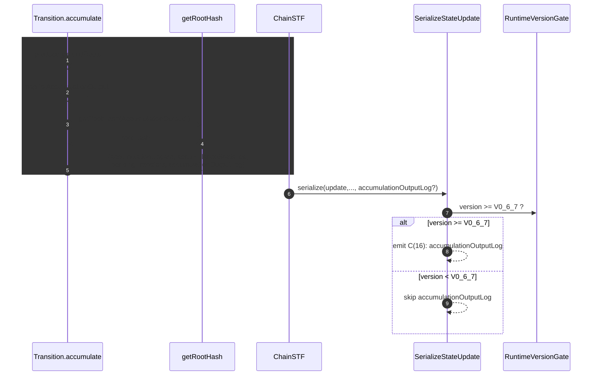

# Save accumulation output log in state

## Pull Request by @mateuszsikora

### Changes:
- changed operands encoding to use the old one in jamduna 067.
- added logic to save `accumulationOutputLog` in state.

It fixed half of jamduna 067 tests 


## Comment by @coderabbitai[bot]

<!-- This is an auto-generated comment: summarize by coderabbit.ai -->
<!-- walkthrough_start -->

<details>
<summary>📝 Walkthrough</summary>

<!-- This is an auto-generated comment: release notes by coderabbit.ai -->

## Summary by CodeRabbit

* New Features
  * State updates now include an accumulation output log, improving transparency of on-chain transitions.
  * Added version-gated support to serialize the new output log for newer runtime versions.

* Improvements
  * Root-hash computation now uses per-service outputs, enhancing determinism and auditability.
  * Simplified compatibility gating for specific suites to reduce configuration friction.

* Tests
  * Re-enabled a large set of previously ignored test vectors, expanding coverage and confidence.

<!-- end of auto-generated comment: release notes by coderabbit.ai -->
## Walkthrough
Removes many safrole state transition vectors from the ignore list. Adds accumulationOutputLog to accumulate results, threads it through chain-stf, and conditionally serializes it for runtime ≥ V0_6_7. Updates root-hash computation to use AccumulationOutput items. Adjusts Operand codec gating to be suite-based (jamduna) without a version pin.

## Changes
| Cohort / File(s) | Summary |
| --- | --- |
| **Test runner vectors**<br>`bin/test-runner/jamduna-067.ts` | Removed numerous safrole/state_transitions/*.json from the ignore list so those vectors now run. No other config changes. |
| **State serialization (version-gated field)**<br>`packages/jam/state-merkleization/serialize-state-update.ts` | Added conditional serialization of update.accumulationOutputLog after recentlyAccumulated, keyed C(16), gated on runtime ≥ V0_6_7. |
| **Accumulate transition and hashing**<br>`packages/jam/transition/accumulate/accumulate.ts` | Introduced accumulationOutputLog: AccumulationOutput[]. Built from yieldedRoots; sorted by serviceId. Root-hash now computed from AccumulationOutput values (opaque bytes) instead of prior tuple hashes. Updated types and internal plumbing accordingly. |
| **Operand codec gating**<br>`packages/jam/transition/accumulate/operand.ts` | Replaced Compatibility.isSuite(TestSuite.JAMDUNA, GpVersion.V0_6_5) with Compatibility.isSuite(TestSuite.JAMDUNA). Removed GpVersion import. Codec shapes unchanged; gating broadened to all jamduna. |
| **Chain STF propagation**<br>`packages/jam/transition/chain-stf.ts` | Plumbed accumulationOutputLog from accumulateResult.ok into the OnChain transition return object; control flow unchanged. |

## Sequence Diagram(s)


## Estimated code review effort
🎯 4 (Complex) | ⏱️ ~60 minutes

## Poem
> I hop through logs, byte-carrots in tow,  
> New roots aligned where service IDs grow.  
> Jamduna sings—no versioned fence,  
> A merkle’d tale in present tense.  
> Tests un-ignored, I thump with delight—  
> Outputs serialized, moonlit byte-night. 🥕✨

</details>

<!-- walkthrough_end -->
<!-- internal state start -->


<!-- DwQgtGAEAqAWCWBnSTIEMB26CuAXA9mAOYCmGJATmriQCaQDG+Ats2bgFyQAOFk+AIwBWJBrngA3EsgEBPRvlqU0AgfFwA6NPEgQAfACgjoCEYDEZyAAUASpETZWaCrKPR1AGxJcAyminoDAyO2B7U8PhY+HjceJAe+EQoWIi41CRGACLSDBTw3OKRXHAk1nYMsJikyPjcyhj0ZEy08BhJBJDYiKW4sKW8JBIRXZBNiq1JAGYULJBCaMy02BhokAAMAGwA7OgN6LS0yAlE8AyQHYj+pQAGaEEhYYUYAPIxeAAyidfJ9mk0GpAAIJBfAUFptc74c59SBKRC5fJPAA00OkpQqVWkkEm8AAHnRIJUPJN+CTeqV5otlqtNjsaKlEBojPpjOAoGR6PgSWg8IRSOQqDR6ExWOwuLx+MJROIpDJ5M1lKp1FodCyTFA4KhUJgcARiGRlEKFKKMJxIFQAO72RzMZzyOQKJRUJWabS6MCGVmmAxqDAAenpuDAFGWAr9lKWKzAtI0uEQHAMACJkwYLECAJL6gXpegOJwuUmMSptaTMyA2EjMfBSejMULibheUamvJY6azckoIgYUEEwOQKRiUFHJC4H6+gPSIMhjBhiPU6PbWOMyA+OoMeA4hhoDweWQozs4rzIS7trx+1LpAD6uCoGEQ6gi979a1fb4ATGsNEJEJEUW+P3fb9fwwf8ALWd8AA5gL/dZwIAZngmDQLggD4IAVmQsC0K2LDULfeCAE48PAtYABYAEYSPAsikJ/WDSLIzD6JQxjcJY7C3zI4iOPw190Ko3jSPQuiQM4/jmLEvi1nQ9ipOEnj5PAjZBKUgCNlEhjlMkrT1Lk3S3w2RSDNfLZVJMtYtk01jwK2HSbIArZ9Ict8tmMlzX0g8yPLWSDrPE3z7ICyDnOC9yAsI7yIv86TCKC2LQti8LdnocCKLWbz0AoUoe3iSJSD4eBu17WgAUBZBVmyhwPFwA9YHwboB2lYdIAteBd0gARSlaBgPGwJR6FaVFzinc1lgBAA5KE0AOR9ImQDpOyKntsviUdWsoUpbSUABuYa7gYEgCgJbhqFgFL+HJPgmAwHEiGwQUn3NSttCwZYMRLUqjHMSxARqw0nwWqFOyUXrnHCebCxIXFuFBI1QR4bABA8U5m3EcRSwMABRVJ4FtI0FWeoYSCtEhJkmOGuAAWToeBHCTFMDAgMAjFOhgAGs0GqcMFgvP4SDANgKHZrx4AALwh/1ujyHdxYFy8aDAbBuFodJlwTZNE1TX7M35Q0CTzW0Cy5ItMUQIxAQOCrIHIK0bpaJ4d3sSh4FliWnh4M7sQRg6Hkl15cFiXBPiSIbOwV0pldVmgeHyEgUfIAEShtknOoSDnnZllGxaxKO1d9utHifAOg5D/gMD3FASXUFBkCUHFyHoTB6E7GdxDYJqKAfSJa/QMcvDQVJIAANTWK8NivLYUUrdRxAhVZbcgdmSFkMAJB3bB+m0PgAAoAGEd4ojYAEpj4HV3M9d7OSC0e5C/9t5g8SJOEBqe4u/QSYaD4TtodHCZnqHVNHuYEwR75GmllfcWktID70PuhU+AJ0zMEbPALEDhuCwwoGOCmfBIFuwATqGaDsnxOwjtiNBHh6DLCdOgTu3csBEHSHtZeR1kB/1xhCG6t58AeGxAkK0zcl4r34GCF2EJ8BXTao1VoaQxAoiEbImYSxDrWyUHUBoTR5A9wXqnfB18+DsBcEyb6aY/rf0lkDYaoMwiPUhibaGWD4Z8FiMjVG7BHyYygFNcgRgcbtxzI6Uo2Viak3JpTSANMWj001syb0bNObc0pAGO8D4nh+gLqEdIGS75ZP+HGDWKYzG6wNIKA2No7SFg+tUMs6YWyKGwKowIYC8nF0fucKgHMJhcF0YI3JRdIglw+IkCh8d6A71wLIOoQJ+kP0DngAA2gAXTPtqA4fZgYwlAX7GgFZqpjmyrgB6WBJl1CZFAS2hxIB6zsVEbksynhDJwTMZgkBZCUIGjYfAkj4yQFtJggBJA7jnWlkMQ66YW7TSiO0neMxJFaEQM8U6ABHTeO9EFM3LKIFgQcsSt2+WOSoiBzpdAAZ2RemSBkvEflwUguAvmSIABKD3Oj2Pph0CjIG2eAtp8zcDLOSKkIFnJuTnGVk2ZwVBZDnKBLQIQXQ4yRMoCLEg0CPatCDgoe8t5GlPC4OvPqbYNmdVaHaGmwtRbuyes4HK+ArQCGwO1Z5sxQWnBIBC2B7wsZnyEdEPlsC/VBw0JaM+go+g/2LJnMF7qm57E7Lw+gRLYAyp8HDCqDynqBrwHKKNbqPVDTpQy3AzLiWwNaEKmahZfzYLJeKrEDpWhKFxMfGVABVFW6RkCyMoCsPhXQubeGaTs3lmrUAilxYNE5qS5oYHRRdXo2UZoElkVCAQkjzqHlNXwvZ9ZYGUrmaXRIPq40wjhYSllxog6SxlVjGGzdkCuJRgwMApzuooLTVwRxT7PDyDxk4haUzSjctaYM9p7ZXkAAFX1dQoC4PmatMXPCkFQDqZNJjSnFEjJ9QIrDpmtBQSYdxSi4JmS0x4JAd01WuTMC0yA2q9CHTy0DfKQ4KJPcEglYAk2XrwDA06DHiWbkVR0UlEI6gUDAK6w6/BH7IDDZQaEOpLRvI+QSM9jJvrayBP9W5ViQaiFsZYqGMM4YEgRo+9xppPHm0xT4Za1AHqRw7UKLg1xHFw3OIB0jOyKPSHrN8Ia1wEkDsQDzZgKTMBpKfDksj2T935MQN8NlyRer9SxL00ZVCDCQF0JAW4GbmOHqIFwYDVKnnLOuH43G+MCSExCWgsJuCzSMqKrABmWsmbxLuIk6QYWIv3hnTFnzfpaj1FKgU9rWnAQlOzBAipxsSTVK8ViqsNZhoAHFuDD0oAwlA77sHYheZAKDgGYNwbwO1DTUA6mQCRWNjQCtUZ70UKIOq6JIgkMiE7ZLXQsTPZQeENQKNJkaCQD4R1NAd7QCnOD9QN8ABSgIqaZFbRNQEqztXCsLP9/j8AgfqGlWDiHJAocw+JxoRHyPUeAhRJt7bXcnwaFHuPK8CCX6oFtMvBaMJ5xRkQOuTcqMFRnH4+dNAmDK70fqnESZACa4dFWPz0Qguzh0524zzFycLNnBxGMiqexqzKA6s90G9hKjTOyraIaaHpSSHjvIcOCxShdVwBaEgZBOp3gqNIPakRK6diYXPJIxwhfFmqC/W1GAwC89WAIL3ILzfBJeuWzoGAltfVMb9HTRnFowhseDJ4NQSTuewWZlxWHLPozQTZqAPg/io14KN7B8g84udu+J5uGgTeiBtnazo3RkA48B+1AnoPECw8h9D1IE+EdI5R2jn13P3sNBnSibKjY7hkphAMIY0RB84uH8Dwn4/iek+n+Tyn8+aeQDVwzyITOx4TzZ1VgJBMXtEwa6McJ2Dqa0xiYzZmVmbrELPrW8SLQbDEVoSTXASYdWSbYpLMfWXMebbRRbMPZbeLEdYZJIIlTqd3LAYhY1TdPXUYXEMAsQAkcDRjPJXzfZDQfAdmC6VAZLHqPqAaH4TdXtW7DAPeSoMOadD2Q5Y5AENcZXLcHcPcBRAralFjEZVAOEHVMQRzegKg+LWg+segxgncfKB8JQag8jdtaOEgKQ2LJ4OvcIXGBgRANjegDRcEIgaAVJdDLuGw1EAgh5OgJ5MuNZdg3PJPI5CgRuSUEQMQSaKEJbKxSgGYPgYsWgBOJIBGeNZDCQrVHhPhSYARPaX+XEf+eeRAaWD2HRDwvZA5ZPe8ExH6bTCxQvSEaxAzAvQGYzJxMvRGNxM4DxDGGvSAHxDIbGarQJOrQYT/NDCJKJOmZgSbTrT0dUZsEVXUPkUpAYlgNgU0LgZTQ2SpB0BUZ0NQV0VUD0AwGYkUZgdQK8eAQ4K8erEmOgK8S8A7FkQ4tkSALyWgd8A4AQDSLYQ6DYdCEKQiFSNACiMiSYciMiIFCidCBgSYBgbYeCDYMmegB4o45Y0484xAS4oY642gK8Dkd0PQIAA -->

<!-- internal state end -->
<!-- tips_start -->

---


<details>
<summary>🪧 Tips</summary>

### Chat

There are 3 ways to chat with [CodeRabbit](https://coderabbit.ai?utm_source=oss&utm_medium=github&utm_campaign=FluffyLabs/typeberry&utm_content=585):

- Review comments: Directly reply to a review comment made by CodeRabbit. Example:
  - `I pushed a fix in commit <commit_id>, please review it.`
  - `Open a follow-up GitHub issue for this discussion.`
- Files and specific lines of code (under the "Files changed" tab): Tag `@coderabbitai` in a new review comment at the desired location with your query.
- PR comments: Tag `@coderabbitai` in a new PR comment to ask questions about the PR branch. For the best results, please provide a very specific query, as very limited context is provided in this mode. Examples:
  - `@coderabbitai gather interesting stats about this repository and render them as a table. Additionally, render a pie chart showing the language distribution in the codebase.`
  - `@coderabbitai read the files in the src/scheduler package and generate a class diagram using mermaid and a README in the markdown format.`

### Support

Need help? Create a ticket on our [support page](https://www.coderabbit.ai/contact-us/support) for assistance with any issues or questions.

### CodeRabbit Commands (Invoked using PR/Issue comments)

Type `@coderabbitai help` to get the list of available commands.

### Other keywords and placeholders

- Add `@coderabbitai ignore` or `@coderabbit ignore` anywhere in the PR description to prevent this PR from being reviewed.
- Add `@coderabbitai summary` to generate the high-level summary at a specific location in the PR description.
- Add `@coderabbitai` anywhere in the PR title to generate the title automatically.

### Status, Documentation and Community

- Visit our [Status Page](https://status.coderabbit.ai) to check the current availability of CodeRabbit.
- Visit our [Documentation](https://docs.coderabbit.ai) for detailed information on how to use CodeRabbit.
- Join our [Discord Community](http://discord.gg/coderabbit) to get help, request features, and share feedback.
- Follow us on [X/Twitter](https://twitter.com/coderabbitai) for updates and announcements.

</details>

<!-- tips_end -->


## Comment by @github-actions[bot]


<details>
<summary>View all</summary>

| File | Benchmark | Ops |  |
|------|-----------|-----|--|
| [bytes/hex-from.ts[0]](../blob/c7e466868e469c587a87cc4a8c5f9bf62efa6966//_work/typeberry-runner-3/typeberry/typeberry/benchmarks/bytes/hex-from.ts) | parse hex using `Number` with NaN checking | 112032.46 ±2.21% | 85.34% slower |
| [bytes/hex-from.ts[1]](../blob/c7e466868e469c587a87cc4a8c5f9bf62efa6966//_work/typeberry-runner-3/typeberry/typeberry/benchmarks/bytes/hex-from.ts) | parse hex from char codes | 764192.76 ±1.41% | fastest ✅ |
| [bytes/hex-from.ts[2]](../blob/c7e466868e469c587a87cc4a8c5f9bf62efa6966//_work/typeberry-runner-3/typeberry/typeberry/benchmarks/bytes/hex-from.ts) | parse hex from string nibbles | 501007.42 ±1.32% | 34.44% slower |
| [math/switch.ts[0]](../blob/c7e466868e469c587a87cc4a8c5f9bf62efa6966//_work/typeberry-runner-3/typeberry/typeberry/benchmarks/math/switch.ts) | switch | 231455206.47 ±7.47% | 5.83% slower |
| [math/switch.ts[1]](../blob/c7e466868e469c587a87cc4a8c5f9bf62efa6966//_work/typeberry-runner-3/typeberry/typeberry/benchmarks/math/switch.ts) | if | 245776105.57 ±4.58% | fastest ✅ |
| [math/count-bits-u32.ts[0]](../blob/c7e466868e469c587a87cc4a8c5f9bf62efa6966//_work/typeberry-runner-3/typeberry/typeberry/benchmarks/math/count-bits-u32.ts) | standard method | 81253043.27 ±1.83% | 62.23% slower |
| [math/count-bits-u32.ts[1]](../blob/c7e466868e469c587a87cc4a8c5f9bf62efa6966//_work/typeberry-runner-3/typeberry/typeberry/benchmarks/math/count-bits-u32.ts) | magic | 215099448.79 ±7.11% | fastest ✅ |
| [math/count-bits-u64.ts[0]](../blob/c7e466868e469c587a87cc4a8c5f9bf62efa6966//_work/typeberry-runner-3/typeberry/typeberry/benchmarks/math/count-bits-u64.ts) | standard method | 1541431.08 ±1.66% | 85.8% slower |
| [math/count-bits-u64.ts[1]](../blob/c7e466868e469c587a87cc4a8c5f9bf62efa6966//_work/typeberry-runner-3/typeberry/typeberry/benchmarks/math/count-bits-u64.ts) | magic | 10853985.38 ±1.49% | fastest ✅ |
| [hash/index.ts[0]](../blob/c7e466868e469c587a87cc4a8c5f9bf62efa6966//_work/typeberry-runner-3/typeberry/typeberry/benchmarks/hash/index.ts) | hash with numeric representation | 188.59 ±0.12% | 26.74% slower |
| [hash/index.ts[1]](../blob/c7e466868e469c587a87cc4a8c5f9bf62efa6966//_work/typeberry-runner-3/typeberry/typeberry/benchmarks/hash/index.ts) | hash with string representation | 116.85 ±0.16% | 54.61% slower |
| [hash/index.ts[2]](../blob/c7e466868e469c587a87cc4a8c5f9bf62efa6966//_work/typeberry-runner-3/typeberry/typeberry/benchmarks/hash/index.ts) | hash with symbol representation | 174.16 ±1.13% | 32.35% slower |
| [hash/index.ts[3]](../blob/c7e466868e469c587a87cc4a8c5f9bf62efa6966//_work/typeberry-runner-3/typeberry/typeberry/benchmarks/hash/index.ts) | hash with uint8 representation | 160.89 ±0.28% | 37.5% slower |
| [hash/index.ts[4]](../blob/c7e466868e469c587a87cc4a8c5f9bf62efa6966//_work/typeberry-runner-3/typeberry/typeberry/benchmarks/hash/index.ts) | hash with packed representation | 257.44 ±0.99% | fastest ✅ |
| [hash/index.ts[5]](../blob/c7e466868e469c587a87cc4a8c5f9bf62efa6966//_work/typeberry-runner-3/typeberry/typeberry/benchmarks/hash/index.ts) | hash with bigint representation | 191.23 ±0.49% | 25.72% slower |
| [hash/index.ts[6]](../blob/c7e466868e469c587a87cc4a8c5f9bf62efa6966//_work/typeberry-runner-3/typeberry/typeberry/benchmarks/hash/index.ts) | hash with uint32 representation | 203.59 ±0.36% | 20.92% slower |
| [bytes/hex-to.ts[0]](../blob/c7e466868e469c587a87cc4a8c5f9bf62efa6966//_work/typeberry-runner-3/typeberry/typeberry/benchmarks/bytes/hex-to.ts) | number toString + padding | 329415.8 ±0.28% | fastest ✅ |
| [bytes/hex-to.ts[1]](../blob/c7e466868e469c587a87cc4a8c5f9bf62efa6966//_work/typeberry-runner-3/typeberry/typeberry/benchmarks/bytes/hex-to.ts) | manual | 16460.32 ±0.1% | 95% slower |
| [codec/bigint.compare.ts[0]](../blob/c7e466868e469c587a87cc4a8c5f9bf62efa6966//_work/typeberry-runner-3/typeberry/typeberry/benchmarks/codec/bigint.compare.ts) | compare custom | 255852313.11 ±6.86% | fastest ✅ |
| [codec/bigint.compare.ts[1]](../blob/c7e466868e469c587a87cc4a8c5f9bf62efa6966//_work/typeberry-runner-3/typeberry/typeberry/benchmarks/codec/bigint.compare.ts) | compare bigint | 248276028 ±7.12% | 2.96% slower |
| [codec/bigint.decode.ts[0]](../blob/c7e466868e469c587a87cc4a8c5f9bf62efa6966//_work/typeberry-runner-3/typeberry/typeberry/benchmarks/codec/bigint.decode.ts) | decode custom | 164650331.16 ±3.6% | fastest ✅ |
| [codec/bigint.decode.ts[1]](../blob/c7e466868e469c587a87cc4a8c5f9bf62efa6966//_work/typeberry-runner-3/typeberry/typeberry/benchmarks/codec/bigint.decode.ts) | decode bigint | 103310301.27 ±2.81% | 37.25% slower |
| [collections/map-set.ts[0]](../blob/c7e466868e469c587a87cc4a8c5f9bf62efa6966//_work/typeberry-runner-3/typeberry/typeberry/benchmarks/collections/map-set.ts) | 2 gets + conditional set | 121423.47 ±0.09% | fastest ✅ |
| [collections/map-set.ts[1]](../blob/c7e466868e469c587a87cc4a8c5f9bf62efa6966//_work/typeberry-runner-3/typeberry/typeberry/benchmarks/collections/map-set.ts) | 1 get 1 set | 62041.18 ±0.04% | 48.91% slower |
| [logger/index.ts[0]](../blob/c7e466868e469c587a87cc4a8c5f9bf62efa6966//_work/typeberry-runner-3/typeberry/typeberry/benchmarks/logger/index.ts) | console.log with string concat | 9351632.69 ±34.35% | fastest ✅ |
| [logger/index.ts[1]](../blob/c7e466868e469c587a87cc4a8c5f9bf62efa6966//_work/typeberry-runner-3/typeberry/typeberry/benchmarks/logger/index.ts) | console.log with args | 1018361.48 ±74.36% | 89.11% slower |
| [math/add_one_overflow.ts[0]](../blob/c7e466868e469c587a87cc4a8c5f9bf62efa6966//_work/typeberry-runner-3/typeberry/typeberry/benchmarks/math/add_one_overflow.ts) | add and take modulus | 744761.46 ±46.44% | 99.7% slower |
| [math/add_one_overflow.ts[1]](../blob/c7e466868e469c587a87cc4a8c5f9bf62efa6966//_work/typeberry-runner-3/typeberry/typeberry/benchmarks/math/add_one_overflow.ts) | condition before calculation | 245579559.82 ±7.09% | fastest ✅ |
| [math/mul_overflow.ts[0]](../blob/c7e466868e469c587a87cc4a8c5f9bf62efa6966//_work/typeberry-runner-3/typeberry/typeberry/benchmarks/math/mul_overflow.ts) | multiply and bring back to u32 | 243412723.61 ±7.54% | 8.6% slower |
| [math/mul_overflow.ts[1]](../blob/c7e466868e469c587a87cc4a8c5f9bf62efa6966//_work/typeberry-runner-3/typeberry/typeberry/benchmarks/math/mul_overflow.ts) | multiply and take modulus | 266307784.15 ±5.35% | fastest ✅ |
| [codec/decoding.ts[0]](../blob/c7e466868e469c587a87cc4a8c5f9bf62efa6966//_work/typeberry-runner-3/typeberry/typeberry/benchmarks/codec/decoding.ts) | manual decode | 47043.98 ±27.3% | 99.97% slower |
| [codec/decoding.ts[1]](../blob/c7e466868e469c587a87cc4a8c5f9bf62efa6966//_work/typeberry-runner-3/typeberry/typeberry/benchmarks/codec/decoding.ts) | int32array decode | 147577337.5 ±3.79% | 9.71% slower |
| [codec/decoding.ts[2]](../blob/c7e466868e469c587a87cc4a8c5f9bf62efa6966//_work/typeberry-runner-3/typeberry/typeberry/benchmarks/codec/decoding.ts) | dataview decode | 163446738.58 ±3.25% | fastest ✅ |
| [codec/encoding.ts[0]](../blob/c7e466868e469c587a87cc4a8c5f9bf62efa6966//_work/typeberry-runner-3/typeberry/typeberry/benchmarks/codec/encoding.ts) | manual encode | 2305117.34 ±0.34% | 24.18% slower |
| [codec/encoding.ts[1]](../blob/c7e466868e469c587a87cc4a8c5f9bf62efa6966//_work/typeberry-runner-3/typeberry/typeberry/benchmarks/codec/encoding.ts) | int32array encode | 3040411.2 ±1.29% | fastest ✅ |
| [codec/encoding.ts[2]](../blob/c7e466868e469c587a87cc4a8c5f9bf62efa6966//_work/typeberry-runner-3/typeberry/typeberry/benchmarks/codec/encoding.ts) | dataview encode | 2983924.63 ±3.16% | 1.86% slower |
| [collections/map_vs_sorted.ts[0]](../blob/c7e466868e469c587a87cc4a8c5f9bf62efa6966//_work/typeberry-runner-3/typeberry/typeberry/benchmarks/collections/map_vs_sorted.ts) | Map | 307674.44 ±0.05% | fastest ✅ |
| [collections/map_vs_sorted.ts[1]](../blob/c7e466868e469c587a87cc4a8c5f9bf62efa6966//_work/typeberry-runner-3/typeberry/typeberry/benchmarks/collections/map_vs_sorted.ts) | Map-array | 103669.82 ±0.03% | 66.31% slower |
| [collections/map_vs_sorted.ts[2]](../blob/c7e466868e469c587a87cc4a8c5f9bf62efa6966//_work/typeberry-runner-3/typeberry/typeberry/benchmarks/collections/map_vs_sorted.ts) | Array | 71948.04 ±2.55% | 76.62% slower |
| [collections/map_vs_sorted.ts[3]](../blob/c7e466868e469c587a87cc4a8c5f9bf62efa6966//_work/typeberry-runner-3/typeberry/typeberry/benchmarks/collections/map_vs_sorted.ts) | SortedArray | 199943.87 ±0.22% | 35.01% slower |
| [hash/blake2b.ts[0]](../blob/c7e466868e469c587a87cc4a8c5f9bf62efa6966//_work/typeberry-runner-3/typeberry/typeberry/benchmarks/hash/blake2b.ts) | hasher with simple allocator | 0.04609 ±0.54% | 0.07% slower |
| [hash/blake2b.ts[1]](../blob/c7e466868e469c587a87cc4a8c5f9bf62efa6966//_work/typeberry-runner-3/typeberry/typeberry/benchmarks/hash/blake2b.ts) | hasher with page allocator | 0.04612 ±0.03% | fastest ✅ |
| [bytes/compare.ts[0]](../blob/c7e466868e469c587a87cc4a8c5f9bf62efa6966//_work/typeberry-runner-3/typeberry/typeberry/benchmarks/bytes/compare.ts) | Comparing Uint32 bytes | 19197.92 ±0.15% | 2.68% slower |
| [bytes/compare.ts[1]](../blob/c7e466868e469c587a87cc4a8c5f9bf62efa6966//_work/typeberry-runner-3/typeberry/typeberry/benchmarks/bytes/compare.ts) | Comparing raw bytes | 19726.53 ±0.06% | fastest ✅ |
| [codec/view_vs_object.ts[0]](../blob/c7e466868e469c587a87cc4a8c5f9bf62efa6966//_work/typeberry-runner-3/typeberry/typeberry/benchmarks/codec/view_vs_object.ts) | Get the first field from Decoded | 25418.56 ±86.32% | 94.25% slower |
| [codec/view_vs_object.ts[1]](../blob/c7e466868e469c587a87cc4a8c5f9bf62efa6966//_work/typeberry-runner-3/typeberry/typeberry/benchmarks/codec/view_vs_object.ts) | Get the first field from View | 90155.61 ±0.92% | 79.6% slower |
| [codec/view_vs_object.ts[2]](../blob/c7e466868e469c587a87cc4a8c5f9bf62efa6966//_work/typeberry-runner-3/typeberry/typeberry/benchmarks/codec/view_vs_object.ts) | Get the first field as view from View | 94172.7 ±1.17% | 78.7% slower |
| [codec/view_vs_object.ts[3]](../blob/c7e466868e469c587a87cc4a8c5f9bf62efa6966//_work/typeberry-runner-3/typeberry/typeberry/benchmarks/codec/view_vs_object.ts) | Get two fields from Decoded | 440399.88 ±0.19% | 0.37% slower |
| [codec/view_vs_object.ts[4]](../blob/c7e466868e469c587a87cc4a8c5f9bf62efa6966//_work/typeberry-runner-3/typeberry/typeberry/benchmarks/codec/view_vs_object.ts) | Get two fields from View | 82759.74 ±0.13% | 81.28% slower |
| [codec/view_vs_object.ts[5]](../blob/c7e466868e469c587a87cc4a8c5f9bf62efa6966//_work/typeberry-runner-3/typeberry/typeberry/benchmarks/codec/view_vs_object.ts) | Get two fields from materialized from View | 172635.06 ±0.17% | 60.95% slower |
| [codec/view_vs_object.ts[6]](../blob/c7e466868e469c587a87cc4a8c5f9bf62efa6966//_work/typeberry-runner-3/typeberry/typeberry/benchmarks/codec/view_vs_object.ts) | Get two fields as views from View | 82401.59 ±0.11% | 81.36% slower |
| [codec/view_vs_object.ts[7]](../blob/c7e466868e469c587a87cc4a8c5f9bf62efa6966//_work/typeberry-runner-3/typeberry/typeberry/benchmarks/codec/view_vs_object.ts) | Get only third field from Decoded | 442047.38 ±0.27% | fastest ✅ |
| [codec/view_vs_object.ts[8]](../blob/c7e466868e469c587a87cc4a8c5f9bf62efa6966//_work/typeberry-runner-3/typeberry/typeberry/benchmarks/codec/view_vs_object.ts) | Get only third field from View | 103417.02 ±0.13% | 76.6% slower |
| [codec/view_vs_object.ts[9]](../blob/c7e466868e469c587a87cc4a8c5f9bf62efa6966//_work/typeberry-runner-3/typeberry/typeberry/benchmarks/codec/view_vs_object.ts) | Get only third field as view from View | 103041.06 ±0.13% | 76.69% slower |
| [codec/view_vs_collection.ts[0]](../blob/c7e466868e469c587a87cc4a8c5f9bf62efa6966//_work/typeberry-runner-3/typeberry/typeberry/benchmarks/codec/view_vs_collection.ts) | Get first element from Decoded | 27262.21 ±0.18% | 59.27% slower |
| [codec/view_vs_collection.ts[1]](../blob/c7e466868e469c587a87cc4a8c5f9bf62efa6966//_work/typeberry-runner-3/typeberry/typeberry/benchmarks/codec/view_vs_collection.ts) | Get first element from View | 66926.16 ±0.14% | fastest ✅ |
| [codec/view_vs_collection.ts[2]](../blob/c7e466868e469c587a87cc4a8c5f9bf62efa6966//_work/typeberry-runner-3/typeberry/typeberry/benchmarks/codec/view_vs_collection.ts) | Get 50th element from Decoded | 27232.05 ±0.31% | 59.31% slower |
| [codec/view_vs_collection.ts[3]](../blob/c7e466868e469c587a87cc4a8c5f9bf62efa6966//_work/typeberry-runner-3/typeberry/typeberry/benchmarks/codec/view_vs_collection.ts) | Get 50th element from View | 37275.9 ±0.22% | 44.3% slower |
| [codec/view_vs_collection.ts[4]](../blob/c7e466868e469c587a87cc4a8c5f9bf62efa6966//_work/typeberry-runner-3/typeberry/typeberry/benchmarks/codec/view_vs_collection.ts) | Get last element from Decoded | 27223.38 ±0.32% | 59.32% slower |
| [codec/view_vs_collection.ts[5]](../blob/c7e466868e469c587a87cc4a8c5f9bf62efa6966//_work/typeberry-runner-3/typeberry/typeberry/benchmarks/codec/view_vs_collection.ts) | Get last element from View | 26304.23 ±0.33% | 60.7% slower |
| [crypto/ed25519.ts[0]](../blob/c7e466868e469c587a87cc4a8c5f9bf62efa6966//_work/typeberry-runner-3/typeberry/typeberry/benchmarks/crypto/ed25519.ts) | native crypto | 8.41 ±0.13% | 72.24% slower |
| [crypto/ed25519.ts[1]](../blob/c7e466868e469c587a87cc4a8c5f9bf62efa6966//_work/typeberry-runner-3/typeberry/typeberry/benchmarks/crypto/ed25519.ts) | wasm lib | 10.65 ±0.02% | 64.85% slower |
| [crypto/ed25519.ts[2]](../blob/c7e466868e469c587a87cc4a8c5f9bf62efa6966//_work/typeberry-runner-3/typeberry/typeberry/benchmarks/crypto/ed25519.ts) | wasm lib batch | 30.3 ±0.05% | fastest ✅ |
</details>


### Benchmarks summary: 63/63 OK ✅

<!-- thollander/actions-comment-pull-request "benchmarks" -->


## Comment by @coderabbitai[bot]

_💡 Verification agent_

<details>
<summary>🧩 Analysis chain</summary>

**Type surface: ensure `Ok` (and downstream state) includes `accumulationOutputLog`.**

You now thread `accumulationOutputLog` through OnChain. Please confirm:
- `Ok`’s intersection type includes this field (or the generic inference from `Result.ok(...)` won’t match the declared `Promise<Result<Ok, StfError>>` without explicit generics).
- `State` (and the serializer) define `accumulationOutputLog` so `serializeStateUpdate(...)` can see it.

If not already present, add it to the relevant type(s).

Run:


Also applies to: 353-354

---

🏁 Script executed:

```shell
#!/bin/bash
# Verify type surface for accumulationOutputLog
rg -nP 'export\s+type\s+Ok\s*=' -n packages/jam/transition/chain-stf.ts -C3
rg -n 'accumulationOutputLog' -C2
rg -nP 'export\s+interface\s+State\b|export\s+type\s+State\b' -C3 packages/jam/state
rg -nP 'accumulationOutputLog\s*:\s*' packages/jam/state
rg -nP 'serialize\.(accumulationOutputLog)\b' packages/jam/state-merkleization
```

Length of output: 9592

---


</details>

**Include `AccumulateStateUpdate` in `Ok` intersection in packages/jam/transition/chain-stf.ts** to ensure `accumulationOutputLog` is part of the type. State and serialization already cover this field.

<details>
<summary>🤖 Prompt for AI Agents</summary>

```
In packages/jam/transition/chain-stf.ts around lines 269-271, the destructured
accumulationOutputLog is not guaranteed by the current Ok type; update the code
so the Ok type is intersected with AccumulateStateUpdate (e.g. treat
accumulateResult.ok as Ok<...> & AccumulateStateUpdate or change the
accumulateResult type definition to return Ok & AccumulateStateUpdate) so
accumulationOutputLog is included in the type. Adjust the typing where
accumulateResult is produced or where you destructure it so TypeScript
recognizes accumulationOutputLog exists, leaving runtime code unchanged.
```

</details>

<!-- fingerprinting:phantom:medusa:chinchilla -->

<!-- This is an auto-generated comment by CodeRabbit -->
