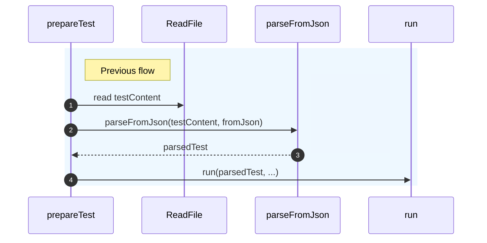
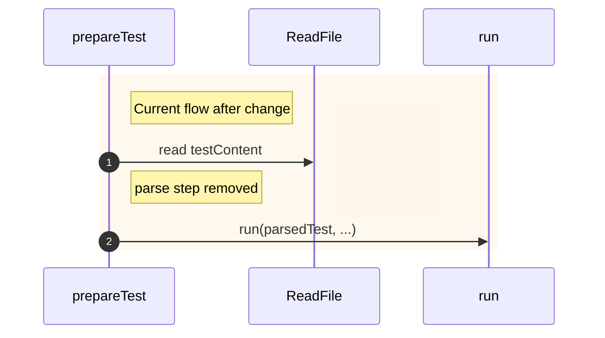

# Update runner jamduna 067

## Pull Request by @mateuszsikora

### Changes:
- updated jamduna 067 runner to run tests from here: https://github.com/FluffyLabs/test-vectors/pull/10
- changed operands encoding as the encoding is fixed in version 0.6.7.1

It should be merged after:
- https://github.com/FluffyLabs/typeberry/pull/585
- https://github.com/FluffyLabs/test-vectors/pull/10

## Comment by @coderabbitai[bot]

<!-- This is an auto-generated comment: summarize by coderabbit.ai -->
<!-- This is an auto-generated comment: skip review by coderabbit.ai -->

> [!IMPORTANT]
> ## Review skipped
> 
> Auto incremental reviews are disabled on this repository.
> 
> Please check the settings in the CodeRabbit UI or the `.coderabbit.yaml` file in this repository. To trigger a single review, invoke the `@coderabbitai review` command.
> 
> You can disable this status message by setting the `reviews.review_status` to `false` in the CodeRabbit configuration file.

<!-- end of auto-generated comment: skip review by coderabbit.ai -->
<!-- walkthrough_start -->

📝 Walkthrough

<!-- This is an auto-generated comment: release notes by coderabbit.ai -->

## Summary by CodeRabbit

* **Tests**
  * Updated test runner naming to “traces” and aligned accepted paths accordingly.
  * Synchronized test configurations with the latest test vector structure.

* **Chores**
  * CI script now references the latest test vectors commit for load testing, ensuring up-to-date validation during pipelines.

<!-- end of auto-generated comment: release notes by coderabbit.ai -->
## Walkthrough
- Updated REF in .github/scripts/load-test-ref.sh to 93ce12c98bc169671531cd567bd0d71bc0a15eb0; export line unchanged.
- In bin/test-runner/common.ts, removed assignment to parsedTest; subsequent references remain.
- In bin/test-runner/jamduna-067.ts, renamed runner label to "traces" and updated accepted test vectors path to "traces/".

## Changes
| Cohort / File(s) | Summary of Changes |
| --- | --- |
| **CI test vector ref update** `.github/scripts/load-test-ref.sh` | Changed REF commit hash; continues exporting TEST_VECTORS_REF to GITHUB_ENV. |
| **Test runner parse step removal** `bin/test-runner/common.ts` | Deleted line assigning `parsedTest = parseFromJson(testContent, fromJson)`; later code still references `parsedTest`. |
| **Runner label and path update** `bin/test-runner/jamduna-067.ts` | Updated runner label from "state_transition" to "traces" and accepted path from `safrole/state_transitions/` to `traces/`. |

## Sequence Diagram(s)

## Estimated code review effort
🎯 3 (Moderate) | ⏱️ ~25 minutes

## Poem
> I thump my paws at shifting trails,  
> New refs hop in, old parsing pales—  
> “Traces” whisper where states once grew,  
> Carrots of commits, a fresher stew.  
> I nose the code, then leap—hoo-ray!  
> Another branch to chase today. 🥕🐇

<!-- walkthrough_end -->
<!-- internal state start -->

<!-- DwQgtGAEAqAWCWBnSTIEMB26CuAXA9mAOYCmGJATmriQCaQDG+Ats2bgFyQAOFk+AIwBWJBrngA3EsgEBPRvlqU0AgfFwA6NPEgQAfACgjoCEYDEZyAAUASpETZWaCrKPR1AGxJcAqt1rUJJAU2BjkfEJozLShaJAADABsAOyQkAYAco4ClFwArAAciWkGPjYAMlywuLjciBwA9A1E6rDYAhpMzA0AYh7YAGYDsuUqiA24stwkORQuDdzYHh4NhcXpPoi5kMyB2IgAXojwANb4VCUAyvjYFAxBAlQYDLBczIhg2P6BYCFhlGBItFYmAkql0tBnKRcJBHpgXm9tFh0pdcNR9lx8NNkQYbCQJPASAB3Sj1exnQ54OLpUY5DxkgAUGHw5AAlCUAMIUEiBejULgAJniAryoIAnKC8tAAIyJDjSvIcAAs8QAWkYACLSBgUeDccQsjgGKB+AI0ehAmIYOJg4KhcKQAh2rA0RC4ZADCgsSDVWr1JotXBtDpdXr9IYjMYTaS4MBSMTncaLZYNaXxDQlKAc2CYUj0LHKDC0ZBkJi0eAYIiw0RofZBINBUuKCtV1ADeAADzoKCwUgoxxZCQ0iQ0yQ00o0RgAspRSJAlNilM9CfVjZAp/sYTkdrPu2gBjQ+L66o1mq12p0WGHBsNaeNJtNZvNkytCnkM+koBu3dWdxQ8+gB6UD6NQngG54hlefQ3pGAj3jGcaiAQ/YLEsKxppOxpgIYBgmFAZD5gMOAEMQZDKOaCisOwXC8PwwhIZI0iwvIZbKKo6haDo+i4eAUBwKgqCYMRhCkOEvKUWwGCcMEaBEvYji7C4zEKEoVDsZo2i6NhRg8aYBgaIGwYNIgOp6u6DQePgaC0GArqxtyAwaIgrwGAARO5BgWJAACCACSpFiRRDhOEp+BES8ubSG4sBBDYACiPSQBIaD9EEFaQAZEHGaZ+rjJZ1m2QhDlObAkBEmgyARZW3aet6Aximg8S0HkAwCiQyTJAI0rSgUSoMPEADMJAqr1BQMPueSTd1A0DGgCp5PW+CQGKA33NKAoMGKBQCAwspiikCoDdKDDNSkAi0E1yTSjt8RzQtAjpjAMXyXBJAAI7YOwkCiLAS1OtAcWXNAAD6ABqcUctAADyNiXMD8WJdyuwVsgoRVXmAA09h/c9Jm6vqkDMnJJAdtw5zuug87wEMlBfQDQNgxD0Ow/DCVJSln1JfAcQAOK+dAAASPgAELA3FGSgxmGRLfgDZ8JZLQMPwfBMFJXoeJAAyWXJ6NMSS3I9rgXoxPctCYUYUCg843MCF486iB4zjUPAg5fGadBcAABgjns9pAnuZUG7TZfj5n5TZdm/CQjnOb7FbqNzGvJaljA5tV9C1cw/v1Y1zWte1nXdb1/VDSNSpjRNU3SjNd0Lb7Tqeyta0bVtO17QdeRHSdeRnRdtBXTdd0zPEntGHFbrwLsFGscE+KEsTQzk1wM7lo4bkeVhYBGGoGDRm6vz2pQDRdMwLIaO6Rrua5nmWH5AXkd2wWKfIYWp5FiAW5A2aRY6UzeJAeJT7J34EROI3BnDHErPYGg3B0BFnQLQSI9wpKa3OFPcQUD0q8BIOA7k0AYwZkuNMBg1N4DjWWLILGDYqZDHtl4V0jpnoeArPWHMMIKrHCIBgZAuCti0HwT+AkYCIEkB6F6ZgAApRALIGR2Q5CyGgUksaZykSydkmB6DUMnmwcsgQPDyGwabFssJHYYBOJAZh5AsbcgcB4DBrYsDMntu2DACdByv14XQARMIiStHStQo28hbb4AYCcDMcAggOFeh9L6M9VYYM+sgJ0DlabPCCJ4/hMZIAMnSgrUgFBz5UHuHA+gfxWRYyJAgF4hN8BySJDcDw9BtyhCUC4ugWNxr7GMXEP44g2DfTmOcMqMUXTPTsigEsXYGB4DoFLJa5A5IKzIcrBB5YDTcPQAbCsRtFDYFNgAbn4BgfRdCSDrOQK/Sx0hMJeXMLfOx5EXYbKdNQpQDBHZUHOSA76pNybdiGYsW2yz2AJyimuaW5BwkxQNs4IITjdZJJxpE+AXD0Q2O+STMmFBzSoSBUrEF4hrljwnlPbsM9uQEmJN9Re2KuACxRbAde19N7bwrHveyh8KANEtCCME59VxXxvj5fyokH70Cfs4F+4U06kA/muCJjosl/AdI7Okb9qoenEZAVybpAjAyNpgY46zXKOiWq5A19xEAmv8c9ZVpJNlUFkJOPiz00AMHuPqbs4z4zIR4dQUqCLNZap1fudWJBjJohoPqp4RqnnjBNU6c1RTpANFcs6nyyx+ByxQMwLFFMNGMKCAMNG6zGApXpLPZGozIlRBIIc+FMqmJOkoF6I8GjLFViGfgPs5aFBq3wBrLWtTqyyBZJo21ZBa2lM5SU9A7qcEUXAUGc2QrvIPM+XG01hb7bvKdl81+mK/n5j4IC5h+KpKgrlVAaWPy810FxWe76F7Jj2BRdaXAtwggIswuPPp4lyVzypdHAYS91x0HgGvQVWEcJ4SfYRYS99PlkpYJJaSVA5ISqUnIFSbE1AaS4tpWDJ91DA3gMWYGFL550GBrq7FWkYO8U1ioAQeQBACg6nkRqeQBQ5GagINAaABQqhSOxsatAxotQWkqPI8R6PGEY8R3ApHyOUeJNRgi9GgA=== -->

<!-- internal state end -->
<!-- tips_start -->

---

Comment `@coderabbitai help` to get the list of available commands and usage tips.

<!-- tips_end -->

## Comment by @github-actions[bot]

View all

| File | Benchmark | Ops |  |
|------|-----------|-----|--|
| [codec/bigint.decode.ts[0]](../blob/ad00c8fd76bd995fd1e3bd6acf13a9f0c5512f51//_work/typeberry-runner-3/typeberry/typeberry/benchmarks/codec/bigint.decode.ts) | decode custom | 159987458.73 ±2.51% | fastest ✅ |
| [codec/bigint.decode.ts[1]](../blob/ad00c8fd76bd995fd1e3bd6acf13a9f0c5512f51//_work/typeberry-runner-3/typeberry/typeberry/benchmarks/codec/bigint.decode.ts) | decode bigint | 100319674.55 ±2.14% | 37.3% slower |
| [codec/bigint.compare.ts[0]](../blob/ad00c8fd76bd995fd1e3bd6acf13a9f0c5512f51//_work/typeberry-runner-3/typeberry/typeberry/benchmarks/codec/bigint.compare.ts) | compare custom | 216965635.04 ±7% | 3.04% slower |
| [codec/bigint.compare.ts[1]](../blob/ad00c8fd76bd995fd1e3bd6acf13a9f0c5512f51//_work/typeberry-runner-3/typeberry/typeberry/benchmarks/codec/bigint.compare.ts) | compare bigint | 223760110.06 ±6.98% | fastest ✅ |
| [bytes/hex-to.ts[0]](../blob/ad00c8fd76bd995fd1e3bd6acf13a9f0c5512f51//_work/typeberry-runner-3/typeberry/typeberry/benchmarks/bytes/hex-to.ts) | number toString + padding | 277065.62 ±1.05% | fastest ✅ |
| [bytes/hex-to.ts[1]](../blob/ad00c8fd76bd995fd1e3bd6acf13a9f0c5512f51//_work/typeberry-runner-3/typeberry/typeberry/benchmarks/bytes/hex-to.ts) | manual | 13998.22 ±1.2% | 94.95% slower |
| [collections/map-set.ts[0]](../blob/ad00c8fd76bd995fd1e3bd6acf13a9f0c5512f51//_work/typeberry-runner-3/typeberry/typeberry/benchmarks/collections/map-set.ts) | 2 gets + conditional set | 111944.84 ±0.23% | fastest ✅ |
| [collections/map-set.ts[1]](../blob/ad00c8fd76bd995fd1e3bd6acf13a9f0c5512f51//_work/typeberry-runner-3/typeberry/typeberry/benchmarks/collections/map-set.ts) | 1 get 1 set | 54641.34 ±0.96% | 51.19% slower |
| [codec/decoding.ts[0]](../blob/ad00c8fd76bd995fd1e3bd6acf13a9f0c5512f51//_work/typeberry-runner-3/typeberry/typeberry/benchmarks/codec/decoding.ts) | manual decode | 18971529.19 ±1.58% | 86.5% slower |
| [codec/decoding.ts[1]](../blob/ad00c8fd76bd995fd1e3bd6acf13a9f0c5512f51//_work/typeberry-runner-3/typeberry/typeberry/benchmarks/codec/decoding.ts) | int32array decode | 140554257.25 ±3.26% | fastest ✅ |
| [codec/decoding.ts[2]](../blob/ad00c8fd76bd995fd1e3bd6acf13a9f0c5512f51//_work/typeberry-runner-3/typeberry/typeberry/benchmarks/codec/decoding.ts) | dataview decode | 139036747.74 ±2.63% | 1.08% slower |
| [codec/encoding.ts[0]](../blob/ad00c8fd76bd995fd1e3bd6acf13a9f0c5512f51//_work/typeberry-runner-3/typeberry/typeberry/benchmarks/codec/encoding.ts) | manual encode | 2802996.05 ±1.26% | 17.16% slower |
| [codec/encoding.ts[1]](../blob/ad00c8fd76bd995fd1e3bd6acf13a9f0c5512f51//_work/typeberry-runner-3/typeberry/typeberry/benchmarks/codec/encoding.ts) | int32array encode | 3281294 ±1.54% | 3.02% slower |
| [codec/encoding.ts[2]](../blob/ad00c8fd76bd995fd1e3bd6acf13a9f0c5512f51//_work/typeberry-runner-3/typeberry/typeberry/benchmarks/codec/encoding.ts) | dataview encode | 3383444.07 ±1.46% | fastest ✅ |
| [hash/index.ts[0]](../blob/ad00c8fd76bd995fd1e3bd6acf13a9f0c5512f51//_work/typeberry-runner-3/typeberry/typeberry/benchmarks/hash/index.ts) | hash with numeric representation | 171.89 ±0.68% | 24.45% slower |
| [hash/index.ts[1]](../blob/ad00c8fd76bd995fd1e3bd6acf13a9f0c5512f51//_work/typeberry-runner-3/typeberry/typeberry/benchmarks/hash/index.ts) | hash with string representation | 99.95 ±1.95% | 56.07% slower |
| [hash/index.ts[2]](../blob/ad00c8fd76bd995fd1e3bd6acf13a9f0c5512f51//_work/typeberry-runner-3/typeberry/typeberry/benchmarks/hash/index.ts) | hash with symbol representation | 159.75 ±1.41% | 29.79% slower |
| [hash/index.ts[3]](../blob/ad00c8fd76bd995fd1e3bd6acf13a9f0c5512f51//_work/typeberry-runner-3/typeberry/typeberry/benchmarks/hash/index.ts) | hash with uint8 representation | 135.66 ±3.55% | 40.37% slower |
| [hash/index.ts[4]](../blob/ad00c8fd76bd995fd1e3bd6acf13a9f0c5512f51//_work/typeberry-runner-3/typeberry/typeberry/benchmarks/hash/index.ts) | hash with packed representation | 227.52 ±1.62% | fastest ✅ |
| [hash/index.ts[5]](../blob/ad00c8fd76bd995fd1e3bd6acf13a9f0c5512f51//_work/typeberry-runner-3/typeberry/typeberry/benchmarks/hash/index.ts) | hash with bigint representation | 164.75 ±1.73% | 27.59% slower |
| [hash/index.ts[6]](../blob/ad00c8fd76bd995fd1e3bd6acf13a9f0c5512f51//_work/typeberry-runner-3/typeberry/typeberry/benchmarks/hash/index.ts) | hash with uint32 representation | 182.64 ±1.15% | 19.73% slower |
| [logger/index.ts[0]](../blob/ad00c8fd76bd995fd1e3bd6acf13a9f0c5512f51//_work/typeberry-runner-3/typeberry/typeberry/benchmarks/logger/index.ts) | console.log with string concat | 5770053.18 ±58.73% | fastest ✅ |
| [logger/index.ts[1]](../blob/ad00c8fd76bd995fd1e3bd6acf13a9f0c5512f51//_work/typeberry-runner-3/typeberry/typeberry/benchmarks/logger/index.ts) | console.log with args | 1524547.74 ±100.41% | 73.58% slower |
| [math/add_one_overflow.ts[0]](../blob/ad00c8fd76bd995fd1e3bd6acf13a9f0c5512f51//_work/typeberry-runner-3/typeberry/typeberry/benchmarks/math/add_one_overflow.ts) | add and take modulus | 208542604.45 ±5.8% | 3.49% slower |
| [math/add_one_overflow.ts[1]](../blob/ad00c8fd76bd995fd1e3bd6acf13a9f0c5512f51//_work/typeberry-runner-3/typeberry/typeberry/benchmarks/math/add_one_overflow.ts) | condition before calculation | 216088171.94 ±4.79% | fastest ✅ |
| [math/count-bits-u32.ts[0]](../blob/ad00c8fd76bd995fd1e3bd6acf13a9f0c5512f51//_work/typeberry-runner-3/typeberry/typeberry/benchmarks/math/count-bits-u32.ts) | standard method | 88017250.28 ±1.77% | 58.42% slower |
| [math/count-bits-u32.ts[1]](../blob/ad00c8fd76bd995fd1e3bd6acf13a9f0c5512f51//_work/typeberry-runner-3/typeberry/typeberry/benchmarks/math/count-bits-u32.ts) | magic | 211697346.98 ±5.41% | fastest ✅ |
| [bytes/hex-from.ts[0]](../blob/ad00c8fd76bd995fd1e3bd6acf13a9f0c5512f51//_work/typeberry-runner-3/typeberry/typeberry/benchmarks/bytes/hex-from.ts) | parse hex using `Number` with NaN checking | 89559.32 ±1.41% | 84.52% slower |
| [bytes/hex-from.ts[1]](../blob/ad00c8fd76bd995fd1e3bd6acf13a9f0c5512f51//_work/typeberry-runner-3/typeberry/typeberry/benchmarks/bytes/hex-from.ts) | parse hex from char codes | 578367.98 ±2.41% | fastest ✅ |
| [bytes/hex-from.ts[2]](../blob/ad00c8fd76bd995fd1e3bd6acf13a9f0c5512f51//_work/typeberry-runner-3/typeberry/typeberry/benchmarks/bytes/hex-from.ts) | parse hex from string nibbles | 394518.46 ±2.16% | 31.79% slower |
| [math/count-bits-u64.ts[0]](../blob/ad00c8fd76bd995fd1e3bd6acf13a9f0c5512f51//_work/typeberry-runner-3/typeberry/typeberry/benchmarks/math/count-bits-u64.ts) | standard method | 922211.56 ±2.14% | 86.76% slower |
| [math/count-bits-u64.ts[1]](../blob/ad00c8fd76bd995fd1e3bd6acf13a9f0c5512f51//_work/typeberry-runner-3/typeberry/typeberry/benchmarks/math/count-bits-u64.ts) | magic | 6966873.68 ±3.03% | fastest ✅ |
| [math/mul_overflow.ts[0]](../blob/ad00c8fd76bd995fd1e3bd6acf13a9f0c5512f51//_work/typeberry-runner-3/typeberry/typeberry/benchmarks/math/mul_overflow.ts) | multiply and bring back to u32 | 227494900.46 ±7.48% | 7.13% slower |
| [math/mul_overflow.ts[1]](../blob/ad00c8fd76bd995fd1e3bd6acf13a9f0c5512f51//_work/typeberry-runner-3/typeberry/typeberry/benchmarks/math/mul_overflow.ts) | multiply and take modulus | 244950599.01 ±5.82% | fastest ✅ |
| [math/switch.ts[0]](../blob/ad00c8fd76bd995fd1e3bd6acf13a9f0c5512f51//_work/typeberry-runner-3/typeberry/typeberry/benchmarks/math/switch.ts) | switch | 255984085.53 ±6.22% | 1.08% slower |
| [math/switch.ts[1]](../blob/ad00c8fd76bd995fd1e3bd6acf13a9f0c5512f51//_work/typeberry-runner-3/typeberry/typeberry/benchmarks/math/switch.ts) | if | 258785978.51 ±6.47% | fastest ✅ |
| [codec/view_vs_collection.ts[0]](../blob/ad00c8fd76bd995fd1e3bd6acf13a9f0c5512f51//_work/typeberry-runner-3/typeberry/typeberry/benchmarks/codec/view_vs_collection.ts) | Get first element from Decoded | 22957.66 ±2.66% | 57.4% slower |
| [codec/view_vs_collection.ts[1]](../blob/ad00c8fd76bd995fd1e3bd6acf13a9f0c5512f51//_work/typeberry-runner-3/typeberry/typeberry/benchmarks/codec/view_vs_collection.ts) | Get first element from View | 53895.2 ±2.24% | fastest ✅ |
| [codec/view_vs_collection.ts[2]](../blob/ad00c8fd76bd995fd1e3bd6acf13a9f0c5512f51//_work/typeberry-runner-3/typeberry/typeberry/benchmarks/codec/view_vs_collection.ts) | Get 50th element from Decoded | 24317.89 ±2.11% | 54.88% slower |
| [codec/view_vs_collection.ts[3]](../blob/ad00c8fd76bd995fd1e3bd6acf13a9f0c5512f51//_work/typeberry-runner-3/typeberry/typeberry/benchmarks/codec/view_vs_collection.ts) | Get 50th element from View | 26748.58 ±2.67% | 50.37% slower |
| [codec/view_vs_collection.ts[4]](../blob/ad00c8fd76bd995fd1e3bd6acf13a9f0c5512f51//_work/typeberry-runner-3/typeberry/typeberry/benchmarks/codec/view_vs_collection.ts) | Get last element from Decoded | 19942.21 ±3.95% | 63% slower |
| [codec/view_vs_collection.ts[5]](../blob/ad00c8fd76bd995fd1e3bd6acf13a9f0c5512f51//_work/typeberry-runner-3/typeberry/typeberry/benchmarks/codec/view_vs_collection.ts) | Get last element from View | 20971.1 ±4.17% | 61.09% slower |
| [codec/view_vs_object.ts[0]](../blob/ad00c8fd76bd995fd1e3bd6acf13a9f0c5512f51//_work/typeberry-runner-3/typeberry/typeberry/benchmarks/codec/view_vs_object.ts) | Get the first field from Decoded | 449406.94 ±0.14% | fastest ✅ |
| [codec/view_vs_object.ts[1]](../blob/ad00c8fd76bd995fd1e3bd6acf13a9f0c5512f51//_work/typeberry-runner-3/typeberry/typeberry/benchmarks/codec/view_vs_object.ts) | Get the first field from View | 103729.93 ±0.21% | 76.92% slower |
| [codec/view_vs_object.ts[2]](../blob/ad00c8fd76bd995fd1e3bd6acf13a9f0c5512f51//_work/typeberry-runner-3/typeberry/typeberry/benchmarks/codec/view_vs_object.ts) | Get the first field as view from View | 88692.87 ±1.56% | 80.26% slower |
| [codec/view_vs_object.ts[3]](../blob/ad00c8fd76bd995fd1e3bd6acf13a9f0c5512f51//_work/typeberry-runner-3/typeberry/typeberry/benchmarks/codec/view_vs_object.ts) | Get two fields from Decoded | 323526.41 ±1.85% | 28.01% slower |
| [codec/view_vs_object.ts[4]](../blob/ad00c8fd76bd995fd1e3bd6acf13a9f0c5512f51//_work/typeberry-runner-3/typeberry/typeberry/benchmarks/codec/view_vs_object.ts) | Get two fields from View | 64043.15 ±1.12% | 85.75% slower |
| [codec/view_vs_object.ts[5]](../blob/ad00c8fd76bd995fd1e3bd6acf13a9f0c5512f51//_work/typeberry-runner-3/typeberry/typeberry/benchmarks/codec/view_vs_object.ts) | Get two fields from materialized from View | 136854.49 ±1.93% | 69.55% slower |
| [codec/view_vs_object.ts[6]](../blob/ad00c8fd76bd995fd1e3bd6acf13a9f0c5512f51//_work/typeberry-runner-3/typeberry/typeberry/benchmarks/codec/view_vs_object.ts) | Get two fields as views from View | 79169.36 ±2.41% | 82.38% slower |
| [codec/view_vs_object.ts[7]](../blob/ad00c8fd76bd995fd1e3bd6acf13a9f0c5512f51//_work/typeberry-runner-3/typeberry/typeberry/benchmarks/codec/view_vs_object.ts) | Get only third field from Decoded | 448747.5 ±0.21% | 0.15% slower |
| [codec/view_vs_object.ts[8]](../blob/ad00c8fd76bd995fd1e3bd6acf13a9f0c5512f51//_work/typeberry-runner-3/typeberry/typeberry/benchmarks/codec/view_vs_object.ts) | Get only third field from View | 103552.76 ±0.21% | 76.96% slower |
| [codec/view_vs_object.ts[9]](../blob/ad00c8fd76bd995fd1e3bd6acf13a9f0c5512f51//_work/typeberry-runner-3/typeberry/typeberry/benchmarks/codec/view_vs_object.ts) | Get only third field as view from View | 85852.49 ±2.13% | 80.9% slower |
| [bytes/compare.ts[0]](../blob/ad00c8fd76bd995fd1e3bd6acf13a9f0c5512f51//_work/typeberry-runner-3/typeberry/typeberry/benchmarks/bytes/compare.ts) | Comparing Uint32 bytes | 14312.36 ±4.18% | 17.6% slower |
| [bytes/compare.ts[1]](../blob/ad00c8fd76bd995fd1e3bd6acf13a9f0c5512f51//_work/typeberry-runner-3/typeberry/typeberry/benchmarks/bytes/compare.ts) | Comparing raw bytes | 17369.58 ±4.93% | fastest ✅ |
| [hash/blake2b.ts[0]](../blob/ad00c8fd76bd995fd1e3bd6acf13a9f0c5512f51//_work/typeberry-runner-3/typeberry/typeberry/benchmarks/hash/blake2b.ts) | hasher with simple allocator | 0.04581 ±0.94% | fastest ✅ |
| [hash/blake2b.ts[1]](../blob/ad00c8fd76bd995fd1e3bd6acf13a9f0c5512f51//_work/typeberry-runner-3/typeberry/typeberry/benchmarks/hash/blake2b.ts) | hasher with page allocator | 0.04579 ±0.84% | 0.04% slower |
| [collections/map_vs_sorted.ts[0]](../blob/ad00c8fd76bd995fd1e3bd6acf13a9f0c5512f51//_work/typeberry-runner-3/typeberry/typeberry/benchmarks/collections/map_vs_sorted.ts) | Map | 307526.61 ±0.13% | fastest ✅ |
| [collections/map_vs_sorted.ts[1]](../blob/ad00c8fd76bd995fd1e3bd6acf13a9f0c5512f51//_work/typeberry-runner-3/typeberry/typeberry/benchmarks/collections/map_vs_sorted.ts) | Map-array | 103585.85 ±0.03% | 66.32% slower |
| [collections/map_vs_sorted.ts[2]](../blob/ad00c8fd76bd995fd1e3bd6acf13a9f0c5512f51//_work/typeberry-runner-3/typeberry/typeberry/benchmarks/collections/map_vs_sorted.ts) | Array | 71981.75 ±0.35% | 76.59% slower |
| [collections/map_vs_sorted.ts[3]](../blob/ad00c8fd76bd995fd1e3bd6acf13a9f0c5512f51//_work/typeberry-runner-3/typeberry/typeberry/benchmarks/collections/map_vs_sorted.ts) | SortedArray | 199475.48 ±0.22% | 35.14% slower |
| [crypto/ed25519.ts[0]](../blob/ad00c8fd76bd995fd1e3bd6acf13a9f0c5512f51//_work/typeberry-runner-3/typeberry/typeberry/benchmarks/crypto/ed25519.ts) | native crypto | 5.43 ±19.81% | 81.74% slower |
| [crypto/ed25519.ts[1]](../blob/ad00c8fd76bd995fd1e3bd6acf13a9f0c5512f51//_work/typeberry-runner-3/typeberry/typeberry/benchmarks/crypto/ed25519.ts) | wasm lib | 10.65 ±0.02% | 64.19% slower |
| [crypto/ed25519.ts[2]](../blob/ad00c8fd76bd995fd1e3bd6acf13a9f0c5512f51//_work/typeberry-runner-3/typeberry/typeberry/benchmarks/crypto/ed25519.ts) | wasm lib batch | 29.74 ±0.64% | fastest ✅ |

### Benchmarks summary: 63/63 OK ✅

<!-- thollander/actions-comment-pull-request "benchmarks" -->

## Comment by @tomusdrw

should these be uncommented now?

## Comment by @mateuszsikora

it doesn't matter because the path is different. We don't need it anymore. I will remove it. 

## Comment by @mateuszsikora

removed
