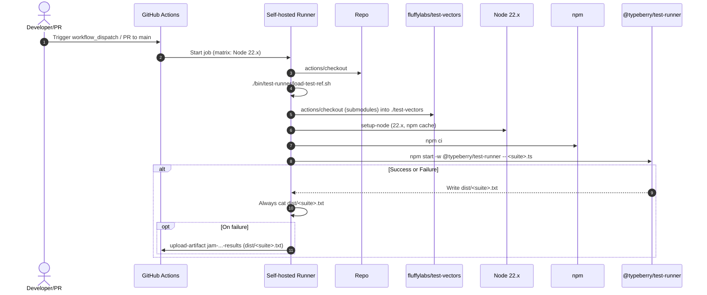
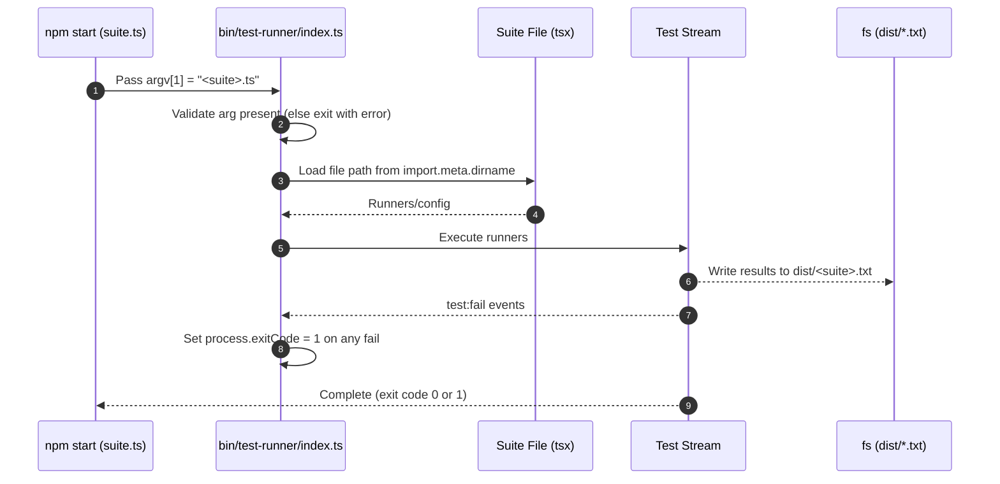

# CI: Run 0.6.7 conformance tests

## Pull Request by @tomusdrw

Also:
- [x] fix 0.7.0 conformance tests
- [x] clean up the report-runner to avoid relying on env variables
- [x] change default suite to w3f-davxy 


## Comment by @coderabbitai[bot]

<!-- This is an auto-generated comment: summarize by coderabbit.ai -->
<!-- This is an auto-generated comment: skip review by coderabbit.ai -->

> [!IMPORTANT]
> ## Review skipped
> 
> Auto incremental reviews are disabled on this repository.
> 
> Please check the settings in the CodeRabbit UI or the `.coderabbit.yaml` file in this repository. To trigger a single review, invoke the `@coderabbitai review` command.
> 
> You can disable this status message by setting the `reviews.review_status` to `false` in the CodeRabbit configuration file.

<!-- end of auto-generated comment: skip review by coderabbit.ai -->
<!-- walkthrough_start -->

<details>
<summary>📝 Walkthrough</summary>

<!-- This is an auto-generated comment: release notes by coderabbit.ai -->

## Summary by CodeRabbit

- New Features
  - Added automated conformance runs for JAM 0.6.7 and expanded 0.7.0 coverage.
  - CI now executes specific test vectors with downloadable result artifacts.

- Tests
  - Updated expected state roots for multiple versions to match latest specifications.
  - Introduced suite-specific test data variants for improved accuracy.

- Chores
  - Standardized result filenames and artifact names; removed preview vector references.
  - Simplified test runner invocation with explicit suite selection.
  - Removed deprecated suite options from configuration to reduce ambiguity.

<!-- end of auto-generated comment: release notes by coderabbit.ai -->
## Walkthrough
Introduces a new JAM conformance 0.6.7 workflow and updates multiple vector workflows to pass explicit suite filenames and remove TEST_SUITE envs. The test runner is refactored to require a CLI suite file, adjusts output naming, and sets exit codes on failures. Test data and expected roots are updated; compatibility defaults change.

## Changes
| Cohort / File(s) | Summary |
| --- | --- |
| **CI workflows: vectors**<br>`.github/workflows/vectors-jam-conformance-067.yml`, `.github/workflows/vectors-jam-conformance-070.yml`, `.github/workflows/vectors-jamduna-065.yml`, `.github/workflows/vectors-jamduna-067.yml`, `.github/workflows/vectors-javajam.yml`, `.github/workflows/vectors-w3f-davxy-066.yml`, `.github/workflows/vectors-w3f-davxy-067.yml`, `.github/workflows/vectors-w3f-davxy-070.yml`, `.github/workflows/vectors-w3f.yml` | Add new 0.6.7 conformance workflow; remove TEST_SUITE env; pass explicit suite files to test-runner; update result filenames and artifact names; minor whitespace trim. |
| **Test runner core**<br>`bin/test-runner/index.ts` | Switch from env-based suite selection to required CLI filename; remove suites map and GP version gating; adjust output filename (drop .ts); set process.exitCode on test failures. |
| **Test runner entrypoints**<br>`bin/test-runner/jam-conformance-067.ts`, `bin/test-runner/jam-conformance-070.ts` | Add new 0.6.7 entrypoint with fixed traces path and ignore list; adjust 0.7.0 entrypoint path to .../traces and switch from accepted to ignored list with two entries. |
| **Runner package metadata**<br>`bin/test-runner/package.json` | Update scripts to use non-preview vector files; add jam-conformance:0.6.7 script; keep GP_VERSION values. |
| **Compatibility utilities**<br>`packages/core/utils/compatibility.ts` | Remove TestSuite.W3F and TestSuite.JAVAJAM; set DEFAULT_SUITE to W3F_DAVXY. |
| **JAM state tests: expected roots**<br>`packages/jam/state-merkleization/state-entries.test.ts` | Update expected root hashes for >=0.7.0, =0.6.7, and older versions. |
| **JAM state tests: fixtures**<br>`packages/jam/state/test.utils.ts` | Update TEST_STATE_ROOT values per GP version; add TestSuite import; introduce suite-conditional test data string variant for W3F_DAVXY vs others. |

## Sequence Diagram(s)




## Estimated code review effort
🎯 3 (Moderate) | ⏱️ ~25 minutes

## Poem
> I twitched my ears at version signs,  
> Swapped suites for files and tidy lines.  
> Roots reshuffled, hashes new—  
> Trails of traces, neatly hewn.  
> If tests should fail, we mark the trail,  
> A carrot-shaped artifact will never fail. 🥕

</details>

<!-- walkthrough_end -->
<!-- internal state start -->


<!-- DwQgtGAEAqAWCWBnSTIEMB26CuAXA9mAOYCmGJATmriQCaQDG+Ats2bgFyQAOFk+AIwBWJBrngA3EsgEBPRvlqU0AgfFwA6NPEgQAfACgjoCEYDEZyAAUASpETZWaCrI5Ho6gDYkuAYQCSXDbYWAAMGgBsGgDsChgAZvgUzJgMJJA0iLjIkAYAco4ClFwArAAcAJyQuQCqNgAyXLC4uNyIHAD0HUTqsNgCGkzMHQBintjx8bL1KogduLLcJEUULh3c2J6eHeVVtYjFGSzYiLQUAO7VBgDK+NgUaZACVBgMsFy4tGBMCUkpryQwKEIrFctBnKRcE8Xm8uCl4FhctdcNQTlx8EtEQZfBQSNQ6OhOJAAEyhYklIEVIFlaAARlCHBKABZGaEAFpGAAi0gYFHg3HE+AwXBq3Fo+MgASOkAoIUg4SisR+iWSqXSmWyGkgAEFaLR1PAhWhPIxYJhSMhPEgaLQ3FARvAAB7ymIaUJxFX/R4axAaAxQXzeTCQbDcDKwdK47hJXBgWUYch8AjoCT4eD0XGeWQIoj8LBkCTwChCtgYKESZzwFTeX3+yVmjCkSBKeJoTZQhzqdX4SDnADM8TA4okjtkfv9YEMBhMUDI9Hw8RwBGIZGUNoUrHYXF4/GEonEUhk8iYSioqnUWh0+mn4CgcFQqGDbeXpET+PoQ1LRKolwcThcTzHooyjnpo2i6JORg3qYBgaD0uB9AIHTnEkADW8SePg5xzFIYhJIgYBCGgzDfEKnpqkCIIaLIzCeG4ABEjEGBYOr+Cub7rn+KQAQuprmtIRi6rQyBoJA5CXAA4uoAAS/Q6mIhoYMgKEUOhmGXNQkBwb0/TIWhGFYTh+74YRxGkb8qoApR0TUbRYnEQS9HDqOkBEcwHp/GqkC4QQFDIAqMT0VqcDpCpalYTKITIEKvb6epAD6+qINw1BvOgGD0BsWwyiQACO2DSNk0rwhgAA0va9JABZFiW7DeZW1bSDAACi1zQPFABqzW+NAADyNjXPFNjNSM6X0BJVidc1A3+L1eSQAAFAF0QAJRav4UItgiTWiYgObeK5gjhppJCOqIeBNTFu0kJ4g6wPgWQEvGiYVQh6CQHkwEaEIyDEsSGjOikuB8o6wURvYNBtG4da+BGDCoXcUIIZGJDRntvmyHWwRYLtvL8kjPaYWg9DIxkhU5fElBkGkMNwwjeCQAAUtqACyZNZN5xl+ZA8TFu5GETFMnizPMhVgD5+EoGWPYaKLWTi1zyAnDm4bpETSgZiQi6YPQZDVirDgCMwiibAJUDXCQuChh9X0/TzSSq/YSwMPA8TwASUh+Ypr2wGJ3DuQwaBvDmdb+EpKLZUomJKK87vIIWokYP7jDwHWzVnQwF2O8qnkAuzRJJ+5WTOFCYCXAAAgsSwrGsGpxiEL0QK5Zk55ZaTWRo2R1tqnjnGgsjIEl3DC/IuIOJ4RVyIw1DiI2zbWh0bnmeRVnAjZuCOrgda9VgrbwOMuLlaG6vz1ki8t2Ruft2vneb+gIk4xQ4itmI9lsPQS+t16gJr3G0jtogdw4MwoGUuCcHaYlgIKy9jFIGIN+CLgANp/QBgAXXKmQBwY97D9GNrQU2IlcQ80tm8AkKp86czwn5cqOseBj0oIeHK48irkL3t4DMUVxzmEsD3GgVBBRKWlKTJQDBhb8MUtFRcp1oxPwJA7DYAgrQMCqmWA0Ak6yfSqo6GRNp1j9CUc2UQYjqASN7FTSAeDXbu1oOOZqWR4BAwJCeFGhYSCXC1iqIkLM6DwEcAYRi9EjAQDAEYbSCFdIgPUkZKhBFP6Xzbj/aI4QaJ0X8UxFi2o2KvjXASLizh5C8TePxQBWMSDGykCTcG0BWrtWuDUfw1SVGFmLBgL89U+SNR5nzR2kSIoLT7sgA4BNewDiHGgEcsgVoYKtMwBEJi56kwUQYogmEBDGgplTPOyZSYahwV2P0UBRTinXDs8mz1KBS1TIHAR0oUqIGQHEiy38gRJM7sgbZ4M67nL4AtQuEMS66ArlXZYlBa5i2+RBZuJEv4UVCK87Ia1Sn6lxGIJ6/8J6n2Hv3IR4NHkr2vvCu+bsDr9LQIPBe/ZBzOVkC80IYBeAkFcecW+uBEWHLFO+R2x98DEwJMDTAiAg43MwrmZMeKr6JPCBvKEtDcQYAcpU9IJdXZCulOKhJtK/7MNrFBDJE81ymI+ekERxiBGSK0TouRfAlnwGUewNRJSoAdQaoolG5S6BcAAAbVLavFOpDTmqeqlpAT1YTEJ6VUqA6JvlYkXyebC15KSg0LQZYWO4iAsyGLduQegCJHYFieJheG98Q0+tqfU6pXBKVjImZ6xFBg7HiEcR+YCOUmVVUmDGLg3j9R+ICUEmCYaIlxUMh0CWflTLMHwfKyiJRbKpP7RkrJq5+G5McNxApi4imNnUbDfiiqoXTtEr0y4CIrkmJismeM71kqiCsco3Z47ALoD1CrUmEJHB1Sbm5I9s63k4vVOChuFzPw6y1NcZ297jRZnKqTR6YZt2kHoLzFgfsi4oifoCyAldFggtWLIOWsYIXJj+cXTDZdsPAprgRr5wG+DfuIr+4Ec7NQ6myvgZGfB4PIF+cnF25Uh4jyYQAo+w8eWa21StHKJUQyvAbEhmhGVHaIw2FCYlbrtCCJ/SENAf7pU0KtEQDAKtziVR2RCS2HsuY833iQLhzEeH6vEUKd5PZhFGOcBewRvFpExitTwfRtqVHiHEOoqAmjfOyNoHoxRQX7ULEMaIzzZqzFEMsW7Ogtj7HNoUEoNt7t3Gdqft2nxfamIThCbBeC4aT3RpMtpmdN8UkMXSTw5dHE13/k3XxHdJSQpof+Zhs9+Brne3IaTHD1dQU0aAwmC5eah1IVq2OxWk6mNURSZA09rxxhKAfugCgRBP1lmlNe3akG3YPvJup8qDXdM32yOVRDKsUPuXoqRjDpcgW4eo4R+uc2KD0WlO95OZGvuUZ+9Nv7EKGNTp0x3bIQUYDgzHlCXipMT3Sc00rOT+77N6r4V51zjsTXJdMT57Rfn5zWsC3a1RoXHU2x6xaaUkXdE2rpyF+QpPnNKSy02zlzj8tuI7Z4krvbmBpMCRV0J1Xh2RqiStmJpkKxuXnS1wJS72I5PoHkniW75NhcgDYMp+AKn5owM02qJ2KwdNdS1X1/rK3N1V8RLpqGMcjvcZbwtI3ULBsWxG8K2ElcxpV2gNXKSDmQCOZy05HMIXDdG5ensdyRJOzvZdmz3guAfYBRRybeGwXyxh1AIirvmD/oWlGYWLsFng1TYaE4A2wdYcL792jAP63cLY4TlLRrEumvJ1IynUX+A09i5zh1QTIASVWes23VZ7e4ndbaUtNS/UVsDcG0Nculte7qxO8vEfiLzuTQWxRfuVpGEbQ4wXrbcTto8V2yAPbfGS/7TLqrOl98K9HeOgiatalSiKIZrKXBzVibXVdXXddfJBBZnI3E3VfJpGqVpOqRfTpMtTfANd3dyT3P/b3CQAPPfIPKNUPEyIA8ZUcEA+daPWPE5T5M5OjS5EbLzW5Mld5cGW9F2LPJ9dTZ9YmfUOeJuSgiZGgoqAfPPTDUDJTcbRgkvOjfHRzPvQ1NzcGHnIneAtnfzDnYLafOsZ1O3A6FfM3D1dfR3LfINPNXfH/UgxXAAsuUZYA4EUA2ic/H3S/eGa/BtbLe/PLR/ArUXF/N/MraXYJWXWw5bBw0Q6gprWiDXCAzJKAzlPXbrRDdRJA0wg9LAp3ZqFAlpNpDA+3V7HpL3RTegUMY5PleQqERPS3Vgm5ZMU6c6GgG9fadIJ9KeNPEzJwqgmlB7ESfbD9L8LUTReIEIBSI0E0dIgDSAdWMAL5LWewPGAUFg5PLAIoWQIUSpJAcqc4BANKFfbHewMpTAcQQOLYeQODByccKATI83aqAo9Al1HPB3ctANKtXoiZXArSEgqI1bGI/ojbWiOsegvlWbF6JPLzXPUHT7NvKjKHTvRuKAQEhHHjAZFvOEgvBE/DaHOjbwnvXhA1FzWYjQlLCnS1anALSfPQhnGfZqS3VAwol441DzXnaTLIr1HIrfT4qlPoqwrAQPf45XVEuIzwGGFgf4XXeAIzVEIhSo98L1KQ8HdvREiEygINQAJMIQ1lT4TIdcSkSLkRCvjYiqJsgBTfjIiD9yCJ1RTgTxSfCBd1whcAiRdn9itX9SsP9ytwjv9wlf9g9D9ACTT+jE14jwCtdsloCcEut4D0jGd7iCRdDHjrdywWS3jsDGkSj8Dg8mlFoMStoc0S1uSPiRk+SJk2UYA+RNwSYqB94TMEBMgUpHg81SZ6hxMKFcRFx4No8w5UxUJqjAME9mDTM3pgxpElF1AKE+DbMYT0N89vspsDT1T6MUSQzaU3k6COV1wx4AFMUhMUo3oSikpcBkJ1y4U6VG83EWVpQTyzzyzYjCVNBQTtyCRuViYwBlUX4oRDzfZjyKVzykl6VXTmVpVbyAKHzQypVN4lDe9iTBEB8yTh8LUqdx9qSDF4s456TGSnibd0yTCKkuSN9ciLT+CbD/S7D/8ATALkk3DFpG901M1CyCRWzwYL8i1/cyVzD3jndAS60b9fDnSH9GVAj3SvEvTwCv8hTrToiBx1cIy2tkjOJYD9cECEzTdzdSZtDotkycLUz2kl8DoSyszuktKPCOLiCrSCCgzHD4h518yyUuBjLmpeTKywSD1DS+AoSbkp5BCVZxztFJykYLM1NbMDsjs2lJDYSAUZC18SjdTsT9Ti8iNmCSNoryNFyi8ZsFCAdIVKVNyoJEinNNDEK2TNCKTUL5FadaSsK049K0C8KjC3VOTuLMzt8SjPUCwLTyKasZLqK7Kk16KAjGLuctZtp6AuLvViKeSyy61+c78hL/CRK3SitxKJdJLfS1AMA8SAcOgEQlBQZsgEjIyV0UiVK0jDd1KsU0hdZ6qvwwA1kDgYCuwTjvBJicYlNmB2x4AwBOxWiiB5lcxRzfZdp2icp8oiwCRfB6h/Bwrjs1MHY4NsAXr1N5U2AABuDkzSrg5GzICxNAMMWhJYCgX63G9ICaKaGaOaeqK0Y5b2BaZmFmTkGoPIbUcqAAdT7BGHik5G1A6gAA0ABNSssOYGE2G6vZGgaAfAbGH40mN2PyKEaG2G4YuqFNYsNIe5LQQ7CQRBWkVBFaTGwQgkAK4eW1Kc0FB2fYsgR2VWk7VAWZe5HMaPPdHdEmJg3K5ME+JGlGsKro6gP80y8GO2qEBadTdoSARBT1AAEgAG8HEdENA2AUQNBkU0aSAABfDoOOv6kgaW7GDOz1VBKWR6YmeAmO2OjQKurOnOsm/OkIDOt5Oa7uPUAkU6dQMAIUMANhe4dIBsWgK0RsLgLIXEU/IUBaeiDUDgNheicqBaKTAAXj0EgFjroRG2kF9HbtwF8FbQXsgFpExozsrN1CEBOHXBPP4DwFU2zz1jYFvOLDDFJn/VOhoCUnpviF9F5DxBoHZr5BoGRFHuYAWgrpPM5CLBrtjtzvrowA0BryDhIAnreVnsgEYhWkbulTrUrMTNzWYB0XgN0LwHrIZ0Wk5BGm1BqHqB4uanKgkm4A6koD2iFHKmgEKmuDJqk1oWgxymFnXF0JFVtWj2uFHNIWeqlplrlGTFEh+CyExpugcTmV4b5AdhbDbAnhVn4YfTNChHAVuqtwarTKaofnoBSG4G4BzB1UJOKv7zUNZKS153NW0rQt0pC1qvCx7HjOlD2llKtmwQqqixiwwvpzjnmpyxdOWsKzF09PWs/02oRB2sTHPmhXiWeQGOOsUqjLOtjMKUusEj1HT3EhgFw2uBWKhHYBcGjARA7BKcJCeDic8sSeXglTRNOzlFEnVW/h5mwAAC8umFjyZc6wZ0h+CE6YxLR8AiBSA+BaEZMSjZZPwhRvojHIoAdkBZn7yOhvlfQfpYMIwsALjPBkAZNgbHZNnypeB177k4avxEByj3o3Yzpaz4HkBfyPgxYACGmYUAQOhxiem/4dE5hlp5gqBNb1ofzixCw9t0oUAjMkgCQrQOZeJuD70MhgX0hGZrhqbw7PHUJ+RFpaQShgs+RpByoERRFsAhDcxsk9otnEArpPrvrh51RUW5gAAqDoUIDlzl/m/mxZmKcOtaSAHeHBBgTWm5lAKEEVTglGZhbyKsOY8ZyZjQEVTGmKS2igEliV8ZqVqqVYB2BOeViZygDQNVsaLRdQZSSqIXMAWkMGVAQqfWRACMdPKMYsfBF2e3XZa9ZUGU+4NguQ9IZaTpnpnKf52Cok+x0ksq8kkfSkpx6qzCo3T6cgSAQAFAJwxUB9RJg8xM1BD8mRd+DaFaB8AmoMAOMLFFBXZ5AvH5UfHLoY3KqJ9AmXHpAQm/CXFRLVrxd38NqYItr4nKAPnkmE0pV2gFLICMnlKsmDdikZ9+t2mvJPXmDvLvYPGdlmWeAA65a3nFZB340vmfnemoxRn2XXR3Rtlt2Yld38USBvnunD3UZj3wgbJQggWnnBn+ABRyc9xX5EBhGnWfig40gBQzDEFJ7mX6Ji7kwZTS3cQ19QP+VNaOhaRogSgkkKhiQyhiRaR2XOXQh8WogfohRkGwOnmkOUOkkIhiR0PogcPcOKgbXCOMAIPbXDnTDVnulj1Gy5GOYigzQ00kwexRJFEg5UJ4W0dFxcAUIM8eCgsEOhnbNEBMbSZUd4DSZ9mscERtXBU2Aw2rHVCSco3kLHGqqaSE3Gck2SABKnSnFhKn9O2onu2Yne26mVz1gRO0BSBeXhQx2kiJ3OsN04ycnSlrq+UpPEBqmym457Y+Bno31CpicKmTsSMu6rzLhH1rNw63Bqg1zIKOAn23QttlnlIaL/1NOaAy7eJRSgLUuq8Kauoqb5ojjNOXRn3gLwnEVsuoVGmEk8vT3Cv4wHk41r2Nyioyu8R5xFx53V5quQLavJp6vrhZpGvTjmv8vLyQLj7W6JqxIRdwu+QBQuApu0hevFQ9iDjfYBuuvPnr4zSLW3o6vppFu5oF7lpo9epPYuGPF9xXn5YZzjCtZNlNbUsUZ07kNuk2v20MCyxidS2MAIfAiofHtTXE4RdA3rv0g9v8ZewuLKnXXsAbrdOVCSTSq7Hyr62x8TOm39DzZqnja18jufBA280+36nmzUIPO7NGODBOud6nAMouAHuGuXvIgYgMzciF7ASMhEBnRZYGe0SZ9in9uOxoO5T0gFSbReSa1Rxevn3g0WfXO2eOevPufdBIAAAhLWWFgX+bx7pb4X1r1LsXrfCXkMqXmX+8rXqC+H68ruTr7UeIPhLgWfG3oXtb73y4Zyl3yCt3rSD35w+FRnRXrH6t1XkMV8+nobiVHXgr5nlznKhJw3zzrnzri3lUHwYPymp7vIe3t0cPp3gNKPz3mP2XzPjVC88Pt5E3qAf3wP6oQXqvmv9b8J+v6pRv6lZvq9ppi8zvjRDjcvh0f7ymOVIH5AkojvoqRHmHlL2bjfhqaH6Lp4DjX2QE7P90WhBn0/1txa9tlayJkI70sImCQv6QDoJgXEDoQhg51/lgQ8+ANQK0BYG8jSbjtTqk7ALtkxnalJkCknVPPGwwCOALEZSFYOx1QwsMsgbDLsFwE5qjQ969ESlEDloTMwOo2oRmpAFwHH43ISOXIOyiqIHpHGpDEYOQ0oZtU4gxcE7CUTQG4AMBNADQNgOlCcDuBdmbATzT5pC0tQ1AwVpxnQpBZtQVgWGlghfhNQmuWACYobhsSFUCc8FYnO5lJ7RsUKFPRtnFiCZG4GSCAisOMGaqEUQ0fA3AfgItKOMyACA71KwzJrdVn+cwN/je0/4eCf+Jif/uoDHDmk6qZg40AVCxpmFPURAkgazDIEoMKBxEeiPYNHzrhHB7kZwegNcE753B3/d/t4O/64M/BRDQIYgE9QSlw4ZxGmmEPSJr5OqyQ1gVCAYFMCqGQadXmQm6TpCuBZNXgVzSDTJgOhgg7odzV5oC1Babg9zhaByFeDxAX/IYL/38GACghjpBajZyWp2c7+ElJzpVmyFuQOgxcGgGADYCqRvA8ALpl5l2Eoh9hkXFthqCAE+d2sOuGMuAOna9YgEQ5Upton3CaFyExYMtmaEdZNRzg5iVochkRqwBcQHRBht7GeCpB/2rFdIMiAlAWwOkVoU4Y0UKjQx7QDsCaJzBgRYA9Ae9DqKEHijRB4oDIC1PuDoA2B8AZbaoT8VCCOh4gJQAcNEDKC0AmQEQNAMSD7AVBWw0QAQPEEw5lBygcKEoLSCDgod4gtABgLQAiChAKgEQEgOSAqAVBA4HiPsHiDlFoASAsotACh3o7EhpQ9IhgPED7B9g9Q8QAQHKLKDRAMOzIiILSHZElBiQtAaIMsCZC0A+wJQOUSQBKBaxaAFQPsOyI5FMgBAGHFQEyDKARASgIrfUWgAiAKibWdYEYFiKsA4jGGWAQkfFAiDEiuA0iCkbQCpE0i1BdIx0AwCFG0geRAgPsBEAYACAax8QCIEyCbECBogDAWkKGNUBMgKgaAFUYyLKACAAxFQTDmgCZB9haQxIaIDKNdHxAUOxokgNECZANiSAywWIMmHpFxjPRo4pkLSA9EMAuRxIJkCUAVEMBoxeoRcbQDKDui0A8QJkAuJdGhAyg6ogQAwHdEkBaQZQUINWPVFRiaxCoyjrqNCBMho8yYvgPgE8Cng0xEiXMR8NRQFjqRUIWkSUXpF/QfRywC0VyL7AviKgF400dePpDRAtRlQXCaGKo7Pi3R2EgQDuOJCyimQKgUMW+NJDPi+wZQWkMsFEhrjHQlo2cdhMA4RBaAN40ICOKDjviKgdY1DuqO7GhAPRJQeIBOKbG6iSgok2kGkCkmijORNotZFWKKBoAZJ44frCp3Rw1EDWQWZQTjmqHD1KAVYFESQDDjeJjYLgGhKYyzBglyoKKFzMDHx5IwuCFwkgLcw4KUAvJkYeCZAD+G+w8o2AY0Nq2BHkjYJhY58rqmUJaDI2ugozskJ0JwDm2JSW/KE1s4dt1h0TH0k/3GEv8dhewm9jcO8G3DF06TUAf5zgIQCXhLdDWO9AKYENphAQ+wDRAEBgSQwgqUgE5RcEvVUApbU9Lg1QolFVSuJbwYtBGaYZB66QF+nOD5Q9hSWu2dIAIPYZblaBYvaANqGqRDReovUaAJUKag6Nn0PoLLqb38CLhaG9DXEZAHxGQBMxJIskTkV2n7SbAh046R4yQkMjaALYkgHhz7BV0NAM4iIAKLKCGjHQI4j8WUDKCZYq6h4j8YpL9Cddrps+OhpCJigL0CRRI7MdECcrEV3pzUA6UdLUoliyxdY1ia6JBncjZJAgKGWKIIkVASAfYcIFXRNHEg7MXfSAM1AObl83pe0kmZ9LJk/Tuk9I+GZOOUkBiQZN4l0VUA4lFAyg0o0STZCrpxiexvZMsHjwlobSuwD1MlASGhFyYXsDsdieTGOS7RgYOYS6VADDiOwFaHMdLlQkJbyAFopMTCHPCZBHl3Y4E2TBBNJgIgDQ6yNyRQGEhTJHYI9FWAxROCZozQYc0iM1OGkRQDgb1dcPqykbbEDQUxS6WjMXC885hRQjQEgEEELQ9ZPA4QcMKFpSZUAHk3yb1Ix7Wy542oVGdUFN69ROMpmA4EfAOAQw+Qc8M3q3LvAIARI2AIgNc0di7JLZPsG9GTV+oXYgsiPPYr0ERjoAnMBse4MWBCAUs+5nk3uuOF3AHAKAFYV1NFAwBZhMapbcmcmF0KyD5B9wRQU8BIBbElM76Lbr1I57wFy56QVshbOoCiQJ2ikQnklJJ5D4SSfjdcJTyMGZSZ8/gMaZhjp4DSMhKNbpJNLWDTS802w4iOcPxCEYNAlUruEsJymrC8pwRDYYVKnAzgVEE3JcIQD84tpNwZYLgD+EeFwEp4ziM8GoDAhXhIIVCz8OoHijphEA8UECnQHiit5rw0EWcK6JkndiXR347CcSGlE7jfRYo5ibWJKDMgQQ2omsdEEDEGjJFfCyUgIqEUiLwmYiucBBD0BAA=== -->

<!-- internal state end -->
<!-- tips_start -->

---


<sub>Comment `@coderabbitai help` to get the list of available commands and usage tips.</sub>

<!-- tips_end -->


## Comment by @github-actions[bot]


<details>
<summary>View all</summary>

| File | Benchmark | Ops |  |
|------|-----------|-----|--|
| [bytes/hex-from.ts[0]](../blob/4a8eaa584ac02050c6eea3f9bbe5c95d883238ea//_work/typeberry-runner-4/typeberry/typeberry/benchmarks/bytes/hex-from.ts) | parse hex using `Number` with NaN checking | 112970.88 ±1.28% | 85.24% slower |
| [bytes/hex-from.ts[1]](../blob/4a8eaa584ac02050c6eea3f9bbe5c95d883238ea//_work/typeberry-runner-4/typeberry/typeberry/benchmarks/bytes/hex-from.ts) | parse hex from char codes | 765147.93 ±1.9% | fastest ✅ |
| [bytes/hex-from.ts[2]](../blob/4a8eaa584ac02050c6eea3f9bbe5c95d883238ea//_work/typeberry-runner-4/typeberry/typeberry/benchmarks/bytes/hex-from.ts) | parse hex from string nibbles | 494245.81 ±0.87% | 35.41% slower |
| [bytes/hex-to.ts[0]](../blob/4a8eaa584ac02050c6eea3f9bbe5c95d883238ea//_work/typeberry-runner-4/typeberry/typeberry/benchmarks/bytes/hex-to.ts) | number toString + padding | 261205.99 ±2.91% | fastest ✅ |
| [bytes/hex-to.ts[1]](../blob/4a8eaa584ac02050c6eea3f9bbe5c95d883238ea//_work/typeberry-runner-4/typeberry/typeberry/benchmarks/bytes/hex-to.ts) | manual | 13759.11 ±1.75% | 94.73% slower |
| [codec/bigint.compare.ts[0]](../blob/4a8eaa584ac02050c6eea3f9bbe5c95d883238ea//_work/typeberry-runner-4/typeberry/typeberry/benchmarks/codec/bigint.compare.ts) | compare custom | 170900835.23 ±10.4% | 26.65% slower |
| [codec/bigint.compare.ts[1]](../blob/4a8eaa584ac02050c6eea3f9bbe5c95d883238ea//_work/typeberry-runner-4/typeberry/typeberry/benchmarks/codec/bigint.compare.ts) | compare bigint | 232982375.74 ±6.31% | fastest ✅ |
| [codec/bigint.decode.ts[0]](../blob/4a8eaa584ac02050c6eea3f9bbe5c95d883238ea//_work/typeberry-runner-4/typeberry/typeberry/benchmarks/codec/bigint.decode.ts) | decode custom | 156649962.24 ±2.7% | fastest ✅ |
| [codec/bigint.decode.ts[1]](../blob/4a8eaa584ac02050c6eea3f9bbe5c95d883238ea//_work/typeberry-runner-4/typeberry/typeberry/benchmarks/codec/bigint.decode.ts) | decode bigint | 85300357.05 ±3.35% | 45.55% slower |
| [collections/map-set.ts[0]](../blob/4a8eaa584ac02050c6eea3f9bbe5c95d883238ea//_work/typeberry-runner-4/typeberry/typeberry/benchmarks/collections/map-set.ts) | 2 gets + conditional set | 108368.95 ±1.06% | fastest ✅ |
| [collections/map-set.ts[1]](../blob/4a8eaa584ac02050c6eea3f9bbe5c95d883238ea//_work/typeberry-runner-4/typeberry/typeberry/benchmarks/collections/map-set.ts) | 1 get 1 set | 55087.93 ±1.39% | 49.17% slower |
| [hash/index.ts[0]](../blob/4a8eaa584ac02050c6eea3f9bbe5c95d883238ea//_work/typeberry-runner-4/typeberry/typeberry/benchmarks/hash/index.ts) | hash with numeric representation | 159.62 ±1.04% | 27.98% slower |
| [hash/index.ts[1]](../blob/4a8eaa584ac02050c6eea3f9bbe5c95d883238ea//_work/typeberry-runner-4/typeberry/typeberry/benchmarks/hash/index.ts) | hash with string representation | 88.28 ±0.78% | 60.17% slower |
| [hash/index.ts[2]](../blob/4a8eaa584ac02050c6eea3f9bbe5c95d883238ea//_work/typeberry-runner-4/typeberry/typeberry/benchmarks/hash/index.ts) | hash with symbol representation | 147.66 ±0.68% | 33.38% slower |
| [hash/index.ts[3]](../blob/4a8eaa584ac02050c6eea3f9bbe5c95d883238ea//_work/typeberry-runner-4/typeberry/typeberry/benchmarks/hash/index.ts) | hash with uint8 representation | 137.15 ±1.21% | 38.12% slower |
| [hash/index.ts[4]](../blob/4a8eaa584ac02050c6eea3f9bbe5c95d883238ea//_work/typeberry-runner-4/typeberry/typeberry/benchmarks/hash/index.ts) | hash with packed representation | 221.63 ±1.22% | fastest ✅ |
| [hash/index.ts[5]](../blob/4a8eaa584ac02050c6eea3f9bbe5c95d883238ea//_work/typeberry-runner-4/typeberry/typeberry/benchmarks/hash/index.ts) | hash with bigint representation | 170.32 ±1.27% | 23.15% slower |
| [hash/index.ts[6]](../blob/4a8eaa584ac02050c6eea3f9bbe5c95d883238ea//_work/typeberry-runner-4/typeberry/typeberry/benchmarks/hash/index.ts) | hash with uint32 representation | 174.27 ±1.6% | 21.37% slower |
| [math/add_one_overflow.ts[0]](../blob/4a8eaa584ac02050c6eea3f9bbe5c95d883238ea//_work/typeberry-runner-4/typeberry/typeberry/benchmarks/math/add_one_overflow.ts) | add and take modulus | 243454383.3 ±5.49% | fastest ✅ |
| [math/add_one_overflow.ts[1]](../blob/4a8eaa584ac02050c6eea3f9bbe5c95d883238ea//_work/typeberry-runner-4/typeberry/typeberry/benchmarks/math/add_one_overflow.ts) | condition before calculation | 234075934.38 ±6.1% | 3.85% slower |
| [math/count-bits-u32.ts[0]](../blob/4a8eaa584ac02050c6eea3f9bbe5c95d883238ea//_work/typeberry-runner-4/typeberry/typeberry/benchmarks/math/count-bits-u32.ts) | standard method | 78321486.52 ±2.56% | 64.05% slower |
| [math/count-bits-u32.ts[1]](../blob/4a8eaa584ac02050c6eea3f9bbe5c95d883238ea//_work/typeberry-runner-4/typeberry/typeberry/benchmarks/math/count-bits-u32.ts) | magic | 217877125.23 ±6.4% | fastest ✅ |
| [math/count-bits-u64.ts[0]](../blob/4a8eaa584ac02050c6eea3f9bbe5c95d883238ea//_work/typeberry-runner-4/typeberry/typeberry/benchmarks/math/count-bits-u64.ts) | standard method | 8768183.02 ±1.5% | 88.01% slower |
| [math/count-bits-u64.ts[1]](../blob/4a8eaa584ac02050c6eea3f9bbe5c95d883238ea//_work/typeberry-runner-4/typeberry/typeberry/benchmarks/math/count-bits-u64.ts) | magic | 73146268.49 ±2.72% | fastest ✅ |
| [math/mul_overflow.ts[0]](../blob/4a8eaa584ac02050c6eea3f9bbe5c95d883238ea//_work/typeberry-runner-4/typeberry/typeberry/benchmarks/math/mul_overflow.ts) | multiply and bring back to u32 | 222154305.99 ±6.76% | 1.5% slower |
| [math/mul_overflow.ts[1]](../blob/4a8eaa584ac02050c6eea3f9bbe5c95d883238ea//_work/typeberry-runner-4/typeberry/typeberry/benchmarks/math/mul_overflow.ts) | multiply and take modulus | 225548135.67 ±7.36% | fastest ✅ |
| [math/switch.ts[0]](../blob/4a8eaa584ac02050c6eea3f9bbe5c95d883238ea//_work/typeberry-runner-4/typeberry/typeberry/benchmarks/math/switch.ts) | switch | 211029401.81 ±7.46% | 5.06% slower |
| [math/switch.ts[1]](../blob/4a8eaa584ac02050c6eea3f9bbe5c95d883238ea//_work/typeberry-runner-4/typeberry/typeberry/benchmarks/math/switch.ts) | if | 222281452.76 ±8.19% | fastest ✅ |
| [codec/decoding.ts[0]](../blob/4a8eaa584ac02050c6eea3f9bbe5c95d883238ea//_work/typeberry-runner-4/typeberry/typeberry/benchmarks/codec/decoding.ts) | manual decode | 21196868.76 ±1.49% | 85.74% slower |
| [codec/decoding.ts[1]](../blob/4a8eaa584ac02050c6eea3f9bbe5c95d883238ea//_work/typeberry-runner-4/typeberry/typeberry/benchmarks/codec/decoding.ts) | int32array decode | 143014498.32 ±4.21% | 3.81% slower |
| [codec/decoding.ts[2]](../blob/4a8eaa584ac02050c6eea3f9bbe5c95d883238ea//_work/typeberry-runner-4/typeberry/typeberry/benchmarks/codec/decoding.ts) | dataview decode | 148686803.91 ±4.64% | fastest ✅ |
| [codec/encoding.ts[0]](../blob/4a8eaa584ac02050c6eea3f9bbe5c95d883238ea//_work/typeberry-runner-4/typeberry/typeberry/benchmarks/codec/encoding.ts) | manual encode | 2836707.26 ±1.8% | 27.06% slower |
| [codec/encoding.ts[1]](../blob/4a8eaa584ac02050c6eea3f9bbe5c95d883238ea//_work/typeberry-runner-4/typeberry/typeberry/benchmarks/codec/encoding.ts) | int32array encode | 3330396.44 ±4.48% | 14.36% slower |
| [codec/encoding.ts[2]](../blob/4a8eaa584ac02050c6eea3f9bbe5c95d883238ea//_work/typeberry-runner-4/typeberry/typeberry/benchmarks/codec/encoding.ts) | dataview encode | 3888852.64 ±1.33% | fastest ✅ |
| [logger/index.ts[0]](../blob/4a8eaa584ac02050c6eea3f9bbe5c95d883238ea//_work/typeberry-runner-4/typeberry/typeberry/benchmarks/logger/index.ts) | console.log with string concat | 6531642.06 ±56.01% | fastest ✅ |
| [logger/index.ts[1]](../blob/4a8eaa584ac02050c6eea3f9bbe5c95d883238ea//_work/typeberry-runner-4/typeberry/typeberry/benchmarks/logger/index.ts) | console.log with args | 389687.32 ±133.61% | 94.03% slower |
| [codec/view_vs_collection.ts[0]](../blob/4a8eaa584ac02050c6eea3f9bbe5c95d883238ea//_work/typeberry-runner-4/typeberry/typeberry/benchmarks/codec/view_vs_collection.ts) | Get first element from Decoded | 18582.36 ±1.9% | 59.49% slower |
| [codec/view_vs_collection.ts[1]](../blob/4a8eaa584ac02050c6eea3f9bbe5c95d883238ea//_work/typeberry-runner-4/typeberry/typeberry/benchmarks/codec/view_vs_collection.ts) | Get first element from View | 45871.99 ±1.77% | fastest ✅ |
| [codec/view_vs_collection.ts[2]](../blob/4a8eaa584ac02050c6eea3f9bbe5c95d883238ea//_work/typeberry-runner-4/typeberry/typeberry/benchmarks/codec/view_vs_collection.ts) | Get 50th element from Decoded | 16619.17 ±2.51% | 63.77% slower |
| [codec/view_vs_collection.ts[3]](../blob/4a8eaa584ac02050c6eea3f9bbe5c95d883238ea//_work/typeberry-runner-4/typeberry/typeberry/benchmarks/codec/view_vs_collection.ts) | Get 50th element from View | 24309.31 ±1.54% | 47.01% slower |
| [codec/view_vs_collection.ts[4]](../blob/4a8eaa584ac02050c6eea3f9bbe5c95d883238ea//_work/typeberry-runner-4/typeberry/typeberry/benchmarks/codec/view_vs_collection.ts) | Get last element from Decoded | 19728.48 ±2.13% | 56.99% slower |
| [codec/view_vs_collection.ts[5]](../blob/4a8eaa584ac02050c6eea3f9bbe5c95d883238ea//_work/typeberry-runner-4/typeberry/typeberry/benchmarks/codec/view_vs_collection.ts) | Get last element from View | 19678.63 ±1.96% | 57.1% slower |
| [codec/view_vs_object.ts[0]](../blob/4a8eaa584ac02050c6eea3f9bbe5c95d883238ea//_work/typeberry-runner-4/typeberry/typeberry/benchmarks/codec/view_vs_object.ts) | Get the first field from Decoded | 332045.77 ±1.21% | 4.45% slower |
| [codec/view_vs_object.ts[1]](../blob/4a8eaa584ac02050c6eea3f9bbe5c95d883238ea//_work/typeberry-runner-4/typeberry/typeberry/benchmarks/codec/view_vs_object.ts) | Get the first field from View | 74926.71 ±1.11% | 78.44% slower |
| [codec/view_vs_object.ts[2]](../blob/4a8eaa584ac02050c6eea3f9bbe5c95d883238ea//_work/typeberry-runner-4/typeberry/typeberry/benchmarks/codec/view_vs_object.ts) | Get the first field as view from View | 76140.31 ±1.62% | 78.09% slower |
| [codec/view_vs_object.ts[3]](../blob/4a8eaa584ac02050c6eea3f9bbe5c95d883238ea//_work/typeberry-runner-4/typeberry/typeberry/benchmarks/codec/view_vs_object.ts) | Get two fields from Decoded | 292241.61 ±1.67% | 15.91% slower |
| [codec/view_vs_object.ts[4]](../blob/4a8eaa584ac02050c6eea3f9bbe5c95d883238ea//_work/typeberry-runner-4/typeberry/typeberry/benchmarks/codec/view_vs_object.ts) | Get two fields from View | 56815.3 ±1.8% | 83.65% slower |
| [codec/view_vs_object.ts[5]](../blob/4a8eaa584ac02050c6eea3f9bbe5c95d883238ea//_work/typeberry-runner-4/typeberry/typeberry/benchmarks/codec/view_vs_object.ts) | Get two fields from materialized from View | 124119.75 ±1.83% | 64.28% slower |
| [codec/view_vs_object.ts[6]](../blob/4a8eaa584ac02050c6eea3f9bbe5c95d883238ea//_work/typeberry-runner-4/typeberry/typeberry/benchmarks/codec/view_vs_object.ts) | Get two fields as views from View | 65060.51 ±2.08% | 81.28% slower |
| [codec/view_vs_object.ts[7]](../blob/4a8eaa584ac02050c6eea3f9bbe5c95d883238ea//_work/typeberry-runner-4/typeberry/typeberry/benchmarks/codec/view_vs_object.ts) | Get only third field from Decoded | 347515.11 ±1.16% | fastest ✅ |
| [codec/view_vs_object.ts[8]](../blob/4a8eaa584ac02050c6eea3f9bbe5c95d883238ea//_work/typeberry-runner-4/typeberry/typeberry/benchmarks/codec/view_vs_object.ts) | Get only third field from View | 77358.73 ±0.77% | 77.74% slower |
| [codec/view_vs_object.ts[9]](../blob/4a8eaa584ac02050c6eea3f9bbe5c95d883238ea//_work/typeberry-runner-4/typeberry/typeberry/benchmarks/codec/view_vs_object.ts) | Get only third field as view from View | 71006.61 ±1.68% | 79.57% slower |
| [bytes/compare.ts[0]](../blob/4a8eaa584ac02050c6eea3f9bbe5c95d883238ea//_work/typeberry-runner-4/typeberry/typeberry/benchmarks/bytes/compare.ts) | Comparing Uint32 bytes | 12939.08 ±3.29% | 11.68% slower |
| [bytes/compare.ts[1]](../blob/4a8eaa584ac02050c6eea3f9bbe5c95d883238ea//_work/typeberry-runner-4/typeberry/typeberry/benchmarks/bytes/compare.ts) | Comparing raw bytes | 14650.86 ±3.82% | fastest ✅ |
| [hash/blake2b.ts[0]](../blob/4a8eaa584ac02050c6eea3f9bbe5c95d883238ea//_work/typeberry-runner-4/typeberry/typeberry/benchmarks/hash/blake2b.ts) | hasher with simple allocator | 0.04 ±5.75% | fastest ✅ |
| [hash/blake2b.ts[1]](../blob/4a8eaa584ac02050c6eea3f9bbe5c95d883238ea//_work/typeberry-runner-4/typeberry/typeberry/benchmarks/hash/blake2b.ts) | hasher with page allocator | 0.039 ±4.38% | 2.5% slower |
| [collections/map_vs_sorted.ts[0]](../blob/4a8eaa584ac02050c6eea3f9bbe5c95d883238ea//_work/typeberry-runner-4/typeberry/typeberry/benchmarks/collections/map_vs_sorted.ts) | Map | 195599.36 ±0.07% | fastest ✅ |
| [collections/map_vs_sorted.ts[1]](../blob/4a8eaa584ac02050c6eea3f9bbe5c95d883238ea//_work/typeberry-runner-4/typeberry/typeberry/benchmarks/collections/map_vs_sorted.ts) | Map-array | 85555.76 ±1.09% | 56.26% slower |
| [collections/map_vs_sorted.ts[2]](../blob/4a8eaa584ac02050c6eea3f9bbe5c95d883238ea//_work/typeberry-runner-4/typeberry/typeberry/benchmarks/collections/map_vs_sorted.ts) | Array | 29338.76 ±2.37% | 85% slower |
| [collections/map_vs_sorted.ts[3]](../blob/4a8eaa584ac02050c6eea3f9bbe5c95d883238ea//_work/typeberry-runner-4/typeberry/typeberry/benchmarks/collections/map_vs_sorted.ts) | SortedArray | 139126.63 ±0.94% | 28.87% slower |
| [crypto/ed25519.ts[0]](../blob/4a8eaa584ac02050c6eea3f9bbe5c95d883238ea//_work/typeberry-runner-4/typeberry/typeberry/benchmarks/crypto/ed25519.ts) | native crypto | 3.58 ±19.69% | 86.9% slower |
| [crypto/ed25519.ts[1]](../blob/4a8eaa584ac02050c6eea3f9bbe5c95d883238ea//_work/typeberry-runner-4/typeberry/typeberry/benchmarks/crypto/ed25519.ts) | wasm lib | 9.71 ±0.51% | 64.46% slower |
| [crypto/ed25519.ts[2]](../blob/4a8eaa584ac02050c6eea3f9bbe5c95d883238ea//_work/typeberry-runner-4/typeberry/typeberry/benchmarks/crypto/ed25519.ts) | wasm lib batch | 27.32 ±1.13% | fastest ✅ |
</details>


### Benchmarks summary: 63/63 OK ✅

<!-- thollander/actions-comment-pull-request "benchmarks" -->


## Comment by @coderabbitai[bot]

_⚠️ Potential issue_

**Suite arg is read from the wrong argv index; also exclude it from node:test argv**

Under tsx, process.argv[1] is the script path. This prevents the runner from loading the requested suite and breaks the workflows. Fix by reading from argv[2] and passing the remaining args to node:test. Also normalize the output filename if a path is provided. 

```diff
-const suiteToRun = process.argv[1];
-if (suiteToRun === undefined) {
+const [suiteToRun, ...testArgv] = process.argv.slice(2);
+if (suiteToRun === undefined) {
   throw new Error("Provide 1 argument with a suite filename to run.");
 }
 
 const stream = run({
-  files: [`${import.meta.dirname}/${suiteToRun}`],
-  argv: process.argv.slice(2),
+  files: [`${import.meta.dirname}/${suiteToRun}`],
+  argv: testArgv,
   timeout: 10 * 60 * 1000,
   concurrency: true,
 }).on("test:fail", () => {
   process.exitCode = 1;
 });
 
 const reporter = new Reporter(suiteToRun);
-const fileStream = fs.createWriteStream(`${distDir}/${suiteToRun.replace(".ts", "")}.txt`);
+const fileStream = fs.createWriteStream(
+  `${distDir}/${suiteToRun.replace(/^.*[\\/]/, "").replace(/\.ts$/, "")}.txt`,
+);
```


Also applies to: 18-21, 29-31

<!-- fingerprinting:phantom:poseidon:chinchilla -->

<!-- This is an auto-generated comment by CodeRabbit -->


## Comment by @skoszuta

i suppose this can be deleted


## Comment by @tomusdrw

yup!
